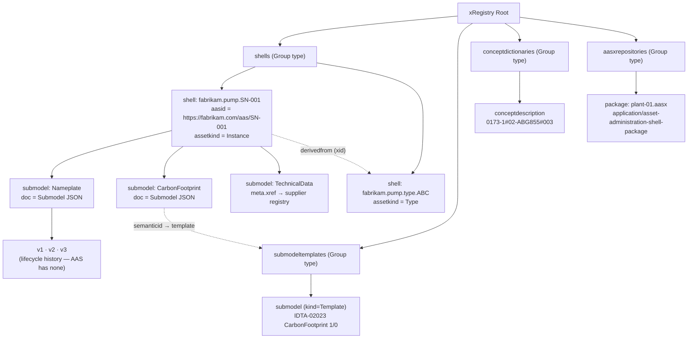
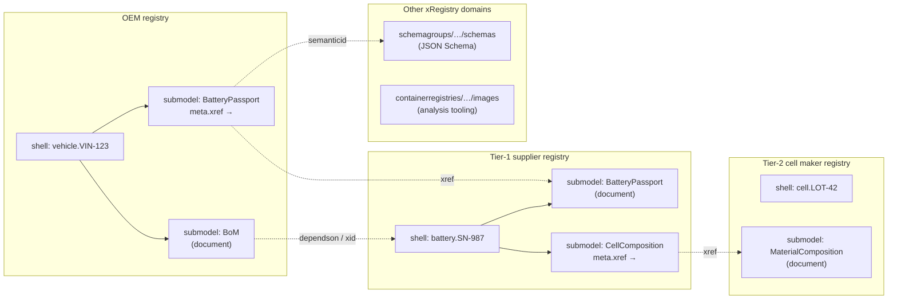
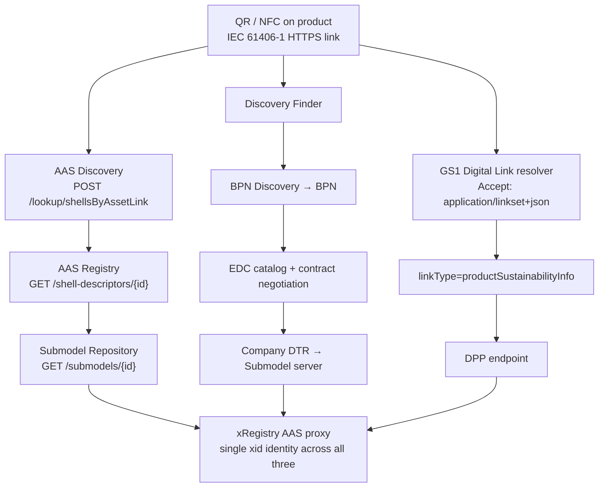

# An xRegistry Registry Model for the Asset Administration Shell

**Study 0.1.0** — a design study and its outcome.

Nothing here is normative, official, or endorsed by the OPC Foundation, the IDTA
or CEN/CENELEC. It is a working record of how the Asset Administration Shell was
mapped onto [xRegistry](https://github.com/xregistry/spec), what the primary
standards required of that mapping, and what was built as a result.

Date: 2026-08-07
Baselines: `xregistry/spec` @ `af777bc`[^1] · `xregistry/xrproxy` @ `6e37565`[^2] · `xregistry/server` @ `f2ad6f1`[^3] · AAS V3.2 (IDTA-01001/01002)[^4]

> **On the CEN/CENELEC material.** The analysis in Sections 0, 6 and 8 was made
> against the CEN/CLC/JTC 24 committee texts and an OPC Foundation working
> draft. Those documents are licensed, and several were under formal vote when
> this study was written. They are referenced here **by standard number and
> title only**, and the footnotes name the *topics* a requirement covers rather
> than restating it. No text, table or figure from any of them is reproduced.

## Outcome

This study was written to decide whether the mapping was worth doing. It was,
and it has been done. Two specifications came out of it.

**Proposed to the xRegistry project**, from
[`marcschier/spec@aas-domain-spec`](https://github.com/marcschier/spec/tree/aas-domain-spec) and
mirrored beside this study:

| Document | What it is |
|---|---|
| `xRegistry-AAS.md` | The AAS registry model — shells, submodels, concept dictionaries, federation, disclosure tiers, and a product passport profile |
| `xRegistry-AAS-Packages.md` | AASX packages as content-addressed, signable artifacts |
| `xRegistry-AAS.model.json` | The shared model definition, four group types |

**Written as an OPC UA companion specification**, beside them:

| Document | What it is |
|---|---|
| [`OPC-UA-AAS.md`](OPC-UA-AAS.md) | OPC 30270 draft 3.00-draft3 — the AAS V3 metamodel mapped losslessly onto OPC UA in its own provisional namespace, together with the same registry as an xRegistry domain extension |

Four findings in this study shaped those documents more than any other:

1. The AAS registry/repository split collapses into xRegistry's existing
   document-versus-URL distinction, so federation needed no new machinery —
   only an explicit identity rule ([Section 4](#4-federation-design)).
2. Version history is the capability the mapping *adds*, not one it translates.
   EN 18222 requires a passport to be retrievable as it stood on a date, and the
   AAS metamodel has no history at all ([Section 0](#0-what-the-primary-standards-changed)).
3. Disclosure tiering is two-thirds expressible and the remaining third is not,
   because access rights are required at data-element granularity and an
   xRegistry document is opaque bytes ([Section 6.3](#63-tiered-access--what-is-and-is-not-expressible)).
4. The identifier work pays off only once there is a second binding. Because both
   projections derive an identifier from the same source identity by the same
   construction, **the same shell has the same identifier over OPC UA and over
   HTTP** — which is what makes them two bindings of one registry rather than two
   registries that resemble each other. That could not be demonstrated until the
   OPC UA specification existed.

The OPC UA specification also surfaced a finding this study did not anticipate, recorded here
because it is counter-intuitive enough that a later reader would try to undo it. **Losslessness is
a claim about the value space, not about the bytes.** AAS types values with xsd types and carries
them as strings, but it defines no equality on those strings — no canonical form, no rule that a
lexical form must survive a round trip — and its own Part 2 ValueOnly serialization already
normalizes them by rendering values as native JSON. XML Schema, by contrast, defines identity on the
value space and designates a canonical lexical representation for every type. The specification
therefore maps each of the thirty `DataTypeDefXsd` values onto its own OPC UA DataType, carries a
value **once**, and compares round trips in the value space while emitting the canonical lexical
form. The first draft carried every value twice to defend the authored lexical form; that turned out
to be defending a property the source specification does not claim.

The sections below are the study as it stood when those decisions were made.

---

## Executive Summary

Mapping the Asset Administration Shell onto xRegistry is **feasible, unclaimed, and structurally well-matched** — but it hinges on one problem that must be solved first, and that problem already has a solution in this repository.

1. **There is zero prior art.** No one has mapped AAS to xRegistry, to OCI, or to any generic artifact registry. Exhaustive search across `xregistry/*`, `admin-shell-io`, `eclipse-basyx`, `FraunhoferIOSB`, `eclipse-tractusx`, the CNCF xRegistry list, and GitHub full-text returned nothing.[^5] The design space is entirely open.
2. **The blocking problem is identifier grammar.** AAS `id` values are IRIs or IRDIs of up to 2048 characters containing `/` and `#`;[^6] xRegistry ids permit only RFC 3986 *unreserved* plus `:` and `@`, 1–128 characters.[^7] `https://example.com/aas/motor-001` and `0173-1#02-AAO677#002` are both illegal xRegistry ids. **PR #510 (OpenUSD) already solved exactly this problem** with a deterministic, one-way "symbolic identifier construction" plus a REQUIRED authoritative attribute holding the original.[^8] Reuse it verbatim.
3. **The AAS Registry/Repository split collapses into xRegistry's native document-vs-URL distinction.** An AAS *Descriptor* is an xRegistry Resource with a `<RESOURCE>url` or `meta.xref` and no stored bytes; an AAS *Repository* entry is the same Resource with a document. Same `xid`, same identity, different hosting — which is precisely the federation rule PR #511 (OPC UA binding) already mandates.[^9] This is the single most elegant part of the fit.
4. **xRegistry adds the capability AAS most conspicuously lacks: version history.** AAS has no version stack at all — only `administration.version`/`revision` scalars.[^10] CIRPASS-2's DPP reference architecture *requires* immutable, append-only, timestamped updates.[^11] xRegistry Versions deliver that natively. This is the strongest value proposition of the whole exercise.
5. **Tiered DPP disclosure is partly expressible, but the enforcement boundary falls *below* what xRegistry can address.** xRegistry declares authentication and authorization out of scope and defines no attribute-level visibility, tenancy or redaction.[^12] EN 18239 requires access rights to be defined and enforced at **data-element granularity**,[^59] and EN 18222 exposes exactly that through a fine-granular element API addressed by JSONPath.[^60] Since an xRegistry Resource document is opaque bytes, element-level control is inside the document and out of reach. What xRegistry *can* carry is the discovery half — which is real, and better than AAS's own descriptors provide.

A significant caveat: **EN 18222:2026, the published DPP API standard, is *not* AAS Part 2** — it is a DPP-native REST API over `/dpps`, with no shell or submodel concept anywhere in it.[^60] An AAS-shaped xRegistry proxy is therefore not automatically DPP-conformant; conformance is a separate projection.

---

## 0. What the primary standards changed

The first pass of this report inferred EN 18222 and EN 18239 from secondary sources. Reading the
committee texts corrected four things and confirmed two.

**Corrected:**

1. **Access control is binary plus roles, not three tiers.** EN 18239 defines two access schemes —
   unauthenticated read of *public* DPP data, and authenticated role-based access to *controlled*
   DPP data — rather than the public / legitimate-interest / authority triple the EU Battery
   Regulation uses.[^59] The battery tiers are a product-group instance of the general scheme, not
   the scheme itself.
2. **Access rights are element-level, not submodel-level.** EN 18239 requires access rights terms to
   be defined at data-element level and enforceable at controlled-data-element granularity by
   requesting-actor role.[^59] The earlier conclusion — that the Battery Passport's seven-submodel
   split lets tiers land tidily on Resource boundaries — is too optimistic. Tier boundaries cut
   *inside* a submodel.
3. **EN 18223 is not an AAS profile; it is its own data model.** It defines element types of its
   own — collections, single-valued and multi-valued data elements, multi-language data elements
   and references to related resources — together with more than one normative serialization.[^61]
   The "AAS Data Model to DPP Mapping" figure in the JTC 24 material is a *correspondence* diagram:
   the AAS constructs it retains — `Property`, `MultiLanguageProperty`, `SubmodelElementCollection`,
   `SubmodelElementList`, `File` — are exactly those with an EN 18223 counterpart, and everything
   struck through (`AssetAdministrationShell`, `AssetInformation`, `AssetKind`, `SpecificAssetId`,
   `ConceptDescription`, `Qualifier`, `Operation`, `Entity`, `BasicEvent`, all `Reference` element
   types) has none.
4. **The DPP API mandates temporal retrieval.** EN 18222 defines a read-by-id-and-date operation
   returning the passport as of a given timestamp.[^60] This is not an optional convenience — it is
   in the normative method table.

**Confirmed:**

1. **EN 18222 ≠ AAS Part 2**, definitively. Its resource paths are `/dpps`, it has a separate
   register operation and a fine-granular element API addressed by RFC 9535 JSONPath, it uses
   RFC 7396 merge-patch for updates, and it carries a `representation` flag selecting the compressed
   or full serialization.[^60] No shell, no submodel, no `$value`.
2. **The module-to-standard map** is exactly as first reported (M1 EN 18219, M2 EN 18220,
   M3 EN 18239, M4 EN 18223, M5 EN 18216, M6 EN 18221, M7 EN 18246, M8 EN 18222), plus a proposed
   Technical Specification for semantic dictionaries that the first pass missed.

**And one finding that strengthens the whole thesis.** EN 18222's temporal read requires serving a
passport *as it stood on a date*. AAS has no version history whatsoever.[^10] A plain AAS server
therefore cannot satisfy that operation; an xRegistry-backed one gets it from Versions plus a
`createdat` filter. Combined with EN 18239's requirement that all changes to controlled DPP data be
logged, auditable and tamper-evident over time,[^59] and CIRPASS-2's append-only requirement,[^11]
the version stack stops being a nice-to-have and becomes the load-bearing reason to do this at all.

**New prior art: OPC 30450-1.** The OPC Foundation has a working draft of a
Digital Product Passport information model that projects the EN 18223 data model
into OPC UA, with a type inventory mirroring that data model's element types and
an additional type for verifiable credentials.[^62] This matters twice over: it
is direct precedent for projecting the passport model into a foreign information
model, which is what this study proposes for xRegistry; and it intersects the
OPC UA binding of xRegistry, since a registry served over that binding and a
passport served over OPC 30450-1 would meet in the same address space.

---

## 1. Structural Fit: The Three Models Side by Side

| Concept | AAS (IDTA-01001/01002) | xRegistry (rc3) | Fit |
|---|---|---|---|
| Container | `Environment` | Registry | Direct |
| Addressable thing | `AssetAdministrationShell` (Identifiable) | Group | Good |
| Data unit | `Submodel` (Identifiable) | Resource | Good |
| Revision | *(none)* — `version`/`revision` scalars only | Version | **xRegistry adds capability** |
| Payload | Submodel JSON / AASX bytes | Document (`hasdocument: true`) | Direct |
| Type discriminator | `semanticId` (Reference) | `format` + attributes | Good |
| Pointer-only entry | `AssetAdministrationShellDescriptor` | Resource + `<RESOURCE>url` / `meta.xref` | **Direct** |
| Lookup by asset key | Discovery `/lookup/shellsByAssetLink` | `?filter=` on collection | Good |
| Cross-org link | `Entity`/`SelfManagedEntity` → `globalAssetId` | `xid` / `xref` | Good |
| Access control | Part 4 ABAC (barely implemented) | **Out of scope** | **Gap** |

### Why the containment maps cleanly

AAS `Submodel` is a top-level `Identifiable`, not owned by its shell — an AAS references submodels via `submodels: Reference[]`, and one Submodel may be referenced by several shells.[^15] xRegistry Groups do not nest and a Resource belongs to exactly one Group, which looks like a mismatch — but `meta.xref` exists precisely for this: a Resource in one Group can cross-reference a same-typed Resource elsewhere, and all its attributes surface transparently under the source's own id.[^16]

Critically, `xref` requires source and target to be **the same Resource model type**, which across *different* group types demands `ximportresources`.[^17] Within a single group type (all shells being `shells`) that requirement is satisfied automatically. Shared submodels therefore work natively.



---

## 2. The Central Design Problem: Identifier Grammar

### 2.1 The exact constraint

xRegistry `core/spec.md` is unambiguous:[^7]

> MUST be a non-empty string consisting of [RFC3986 `unreserved` characters] (ALPHA / DIGIT / `-` / `.` / `_` / `~`), `:` or `@`, MUST start with ALPHA, DIGIT or `_` and MUST be between 1 and 128 characters in length.

AAS `id` is a free-form string of 1–2048 characters, conventionally an IRI, IRDI, or URN.[^6] The intersection is small:

| AAS identifier | Legal xRegistry id? | Blocker |
|---|---|---|
| `https://example.com/aas/motor-xyz-001` | No | `/` |
| `0173-1#02-AAO677#002` (ECLASS IRDI) | No | `#` |
| `0112/2///61987#ABA565#009` (IEC CDD) | No | `/`, `#` |
| `urn:uuid:550e8400-e29b-41d4-a716-446655440000` | **Yes** (44 chars) | — |

Only URN-style UUIDs pass unmodified. Every realistic AAS deployment uses IRIs.

### 2.2 Two candidate constructions

**Option A — base64url of the AAS id.** AAS Part 2 *already* base64url-encodes identifiers in URL path segments.[^18] The base64url alphabet (`A-Za-z0-9-_`) is a strict subset of xRegistry's allowed set, so it is legal, and it is **reversible**. But it fails for AAS ids longer than 96 bytes (128 base64 chars), and produces unreadable ids that defeat the file-system representation the primer describes.[^19]

**Option B — the symbolic identifier construction (recommended).** PR #510 defines a 7-step deterministic construction for exactly this class of problem, quoted here in relevant part:[^8]

> 1. Split the source into an *authority* and a *path*… 2. Reverse the authority's `.`-separated labels… 4. Normalize each label: replace every run of characters outside `A-Z a-z 0-9 _ . -` with a single `-`; collapse runs… 6. If the result is longer than 128 characters, drop trailing labels — never the first — until it is at most 119 characters… 7. Where step 6 truncated the result, or where the result would collide case-insensitively with an existing sibling, append `.` followed by the first eight lower-case hexadecimal characters of the SHA-256 of the UTF-8 encoding of the **exact source string**.

And the governing rule:[^8]

> The `assetidentifier` attribute is REQUIRED on every `usdasset` and is the authority: an implementation MUST NOT recover an asset identifier by attempting to invert the construction.

Applied to AAS:

| AAS `id` | `aasid` (authority, REQUIRED) | `shellid` (derived) |
|---|---|---|
| `https://fabrikam.com/aas/pump/SN-001` | *(unchanged)* | `com.fabrikam.aas.pump.SN-001` |
| `0173-1#02-AAO677#002` | *(unchanged)* | `0173-1-02-AAO677-002` |
| `urn:uuid:550e8400-…` | *(unchanged)* | `urn.uuid.550e8400-…` |
| 2048-char IRI | *(unchanged)* | truncated to 119 + `.a1b2c3d4` |

**Recommendation: Option B, with the authoritative id retained in a REQUIRED `aasid` / `submodelid` attribute.** This follows the author's own established precedent, keeps ids readable and file-safe, and handles unbounded input length. Note Option A explicitly in the spec's rationale as the considered alternative — its reversibility is a genuine advantage worth acknowledging.

EN 18219 supports this shape directly: it requires a unique product identifier to be a URL **or
derivable into a URL through a specified conversion method**, which is exactly what a published,
deterministic construction provides.[^65] Two of its requirements bind the construction, though.
Percent-encoding — EN 18219's own answer for non-unreserved characters — is unavailable, because `%`
is not a legal xRegistry id character.[^7] And its no-reassignment, distinctness and non-coexistence
requirements[^65] mean a lossy construction **must** disambiguate collisions; the SHA-256 suffix in
step 7 is therefore not an optimisation but a conformance requirement. Note also that EN 18219
governs the *product* identifier, not a registry entity id: the derived id is an addressing
construct, and the spec must be explicit that the authoritative identifier attribute is the
normative one.

One rule must be inherited verbatim from PR #510: the disambiguating hash is **of the identifier, not of the document**, because "a Resource is the umbrella over its Versions, so an id computed from bytes would fork the artifact on every revision."[^20] For AAS this matters even more — a submodel's values change constantly.

---

## 3. Recommended Model

### 3.1 Four group types

| Group type | Singular | One instance = | Resources | Backing AAS service |
|---|---|---|---|---|
| `shells` | `shell` | one AAS | `submodels` | AAS Repository / AAS Registry |
| `submodeltemplates` | `submodeltemplate` | one template family | `submodels` (via `ximportresources`) | *(no AAS service — GitHub only)*[^21] |
| `conceptdictionaries` | `conceptdictionary` | one dictionary (IDTA/ECLASS/IEC CDD) | `conceptdescriptions` | ConceptDescription Repository |
| `aasxrepositories` | `aasxrepository` | one package store | `packages` | AASX File Server |

This mirrors the four AAS service families[^22] while keeping every Resource type addressable by `?filter`.

### 3.2 Sketch of `model.json`

```json
{
  "$schema": "https://xregistry.io/xregistryspecs/core-v1/schemas/model.schema.json",
  "groups": {
    "shells": {
      "singular": "shell",
      "modelversion": "1.0-rc3",
      "description": "One Asset Administration Shell. The Group id is the symbolic identifier of the AAS id.",
      "attributes": {
        "aasid":        { "type": "string", "required": true,
                          "description": "The authored AAS Identifiable id. The authority; shellid is derived from it and the construction is never inverted." },
        "idshort":      { "type": "string" },
        "assetkind":    { "type": "string", "required": true,
                          "enum": ["Type","Instance","Batch","Role","NotApplicable"], "strict": true },
        "globalassetid":{ "type": "string" },
        "assettype":    { "type": "string" },
        "specificassetids": {
          "type": "array",
          "item": { "type": "object", "attributes": {
            "name":  { "type": "string", "required": true },
            "value": { "type": "string", "required": true },
            "externalsubjectid": { "type": "string" }
          } }
        },
        "derivedfrom":  { "type": "xid", "target": "/shells" },
        "administration": { "type": "object", "attributes": {
            "version": {"type":"string"}, "revision": {"type":"string"},
            "templateid": {"type":"string"}, "creator": {"type":"string"} } },
        "*": { "name": "*", "type": "any" }
      },
      "resources": {
        "submodels": {
          "singular": "submodel",
          "hasdocument": true,
          "versionmode": "modifiedat",
          "validateformat": true,
          "attributes": {
            "format":      { "type": "string", "required": true, "strict": false,
                             "enum": ["AAS-Submodel/3.0","AAS-Submodel/3.1","AAS-Submodel/3.2"] },
            "submodelid":  { "type": "string", "required": true,
                             "description": "The authored Submodel Identifiable id. The authority." },
            "semanticid":  { "type": "string",
                             "description": "The Submodel's type URI or IRDI, e.g. https://admin-shell.io/idta/CarbonFootprint/CarbonFootprint/1/0" },
            "supplementalsemanticids": { "type": "array", "item": { "type": "string" } },
            "kind":        { "type": "string", "enum": ["Instance","Template"], "strict": true,
                             "default": "Instance" },
            "idshort":     { "type": "string" },
            "template":    { "type": "xid", "target": "/submodeltemplates/submodels" },
            "*": { "name": "*", "type": "any" }
          }
        }
      }
    }
  }
}
```

Notes on specific choices:

- **`hasdocument: true`** — the Submodel JSON *is* the document. This is a deliberate departure from all 13 existing xrproxy mappings, every one of which sets `hasdocument: false`.[^23] It is the right call here because AAS defines a normative JSON serialization[^24] and clients genuinely want the bytes.
- **`format` naming** follows the `<NAME>/<VERSION>` convention used by `schema/`[^25] and by PR #510's `OpenUSD/1.0` enumeration.[^26]
- **`versionmode: "modifiedat"`** gives an ordered lifecycle history keyed on the upstream `administration.updatedAt` (added in AAS V3.1).[^10]
- **`specificassetids[].externalsubjectid`** is retained because it is the AAS-native "who may see this asset key" hook that Catena-X actually enforces.[^27]

### 3.3 What maps to what

| AAS operation | xRegistry equivalent |
|---|---|
| `GET /shells` | `GET /shells` |
| `GET /shells/{aasId}` | `GET /shells/{symbolic-id}` |
| `GET /shells/{aasId}/submodels/{smId}` | `GET /shells/{sid}/submodels/{smid}` (document) |
| `…/$metadata` | `…$details` (metadata view)[^28] |
| `…/$value` | *(no equivalent — see §7)* |
| `GET /shell-descriptors/{id}` | Resource with `<RESOURCE>url`, no document |
| `POST /lookup/shellsByAssetLink` | `GET /shells?filter=specificassetids[*].value=SN-001` |
| `GET /submodels?semanticId=…` | `GET /shells/*/submodels?filter=semanticid=…` |
| `GET /shells/$recent-changes` | `?filter=modifiedat>=…` + Versions |
| `GET /packages/{packageId}` | `GET /aasxrepositories/{r}/packages/{p}` |

---

## 4. Federation Design

### 4.1 The identity rule

PR #511 already states the rule this proxy needs, and it should be cited rather than re-invented:[^9]

> A server MAY expose a local proxy `ResourceType` for a federated resource. Such a proxy MUST retain the remote resource identity in `Xid`, `ResourceId` and `VersionId`, and MUST NOT treat the local endpoint identity as part of the resource identity.

and

> The external authority identifies the serving endpoint, not the resource identity.

Because AAS ids are globally unique and location-independent by construction,[^29] and because the symbolic construction is deterministic, **the same AAS gets the same `xid` in every registry that describes it**. That is the property that makes multi-tier supply-chain federation work without a translation table — the same argument PR #510 makes for USD asset identifiers.[^30]

### 4.2 The reference implementation already does this correctly

The `xrproxy` bridge rewrites `self` to the bridge's own base URL while **explicitly skipping `xid`**:[^31]

```typescript
private rewriteUrls(data, downstreamUrl, bridgeBaseUrl, currentKey?) {
    if (typeof data === 'string') {
        if (currentKey === 'xid') { return data; }   // canonical identity preserved
        if (data.startsWith(downstreamUrl)) {
            return data.replace(downstreamUrl, bridgeBaseUrl);
        }
        ...
```

This is exactly the federation semantics required. It is strong evidence the design is idiomatic rather than novel.

### 4.3 Federation topology



Three mechanisms, all native:

| Need | Mechanism | Status |
|---|---|---|
| Same submodel, another registry | `meta.xref` | Spec'd[^16] |
| Bytes live elsewhere | `<RESOURCE>url` | Spec'd[^32] |
| Typed pointer to another entity | `xid` attribute with `target` | Spec'd[^33] |
| Combine other xRegistry domains into an AAS view | `ximportresources` + `xid` targets | Spec'd[^17] |
| Aggregate multiple backends behind one endpoint | xrproxy `bridge` | Implemented[^31] |

### 4.4 Combining non-AAS xRegistry artifacts into an AAS view

This is the requirement with the least precedent, and it is achievable through `xid`-typed attributes with a `target`, exactly as the `mcp` proxy already cross-references npm/PyPI/OCI/NuGet packages.[^34] A `submodel` can carry, for example, `schema: {"type":"xid","target":"/schemagroups/schemas"}` to bind a submodel to its JSON Schema, or an OCI image xid to bind an asset to its simulation container.

**Caveat:** in the current bridge, such cross-downstream `xid` values are inert strings — the bridge does no cross-downstream `xid` resolution, and it *disables* any group type advertised by more than one downstream rather than picking a winner.[^35] Federating several AAS registries that all advertise `shells` would collide. This is a real, concrete implementation gap that the spec should address (see §7).

---

## 5. Lifecycle and Supply Chain

### 5.1 Type vs Instance

AAS models this natively via `AssetInformation.assetKind` (`Type` | `Instance` | `Batch` | `Role` | `NotApplicable`),[^36] and EN 18223:2026 adopted AAS semantics directly for DPP granularity:[^37]

| EN 18223 granularity | AAS `AssetKind` |
|---|---|
| Item (product instance) | `Instance` |
| Model (product type) | `Type` |
| Batch | `Batch` |

Carry `assetkind` as a Group attribute and link instance→type with `derivedfrom` as an `xid`. IEC 61406-1 covers serialized items; IEC 61406-2:2024 extends the identification link to types and lots,[^38] aligning the physical carrier with the same three-way split.

### 5.2 Bill of materials across companies

IDTA-02011 "Hierarchical Structures enabling Bills of Material" is the standard mechanism, using `Entity` elements with `entityType: SelfManagedEntity` carrying a `globalAssetId` that points at another organization's AAS.[^39] Its own README states the intent:[^39]

> The Submodel serves as an index, pointing to Assets… in a distributed network capable of transcending the limits of a single organization.

This is directly analogous to PR #510's `dependson` array of authored identifiers,[^40] and the same modelling should be used: an array of `globalassetid` strings (authored form, not xids) so a resolver can match them without a lookup table.

### 5.3 Version history — the key differentiator

AAS has **no version history**: `AdministrativeInformation` carries only `version` and `revision`, both capped at four digits, with no stack, changelog, or branching.[^10] Meanwhile CIRPASS-2's DPP reference architecture requires that "each update creates a new timestamped entry (never overwrites)" with cryptographic signatures and signed receipts.[^11]

xRegistry Versions supply this directly. A registry proxy is therefore not merely a protocol facade — it materially adds the immutability and auditability that DPP regulation demands and that AAS does not provide. **This should be the headline argument of the specification.**

---

## 6. DPP and Battery Passport

### 6.1 What is actually standardized

| Artifact | Reference | Status |
|---|---|---|
| Battery Regulation | (EU) 2023/1542 | Passport mandatory **18 Feb 2027**[^41] |
| ESPR | (EU) 2024/1781 | In force; delegated acts 2026–2029[^42] |
| DPP Registry Implementing Reg. | (EU) 2026/1778 | **July 2026**[^43] |
| EN 18216/18219/18220/18221/18222/18223 | CEN/CLC JTC 24 | **Published 27 May 2026**[^14] |
| EN 18239 (access rights), EN 18246 (integrity) | JTC 24 | Final draft; under formal vote[^14] |
| *(proposed)* TS on requirements for semantical dictionaries | JTC 24 | Proposed, unnumbered[^14] |
| OPC 30450-1 DPP Part 1 — Information Model | OPC Foundation | Draft v1.0.0[^62] |
| IDTA-02099-1 DPP Metadata submodel | IDTA | Published v1.0.1[^44] |
| IDTA-02035-1..7 Digital Battery Passport | IDTA | Published, 7 parts[^13] |

### 6.2 The DPP is an assembled view, not a stored object

IDTA-02099-1 is explicit:[^44]

> An AAS is not, by itself, the Digital Product Passport as required by EN 18222 or EN 18223. However, a DPP can be easily derived from an existing AAS. The prerequisite is that the AAS contains the submodels supporting the regulation's required data points, as well as the DPP metadata submodel.

The metadata submodel carries `contentSpecificationIds` — the semantic IDs of the submodels that compose the passport.[^44] **In xRegistry this is a filter query**, which is a very clean fit:

```http
GET /shells/{shellid}/submodels
    ?filter=semanticid=https://admin-shell.io/idta/CarbonFootprint/CarbonFootprint/1/0
    &inline=*
```

The DPP "compressed" serialization becomes a projection over an inlined submodel collection.

### 6.3 Tiered access — what is and is not expressible

EU Battery Regulation Article 77(2) mandates three disclosure tiers.[^41] EN 18239 generalises this
to two access schemes — unauthenticated read of public data, and authenticated role-based access to
controlled data — and adds the hard part: **access rights terms are defined at data-element level
and must be enforceable at controlled-data-element granularity by requesting-actor role**.[^59]
EN 18222 exposes precisely that surface, with a fine-granular element API addressed by RFC 9535
JSONPath.[^60]

xRegistry offers nothing in-band:[^12]

> Implementations MAY choose to incorporate authentication and/or authorization mechanisms as needed, but those are out of scope for this specification.

There is no `visibility` attribute, no tenancy, no redaction, no per-caller attribute masking. The
only adjacent hooks are that capabilities MAY vary by authorization level[^45] and that the spec
suggests Groups as a natural ACL unit.[^46]

It is worth noting what AAS itself offers here, because it is not nothing. AAS Part 4 defines an
attribute-based access control model that reaches down to individual submodel elements, with an
explicit anonymous-access notion aimed at exactly the scan-a-code-on-a-product case.[^47] On paper
it answers the requirement. In practice it is the least-adopted part of the standard, no
open-source implementation deploys fine-grained enforcement, and what is actually deployed in the
field is business-partner filtering plus dataspace contract policies.[^48] So the gap analysed
below is not one this mapping opens; it is one the ecosystem has not closed either.

#### Can the endpoint registry supply the missing model?

Not as the endpoint registry itself — but its authorization sub-model is the right primitive, and it
is better than the AAS equivalent.

1. **The endpoint registry cannot host a DPP data tier.** It is scoped to asynchronous message and
   event endpoints. An HTTP Endpoint there describes a profile for message and event transfer over
   HTTP, not a general-purpose HTTP API surface, and the spec explicitly defers general HTTP APIs to
   an API description language such as OpenAPI.[^63] An HTTP Endpoint must also declare exactly one
   of `subscriber`, `consumer` or `producer`,[^63] none of which describes reading a passport tier.

2. **But `protocoloptions.authorization` is exactly the right shape.** It is an array in which each
   entry is one authorization option the endpoint accepts — `type` (`OAuth2`, `Plain`, `SASL`,
   `X509Cert`, `APIKey`), `mechanism`, `resourceuri`, `authorityuri` — constrained to authorization
   configuration only, explicitly not credential configuration, with credential values required to
   be supplied out of band.[^64] That is "here is how you get authorized, and no secrets live here",
   which is the discovery half of tiering.

3. **It is strictly more expressive than the AAS descriptor security model.** AAS
   `ProtocolInformation.securityAttributes.type` admits only `NONE`, `RFC_TLSA` and `W3C_DID`,[^27]
   which cannot express "obtain an OAuth2 token from authority A for resource B". Adopting the
   endpoint-spec shape is a genuine improvement over what AAS descriptors can say, and it aligns
   with EN 18239's requirement that actors present a globally unique operator identifier during
   authentication.[^59]

4. **So tiering decomposes into three layers, of which xRegistry covers two:**

   | Layer | Mechanism | Covered? |
   |---|---|---|
   | Segmentation — which surface serves which tier | document vs `<RESOURCE>url` / `meta.xref` duality | **Yes**, natively |
   | Advertisement — that a tier exists and how to get in | `disclosuretier` attribute + `authorization` array | **Yes**, by adopting the endpoint-spec shape |
   | Enforcement — at data-element granularity | none | **No** — below the document boundary |

   Layer 3 is the real limit, and it is not a matter of adding an attribute. An xRegistry Resource
   document is opaque bytes; EN 18239 needs decisions *inside* those bytes. A registry can host the
   public projection of a passport and point at the controlled one, but it cannot itself redact an
   element. That is the honest boundary, and the specification should state it rather than imply
   otherwise.

   Two mitigations are legitimate and worth specifying: a registry MAY publish tier-specific
   Resources whose documents are pre-redacted projections, so each document is wholly public or
   wholly controlled; and a registry MAY omit controlled entries entirely for unauthenticated
   callers, since advertising that a restricted submodel exists is itself a disclosure. EN 18239
   also requires that access to public data need no authentication at all,[^59] which the segmented
   approach satisfies naturally.

5. **Reuse mechanics.** `$include` from `endpoint/model.json` is brittle: `authorization` is
   duplicated six times, once per protocol under `ifvalues`, so any JSON pointer pins to a single
   protocol's copy. Define the attribute natively with an identical shape and cite `endpoint/spec.md`
   as the source of the convention, switching to `$include` if that spec ever hoists `authorization`
   into a shared definition.

6. **Where the endpoint registry *is* the right answer.** AAS `BasicEventElement` carries
   `messageTopic` and `messageBroker`, and BaSyx and FA³ST ship MQTT and Kafka event bridges. Those
   are genuinely asynchronous endpoints, squarely in the endpoint registry's scope, and the AAS
   model should link to them with an `xid` attribute targeting `/endpoints`.

#### A constraint easy to miss

EN 18239 requires measures limiting access so as to prevent unauthorized mass data scraping, and
permits access rate limiting.[^59] An xRegistry collection endpoint with `?filter` and pagination
over every shell in a registry is, functionally, a scraping surface. A DPP-bearing deployment will
need to bound collection queries — worth a normative note, because it cuts against the grain of how
registries usually behave. The delivered specification carries that note.

### 6.4 Resolution chains



The three chains — IDTA, Catena-X, GS1 — share a physical carrier layer and diverge at service discovery.[^49] An xRegistry proxy's contribution is a **single stable `xid` identity** that all three can converge on, since the `xid` derives from the AAS id and never from an endpoint.

---

## 7. The OCI Alternative — Evaluation

The brief asked to consider "AAS as OCI via OCI xrproxy". Findings:

**No prior art exists.** No IDTA proposal, no `artifactType` string, no implementation in BaSyx, FA³ST, AASX Server, aas-core-works, or Tractus-X.[^50] These projects ship their *servers* as container images but never distribute AAS *content* as OCI artifacts.

**The existing OCI xrproxy is not a suitable base.** It maps `containerregistries → images → tags`, sets `hasdocument: false`, surfaces manifests only as attributes, and **does not implement the Referrers API at all** — a search for `referrers`/`artifactType` across the repo returns zero results.[^51] The referrers graph is precisely the feature an AAS-on-OCI design would depend on for attaching submodels and signatures to a shell.

**OCI repository names are more restrictive than xRegistry ids**, so the identifier problem gets worse, not better.

**Assessment: complementary, not primary.**

| Dimension | AAS via xRegistry proxy | AAS via OCI artifact |
|---|---|---|
| Live/mutable submodel values | Good | Poor |
| Immutable released packages (AASX) | Adequate | **Excellent** |
| Content addressing / signing | None | **Native** (digests, cosign, referrers) |
| Federation of live registries | Native (`xref`) | Poor |
| Prior art | None | None |
| Standardization needed | Model spec | New `artifactType` registration |

**Recommendation:** treat OCI as a *distribution* channel for immutable, signed AASX packages — type-level shells, handover documentation, released submodel templates — reachable through the existing OCI xrproxy as `aasxrepositories`-equivalent content, while the AAS proxy handles live instance data. If pursued, candidate media types would be `application/vnd.idta.aasx.v3+zip` and `application/vnd.idta.aas.v3+json`; none are registered, and IDTA would be the venue.[^50]

---

## 8. Gaps, Risks and Open Questions

| # | Issue | Severity | Notes |
|---|---|---|---|
| 1 | DPP access control is element-level; xRegistry addresses documents | **High** | EN 18239 needs decisions inside the document; segmentation + advertisement are expressible, enforcement is not[^59] |
| 2 | EN 18222 ≠ AAS Part 2 | **High** | Confirmed against the standard: `/dpps` paths, register operation, JSONPath element API. AAS-shaped ≠ DPP-conformant[^60] |
| 3 | Bridge disables colliding group types | **High** | Federating N AAS registries all advertising `shells` fails today[^35] |
| 4 | Reference server has **no** federation/proxy/remote support | High | MySQL-only, no mirroring, no import[^3] |
| 5 | Id construction is lossy and one-way | Medium | Mitigated by REQUIRED authoritative attribute[^8] |
| 6 | `$value` / `$path` / `idShortPath` element access has no equivalent | **High** (was Medium) | Both AAS Part 2 and EN 18222 address sub-document paths; xRegistry addresses documents. Same root cause as risk #1 |
| 7 | AAS has no change feed for deletions | Medium | `$recent-changes` does not report deletions |
| 8 | No ETag/If-None-Match in xRegistry HTTP binding | Medium | `epoch` + `?epoch` is the mechanism instead[^52] |
| 9 | No machine-readable index of IDTA submodel templates | Low | GitHub directory tree only[^21] |
| 10 | AAS→OPC UA companion spec (OPC 30270) still targets AAS V1.0 | Low | Relevant if bridging to PR #511[^53] |
| 11 | Where does this live in the repo? | Low | `models/` vs `extensions/models/` unresolved[^54] |
| 12 | Collection endpoints are a mass-scraping surface | Medium | EN 18239 requires scraping prevention and permits rate limiting[^59] |
| 13 | EN 18219 requires no-reassignment and non-coexistence of identifiers | Medium | A lossy id construction must disambiguate collisions or it violates this[^65] |

Open questions worth deciding before drafting:

- **Descriptor-first or content-first?** Should `shells` default to descriptor semantics (pointer) with documents optional, or the reverse? The document/URL duality supports both, but the spec must pick a default.
- **One group type or two for Type vs Instance shells?** A single `shells` type with an `assetkind` attribute is simpler and matches AAS; separate types would make `?filter` unnecessary but fragment `xref`.
- **Is `submodeltemplates` a new group type, or should Submodel Templates reuse the existing `schema/` domain?** Templates are genuinely schema-like, and `schemagroups`/`schemas` already exists with `format` + validation.[^25]

---

## 9. Next Steps, and What Became of Them

The first six were the study's recommendations and have been carried out; the
last three remain open.

| # | Recommendation | Status |
|---|---|---|
| 1 | Draft `models/aas/spec.md`, `model.json` and `README.md` following the layout settled in PR #510[^54] | **Done** — plus `oci.md` for packaging |
| 2 | Reuse the OpenUSD symbolic identifier construction rather than inventing a second one[^8] | **Done** — cited from `spec.md` 5.1, not restated, so the two cannot drift |
| 3 | Adopt the federation identity rule rather than re-deriving it[^9] | **Done** — stated in `spec.md` 5.3 |
| 4 | Add a disclosure-tier clause covering segmentation and advertisement, and stating plainly that element-level enforcement is out of scope | **Done** — `spec.md` 6, including the bulk-extraction constraint |
| 5 | Add a product passport profile constraining the projection to the element subset EN 18223 defines | **Done** — `spec.md` 7, which also records that EN 18222's read-by-date is servable from Versions and that a plain AAS server cannot serve it |
| 6 | Write a conformance annex mapping AAS API operations to their xRegistry equivalents, as the OPC UA binding does for HTTP[^55] | **Done** — `spec.md` Annex A, informative |
| 7 | Prototype against Eclipse BaSyx or FA³ST, using the `crates` service as the xrproxy template[^56] | Open. FA³ST remains the closest analog: one AAS dataset, two protocol facades[^57] |
| 8 | Raise the xrproxy group-type collision with the maintainers before relying on multi-registry federation[^35] | Open |
| 9 | Follow up the OPC 30450-1 intersection | **Done** — the OPC UA specification carries it as an informative reference, and a passport served over that model and a registry served over this one now share an address space by construction[^62] |
| 10 | Project the registry into OPC UA | **Done** — [`OPC-UA-AAS.md`](OPC-UA-AAS.md), which also revises the AAS metamodel mapping to V3 and makes it lossless |

Two decisions were left open by the study and settled during drafting. The
registry is **fully mutable**, mirroring the AAS API's own create/update/delete
semantics, with read-only projections declaring the restriction through
`capabilities` rather than by deviating from the model. And `submodeltemplates`
became **a new group type** rather than reusing the `schema/` domain, because a
Submodel Template is itself a Submodel and benefits from being the same Resource
model type as an instance for cross-referencing.

Three things surfaced only when the model met the tooling, and are recorded here
because they are not obvious from the specification text. All three were caught
by the repository's own verification targets[^58]:

- An `xid` with a `target` resolves only against group types declared in the
  same model. A cross-domain reference — to the Endpoint Registry, say — has to
  be a URL, which is also the more honest encoding, since an `xid` is relative
  to the registry carrying it.
- The same applies to a `target` pointing into a resource type obtained through
  `ximportresources`. Linking a Submodel to its template by identifier rather
  than by pointer is both what validates and what matches the AAS convention.
- Stating `hasdocument: true` is rejected as a redundant default, and an
  attribute carrying a `default` must also be `required`.

---

## Key Repositories

| Repository | Purpose |
|---|---|
| [xregistry/spec](https://github.com/xregistry/spec) | Core spec, domain models, `tools/Makefile` verification |
| [xregistry/xrproxy](https://github.com/xregistry/xrproxy) | 13 read-only proxies + bridge; TypeScript; `crates` is the canonical template |
| [xregistry/server](https://github.com/xregistry/server) | Go reference server + `xr` CLI; **no federation support** |
| [admin-shell-io/aas-specs-metamodel](https://github.com/admin-shell-io/aas-specs-metamodel) | Normative AAS JSON Schema / XSD / RDF |
| [admin-shell-io/aas-specs-api](https://github.com/admin-shell-io/aas-specs-api) | OpenAPI per AAS service + SSP profiles |
| [admin-shell-io/aas-specs-security](https://github.com/admin-shell-io/aas-specs-security) | Part 4 ABAC access rule model |
| [admin-shell-io/submodel-templates](https://github.com/admin-shell-io/submodel-templates) | IDTA-02011 BoM, 02023 Carbon Footprint, 02035 Battery Passport, 02099 DPP |
| [eclipse-basyx/basyx-java-server-sdk](https://github.com/eclipse-basyx/basyx-java-server-sdk) | Most complete AAS server suite |
| [FraunhoferIOSB/FAAAST-Service](https://github.com/FraunhoferIOSB/FAAAST-Service) | **Closest analog**: one AAS dataset, HTTP + OPC UA facades |
| [eclipse-tractusx/sldt-digital-twin-registry](https://github.com/eclipse-tractusx/sldt-digital-twin-registry) | Decentralized DTR + BPN access filtering |
| [eclipse-tractusx/sldt-semantic-hub](https://github.com/eclipse-tractusx/sldt-semantic-hub) | Prior art: semantic model registry with schema generation |
| [batterypass/BatteryPassDataModel](https://github.com/batterypass/BatteryPassDataModel) | Battery Pass SAMM aspect models (DIN DKE SPEC 99100) |
| [eclipse-basyx/dpp-api](https://github.com/eclipse-basyx/dpp-api) | EN 18222 DPP API implementation |

---

## Confidence Assessment

**High confidence (verified against primary sources):**

- xRegistry id grammar, `xref`, `ximportresources`, `constraints`, `$include`, capabilities, and the absence of any access-control model — all read from `core/spec.md` / `core/model.md` with line citations.
- AAS metamodel structure and Part 2 endpoints — read from the normative JSON Schema and OpenAPI files.
- Absence of prior art — searched systematically across named orgs and GitHub full text, with per-repo results.
- xrproxy's 13 mappings, the `crates` extension pattern, and the bridge's `self`-rewrite/`xid`-preserve behaviour — quoted from source.
- PR #510 §5.1.1 and PR #511 §9 — quoted verbatim from the PR branches.

**Medium confidence:**

- IDTA submodel template contents (verified for 02011, 02023, 02035, 02099).
- Exact publication dates for JTC 24 standards and Implementing Regulation (EU) 2026/1778.

**Upgraded to high confidence in this revision (read from the primary committee texts):**

- EN 18222's API surface and its distinctness from AAS Part 2.
- EN 18239's access-control model, granularity requirement and scraping constraint.
- EN 18223's data model element types and dual serializations.
- EN 18219's identifier requirements.
- OPC 30450-1's ObjectType inventory.

These documents are licensed and several remain under formal vote, so they are cited by number and
title only. No text, table or figure from them is reproduced here or in any downstream artifact.

**Was a design proposal at the time of writing, and has since been implemented:**

- The group-type model and the `model.json` sketch in §3. No such model existed anywhere when this study was written; the delivered version differs in detail (see [Outcome](#outcome)) but not in shape.
- The decision to reuse the OpenUSD symbolic identifier construction.
- The assessment of OCI as a complementary distribution channel rather than the primary mapping.

**Assumptions made:**

- That the new spec targets xRegistry 1.0-rc3 (matching `main`), not the rc2 that xrproxy currently implements — this is a real version skew to resolve.
- That "proxy model" means a domain model specification under `models/`, not a protocol binding under `bindings/`. AAS is a data model plus an API, so a *model* spec is the right shape; the OPC UA work is the binding-shaped counterpart. This held: the delivered documents are a model spec and a packaging binding.
- That read-only proxying was the initial target, matching all existing xrproxy services. **This one was wrong**, and was overridden during drafting: the model is fully mutable, and a read-only projection declares the restriction through `capabilities`.

---

## Footnotes

[^1]: [xregistry/spec](https://github.com/xregistry/spec) — main branch at commit `af777bc25778cc7759b007e99bede6bf7d371a27`.
[^2]: [xregistry/xrproxy](https://github.com/xregistry/xrproxy) — main at commit `6e37565e75bfbfd023e9db8042d865484d132a77`.
[^3]: [xregistry/server](https://github.com/xregistry/server) @ `f2ad6f1`. Go, spec version 1.0-rc3, MySQL/MariaDB only. Searches for `federat`, `proxy`, `remote`, `mirror`, `replicat` found no cross-registry federation, no remote-registry proxy, no mirroring, and no import-from-another-registry feature. `meta.xref` is implemented but is intra-registry only.
[^4]: AAS specification index: <https://industrialdigitaltwin.io/aas-specifications/index/home/index.html>
[^5]: Prior-art search: 0 results for "asset administration shell", "AASX", "IDTA", "submodel", "digital twin", "industrie 4.0", "digital product passport" across `xregistry/spec`, `xregistry/xrproxy`, `xregistry/server`, `xregistry/codegen`, `xregistry/viewer`, `cloudevents/spec`; 0 results for "xregistry"/"cloudevents registry" across `admin-shell-io`, `eclipse-basyx`, `FraunhoferIOSB`, `eclipse-tractusx`; no hits in CNCF xRegistry mailing list archives.
[^6]: AAS `Identifiable.id`: string, 1–2048 characters, free-form UTF-8. `idType` discriminator was removed in V3.0. Source: `admin-shell-io/aas-specs-metamodel:schemas/json/aas.json` (schema id `https://admin-shell.io/aas/3/2`).
[^7]: [core/spec.md:1030–1064](https://github.com/xregistry/spec/blob/af777bc25778cc7759b007e99bede6bf7d371a27/core/spec.md#L1030-L1064) — `<SINGULAR>id` attribute constraints.
[^8]: [models/openusd/spec.md:648–702](https://github.com/xregistry/spec/blob/ddf8275d2358db3974ef6558725516a9d661979a/models/openusd/spec.md#L648-L702) — §5.1.1 The Symbolic Identifier Construction (PR #510, blob `665b4fb6ad38c723b61e483c6527663895accb35`).
[^9]: [bindings/opcua.md:1070–1104](https://github.com/xregistry/spec/blob/3279ee84ac9bdf1841e66edbaceeaecec9a2e195/bindings/opcua.md#L1070-L1104) — §9 Federation (PR #511, blob `1f02bc7fa99d65d4ad2a98437e71015df35771c3`).
[^10]: AAS `AdministrativeInformation`: `version` and `revision` are non-negative integer strings of 1–4 characters; `createdAt`/`updatedAt` added in V3.1; `templateId` links an instance to its template. No version history, changelog or branching exists. Source: `admin-shell-io/aas-specs-metamodel:schemas/json/aas.json`.
[^11]: CIRPASS-2 Deliverable D4.1, EU DPP Reference Architecture (10 June 2026), DPP Integrity recommendations. <https://doi.org/10.5281/zenodo.15388412>
[^12]: [core/spec.md:407–408](https://github.com/xregistry/spec/blob/af777bc25778cc7759b007e99bede6bf7d371a27/core/spec.md#L407-L408) and `core/spec.md:795–797`; `core/primer.md:313–314` lists Authentication and Authorization as an explicit Non-Goal.
[^13]: IDTA-02035 Digital Battery Passport, 7 parts, at `admin-shell-io/submodel-templates:published/Digital Battery Passport/`. Tier assignments in §6.3 are inferred from EU 2023/1542 Annex XIII, not stated by IDTA.
[^14]: EN 18216, 18219, 18220, 18221, 18222, 18223 published 27 May 2026; referenced in the OJEU by Commission Implementing Decision (EU) 2026/1736 (14 July 2026). EN 18222 defines a DPP-native REST API, not AAS Part 2. Implementations: [eclipse-basyx/dpp-api](https://github.com/eclipse-basyx/dpp-api), [openepcis-dpp-ready](https://github.com/openepcis/openepcis-dpp-ready).
[^15]: `AssetAdministrationShell.submodels: Reference[]` — ModelReferences to Submodel objects, which are themselves top-level Identifiables in `Environment.submodels`.
[^16]: [core/spec.md:2708–2903](https://github.com/xregistry/spec/blob/af777bc25778cc7759b007e99bede6bf7d371a27/core/spec.md#L2708-L2903) — `meta.xref` semantics: target attributes surface under the source's own id; dangling xrefs are not an error.
[^17]: `core/model.md:1285–1340` (`ximportresources`) and [core/spec.md:2862–2869](https://github.com/xregistry/spec/blob/af777bc25778cc7759b007e99bede6bf7d371a27/core/spec.md#L2862-L2869): "Both the source and target Resources MUST be of the same Resource model type… This implies that the `ximportresources` feature… MUST be used."
[^18]: AAS Part 2 OpenAPI parameter descriptions: "unique id (UTF8-BASE64-URL-encoded)". Source: `admin-shell-io/aas-specs-api`.
[^19]: `core/primer.md:360–381` §7.2 Static File Server — the file structure follows the API server's folder hierarchy; `core/http.md:183–185` describes `$details` as a sibling filename suffix.
[^20]: [models/openusd/spec.md:140–173](https://github.com/xregistry/spec/blob/ddf8275d2358db3974ef6558725516a9d661979a/models/openusd/spec.md#L140-L173) — §1.3 Versioning.
[^21]: [admin-shell-io/submodel-templates](https://github.com/admin-shell-io/submodel-templates) — `published/<Name>/<major>/<minor>/<patch>/` with PDF, JSON, AASX. No machine-readable JSON catalog index and no REST discovery API exist.
[^22]: AAS Part 2 service specifications: AAS/Submodel Services, AAS/Submodel/ConceptDescription Repositories, AAS/Submodel Registries, Discovery, AASX File Server, Description. Profile URIs follow `https://admin-shell.io/aas/API/{major}/{minor}/{ServiceName}/{SSP-NNN}`.
[^23]: All 13 xrproxy services set `hasdocument: false`; none implements `<RESOURCE>url` document retrieval or `<RESOURCE>base64`.
[^24]: AAS JSON serialization uses `modelType` as discriminator; media type `application/json`. AASX package: `application/asset-administration-shell-package`.
[^25]: [schema/model.json](https://github.com/xregistry/spec/blob/af777bc25778cc7759b007e99bede6bf7d371a27/schema/model.json) (blob `714c15c280cf7f4c349254e6d502dc91d883dd9c`) — `format` propagated Group→Resource via `constraints: {"schemas.format": {"equals": "format"}}`, with `matchversions: true`.
[^26]: `models/openusd/model.json` (blob `acdaacce677c306a61b0deae510d8dfd2f9969c2`) — `format` enum `["OpenUSD/1.0","USDZ/1.0","MaterialX/1.39","USD-PlugInfo/1.0","USD-GeneratedSchema/1.0","Opaque/1.0"]`, `strict: false`.
[^27]: `SpecificAssetId.externalSubjectId: Reference` — the AAS-native "who may see this asset id" hook, enforced by BPN in [eclipse-tractusx/sldt-digital-twin-registry](https://github.com/eclipse-tractusx/sldt-digital-twin-registry).
[^28]: [core/http.md:1521–1559](https://github.com/xregistry/spec/blob/af777bc25778cc7759b007e99bede6bf7d371a27/core/http.md#L1521-L1559) — `$details` suffix selects the xRegistry metadata view; ignored when `hasdocument: false`.
[^29]: AAS ids are recommended to be IRIs or IRDIs and are globally unique by construction of the issuing authority's namespace.
[^30]: [models/openusd/spec.md:731–760](https://github.com/xregistry/spec/blob/ddf8275d2358db3974ef6558725516a9d661979a/models/openusd/spec.md#L731-L760) — §5.3 Federation: "An `assetidentifier` MUST be stable across federated registries."
[^31]: `bridge/src/services/proxy-service.ts:17–42` (blob `0833fd483cbb1b8ee366d62be37426bc378e2769`) — `rewriteUrls()` skips `currentKey === 'xid'` while rewriting all other URL-valued strings from downstream base to bridge base.
[^32]: `<RESOURCE>url` attribute; `core/http.md:2024–2025` — a Resource with `<RESOURCE>url` returns `303 See Other` with `Location` set to the external document URL.
[^33]: `core/model.schema.json` (blob `3f7b20f6a72153d2411ed78d8b74c2951109f505`) — attribute `type: "xid"` with `target` pattern `^/[a-z][a-z0-9_]*(/[a-z][a-z0-9_]*(\[/versions\]|/versions)?)?$`.
[^34]: `mcp/model.json` (blob `2028355fecb047b0d34c22f74d77417e41d29811`) — `packages[]` with `registryType` enum and conditional `xid` siblings targeting `/noderegistries/packages`, `/pythonregistries/packages`, `/containerregistries/images`, `/dotnetregistries/packages`.
[^35]: `bridge/src/services/model-service.ts:65–130` (blob `4da6b533ebe21ad59766b4c2d7e1b828ae720900`) — a group type advertised by more than one active downstream is disabled rather than resolved; bridge health becomes `degraded`. Confirmed by `bridge/test/generalization.test.js:136–162`.
[^36]: `AssetInformation.assetKind` — required; enum `Batch | Instance | NotApplicable | Role | Type`.
[^37]: IDTA-02099-1 Digital Product Passport Part 1 (Metadata) v1.0.1 granularity mapping table: Item↔Instance, Model↔Type, Batch↔Batch.
[^38]: IEC 61406-1:2022 (serialized items, successor to DIN SPEC 91406) and IEC 61406-2:2024 (types/models, lots/batches, characteristics). <https://webstore.iec.ch/en/publication/67673> and /77973
[^39]: IDTA-02011 v1.1 Hierarchical Structures enabling Bills of Material, `admin-shell-io/submodel-templates:published/Hierarchical Structures enabling Bills of Material/1/1/README.md`. `SelfManagedEntity` carries `globalAssetId` for cross-company navigation; `CoManagedEntity` has no external reference.
[^40]: `models/openusd/model.json` — `dependson`: array of authored identifiers, "not xids, so a resolver matches them against @...@ references directly".
[^41]: Regulation (EU) 2023/1542, Article 77(2)–(3) — three access tiers; unique identifier per ISO/IEC 15459:2015; applicable 18 February 2027.
[^42]: Regulation (EU) 2024/1781 (ESPR), Articles 9 (data carrier) and 10 (registry). Delegated acts: steel 2026; batteries/textiles/tyres/aluminium 2027; furniture 2028; mattresses/ICT 2029.
[^43]: Commission Implementing Regulation (EU) 2026/1778 (16 July 2026) establishing the central DPP Registry. It stores identifiers, pointer URLs, and high-level metadata — not product data. <https://single-market-economy.ec.europa.eu/single-market/digital-product-passport/dpp-registry_en>
[^44]: IDTA-02099-1 v1.0.1, `admin-shell-io/submodel-templates:published/Digital Product Passport/Digital Product Passport Part-1/1/0/1/`. Elements include `digitalProductPassportId`, `uniqueProductIdentifier`, `granularity`, `dppStatus`, `economicOperatorId`, `facilityId`, `contentSpecificationIds`.
[^45]: [core/spec.md:1886–1888](https://github.com/xregistry/spec/blob/af777bc25778cc7759b007e99bede6bf7d371a27/core/spec.md#L1886-L1888) — capability presence "MAY vary based on the authorization level of the client making the request."
[^46]: `core/spec.md:197–200` — "An additional common use for Groups is for access control."
[^47]: IDTA-01004 v3.1, `admin-shell-io/aas-specs-security:documentation/IDTA-01004/modules/ROOT/pages/`. ABAC with object types `ROUTE | IDENTIFIABLE | REFERABLE | FRAGMENT | DESCRIPTOR`; rights `CREATE|READ|UPDATE|DELETE|EXECUTE|VIEW|ALL`; `ANONYMOUS` global attribute for QR-scan access.
[^48]: Part 4 uses `MAY` throughout ("AAS implementations MAY decide to which extent the access rule model is used"). No open-source implementation deploys SubmodelElement-level ABAC. Open Industry 4.0 Alliance published a best-practice guide (Aug 2025) because implementations lag the spec.
[^49]: GS1 Digital Link URI syntax v1.6.0 with RFC 9264 linkset responses and `?linkType=` negotiation; Catena-X CX-0053 BPN Discovery; AAS Discovery→Registry→Repository.
[^50]: No `artifactType` for AAS/AASX exists. Searched IDTA, `admin-shell-io`, `eclipse-basyx`, `FraunhoferIOSB`, `aas-core-works`, `eclipse-tractusx`, and the web. Candidate media types proposed in this report are unregistered.
[^51]: `oci/model.json` (blob `3996df63a0e0b9ab37a7f768c12013f98035743e`) sets `hasdocument: false`. A repo-wide search for `referrers` / `artifactType` in `xregistry/xrproxy` returns zero results; `subject` is absent from all OCI type definitions.
[^52]: `core/http.md` contains no occurrence of `ETag`, `If-Match`, `If-None-Match`, or `precondition`. `core/primer.md:825–836` notes `epoch` is "very similar to HTTP's ETag" but it is not mapped to HTTP conditional headers.
[^53]: OPC 30270 "OPC UA for Asset Administration Shell" v1.0.0 maps AAS V1.0; a V3-aligned update is in progress at the OPC Foundation AAS Working Group. <https://reference.opcfoundation.org/specs/OPC-30270/>
[^54]: PR #510 and #511 were both relocated at maintainer request to `models/openusd/` and `bindings/opcua.md`. An `extensions/` folder proposal (bindings + models beneath it) was raised in PR conversation and remains unresolved.
[^55]: `bindings/opcua.md` Annex A (informative) — operation-by-operation correspondence to the HTTP binding, 38 rows from `GET /` to `DELETE /<GROUPS>/<GID>/<RESOURCES>/<RID>/versions/<VID>`.
[^56]: `crates/src/{server,adapter,mapper,model,routes,config}.ts` — the newest xrproxy pattern built on `shared/registry-core` (`createRegistryApp`, `HttpUpstreamClient`, `TtlCache`). Services `npm`, `pypi`, `maven`, `nuget`, `oci`, `gomod` use an older hand-rolled style.
[^57]: [FraunhoferIOSB/FAAAST-Service](https://github.com/FraunhoferIOSB/FAAAST-Service) — serves one AAS dataset simultaneously over AAS Part 2 HTTP REST and OPC UA; the closest existing analog to a multi-facade AAS design.
[^58]: `tools/Makefile` targets `spellcheck`, `ticks`, `tabcheck`, `badhrefs`, `samplescheck`, `hrefs`, `links`, `models`. CI validates every `model.json` against `core/model.schema.json`; `xr model verify` is the model gate.
[^59]: EN 18239, *Digital product passport — Access rights management, information system security and business confidentiality* (CEN/CLC/JTC 24). Topics referenced in this study: operator identification of actors; unauthenticated readability of public data; the granularity at which access rights terms are defined and enforced; role delegation; auditability and tamper-evidence of access and change logs; prevention of bulk extraction; and the distinction between public and controlled access schemes. Referenced by number and title only; no requirement text is reproduced.
[^60]: EN 18222, *Digital product passport — Application Programming Interfaces (APIs) for the product passport lifecycle management and searchability* (CEN/CLC/JTC 24). Topics referenced: that the interface is defined over its own passport resource paths rather than the AAS ones; that it provides retrieval of a passport as of a given date; that it provides a separate registration operation; and that it provides an interface addressing individual data elements within a passport. Referenced by number and title only.
[^61]: EN 18223, *Digital product passport — System interoperability* (CEN/CLC/JTC 24). Topics referenced: that it defines its own data model with element types for collections, single-valued, multi-valued and multi-language data elements and references to related resources; and that it defines more than one normative serialization. Referenced by number and title only.
[^62]: OPC 30450-1, *Digital Product Passport — Part 1: Information Model* (OPC Foundation, working draft). Topics referenced: that it projects the EN 18223 data model into OPC UA ObjectTypes, and that its type inventory mirrors that data model's element types. Referenced by number and title only.
[^63]: [endpoint/spec.md:879-885](https://github.com/xregistry/spec/blob/af777bc25778cc7759b007e99bede6bf7d371a27/endpoint/spec.md#L879-L885) — HTTP Endpoints describe a message/event transfer profile, not a general-purpose HTTP API surface; general HTTP APIs are deferred to an API description language. An HTTP Endpoint MUST declare exactly one `usage` role.
[^64]: [endpoint/spec.md:648-736](https://github.com/xregistry/spec/blob/af777bc25778cc7759b007e99bede6bf7d371a27/endpoint/spec.md#L648-L736) — `protocoloptions.authorization` array with `type`, `mechanism`, `resourceuri`, `authorityuri`; constrained to authorization configuration and not credential configuration. `endpoint/spec.md:905-908` requires credential values to be supplied out of band.
[^65]: EN 18219, *Digital product passport — Unique identifiers* (CEN/CLC/JTC 24). Topics referenced: the uniqueness properties required of an identifier, including non-reassignment and non-coexistence; persistence across the object's lifecycle; the character-set and URI syntax constraints placed on an identifier; and the requirement that a product identifier be a URL or derivable into one by a specified conversion method. Referenced by number and title only.
