# OPC UA for Asset Administration Shell — Part 1: Asset Administration Shell

**Release 3.00-draft3 — Draft**
**Namespace:** `http://opcfoundation.org/UA/I4AAS/v3/`
**Publication date:** 2026-08-11

> **Status — working draft.** This document specifies an OPC UA mapping for the AAS V3 metamodel.
> It is not normative, official or endorsed by the OPC Foundation. Namespace URIs and NodeIds are
> provisional.

---

## 1 Scope

This companion specification defines an OPC UA information model for the Asset Administration Shell
(AAS). It covers two things a Server does with shells, and a Server may implement either or both:

- **The metamodel.** An AAS, its submodels and its submodel elements are projected onto the
  AddressSpace as typed nodes, so a Client reads a value, writes one, or invokes an operation
  through ordinary OPC UA Services.
- **The registry.** A catalogue of shells is projected onto the AddressSpace as folders of files, so
  a Client discovers which shells exist, retrieves a submodel as a document, reads an earlier
  revision, or follows a shell served by another Server.

The metamodel mapping is **lossless in both directions**: an AAS materialized into the AddressSpace
and read back reproduces the original, and an AddressSpace subtree serialized and materialized again
reproduces itself. Clause 6.1 defines the rules this requires and clause 6.4 defines how it is tested.
Losslessness is not decoration — it is what allows an AAS to be compiled into a Server by a source
generator, because a mapping in which any choice is left to the implementer cannot be generated.

The same mapping is reached from a **W3C Thing Description**. A Thing Description carrying the AAS
vocabulary materializes the AddressSpace this document defines, and an AddressSpace subtree is
expressible as a Thing Description again, so an AAS authored as a WoT document and an AAS
materialized from a package are the same nodes. [Annex F](#annex-f) states the correspondence, the
terms it uses and the one rule it requires, and `examples/wot/` holds a Thing Description for each
fixture of the conformance corpus.

OPC 30270 v1.00 maps the AAS v1.x metamodel in a separate namespace. Clause 4.3 defines its
relationship to this specification.

---

## 2 Normative references

- OPC 10000-1 — OPC UA Specification: Part 1: Concepts.
- OPC 10000-3 — OPC UA Specification: Part 3: Address Space Model.
- OPC 10000-4 — OPC UA Specification: Part 4: Services.
- OPC 10000-5 — OPC UA Specification: Part 5: Information Model.
- OPC 10000-20 — OPC UA Specification: Part 20: File Transfer.
- OPC 20020 — OPC UA Companion Specification Template and Rules.
- *OPC UA — xRegistry*, the abstract registry base model this specification extends, in
  [`core-specs/xregistry/`](../../core-specs/xregistry/README.md).
- *Specification of the Asset Administration Shell — Part 1: Metamodel*, IDTA-01001, version 3.
- *Specification of the Asset Administration Shell — Part 2: Application Programming Interfaces*,
  IDTA-01002, version 3.
- *Specification of the Asset Administration Shell — Part 5: Package File Format (AASX)*,
  IDTA-01005, version 3.
- IEC 63278-1 — Asset Administration Shell for industrial applications.
- W3C XML Schema Definition Language (XSD) 1.1 Part 2: Datatypes.

Informative:

- The xRegistry specification, and the AAS registry model proposed to it, mirrored beside this
  document as [`xRegistry-AAS.md`](xRegistry-AAS.md) and
  [`xRegistry-AAS-Packages.md`](xRegistry-AAS-Packages.md).
- OPC 30450-1 — OPC UA for Digital Product Passport: Part 1: Information Model. A passport served
  over that model and a registry served over this one share an address space.

---

## 3 Terms, abbreviated terms and conventions

### 3.1 Overview

It is assumed that basic concepts of OPC UA information modelling and of Asset Administration Shell are understood in this document. For the purposes of this document, the terms and definitions given in OPC 10000-1, OPC 10000-3, OPC 10000-4, OPC 10000-5 and OPC 10000-7, as well as the following, apply.

OPC UA terms and terms defined in this document are italicized in the document.

### 3.2 Asset Administration Shell terms

The terms of OPC 10000-1 and of IDTA-01001 apply. In addition:

| Term | Definition |
|---|---|
| Shell | An Asset Administration Shell: the digital representation of one asset. |
| Submodel | One coherent aspect of an asset, identified in its own right and typed by its semantic identifier. |
| Element | A submodel element: one datum, collection or operation within a submodel. |
| Environment | The container of shells, submodels and concept descriptions that an AAS serialization carries. |
| Materialization | Producing an AddressSpace subtree from an AAS, per clause 6.1.6. |
| Serialization | Producing an AAS from an AddressSpace subtree — the reverse direction. |
| Registry | The catalogue half of this specification: shells and their documents as an xRegistry projection. |
| Source identity | The domain string that names what a registry entity is, from which its identifier is derived. |

### 3.3 Abbreviated terms

| Abbreviation | Term |
|---|---|
| AAS | Asset Administration Shell |
| AASX | Asset Administration Shell Package File Format |
| API | Application Programming Interface |
| DNS | Domain Name System |
| DPP | Digital Product Passport |
| HTTP | Hypertext Transfer Protocol |
| IDTA | Industrial Digital Twin Association |
| IRI | Internationalized Resource Identifier |
| JSON | JavaScript Object Notation |
| JSON-LD | JavaScript Object Notation for Linked Data |
| OCI | Open Container Initiative |
| OPC UA | OPC Unified Architecture |
| RDF | Resource Description Framework |
| TD | Thing Description |
| URI | Uniform Resource Identifier |
| URL | Uniform Resource Locator |
| UTF-8 | Unicode Transformation Format, 8-bit |
| W3C | World Wide Web Consortium |
| WoT | Web of Things |
| XML | Extensible Markup Language |
| xRegistry | xRegistry |

### 3.4 Conventions used in this document

Node definitions in this document follow the table conventions of the OPC Foundation companion specification template: an Attribute/Value block, a References block giving the ReferenceType, NodeClass, BrowseName, DataType and TypeDefinition of each child Node, and the ConformanceUnits that require the Node in the AddressSpace. The Word rendering of this document carries that clause verbatim from the template.

A BrowseName defined outside this document is prefixed with its namespace index; a BrowseName without a prefix belongs to this document’s namespace. Placeholder InstanceDeclarations are enclosed in angle brackets.

### 3.5 Normative language

Node definitions follow the conventions of OPC 20020. The normative node reference is
[Annex A](#annex-a); the clauses below describe intent and the rules that Annex A cannot express.

The key words **shall**, **shall not**, **should**, **should not** and **may** are to be interpreted
as described in OPC 10000-1.

### 3.6 AddressSpace figures

The AddressSpace figures in this document use the OPC UA graphical notation of OPC 10000-3. A Node
of an instance NodeClass — Object, Variable or View — is a plain rectangle, a Method is a rounded
rectangle, and a type — ObjectType, VariableType, ReferenceType or DataType — is a rectangle standing
on a shadow. An abstract type is set in *italics*, and a Node whose BrowseName is a placeholder is
written in angle brackets. A `HasTypeDefinition` reference carries a solid arrowhead; a
`HasComponent` reference is the plain unlabelled arrow; every other ReferenceType is drawn with its
BrowseName on the arrow. A figure shows the part of the model its clause describes, never the whole
of it.

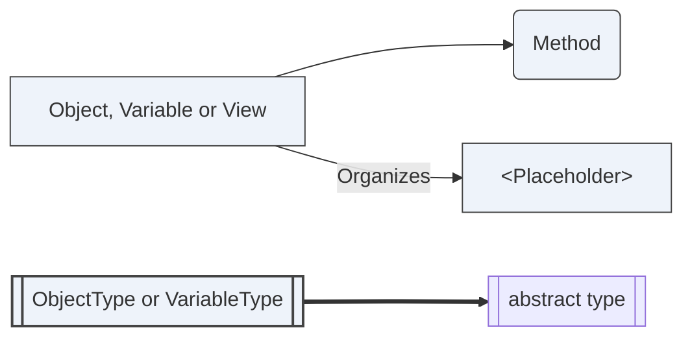

Figure 1 — The notation used by the AddressSpace figures in this document

Every figure that draws part of this specification's information model is re-derived from the
NodeSet by `tools/validate_local.py`: each Node must exist with the NodeClass and abstractness the
figure claims, and each edge must be a real Reference of that type in that direction. A node table
is generated and so cannot drift; a figure is authored, and a wrong arrow looks exactly like a right
one, so it is checked rather than trusted.

---

## 4 General information to Asset Administration Shell and OPC UA

### 4.1 Introduction to Asset Administration Shell

An AAS is the standardized digital representation of an asset. It carries the asset's identity and
references the submodels that describe it — a nameplate, technical data, a carbon footprint, a bill
of material. Submodels are identified in their own right and are not owned by the shell that
references them, so one submodel may be referenced by several shells.

Three kinds of thing carry a globally unique identifier: shells, submodels and concept descriptions.
Everything else is named only within its parent, by a short name, and is addressed by the path of
short names that leads to it.

### 4.2 Introduction to OPC Unified Architecture

The Word rendering of this document carries the standard OPC UA introduction from the OPC Foundation companion specification template, including its five figures. See OPC 10000-1 for the overview and OPC 10000-3 and OPC 10000-5 for the address space and information model.

### 4.3 Relationship to OPC 30270 v1.00

OPC 30270 v1.00 models the AAS v1.x metamodel in
`http://opcfoundation.org/UA/I4AAS/`. This specification models the incompatible AAS V3 metamodel
in `http://opcfoundation.org/UA/I4AAS/v3/`. A model version does not change NodeId identity, so the
two models use distinct namespace URIs and a Server may load both without rebinding a published
NodeId.

AAS V3 has `AssetInformation` and `SpecificAssetId` in place of the v1.x `Asset` and `View`
shapes, carries identifiers as bare strings, and distinguishes `SubmodelElementList` from
`SubmodelElementCollection`. This specification also carries the information required for a
lossless round trip and defines the AAS registry as an xRegistry domain model. Annex C gives an
informative concept correspondence for migration tooling.

---

## 5 Use cases

### 5.1 Registry discovery

Given an asset key such as a serial number or manufacturer part identifier, a Client needs to find
which shells describe that asset without browsing the whole collection. `LookupShellsByAssetLink`
(clause 6.5.5) answers that question directly, using the registry's indexed asset links rather than
a traversal of every shell group.

### 5.2 Digital Product Passport

A Digital Product Passport is public in part and restricted in part. The registry serves that shape
with the disclosure tiers and authorization advertisement of clause 6.5.7, and with the version
history of clause 6.5.4. That history lets a record be retrieved as it stood on a date, which
regulation requires and the AAS metamodel alone cannot supply.

### 5.3 Lossless Server generation from an AAS

The mapping leaves no choice to the implementer (clause 6.1.6). An AAS can therefore be compiled by
a source generator into a loadable NodeSet, and a Server that loads that NodeSet serves the AAS. This
is a consequence of losslessness: a mapping with implementation-defined choices could not be
compiled deterministically.

### 5.4 Federation

A shell may be described by one registry and hosted by another. It is reached through an
`ExternalReference` or `ResourceUrl`, while identity remains the AAS identifier attributes and the
identifier derived from them, never an endpoint (clause 6.5.6). A Client can therefore follow the
serving location without changing the entity it has resolved.

### 5.5 Authoring an AAS as a Thing Description

A WoT Thing Description carrying the AAS vocabulary materializes the same AddressSpace (Annex F).
An AAS authored as linked data and an AAS materialized from an AASX package are therefore the same
nodes, not parallel representations that a Consumer must reconcile.

---

## 6 Asset Administration Shell information model overview

### 6.1 Mapping rules

#### 6.1.1 General

An AAS `Environment` materializes as an `AASEnvironmentType` folder holding the shells, submodels
and concept descriptions it contains. Submodels are held by the environment, not nested inside
shells, because a submodel is not owned by the shell that references it; a shell carries references
to its submodels, and those references are the link.

`AASEnvironmentType` is a `FolderType` and **not** a subtype of the xRegistry `RegistryType`. An
environment holds the metamodel objects of one serialization — the unit an AASX package carries and
a source generator compiles — and its membership is whatever that serialization contained. A
registry holds documents about shells, versioned and federatable, and its membership is what the
Server catalogues. A Server may serve one, the other, or both over the same shells. Making
`AASEnvironmentType` a `RegistryType` would require every Server that materializes an AAS to
implement the registry half.

Where both halves are present, clause 6.5.2 defines the link between a catalogued shell and its
materialized node tree, and clause 6.5.10 requires the registry to serve the materialized environment
as retrievable AAS and AASX documents.

Every metamodel field has exactly one representation in the AddressSpace. [Annex B](#annex-b) lists
them all, field by field. A field with no entry in that annex is a defect in this specification, not
a field an implementation may drop.

#### 6.1.2 Canonical value representation

AAS types values with an xsd type. Clause 6.3.1 assigns each of the thirty values of `DataTypeDefXsd`
one OPC UA DataType, and no DataType is assigned to two of them. Where a built-in DataType denotes
the xsd type on its own it is used; where two xsd types would otherwise share one built-in,
clause 6.3.1 defines a subtype for one of them.

A value materializes as one `Value` Variable, whose DataType is the one clause 6.3.1 assigns to its
declared xsd type. The declared type is read from that DataType.

`ValueType` is a Mandatory Variable. The metamodel makes `Property.valueType` mandatory and
`Property.value` optional, and the same holds for `Range`, so a Property that declares `xs:decimal`
and carries no value is conformant AAS; clause 6.1.5 gives an absent field no node, leaving no value
node to carry the declaration. Where both are present a Server **shall** keep them consistent: the
`Value` node's DataType **shall** be the one clause 6.3.1 assigns to `ValueType`.

**A value is compared in the xsd value space, not the lexical space.** XML Schema defines a
datatype's *value space* and its *lexical space* separately, defines identity on the value space,
and designates a *canonical lexical representation* for each type. AAS carries a value as a string
in the lexical space and defines no equality on it: no normalization, no canonical form, and no
requirement that a lexical form survive a round trip. The ValueOnly serialization of AAS Part 2
renders a value as a native JSON number or boolean and back, so `"1"` declared `xs:boolean` returns
as `"true"`.

A Server therefore:

- **shall** materialize a value into the DataType of clause 6.3.1, and
- **shall** serialize it back as the XSD canonical lexical representation of that type.

The canonical lexical representation is the one defined by XSD 1.1 Part 2: Datatypes. For
`xs:decimal`, the `decimalCanonicalMap` omits the fractional part where the value is integral:
`"1"` therefore serializes as `"1"`, not as the XSD 1.0 form `"1.0"`. The same XSD 1.1
canonical mapping governs the exponent form serialized for `xs:float` and `xs:double`.

A Property authored as `"1.500000"` with `ValueType` `xs:decimal` therefore serializes as `"1.5"`,
and one authored `"+42"` with `xs:int` serializes as `"42"`. The documents are equivalent under
clause 6.4, not identical. An implementation that requires the authored lexical form to survive
verbatim expresses that in the metamodel, with a qualifier or an IEC 61360 `valueFormat`.

`AASValueString` is used only where a Structure field carries a value whose declared type is given
by a sibling field of the same Structure (clause 6.3.2). It is never the DataType of a Variable.

#### 6.1.3 NodeId and BrowseName assignment

Assignment is deterministic: two implementations materializing the same AAS produce the same nodes.

**NodeId.** Instance nodes use String identifiers in the Server's own namespace. The identifier is
a node-kind discriminator followed by decimal length prefixes and reversibly escaped source
components:

| Node | String identifier |
|---|---|
| Asset Administration Shell | `i4aas3:A:<n>:E(<id>)` |
| Submodel | `i4aas3:S:<n>:E(<id>)` |
| Concept Description | `i4aas3:C:<n>:E(<id>)` |
| Submodel Element | `i4aas3:E:<n>:<m>:E(<owner-id>)E(<idShortPath>)` |

`E` is applied independently to every raw identifier and path component. It scans the source
Unicode scalar values without normalization. A literal `%`, every C0 control from U+0000 through
U+001F, and every C1 control from U+007F through U+009F is encoded as its UTF-8 bytes, with each
byte written as `%HH` using uppercase hexadecimal digits. Every other scalar value is copied
unchanged. Decoding accepts only this canonical form: a raw C0 or C1 control, a malformed escape,
or an escape whose decoded value would not be escaped by `E` is invalid. This also makes a literal
percent unambiguous: `%` encodes as `%25`.

`<n>` and `<m>` are the numbers of Unicode code points in the *encoded* components that follow,
written with ASCII decimal digits and without leading zeroes. For an identifiable, `<n>` is the
length of `E(<id>)`. For an element, `<n>` is the length of `E(<owner-id>)` and `<m>` is the length of
`E(<idShortPath>)`; those lengths split the concatenated payload before either component is
decoded, without relying on a delimiter that a source string may contain. `A`, `S`, `C` and `E`
distinguish the four node kinds.

The `idShortPath` is the metamodel's own path convention: short names joined by `.`, with `[n]` for
a member of a list. The encoding is reversible and collision-free: for example, a shell whose
identifier is `a#b` encodes as `i4aas3:A:3:a#b`, while element path `b` beneath owner `a` encodes as
`i4aas3:E:1:1:ab`. An identifier containing LF between `a` and `b` encodes as
`i4aas3:S:5:a%0Ab`; NUL in the same position encodes as `i4aas3:S:5:a%00b`; U+0085 by itself
encodes as `i4aas3:S:6:%C2%85`; and the three source characters `%0A` encode as
`i4aas3:S:5:%250A`, not as a line feed.

An `OperationVariable` wrapper is not a node. Its `value` element has the path
`<operation-path>.<role>[<index>]`, where `<role>` is exactly `inputVariables`,
`outputVariables` or `inoutputVariables` and `<index>` is its zero-based position in that role.
For example, the first input value of `AnOperation` has path
`AnOperation.inputVariables[0]`. The value element's own `idShort` remains its BrowseName and
`IdShort` Property; the role and index, rather than that short name, identify its containment
position.

OPC UA limits a String NodeId identifier to 4096 characters. Before creating any nodes for one
identifiable, a materializer **shall** derive every identifier in its subtree. If any derived
identifier, after escaping and adding its discriminator and length prefixes, exceeds that limit, it
**shall** reject that identifiable without exposing a partial subtree and **shall** report the
overlength path in its diagnostic. It **shall not** truncate, replace or hash the source strings,
because those operations would not implement the reversible encoding above.

**BrowseName.** A Referable that has a non-empty `idShort` uses that exact short name in the
Server's namespace. The three top-level Identifiables permit `idShort` to be absent. In that case
the BrowseName is `<kind>_<digest>`, where `<kind>` is exactly `AssetAdministrationShell`,
`Submodel` or `ConceptDescription`, and `<digest>` is the lowercase hexadecimal SHA-256 digest of
the exact, non-normalized UTF-8 bytes of `id`. The raw identifier is not included in the
BrowseName.

Before allocating derived BrowseNames, a materializer **shall** reserve every BrowseName supplied
by an `idShort` among the environment's top-level children. Identifiers that produce one derived
base name are processed in ascending lexicographic order of their UTF-8 bytes. The first available
name is used: the unsuffixed base where it is free, otherwise the base followed by `_n`, where `n`
is the smallest non-negative ASCII decimal integer that makes the name unused. This rule handles both
a SHA-256 collision and a collision with an authored `idShort` without making source array order
significant. Duplicate identifiers within one identifiable kind would produce the same NodeId and
**shall** be rejected.

An element inside a `SubmodelElementList` has no short name — the metamodel does not give it one —
so its BrowseName is its index rendered as a decimal string. Order is carried by the `Index`
Property, not by the BrowseName, because a BrowseName is a name and not a position.

**DisplayName.** The short name where one exists; otherwise the index for a list member or the
derived BrowseName for a top-level Identifiable.

#### 6.1.4 Ordering

`SubmodelElementList.orderRelevant` says whether the order of a list's members carries meaning; when
it is false the metamodel states that the list represents a set or a bag. OPC UA can say this in the
type system rather than in a Property, and it does:

- Where `orderRelevant` is **true** — including where it is absent, since its default is true — a
  `SubmodelElementList` **shall** reference its members with `HasOrderedComponent` (`i=49`), the
  subtype of `HasComponent` whose semantic is that the order of the references is meaningful.
- Where `orderRelevant` is **false**, it **shall** reference them with `HasComponent`.
- Every other parent/child relationship between Submodel Elements **shall** use `HasComponent`.

The ReferenceType carries `orderRelevant`; there is no `OrderRelevant` Property.
`AASSubmodelElementListType.<Element>` is declared with `HasComponent`; an ordered instance uses
the `HasOrderedComponent` subtype for that declaration.

`Index` carries the position. The Browse Service is not required to return references in any
particular order, and a NodeSet is a set of references rather than a sequence, so the order of a
Browse result is not a reliable source for it. `Index` is Optional on a list member and RECOMMENDED
wherever `HasOrderedComponent` is used; an implementation claiming `AAS-LosslessRoundTrip` **shall**
materialize it there. Where a Server materializes `Index`, the values **shall** be the positions
`0 … n-1` without gaps or repeats, and a serializer emits members in `Index` order.

Where the members are referenced with `HasComponent`, a serializer **may** emit them in any order,
and clause 6.4 compares the collection as a bag.

The three `Operation` variable roles are separately ordered arrays. Their value elements are direct
`HasComponent` children, not `HasOrderedComponent` children. Each value element **shall** carry
`Index` equal to its zero-based position within its role. The array position is authoritative; the
`Index` Property and the role/index in the NodeId of clause 6.1.3 **shall** agree with it. Indices
start again at zero for each role.

#### 6.1.5 Absent versus empty

An optional field that is absent and one present but empty are distinct in the metamodel:

- An **absent** optional field has **no node**.
- A field **present but empty** has a node whose value is an empty array, or an Object with no
  children.

A Server **shall not** materialize a node for an absent field, and **shall not** omit one for a
present-but-empty field. A serializer distinguishes the two by the presence of the node, never by
its value.

#### 6.1.6 Instance materialization

Materializing an `Environment` is mechanical:

1. Create an `AASEnvironmentType` folder.
2. For each shell, submodel and concept description, create a node of the corresponding type, with
   the NodeId of clause 6.1.3 and the BrowseName of clause 6.1.3, organized by the environment folder.
3. For each element within a submodel, recursively create a node of the type corresponding to its
   metamodel class, referenced by its parent with `HasComponent`.
4. For each field present on the element, create the member node named in Annex B, with the value
   the metamodel carries. Omit members for absent fields, per clause 6.1.5.
5. For a value-bearing element, set `ValueType`, and set `Value` with the DataType clause 6.3.1
   assigns to it, per clause 6.1.2.
6. Reference the members of a `SubmodelElementList` with `HasOrderedComponent` where its
   `orderRelevant` is true and `HasComponent` where it is false, and set each member's `Index` to
   its position, per clause 6.1.4.

No step in that sequence is implementation-defined. A generator that implements it compiles an AAS
into a loadable NodeSet, and a Server that loads the NodeSet serves the AAS.

### 6.2 AAS metamodel ObjectTypes

The companion namespace is `http://opcfoundation.org/UA/I4AAS/v3/`, model version 3.00-draft3.
Draft numeric NodeIds use the `1001+` block; final NodeIds are assigned by the OPC Foundation. The
normative node reference is [Annex A](#annex-a); this clause describes intent.

#### 6.2.1 Abstract bases

The abstract bases mirror the metamodel's own hierarchy, so that an element carries the members its
metamodel class gives it and no others: `AASReferableType` for everything with a short name,
`AASIdentifiableType` for the three classes with a globally unique identifier, and
`AASHasSemanticsType`, `AASHasKindType`, `AASHasDataSpecificationType` and `AASQualifiableType` for
the orthogonal aspects.

`AASReferableType` carries a Mandatory `ModelType`, the metamodel class name. It is redundant with
the ObjectType, and it is carried anyway: a serialization produced from the AddressSpace must be
byte-identical to the one that produced it, and the metamodel's serialization includes this
discriminator.

`AASIdentifiableType` carries the `Id` — up to 2048 characters of arbitrary text, which is why
identity lives in a Property and in the encoded String NodeId rather than in the BrowseName
(clause 6.1.3).

<!-- model-figure: root=ns=2;i=1001 require=mandatory external=BaseObjectType -->

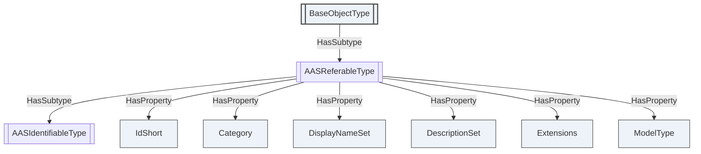

Figure 2 — `AASReferableType`, and the identity it gives every element

<!-- model-figure: root=ns=2;i=1003 require=mandatory external=BaseObjectType -->

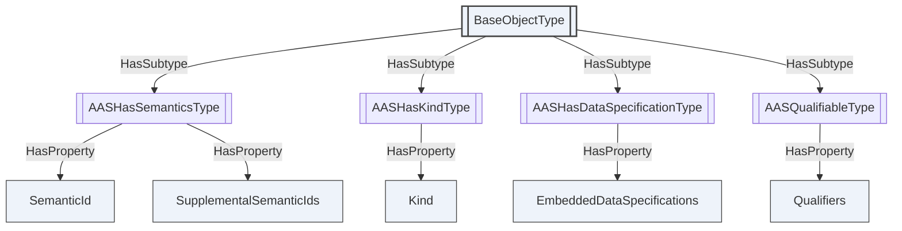

Figure 3 — The orthogonal aspect bases

#### 6.2.2 Environment, shell and asset information

`AASEnvironmentType` is the container and the root a generator materializes into. Shells, submodels
and concept descriptions are all held by it directly: a submodel is not owned by the shell that
references it, and one submodel may be referenced by several shells, so nesting them inside shells
would misrepresent the model.

`AASType` is a shell. It holds `AssetInformation`, references to its submodels, and the derivation
link from an instance to its type.

<!-- model-figure: root=ns=2;i=1010 require=mandatory external=FolderType -->

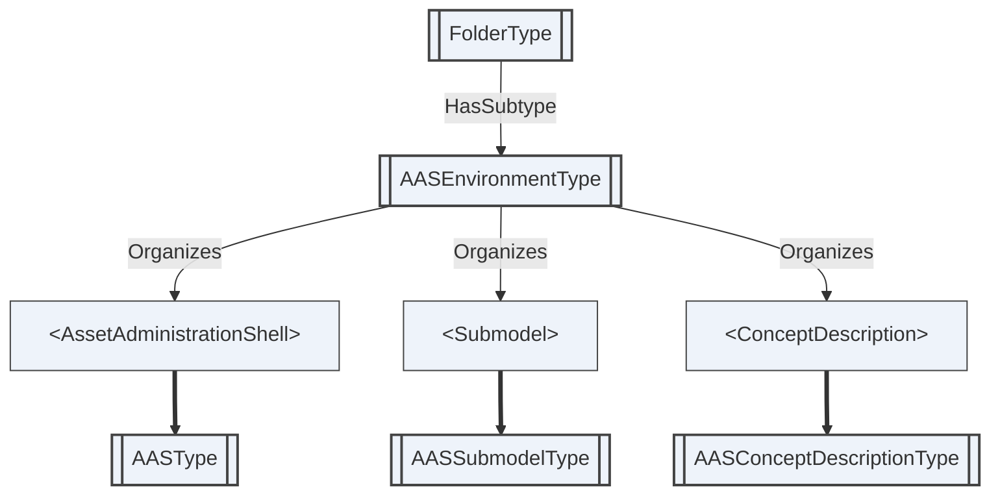

Figure 4 — `AASEnvironmentType`, the container a generator materializes

<!-- model-figure: root=ns=2;i=1011 require=mandatory -->

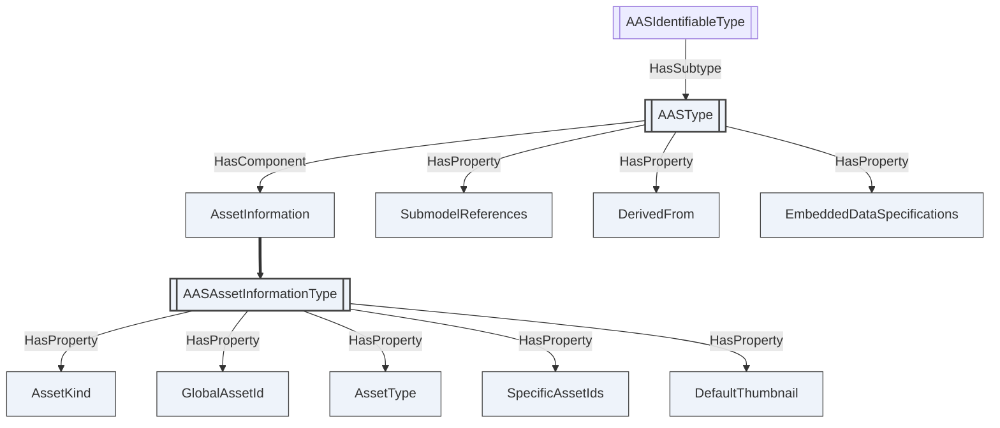

Figure 5 — `AASType` and the asset identity it carries

#### 6.2.3 Submodel and concept description

`AASSubmodelType` is a submodel, holding its elements. `AASConceptDescriptionType` is the definition
a semantic identifier resolves to — what makes two submodels from different vendors comparable.

<!-- model-figure: root=ns=2;i=1013 require=mandatory -->

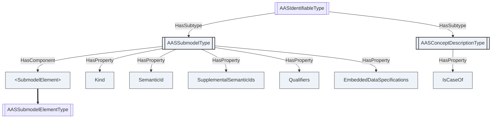

Figure 6 — `AASSubmodelType` and `AASConceptDescriptionType`

#### 6.2.4 Submodel elements

The element types cover the metamodel's element set. Every one of them subtypes
`AASSubmodelElementType`, which carries the semantics, qualifiers and data specifications an element
may have, and the `Index` that gives a list member its position (clause 6.1.4).

<!-- model-figure: root=ns=2;i=1020 require=mandatory -->

```mermaid
flowchart TD
  REF[[AASReferableType]]:::objecttype,abstract
  SET[[AASSubmodelElementType]]:::objecttype,abstract
  PRP[[AASPropertyType]]:::objecttype
  MLP[[AASMultiLanguagePropertyType]]:::objecttype
  RNG[[AASRangeType]]:::objecttype
  BLB[[AASBlobType]]:::objecttype
  FIL[[AASFileType]]:::objecttype
  REL[[AASReferenceElementType]]:::objecttype
  RLE[[AASRelationshipElementType]]:::objecttype
  ARE[[AASAnnotatedRelationshipElementType]]:::objecttype
  SEC[[AASSubmodelElementCollectionType]]:::objecttype
  SEL[[AASSubmodelElementListType]]:::objecttype
  ENT[[AASEntityType]]:::objecttype
  BEE[[AASBasicEventElementType]]:::objecttype
  OPR[[AASOperationType]]:::objecttype
  CAP[[AASCapabilityType]]:::objecttype

  REF -->|HasSubtype| SET
  SET -->|HasSubtype| PRP
  SET -->|HasSubtype| MLP
  SET -->|HasSubtype| RNG
  SET -->|HasSubtype| BLB
  SET -->|HasSubtype| FIL
  SET -->|HasSubtype| REL
  SET -->|HasSubtype| RLE
  RLE -->|HasSubtype| ARE
  SET -->|HasSubtype| SEC
  SET -->|HasSubtype| SEL
  SET -->|HasSubtype| ENT
  SET -->|HasSubtype| BEE
  SET -->|HasSubtype| OPR
  SET -->|HasSubtype| CAP

  classDef objecttype fill:#eef3fa,stroke:#444,stroke-width:2px
  classDef abstract fill:#eef3fa,stroke:#444,stroke-width:2px,font-style:italic
```

Figure 7 — The submodel element hierarchy

Three element types deserve note, and they are the three the losslessness rules bear on.

**`AASPropertyType`** carries a value once, in a `Value` node whose DataType is the one clause 6.3.1
assigns to the declared `ValueType` (clause 6.1.2). `ValueType` is Mandatory because the metamodel
makes it mandatory while making the value itself optional. **`AASRangeType`** carries its bounds the
same way, and an absent bound means unbounded rather than zero.

<!-- model-figure: root=ns=2;i=1021 require=mandatory -->

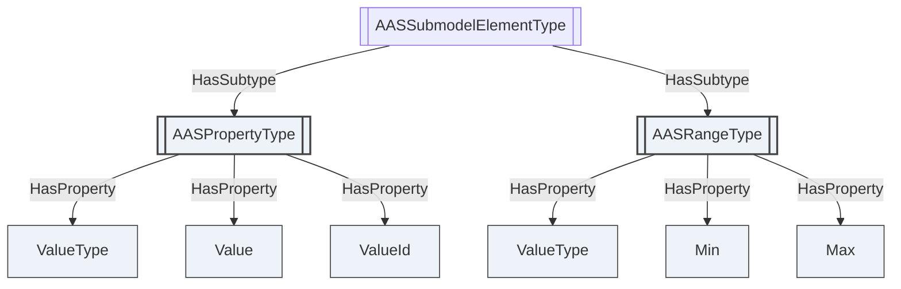

Figure 8 — A value and the type it is declared as

**`AASSubmodelElementListType`** declares its member placeholder with `HasComponent`. An instance
specializes that reference to `HasOrderedComponent` where the list's order is relevant and retains
`HasComponent` where it is not; its members carry `Index` where the position has to be recoverable.
`AASSubmodelElementCollectionType` is unordered and its members are identified by their own short
names.

<!-- model-figure: root=ns=2;i=1031 require=mandatory -->

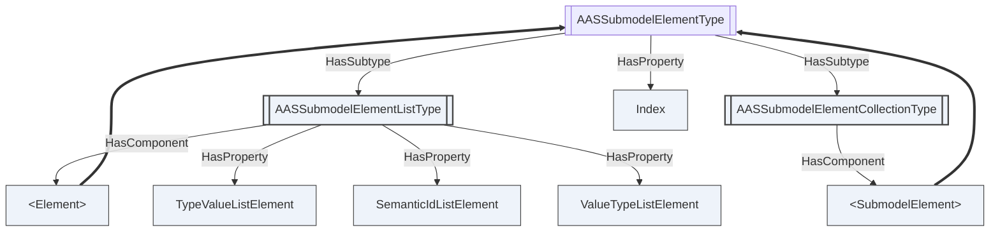

Figure 9 — Ordered and unordered collections

**`AASEntityType`** is a component of a composition; a self-managed entity carries the identifier of
its own shell, so a bill of material is traversable across organizations.
**`AASOperationType`** carries its variables as references to the element nodes that hold them,
rather than duplicating those elements, so an operation's variables round-trip as the elements they
are.

For every `OperationVariable` in a present role array, a materializer **shall** create the wrapper's
mandatory `value` as one direct `HasComponent` child of the `AASOperationType` node. It **shall not**
create a node for the wrapper itself. The corresponding `InputVariables`, `OutputVariables` or
`InoutputVariables` array entry **shall** be one `AASOperationVariableDataType` whose
`ValueNodeId` is the local NodeId of that child. A child **shall** occur in exactly one role entry.
The child uses its concrete AAS ObjectType and its own `idShort` as BrowseName; its NodeId and
`Index` follow clauses 6.1.3 and 6.1.4. An absent role has no corresponding Property instance, while a
present empty role has a Property whose value is an empty array.

<!-- model-figure: root=ns=2;i=1032 require=mandatory -->

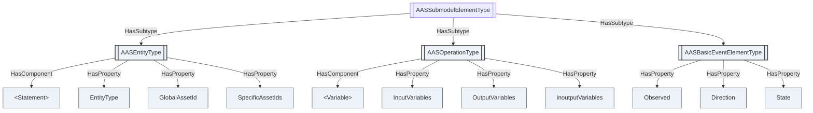

Figure 10 — Composition, operations and events

#### 6.2.5 Invoking an operation

An `Operation` submodel element is invocable. `AASOperationType` carries the Method `Invoke`, whose
arguments correspond positionally to the element's `InputVariables`, `OutputVariables` and
`InoutputVariables`.

| Argument | Direction | Corresponds to |
|---|---|---|
| `InputValues` | in | `inputArguments` of the AAS API request, in the order of `InputVariables` |
| `InoutputValues` | in | `inoutputArguments` of the request, in the order of `InoutputVariables` |
| `ClientTimeout` | in | `clientTimeoutDuration`; zero selects the Server's default |
| `OutputValues` | out | `outputArguments` of the result, in the order of `OutputVariables` |
| `InoutputResults` | out | `inoutputArguments` of the result |
| `Success` | out | `success` |
| `Diagnostic` | out | the message of a failed execution |

A Server **shall** return `Bad_InvalidArgument` where the number of values does not match the number
of variables the element declares.

`Success` reports the outcome of the operation, not of the Call. An operation that runs and reports
failure returns `Good` with `Success` false; a Call that could not be made at all returns a bad
StatusCode. Conflating the two would leave a Client unable to distinguish an unreachable Server from
a rejected workpiece.

Positional correspondence, rather than a name-keyed structure, is what the metamodel supports:
`InputVariables` is an ordered array and clause 6.1.4 already preserves that order, so the *n*-th value
belongs to the *n*-th variable in both directions.

The AAS API of IDTA-01002 Part 2 also defines an asynchronous form, `InvokeOperationAsync` with
`GetOperationAsyncResult`. This specification defines no counterpart: an OPC UA Method Call is
synchronous, and a Server whose operations outlive a Call implements the Program interface of
OPC 10000-10 on the element rather than a second Method here. Annex G records the correspondence.

### 6.3 AAS DataTypes

#### 6.3.1 The xsd type mapping

Each of the thirty values of `AASDataTypeDefXsdDataType` is assigned one OPC UA DataType, and no
DataType is assigned to two of them. A serializer reads the declared xsd type from the DataType of
the value node.

Where a built-in DataType denotes the xsd type on its own, it is used. Where two xsd types would
otherwise share one built-in, a subtype is defined in this namespace, as OPC UA does in deriving
`DecimalString`, `DurationString`, `DateString` and `TimeString` from `String`. Ten such subtypes
are defined.

| `ValueType` | OPC UA DataType | Note |
|---|---|---|
| `xs:boolean` | `Boolean` (`i=1`) | |
| `xs:byte` | `SByte` (`i=2`) | xsd `byte` is signed |
| `xs:unsignedByte` | `Byte` (`i=3`) | |
| `xs:short` | `Int16` (`i=4`) | |
| `xs:unsignedShort` | `UInt16` (`i=5`) | |
| `xs:int` | `Int32` (`i=6`) | |
| `xs:unsignedInt` | `UInt32` (`i=7`) | |
| `xs:long` | `Int64` (`i=8`) | |
| `xs:unsignedLong` | `UInt64` (`i=9`) | |
| `xs:float` | `Float` (`i=10`) | |
| `xs:double` | `Double` (`i=11`) | |
| `xs:decimal` | `Decimal` (`i=50`) | arbitrary precision, and its `Scale` preserves the authored number of decimal places |
| `xs:integer` | `Integer` (`i=27`) | |
| `xs:nonNegativeInteger` | `UInteger` (`i=28`) | |
| `xs:positiveInteger` | `AASPositiveInteger` | subtype of `UInteger`, so it does not collide with `xs:nonNegativeInteger` |
| `xs:nonPositiveInteger` | `AASNonPositiveInteger` | subtype of `Integer` |
| `xs:negativeInteger` | `AASNegativeInteger` | subtype of `AASNonPositiveInteger`, mirroring the xsd restriction hierarchy |
| `xs:string` | `String` (`i=12`) | |
| `xs:anyURI` | `AASAnyUri` | subtype of `String`, so it does not collide with `xs:string` |
| `xs:dateTime` | `DateTime` (`i=13`) | |
| `xs:date` | `DateString` (`i=12881`) | a date is a day, not an instant |
| `xs:time` | `TimeString` (`i=12880`) | a time-of-day has no day |
| `xs:duration` | `DurationString` (`i=12879`) | the ISO 8601 duration form; **not** `Duration` (`i=290`), which is a count of milliseconds |
| `xs:gYear` | `AASGYear` | a Gregorian period; OPC UA has no DataType denoting one |
| `xs:gYearMonth` | `AASGYearMonth` | |
| `xs:gMonth` | `AASGMonth` | |
| `xs:gMonthDay` | `AASGMonthDay` | |
| `xs:gDay` | `AASGDay` | |
| `xs:base64Binary` | `ByteString` (`i=15`) | |
| `xs:hexBinary` | `AASHexBinary` | subtype of `ByteString`; the octets are identical to a `xs:base64Binary` value's and only the written form differs |

Four rows are qualified further.

`xs:duration` is assigned `DurationString`, not `Duration` (`i=290`). `Duration` is a `Double`
counting milliseconds; `xs:duration` has year and month components that are not a fixed number of
milliseconds, as `P1M` is not thirty days. `DurationString` holds the ISO 8601 form, which is the
lexical space of `xs:duration`.

`xs:date` and `xs:time` are assigned `DateString` and `TimeString`, not `DateTime`. A `DateTime` is
an instant; a date is a day in some timezone and a time is a time-of-day with no day. Assigning
either `DateTime` would require a value for the missing component.

The five partial-date types have no OPC UA DataType, built-in or derived, that denotes a period.
Each is assigned its own `String` subtype.

Two assignments have a range narrower than the xsd type. `Integer` and `UInteger` are the abstract
unions of OPC UA's concrete integer types, so their range is that of `Int64` and `UInt64`, whereas
`xs:integer` is unbounded; and `DateTime` begins in 1601, whereas `xs:dateTime` does not. A value
outside the representable range **shall** be rejected rather than truncated, as in clause 6.3.3.

#### 6.3.2 AASValueString

`AASValueString` is a subtype of `String` (`i=12`). It carries the xsd lexical form of a value whose
declared type is given by a sibling field of the same Structure.

A Structure field has one static DataType and cannot vary with a declared type.
`AASQualifierDataType` and `AASExtensionDataType` pair a value with a `ValueType` field.
`AASDataSpecificationIec61360DataType` pairs its value with a `DataType` field. In each case the
value field is lexical and the sibling field states how to read it. Where a Variable carries a
value, clause 6.3.1 assigns the DataType of its declared xsd type instead.

A Server **shall not** use `AASValueString` as the DataType of a Variable.

#### 6.3.3 Enumerations

The enumerations are closed. `AASKeyTypesDataType`, `AASDataTypeDefXsdDataType` and the rest
enumerate exactly the metamodel's values; a value outside the enumeration cannot round-trip, so an
implementation rejects it rather than dropping it silently.

#### 6.3.4 Structures

The structures carry the metamodel's value classes: references and their ordered keys,
language-tagged strings, specific asset identifiers, administrative information, qualifiers,
extensions, data specifications and their IEC 61360 content. `AASQualifierDataType` and
`AASExtensionDataType` pair a value with `ValueType`;
`AASDataSpecificationIec61360DataType` pairs it with `DataType`. Each carries the value as
`AASValueString` for the reason given in clause 6.3.2.

`AASReferenceDataType` carries its `Keys` as an ordered array. The order is part of the reference's
meaning — it is the path — so it is preserved exactly.

IEC 61360 permitted values are structured rather than flattened into strings.
`AASValueReferencePairDataType` has Mandatory `Value` and `ValueId` fields.
`AASValueListDataType` has a Mandatory, non-empty `ValueReferencePairs` array of those pairs.
`AASLevelTypeDataType` has the four Mandatory Boolean fields `Min`, `Nom`, `Typ` and `Max`.
`AASDataSpecificationIec61360DataType.ValueList` and `.LevelType` are Optional, so their absence
remains distinct from a present structured value.

### 6.4 Round-trip conformance

An implementation claiming the `AAS-LosslessRoundTrip` conformance unit **shall** satisfy both
directions.

**Materialize and serialize.** For any conformant AAS environment, materializing it per clause 6.1.6
and serializing the result **shall** produce an environment **equivalent** to the original.

**Serialize and materialize.** For any AddressSpace subtree produced by clause 6.1.6, serializing it
and materializing the result **shall** produce a subtree with the same nodes, NodeIds, BrowseNames,
References and values.

Two environments are equivalent when, after canonical ordering of JSON object members:

- every field present in one is present in the other, and absent in one is absent in the other;
- every value is the same element of the xsd value space of its declared `valueType`, compared per
  XSD 1.1 Part 2: Datatypes. `"1.500000"` and `"1.5"` are equivalent as `xs:decimal`; `"1"` and
  `"true"` are equivalent as `xs:boolean`; `"1.5"` and `"2.5"` are not;
- every array to which the metamodel gives an order is compared in order: the keys of a reference, a
  multi-language value, an operation's variables, and a `SubmodelElementList` whose `orderRelevant`
  is true;
- a `SubmodelElementList` whose `orderRelevant` is false is compared as a bag: same members, same
  multiplicities, order disregarded.

No further tolerance applies. A field that cannot be represented is a defect in this specification;
Annex B is the list against which that is checked.

A test corpus accompanies this document under `tools/fixtures/`, and `tools/roundtrip_check.py`
runs both directions over it. The corpus covers every element type, nested and ordered lists,
elements without short names, multi-language values, non-canonical lexical forms of the xsd types,
the absent-versus-empty distinction, qualifiers, extensions, data specifications and multi-key
references.

The same tool carries a **negative control**. It breaks one normative rule at a time — corrupting a
value rather than re-writing it, canonicalizing an `xs:decimal` through a fixed working precision so
that digits are lost, restoring an ordered list in Browse order rather than by `Index`, conflating an
absent field with an empty one — and asserts that the comparison reports each. It also asserts that
re-writing a value into its canonical lexical form is **not** reported.

### 6.5 The AAS Registry

#### 6.5.1 The registry is folders of files

The registry half projects a catalogue of shells onto the AddressSpace using the abstract
*OPC UA — xRegistry* base model: a registry and its groups are `FolderType` folders, and a resource
document *is* a `FileType` file, read with the File Transfer Methods of OPC 10000-20.

It answers different questions from the metamodel half:

| | Metamodel clauses | Registry clauses |
|---|---|---|
| Unit | one shell's metamodel, in nodes | a catalogue of shells, as folders and files |
| Granularity | per element | per document |
| Access | Read, Write, Call | Open, Read, Close |
| Answers | what is this value now | which shells exist, at what versions, where else served |

A Server may implement either half or both. Where both are present the same shell appears twice, and
`AASShellGroupType.ShellNode` links the catalogue entry to the live node tree.

#### 6.5.2 Registry types

`AASRegistryType` is the registry root, exposed as a well-known `AASRegistry` Object under the
`Server` Object so that any Client reaching the standard Server object discovers it. Its group
folders hold shells, submodel template families, concept dictionaries and package stores; its
Methods answer the discovery question and provide a document fast path.

The UANodeSet representation of the concrete `LookupShellsByAssetLink`, `GetSubmodel` and
`Materialize` Methods on the well-known `AASRegistry` Object **shall** set the
`MethodDeclarationId` XML attribute to the NodeId of the same-named Method declaration on
`AASRegistryType`.

`AASShellGroupType` holds the submodel documents of one shell. It is a `GroupType`, and therefore a
folder of resource files, whereas `AASType` is the shell's metamodel object tree. They are separate
types because they are separate things, and three consequences follow that a single type could not
give:

- **Either half can exist without the other.** A registry that catalogues a shell served by another
  Server has no metamodel tree to attach to, and a Server that materializes an AAS from a package
  need not catalogue it. Conflating the two would make each imply the other.
- **A group is a folder of files; a shell is an object.** The base `GroupType` gives the catalogue
  entry its xRegistry attributes, its creation Methods and its file members. `AASType` gives the
  shell its `AssetInformation` and its submodel references. Neither set belongs on the other.
- **They have different lifetimes.** A catalogued shell has versions, and the current version of its
  submodel document need not be what the metamodel tree currently holds — that is the whole point of
  clause 6.5.4.

Where a Server implements both halves, `AASShellGroupType.ShellNode` points at the `AASType` node
for the same shell, and both carry the same identifiers, so a Client can move between the catalogue
and the live tree without re-resolving anything.

`AASSubmodelFileType` is one submodel document. `AASConceptDescriptionFileType` and
`AASPackageFileType` are the corresponding resources for concept definitions and packages. Every
package carries the strong integrity metadata defined in clause 6.5.4.

<!-- model-figure: root=ns=2;i=1100 require=mandatory external=RegistryType,GroupType,ResourceType,Server -->

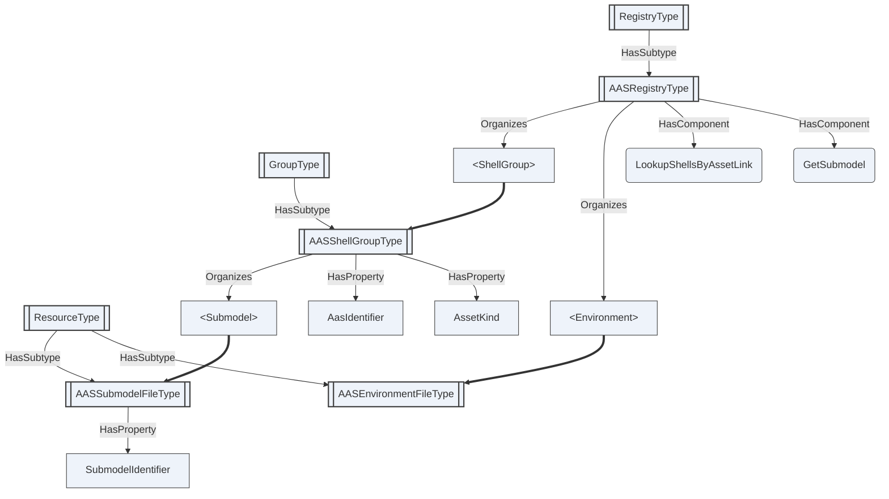

Figure 11 — The registry root, shells and their submodel documents

The other three group types follow the same shape: a group folder holding resource files, each
naming the source identity its identifier is derived from.

<!-- model-figure: root=ns=2;i=1103 require=mandatory external=GroupType,ResourceType -->

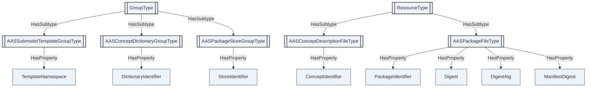

Figure 12 — Templates, concept dictionaries and package stores, each with its source identity

#### 6.5.3 Identifiers

Base clause 6.9 requires every group and resource type to name exactly one **source identity** and to
expose it verbatim as a Mandatory Property, and derives the identifier from it by the symbolic
construction defined there. This clause names them:

| Type | Source identity |
|---|---|
| `AASShellGroupType` | `AasIdentifier` |
| `AASSubmodelFileType` | `SubmodelIdentifier` |
| `AASSubmodelTemplateGroupType` | `TemplateNamespace` |
| `AASConceptDictionaryGroupType` | `DictionaryIdentifier` |
| `AASConceptDescriptionFileType` | `ConceptIdentifier` |
| `AASPackageStoreGroupType` | `StoreIdentifier` |
| `AASPackageFileType` | `PackageIdentifier` |

These are the same source identities the xRegistry AAS model names, and the construction is the same
one. The same shell therefore receives the same identifier whether it is served over OPC UA or over
HTTP, so the two bindings address one registry.

An identifier is never derived from a document. A resource is a stable umbrella over its versions,
so its identifier is invariant while its document changes; a content digest is version-level
metadata and identifies bytes, not entities.

#### 6.5.4 Versioning and the lifecycle record

The AAS metamodel records a single current revision. `AdministrativeInformation` carries a version
label and a revision label, and nothing retains what a submodel previously said or distinguishes a
correction from a new observation.

The registry supplies what the metamodel does not: each version of an `AASSubmodelFileType` is one
revision, ordered in time, and a Client asking for a submodel as it stood at a given moment reads
the newest version not later than that moment. This is not a convenience. Where a regulation
requires a record retrievable as of a date, or an auditable and tamper-evident history of changes to
controlled data, a Server implementing only the metamodel half has nothing to answer from.

The AAS version labels are carried unchanged in `Administration`; they are not reflected into the
registry's version identifiers, which follow the base model's own rules.

**Package integrity.** Every Version of an `AASPackageFileType` **shall** instantiate `Digest` and
`DigestAlg`, and both Properties **shall** be immutable within that Version. `Digest` **shall** be
the lowercase hexadecimal digest of the exact package blob bytes returned by `FileType.Read` and
**shall not** contain an algorithm prefix. `DigestAlg` is case-sensitive and **shall** be exactly
`Sha256`, `Sha384` or `Sha512`; every other algorithm or casing **shall** be rejected. An OCI
descriptor algorithm of `sha256`, `sha384` or `sha512` **shall** map respectively to `Sha256`,
`Sha384` or `Sha512`.

Before publishing these Properties or making the package available for reading or materialization,
the Server **shall** verify the exact returned blob against them. Before parsing, materializing or
otherwise using a retrieved package, a Consumer **shall** independently recompute `Digest` over
the exact returned bytes using `DigestAlg` and compare it with the published value.

An OCI-backed package Version **shall** instantiate immutable `ManifestDigest` as the exact digest
of the OCI manifest bytes, including a lower-case algorithm prefix and lower-case hexadecimal
value, for example `sha256:<lowercase-hex>`. `ManifestDigest` verifies only those exact manifest
bytes and **shall not** be treated as verification of the returned package blob. Before publishing
or using the Version, respectively, the Server and Consumer **shall** perform all of these checks:

1. recompute and compare `ManifestDigest` over the exact manifest bytes;
2. parse the verified manifest and require exactly one package-layer descriptor;
3. require that descriptor's algorithm and encoded digest, after the mapping above, equal
   `DigestAlg` and `Digest`; and
4. retrieve the package blob and independently recompute and compare `Digest` using `DigestAlg`.

`ManifestDigest` **shall** be the sole authority for OCI Version identity, and `VersionId`
**shall** be the always-hashed symbolic identifier of its exact value. A raw OCI tag **may** locate
a current manifest only as a mutable Resource-level alias and **shall never** be a `VersionId`.
The tag **shall** match `[A-Za-z0-9_][A-Za-z0-9_.-]{0,127}` and **shall** be preserved byte-for-byte,
including case and a leading underscore. Moving a tag to a previously unseen manifest **shall**
create and retain a distinct immutable Version and **shall not** mutate or replace the old Version.
The xRegistry base `ResourceType` declares the `Attestations` attribute, and
`AASAttestationDataType` is the AAS payload type for that attribute. An `AASPackageFileType` Version
**shall not** instantiate `Subject` or `Attestations`: the prohibition is on the package Version,
not on use of the DataType. An attestation or other OCI referrer **shall** be represented as a
separate immutable Resource and **shall not** become a Version of the package Resource it refers to.
Adding, removing or discovering a referrer **shall not** change that package Resource's Version
collection, default Version, document, attributes, `Epoch` or `ModifiedAt`.

#### 6.5.5 Discovery and resolution

`LookupShellsByAssetLink` answers the discovery question — given an asset key such as a serial
number or a manufacturer part identifier, which shells describe it — without the Client browsing the
whole collection. `GetSubmodel` returns a document and enough metadata to parse it, for a Client that
holds an identifier rather than a node.

`GetSubmodel` **shall** first resolve the selected `AASSubmodelFileType` and then apply, for the
calling Session, the exact effective `RolePermissions`, `UserRolePermissions`, disclosure tier,
authorization policy and access decision that direct `FileType.Open` and `FileType.Read` apply to
that target. Permission to Call the registry Method **shall not** authorize the target resource.
Where target access is denied, the Method **shall** return `Bad_UserAccessDenied`, or
`Bad_NotFound` where the Server's policy conceals the target's existence. Before successful target
authorization it **shall not** return document bytes, `Format`, `ContentType`, size, digest or other
target metadata, and **shall** use the same externally observable failure behavior, including
response timing, for a concealed unauthorized target and a nonexistent target.

A Server **should** bound the results returned for an unauthenticated collection query. A registry
serving regulated product data is subject to requirements to prevent bulk extraction of its
contents, and an unbounded collection endpoint is exactly such an extraction surface.

#### 6.5.6 Federation

Federation follows the base model. A shell or submodel this registry describes but does not host
carries an `ExternalReference` — an `ExpandedNodeId` whose `ServerUri` identifies the hosting
endpoint and whose `NamespaceUri` and identifier identify the entity — or a `ResourceUrl` for a
registry served over a different protocol.

The identity rule is absolute: identity is carried by the AAS identifier attributes and the
identifier derived from them, never by an endpoint. A Server exposing a local proxy for a remote
entity **shall** retain the remote entity's identifier attributes and **shall not** treat its own
endpoint as part of that entity's identity. The external authority identifies the serving endpoint,
not the entity.

Every resolution of `ExternalReference.ServerUri` or `ResourceUrl` is an egress operation over
untrusted registry metadata. A resolver **shall** apply the fail-closed federation policy of the
AAS xRegistry binding before opening a connection: configured scheme, host and port allowlists;
DNS resolution and connected-address checks that reject loopback, link-local, private,
unique-local, unspecified, multicast, reserved and cloud-metadata destinations unless explicitly
trusted; revalidation on every redirect and after connection to prevent DNS rebinding; finite
redirect, time, response and decompressed-size bounds; and no ambient cookies, credentials,
authorization headers or proxy credentials. A credential configured for one peer **shall not** be
sent to another peer or redirect target.

For an OPC UA peer, the resolver **shall** validate the endpoint certificate against its configured
trust list and **shall** require the certificate ApplicationUri, the Server ApplicationUri returned
by discovery and the configured federation-peer identity to agree. A policy, DNS, redirect,
credential, certificate, identity or resource-bound failure **shall** terminate resolution without
returning or caching any bytes obtained from the rejected destination.

Because the construction of clause 6.5.3 is deterministic, the same shell has the same identifier in
every registry that describes it, and a Client moving between registries re-resolves nothing.

#### 6.5.7 Information disclosure tiers

Some assets carry data that cannot be shown to everyone: a product passport is public in part and
restricted in part, and a supplier's technical data is commercially sensitive.

An **information disclosure tier** is the class of caller an entity's content may be released to.
This specification defines two, `Public` and `Controlled`, carried by the `DisclosureTier` Property.
They classify the *information*, not the caller and not the transport: a tier says what kind of
release this entity's content is, and leaves who may obtain it to the authorization the entity
advertises. A regulation that names finer classes maps them onto these two by deciding, for each,
whether the content is readable without authentication.

Note that a disclosure tier is metadata about content, and is therefore itself disclosed. A Server
that must not reveal even the existence of controlled content omits those entries entirely rather
than marking them; see the mitigations below.

This specification expresses two of the three things tiering requires, and does not express the
third.

**Segmentation** is expressible: a registry serves public content as stored documents and represents
controlled content as entries carrying a `ResourceUrl` or an `ExternalReference` instead of bytes.

**Advertisement** is expressible: `DisclosureTier` records whether an entity is readable without
authentication, and `Authorization` describes the authorization options a Consumer may use — a type,
a mechanism, and the authority and resource URIs that say where authorization is obtained and what
for. `Authorization` is authorization configuration only and **shall not** carry credentials, keys
or tokens, which are supplied out of band.

**Enforcement at element granularity is not expressible.** Where a regulation requires access rights
to be enforced between two elements *within* one document, this model cannot express it: a registry
resource document is opaque bytes, and a decision that falls inside a document cannot be taken by a
model that addresses documents.

OPC UA's own access control does not close that gap. It operates on nodes, and the boundary in
question is inside a file. Two mitigations are conformant: a registry **may** publish tier-specific
resources whose documents are already the redacted projection appropriate to a tier, so that every
document is wholly one tier; and a registry **may** omit controlled entries entirely from responses
to unauthenticated Clients, since advertising that a controlled submodel exists is itself a
disclosure.

A registry that serves public data **shall not** require authentication to read it.

The same disclosure decision applies through every access path. In particular, the
`GetSubmodel` convenience Method is subject to the target-resource authorization and
existence-concealment rule of clause 6.5.5; its Method-level Call permission is never a substitute for
the target's disclosure and file-access controls.

#### 6.5.8 The xRegistry API over OPC UA

The registry subtree is simultaneously an xRegistry API server: the operations are realized natively
by OPC UA Services over the same nodes, as defined by the base model and its API binding. Annex D
gives the correspondence to the HTTP binding for readers who know that one.

#### 6.5.9 Updateable registry

Clauses 6.5.1 to 6.5.8 describe a registry that catalogues documents. A Server **may** additionally make
the registry **updateable**: a Client writes a document into the registry, and the AddressSpace of
clause 6.1 changes to match. This clause defines that profile. It is optional, it is declared by the
`AAS-UpdateableRegistry` conformance unit, and a Server that implements clauses 6.5.1 to 6.5.8 without
it is fully conformant.

**The documents are canonical; the nodes are derived.** A Server implementing this profile **shall**
be able to rebuild the entire materialized subtree from the stored documents and this specification
alone, with no additional state. A Client **shall not** assume that a materialized node survives a
change to the document it came from, except as the generation rules below allow.

**Materialization is generational, and a switch is atomic.** A Server **shall not** let a Client
observe a half-built subtree. It **prepares** the new nodes as a shadow generation beside the active
one, with the document's `LoadState` set to `Loading`; it validates them; and only then does it
**switch**, making them visible, setting `LoadState` to `Active` and incrementing
`MaterializationGeneration`. Nodes in a shadow generation are not browsable and raise no events.

**A superseded generation is retired under one documented policy.** After a switch the previous
generation becomes `Superseded`. A Server **shall** apply exactly one of two policies, deterministic
for a given call and documented by the implementation:

- **Graceful.** The superseded generation enters `Retiring`. Existing MonitoredItems, continuation
  points and in-flight requests continue to be served from it until they drain or are migrated; new
  requests use the active generation. Its nodes are removed only once the retained work has drained.
- **Immediate.** The superseded generation is retired without waiting. The Server **shall**
  invalidate every affected MonitoredItem: a data-change item reports `BadNodeIdUnknown`, an event
  item stops producing events, and subsequent monitored-item operations on either return
  `BadNodeIdUnknown`.

Graceful retirement preserves subscriptions across an update; immediate retirement applies where a
Server cannot hold two generations at once. A Server **shall** apply one of these two and **shall
not** apply a third behaviour.

**A failed document does not destroy anything.** Validation failure **shall** leave the stored
document in place, set its `LoadState` to `Failed` and record the reason. The generation that was
active **shall** keep serving, unchanged. `DesiredVersionId` records the version an operator wants
materialized and `ActiveVersionId` the version actually serving; they diverge transiently during a
switch and persistently when the desired version does not validate. That divergence is observable on
purpose, because an operator needs to see that the update they requested is not the one being
served. A Server **shall not** silently activate a version that failed validation.

**A shell is materialized whole or not at all.** A shell's document, its submodel documents and the
concept descriptions its `SemanticId`s resolve to form a closure. A Server **shall** materialize a
closure into one shadow generation and commit it as a unit: a closure with an unresolved or invalid
member **shall not** be partially activated, and no node of it becomes visible. A dependency is
resolved against the registry itself first and, failing that, through a configured federation
provider (clause 6.5.6). A Server **shall not** dereference an arbitrary URL found inside a document
while materializing it — an `ExternalReference` is federation metadata, not permission to fetch.

**Re-materializing an unchanged document changes nothing.** A document whose digest is unchanged
since it was last materialized **shall** be reported `Unchanged` and **shall not** be
re-materialized, unless `Force` is set. Re-running an unchanged call **shall** produce the same nodes
with the same NodeIds and **shall not** increment `MaterializationGeneration`. A Server **should**
compute the digest over canonical document bytes, so that reformatting a document that means the
same thing does not churn the AddressSpace.

**A committed switch is announced.** A switch changes the AddressSpace graph, so the Server
**shall** emit `GeneralModelChangeEventType` for the committed additions, removals and reference
changes, and **shall** stamp the affected nodes' `NodeVersion` so a Client can correlate a node with
the `MaterializationGeneration` that produced it. Events are emitted for committed changes only,
never for shadow-generation work.

**Deleting a document retires its nodes first.** Deleting a registry resource **shall** retire its
materialized generation before removing the stored document, under the same closure rules: a Server
**shall** refuse the deletion while another materialized document depends on it, unless the caller
asks for the dependents to be retired too, in which case those dependents are retired first and
reported.

`AutoMaterialize` states whether a stored-document change re-materializes without being asked. The
`Materialize` Method re-materializes a selection on demand whether or not `AutoMaterialize` is set,
and returns one `AASMaterializationResultDataType` per document it considered — so a caller learns
which documents were skipped, which were rebuilt and which failed, rather than only whether the call
returned good.

<!-- model-figure: root=ns=2;i=1100 require=none external=RegistryType,ResourceType -->

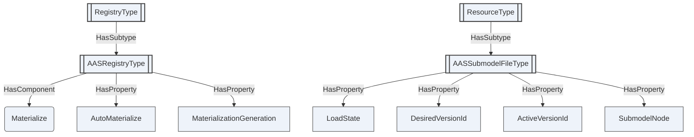

Figure 13 — The updateable registry profile. `SubmodelNode` holds the NodeId of the
`AASSubmodelType` node the document materialized into; it is a Property value, not a Reference.

The states a document passes through are those of `AASLoadStateDataType`, and the transitions are
the rules above rather than an implementation's choice:

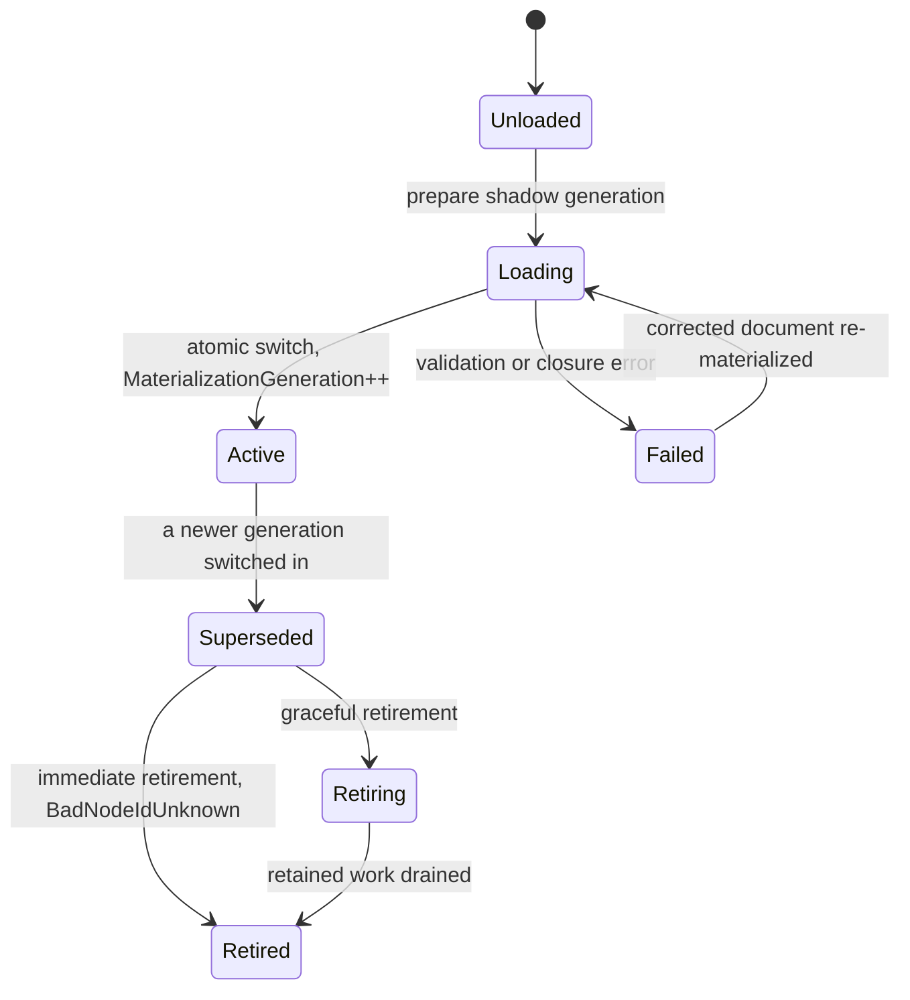

Figure 14 — Materialization lifecycle of one stored document

**Implementer notes.** This subclause is informative.

- *NodeId stability.* The NodeIds of clause 6.1.3 are the escaped, length-prefixed encodings of the
  AAS identifier and `idShortPath`, not values allocated by the Server. Two generations of the same
  document therefore contain the *same* NodeIds. A shadow generation must be held in a separate
  node table until the switch, not merged into the live one, or the preparation itself becomes
  visible.
- *Retirement and NodeId reuse together.* Under graceful retirement two generations exist at once
  with overlapping NodeIds. A Session that resolved a NodeId before the switch must continue to
  reach the generation it started with; resolving NodeId to node per Session-and-generation rather
  than globally is the straightforward way to get this right.
- *Digest before parse.* Compute the digest and compare it before parsing. A registry of any size
  spends nearly all of a periodic re-materialization discovering that nothing changed.
- *The closure is not the document.* A submodel document that validates on its own can still fail a
  closure because a concept description it references is missing. Report the failure against the
  document the operator wrote, naming the unresolved member — reporting it against the missing
  document tells the operator nothing they can act on.

The *OPC UA — WoT Connectivity* draft, currently under OPC Foundation review, defines the same
canonical-document-and-derived-projection discipline for a registry of Thing Descriptions. The rules
above are stated here in full rather than incorporated by reference.

#### 6.5.10 Environment documents

This clause applies to a Server that implements both halves — that is, one claiming `AAS-Registry`
together with `AAS-InstanceMaterialization`. Such a Server **shall** claim `AAS-EnvironmentExport`
and satisfy this clause.

For each `AASEnvironmentType` folder it materializes, the registry **shall** hold at least one
`AASEnvironmentFileType` resource whose file content is a serialization of that environment. The
`Format` attribute states which serialization; a Server **shall** offer at least the AAS JSON
environment document (`aas/3.0+json`) and the AASX package (`aasx/3.0`), and **may** offer the AAS
XML environment document (`aas/3.0+xml`). `EnvironmentNode` identifies the folder the document
serializes. The document is retrieved with the File Transfer Methods of clause 6.5.1, like any other
registry resource.

**The document covers the whole environment.** A serialization **shall** contain every shell,
submodel, concept description and submodel element materialized under that folder, serialized per
clauses 6.1 and 6.4. A Server **shall not** offer a document that covers part of an environment under
this type; a partial export is a submodel document (clause 6.5.2) or a package (clause 6.5.2), not an
environment document.

**The document is filtered to the caller's permissions.** The content served to a Session **shall**
contain only what that Session is permitted to read. A node the Session could not Browse or Read
**shall** be absent from the document, together with everything beneath it. Filtering **shall** be
applied at the point of retrieval, not at the point the document was written, so a Session never
obtains content through a document that the AddressSpace would have withheld from it.

Filtering interacts with three earlier rules, and the interaction is resolved in favour of the
permission check:

- **Absent versus empty (clause 6.1.5) is not re-derived from filtering.** A field removed by
  filtering **shall** be omitted as though absent. A Consumer **shall not** infer from a filtered
  document that a field was absent in the environment.
- **A filtered document is not lossless.** Clause 6.4 applies to an unfiltered serialization. A Server
  **shall** set `Filtered` on the resource to indicate that the content served to this Session omits
  content, and **shall not** publish a `Digest` for a document whose bytes depend on the caller.
- **Disclosure tiers (clause 6.5.7) apply to the document itself.** `DisclosureTier` and
  `Authorization` on the resource describe the document; they do not substitute for the per-node
  permission check above.

A Server **may** materialize the document on demand rather than storing it, provided the result is
identical to a stored document filtered the same way.

<!-- model-figure: root=ns=2;i=1100 require=none external=RegistryType,ResourceType -->

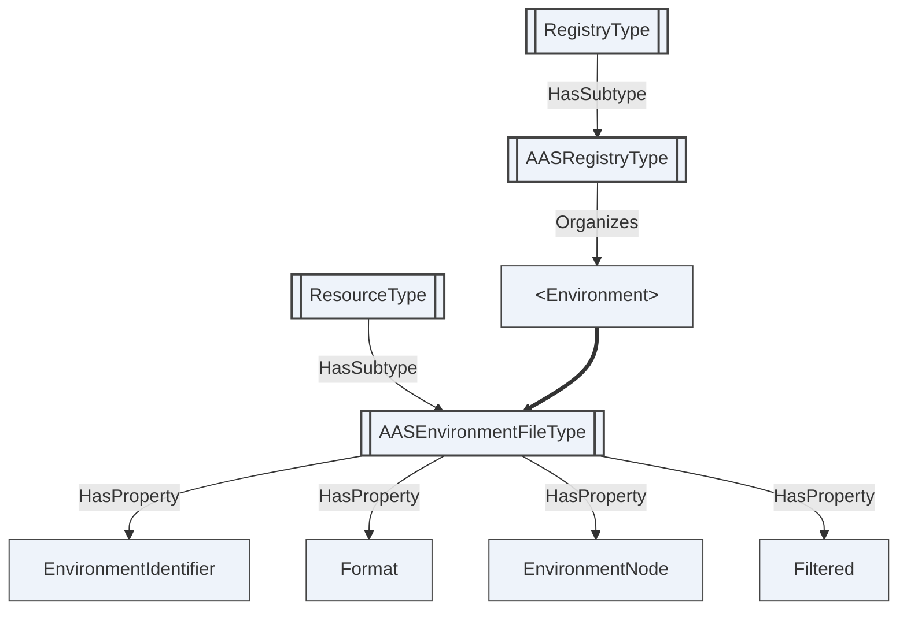

Figure 15 — The materialized environment served as a retrievable document

---

## 7 OPC UA ObjectTypes

### 7.1 `AASReferableType`

Abstract base of everything in the metamodel that can be referred to by a short name. Carries the identifying and descriptive attributes every element has.

### 7.2 `AASIdentifiableType`

Abstract base of the metamodel elements that carry a globally unique identifier: shells, submodels and concept descriptions.

### 7.3 `AASHasSemanticsType`

Abstract base of the elements that declare what concept they are an occurrence of.

### 7.4 `AASHasKindType`

Abstract base of the elements that distinguish a template from an instance.

### 7.5 `AASHasDataSpecificationType`

Abstract base of the elements that carry data specifications.

### 7.6 `AASQualifiableType`

Abstract base of the elements that can be qualified.

### 7.7 `AASEnvironmentType`

The container of shells, submodels and concept descriptions - the unit an AAS serialization carries and the root a source generator materializes into a Server.

### 7.8 `AASType`

An Asset Administration Shell: the digital representation of one asset, carrying the asset's identity and references to the submodels that describe it.

### 7.9 `AASAssetInformationType`

The identity of the asset a shell represents, as distinct from the identity of the shell itself.

### 7.10 `AASSubmodelType`

One coherent aspect of an asset, identified in its own right and typed by its SemanticId: a nameplate, technical data, a carbon footprint, a bill of material.

### 7.11 `AASConceptDescriptionType`

The definition a SemanticId resolves to - what makes two submodels from different vendors comparable.

### 7.12 `AASSubmodelElementType`

Abstract base of every element that can appear inside a submodel.

### 7.13 `AASPropertyType`

A single typed value. The value node carries the OPC UA DataType clause 6.3.1 assigns to the declared xsd type, from which the declared type is read.

### 7.14 `AASMultiLanguagePropertyType`

A value expressed in one or more languages. The array order is preserved, because the metamodel's serialization is ordered and a round trip that reordered it would not reproduce its input.

### 7.15 `AASRangeType`

A closed or half-open interval of a single typed value.

### 7.16 `AASBlobType`

Binary content carried inline.

### 7.17 `AASFileType`

A pointer to content held outside the element.

### 7.18 `AASReferenceElementType`

An element whose value is a reference.

### 7.19 `AASRelationshipElementType`

A directed relationship between two referenced things.

### 7.20 `AASAnnotatedRelationshipElementType`

A relationship carrying data elements that annotate it, such as a quantity or a position.

### 7.21 `AASSubmodelElementCollectionType`

An unordered set of elements, each identified by its own IdShort.

### 7.22 `AASSubmodelElementListType`

A list of elements. Its members have no IdShort, so they are named by index. Whether the order carries meaning is stated by the ReferenceType on each instance, not by a Property: HasOrderedComponent where it does, HasComponent where the list is a set or a bag. The declaration uses HasComponent, the base of both legal instance forms.

### 7.23 `AASEntityType`

A component of a composition. A self-managed entity carries the identifier of its own shell, so a bill of material is traversable across organizations.

### 7.24 `AASBasicEventElementType`

An event source or sink.

### 7.25 `AASOperationType`

An invocable operation.

### 7.26 `AASCapabilityType`

A declared capability of the asset. It carries no value of its own; the element's identity and semantics are the whole of its content.

### 7.27 `AASRegistryType`

The AAS Registry root - an xRegistry RegistryType, and therefore a FolderType - whose group folders hold shells, submodel templates, concept dictionaries and packages. Exposed as a well-known object under the Server object, so any Client that reaches the standard Server object discovers it.

### 7.28 `AASShellGroupType`

An xRegistry GroupType holding the submodel documents of one shell. Its source identity is the shell's authored identifier, from which the GroupId is constructed. It is distinct from AASType, which models the same shell as a live node tree rather than as a catalogue entry.

### 7.29 `AASSubmodelFileType`

An xRegistry ResourceType whose file content is one submodel document. Each version is one revision, which is what gives a shell the lifecycle history the metamodel does not itself provide.

### 7.30 `AASSubmodelTemplateGroupType`

An xRegistry GroupType holding one publisher's family of submodel templates. Templates are held in a group of their own so that a Consumer lists templates and instances separately.

### 7.31 `AASConceptDictionaryGroupType`

An xRegistry GroupType holding one dictionary of concept definitions - the definitions a SemanticId elsewhere in the registry resolves to.

### 7.32 `AASConceptDescriptionFileType`

An xRegistry ResourceType whose file content is one concept description document.

### 7.33 `AASPackageStoreGroupType`

An xRegistry GroupType holding packages - one store, or one namespace within one.

### 7.34 `AASPackageFileType`

An xRegistry ResourceType whose file content is one package. Every package carries mandatory strong integrity metadata for the exact returned blob; an OCI-backed version also carries the immutable manifest digest that is its version identity. Mutable tags are Resource-level discovery aliases, never Version identity, and OCI referrers are separate Resources rather than package Versions and cannot affect the package default Version.

### 7.35 `AASEnvironmentFileType`

An xRegistry ResourceType whose file content is one serialization of a materialized environment: an AAS JSON or XML environment document, or an AASX package. It is the retrievable form of an AASEnvironmentType folder, and its content is filtered to what the calling Session is permitted to read.

---

## 8 OPC UA DataTypes

The DataTypes defined by this document are enumerations. Each is formally defined in the NodeSet and listed in Annex A.

---

## 9 Instances

### 9.1 `AASRegistry`

Server-wide AAS Registry, a well-known component of the Server object.

---

## 10 Profiles and conformance units

An implementation conforms to this specification if it implements at least one of the two halves and
declares the corresponding conformance units.

| Unit | Requires |
|---|---|
| `AAS-Metamodel` | Shells, submodels and concept descriptions as typed nodes. |
| `AAS-SubmodelElements` | The submodel element types. |
| `AAS-ValueFidelity` | The xsd type assignment of clauses 6.1.2 and 6.3.1. |
| `AAS-InstanceMaterialization` | Materialization per clause 6.1.6. |
| `AAS-LosslessRoundTrip` | Both directions of clause 6.4. |
| `AAS-Registry` | The registry root, groups and submodel documents. |
| `AAS-RegistryIdentity` | Source identities and derived identifiers per clause 6.5.3. |
| `AAS-RegistryVersioning` | Versions as the lifecycle record, clause 6.5.4. |
| `AAS-Discovery` | `LookupShellsByAssetLink` and `GetSubmodel`. |
| `AAS-OperationInvoke` | `AASOperationType.Invoke`, clause 6.2.5. |
| `AAS-Federation` | External references and the identity rule of clause 6.5.6. |
| `AAS-DisclosureTiers` | `DisclosureTier` and `Authorization`, clause 6.5.7. |
| `AAS-UpdateableRegistry` | Generational materialization from stored documents, clause 6.5.9. |
| `AAS-EnvironmentExport` | The materialized environment served as filtered AAS and AASX documents, clause 6.5.10. Required of a Server claiming both `AAS-Registry` and `AAS-InstanceMaterialization`. |
| `AAS-Packages` | Package stores and package resources; requires `AAS-PackageIntegrity`. |
| `AAS-PackageIntegrity` | Mandatory package-blob digest and algorithm, OCI manifest-to-blob binding, immutable identity and tag rules, referrer separation and verification requirements of clause 6.5.4. |

`AAS-Metamodel` and `AAS-SubmodelElements` together are the baseline for the metamodel half;
`AAS-Registry` and `AAS-RegistryIdentity` for the registry half. `AAS-ValueFidelity` is required by
`AAS-LosslessRoundTrip`, which is the unit that makes source generation possible. An implementation
claiming `AAS-Packages` **shall** also claim `AAS-PackageIntegrity`.

---

## 11 Namespaces

### 11.1 Namespace metadata

The namespace metadata provide standardized information about the elements of this namespace, which an aggregating Server relies on. All Nodes defined by this document are static.

| Property | DataType | Value |
|---|---|---|
| NamespaceUri | String | `http://opcfoundation.org/UA/I4AAS/v3/` |
| NamespaceVersion | String | 3.00-draft3 |
| NamespacePublicationDate | DateTime | 2026-08-11 |
| IsNamespaceSubset | Boolean | False |
| StaticNodeIdTypes | IdType[] | 0 (Numeric) |
| StaticNumericNodeIdRange | NumericRange[] | 1001:9999 |
| StaticStringNodeIdPattern | String | -- |

### 11.2 Handling of OPC UA namespaces

Namespaces are used by OPC UA to create unique identifiers across different naming authorities. The following namespaces are used for BrowseNames in this document; the default namespace is not listed, because every BrowseName without a prefix uses it.

| NamespaceURI | Namespace index | Example |
|---|---|---|
| `http://opcfoundation.org/UA/` | 0 | `0:EngineeringUnits` |
| `http://opcfoundation.org/UA/xRegistry/` | 1 | `1:ResourceType` |

---

<a id="annex-a"></a>

## Annex A (normative) — Asset Administration Shell namespace and mappings

This annex is the normative node reference. It is generated from `tools/build_model.py` and always matches `Opc.Ua.I4AAS.NodeSet2.xml`. All nodes are defined in the companion namespace `http://opcfoundation.org/UA/I4AAS/v3/` (which requires the base OPC UA and xRegistry namespaces); the numeric NodeIds shown are **draft** identifiers within that namespace. The **Declared in** column marks members inherited from a supertype.

### Type overview

| NodeId | BrowseName | NodeClass | Subtype of |
|---|---|---|---|
| ns=2;i=1001 | [AASReferableType](#type-AASReferableType) | ObjectType | [BaseObjectType](https://reference.opcfoundation.org/specs/OPC-10000-5/6.2) |
| ns=2;i=1002 | [AASIdentifiableType](#type-AASIdentifiableType) | ObjectType | [AASReferableType](#type-AASReferableType) |
| ns=2;i=1003 | [AASHasSemanticsType](#type-AASHasSemanticsType) | ObjectType | [BaseObjectType](https://reference.opcfoundation.org/specs/OPC-10000-5/6.2) |
| ns=2;i=1004 | [AASHasKindType](#type-AASHasKindType) | ObjectType | [BaseObjectType](https://reference.opcfoundation.org/specs/OPC-10000-5/6.2) |
| ns=2;i=1005 | [AASHasDataSpecificationType](#type-AASHasDataSpecificationType) | ObjectType | [BaseObjectType](https://reference.opcfoundation.org/specs/OPC-10000-5/6.2) |
| ns=2;i=1006 | [AASQualifiableType](#type-AASQualifiableType) | ObjectType | [BaseObjectType](https://reference.opcfoundation.org/specs/OPC-10000-5/6.2) |
| ns=2;i=1010 | [AASEnvironmentType](#type-AASEnvironmentType) | ObjectType | [FolderType](https://reference.opcfoundation.org/specs/OPC-10000-5/6.6) |
| ns=2;i=1011 | [AASType](#type-AASType) | ObjectType | [AASIdentifiableType](#type-AASIdentifiableType) |
| ns=2;i=1012 | [AASAssetInformationType](#type-AASAssetInformationType) | ObjectType | [BaseObjectType](https://reference.opcfoundation.org/specs/OPC-10000-5/6.2) |
| ns=2;i=1013 | [AASSubmodelType](#type-AASSubmodelType) | ObjectType | [AASIdentifiableType](#type-AASIdentifiableType) |
| ns=2;i=1030 | [AASConceptDescriptionType](#type-AASConceptDescriptionType) | ObjectType | [AASIdentifiableType](#type-AASIdentifiableType) |
| ns=2;i=1020 | [AASSubmodelElementType](#type-AASSubmodelElementType) | ObjectType | [AASReferableType](#type-AASReferableType) |
| ns=2;i=1021 | [AASPropertyType](#type-AASPropertyType) | ObjectType | [AASSubmodelElementType](#type-AASSubmodelElementType) |
| ns=2;i=1022 | [AASMultiLanguagePropertyType](#type-AASMultiLanguagePropertyType) | ObjectType | [AASSubmodelElementType](#type-AASSubmodelElementType) |
| ns=2;i=1023 | [AASRangeType](#type-AASRangeType) | ObjectType | [AASSubmodelElementType](#type-AASSubmodelElementType) |
| ns=2;i=1024 | [AASBlobType](#type-AASBlobType) | ObjectType | [AASSubmodelElementType](#type-AASSubmodelElementType) |
| ns=2;i=1025 | [AASFileType](#type-AASFileType) | ObjectType | [AASSubmodelElementType](#type-AASSubmodelElementType) |
| ns=2;i=1026 | [AASReferenceElementType](#type-AASReferenceElementType) | ObjectType | [AASSubmodelElementType](#type-AASSubmodelElementType) |
| ns=2;i=1027 | [AASRelationshipElementType](#type-AASRelationshipElementType) | ObjectType | [AASSubmodelElementType](#type-AASSubmodelElementType) |
| ns=2;i=1028 | [AASAnnotatedRelationshipElementType](#type-AASAnnotatedRelationshipElementType) | ObjectType | [AASRelationshipElementType](#type-AASRelationshipElementType) |
| ns=2;i=1029 | [AASSubmodelElementCollectionType](#type-AASSubmodelElementCollectionType) | ObjectType | [AASSubmodelElementType](#type-AASSubmodelElementType) |
| ns=2;i=1031 | [AASSubmodelElementListType](#type-AASSubmodelElementListType) | ObjectType | [AASSubmodelElementType](#type-AASSubmodelElementType) |
| ns=2;i=1032 | [AASEntityType](#type-AASEntityType) | ObjectType | [AASSubmodelElementType](#type-AASSubmodelElementType) |
| ns=2;i=1033 | [AASBasicEventElementType](#type-AASBasicEventElementType) | ObjectType | [AASSubmodelElementType](#type-AASSubmodelElementType) |
| ns=2;i=1034 | [AASOperationType](#type-AASOperationType) | ObjectType | [AASSubmodelElementType](#type-AASSubmodelElementType) |
| ns=2;i=1035 | [AASCapabilityType](#type-AASCapabilityType) | ObjectType | [AASSubmodelElementType](#type-AASSubmodelElementType) |
| ns=2;i=1100 | [AASRegistryType](#type-AASRegistryType) | ObjectType | ns=1;i=63000 |
| ns=2;i=1101 | [AASShellGroupType](#type-AASShellGroupType) | ObjectType | ns=1;i=63001 |
| ns=2;i=1102 | [AASSubmodelFileType](#type-AASSubmodelFileType) | ObjectType | ns=1;i=63002 |
| ns=2;i=1103 | [AASSubmodelTemplateGroupType](#type-AASSubmodelTemplateGroupType) | ObjectType | ns=1;i=63001 |
| ns=2;i=1104 | [AASConceptDictionaryGroupType](#type-AASConceptDictionaryGroupType) | ObjectType | ns=1;i=63001 |
| ns=2;i=1105 | [AASConceptDescriptionFileType](#type-AASConceptDescriptionFileType) | ObjectType | ns=1;i=63002 |
| ns=2;i=1106 | [AASPackageStoreGroupType](#type-AASPackageStoreGroupType) | ObjectType | ns=1;i=63001 |
| ns=2;i=1107 | [AASPackageFileType](#type-AASPackageFileType) | ObjectType | ns=1;i=63002 |
| ns=2;i=1108 | [AASEnvironmentFileType](#type-AASEnvironmentFileType) | ObjectType | ns=1;i=63002 |
| ns=2;i=1180 | [AASAnyUri](#type-AASAnyUri) | DataType | String |
| ns=2;i=1181 | [AASHexBinary](#type-AASHexBinary) | DataType | ByteString |
| ns=2;i=1182 | [AASNonPositiveInteger](#type-AASNonPositiveInteger) | DataType | Integer |
| ns=2;i=1183 | [AASNegativeInteger](#type-AASNegativeInteger) | DataType | [AASNonPositiveInteger](#type-AASNonPositiveInteger) |
| ns=2;i=1184 | [AASPositiveInteger](#type-AASPositiveInteger) | DataType | UInteger |
| ns=2;i=1185 | [AASGYear](#type-AASGYear) | DataType | String |
| ns=2;i=1186 | [AASGYearMonth](#type-AASGYearMonth) | DataType | String |
| ns=2;i=1187 | [AASGMonth](#type-AASGMonth) | DataType | String |
| ns=2;i=1188 | [AASGMonthDay](#type-AASGMonthDay) | DataType | String |
| ns=2;i=1189 | [AASGDay](#type-AASGDay) | DataType | String |
| ns=2;i=1199 | [AASValueString](#type-AASValueString) | DataType | String |
| ns=2;i=1200 | [AASAssetKindDataType](#type-AASAssetKindDataType) | DataType | Enumeration |
| ns=2;i=1201 | [AASModellingKindDataType](#type-AASModellingKindDataType) | DataType | Enumeration |
| ns=2;i=1202 | [AASEntityTypeDataType](#type-AASEntityTypeDataType) | DataType | Enumeration |
| ns=2;i=1203 | [AASDirectionDataType](#type-AASDirectionDataType) | DataType | Enumeration |
| ns=2;i=1204 | [AASStateOfEventDataType](#type-AASStateOfEventDataType) | DataType | Enumeration |
| ns=2;i=1205 | [AASQualifierKindDataType](#type-AASQualifierKindDataType) | DataType | Enumeration |
| ns=2;i=1206 | [AASReferenceTypesDataType](#type-AASReferenceTypesDataType) | DataType | Enumeration |
| ns=2;i=1207 | [AASKeyTypesDataType](#type-AASKeyTypesDataType) | DataType | Enumeration |
| ns=2;i=1208 | [AASDataTypeDefXsdDataType](#type-AASDataTypeDefXsdDataType) | DataType | Enumeration |
| ns=2;i=1209 | [AASDataTypeIec61360DataType](#type-AASDataTypeIec61360DataType) | DataType | Enumeration |
| ns=2;i=1210 | [AASSubmodelElementsDataType](#type-AASSubmodelElementsDataType) | DataType | Enumeration |
| ns=2;i=1211 | [AASDisclosureTierDataType](#type-AASDisclosureTierDataType) | DataType | Enumeration |
| ns=2;i=1212 | [AASLoadStateDataType](#type-AASLoadStateDataType) | DataType | Enumeration |
| ns=2;i=1213 | [AASMaterializationOutcomeDataType](#type-AASMaterializationOutcomeDataType) | DataType | Enumeration |
| ns=2;i=1220 | [AASKeyDataType](#type-AASKeyDataType) | DataType | [Structure](https://reference.opcfoundation.org/specs/OPC-10000-5/8.24) |
| ns=2;i=1221 | [AASReferenceDataType](#type-AASReferenceDataType) | DataType | [Structure](https://reference.opcfoundation.org/specs/OPC-10000-5/8.24) |
| ns=2;i=1222 | [AASLangStringDataType](#type-AASLangStringDataType) | DataType | [Structure](https://reference.opcfoundation.org/specs/OPC-10000-5/8.24) |
| ns=2;i=1223 | [AASSpecificAssetIdDataType](#type-AASSpecificAssetIdDataType) | DataType | [Structure](https://reference.opcfoundation.org/specs/OPC-10000-5/8.24) |
| ns=2;i=1224 | [AASAdministrativeInformationDataType](#type-AASAdministrativeInformationDataType) | DataType | [Structure](https://reference.opcfoundation.org/specs/OPC-10000-5/8.24) |
| ns=2;i=1225 | [AASQualifierDataType](#type-AASQualifierDataType) | DataType | [Structure](https://reference.opcfoundation.org/specs/OPC-10000-5/8.24) |
| ns=2;i=1226 | [AASEmbeddedDataSpecificationDataType](#type-AASEmbeddedDataSpecificationDataType) | DataType | [Structure](https://reference.opcfoundation.org/specs/OPC-10000-5/8.24) |
| ns=2;i=1227 | [AASDataSpecificationIec61360DataType](#type-AASDataSpecificationIec61360DataType) | DataType | [Structure](https://reference.opcfoundation.org/specs/OPC-10000-5/8.24) |
| ns=2;i=1228 | [AASExtensionDataType](#type-AASExtensionDataType) | DataType | [Structure](https://reference.opcfoundation.org/specs/OPC-10000-5/8.24) |
| ns=2;i=1229 | [AASResourceDataType](#type-AASResourceDataType) | DataType | [Structure](https://reference.opcfoundation.org/specs/OPC-10000-5/8.24) |
| ns=2;i=1230 | [AASOperationVariableDataType](#type-AASOperationVariableDataType) | DataType | [Structure](https://reference.opcfoundation.org/specs/OPC-10000-5/8.24) |
| ns=2;i=1231 | [AASAuthorizationOptionDataType](#type-AASAuthorizationOptionDataType) | DataType | [Structure](https://reference.opcfoundation.org/specs/OPC-10000-5/8.24) |
| ns=2;i=1232 | [AASAttestationDataType](#type-AASAttestationDataType) | DataType | [Structure](https://reference.opcfoundation.org/specs/OPC-10000-5/8.24) |
| ns=2;i=1233 | [AASMaterializationResultDataType](#type-AASMaterializationResultDataType) | DataType | [Structure](https://reference.opcfoundation.org/specs/OPC-10000-5/8.24) |
| ns=2;i=1234 | [AASValueReferencePairDataType](#type-AASValueReferencePairDataType) | DataType | [Structure](https://reference.opcfoundation.org/specs/OPC-10000-5/8.24) |
| ns=2;i=1235 | [AASValueListDataType](#type-AASValueListDataType) | DataType | [Structure](https://reference.opcfoundation.org/specs/OPC-10000-5/8.24) |
| ns=2;i=1236 | [AASLevelTypeDataType](#type-AASLevelTypeDataType) | DataType | [Structure](https://reference.opcfoundation.org/specs/OPC-10000-5/8.24) |

`AASAttestationDataType` is carried by the `Attestations` attribute inherited from the xRegistry
`ResourceType`. It therefore has no Variable declared by this namespace as its carrier.

### Object types

<a id="type-AASReferableType"></a>

#### AASReferableType  (ns=2;i=1001)

*Inherits from:* [BaseObjectType](https://reference.opcfoundation.org/specs/OPC-10000-5/6.2)

Abstract base of everything in the metamodel that can be referred to by a short name. Carries the identifying and descriptive attributes every element has.

| BrowseName | NodeClass | DataType | ModellingRule | Declared in | Description |
|---|---|---|---|---|---|
| IdShort | Variable | String | Optional | AASReferableType | The short name, unique only within its parent. It is never an identifier: two elements from different publishers routinely share one. Absent for an element inside a SubmodelElementList, which is addressed by index instead. |
| Category | Variable | String | Optional | AASReferableType | Deprecated in the metamodel and retained only so that a document carrying it round-trips unchanged. |
| DisplayNameSet | Variable | [AASLangStringDataType](#type-AASLangStringDataType)\[\] | Optional | AASReferableType | Display name per language. |
| DescriptionSet | Variable | [AASLangStringDataType](#type-AASLangStringDataType)\[\] | Optional | AASReferableType | Description per language. |
| Extensions | Variable | [AASExtensionDataType](#type-AASExtensionDataType)\[\] | Optional | AASReferableType | Proprietary extensions, preserved verbatim. |
| ModelType | Variable | String | Mandatory | AASReferableType | The metamodel class name of this element. It is redundant with the ObjectType and is carried so that a serialization produced from the AddressSpace is byte-identical to the one that produced it. |

<a id="type-AASIdentifiableType"></a>

#### AASIdentifiableType  (ns=2;i=1002)

*Inherits from:* [AASReferableType](#type-AASReferableType)

Abstract base of the metamodel elements that carry a globally unique identifier: shells, submodels and concept descriptions.

| BrowseName | NodeClass | DataType | ModellingRule | Declared in | Description |
|---|---|---|---|---|---|
| Id | Variable | String | Mandatory | AASIdentifiableType | The globally unique identifier, up to 2048 characters. It is arbitrary text and can never be a BrowseName, so it is carried here and the node is named by the derived identifier instead. |
| Administration | Variable | [AASAdministrativeInformationDataType](#type-AASAdministrativeInformationDataType) | Optional | AASIdentifiableType | Administrative information: a single current revision, with no history. |

<a id="type-AASHasSemanticsType"></a>

#### AASHasSemanticsType  (ns=2;i=1003)

*Inherits from:* [BaseObjectType](https://reference.opcfoundation.org/specs/OPC-10000-5/6.2)

Abstract base of the elements that declare what concept they are an occurrence of.

| BrowseName | NodeClass | DataType | ModellingRule | Declared in | Description |
|---|---|---|---|---|---|
| SemanticId | Variable | [AASReferenceDataType](#type-AASReferenceDataType) | Optional | AASHasSemanticsType | The concept this element is an occurrence of, by which an element is discoverable by meaning rather than by name. |
| SupplementalSemanticIds | Variable | [AASReferenceDataType](#type-AASReferenceDataType)\[\] | Optional | AASHasSemanticsType | Further concepts this element corresponds to, which is how one element is made discoverable through more than one dictionary. |

<a id="type-AASHasKindType"></a>

#### AASHasKindType  (ns=2;i=1004)

*Inherits from:* [BaseObjectType](https://reference.opcfoundation.org/specs/OPC-10000-5/6.2)

Abstract base of the elements that distinguish a template from an instance.

| BrowseName | NodeClass | DataType | ModellingRule | Declared in | Description |
|---|---|---|---|---|---|
| Kind | Variable | [AASModellingKindDataType](#type-AASModellingKindDataType) | Optional | AASHasKindType | Whether this element defines a shape or carries values. |

<a id="type-AASHasDataSpecificationType"></a>

#### AASHasDataSpecificationType  (ns=2;i=1005)

*Inherits from:* [BaseObjectType](https://reference.opcfoundation.org/specs/OPC-10000-5/6.2)

Abstract base of the elements that carry data specifications.

| BrowseName | NodeClass | DataType | ModellingRule | Declared in | Description |
|---|---|---|---|---|---|
| EmbeddedDataSpecifications | Variable | [AASEmbeddedDataSpecificationDataType](#type-AASEmbeddedDataSpecificationDataType)\[\] | Optional | AASHasDataSpecificationType | Data specifications carried by this element. |

<a id="type-AASQualifiableType"></a>

#### AASQualifiableType  (ns=2;i=1006)

*Inherits from:* [BaseObjectType](https://reference.opcfoundation.org/specs/OPC-10000-5/6.2)

Abstract base of the elements that can be qualified.

| BrowseName | NodeClass | DataType | ModellingRule | Declared in | Description |
|---|---|---|---|---|---|
| Qualifiers | Variable | [AASQualifierDataType](#type-AASQualifierDataType)\[\] | Optional | AASQualifiableType | Qualifiers constraining or annotating this element. |

<a id="type-AASEnvironmentType"></a>

#### AASEnvironmentType  (ns=2;i=1010)

*Inherits from:* [FolderType](https://reference.opcfoundation.org/specs/OPC-10000-5/6.6)

The container of shells, submodels and concept descriptions - the unit an AAS serialization carries and the root a source generator materializes into a Server.

| BrowseName | NodeClass | DataType | ModellingRule | Declared in | Description |
|---|---|---|---|---|---|
| <AssetAdministrationShell> | Object |  | OptionalPlaceholder | AASEnvironmentType | A shell held by this environment. |
| <Submodel> | Object |  | OptionalPlaceholder | AASEnvironmentType | A submodel held by this environment. Submodels are top-level: one submodel may be referenced by several shells, which is why they are not nested inside them. |
| <ConceptDescription> | Object |  | OptionalPlaceholder | AASEnvironmentType | A concept description held by this environment. |

<a id="type-AASType"></a>

#### AASType  (ns=2;i=1011)

*Inherits from:* [AASIdentifiableType](#type-AASIdentifiableType)

An Asset Administration Shell: the digital representation of one asset, carrying the asset's identity and references to the submodels that describe it.

| BrowseName | NodeClass | DataType | ModellingRule | Declared in | Description |
|---|---|---|---|---|---|
| AssetInformation | Object |  | Mandatory | AASType | The identity of the asset this shell represents. |
| SubmodelReferences | Variable | [AASReferenceDataType](#type-AASReferenceDataType)\[\] | Optional | AASType | References to the submodels describing this asset. A submodel is not owned by the shell that references it. |
| DerivedFrom | Variable | [AASReferenceDataType](#type-AASReferenceDataType) | Optional | AASType | The Type shell this Instance shell was derived from, so an individual item can be traced to its product model. |
| EmbeddedDataSpecifications | Variable | [AASEmbeddedDataSpecificationDataType](#type-AASEmbeddedDataSpecificationDataType)\[\] | Optional | AASType | Data specifications carried by this shell. |

<a id="type-AASAssetInformationType"></a>

#### AASAssetInformationType  (ns=2;i=1012)

*Inherits from:* [BaseObjectType](https://reference.opcfoundation.org/specs/OPC-10000-5/6.2)

The identity of the asset a shell represents, as distinct from the identity of the shell itself.

| BrowseName | NodeClass | DataType | ModellingRule | Declared in | Description |
|---|---|---|---|---|---|
| AssetKind | Variable | [AASAssetKindDataType](#type-AASAssetKindDataType) | Mandatory | AASAssetInformationType | Whether the asset is a product model, an individual item, a batch, a role, or none of these. |
| GlobalAssetId | Variable | String | Optional | AASAssetInformationType | The globally unique identifier of the asset itself. Where the asset carries an identification link, that link is this value, and it is what connects a code scanned from a physical product to this Server. |
| AssetType | Variable | String | Optional | AASAssetInformationType | The identifier of the asset type this asset is an occurrence of. |
| SpecificAssetIds | Variable | [AASSpecificAssetIdDataType](#type-AASSpecificAssetIdDataType)\[\] | Optional | AASAssetInformationType | The additional keys the asset is discoverable by. |
| DefaultThumbnail | Variable | [AASResourceDataType](#type-AASResourceDataType) | Optional | AASAssetInformationType | A pointer to a representative image of the asset. |

<a id="type-AASSubmodelType"></a>

#### AASSubmodelType  (ns=2;i=1013)

*Inherits from:* [AASIdentifiableType](#type-AASIdentifiableType)

One coherent aspect of an asset, identified in its own right and typed by its SemanticId: a nameplate, technical data, a carbon footprint, a bill of material.

| BrowseName | NodeClass | DataType | ModellingRule | Declared in | Description |
|---|---|---|---|---|---|
| Kind | Variable | [AASModellingKindDataType](#type-AASModellingKindDataType) | Optional | AASSubmodelType | Whether this submodel carries values or defines a shape other submodels are built from. |
| SemanticId | Variable | [AASReferenceDataType](#type-AASReferenceDataType) | Optional | AASSubmodelType | The concept this submodel is an occurrence of. |
| SupplementalSemanticIds | Variable | [AASReferenceDataType](#type-AASReferenceDataType)\[\] | Optional | AASSubmodelType | Further concepts this submodel corresponds to. |
| Qualifiers | Variable | [AASQualifierDataType](#type-AASQualifierDataType)\[\] | Optional | AASSubmodelType | Qualifiers on this submodel. |
| EmbeddedDataSpecifications | Variable | [AASEmbeddedDataSpecificationDataType](#type-AASEmbeddedDataSpecificationDataType)\[\] | Optional | AASSubmodelType | Data specifications carried by this submodel. |
| <SubmodelElement> | Object |  | OptionalPlaceholder | AASSubmodelType | An element of this submodel. |

<a id="type-AASConceptDescriptionType"></a>

#### AASConceptDescriptionType  (ns=2;i=1030)

*Inherits from:* [AASIdentifiableType](#type-AASIdentifiableType)

The definition a SemanticId resolves to - what makes two submodels from different vendors comparable.

| BrowseName | NodeClass | DataType | ModellingRule | Declared in | Description |
|---|---|---|---|---|---|
| IsCaseOf | Variable | [AASReferenceDataType](#type-AASReferenceDataType)\[\] | Optional | AASConceptDescriptionType | Concepts in other dictionaries this concept corresponds to, which is how a Server bridges two classification systems without asserting that either is canonical. |
| EmbeddedDataSpecifications | Variable | [AASEmbeddedDataSpecificationDataType](#type-AASEmbeddedDataSpecificationDataType)\[\] | Optional | AASConceptDescriptionType | The data specifications defining this concept. |

<a id="type-AASSubmodelElementType"></a>

#### AASSubmodelElementType  (ns=2;i=1020)

*Inherits from:* [AASReferableType](#type-AASReferableType)

Abstract base of every element that can appear inside a submodel.

| BrowseName | NodeClass | DataType | ModellingRule | Declared in | Description |
|---|---|---|---|---|---|
| SemanticId | Variable | [AASReferenceDataType](#type-AASReferenceDataType) | Optional | AASSubmodelElementType | The concept this element is an occurrence of. |
| SupplementalSemanticIds | Variable | [AASReferenceDataType](#type-AASReferenceDataType)\[\] | Optional | AASSubmodelElementType | Further concepts this element corresponds to. |
| Qualifiers | Variable | [AASQualifierDataType](#type-AASQualifierDataType)\[\] | Optional | AASSubmodelElementType | Qualifiers on this element. |
| EmbeddedDataSpecifications | Variable | [AASEmbeddedDataSpecificationDataType](#type-AASEmbeddedDataSpecificationDataType)\[\] | Optional | AASSubmodelElementType | Data specifications carried by this element. |
| Index | Variable | UInt32 | Optional | AASSubmodelElementType | The element's zero-based position within an ordered containing construct: its parent SubmodelElementList or one variable role of its parent Operation. For an Operation variable value it is mandatory and the role array position is authoritative. For a list member it is optional and recommended wherever the list's order is relevant, because Browse is not required to return references in order. |

<a id="type-AASPropertyType"></a>

#### AASPropertyType  (ns=2;i=1021)

*Inherits from:* [AASSubmodelElementType](#type-AASSubmodelElementType)

A single typed value. The value node carries the OPC UA DataType clause 6.3.1 assigns to the declared xsd type, from which the declared type is read.

| BrowseName | NodeClass | DataType | ModellingRule | Declared in | Description |
|---|---|---|---|---|---|
| ValueType | Variable | [AASDataTypeDefXsdDataType](#type-AASDataTypeDefXsdDataType) | Mandatory | AASPropertyType | The xsd type the value is expressed in. Mandatory: the metamodel makes it mandatory and the value optional, so a Property with no value has no value node whose DataType could carry it. |
| Value | Variable | BaseDataType | Optional | AASPropertyType | The value. Declared as BaseDataType here because the concrete DataType depends on ValueType; a materialized node carries the specific DataType clause 6.3.1 assigns. |
| ValueId | Variable | [AASReferenceDataType](#type-AASReferenceDataType) | Optional | AASPropertyType | A reference to the value, where the value is itself an identified concept. |

<a id="type-AASMultiLanguagePropertyType"></a>

#### AASMultiLanguagePropertyType  (ns=2;i=1022)

*Inherits from:* [AASSubmodelElementType](#type-AASSubmodelElementType)

A value expressed in one or more languages. The array order is preserved, because the metamodel's serialization is ordered and a round trip that reordered it would not reproduce its input.

| BrowseName | NodeClass | DataType | ModellingRule | Declared in | Description |
|---|---|---|---|---|---|
| Value | Variable | [AASLangStringDataType](#type-AASLangStringDataType)\[\] | Optional | AASMultiLanguagePropertyType | The language-tagged values, in order. |
| ValueId | Variable | [AASReferenceDataType](#type-AASReferenceDataType) | Optional | AASMultiLanguagePropertyType | A reference to the value, where the value is itself an identified concept. |

<a id="type-AASRangeType"></a>

#### AASRangeType  (ns=2;i=1023)

*Inherits from:* [AASSubmodelElementType](#type-AASSubmodelElementType)

A closed or half-open interval of a single typed value.

| BrowseName | NodeClass | DataType | ModellingRule | Declared in | Description |
|---|---|---|---|---|---|
| ValueType | Variable | [AASDataTypeDefXsdDataType](#type-AASDataTypeDefXsdDataType) | Mandatory | AASRangeType | The xsd type the bounds are expressed in. Mandatory: both bounds are optional and the declared type is not. |
| Min | Variable | BaseDataType | Optional | AASRangeType | The lower bound, carrying the DataType clause 6.3.1 assigns to ValueType. Absent means unbounded below, which is different from a bound of zero. |
| Max | Variable | BaseDataType | Optional | AASRangeType | The upper bound. Absent means unbounded above. |

<a id="type-AASBlobType"></a>

#### AASBlobType  (ns=2;i=1024)

*Inherits from:* [AASSubmodelElementType](#type-AASSubmodelElementType)

Binary content carried inline.

| BrowseName | NodeClass | DataType | ModellingRule | Declared in | Description |
|---|---|---|---|---|---|
| Value | Variable | ByteString | Optional | AASBlobType | The content bytes. |
| ContentType | Variable | String | Mandatory | AASBlobType | Media type of the content. |

<a id="type-AASFileType"></a>

#### AASFileType  (ns=2;i=1025)

*Inherits from:* [AASSubmodelElementType](#type-AASSubmodelElementType)

A pointer to content held outside the element.

| BrowseName | NodeClass | DataType | ModellingRule | Declared in | Description |
|---|---|---|---|---|---|
| Value | Variable | String | Optional | AASFileType | Path or URL to the content. |
| ContentType | Variable | String | Mandatory | AASFileType | Media type of the content. |

<a id="type-AASReferenceElementType"></a>

#### AASReferenceElementType  (ns=2;i=1026)

*Inherits from:* [AASSubmodelElementType](#type-AASSubmodelElementType)

An element whose value is a reference.

| BrowseName | NodeClass | DataType | ModellingRule | Declared in | Description |
|---|---|---|---|---|---|
| Value | Variable | [AASReferenceDataType](#type-AASReferenceDataType) | Optional | AASReferenceElementType | The reference. |

<a id="type-AASRelationshipElementType"></a>

#### AASRelationshipElementType  (ns=2;i=1027)

*Inherits from:* [AASSubmodelElementType](#type-AASSubmodelElementType)

A directed relationship between two referenced things.

| BrowseName | NodeClass | DataType | ModellingRule | Declared in | Description |
|---|---|---|---|---|---|
| First | Variable | [AASReferenceDataType](#type-AASReferenceDataType) | Mandatory | AASRelationshipElementType | The first, or source, end of the relationship. |
| Second | Variable | [AASReferenceDataType](#type-AASReferenceDataType) | Mandatory | AASRelationshipElementType | The second, or target, end of the relationship. |

<a id="type-AASAnnotatedRelationshipElementType"></a>

#### AASAnnotatedRelationshipElementType  (ns=2;i=1028)

*Inherits from:* [AASRelationshipElementType](#type-AASRelationshipElementType)

A relationship carrying data elements that annotate it, such as a quantity or a position.

| BrowseName | NodeClass | DataType | ModellingRule | Declared in | Description |
|---|---|---|---|---|---|
| <Annotation> | Object |  | OptionalPlaceholder | AASAnnotatedRelationshipElementType | A data element annotating this relationship. |

<a id="type-AASSubmodelElementCollectionType"></a>

#### AASSubmodelElementCollectionType  (ns=2;i=1029)

*Inherits from:* [AASSubmodelElementType](#type-AASSubmodelElementType)

An unordered set of elements, each identified by its own IdShort.

| BrowseName | NodeClass | DataType | ModellingRule | Declared in | Description |
|---|---|---|---|---|---|
| <SubmodelElement> | Object |  | OptionalPlaceholder | AASSubmodelElementCollectionType | An element of this collection. |

<a id="type-AASSubmodelElementListType"></a>

#### AASSubmodelElementListType  (ns=2;i=1031)

*Inherits from:* [AASSubmodelElementType](#type-AASSubmodelElementType)

A list of elements. Its members have no IdShort, so they are named by index. Whether the order carries meaning is stated by the ReferenceType on each instance, not by a Property: HasOrderedComponent where it does, HasComponent where the list is a set or a bag. The declaration uses HasComponent, the base of both legal instance forms.

| BrowseName | NodeClass | DataType | ModellingRule | Declared in | Description |
|---|---|---|---|---|---|
| TypeValueListElement | Variable | [AASSubmodelElementsDataType](#type-AASSubmodelElementsDataType) | Mandatory | AASSubmodelElementListType | The element kind every member is constrained to. |
| SemanticIdListElement | Variable | [AASReferenceDataType](#type-AASReferenceDataType) | Optional | AASSubmodelElementListType | The concept every member is an occurrence of, where they share one. |
| ValueTypeListElement | Variable | [AASDataTypeDefXsdDataType](#type-AASDataTypeDefXsdDataType) | Optional | AASSubmodelElementListType | The xsd type every member's value is expressed in, where they share one. Mandatory in the metamodel when the members are Properties or Ranges. |
| <Element> | Object |  | OptionalPlaceholder | AASSubmodelElementListType | A member of this list, named by its index. The declaration uses HasComponent; an instance uses HasOrderedComponent where the list's order is relevant and HasComponent where it is not. |

<a id="type-AASEntityType"></a>

#### AASEntityType  (ns=2;i=1032)

*Inherits from:* [AASSubmodelElementType](#type-AASSubmodelElementType)

A component of a composition. A self-managed entity carries the identifier of its own shell, so a bill of material is traversable across organizations.

| BrowseName | NodeClass | DataType | ModellingRule | Declared in | Description |
|---|---|---|---|---|---|
| EntityType | Variable | [AASEntityTypeDataType](#type-AASEntityTypeDataType) | Mandatory | AASEntityType | Whether the component has its own shell or is managed within its parent. |
| GlobalAssetId | Variable | String | Optional | AASEntityType | The identifier of the component's own asset, for a self-managed entity. |
| SpecificAssetIds | Variable | [AASSpecificAssetIdDataType](#type-AASSpecificAssetIdDataType)\[\] | Optional | AASEntityType | Additional keys the component is discoverable by. |
| <Statement> | Object |  | OptionalPlaceholder | AASEntityType | A statement about the component. |

<a id="type-AASBasicEventElementType"></a>

#### AASBasicEventElementType  (ns=2;i=1033)

*Inherits from:* [AASSubmodelElementType](#type-AASSubmodelElementType)

An event source or sink.

| BrowseName | NodeClass | DataType | ModellingRule | Declared in | Description |
|---|---|---|---|---|---|
| Observed | Variable | [AASReferenceDataType](#type-AASReferenceDataType) | Mandatory | AASBasicEventElementType | What the event observes. |
| Direction | Variable | [AASDirectionDataType](#type-AASDirectionDataType) | Mandatory | AASBasicEventElementType | Whether the event is produced or consumed. |
| State | Variable | [AASStateOfEventDataType](#type-AASStateOfEventDataType) | Mandatory | AASBasicEventElementType | Whether the event source is active. |
| MessageTopic | Variable | String | Optional | AASBasicEventElementType | The topic events are delivered on. Where the delivery endpoint is itself catalogued, the registry entry points at it. |
| MessageBroker | Variable | [AASReferenceDataType](#type-AASReferenceDataType) | Optional | AASBasicEventElementType | The broker delivering the events. |
| LastUpdate | Variable | DateTime | Optional | AASBasicEventElementType | When the event last fired. The metamodel types this xs:dateTime, which clause 6.3.1 assigns DateTime. |
| MinInterval | Variable | DurationString | Optional | AASBasicEventElementType | Minimum interval between events. The metamodel types this xs:duration, which clause 6.3.1 assigns DurationString. |
| MaxInterval | Variable | DurationString | Optional | AASBasicEventElementType | Maximum interval between events. The metamodel types this xs:duration, which clause 6.3.1 assigns DurationString. |

<a id="type-AASOperationType"></a>

#### AASOperationType  (ns=2;i=1034)

*Inherits from:* [AASSubmodelElementType](#type-AASSubmodelElementType)

An invocable operation.

| BrowseName | NodeClass | DataType | ModellingRule | Declared in | Description |
|---|---|---|---|---|---|
| InputVariables | Variable | [AASOperationVariableDataType](#type-AASOperationVariableDataType)\[\] | Optional | AASOperationType | The operation's input variables, in order. Each entry points to one direct operation-variable child and the array position is authoritative. |
| OutputVariables | Variable | [AASOperationVariableDataType](#type-AASOperationVariableDataType)\[\] | Optional | AASOperationType | The operation's output variables, in order. Each entry points to one direct operation-variable child and the array position is authoritative. |
| InoutputVariables | Variable | [AASOperationVariableDataType](#type-AASOperationVariableDataType)\[\] | Optional | AASOperationType | The operation's in-out variables, in order. Each entry points to one direct operation-variable child and the array position is authoritative. |
| <Variable> | Object |  | OptionalPlaceholder | AASOperationType | A direct HasComponent child carrying one operation variable value. Its role array entry points to it by ValueNodeId, and its Index equals its position within that role. |
| Invoke | Method |  | Optional | AASOperationType | Invoke the operation and return its results. The Call counterpart of InvokeOperation in the AAS API of IDTA-01002 Part 2: a Client that has browsed to the Operation element calls this rather than reaching for the HTTP interface, and the two carry the same arguments in the same order. |

<a id="type-AASCapabilityType"></a>

#### AASCapabilityType  (ns=2;i=1035)

*Inherits from:* [AASSubmodelElementType](#type-AASSubmodelElementType)

A declared capability of the asset. It carries no value of its own; the element's identity and semantics are the whole of its content.

<a id="type-AASRegistryType"></a>

#### AASRegistryType  (ns=2;i=1100)

*Inherits from:* ns=1;i=63000

The AAS Registry root - an xRegistry RegistryType, and therefore a FolderType - whose group folders hold shells, submodel templates, concept dictionaries and packages. Exposed as a well-known object under the Server object, so any Client that reaches the standard Server object discovers it.

| BrowseName | NodeClass | DataType | ModellingRule | Declared in | Description |
|---|---|---|---|---|---|
| <ShellGroup> | Object |  | OptionalPlaceholder | AASRegistryType | A shell folder held by the registry. |
| <SubmodelTemplateGroup> | Object |  | OptionalPlaceholder | AASRegistryType | A submodel template family held by the registry. |
| <ConceptDictionaryGroup> | Object |  | OptionalPlaceholder | AASRegistryType | A concept dictionary held by the registry. |
| <PackageStoreGroup> | Object |  | OptionalPlaceholder | AASRegistryType | A package store held by the registry. |
| <Environment> | Object |  | OptionalPlaceholder | AASRegistryType | A serialization of one materialized environment, held by the registry as a retrievable document. |
| LookupShellsByAssetLink | Method |  | Optional | AASRegistryType | Return the shells discoverable by an asset key. This is the discovery question - given a serial number or a part identifier, which shells describe it - answered without the caller browsing the whole collection. |
| GetSubmodel | Method |  | Optional | AASRegistryType | Resolve the selected AASSubmodelFileType before returning its document and enforce the same Session-specific effective RolePermissions, UserRolePermissions, DisclosureTier, Authorization and FileType Open/Read decision as direct access to that target. Call permission on this Method does not authorize the target. Return Bad_UserAccessDenied, or Bad_NotFound where policy conceals existence, without exposing controlled bytes, Format, ContentType, other target metadata or a distinguishable timing path. |
| AutoMaterialize | Variable | Boolean | Optional | AASRegistryType | Whether a change to a stored document re-materializes the AddressSpace without being asked. Part of the updateable registry profile. |
| MaterializationGeneration | Variable | UInt32 | Optional | AASRegistryType | Increments once on each committed switch. A Client correlates a node's NodeVersion with the generation that produced it. |
| Materialize | Method |  | Optional | AASRegistryType | Re-materialize the AddressSpace from the stored documents. Part of the updateable registry profile: the documents are canonical and the nodes are derived, so this is the operation that makes the derived side agree with the canonical one. |

<a id="type-AASShellGroupType"></a>

#### AASShellGroupType  (ns=2;i=1101)

*Inherits from:* ns=1;i=63001

An xRegistry GroupType holding the submodel documents of one shell. Its source identity is the shell's authored identifier, from which the GroupId is constructed. It is distinct from AASType, which models the same shell as a live node tree rather than as a catalogue entry.

| BrowseName | NodeClass | DataType | ModellingRule | Declared in | Description |
|---|---|---|---|---|---|
| AasIdentifier | Variable | String | Mandatory | AASShellGroupType | The shell's authored identifier, verbatim. It is the group's source identity: the GroupId is the symbolic identifier constructed from it, and Name is this identifier. |
| AssetKind | Variable | [AASAssetKindDataType](#type-AASAssetKindDataType) | Mandatory | AASShellGroupType | Whether the shell describes a product model, an individual item or a batch. |
| GlobalAssetId | Variable | String | Optional | AASShellGroupType | The identifier of the asset itself, as distinct from the shell describing it. |
| AssetType | Variable | String | Optional | AASShellGroupType | The identifier of the asset type this asset is an occurrence of. |
| SpecificAssetIds | Variable | [AASSpecificAssetIdDataType](#type-AASSpecificAssetIdDataType)\[\] | Optional | AASShellGroupType | The keys this shell is discoverable by. |
| Administration | Variable | [AASAdministrativeInformationDataType](#type-AASAdministrativeInformationDataType) | Optional | AASShellGroupType | Administrative information carried by the shell. |
| DerivedFrom | Variable | String | Optional | AASShellGroupType | The identifier of the Type shell this Instance shell was derived from. |
| DisclosureTier | Variable | [AASDisclosureTierDataType](#type-AASDisclosureTierDataType) | Optional | AASShellGroupType | Whether this entity is readable without authentication. |
| Authorization | Variable | [AASAuthorizationOptionDataType](#type-AASAuthorizationOptionDataType)\[\] | Optional | AASShellGroupType | The authorization options a Consumer may use to obtain access. |
| EventEndpoint | Variable | String | Optional | AASShellGroupType | The catalogued endpoint delivering change events for this shell, where one is published. |
| ShellNode | Variable | NodeId | Optional | AASShellGroupType | The AASType node modelling this same shell as a live node tree, where the Server also implements the metamodel half. The catalogue entry and the node tree are different nodes for the same shell, and this is the link between them. |
| <Submodel> | Object |  | OptionalPlaceholder | AASShellGroupType | A submodel document held by this shell. |

<a id="type-AASSubmodelFileType"></a>

#### AASSubmodelFileType  (ns=2;i=1102)

*Inherits from:* ns=1;i=63002

An xRegistry ResourceType whose file content is one submodel document. Each version is one revision, which is what gives a shell the lifecycle history the metamodel does not itself provide.

| BrowseName | NodeClass | DataType | ModellingRule | Declared in | Description |
|---|---|---|---|---|---|
| SubmodelIdentifier | Variable | String | Mandatory | AASSubmodelFileType | The submodel's authored identifier, verbatim. It is the resource's source identity, from which the ResourceId is constructed, and it is invariant across the submodel's versions. |
| SemanticId | Variable | String | Optional | AASSubmodelFileType | The concept this submodel is an occurrence of - the attribute a Consumer filters on to find, for example, every carbon footprint submodel in a registry. |
| SupplementalSemanticIds | Variable | String\[\] | Optional | AASSubmodelFileType | Further concepts this submodel corresponds to. |
| Kind | Variable | [AASModellingKindDataType](#type-AASModellingKindDataType) | Optional | AASSubmodelFileType | Whether the submodel carries values or defines a shape. |
| Template | Variable | String | Optional | AASSubmodelFileType | The identifier of the template this submodel was built from. It is an identifier and not a pointer, so it resolves identically whether or not this registry also serves the template. |
| Digest | Variable | String | Optional | AASSubmodelFileType | Digest of the exact document bytes a Consumer retrieves. A registry does not publish one for bytes it has not itself seen. |
| DigestAlg | Variable | String | Optional | AASSubmodelFileType | The algorithm used to compute Digest. Present whenever Digest is. |
| IsDefault | Variable | Boolean | Optional | AASSubmodelFileType | Whether this is the version served when none is selected. |
| Ancestor | Variable | String | Optional | AASSubmodelFileType | The version this one derives from. A root version's ancestor is itself. |
| DisclosureTier | Variable | [AASDisclosureTierDataType](#type-AASDisclosureTierDataType) | Optional | AASSubmodelFileType | Whether this document is readable without authentication. A document is wholly one tier or the other: a boundary falling between elements inside a document cannot be expressed here. |
| Authorization | Variable | [AASAuthorizationOptionDataType](#type-AASAuthorizationOptionDataType)\[\] | Optional | AASSubmodelFileType | The authorization options a Consumer may use to obtain access. |
| SubmodelNode | Variable | NodeId | Optional | AASSubmodelFileType | The AASSubmodelType node modelling this same submodel as a live node tree, where the Server also implements the metamodel half. |
| LoadState | Variable | [AASLoadStateDataType](#type-AASLoadStateDataType) | Optional | AASSubmodelFileType | The materialization state of this document. Part of the updateable registry profile. |
| DesiredVersionId | Variable | String | Optional | AASSubmodelFileType | The version an operator wants materialized. Part of the updateable registry profile. |
| ActiveVersionId | Variable | String | Optional | AASSubmodelFileType | The version currently materialized. It differs from DesiredVersionId while a switch is in flight, and persistently when the desired version failed to validate. |

<a id="type-AASSubmodelTemplateGroupType"></a>

#### AASSubmodelTemplateGroupType  (ns=2;i=1103)

*Inherits from:* ns=1;i=63001

An xRegistry GroupType holding one publisher's family of submodel templates. Templates are held in a group of their own so that a Consumer lists templates and instances separately.

| BrowseName | NodeClass | DataType | ModellingRule | Declared in | Description |
|---|---|---|---|---|---|
| TemplateNamespace | Variable | String | Mandatory | AASSubmodelTemplateGroupType | The publisher's template namespace, verbatim. It is the group's source identity. |
| Publisher | Variable | String | Optional | AASSubmodelTemplateGroupType | The organization publishing this template family. |
| <Submodel> | Object |  | OptionalPlaceholder | AASSubmodelTemplateGroupType | A submodel template held by this family. |

<a id="type-AASConceptDictionaryGroupType"></a>

#### AASConceptDictionaryGroupType  (ns=2;i=1104)

*Inherits from:* ns=1;i=63001

An xRegistry GroupType holding one dictionary of concept definitions - the definitions a SemanticId elsewhere in the registry resolves to.

| BrowseName | NodeClass | DataType | ModellingRule | Declared in | Description |
|---|---|---|---|---|---|
| DictionaryIdentifier | Variable | String | Mandatory | AASConceptDictionaryGroupType | The dictionary's identifier, verbatim. It is the group's source identity. |
| <ConceptDescription> | Object |  | OptionalPlaceholder | AASConceptDictionaryGroupType | A concept definition held by this dictionary. |

<a id="type-AASConceptDescriptionFileType"></a>

#### AASConceptDescriptionFileType  (ns=2;i=1105)

*Inherits from:* ns=1;i=63002

An xRegistry ResourceType whose file content is one concept description document.

| BrowseName | NodeClass | DataType | ModellingRule | Declared in | Description |
|---|---|---|---|---|---|
| ConceptIdentifier | Variable | String | Mandatory | AASConceptDescriptionFileType | The concept's authored identifier, verbatim, which is the value that appears as a SemanticId elsewhere. It is the resource's source identity. Dictionary identifiers frequently use a syntax unrelated to any URI scheme, so the authored identifier is carried here and the node is named by the derived one. |
| IsCaseOf | Variable | String\[\] | Optional | AASConceptDescriptionFileType | Concepts in other dictionaries this concept corresponds to. |
| ConceptNode | Variable | NodeId | Optional | AASConceptDescriptionFileType | The AASConceptDescriptionType node modelling this same concept as a live node tree, where the Server also implements the metamodel half. |
| LoadState | Variable | [AASLoadStateDataType](#type-AASLoadStateDataType) | Optional | AASConceptDescriptionFileType | The materialization state of this document. Part of the updateable registry profile. |
| DesiredVersionId | Variable | String | Optional | AASConceptDescriptionFileType | The version an operator wants materialized. Part of the updateable registry profile. |
| ActiveVersionId | Variable | String | Optional | AASConceptDescriptionFileType | The version currently materialized. |

<a id="type-AASPackageStoreGroupType"></a>

#### AASPackageStoreGroupType  (ns=2;i=1106)

*Inherits from:* ns=1;i=63001

An xRegistry GroupType holding packages - one store, or one namespace within one.

| BrowseName | NodeClass | DataType | ModellingRule | Declared in | Description |
|---|---|---|---|---|---|
| StoreIdentifier | Variable | String | Mandatory | AASPackageStoreGroupType | The store's identifier, verbatim. It is the group's source identity. |
| RegistryUrl | Variable | String | Optional | AASPackageStoreGroupType | Base URL of the backing package store. |
| <Package> | Object |  | OptionalPlaceholder | AASPackageStoreGroupType | A package held by this store. |

<a id="type-AASPackageFileType"></a>

#### AASPackageFileType  (ns=2;i=1107)

*Inherits from:* ns=1;i=63002

An xRegistry ResourceType whose file content is one package. Every package carries mandatory strong integrity metadata for the exact returned blob; an OCI-backed version also carries the immutable manifest digest that is its version identity. Mutable tags are Resource-level discovery aliases, never Version identity, and OCI referrers are separate Resources rather than package Versions and cannot affect the package default Version.

| BrowseName | NodeClass | DataType | ModellingRule | Declared in | Description |
|---|---|---|---|---|---|
| PackageIdentifier | Variable | String | Mandatory | AASPackageFileType | The package's name as held by the backing store, verbatim. It is the resource's source identity. |
| ArtifactType | Variable | String | Optional | AASPackageFileType | The media type identifying what the artifact is, where the backing store carries one. |
| Digest | Variable | String | Mandatory | AASPackageFileType | Immutable lower-case hexadecimal digest, without an algorithm prefix, of the exact package blob bytes returned by FileType Read. It is Mandatory on every Version. The Server verifies it before publication, and a Consumer recomputes it before parsing, materializing or otherwise using the package. |
| DigestAlg | Variable | String | Mandatory | AASPackageFileType | Immutable case-sensitive algorithm used to compute Digest. Only the exact spellings Sha256, Sha384 and Sha512 are valid. OCI descriptor algorithms sha256, sha384 and sha512 map respectively to those values; all other algorithms or casing are rejected. |
| AasIdentifiers | Variable | String\[\] | Optional | AASPackageFileType | The shell identifiers this package contains, so a Consumer can tell what it holds without retrieving and opening it. |
| ManifestDigest | Variable | String | Optional | AASPackageFileType | Immutable exact OCI manifest digest with its lower-case algorithm prefix and lower-case hexadecimal value. It is Mandatory for every OCI-backed Version, is the sole authority for that Version's identity, and produces its always-hashed symbolic VersionId; a mutable tag is never identity. It verifies only the exact manifest bytes, never the returned package blob. The verified manifest has exactly one package-layer descriptor whose algorithm and encoded digest map to DigestAlg and Digest; the Server verifies this chain before publication and a Consumer repeats it before use. |

<a id="type-AASEnvironmentFileType"></a>

#### AASEnvironmentFileType  (ns=2;i=1108)

*Inherits from:* ns=1;i=63002

An xRegistry ResourceType whose file content is one serialization of a materialized environment: an AAS JSON or XML environment document, or an AASX package. It is the retrievable form of an AASEnvironmentType folder, and its content is filtered to what the calling Session is permitted to read.

| BrowseName | NodeClass | DataType | ModellingRule | Declared in | Description |
|---|---|---|---|---|---|
| EnvironmentIdentifier | Variable | String | Mandatory | AASEnvironmentFileType | The environment's identifier, verbatim. It is the resource's source identity, from which the ResourceId is constructed. |
| Format | Variable | String | Mandatory | AASEnvironmentFileType | The serialization of the document: an xRegistry format string such as aas/3.0+json, aas/3.0+xml or aasx/3.0. |
| EnvironmentNode | Variable | NodeId | Mandatory | AASEnvironmentFileType | The AASEnvironmentType folder this document serializes. |
| Digest | Variable | String | Optional | AASEnvironmentFileType | Digest of the exact document bytes a Consumer retrieves. A Server does not publish one for a document whose content depends on the caller's permissions. |
| DigestAlg | Variable | String | Optional | AASEnvironmentFileType | The algorithm used to compute Digest. Present whenever Digest is. |
| Filtered | Variable | Boolean | Mandatory | AASEnvironmentFileType | Whether the document served to this Session omits content the Session is not permitted to read. |
| DisclosureTier | Variable | [AASDisclosureTierDataType](#type-AASDisclosureTierDataType) | Optional | AASEnvironmentFileType | Whether this document is readable without authentication. |
| Authorization | Variable | [AASAuthorizationOptionDataType](#type-AASAuthorizationOptionDataType)\[\] | Optional | AASEnvironmentFileType | The authorization options a Consumer may use to obtain access. |

### DataTypes

<a id="type-AASAnyUri"></a>

#### AASAnyUri  (ns=2;i=1180)

*Subtype of:* String

An xs:anyURI value. A subtype of String, since String carries xs:string.

<a id="type-AASHexBinary"></a>

#### AASHexBinary  (ns=2;i=1181)

*Subtype of:* ByteString

An xs:hexBinary value. ByteString carries xs:base64Binary, whose octets are the same, so the hexadecimal form is carried by this subtype.

<a id="type-AASNonPositiveInteger"></a>

#### AASNonPositiveInteger  (ns=2;i=1182)

*Subtype of:* Integer

An xs:nonPositiveInteger value: an integer at most zero.

<a id="type-AASNegativeInteger"></a>

#### AASNegativeInteger  (ns=2;i=1183)

*Subtype of:* [AASNonPositiveInteger](#type-AASNonPositiveInteger)

An xs:negativeInteger value: an integer below zero. A subtype of AASNonPositiveInteger, following the xsd restriction hierarchy.

<a id="type-AASPositiveInteger"></a>

#### AASPositiveInteger  (ns=2;i=1184)

*Subtype of:* UInteger

An xs:positiveInteger value: an integer above zero. A subtype of UInteger, which carries xs:nonNegativeInteger.

<a id="type-AASGYear"></a>

#### AASGYear  (ns=2;i=1185)

*Subtype of:* String

An xs:gYear value, such as 2026. A Gregorian year denotes a period, for which OPC UA has no DataType, so the value is its lexical form.

<a id="type-AASGYearMonth"></a>

#### AASGYearMonth  (ns=2;i=1186)

*Subtype of:* String

An xs:gYearMonth value, such as 2026-08.

<a id="type-AASGMonth"></a>

#### AASGMonth  (ns=2;i=1187)

*Subtype of:* String

An xs:gMonth value, such as --08.

<a id="type-AASGMonthDay"></a>

#### AASGMonthDay  (ns=2;i=1188)

*Subtype of:* String

An xs:gMonthDay value, such as --08-07.

<a id="type-AASGDay"></a>

#### AASGDay  (ns=2;i=1189)

*Subtype of:* String

An xs:gDay value, such as ---07.

<a id="type-AASValueString"></a>

#### AASValueString  (ns=2;i=1199)

*Subtype of:* String

The xsd lexical form of a value whose declared type is carried in a sibling field of the same Structure. A Structure field has one static DataType and cannot vary with a declared type, so a qualifier, an extension or a data specification carries its value lexically and its sibling ValueType or DataType field states how to read it. A subtype of String, as OPC UA defines DecimalString and DurationString. It is never the DataType of a Variable; a value node carries the DataType clause 6.3.1 assigns to its declared xsd type.

<a id="type-AASAssetKindDataType"></a>

#### AASAssetKindDataType  (ns=2;i=1200)

*Subtype of:* Enumeration

Whether a shell describes a product model, an individual item, a batch, a role, or none of these. The three granularity levels a product passport is issued at map onto Type, Instance and Batch.

| Field | DataType | Description |
|---|---|---|
| Type |  | The shell describes a product model rather than an individual item. |
| Instance |  | The shell describes one individual physical item. |
| Batch |  | The shell describes a production lot. |
| Role |  | The shell describes a role rather than a physical asset. |
| NotApplicable |  | Asset kind does not apply. |

<a id="type-AASModellingKindDataType"></a>

#### AASModellingKindDataType  (ns=2;i=1201)

*Subtype of:* Enumeration

Whether an element defines a shape or carries values.

| Field | DataType | Description |
|---|---|---|
| Template |  | Defines the shape other elements are built from; carries no values for an individual asset. |
| Instance |  | Carries values for one asset. |

<a id="type-AASEntityTypeDataType"></a>

#### AASEntityTypeDataType  (ns=2;i=1202)

*Subtype of:* Enumeration

Whether a composition entity is managed within its parent or has a shell of its own.

| Field | DataType | Description |
|---|---|---|
| CoManagedEntity |  | The entity has no shell of its own and is managed within its parent. |
| SelfManagedEntity |  | The entity has its own shell, identified by GlobalAssetId, so a bill of material is traversable across organizations. |

<a id="type-AASDirectionDataType"></a>

#### AASDirectionDataType  (ns=2;i=1203)

*Subtype of:* Enumeration

The direction of an event element.

| Field | DataType | Description |
|---|---|---|
| Input |  | The event is consumed by the element. |
| Output |  | The event is produced by the element. |

<a id="type-AASStateOfEventDataType"></a>

#### AASStateOfEventDataType  (ns=2;i=1204)

*Subtype of:* Enumeration

Whether an event element is currently active.

| Field | DataType | Description |
|---|---|---|
| Off |  | The event source is inactive. |
| On |  | The event source is active. |

<a id="type-AASQualifierKindDataType"></a>

#### AASQualifierKindDataType  (ns=2;i=1205)

*Subtype of:* Enumeration

What a qualifier qualifies, and therefore whether it may change.

| Field | DataType | Description |
|---|---|---|
| ValueQualifier |  | Qualifies the value and may change during the element's lifetime. |
| ConceptQualifier |  | Qualifies the concept and is invariant. |
| TemplateQualifier |  | Qualifies the template the element was built from. |

<a id="type-AASReferenceTypesDataType"></a>

#### AASReferenceTypesDataType  (ns=2;i=1206)

*Subtype of:* Enumeration

Whether a reference addresses something inside the model or outside it.

| Field | DataType | Description |
|---|---|---|
| ExternalReference |  | Points at something outside the metamodel. |
| ModelReference |  | Points at a node within the model, navigated key by key. |

<a id="type-AASKeyTypesDataType"></a>

#### AASKeyTypesDataType  (ns=2;i=1207)

*Subtype of:* Enumeration

The kind of thing a reference key addresses. The enumeration is closed: a value outside it cannot round-trip, so an implementation rejects it rather than dropping it.

| Field | DataType | Description |
|---|---|---|
| AnnotatedRelationshipElement |  |  |
| AssetAdministrationShell |  |  |
| BasicEventElement |  |  |
| Blob |  |  |
| Capability |  |  |
| ConceptDescription |  |  |
| DataElement |  |  |
| Entity |  |  |
| EventElement |  |  |
| File |  |  |
| FragmentReference |  |  |
| GlobalReference |  |  |
| Identifiable |  |  |
| MultiLanguageProperty |  |  |
| Operation |  |  |
| Property |  |  |
| Range |  |  |
| Referable |  |  |
| ReferenceElement |  |  |
| RelationshipElement |  |  |
| Submodel |  |  |
| SubmodelElement |  |  |
| SubmodelElementCollection |  |  |
| SubmodelElementList |  |  |

<a id="type-AASDataTypeDefXsdDataType"></a>

#### AASDataTypeDefXsdDataType  (ns=2;i=1208)

*Subtype of:* Enumeration

The xsd type a value is expressed in. All thirty of the metamodel's values are listed. Clause 6.3.1 assigns each one OPC UA DataType, and no DataType to two of them.

| Field | DataType | Description |
|---|---|---|
| AnyUri |  |  |
| Base64Binary |  |  |
| Boolean |  |  |
| Byte |  |  |
| Date |  |  |
| DateTime |  |  |
| Decimal |  |  |
| Double |  |  |
| Duration |  |  |
| Float |  |  |
| GDay |  |  |
| GMonth |  |  |
| GMonthDay |  |  |
| GYear |  |  |
| GYearMonth |  |  |
| HexBinary |  |  |
| Int |  |  |
| Integer |  |  |
| Long |  |  |
| NegativeInteger |  |  |
| NonNegativeInteger |  |  |
| NonPositiveInteger |  |  |
| PositiveInteger |  |  |
| Short |  |  |
| String |  |  |
| Time |  |  |
| UnsignedByte |  |  |
| UnsignedInt |  |  |
| UnsignedLong |  |  |
| UnsignedShort |  |  |

<a id="type-AASDataTypeIec61360DataType"></a>

#### AASDataTypeIec61360DataType  (ns=2;i=1209)

*Subtype of:* Enumeration

The data type of a concept definition expressed in the IEC 61360 data specification.

| Field | DataType | Description |
|---|---|---|
| Blob |  |  |
| Boolean |  |  |
| Date |  |  |
| File |  |  |
| Html |  |  |
| IntegerCount |  |  |
| IntegerCurrency |  |  |
| IntegerMeasure |  |  |
| Irdi |  |  |
| Iri |  |  |
| Rational |  |  |
| RationalMeasure |  |  |
| RealCount |  |  |
| RealCurrency |  |  |
| RealMeasure |  |  |
| String |  |  |
| StringTranslatable |  |  |
| Time |  |  |
| Timestamp |  |  |

<a id="type-AASSubmodelElementsDataType"></a>

#### AASSubmodelElementsDataType  (ns=2;i=1210)

*Subtype of:* Enumeration

The element kind a SubmodelElementList constrains its members to.

| Field | DataType | Description |
|---|---|---|
| AnnotatedRelationshipElement |  |  |
| BasicEventElement |  |  |
| Blob |  |  |
| Capability |  |  |
| DataElement |  |  |
| Entity |  |  |
| EventElement |  |  |
| File |  |  |
| MultiLanguageProperty |  |  |
| Operation |  |  |
| Property |  |  |
| Range |  |  |
| ReferenceElement |  |  |
| RelationshipElement |  |  |
| SubmodelElement |  |  |
| SubmodelElementCollection |  |  |
| SubmodelElementList |  |  |

<a id="type-AASDisclosureTierDataType"></a>

#### AASDisclosureTierDataType  (ns=2;i=1211)

*Subtype of:* Enumeration

Whether an entity is readable without authentication. It advertises the tier so a Consumer can discover it; it does not enforce it.

| Field | DataType | Description |
|---|---|---|
| Public |  | Readable without authentication. |
| Controlled |  | Requires an authenticated role. |

<a id="type-AASLoadStateDataType"></a>

#### AASLoadStateDataType  (ns=2;i=1212)

*Subtype of:* Enumeration

The materialization state of one stored document under the updateable registry profile.

| Field | DataType | Description |
|---|---|---|
| Unloaded |  | The document is stored but not materialized. |
| Loading |  | A shadow generation is being prepared and is not yet visible. |
| Active |  | The materialized nodes are the ones a Client sees. |
| Superseded |  | A newer generation has been switched in; this one still serves retained work. |
| Retiring |  | The superseded generation is draining and its nodes will be removed. |
| Retired |  | The generation's nodes have been removed. |
| Failed |  | The document did not validate or did not materialize. The stored document is kept and the previously active generation, where there was one, keeps serving. |

<a id="type-AASMaterializationOutcomeDataType"></a>

#### AASMaterializationOutcomeDataType  (ns=2;i=1213)

*Subtype of:* Enumeration

What a Materialize call did to one document.

| Field | DataType | Description |
|---|---|---|
| Unchanged |  | The document's digest was unchanged, so it was not re-materialized. |
| Materialized |  | A new generation was prepared and switched in. |
| Retired |  | The document's projection was removed. |
| Failed |  | The document did not validate or did not materialize. Diagnostic says why. |

<a id="type-AASKeyDataType"></a>

#### AASKeyDataType  (ns=2;i=1220)

*Subtype of:* [Structure](https://reference.opcfoundation.org/specs/OPC-10000-5/8.24)

One step of a reference path. Keys are ordered, and the order is part of the reference's meaning.

| Field | DataType | Cardinality | Description |
|---|---|---|---|
| Type | [AASKeyTypesDataType](#type-AASKeyTypesDataType) | Mandatory | The kind of thing this key addresses. |
| Value | String | Mandatory | The identifier value at this key. |

<a id="type-AASReferenceDataType"></a>

#### AASReferenceDataType  (ns=2;i=1221)

*Subtype of:* [Structure](https://reference.opcfoundation.org/specs/OPC-10000-5/8.24)

A reference, external or model-navigating, expressed as an ordered key path.

| Field | DataType | Cardinality | Description |
|---|---|---|---|
| Type | [AASReferenceTypesDataType](#type-AASReferenceTypesDataType) | Mandatory | Whether the reference is external or navigates the model. |
| ReferredSemanticId | [AASReferenceDataType](#type-AASReferenceDataType) | Optional | The semantic identifier of the thing referred to, where known. |
| Keys | [AASKeyDataType](#type-AASKeyDataType)\[\] | Mandatory | The ordered key path. At least one key is present. |

<a id="type-AASLangStringDataType"></a>

#### AASLangStringDataType  (ns=2;i=1222)

*Subtype of:* [Structure](https://reference.opcfoundation.org/specs/OPC-10000-5/8.24)

One language-tagged string. A multi-language value is an array of these, and the array order is preserved.

| Field | DataType | Cardinality | Description |
|---|---|---|---|
| Language | String | Mandatory | BCP 47 language tag. |
| Text | String | Mandatory | The text in that language. |

<a id="type-AASSpecificAssetIdDataType"></a>

#### AASSpecificAssetIdDataType  (ns=2;i=1223)

*Subtype of:* [Structure](https://reference.opcfoundation.org/specs/OPC-10000-5/8.24)

A domain-specific key an asset is discoverable by.

| Field | DataType | Cardinality | Description |
|---|---|---|---|
| Name | String | Mandatory | The key name, for example serialNumber or manufacturerPartId. |
| Value | String | Mandatory | The key value. |
| ExternalSubjectId | [AASReferenceDataType](#type-AASReferenceDataType) | Optional | The subject this key is disclosed to, where the key is not public. |
| SemanticId | [AASReferenceDataType](#type-AASReferenceDataType) | Optional | The concept this key is an occurrence of. |
| SupplementalSemanticIds | [AASReferenceDataType](#type-AASReferenceDataType)\[\] | Optional | Further concepts this key corresponds to. |

<a id="type-AASAdministrativeInformationDataType"></a>

#### AASAdministrativeInformationDataType  (ns=2;i=1224)

*Subtype of:* [Structure](https://reference.opcfoundation.org/specs/OPC-10000-5/8.24)

Administrative information. It records a single current revision: the entity's history is carried by the registry, which the metamodel has no equivalent of.

| Field | DataType | Cardinality | Description |
|---|---|---|---|
| Version | String | Optional | Version label. |
| Revision | String | Optional | Revision label; only meaningful when Version is present. |
| Creator | [AASReferenceDataType](#type-AASReferenceDataType) | Optional | The party that created the entity. |
| TemplateId | String | Optional | The template the entity was built from. |
| EmbeddedDataSpecifications | [AASEmbeddedDataSpecificationDataType](#type-AASEmbeddedDataSpecificationDataType)\[\] | Optional | Data specifications carried by this administrative information. |

<a id="type-AASQualifierDataType"></a>

#### AASQualifierDataType  (ns=2;i=1225)

*Subtype of:* [Structure](https://reference.opcfoundation.org/specs/OPC-10000-5/8.24)

A qualifier constraining or annotating an element.

| Field | DataType | Cardinality | Description |
|---|---|---|---|
| Kind | [AASQualifierKindDataType](#type-AASQualifierKindDataType) | Optional | What the qualifier qualifies. |
| Type | String | Mandatory | The qualifier type name. |
| ValueType | [AASDataTypeDefXsdDataType](#type-AASDataTypeDefXsdDataType) | Mandatory | The xsd type the value is expressed in. |
| Value | [AASValueString](#type-AASValueString) | Optional | The value in the xsd lexical form of the type declared in the sibling ValueType field, because a Structure field has one static DataType and cannot vary with a declared type. |
| ValueId | [AASReferenceDataType](#type-AASReferenceDataType) | Optional | A reference to the value, where it is itself an identified concept. |
| SemanticId | [AASReferenceDataType](#type-AASReferenceDataType) | Optional | The concept this qualifier is an occurrence of. |
| SupplementalSemanticIds | [AASReferenceDataType](#type-AASReferenceDataType)\[\] | Optional | Further concepts this qualifier corresponds to. |

<a id="type-AASEmbeddedDataSpecificationDataType"></a>

#### AASEmbeddedDataSpecificationDataType  (ns=2;i=1226)

*Subtype of:* [Structure](https://reference.opcfoundation.org/specs/OPC-10000-5/8.24)

A data specification carried by an element, paired with its content.

| Field | DataType | Cardinality | Description |
|---|---|---|---|
| DataSpecification | [AASReferenceDataType](#type-AASReferenceDataType) | Mandatory | Reference to the data specification template. |
| DataSpecificationContent | [AASDataSpecificationIec61360DataType](#type-AASDataSpecificationIec61360DataType) | Mandatory | The content, in the IEC 61360 data specification. |

<a id="type-AASDataSpecificationIec61360DataType"></a>

#### AASDataSpecificationIec61360DataType  (ns=2;i=1227)

*Subtype of:* [Structure](https://reference.opcfoundation.org/specs/OPC-10000-5/8.24)

The IEC 61360 data specification content of a concept definition.

| Field | DataType | Cardinality | Description |
|---|---|---|---|
| PreferredName | [AASLangStringDataType](#type-AASLangStringDataType)\[\] | Mandatory | Preferred name per language. |
| ShortName | [AASLangStringDataType](#type-AASLangStringDataType)\[\] | Optional | Short name per language. |
| Unit | String | Optional | Unit symbol. |
| UnitId | [AASReferenceDataType](#type-AASReferenceDataType) | Optional | Reference to the unit concept. |
| SourceOfDefinition | String | Optional | Where the definition comes from. |
| Symbol | String | Optional | Symbol for the concept. |
| DataType | [AASDataTypeIec61360DataType](#type-AASDataTypeIec61360DataType) | Optional | The IEC 61360 data type. |
| Definition | [AASLangStringDataType](#type-AASLangStringDataType)\[\] | Optional | Definition per language. |
| ValueFormat | String | Optional | Format of the value. |
| ValueList | [AASValueListDataType](#type-AASValueListDataType) | Optional | Permitted values and the references identifying their meanings. |
| Value | [AASValueString](#type-AASValueString) | Optional | The value in the xsd lexical form of the type declared in the sibling DataType field, because a Structure field has one static DataType and cannot vary with a declared type. |
| LevelType | [AASLevelTypeDataType](#type-AASLevelTypeDataType) | Optional | Which of min, nom, typ and max apply. |

<a id="type-AASExtensionDataType"></a>

#### AASExtensionDataType  (ns=2;i=1228)

*Subtype of:* [Structure](https://reference.opcfoundation.org/specs/OPC-10000-5/8.24)

A proprietary extension carried on a Referable. Extensions round-trip verbatim; a reader that does not understand one preserves it unchanged.

| Field | DataType | Cardinality | Description |
|---|---|---|---|
| Name | String | Mandatory | Extension name. |
| ValueType | [AASDataTypeDefXsdDataType](#type-AASDataTypeDefXsdDataType) | Optional | The xsd type the value is expressed in. |
| Value | [AASValueString](#type-AASValueString) | Optional | The value in the xsd lexical form of the type declared in the sibling ValueType field, because a Structure field has one static DataType and cannot vary with a declared type. |
| RefersTo | [AASReferenceDataType](#type-AASReferenceDataType)\[\] | Optional | What the extension refers to. |
| SemanticId | [AASReferenceDataType](#type-AASReferenceDataType) | Optional | The concept this extension is an occurrence of. |
| SupplementalSemanticIds | [AASReferenceDataType](#type-AASReferenceDataType)\[\] | Optional | Further concepts this extension corresponds to. |

<a id="type-AASResourceDataType"></a>

#### AASResourceDataType  (ns=2;i=1229)

*Subtype of:* [Structure](https://reference.opcfoundation.org/specs/OPC-10000-5/8.24)

A pointer to external content, such as a thumbnail.

| Field | DataType | Cardinality | Description |
|---|---|---|---|
| Path | String | Mandatory | Path or URL to the resource. |
| ContentType | String | Optional | Media type of the resource. |

<a id="type-AASOperationVariableDataType"></a>

#### AASOperationVariableDataType  (ns=2;i=1230)

*Subtype of:* [Structure](https://reference.opcfoundation.org/specs/OPC-10000-5/8.24)

One input, output or in-out variable of an operation, carried as a reference to the element node that holds it so that the element's own representation is not duplicated.

| Field | DataType | Cardinality | Description |
|---|---|---|---|
| ValueNodeId | NodeId | Mandatory | The direct HasComponent child of the Operation that carries this variable's value. |

<a id="type-AASAuthorizationOptionDataType"></a>

#### AASAuthorizationOptionDataType  (ns=2;i=1231)

*Subtype of:* [Structure](https://reference.opcfoundation.org/specs/OPC-10000-5/8.24)

One authorization option a Consumer may use. It is authorization configuration only and never carries credentials, which are supplied out of band.

| Field | DataType | Cardinality | Description |
|---|---|---|---|
| Type | String | Mandatory | Authorization type, for example OAuth2, Plain, SASL, X509Cert or APIKey. |
| Mechanism | String | Optional | SASL mechanism name, used only when Type is SASL. |
| ResourceUri | String | Optional | The resource authorization is requested for. |
| AuthorityUri | String | Optional | The authority authorization is obtained from. |

<a id="type-AASAttestationDataType"></a>

#### AASAttestationDataType  (ns=2;i=1232)

*Subtype of:* [Structure](https://reference.opcfoundation.org/specs/OPC-10000-5/8.24)

A non-authoritative discovery hint for a separate attestation or OCI referrer Resource. It never represents a package Version, and its presence is not verification: a Consumer retrieves and verifies the separate artifact itself.

| Field | DataType | Cardinality | Description |
|---|---|---|---|
| ArtifactType | String | Mandatory | Media type identifying what kind of attestation this is. |
| Digest | String | Mandatory | Digest of the attestation artifact. |
| Signer | String | Optional | The party that produced the attestation. |

<a id="type-AASMaterializationResultDataType"></a>

#### AASMaterializationResultDataType  (ns=2;i=1233)

*Subtype of:* [Structure](https://reference.opcfoundation.org/specs/OPC-10000-5/8.24)

The result of materializing one document. A call returns one of these per document it considered, reporting per document whether it was unchanged, materialized, retired or failed.

| Field | DataType | Cardinality | Description |
|---|---|---|---|
| Xid | String | Mandatory | The registry-relative path of the document this result is about. |
| Outcome | [AASMaterializationOutcomeDataType](#type-AASMaterializationOutcomeDataType) | Mandatory | What the call did to it. |
| VersionId | String | Optional | The version that is now active for this document, where one is. |
| MaterializedNode | NodeId | Optional | The root node of the generation now serving this document, where it materialized. |
| Diagnostic | String | Optional | Why the document failed, where it did. Empty otherwise. |

<a id="type-AASValueReferencePairDataType"></a>

#### AASValueReferencePairDataType  (ns=2;i=1234)

*Subtype of:* [Structure](https://reference.opcfoundation.org/specs/OPC-10000-5/8.24)

One permitted value paired with the reference identifying its meaning.

| Field | DataType | Cardinality | Description |
|---|---|---|---|
| Value | String | Mandatory | One permitted IEC 61360 value. |
| ValueId | [AASReferenceDataType](#type-AASReferenceDataType) | Mandatory | The reference identifying the meaning of Value. |

<a id="type-AASValueListDataType"></a>

#### AASValueListDataType  (ns=2;i=1235)

*Subtype of:* [Structure](https://reference.opcfoundation.org/specs/OPC-10000-5/8.24)

The non-empty list of permitted values for an IEC 61360 data specification.

| Field | DataType | Cardinality | Description |
|---|---|---|---|
| ValueReferencePairs | [AASValueReferencePairDataType](#type-AASValueReferencePairDataType)\[\] | Mandatory | The permitted values. At least one pair is present. |

<a id="type-AASLevelTypeDataType"></a>

#### AASLevelTypeDataType  (ns=2;i=1236)

*Subtype of:* [Structure](https://reference.opcfoundation.org/specs/OPC-10000-5/8.24)

The four IEC 61360 level flags. Every flag is explicit.

| Field | DataType | Cardinality | Description |
|---|---|---|---|
| Min | Boolean | Mandatory | Whether a minimum value applies. |
| Nom | Boolean | Mandatory | Whether a nominal value applies. |
| Typ | Boolean | Mandatory | Whether a typical value applies. |
| Max | Boolean | Mandatory | Whether a maximum value applies. |

### Methods

| Method | Owning type | Input arguments | Output arguments |
|---|---|---|---|
| Invoke | [AASOperationType](#type-AASOperationType) | InputValues, InoutputValues, ClientTimeout | OutputValues, InoutputResults, Success, Diagnostic |
| LookupShellsByAssetLink | [AASRegistryType](#type-AASRegistryType) | Name, Value | Shells |
| GetSubmodel | [AASRegistryType](#type-AASRegistryType) | SubmodelIdentifier | Document, Format, ContentType |
| Materialize | [AASRegistryType](#type-AASRegistryType) | Targets, Force | Generation, Results |
| LookupShellsByAssetLink | AASRegistry | Name, Value | Shells |
| GetSubmodel | AASRegistry | SubmodelIdentifier | Document, Format, ContentType |
| Materialize | AASRegistry | Targets, Force | Generation, Results |

## Annex B (normative) — Field coverage

<a id="annex-b"></a>

This annex is normative. It is the losslessness argument in table form: every field of the AAS V3
metamodel, and where it lives in the AddressSpace. A field absent from this table is a defect.

### B.1 Referable and Identifiable

| Metamodel field | Address space |
|---|---|
| `idShort` | `AASReferableType.IdShort`; absent for a list member, which is addressed by index |
| `category` | `AASReferableType.Category` |
| `displayName` | `AASReferableType.DisplayNameSet` |
| `description` | `AASReferableType.DescriptionSet` |
| `extensions` | `AASReferableType.Extensions` |
| `modelType` | `AASReferableType.ModelType`, Mandatory |
| `id` | `AASIdentifiableType.Id`, Mandatory, and input to the String NodeId encoding |
| `administration` | `AASIdentifiableType.Administration` |

### B.2 Shell and asset information

| Metamodel field | Address space |
|---|---|
| `assetInformation` | `AASType.AssetInformation`, Mandatory |
| `submodels` | `AASType.SubmodelReferences` |
| `derivedFrom` | `AASType.DerivedFrom` |
| `embeddedDataSpecifications` | `AASType.EmbeddedDataSpecifications` |
| `assetKind` | `AASAssetInformationType.AssetKind`, Mandatory |
| `globalAssetId` | `AASAssetInformationType.GlobalAssetId` |
| `assetType` | `AASAssetInformationType.AssetType` |
| `specificAssetIds` | `AASAssetInformationType.SpecificAssetIds` |
| `defaultThumbnail` | `AASAssetInformationType.DefaultThumbnail` |

### B.3 Submodel and concept description

| Metamodel field | Address space |
|---|---|
| `kind` | `AASSubmodelType.Kind` |
| `semanticId` | `AASSubmodelType.SemanticId` |
| `supplementalSemanticIds` | `AASSubmodelType.SupplementalSemanticIds` |
| `qualifiers` | `AASSubmodelType.Qualifiers` |
| `embeddedDataSpecifications` | `AASSubmodelType.EmbeddedDataSpecifications` |
| `submodelElements` | `AASSubmodelType` components, one node per element |
| `isCaseOf` | `AASConceptDescriptionType.IsCaseOf` |
| `embeddedDataSpecifications` (concept) | `AASConceptDescriptionType.EmbeddedDataSpecifications` |

### B.4 Submodel elements

Every element carries the `AASReferableType` fields of B.1 and, from `AASSubmodelElementType`,
`SemanticId`, `SupplementalSemanticIds`, `Qualifiers`, `EmbeddedDataSpecifications` and — inside a
list — `Index`. Element-specific fields:

| Element and field | Address space |
|---|---|
| `Property.valueType` | `AASPropertyType.ValueType`, Mandatory |
| `Property.value` | `AASPropertyType.Value`, typed per clause 6.3.1 |
| `Property.valueId` | `AASPropertyType.ValueId` |
| `MultiLanguageProperty.value` | `AASMultiLanguagePropertyType.Value`, order preserved |
| `MultiLanguageProperty.valueId` | `AASMultiLanguagePropertyType.ValueId` |
| `Range.valueType` | `AASRangeType.ValueType`, Mandatory |
| `Range.min`, `Range.max` | `AASRangeType.Min`, `Max`, typed per clause 6.3.1; absent means unbounded |
| `Blob.value` | `AASBlobType.Value` |
| `Blob.contentType` | `AASBlobType.ContentType`, Mandatory |
| `File.value` | `AASFileType.Value` |
| `File.contentType` | `AASFileType.ContentType`, Mandatory |
| `ReferenceElement.value` | `AASReferenceElementType.Value` |
| `RelationshipElement.first`, `.second` | `AASRelationshipElementType.First`, `Second`, Mandatory |
| `AnnotatedRelationshipElement.annotations` | `AASAnnotatedRelationshipElementType` components |
| `SubmodelElementCollection.value` | `AASSubmodelElementCollectionType` components |
| `SubmodelElementList.orderRelevant` | the ReferenceType its members are referenced with: `HasOrderedComponent` when true, `HasComponent` when false (clause 6.1.4) |
| `SubmodelElementList.typeValueListElement` | `AASSubmodelElementListType.TypeValueListElement`, Mandatory |
| `SubmodelElementList.semanticIdListElement` | `AASSubmodelElementListType.SemanticIdListElement` |
| `SubmodelElementList.valueTypeListElement` | `AASSubmodelElementListType.ValueTypeListElement` |
| `SubmodelElementList.value` | `AASSubmodelElementListType` members, ordered by `Index` |
| `Entity.entityType` | `AASEntityType.EntityType`, Mandatory |
| `Entity.globalAssetId` | `AASEntityType.GlobalAssetId` |
| `Entity.specificAssetIds` | `AASEntityType.SpecificAssetIds` |
| `Entity.statements` | `AASEntityType` components |
| `BasicEventElement.observed` | `AASBasicEventElementType.Observed`, Mandatory |
| `BasicEventElement.direction` | `AASBasicEventElementType.Direction`, Mandatory |
| `BasicEventElement.state` | `AASBasicEventElementType.State`, Mandatory |
| `BasicEventElement.messageTopic` | `AASBasicEventElementType.MessageTopic` |
| `BasicEventElement.messageBroker` | `AASBasicEventElementType.MessageBroker` |
| `BasicEventElement.lastUpdate` | `AASBasicEventElementType.LastUpdate`, typed per clause 6.3.1 |
| `BasicEventElement.minInterval`, `.maxInterval` | `AASBasicEventElementType.MinInterval`, `MaxInterval`, typed per clause 6.3.1 |
| `Operation.inputVariables` | `AASOperationType.InputVariables`; each ordered `AASOperationVariableDataType.ValueNodeId` references one direct `<Variable>` child |
| `Operation.outputVariables` | `AASOperationType.OutputVariables`, with the same child contract |
| `Operation.inoutputVariables` | `AASOperationType.InoutputVariables`, with the same child contract |
| `Capability` | `AASCapabilityType`; the element has no own fields |

### B.5 Value classes

| Metamodel class and field | Address space |
|---|---|
| `Reference.type`, `.referredSemanticId`, `.keys` | `AASReferenceDataType`, keys ordered |
| `Key.type`, `.value` | `AASKeyDataType` |
| `LangString.language`, `.text` | `AASLangStringDataType` |
| `SpecificAssetId` fields | `AASSpecificAssetIdDataType` |
| `AdministrativeInformation` fields | `AASAdministrativeInformationDataType` |
| `Qualifier` fields | `AASQualifierDataType`, value as `AASValueString` |
| `Extension` fields | `AASExtensionDataType`, value as `AASValueString` |
| `Resource.path`, `.contentType` | `AASResourceDataType` |
| `EmbeddedDataSpecification` fields | `AASEmbeddedDataSpecificationDataType` |
| `DataSpecificationIec61360` fields | `AASDataSpecificationIec61360DataType` |

<a id="annex-c"></a>

---

## Annex C (informative) — OPC 30270 v1.00 correspondence

This annex is informative.

| OPC 30270 v1.00 | This specification |
|---|---|
| `AASAssetType` | No direct counterpart. The asset's identity is `AASAssetInformationType`, a component of the shell. |
| `AASViewType` | No counterpart in the AAS V3 metamodel. |
| Identifier with a type discriminator | `AASIdentifiableType.Id`, a bare String |
| `AASSubmodelElementCollectionType` with ordering flags | Split into `AASSubmodelElementCollectionType`, unordered, and `AASSubmodelElementListType`, whose members are referenced with `HasOrderedComponent` and carry `Index` |
| One DataType shared by several xsd types | Clause 6.3.1: each of the thirty `DataTypeDefXsd` values is assigned its own OPC UA DataType |
| Data specification references | `EmbeddedDataSpecifications` |
| No catalogue | The registry half, clause 6.5 |

The two models have distinct namespace URIs. A Server may load both, and a Client identifies the
model by NamespaceUri rather than treating the model version as NodeId identity.

<a id="annex-d"></a>

---

## Annex D (informative) — Correspondence to the xRegistry HTTP binding

This annex is informative. The registry half of this specification and the xRegistry AAS model
mirrored beside it describe one registry; this table maps the OPC UA realization onto the HTTP one.

| xRegistry over HTTP | This specification |
|---|---|
| `GET /shells` | Browse the registry's shell group folder |
| `GET /shells/<ID>` | Browse or Read the `AASShellGroupType` node |
| `GET /shells/<ID>/submodels/<SM>` | `Open`, `Read`, `Close` on the `AASSubmodelFileType` file |
| `GET …$details` | Read the resource node's Properties |
| `POST /shells` | `CreateGroup` on the registry root |
| `DELETE /shells/<ID>` | `Delete` on the group node |
| `?filter=specificassetids[*].value=…` | `LookupShellsByAssetLink` |
| `?filter=semanticid=…` | Browse the shell's submodels and Read `SemanticId` |
| Versions collection | The resource's version files |
| `<RESOURCE>url` | `ResourceUrl`, or `ExternalReference` as an `ExpandedNodeId` |

<a id="annex-e"></a>

---

## Annex E (informative) — Federation resolution

This annex is informative and follows the base model's own resolution algorithm.

1. Read the entity's `ExternalReference`.
2. If its `ServerUri` is empty or identifies the local Server, resolve the target in the local
   AddressSpace.
3. Otherwise obtain the endpoint URL for `ServerUri`, open a secure channel and session to it,
   translate the `NamespaceUri` to the remote namespace index, and read the referenced entity there
   with the same Methods used locally.
4. Where only `ResourceUrl` is present, use it as the external locator and treat the remote bytes
   and metadata as the representation of the same entity identity carried by the identifier
   attributes.

Before step 3 or 4 opens a connection, apply the federation egress and peer-identity policy of
§6.5.6 to the initial target and to every resolution, redirect and connected address. The metadata is
an input to policy, never authorization to contact the target.

Because identifiers are stable across registries while the endpoint identifies only where an entity
is served, an entity federated from several registries keeps one identity and can be de-duplicated
by identifier even though it is reachable through several links.

<a id="annex-f"></a>

---

## Annex F (informative) — Correspondence to a Thing Description projection

This annex is informative, and is pinned to the *OPC UA — WoT Connectivity* and *OPC UA — WoT
Binding* drafts as they stood at the date of this document. Both are under review by another body,
and a change there can invalidate what follows.

A Thing Description carrying the terms below, loaded through a WoT Connectivity registry,
materializes the nodes clause 6.1.6 defines. An author therefore writes an AAS once, as a WoT
document, and obtains both the Thing and the AddressSpace of this specification; and by clause 5A of
the JSON-LD mapping the same content exports as AAS JSON, XML and AASX through a registry.

`tools/jsonld/wot_bridge.py` emits the Thing Descriptions from an AAS environment, applies the
projection rules of this annex, and compares the result against the node set the reference
materializer produces from the same environment. Both sides of that comparison are implemented
alongside this document, so it establishes that the rules below are self-consistent and complete for
the reference fixtures. It is not a test of a WoT Connectivity implementation.

`examples/wot/` holds one generated projection bundle per fixture of the conformance corpus:
`absent-versus-empty`, `every-element-type`, `identifiable-without-idshort`,
`non-canonical-lexical-forms` and `ordering-and-nesting`. Every file in a bundle is one valid Thing
Description object.

### F.1 Scope of the claim

The claim covers the **projection subgraph**: the nodes clause 6.1.6 materializes for the submodels
of one environment and their submodel elements, with their NodeIds, BrowseNames, TypeDefinitions
and the ReferenceType each is reached by.

Shells and concept descriptions are outside it. They project by the same rules, but the
correspondence has not been exercised for them and this annex does not claim it.

Also outside it are the nodes a registry adds on its own account — the document resource, its
versions, the reference from a document to its projection. Those exist because a registry is
present, not because an AAS is being mapped.

### F.2 Granularity

The projection emits one Thing Description per projected OPC UA `Object`: one for the `Submodel`
and one for every submodel element Object below it. The TDs form one publication bundle.

This granularity follows the OPC UA WoT Binding term domains. `uav:object` is a Thing-level type,
`uav:variable` is a property-affordance type and `uav:method` is an action-affordance type. A
submodel element that maps to an OPC UA Object therefore cannot be represented as a member of the
TD `properties` map. Sibling TD links carry containment between the Objects.

The AAS RDF graph is distributed across the bundle. The union of the sibling TD datasets is the
same AAS graph that clause 1 of the JSON-LD mapping defines, with the ordering occurrences that
clause 3 requires. A blank-node identifier is scoped to its TD document when those datasets are
combined.

### F.3 Terms

| Fact of this specification | Term | Value |
|---|---|---|
| The AAS itself | the AAS vocabulary | `aas:Referable/idShort`, `aas:Property/value`, `aas:Submodel/submodelElements` and the rest, on the node they belong to |
| AAS subject | TD `id` | the AAS identifier itself where it is an ordinary absolute IRI; otherwise the reserved encoded subject of the JSON-LD mapping; `@id` is not also written |
| TD document identity | a `self` link | a sibling TD document IRI distinct from the AAS subject |
| NodeId, clause 6.1.3 | `uav:id` | an ExpandedNodeId naming its namespace by URI |
| BrowseName, clause 6.1.3 | `uav:browseName` | the portable QualifiedName form |
| TypeDefinition, clause 6.2, readably | a member of `@type` | the prefix-qualified BrowseName of the ObjectType, for example `i4aas:AASPropertyType` |
| TypeDefinition, clause 6.2, definitively | a link with `rel` `ua:HasTypeDefinition` | the ObjectType's portable ExpandedNodeId, for example `nsu=http://opcfoundation.org/UA/I4AAS/v3/;i=1021` |
| Protocol address | Thing-level `forms[].href` | an `opc.tcp` URL whose `id` query value decodes to `uav:id` |
| Child-to-parent containment | `uav:componentOf` and a `uav:componentOf` link | the parent ExpandedNodeId and parent sibling TD IRI |
| Parent-to-child containment | `uav:hasComponent` and a typed link | the child ExpandedNodeId and child sibling TD IRI |
| ReferenceType, clause 6.1.4 | typed link `rel`, `uav:refId` and optional `uav:refName` | `ua:HasOrderedComponent` with `i=49`, or `ua:HasComponent` with `i=47`; the reference name is the target BrowseName local name |
| Position, clause 6.1.4 | `uav:index` | the zero-based position |
| Modelling rule | `uav:modellingRule` | `Mandatory`, `Optional`, `MandatoryPlaceholder` or `OptionalPlaceholder` |
| Semantic identifier | `uav:semanticId` | the AAS `semanticId` as an IRI |

The AAS vocabulary is the first row because it is most of the document. A Thing Description that
carried only the `uav` terms would describe a tree of empty nodes: it would name what to create and
not what any of it is. The `uav` terms carry what the metamodel has no field for — a NodeId, a
BrowseName, an ObjectType, a ReferenceType, a modelling rule — and nothing else.

The type binding is §5.2.1 of *OPC UA — Web of Things Binding*. It admits two forms: the
prefix-qualified model name alongside the node-class term in `@type`, and a
`ua:HasTypeDefinition` link whose `href` is the ObjectType's portable ExpandedNodeId. A document
may carry either or both; the published examples carry both because the name is readable and the
link is definitive. A converter **shall** reject a document in which both resolve and disagree.
Every sibling TD root carries `Thing` and the `uav:object` node-class annotation. A projected Object
is never placed in `properties`. If a TD publishes actual OPC UA Variable or Method affordances,
each property carries `uav:variable` and each action carries `uav:method`.

Every projected Object carries one Thing-level `readallproperties` form. The form is the Object's
protocol address, not a property affordance. Its `href` has the WoT Binding form
`opc.tcp://<host>:<port>[/<resourcePath>]/?id=<ExpandedNodeId>`. URI decoding the `id` parameter
produces the TD root's `uav:id`. A percent escape that is part of the ExpandedNodeId is itself
percent-encoded in the URL.

The parent is the source of each typed containment link, so the link has no `anchor`. A
`uav:refName` on that link is the target BrowseName local name; the generated examples carry it.
Where a target TD declares the BrowseName, a publication can instead omit the duplicate
`uav:refName`. An Operation role index is not a BrowseName and is never used as one.

The `@type` form is resolved in the local model context defined by the WoT Binding. The link form
uses `nsu=<NamespaceUri>;i=<id>`, not the session-local `ns=<index>` form: these ObjectType NodeIds
are published in `Opc.Ua.I4AAS.NodeIds.csv`, so the link means the same on every Server that loads
this model. `@type` may also carry semantic annotations; only a model name that resolves in the
local context is a type binding. A TD carries at most one such name and one
`ua:HasTypeDefinition` link because an OPC UA Node has one `HasTypeDefinition`.

The context contains the published W3C TD 1.1 context, relative references to the bundled AAS and
OPC UA WoT Binding contexts, and an inline `id: "@id"` alias plus the `i4aas` prefix bound to
`http://opcfoundation.org/UA/I4AAS/v3/`.

### F.4 A worked Thing Description

The `ordering-and-nesting` fixture contains a `SubmodelElementList` whose order is relevant, holding
`SubmodelElementCollection` members. It projects as a bundle. The following abridged root TD contains no Object-valued property
affordance:

```jsonc
{
  "@context": [
    "https://www.w3.org/2022/wot/td/v1.1",
    "../../aas.context.jsonld",
    "../../tools/jsonld/vendor/opc-ua-wot-binding.context.jsonld",
    { "id": "@id", "i4aas": "http://opcfoundation.org/UA/I4AAS/v3/" }
  ],
  "@type": ["Thing", "uav:object", "aas:Submodel", "i4aas:AASSubmodelType"],
  "id": "https://fabrikam.com/ids/sm/ordering",
  "title": "Ordering",
  "uav:id": "nsu=https://example.com/aas/instances/;s=i4aas3:S:36:https://fabrikam.com/ids/sm/ordering",
  "uav:browseName": "nsu=https://example.com/aas/instances/;Ordering",
  "uav:hasComponent": [
    "nsu=https://example.com/aas/instances/;s=i4aas3:E:36:22:https://fabrikam.com/ids/sm/orderingCollectionsInsideAList"
  ],
  "aas:Submodel/submodelElements": [
    {
      "@id": "https://w3id.org/aas-jsonld/node/v1/aHR0cHM6Ly9mYWJyaWthbS5jb20vaWRzL3NtL29yZGVyaW5n/Q29sbGVjdGlvbnNJbnNpZGVBTGlzdA"
    }
  ],
  "forms": [{
    "href": "opc.tcp://example.com:4840/?id=nsu=https://example.com/aas/instances/;s=i4aas3:S:36:https://fabrikam.com/ids/sm/ordering",
    "contentType": "application/octet-stream",
    "op": "readallproperties"
  }],
  "links": [
    {
      "rel": "self",
      "href": "https://w3id.org/aas-jsonld/td/v1/aHR0cHM6Ly9mYWJyaWthbS5jb20vaWRzL3NtL29yZGVyaW5n",
      "type": "application/td+json"
    },
    {
      "rel": "ua:HasTypeDefinition",
      "href": "nsu=http://opcfoundation.org/UA/I4AAS/v3/;i=1013"
    },
    {
      "rel": "ua:HasComponent",
      "href": "https://w3id.org/aas-jsonld/td/v1/aHR0cHM6Ly9mYWJyaWthbS5jb20vaWRzL3NtL29yZGVyaW5n/node/Q29sbGVjdGlvbnNJbnNpZGVBTGlzdA",
      "type": "application/td+json",
      "uav:refId": "i=47",
      "uav:refName": "CollectionsInsideAList"
    }
  ]
}
```

The list Object is the root of a sibling TD. It names its parent in both forms required for
connectivity and names its ordered child from the parent side:

```jsonc
{
  "@type": ["Thing", "uav:object", "aas:SubmodelElementList", "i4aas:AASSubmodelElementListType"],
  "id": "https://w3id.org/aas-jsonld/node/v1/aHR0cHM6Ly9mYWJyaWthbS5jb20vaWRzL3NtL29yZGVyaW5n/Q29sbGVjdGlvbnNJbnNpZGVBTGlzdA",
  "uav:id": "nsu=https://example.com/aas/instances/;s=i4aas3:E:36:22:https://fabrikam.com/ids/sm/orderingCollectionsInsideAList",
  "uav:componentOf": [
    "nsu=https://example.com/aas/instances/;s=i4aas3:S:36:https://fabrikam.com/ids/sm/ordering"
  ],
  "uav:hasComponent": [
    "nsu=https://example.com/aas/instances/;s=i4aas3:E:36:25:https://fabrikam.com/ids/sm/orderingCollectionsInsideAList[0]"
  ],
  "aas:SubmodelElementList/value": [
    {
      "@id": "https://w3id.org/aas-jsonld/node/v1/aHR0cHM6Ly9mYWJyaWthbS5jb20vaWRzL3NtL29yZGVyaW5n/Q29sbGVjdGlvbnNJbnNpZGVBTGlzdFswXQ"
    }
  ],
  "links": [
    {
      "rel": "ua:HasTypeDefinition",
      "href": "nsu=http://opcfoundation.org/UA/I4AAS/v3/;i=1031"
    },
    {
      "rel": "uav:componentOf",
      "href": "https://w3id.org/aas-jsonld/td/v1/aHR0cHM6Ly9mYWJyaWthbS5jb20vaWRzL3NtL29yZGVyaW5n",
      "type": "application/td+json"
    },
    {
      "rel": "ua:HasOrderedComponent",
      "href": "https://w3id.org/aas-jsonld/td/v1/aHR0cHM6Ly9mYWJyaWthbS5jb20vaWRzL3NtL29yZGVyaW5n/node/Q29sbGVjdGlvbnNJbnNpZGVBTGlzdFswXQ",
      "type": "application/td+json",
      "uav:refId": "i=49",
      "uav:refName": "0"
    }
  ]
}
```

The list member is another sibling TD. Its position is explicit and its `uav:componentOf` link
points to the list TD, not to either node's AAS RDF subject:

```jsonc
{
  "@type": ["Thing", "uav:object", "aas:SubmodelElementCollection", "i4aas:AASSubmodelElementCollectionType"],
  "id": "https://w3id.org/aas-jsonld/node/v1/aHR0cHM6Ly9mYWJyaWthbS5jb20vaWRzL3NtL29yZGVyaW5n/Q29sbGVjdGlvbnNJbnNpZGVBTGlzdFswXQ",
  "uav:id": "nsu=https://example.com/aas/instances/;s=i4aas3:E:36:25:https://fabrikam.com/ids/sm/orderingCollectionsInsideAList[0]",
  "uav:browseName": "nsu=https://example.com/aas/instances/;0",
  "uav:componentOf": [
    "nsu=https://example.com/aas/instances/;s=i4aas3:E:36:22:https://fabrikam.com/ids/sm/orderingCollectionsInsideAList"
  ],
  "uav:index": 0,
  "forms": [{
    "href": "opc.tcp://example.com:4840/?id=nsu=https://example.com/aas/instances/;s=i4aas3:E:36:25:https://fabrikam.com/ids/sm/orderingCollectionsInsideAList%5B0%5D",
    "contentType": "application/octet-stream",
    "op": "readallproperties"
  }],
  "links": [
    {
      "rel": "ua:HasTypeDefinition",
      "href": "nsu=http://opcfoundation.org/UA/I4AAS/v3/;i=1029"
    },
    {
      "rel": "uav:componentOf",
      "href": "https://w3id.org/aas-jsonld/td/v1/aHR0cHM6Ly9mYWJyaWthbS5jb20vaWRzL3NtL29yZGVyaW5n/node/Q29sbGVjdGlvbnNJbnNpZGVBTGlzdA",
      "type": "application/td+json"
    }
  ]
}
```

**The bundle carries the Asset Administration Shell, not a description of one.** Every TD root
carries its own AAS content in the AAS vocabulary — `aas:Referable/idShort`,
`aas:Property/value`, `aas:HasSemantics/semanticId` — and the containment properties of the
metamodel, `aas:Submodel/submodelElements` and `aas:SubmodelElementList/value`, reference the sibling
subjects. Discarding every triple outside the AAS namespace from the union leaves the graph of
clause 1 of the JSON-LD mapping. The independent final-byte validator performs that comparison in
both directions and checks every ordering occurrence.

**The `uav` terms carry only what the AAS does not say.** The AAS gives the tree and the order; the
`uav` terms give the NodeId, the BrowseName, the ObjectType, the ReferenceType and the modelling
rule, none of which the metamodel has a field for.

**The NamespaceUri is a real one.** `uav:id` is an ExpandedNodeId in the string form of OPC 10000-6
and the WoT drafts define no placeholder syntax for a namespace. `https://example.com/aas/instances/`
above is the Server's instance namespace, written out. A document that cannot know the target
namespace omits `uav:id` instead; see F.5.

**Subject, TD document and protocol address are separate.** For an ordinary absolute AAS identifier,
the TD `id` is that identifier unchanged. An identifier that cannot be used directly, or one inside
a namespace reserved for generated subjects, uses the collision-free encoded form of the JSON-LD
mapping. The `self` link identifies the sibling TD document, and the `opc.tcp` form identifies the
OPC UA Node. A converter does not derive one from another. It parses the ExpandedNodeId from the
form, resolves containment through sibling TD links and uses the AAS subject only for RDF edges.

A list member has no short name, so its BrowseName is its index — the rule clause 6.1.3 states.

### F.5 Implementer notes

This subclause is informative.

- *The reference type is where the order lives, and the index is what recovers it.* The link `rel`
  states whether the collection is a sequence; `uav:index` states where each member sits. A
  converter that emits one without the other produces a list a serializer cannot restore, which
  clause 6.1.4 is about.
- *`uav:componentOf` is directional and complete.* Every non-root Object TD names the parent
  ExpandedNodeId and links to the parent sibling TD. The parent independently lists the child in
  `uav:hasComponent` and links to it with the exact ReferenceType. Reversing either direction or
  replacing either sibling TD target builds a different tree.
- *A containment link does not rename its target.* If the typed parent-to-child link carries
  `uav:refName`, it is the target TD's BrowseName local name. It may be omitted where the target TD
  supplies that name. An Operation role and array index belong to the AAS role array, NodeId path
  and `uav:index`; they are not substituted for the child's own BrowseName.
- *A form address is not an RDF subject.* Every form is an `opc.tcp` URL with an explicit endpoint
  and an `id` query parameter that decodes to the same TD root's `uav:id`. Characters significant
  to a URI query and percent escapes inside the ExpandedNodeId are encoded at the URI layer.
- *Do not synthesise a type when the `@type` binding resolves.* The types of this specification are loaded
  from `Opc.Ua.I4AAS.NodeSet2.xml`. A converter that generates its own type of the same name leaves
  the Server holding two type hierarchies, and a Client written against this specification
  recognises neither.
- *Mandatory members of the resolved type are populated, not duplicated.* `AASPropertyType` declares
  `ValueType` as Mandatory. A document that also declares `ValueType` populates that declaration; a
  converter that adds a sibling produces a node carrying the member twice.
- *NodeIds are derived, not allocated.* Clause 6.1.3 fixes the node-kind-discriminated,
  escaped, length-prefixed encoding of the AAS identifier and `idShortPath`, so two documents
  describing the same submodel produce the same NodeIds. A converter that generates NodeIds from
  the browse path instead — which *WoT Connectivity* §6.5.4 permits where a document supplies none —
  produces a subtree that no longer matches this specification. Supply `uav:id` on every node.
- *A document that cannot know the instance namespace omits `uav:id`.* An ExpandedNodeId names a
  namespace, and the namespace a Server materializes instances into is the Server's to choose. An
  author writing for a known Server writes it out. An author writing a portable document omits
  `uav:id` and accepts browse-path NodeIds, or publishes the document per Server. There is no
  placeholder: nothing in the WoT drafts defines one, and a document carrying an invented one
  produces ExpandedNodeIds that name a namespace no Server has.

### F.6 Type-binding conformance

The type binding is part of the published WoT Binding. The examples carry both forms of §5.2.1 and
the validation runs honour them independently:

| Form honoured | Required outcome |
|---|---|
| compact model name in `@type` only | every projected Object has the clause 6.2 ObjectType |
| `ua:HasTypeDefinition` link only | the same nodes have the same ObjectTypes |
| both forms | both resolve to the same Node; disagreement invalidates the document |
| neither form | the projection falls back to `BaseObjectType` unless a Thing Model supplies a type |

`uav:congruentType` remains reconciliation metadata and **shall not** substitute for either form.
The compact name is resolved through the local model context of WoT Binding §5.1.5. The link is
resolved by exact ExpandedNodeId. A converter **shall not** manufacture a second ObjectType with the
same name: the target is the ObjectType already loaded from `Opc.Ua.I4AAS.NodeSet2.xml`.

<a id="annex-g"></a>

---

## Annex G (informative) — Correspondence to the AAS API of IDTA-01002 Part 2

This annex is informative.

IDTA-01002 Part 2 defines an HTTP API over the same metamodel this specification maps. The two are
different bindings of one model, not two models: a Client that has a node reaches the same content a
Client that has a URL reaches. This annex says which OPC UA Service answers each operation, so that
a Server implementing both does not implement them twice.

The general rule is that a **resource** of the AAS API is a node of this specification, and the
operations on it are the OPC UA Services on that node. Read replaces GET, Write replaces PATCH with
the `$value` modifier, and Browse replaces the collection endpoints.

| AAS API operation | OPC UA equivalent |
|---|---|
| `GetAllAssetAdministrationShells` | Browse the registry root, clause 6.5.2 |
| `GetAssetAdministrationShellById` | Browse to the shell group whose identifier matches, clause 6.5.3 |
| `GetAllSubmodels`, `GetAllSubmodelReferences` | Browse the shell's submodel references |
| `GetSubmodelById` | Read the `AASSubmodelType` subtree, or call `GetSubmodel` for the document form |
| `GetSubmodelById-ValueOnly` (`$value`) | Read the value Variables of the subtree; clause 6.1.2 assigns each its xsd type |
| `GetSubmodelById-Metadata` (`$metadata`) | Read the subtree with the value Variables excluded |
| `GetSubmodelById-Reference` (`$reference`) | Read the node's `AASReferenceDataType` form |
| `GetSubmodelElementByPath` | Read the node whose NodeId clause 6.1.3 derives from that `idShortPath` |
| `PatchSubmodelElementValueByPath` | Write that node's `Value` |
| `GetFileByPath`, `PutFileByPath` | `Open`, `Read`/`Write`, `Close` on the `AASFileType` node |
| **`InvokeOperation`** | **Call `Invoke` on the `AASOperationType` node, clause 6.2.5** |
| `InvokeOperationAsync`, `GetOperationAsyncResult` | no counterpart; see clause 6.2.5 |
| `SearchAllAssetAdministrationShellIdsByAssetLink` | Call `LookupShellsByAssetLink`, clause 6.5.5 |
| `GenerateSerializationByIds` | The environment documents of clause 6.5.10 |
| `GetSelfDescription` | Read `Server.ServerCapabilities.ServerProfileArray` |

Three differences are structural rather than incidental, and an implementation should not try to
paper over them.

**The path is a NodeId, not a string.** The AAS API addresses an element by a base64url-encoded
identifier and an `idShortPath`. Clause 6.1.3 derives its escaped, length-prefixed String NodeId from
the same two parts, so the mapping is mechanical, but the encoding is not the same and a gateway
converts rather than passes through.

**The level and extent parameters have no counterpart.** `level=core|deep` and
`extent=withBlobValue|withoutBlobValue` shape one response document. OPC UA shapes a response by
what the caller asked to Read and by the disclosure tier of clause 6.5.7, which is a different
mechanism with a different granularity.

**Paging is a continuation point.** The AAS API returns a `cursor`; OPC UA returns a
ContinuationPoint from Browse. Both are opaque to the caller and neither is convertible into the
other.

A Server that implements both bindings **should** publish the IDTA profile identifier it satisfies —
for example `https://admin-shell.io/aas/API/3/0/SubmodelServiceSpecification/SSP-001` — in
`ServerProfileArray` alongside the OPC UA profile URIs, so that one array answers the conformance
question for either kind of Client.
