# OPC UA for Asset Administration Shell

**Draft 3.00** — supersedes OPC 30270 v1.00.

> **Status — working draft.** This document is a revision of the OPC Foundation companion
> specification *OPC UA for Asset Administration Shell* (OPC 30270) to version 3.00. It is **not**
> compatible with v1.00, and it is not normative, official or endorsed by the OPC Foundation.
> Namespace URIs and NodeIds are provisional.

## Agreement of Use

COPYRIGHT RESTRICTIONS

This document is provided "as is" by the OPC Foundation, ZVEI, and VDMA.

Right of use for this companion specification is restricted to this companion specification and
does not grant rights of use for referred documents.

Right of use for this companion specification will be granted without cost.

This document may be distributed through computer systems, printed or copied as long as the content
remains unchanged and the document is not modified.

OPC Foundation, ZVEI, and VDMA do not guarantee usability for any purpose and shall not be made
liable for any case using the content of this document.

The user of the document agrees to indemnify OPC Foundation, ZVEI, and VDMA and their officers,
directors and agents harmless from all demands, claims, actions, losses, damages (including damages
from personal injuries), costs and expenses (including attorneys' fees) which are in any way related
to activities associated with its use of content from this companion specification.

The document shall not be used in conjunction with company advertising, shall not be sold or
licensed to any party.

The intellectual property and copyright is solely owned by the OPC Foundation, ZVEI, and VDMA.

PATENTS

The attention of adopters is directed to the possibility that compliance with or adoption of OPC
Foundation, ZVEI, or VDMA specifications may require use of an invention covered by patent rights.
OPC Foundation, ZVEI, or VDMA shall not be responsible for identifying patents for which a license
may be required by any OPC Foundation, ZVEI, or VDMA specification, or for conducting legal
inquiries into the legal validity or scope of those patents that are brought to its attention. OPC
Foundation, ZVEI, or VDMA specifications are prospective and advisory only. Prospective users are
responsible for protecting themselves against liability for infringement of patents.

WARRANTY AND LIABILITY DISCLAIMERS

WHILE THIS PUBLICATION IS BELIEVED TO BE ACCURATE, IT IS PROVIDED "AS IS" AND MAY CONTAIN ERRORS OR
MISPRINTS. THE OPC FOUNDATION NOR ZVEI NOR VDMA MAKES NO WARRANTY OF ANY KIND, EXPRESSED OR IMPLIED,
WITH REGARD TO THIS PUBLICATION, INCLUDING BUT NOT LIMITED TO ANY WARRANTY OF TITLE OR OWNERSHIP,
IMPLIED WARRANTY OF MERCHANTABILITY OR WARRANTY OF FITNESS FOR A PARTICULAR PURPOSE OR USE. IN NO
EVENT SHALL THE OPC FOUNDATION NOR ZVEI NOR VDMA BE LIABLE FOR ERRORS CONTAINED HEREIN OR FOR
DIRECT, INDIRECT, INCIDENTAL, SPECIAL, CONSEQUENTIAL, RELIANCE OR COVER DAMAGES, INCLUDING LOSS OF
PROFITS, REVENUE, DATA OR USE, INCURRED BY ANY USER OR ANY THIRD PARTY IN CONNECTION WITH THE
FURNISHING, PERFORMANCE, OR USE OF THIS MATERIAL, EVEN IF ADVISED OF THE POSSIBILITY OF SUCH
DAMAGES.

The entire risk as to the quality and performance of software developed using this companion
specification is borne by you.

RESTRICTED RIGHTS LEGEND

This companion specification is provided with Restricted Rights. Use, duplication or disclosure by
the U.S. government is subject to restrictions as set forth in (a) this Agreement pursuant to DFARs
227.7202-3(a); (b) subparagraph (c)(1)(i) of the Rights in Technical Data and Computer Software
clause at DFARs 252.227-7013; or (c) the Commercial Computer Software Restricted Rights clause at
FAR 52.227-19 subdivision (c)(1) and (2), as applicable. Contractor / manufacturer are the OPC
Foundation, 16101 N. 82nd Street, Suite 3B, Scottsdale, AZ, 85260-1830

COMPLIANCE

The combination of ZVEI, VDMA, and OPC Foundation shall at all times be the sole entities that may
authorize developers, suppliers and sellers of hardware and software to use certification marks,
trademarks or other special designations to indicate compliance with these materials as specified
within this document. Products developed using this companion specification may claim compliance or
conformance with this companion specification if and only if the software satisfactorily meets the
certification requirements set by ZVEI, VDMA, or the OPC Foundation. Products that do not meet these
requirements may claim only that the product was based on this companion specification and must not
claim compliance or conformance with this companion specification.

TRADEMARKS

Most computer and software brand names have trademarks or registered trademarks. The individual
trademarks have not been listed here.

GENERAL PROVISIONS

Should any provision of this Agreement be held to be void, invalid, unenforceable or illegal by a
court, the validity and enforceability of the other provisions shall not be affected thereby.

This Agreement shall be governed by and construed under the laws of Germany.

This Agreement embodies the entire understanding between the parties with respect to, and supersedes
any prior understanding or agreement (oral or written) relating to, this companion specification.

## Contents

- [1 Scope](#1-scope)
- [2 Normative references](#2-normative-references)
- [3 Terms, definitions and conventions](#3-terms-definitions-and-conventions)
  - [3.1 Terms](#31-terms)
  - [3.2 Abbreviations](#32-abbreviations)
  - [3.3 Conventions](#33-conventions)
  - [3.4 AddressSpace figures](#34-addressspace-figures)
- [4 General information](#4-general-information)
  - [4.1 The Asset Administration Shell](#41-the-asset-administration-shell)
  - [4.2 OPC UA](#42-opc-ua)
  - [4.3 What changed in version 3.00, and why it is breaking](#43-what-changed-in-version-300-and-why-it-is-breaking)
- [5 Mapping rules](#5-mapping-rules)
  - [5.1 General](#51-general)
  - [5.2 Canonical value representation](#52-canonical-value-representation)
  - [5.3 NodeId and BrowseName assignment](#53-nodeid-and-browsename-assignment)
  - [5.4 Ordering](#54-ordering)
  - [5.5 Absent versus empty](#55-absent-versus-empty)
  - [5.6 Instance materialization](#56-instance-materialization)
- [6 AAS metamodel ObjectTypes](#6-aas-metamodel-objecttypes)
  - [6.1 Abstract bases](#61-abstract-bases)
  - [6.2 Environment, shell and asset information](#62-environment-shell-and-asset-information)
  - [6.3 Submodel and concept description](#63-submodel-and-concept-description)
  - [6.4 Submodel elements](#64-submodel-elements)
- [7 AAS DataTypes](#7-aas-datatypes)
  - [7.1 The xsd type mapping](#71-the-xsd-type-mapping)
  - [7.2 `AASValueString`](#72-aasvaluestring)
  - [7.3 Enumerations](#73-enumerations)
  - [7.4 Structures](#74-structures)
- [8 Round-trip conformance](#8-round-trip-conformance)
- [9 The AAS Registry](#9-the-aas-registry)
  - [9.1 The registry is folders of files](#91-the-registry-is-folders-of-files)
  - [9.2 Registry types](#92-registry-types)
  - [9.3 Identifiers](#93-identifiers)
  - [9.4 Versioning and the lifecycle record](#94-versioning-and-the-lifecycle-record)
  - [9.5 Discovery and resolution](#95-discovery-and-resolution)
  - [9.6 Federation](#96-federation)
  - [9.7 Information disclosure tiers](#97-information-disclosure-tiers)
  - [9.8 The xRegistry API over OPC UA](#98-the-xregistry-api-over-opc-ua)
  - [9.9 Updateable registry (optional profile)](#99-updateable-registry-optional-profile)
  - [9.10 Environment documents](#910-environment-documents)
- [10 Profiles and conformance](#10-profiles-and-conformance)
- [11 NodeSet validation](#11-nodeset-validation)
- [Annex A — Information model](#annex-a--information-model)
- [Annex B — Field coverage](#annex-b--field-coverage)
  - [B.1 Referable and Identifiable](#b1-referable-and-identifiable)
  - [B.2 Shell and asset information](#b2-shell-and-asset-information)
  - [B.3 Submodel and concept description](#b3-submodel-and-concept-description)
  - [B.4 Submodel elements](#b4-submodel-elements)
  - [B.5 Value classes](#b5-value-classes)
- [Annex C — Migration from version 1.00](#annex-c--migration-from-version-100)
- [Annex D — Correspondence to the xRegistry HTTP binding](#annex-d--correspondence-to-the-xregistry-http-binding)
- [Annex E — Federation resolution](#annex-e--federation-resolution)
- [Annex F — Correspondence to a Thing Description projection](#annex-f--correspondence-to-a-thing-description-projection)
  - [F.1 Scope of the claim](#f1-scope-of-the-claim)
  - [F.2 Granularity](#f2-granularity)
  - [F.3 Terms](#f3-terms)
  - [F.4 A worked Thing Description](#f4-a-worked-thing-description)
  - [F.5 Implementer notes](#f5-implementer-notes)
  - [F.6 What the published vocabulary achieves without the type binding](#f6-what-the-published-vocabulary-achieves-without-the-type-binding)
- [Annex G — Correspondence to the AAS API of IDTA-01002 Part 2](#annex-g--correspondence-to-the-aas-api-of-idta-01002-part-2)

## 1 Scope

This companion specification defines an OPC UA information model for the Asset Administration Shell
(AAS). It covers two things a Server does with shells, and a Server may implement either or both:

- **The metamodel.** An AAS, its submodels and its submodel elements are projected onto the
  AddressSpace as typed nodes, so a Client reads a value, writes one, or invokes an operation
  through ordinary OPC UA Services.
- **The registry.** A catalogue of shells is projected onto the AddressSpace as folders of files, so
  a Client discovers which shells exist, retrieves a submodel as a document, reads an earlier
  revision, or follows a shell served by another Server.

The metamodel mapping is **lossless in both directions**: an AAS materialized into the AddressSpace
and read back reproduces the original, and an AddressSpace subtree serialized and materialized again
reproduces itself. Clause 5 defines the rules this requires and clause 8 defines how it is tested.
Losslessness is not decoration — it is what allows an AAS to be compiled into a Server by a source
generator, because a mapping in which any choice is left to the implementer cannot be generated.

The same mapping is reached from a **W3C Thing Description**. A Thing Description carrying the AAS
vocabulary materializes the AddressSpace this document defines, and an AddressSpace subtree is
expressible as a Thing Description again, so an AAS authored as a WoT document and an AAS
materialized from a package are the same nodes. [Annex F](#annex-f) states the correspondence, the
terms it uses and the one rule it requires, and `examples/wot/` holds a Thing Description for each
fixture of the conformance corpus.

This document supersedes OPC 30270 v1.00, which maps the AAS v1.x metamodel. Clause 4.3 explains why
the revision is breaking rather than additive.

## 2 Normative references

- OPC 10000-1 — OPC UA Specification: Part 1: Concepts.
- OPC 10000-3 — OPC UA Specification: Part 3: Address Space Model.
- OPC 10000-4 — OPC UA Specification: Part 4: Services.
- OPC 10000-5 — OPC UA Specification: Part 5: Information Model.
- OPC 10000-20 — OPC UA Specification: Part 20: File Transfer.
- OPC 20020 — OPC UA Companion Specification Template and Rules.
- *OPC UA — xRegistry*, the abstract registry base model this specification extends, in
  [`core-specs/xregistry/`](../../core-specs/xregistry/OPC-UA-xRegistry.md).
- *Specification of the Asset Administration Shell — Part 1: Metamodel*, IDTA-01001, version 3.
- *Specification of the Asset Administration Shell — Part 2: Application Programming Interfaces*,
  IDTA-01002, version 3.
- *Specification of the Asset Administration Shell — Part 5: Package File Format (AASX)*,
  IDTA-01005, version 3.
- IEC 63278-1 — Asset Administration Shell for industrial applications.

Informative:

- The xRegistry specification, and the AAS registry model proposed to it, mirrored beside this
  document as [`xRegistry-AAS.md`](xRegistry-AAS.md) and
  [`xRegistry-AAS-Packages.md`](xRegistry-AAS-Packages.md).
- OPC 30450-1 — OPC UA for Digital Product Passport: Part 1: Information Model. A passport served
  over that model and a registry served over this one share an address space.

## 3 Terms, definitions and conventions

### 3.1 Terms

The terms of OPC 10000-1 and of IDTA-01001 apply. In addition:

| Term | Definition |
|---|---|
| Shell | An Asset Administration Shell: the digital representation of one asset. |
| Submodel | One coherent aspect of an asset, identified in its own right and typed by its semantic identifier. |
| Element | A submodel element: one datum, collection or operation within a submodel. |
| Environment | The container of shells, submodels and concept descriptions that an AAS serialization carries. |
| Materialization | Producing an AddressSpace subtree from an AAS, per clause 5.6. |
| Serialization | Producing an AAS from an AddressSpace subtree — the reverse direction. |
| Registry | The catalogue half of this specification: shells and their documents as an xRegistry projection. |
| Source identity | The domain string that names what a registry entity is, from which its identifier is derived. |

### 3.2 Abbreviations

AAS — Asset Administration Shell.

### 3.3 Conventions

Node definitions follow the conventions of OPC 20020. The normative node reference is
[Annex A](#annex-a); the clauses below describe intent and the rules that Annex A cannot express.

The key words **shall**, **shall not**, **should**, **should not** and **may** are to be interpreted
as described in OPC 10000-1.

### 3.4 AddressSpace figures

The AddressSpace figures in this document use the OPC UA graphical notation of OPC 10000-3. A Node
of an instance NodeClass — Object, Variable or View — is a plain rectangle, a Method is a rounded
rectangle, and a type — ObjectType, VariableType, ReferenceType or DataType — is a rectangle standing
on a shadow. An abstract type is set in *italics*, and a Node whose BrowseName is a placeholder is
written in angle brackets. A `HasTypeDefinition` reference carries a solid arrowhead; a
`HasComponent` reference is the plain unlabelled arrow; every other ReferenceType is drawn with its
BrowseName on the arrow. A figure shows the part of the model its clause describes, never the whole
of it.

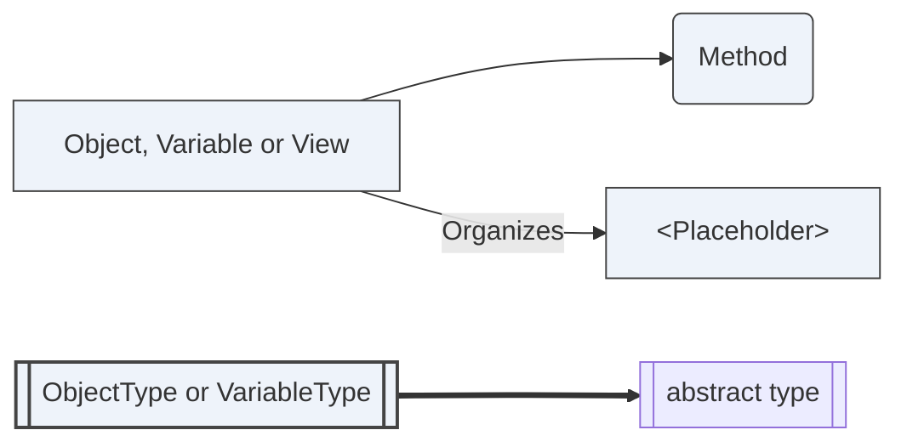

Figure 1 — The notation used by the AddressSpace figures in this document

Every figure that draws part of this specification's information model is re-derived from the
NodeSet by `tools/validate_local.py`: each Node must exist with the NodeClass and abstractness the
figure claims, and each edge must be a real Reference of that type in that direction. A node table
is generated and so cannot drift; a figure is authored, and a wrong arrow looks exactly like a right
one, so it is checked rather than trusted.

## 4 General information

### 4.1 The Asset Administration Shell

An AAS is the standardized digital representation of an asset. It carries the asset's identity and
references the submodels that describe it — a nameplate, technical data, a carbon footprint, a bill
of material. Submodels are identified in their own right and are not owned by the shell that
references them, so one submodel may be referenced by several shells.

Three kinds of thing carry a globally unique identifier: shells, submodels and concept descriptions.
Everything else is named only within its parent, by a short name, and is addressed by the path of
short names that leads to it.

### 4.2 OPC UA

OPC UA provides an information modelling framework, a service set and a security model. This
specification uses the framework to type AAS content, the services to read and write it, and File
Transfer (OPC 10000-20) to move whole documents. It builds the registry half on the abstract
*OPC UA — xRegistry* base model, in which a registry and its groups are folders and a resource
document is a file.

### 4.3 What changed in version 3.00, and why it is breaking

Version 1.00 maps the AAS v1.x metamodel. Three changes make this revision incompatible, and no
ordering of them would have allowed a compatible one.

**The metamodel changed incompatibly.** AAS V3 is not backward compatible with v1.x. `Asset` and
`View` no longer exist; `AssetInformation` and `SpecificAssetId` are new; the identifier type
discriminator was removed, so an identifier is now a bare string; the submodel element set was
reshaped, with `SubmodelElementList` and `SubmodelElementCollection` taking their present form. A
node model that faithfully represents V3 cannot also represent v1.x.

**The mapping is now lossless.** Version 1.00 was not designed to be reversible, and reversibility
cannot be retrofitted compatibly: it requires each xsd type to be assigned its own OPC UA DataType,
so that the declared type is read from the value node (clauses 5.2 and 7.1), an order
to be carried by the ReferenceType and by `Index` where the original relies on Browse order
(clause 5.4), and a distinction between absent and empty that the original does not draw
(clause 5.5). Each of those adds Mandatory members and new DataTypes to existing types.

**The registry is now part of the specification.** A shell is catalogued, versioned and federated as
well as browsed. The types are additive, but claiming any of the registry conformance units of
clause 10 requires the xRegistry base model, which changes what such a Server loads. A Server that
implements only the metamodel half does not load it.

Annex C maps v1.00 concepts onto their v3.00 counterparts for readers migrating.

## 5 Mapping rules

### 5.1 General

An AAS `Environment` materializes as an `AASEnvironmentType` folder holding the shells, submodels
and concept descriptions it contains. Submodels are held by the environment, not nested inside
shells, because a submodel is not owned by the shell that references it; a shell carries references
to its submodels, and those references are the link.

`AASEnvironmentType` is a `FolderType` and **not** a subtype of the xRegistry `RegistryType`. An
environment holds the metamodel objects of one serialization — the unit an AASX package carries and
a source generator compiles — and its membership is whatever that serialization contained. A
registry holds documents about shells, versioned and federatable, and its membership is what the
Server catalogues. A Server may serve one, the other, or both over the same shells. Making
`AASEnvironmentType` a `RegistryType` would require every Server that materializes an AAS to
implement the registry half.

Where both halves are present, clause 9.2 defines the link between a catalogued shell and its
materialized node tree, and clause 9.10 requires the registry to serve the materialized environment
as retrievable AAS and AASX documents.

Every metamodel field has exactly one representation in the AddressSpace. [Annex B](#annex-b) lists
them all, field by field. A field with no entry in that annex is a defect in this specification, not
a field an implementation may drop.

### 5.2 Canonical value representation

AAS types values with an xsd type. Clause 7.1 assigns each of the thirty values of `DataTypeDefXsd`
one OPC UA DataType, and no DataType is assigned to two of them. Where a built-in DataType denotes
the xsd type on its own it is used; where two xsd types would otherwise share one built-in,
clause 7.1 defines a subtype for one of them.

A value materializes as one `Value` Variable, whose DataType is the one clause 7.1 assigns to its
declared xsd type. The declared type is read from that DataType.

`ValueType` is a Mandatory Variable. The metamodel makes `Property.valueType` mandatory and
`Property.value` optional, and the same holds for `Range`, so a Property that declares `xs:decimal`
and carries no value is conformant AAS; clause 5.5 gives an absent field no node, leaving no value
node to carry the declaration. Where both are present a Server **shall** keep them consistent: the
`Value` node's DataType **shall** be the one clause 7.1 assigns to `ValueType`.

**A value is compared in the xsd value space, not the lexical space.** XML Schema defines a
datatype's *value space* and its *lexical space* separately, defines identity on the value space,
and designates a *canonical lexical representation* for each type. AAS carries a value as a string
in the lexical space and defines no equality on it: no normalization, no canonical form, and no
requirement that a lexical form survive a round trip. The ValueOnly serialization of AAS Part 2
renders a value as a native JSON number or boolean and back, so `"1"` declared `xs:boolean` returns
as `"true"`.

A Server therefore:

- **shall** materialize a value into the DataType of clause 7.1, and
- **shall** serialize it back as the XSD canonical lexical representation of that type.

A Property authored as `"1.500000"` with `ValueType` `xs:decimal` therefore serializes as `"1.5"`,
and one authored `"+42"` with `xs:int` serializes as `"42"`. The documents are equivalent under
clause 8, not identical. An implementation that requires the authored lexical form to survive
verbatim expresses that in the metamodel, with a qualifier or an IEC 61360 `valueFormat`.

`AASValueString` is used only where a Structure field carries a value whose declared type is given
by a sibling field of the same Structure (clause 7.2). It is never the DataType of a Variable.

### 5.3 NodeId and BrowseName assignment

Assignment is deterministic: two implementations materializing the same AAS produce the same nodes.

**NodeId.** Instance nodes use String identifiers in the Server's own namespace:

| Node | Identifier |
|---|---|
| A shell, submodel or concept description | its AAS identifier, verbatim |
| An element beneath one of those | the owner's identifier, a `#`, then the element's `idShortPath` |

The `idShortPath` is the metamodel's own path convention: short names joined by `.`, with `[n]` for
a member of a list. Using it means the identifier a generator computes is the identifier the AAS API
already uses, so a Client that holds one holds the other.

An AAS identifier is arbitrary text of up to 2048 characters. It is legal in a String NodeId, which
is why identity lives there rather than in the BrowseName.

**BrowseName.** The element's short name, in the Server's namespace. An element inside a
`SubmodelElementList` has no short name — the metamodel does not give it one — so its BrowseName is
its index rendered as a decimal string. Order is carried by the `Index` Property, not by the
BrowseName, because a BrowseName is a name and not a position.

**DisplayName.** The short name where one exists; otherwise the index.

### 5.4 Ordering

`SubmodelElementList.orderRelevant` says whether the order of a list's members carries meaning; when
it is false the metamodel states that the list represents a set or a bag. OPC UA can say this in the
type system rather than in a Property, and it does:

- Where `orderRelevant` is **true** — including where it is absent, since its default is true — a
  `SubmodelElementList` **shall** reference its members with `HasOrderedComponent` (`i=49`), the
  subtype of `HasComponent` whose semantic is that the order of the references is meaningful.
- Where `orderRelevant` is **false**, it **shall** reference them with `HasComponent`.
- Every other element collection **shall** use `HasComponent` or `Organizes` as its type declares.

The ReferenceType carries `orderRelevant`; there is no `OrderRelevant` Property.

`Index` carries the position. The Browse Service is not required to return references in any
particular order, and a NodeSet is a set of references rather than a sequence, so the order of a
Browse result is not a reliable source for it. `Index` is Optional on a list member and RECOMMENDED
wherever `HasOrderedComponent` is used; an implementation claiming `AAS-LosslessRoundTrip` **shall**
materialize it there. Where a Server materializes `Index`, the values **shall** be the positions
`0 … n-1` without gaps or repeats, and a serializer emits members in `Index` order.

Where the members are referenced with `HasComponent`, a serializer **may** emit them in any order,
and clause 8 compares the collection as a bag.

### 5.5 Absent versus empty

An optional field that is absent and one present but empty are distinct in the metamodel:

- An **absent** optional field has **no node**.
- A field **present but empty** has a node whose value is an empty array, or an Object with no
  children.

A Server **shall not** materialize a node for an absent field, and **shall not** omit one for a
present-but-empty field. A serializer distinguishes the two by the presence of the node, never by
its value.

### 5.6 Instance materialization

Materializing an `Environment` is mechanical:

1. Create an `AASEnvironmentType` folder.
2. For each shell, submodel and concept description, create a node of the corresponding type, with
   the NodeId of clause 5.3 and the BrowseName of clause 5.3, organized by the environment folder.
3. For each element within a submodel, recursively create a node of the type corresponding to its
   metamodel class, referenced by its parent with `HasComponent`.
4. For each field present on the element, create the member node named in Annex B, with the value
   the metamodel carries. Omit members for absent fields, per clause 5.5.
5. For a value-bearing element, set `ValueType`, and set `Value` with the DataType clause 7.1
   assigns to it, per clause 5.2.
6. Reference the members of a `SubmodelElementList` with `HasOrderedComponent` where its
   `orderRelevant` is true and `HasComponent` where it is false, and set each member's `Index` to
   its position, per clause 5.4.

No step in that sequence is implementation-defined. A generator that implements it compiles an AAS
into a loadable NodeSet, and a Server that loads the NodeSet serves the AAS.

## 6 AAS metamodel ObjectTypes

The companion namespace is `http://opcfoundation.org/UA/I4AAS/`, model version 3.00. Draft numeric
NodeIds use the `1001+` block; final NodeIds are assigned by the OPC Foundation. The normative node
reference is [Annex A](#annex-a); this clause describes intent.

### 6.1 Abstract bases

The abstract bases mirror the metamodel's own hierarchy, so that an element carries the members its
metamodel class gives it and no others: `AASReferableType` for everything with a short name,
`AASIdentifiableType` for the three classes with a globally unique identifier, and
`AASHasSemanticsType`, `AASHasKindType`, `AASHasDataSpecificationType` and `AASQualifiableType` for
the orthogonal aspects.

`AASReferableType` carries a Mandatory `ModelType`, the metamodel class name. It is redundant with
the ObjectType, and it is carried anyway: a serialization produced from the AddressSpace must be
byte-identical to the one that produced it, and the metamodel's serialization includes this
discriminator.

`AASIdentifiableType` carries the `Id` — up to 2048 characters of arbitrary text, which is why
identity lives in a Property and in the String NodeId rather than in the BrowseName (clause 5.3).

<!-- model-figure: root=ns=2;i=1001 require=mandatory external=BaseObjectType -->

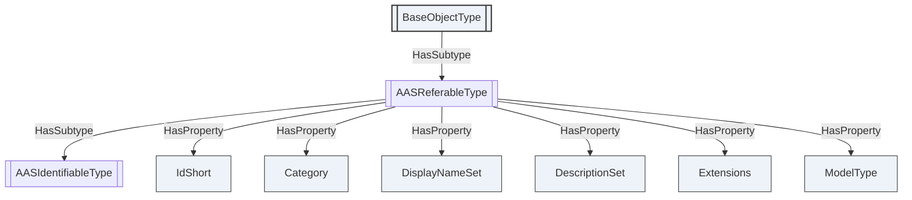

Figure 2 — `AASReferableType`, and the identity it gives every element

<!-- model-figure: root=ns=2;i=1003 require=mandatory external=BaseObjectType -->

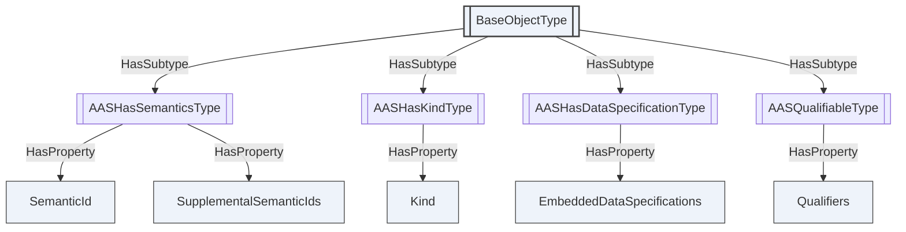

Figure 3 — The orthogonal aspect bases

### 6.2 Environment, shell and asset information

`AASEnvironmentType` is the container and the root a generator materializes into. Shells, submodels
and concept descriptions are all held by it directly: a submodel is not owned by the shell that
references it, and one submodel may be referenced by several shells, so nesting them inside shells
would misrepresent the model.

`AASType` is a shell. It holds `AssetInformation`, references to its submodels, and the derivation
link from an instance to its type.

<!-- model-figure: root=ns=2;i=1010 require=mandatory external=FolderType -->

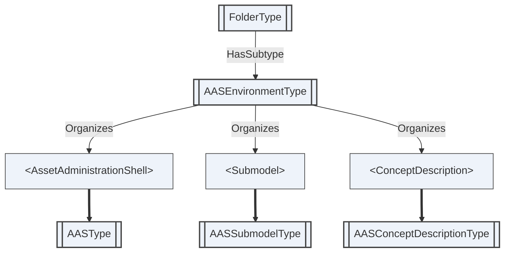

Figure 4 — `AASEnvironmentType`, the container a generator materializes

<!-- model-figure: root=ns=2;i=1011 require=mandatory -->

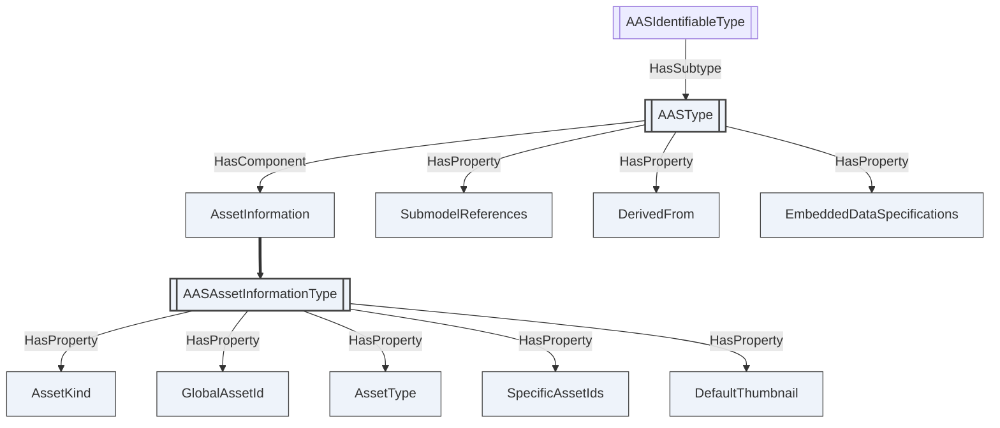

Figure 5 — `AASType` and the asset identity it carries

### 6.3 Submodel and concept description

`AASSubmodelType` is a submodel, holding its elements. `AASConceptDescriptionType` is the definition
a semantic identifier resolves to — what makes two submodels from different vendors comparable.

<!-- model-figure: root=ns=2;i=1013 require=mandatory -->

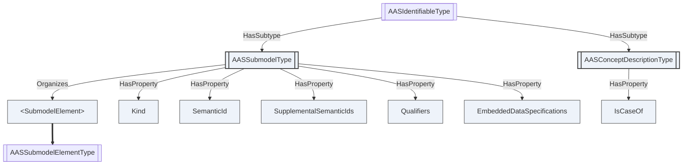

Figure 6 — `AASSubmodelType` and `AASConceptDescriptionType`

### 6.4 Submodel elements

The element types cover the metamodel's element set. Every one of them subtypes
`AASSubmodelElementType`, which carries the semantics, qualifiers and data specifications an element
may have, and the `Index` that gives a list member its position (clause 5.4).

<!-- model-figure: root=ns=2;i=1020 require=mandatory -->

```mermaid
flowchart TD
  REF[[AASReferableType]]:::objecttype,abstract
  SET[[AASSubmodelElementType]]:::objecttype,abstract
  PRP[[AASPropertyType]]:::objecttype
  MLP[[AASMultiLanguagePropertyType]]:::objecttype
  RNG[[AASRangeType]]:::objecttype
  BLB[[AASBlobType]]:::objecttype
  FIL[[AASFileType]]:::objecttype
  REL[[AASReferenceElementType]]:::objecttype
  RLE[[AASRelationshipElementType]]:::objecttype
  ARE[[AASAnnotatedRelationshipElementType]]:::objecttype
  SEC[[AASSubmodelElementCollectionType]]:::objecttype
  SEL[[AASSubmodelElementListType]]:::objecttype
  ENT[[AASEntityType]]:::objecttype
  BEE[[AASBasicEventElementType]]:::objecttype
  OPR[[AASOperationType]]:::objecttype
  CAP[[AASCapabilityType]]:::objecttype

  REF -->|HasSubtype| SET
  SET -->|HasSubtype| PRP
  SET -->|HasSubtype| MLP
  SET -->|HasSubtype| RNG
  SET -->|HasSubtype| BLB
  SET -->|HasSubtype| FIL
  SET -->|HasSubtype| REL
  SET -->|HasSubtype| RLE
  RLE -->|HasSubtype| ARE
  SET -->|HasSubtype| SEC
  SET -->|HasSubtype| SEL
  SET -->|HasSubtype| ENT
  SET -->|HasSubtype| BEE
  SET -->|HasSubtype| OPR
  SET -->|HasSubtype| CAP

  classDef objecttype fill:#eef3fa,stroke:#444,stroke-width:2px
  classDef abstract fill:#eef3fa,stroke:#444,stroke-width:2px,font-style:italic
```

Figure 7 — The submodel element hierarchy

Three element types deserve note, and they are the three the losslessness rules bear on.

**`AASPropertyType`** carries a value once, in a `Value` node whose DataType is the one clause 7.1
assigns to the declared `ValueType` (clause 5.2). `ValueType` is Mandatory because the metamodel
makes it mandatory while making the value itself optional. **`AASRangeType`** carries its bounds the
same way, and an absent bound means unbounded rather than zero.

<!-- model-figure: root=ns=2;i=1021 require=mandatory -->

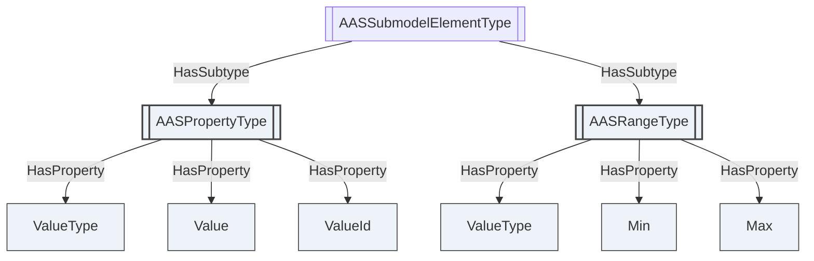

Figure 8 — A value and the type it is declared as

**`AASSubmodelElementListType`** references its members with `HasOrderedComponent` where the list's
order is relevant and `HasComponent` where it is not, and its members carry `Index` where the
position has to be recoverable. `AASSubmodelElementCollectionType` is unordered and its members are
identified by their own short names.

<!-- model-figure: root=ns=2;i=1031 require=mandatory -->

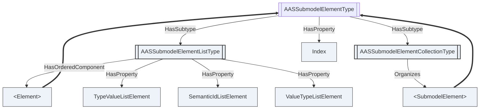

Figure 9 — Ordered and unordered collections

**`AASEntityType`** is a component of a composition; a self-managed entity carries the identifier of
its own shell, so a bill of material is traversable across organizations.
**`AASOperationType`** carries its variables as references to the element nodes that hold them,
rather than duplicating those elements, so an operation's variables round-trip as the elements they
are.

<!-- model-figure: root=ns=2;i=1032 require=mandatory -->

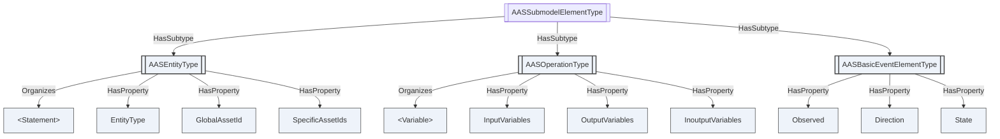

Figure 10 — Composition, operations and events

### 6.5 Invoking an operation

An `Operation` submodel element is invocable. `AASOperationType` carries the Method `Invoke`, whose
arguments correspond positionally to the element's `InputVariables`, `OutputVariables` and
`InoutputVariables`.

| Argument | Direction | Corresponds to |
|---|---|---|
| `InputValues` | in | `inputArguments` of the AAS API request, in the order of `InputVariables` |
| `InoutputValues` | in | `inoutputArguments` of the request, in the order of `InoutputVariables` |
| `ClientTimeout` | in | `clientTimeoutDuration`; zero selects the Server's default |
| `OutputValues` | out | `outputArguments` of the result, in the order of `OutputVariables` |
| `InoutputResults` | out | `inoutputArguments` of the result |
| `Success` | out | `success` |
| `Diagnostic` | out | the message of a failed execution |

A Server **shall** return `Bad_InvalidArgument` where the number of values does not match the number
of variables the element declares.

`Success` reports the outcome of the operation, not of the Call. An operation that runs and reports
failure returns `Good` with `Success` false; a Call that could not be made at all returns a bad
StatusCode. Conflating the two would leave a Client unable to distinguish an unreachable Server from
a rejected workpiece.

Positional correspondence, rather than a name-keyed structure, is what the metamodel supports:
`InputVariables` is an ordered array and clause 5.4 already preserves that order, so the *n*-th value
belongs to the *n*-th variable in both directions.

The AAS API of IDTA-01002 Part 2 also defines an asynchronous form, `InvokeOperationAsync` with
`GetOperationAsyncResult`. This specification defines no counterpart: an OPC UA Method Call is
synchronous, and a Server whose operations outlive a Call implements the Program interface of
OPC 10000-10 on the element rather than a second Method here. Annex G records the correspondence.

## 7 AAS DataTypes

### 7.1 The xsd type mapping

Each of the thirty values of `AASDataTypeDefXsdDataType` is assigned one OPC UA DataType, and no
DataType is assigned to two of them. A serializer reads the declared xsd type from the DataType of
the value node.

Where a built-in DataType denotes the xsd type on its own, it is used. Where two xsd types would
otherwise share one built-in, a subtype is defined in this namespace, as OPC UA does in deriving
`DecimalString`, `DurationString`, `DateString` and `TimeString` from `String`. Ten such subtypes
are defined.

| `ValueType` | OPC UA DataType | Note |
|---|---|---|
| `xs:boolean` | `Boolean` (`i=1`) | |
| `xs:byte` | `SByte` (`i=2`) | xsd `byte` is signed |
| `xs:unsignedByte` | `Byte` (`i=3`) | |
| `xs:short` | `Int16` (`i=4`) | |
| `xs:unsignedShort` | `UInt16` (`i=5`) | |
| `xs:int` | `Int32` (`i=6`) | |
| `xs:unsignedInt` | `UInt32` (`i=7`) | |
| `xs:long` | `Int64` (`i=8`) | |
| `xs:unsignedLong` | `UInt64` (`i=9`) | |
| `xs:float` | `Float` (`i=10`) | |
| `xs:double` | `Double` (`i=11`) | |
| `xs:decimal` | `Decimal` (`i=50`) | arbitrary precision, and its `Scale` preserves the authored number of decimal places |
| `xs:integer` | `Integer` (`i=27`) | |
| `xs:nonNegativeInteger` | `UInteger` (`i=28`) | |
| `xs:positiveInteger` | `AASPositiveInteger` | subtype of `UInteger`, so it does not collide with `xs:nonNegativeInteger` |
| `xs:nonPositiveInteger` | `AASNonPositiveInteger` | subtype of `Integer` |
| `xs:negativeInteger` | `AASNegativeInteger` | subtype of `AASNonPositiveInteger`, mirroring the xsd restriction hierarchy |
| `xs:string` | `String` (`i=12`) | |
| `xs:anyURI` | `AASAnyUri` | subtype of `String`, so it does not collide with `xs:string` |
| `xs:dateTime` | `DateTime` (`i=13`) | |
| `xs:date` | `DateString` (`i=12881`) | a date is a day, not an instant |
| `xs:time` | `TimeString` (`i=12880`) | a time-of-day has no day |
| `xs:duration` | `DurationString` (`i=12879`) | the ISO 8601 duration form; **not** `Duration` (`i=290`), which is a count of milliseconds |
| `xs:gYear` | `AASGYear` | a Gregorian period; OPC UA has no DataType denoting one |
| `xs:gYearMonth` | `AASGYearMonth` | |
| `xs:gMonth` | `AASGMonth` | |
| `xs:gMonthDay` | `AASGMonthDay` | |
| `xs:gDay` | `AASGDay` | |
| `xs:base64Binary` | `ByteString` (`i=15`) | |
| `xs:hexBinary` | `AASHexBinary` | subtype of `ByteString`; the octets are identical to a `xs:base64Binary` value's and only the written form differs |

Four rows are qualified further.

`xs:duration` is assigned `DurationString`, not `Duration` (`i=290`). `Duration` is a `Double`
counting milliseconds; `xs:duration` has year and month components that are not a fixed number of
milliseconds, as `P1M` is not thirty days. `DurationString` holds the ISO 8601 form, which is the
lexical space of `xs:duration`.

`xs:date` and `xs:time` are assigned `DateString` and `TimeString`, not `DateTime`. A `DateTime` is
an instant; a date is a day in some timezone and a time is a time-of-day with no day. Assigning
either `DateTime` would require a value for the missing component.

The five partial-date types have no OPC UA DataType, built-in or derived, that denotes a period.
Each is assigned its own `String` subtype.

Two assignments have a range narrower than the xsd type. `Integer` and `UInteger` are the abstract
unions of OPC UA's concrete integer types, so their range is that of `Int64` and `UInt64`, whereas
`xs:integer` is unbounded; and `DateTime` begins in 1601, whereas `xs:dateTime` does not. A value
outside the representable range **shall** be rejected rather than truncated, as in clause 7.3.

### 7.2 `AASValueString`

`AASValueString` is a subtype of `String` (`i=12`). It carries the xsd lexical form of a value whose
declared type is given by a sibling field of the same Structure.

A Structure field has one static DataType and cannot vary with a declared type.
`AASQualifierDataType`, `AASExtensionDataType` and `AASDataSpecificationIec61360DataType` each pair a
value with a `ValueType` field, so the value field is lexical and the sibling field states how to
read it. Where a Variable carries a value, clause 7.1 assigns the DataType of its declared xsd type
instead.

A Server **shall not** use `AASValueString` as the DataType of a Variable.

### 7.3 Enumerations

The enumerations are closed. `AASKeyTypesDataType`, `AASDataTypeDefXsdDataType` and the rest
enumerate exactly the metamodel's values; a value outside the enumeration cannot round-trip, so an
implementation rejects it rather than dropping it silently.

### 7.4 Structures

The structures carry the metamodel's value classes: references and their ordered keys,
language-tagged strings, specific asset identifiers, administrative information, qualifiers,
extensions, data specifications and their IEC 61360 content. Three of them — `AASQualifierDataType`,
`AASExtensionDataType` and `AASDataSpecificationIec61360DataType` — pair a value with a `ValueType`
field, and carry that value as `AASValueString` for the reason given in clause 7.2.

`AASReferenceDataType` carries its `Keys` as an ordered array. The order is part of the reference's
meaning — it is the path — so it is preserved exactly.

## 8 Round-trip conformance

An implementation claiming the `AAS-LosslessRoundTrip` conformance unit **shall** satisfy both
directions.

**Materialize and serialize.** For any conformant AAS environment, materializing it per clause 5.6
and serializing the result **shall** produce an environment **equivalent** to the original.

**Serialize and materialize.** For any AddressSpace subtree produced by clause 5.6, serializing it
and materializing the result **shall** produce a subtree with the same nodes, NodeIds, BrowseNames,
References and values.

Two environments are equivalent when, after canonical ordering of JSON object members:

- every field present in one is present in the other, and absent in one is absent in the other;
- every value is the same element of the xsd value space of its declared `valueType`, compared per
  XML Schema Part 2. `"1.500000"` and `"1.5"` are equivalent as `xs:decimal`; `"1"` and `"true"` are
  equivalent as `xs:boolean`; `"1.5"` and `"2.5"` are not;
- every array to which the metamodel gives an order is compared in order: the keys of a reference, a
  multi-language value, an operation's variables, and a `SubmodelElementList` whose `orderRelevant`
  is true;
- a `SubmodelElementList` whose `orderRelevant` is false is compared as a bag: same members, same
  multiplicities, order disregarded.

No further tolerance applies. A field that cannot be represented is a defect in this specification;
Annex B is the list against which that is checked.

A test corpus accompanies this document under `tools/fixtures/`, and `tools/roundtrip_check.py`
runs both directions over it. The corpus covers every element type, nested and ordered lists,
elements without short names, multi-language values, non-canonical lexical forms of the xsd types,
the absent-versus-empty distinction, qualifiers, extensions, data specifications and multi-key
references.

The same tool carries a **negative control**. It breaks one normative rule at a time — corrupting a
value rather than re-writing it, canonicalizing an `xs:decimal` through a fixed working precision so
that digits are lost, restoring an ordered list in Browse order rather than by `Index`, conflating an
absent field with an empty one — and asserts that the comparison reports each. It also asserts that
re-writing a value into its canonical lexical form is **not** reported.

## 9 The AAS Registry

### 9.1 The registry is folders of files

The registry half projects a catalogue of shells onto the AddressSpace using the abstract
*OPC UA — xRegistry* base model: a registry and its groups are `FolderType` folders, and a resource
document *is* a `FileType` file, read with the File Transfer Methods of OPC 10000-20.

It answers different questions from the metamodel half:

| | Metamodel clauses | Registry clauses |
|---|---|---|
| Unit | one shell's metamodel, in nodes | a catalogue of shells, as folders and files |
| Granularity | per element | per document |
| Access | Read, Write, Call | Open, Read, Close |
| Answers | what is this value now | which shells exist, at what versions, where else served |

A Server may implement either half or both. Where both are present the same shell appears twice, and
`AASShellGroupType.ShellNode` links the catalogue entry to the live node tree.

### 9.2 Registry types

`AASRegistryType` is the registry root, exposed as a well-known `AASRegistry` Object under the
`Server` Object so that any Client reaching the standard Server object discovers it. Its group
folders hold shells, submodel template families, concept dictionaries and package stores; its
Methods answer the discovery question and provide a document fast path.

`AASShellGroupType` holds the submodel documents of one shell. It is a `GroupType`, and therefore a
folder of resource files, whereas `AASType` is the shell's metamodel object tree. They are separate
types because they are separate things, and three consequences follow that a single type could not
give:

- **Either half can exist without the other.** A registry that catalogues a shell served by another
  Server has no metamodel tree to attach to, and a Server that materializes an AAS from a package
  need not catalogue it. Conflating the two would make each imply the other.
- **A group is a folder of files; a shell is an object.** The base `GroupType` gives the catalogue
  entry its xRegistry attributes, its creation Methods and its file members. `AASType` gives the
  shell its `AssetInformation` and its submodel references. Neither set belongs on the other.
- **They have different lifetimes.** A catalogued shell has versions, and the current version of its
  submodel document need not be what the metamodel tree currently holds — that is the whole point of
  clause 9.4.

Where a Server implements both halves, `AASShellGroupType.ShellNode` points at the `AASType` node
for the same shell, and both carry the same identifiers, so a Client can move between the catalogue
and the live tree without re-resolving anything.

`AASSubmodelFileType` is one submodel document. `AASConceptDescriptionFileType` and
`AASPackageFileType` are the corresponding resources for concept definitions and packages.

<!-- model-figure: root=ns=2;i=1100 require=mandatory external=RegistryType,GroupType,ResourceType,Server -->

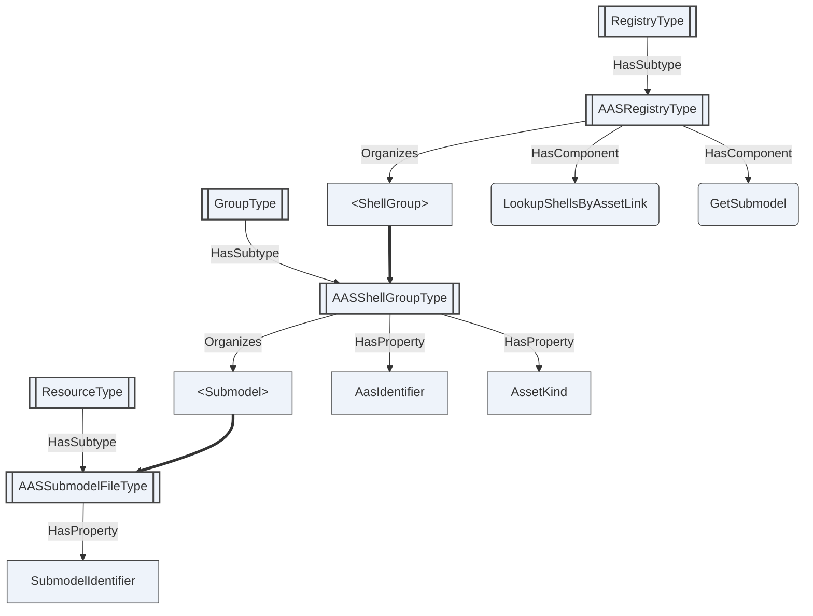

Figure 11 — The registry root, shells and their submodel documents

The other three group types follow the same shape: a group folder holding resource files, each
naming the source identity its identifier is derived from.

<!-- model-figure: root=ns=2;i=1103 require=mandatory external=GroupType,ResourceType -->

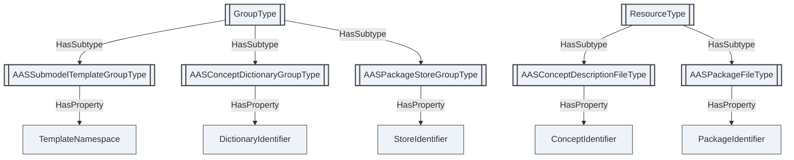

Figure 12 — Templates, concept dictionaries and package stores, each with its source identity

### 9.3 Identifiers

Base clause 6.9 requires every group and resource type to name exactly one **source identity** and to
expose it verbatim as a Mandatory Property, and derives the identifier from it by the symbolic
construction defined there. This clause names them:

| Type | Source identity |
|---|---|
| `AASShellGroupType` | `AasIdentifier` |
| `AASSubmodelFileType` | `SubmodelIdentifier` |
| `AASSubmodelTemplateGroupType` | `TemplateNamespace` |
| `AASConceptDictionaryGroupType` | `DictionaryIdentifier` |
| `AASConceptDescriptionFileType` | `ConceptIdentifier` |
| `AASPackageStoreGroupType` | `StoreIdentifier` |
| `AASPackageFileType` | `PackageIdentifier` |

These are the same source identities the xRegistry AAS model names, and the construction is the same
one. The same shell therefore receives the same identifier whether it is served over OPC UA or over
HTTP, so the two bindings address one registry.

An identifier is never derived from a document. A resource is a stable umbrella over its versions,
so its identifier is invariant while its document changes; a content digest is version-level
metadata and identifies bytes, not entities.

### 9.4 Versioning and the lifecycle record

The AAS metamodel records a single current revision. `AdministrativeInformation` carries a version
label and a revision label, and nothing retains what a submodel previously said or distinguishes a
correction from a new observation.

The registry supplies what the metamodel does not: each version of an `AASSubmodelFileType` is one
revision, ordered in time, and a Client asking for a submodel as it stood at a given moment reads
the newest version not later than that moment. This is not a convenience. Where a regulation
requires a record retrievable as of a date, or an auditable and tamper-evident history of changes to
controlled data, a Server implementing only the metamodel half has nothing to answer from.

The AAS version labels are carried unchanged in `Administration`; they are not reflected into the
registry's version identifiers, which follow the base model's own rules.

### 9.5 Discovery and resolution

`LookupShellsByAssetLink` answers the discovery question — given an asset key such as a serial
number or a manufacturer part identifier, which shells describe it — without the Client browsing the
whole collection. `GetSubmodel` returns a document and enough metadata to parse it, for a Client that
holds an identifier rather than a node.

A Server **should** bound the results returned for an unauthenticated collection query. A registry
serving regulated product data is subject to requirements to prevent bulk extraction of its
contents, and an unbounded collection endpoint is exactly such an extraction surface.

### 9.6 Federation

Federation follows the base model. A shell or submodel this registry describes but does not host
carries an `ExternalReference` — an `ExpandedNodeId` whose `ServerUri` identifies the hosting
endpoint and whose `NamespaceUri` and identifier identify the entity — or a `ResourceUrl` for a
registry served over a different protocol.

The identity rule is absolute: identity is carried by the AAS identifier attributes and the
identifier derived from them, never by an endpoint. A Server exposing a local proxy for a remote
entity **shall** retain the remote entity's identifier attributes and **shall not** treat its own
endpoint as part of that entity's identity. The external authority identifies the serving endpoint,
not the entity.

Because the construction of clause 9.3 is deterministic, the same shell has the same identifier in
every registry that describes it, and a Client moving between registries re-resolves nothing.

### 9.7 Information disclosure tiers

Some assets carry data that cannot be shown to everyone: a product passport is public in part and
restricted in part, and a supplier's technical data is commercially sensitive.

An **information disclosure tier** is the class of caller an entity's content may be released to.
This specification defines two, `Public` and `Controlled`, carried by the `DisclosureTier` Property.
They classify the *information*, not the caller and not the transport: a tier says what kind of
release this entity's content is, and leaves who may obtain it to the authorization the entity
advertises. A regulation that names finer classes maps them onto these two by deciding, for each,
whether the content is readable without authentication.

Note that a disclosure tier is metadata about content, and is therefore itself disclosed. A Server
that must not reveal even the existence of controlled content omits those entries entirely rather
than marking them; see the mitigations below.

This specification expresses two of the three things tiering requires, and does not express the
third.

**Segmentation** is expressible: a registry serves public content as stored documents and represents
controlled content as entries carrying a `ResourceUrl` or an `ExternalReference` instead of bytes.

**Advertisement** is expressible: `DisclosureTier` records whether an entity is readable without
authentication, and `Authorization` describes the authorization options a Consumer may use — a type,
a mechanism, and the authority and resource URIs that say where authorization is obtained and what
for. `Authorization` is authorization configuration only and **shall not** carry credentials, keys
or tokens, which are supplied out of band.

**Enforcement at element granularity is not expressible.** Where a regulation requires access rights
to be enforced between two elements *within* one document, this model cannot express it: a registry
resource document is opaque bytes, and a decision that falls inside a document cannot be taken by a
model that addresses documents.

OPC UA's own access control does not close that gap. It operates on nodes, and the boundary in
question is inside a file. Two mitigations are conformant: a registry **may** publish tier-specific
resources whose documents are already the redacted projection appropriate to a tier, so that every
document is wholly one tier; and a registry **may** omit controlled entries entirely from responses
to unauthenticated Clients, since advertising that a controlled submodel exists is itself a
disclosure.

A registry that serves public data **shall not** require authentication to read it.

### 9.8 The xRegistry API over OPC UA

The registry subtree is simultaneously an xRegistry API server: the operations are realized natively
by OPC UA Services over the same nodes, as defined by the base model and its API binding. Annex D
gives the correspondence to the HTTP binding for readers who know that one.

### 9.9 Updateable registry (optional profile)

Clauses 9.1 to 9.8 describe a registry that catalogues documents. A Server **may** additionally make
the registry **updateable**: a Client writes a document into the registry, and the AddressSpace of
clause 5 changes to match. This clause defines that profile. It is optional, it is declared by the
`AAS-UpdateableRegistry` conformance unit, and a Server that implements clauses 9.1 to 9.8 without
it is fully conformant.

**The documents are canonical; the nodes are derived.** A Server implementing this profile **shall**
be able to rebuild the entire materialized subtree from the stored documents and this specification
alone, with no additional state. A Client **shall not** assume that a materialized node survives a
change to the document it came from, except as the generation rules below allow.

**Materialization is generational, and a switch is atomic.** A Server **shall not** let a Client
observe a half-built subtree. It **prepares** the new nodes as a shadow generation beside the active
one, with the document's `LoadState` set to `Loading`; it validates them; and only then does it
**switch**, making them visible, setting `LoadState` to `Active` and incrementing
`MaterializationGeneration`. Nodes in a shadow generation are not browsable and raise no events.

**A superseded generation is retired under one documented policy.** After a switch the previous
generation becomes `Superseded`. A Server **shall** apply exactly one of two policies, deterministic
for a given call and documented by the implementation:

- **Graceful.** The superseded generation enters `Retiring`. Existing MonitoredItems, continuation
  points and in-flight requests continue to be served from it until they drain or are migrated; new
  requests use the active generation. Its nodes are removed only once the retained work has drained.
- **Immediate.** The superseded generation is retired without waiting. The Server **shall**
  invalidate every affected MonitoredItem: a data-change item reports `BadNodeIdUnknown`, an event
  item stops producing events, and subsequent monitored-item operations on either return
  `BadNodeIdUnknown`.

Graceful retirement preserves subscriptions across an update; immediate retirement applies where a
Server cannot hold two generations at once. A Server **shall** apply one of these two and **shall
not** apply a third behaviour.

**A failed document does not destroy anything.** Validation failure **shall** leave the stored
document in place, set its `LoadState` to `Failed` and record the reason. The generation that was
active **shall** keep serving, unchanged. `DesiredVersionId` records the version an operator wants
materialized and `ActiveVersionId` the version actually serving; they diverge transiently during a
switch and persistently when the desired version does not validate. That divergence is observable on
purpose, because an operator needs to see that the update they requested is not the one being
served. A Server **shall not** silently activate a version that failed validation.

**A shell is materialized whole or not at all.** A shell's document, its submodel documents and the
concept descriptions its `SemanticId`s resolve to form a closure. A Server **shall** materialize a
closure into one shadow generation and commit it as a unit: a closure with an unresolved or invalid
member **shall not** be partially activated, and no node of it becomes visible. A dependency is
resolved against the registry itself first and, failing that, through a configured federation
provider (clause 9.6). A Server **shall not** dereference an arbitrary URL found inside a document
while materializing it — an `ExternalReference` is federation metadata, not permission to fetch.

**Re-materializing an unchanged document changes nothing.** A document whose digest is unchanged
since it was last materialized **shall** be reported `Unchanged` and **shall not** be
re-materialized, unless `Force` is set. Re-running an unchanged call **shall** produce the same nodes
with the same NodeIds and **shall not** increment `MaterializationGeneration`. A Server **should**
compute the digest over canonical document bytes, so that reformatting a document that means the
same thing does not churn the AddressSpace.

**A committed switch is announced.** A switch changes the AddressSpace graph, so the Server
**shall** emit `GeneralModelChangeEventType` for the committed additions, removals and reference
changes, and **shall** stamp the affected nodes' `NodeVersion` so a Client can correlate a node with
the `MaterializationGeneration` that produced it. Events are emitted for committed changes only,
never for shadow-generation work.

**Deleting a document retires its nodes first.** Deleting a registry resource **shall** retire its
materialized generation before removing the stored document, under the same closure rules: a Server
**shall** refuse the deletion while another materialized document depends on it, unless the caller
asks for the dependents to be retired too, in which case those dependents are retired first and
reported.

`AutoMaterialize` states whether a stored-document change re-materializes without being asked. The
`Materialize` Method re-materializes a selection on demand whether or not `AutoMaterialize` is set,
and returns one `AASMaterializationResultDataType` per document it considered — so a caller learns
which documents were skipped, which were rebuilt and which failed, rather than only whether the call
returned good.

<!-- model-figure: root=ns=2;i=1100 require=none external=RegistryType,ResourceType -->

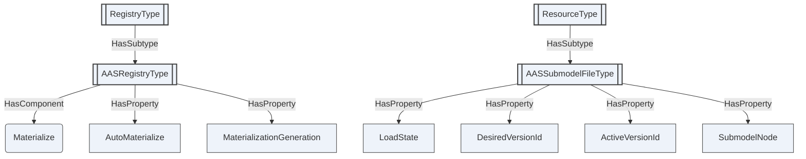

Figure 13 — The updateable registry profile. `SubmodelNode` holds the NodeId of the
`AASSubmodelType` node the document materialized into; it is a Property value, not a Reference.

The states a document passes through are those of `AASLoadStateDataType`, and the transitions are
the rules above rather than an implementation's choice:

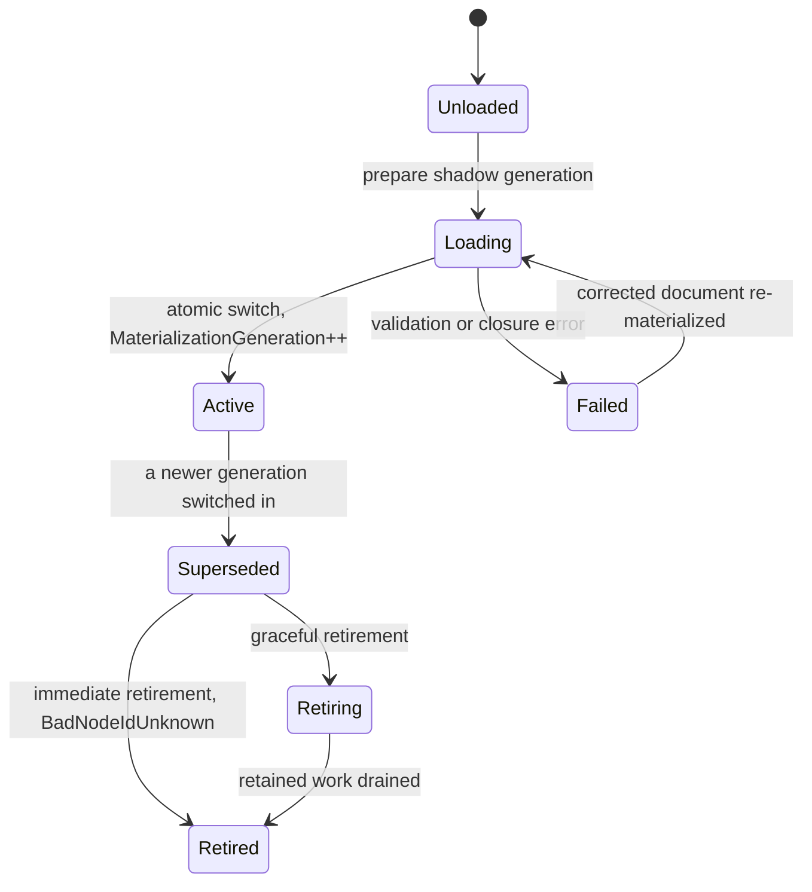

Figure 14 — Materialization lifecycle of one stored document

**Implementer notes.** This subclause is informative.

- *NodeId stability.* The NodeIds of clause 5.3 are derived from the AAS identifier and the
  `idShortPath`, not allocated by the Server. Two generations of the same document therefore contain
  the *same* NodeIds. A shadow generation must be held in a separate node table until the switch, not
  merged into the live one, or the preparation itself becomes visible.
- *Retirement and NodeId reuse together.* Under graceful retirement two generations exist at once
  with overlapping NodeIds. A Session that resolved a NodeId before the switch must continue to
  reach the generation it started with; resolving NodeId to node per Session-and-generation rather
  than globally is the straightforward way to get this right.
- *Digest before parse.* Compute the digest and compare it before parsing. A registry of any size
  spends nearly all of a periodic re-materialization discovering that nothing changed.
- *The closure is not the document.* A submodel document that validates on its own can still fail a
  closure because a concept description it references is missing. Report the failure against the
  document the operator wrote, naming the unresolved member — reporting it against the missing
  document tells the operator nothing they can act on.

The *OPC UA — WoT Connectivity* draft, currently under OPC Foundation review, defines the same
canonical-document-and-derived-projection discipline for a registry of Thing Descriptions. The rules
above are stated here in full rather than incorporated by reference.

### 9.10 Environment documents

This clause applies to a Server that implements both halves — that is, one claiming `AAS-Registry`
together with `AAS-InstanceMaterialization`. Such a Server **shall** claim `AAS-EnvironmentExport`
and satisfy this clause.

For each `AASEnvironmentType` folder it materializes, the registry **shall** hold at least one
`AASEnvironmentFileType` resource whose file content is a serialization of that environment. The
`Format` attribute states which serialization; a Server **shall** offer at least the AAS JSON
environment document (`aas/3.0+json`) and the AASX package (`aasx/3.0`), and **may** offer the AAS
XML environment document (`aas/3.0+xml`). `EnvironmentNode` identifies the folder the document
serializes. The document is retrieved with the File Transfer Methods of clause 9.1, like any other
registry resource.

**The document covers the whole environment.** A serialization **shall** contain every shell,
submodel, concept description and submodel element materialized under that folder, serialized per
clauses 5 and 8. A Server **shall not** offer a document that covers part of an environment under
this type; a partial export is a submodel document (clause 9.2) or a package (clause 9.2), not an
environment document.

**The document is filtered to the caller's permissions.** The content served to a Session **shall**
contain only what that Session is permitted to read. A node the Session could not Browse or Read
**shall** be absent from the document, together with everything beneath it. Filtering **shall** be
applied at the point of retrieval, not at the point the document was written, so a Session never
obtains content through a document that the AddressSpace would have withheld from it.

Filtering interacts with three earlier rules, and the interaction is resolved in favour of the
permission check:

- **Absent versus empty (clause 5.5) is not re-derived from filtering.** A field removed by
  filtering **shall** be omitted as though absent. A Consumer **shall not** infer from a filtered
  document that a field was absent in the environment.
- **A filtered document is not lossless.** Clause 8 applies to an unfiltered serialization. A Server
  **shall** set `Filtered` on the resource to indicate that the content served to this Session omits
  content, and **shall not** publish a `Digest` for a document whose bytes depend on the caller.
- **Disclosure tiers (clause 9.7) apply to the document itself.** `DisclosureTier` and
  `Authorization` on the resource describe the document; they do not substitute for the per-node
  permission check above.

A Server **may** materialize the document on demand rather than storing it, provided the result is
identical to a stored document filtered the same way.

<!-- model-figure: root=ns=2;i=1100 require=none external=RegistryType,ResourceType -->

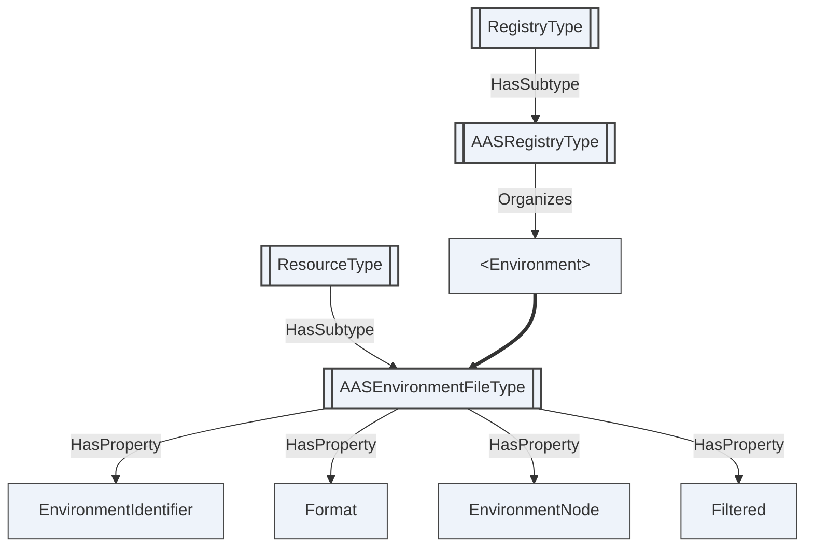

Figure 15 — The materialized environment served as a retrievable document

## 10 Profiles and conformance

An implementation conforms to this specification if it implements at least one of the two halves and
declares the corresponding conformance units.

| Unit | Requires |
|---|---|
| `AAS-Metamodel` | Shells, submodels and concept descriptions as typed nodes. |
| `AAS-SubmodelElements` | The submodel element types. |
| `AAS-ValueFidelity` | The xsd type assignment of clauses 5.2 and 7.1. |
| `AAS-InstanceMaterialization` | Materialization per clause 5.6. |
| `AAS-LosslessRoundTrip` | Both directions of clause 8. |
| `AAS-Registry` | The registry root, groups and submodel documents. |
| `AAS-RegistryIdentity` | Source identities and derived identifiers per clause 9.3. |
| `AAS-RegistryVersioning` | Versions as the lifecycle record, clause 9.4. |
| `AAS-Discovery` | `LookupShellsByAssetLink` and `GetSubmodel`. |
| `AAS-OperationInvoke` | `AASOperationType.Invoke`, clause 6.5. |
| `AAS-Federation` | External references and the identity rule of clause 9.6. |
| `AAS-DisclosureTiers` | `DisclosureTier` and `Authorization`, clause 9.7. |
| `AAS-UpdateableRegistry` | Generational materialization from stored documents, clause 9.9. |
| `AAS-EnvironmentExport` | The materialized environment served as filtered AAS and AASX documents, clause 9.10. Required of a Server claiming both `AAS-Registry` and `AAS-InstanceMaterialization`. |
| `AAS-Packages` | Package stores and package resources. |

`AAS-Metamodel` and `AAS-SubmodelElements` together are the baseline for the metamodel half;
`AAS-Registry` and `AAS-RegistryIdentity` for the registry half. `AAS-ValueFidelity` is required by
`AAS-LosslessRoundTrip`, which is the unit that makes source generation possible.

## 11 NodeSet validation

The NodeSet, the NodeId CSV and Annex A are generated from `tools/build_model.py`. The local
validator, `tools/validate_local.py`, checks XML well-formedness, unique NodeIds, that each
ObjectType has a `HasSubtype` back-reference to its base, that members carry a `HasModellingRule` and
a `HasTypeDefinition`, and that the CSV and the NodeSet agree. `tools/roundtrip_check.py` checks
clause 8 over the fixture corpus.

<a id="annex-a"></a>

## Annex A — Information model

This annex is the normative node reference. It is generated from `tools/build_model.py` and always matches `Opc.Ua.I4AAS.NodeSet2.xml`. All nodes are defined in the companion namespace `http://opcfoundation.org/UA/xRegistry/` (which requires the base OPC UA namespace); the numeric NodeIds shown are **draft** identifiers within that namespace. The **Declared in** column marks members inherited from a supertype.

### Type overview

| NodeId | BrowseName | NodeClass | Subtype of |
|---|---|---|---|
| ns=1;i=1001 | [AASReferableType](#type-AASReferableType) | ObjectType | [BaseObjectType](https://reference.opcfoundation.org/specs/OPC-10000-5/6.2) |
| ns=1;i=1002 | [AASIdentifiableType](#type-AASIdentifiableType) | ObjectType | [AASReferableType](#type-AASReferableType) |
| ns=1;i=1003 | [AASHasSemanticsType](#type-AASHasSemanticsType) | ObjectType | [BaseObjectType](https://reference.opcfoundation.org/specs/OPC-10000-5/6.2) |
| ns=1;i=1004 | [AASHasKindType](#type-AASHasKindType) | ObjectType | [BaseObjectType](https://reference.opcfoundation.org/specs/OPC-10000-5/6.2) |
| ns=1;i=1005 | [AASHasDataSpecificationType](#type-AASHasDataSpecificationType) | ObjectType | [BaseObjectType](https://reference.opcfoundation.org/specs/OPC-10000-5/6.2) |
| ns=1;i=1006 | [AASQualifiableType](#type-AASQualifiableType) | ObjectType | [BaseObjectType](https://reference.opcfoundation.org/specs/OPC-10000-5/6.2) |
| ns=1;i=1010 | [AASEnvironmentType](#type-AASEnvironmentType) | ObjectType | [FolderType](https://reference.opcfoundation.org/specs/OPC-10000-5/6.6) |
| ns=1;i=1011 | [AASType](#type-AASType) | ObjectType | [AASIdentifiableType](#type-AASIdentifiableType) |
| ns=1;i=1012 | [AASAssetInformationType](#type-AASAssetInformationType) | ObjectType | [BaseObjectType](https://reference.opcfoundation.org/specs/OPC-10000-5/6.2) |
| ns=1;i=1013 | [AASSubmodelType](#type-AASSubmodelType) | ObjectType | [AASIdentifiableType](#type-AASIdentifiableType) |
| ns=1;i=1030 | [AASConceptDescriptionType](#type-AASConceptDescriptionType) | ObjectType | [AASIdentifiableType](#type-AASIdentifiableType) |
| ns=1;i=1020 | [AASSubmodelElementType](#type-AASSubmodelElementType) | ObjectType | [AASReferableType](#type-AASReferableType) |
| ns=1;i=1021 | [AASPropertyType](#type-AASPropertyType) | ObjectType | [AASSubmodelElementType](#type-AASSubmodelElementType) |
| ns=1;i=1022 | [AASMultiLanguagePropertyType](#type-AASMultiLanguagePropertyType) | ObjectType | [AASSubmodelElementType](#type-AASSubmodelElementType) |
| ns=1;i=1023 | [AASRangeType](#type-AASRangeType) | ObjectType | [AASSubmodelElementType](#type-AASSubmodelElementType) |
| ns=1;i=1024 | [AASBlobType](#type-AASBlobType) | ObjectType | [AASSubmodelElementType](#type-AASSubmodelElementType) |
| ns=1;i=1025 | [AASFileType](#type-AASFileType) | ObjectType | [AASSubmodelElementType](#type-AASSubmodelElementType) |
| ns=1;i=1026 | [AASReferenceElementType](#type-AASReferenceElementType) | ObjectType | [AASSubmodelElementType](#type-AASSubmodelElementType) |
| ns=1;i=1027 | [AASRelationshipElementType](#type-AASRelationshipElementType) | ObjectType | [AASSubmodelElementType](#type-AASSubmodelElementType) |
| ns=1;i=1028 | [AASAnnotatedRelationshipElementType](#type-AASAnnotatedRelationshipElementType) | ObjectType | [AASRelationshipElementType](#type-AASRelationshipElementType) |
| ns=1;i=1029 | [AASSubmodelElementCollectionType](#type-AASSubmodelElementCollectionType) | ObjectType | [AASSubmodelElementType](#type-AASSubmodelElementType) |
| ns=1;i=1031 | [AASSubmodelElementListType](#type-AASSubmodelElementListType) | ObjectType | [AASSubmodelElementType](#type-AASSubmodelElementType) |
| ns=1;i=1032 | [AASEntityType](#type-AASEntityType) | ObjectType | [AASSubmodelElementType](#type-AASSubmodelElementType) |
| ns=1;i=1033 | [AASBasicEventElementType](#type-AASBasicEventElementType) | ObjectType | [AASSubmodelElementType](#type-AASSubmodelElementType) |
| ns=1;i=1034 | [AASOperationType](#type-AASOperationType) | ObjectType | [AASSubmodelElementType](#type-AASSubmodelElementType) |
| ns=1;i=1035 | [AASCapabilityType](#type-AASCapabilityType) | ObjectType | [AASSubmodelElementType](#type-AASSubmodelElementType) |
| ns=1;i=1100 | [AASRegistryType](#type-AASRegistryType) | ObjectType | ns=1;i=63000 |
| ns=1;i=1101 | [AASShellGroupType](#type-AASShellGroupType) | ObjectType | ns=1;i=63001 |
| ns=1;i=1102 | [AASSubmodelFileType](#type-AASSubmodelFileType) | ObjectType | ns=1;i=63002 |
| ns=1;i=1103 | [AASSubmodelTemplateGroupType](#type-AASSubmodelTemplateGroupType) | ObjectType | ns=1;i=63001 |
| ns=1;i=1104 | [AASConceptDictionaryGroupType](#type-AASConceptDictionaryGroupType) | ObjectType | ns=1;i=63001 |
| ns=1;i=1105 | [AASConceptDescriptionFileType](#type-AASConceptDescriptionFileType) | ObjectType | ns=1;i=63002 |
| ns=1;i=1106 | [AASPackageStoreGroupType](#type-AASPackageStoreGroupType) | ObjectType | ns=1;i=63001 |
| ns=1;i=1107 | [AASPackageFileType](#type-AASPackageFileType) | ObjectType | ns=1;i=63002 |
| ns=1;i=1108 | [AASEnvironmentFileType](#type-AASEnvironmentFileType) | ObjectType | ns=1;i=63002 |
| ns=1;i=1180 | [AASAnyUri](#type-AASAnyUri) | DataType | String |
| ns=1;i=1181 | [AASHexBinary](#type-AASHexBinary) | DataType | ByteString |
| ns=1;i=1182 | [AASNonPositiveInteger](#type-AASNonPositiveInteger) | DataType | Integer |
| ns=1;i=1183 | [AASNegativeInteger](#type-AASNegativeInteger) | DataType | [AASNonPositiveInteger](#type-AASNonPositiveInteger) |
| ns=1;i=1184 | [AASPositiveInteger](#type-AASPositiveInteger) | DataType | UInteger |
| ns=1;i=1185 | [AASGYear](#type-AASGYear) | DataType | String |
| ns=1;i=1186 | [AASGYearMonth](#type-AASGYearMonth) | DataType | String |
| ns=1;i=1187 | [AASGMonth](#type-AASGMonth) | DataType | String |
| ns=1;i=1188 | [AASGMonthDay](#type-AASGMonthDay) | DataType | String |
| ns=1;i=1189 | [AASGDay](#type-AASGDay) | DataType | String |
| ns=1;i=1199 | [AASValueString](#type-AASValueString) | DataType | String |
| ns=1;i=1200 | [AASAssetKindDataType](#type-AASAssetKindDataType) | DataType | Enumeration |
| ns=1;i=1201 | [AASModellingKindDataType](#type-AASModellingKindDataType) | DataType | Enumeration |
| ns=1;i=1202 | [AASEntityTypeDataType](#type-AASEntityTypeDataType) | DataType | Enumeration |
| ns=1;i=1203 | [AASDirectionDataType](#type-AASDirectionDataType) | DataType | Enumeration |
| ns=1;i=1204 | [AASStateOfEventDataType](#type-AASStateOfEventDataType) | DataType | Enumeration |
| ns=1;i=1205 | [AASQualifierKindDataType](#type-AASQualifierKindDataType) | DataType | Enumeration |
| ns=1;i=1206 | [AASReferenceTypesDataType](#type-AASReferenceTypesDataType) | DataType | Enumeration |
| ns=1;i=1207 | [AASKeyTypesDataType](#type-AASKeyTypesDataType) | DataType | Enumeration |
| ns=1;i=1208 | [AASDataTypeDefXsdDataType](#type-AASDataTypeDefXsdDataType) | DataType | Enumeration |
| ns=1;i=1209 | [AASDataTypeIec61360DataType](#type-AASDataTypeIec61360DataType) | DataType | Enumeration |
| ns=1;i=1210 | [AASSubmodelElementsDataType](#type-AASSubmodelElementsDataType) | DataType | Enumeration |
| ns=1;i=1211 | [AASDisclosureTierDataType](#type-AASDisclosureTierDataType) | DataType | Enumeration |
| ns=1;i=1212 | [AASLoadStateDataType](#type-AASLoadStateDataType) | DataType | Enumeration |
| ns=1;i=1213 | [AASMaterializationOutcomeDataType](#type-AASMaterializationOutcomeDataType) | DataType | Enumeration |
| ns=1;i=1220 | [AASKeyDataType](#type-AASKeyDataType) | DataType | [Structure](https://reference.opcfoundation.org/specs/OPC-10000-5/8.24) |
| ns=1;i=1221 | [AASReferenceDataType](#type-AASReferenceDataType) | DataType | [Structure](https://reference.opcfoundation.org/specs/OPC-10000-5/8.24) |
| ns=1;i=1222 | [AASLangStringDataType](#type-AASLangStringDataType) | DataType | [Structure](https://reference.opcfoundation.org/specs/OPC-10000-5/8.24) |
| ns=1;i=1223 | [AASSpecificAssetIdDataType](#type-AASSpecificAssetIdDataType) | DataType | [Structure](https://reference.opcfoundation.org/specs/OPC-10000-5/8.24) |
| ns=1;i=1224 | [AASAdministrativeInformationDataType](#type-AASAdministrativeInformationDataType) | DataType | [Structure](https://reference.opcfoundation.org/specs/OPC-10000-5/8.24) |
| ns=1;i=1225 | [AASQualifierDataType](#type-AASQualifierDataType) | DataType | [Structure](https://reference.opcfoundation.org/specs/OPC-10000-5/8.24) |
| ns=1;i=1226 | [AASEmbeddedDataSpecificationDataType](#type-AASEmbeddedDataSpecificationDataType) | DataType | [Structure](https://reference.opcfoundation.org/specs/OPC-10000-5/8.24) |
| ns=1;i=1227 | [AASDataSpecificationIec61360DataType](#type-AASDataSpecificationIec61360DataType) | DataType | [Structure](https://reference.opcfoundation.org/specs/OPC-10000-5/8.24) |
| ns=1;i=1228 | [AASExtensionDataType](#type-AASExtensionDataType) | DataType | [Structure](https://reference.opcfoundation.org/specs/OPC-10000-5/8.24) |
| ns=1;i=1229 | [AASResourceDataType](#type-AASResourceDataType) | DataType | [Structure](https://reference.opcfoundation.org/specs/OPC-10000-5/8.24) |
| ns=1;i=1230 | [AASOperationVariableDataType](#type-AASOperationVariableDataType) | DataType | [Structure](https://reference.opcfoundation.org/specs/OPC-10000-5/8.24) |
| ns=1;i=1231 | [AASAuthorizationOptionDataType](#type-AASAuthorizationOptionDataType) | DataType | [Structure](https://reference.opcfoundation.org/specs/OPC-10000-5/8.24) |
| ns=1;i=1232 | [AASAttestationDataType](#type-AASAttestationDataType) | DataType | [Structure](https://reference.opcfoundation.org/specs/OPC-10000-5/8.24) |
| ns=1;i=1233 | [AASMaterializationResultDataType](#type-AASMaterializationResultDataType) | DataType | [Structure](https://reference.opcfoundation.org/specs/OPC-10000-5/8.24) |

### Object types

<a id="type-AASReferableType"></a>

#### AASReferableType  (ns=1;i=1001)

*Inherits from:* [BaseObjectType](https://reference.opcfoundation.org/specs/OPC-10000-5/6.2)

Abstract base of everything in the metamodel that can be referred to by a short name. Carries the identifying and descriptive attributes every element has.

| BrowseName | NodeClass | DataType | ModellingRule | Declared in | Description |
|---|---|---|---|---|---|
| IdShort | Variable | String | Optional | AASReferableType | The short name, unique only within its parent. It is never an identifier: two elements from different publishers routinely share one. Absent for an element inside a SubmodelElementList, which is addressed by index instead. |
| Category | Variable | String | Optional | AASReferableType | Deprecated in the metamodel and retained only so that a document carrying it round-trips unchanged. |
| DisplayNameSet | Variable | [AASLangStringDataType](#type-AASLangStringDataType)\[\] | Optional | AASReferableType | Display name per language. |
| DescriptionSet | Variable | [AASLangStringDataType](#type-AASLangStringDataType)\[\] | Optional | AASReferableType | Description per language. |
| Extensions | Variable | [AASExtensionDataType](#type-AASExtensionDataType)\[\] | Optional | AASReferableType | Proprietary extensions, preserved verbatim. |
| ModelType | Variable | String | Mandatory | AASReferableType | The metamodel class name of this element. It is redundant with the ObjectType and is carried so that a serialization produced from the AddressSpace is byte-identical to the one that produced it. |

<a id="type-AASIdentifiableType"></a>

#### AASIdentifiableType  (ns=1;i=1002)

*Inherits from:* [AASReferableType](#type-AASReferableType)

Abstract base of the metamodel elements that carry a globally unique identifier: shells, submodels and concept descriptions.

| BrowseName | NodeClass | DataType | ModellingRule | Declared in | Description |
|---|---|---|---|---|---|
| Id | Variable | String | Mandatory | AASIdentifiableType | The globally unique identifier, up to 2048 characters. It is arbitrary text and can never be a BrowseName, so it is carried here and the node is named by the derived identifier instead. |
| Administration | Variable | [AASAdministrativeInformationDataType](#type-AASAdministrativeInformationDataType) | Optional | AASIdentifiableType | Administrative information: a single current revision, with no history. |

<a id="type-AASHasSemanticsType"></a>

#### AASHasSemanticsType  (ns=1;i=1003)

*Inherits from:* [BaseObjectType](https://reference.opcfoundation.org/specs/OPC-10000-5/6.2)

Abstract base of the elements that declare what concept they are an occurrence of.

| BrowseName | NodeClass | DataType | ModellingRule | Declared in | Description |
|---|---|---|---|---|---|
| SemanticId | Variable | [AASReferenceDataType](#type-AASReferenceDataType) | Optional | AASHasSemanticsType | The concept this element is an occurrence of, by which an element is discoverable by meaning rather than by name. |
| SupplementalSemanticIds | Variable | [AASReferenceDataType](#type-AASReferenceDataType)\[\] | Optional | AASHasSemanticsType | Further concepts this element corresponds to, which is how one element is made discoverable through more than one dictionary. |

<a id="type-AASHasKindType"></a>

#### AASHasKindType  (ns=1;i=1004)

*Inherits from:* [BaseObjectType](https://reference.opcfoundation.org/specs/OPC-10000-5/6.2)

Abstract base of the elements that distinguish a template from an instance.

| BrowseName | NodeClass | DataType | ModellingRule | Declared in | Description |
|---|---|---|---|---|---|
| Kind | Variable | [AASModellingKindDataType](#type-AASModellingKindDataType) | Optional | AASHasKindType | Whether this element defines a shape or carries values. |

<a id="type-AASHasDataSpecificationType"></a>

#### AASHasDataSpecificationType  (ns=1;i=1005)

*Inherits from:* [BaseObjectType](https://reference.opcfoundation.org/specs/OPC-10000-5/6.2)

Abstract base of the elements that carry data specifications.

| BrowseName | NodeClass | DataType | ModellingRule | Declared in | Description |
|---|---|---|---|---|---|
| EmbeddedDataSpecifications | Variable | [AASEmbeddedDataSpecificationDataType](#type-AASEmbeddedDataSpecificationDataType)\[\] | Optional | AASHasDataSpecificationType | Data specifications carried by this element. |

<a id="type-AASQualifiableType"></a>

#### AASQualifiableType  (ns=1;i=1006)

*Inherits from:* [BaseObjectType](https://reference.opcfoundation.org/specs/OPC-10000-5/6.2)

Abstract base of the elements that can be qualified.

| BrowseName | NodeClass | DataType | ModellingRule | Declared in | Description |
|---|---|---|---|---|---|
| Qualifiers | Variable | [AASQualifierDataType](#type-AASQualifierDataType)\[\] | Optional | AASQualifiableType | Qualifiers constraining or annotating this element. |

<a id="type-AASEnvironmentType"></a>

#### AASEnvironmentType  (ns=1;i=1010)

*Inherits from:* [FolderType](https://reference.opcfoundation.org/specs/OPC-10000-5/6.6)

The container of shells, submodels and concept descriptions - the unit an AAS serialization carries and the root a source generator materializes into a Server.

| BrowseName | NodeClass | DataType | ModellingRule | Declared in | Description |
|---|---|---|---|---|---|
| <AssetAdministrationShell> | Object |  | OptionalPlaceholder | AASEnvironmentType | A shell held by this environment. |
| <Submodel> | Object |  | OptionalPlaceholder | AASEnvironmentType | A submodel held by this environment. Submodels are top-level: one submodel may be referenced by several shells, which is why they are not nested inside them. |
| <ConceptDescription> | Object |  | OptionalPlaceholder | AASEnvironmentType | A concept description held by this environment. |

<a id="type-AASType"></a>

#### AASType  (ns=1;i=1011)

*Inherits from:* [AASIdentifiableType](#type-AASIdentifiableType)

An Asset Administration Shell: the digital representation of one asset, carrying the asset's identity and references to the submodels that describe it.

| BrowseName | NodeClass | DataType | ModellingRule | Declared in | Description |
|---|---|---|---|---|---|
| AssetInformation | Object |  | Mandatory | AASType | The identity of the asset this shell represents. |
| SubmodelReferences | Variable | [AASReferenceDataType](#type-AASReferenceDataType)\[\] | Optional | AASType | References to the submodels describing this asset. A submodel is not owned by the shell that references it. |
| DerivedFrom | Variable | [AASReferenceDataType](#type-AASReferenceDataType) | Optional | AASType | The Type shell this Instance shell was derived from, so an individual item can be traced to its product model. |
| EmbeddedDataSpecifications | Variable | [AASEmbeddedDataSpecificationDataType](#type-AASEmbeddedDataSpecificationDataType)\[\] | Optional | AASType | Data specifications carried by this shell. |

<a id="type-AASAssetInformationType"></a>

#### AASAssetInformationType  (ns=1;i=1012)

*Inherits from:* [BaseObjectType](https://reference.opcfoundation.org/specs/OPC-10000-5/6.2)

The identity of the asset a shell represents, as distinct from the identity of the shell itself.

| BrowseName | NodeClass | DataType | ModellingRule | Declared in | Description |
|---|---|---|---|---|---|
| AssetKind | Variable | [AASAssetKindDataType](#type-AASAssetKindDataType) | Mandatory | AASAssetInformationType | Whether the asset is a product model, an individual item, a batch, a role, or none of these. |
| GlobalAssetId | Variable | String | Optional | AASAssetInformationType | The globally unique identifier of the asset itself. Where the asset carries an identification link, that link is this value, and it is what connects a code scanned from a physical product to this Server. |
| AssetType | Variable | String | Optional | AASAssetInformationType | The identifier of the asset type this asset is an occurrence of. |
| SpecificAssetIds | Variable | [AASSpecificAssetIdDataType](#type-AASSpecificAssetIdDataType)\[\] | Optional | AASAssetInformationType | The additional keys the asset is discoverable by. |
| DefaultThumbnail | Variable | [AASResourceDataType](#type-AASResourceDataType) | Optional | AASAssetInformationType | A pointer to a representative image of the asset. |

<a id="type-AASSubmodelType"></a>

#### AASSubmodelType  (ns=1;i=1013)

*Inherits from:* [AASIdentifiableType](#type-AASIdentifiableType)

One coherent aspect of an asset, identified in its own right and typed by its SemanticId: a nameplate, technical data, a carbon footprint, a bill of material.

| BrowseName | NodeClass | DataType | ModellingRule | Declared in | Description |
|---|---|---|---|---|---|
| Kind | Variable | [AASModellingKindDataType](#type-AASModellingKindDataType) | Optional | AASSubmodelType | Whether this submodel carries values or defines a shape other submodels are built from. |
| SemanticId | Variable | [AASReferenceDataType](#type-AASReferenceDataType) | Optional | AASSubmodelType | The concept this submodel is an occurrence of. |
| SupplementalSemanticIds | Variable | [AASReferenceDataType](#type-AASReferenceDataType)\[\] | Optional | AASSubmodelType | Further concepts this submodel corresponds to. |
| Qualifiers | Variable | [AASQualifierDataType](#type-AASQualifierDataType)\[\] | Optional | AASSubmodelType | Qualifiers on this submodel. |
| EmbeddedDataSpecifications | Variable | [AASEmbeddedDataSpecificationDataType](#type-AASEmbeddedDataSpecificationDataType)\[\] | Optional | AASSubmodelType | Data specifications carried by this submodel. |
| <SubmodelElement> | Object |  | OptionalPlaceholder | AASSubmodelType | An element of this submodel. |

<a id="type-AASConceptDescriptionType"></a>

#### AASConceptDescriptionType  (ns=1;i=1030)

*Inherits from:* [AASIdentifiableType](#type-AASIdentifiableType)

The definition a SemanticId resolves to - what makes two submodels from different vendors comparable.

| BrowseName | NodeClass | DataType | ModellingRule | Declared in | Description |
|---|---|---|---|---|---|
| IsCaseOf | Variable | [AASReferenceDataType](#type-AASReferenceDataType)\[\] | Optional | AASConceptDescriptionType | Concepts in other dictionaries this concept corresponds to, which is how a Server bridges two classification systems without asserting that either is canonical. |
| EmbeddedDataSpecifications | Variable | [AASEmbeddedDataSpecificationDataType](#type-AASEmbeddedDataSpecificationDataType)\[\] | Optional | AASConceptDescriptionType | The data specifications defining this concept. |

<a id="type-AASSubmodelElementType"></a>

#### AASSubmodelElementType  (ns=1;i=1020)

*Inherits from:* [AASReferableType](#type-AASReferableType)

Abstract base of every element that can appear inside a submodel.

| BrowseName | NodeClass | DataType | ModellingRule | Declared in | Description |
|---|---|---|---|---|---|
| SemanticId | Variable | [AASReferenceDataType](#type-AASReferenceDataType) | Optional | AASSubmodelElementType | The concept this element is an occurrence of. |
| SupplementalSemanticIds | Variable | [AASReferenceDataType](#type-AASReferenceDataType)\[\] | Optional | AASSubmodelElementType | Further concepts this element corresponds to. |
| Qualifiers | Variable | [AASQualifierDataType](#type-AASQualifierDataType)\[\] | Optional | AASSubmodelElementType | Qualifiers on this element. |
| EmbeddedDataSpecifications | Variable | [AASEmbeddedDataSpecificationDataType](#type-AASEmbeddedDataSpecificationDataType)\[\] | Optional | AASSubmodelElementType | Data specifications carried by this element. |
| Index | Variable | UInt32 | Optional | AASSubmodelElementType | The element's position within its parent SubmodelElementList. Optional, and recommended wherever the list's order is relevant, because Browse is not required to return references in order. |

<a id="type-AASPropertyType"></a>

#### AASPropertyType  (ns=1;i=1021)

*Inherits from:* [AASSubmodelElementType](#type-AASSubmodelElementType)

A single typed value. The value node carries the OPC UA DataType clause 7.1 assigns to the declared xsd type, from which the declared type is read.

| BrowseName | NodeClass | DataType | ModellingRule | Declared in | Description |
|---|---|---|---|---|---|
| ValueType | Variable | [AASDataTypeDefXsdDataType](#type-AASDataTypeDefXsdDataType) | Mandatory | AASPropertyType | The xsd type the value is expressed in. Mandatory: the metamodel makes it mandatory and the value optional, so a Property with no value has no value node whose DataType could carry it. |
| Value | Variable | BaseDataType | Optional | AASPropertyType | The value. Declared as BaseDataType here because the concrete DataType depends on ValueType; a materialized node carries the specific DataType clause 7.1 assigns. |
| ValueId | Variable | [AASReferenceDataType](#type-AASReferenceDataType) | Optional | AASPropertyType | A reference to the value, where the value is itself an identified concept. |

<a id="type-AASMultiLanguagePropertyType"></a>

#### AASMultiLanguagePropertyType  (ns=1;i=1022)

*Inherits from:* [AASSubmodelElementType](#type-AASSubmodelElementType)

A value expressed in one or more languages. The array order is preserved, because the metamodel's serialization is ordered and a round trip that reordered it would not reproduce its input.

| BrowseName | NodeClass | DataType | ModellingRule | Declared in | Description |
|---|---|---|---|---|---|
| Value | Variable | [AASLangStringDataType](#type-AASLangStringDataType)\[\] | Optional | AASMultiLanguagePropertyType | The language-tagged values, in order. |
| ValueId | Variable | [AASReferenceDataType](#type-AASReferenceDataType) | Optional | AASMultiLanguagePropertyType | A reference to the value, where the value is itself an identified concept. |

<a id="type-AASRangeType"></a>

#### AASRangeType  (ns=1;i=1023)

*Inherits from:* [AASSubmodelElementType](#type-AASSubmodelElementType)

A closed or half-open interval of a single typed value.

| BrowseName | NodeClass | DataType | ModellingRule | Declared in | Description |
|---|---|---|---|---|---|
| ValueType | Variable | [AASDataTypeDefXsdDataType](#type-AASDataTypeDefXsdDataType) | Mandatory | AASRangeType | The xsd type the bounds are expressed in. Mandatory: both bounds are optional and the declared type is not. |
| Min | Variable | BaseDataType | Optional | AASRangeType | The lower bound, carrying the DataType clause 7.1 assigns to ValueType. Absent means unbounded below, which is different from a bound of zero. |
| Max | Variable | BaseDataType | Optional | AASRangeType | The upper bound. Absent means unbounded above. |

<a id="type-AASBlobType"></a>

#### AASBlobType  (ns=1;i=1024)

*Inherits from:* [AASSubmodelElementType](#type-AASSubmodelElementType)

Binary content carried inline.

| BrowseName | NodeClass | DataType | ModellingRule | Declared in | Description |
|---|---|---|---|---|---|
| Value | Variable | ByteString | Optional | AASBlobType | The content bytes. |
| ContentType | Variable | String | Mandatory | AASBlobType | Media type of the content. |

<a id="type-AASFileType"></a>

#### AASFileType  (ns=1;i=1025)

*Inherits from:* [AASSubmodelElementType](#type-AASSubmodelElementType)

A pointer to content held outside the element.

| BrowseName | NodeClass | DataType | ModellingRule | Declared in | Description |
|---|---|---|---|---|---|
| Value | Variable | String | Optional | AASFileType | Path or URL to the content. |
| ContentType | Variable | String | Mandatory | AASFileType | Media type of the content. |

<a id="type-AASReferenceElementType"></a>

#### AASReferenceElementType  (ns=1;i=1026)

*Inherits from:* [AASSubmodelElementType](#type-AASSubmodelElementType)

An element whose value is a reference.

| BrowseName | NodeClass | DataType | ModellingRule | Declared in | Description |
|---|---|---|---|---|---|
| Value | Variable | [AASReferenceDataType](#type-AASReferenceDataType) | Optional | AASReferenceElementType | The reference. |

<a id="type-AASRelationshipElementType"></a>

#### AASRelationshipElementType  (ns=1;i=1027)

*Inherits from:* [AASSubmodelElementType](#type-AASSubmodelElementType)

A directed relationship between two referenced things.

| BrowseName | NodeClass | DataType | ModellingRule | Declared in | Description |
|---|---|---|---|---|---|
| First | Variable | [AASReferenceDataType](#type-AASReferenceDataType) | Mandatory | AASRelationshipElementType | The first, or source, end of the relationship. |
| Second | Variable | [AASReferenceDataType](#type-AASReferenceDataType) | Mandatory | AASRelationshipElementType | The second, or target, end of the relationship. |

<a id="type-AASAnnotatedRelationshipElementType"></a>

#### AASAnnotatedRelationshipElementType  (ns=1;i=1028)

*Inherits from:* [AASRelationshipElementType](#type-AASRelationshipElementType)

A relationship carrying data elements that annotate it, such as a quantity or a position.

| BrowseName | NodeClass | DataType | ModellingRule | Declared in | Description |
|---|---|---|---|---|---|
| <Annotation> | Object |  | OptionalPlaceholder | AASAnnotatedRelationshipElementType | A data element annotating this relationship. |

<a id="type-AASSubmodelElementCollectionType"></a>

#### AASSubmodelElementCollectionType  (ns=1;i=1029)

*Inherits from:* [AASSubmodelElementType](#type-AASSubmodelElementType)

An unordered set of elements, each identified by its own IdShort.

| BrowseName | NodeClass | DataType | ModellingRule | Declared in | Description |
|---|---|---|---|---|---|
| <SubmodelElement> | Object |  | OptionalPlaceholder | AASSubmodelElementCollectionType | An element of this collection. |

<a id="type-AASSubmodelElementListType"></a>

#### AASSubmodelElementListType  (ns=1;i=1031)

*Inherits from:* [AASSubmodelElementType](#type-AASSubmodelElementType)

A list of elements. Its members have no IdShort, so they are named by index. Whether the order carries meaning is stated by the ReferenceType the members are referenced with, not by a Property: HasOrderedComponent where it does, HasComponent where the list is a set or a bag.

| BrowseName | NodeClass | DataType | ModellingRule | Declared in | Description |
|---|---|---|---|---|---|
| TypeValueListElement | Variable | [AASSubmodelElementsDataType](#type-AASSubmodelElementsDataType) | Mandatory | AASSubmodelElementListType | The element kind every member is constrained to. |
| SemanticIdListElement | Variable | [AASReferenceDataType](#type-AASReferenceDataType) | Optional | AASSubmodelElementListType | The concept every member is an occurrence of, where they share one. |
| ValueTypeListElement | Variable | [AASDataTypeDefXsdDataType](#type-AASDataTypeDefXsdDataType) | Optional | AASSubmodelElementListType | The xsd type every member's value is expressed in, where they share one. Mandatory in the metamodel when the members are Properties or Ranges. |

<a id="type-AASEntityType"></a>

#### AASEntityType  (ns=1;i=1032)

*Inherits from:* [AASSubmodelElementType](#type-AASSubmodelElementType)

A component of a composition. A self-managed entity carries the identifier of its own shell, so a bill of material is traversable across organizations.

| BrowseName | NodeClass | DataType | ModellingRule | Declared in | Description |
|---|---|---|---|---|---|
| EntityType | Variable | [AASEntityTypeDataType](#type-AASEntityTypeDataType) | Mandatory | AASEntityType | Whether the component has its own shell or is managed within its parent. |
| GlobalAssetId | Variable | String | Optional | AASEntityType | The identifier of the component's own asset, for a self-managed entity. |
| SpecificAssetIds | Variable | [AASSpecificAssetIdDataType](#type-AASSpecificAssetIdDataType)\[\] | Optional | AASEntityType | Additional keys the component is discoverable by. |
| <Statement> | Object |  | OptionalPlaceholder | AASEntityType | A statement about the component. |

<a id="type-AASBasicEventElementType"></a>

#### AASBasicEventElementType  (ns=1;i=1033)

*Inherits from:* [AASSubmodelElementType](#type-AASSubmodelElementType)

An event source or sink.

| BrowseName | NodeClass | DataType | ModellingRule | Declared in | Description |
|---|---|---|---|---|---|
| Observed | Variable | [AASReferenceDataType](#type-AASReferenceDataType) | Mandatory | AASBasicEventElementType | What the event observes. |
| Direction | Variable | [AASDirectionDataType](#type-AASDirectionDataType) | Mandatory | AASBasicEventElementType | Whether the event is produced or consumed. |
| State | Variable | [AASStateOfEventDataType](#type-AASStateOfEventDataType) | Mandatory | AASBasicEventElementType | Whether the event source is active. |
| MessageTopic | Variable | String | Optional | AASBasicEventElementType | The topic events are delivered on. Where the delivery endpoint is itself catalogued, the registry entry points at it. |
| MessageBroker | Variable | [AASReferenceDataType](#type-AASReferenceDataType) | Optional | AASBasicEventElementType | The broker delivering the events. |
| LastUpdate | Variable | DateTime | Optional | AASBasicEventElementType | When the event last fired. The metamodel types this xs:dateTime, which clause 7.1 assigns DateTime. |
| MinInterval | Variable | DurationString | Optional | AASBasicEventElementType | Minimum interval between events. The metamodel types this xs:duration, which clause 7.1 assigns DurationString. |
| MaxInterval | Variable | DurationString | Optional | AASBasicEventElementType | Maximum interval between events. The metamodel types this xs:duration, which clause 7.1 assigns DurationString. |

<a id="type-AASOperationType"></a>

#### AASOperationType  (ns=1;i=1034)

*Inherits from:* [AASSubmodelElementType](#type-AASSubmodelElementType)

An invocable operation.

| BrowseName | NodeClass | DataType | ModellingRule | Declared in | Description |
|---|---|---|---|---|---|
| InputVariables | Variable | [AASOperationVariableDataType](#type-AASOperationVariableDataType)\[\] | Optional | AASOperationType | The operation's input variables, in order. |
| OutputVariables | Variable | [AASOperationVariableDataType](#type-AASOperationVariableDataType)\[\] | Optional | AASOperationType | The operation's output variables, in order. |
| InoutputVariables | Variable | [AASOperationVariableDataType](#type-AASOperationVariableDataType)\[\] | Optional | AASOperationType | The operation's in-out variables, in order. |
| <Variable> | Object |  | OptionalPlaceholder | AASOperationType | An element carrying one of the operation's variables. |
| Invoke | Method |  | Optional | AASOperationType | Invoke the operation and return its results. The Call counterpart of InvokeOperation in the AAS API of IDTA-01002 Part 2: a Client that has browsed to the Operation element calls this rather than reaching for the HTTP interface, and the two carry the same arguments in the same order. |

<a id="type-AASCapabilityType"></a>

#### AASCapabilityType  (ns=1;i=1035)

*Inherits from:* [AASSubmodelElementType](#type-AASSubmodelElementType)

A declared capability of the asset. It carries no value of its own; the element's identity and semantics are the whole of its content.

<a id="type-AASRegistryType"></a>

#### AASRegistryType  (ns=1;i=1100)

*Inherits from:* ns=1;i=63000

The AAS Registry root - an xRegistry RegistryType, and therefore a FolderType - whose group folders hold shells, submodel templates, concept dictionaries and packages. Exposed as a well-known object under the Server object, so any Client that reaches the standard Server object discovers it.

| BrowseName | NodeClass | DataType | ModellingRule | Declared in | Description |
|---|---|---|---|---|---|
| <ShellGroup> | Object |  | OptionalPlaceholder | AASRegistryType | A shell folder held by the registry. |
| <SubmodelTemplateGroup> | Object |  | OptionalPlaceholder | AASRegistryType | A submodel template family held by the registry. |
| <ConceptDictionaryGroup> | Object |  | OptionalPlaceholder | AASRegistryType | A concept dictionary held by the registry. |
| <PackageStoreGroup> | Object |  | OptionalPlaceholder | AASRegistryType | A package store held by the registry. |
| <Environment> | Object |  | OptionalPlaceholder | AASRegistryType | A serialization of one materialized environment, held by the registry as a retrievable document. |
| LookupShellsByAssetLink | Method |  | Optional | AASRegistryType | Return the shells discoverable by an asset key. This is the discovery question - given a serial number or a part identifier, which shells describe it - answered without the caller browsing the whole collection. |
| GetSubmodel | Method |  | Optional | AASRegistryType | Return a submodel document and enough metadata to parse it, given its identifier. The method form of the document fast path, for a Client that has an identifier rather than a node. |
| AutoMaterialize | Variable | Boolean | Optional | AASRegistryType | Whether a change to a stored document re-materializes the AddressSpace without being asked. Part of the updateable registry profile. |
| MaterializationGeneration | Variable | UInt32 | Optional | AASRegistryType | Increments once on each committed switch. A Client correlates a node's NodeVersion with the generation that produced it. |
| Materialize | Method |  | Optional | AASRegistryType | Re-materialize the AddressSpace from the stored documents. Part of the updateable registry profile: the documents are canonical and the nodes are derived, so this is the operation that makes the derived side agree with the canonical one. |

<a id="type-AASShellGroupType"></a>

#### AASShellGroupType  (ns=1;i=1101)

*Inherits from:* ns=1;i=63001

An xRegistry GroupType holding the submodel documents of one shell. Its source identity is the shell's authored identifier, from which the GroupId is constructed. It is distinct from AASType, which models the same shell as a live node tree rather than as a catalogue entry.

| BrowseName | NodeClass | DataType | ModellingRule | Declared in | Description |
|---|---|---|---|---|---|
| AasIdentifier | Variable | String | Mandatory | AASShellGroupType | The shell's authored identifier, verbatim. It is the group's source identity: the GroupId is the symbolic identifier constructed from it, and Name is this identifier. |
| AssetKind | Variable | [AASAssetKindDataType](#type-AASAssetKindDataType) | Mandatory | AASShellGroupType | Whether the shell describes a product model, an individual item or a batch. |
| GlobalAssetId | Variable | String | Optional | AASShellGroupType | The identifier of the asset itself, as distinct from the shell describing it. |
| AssetType | Variable | String | Optional | AASShellGroupType | The identifier of the asset type this asset is an occurrence of. |
| SpecificAssetIds | Variable | [AASSpecificAssetIdDataType](#type-AASSpecificAssetIdDataType)\[\] | Optional | AASShellGroupType | The keys this shell is discoverable by. |
| Administration | Variable | [AASAdministrativeInformationDataType](#type-AASAdministrativeInformationDataType) | Optional | AASShellGroupType | Administrative information carried by the shell. |
| DerivedFrom | Variable | String | Optional | AASShellGroupType | The identifier of the Type shell this Instance shell was derived from. |
| DisclosureTier | Variable | [AASDisclosureTierDataType](#type-AASDisclosureTierDataType) | Optional | AASShellGroupType | Whether this entity is readable without authentication. |
| Authorization | Variable | [AASAuthorizationOptionDataType](#type-AASAuthorizationOptionDataType)\[\] | Optional | AASShellGroupType | The authorization options a Consumer may use to obtain access. |
| EventEndpoint | Variable | String | Optional | AASShellGroupType | The catalogued endpoint delivering change events for this shell, where one is published. |
| ShellNode | Variable | NodeId | Optional | AASShellGroupType | The AASType node modelling this same shell as a live node tree, where the Server also implements the metamodel half. The catalogue entry and the node tree are different nodes for the same shell, and this is the link between them. |
| <Submodel> | Object |  | OptionalPlaceholder | AASShellGroupType | A submodel document held by this shell. |

<a id="type-AASSubmodelFileType"></a>

#### AASSubmodelFileType  (ns=1;i=1102)

*Inherits from:* ns=1;i=63002

An xRegistry ResourceType whose file content is one submodel document. Each version is one revision, which is what gives a shell the lifecycle history the metamodel does not itself provide.

| BrowseName | NodeClass | DataType | ModellingRule | Declared in | Description |
|---|---|---|---|---|---|
| SubmodelIdentifier | Variable | String | Mandatory | AASSubmodelFileType | The submodel's authored identifier, verbatim. It is the resource's source identity, from which the ResourceId is constructed, and it is invariant across the submodel's versions. |
| SemanticId | Variable | String | Optional | AASSubmodelFileType | The concept this submodel is an occurrence of - the attribute a Consumer filters on to find, for example, every carbon footprint submodel in a registry. |
| SupplementalSemanticIds | Variable | String\[\] | Optional | AASSubmodelFileType | Further concepts this submodel corresponds to. |
| Kind | Variable | [AASModellingKindDataType](#type-AASModellingKindDataType) | Optional | AASSubmodelFileType | Whether the submodel carries values or defines a shape. |
| Template | Variable | String | Optional | AASSubmodelFileType | The identifier of the template this submodel was built from. It is an identifier and not a pointer, so it resolves identically whether or not this registry also serves the template. |
| Digest | Variable | String | Optional | AASSubmodelFileType | Digest of the exact document bytes a Consumer retrieves. A registry does not publish one for bytes it has not itself seen. |
| DigestAlg | Variable | String | Optional | AASSubmodelFileType | The algorithm used to compute Digest. Present whenever Digest is. |
| IsDefault | Variable | Boolean | Optional | AASSubmodelFileType | Whether this is the version served when none is selected. |
| Ancestor | Variable | String | Optional | AASSubmodelFileType | The version this one derives from. A root version's ancestor is itself. |
| DisclosureTier | Variable | [AASDisclosureTierDataType](#type-AASDisclosureTierDataType) | Optional | AASSubmodelFileType | Whether this document is readable without authentication. A document is wholly one tier or the other: a boundary falling between elements inside a document cannot be expressed here. |
| Authorization | Variable | [AASAuthorizationOptionDataType](#type-AASAuthorizationOptionDataType)\[\] | Optional | AASSubmodelFileType | The authorization options a Consumer may use to obtain access. |
| SubmodelNode | Variable | NodeId | Optional | AASSubmodelFileType | The AASSubmodelType node modelling this same submodel as a live node tree, where the Server also implements the metamodel half. |
| LoadState | Variable | [AASLoadStateDataType](#type-AASLoadStateDataType) | Optional | AASSubmodelFileType | The materialization state of this document. Part of the updateable registry profile. |
| DesiredVersionId | Variable | String | Optional | AASSubmodelFileType | The version an operator wants materialized. Part of the updateable registry profile. |
| ActiveVersionId | Variable | String | Optional | AASSubmodelFileType | The version currently materialized. It differs from DesiredVersionId while a switch is in flight, and persistently when the desired version failed to validate. |

<a id="type-AASSubmodelTemplateGroupType"></a>

#### AASSubmodelTemplateGroupType  (ns=1;i=1103)

*Inherits from:* ns=1;i=63001

An xRegistry GroupType holding one publisher's family of submodel templates. Templates are held in a group of their own so that a Consumer lists templates and instances separately.

| BrowseName | NodeClass | DataType | ModellingRule | Declared in | Description |
|---|---|---|---|---|---|
| TemplateNamespace | Variable | String | Mandatory | AASSubmodelTemplateGroupType | The publisher's template namespace, verbatim. It is the group's source identity. |
| Publisher | Variable | String | Optional | AASSubmodelTemplateGroupType | The organization publishing this template family. |
| <Submodel> | Object |  | OptionalPlaceholder | AASSubmodelTemplateGroupType | A submodel template held by this family. |

<a id="type-AASConceptDictionaryGroupType"></a>

#### AASConceptDictionaryGroupType  (ns=1;i=1104)

*Inherits from:* ns=1;i=63001

An xRegistry GroupType holding one dictionary of concept definitions - the definitions a SemanticId elsewhere in the registry resolves to.

| BrowseName | NodeClass | DataType | ModellingRule | Declared in | Description |
|---|---|---|---|---|---|
| DictionaryIdentifier | Variable | String | Mandatory | AASConceptDictionaryGroupType | The dictionary's identifier, verbatim. It is the group's source identity. |
| <ConceptDescription> | Object |  | OptionalPlaceholder | AASConceptDictionaryGroupType | A concept definition held by this dictionary. |

<a id="type-AASConceptDescriptionFileType"></a>

#### AASConceptDescriptionFileType  (ns=1;i=1105)

*Inherits from:* ns=1;i=63002

An xRegistry ResourceType whose file content is one concept description document.

| BrowseName | NodeClass | DataType | ModellingRule | Declared in | Description |
|---|---|---|---|---|---|
| ConceptIdentifier | Variable | String | Mandatory | AASConceptDescriptionFileType | The concept's authored identifier, verbatim, which is the value that appears as a SemanticId elsewhere. It is the resource's source identity. Dictionary identifiers frequently use a syntax unrelated to any URI scheme, so the authored identifier is carried here and the node is named by the derived one. |
| IsCaseOf | Variable | String\[\] | Optional | AASConceptDescriptionFileType | Concepts in other dictionaries this concept corresponds to. |
| ConceptNode | Variable | NodeId | Optional | AASConceptDescriptionFileType | The AASConceptDescriptionType node modelling this same concept as a live node tree, where the Server also implements the metamodel half. |
| LoadState | Variable | [AASLoadStateDataType](#type-AASLoadStateDataType) | Optional | AASConceptDescriptionFileType | The materialization state of this document. Part of the updateable registry profile. |
| DesiredVersionId | Variable | String | Optional | AASConceptDescriptionFileType | The version an operator wants materialized. Part of the updateable registry profile. |
| ActiveVersionId | Variable | String | Optional | AASConceptDescriptionFileType | The version currently materialized. |

<a id="type-AASPackageStoreGroupType"></a>

#### AASPackageStoreGroupType  (ns=1;i=1106)

*Inherits from:* ns=1;i=63001

An xRegistry GroupType holding packages - one store, or one namespace within one.

| BrowseName | NodeClass | DataType | ModellingRule | Declared in | Description |
|---|---|---|---|---|---|
| StoreIdentifier | Variable | String | Mandatory | AASPackageStoreGroupType | The store's identifier, verbatim. It is the group's source identity. |
| RegistryUrl | Variable | String | Optional | AASPackageStoreGroupType | Base URL of the backing package store. |
| <Package> | Object |  | OptionalPlaceholder | AASPackageStoreGroupType | A package held by this store. |

<a id="type-AASPackageFileType"></a>

#### AASPackageFileType  (ns=1;i=1107)

*Inherits from:* ns=1;i=63002

An xRegistry ResourceType whose file content is one package: an immutable release addressed by digest and optionally attested by signatures.

| BrowseName | NodeClass | DataType | ModellingRule | Declared in | Description |
|---|---|---|---|---|---|
| PackageIdentifier | Variable | String | Mandatory | AASPackageFileType | The package's name as held by the backing store, verbatim. It is the resource's source identity. |
| ArtifactType | Variable | String | Optional | AASPackageFileType | The media type identifying what the artifact is, where the backing store carries one. |
| Digest | Variable | String | Optional | AASPackageFileType | Digest of the exact package bytes. This is the integrity anchor: a version identifies which release a Consumer wants, a digest identifies what that release contains. |
| DigestAlg | Variable | String | Optional | AASPackageFileType | The algorithm used to compute Digest. |
| AasIdentifiers | Variable | String\[\] | Optional | AASPackageFileType | The shell identifiers this package contains, so a Consumer can tell what it holds without retrieving and opening it. |
| Subject | Variable | String | Optional | AASPackageFileType | The digest of the artifact this one attests, where it is an attestation rather than a package. |
| Attestations | Variable | [AASAttestationDataType](#type-AASAttestationDataType)\[\] | Optional | AASPackageFileType | The signatures and attestations attached to this package. |

<a id="type-AASEnvironmentFileType"></a>

#### AASEnvironmentFileType  (ns=1;i=1108)

*Inherits from:* ns=1;i=63002

An xRegistry ResourceType whose file content is one serialization of a materialized environment: an AAS JSON or XML environment document, or an AASX package. It is the retrievable form of an AASEnvironmentType folder, and its content is filtered to what the calling Session is permitted to read.

| BrowseName | NodeClass | DataType | ModellingRule | Declared in | Description |
|---|---|---|---|---|---|
| EnvironmentIdentifier | Variable | String | Mandatory | AASEnvironmentFileType | The environment's identifier, verbatim. It is the resource's source identity, from which the ResourceId is constructed. |
| Format | Variable | String | Mandatory | AASEnvironmentFileType | The serialization of the document: an xRegistry format string such as aas/3.0+json, aas/3.0+xml or aasx/3.0. |
| EnvironmentNode | Variable | NodeId | Mandatory | AASEnvironmentFileType | The AASEnvironmentType folder this document serializes. |
| Digest | Variable | String | Optional | AASEnvironmentFileType | Digest of the exact document bytes a Consumer retrieves. A Server does not publish one for a document whose content depends on the caller's permissions. |
| DigestAlg | Variable | String | Optional | AASEnvironmentFileType | The algorithm used to compute Digest. Present whenever Digest is. |
| Filtered | Variable | Boolean | Mandatory | AASEnvironmentFileType | Whether the document served to this Session omits content the Session is not permitted to read. |
| DisclosureTier | Variable | [AASDisclosureTierDataType](#type-AASDisclosureTierDataType) | Optional | AASEnvironmentFileType | Whether this document is readable without authentication. |
| Authorization | Variable | [AASAuthorizationOptionDataType](#type-AASAuthorizationOptionDataType)\[\] | Optional | AASEnvironmentFileType | The authorization options a Consumer may use to obtain access. |

### DataTypes

<a id="type-AASAnyUri"></a>

#### AASAnyUri  (ns=1;i=1180)

*Subtype of:* String

An xs:anyURI value. A subtype of String, since String carries xs:string.

<a id="type-AASHexBinary"></a>

#### AASHexBinary  (ns=1;i=1181)

*Subtype of:* ByteString

An xs:hexBinary value. ByteString carries xs:base64Binary, whose octets are the same, so the hexadecimal form is carried by this subtype.

<a id="type-AASNonPositiveInteger"></a>

#### AASNonPositiveInteger  (ns=1;i=1182)

*Subtype of:* Integer

An xs:nonPositiveInteger value: an integer at most zero.

<a id="type-AASNegativeInteger"></a>

#### AASNegativeInteger  (ns=1;i=1183)

*Subtype of:* [AASNonPositiveInteger](#type-AASNonPositiveInteger)

An xs:negativeInteger value: an integer below zero. A subtype of AASNonPositiveInteger, following the xsd restriction hierarchy.

<a id="type-AASPositiveInteger"></a>

#### AASPositiveInteger  (ns=1;i=1184)

*Subtype of:* UInteger

An xs:positiveInteger value: an integer above zero. A subtype of UInteger, which carries xs:nonNegativeInteger.

<a id="type-AASGYear"></a>

#### AASGYear  (ns=1;i=1185)

*Subtype of:* String

An xs:gYear value, such as 2026. A Gregorian year denotes a period, for which OPC UA has no DataType, so the value is its lexical form.

<a id="type-AASGYearMonth"></a>

#### AASGYearMonth  (ns=1;i=1186)

*Subtype of:* String

An xs:gYearMonth value, such as 2026-08.

<a id="type-AASGMonth"></a>

#### AASGMonth  (ns=1;i=1187)

*Subtype of:* String

An xs:gMonth value, such as --08.

<a id="type-AASGMonthDay"></a>

#### AASGMonthDay  (ns=1;i=1188)

*Subtype of:* String

An xs:gMonthDay value, such as --08-07.

<a id="type-AASGDay"></a>

#### AASGDay  (ns=1;i=1189)

*Subtype of:* String

An xs:gDay value, such as ---07.

<a id="type-AASValueString"></a>

#### AASValueString  (ns=1;i=1199)

*Subtype of:* String

The xsd lexical form of a value whose declared type is carried in a sibling field of the same Structure. A Structure field has one static DataType and cannot vary with a declared type, so a qualifier, an extension or a data specification carries its value lexically and its ValueType field states how to read it. A subtype of String, as OPC UA defines DecimalString and DurationString. It is never the DataType of a Variable; a value node carries the DataType clause 7.1 assigns to its declared xsd type.

<a id="type-AASAssetKindDataType"></a>

#### AASAssetKindDataType  (ns=1;i=1200)

*Subtype of:* Enumeration

Whether a shell describes a product model, an individual item, a batch, a role, or none of these. The three granularity levels a product passport is issued at map onto Type, Instance and Batch.

| Field | DataType | Description |
|---|---|---|
| Type |  | The shell describes a product model rather than an individual item. |
| Instance |  | The shell describes one individual physical item. |
| Batch |  | The shell describes a production lot. |
| Role |  | The shell describes a role rather than a physical asset. |
| NotApplicable |  | Asset kind does not apply. |

<a id="type-AASModellingKindDataType"></a>

#### AASModellingKindDataType  (ns=1;i=1201)

*Subtype of:* Enumeration

Whether an element defines a shape or carries values.

| Field | DataType | Description |
|---|---|---|
| Template |  | Defines the shape other elements are built from; carries no values for an individual asset. |
| Instance |  | Carries values for one asset. |

<a id="type-AASEntityTypeDataType"></a>

#### AASEntityTypeDataType  (ns=1;i=1202)

*Subtype of:* Enumeration

Whether a composition entity is managed within its parent or has a shell of its own.

| Field | DataType | Description |
|---|---|---|
| CoManagedEntity |  | The entity has no shell of its own and is managed within its parent. |
| SelfManagedEntity |  | The entity has its own shell, identified by GlobalAssetId, so a bill of material is traversable across organizations. |

<a id="type-AASDirectionDataType"></a>

#### AASDirectionDataType  (ns=1;i=1203)

*Subtype of:* Enumeration

The direction of an event element.

| Field | DataType | Description |
|---|---|---|
| Input |  | The event is consumed by the element. |
| Output |  | The event is produced by the element. |

<a id="type-AASStateOfEventDataType"></a>

#### AASStateOfEventDataType  (ns=1;i=1204)

*Subtype of:* Enumeration

Whether an event element is currently active.

| Field | DataType | Description |
|---|---|---|
| Off |  | The event source is inactive. |
| On |  | The event source is active. |

<a id="type-AASQualifierKindDataType"></a>

#### AASQualifierKindDataType  (ns=1;i=1205)

*Subtype of:* Enumeration

What a qualifier qualifies, and therefore whether it may change.

| Field | DataType | Description |
|---|---|---|
| ValueQualifier |  | Qualifies the value and may change during the element's lifetime. |
| ConceptQualifier |  | Qualifies the concept and is invariant. |
| TemplateQualifier |  | Qualifies the template the element was built from. |

<a id="type-AASReferenceTypesDataType"></a>

#### AASReferenceTypesDataType  (ns=1;i=1206)

*Subtype of:* Enumeration

Whether a reference addresses something inside the model or outside it.

| Field | DataType | Description |
|---|---|---|
| ExternalReference |  | Points at something outside the metamodel. |
| ModelReference |  | Points at a node within the model, navigated key by key. |

<a id="type-AASKeyTypesDataType"></a>

#### AASKeyTypesDataType  (ns=1;i=1207)

*Subtype of:* Enumeration

The kind of thing a reference key addresses. The enumeration is closed: a value outside it cannot round-trip, so an implementation rejects it rather than dropping it.

| Field | DataType | Description |
|---|---|---|
| AnnotatedRelationshipElement |  |  |
| AssetAdministrationShell |  |  |
| BasicEventElement |  |  |
| Blob |  |  |
| Capability |  |  |
| ConceptDescription |  |  |
| DataElement |  |  |
| Entity |  |  |
| EventElement |  |  |
| File |  |  |
| FragmentReference |  |  |
| GlobalReference |  |  |
| Identifiable |  |  |
| MultiLanguageProperty |  |  |
| Operation |  |  |
| Property |  |  |
| Range |  |  |
| Referable |  |  |
| ReferenceElement |  |  |
| RelationshipElement |  |  |
| Submodel |  |  |
| SubmodelElement |  |  |
| SubmodelElementCollection |  |  |
| SubmodelElementList |  |  |

<a id="type-AASDataTypeDefXsdDataType"></a>

#### AASDataTypeDefXsdDataType  (ns=1;i=1208)

*Subtype of:* Enumeration

The xsd type a value is expressed in. All thirty of the metamodel's values are listed. Clause 7.1 assigns each one OPC UA DataType, and no DataType to two of them.

| Field | DataType | Description |
|---|---|---|
| AnyUri |  |  |
| Base64Binary |  |  |
| Boolean |  |  |
| Byte |  |  |
| Date |  |  |
| DateTime |  |  |
| Decimal |  |  |
| Double |  |  |
| Duration |  |  |
| Float |  |  |
| GDay |  |  |
| GMonth |  |  |
| GMonthDay |  |  |
| GYear |  |  |
| GYearMonth |  |  |
| HexBinary |  |  |
| Int |  |  |
| Integer |  |  |
| Long |  |  |
| NegativeInteger |  |  |
| NonNegativeInteger |  |  |
| NonPositiveInteger |  |  |
| PositiveInteger |  |  |
| Short |  |  |
| String |  |  |
| Time |  |  |
| UnsignedByte |  |  |
| UnsignedInt |  |  |
| UnsignedLong |  |  |
| UnsignedShort |  |  |

<a id="type-AASDataTypeIec61360DataType"></a>

#### AASDataTypeIec61360DataType  (ns=1;i=1209)

*Subtype of:* Enumeration

The data type of a concept definition expressed in the IEC 61360 data specification.

| Field | DataType | Description |
|---|---|---|
| Blob |  |  |
| Boolean |  |  |
| Date |  |  |
| File |  |  |
| Html |  |  |
| IntegerCount |  |  |
| IntegerCurrency |  |  |
| IntegerMeasure |  |  |
| Irdi |  |  |
| Iri |  |  |
| Rational |  |  |
| RationalMeasure |  |  |
| RealCount |  |  |
| RealCurrency |  |  |
| RealMeasure |  |  |
| String |  |  |
| StringTranslatable |  |  |
| Time |  |  |
| Timestamp |  |  |

<a id="type-AASSubmodelElementsDataType"></a>

#### AASSubmodelElementsDataType  (ns=1;i=1210)

*Subtype of:* Enumeration

The element kind a SubmodelElementList constrains its members to.

| Field | DataType | Description |
|---|---|---|
| AnnotatedRelationshipElement |  |  |
| BasicEventElement |  |  |
| Blob |  |  |
| Capability |  |  |
| DataElement |  |  |
| Entity |  |  |
| EventElement |  |  |
| File |  |  |
| MultiLanguageProperty |  |  |
| Operation |  |  |
| Property |  |  |
| Range |  |  |
| ReferenceElement |  |  |
| RelationshipElement |  |  |
| SubmodelElement |  |  |
| SubmodelElementCollection |  |  |
| SubmodelElementList |  |  |

<a id="type-AASDisclosureTierDataType"></a>

#### AASDisclosureTierDataType  (ns=1;i=1211)

*Subtype of:* Enumeration

Whether an entity is readable without authentication. It advertises the tier so a Consumer can discover it; it does not enforce it.

| Field | DataType | Description |
|---|---|---|
| Public |  | Readable without authentication. |
| Controlled |  | Requires an authenticated role. |

<a id="type-AASLoadStateDataType"></a>

#### AASLoadStateDataType  (ns=1;i=1212)

*Subtype of:* Enumeration

The materialization state of one stored document under the updateable registry profile.

| Field | DataType | Description |
|---|---|---|
| Unloaded |  | The document is stored but not materialized. |
| Loading |  | A shadow generation is being prepared and is not yet visible. |
| Active |  | The materialized nodes are the ones a Client sees. |
| Superseded |  | A newer generation has been switched in; this one still serves retained work. |
| Retiring |  | The superseded generation is draining and its nodes will be removed. |
| Retired |  | The generation's nodes have been removed. |
| Failed |  | The document did not validate or did not materialize. The stored document is kept and the previously active generation, where there was one, keeps serving. |

<a id="type-AASMaterializationOutcomeDataType"></a>

#### AASMaterializationOutcomeDataType  (ns=1;i=1213)

*Subtype of:* Enumeration

What a Materialize call did to one document.

| Field | DataType | Description |
|---|---|---|
| Unchanged |  | The document's digest was unchanged, so it was not re-materialized. |
| Materialized |  | A new generation was prepared and switched in. |
| Retired |  | The document's projection was removed. |
| Failed |  | The document did not validate or did not materialize. Diagnostic says why. |

<a id="type-AASKeyDataType"></a>

#### AASKeyDataType  (ns=1;i=1220)

*Subtype of:* [Structure](https://reference.opcfoundation.org/specs/OPC-10000-5/8.24)

One step of a reference path. Keys are ordered, and the order is part of the reference's meaning.

| Field | DataType | Description |
|---|---|---|
| Type | [AASKeyTypesDataType](#type-AASKeyTypesDataType) | The kind of thing this key addresses. |
| Value | String | The identifier value at this key. |

<a id="type-AASReferenceDataType"></a>

#### AASReferenceDataType  (ns=1;i=1221)

*Subtype of:* [Structure](https://reference.opcfoundation.org/specs/OPC-10000-5/8.24)

A reference, external or model-navigating, expressed as an ordered key path.

| Field | DataType | Description |
|---|---|---|
| Type | [AASReferenceTypesDataType](#type-AASReferenceTypesDataType) | Whether the reference is external or navigates the model. |
| ReferredSemanticId | [AASReferenceDataType](#type-AASReferenceDataType) | The semantic identifier of the thing referred to, where known. |
| Keys | [AASKeyDataType](#type-AASKeyDataType)\[\] | The ordered key path. At least one key is present. |

<a id="type-AASLangStringDataType"></a>

#### AASLangStringDataType  (ns=1;i=1222)

*Subtype of:* [Structure](https://reference.opcfoundation.org/specs/OPC-10000-5/8.24)

One language-tagged string. A multi-language value is an array of these, and the array order is preserved.

| Field | DataType | Description |
|---|---|---|
| Language | String | BCP 47 language tag. |
| Text | String | The text in that language. |

<a id="type-AASSpecificAssetIdDataType"></a>

#### AASSpecificAssetIdDataType  (ns=1;i=1223)

*Subtype of:* [Structure](https://reference.opcfoundation.org/specs/OPC-10000-5/8.24)

A domain-specific key an asset is discoverable by.

| Field | DataType | Description |
|---|---|---|
| Name | String | The key name, for example serialNumber or manufacturerPartId. |
| Value | String | The key value. |
| ExternalSubjectId | [AASReferenceDataType](#type-AASReferenceDataType) | The subject this key is disclosed to, where the key is not public. |
| SemanticId | [AASReferenceDataType](#type-AASReferenceDataType) | The concept this key is an occurrence of. |
| SupplementalSemanticIds | [AASReferenceDataType](#type-AASReferenceDataType)\[\] | Further concepts this key corresponds to. |

<a id="type-AASAdministrativeInformationDataType"></a>

#### AASAdministrativeInformationDataType  (ns=1;i=1224)

*Subtype of:* [Structure](https://reference.opcfoundation.org/specs/OPC-10000-5/8.24)

Administrative information. It records a single current revision: the entity's history is carried by the registry, which the metamodel has no equivalent of.

| Field | DataType | Description |
|---|---|---|
| Version | String | Version label. |
| Revision | String | Revision label; only meaningful when Version is present. |
| Creator | [AASReferenceDataType](#type-AASReferenceDataType) | The party that created the entity. |
| TemplateId | String | The template the entity was built from. |
| EmbeddedDataSpecifications | [AASEmbeddedDataSpecificationDataType](#type-AASEmbeddedDataSpecificationDataType)\[\] | Data specifications carried by this administrative information. |

<a id="type-AASQualifierDataType"></a>

#### AASQualifierDataType  (ns=1;i=1225)

*Subtype of:* [Structure](https://reference.opcfoundation.org/specs/OPC-10000-5/8.24)

A qualifier constraining or annotating an element.

| Field | DataType | Description |
|---|---|---|
| Kind | [AASQualifierKindDataType](#type-AASQualifierKindDataType) | What the qualifier qualifies. |
| Type | String | The qualifier type name. |
| ValueType | [AASDataTypeDefXsdDataType](#type-AASDataTypeDefXsdDataType) | The xsd type the value is expressed in. |
| Value | [AASValueString](#type-AASValueString) | The value in the xsd lexical form of the type declared in the sibling ValueType field, because a Structure field has one static DataType and cannot vary with a declared type. |
| ValueId | [AASReferenceDataType](#type-AASReferenceDataType) | A reference to the value, where it is itself an identified concept. |
| SemanticId | [AASReferenceDataType](#type-AASReferenceDataType) | The concept this qualifier is an occurrence of. |
| SupplementalSemanticIds | [AASReferenceDataType](#type-AASReferenceDataType)\[\] | Further concepts this qualifier corresponds to. |

<a id="type-AASEmbeddedDataSpecificationDataType"></a>

#### AASEmbeddedDataSpecificationDataType  (ns=1;i=1226)

*Subtype of:* [Structure](https://reference.opcfoundation.org/specs/OPC-10000-5/8.24)

A data specification carried by an element, paired with its content.

| Field | DataType | Description |
|---|---|---|
| DataSpecification | [AASReferenceDataType](#type-AASReferenceDataType) | Reference to the data specification template. |
| DataSpecificationContent | [AASDataSpecificationIec61360DataType](#type-AASDataSpecificationIec61360DataType) | The content, in the IEC 61360 data specification. |

<a id="type-AASDataSpecificationIec61360DataType"></a>

#### AASDataSpecificationIec61360DataType  (ns=1;i=1227)

*Subtype of:* [Structure](https://reference.opcfoundation.org/specs/OPC-10000-5/8.24)

The IEC 61360 data specification content of a concept definition.

| Field | DataType | Description |
|---|---|---|
| PreferredName | [AASLangStringDataType](#type-AASLangStringDataType)\[\] | Preferred name per language. |
| ShortName | [AASLangStringDataType](#type-AASLangStringDataType)\[\] | Short name per language. |
| Unit | String | Unit symbol. |
| UnitId | [AASReferenceDataType](#type-AASReferenceDataType) | Reference to the unit concept. |
| SourceOfDefinition | String | Where the definition comes from. |
| Symbol | String | Symbol for the concept. |
| DataType | [AASDataTypeIec61360DataType](#type-AASDataTypeIec61360DataType) | The IEC 61360 data type. |
| Definition | [AASLangStringDataType](#type-AASLangStringDataType)\[\] | Definition per language. |
| ValueFormat | String | Format of the value. |
| ValueList | String | Permitted values, serialized in the metamodel's own form. |
| Value | [AASValueString](#type-AASValueString) | The value in the xsd lexical form of the type declared in the sibling ValueType field, because a Structure field has one static DataType and cannot vary with a declared type. |
| LevelType | String | Which of min, nom, typ and max apply. |

<a id="type-AASExtensionDataType"></a>

#### AASExtensionDataType  (ns=1;i=1228)

*Subtype of:* [Structure](https://reference.opcfoundation.org/specs/OPC-10000-5/8.24)

A proprietary extension carried on a Referable. Extensions round-trip verbatim; a reader that does not understand one preserves it unchanged.

| Field | DataType | Description |
|---|---|---|
| Name | String | Extension name. |
| ValueType | [AASDataTypeDefXsdDataType](#type-AASDataTypeDefXsdDataType) | The xsd type the value is expressed in. |
| Value | [AASValueString](#type-AASValueString) | The value in the xsd lexical form of the type declared in the sibling ValueType field, because a Structure field has one static DataType and cannot vary with a declared type. |
| RefersTo | [AASReferenceDataType](#type-AASReferenceDataType)\[\] | What the extension refers to. |
| SemanticId | [AASReferenceDataType](#type-AASReferenceDataType) | The concept this extension is an occurrence of. |
| SupplementalSemanticIds | [AASReferenceDataType](#type-AASReferenceDataType)\[\] | Further concepts this extension corresponds to. |

<a id="type-AASResourceDataType"></a>

#### AASResourceDataType  (ns=1;i=1229)

*Subtype of:* [Structure](https://reference.opcfoundation.org/specs/OPC-10000-5/8.24)

A pointer to external content, such as a thumbnail.

| Field | DataType | Description |
|---|---|---|
| Path | String | Path or URL to the resource. |
| ContentType | String | Media type of the resource. |

<a id="type-AASOperationVariableDataType"></a>

#### AASOperationVariableDataType  (ns=1;i=1230)

*Subtype of:* [Structure](https://reference.opcfoundation.org/specs/OPC-10000-5/8.24)

One input, output or in-out variable of an operation, carried as a reference to the element node that holds it so that the element's own representation is not duplicated.

| Field | DataType | Description |
|---|---|---|
| ValueNodeId | NodeId | The submodel element node carrying this variable. |

<a id="type-AASAuthorizationOptionDataType"></a>

#### AASAuthorizationOptionDataType  (ns=1;i=1231)

*Subtype of:* [Structure](https://reference.opcfoundation.org/specs/OPC-10000-5/8.24)

One authorization option a Consumer may use. It is authorization configuration only and never carries credentials, which are supplied out of band.

| Field | DataType | Description |
|---|---|---|
| Type | String | Authorization type, for example OAuth2, Plain, SASL, X509Cert or APIKey. |
| Mechanism | String | SASL mechanism name, used only when Type is SASL. |
| ResourceUri | String | The resource authorization is requested for. |
| AuthorityUri | String | The authority authorization is obtained from. |

<a id="type-AASAttestationDataType"></a>

#### AASAttestationDataType  (ns=1;i=1232)

*Subtype of:* [Structure](https://reference.opcfoundation.org/specs/OPC-10000-5/8.24)

A signature or attestation attached to a package. Its presence is not verification: a Consumer retrieves and verifies the artifact itself.

| Field | DataType | Description |
|---|---|---|
| ArtifactType | String | Media type identifying what kind of attestation this is. |
| Digest | String | Digest of the attestation artifact. |
| Signer | String | The party that produced the attestation. |

<a id="type-AASMaterializationResultDataType"></a>

#### AASMaterializationResultDataType  (ns=1;i=1233)

*Subtype of:* [Structure](https://reference.opcfoundation.org/specs/OPC-10000-5/8.24)

The result of materializing one document. A call returns one of these per document it considered, reporting per document whether it was unchanged, materialized, retired or failed.

| Field | DataType | Description |
|---|---|---|
| Xid | String | The registry-relative path of the document this result is about. |
| Outcome | [AASMaterializationOutcomeDataType](#type-AASMaterializationOutcomeDataType) | What the call did to it. |
| VersionId | String | The version that is now active for this document, where one is. |
| MaterializedNode | NodeId | The root node of the generation now serving this document, where it materialized. |
| Diagnostic | String | Why the document failed, where it did. Empty otherwise. |

### Methods

| Method | Owning type | Input arguments | Output arguments |
|---|---|---|---|
| Invoke | [AASOperationType](#type-AASOperationType) | InputValues, InoutputValues, ClientTimeout | OutputValues, InoutputResults, Success, Diagnostic |
| LookupShellsByAssetLink | [AASRegistryType](#type-AASRegistryType) | Name, Value | Shells |
| GetSubmodel | [AASRegistryType](#type-AASRegistryType) | SubmodelIdentifier | Document, Format, ContentType |
| Materialize | [AASRegistryType](#type-AASRegistryType) | Targets, Force | Generation, Results |
| LookupShellsByAssetLink | AASRegistry | Name, Value | Shells |
| GetSubmodel | AASRegistry | SubmodelIdentifier | Document, Format, ContentType |
| Materialize | AASRegistry | Targets, Force | Generation, Results |

## Annex B — Field coverage

<a id="annex-b"></a>

This annex is normative. It is the losslessness argument in table form: every field of the AAS V3
metamodel, and where it lives in the AddressSpace. A field absent from this table is a defect.

### B.1 Referable and Identifiable

| Metamodel field | Address space |
|---|---|
| `idShort` | `AASReferableType.IdShort`; absent for a list member, which is addressed by index |
| `category` | `AASReferableType.Category` |
| `displayName` | `AASReferableType.DisplayNameSet` |
| `description` | `AASReferableType.DescriptionSet` |
| `extensions` | `AASReferableType.Extensions` |
| `modelType` | `AASReferableType.ModelType`, Mandatory |
| `id` | `AASIdentifiableType.Id`, Mandatory, and the String NodeId identifier |
| `administration` | `AASIdentifiableType.Administration` |

### B.2 Shell and asset information

| Metamodel field | Address space |
|---|---|
| `assetInformation` | `AASType.AssetInformation`, Mandatory |
| `submodels` | `AASType.SubmodelReferences` |
| `derivedFrom` | `AASType.DerivedFrom` |
| `embeddedDataSpecifications` | `AASType.EmbeddedDataSpecifications` |
| `assetKind` | `AASAssetInformationType.AssetKind`, Mandatory |
| `globalAssetId` | `AASAssetInformationType.GlobalAssetId` |
| `assetType` | `AASAssetInformationType.AssetType` |
| `specificAssetIds` | `AASAssetInformationType.SpecificAssetIds` |
| `defaultThumbnail` | `AASAssetInformationType.DefaultThumbnail` |

### B.3 Submodel and concept description

| Metamodel field | Address space |
|---|---|
| `kind` | `AASSubmodelType.Kind` |
| `semanticId` | `AASSubmodelType.SemanticId` |
| `supplementalSemanticIds` | `AASSubmodelType.SupplementalSemanticIds` |
| `qualifiers` | `AASSubmodelType.Qualifiers` |
| `embeddedDataSpecifications` | `AASSubmodelType.EmbeddedDataSpecifications` |
| `submodelElements` | `AASSubmodelType` components, one node per element |
| `isCaseOf` | `AASConceptDescriptionType.IsCaseOf` |
| `embeddedDataSpecifications` (concept) | `AASConceptDescriptionType.EmbeddedDataSpecifications` |

### B.4 Submodel elements

Every element carries the `AASReferableType` fields of B.1 and, from `AASSubmodelElementType`,
`SemanticId`, `SupplementalSemanticIds`, `Qualifiers`, `EmbeddedDataSpecifications` and — inside a
list — `Index`. Element-specific fields:

| Element and field | Address space |
|---|---|
| `Property.valueType` | `AASPropertyType.ValueType`, Mandatory |
| `Property.value` | `AASPropertyType.Value`, typed per clause 7.1 |
| `Property.valueId` | `AASPropertyType.ValueId` |
| `MultiLanguageProperty.value` | `AASMultiLanguagePropertyType.Value`, order preserved |
| `MultiLanguageProperty.valueId` | `AASMultiLanguagePropertyType.ValueId` |
| `Range.valueType` | `AASRangeType.ValueType`, Mandatory |
| `Range.min`, `Range.max` | `AASRangeType.Min`, `Max`, typed per clause 7.1; absent means unbounded |
| `Blob.value` | `AASBlobType.Value` |
| `Blob.contentType` | `AASBlobType.ContentType`, Mandatory |
| `File.value` | `AASFileType.Value` |
| `File.contentType` | `AASFileType.ContentType`, Mandatory |
| `ReferenceElement.value` | `AASReferenceElementType.Value` |
| `RelationshipElement.first`, `.second` | `AASRelationshipElementType.First`, `Second`, Mandatory |
| `AnnotatedRelationshipElement.annotations` | `AASAnnotatedRelationshipElementType` components |
| `SubmodelElementCollection.value` | `AASSubmodelElementCollectionType` components |
| `SubmodelElementList.orderRelevant` | the ReferenceType its members are referenced with: `HasOrderedComponent` when true, `HasComponent` when false (clause 5.4) |
| `SubmodelElementList.typeValueListElement` | `AASSubmodelElementListType.TypeValueListElement`, Mandatory |
| `SubmodelElementList.semanticIdListElement` | `AASSubmodelElementListType.SemanticIdListElement` |
| `SubmodelElementList.valueTypeListElement` | `AASSubmodelElementListType.ValueTypeListElement` |
| `SubmodelElementList.value` | `AASSubmodelElementListType` members, ordered by `Index` |
| `Entity.entityType` | `AASEntityType.EntityType`, Mandatory |
| `Entity.globalAssetId` | `AASEntityType.GlobalAssetId` |
| `Entity.specificAssetIds` | `AASEntityType.SpecificAssetIds` |
| `Entity.statements` | `AASEntityType` components |
| `BasicEventElement.observed` | `AASBasicEventElementType.Observed`, Mandatory |
| `BasicEventElement.direction` | `AASBasicEventElementType.Direction`, Mandatory |
| `BasicEventElement.state` | `AASBasicEventElementType.State`, Mandatory |
| `BasicEventElement.messageTopic` | `AASBasicEventElementType.MessageTopic` |
| `BasicEventElement.messageBroker` | `AASBasicEventElementType.MessageBroker` |
| `BasicEventElement.lastUpdate` | `AASBasicEventElementType.LastUpdate` (`AASValueString`) |
| `BasicEventElement.minInterval`, `.maxInterval` | `AASBasicEventElementType.MinInterval`, `MaxInterval` (`AASValueString`) |
| `Operation.inputVariables` | `AASOperationType.InputVariables`, referencing element nodes |
| `Operation.outputVariables` | `AASOperationType.OutputVariables` |
| `Operation.inoutputVariables` | `AASOperationType.InoutputVariables` |
| `Capability` | `AASCapabilityType`; the element has no own fields |

### B.5 Value classes

| Metamodel class and field | Address space |
|---|---|
| `Reference.type`, `.referredSemanticId`, `.keys` | `AASReferenceDataType`, keys ordered |
| `Key.type`, `.value` | `AASKeyDataType` |
| `LangString.language`, `.text` | `AASLangStringDataType` |
| `SpecificAssetId` fields | `AASSpecificAssetIdDataType` |
| `AdministrativeInformation` fields | `AASAdministrativeInformationDataType` |
| `Qualifier` fields | `AASQualifierDataType`, value as `AASValueString` |
| `Extension` fields | `AASExtensionDataType`, value as `AASValueString` |
| `Resource.path`, `.contentType` | `AASResourceDataType` |
| `EmbeddedDataSpecification` fields | `AASEmbeddedDataSpecificationDataType` |
| `DataSpecificationIec61360` fields | `AASDataSpecificationIec61360DataType` |

<a id="annex-c"></a>

## Annex C — Migration from version 1.00

This annex is informative.

| v1.00 | v3.00 |
|---|---|
| `AASAssetType` | Removed. The asset's identity is `AASAssetInformationType`, a component of the shell. |
| `AASViewType` | Removed. The metamodel no longer has views. |
| Identifier with a type discriminator | `AASIdentifiableType.Id`, a bare String |
| `AASSubmodelElementCollectionType` with ordering flags | Split into `AASSubmodelElementCollectionType`, unordered, and `AASSubmodelElementListType`, whose members are referenced with `HasOrderedComponent` and carry `Index` |
| One DataType shared by several xsd types | Clause 7.1: each of the thirty `DataTypeDefXsd` values is assigned its own OPC UA DataType |
| Data specification references | `EmbeddedDataSpecifications` |
| No catalogue | The registry half, clause 9 |

A Server cannot serve both versions from one namespace. The namespace URI is unchanged and the model
version distinguishes them; a Client checks the model version before assuming either shape.

<a id="annex-d"></a>

## Annex D — Correspondence to the xRegistry HTTP binding

This annex is informative. The registry half of this specification and the xRegistry AAS model
mirrored beside it describe one registry; this table maps the OPC UA realization onto the HTTP one.

| xRegistry over HTTP | This specification |
|---|---|
| `GET /shells` | Browse the registry's shell group folder |
| `GET /shells/<ID>` | Browse or Read the `AASShellGroupType` node |
| `GET /shells/<ID>/submodels/<SM>` | `Open`, `Read`, `Close` on the `AASSubmodelFileType` file |
| `GET …$details` | Read the resource node's Properties |
| `POST /shells` | `CreateGroup` on the registry root |
| `DELETE /shells/<ID>` | `Delete` on the group node |
| `?filter=specificassetids[*].value=…` | `LookupShellsByAssetLink` |
| `?filter=semanticid=…` | Browse the shell's submodels and Read `SemanticId` |
| Versions collection | The resource's version files |
| `<RESOURCE>url` | `ResourceUrl`, or `ExternalReference` as an `ExpandedNodeId` |

<a id="annex-e"></a>

## Annex E — Federation resolution

This annex is informative and follows the base model's own resolution algorithm.

1. Read the entity's `ExternalReference`.
2. If its `ServerUri` is empty or identifies the local Server, resolve the target in the local
   AddressSpace.
3. Otherwise obtain the endpoint URL for `ServerUri`, open a secure channel and session to it,
   translate the `NamespaceUri` to the remote namespace index, and read the referenced entity there
   with the same Methods used locally.
4. Where only `ResourceUrl` is present, use it as the external locator and treat the remote bytes
   and metadata as the representation of the same entity identity carried by the identifier
   attributes.

Because identifiers are stable across registries while the endpoint identifies only where an entity
is served, an entity federated from several registries keeps one identity and can be de-duplicated
by identifier even though it is reachable through several links.

<a id="annex-f"></a>

## Annex F — Correspondence to a Thing Description projection

This annex is informative, and is pinned to the *OPC UA — WoT Connectivity* and *OPC UA — WoT
Binding* drafts as they stood at the date of this document. Both are under review by another body,
and a change there can invalidate what follows.

A Thing Description carrying the terms below, loaded through a WoT Connectivity registry,
materializes the nodes clause 5.6 defines. An author therefore writes an AAS once, as a WoT
document, and obtains both the Thing and the AddressSpace of this specification; and by clause 5A of
the JSON-LD mapping the same content exports as AAS JSON, XML and AASX through a registry.

`tools/jsonld/wot_bridge.py` emits the Thing Descriptions from an AAS environment, applies the
projection rules of this annex, and compares the result against the node set the reference
materializer produces from the same environment. Both sides of that comparison are implemented
alongside this document, so it establishes that the rules below are self-consistent and complete for
the reference fixtures. It is not a test of a WoT Connectivity implementation.

`examples/wot/` holds one Thing Description per fixture of the conformance corpus, generated by that
tool: `absent-versus-empty`, `every-element-type`, `non-canonical-lexical-forms` and
`ordering-and-nesting`. They are the normative examples of this annex.

### F.1 Scope of the claim

The claim covers the **projection subgraph**: the nodes clause 5.6 materializes for the submodels
of one environment and their submodel elements, with their NodeIds, BrowseNames, TypeDefinitions
and the ReferenceType each is reached by.

Shells and concept descriptions are outside it. They project by the same rules, but the
correspondence has not been exercised for them and this annex does not claim it.

Also outside it are the nodes a registry adds on its own account — the document resource, its
versions, the reference from a document to its projection. Those exist because a registry is
present, not because an AAS is being mapped.

### F.2 Granularity

One Thing Description per `Submodel`. Its submodel elements are contained nodes of that Thing, not
Things of their own.

A Thing Description is a top-level document with its own registry resource, version history and
lifecycle. Emitting one per submodel element would give a submodel of a few hundred elements a few
hundred resources, each versioned independently, to describe one document.

### F.3 Terms

| Fact of this specification | Term | Value |
|---|---|---|
| NodeId, clause 5.3 | `uav:id` | an ExpandedNodeId naming its namespace by URI |
| BrowseName, clause 5.3 | `uav:browseName` | the portable QualifiedName form |
| TypeDefinition, clause 6 | a member of `@type` | the prefix-qualified BrowseName of the ObjectType, for example `i4aas:AASPropertyType` |
| Containment, clause 5.6 | `uav:componentOf` | the ExpandedNodeId of the parent |
| Ordering, clause 5.4 | a link `rel` | `ua:HasOrderedComponent` with `uav:refId` `i=49`, or `ua:HasComponent` with `i=47` |
| Position, clause 5.4 | `uav:index` | the zero-based position |
| Modelling rule | `uav:modellingRule` | `Mandatory`, `Optional`, `MandatoryPlaceholder` or `OptionalPlaceholder` |
| Semantic identifier | `uav:semanticId` | the AAS `semanticId` as an IRI |

The type binding adds no term. `@type` already carries the `uav:object` node-class annotation, and
the ObjectType is named alongside it. It carries the prefix-qualified BrowseName and no
ExpandedNodeId alternative: the NodeId of a type in this companion model is assigned by the Server
that loaded it, so an author cannot know it, and the name is unique by construction.

`@type` also carries ordinary semantic annotation, so a rule is needed to say which member is the
type binding. A member whose namespace the Server holds as an information model is a type binding
and **shall** resolve; a member in any other namespace is an annotation. A single `@type` carries at
most one type binding, because a Node has one `HasTypeDefinition`. `WOT-TYPE-BINDING-PROPOSAL.md` states
the rule, raised as `OPCF-Members/spec-drafts` PR #19; this annex is written as though it has been
adopted.

The prefix `i4aas` binds to `http://opcfoundation.org/UA/I4AAS/` in the document's `@context`.

### F.4 A worked Thing Description

The `ordering-and-nesting` fixture contains a `SubmodelElementList` whose order is relevant, holding
`SubmodelElementCollection` members. It projects like this:

```jsonc
{
  "@context": [ "https://www.w3.org/2022/wot/td/v1.1",
    { "uav":   "http://opcfoundation.org/UA/WoT-Binding/",
      "i4aas": "http://opcfoundation.org/UA/I4AAS/",
      "ua":    "http://opcfoundation.org/UA/" } ],
  "@type": ["uav:object", "i4aas:AASSubmodelType"],
  "title": "Ordering",
  "id": "https://fabrikam.com/ids/sm/ordering",
  "uav:id": "nsu={server};s=https://fabrikam.com/ids/sm/ordering",
  "properties": {
    "CollectionsInsideAList": {
      "@type": ["uav:object", "i4aas:AASSubmodelElementListType"],
      "uav:id": "nsu={server};s=https://fabrikam.com/ids/sm/ordering#CollectionsInsideAList",
      "uav:componentOf": ["nsu={server};s=https://fabrikam.com/ids/sm/ordering"],
      "uav:modellingRule": "Optional"
    },
    "CollectionsInsideAList[0]": {
      "@type": ["uav:object", "i4aas:AASSubmodelElementCollectionType"],
      "uav:id": "nsu={server};s=https://fabrikam.com/ids/sm/ordering#CollectionsInsideAList[0]",
      "uav:componentOf": ["nsu={server};s=https://fabrikam.com/ids/sm/ordering#CollectionsInsideAList"],
      "uav:index": 0,
      "uav:modellingRule": "Optional"
    }
  },
  "links": [
    { "rel": "ua:HasOrderedComponent",
      "href": "nsu={server};s=https://fabrikam.com/ids/sm/ordering#CollectionsInsideAList[0]",
      "uav:refId": "i=49", "uav:refName": "0" }
  ]
}
```

`{server}` stands for the NamespaceUri the Server materializes instances into; a document written
for a known Server carries that URI directly.

The member key is the `idShortPath` of clause 5.3, which is also the fragment of the NodeId, so a
reader that has the key has the identity. A list member has no short name, so its key and its
BrowseName are its index — the same rule clause 5.3 states.

### F.5 Implementer notes

This subclause is informative.

- *The reference type is where the order lives, and the index is what recovers it.* The link `rel`
  states whether the collection is a sequence; `uav:index` states where each member sits. A
  converter that emits one without the other produces a list a serializer cannot restore, which
  clause 5.4 is about.
- *`uav:componentOf` points at the parent, not at the child.* It is directional and names the
  container. A converter that reverses it builds the tree upside down and the error surfaces only
  at the leaves.
- *Do not synthesise a type when the `@type` binding resolves.* The types of this specification are loaded
  from `Opc.Ua.I4AAS.NodeSet2.xml`. A converter that generates its own type of the same name leaves
  the Server holding two type hierarchies, and a Client written against this specification
  recognises neither.
- *Mandatory members of the resolved type are populated, not duplicated.* `AASPropertyType` declares
  `ValueType` as Mandatory. A document that also declares `ValueType` populates that declaration; a
  converter that adds a sibling produces a node carrying the member twice.
- *NodeIds are derived, not allocated.* Clause 5.3 fixes them from the AAS identifier and the
  `idShortPath`, so two documents describing the same submodel produce the same NodeIds. A converter
  that generates NodeIds from the browse path instead — which *WoT Connectivity* §9.4 permits where
  a document supplies none — produces a subtree that no longer matches this specification. Supply
  `uav:id` on every node.
- *The `{server}` namespace must be resolved before use.* A document that keeps the placeholder
  produces ExpandedNodeIds that name a namespace the Server does not have, and the projection fails
  at resolution rather than at materialization, which is the better failure but an obscure message.

### F.6 What the published vocabulary achieves without the type binding

Measured over the four fixtures, 61 nodes:

| | with the type binding | published vocabulary only |
|---|---|---|
| nodes produced | 61 of 61 | 61 of 61 |
| NodeIds correct | 61 | 61 |
| BrowseNames correct | 61 | 61 |
| containment ReferenceTypes correct | 17 of 17 compared | 17 of 17 |
| TypeDefinitions correct | **61** | **0** |

Every NodeId and every BrowseName is already correct, as is every containment ReferenceType the
fixtures exercise — 17 of the 61 nodes are reached by a reference the comparison covers, the rest
being top-level elements of a submodel. Only the type binding fails, because `uav:congruentType` is
reconciliation metadata and does not produce a `HasTypeDefinition`.

Until the type binding is adopted and implemented, a Server reaches the same result by loading one
Thing Model per ObjectType of this specification and having each Thing Description instantiate the
matching one. That produces types congruent with the ones defined here rather than the ones defined
here, and an implementation **should not** describe the result as conforming to clause 6.

<a id="annex-g"></a>

## Annex G — Correspondence to the AAS API of IDTA-01002 Part 2

This annex is informative.

IDTA-01002 Part 2 defines an HTTP API over the same metamodel this specification maps. The two are
different bindings of one model, not two models: a Client that has a node reaches the same content a
Client that has a URL reaches. This annex says which OPC UA Service answers each operation, so that
a Server implementing both does not implement them twice.

The general rule is that a **resource** of the AAS API is a node of this specification, and the
operations on it are the OPC UA Services on that node. Read replaces GET, Write replaces PATCH with
the `$value` modifier, and Browse replaces the collection endpoints.

| AAS API operation | OPC UA equivalent |
|---|---|
| `GetAllAssetAdministrationShells` | Browse the registry root, clause 9.2 |
| `GetAssetAdministrationShellById` | Browse to the shell group whose identifier matches, clause 9.3 |
| `GetAllSubmodels`, `GetAllSubmodelReferences` | Browse the shell's submodel references |
| `GetSubmodelById` | Read the `AASSubmodelType` subtree, or call `GetSubmodel` for the document form |
| `GetSubmodelById-ValueOnly` (`$value`) | Read the value Variables of the subtree; clause 5.2 assigns each its xsd type |
| `GetSubmodelById-Metadata` (`$metadata`) | Read the subtree with the value Variables excluded |
| `GetSubmodelById-Reference` (`$reference`) | Read the node's `AASReferenceDataType` form |
| `GetSubmodelElementByPath` | Read the node whose NodeId clause 5.3 derives from that `idShortPath` |
| `PatchSubmodelElementValueByPath` | Write that node's `Value` |
| `GetFileByPath`, `PutFileByPath` | `Open`, `Read`/`Write`, `Close` on the `AASFileType` node |
| **`InvokeOperation`** | **Call `Invoke` on the `AASOperationType` node, clause 6.5** |
| `InvokeOperationAsync`, `GetOperationAsyncResult` | no counterpart; see clause 6.5 |
| `SearchAllAssetAdministrationShellIdsByAssetLink` | Call `LookupShellsByAssetLink`, clause 9.5 |
| `GenerateSerializationByIds` | The environment documents of clause 9.10 |
| `GetSelfDescription` | Read `Server.ServerCapabilities.ServerProfileArray` |

Three differences are structural rather than incidental, and an implementation should not try to
paper over them.

**The path is a NodeId, not a string.** The AAS API addresses an element by a base64url-encoded
identifier and an `idShortPath`. Clause 5.3 derives a String NodeId from the same two parts, so the
mapping is mechanical, but the encoding is not the same and a gateway converts rather than passes
through.

**The level and extent parameters have no counterpart.** `level=core|deep` and
`extent=withBlobValue|withoutBlobValue` shape one response document. OPC UA shapes a response by
what the caller asked to Read and by the disclosure tier of clause 9.7, which is a different
mechanism with a different granularity.

**Paging is a continuation point.** The AAS API returns a `cursor`; OPC UA returns a
ContinuationPoint from Browse. Both are opaque to the caller and neither is convertible into the
other.

A Server that implements both bindings **should** publish the IDTA profile identifier it satisfies —
for example `https://admin-shell.io/aas/API/3/0/SubmodelServiceSpecification/SSP-001` — in
`ServerProfileArray` alongside the OPC UA profile URIs, so that one array answers the conformance
question for either kind of Client.
