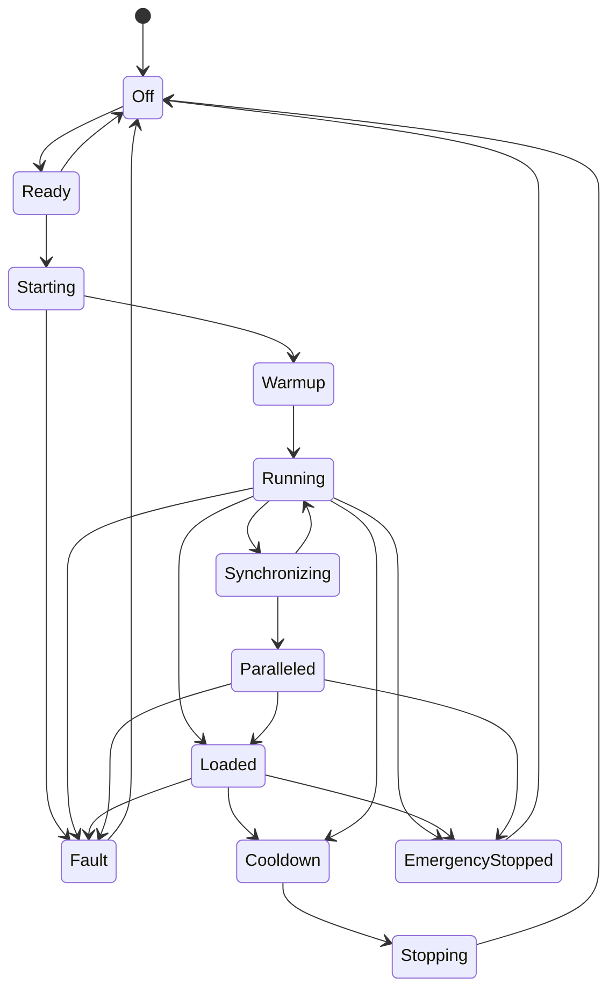

# OPC UA Companion Specification for Generators (Generator Sets)

**Release 1.0.0 — Draft**
**Namespace:** `http://opcfoundation.org/UA/Generators/`
**Publication date:** 2026-07-01

> Status: Working-group draft. This document, together with `Opc.Ua.Generators.NodeSet2.xml` and `Opc.Ua.Generators.NodeIds.csv`, defines an OPC UA information model for electrical power **Generator Sets (GenSets)**. It is intended to be vendor-neutral and to cover the entire industry that supplies and operates generators, from small residential home‑standby units to house‑sized, multi‑megawatt industrial and data‑center sets. A representative vendor portfolio spanning the full size and application range is used to confirm coverage, but nothing in the model is specific to a single manufacturer.

---

## 1 Scope

This specification defines the OPC UA ObjectTypes, VariableTypes, DataTypes, ReferenceTypes and their instances required to represent a generator set as an automation **asset** and, at the same time, as a machine that is **built around a prime‑mover engine** exposing a CAN bus / SAE J1939 interface.

The model covers:

- The generator set as a whole (nameplate/identification, ratings, operating state and mode, health, control methods).
- The prime‑mover **engine**, its telemetry (typically read over CAN/J1939) and its diagnostic trouble codes (DTCs).
- The **alternator** (generator end), including per‑phase and aggregate electrical measurements.
- Supporting subsystems: **fuel**, **cooling**, **lubrication**, **starting/battery**, and **exhaust aftertreatment**.
- The **controller / control panel** and its remote‑monitoring status.
- **Protection and alarm** functions (warnings, shutdowns, electrical trips, lockouts).
- **Automatic transfer switches (ATS)** and **paralleling / switchgear** for multi‑set power systems.

The model deliberately reuses the OPC UA **Devices (DI)** and **Machinery** companion specifications so that generator sets appear as first‑class members of the existing OPC UA machine/asset ecosystem.

## 2 Normative references

The following documents are indispensable for the application of this specification:

- [OPC 10000‑1 … 10000‑8](https://reference.opcfoundation.org/specs/OPC-10000-1/) — OPC Unified Architecture, Parts 1‑8 (core).
- [OPC 10000‑9](https://reference.opcfoundation.org/specs/OPC-10000-9/) — OPC UA Part 9: Alarms and Conditions.
- [OPC 10000‑16](https://reference.opcfoundation.org/specs/OPC-10000-16/) / [Part 5](https://reference.opcfoundation.org/specs/OPC-10000-5/) — State machines and the [`FiniteStateMachineType`](https://reference.opcfoundation.org/specs/OPC-10000-16/4.4.5).
- [OPC 10000‑100](https://reference.opcfoundation.org/specs/OPC-10000-100/) — OPC UA for Devices (**DI**), namespace `http://opcfoundation.org/UA/DI/`.
- [OPC 40001‑1](https://reference.opcfoundation.org/specs/OPC-40001-1/) — OPC UA for **Machinery**, Basic Building Blocks, namespace `http://opcfoundation.org/UA/Machinery/`.
- [OPC 11030](https://reference.opcfoundation.org/specs/OPC-11030/) — OPC UA Modelling Best Practices.
- ISO 8528 — Reciprocating internal combustion engine driven alternating current generating sets.
- SAE J1939 — Serial control and communications heavy‑duty vehicle network (engine ECU parameters, SPN/FMI, DM1/DM2).
- NFPA 110 — Standard for Emergency and Standby Power Systems.

## 3 Terms and abbreviations

| Term | Meaning |
|---|---|
| GenSet / Generator set | A complete power‑generation unit combining a prime‑mover engine and an alternator with control and support subsystems. |
| Prime mover | The engine that drives the alternator (diesel, gas, etc.). |
| Alternator | The AC generator end that converts mechanical power into electrical power. |
| ATS | Automatic Transfer Switch. |
| AVR | Automatic Voltage Regulator. |
| DTC | Diagnostic Trouble Code (SAE J1939 DM1/DM2). |
| SPN / FMI | Suspect Parameter Number / Failure Mode Identifier (SAE J1939). |
| ESP / PRP / COP / LTP | ISO 8528 ratings: Emergency Standby / Prime / Continuous / Limited‑Time Power. |
| DCC | Data‑Center Continuous rating. |
| PMG | Permanent Magnet Generator (excitation). |

## 4 General description

### 4.1 What is a generator set?

A generator set is simultaneously two things: an **asset** with a nameplate, health and a life‑cycle; and a **machine** whose core is an internal‑combustion engine coupled to an alternator. Sizes span four orders of magnitude of power. A small residential unit may produce ~13 kW on natural gas; a large industrial set built on a ~95 L V16 high‑speed diesel engine can deliver **3.0–3.75 MW**, is the size of a small house, and consumes on the order of **130–210 US gal/h** of diesel at full load. Between those extremes lie commercial standby, data‑center, healthcare, rental/mobile and marine products.

Whatever the size, every set exposes broadly the same information: identity, ratings, an operating state and mode, engine and alternator telemetry, fuel/cooling/lubrication/battery status, protections/alarms and start/stop control. This specification captures that common information once, so that a single client can monitor and (where permitted) control any conforming set.

### 4.2 Relationship to other companion specifications

This model is layered on established OPC UA building blocks rather than reinventing them:

- **DI (Devices).** [`GeneratorSetType`](#type-GeneratorSetType) derives from the DI [`DeviceType`](https://reference.opcfoundation.org/specs/OPC-10000-100/4.7), inheriting a complete nameplate (`Manufacturer`, `Model`, `SerialNumber`, `HardwareRevision`, `SoftwareRevision`, `DeviceRevision`, `RevisionCounter`, …) and `DeviceHealth` (`NORMAL`/`FAILURE`/`CHECK_FUNCTION`/`OFF_SPEC`/`MAINTENANCE_REQUIRED`). Each subsystem (engine, alternator, fuel system, …) derives from the DI [`ComponentType`](https://reference.opcfoundation.org/specs/OPC-10000-100/4.6), the standard base for an identifiable component of a device.
- **Machinery.** Every set carries the Machinery building blocks so that it is discoverable and interoperable alongside other machines: an `Identification` add‑in (a [`GeneratorIdentificationType`](#type-GeneratorIdentificationType), which specialises the Machinery [`MachineIdentificationType`](https://reference.opcfoundation.org/specs/OPC-40001-1/8.6)) and a `MachineryBuildingBlocks` folder holding the generic `MachineryItemState` and `MachineryOperationMode` state machines.
- **Part 9 (Alarms & Conditions).** Protection events are modelled by [`GeneratorProtectionAlarmType`](#type-GeneratorProtectionAlarmType), a subtype of [`OffNormalAlarmType`](https://reference.opcfoundation.org/specs/OPC-10000-9/5.8.24#5.8.24.2).
- **Part 5 / Part 16 (State machines).** The detailed run states of a set are modelled by [`GeneratorStateMachineType`](#type-GeneratorStateMachineType), a [`FiniteStateMachineType`](https://reference.opcfoundation.org/specs/OPC-10000-16/4.4.5).

### 4.3 Namespaces

| Index | Namespace URI | Role |
|---|---|---|
| 0 | `http://opcfoundation.org/UA/` | OPC UA core |
| 1 | `http://opcfoundation.org/UA/Generators/` | This specification |
| 2 | `http://opcfoundation.org/UA/DI/` | Devices |
| 3 | `http://opcfoundation.org/UA/Machinery/` | Machinery |

Numeric NodeIds in namespace 1 are allocated as follows: ObjectTypes `1001–1099`, DataTypes `3001–3099` (enumerations) and `3050+` (structures), EnumStrings properties `datatype‑id + 900`, and all remaining instance declarations (members, method arguments, state‑machine states and transitions) sequentially from `6001`.

## 5 Information‑model architecture

### 5.1 Composition of a generator set

```mermaid
graph TD
  GS[GeneratorSetType : DI.DeviceType]
  GS -->|HasAddIn 2:Identification| ID[GeneratorIdentificationType]
  GS -->|HasAddIn 3:MachineryBuildingBlocks| BB[Folder]
  BB --> MIS[MachineryItemState]
  BB --> MOM[MachineryOperationMode]
  GS -->|OperatingState| SM[GeneratorStateMachineType]
  GS -->|OperatingMode| OM[GeneratorOperatingModeEnum]
  GS --> ENG[Engine : EngineType]
  GS --> ALT[Alternator : AlternatorType]
  GS --> CTRL[Controller : GeneratorControllerType]
  GS --> FUEL[FuelSystem : FuelSystemType]
  GS --> COOL[CoolingSystem : CoolingSystemType]
  GS --> LUBE[LubricationSystem : LubricationSystemType]
  GS --> BATT[StartingSystem : StartingSystemType]
  GS --> RAT[Ratings folder → GeneratorRatingType]
  ENG -->|CanInterface| CAN[J1939DiagnosticInterfaceType]
  ENG -->|Aftertreatment| AT[ExhaustAftertreatmentType]
  ALT --> L1[L1 : AlternatorPhaseType]
  ALT --> L2[L2 : AlternatorPhaseType]
  ALT --> L3[L3 : AlternatorPhaseType]
  GS -.GeneratesEvent.-> AL[GeneratorProtectionAlarmType]
```

A multi‑set installation (data‑center, healthcare, campus) is represented by [`GeneratorSystemType`](#type-GeneratorSystemType), which aggregates one or more [`GeneratorSetType`](#type-GeneratorSetType) instances, an optional [`ParallelingControllerType`](#type-ParallelingControllerType) and one or more [`AutomaticTransferSwitchType`](#type-AutomaticTransferSwitchType) instances.

### 5.2 Design rationale

- **Asset + machine, not either/or.** Deriving from [`DeviceType`](https://reference.opcfoundation.org/specs/OPC-10000-100/4.7) gives the set an asset identity and health; adding the Machinery building blocks makes it discoverable as a machine. The `Identification` add‑in intentionally mirrors a few nameplate fields already present on `DeviceType`; the add‑in is the cross‑vendor, Machinery‑standard location, whereas the inherited `DeviceType` fields are the DI‑native location. Servers may populate either or both, but where both are present the equivalent fields (`Manufacturer`, `Model`, `SerialNumber`, `ProductInstanceUri`) **shall** carry the same value.
- **Composition over deep inheritance** ([OPC 11030 §7.2.4](https://reference.opcfoundation.org/specs/OPC-11030/7.2.4)). Subsystems are separate [`ComponentType`](https://reference.opcfoundation.org/specs/OPC-10000-100/4.6) subtypes referenced by [`HasComponent`](https://reference.opcfoundation.org/specs/OPC-10000-3/7.7), so a set can be assembled from exactly the components it has (a home‑standby air‑cooled unit omits the paralleling controller; a Tier 4 diesel adds [`ExhaustAftertreatment`](#type-ExhaustAftertreatmentType)).
- **Physical quantities use [`AnalogUnitType`](https://reference.opcfoundation.org/specs/OPC-10000-8/5.3.2#5.3.2.4) with machine‑readable units.** Every measured value is typed `AnalogUnitType` and carries an `EngineeringUnits` property whose value is a standard UNECE/CEFACT unit (e.g. `r/min`, `kPa`, `°C`, `kW`, `Hz`), so a client can discover the unit from the type model alone. A server **may** override this default at instance level to reflect the unit it actually reports (e.g. `psi`, `gal/h`, `°F`); the value range (`EURange`) is left to the instance.
- **The engine's CAN/J1939 interface is explicit.** Because a generator is "part engine with a CAN bus interface", the engine exposes a dedicated [`J1939DiagnosticInterfaceType`](#type-J1939DiagnosticInterfaceType) add‑in carrying the network parameters, the J1939 lamp status and the active/previously‑active DTC arrays.

## 6 ObjectTypes

The full member tables for every type are in **[Annex A](#annex-a)**. This clause summarises the intent of each type.

### 6.1 [GeneratorSetType](#type-GeneratorSetType)

The central type. Mandatory content: `OperatingState` (a `GeneratorStateMachineType`), `OperatingMode`, the `Engine`, `Alternator` and `Controller` components, the `Identification` add‑in and a `Ratings` folder. Optional content: fuel/cooling/lubrication/starting subsystems, `EmissionsStandard`, `Application`, breaker and readiness signals (`GeneratorBreakerClosed`, `GeneratorBreakerAvailable`, `RemoteStartInput`, `RunRequest`, `LoadInhibit`, `AvailableToLoad`), and the Machinery building blocks. Methods: `Start` (no argument — starts in the current mode), `Stop`, `EmergencyStop`, `ResetFaults`, `SetOperatingMode`, `StartTest`. The type `GeneratesEvent` `GeneratorProtectionAlarmType`.

### 6.2 [EngineType](#type-EngineType) and the CAN bus / SAE J1939 interface

`EngineType` exposes the classic engine telemetry — `Speed` (SPN 190), `OilPressure` (SPN 100), `CoolantTemperature` (SPN 110), `FuelRate` (SPN 183), `EngineHours` (SPN 247), boost, exhaust and intake temperatures, percent load/torque, etc. The referenced SPN for each variable is recorded in the variable description so that a gateway can map J1939 signals directly onto the model.

The engine's `CanInterface` (a `J1939DiagnosticInterfaceType`) models the network itself: `ProtocolName` ("SAE J1939"), `NetworkName`, `SourceAddress`, `Baudrate` (250 000 or 500 000 bit/s), `BusState`, the four J1939 DM1 lamp statuses (`AmberWarningLamp`, `RedStopLamp`, `MalfunctionIndicatorLamp`, `ProtectLamp`, each a `J1939LampStatusEnum` conveying Off / On / SlowFlash / FastFlash), and the `ActiveDiagnosticTroubleCodes` (DM1) and `PreviouslyActiveDiagnosticTroubleCodes` (DM2) arrays of `DiagnosticTroubleCodeType`. Each DTC carries `Spn`, `Fmi`, `OccurrenceCount`, `SourceAddress`/`SourceName` (so faults from multiple ECUs on the bus remain distinguishable) and a `Severity`. The method `ClearPreviouslyActiveDtcs` corresponds to J1939 DM3/DM11.

### 6.3 [AlternatorType](#type-AlternatorType) and [AlternatorPhaseType](#type-AlternatorPhaseType)

`AlternatorType` provides aggregate values — `Frequency`, `TotalRealPower`/`TotalReactivePower`/`TotalApparentPower`, average voltages and current, `AveragePowerFactor`, `TotalRealEnergy`, `LoadPercent`, winding and bearing temperatures, `Connection`, `ExcitationType`, `NumberOfPoles` — and three phase objects (`L1`, `L2`, `L3`, each an `AlternatorPhaseType`) carrying per‑phase voltage, current, power and power factor. Single‑phase sets populate only `L1` (mandatory); three‑phase sets populate all three.

### 6.4 Support subsystems

[`FuelSystemType`](#type-FuelSystemType) (fuel type/level/rate/pressure, gas supply pressure, runtime remaining, DEF for aftertreatment, water‑in‑fuel), [`CoolingSystemType`](#type-CoolingSystemType) (coolant temperature/level/pressure, cooling method, radiator fan and jacket‑water heater), [`LubricationSystemType`](#type-LubricationSystemType) (oil pressure/temperature/level, filter Δp) and [`StartingSystemType`](#type-StartingSystemType) (battery voltage/charging current, charger status, start attempts) model the balance‑of‑plant. All are optional so the type fits both a bare air‑cooled residential set and a fully instrumented industrial set.

### 6.5 [GeneratorControllerType](#type-GeneratorControllerType)

Represents the control panel. Carries controller identity (`ControllerFamily`, `FirmwareVersion`, `ApplicationSoftwareVersion`, `ConfigurationVersion`), operating annunciation (`InAutoMode`, `NotInAuto`), remote enablement (`RemoteStartEnabled`, `RemoteControlEnabled`) and remote‑monitoring status (`CloudConnected`, `ModbusEnabled`, `SignalStrength`).

### 6.6 [GeneratorRatingType](#type-GeneratorRatingType) and ratings

Because a set is usually certified for several ISO 8528 duties, ratings are modelled as a placeholder list. The `Ratings` folder on `GeneratorSetType` contains zero or more `GeneratorRatingType` objects, each with an `ApplicationRating` (ESP/PRP/COP/LTP/DCC) and the rated power, voltage, current, frequency, speed, power factor, phase count and reference ambient/altitude.

### 6.7 [GeneratorStateMachineType](#type-GeneratorStateMachineType)

`OperatingState` is a finite state machine with twelve states and the transitions shown below. It is the detailed, generator‑specific complement to the generic Machinery `MachineryItemState`.

### 6.8 Operating modes

`OperatingMode` (a [`GeneratorOperatingModeEnum`](#type-GeneratorOperatingModeEnum) value) reflects the control‑panel selector: `Off`, `Manual`, `Auto`, `Test`, `Exercise`, `RemoteStart`, `Maintenance`, `Lockout`. For Machinery‑ecosystem interoperability the generic `MachineryOperationMode` state machine is also present under `MachineryBuildingBlocks`.

### 6.9 Protections and alarms

`GeneratorProtectionAlarmType` (subtype of [`OffNormalAlarmType`](https://reference.opcfoundation.org/specs/OPC-10000-9/5.8.24#5.8.24.2)) reports any protection or shutdown condition. Its `ProtectionFunction` property (a [`GeneratorProtectionFunctionEnum`](#type-GeneratorProtectionFunctionEnum) with 64 values — low oil pressure, high coolant temperature, overspeed, overcrank, over/under voltage and frequency, overload, reverse power, ground fault, emergency stop, aftertreatment faults, ATS/breaker failures, …) identifies the condition; `GeneratorAlarmSeverity`, `IsShutdown`, `Spn`, `Fmi` and `SubsystemName` add context. Because the type is an `OffNormalAlarmType`, the *normal* state is "healthy / not tripped": on an instance, the inherited `NormalState` references the node representing the healthy value, `InputNode` references the supervised input (e.g. the shutdown latch or the measured variable), and `SourceNode` references the owning `GeneratorSetType` or subsystem so that clients can locate the origin. Analog limit conditions (e.g. over/under voltage) may additionally be surfaced with standard [`ExclusiveLevelAlarmType`](https://reference.opcfoundation.org/specs/OPC-10000-9/5.8.21#5.8.21.3) instances on the corresponding measured variables.

### 6.10 Transfer switches and paralleling

[`AutomaticTransferSwitchType`](#type-AutomaticTransferSwitchType) (a [`DeviceType`](https://reference.opcfoundation.org/specs/OPC-10000-100/4.7)) models an ATS: `Position`, `OperatingState`, `TransitionType`, two structured sources (`Source1`, `Source2`, each a [`TransferSwitchSourceType`](#type-TransferSwitchSourceType) carrying `Available`, `Acceptable`, `Voltage`, `Frequency` and `PhaseRotation`), `PreferredSource`, source connection flags, `TransferInhibited`/`TransferInhibitReason`, ratings, load metering, transfer timers and counters, and the `Transfer`/`Retransfer`/`InhibitTransfer` methods. [`ParallelingControllerType`](#type-ParallelingControllerType) models synchronising and load sharing across a common bus: `SystemState`, bus voltage/frequency/power, synchronising deltas (`SynchronizationAngle`, `SlipFrequency`, voltage/frequency difference, `SyncCheckPermissive`, `DeadBus`), load‑share and capacity values, breaker states, utility import/export, and the `ConnectToBus`/`DisconnectFromBus` methods.

### 6.11 [GeneratorSystemType](#type-GeneratorSystemType)

Aggregates a paralleled plant: a mandatory `GeneratorSets` folder of `GeneratorSetType` instances, an optional `ParallelingController`, an optional `TransferSwitches` folder, and system totals (`NumberOfGeneratorSets`, `TotalSystemCapacity`, `TotalSystemLoad`, `RedundancyScheme`).

## 7 DataTypes

Seventeen enumerations and one structure are defined; see [Annex A](#annex-a) for the full value lists. The enumerations are extensible (each provides an `Other`/`Unknown` member where appropriate) and cover fuel types, application/duty ratings, electrical connection, excitation, cooling method, aspiration, emissions standard, CAN bus state, J1939 lamp status, transfer‑switch position/transition/state, alarm severity, the 64‑value protection‑function list, paralleling‑system state and aftertreatment state. The [`DiagnosticTroubleCodeType`](#type-DiagnosticTroubleCodeType) structure carries a single SAE J1939 DTC (`Spn`, `Fmi`, `OccurrenceCount`, `ConversionMethod`, `Active`, `SourceAddress`, `SourceName`, `Severity`, `Description`).

## 8 Coverage of the industry

The model is vendor‑neutral. The following mapping shows how representative product tiers across the generator industry are expressed with the types defined here; products from any manufacturer map the same way.

| Product tier | Represented by |
|---|---|
| Residential / home standby (~10–60 kW, air‑ or liquid‑cooled, natural gas / LPG) | [`GeneratorSetType`](#type-GeneratorSetType) with an air‑ or liquid‑cooled `CoolingSystem`, `FuelType` = NaturalGas/Propane, and a single‑phase alternator (`L1` only) |
| Commercial & industrial diesel (up to ~3.75 MW) | `GeneratorSetType` with a high‑power `EngineType`, three‑phase `AlternatorType`, `ExhaustAftertreatment` (Tier 4 / Stage V), and multiple `GeneratorRatingType` (Standby / Prime) |
| Natural‑gas / lean‑burn (~55 kW–2 MW, CHP / continuous) | `GeneratorSetType` with `FuelType` = NaturalGas/Biogas/LandfillGas, `FuelSystem.GasSupplyPressure`, and `ApplicationRating` = Continuous |
| Data‑center (multi‑MW, N+1 / 2N, medium‑voltage bus) | [`GeneratorSystemType`](#type-GeneratorSystemType) aggregating sets with `ApplicationRating` = DataCenterContinuous, a `ParallelingControllerType`, and a `RedundancyScheme` |
| Healthcare / life‑safety (NFPA 110 Level 1) | `GeneratorSetType` + `AutomaticTransferSwitchType`; readiness via `StartingSystem`, `FuelSystem.RuntimeRemaining` and `Controller.InAutoMode` |
| Rental / mobile / towable (Tier 4 Final) | `GeneratorSetType` with `ExhaustAftertreatment` (DEF / DPF / SCR) and `Application` = Rental |
| Control panels & cloud monitoring | `GeneratorControllerType` (`ControllerFamily`, firmware/config versions, `CloudConnected`, `ModbusEnabled`) |
| Transfer switches (open / closed / soft‑load, bypass‑isolation) | `AutomaticTransferSwitchType` (`TransitionType`, structured `Source1`/`Source2`) |
| Paralleling switchgear / master control | `ParallelingControllerType` + `GeneratorSystemType` |

## 9 Profiles and conformance

A server implementing this specification should implement the [`GeneratorSetType`](#type-GeneratorSetType) and its mandatory content. Support for individual subsystems (fuel, cooling, lubrication, starting, aftertreatment), for [`AutomaticTransferSwitchType`](#type-AutomaticTransferSwitchType), [`ParallelingControllerType`](#type-ParallelingControllerType) and [`GeneratorSystemType`](#type-GeneratorSystemType), and for the control methods is optional and should be advertised through appropriate profiles/facets. Instances of `GeneratorSetType` should be made discoverable by organising them under the Machinery `Machines` folder, as recommended by [OPC 40001‑1](https://reference.opcfoundation.org/specs/OPC-40001-1/).

Mandatory children inherited from the chosen base types are **not** re‑declared in this NodeSet, but conforming instances must still expose them. In particular: the DI [`DeviceType`](https://reference.opcfoundation.org/specs/OPC-10000-100/4.7) nameplate (`Manufacturer`, `Model`, `SerialNumber`, `HardwareRevision`, `SoftwareRevision`, `DeviceRevision`, `DeviceManual`, `RevisionCounter`); the [`FiniteStateMachineType`](https://reference.opcfoundation.org/specs/OPC-10000-16/4.4.5) `CurrentState` on `OperatingState`; the [`AnalogUnitType`](https://reference.opcfoundation.org/specs/OPC-10000-8/5.3.2#5.3.2.4) `EngineeringUnits` on every measured value (this specification pre‑populates it with a default unit); and the [`OffNormalAlarmType`](https://reference.opcfoundation.org/specs/OPC-10000-9/5.8.24#5.8.24.2) / [`AcknowledgeableConditionType`](https://reference.opcfoundation.org/specs/OPC-10000-9/5.7.2) condition state (`EnabledState`, `ActiveState`, `AckedState`, `NormalState`). Optional but recommended children — such as the `FiniteStateMachineType` `LastTransition` and the `AnalogUnitType` `EURange` / `InstrumentRange` — should be provided where the information is available.

## 10 PubSub dataset bindings

The information model is transport‑neutral: it can be exposed over OPC UA client/server and, at scale, over **OPC UA PubSub** ([OPC 10000‑14](https://reference.opcfoundation.org/specs/OPC-10000-14/)). This clause gives *non‑normative* recommendations for grouping the Variables of a generator set into **PublishedDataSets** (PDS) and **WriterGroups** so that a server can efficiently feed several classes of consumer. A server may publish any subset; the field paths below are BrowsePaths relative to a [`GeneratorSetType`](#type-GeneratorSetType) (or [`GeneratorSystemType`](#type-GeneratorSystemType)) instance.

### 10.1 General binding guidance

- A **PublishedDataSet** is a named list of published fields, each field bound to a Variable of the model (for example `Alternator/TotalRealPower`). Group fields by **rate of change** and **consumer** so that fast telemetry, slow nameplate/configuration, and event data travel in separate datasets and writer groups.
- Use one **WriterGroup** per publishing rate. Publish cyclic telemetry as **delta frames** with a periodic **key frame**; publish nameplate/configuration as low‑rate key frames or on change.
- Bind alarms and protection events to an **event DataSet** (the Part 14 event message mapping) rather than to a cyclic dataset.
- Expose `DataSetMetaData` including its `ConfigurationVersion` so subscribers can detect structural changes, and carry `SourceTimestamp` and `StatusCode` per field so analytics can reason about data quality and gaps.
- For multi‑set installations, a `GeneratorSystemType` writer publishes aggregated key indicators while each `GeneratorSetType` publishes its own detailed datasets.

### 10.2 Scenario — Operational observability

Real‑time monitoring, SCADA/HMI and remote operations. Low latency, small payloads, cyclic.

| PublishedDataSet | Suggested fields | Rate | Frame |
|---|---|---|---|
| `GenSet.Live` | `OperatingState/CurrentState`, `OperatingMode`, `Engine/Speed`, `Engine/CoolantTemperature`, `Engine/OilPressure`, `Alternator/Frequency`, `Alternator/TotalRealPower`, `Alternator/AverageLineToLineVoltage`, `Alternator/AverageCurrent`, `FuelSystem/FuelLevel`, `StartingSystem/BatteryVoltage` | 1 s | delta + 10 s key |
| `GenSet.Status` | `GeneratorBreakerClosed`, `AvailableToLoad`, `RunRequest`, `LoadInhibit`, `Controller/InAutoMode`, `DeviceHealth` | on change | key |

### 10.3 Scenario — Analytics: predictive maintenance

Trending of wear‑ and condition‑related signals together with diagnostic codes and usage counters; historized. Moderate rate.

| PublishedDataSet | Suggested fields | Rate |
|---|---|---|
| `GenSet.Condition` | `Engine/OilPressure`, `Engine/OilTemperature`, `Engine/CoolantTemperature`, `Engine/ExhaustGasTemperature`, `Engine/IntakeManifoldPressure`, `LubricationSystem/OilFilterDifferentialPressure`, `Alternator/WindingTemperature1..3`, `Alternator/BearingTemperatureDriveEnd`, `Alternator/BearingTemperatureNonDriveEnd`, `FuelSystem/FuelPressure` | 1–10 s |
| `GenSet.Usage` | `Engine/EngineHours`, `Engine/NumberOfStarts`, `StartingSystem/StartAttempts`, `Alternator/TotalRealEnergy`, `FuelSystem/TotalFuelConsumed` | 1 min / on change |
| `GenSet.Diagnostics` | `Engine/CanInterface/ActiveDiagnosticTroubleCodes`, `Engine/CanInterface/PreviouslyActiveDiagnosticTroubleCodes`, `Engine/CanInterface/AmberWarningLamp`, `Engine/CanInterface/RedStopLamp` | on change |

Predictive models correlate the condition signals with usage counters and DTC history to forecast wear (bearings, injectors, cooling and lubrication systems) and to schedule service before failure.

### 10.4 Scenario — Analytics: anomaly detection

High‑resolution, correlated electrical and mechanical signals for baseline modelling and deviation/outlier detection (phase imbalance, load‑vs‑fuel drift, incipient faults).

| PublishedDataSet | Suggested fields | Rate |
|---|---|---|
| `GenSet.HiRes` | `Engine/Speed`, `Engine/PercentLoad`, `Engine/FuelRate`, `Alternator/Frequency`, `Alternator/TotalRealPower`, `Alternator/TotalReactivePower`, and per‑phase `Alternator/L1..L3/Current`, `.../LineToNeutralVoltage`, `.../PowerFactor` | 100 ms – 1 s |

### 10.5 Scenario — Energy & load management and paralleling

Load sharing, peak shaving, demand response and grid‑services coordination across a bus or fleet.

| PublishedDataSet | Suggested fields | Rate |
|---|---|---|
| `System.Load` | `ParallelingController/TotalBusRealPower`, `.../TotalBusReactivePower`, `.../BusFrequency`, `.../BusVoltage`, `.../LoadSharePercent`, `.../AvailableCapacity`, `.../SpinningReserve`, `.../UtilityImportPower`, `.../UtilityExportPower` | 200 ms – 1 s |
| `GenSet.Power` | `Alternator/TotalRealPower`, `Alternator/LoadPercent`, `Ratings/<Rating>/RatedRealPower` | 1 s |

### 10.6 Scenario — Alarm & event distribution

Protection and condition events for operators, CMMS/EAM systems and safety functions.

| Event DataSet | Source | Delivery |
|---|---|---|
| `GenSet.Events` | `GeneratorProtectionAlarmType` events (`ProtectionFunction`, `GeneratorAlarmSeverity`, `IsShutdown`, `Spn`, `Fmi`, `SubsystemName`) plus the standard `AcknowledgeableConditionType` fields | event‑driven, reliable, with keep‑alive |

### 10.7 Scenario — Fleet monitoring & compliance

Multi‑site supervision, contractual reporting and regulatory / emergency‑power compliance (for example NFPA 110 test records and emissions reporting).

| PublishedDataSet | Suggested fields | Rate |
|---|---|---|
| `GenSet.Nameplate` | `Identification/Manufacturer`, `Identification/Model`, `Identification/SerialNumber`, `Identification/EngineModel`, `Identification/AlternatorModel`, `Identification/RatedRealPower`, `Identification/EmissionsStandard`, `Application`, `Controller/FirmwareVersion`, `Controller/ConfigurationVersion` | on change / daily key |
| `GenSet.Compliance` | `EmissionsStandard`, `Engine/Aftertreatment/AftertreatmentState`, `Engine/Aftertreatment/DefLevel`, `Engine/Aftertreatment/DpfSootLoad`, `Engine/EngineHours`, `FuelSystem/TotalFuelConsumed` (test runs are recorded via the `StartTest` method and protection/condition events) | periodic / event |
| `System.Fleet` | per set `OperatingState/CurrentState` and `Alternator/TotalRealPower`; system `TotalSystemLoad`, `TotalSystemCapacity`, `NumberOfGeneratorSets` | 1–10 s |

## 11 Deliverables and reproducibility

| File | Content |
|---|---|
| [`Opc.Ua.Generators.NodeSet2.xml`](Opc.Ua.Generators.NodeSet2.xml) | The normative machine‑readable information model (UANodeSet). |
| [`Opc.Ua.Generators.NodeIds.csv`](Opc.Ua.Generators.NodeIds.csv) | Numeric NodeId assignments (`SymbolicName,NodeId,NodeClass`). |
| [`OPC-UA-Companion-Specification-for-Generators.md`](OPC-UA-Companion-Specification-for-Generators.md) | This document. |
| [`tools/build_model.py`](tools/build_model.py) | The generator that emits the NodeSet, the CSV and the [Annex A](#annex-a) tables from a single source of truth. |

The NodeSet has been validated to be structurally correct: XML well‑formedness, unique NodeIds, CSV↔NodeSet consistency, and resolution of **every** external base NodeId against the official OPC UA, DI and Machinery NodeId tables. Representative constructs (analog measurements, enumerations, a structure with encodings, methods with arguments, the finite state machine, the alarm subtype and the Machinery add‑ins) were additionally checked with the OPC Foundation modelling validator and reported **0 errors**.

---

## Annex A — Information model

This annex is the normative node reference. It is generated directly from `tools/build_model.py` and therefore always matches `Opc.Ua.Generators.NodeSet2.xml`. It is organised by NodeClass. For every ObjectType and DataType the full structure is given, and the **Declared in** column names the type that declares each member — rows whose *Declared in* value differs from the type being described are **inherited** from a base type in OPC UA, Devices (DI) or Machinery.

### Type overview

| NodeId | BrowseName | NodeClass | Subtype of |
|---|---|---|---|
| ns=1;i=1016 | [GeneratorIdentificationType](#type-GeneratorIdentificationType) | ObjectType | [MachineIdentificationType](https://reference.opcfoundation.org/specs/OPC-40001-1/8.6) \[Machinery\] |
| ns=1;i=1011 | [GeneratorStateMachineType](#type-GeneratorStateMachineType) | ObjectType | [FiniteStateMachineType](https://reference.opcfoundation.org/specs/OPC-10000-16/4.4.5) |
| ns=1;i=1010 | [J1939DiagnosticInterfaceType](#type-J1939DiagnosticInterfaceType) | ObjectType | [BaseObjectType](https://reference.opcfoundation.org/specs/OPC-10000-5/6.2) |
| ns=1;i=1018 | [ExhaustAftertreatmentType](#type-ExhaustAftertreatmentType) | ObjectType | [ComponentType](https://reference.opcfoundation.org/specs/OPC-10000-100/4.6) \[DI\] |
| ns=1;i=1002 | [EngineType](#type-EngineType) | ObjectType | [ComponentType](https://reference.opcfoundation.org/specs/OPC-10000-100/4.6) \[DI\] |
| ns=1;i=1004 | [AlternatorPhaseType](#type-AlternatorPhaseType) | ObjectType | [BaseObjectType](https://reference.opcfoundation.org/specs/OPC-10000-5/6.2) |
| ns=1;i=1003 | [AlternatorType](#type-AlternatorType) | ObjectType | [ComponentType](https://reference.opcfoundation.org/specs/OPC-10000-100/4.6) \[DI\] |
| ns=1;i=1005 | [FuelSystemType](#type-FuelSystemType) | ObjectType | [ComponentType](https://reference.opcfoundation.org/specs/OPC-10000-100/4.6) \[DI\] |
| ns=1;i=1006 | [CoolingSystemType](#type-CoolingSystemType) | ObjectType | [ComponentType](https://reference.opcfoundation.org/specs/OPC-10000-100/4.6) \[DI\] |
| ns=1;i=1007 | [LubricationSystemType](#type-LubricationSystemType) | ObjectType | [ComponentType](https://reference.opcfoundation.org/specs/OPC-10000-100/4.6) \[DI\] |
| ns=1;i=1008 | [StartingSystemType](#type-StartingSystemType) | ObjectType | [ComponentType](https://reference.opcfoundation.org/specs/OPC-10000-100/4.6) \[DI\] |
| ns=1;i=1009 | [GeneratorControllerType](#type-GeneratorControllerType) | ObjectType | [ComponentType](https://reference.opcfoundation.org/specs/OPC-10000-100/4.6) \[DI\] |
| ns=1;i=1012 | [GeneratorRatingType](#type-GeneratorRatingType) | ObjectType | [BaseObjectType](https://reference.opcfoundation.org/specs/OPC-10000-5/6.2) |
| ns=1;i=1017 | [GeneratorProtectionAlarmType](#type-GeneratorProtectionAlarmType) | ObjectType | [OffNormalAlarmType](https://reference.opcfoundation.org/specs/OPC-10000-9/5.8.24#5.8.24.2) |
| ns=1;i=1001 | [GeneratorSetType](#type-GeneratorSetType) | ObjectType | [DeviceType](https://reference.opcfoundation.org/specs/OPC-10000-100/4.7) \[DI\] |
| ns=1;i=1019 | [TransferSwitchSourceType](#type-TransferSwitchSourceType) | ObjectType | [BaseObjectType](https://reference.opcfoundation.org/specs/OPC-10000-5/6.2) |
| ns=1;i=1013 | [AutomaticTransferSwitchType](#type-AutomaticTransferSwitchType) | ObjectType | [DeviceType](https://reference.opcfoundation.org/specs/OPC-10000-100/4.7) \[DI\] |
| ns=1;i=1014 | [ParallelingControllerType](#type-ParallelingControllerType) | ObjectType | [ComponentType](https://reference.opcfoundation.org/specs/OPC-10000-100/4.6) \[DI\] |
| ns=1;i=1015 | [GeneratorSystemType](#type-GeneratorSystemType) | ObjectType | [BaseObjectType](https://reference.opcfoundation.org/specs/OPC-10000-5/6.2) |
| ns=1;i=3001 | [GeneratorOperatingModeEnum](#type-GeneratorOperatingModeEnum) | DataType | [Enumeration](https://reference.opcfoundation.org/specs/OPC-10000-3/8.14) |
| ns=1;i=3002 | [FuelTypeEnum](#type-FuelTypeEnum) | DataType | [Enumeration](https://reference.opcfoundation.org/specs/OPC-10000-3/8.14) |
| ns=1;i=3003 | [GeneratorApplicationRatingEnum](#type-GeneratorApplicationRatingEnum) | DataType | [Enumeration](https://reference.opcfoundation.org/specs/OPC-10000-3/8.14) |
| ns=1;i=3004 | [ElectricalConnectionEnum](#type-ElectricalConnectionEnum) | DataType | [Enumeration](https://reference.opcfoundation.org/specs/OPC-10000-3/8.14) |
| ns=1;i=3005 | [ExcitationTypeEnum](#type-ExcitationTypeEnum) | DataType | [Enumeration](https://reference.opcfoundation.org/specs/OPC-10000-3/8.14) |
| ns=1;i=3006 | [CoolingMethodEnum](#type-CoolingMethodEnum) | DataType | [Enumeration](https://reference.opcfoundation.org/specs/OPC-10000-3/8.14) |
| ns=1;i=3007 | [AspirationEnum](#type-AspirationEnum) | DataType | [Enumeration](https://reference.opcfoundation.org/specs/OPC-10000-3/8.14) |
| ns=1;i=3008 | [EmissionsStandardEnum](#type-EmissionsStandardEnum) | DataType | [Enumeration](https://reference.opcfoundation.org/specs/OPC-10000-3/8.14) |
| ns=1;i=3009 | [CanBusStateEnum](#type-CanBusStateEnum) | DataType | [Enumeration](https://reference.opcfoundation.org/specs/OPC-10000-3/8.14) |
| ns=1;i=3010 | [TransferSwitchPositionEnum](#type-TransferSwitchPositionEnum) | DataType | [Enumeration](https://reference.opcfoundation.org/specs/OPC-10000-3/8.14) |
| ns=1;i=3011 | [TransferTransitionTypeEnum](#type-TransferTransitionTypeEnum) | DataType | [Enumeration](https://reference.opcfoundation.org/specs/OPC-10000-3/8.14) |
| ns=1;i=3012 | [AtsOperatingStateEnum](#type-AtsOperatingStateEnum) | DataType | [Enumeration](https://reference.opcfoundation.org/specs/OPC-10000-3/8.14) |
| ns=1;i=3013 | [AlarmSeverityEnum](#type-AlarmSeverityEnum) | DataType | [Enumeration](https://reference.opcfoundation.org/specs/OPC-10000-3/8.14) |
| ns=1;i=3014 | [GeneratorProtectionFunctionEnum](#type-GeneratorProtectionFunctionEnum) | DataType | [Enumeration](https://reference.opcfoundation.org/specs/OPC-10000-3/8.14) |
| ns=1;i=3015 | [ParallelingSystemStateEnum](#type-ParallelingSystemStateEnum) | DataType | [Enumeration](https://reference.opcfoundation.org/specs/OPC-10000-3/8.14) |
| ns=1;i=3016 | [AftertreatmentStateEnum](#type-AftertreatmentStateEnum) | DataType | [Enumeration](https://reference.opcfoundation.org/specs/OPC-10000-3/8.14) |
| ns=1;i=3017 | [J1939LampStatusEnum](#type-J1939LampStatusEnum) | DataType | [Enumeration](https://reference.opcfoundation.org/specs/OPC-10000-3/8.14) |
| ns=1;i=3050 | [DiagnosticTroubleCodeType](#type-DiagnosticTroubleCodeType) | DataType | [Structure](https://reference.opcfoundation.org/specs/OPC-10000-3/8.32) |

### Object types

#### GeneratorIdentificationType  (ns=1;i=1016)

*Inherits from:* [MachineIdentificationType](https://reference.opcfoundation.org/specs/OPC-40001-1/8.6) \[Machinery\]

Identification and nameplate of a generator set. Extends the Machinery MachineIdentificationType with generator-specific nameplate data.

| BrowseName | NodeClass | DataType | ModellingRule | Declared in | Description |
|---|---|---|---|---|---|
| SpecificationNumber | Variable | String | Optional | GeneratorIdentificationType | Vendor build/specification code that identifies the exact configuration. |
| ProductFamily | Variable | String | Optional | GeneratorIdentificationType | Vendor product family or series to which the set belongs. |
| EngineModel | Variable | String | Optional | GeneratorIdentificationType | Model designation of the prime-mover engine. |
| EngineSerialNumber | Variable | String | Optional | GeneratorIdentificationType | Serial number of the prime-mover engine. |
| AlternatorModel | Variable | String | Optional | GeneratorIdentificationType | Model designation of the alternator. |
| AlternatorSerialNumber | Variable | String | Optional | GeneratorIdentificationType | Serial number of the alternator. |
| ControllerModel | Variable | String | Optional | GeneratorIdentificationType | Model designation of the control panel. |
| FuelType | Variable | [FuelTypeEnum](#type-FuelTypeEnum) | Optional | GeneratorIdentificationType | Primary fuel of the set. |
| EmissionsStandard | Variable | [EmissionsStandardEnum](#type-EmissionsStandardEnum) | Optional | GeneratorIdentificationType | Emissions certification standard. |
| RatedRealPower | Variable | Double | Optional | GeneratorIdentificationType | Nameplate rated real power. EngineeringUnits: kW. |
| RatedApparentPower | Variable | Double | Optional | GeneratorIdentificationType | Nameplate rated apparent power. EngineeringUnits: kVA. |
| RatedVoltage | Variable | Double | Optional | GeneratorIdentificationType | Nameplate rated line-to-line voltage. EngineeringUnits: V. |
| RatedFrequency | Variable | Double | Optional | GeneratorIdentificationType | Nameplate rated frequency. EngineeringUnits: Hz. |
| SoundRatingAt7m | Variable | Double | Optional | GeneratorIdentificationType | Sound pressure level at 7 m (23 ft) in dB(A). |
| Location | Variable | String | Optional | [MachineIdentificationType](https://reference.opcfoundation.org/specs/OPC-40001-1/8.6) | |
| ProductInstanceUri | Variable | String | Mandatory | [MachineIdentificationType](https://reference.opcfoundation.org/specs/OPC-40001-1/8.6) | |
| AssetId | Variable | String | Optional | [MachineryItemIdentificationType](https://reference.opcfoundation.org/specs/OPC-40001-1/8.3) | |
| ComponentName | Variable | LocalizedText | Optional | [MachineryItemIdentificationType](https://reference.opcfoundation.org/specs/OPC-40001-1/8.3) | |
| DeviceClass | Variable | String | Optional | [MachineryItemIdentificationType](https://reference.opcfoundation.org/specs/OPC-40001-1/8.3) | |
| HardwareRevision | Variable | String | Optional | [MachineryItemIdentificationType](https://reference.opcfoundation.org/specs/OPC-40001-1/8.3) | |
| InitialOperationDate | Variable | DateTime | Optional | [MachineryItemIdentificationType](https://reference.opcfoundation.org/specs/OPC-40001-1/8.3) | |
| Manufacturer | Variable | LocalizedText | Mandatory | [MachineryItemIdentificationType](https://reference.opcfoundation.org/specs/OPC-40001-1/8.3) | |
| ManufacturerUri | Variable | String | Optional | [MachineryItemIdentificationType](https://reference.opcfoundation.org/specs/OPC-40001-1/8.3) | |
| Model | Variable | LocalizedText | Optional | [MachineryItemIdentificationType](https://reference.opcfoundation.org/specs/OPC-40001-1/8.3) | |
| MonthOfConstruction | Variable | Byte | Optional | [MachineryItemIdentificationType](https://reference.opcfoundation.org/specs/OPC-40001-1/8.3) | |
| ProductCode | Variable | String | Optional | [MachineryItemIdentificationType](https://reference.opcfoundation.org/specs/OPC-40001-1/8.3) | |
| SerialNumber | Variable | String | Mandatory | [MachineryItemIdentificationType](https://reference.opcfoundation.org/specs/OPC-40001-1/8.3) | |
| SoftwareRevision | Variable | String | Optional | [MachineryItemIdentificationType](https://reference.opcfoundation.org/specs/OPC-40001-1/8.3) | |
| YearOfConstruction | Variable | UInt16 | Optional | [MachineryItemIdentificationType](https://reference.opcfoundation.org/specs/OPC-40001-1/8.3) | |
| <GroupIdentifier> | Object |  | OptionalPlaceholder | [FunctionalGroupType](https://reference.opcfoundation.org/specs/OPC-10000-100/4.4.1) | |
| UIElement | Variable |  | Optional | [FunctionalGroupType](https://reference.opcfoundation.org/specs/OPC-10000-100/4.4.1) | |

#### GeneratorStateMachineType  (ns=1;i=1011)

*Inherits from:* [FiniteStateMachineType](https://reference.opcfoundation.org/specs/OPC-10000-16/4.4.5)

Finite state machine describing the operating state of a generator set: Off, Ready, Starting, Warmup, Running, Loaded, Synchronizing, Paralleled, Cooldown, Stopping, Fault and EmergencyStopped.

| BrowseName | NodeClass | DataType | ModellingRule | Declared in | Description |
|---|---|---|---|---|---|
| Off | Object |  |  | GeneratorStateMachineType | State 'Off' of the generator set operating state machine. |
| Ready | Object |  |  | GeneratorStateMachineType | State 'Ready' of the generator set operating state machine. |
| Starting | Object |  |  | GeneratorStateMachineType | State 'Starting' of the generator set operating state machine. |
| Warmup | Object |  |  | GeneratorStateMachineType | State 'Warmup' of the generator set operating state machine. |
| Running | Object |  |  | GeneratorStateMachineType | State 'Running' of the generator set operating state machine. |
| Loaded | Object |  |  | GeneratorStateMachineType | State 'Loaded' of the generator set operating state machine. |
| Synchronizing | Object |  |  | GeneratorStateMachineType | State 'Synchronizing' of the generator set operating state machine. |
| Paralleled | Object |  |  | GeneratorStateMachineType | State 'Paralleled' of the generator set operating state machine. |
| Cooldown | Object |  |  | GeneratorStateMachineType | State 'Cooldown' of the generator set operating state machine. |
| Stopping | Object |  |  | GeneratorStateMachineType | State 'Stopping' of the generator set operating state machine. |
| Fault | Object |  |  | GeneratorStateMachineType | State 'Fault' of the generator set operating state machine. |
| EmergencyStopped | Object |  |  | GeneratorStateMachineType | State 'EmergencyStopped' of the generator set operating state machine. |
| OffToReady | Object |  |  | GeneratorStateMachineType | Transition 'OffToReady'. |
| ReadyToStarting | Object |  |  | GeneratorStateMachineType | Transition 'ReadyToStarting'. |
| ReadyToOff | Object |  |  | GeneratorStateMachineType | Transition 'ReadyToOff'. |
| StartingToWarmup | Object |  |  | GeneratorStateMachineType | Transition 'StartingToWarmup'. |
| StartingToFault | Object |  |  | GeneratorStateMachineType | Transition 'StartingToFault'. |
| WarmupToRunning | Object |  |  | GeneratorStateMachineType | Transition 'WarmupToRunning'. |
| RunningToLoaded | Object |  |  | GeneratorStateMachineType | Transition 'RunningToLoaded'. |
| RunningToSynchronizing | Object |  |  | GeneratorStateMachineType | Transition 'RunningToSynchronizing'. |
| SynchronizingToParalleled | Object |  |  | GeneratorStateMachineType | Transition 'SynchronizingToParalleled'. |
| SynchronizingToRunning | Object |  |  | GeneratorStateMachineType | Transition 'SynchronizingToRunning'. |
| ParalleledToLoaded | Object |  |  | GeneratorStateMachineType | Transition 'ParalleledToLoaded'. |
| LoadedToCooldown | Object |  |  | GeneratorStateMachineType | Transition 'LoadedToCooldown'. |
| RunningToCooldown | Object |  |  | GeneratorStateMachineType | Transition 'RunningToCooldown'. |
| CooldownToStopping | Object |  |  | GeneratorStateMachineType | Transition 'CooldownToStopping'. |
| StoppingToOff | Object |  |  | GeneratorStateMachineType | Transition 'StoppingToOff'. |
| RunningToFault | Object |  |  | GeneratorStateMachineType | Transition 'RunningToFault'. |
| LoadedToFault | Object |  |  | GeneratorStateMachineType | Transition 'LoadedToFault'. |
| ParalleledToFault | Object |  |  | GeneratorStateMachineType | Transition 'ParalleledToFault'. |
| FaultToOff | Object |  |  | GeneratorStateMachineType | Transition 'FaultToOff'. |
| RunningToEmergencyStopped | Object |  |  | GeneratorStateMachineType | Transition 'RunningToEmergencyStopped'. |
| LoadedToEmergencyStopped | Object |  |  | GeneratorStateMachineType | Transition 'LoadedToEmergencyStopped'. |
| ParalleledToEmergencyStopped | Object |  |  | GeneratorStateMachineType | Transition 'ParalleledToEmergencyStopped'. |
| EmergencyStoppedToOff | Object |  |  | GeneratorStateMachineType | Transition 'EmergencyStoppedToOff'. |
| CurrentState | Variable | LocalizedText | Mandatory | [FiniteStateMachineType](https://reference.opcfoundation.org/specs/OPC-10000-16/4.4.5) | |
| LastTransition | Variable | LocalizedText | Optional | [FiniteStateMachineType](https://reference.opcfoundation.org/specs/OPC-10000-16/4.4.5) | |
| AvailableStates | Variable | NodeId\[\] | Optional | [FiniteStateMachineType](https://reference.opcfoundation.org/specs/OPC-10000-16/4.4.5) | |
| AvailableTransitions | Variable | NodeId\[\] | Optional | [FiniteStateMachineType](https://reference.opcfoundation.org/specs/OPC-10000-16/4.4.5) | |

#### J1939DiagnosticInterfaceType  (ns=1;i=1010)

*Inherits from:* [BaseObjectType](https://reference.opcfoundation.org/specs/OPC-10000-5/6.2)

The engine CAN bus / SAE J1939 diagnostic interface. Surfaces the network connection parameters, J1939 lamp status and active/previously-active diagnostic trouble codes reported by the engine ECU.

| BrowseName | NodeClass | DataType | ModellingRule | Declared in | Description |
|---|---|---|---|---|---|
| ProtocolName | Variable | String | Mandatory | J1939DiagnosticInterfaceType | Name of the diagnostic protocol, e.g. 'SAE J1939'. |
| NetworkName | Variable | String | Optional | J1939DiagnosticInterfaceType | Name/identifier of the CAN network (e.g. CAN0). |
| SourceAddress | Variable | Byte | Optional | J1939DiagnosticInterfaceType | J1939 source address of the engine ECU. |
| Baudrate | Variable | UInt32 | Optional | J1939DiagnosticInterfaceType | CAN bit rate in bit/s (typically 250000 or 500000). |
| BusState | Variable | [CanBusStateEnum](#type-CanBusStateEnum) | Optional | J1939DiagnosticInterfaceType | State of the CAN bus interface. |
| AmberWarningLamp | Variable | [J1939LampStatusEnum](#type-J1939LampStatusEnum) | Optional | J1939DiagnosticInterfaceType | J1939 DM1 amber warning lamp status. |
| RedStopLamp | Variable | [J1939LampStatusEnum](#type-J1939LampStatusEnum) | Optional | J1939DiagnosticInterfaceType | J1939 DM1 red stop lamp status. |
| MalfunctionIndicatorLamp | Variable | [J1939LampStatusEnum](#type-J1939LampStatusEnum) | Optional | J1939DiagnosticInterfaceType | J1939 DM1 malfunction indicator lamp status. |
| ProtectLamp | Variable | [J1939LampStatusEnum](#type-J1939LampStatusEnum) | Optional | J1939DiagnosticInterfaceType | J1939 DM1 protect lamp status. |
| ActiveDiagnosticTroubleCodes | Variable | [DiagnosticTroubleCodeType](#type-DiagnosticTroubleCodeType)\[\] | Optional | J1939DiagnosticInterfaceType | Currently active DTCs (J1939 DM1). |
| PreviouslyActiveDiagnosticTroubleCodes | Variable | [DiagnosticTroubleCodeType](#type-DiagnosticTroubleCodeType)\[\] | Optional | J1939DiagnosticInterfaceType | Previously active DTCs (J1939 DM2). |
| ClearPreviouslyActiveDtcs | Method |  | Optional | J1939DiagnosticInterfaceType | Clear previously active diagnostic trouble codes (J1939 DM3/DM11). |

#### ExhaustAftertreatmentType  (ns=1;i=1018)

*Inherits from:* [ComponentType](https://reference.opcfoundation.org/specs/OPC-10000-100/4.6) \[DI\]

Exhaust aftertreatment subsystem (DPF/SCR/DEF) for Tier 4 / Stage V engines.

| BrowseName | NodeClass | DataType | ModellingRule | Declared in | Description |
|---|---|---|---|---|---|
| AftertreatmentState | Variable | [AftertreatmentStateEnum](#type-AftertreatmentStateEnum) | Optional | ExhaustAftertreatmentType | State of the aftertreatment system. |
| DefLevel | Variable | Double | Optional | ExhaustAftertreatmentType | Diesel Exhaust Fluid tank level. SAE J1939 SPN 1761. EngineeringUnits: %. |
| DefTemperature | Variable | Double | Optional | ExhaustAftertreatmentType | DEF tank temperature. SAE J1939 SPN 3031. EngineeringUnits: degC. |
| DefQuality | Variable | Double | Optional | ExhaustAftertreatmentType | DEF concentration/quality. SAE J1939 SPN 3364. EngineeringUnits: %. |
| DpfSootLoad | Variable | Double | Optional | ExhaustAftertreatmentType | Diesel particulate filter soot load. SAE J1939 SPN 3719. EngineeringUnits: %. |
| DpfAshLoad | Variable | Double | Optional | ExhaustAftertreatmentType | Diesel particulate filter ash load. SAE J1939 SPN 3720. EngineeringUnits: %. |
| ExhaustGasTemperature | Variable | Double | Optional | ExhaustAftertreatmentType | Exhaust gas temperature. SAE J1939 SPN 173. EngineeringUnits: degC. |
| RegenerationRequired | Variable | Boolean | Optional | ExhaustAftertreatmentType | A DPF regeneration is required. |
| RegenerationInhibited | Variable | Boolean | Optional | ExhaustAftertreatmentType | DPF regeneration is currently inhibited. |
| InitiateRegeneration | Method |  | Optional | ExhaustAftertreatmentType | Request a manual DPF regeneration. |
| InhibitRegeneration | Method |  | Optional | ExhaustAftertreatmentType | Enable or disable the inhibit of automatic regeneration. |
| Manufacturer | Variable | LocalizedText | Optional | [ComponentType](https://reference.opcfoundation.org/specs/OPC-10000-100/4.6) | |
| ManufacturerUri | Variable | String | Optional | [ComponentType](https://reference.opcfoundation.org/specs/OPC-10000-100/4.6) | |
| Model | Variable | LocalizedText | Optional | [ComponentType](https://reference.opcfoundation.org/specs/OPC-10000-100/4.6) | |
| HardwareRevision | Variable | String | Optional | [ComponentType](https://reference.opcfoundation.org/specs/OPC-10000-100/4.6) | |
| SoftwareRevision | Variable | String | Optional | [ComponentType](https://reference.opcfoundation.org/specs/OPC-10000-100/4.6) | |
| DeviceRevision | Variable | String | Optional | [ComponentType](https://reference.opcfoundation.org/specs/OPC-10000-100/4.6) | |
| ProductCode | Variable | String | Optional | [ComponentType](https://reference.opcfoundation.org/specs/OPC-10000-100/4.6) | |
| DeviceManual | Variable | String | Optional | [ComponentType](https://reference.opcfoundation.org/specs/OPC-10000-100/4.6) | |
| DeviceClass | Variable | String | Optional | [ComponentType](https://reference.opcfoundation.org/specs/OPC-10000-100/4.6) | |
| SerialNumber | Variable | String | Optional | [ComponentType](https://reference.opcfoundation.org/specs/OPC-10000-100/4.6) | |
| ProductInstanceUri | Variable | String | Optional | [ComponentType](https://reference.opcfoundation.org/specs/OPC-10000-100/4.6) | |
| RevisionCounter | Variable | Int32 | Optional | [ComponentType](https://reference.opcfoundation.org/specs/OPC-10000-100/4.6) | |
| AssetId | Variable | String | Optional | [ComponentType](https://reference.opcfoundation.org/specs/OPC-10000-100/4.6) | |
| ComponentName | Variable | LocalizedText | Optional | [ComponentType](https://reference.opcfoundation.org/specs/OPC-10000-100/4.6) | |
| ParameterSet | Object |  | Optional | [TopologyElementType](https://reference.opcfoundation.org/specs/OPC-10000-100/4.3) | |
| MethodSet | Object |  | Optional | [TopologyElementType](https://reference.opcfoundation.org/specs/OPC-10000-100/4.3) | |
| <GroupIdentifier> | Object |  | OptionalPlaceholder | [TopologyElementType](https://reference.opcfoundation.org/specs/OPC-10000-100/4.3) | |
| Identification | Object |  | Optional | [TopologyElementType](https://reference.opcfoundation.org/specs/OPC-10000-100/4.3) | |
| Lock | Object |  | Optional | [TopologyElementType](https://reference.opcfoundation.org/specs/OPC-10000-100/4.3) | |

#### EngineType  (ns=1;i=1002)

*Inherits from:* [ComponentType](https://reference.opcfoundation.org/specs/OPC-10000-100/4.6) \[DI\]

The prime-mover engine of a generator set. Exposes engine telemetry, typically obtained over the CAN bus / SAE J1939 interface, and identification.

| BrowseName | NodeClass | DataType | ModellingRule | Declared in | Description |
|---|---|---|---|---|---|
| Speed | Variable | Double | Mandatory | EngineType | Engine speed. SAE J1939 SPN 190. EngineeringUnits: rpm. |
| PercentLoad | Variable | Double | Optional | EngineType | Engine percent load at current speed. SAE J1939 SPN 92. EngineeringUnits: %. |
| PercentTorque | Variable | Double | Optional | EngineType | Actual engine percent torque. SAE J1939 SPN 513. EngineeringUnits: %. |
| OilPressure | Variable | Double | Optional | EngineType | Engine oil pressure. SAE J1939 SPN 100. EngineeringUnits: kPa. |
| OilTemperature | Variable | Double | Optional | EngineType | Engine oil temperature. SAE J1939 SPN 175. EngineeringUnits: degC. |
| CoolantTemperature | Variable | Double | Optional | EngineType | Engine coolant temperature. SAE J1939 SPN 110. EngineeringUnits: degC. |
| CoolantPressure | Variable | Double | Optional | EngineType | Engine coolant pressure. SAE J1939 SPN 109. EngineeringUnits: kPa. |
| FuelRate | Variable | Double | Optional | EngineType | Engine fuel consumption rate. SAE J1939 SPN 183. EngineeringUnits: L/h. |
| FuelTemperature | Variable | Double | Optional | EngineType | Engine fuel temperature. SAE J1939 SPN 174. EngineeringUnits: degC. |
| IntakeManifoldPressure | Variable | Double | Optional | EngineType | Intake manifold (boost) pressure. SAE J1939 SPN 102. EngineeringUnits: kPa. |
| IntakeManifoldTemperature | Variable | Double | Optional | EngineType | Intake manifold temperature. SAE J1939 SPN 105. EngineeringUnits: degC. |
| ExhaustGasTemperature | Variable | Double | Optional | EngineType | Exhaust gas temperature. SAE J1939 SPN 173. EngineeringUnits: degC. |
| BarometricPressure | Variable | Double | Optional | EngineType | Ambient barometric pressure. SAE J1939 SPN 108. EngineeringUnits: kPa. |
| EngineHours | Variable | Double | Mandatory | EngineType | Total engine run hours. SAE J1939 SPN 247. EngineeringUnits: h. |
| NumberOfStarts | Variable | UInt32 | Optional | EngineType | Total number of engine start attempts. |
| Aspiration | Variable | [AspirationEnum](#type-AspirationEnum) | Optional | EngineType | Air induction method of the engine. |
| Displacement | Variable | Double | Optional | EngineType | Engine displacement. EngineeringUnits: l. |
| CylinderCount | Variable | UInt16 | Optional | EngineType | Number of cylinders. |
| RatedSpeed | Variable | Double | Optional | EngineType | Rated (synchronous) engine speed, e.g. 1500 or 1800 rpm. EngineeringUnits: rpm. |
| CanInterface | Object |  | Optional | EngineType | CAN bus / SAE J1939 diagnostic interface of the engine ECU. |
| Aftertreatment | Object |  | Optional | EngineType | Exhaust aftertreatment subsystem, when equipped. |
| Manufacturer | Variable | LocalizedText | Optional | [ComponentType](https://reference.opcfoundation.org/specs/OPC-10000-100/4.6) | |
| ManufacturerUri | Variable | String | Optional | [ComponentType](https://reference.opcfoundation.org/specs/OPC-10000-100/4.6) | |
| Model | Variable | LocalizedText | Optional | [ComponentType](https://reference.opcfoundation.org/specs/OPC-10000-100/4.6) | |
| HardwareRevision | Variable | String | Optional | [ComponentType](https://reference.opcfoundation.org/specs/OPC-10000-100/4.6) | |
| SoftwareRevision | Variable | String | Optional | [ComponentType](https://reference.opcfoundation.org/specs/OPC-10000-100/4.6) | |
| DeviceRevision | Variable | String | Optional | [ComponentType](https://reference.opcfoundation.org/specs/OPC-10000-100/4.6) | |
| ProductCode | Variable | String | Optional | [ComponentType](https://reference.opcfoundation.org/specs/OPC-10000-100/4.6) | |
| DeviceManual | Variable | String | Optional | [ComponentType](https://reference.opcfoundation.org/specs/OPC-10000-100/4.6) | |
| DeviceClass | Variable | String | Optional | [ComponentType](https://reference.opcfoundation.org/specs/OPC-10000-100/4.6) | |
| SerialNumber | Variable | String | Optional | [ComponentType](https://reference.opcfoundation.org/specs/OPC-10000-100/4.6) | |
| ProductInstanceUri | Variable | String | Optional | [ComponentType](https://reference.opcfoundation.org/specs/OPC-10000-100/4.6) | |
| RevisionCounter | Variable | Int32 | Optional | [ComponentType](https://reference.opcfoundation.org/specs/OPC-10000-100/4.6) | |
| AssetId | Variable | String | Optional | [ComponentType](https://reference.opcfoundation.org/specs/OPC-10000-100/4.6) | |
| ComponentName | Variable | LocalizedText | Optional | [ComponentType](https://reference.opcfoundation.org/specs/OPC-10000-100/4.6) | |
| ParameterSet | Object |  | Optional | [TopologyElementType](https://reference.opcfoundation.org/specs/OPC-10000-100/4.3) | |
| MethodSet | Object |  | Optional | [TopologyElementType](https://reference.opcfoundation.org/specs/OPC-10000-100/4.3) | |
| <GroupIdentifier> | Object |  | OptionalPlaceholder | [TopologyElementType](https://reference.opcfoundation.org/specs/OPC-10000-100/4.3) | |
| Identification | Object |  | Optional | [TopologyElementType](https://reference.opcfoundation.org/specs/OPC-10000-100/4.3) | |
| Lock | Object |  | Optional | [TopologyElementType](https://reference.opcfoundation.org/specs/OPC-10000-100/4.3) | |

#### AlternatorPhaseType  (ns=1;i=1004)

*Inherits from:* [BaseObjectType](https://reference.opcfoundation.org/specs/OPC-10000-5/6.2)

Per-phase electrical measurements of the alternator output.

| BrowseName | NodeClass | DataType | ModellingRule | Declared in | Description |
|---|---|---|---|---|---|
| LineToNeutralVoltage | Variable | Double | Optional | AlternatorPhaseType | Phase (line-to-neutral) RMS voltage. EngineeringUnits: V. |
| LineToLineVoltage | Variable | Double | Optional | AlternatorPhaseType | Line-to-line RMS voltage referenced to the next phase. EngineeringUnits: V. |
| Current | Variable | Double | Mandatory | AlternatorPhaseType | Phase RMS current. EngineeringUnits: A. |
| RealPower | Variable | Double | Optional | AlternatorPhaseType | Per-phase real power. EngineeringUnits: kW. |
| ReactivePower | Variable | Double | Optional | AlternatorPhaseType | Per-phase reactive power. EngineeringUnits: kvar. |
| ApparentPower | Variable | Double | Optional | AlternatorPhaseType | Per-phase apparent power. EngineeringUnits: kVA. |
| PowerFactor | Variable | Double | Optional | AlternatorPhaseType | Per-phase power factor (-1..1). |

#### AlternatorType  (ns=1;i=1003)

*Inherits from:* [ComponentType](https://reference.opcfoundation.org/specs/OPC-10000-100/4.6) \[DI\]

The alternator (generator end) that converts mechanical power into AC electrical power. Exposes aggregate and per-phase electrical measurements.

| BrowseName | NodeClass | DataType | ModellingRule | Declared in | Description |
|---|---|---|---|---|---|
| Frequency | Variable | Double | Mandatory | AlternatorType | Output frequency. EngineeringUnits: Hz. |
| AverageLineToLineVoltage | Variable | Double | Optional | AlternatorType | Average line-to-line RMS voltage. EngineeringUnits: V. |
| AverageLineToNeutralVoltage | Variable | Double | Optional | AlternatorType | Average line-to-neutral RMS voltage. EngineeringUnits: V. |
| AverageCurrent | Variable | Double | Optional | AlternatorType | Average line RMS current. EngineeringUnits: A. |
| TotalRealPower | Variable | Double | Mandatory | AlternatorType | Total three-phase real power. EngineeringUnits: kW. |
| TotalReactivePower | Variable | Double | Optional | AlternatorType | Total three-phase reactive power. EngineeringUnits: kvar. |
| TotalApparentPower | Variable | Double | Optional | AlternatorType | Total three-phase apparent power. EngineeringUnits: kVA. |
| AveragePowerFactor | Variable | Double | Optional | AlternatorType | Average power factor (-1..1). |
| TotalRealEnergy | Variable | Double | Optional | AlternatorType | Cumulative generated real energy. EngineeringUnits: kW.h. |
| LoadPercent | Variable | Double | Optional | AlternatorType | Output as a percentage of rated power. EngineeringUnits: %. |
| WindingTemperature1 | Variable | Double | Optional | AlternatorType | Stator winding temperature, phase 1. EngineeringUnits: degC. |
| WindingTemperature2 | Variable | Double | Optional | AlternatorType | Stator winding temperature, phase 2. EngineeringUnits: degC. |
| WindingTemperature3 | Variable | Double | Optional | AlternatorType | Stator winding temperature, phase 3. EngineeringUnits: degC. |
| BearingTemperatureDriveEnd | Variable | Double | Optional | AlternatorType | Drive-end bearing temperature. EngineeringUnits: degC. |
| BearingTemperatureNonDriveEnd | Variable | Double | Optional | AlternatorType | Non-drive-end bearing temperature. EngineeringUnits: degC. |
| Connection | Variable | [ElectricalConnectionEnum](#type-ElectricalConnectionEnum) | Optional | AlternatorType | Winding connection configuration. |
| ExcitationType | Variable | [ExcitationTypeEnum](#type-ExcitationTypeEnum) | Optional | AlternatorType | Excitation method. |
| NumberOfPoles | Variable | UInt16 | Optional | AlternatorType | Number of alternator poles. |
| VoltageSetpoint | Variable | Double | Optional | AlternatorType | AVR voltage setpoint. EngineeringUnits: V. |
| FieldCurrent | Variable | Double | Optional | AlternatorType | Excitation field current. EngineeringUnits: A. |
| L1 | Object |  | Mandatory | AlternatorType | Phase 1 (A) measurements. |
| L2 | Object |  | Optional | AlternatorType | Phase 2 (B) measurements. |
| L3 | Object |  | Optional | AlternatorType | Phase 3 (C) measurements. |
| Manufacturer | Variable | LocalizedText | Optional | [ComponentType](https://reference.opcfoundation.org/specs/OPC-10000-100/4.6) | |
| ManufacturerUri | Variable | String | Optional | [ComponentType](https://reference.opcfoundation.org/specs/OPC-10000-100/4.6) | |
| Model | Variable | LocalizedText | Optional | [ComponentType](https://reference.opcfoundation.org/specs/OPC-10000-100/4.6) | |
| HardwareRevision | Variable | String | Optional | [ComponentType](https://reference.opcfoundation.org/specs/OPC-10000-100/4.6) | |
| SoftwareRevision | Variable | String | Optional | [ComponentType](https://reference.opcfoundation.org/specs/OPC-10000-100/4.6) | |
| DeviceRevision | Variable | String | Optional | [ComponentType](https://reference.opcfoundation.org/specs/OPC-10000-100/4.6) | |
| ProductCode | Variable | String | Optional | [ComponentType](https://reference.opcfoundation.org/specs/OPC-10000-100/4.6) | |
| DeviceManual | Variable | String | Optional | [ComponentType](https://reference.opcfoundation.org/specs/OPC-10000-100/4.6) | |
| DeviceClass | Variable | String | Optional | [ComponentType](https://reference.opcfoundation.org/specs/OPC-10000-100/4.6) | |
| SerialNumber | Variable | String | Optional | [ComponentType](https://reference.opcfoundation.org/specs/OPC-10000-100/4.6) | |
| ProductInstanceUri | Variable | String | Optional | [ComponentType](https://reference.opcfoundation.org/specs/OPC-10000-100/4.6) | |
| RevisionCounter | Variable | Int32 | Optional | [ComponentType](https://reference.opcfoundation.org/specs/OPC-10000-100/4.6) | |
| AssetId | Variable | String | Optional | [ComponentType](https://reference.opcfoundation.org/specs/OPC-10000-100/4.6) | |
| ComponentName | Variable | LocalizedText | Optional | [ComponentType](https://reference.opcfoundation.org/specs/OPC-10000-100/4.6) | |
| ParameterSet | Object |  | Optional | [TopologyElementType](https://reference.opcfoundation.org/specs/OPC-10000-100/4.3) | |
| MethodSet | Object |  | Optional | [TopologyElementType](https://reference.opcfoundation.org/specs/OPC-10000-100/4.3) | |
| <GroupIdentifier> | Object |  | OptionalPlaceholder | [TopologyElementType](https://reference.opcfoundation.org/specs/OPC-10000-100/4.3) | |
| Identification | Object |  | Optional | [TopologyElementType](https://reference.opcfoundation.org/specs/OPC-10000-100/4.3) | |
| Lock | Object |  | Optional | [TopologyElementType](https://reference.opcfoundation.org/specs/OPC-10000-100/4.3) | |

#### FuelSystemType  (ns=1;i=1005)

*Inherits from:* [ComponentType](https://reference.opcfoundation.org/specs/OPC-10000-100/4.6) \[DI\]

The fuel storage and delivery subsystem of a generator set.

| BrowseName | NodeClass | DataType | ModellingRule | Declared in | Description |
|---|---|---|---|---|---|
| FuelType | Variable | [FuelTypeEnum](#type-FuelTypeEnum) | Mandatory | FuelSystemType | Primary fuel of the set. |
| FuelLevel | Variable | Double | Optional | FuelSystemType | Fuel tank level. EngineeringUnits: %. |
| FuelVolume | Variable | Double | Optional | FuelSystemType | Usable fuel volume remaining. EngineeringUnits: l. |
| FuelConsumptionRate | Variable | Double | Optional | FuelSystemType | Fuel consumption rate. EngineeringUnits: L/h. |
| FuelPressure | Variable | Double | Optional | FuelSystemType | Fuel supply pressure. EngineeringUnits: kPa. |
| FuelTemperature | Variable | Double | Optional | FuelSystemType | Fuel temperature. EngineeringUnits: degC. |
| GasSupplyPressure | Variable | Double | Optional | FuelSystemType | Gas inlet pressure for gaseous-fuel sets. EngineeringUnits: kPa. |
| RuntimeRemaining | Variable | Double | Optional | FuelSystemType | Estimated runtime remaining at current load. EngineeringUnits: h. |
| TotalFuelConsumed | Variable | Double | Optional | FuelSystemType | Cumulative fuel consumed. EngineeringUnits: l. |
| WaterInFuel | Variable | Boolean | Optional | FuelSystemType | Water detected in the fuel/water separator. |
| Manufacturer | Variable | LocalizedText | Optional | [ComponentType](https://reference.opcfoundation.org/specs/OPC-10000-100/4.6) | |
| ManufacturerUri | Variable | String | Optional | [ComponentType](https://reference.opcfoundation.org/specs/OPC-10000-100/4.6) | |
| Model | Variable | LocalizedText | Optional | [ComponentType](https://reference.opcfoundation.org/specs/OPC-10000-100/4.6) | |
| HardwareRevision | Variable | String | Optional | [ComponentType](https://reference.opcfoundation.org/specs/OPC-10000-100/4.6) | |
| SoftwareRevision | Variable | String | Optional | [ComponentType](https://reference.opcfoundation.org/specs/OPC-10000-100/4.6) | |
| DeviceRevision | Variable | String | Optional | [ComponentType](https://reference.opcfoundation.org/specs/OPC-10000-100/4.6) | |
| ProductCode | Variable | String | Optional | [ComponentType](https://reference.opcfoundation.org/specs/OPC-10000-100/4.6) | |
| DeviceManual | Variable | String | Optional | [ComponentType](https://reference.opcfoundation.org/specs/OPC-10000-100/4.6) | |
| DeviceClass | Variable | String | Optional | [ComponentType](https://reference.opcfoundation.org/specs/OPC-10000-100/4.6) | |
| SerialNumber | Variable | String | Optional | [ComponentType](https://reference.opcfoundation.org/specs/OPC-10000-100/4.6) | |
| ProductInstanceUri | Variable | String | Optional | [ComponentType](https://reference.opcfoundation.org/specs/OPC-10000-100/4.6) | |
| RevisionCounter | Variable | Int32 | Optional | [ComponentType](https://reference.opcfoundation.org/specs/OPC-10000-100/4.6) | |
| AssetId | Variable | String | Optional | [ComponentType](https://reference.opcfoundation.org/specs/OPC-10000-100/4.6) | |
| ComponentName | Variable | LocalizedText | Optional | [ComponentType](https://reference.opcfoundation.org/specs/OPC-10000-100/4.6) | |
| ParameterSet | Object |  | Optional | [TopologyElementType](https://reference.opcfoundation.org/specs/OPC-10000-100/4.3) | |
| MethodSet | Object |  | Optional | [TopologyElementType](https://reference.opcfoundation.org/specs/OPC-10000-100/4.3) | |
| <GroupIdentifier> | Object |  | OptionalPlaceholder | [TopologyElementType](https://reference.opcfoundation.org/specs/OPC-10000-100/4.3) | |
| Identification | Object |  | Optional | [TopologyElementType](https://reference.opcfoundation.org/specs/OPC-10000-100/4.3) | |
| Lock | Object |  | Optional | [TopologyElementType](https://reference.opcfoundation.org/specs/OPC-10000-100/4.3) | |

#### CoolingSystemType  (ns=1;i=1006)

*Inherits from:* [ComponentType](https://reference.opcfoundation.org/specs/OPC-10000-100/4.6) \[DI\]

The engine cooling subsystem of a generator set.

| BrowseName | NodeClass | DataType | ModellingRule | Declared in | Description |
|---|---|---|---|---|---|
| CoolantTemperature | Variable | Double | Optional | CoolingSystemType | Engine coolant temperature. EngineeringUnits: degC. |
| CoolantLevel | Variable | Double | Optional | CoolingSystemType | Coolant level. SAE J1939 SPN 111. EngineeringUnits: %. |
| CoolantPressure | Variable | Double | Optional | CoolingSystemType | Coolant pressure. EngineeringUnits: kPa. |
| CoolingMethod | Variable | [CoolingMethodEnum](#type-CoolingMethodEnum) | Optional | CoolingSystemType | Cooling method (air- or liquid-cooled). |
| AmbientTemperature | Variable | Double | Optional | CoolingSystemType | Ambient air temperature at the set. EngineeringUnits: degC. |
| RadiatorFanRunning | Variable | Boolean | Optional | CoolingSystemType | The radiator fan is running. |
| JacketWaterHeaterActive | Variable | Boolean | Optional | CoolingSystemType | The jacket-water block heater is active. |
| Manufacturer | Variable | LocalizedText | Optional | [ComponentType](https://reference.opcfoundation.org/specs/OPC-10000-100/4.6) | |
| ManufacturerUri | Variable | String | Optional | [ComponentType](https://reference.opcfoundation.org/specs/OPC-10000-100/4.6) | |
| Model | Variable | LocalizedText | Optional | [ComponentType](https://reference.opcfoundation.org/specs/OPC-10000-100/4.6) | |
| HardwareRevision | Variable | String | Optional | [ComponentType](https://reference.opcfoundation.org/specs/OPC-10000-100/4.6) | |
| SoftwareRevision | Variable | String | Optional | [ComponentType](https://reference.opcfoundation.org/specs/OPC-10000-100/4.6) | |
| DeviceRevision | Variable | String | Optional | [ComponentType](https://reference.opcfoundation.org/specs/OPC-10000-100/4.6) | |
| ProductCode | Variable | String | Optional | [ComponentType](https://reference.opcfoundation.org/specs/OPC-10000-100/4.6) | |
| DeviceManual | Variable | String | Optional | [ComponentType](https://reference.opcfoundation.org/specs/OPC-10000-100/4.6) | |
| DeviceClass | Variable | String | Optional | [ComponentType](https://reference.opcfoundation.org/specs/OPC-10000-100/4.6) | |
| SerialNumber | Variable | String | Optional | [ComponentType](https://reference.opcfoundation.org/specs/OPC-10000-100/4.6) | |
| ProductInstanceUri | Variable | String | Optional | [ComponentType](https://reference.opcfoundation.org/specs/OPC-10000-100/4.6) | |
| RevisionCounter | Variable | Int32 | Optional | [ComponentType](https://reference.opcfoundation.org/specs/OPC-10000-100/4.6) | |
| AssetId | Variable | String | Optional | [ComponentType](https://reference.opcfoundation.org/specs/OPC-10000-100/4.6) | |
| ComponentName | Variable | LocalizedText | Optional | [ComponentType](https://reference.opcfoundation.org/specs/OPC-10000-100/4.6) | |
| ParameterSet | Object |  | Optional | [TopologyElementType](https://reference.opcfoundation.org/specs/OPC-10000-100/4.3) | |
| MethodSet | Object |  | Optional | [TopologyElementType](https://reference.opcfoundation.org/specs/OPC-10000-100/4.3) | |
| <GroupIdentifier> | Object |  | OptionalPlaceholder | [TopologyElementType](https://reference.opcfoundation.org/specs/OPC-10000-100/4.3) | |
| Identification | Object |  | Optional | [TopologyElementType](https://reference.opcfoundation.org/specs/OPC-10000-100/4.3) | |
| Lock | Object |  | Optional | [TopologyElementType](https://reference.opcfoundation.org/specs/OPC-10000-100/4.3) | |

#### LubricationSystemType  (ns=1;i=1007)

*Inherits from:* [ComponentType](https://reference.opcfoundation.org/specs/OPC-10000-100/4.6) \[DI\]

The engine lubrication subsystem of a generator set.

| BrowseName | NodeClass | DataType | ModellingRule | Declared in | Description |
|---|---|---|---|---|---|
| OilPressure | Variable | Double | Optional | LubricationSystemType | Engine oil pressure. SAE J1939 SPN 100. EngineeringUnits: kPa. |
| OilTemperature | Variable | Double | Optional | LubricationSystemType | Engine oil temperature. SAE J1939 SPN 175. EngineeringUnits: degC. |
| OilLevel | Variable | Double | Optional | LubricationSystemType | Engine oil level. EngineeringUnits: %. |
| OilFilterDifferentialPressure | Variable | Double | Optional | LubricationSystemType | Oil filter differential pressure. EngineeringUnits: kPa. |
| Manufacturer | Variable | LocalizedText | Optional | [ComponentType](https://reference.opcfoundation.org/specs/OPC-10000-100/4.6) | |
| ManufacturerUri | Variable | String | Optional | [ComponentType](https://reference.opcfoundation.org/specs/OPC-10000-100/4.6) | |
| Model | Variable | LocalizedText | Optional | [ComponentType](https://reference.opcfoundation.org/specs/OPC-10000-100/4.6) | |
| HardwareRevision | Variable | String | Optional | [ComponentType](https://reference.opcfoundation.org/specs/OPC-10000-100/4.6) | |
| SoftwareRevision | Variable | String | Optional | [ComponentType](https://reference.opcfoundation.org/specs/OPC-10000-100/4.6) | |
| DeviceRevision | Variable | String | Optional | [ComponentType](https://reference.opcfoundation.org/specs/OPC-10000-100/4.6) | |
| ProductCode | Variable | String | Optional | [ComponentType](https://reference.opcfoundation.org/specs/OPC-10000-100/4.6) | |
| DeviceManual | Variable | String | Optional | [ComponentType](https://reference.opcfoundation.org/specs/OPC-10000-100/4.6) | |
| DeviceClass | Variable | String | Optional | [ComponentType](https://reference.opcfoundation.org/specs/OPC-10000-100/4.6) | |
| SerialNumber | Variable | String | Optional | [ComponentType](https://reference.opcfoundation.org/specs/OPC-10000-100/4.6) | |
| ProductInstanceUri | Variable | String | Optional | [ComponentType](https://reference.opcfoundation.org/specs/OPC-10000-100/4.6) | |
| RevisionCounter | Variable | Int32 | Optional | [ComponentType](https://reference.opcfoundation.org/specs/OPC-10000-100/4.6) | |
| AssetId | Variable | String | Optional | [ComponentType](https://reference.opcfoundation.org/specs/OPC-10000-100/4.6) | |
| ComponentName | Variable | LocalizedText | Optional | [ComponentType](https://reference.opcfoundation.org/specs/OPC-10000-100/4.6) | |
| ParameterSet | Object |  | Optional | [TopologyElementType](https://reference.opcfoundation.org/specs/OPC-10000-100/4.3) | |
| MethodSet | Object |  | Optional | [TopologyElementType](https://reference.opcfoundation.org/specs/OPC-10000-100/4.3) | |
| <GroupIdentifier> | Object |  | OptionalPlaceholder | [TopologyElementType](https://reference.opcfoundation.org/specs/OPC-10000-100/4.3) | |
| Identification | Object |  | Optional | [TopologyElementType](https://reference.opcfoundation.org/specs/OPC-10000-100/4.3) | |
| Lock | Object |  | Optional | [TopologyElementType](https://reference.opcfoundation.org/specs/OPC-10000-100/4.3) | |

#### StartingSystemType  (ns=1;i=1008)

*Inherits from:* [ComponentType](https://reference.opcfoundation.org/specs/OPC-10000-100/4.6) \[DI\]

The starting/battery subsystem of a generator set.

| BrowseName | NodeClass | DataType | ModellingRule | Declared in | Description |
|---|---|---|---|---|---|
| BatteryVoltage | Variable | Double | Mandatory | StartingSystemType | Starting battery voltage. SAE J1939 SPN 168. EngineeringUnits: V. |
| BatteryChargingCurrent | Variable | Double | Optional | StartingSystemType | Battery charging current. EngineeringUnits: A. |
| BatteryChargerActive | Variable | Boolean | Optional | StartingSystemType | The battery charger is active. |
| StartAttempts | Variable | UInt32 | Optional | StartingSystemType | Number of start attempts in the last start sequence. |
| Manufacturer | Variable | LocalizedText | Optional | [ComponentType](https://reference.opcfoundation.org/specs/OPC-10000-100/4.6) | |
| ManufacturerUri | Variable | String | Optional | [ComponentType](https://reference.opcfoundation.org/specs/OPC-10000-100/4.6) | |
| Model | Variable | LocalizedText | Optional | [ComponentType](https://reference.opcfoundation.org/specs/OPC-10000-100/4.6) | |
| HardwareRevision | Variable | String | Optional | [ComponentType](https://reference.opcfoundation.org/specs/OPC-10000-100/4.6) | |
| SoftwareRevision | Variable | String | Optional | [ComponentType](https://reference.opcfoundation.org/specs/OPC-10000-100/4.6) | |
| DeviceRevision | Variable | String | Optional | [ComponentType](https://reference.opcfoundation.org/specs/OPC-10000-100/4.6) | |
| ProductCode | Variable | String | Optional | [ComponentType](https://reference.opcfoundation.org/specs/OPC-10000-100/4.6) | |
| DeviceManual | Variable | String | Optional | [ComponentType](https://reference.opcfoundation.org/specs/OPC-10000-100/4.6) | |
| DeviceClass | Variable | String | Optional | [ComponentType](https://reference.opcfoundation.org/specs/OPC-10000-100/4.6) | |
| SerialNumber | Variable | String | Optional | [ComponentType](https://reference.opcfoundation.org/specs/OPC-10000-100/4.6) | |
| ProductInstanceUri | Variable | String | Optional | [ComponentType](https://reference.opcfoundation.org/specs/OPC-10000-100/4.6) | |
| RevisionCounter | Variable | Int32 | Optional | [ComponentType](https://reference.opcfoundation.org/specs/OPC-10000-100/4.6) | |
| AssetId | Variable | String | Optional | [ComponentType](https://reference.opcfoundation.org/specs/OPC-10000-100/4.6) | |
| ComponentName | Variable | LocalizedText | Optional | [ComponentType](https://reference.opcfoundation.org/specs/OPC-10000-100/4.6) | |
| ParameterSet | Object |  | Optional | [TopologyElementType](https://reference.opcfoundation.org/specs/OPC-10000-100/4.3) | |
| MethodSet | Object |  | Optional | [TopologyElementType](https://reference.opcfoundation.org/specs/OPC-10000-100/4.3) | |
| <GroupIdentifier> | Object |  | OptionalPlaceholder | [TopologyElementType](https://reference.opcfoundation.org/specs/OPC-10000-100/4.3) | |
| Identification | Object |  | Optional | [TopologyElementType](https://reference.opcfoundation.org/specs/OPC-10000-100/4.3) | |
| Lock | Object |  | Optional | [TopologyElementType](https://reference.opcfoundation.org/specs/OPC-10000-100/4.3) | |

#### GeneratorControllerType  (ns=1;i=1009)

*Inherits from:* [ComponentType](https://reference.opcfoundation.org/specs/OPC-10000-100/4.6) \[DI\]

The generator set control panel. Provides controller identity, mode/state visibility and remote-monitoring status.

| BrowseName | NodeClass | DataType | ModellingRule | Declared in | Description |
|---|---|---|---|---|---|
| ControllerFamily | Variable | String | Optional | GeneratorControllerType | Vendor controller product family or product line. |
| FirmwareVersion | Variable | String | Optional | GeneratorControllerType | Controller firmware version. |
| ApplicationSoftwareVersion | Variable | String | Optional | GeneratorControllerType | Application software version. |
| ConfigurationVersion | Variable | String | Optional | GeneratorControllerType | Configuration/calibration version. |
| InAutoMode | Variable | Boolean | Optional | GeneratorControllerType | The controller is in automatic mode. |
| NotInAuto | Variable | Boolean | Optional | GeneratorControllerType | The controller is NOT in automatic mode (NFPA annunciation). |
| RemoteStartEnabled | Variable | Boolean | Optional | GeneratorControllerType | Remote start is enabled. |
| RemoteControlEnabled | Variable | Boolean | Optional | GeneratorControllerType | Remote control is enabled. |
| CloudConnected | Variable | Boolean | Optional | GeneratorControllerType | Connected to the remote-monitoring cloud. |
| ModbusEnabled | Variable | Boolean | Optional | GeneratorControllerType | The Modbus interface is enabled. |
| SignalStrength | Variable | Double | Optional | GeneratorControllerType | Cellular/network signal strength. EngineeringUnits: %. |
| Manufacturer | Variable | LocalizedText | Optional | [ComponentType](https://reference.opcfoundation.org/specs/OPC-10000-100/4.6) | |
| ManufacturerUri | Variable | String | Optional | [ComponentType](https://reference.opcfoundation.org/specs/OPC-10000-100/4.6) | |
| Model | Variable | LocalizedText | Optional | [ComponentType](https://reference.opcfoundation.org/specs/OPC-10000-100/4.6) | |
| HardwareRevision | Variable | String | Optional | [ComponentType](https://reference.opcfoundation.org/specs/OPC-10000-100/4.6) | |
| SoftwareRevision | Variable | String | Optional | [ComponentType](https://reference.opcfoundation.org/specs/OPC-10000-100/4.6) | |
| DeviceRevision | Variable | String | Optional | [ComponentType](https://reference.opcfoundation.org/specs/OPC-10000-100/4.6) | |
| ProductCode | Variable | String | Optional | [ComponentType](https://reference.opcfoundation.org/specs/OPC-10000-100/4.6) | |
| DeviceManual | Variable | String | Optional | [ComponentType](https://reference.opcfoundation.org/specs/OPC-10000-100/4.6) | |
| DeviceClass | Variable | String | Optional | [ComponentType](https://reference.opcfoundation.org/specs/OPC-10000-100/4.6) | |
| SerialNumber | Variable | String | Optional | [ComponentType](https://reference.opcfoundation.org/specs/OPC-10000-100/4.6) | |
| ProductInstanceUri | Variable | String | Optional | [ComponentType](https://reference.opcfoundation.org/specs/OPC-10000-100/4.6) | |
| RevisionCounter | Variable | Int32 | Optional | [ComponentType](https://reference.opcfoundation.org/specs/OPC-10000-100/4.6) | |
| AssetId | Variable | String | Optional | [ComponentType](https://reference.opcfoundation.org/specs/OPC-10000-100/4.6) | |
| ComponentName | Variable | LocalizedText | Optional | [ComponentType](https://reference.opcfoundation.org/specs/OPC-10000-100/4.6) | |
| ParameterSet | Object |  | Optional | [TopologyElementType](https://reference.opcfoundation.org/specs/OPC-10000-100/4.3) | |
| MethodSet | Object |  | Optional | [TopologyElementType](https://reference.opcfoundation.org/specs/OPC-10000-100/4.3) | |
| <GroupIdentifier> | Object |  | OptionalPlaceholder | [TopologyElementType](https://reference.opcfoundation.org/specs/OPC-10000-100/4.3) | |
| Identification | Object |  | Optional | [TopologyElementType](https://reference.opcfoundation.org/specs/OPC-10000-100/4.3) | |
| Lock | Object |  | Optional | [TopologyElementType](https://reference.opcfoundation.org/specs/OPC-10000-100/4.3) | |

#### GeneratorRatingType  (ns=1;i=1012)

*Inherits from:* [BaseObjectType](https://reference.opcfoundation.org/specs/OPC-10000-5/6.2)

A single nameplate power rating point of a generator set for a given application/duty (ISO 8528).

| BrowseName | NodeClass | DataType | ModellingRule | Declared in | Description |
|---|---|---|---|---|---|
| ApplicationRating | Variable | [GeneratorApplicationRatingEnum](#type-GeneratorApplicationRatingEnum) | Mandatory | GeneratorRatingType | Application/duty of this rating. |
| RatedRealPower | Variable | Double | Mandatory | GeneratorRatingType | Rated real power. EngineeringUnits: kW. |
| RatedApparentPower | Variable | Double | Optional | GeneratorRatingType | Rated apparent power. EngineeringUnits: kVA. |
| RatedPowerFactor | Variable | Double | Optional | GeneratorRatingType | Rated power factor. |
| RatedVoltage | Variable | Double | Optional | GeneratorRatingType | Rated line-to-line voltage. EngineeringUnits: V. |
| RatedCurrent | Variable | Double | Optional | GeneratorRatingType | Rated line current. EngineeringUnits: A. |
| RatedFrequency | Variable | Double | Optional | GeneratorRatingType | Rated frequency. EngineeringUnits: Hz. |
| RatedSpeed | Variable | Double | Optional | GeneratorRatingType | Rated engine speed. EngineeringUnits: rpm. |
| PhaseCount | Variable | Byte | Optional | GeneratorRatingType | Number of phases (1 or 3). |
| Connection | Variable | [ElectricalConnectionEnum](#type-ElectricalConnectionEnum) | Optional | GeneratorRatingType | Winding connection for this rating. |
| AmbientTemperature | Variable | Double | Optional | GeneratorRatingType | Reference ambient temperature for the rating. EngineeringUnits: degC. |
| Altitude | Variable | Double | Optional | GeneratorRatingType | Reference altitude for the rating. EngineeringUnits: m. |

#### GeneratorProtectionAlarmType  (ns=1;i=1017)

*Inherits from:* [OffNormalAlarmType](https://reference.opcfoundation.org/specs/OPC-10000-9/5.8.24#5.8.24.2)

Alarm raised by a generator protection/shutdown function. Extends OffNormalAlarmType with the protection function, severity and J1939 origin.

| BrowseName | NodeClass | DataType | ModellingRule | Declared in | Description |
|---|---|---|---|---|---|
| ProtectionFunction | Variable | [GeneratorProtectionFunctionEnum](#type-GeneratorProtectionFunctionEnum) | Mandatory | GeneratorProtectionAlarmType | The protection function that raised the alarm. |
| GeneratorAlarmSeverity | Variable | [AlarmSeverityEnum](#type-AlarmSeverityEnum) | Optional | GeneratorProtectionAlarmType | Severity class of the alarm. |
| IsShutdown | Variable | Boolean | Optional | GeneratorProtectionAlarmType | TRUE if the condition caused an engine shutdown. |
| Spn | Variable | UInt32 | Optional | GeneratorProtectionAlarmType | SAE J1939 SPN when the alarm originates from the engine ECU. |
| Fmi | Variable | Byte | Optional | GeneratorProtectionAlarmType | SAE J1939 FMI when the alarm originates from the engine ECU. |
| SubsystemName | Variable | String | Optional | GeneratorProtectionAlarmType | Name of the originating subsystem. |
| NormalState | Variable | NodeId | Mandatory | [OffNormalAlarmType](https://reference.opcfoundation.org/specs/OPC-10000-9/5.8.24#5.8.24.2) | |
| EnabledState | Variable | LocalizedText | Mandatory | [AlarmConditionType](https://reference.opcfoundation.org/specs/OPC-10000-9/5.8.2) | |
| ActiveState | Variable | LocalizedText | Mandatory | [AlarmConditionType](https://reference.opcfoundation.org/specs/OPC-10000-9/5.8.2) | |
| InputNode | Variable | NodeId | Mandatory | [AlarmConditionType](https://reference.opcfoundation.org/specs/OPC-10000-9/5.8.2) | |
| SuppressedState | Variable | LocalizedText | Optional | [AlarmConditionType](https://reference.opcfoundation.org/specs/OPC-10000-9/5.8.2) | |
| OutOfServiceState | Variable | LocalizedText | Optional | [AlarmConditionType](https://reference.opcfoundation.org/specs/OPC-10000-9/5.8.2) | |
| ShelvingState | Object |  | Optional | [AlarmConditionType](https://reference.opcfoundation.org/specs/OPC-10000-9/5.8.2) | |
| SuppressedOrShelved | Variable | Boolean | Mandatory | [AlarmConditionType](https://reference.opcfoundation.org/specs/OPC-10000-9/5.8.2) | |
| MaxTimeShelved | Variable | Duration | Optional | [AlarmConditionType](https://reference.opcfoundation.org/specs/OPC-10000-9/5.8.2) | |
| AudibleEnabled | Variable | Boolean | Optional | [AlarmConditionType](https://reference.opcfoundation.org/specs/OPC-10000-9/5.8.2) | |
| AudibleSound | Variable | [AudioDataType](https://reference.opcfoundation.org/specs/OPC-10000-3/8.53) | Optional | [AlarmConditionType](https://reference.opcfoundation.org/specs/OPC-10000-9/5.8.2) | |
| SilenceState | Variable | LocalizedText | Optional | [AlarmConditionType](https://reference.opcfoundation.org/specs/OPC-10000-9/5.8.2) | |
| OnDelay | Variable | Duration | Optional | [AlarmConditionType](https://reference.opcfoundation.org/specs/OPC-10000-9/5.8.2) | |
| OffDelay | Variable | Duration | Optional | [AlarmConditionType](https://reference.opcfoundation.org/specs/OPC-10000-9/5.8.2) | |
| FirstInGroupFlag | Variable | Boolean | Optional | [AlarmConditionType](https://reference.opcfoundation.org/specs/OPC-10000-9/5.8.2) | |
| FirstInGroup | Object |  | Optional | [AlarmConditionType](https://reference.opcfoundation.org/specs/OPC-10000-9/5.8.2) | |
| LatchedState | Variable | LocalizedText | Optional | [AlarmConditionType](https://reference.opcfoundation.org/specs/OPC-10000-9/5.8.2) | |
| ReAlarmTime | Variable | Duration | Optional | [AlarmConditionType](https://reference.opcfoundation.org/specs/OPC-10000-9/5.8.2) | |
| ReAlarmRepeatCount | Variable | Int16 | Optional | [AlarmConditionType](https://reference.opcfoundation.org/specs/OPC-10000-9/5.8.2) | |
| Silence | Method |  | Optional | [AlarmConditionType](https://reference.opcfoundation.org/specs/OPC-10000-9/5.8.2) | |
| Suppress | Method |  | Optional | [AlarmConditionType](https://reference.opcfoundation.org/specs/OPC-10000-9/5.8.2) | |
| Suppress2 | Method |  | Optional | [AlarmConditionType](https://reference.opcfoundation.org/specs/OPC-10000-9/5.8.2) | |
| Unsuppress | Method |  | Optional | [AlarmConditionType](https://reference.opcfoundation.org/specs/OPC-10000-9/5.8.2) | |
| Unsuppress2 | Method |  | Optional | [AlarmConditionType](https://reference.opcfoundation.org/specs/OPC-10000-9/5.8.2) | |
| RemoveFromService | Method |  | Optional | [AlarmConditionType](https://reference.opcfoundation.org/specs/OPC-10000-9/5.8.2) | |
| RemoveFromService2 | Method |  | Optional | [AlarmConditionType](https://reference.opcfoundation.org/specs/OPC-10000-9/5.8.2) | |
| PlaceInService | Method |  | Optional | [AlarmConditionType](https://reference.opcfoundation.org/specs/OPC-10000-9/5.8.2) | |
| PlaceInService2 | Method |  | Optional | [AlarmConditionType](https://reference.opcfoundation.org/specs/OPC-10000-9/5.8.2) | |
| Reset | Method |  | Optional | [AlarmConditionType](https://reference.opcfoundation.org/specs/OPC-10000-9/5.8.2) | |
| Reset2 | Method |  | Optional | [AlarmConditionType](https://reference.opcfoundation.org/specs/OPC-10000-9/5.8.2) | |
| GetGroupMemberships | Method |  | Optional | [AlarmConditionType](https://reference.opcfoundation.org/specs/OPC-10000-9/5.8.2) | |
| AckedState | Variable | LocalizedText | Mandatory | [AcknowledgeableConditionType](https://reference.opcfoundation.org/specs/OPC-10000-9/5.7.2) | |
| ConfirmedState | Variable | LocalizedText | Optional | [AcknowledgeableConditionType](https://reference.opcfoundation.org/specs/OPC-10000-9/5.7.2) | |
| Acknowledge | Method |  | Mandatory | [AcknowledgeableConditionType](https://reference.opcfoundation.org/specs/OPC-10000-9/5.7.2) | |
| Confirm | Method |  | Optional | [AcknowledgeableConditionType](https://reference.opcfoundation.org/specs/OPC-10000-9/5.7.2) | |
| ConditionClassId | Variable | NodeId | Mandatory | [ConditionType](https://reference.opcfoundation.org/specs/OPC-10000-9/5.5.2) | |
| ConditionClassName | Variable | LocalizedText | Mandatory | [ConditionType](https://reference.opcfoundation.org/specs/OPC-10000-9/5.5.2) | |
| ConditionSubClassId | Variable | NodeId\[\] | Optional | [ConditionType](https://reference.opcfoundation.org/specs/OPC-10000-9/5.5.2) | |
| ConditionSubClassName | Variable | LocalizedText\[\] | Optional | [ConditionType](https://reference.opcfoundation.org/specs/OPC-10000-9/5.5.2) | |
| ConditionName | Variable | String | Mandatory | [ConditionType](https://reference.opcfoundation.org/specs/OPC-10000-9/5.5.2) | |
| BranchId | Variable | NodeId | Mandatory | [ConditionType](https://reference.opcfoundation.org/specs/OPC-10000-9/5.5.2) | |
| Retain | Variable | Boolean | Mandatory | [ConditionType](https://reference.opcfoundation.org/specs/OPC-10000-9/5.5.2) | |
| Quality | Variable | StatusCode | Mandatory | [ConditionType](https://reference.opcfoundation.org/specs/OPC-10000-9/5.5.2) | |
| LastSeverity | Variable | UInt16 | Mandatory | [ConditionType](https://reference.opcfoundation.org/specs/OPC-10000-9/5.5.2) | |
| Comment | Variable | LocalizedText | Mandatory | [ConditionType](https://reference.opcfoundation.org/specs/OPC-10000-9/5.5.2) | |
| ClientUserId | Variable | String | Mandatory | [ConditionType](https://reference.opcfoundation.org/specs/OPC-10000-9/5.5.2) | |
| Disable | Method |  | Mandatory | [ConditionType](https://reference.opcfoundation.org/specs/OPC-10000-9/5.5.2) | |
| Enable | Method |  | Mandatory | [ConditionType](https://reference.opcfoundation.org/specs/OPC-10000-9/5.5.2) | |
| AddComment | Method |  | Mandatory | [ConditionType](https://reference.opcfoundation.org/specs/OPC-10000-9/5.5.2) | |
| EventId | Variable | ByteString | Mandatory | [BaseEventType](https://reference.opcfoundation.org/specs/OPC-10000-5/6.4.2) | |
| EventType | Variable | NodeId | Mandatory | [BaseEventType](https://reference.opcfoundation.org/specs/OPC-10000-5/6.4.2) | |
| SourceNode | Variable | NodeId | Mandatory | [BaseEventType](https://reference.opcfoundation.org/specs/OPC-10000-5/6.4.2) | |
| SourceName | Variable | String | Mandatory | [BaseEventType](https://reference.opcfoundation.org/specs/OPC-10000-5/6.4.2) | |
| Time | Variable | UtcTime | Mandatory | [BaseEventType](https://reference.opcfoundation.org/specs/OPC-10000-5/6.4.2) | |
| ReceiveTime | Variable | UtcTime | Mandatory | [BaseEventType](https://reference.opcfoundation.org/specs/OPC-10000-5/6.4.2) | |
| LocalTime | Variable | [TimeZoneDataType](https://reference.opcfoundation.org/specs/OPC-10000-3/8.28) | Optional | [BaseEventType](https://reference.opcfoundation.org/specs/OPC-10000-5/6.4.2) | |
| Message | Variable | LocalizedText | Mandatory | [BaseEventType](https://reference.opcfoundation.org/specs/OPC-10000-5/6.4.2) | |
| Severity | Variable | UInt16 | Mandatory | [BaseEventType](https://reference.opcfoundation.org/specs/OPC-10000-5/6.4.2) | |

#### GeneratorSetType  (ns=1;i=1001)

*Inherits from:* [DeviceType](https://reference.opcfoundation.org/specs/OPC-10000-100/4.7) \[DI\]

A generator set (GenSet): a complete electrical power generation asset composed of a prime-mover engine, an alternator, a fuel system, cooling, lubrication, starting and control subsystems. Applicable to the whole industry, from small home-standby units to house-sized multi-megawatt industrial sets.

| BrowseName | NodeClass | DataType | ModellingRule | Declared in | Description |
|---|---|---|---|---|---|
| Identification | Object |  | Mandatory | GeneratorSetType | Generator identification and nameplate (Machinery building block). |
| MachineryBuildingBlocks | Object |  | Optional | GeneratorSetType | Container for standardized Machinery building blocks. |
| OperatingState | Object |  | Mandatory | GeneratorSetType | Detailed generator-set operating state machine. |
| OperatingMode | Variable | [GeneratorOperatingModeEnum](#type-GeneratorOperatingModeEnum) | Mandatory | GeneratorSetType | Selector mode of the control panel (Off/Manual/Auto/Test/...). |
| EmissionsStandard | Variable | [EmissionsStandardEnum](#type-EmissionsStandardEnum) | Optional | GeneratorSetType | Emissions certification standard of the set. |
| Application | Variable | String | Optional | GeneratorSetType | Application segment, e.g. Residential, DataCenter, Healthcare, Rental, PrimePower. |
| GeneratorBreakerClosed | Variable | Boolean | Optional | GeneratorSetType | The generator (output) breaker is closed. |
| GeneratorBreakerAvailable | Variable | Boolean | Optional | GeneratorSetType | The generator breaker is available to close. |
| RemoteStartInput | Variable | Boolean | Optional | GeneratorSetType | The remote start input is asserted. |
| RunRequest | Variable | Boolean | Optional | GeneratorSetType | A run request is active from any source. |
| LoadInhibit | Variable | Boolean | Optional | GeneratorSetType | Loading of the set is inhibited. |
| AvailableToLoad | Variable | Boolean | Optional | GeneratorSetType | The set is up to speed and voltage and is ready to accept load. |
| Engine | Object |  | Mandatory | GeneratorSetType | The prime-mover engine. |
| Alternator | Object |  | Mandatory | GeneratorSetType | The alternator (generator end). |
| Controller | Object |  | Mandatory | GeneratorSetType | The control panel. |
| FuelSystem | Object |  | Optional | GeneratorSetType | The fuel subsystem. |
| CoolingSystem | Object |  | Optional | GeneratorSetType | The cooling subsystem. |
| LubricationSystem | Object |  | Optional | GeneratorSetType | The lubrication subsystem. |
| StartingSystem | Object |  | Optional | GeneratorSetType | The starting/battery subsystem. |
| Ratings | Object |  | Mandatory | GeneratorSetType | Nameplate power ratings of the set (e.g. Standby and Prime). |
| Start | Method |  | Optional | GeneratorSetType | Command the set to start in the current operating mode. |
| Stop | Method |  | Optional | GeneratorSetType | Command a normal stop (with cooldown). |
| EmergencyStop | Method |  | Optional | GeneratorSetType | Command an immediate emergency stop. |
| ResetFaults | Method |  | Optional | GeneratorSetType | Reset latched faults / lockout. |
| SetOperatingMode | Method |  | Optional | GeneratorSetType | Set the control-panel selector mode. |
| StartTest | Method |  | Optional | GeneratorSetType | Start a test run for a given duration. |
| Manufacturer | Variable | LocalizedText | Mandatory | [DeviceType](https://reference.opcfoundation.org/specs/OPC-10000-100/4.7) | |
| ManufacturerUri | Variable | String | Optional | [DeviceType](https://reference.opcfoundation.org/specs/OPC-10000-100/4.7) | |
| Model | Variable | LocalizedText | Mandatory | [DeviceType](https://reference.opcfoundation.org/specs/OPC-10000-100/4.7) | |
| HardwareRevision | Variable | String | Mandatory | [DeviceType](https://reference.opcfoundation.org/specs/OPC-10000-100/4.7) | |
| SoftwareRevision | Variable | String | Mandatory | [DeviceType](https://reference.opcfoundation.org/specs/OPC-10000-100/4.7) | |
| DeviceRevision | Variable | String | Mandatory | [DeviceType](https://reference.opcfoundation.org/specs/OPC-10000-100/4.7) | |
| ProductCode | Variable | String | Optional | [DeviceType](https://reference.opcfoundation.org/specs/OPC-10000-100/4.7) | |
| DeviceManual | Variable | String | Mandatory | [DeviceType](https://reference.opcfoundation.org/specs/OPC-10000-100/4.7) | |
| DeviceClass | Variable | String | Optional | [DeviceType](https://reference.opcfoundation.org/specs/OPC-10000-100/4.7) | |
| SerialNumber | Variable | String | Mandatory | [DeviceType](https://reference.opcfoundation.org/specs/OPC-10000-100/4.7) | |
| ProductInstanceUri | Variable | String | Optional | [DeviceType](https://reference.opcfoundation.org/specs/OPC-10000-100/4.7) | |
| RevisionCounter | Variable | Int32 | Mandatory | [DeviceType](https://reference.opcfoundation.org/specs/OPC-10000-100/4.7) | |
| <CPIdentifier> | Object |  | OptionalPlaceholder | [DeviceType](https://reference.opcfoundation.org/specs/OPC-10000-100/4.7) | |
| DeviceHealth | Variable | [DeviceHealthEnumeration](https://reference.opcfoundation.org/specs/OPC-10000-100/4.5.4) | Optional | [DeviceType](https://reference.opcfoundation.org/specs/OPC-10000-100/4.7) | |
| DeviceHealthAlarms | Object |  | Optional | [DeviceType](https://reference.opcfoundation.org/specs/OPC-10000-100/4.7) | |
| DeviceTypeImage | Object |  | Optional | [DeviceType](https://reference.opcfoundation.org/specs/OPC-10000-100/4.7) | |
| Documentation | Object |  | Optional | [DeviceType](https://reference.opcfoundation.org/specs/OPC-10000-100/4.7) | |
| ProtocolSupport | Object |  | Optional | [DeviceType](https://reference.opcfoundation.org/specs/OPC-10000-100/4.7) | |
| ImageSet | Object |  | Optional | [DeviceType](https://reference.opcfoundation.org/specs/OPC-10000-100/4.7) | |
| AssetId | Variable | String | Optional | [ComponentType](https://reference.opcfoundation.org/specs/OPC-10000-100/4.6) | |
| ComponentName | Variable | LocalizedText | Optional | [ComponentType](https://reference.opcfoundation.org/specs/OPC-10000-100/4.6) | |
| ParameterSet | Object |  | Optional | [TopologyElementType](https://reference.opcfoundation.org/specs/OPC-10000-100/4.3) | |
| MethodSet | Object |  | Optional | [TopologyElementType](https://reference.opcfoundation.org/specs/OPC-10000-100/4.3) | |
| <GroupIdentifier> | Object |  | OptionalPlaceholder | [TopologyElementType](https://reference.opcfoundation.org/specs/OPC-10000-100/4.3) | |
| Identification | Object |  | Optional | [TopologyElementType](https://reference.opcfoundation.org/specs/OPC-10000-100/4.3) | |
| Lock | Object |  | Optional | [TopologyElementType](https://reference.opcfoundation.org/specs/OPC-10000-100/4.3) | |

#### TransferSwitchSourceType  (ns=1;i=1019)

*Inherits from:* [BaseObjectType](https://reference.opcfoundation.org/specs/OPC-10000-5/6.2)

One power source (normal/utility or emergency/generator) of an automatic transfer switch, with its availability and measurements.

| BrowseName | NodeClass | DataType | ModellingRule | Declared in | Description |
|---|---|---|---|---|---|
| Available | Variable | Boolean | Mandatory | TransferSwitchSourceType | The source is present and energized. |
| Acceptable | Variable | Boolean | Optional | TransferSwitchSourceType | The source is within acceptable voltage/frequency limits. |
| Voltage | Variable | Double | Optional | TransferSwitchSourceType | Source line-to-line voltage. EngineeringUnits: V. |
| Frequency | Variable | Double | Optional | TransferSwitchSourceType | Source frequency. EngineeringUnits: Hz. |
| PhaseRotation | Variable | String | Optional | TransferSwitchSourceType | Phase rotation of the source (e.g. ABC or CBA). |

#### AutomaticTransferSwitchType  (ns=1;i=1013)

*Inherits from:* [DeviceType](https://reference.opcfoundation.org/specs/OPC-10000-100/4.7) \[DI\]

An automatic transfer switch (ATS) that transfers a load between a normal source (utility) and an emergency source (generator).

| BrowseName | NodeClass | DataType | ModellingRule | Declared in | Description |
|---|---|---|---|---|---|
| Identification | Object |  | Optional | AutomaticTransferSwitchType | ATS identification and nameplate. |
| Position | Variable | [TransferSwitchPositionEnum](#type-TransferSwitchPositionEnum) | Mandatory | AutomaticTransferSwitchType | Contact position of the switch. |
| OperatingState | Variable | [AtsOperatingStateEnum](#type-AtsOperatingStateEnum) | Optional | AutomaticTransferSwitchType | Operating state of the switch. |
| TransitionType | Variable | [TransferTransitionTypeEnum](#type-TransferTransitionTypeEnum) | Optional | AutomaticTransferSwitchType | Transition method of the switch. |
| Source1 | Object |  | Mandatory | AutomaticTransferSwitchType | Source 1 (normal/utility). |
| Source2 | Object |  | Mandatory | AutomaticTransferSwitchType | Source 2 (emergency/generator). |
| PreferredSource | Variable | Byte | Optional | AutomaticTransferSwitchType | The preferred source (1 = normal, 2 = emergency). |
| Source1Connected | Variable | Boolean | Optional | AutomaticTransferSwitchType | The load is connected to Source 1. |
| Source2Connected | Variable | Boolean | Optional | AutomaticTransferSwitchType | The load is connected to Source 2. |
| TransferInhibited | Variable | Boolean | Optional | AutomaticTransferSwitchType | Transfer is currently inhibited. |
| TransferInhibitReason | Variable | String | Optional | AutomaticTransferSwitchType | Reason transfer is inhibited, if any. |
| RatedCurrent | Variable | Double | Optional | AutomaticTransferSwitchType | Rated current of the switch. EngineeringUnits: A. |
| PoleCount | Variable | Byte | Optional | AutomaticTransferSwitchType | Number of poles. |
| ServiceEntranceRated | Variable | Boolean | Optional | AutomaticTransferSwitchType | The switch is service-entrance rated. |
| LoadCurrent | Variable | Double | Optional | AutomaticTransferSwitchType | Load current through the switch. EngineeringUnits: A. |
| TransferCount | Variable | UInt32 | Optional | AutomaticTransferSwitchType | Cumulative number of transfers. |
| LastTransferTime | Variable | DateTime | Optional | AutomaticTransferSwitchType | Timestamp of the last transfer. |
| EngineStartDelay | Variable | Duration | Optional | AutomaticTransferSwitchType | Engine-start (outage confirmation) delay. |
| TransferToEmergencyDelay | Variable | Duration | Optional | AutomaticTransferSwitchType | Delay before transferring to emergency. |
| RetransferToNormalDelay | Variable | Duration | Optional | AutomaticTransferSwitchType | Delay before retransferring to normal. |
| CooldownDelay | Variable | Duration | Optional | AutomaticTransferSwitchType | Engine cooldown (unloaded run) delay. |
| Transfer | Method |  | Optional | AutomaticTransferSwitchType | Command a transfer to the emergency source. |
| Retransfer | Method |  | Optional | AutomaticTransferSwitchType | Command a retransfer to the normal source. |
| InhibitTransfer | Method |  | Optional | AutomaticTransferSwitchType | Enable or disable the transfer inhibit. |
| Manufacturer | Variable | LocalizedText | Mandatory | [DeviceType](https://reference.opcfoundation.org/specs/OPC-10000-100/4.7) | |
| ManufacturerUri | Variable | String | Optional | [DeviceType](https://reference.opcfoundation.org/specs/OPC-10000-100/4.7) | |
| Model | Variable | LocalizedText | Mandatory | [DeviceType](https://reference.opcfoundation.org/specs/OPC-10000-100/4.7) | |
| HardwareRevision | Variable | String | Mandatory | [DeviceType](https://reference.opcfoundation.org/specs/OPC-10000-100/4.7) | |
| SoftwareRevision | Variable | String | Mandatory | [DeviceType](https://reference.opcfoundation.org/specs/OPC-10000-100/4.7) | |
| DeviceRevision | Variable | String | Mandatory | [DeviceType](https://reference.opcfoundation.org/specs/OPC-10000-100/4.7) | |
| ProductCode | Variable | String | Optional | [DeviceType](https://reference.opcfoundation.org/specs/OPC-10000-100/4.7) | |
| DeviceManual | Variable | String | Mandatory | [DeviceType](https://reference.opcfoundation.org/specs/OPC-10000-100/4.7) | |
| DeviceClass | Variable | String | Optional | [DeviceType](https://reference.opcfoundation.org/specs/OPC-10000-100/4.7) | |
| SerialNumber | Variable | String | Mandatory | [DeviceType](https://reference.opcfoundation.org/specs/OPC-10000-100/4.7) | |
| ProductInstanceUri | Variable | String | Optional | [DeviceType](https://reference.opcfoundation.org/specs/OPC-10000-100/4.7) | |
| RevisionCounter | Variable | Int32 | Mandatory | [DeviceType](https://reference.opcfoundation.org/specs/OPC-10000-100/4.7) | |
| <CPIdentifier> | Object |  | OptionalPlaceholder | [DeviceType](https://reference.opcfoundation.org/specs/OPC-10000-100/4.7) | |
| DeviceHealth | Variable | [DeviceHealthEnumeration](https://reference.opcfoundation.org/specs/OPC-10000-100/4.5.4) | Optional | [DeviceType](https://reference.opcfoundation.org/specs/OPC-10000-100/4.7) | |
| DeviceHealthAlarms | Object |  | Optional | [DeviceType](https://reference.opcfoundation.org/specs/OPC-10000-100/4.7) | |
| DeviceTypeImage | Object |  | Optional | [DeviceType](https://reference.opcfoundation.org/specs/OPC-10000-100/4.7) | |
| Documentation | Object |  | Optional | [DeviceType](https://reference.opcfoundation.org/specs/OPC-10000-100/4.7) | |
| ProtocolSupport | Object |  | Optional | [DeviceType](https://reference.opcfoundation.org/specs/OPC-10000-100/4.7) | |
| ImageSet | Object |  | Optional | [DeviceType](https://reference.opcfoundation.org/specs/OPC-10000-100/4.7) | |
| AssetId | Variable | String | Optional | [ComponentType](https://reference.opcfoundation.org/specs/OPC-10000-100/4.6) | |
| ComponentName | Variable | LocalizedText | Optional | [ComponentType](https://reference.opcfoundation.org/specs/OPC-10000-100/4.6) | |
| ParameterSet | Object |  | Optional | [TopologyElementType](https://reference.opcfoundation.org/specs/OPC-10000-100/4.3) | |
| MethodSet | Object |  | Optional | [TopologyElementType](https://reference.opcfoundation.org/specs/OPC-10000-100/4.3) | |
| <GroupIdentifier> | Object |  | OptionalPlaceholder | [TopologyElementType](https://reference.opcfoundation.org/specs/OPC-10000-100/4.3) | |
| Identification | Object |  | Optional | [TopologyElementType](https://reference.opcfoundation.org/specs/OPC-10000-100/4.3) | |
| Lock | Object |  | Optional | [TopologyElementType](https://reference.opcfoundation.org/specs/OPC-10000-100/4.3) | |

#### ParallelingControllerType  (ns=1;i=1014)

*Inherits from:* [ComponentType](https://reference.opcfoundation.org/specs/OPC-10000-100/4.6) \[DI\]

A paralleling / switchgear controller that synchronizes and shares load among generator sets on a common bus, and optionally parallels with the utility.

| BrowseName | NodeClass | DataType | ModellingRule | Declared in | Description |
|---|---|---|---|---|---|
| SystemState | Variable | [ParallelingSystemStateEnum](#type-ParallelingSystemStateEnum) | Mandatory | ParallelingControllerType | Operating state of the paralleling system. |
| BusVoltage | Variable | Double | Optional | ParallelingControllerType | Common bus voltage. EngineeringUnits: V. |
| BusFrequency | Variable | Double | Optional | ParallelingControllerType | Common bus frequency. EngineeringUnits: Hz. |
| TotalBusRealPower | Variable | Double | Optional | ParallelingControllerType | Total real power on the bus. EngineeringUnits: kW. |
| TotalBusReactivePower | Variable | Double | Optional | ParallelingControllerType | Total reactive power on the bus. EngineeringUnits: kvar. |
| SynchronizationAngle | Variable | Double | Optional | ParallelingControllerType | Phase angle difference during synchronizing. EngineeringUnits: deg. |
| SlipFrequency | Variable | Double | Optional | ParallelingControllerType | Slip frequency during synchronizing. EngineeringUnits: Hz. |
| VoltageDifference | Variable | Double | Optional | ParallelingControllerType | Voltage difference during synchronizing. EngineeringUnits: V. |
| FrequencyDifference | Variable | Double | Optional | ParallelingControllerType | Frequency difference during synchronizing. EngineeringUnits: Hz. |
| SyncCheckPermissive | Variable | Boolean | Optional | ParallelingControllerType | Synchronism-check permissive to close. |
| DeadBus | Variable | Boolean | Optional | ParallelingControllerType | The bus is dead (de-energized). |
| LoadSharePercent | Variable | Double | Optional | ParallelingControllerType | This set's share of the total bus load. EngineeringUnits: %. |
| AvailableCapacity | Variable | Double | Optional | ParallelingControllerType | Available spare capacity on the bus. EngineeringUnits: kW. |
| SpinningReserve | Variable | Double | Optional | ParallelingControllerType | Spinning reserve on the bus. EngineeringUnits: kW. |
| GeneratorBreakerClosed | Variable | Boolean | Optional | ParallelingControllerType | The generator breaker is closed. |
| UtilityBreakerClosed | Variable | Boolean | Optional | ParallelingControllerType | The utility breaker is closed. |
| UtilityImportPower | Variable | Double | Optional | ParallelingControllerType | Power imported from the utility. EngineeringUnits: kW. |
| UtilityExportPower | Variable | Double | Optional | ParallelingControllerType | Power exported to the utility. EngineeringUnits: kW. |
| ConnectToBus | Method |  | Optional | ParallelingControllerType | Synchronize and close onto the common bus. |
| DisconnectFromBus | Method |  | Optional | ParallelingControllerType | Soft-unload and open from the common bus. |
| Manufacturer | Variable | LocalizedText | Optional | [ComponentType](https://reference.opcfoundation.org/specs/OPC-10000-100/4.6) | |
| ManufacturerUri | Variable | String | Optional | [ComponentType](https://reference.opcfoundation.org/specs/OPC-10000-100/4.6) | |
| Model | Variable | LocalizedText | Optional | [ComponentType](https://reference.opcfoundation.org/specs/OPC-10000-100/4.6) | |
| HardwareRevision | Variable | String | Optional | [ComponentType](https://reference.opcfoundation.org/specs/OPC-10000-100/4.6) | |
| SoftwareRevision | Variable | String | Optional | [ComponentType](https://reference.opcfoundation.org/specs/OPC-10000-100/4.6) | |
| DeviceRevision | Variable | String | Optional | [ComponentType](https://reference.opcfoundation.org/specs/OPC-10000-100/4.6) | |
| ProductCode | Variable | String | Optional | [ComponentType](https://reference.opcfoundation.org/specs/OPC-10000-100/4.6) | |
| DeviceManual | Variable | String | Optional | [ComponentType](https://reference.opcfoundation.org/specs/OPC-10000-100/4.6) | |
| DeviceClass | Variable | String | Optional | [ComponentType](https://reference.opcfoundation.org/specs/OPC-10000-100/4.6) | |
| SerialNumber | Variable | String | Optional | [ComponentType](https://reference.opcfoundation.org/specs/OPC-10000-100/4.6) | |
| ProductInstanceUri | Variable | String | Optional | [ComponentType](https://reference.opcfoundation.org/specs/OPC-10000-100/4.6) | |
| RevisionCounter | Variable | Int32 | Optional | [ComponentType](https://reference.opcfoundation.org/specs/OPC-10000-100/4.6) | |
| AssetId | Variable | String | Optional | [ComponentType](https://reference.opcfoundation.org/specs/OPC-10000-100/4.6) | |
| ComponentName | Variable | LocalizedText | Optional | [ComponentType](https://reference.opcfoundation.org/specs/OPC-10000-100/4.6) | |
| ParameterSet | Object |  | Optional | [TopologyElementType](https://reference.opcfoundation.org/specs/OPC-10000-100/4.3) | |
| MethodSet | Object |  | Optional | [TopologyElementType](https://reference.opcfoundation.org/specs/OPC-10000-100/4.3) | |
| <GroupIdentifier> | Object |  | OptionalPlaceholder | [TopologyElementType](https://reference.opcfoundation.org/specs/OPC-10000-100/4.3) | |
| Identification | Object |  | Optional | [TopologyElementType](https://reference.opcfoundation.org/specs/OPC-10000-100/4.3) | |
| Lock | Object |  | Optional | [TopologyElementType](https://reference.opcfoundation.org/specs/OPC-10000-100/4.3) | |

#### GeneratorSystemType  (ns=1;i=1015)

*Inherits from:* [BaseObjectType](https://reference.opcfoundation.org/specs/OPC-10000-5/6.2)

A power-generation system aggregating one or more paralleled generator sets, an optional paralleling controller and transfer switches. Models integrated power systems such as data-center and healthcare plants.

| BrowseName | NodeClass | DataType | ModellingRule | Declared in | Description |
|---|---|---|---|---|---|
| GeneratorSets | Object |  | Mandatory | GeneratorSystemType | The generator sets that make up the system. |
| ParallelingController | Object |  | Optional | GeneratorSystemType | The paralleling/switchgear controller of the system. |
| TransferSwitches | Object |  | Optional | GeneratorSystemType | The transfer switches in the system. |
| NumberOfGeneratorSets | Variable | UInt16 | Optional | GeneratorSystemType | Number of generator sets in the system. |
| TotalSystemCapacity | Variable | Double | Optional | GeneratorSystemType | Total installed capacity of the system. EngineeringUnits: kW. |
| TotalSystemLoad | Variable | Double | Optional | GeneratorSystemType | Total load currently served by the system. EngineeringUnits: kW. |
| RedundancyScheme | Variable | String | Optional | GeneratorSystemType | Redundancy scheme, e.g. N, N+1, N+2, 2N, DistributedRedundant. |

### Data types

#### GeneratorOperatingModeEnum  (ns=1;i=3001)

*Subtype of:* [Enumeration](https://reference.opcfoundation.org/specs/OPC-10000-3/8.14)

Selector mode of the generator set control panel.

| Name | Value | Description |
|---|---|---|
| Off | 0 | Control is off; the set will not start automatically or manually. |
| Manual | 1 | Manual/hand mode; the set runs on operator command. |
| Auto | 2 | Automatic mode; the set starts/stops on remote or utility-failure signals. |
| Test | 3 | Test mode; a commanded test run, optionally with load. |
| Exercise | 4 | Scheduled exercise/self-test run. |
| RemoteStart | 5 | Started by a remote start signal. |
| Maintenance | 6 | Maintenance/service mode; starting is inhibited or restricted. |
| Lockout | 7 | Locked out; starting is blocked until reset. |

#### FuelTypeEnum  (ns=1;i=3002)

*Subtype of:* [Enumeration](https://reference.opcfoundation.org/specs/OPC-10000-3/8.14)

Primary fuel of the generator set.

| Name | Value | Description |
|---|---|---|
| Diesel | 0 |  |
| NaturalGas | 1 |  |
| Propane | 2 |  |
| LPG | 3 |  |
| Gasoline | 4 |  |
| BiFuel | 5 |  |
| DualFuel | 6 |  |
| Biodiesel | 7 |  |
| HVO | 8 |  |
| RenewableDiesel | 9 |  |
| Hydrogen | 10 |  |
| Biogas | 11 |  |
| LandfillGas | 12 |  |
| FieldGas | 13 |  |
| Syngas | 14 |  |
| Other | 15 |  |

#### GeneratorApplicationRatingEnum  (ns=1;i=3003)

*Subtype of:* [Enumeration](https://reference.opcfoundation.org/specs/OPC-10000-3/8.14)

Application/duty rating per ISO 8528 plus the data-center-continuous rating.

| Name | Value | Description |
|---|---|---|
| EmergencyStandby | 0 | ESP: standby power at variable load, limited hours, no overload. |
| Prime | 1 | PRP: unlimited hours at variable load, typically 10% overload 1h/12h. |
| Continuous | 2 | COP: unlimited hours at constant load, no overload. |
| LimitedTime | 3 | LTP: limited hours per year at defined load. |
| DataCenterContinuous | 4 | DCC: continuous operation for data-center loads. |

#### ElectricalConnectionEnum  (ns=1;i=3004)

*Subtype of:* [Enumeration](https://reference.opcfoundation.org/specs/OPC-10000-3/8.14)

Winding/connection configuration of the alternator output.

| Name | Value | Description |
|---|---|---|
| Unknown | 0 |  |
| Wye | 1 |  |
| WyeSolidlyGrounded | 2 |  |
| WyeResistanceGrounded | 3 |  |
| WyeUngrounded | 4 |  |
| Delta | 5 |  |
| OpenDelta | 6 |  |
| ZigZag | 7 |  |
| SinglePhaseThreeWire | 8 |  |

#### ExcitationTypeEnum  (ns=1;i=3005)

*Subtype of:* [Enumeration](https://reference.opcfoundation.org/specs/OPC-10000-3/8.14)

Excitation method of the alternator.

| Name | Value | Description |
|---|---|---|
| Unknown | 0 |  |
| Shunt | 1 |  |
| PMG | 2 | Permanent Magnet Generator - independent excitation supply. |
| AREP | 3 |  |
| AuxiliaryWinding | 4 |  |
| StaticExciter | 5 |  |

#### CoolingMethodEnum  (ns=1;i=3006)

*Subtype of:* [Enumeration](https://reference.opcfoundation.org/specs/OPC-10000-3/8.14)

Primary cooling method of the engine.

| Name | Value | Description |
|---|---|---|
| AirCooled | 0 |  |
| LiquidCooled | 1 |  |

#### AspirationEnum  (ns=1;i=3007)

*Subtype of:* [Enumeration](https://reference.opcfoundation.org/specs/OPC-10000-3/8.14)

Air induction method of the engine.

| Name | Value | Description |
|---|---|---|
| NaturallyAspirated | 0 |  |
| Turbocharged | 1 |  |
| TurbochargedAftercooled | 2 |  |

#### EmissionsStandardEnum  (ns=1;i=3008)

*Subtype of:* [Enumeration](https://reference.opcfoundation.org/specs/OPC-10000-3/8.14)

Emissions certification standard of the engine.

| Name | Value | Description |
|---|---|---|
| Unregulated | 0 |  |
| EPATier1 | 1 |  |
| EPATier2 | 2 |  |
| EPATier3 | 3 |  |
| EPATier4Interim | 4 |  |
| EPATier4Final | 5 |  |
| EUStageIII | 6 |  |
| EUStageIV | 7 |  |
| EUStageV | 8 |  |
| Other | 9 |  |

#### CanBusStateEnum  (ns=1;i=3009)

*Subtype of:* [Enumeration](https://reference.opcfoundation.org/specs/OPC-10000-3/8.14)

State of the engine CAN bus / SAE J1939 network interface.

| Name | Value | Description |
|---|---|---|
| Offline | 0 |  |
| Online | 1 |  |
| ErrorWarning | 2 |  |
| ErrorPassive | 3 |  |
| BusOff | 4 |  |

#### TransferSwitchPositionEnum  (ns=1;i=3010)

*Subtype of:* [Enumeration](https://reference.opcfoundation.org/specs/OPC-10000-3/8.14)

Contact position of an automatic transfer switch.

| Name | Value | Description |
|---|---|---|
| Unknown | 0 |  |
| Source1 | 1 | Connected to Source 1 (normal/utility). |
| Source2 | 2 | Connected to Source 2 (emergency/generator). |
| Neutral | 3 | Center-off / neutral position. |
| InTransition | 4 |  |
| BypassSource1 | 5 |  |
| BypassSource2 | 6 |  |
| Isolated | 7 |  |

#### TransferTransitionTypeEnum  (ns=1;i=3011)

*Subtype of:* [Enumeration](https://reference.opcfoundation.org/specs/OPC-10000-3/8.14)

Transition method of an automatic transfer switch.

| Name | Value | Description |
|---|---|---|
| OpenTransition | 0 | Break-before-make. |
| DelayedTransition | 1 | Break-before-make with center-off delay. |
| ClosedTransition | 2 | Make-before-break; momentary paralleling. |
| SoftLoadTransition | 3 | Ramped, no-break transfer while paralleled. |
| BypassIsolation | 4 |  |

#### AtsOperatingStateEnum  (ns=1;i=3012)

*Subtype of:* [Enumeration](https://reference.opcfoundation.org/specs/OPC-10000-3/8.14)

Operating state of an automatic transfer switch.

| Name | Value | Description |
|---|---|---|
| Unknown | 0 |  |
| NormalAvailable | 1 |  |
| EmergencyAvailable | 2 |  |
| NormalConnected | 3 |  |
| EmergencyConnected | 4 |  |
| TransferPending | 5 |  |
| Transferring | 6 |  |
| RetransferPending | 7 |  |
| Exercising | 8 |  |
| Test | 9 |  |
| Faulted | 10 |  |
| Bypassed | 11 |  |
| Isolated | 12 |  |

#### AlarmSeverityEnum  (ns=1;i=3013)

*Subtype of:* [Enumeration](https://reference.opcfoundation.org/specs/OPC-10000-3/8.14)

Severity class of a generator protection event.

| Name | Value | Description |
|---|---|---|
| Info | 0 |  |
| Warning | 1 |  |
| Derate | 2 | The set continues to run at reduced output. |
| Shutdown | 3 | The engine is shut down. |
| ElectricalTrip | 4 | The generator breaker is tripped. |
| Lockout | 5 | The set is locked out and requires manual reset. |
| EmergencyStop | 6 |  |

#### GeneratorProtectionFunctionEnum  (ns=1;i=3014)

*Subtype of:* [Enumeration](https://reference.opcfoundation.org/specs/OPC-10000-3/8.14)

Protection / fault function that raised a generator alarm.

| Name | Value | Description |
|---|---|---|
| Other | 0 |  |
| LowOilPressure | 1 |  |
| HighOilTemperature | 2 |  |
| HighCoolantTemperature | 3 |  |
| LowCoolantTemperature | 4 |  |
| LowCoolantLevel | 5 |  |
| HighCoolantPressure | 6 |  |
| Overspeed | 7 |  |
| Underspeed | 8 |  |
| Overcrank | 9 | Fail to start within the crank limit. |
| FailToCrank | 10 |  |
| StarterFailure | 11 |  |
| LowFuelLevel | 12 |  |
| CriticalLowFuel | 13 |  |
| FuelLeak | 14 |  |
| LowFuelPressure | 15 |  |
| HighFuelPressure | 16 |  |
| WaterInFuel | 17 |  |
| FuelFilterRestriction | 18 |  |
| AirFilterRestriction | 19 |  |
| HighExhaustTemperature | 20 |  |
| TurbochargerFault | 21 |  |
| EcuFault | 22 |  |
| EngineDerate | 23 |  |
| Overvoltage | 24 |  |
| Undervoltage | 25 |  |
| Overfrequency | 26 |  |
| Underfrequency | 27 |  |
| Overload | 28 |  |
| Overcurrent | 29 |  |
| ShortCircuit | 30 |  |
| GroundFault | 31 |  |
| PhaseLoss | 32 |  |
| PhaseReversal | 33 |  |
| VoltageImbalance | 34 |  |
| CurrentImbalance | 35 |  |
| ReversePower | 36 |  |
| LossOfExcitation | 37 |  |
| Overexcitation | 38 |  |
| Underexcitation | 39 |  |
| AvrFault | 40 |  |
| HighWindingTemperature | 41 |  |
| HighBearingTemperature | 42 |  |
| LowBatteryVoltage | 43 |  |
| HighBatteryVoltage | 44 |  |
| BatteryChargerFailure | 45 |  |
| WeakBattery | 46 |  |
| ControllerFault | 47 |  |
| CommunicationLost | 48 |  |
| SensorFailure | 49 |  |
| EmergencyStop | 50 |  |
| DefLevelLow | 51 |  |
| DefQualityPoor | 52 |  |
| DpfSootHigh | 53 |  |
| RegenerationRequired | 54 |  |
| AftertreatmentFault | 55 |  |
| EnclosureHighTemperature | 56 |  |
| DoorOpen | 57 |  |
| FuelBasinLeak | 58 |  |
| RadiatorFanFailure | 59 |  |
| JacketWaterHeaterFailure | 60 |  |
| AtsFailedToTransfer | 61 |  |
| BreakerFailedToClose | 62 |  |
| SynchronizationFailure | 63 |  |

#### ParallelingSystemStateEnum  (ns=1;i=3015)

*Subtype of:* [Enumeration](https://reference.opcfoundation.org/specs/OPC-10000-3/8.14)

Operating state of a paralleling / switchgear system.

| Name | Value | Description |
|---|---|---|
| Off | 0 |  |
| Standby | 1 |  |
| StartSequence | 2 |  |
| DeadBusClose | 3 |  |
| Synchronizing | 4 |  |
| Paralleling | 5 |  |
| LoadSharing | 6 |  |
| LoadDemand | 7 |  |
| UtilityParallel | 8 |  |
| PeakShaving | 9 |  |
| BaseLoad | 10 |  |
| LoadShed | 11 |  |
| SoftUnload | 12 |  |
| Cooldown | 13 |  |
| Faulted | 14 |  |
| EmergencyStop | 15 |  |
| MaintenanceBypass | 16 |  |

#### AftertreatmentStateEnum  (ns=1;i=3016)

*Subtype of:* [Enumeration](https://reference.opcfoundation.org/specs/OPC-10000-3/8.14)

State of the exhaust aftertreatment system.

| Name | Value | Description |
|---|---|---|
| NotEquipped | 0 |  |
| Normal | 1 |  |
| PassiveRegen | 2 |  |
| ActiveRegen | 3 |  |
| RegenInhibited | 4 |  |
| RegenRequired | 5 |  |
| DerateActive | 6 |  |
| Faulted | 7 |  |

#### J1939LampStatusEnum  (ns=1;i=3017)

*Subtype of:* [Enumeration](https://reference.opcfoundation.org/specs/OPC-10000-3/8.14)

SAE J1939 DM1 diagnostic lamp status (lamp state plus flash rate).

| Name | Value | Description |
|---|---|---|
| Off | 0 | The lamp is off. |
| On | 1 | The lamp is on (steady). |
| SlowFlash | 2 | The lamp is flashing slowly. |
| FastFlash | 3 | The lamp is flashing fast. |
| NotAvailable | 4 | The lamp status is not available. |

#### DiagnosticTroubleCodeType  (ns=1;i=3050)

*Subtype of:* [Structure](https://reference.opcfoundation.org/specs/OPC-10000-3/8.32)

A SAE J1939 diagnostic trouble code (DTC) reported by an engine ECU.

| Field | DataType | Description |
|---|---|---|
| Spn | UInt32 | Suspect Parameter Number identifying the faulty subsystem. |
| Fmi | Byte | Failure Mode Identifier describing the type of failure. |
| OccurrenceCount | Byte | Number of times the fault has become active. |
| ConversionMethod | Boolean | J1939 SPN conversion method flag. |
| Active | Boolean | TRUE while the fault is currently active (DM1). |
| SourceAddress | Byte | J1939 source address of the ECU that reported the code. |
| SourceName | String | Name of the ECU/controller that reported the code. |
| Severity | [AlarmSeverityEnum](#type-AlarmSeverityEnum) | Severity classification of the fault. |
| Description | String | Human-readable description of the fault. |

### Objects

All Object-class nodes in this model are instance declarations of the ObjectTypes above and appear in their structure tables. They fall into four groups: sub-assembly **components** referenced with [`HasComponent`](https://reference.opcfoundation.org/specs/OPC-10000-3/7.7) (for example `Engine`, `Alternator`, `L1`/`L2`/`L3`, `Source1`/`Source2`); standardized **Machinery building-block add-ins** referenced with [`HasAddIn`](https://reference.opcfoundation.org/specs/OPC-10000-3/7.20) (`Identification`, `MachineryBuildingBlocks`, `MachineryItemState`, `MachineryOperationMode`); the finite-state-machine **States and Transitions** of [`GeneratorStateMachineType`](#type-GeneratorStateMachineType); and the **DataType encodings** (`Default Binary`, `Default XML`) of [`DiagnosticTroubleCodeType`](#type-DiagnosticTroubleCodeType). This specification defines no free-standing Object instances; live instances are created by the server in its address space.

### Variables

All Variable-class nodes are instance declarations of the types above. Measured values are typed [`AnalogUnitType`](https://reference.opcfoundation.org/specs/OPC-10000-8/5.3.2#5.3.2.4) and each carries a child `EngineeringUnits` property whose value is a standard UNECE/CEFACT unit; status and configuration values are typed [`BaseDataVariableType`](https://reference.opcfoundation.org/specs/OPC-10000-5/7.4) or [`PropertyType`](https://reference.opcfoundation.org/specs/OPC-10000-5/7.3). Standard child variables also appear: `EngineeringUnits` (on every analog value), `EnumStrings` (on every enumeration DataType), `StateNumber`/`TransitionNumber` (on FSM states and transitions) and `InputArguments` (on methods that take parameters).

### Methods

| Method | Owning type | Input arguments |
|---|---|---|
| ClearPreviouslyActiveDtcs | [J1939DiagnosticInterfaceType](#type-J1939DiagnosticInterfaceType) | (none) |
| InitiateRegeneration | [ExhaustAftertreatmentType](#type-ExhaustAftertreatmentType) | (none) |
| InhibitRegeneration | [ExhaustAftertreatmentType](#type-ExhaustAftertreatmentType) | Inhibit |
| Start | [GeneratorSetType](#type-GeneratorSetType) | (none) |
| Stop | [GeneratorSetType](#type-GeneratorSetType) | (none) |
| EmergencyStop | [GeneratorSetType](#type-GeneratorSetType) | (none) |
| ResetFaults | [GeneratorSetType](#type-GeneratorSetType) | (none) |
| SetOperatingMode | [GeneratorSetType](#type-GeneratorSetType) | Mode |
| StartTest | [GeneratorSetType](#type-GeneratorSetType) | DurationMinutes, WithLoad |
| Transfer | [AutomaticTransferSwitchType](#type-AutomaticTransferSwitchType) | (none) |
| Retransfer | [AutomaticTransferSwitchType](#type-AutomaticTransferSwitchType) | (none) |
| InhibitTransfer | [AutomaticTransferSwitchType](#type-AutomaticTransferSwitchType) | Inhibit |
| ConnectToBus | [ParallelingControllerType](#type-ParallelingControllerType) | (none) |
| DisconnectFromBus | [ParallelingControllerType](#type-ParallelingControllerType) | (none) |

### Reference types

This specification defines no custom ReferenceTypes. It uses the standard OPC UA references [`HasComponent`](https://reference.opcfoundation.org/specs/OPC-10000-3/7.7), [`HasProperty`](https://reference.opcfoundation.org/specs/OPC-10000-3/5.3.3#5.3.3.2), [`HasAddIn`](https://reference.opcfoundation.org/specs/OPC-10000-3/7.20), [`HasInterface`](https://reference.opcfoundation.org/specs/OPC-10000-3/7.19), [`GeneratesEvent`](https://reference.opcfoundation.org/specs/OPC-10000-3/7.15), [`HasSubtype`](https://reference.opcfoundation.org/specs/OPC-10000-3/5.3.3#5.3.3.3), [`HasTypeDefinition`](https://reference.opcfoundation.org/specs/OPC-10000-3/7.13), [`HasModellingRule`](https://reference.opcfoundation.org/specs/OPC-10000-3/7.12), [`FromState`](https://reference.opcfoundation.org/specs/OPC-10000-16/4.4.11), [`ToState`](https://reference.opcfoundation.org/specs/OPC-10000-16/4.4.12) and [`HasEncoding`](https://reference.opcfoundation.org/specs/OPC-10000-3/7.14).
