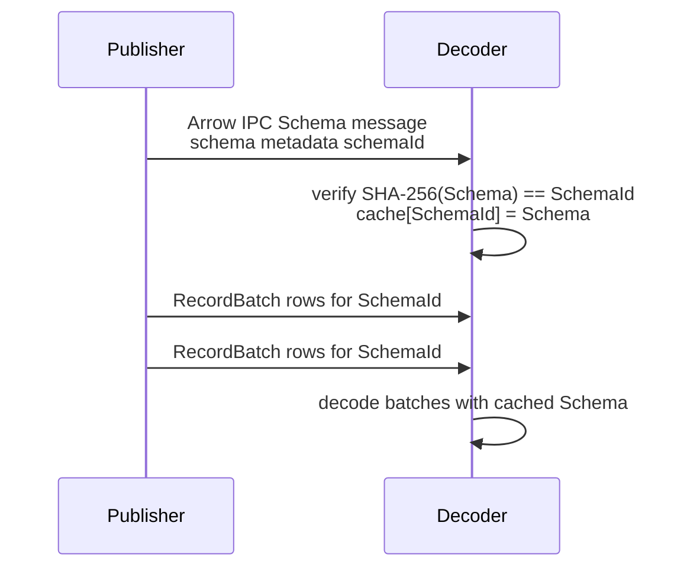
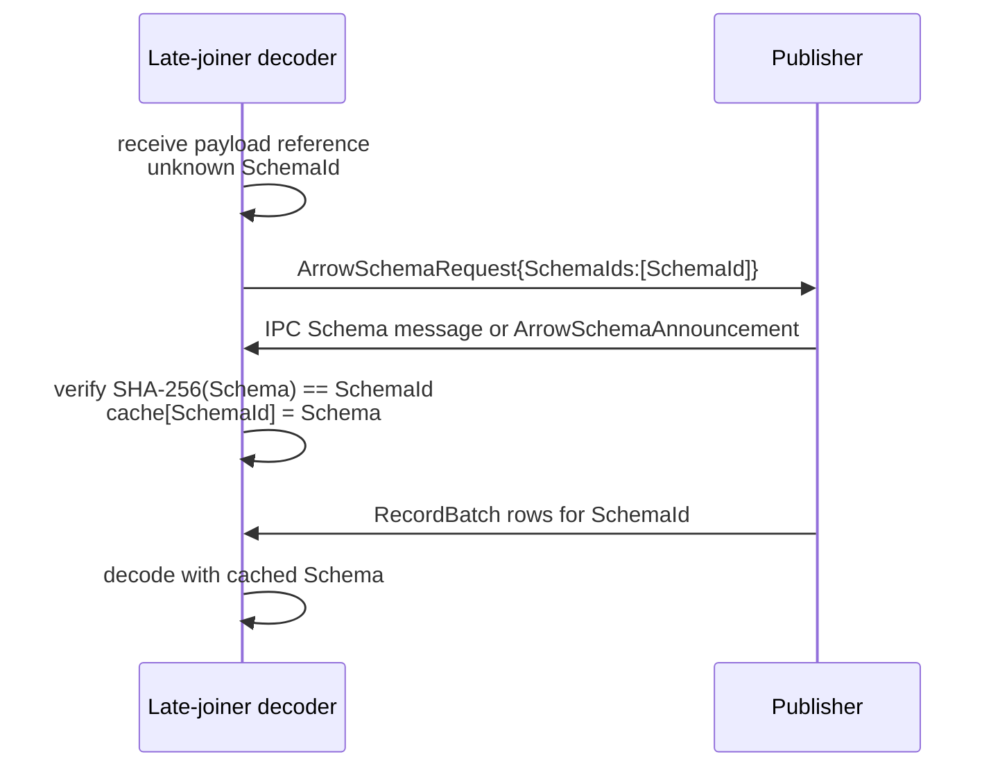
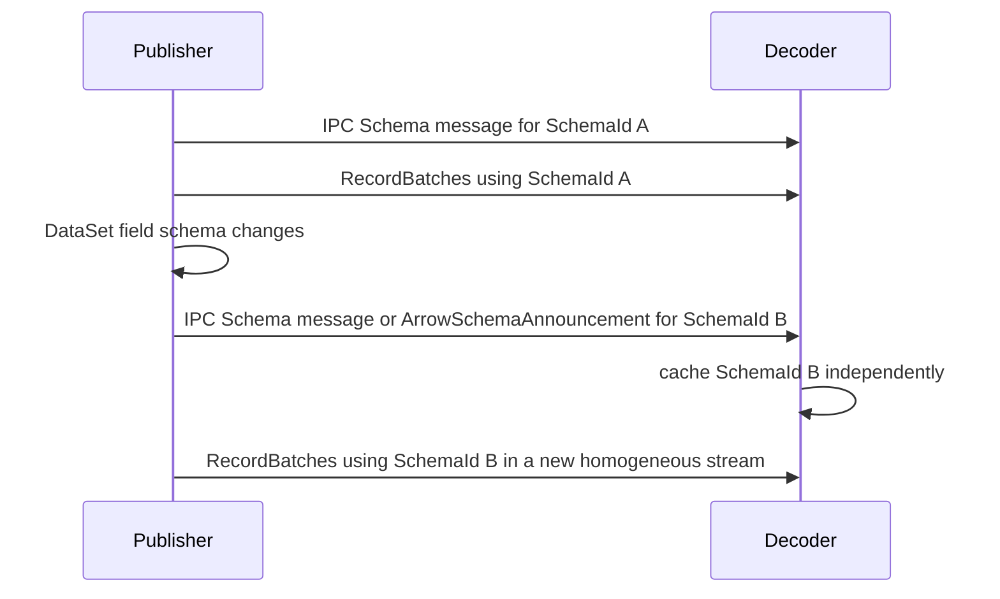

# OPC UA — Apache Arrow Encoding

**Working draft — standalone companion specification**
**Companion to:** OPC 10000-6 (Mappings), OPC 10000-14 (PubSub) and OPC 10000-11 (Historical Access)
**Version:** 0.1.0 · **Date:** 2026-07-22

> **Status — working draft.** This is a **single, self-contained** companion specification for the OPC UA **Default Arrow** (columnar) DataEncoding, its PubSub batch message mapping, and its historian / ADBC access mapping. It combines the three errata-style drafts — `OPC-UA-Part6-Arrow-DataEncoding.md`, `OPC-UA-Part14-Arrow-MessageMapping.md` and `OPC-UA-Part11-Arrow-ADBC-Access.md` — into one document and folds in the base OPC UA context a standalone reader needs. The errata-style drafts remain the authoritative statement of the proposed insertions into OPC 10000-6, OPC 10000-14 and OPC 10000-11; this document is an alternative, combined presentation of the same normative content. Annex A is a snapshot of the generated per-type reference; the authoritative generator is `../extras/arrow-encoding/tools/gen_type_reference.py`, run against the errata Part 6 draft.

---

## 1 Scope

This specification defines how OPC UA values are represented as **Apache Arrow** columnar data — as a stand-alone **DataEncoding** for OPC UA values (a peer of the Binary, XML and JSON DataEncodings of OPC 10000-6), as a **PubSub batch message mapping** (a peer of the JSON message mapping of OPC 10000-14), and as a **historian / ADBC access** result mapping for OPC 10000-11 Historical Access.

The DataEncoding part (§5) maps every OPC UA value to one Apache Arrow `DataType` and serializes it as Arrow IPC; the mapping is reversible: for each OPC UA type descriptor `T` and value `x`, `decode(T, encode(T, x))` reconstructs an OPC UA value canonically equal to `x`. The message-mapping part (§6) defines Arrow IPC / bare-RecordBatch NetworkMessages and DataSetMessages, key and delta frames, sparse-DataSet nullable-column handling, the SchemaId handshake, configuration parameters and content types. The access part (§7) maps `HistoryRead` results to Arrow RecordBatch streams for ADBC-style clients.

Arrow is **columnar**: a single Part 6 scalar value is a length-1 Arrow Array or StructArray, and a PubSub DataSet field or a historian `Value` uses the **same** Arrow `DataType` as its column type — there is one mapping across all three parts.

**Normative exclusion.** OPC UA Arrow does **not** map OPC UA Actions, action invoke requests or action invoke responses; Actions shall use the OPC UA Avro mapping. Arrow is defined for columnar historian access and Part 14 batch publish/subscribe payloads.

## 2 Normative references

- [OPC 10000-3](https://reference.opcfoundation.org/specs/OPC-10000-3/) — Address Space Model, including `DataTypeDefinition`.
- [OPC 10000-5](https://reference.opcfoundation.org/specs/OPC-10000-5/) — Information Model, including built-in DataTypes.
- [OPC 10000-6 v1.05.07](https://reference.opcfoundation.org/specs/OPC-10000-6/) — Mappings.
- [OPC 10000-11](https://reference.opcfoundation.org/specs/OPC-10000-11/) — Historical Access (`HistoryRead`).
- [OPC 10000-14 v1.05.06](https://reference.opcfoundation.org/specs/OPC-10000-14/) — PubSub.
- Apache Arrow Columnar Format and Arrow IPC stream / file format.

## 3 Terms, definitions and abbreviations

| Term | Definition |
|---|---|
| Arrow value array | The length-1 Arrow Array carrying one OPC UA value. |
| DataSet column | An Arrow RecordBatch column whose `DataType` is the Part 6 mapping for the DataSet field DataType. |
| Null slot | An Arrow validity-bitmap null. Null slots are the canonical null mechanism. |
| Matrix | An OPC UA multi-dimensional array represented as dimensions plus row-major values. |
| Default Arrow | The DataTypeEncoding Object for the Arrow encoding of an OPC UA DataType; the analogue of Default Binary, Default XML and Default JSON. |
| SchemaId | The first 8 bytes of the SHA-256 fingerprint of the serialized Arrow `Schema` IPC message bytes; it identifies the exact Arrow schema needed to decode a payload and is independent of PubSub ConfigurationVersion. |
| Bare RecordBatch | The `batch` `ArrowIpcFormat`: a single Arrow RecordBatch message with no preceding IPC Schema message, whose schema is resolved out of band by SchemaId. |
| ADBC | Arrow Database Connectivity — a client API surface (`Connection → Statement → ExecuteQuery → ArrowArrayStream`). |

Key words **shall**, **should**, **may**, **shall not** are to be interpreted as in the ISO/IEC directives.

## 4 Overview

### 4.1 Where Arrow fits

OPC UA separates a value's **DataType** (its structure, from the DataTypeDefinition) from its **DataEncoding** (its serialization). OPC 10000-6 defines the Binary, XML and JSON DataEncodings, each exposed as a **DataTypeEncoding** Object linked from the DataType with `HasEncoding`. This specification adds **Default Arrow** as a further DataTypeEncoding for columnar interchange. There is **one canonical form** per OPC UA DataType (§5): encoders shall not choose alternative Arrow layouts for the same DataType. This draft describes the encoding Object but does not assign NodeIds.

### 4.2 Columnar model, IPC framing and endianness

Arrow is a **columnar** format: values of one type are stored in a typed Array with a **validity bitmap** (nulls), and — for variable-length types — an **offsets** buffer plus a **data** buffer. Multi-byte values in Arrow buffers are **little-endian** per the Arrow columnar format. A batch of samples is an Arrow **RecordBatch** (one column per field); a self-contained **IPC stream** prefixes a **Schema** message before its RecordBatches, an **IPC file** adds a random-access footer, and a **bare RecordBatch** (`batch`) omits the schema and resolves it out of band by **SchemaId** (§6). These are **framing** options over the identical canonical column layout, not encoding variants.

### 4.3 Schema identity and reversibility

Because Arrow data is only interpretable with its schema, this mapping identifies each schema by a **SchemaId** — the first 8 bytes of SHA-256 over the serialized Arrow `Schema` bytes (§5) — so producers and consumers agree on the exact schema without carrying it in every bare-RecordBatch message. The mapping is **reversible**: null-vs-empty distinctions (validity bitmap vs zero-length), unsigned integer bit patterns, signed zero and the exact OPC UA runtime type of a Variant all round-trip. A receiver that must decode a bare RecordBatch before receiving the schema resolves the SchemaId from a cache, an announcement, or a schema registry such as the one in `../schema-registry/OPC-UA-Schema-Registry.md`.

## 5 OPC UA Arrow DataEncoding

### 5.6 OPC UA Arrow

OPC UA Arrow maps each OPC UA DataType to one Apache Arrow `DataType`. A value encoded by this mapping is a length-1 Arrow Array with that `DataType`. When used by OPC UA PubSub, the same `DataType` is used as the column type for the corresponding DataSet field.

#### 5.6.1 General rules

Null OPC UA values shall be encoded as Arrow null slots using the native validity bitmap. Empty strings, empty ByteStrings and empty lists shall be encoded as present non-null slots with zero length content. Optional Structure fields shall use `struct<present:bool, value:T>` so an absent optional field (`present=false`) is distinct from a present field whose value is null (`present=true, value=null`).

Arrow IPC stream content shall use media type `application/vnd.apache.arrow.stream`. Arrow IPC file content shall use media type `application/vnd.apache.arrow.file`.

OPC UA DataTypes that support DataTypeEncoding Objects may describe a `Default Arrow` DataTypeEncoding Node. This draft describes that Node but does not allocate final NodeIds.

#### 5.6.2 Built-in DataTypes

For generated per-type schemas and examples, see [Annex A](#annex-a-generated-per-type-reference).

| OPC UA Built-in DataType | Arrow `DataType` | Canonical notes |
|---|---|---|
| Boolean | `bool` | Valid values `true` and `false`. |
| SByte | `int8` | Exact-width signed integer. |
| Byte | `uint8` | Exact-width unsigned integer. |
| Int16 | `int16` | Exact-width signed integer. |
| UInt16 | `uint16` | Exact-width unsigned integer. |
| Int32 | `int32` | Exact-width signed integer. |
| UInt32 | `uint32` | Exact-width unsigned integer. |
| Int64 | `int64` | Exact-width signed integer. |
| UInt64 | `uint64` | Full unsigned 64-bit range is preserved. |
| Float | `float32` | IEEE-754 single precision; signed zero is significant; NaN payload canonicalization by Arrow implementations is not significant. |
| Double | `float64` | IEEE-754 double precision; signed zero is significant; NaN payload canonicalization by Arrow implementations is not significant. |
| String | `utf8` | Null String is an Arrow null slot; empty String is a present zero-length string. |
| DateTime | `int64` | Raw OPC UA 100 ns ticks since 1601-01-01 UTC. `timestamp(ns)` is informative only and is not canonical due to epoch, precision and range differences. |
| Guid | `fixed_size_binary(16)` | Raw 16 octets. |
| ByteString | `binary` | Null ByteString is an Arrow null slot; empty ByteString is present zero-length binary. |
| XmlElement | `utf8` | XML fragment text; null XML value is an Arrow null slot. |
| NodeId | `utf8` (dictionary-encodable) | The OPC UA textual NodeId form `ns=<index>;<t>=<id>` with `i=`/`s=`/`g=`/`b=` per OPC 10000-6 (the `ns=0;` prefix is omitted). Unlike the structured row encodings, Arrow uses one string column, so a NodeId is a single `utf8` value; encoders should dictionary-encode the column when NodeIds repeat. A null NodeId is an Arrow null slot. |
| ExpandedNodeId | `utf8` (dictionary-encodable) | The OPC UA textual ExpandedNodeId form: an optional `svr=<n>;` prefix when ServerIndex is non-zero, then `nsu=<uri>;` when a NamespaceUri is present or else `ns=<index>;`, then `<t>=<id>`. |
| StatusCode | `uint32` | Full StatusCode bit pattern. |
| QualifiedName | `struct<namespace:uint16, name:utf8>` | `name` is nullable. |
| LocalizedText | `struct<locale:utf8, text:utf8>` | Members are nullable independently. |
| ExtensionObject | `struct<type_id:NodeId, body:dense_union<null, known structs, binary>>` | `type_id` carries the concrete DataType or Encoding NodeId. `body` selects the `null` branch for a null ExtensionObject. Unknown bodies may be carried as binary. |
| DataValue | `struct<value:Variant, status:uint32, source_timestamp:int64, source_picoseconds:uint16, server_timestamp:int64, server_picoseconds:uint16>` | All child fields are nullable; DateTime children use raw ticks. |
| Variant | `dense_union<null, scalar built-ins, list built-ins, matrix, ExtensionObject>` | Carries exact runtime type identity and dimensions. A null Variant is a null slot. |
| DiagnosticInfo | `struct<symbolic_id:int32, namespace_uri:int32, locale:int32, localized_text:int32, additional_info:utf8, inner_status_code:uint32, inner_diagnostic_info:list<DiagnosticInfoFrame>>` | All scalar child fields are nullable. `inner_diagnostic_info` is an ordered list of non-recursive DiagnosticInfo frames, outermost inner first, which preserves the recursive OPC UA chain without embedding JSON or opaque binary. |

NodeId and ExpandedNodeId use the OPC UA textual form in a single `utf8` column rather than the structured multi-field representation used by the Avro row encoding. The textual form is fully reversible: the `s=` string identifier is the last component and runs to the end of the value so it needs no escaping, `g=` uses the canonical 36-character GUID form, `b=` uses base64 for opaque identifiers, and a NamespaceIndex round-trips through `ns=`, a NamespaceUri through `nsu=`, and a non-zero ServerIndex through `svr=`.

#### 5.6.3 Enumerations and OptionSets

Enumerations shall be represented as `int32`; symbolic labels in generated schema metadata are informative and the integer value is normative for decoding. OptionSets shall be represented by the exact-width unsigned integer required by the OptionSet bit size (`uint32` for 32-bit OptionSets unless the DataTypeDefinition states otherwise).

#### 5.6.4 Structures, optional fields and Unions

An OPC UA Structure shall be represented as an Arrow `struct` with one child field per DataTypeDefinition field in definition order. A StructureWithOptionalFields uses the `struct<present:bool, value:T>` optional wrapper for optional members; mandatory fields are nullable only when the field DataType itself is nullable.

An OPC UA Union shall be represented as an Arrow dense `union` with a `null` branch followed by one branch per OPC UA union field. Each non-null branch is `struct<value:T>` so selecting a nullable branch with `value=null` is distinct from selecting the union `null` branch. Type codes shall be stable for the DataTypeDefinition field order.

#### 5.6.5 Arrays and Matrices

A one-dimensional OPC UA array shall be represented as `list<Elem>`, where `Elem` is the Arrow mapping of the element DataType. A null array is a null list slot. An empty array is a present list slot with length zero. Null elements are represented by the element validity bitmap when the element type permits nulls.

A multi-dimensional OPC UA Matrix shall be represented as `struct<dimensions:list<int32>, values:list<Elem>>`. `dimensions` contains the OPC UA dimension lengths. `values` contains the elements in row-major order. The product of `dimensions` shall equal the length of `values`. Arrow `fixed_shape_tensor` and `variable_shape_tensor` extension types may be referenced informatively, but this struct is the only canonical Matrix carrier.

#### 5.6.6 Variant

Variant shall be represented as a recursive dense union whose child arrays cover the Variant body forms the field may carry: scalar built-ins except Variant, DataValue and DiagnosticInfo; one-dimensional list forms of those built-ins; the canonical Matrix struct; and ExtensionObject. A self-describing encoding may include all body forms, whereas a schema-governed encoding may narrow the union to the aggregated set for the field and grow it across MinorVersions under the append-only rule of the Schema Registry (see *OPC UA — Schema Registry* §5.6), so an existing branch keeps its dense-union type code in every later minor of the same major. The union type code, list-vs-scalar form and Matrix dimensions are sufficient to reconstruct the exact OPC UA Variant type and dimensionality.

#### 5.6.7 ExtensionObject and abstract/subtyped fields

ExtensionObject and fields declared with abstract or subtyped values shall carry concrete type identity inline. The canonical carrier is `struct<type_id:NodeId, body:dense_union<null, known structs, binary>>`. The `type_id` is the DataType NodeId or DataTypeEncoding NodeId needed to resolve the body schema. The known-struct union branches are the aggregated concrete-type set for the field per the Schema Registry (see *OPC UA — Schema Registry* §5.6): generated from the subtype hierarchy where bounded, or grown append-only across MinorVersions as new concrete types are encoded, with an existing branch keeping its dense-union type code, and the opaque fallback children — `binary` for a Binary body and `utf8` for an XML or textual body — appended append-only when a value first requires them so they may occupy any type code. If the receiver does not know the body type, or the type is not yet aggregated, the body may be retained as opaque binary without claiming decoded structured content. Because a bare RecordBatch carries no schema and its node/buffer layout matches its writer-minor schema, a decoder that did not receive the writer schema in an IPC `stream` shall resolve the exact writer-minor schema by SchemaId (§5.6).

#### 5.6.8 Default Arrow DataTypeEncoding Node

For every structured DataType with a Default Binary, Default XML or Default JSON DataTypeEncoding, a companion `Default Arrow` DataTypeEncoding Object may be described. Its browse name is `Default Arrow`, its encoding format is Arrow IPC using this clause, and its schema is the canonical Arrow `DataType` generated from the DataTypeDefinition.

#### 5.6.9 Schema-generation algorithm

Given an OPC UA DataType, an encoder or decoder shall derive the canonical Arrow `DataType` by applying the mapping in this clause recursively to the DataTypeDefinition. Built-in DataTypes map as specified in 5.6.2. Enumerations map to `int32`; OptionSets map to the unsigned integer width required by their DataTypeDefinition. A one-dimensional array maps to `list<Elem>`. A Matrix maps to `struct<dimensions:list<int32>, values:list<Elem>>`. A Structure maps to an Arrow `struct` whose child fields appear in DataTypeDefinition order. A StructureWithOptionalFields shall wrap each optional field as `struct<present:bool not null, value:T>` and shall not use a null child slot to mean absent. A Union shall map to a dense union with a `null` branch followed by one branch per union field in definition order; each non-null branch is `struct<value:T>`. Fields declared abstract or allowing subtyped values, and `ExtensionObject`, shall carry the concrete runtime type identity with the value using the canonical `type_id` plus dense-union body carrier. `Variant` and abstract values use the runtime type to select the scalar, array, matrix or ExtensionObject branch. Numeric NodeIds shall use a `uint32` numeric identifier field.

The canonical Arrow `Schema` for a standalone Part 6 value is a single field named `value` with metadata `opcua-arrow=1`. For PubSub, the same generation function is applied to each DataSet field to form the RecordBatch schema. The canonical form of a schema is the serialized Arrow Schema IPC message bytes, for example `schema.serialize().to_pybytes()`. The `SchemaId` is the lowercase hexadecimal SHA-256 fingerprint truncated to the first 8 bytes (16 hex chars) of the canonical schema bytes, unless a profile specifies a longer length.

Arrow types are **structural**: the mapping inlines a fresh dense union at each Variant and ExtensionObject occurrence, so every field carries its **own** union and the fields evolve independently — appending a body form or concrete struct type to one field's union never changes another field's type. This is the per-field model; unlike the nominal Avro mapping (Avro Part 6 §6.6), Arrow has no shared named `Variant`/`ExtensionObject` type and therefore no shared-record option. Two structurally identical fields still produce identical inline types, so a schema-driven bound remains deterministic across publishers.

#### 5.6.10 Decoder algorithm

A schema-driven decoder shall treat an Arrow IPC stream as self-contained because the stream embeds its Schema message before any RecordBatch. The decoder reads that Schema message, validates that each field uses the canonical mapping, then decodes each Arrow Array using this Part 6 mapping. If a decoder must validate a message before receiving the stream, or must enforce a governed schema, it shall look up the `SchemaId` in a local cache or registry and compare the received serialized Arrow Schema with the cached canonical form.

When the payload is a **bare RecordBatch** — the Part 14 `batch` `ArrowIpcFormat`, a single Arrow RecordBatch message with no preceding Schema message — the decoder cannot read the schema from the payload. Because a RecordBatch carries no schema and its node and buffer layout is shaped by its writer-minor schema (§5.6.7, §5.6.12), the decoder shall obtain the exact writer-minor schema out of band: it reads the `SchemaId` that accompanies the message — in transport metadata (`opcua-arrow-schema-id`) or the DataSetMessage/NetworkMessage envelope — and resolves the serialized Arrow Schema for that SchemaId from its schema cache, a schema registry or a prior announcement, following the Part 14 cache-miss resolution order. It then validates that each field uses the canonical mapping and decodes each Arrow Array against that schema using this Part 6 mapping. A bare RecordBatch whose SchemaId is unknown and cannot be resolved is a schema error and shall not be decoded.

An AddressSpace-driven decoder may instead read the DataTypeDefinition for the expected DataType from the AddressSpace and re-run the schema-generation algorithm in 5.6.9. Encoders and decoders shall use the same generation function, so the AddressSpace-derived Arrow Schema serializes to the same canonical form and therefore the same `SchemaId`. A mismatch between the received SchemaId and the re-derived SchemaId is a schema error.

#### 5.6.11 Conformance

An implementation conforms to OPC UA Arrow when it implements the single mapping in this clause for all 25 built-in DataTypes, Structures, Unions, Enumerations, OptionSets, Arrays, Matrices, Variant, ExtensionObject, DataValue and DiagnosticInfo, and demonstrates `decode(encode(x)) == x` for conforming OPC UA values.

#### 5.6.12 Implementing schema evolution (growing unions)

The Variant dense union (§5.6.6) and the ExtensionObject known-struct dense union (§5.6.7) are the two Arrow unions that may grow after a schema is first announced; every other union and struct is closed. An implementer that governs an evolving schema shall grow these unions **append-only**, as defined by *OPC UA — Schema Registry* §5.6. Because Arrow types are structural, each field's union is its own inline dense union (§5.6.9), so growth is per-field: appending to one field's union does not change another field's type.

1. **Narrow the initial union.** Prefer to build the initial (`MAJOR.0`) dense union **data-driven**, from the concrete type of the first value the field actually encodes — one child for that concrete Variant body form, or the concrete struct child for the first ExtensionObject/abstract body (or the `binary` child for an opaque first body) — with the concrete type standing in place of the abstract Variant/ExtensionObject and the union grown at that position (steps 2–3) as later values carry types not yet present. The encoder MAY instead seed the union **schema-driven** from the declared bound — one child per allowed Variant body form (a distinct child for each `(BuiltInType, scalar|array|matrix)` combination the field may carry), or one child per concrete struct type known for an ExtensionObject/abstract-subtyped field, in canonical order — where a schema is needed before the first message or where cross-publisher determinism is required (see *OPC UA — Schema Registry* §5.6).

2. **Grow append-only.** When a value selects a body form or concrete struct type not yet present, **append** a new child array and assign it a dense-union **type code** never used in this lineage; leave every existing child and its type code unchanged. The type code travels in the union's 8-bit type-ids buffer, so a stable type code means an older RecordBatch resolves the same child under the grown schema. Type codes are `int8` (0–127); assign them in a documented, monotonic order. Do not remove, reorder or retype an existing child; any such change is a MajorVersion reset.

3. **Append the opaque fallback like any other child.** An ExtensionObject body that cannot be represented as a known-struct child is carried in an opaque fallback child — `binary` for a Binary body, or `utf8` for an XML or textual body. A fallback child is appended when a value first requires it (step 2), so it may take any dense-union type code and is not reserved at a fixed low code. Because every child is append-only, a fallback's type code is fixed once assigned, so an opaque body written under an earlier minor still resolves to it under a grown schema.

4. **Recompute the SchemaId and announce.** Each grown union yields a new serialized Arrow `Schema`; recompute the SHA-256[:8] SchemaId per §5.6.9, advance the DataSet `ConfigurationVersion` MinorVersion, and re-announce the schema and SchemaId per the Part 14 Arrow handshake before sending a batch that uses the appended child.

5. **Decode with the writer-minor schema.** Unlike the row encodings, an Arrow RecordBatch's node and buffer layout is shaped by its writer schema: a self-describing IPC `stream` embeds that schema, but a bare RecordBatch does not. A decoder shall therefore resolve the exact writer-minor schema by SchemaId to decode a bare RecordBatch, or apply a defined upgrade that treats union children absent from the older RecordBatch as empty. A consumer that reads only IPC `stream`s decodes each stream from its embedded schema; a consumer that reads bare RecordBatches shall cache each minor's schema by SchemaId (Schema Registry §7, §8).

See *OPC UA — Schema Registry* §5.6 for the full model, including the data-driven-first (or schema-driven) initial basis and the lineage/SchemaId relationship.

## 6 PubSub message mapping

This clause maps the OPC UA PubSub NetworkMessage / DataSetMessage model (OPC 10000-14) to Apache Arrow, reusing the §5 column mapping for every DataSet field.

### 6.1 Arrow mapping parameters

The WriterGroup MessageSettings for the Arrow mapping shall include: `ArrowIpcFormat` (`batch`, `stream` or `file`, default `batch`; see Table 6.2-1), `MaxRowsPerRecordBatch`, `IncludeSchemaMetadata`, `DeltaFrameMode` (`nullable-columns` or `selected-columns`), and `Compression` (`none` or an Arrow IPC-supported codec). `DeltaFrameMode = nullable-columns` (the default) keeps the full column set and marks absent keys as null cells, so sparse and full frames share one schema and SchemaId (§6.2); `selected-columns` drops columns and changes the SchemaId and is used only when an explicit reduced-column batch is intended. The DataSetWriter MessageSettings shall identify the DataSet schema version and whether DataSet fields are represented as RawData, Variant or DataValue according to `DataSetFieldContentMask`.

### 6.2 Arrow message mapping

The payload of an Arrow NetworkMessage shall be a bare Arrow RecordBatch (`batch`), an Arrow IPC stream (`application/vnd.apache.arrow.stream`) or an Arrow IPC file (`application/vnd.apache.arrow.file`) as selected by `ArrowIpcFormat`. All three formats carry the identical canonical Part 6 Arrow column layout — one column per DataSet field using the Part 6 Arrow mapping for that field DataType — and differ only in how the schema is conveyed, so they are framing options and not encoding variants. Schema metadata carries NetworkMessage header fields such as PublisherId, WriterGroupId, DataSetWriterId, NetworkMessageNumber, SequenceNumber, ConfigurationVersion, MessageType, Timestamp, PicoSeconds, PromotedFields and security-related flags when present.

**Table 6.2-1 — `ArrowIpcFormat` framing options**

| `ArrowIpcFormat` | NetworkMessage payload | Schema on the wire | Self-contained | Use when |
|---|---|---|---|---|
| `batch` (default) | A single bare Arrow RecordBatch message | No — announced once and referenced by SchemaId | No — needs a prior schema announcement | Default. Schema-governed channels, aligning with the Avro mapping which also exchanges the schema out of band; lowest per-message overhead. |
| `stream` | An Arrow IPC stream: one Schema message followed by one or more RecordBatch messages | Yes — the Schema message precedes the RecordBatches | Yes | Channels without a schema-announcement mechanism, or when each message must be independently decodable. |
| `file` | An Arrow IPC file: the stream contents plus a footer with a random-access block index | Yes — embedded, plus the footer index | Yes | Bounded, seekable payloads for storage or random-access retrieval. |

Each RecordBatch row is one DataSetMessage sample for the DataSet. Columns are DataSet fields. If `DataSetFieldContentMask` selects RawData, the column type is the field DataType mapping. If it selects Variant, the column type is the Part 6 Variant mapping. If it selects DataValue, the column type is the Part 6 DataValue mapping. The selected representation shall be the same for every row in the batch. **Every DataSet field column shall be nullable** (Arrow validity bitmap; for a Variant or ExtensionObject column the dense-union `null` child, `null=0`).

Key frames shall contain all fields in DataSetMetaData field order. A DataSet may be **sparse** — a row need not carry a value for every key. A sparse DataSet shall be represented with **nullable columns**: the RecordBatch keeps the identical full column set — and therefore the same schema and SchemaId — and a key with no value in a given row is written as a **null cell** (`null:null`: a cleared validity bit, or the dense-union `null` child). A subscriber shall treat a null cell as **missing** — no value for that key in that row. This is the `nullable-columns` mode (§6.1) and shall be used whenever a stable schema across sparse subsets is required.

Delta frames shall identify changed fields using a `field_index:list<uint16>` selection column, a schema-level changed-field list, or a `selected-columns` RecordBatch whose metadata lists the original field indexes. A `selected-columns` batch omits unchanged columns and therefore changes the column set and the SchemaId, so it is the explicit schema-changing option, distinct from the stable-schema `nullable-columns` sparse representation above. In a `selected-columns` batch, omitted unchanged fields shall not be decoded as null values; they are absent by delta-frame selection.

### 6.3 Bare RecordBatch framing (`batch`)

When `ArrowIpcFormat` is `batch`, a data NetworkMessage payload is a single bare Arrow RecordBatch message with no embedded Schema message. This removes the per-message Arrow Schema message — a fixed cost that is independent of row count, for example approximately 1.2 kB for a ten-field DataSet — from every data message. The schema is conveyed once out of band and resolved by SchemaId, exactly as the Arrow IPC stream format sends its Schema message once before any RecordBatch and as Arrow Flight carries the schema in the flight descriptor rather than in each `FlightData` batch. `batch` is a framing choice, not an encoding variant: the column and value layout is the identical canonical Part 6 Arrow mapping used by `stream` and `file`, so the requirement that encoders not introduce alternate Arrow layouts or encoding variants for the same DataType is preserved.

A publisher using `batch` framing shall announce the schema for a SchemaId before, or together with, the first bare RecordBatch that references it, using either a one-time Arrow IPC stream whose Schema message carries that SchemaId or an `ArrowSchemaAnnouncement` (§6.9.2.3). Because a bare RecordBatch carries no schema, and therefore no in-payload SchemaId, the SchemaId shall accompany each bare RecordBatch out of band — in transport metadata (`opcua-arrow-schema-id`, §6.9.2.2) or in the DataSetMessage/NetworkMessage envelope. A subscriber shall resolve the schema for the referenced SchemaId from its cache — populated by a prior Schema message or announcement — following the §6.9.2.6 cache-miss resolution order, then decode the RecordBatch against that schema. A bare RecordBatch that references an unknown SchemaId is a schema error and shall not be decoded.

The relative benefit of `batch` framing is largest for small or single-sample messages and diminishes as rows per RecordBatch increase, because the fixed schema cost is amortised across the batch. Even without the schema, a bare RecordBatch retains the Arrow RecordBatch message header — per-column length, null-count and buffer descriptors — so `batch` framing reduces, but does not remove, Arrow's per-message overhead and does not make Arrow competitive with a compact row encoding for single samples. `batch` is the default framing because it aligns with the schema-exchange model the Avro mapping already requires; `stream` is used for channels without a schema-announcement mechanism or when each message must be independently decodable.

### 6.4 Content types

The Arrow IPC stream content type shall be `application/vnd.apache.arrow.stream`. The Arrow IPC file content type shall be `application/vnd.apache.arrow.file`. Transports that expose MIME content types shall use these values for Arrow PubSub messages.

### 6.5 Configuration model

The PubSub configuration model shall describe an Arrow message mapping option for WriterGroup and DataSetWriter MessageSettings. The described-only configuration nodes reference the `Default Arrow` DataTypeEncoding from Part 6 and the schema generated from DataSetMetaData. Final BrowseNames and NodeIds are assigned by the OPC Foundation.

### 6.6 Header layouts

Arrow NetworkMessage header fields shall be represented as schema metadata key-value pairs when they apply to the whole stream or batch, and as columns when they vary per row. DataSetMessage header fields that vary per sample, such as status, timestamp, picoSeconds or sequence number, shall be represented as leading metadata columns before DataSet field columns.

### 6.7 Content-type registry entries

This mapping lists `application/vnd.apache.arrow.stream` for Arrow IPC streaming PubSub payloads and `application/vnd.apache.arrow.file` for bounded Arrow IPC file payloads.

### 6.8 DataSet schema mapping

A PublishedDataSet maps to one Arrow schema. For each `FieldMetaData` entry, the field name becomes the Arrow column name and the field DataType becomes the Arrow column `DataType` using OPC UA Part 6 Arrow. Every DataSet field column is **nullable**, so a **sparse** DataSet — a row that does not carry a value for every key — uses the same schema: the absent key is a null cell interpreted as missing (§6.2), and the SchemaId does not change with the subset of keys carried. Field properties from DataSetMetaData are copied into Arrow field metadata so a disconnected subscriber can retain engineering units, semantic references, model namespace, SourceBrowseName and SourceTypeDefinition.

### 6.9 NetworkMessage and DataSetMessage envelopes

The canonical envelope is an IPC stream with schema metadata for NetworkMessage-level values and RecordBatch rows for DataSetMessages. A bridge may wrap multiple DataSet schemas in a transport-level envelope, but each Arrow IPC stream schema shall describe exactly one DataSet schema to preserve column homogeneity.

#### 6.9.1 Schema resolution

Arrow is schema-based: the Arrow schema of the IPC stream is required to decode the batch. The reference schema is published to, and resolved from, a central catalog as defined by *OPC UA — Schema Registry* (`../schema-registry/OPC-UA-Schema-Registry.md`). While an Arrow IPC stream embeds its own schema in the stream header (so a message is self-contained once received), a subscriber that must decode before receiving the stream — or that validates against a governed schema — resolves it from the DataSet namespace, `<DataSetName>:arrow`, and the `ConfigurationVersion`, per §8 of that specification. The transport `content-type` (`application/vnd.apache.arrow.stream` or `application/vnd.apache.arrow.file`) selects the format.

#### 6.9.2 SchemaId handshake

##### 6.9.2.1 SchemaId and canonical schema bytes

The Arrow mapping defines a lightweight SchemaId handshake that is independent of PubSub `ConfigurationVersion`. A SchemaId is derived only from the serialized Arrow Schema canonical form defined by Part 6. The SchemaId shall be the first 8 bytes of the SHA-256 fingerprint of the serialized Arrow `Schema` IPC message bytes, for example `SHA-256(schema.serialize().to_pybytes())[:8]`. The lowercase hexadecimal form used in descriptors and diagnostics is 16 characters; the on-wire field is the raw 8-byte value unless a profile specifies a longer length. Any carried `schemaId` metadata is a reference to the canonical schema and shall not be inserted into the canonical schema bytes before calculating the SchemaId.

A NetworkMessage, DataSetMessage or transport envelope shall reference the schema by SchemaId, carried either in Arrow IPC custom metadata or in the DataSetMessage/transport header. The SchemaId may coexist with `ConfigurationVersion`, but it does not depend on it; a ConfigurationVersion change that does not change the Arrow Schema keeps the same SchemaId, and an Arrow Schema change produces a new SchemaId even if a publisher's configuration versioning policy is separate.

##### 6.9.2.2 Carrier placement

The SchemaId shall be placed as follows.

| Scope | Carrier | When used |
|---|---|---|
| Arrow IPC stream | The embedded IPC Schema message is the self-contained announcement. The same 8-byte SchemaId shall also be present in Arrow IPC custom metadata key `schemaId` and in stream schema metadata when `IncludeSchemaMetadata` is enabled. | Used for normal Arrow PubSub streams and files where the IPC payload embeds its schema before any RecordBatch. |
| Transport metadata | The transport content type shall be `application/vnd.apache.arrow.stream` or `application/vnd.apache.arrow.file`. Kafka and AMQP deployments that carry schema identifiers outside the IPC payload shall use header `opcua-arrow-schema-id` containing the raw 8-byte SchemaId or its lowercase hexadecimal representation when the transport header model is text-only. | Used by transports, schema registries or routers that need to route, pre-validate or select a schema before opening the IPC payload, especially when the payload is a bare RecordBatch or a registry publication. |
| DataSetMessage/NetworkMessage envelope | A `SchemaId` reference in the envelope that wraps the IPC payload. | Used when an OPC UA PubSub envelope or bridge wraps an Arrow IPC stream, file or RecordBatch and needs to identify the schema without relying on transport headers. |

##### 6.9.2.3 Schema announcements

Within an Arrow IPC stream, the IPC Schema message is the schema announcement. It shall be sent once at the start of each IPC stream before any RecordBatch. A receiver that obtains the IPC Schema message has the serialized Arrow Schema bytes needed to verify the SchemaId and decode subsequent RecordBatches in that stream.

For non-IPC transports that publish a bare RecordBatch, for registry publication flows, or for out-of-band repair, the announcement shall use the descriptor `ArrowSchemaAnnouncement`:

```text
ArrowSchemaAnnouncement {
  SchemaId: bytes(8),
  Schema: serialized Arrow Schema IPC message bytes or an equivalent schema-JSON descriptor,
  SchemaEpoch: optional int64
}
```

`SchemaId` is the raw 8-byte value containing the first 8 bytes of SHA-256 over `Schema` when `Schema` is the serialized Arrow Schema IPC message bytes. If a schema-JSON descriptor is used as a human-readable registry artifact, the announcement shall also identify the serialized Arrow Schema bytes or a deterministic conversion that recomputes the same SchemaId. `SchemaEpoch` may be monotonically increased for operator correlation, but receivers shall not use it as the decoding key and it is not part of SchemaId calculation.

Reception of an IPC Schema message or an `ArrowSchemaAnnouncement` shall insert `{SchemaId, Arrow Schema}` into `cache: SchemaId -> schema` after verifying that the recomputed SchemaId equals the announced SchemaId. A publisher may also publish the same pair to xRegistry with label `opcua.schemaid`.

The reference descriptor is published as `core-specs\extras\arrow-encoding\schemas\struct-ArrowSchemaAnnouncement.json`. The reference example stream is `core-specs\extras\arrow-encoding\examples\arrow_schema_announcement.arrow`, with readable metadata in `core-specs\extras\arrow-encoding\examples\schema_exchange_index.json`.

##### 6.9.2.4 SchemaRequest

A late-joining decoder or a decoder that detects a cache miss may send an `ArrowSchemaRequest` when the transport supports request/response or side-channel control messages:

```text
ArrowSchemaRequest {
  RequesterId: optional string,
  SchemaIds: array<bytes(8)>
}
```

`RequesterId` is diagnostic and may identify a receiver, session or bridge. `SchemaIds` shall contain one or more raw 8-byte SchemaIds requested by the decoder. A publisher that receives a request for an active SchemaId shall answer by opening or replaying an IPC stream whose Schema message announces the schema, or by sending an `ArrowSchemaAnnouncement` carrying the same `{SchemaId, Arrow Schema}` pair. If policy permits, publishers should periodically re-announce active schemas on lossy transports or when late joiners are expected.

The reference descriptor is published as `core-specs\extras\arrow-encoding\schemas\struct-ArrowSchemaRequest.json`. The reference example stream is `core-specs\extras\arrow-encoding\examples\arrow_schema_request.arrow`.

##### 6.9.2.5 Encoder change tracking

An encoder shall maintain `announced: set[SchemaId]` per destination. Before sending a batch, it recomputes the Arrow Schema from the DataSet fields using the Part 6 algorithm and computes the 8-byte SchemaId. If the SchemaId has not been announced to that destination, the encoder announces it first by opening a new IPC stream or otherwise sending the IPC Schema message or `ArrowSchemaAnnouncement`, then adds it to `announced`.

A changed DataSet schema yields a new SchemaId and therefore requires a new announcement and a new homogeneous IPC stream. One Arrow IPC stream shall not mix RecordBatches that require different Arrow Schemas. Encoders shall not introduce alternate Arrow layouts or encoding variants for the same OPC UA DataType; the canonical Part 6 mapping, including the dense-union Variant form, is the only interchange form.

##### 6.9.2.6 Decoder cache-miss resolution

A decoder shall maintain `cache: SchemaId -> schema`. Once cached, each received stream's Schema message or governed schema shall match the cached SchemaId before RecordBatches are decoded. If a message references an unknown SchemaId, the decoder shall resolve it in the following order until one step succeeds:

1. Await the Arrow IPC Schema message in the current stream or an `ArrowSchemaAnnouncement` on the configured announcement channel, then verify the recomputed 8-byte SchemaId and insert the schema into the cache.
2. Send `ArrowSchemaRequest` listing the unknown SchemaId when the transport supports request/response or a control side channel, then process the returned IPC Schema message or `ArrowSchemaAnnouncement`.
3. Resolve the schema from an external (federated) xRegistry that the local registry references, as defined by *OPC UA — Schema Registry* (`../schema-registry/OPC-UA-Schema-Registry.md`) §8.
4. Read the in-server AddressSpace Schema Registry by a SchemaId-NodeId. The companion NodeSet authored in `core-specs\schema-registry\` uses namespace `http://opcfoundation.org/UA/SchemaRegistry/` and exposes each schema at an Opaque NodeId whose Identifier is the raw 8-byte SchemaId. A decoder may perform a single `Read` on that NodeId without browsing or recomputing candidate NodeIds. Servers may additionally expose `GetSchema(SchemaId)` for clients that prefer a Method call over direct NodeId construction.
5. Re-derive the Arrow Schema from the AddressSpace DataTypeDefinition using the Part 6 Arrow schema-generation algorithm, compute the 8-byte SchemaId over the serialized Arrow Schema, and verify that it equals the referenced SchemaId.

If all configured resolution paths fail, the decoder shall treat the payload as undecodable rather than guessing a schema. The cache key is SchemaId only and is independent of `ConfigurationVersion`, PublisherId, WriterGroupId and DataSetWriterId.

##### 6.9.2.7 Relationship to ConfigurationVersion

SchemaId derives only from the Arrow Schema. It does not depend on PubSub `ConfigurationVersion`, writer group version numbers, sequence numbers, transport session state or `SchemaEpoch`. A ConfigurationVersion change that does not alter the Arrow Schema keeps the same SchemaId. A schema change produces a new SchemaId even if a deployment accidentally fails to advance ConfigurationVersion; decoders shall use SchemaId to select the Arrow schema and may use ConfigurationVersion for existing PubSub metadata checks.

Although SchemaId is not computed from ConfigurationVersion, the `{MajorVersion, MinorVersion}` lineage carries a compatibility relationship between successive schemas per *OPC UA — Schema Registry* §5.6. A MinorVersion increment is an append-only-compatible superset of the same major. An Arrow IPC `stream` embeds its writer schema and remains self-describing; a bare RecordBatch carries no schema and its node/buffer layout matches its writer-minor schema, so a subscriber shall resolve the exact writer-minor schema by SchemaId to decode a bare RecordBatch, or apply a defined upgrade that treats union children absent from the older RecordBatch as empty. A MajorVersion increment is a reset with no such guarantee. A publisher shall advance MinorVersion when it aggregates a new Variant body form or ExtensionObject concrete type into the schema, and re-announce the resulting SchemaId per §6.9.2.3–6.9.2.6. The per-encoding procedure for narrowing and append-only growing these unions is in the Arrow Part 6 DataEncoding §5.6.12.

##### 6.9.2.8 Schema-exchange sequences

Normal stream startup announces the schema with the IPC Schema message before any RecordBatch:



A late joiner or cache-miss receiver requests the missing schema and decodes only after the announcement is verified:



A schema change creates a new SchemaId and a new homogeneous IPC stream or announcement:



### 6.10 Conformance

An Arrow PubSub publisher conforms when it emits RecordBatches whose columns use the Part 6 Arrow mapping, whose rows reconstruct the intended DataSetMessages, and whose key-frame and delta-frame rules preserve null-vs-absent semantics. A subscriber conforms when it reconstructs DataSet field values with the same Part 6 reversibility guarantees and uses DataSetMetaData plus Arrow schema metadata to interpret the batch.

## 7 Historian and ADBC access

This clause maps OPC UA Historical Access (OPC 10000-11) results to Arrow RecordBatch streams for ADBC-style clients, reusing the §5 column mapping for the result Value column.

### 7.1 Scope

This mapping exposes OPC UA Historical Access results as Arrow IPC streams for clients that use an ADBC-like access pattern:

```text
Connection -> Statement -> ExecuteQuery -> ArrowArrayStream
```

ADBC (Arrow Database Connectivity) is a client API surface. Arrow Flight SQL is the natural Arrow wire transport for remote ADBC clients. This specification defines the OPC-UA-to-Arrow result mapping returned by such a surface; it is not a new database wire protocol and does not replace OPC UA services.

### 7.2 Access basis

The normative access basis is OPC 10000-11 Historical Access, especially `HistoryRead`.

The following HistoryRead details map to Arrow result sets:

- `ReadRawModifiedDetails` produces one row per raw or modified historical sample.
- `ReadProcessedDetails` produces one row per aggregate interval result.
- `ReadAtTimeDetails` produces one row per requested timestamp result.

The same Part 6 Arrow DataType mapping used for PubSub DataSet fields is used for the result `Value` column.

### 7.3 ADBC-style statement model

An implementation exposing this mapping shall provide an ADBC-style logical surface:

1. A `Connection` represents the OPC UA session, historian endpoint, or gateway context.
2. A `Statement` is parameterized with HistoryRead inputs.
3. `ExecuteQuery` returns an `ArrowArrayStream`, i.e. a stream of Arrow RecordBatches with one stable schema.

Statement parameters include:

- `nodeIds`: one or more Variables to read.
- `startTime`, `endTime`: OPC UA DateTime values, represented as signed 64-bit 100 ns ticks since 1601-01-01 UTC.
- `historyReadDetails`: raw/modified, processed, or at-time mode.
- `maxValuesPerNode` or service-level maximum values.
- For processed reads: `aggregateType`, `processingInterval`, and optional aggregate configuration.
- For at-time reads: the requested timestamps and interpolation policy.
- `maxRowsPerRecordBatch`: the client or service batching target.

Continuation points returned by `HistoryRead` map to Arrow stream batching. Each service page or continuation page shall be emitted as one or more RecordBatches; the Arrow stream order is the HistoryRead result order. A continuation point is not encoded as a data row. If a transport needs explicit continuation metadata, it shall carry it outside the rows as stream, batch, or transport metadata.

### 7.4 Canonical result shape

The canonical result shape is **long form**. Every row identifies the source node and one historical sample:

| Column | Arrow type | Requirement |
|---|---|---|
| `NodeId` | Part 6 Arrow mapping for `NodeId` | Non-null source Variable NodeId. |
| `SourceTimestamp` | `int64` | OPC UA DateTime ticks for the sample source timestamp. |
| `ServerTimestamp` | `int64` | Nullable OPC UA DateTime ticks for the server timestamp. |
| `Value` | Part 6 Arrow mapping for the node DataType | Nullable according to the value DataType and sample. |
| `StatusCode` | `uint32` | Non-null OPC UA StatusCode. If absent in a DataValue, encode `Good` (`0`). |

Long form is canonical because it is stable for ADBC consumers, composes naturally with SQL predicates, and avoids schema changes when the node set changes. A column-per-node shape is useful for specialized time-series pivots, but it changes the schema with every node selection and is not canonical.

The canonical long-form stream has one `Value` Arrow DataType. Therefore, a multi-node statement shall include nodes with the same OPC UA DataType. If a client requests mixed DataTypes, the access layer shall split the request into one ArrowArrayStream per Value DataType, or explicitly request a non-canonical Variant-valued result where `Value` uses the Part 6 `Variant` mapping.

### 7.5 Raw, modified, and at-time reads

For `ReadRawModifiedDetails` and `ReadAtTimeDetails`, each returned DataValue becomes one row in the canonical result shape. `SourceTimestamp`, `ServerTimestamp`, `Value`, and `StatusCode` are copied from the DataValue using the Part 6 Arrow mapping for the node DataType.

For modified reads, implementations may add metadata columns such as modification time, update type, or user name when requested by the statement. Such columns are extensions and shall not alter the canonical meaning of the five base columns.

### 7.6 Processed aggregate reads

For `ReadProcessedDetails`, the base columns are followed by aggregate interval columns:

| Column | Arrow type | Requirement |
|---|---|---|
| `AggregateId` | Part 6 Arrow mapping for `NodeId` | Non-null AggregateFunction NodeId. |
| `ProcessingInterval` | `int64` | Interval duration in 100 ns ticks. |
| `IntervalStart` | `int64` | Inclusive interval start in OPC UA DateTime ticks. |
| `IntervalEnd` | `int64` | Exclusive interval end in OPC UA DateTime ticks. |

The aggregate result value is encoded in `Value` using the aggregate result DataType. Aggregate status and quality are encoded in `StatusCode`; additional aggregate diagnostics such as percent good or percent bad may be added as extension columns.

### 7.7 Content types and transport

The Arrow IPC stream content type is:

```text
application/vnd.apache.arrow.stream
```

The Arrow IPC file content type for bounded exports is:

```text
application/vnd.apache.arrow.file
```

For remote ADBC clients, Arrow Flight SQL is the natural transport for `ExecuteQuery` and `ArrowArrayStream`. Other transports may carry the same Arrow IPC stream when they preserve the schema and RecordBatch boundaries.

### 7.8 Relationship to Part 14 PubSub

This historian/ADBC mapping complements OPC UA Part 14 Arrow batch publish/subscribe. Part 14 batch PubSub uses the same Part 6 Arrow value mapping for DataSet fields; historian access uses it for `HistoryRead` result values. PubSub is optimized for publishing batches of live or buffered DataSetMessages, while this mapping is optimized for query-style historical access.

### 7.9 Exclusions

This Arrow mapping does not map OPC UA Actions, invoke requests, or invoke responses. Actions shall use the OPC UA Avro mapping for action invocation and response payloads.

## Annex A Generated per-type reference

<!-- Snapshot of the generated per-type reference. Authoritative source: OPC-UA-Part6-Arrow-DataEncoding.md (gen_type_reference.py). -->
This annex is generated by `../extras/arrow-encoding/tools/gen_type_reference.py`. Do not edit between the markers.

### Built-in Boolean

Published schema source: `schemas\base.json builtins`. SchemaId: `eb9e462ff1431ec8`.

| Field | Arrow DataType | Nullable/validity | Notes |
|---|---|---|---|
| `value` | `bool` | nullable; Arrow validity bitmap when needed | Canonical Part 6 Arrow mapping. |

Arrow schema:

```text
value: bool
-- schema metadata --
opcua-arrow: '1'
```

Example value:

```text
True
```

### Built-in SByte

Published schema source: `schemas\base.json builtins`. SchemaId: `574fba8aebe6986c`.

| Field | Arrow DataType | Nullable/validity | Notes |
|---|---|---|---|
| `value` | `int8` | nullable; Arrow validity bitmap when needed | Canonical Part 6 Arrow mapping. |

Arrow schema:

```text
value: int8
-- schema metadata --
opcua-arrow: '1'
```

Example value:

```text
-128
```

### Built-in Byte

Published schema source: `schemas\base.json builtins`. SchemaId: `f3f67e3b5b8a4c33`.

| Field | Arrow DataType | Nullable/validity | Notes |
|---|---|---|---|
| `value` | `uint8` | nullable; Arrow validity bitmap when needed | Canonical Part 6 Arrow mapping. |

Arrow schema:

```text
value: uint8
-- schema metadata --
opcua-arrow: '1'
```

Example value:

```text
255
```

### Built-in Int16

Published schema source: `schemas\base.json builtins`. SchemaId: `9b9ed1fb78bb0504`.

| Field | Arrow DataType | Nullable/validity | Notes |
|---|---|---|---|
| `value` | `int16` | nullable; Arrow validity bitmap when needed | Canonical Part 6 Arrow mapping. |

Arrow schema:

```text
value: int16
-- schema metadata --
opcua-arrow: '1'
```

Example value:

```text
-32768
```

### Built-in UInt16

Published schema source: `schemas\base.json builtins`. SchemaId: `5e48d7a9fb0e260a`.

| Field | Arrow DataType | Nullable/validity | Notes |
|---|---|---|---|
| `value` | `uint16` | nullable; Arrow validity bitmap when needed | Canonical Part 6 Arrow mapping. |

Arrow schema:

```text
value: uint16
-- schema metadata --
opcua-arrow: '1'
```

Example value:

```text
65535
```

### Built-in Int32

Published schema source: `schemas\base.json builtins`. SchemaId: `a94e58013dcc0ace`.

| Field | Arrow DataType | Nullable/validity | Notes |
|---|---|---|---|
| `value` | `int32` | nullable; Arrow validity bitmap when needed | Canonical Part 6 Arrow mapping. |

Arrow schema:

```text
value: int32
-- schema metadata --
opcua-arrow: '1'
```

Example value:

```text
2147483647
```

### Built-in UInt32

Published schema source: `schemas\base.json builtins`. SchemaId: `3a7d0fa718aba078`.

| Field | Arrow DataType | Nullable/validity | Notes |
|---|---|---|---|
| `value` | `uint32` | nullable; Arrow validity bitmap when needed | Canonical Part 6 Arrow mapping. |

Arrow schema:

```text
value: uint32
-- schema metadata --
opcua-arrow: '1'
```

Example value:

```text
4294967295
```

### Built-in Int64

Published schema source: `schemas\base.json builtins`. SchemaId: `0ca4cf7abab461b5`.

| Field | Arrow DataType | Nullable/validity | Notes |
|---|---|---|---|
| `value` | `int64` | nullable; Arrow validity bitmap when needed | Canonical Part 6 Arrow mapping. |

Arrow schema:

```text
value: int64
-- schema metadata --
opcua-arrow: '1'
```

Example value:

```text
9223372036854775807
```

### Built-in UInt64

Published schema source: `schemas\base.json builtins`. SchemaId: `adde7d8c9e746c67`.

| Field | Arrow DataType | Nullable/validity | Notes |
|---|---|---|---|
| `value` | `uint64` | nullable; Arrow validity bitmap when needed | Canonical Part 6 Arrow mapping. |

Arrow schema:

```text
value: uint64
-- schema metadata --
opcua-arrow: '1'
```

Example value:

```text
18446744073709551615
```

### Built-in Float

Published schema source: `schemas\base.json builtins`. SchemaId: `4760b7d7322090d7`.

| Field | Arrow DataType | Nullable/validity | Notes |
|---|---|---|---|
| `value` | `float` | nullable; Arrow validity bitmap when needed | Canonical Part 6 Arrow mapping. |

Arrow schema:

```text
value: float
-- schema metadata --
opcua-arrow: '1'
```

Example value:

```text
1.5
```

### Built-in Double

Published schema source: `schemas\base.json builtins`. SchemaId: `2ea3b1f1a51b7231`.

| Field | Arrow DataType | Nullable/validity | Notes |
|---|---|---|---|
| `value` | `double` | nullable; Arrow validity bitmap when needed | Canonical Part 6 Arrow mapping. |

Arrow schema:

```text
value: double
-- schema metadata --
opcua-arrow: '1'
```

Example value:

```text
-0.0
```

### Built-in String

Published schema source: `schemas\base.json builtins`. SchemaId: `dd43171d093a54aa`.

| Field | Arrow DataType | Nullable/validity | Notes |
|---|---|---|---|
| `value` | `string` | nullable; Arrow validity bitmap when needed | Canonical Part 6 Arrow mapping. |

Arrow schema:

```text
value: string
-- schema metadata --
opcua-arrow: '1'
```

Example value:

```text
'grüße-中文-😀'
```

### Built-in DateTime

Published schema source: `schemas\base.json builtins`. SchemaId: `0ca4cf7abab461b5`.

| Field | Arrow DataType | Nullable/validity | Notes |
|---|---|---|---|
| `value` | `int64` | nullable; Arrow validity bitmap when needed | Canonical Part 6 Arrow mapping. |

Arrow schema:

```text
value: int64
-- schema metadata --
opcua-arrow: '1'
```

Example value:

```text
DateTime(ticks=133000000000000000)
```

### Built-in Guid

Published schema source: `schemas\base.json builtins`. SchemaId: `81e222e0fec2ba07`.

| Field | Arrow DataType | Nullable/validity | Notes |
|---|---|---|---|
| `value` | `fixed_size_binary[16]` | nullable; Arrow validity bitmap when needed | Fixed-width bytes. |

Arrow schema:

```text
value: fixed_size_binary[16]
-- schema metadata --
opcua-arrow: '1'
```

Example value:

```text
Guid(bytes=b'\x01\x02\x03\x04\x05\x06\x07\x08\t\n\x0b\x0c\r\x0e\x0f\x10')
```

### Built-in ByteString

Published schema source: `schemas\base.json builtins`. SchemaId: `0b3084b7b66d58c5`.

| Field | Arrow DataType | Nullable/validity | Notes |
|---|---|---|---|
| `value` | `binary` | nullable; Arrow validity bitmap when needed | Canonical Part 6 Arrow mapping. |

Arrow schema:

```text
value: binary
-- schema metadata --
opcua-arrow: '1'
```

Example value:

```text
b'\x00\x01\x02\x03\x04\x05\x06\x07'
```

### Built-in XmlElement

Published schema source: `schemas\base.json builtins`. SchemaId: `dd43171d093a54aa`.

| Field | Arrow DataType | Nullable/validity | Notes |
|---|---|---|---|
| `value` | `string` | nullable; Arrow validity bitmap when needed | Canonical Part 6 Arrow mapping. |

Arrow schema:

```text
value: string
-- schema metadata --
opcua-arrow: '1'
```

Example value:

```text
XmlElement(value="<a x='1'>t</a>")
```

### Built-in NodeId

Published schema source: `schemas\base.json builtins`. SchemaId: `dd43171d093a54aa`.

| Field | Arrow DataType | Nullable/validity | Notes |
|---|---|---|---|
| `value` | `string` | nullable; Arrow validity bitmap when needed | Canonical Part 6 Arrow mapping. |

Arrow schema:

```text
value: string
-- schema metadata --
opcua-arrow: '1'
```

Example value:

```text
NodeId(namespace=3,
       id_type=<IdType.GUID: 2>,
       identifier=Guid(bytes=b'\x07\x08\t\n\x0b\x0c\r\x0e\x0f\x10\x11\x12'
                             b'\x13\x14\x15\x16'))
```

### Built-in ExpandedNodeId

Published schema source: `schemas\base.json builtins`. SchemaId: `dd43171d093a54aa`.

| Field | Arrow DataType | Nullable/validity | Notes |
|---|---|---|---|
| `value` | `string` | nullable; Arrow validity bitmap when needed | Canonical Part 6 Arrow mapping. |

Arrow schema:

```text
value: string
-- schema metadata --
opcua-arrow: '1'
```

Example value:

```text
ExpandedNodeId(node_id=NodeId(namespace=1,
                              id_type=<IdType.STRING: 1>,
                              identifier='X'),
               namespace_uri='http://example.org/UA/',
               server_index=5)
```

### Built-in StatusCode

Published schema source: `schemas\base.json builtins`. SchemaId: `3a7d0fa718aba078`.

| Field | Arrow DataType | Nullable/validity | Notes |
|---|---|---|---|
| `value` | `uint32` | nullable; Arrow validity bitmap when needed | Canonical Part 6 Arrow mapping. |

Arrow schema:

```text
value: uint32
-- schema metadata --
opcua-arrow: '1'
```

Example value:

```text
StatusCode(value=2158755840)
```

### Built-in QualifiedName

Published schema source: `schemas\base.json builtins`. SchemaId: `4aefacb2875f7e9c`.

| Field | Arrow DataType | Nullable/validity | Notes |
|---|---|---|---|
| `value` | `struct<namespace: uint16 not null, name: string>` | nullable; Arrow validity bitmap when needed | Canonical Part 6 Arrow mapping. |
| `value.namespace` | `uint16` | not nullable; Arrow validity bitmap when needed | Canonical Part 6 Arrow mapping. |
| `value.name` | `string` | nullable; Arrow validity bitmap when needed | Canonical Part 6 Arrow mapping. |

Arrow schema:

```text
value: struct<namespace: uint16 not null, name: string>
  child 0, namespace: uint16 not null
  child 1, name: string
-- schema metadata --
opcua-arrow: '1'
```

Example value:

```text
QualifiedName(namespace=1, name='Temp')
```

### Built-in LocalizedText

Published schema source: `schemas\base.json builtins`. SchemaId: `def6b87ad887cc5b`.

| Field | Arrow DataType | Nullable/validity | Notes |
|---|---|---|---|
| `value` | `struct<locale: string, text: string>` | nullable; Arrow validity bitmap when needed | Canonical Part 6 Arrow mapping. |
| `value.locale` | `string` | nullable; Arrow validity bitmap when needed | Canonical Part 6 Arrow mapping. |
| `value.text` | `string` | nullable; Arrow validity bitmap when needed | Canonical Part 6 Arrow mapping. |

Arrow schema:

```text
value: struct<locale: string, text: string>
  child 0, locale: string
  child 1, text: string
-- schema metadata --
opcua-arrow: '1'
```

Example value:

```text
LocalizedText(locale='en', text='Hello')
```

### Built-in ExtensionObject

Published schema source: `schemas\base.json builtins`. SchemaId: `b34aa4ddac0c1f2e`.

| Field | Arrow DataType | Nullable/validity | Notes |
|---|---|---|---|
| `value` | `struct<type_id: string not null, body: dense_union<null: null=0, Point: struct<X: double not null, Y: double not null>=1, Person: struct<Name: string, Age: int32 not null, Email: struct<present: bool not null, value: string> not null, Nickname: struct<present: bool not null, value: string> not null>=2, Measurement: dense_union<null: null=0, AsInt: struct<value: int32>=1, AsText: struct<value: string>=2, AsPoint: struct<value: struct<X: double not null, Y: double not null>>=3>=3, Envelope: struct<Id: string, Location: struct<X: double not null, Y: double not null>, Tags: list<item: string>, Payload: struct<type_id: string not null, body: dense_union<null: null=0, Point: struct<X: double not null, Y: double not null>=1, Person: struct<Name: string, Age: int32 not null, Email: struct<present: bool not null, value: string> not null, Nickname: struct<present: bool not null, value: string> not null>=2, Measurement: dense_union<null: null=0, AsInt: struct<value: int32>=1, AsText: struct<value: string>=2, AsPoint: struct<value: struct<X: double not null, Y: double not null>>=3>=3, Envelope: struct<>=4, OptionalScalars: struct<Id: int32 not null, Flag: struct<present: bool not null, value: bool> not null, Count: struct<present: bool not null, value: int32> not null, Ratio: struct<present: bool not null, value: double> not null>=5, FloatHolder: struct<A: float not null, B: struct<present: bool not null, value: float> not null>=6, binary: binary=7> not null>>=4, OptionalScalars: struct<Id: int32 not null, Flag: struct<present: bool not null, value: bool> not null, Count: struct<present: bool not null, value: int32> not null, Ratio: struct<present: bool not null, value: double> not null>=5, FloatHolder: struct<A: float not null, B: struct<present: bool not null, value: float> not null>=6, binary: binary=7> not null>` | nullable; Arrow validity bitmap when needed | Canonical Part 6 Arrow mapping. |
| `value.type_id` | `string` | not nullable; Arrow validity bitmap when needed | Canonical Part 6 Arrow mapping. |
| `value.body` | `dense_union<null: null=0, Point: struct<X: double not null, Y: double not null>=1, Person: struct<Name: string, Age: int32 not null, Email: struct<present: bool not null, value: string> not null, Nickname: struct<present: bool not null, value: string> not null>=2, Measurement: dense_union<null: null=0, AsInt: struct<value: int32>=1, AsText: struct<value: string>=2, AsPoint: struct<value: struct<X: double not null, Y: double not null>>=3>=3, Envelope: struct<Id: string, Location: struct<X: double not null, Y: double not null>, Tags: list<item: string>, Payload: struct<type_id: string not null, body: dense_union<null: null=0, Point: struct<X: double not null, Y: double not null>=1, Person: struct<Name: string, Age: int32 not null, Email: struct<present: bool not null, value: string> not null, Nickname: struct<present: bool not null, value: string> not null>=2, Measurement: dense_union<null: null=0, AsInt: struct<value: int32>=1, AsText: struct<value: string>=2, AsPoint: struct<value: struct<X: double not null, Y: double not null>>=3>=3, Envelope: struct<>=4, OptionalScalars: struct<Id: int32 not null, Flag: struct<present: bool not null, value: bool> not null, Count: struct<present: bool not null, value: int32> not null, Ratio: struct<present: bool not null, value: double> not null>=5, FloatHolder: struct<A: float not null, B: struct<present: bool not null, value: float> not null>=6, binary: binary=7> not null>>=4, OptionalScalars: struct<Id: int32 not null, Flag: struct<present: bool not null, value: bool> not null, Count: struct<present: bool not null, value: int32> not null, Ratio: struct<present: bool not null, value: double> not null>=5, FloatHolder: struct<A: float not null, B: struct<present: bool not null, value: float> not null>=6, binary: binary=7>` | not nullable; Arrow validity bitmap when needed | Dense-union type id plus value offset selects the active branch. |
| `value.body.null` | `null` | nullable; Arrow validity bitmap when needed | Canonical Part 6 Arrow mapping. |
| `value.body.Point` | `struct<X: double not null, Y: double not null>` | nullable; Arrow validity bitmap when needed | Canonical Part 6 Arrow mapping. |
| `value.body.Point.X` | `double` | not nullable; Arrow validity bitmap when needed | Canonical Part 6 Arrow mapping. |
| `value.body.Point.Y` | `double` | not nullable; Arrow validity bitmap when needed | Canonical Part 6 Arrow mapping. |
| `value.body.Person` | `struct<Name: string, Age: int32 not null, Email: struct<present: bool not null, value: string> not null, Nickname: struct<present: bool not null, value: string> not null>` | nullable; Arrow validity bitmap when needed | Canonical Part 6 Arrow mapping. |
| `value.body.Person.Name` | `string` | nullable; Arrow validity bitmap when needed | Canonical Part 6 Arrow mapping. |
| `value.body.Person.Age` | `int32` | not nullable; Arrow validity bitmap when needed | Canonical Part 6 Arrow mapping. |
| `value.body.Person.Email` | `struct<present: bool not null, value: string>` | not nullable; Arrow validity bitmap when needed | `present` distinguishes absent optional fields from present null values. |
| `value.body.Person.Email.present` | `bool` | not nullable; Arrow validity bitmap when needed | Canonical Part 6 Arrow mapping. |
| `value.body.Person.Email.value` | `string` | nullable; Arrow validity bitmap when needed | Canonical Part 6 Arrow mapping. |
| `value.body.Person.Nickname` | `struct<present: bool not null, value: string>` | not nullable; Arrow validity bitmap when needed | `present` distinguishes absent optional fields from present null values. |
| `value.body.Person.Nickname.present` | `bool` | not nullable; Arrow validity bitmap when needed | Canonical Part 6 Arrow mapping. |
| `value.body.Person.Nickname.value` | `string` | nullable; Arrow validity bitmap when needed | Canonical Part 6 Arrow mapping. |
| `value.body.Measurement` | `dense_union<null: null=0, AsInt: struct<value: int32>=1, AsText: struct<value: string>=2, AsPoint: struct<value: struct<X: double not null, Y: double not null>>=3>` | nullable; Arrow validity bitmap when needed | Dense-union type id plus value offset selects the active branch. |
| `value.body.Measurement.null` | `null` | nullable; Arrow validity bitmap when needed | Canonical Part 6 Arrow mapping. |
| `value.body.Measurement.AsInt` | `struct<value: int32>` | nullable; Arrow validity bitmap when needed | Canonical Part 6 Arrow mapping. |
| `value.body.Measurement.AsInt.value` | `int32` | nullable; Arrow validity bitmap when needed | Canonical Part 6 Arrow mapping. |
| `value.body.Measurement.AsText` | `struct<value: string>` | nullable; Arrow validity bitmap when needed | Canonical Part 6 Arrow mapping. |
| `value.body.Measurement.AsText.value` | `string` | nullable; Arrow validity bitmap when needed | Canonical Part 6 Arrow mapping. |
| `value.body.Measurement.AsPoint` | `struct<value: struct<X: double not null, Y: double not null>>` | nullable; Arrow validity bitmap when needed | Canonical Part 6 Arrow mapping. |
| `value.body.Measurement.AsPoint.value` | `struct<X: double not null, Y: double not null>` | nullable; Arrow validity bitmap when needed | Canonical Part 6 Arrow mapping. |
| `value.body.Measurement.AsPoint.value.X` | `double` | not nullable; Arrow validity bitmap when needed | Canonical Part 6 Arrow mapping. |
| `value.body.Measurement.AsPoint.value.Y` | `double` | not nullable; Arrow validity bitmap when needed | Canonical Part 6 Arrow mapping. |
| `value.body.Envelope` | `struct<Id: string, Location: struct<X: double not null, Y: double not null>, Tags: list<item: string>, Payload: struct<type_id: string not null, body: dense_union<null: null=0, Point: struct<X: double not null, Y: double not null>=1, Person: struct<Name: string, Age: int32 not null, Email: struct<present: bool not null, value: string> not null, Nickname: struct<present: bool not null, value: string> not null>=2, Measurement: dense_union<null: null=0, AsInt: struct<value: int32>=1, AsText: struct<value: string>=2, AsPoint: struct<value: struct<X: double not null, Y: double not null>>=3>=3, Envelope: struct<>=4, OptionalScalars: struct<Id: int32 not null, Flag: struct<present: bool not null, value: bool> not null, Count: struct<present: bool not null, value: int32> not null, Ratio: struct<present: bool not null, value: double> not null>=5, FloatHolder: struct<A: float not null, B: struct<present: bool not null, value: float> not null>=6, binary: binary=7> not null>>` | nullable; Arrow validity bitmap when needed | Canonical Part 6 Arrow mapping. |
| `value.body.Envelope.Id` | `string` | nullable; Arrow validity bitmap when needed | Canonical Part 6 Arrow mapping. |
| `value.body.Envelope.Location` | `struct<X: double not null, Y: double not null>` | nullable; Arrow validity bitmap when needed | Canonical Part 6 Arrow mapping. |
| `value.body.Envelope.Location.X` | `double` | not nullable; Arrow validity bitmap when needed | Canonical Part 6 Arrow mapping. |
| `value.body.Envelope.Location.Y` | `double` | not nullable; Arrow validity bitmap when needed | Canonical Part 6 Arrow mapping. |
| `value.body.Envelope.Tags` | `list<item: string>` | nullable; Arrow validity bitmap when needed | List offsets identify the element range; null list differs from empty list. |
| `value.body.Envelope.Tags[]` | `string` | nullable; Arrow validity bitmap when needed | Canonical Part 6 Arrow mapping. |
| `value.body.Envelope.Payload` | `struct<type_id: string not null, body: dense_union<null: null=0, Point: struct<X: double not null, Y: double not null>=1, Person: struct<Name: string, Age: int32 not null, Email: struct<present: bool not null, value: string> not null, Nickname: struct<present: bool not null, value: string> not null>=2, Measurement: dense_union<null: null=0, AsInt: struct<value: int32>=1, AsText: struct<value: string>=2, AsPoint: struct<value: struct<X: double not null, Y: double not null>>=3>=3, Envelope: struct<>=4, OptionalScalars: struct<Id: int32 not null, Flag: struct<present: bool not null, value: bool> not null, Count: struct<present: bool not null, value: int32> not null, Ratio: struct<present: bool not null, value: double> not null>=5, FloatHolder: struct<A: float not null, B: struct<present: bool not null, value: float> not null>=6, binary: binary=7> not null>` | nullable; Arrow validity bitmap when needed | Canonical Part 6 Arrow mapping. |
| `value.body.Envelope.Payload.type_id` | `string` | not nullable; Arrow validity bitmap when needed | Canonical Part 6 Arrow mapping. |
| `value.body.Envelope.Payload.body` | `dense_union<null: null=0, Point: struct<X: double not null, Y: double not null>=1, Person: struct<Name: string, Age: int32 not null, Email: struct<present: bool not null, value: string> not null, Nickname: struct<present: bool not null, value: string> not null>=2, Measurement: dense_union<null: null=0, AsInt: struct<value: int32>=1, AsText: struct<value: string>=2, AsPoint: struct<value: struct<X: double not null, Y: double not null>>=3>=3, Envelope: struct<>=4, OptionalScalars: struct<Id: int32 not null, Flag: struct<present: bool not null, value: bool> not null, Count: struct<present: bool not null, value: int32> not null, Ratio: struct<present: bool not null, value: double> not null>=5, FloatHolder: struct<A: float not null, B: struct<present: bool not null, value: float> not null>=6, binary: binary=7>` | not nullable; Arrow validity bitmap when needed | Dense-union type id plus value offset selects the active branch. |
| `value.body.Envelope.Payload.body.null` | `null` | nullable; Arrow validity bitmap when needed | Canonical Part 6 Arrow mapping. |
| `value.body.Envelope.Payload.body.Point` | `struct<X: double not null, Y: double not null>` | nullable; Arrow validity bitmap when needed | Canonical Part 6 Arrow mapping. |
| `value.body.Envelope.Payload.body.Point.X` | `double` | not nullable; Arrow validity bitmap when needed | Canonical Part 6 Arrow mapping. |
| `value.body.Envelope.Payload.body.Point.Y` | `double` | not nullable; Arrow validity bitmap when needed | Canonical Part 6 Arrow mapping. |
| `value.body.Envelope.Payload.body.Person` | `struct<Name: string, Age: int32 not null, Email: struct<present: bool not null, value: string> not null, Nickname: struct<present: bool not null, value: string> not null>` | nullable; Arrow validity bitmap when needed | Canonical Part 6 Arrow mapping. |
| `value.body.Envelope.Payload.body.Person.Name` | `string` | nullable; Arrow validity bitmap when needed | Canonical Part 6 Arrow mapping. |
| `value.body.Envelope.Payload.body.Person.Age` | `int32` | not nullable; Arrow validity bitmap when needed | Canonical Part 6 Arrow mapping. |
| `value.body.Envelope.Payload.body.Person.Email` | `struct<present: bool not null, value: string>` | not nullable; Arrow validity bitmap when needed | `present` distinguishes absent optional fields from present null values. |
| `value.body.Envelope.Payload.body.Person.Email.present` | `bool` | not nullable; Arrow validity bitmap when needed | Canonical Part 6 Arrow mapping. |
| `value.body.Envelope.Payload.body.Person.Email.value` | `string` | nullable; Arrow validity bitmap when needed | Canonical Part 6 Arrow mapping. |
| `value.body.Envelope.Payload.body.Person.Nickname` | `struct<present: bool not null, value: string>` | not nullable; Arrow validity bitmap when needed | `present` distinguishes absent optional fields from present null values. |
| `value.body.Envelope.Payload.body.Person.Nickname.present` | `bool` | not nullable; Arrow validity bitmap when needed | Canonical Part 6 Arrow mapping. |
| `value.body.Envelope.Payload.body.Person.Nickname.value` | `string` | nullable; Arrow validity bitmap when needed | Canonical Part 6 Arrow mapping. |
| `value.body.Envelope.Payload.body.Measurement` | `dense_union<null: null=0, AsInt: struct<value: int32>=1, AsText: struct<value: string>=2, AsPoint: struct<value: struct<X: double not null, Y: double not null>>=3>` | nullable; Arrow validity bitmap when needed | Dense-union type id plus value offset selects the active branch. |
| `value.body.Envelope.Payload.body.Measurement.null` | `null` | nullable; Arrow validity bitmap when needed | Canonical Part 6 Arrow mapping. |
| `value.body.Envelope.Payload.body.Measurement.AsInt` | `struct<value: int32>` | nullable; Arrow validity bitmap when needed | Canonical Part 6 Arrow mapping. |
| `value.body.Envelope.Payload.body.Measurement.AsInt.value` | `int32` | nullable; Arrow validity bitmap when needed | Canonical Part 6 Arrow mapping. |
| `value.body.Envelope.Payload.body.Measurement.AsText` | `struct<value: string>` | nullable; Arrow validity bitmap when needed | Canonical Part 6 Arrow mapping. |
| `value.body.Envelope.Payload.body.Measurement.AsText.value` | `string` | nullable; Arrow validity bitmap when needed | Canonical Part 6 Arrow mapping. |
| `value.body.Envelope.Payload.body.Measurement.AsPoint` | `struct<value: struct<X: double not null, Y: double not null>>` | nullable; Arrow validity bitmap when needed | Canonical Part 6 Arrow mapping. |
| `value.body.Envelope.Payload.body.Measurement.AsPoint.value` | `struct<X: double not null, Y: double not null>` | nullable; Arrow validity bitmap when needed | Canonical Part 6 Arrow mapping. |
| `value.body.Envelope.Payload.body.Measurement.AsPoint.value.X` | `double` | not nullable; Arrow validity bitmap when needed | Canonical Part 6 Arrow mapping. |
| `value.body.Envelope.Payload.body.Measurement.AsPoint.value.Y` | `double` | not nullable; Arrow validity bitmap when needed | Canonical Part 6 Arrow mapping. |
| `value.body.Envelope.Payload.body.Envelope` | `struct<>` | nullable; Arrow validity bitmap when needed | Canonical Part 6 Arrow mapping. |
| `value.body.Envelope.Payload.body.OptionalScalars` | `struct<Id: int32 not null, Flag: struct<present: bool not null, value: bool> not null, Count: struct<present: bool not null, value: int32> not null, Ratio: struct<present: bool not null, value: double> not null>` | nullable; Arrow validity bitmap when needed | Canonical Part 6 Arrow mapping. |
| `value.body.Envelope.Payload.body.OptionalScalars.Id` | `int32` | not nullable; Arrow validity bitmap when needed | Canonical Part 6 Arrow mapping. |
| `value.body.Envelope.Payload.body.OptionalScalars.Flag` | `struct<present: bool not null, value: bool>` | not nullable; Arrow validity bitmap when needed | Canonical Part 6 Arrow mapping. |
| `value.body.Envelope.Payload.body.OptionalScalars.Flag.present` | `bool` | not nullable; Arrow validity bitmap when needed | Canonical Part 6 Arrow mapping. |
| `value.body.Envelope.Payload.body.OptionalScalars.Flag.value` | `bool` | nullable; Arrow validity bitmap when needed | Canonical Part 6 Arrow mapping. |
| `value.body.Envelope.Payload.body.OptionalScalars.Count` | `struct<present: bool not null, value: int32>` | not nullable; Arrow validity bitmap when needed | Canonical Part 6 Arrow mapping. |
| `value.body.Envelope.Payload.body.OptionalScalars.Count.present` | `bool` | not nullable; Arrow validity bitmap when needed | Canonical Part 6 Arrow mapping. |
| `value.body.Envelope.Payload.body.OptionalScalars.Count.value` | `int32` | nullable; Arrow validity bitmap when needed | Canonical Part 6 Arrow mapping. |
| `value.body.Envelope.Payload.body.OptionalScalars.Ratio` | `struct<present: bool not null, value: double>` | not nullable; Arrow validity bitmap when needed | Canonical Part 6 Arrow mapping. |
| `value.body.Envelope.Payload.body.OptionalScalars.Ratio.present` | `bool` | not nullable; Arrow validity bitmap when needed | Canonical Part 6 Arrow mapping. |
| `value.body.Envelope.Payload.body.OptionalScalars.Ratio.value` | `double` | nullable; Arrow validity bitmap when needed | Canonical Part 6 Arrow mapping. |
| `value.body.Envelope.Payload.body.FloatHolder` | `struct<A: float not null, B: struct<present: bool not null, value: float> not null>` | nullable; Arrow validity bitmap when needed | Canonical Part 6 Arrow mapping. |
| `value.body.Envelope.Payload.body.FloatHolder.A` | `float` | not nullable; Arrow validity bitmap when needed | Canonical Part 6 Arrow mapping. |
| `value.body.Envelope.Payload.body.FloatHolder.B` | `struct<present: bool not null, value: float>` | not nullable; Arrow validity bitmap when needed | Canonical Part 6 Arrow mapping. |
| `value.body.Envelope.Payload.body.FloatHolder.B.present` | `bool` | not nullable; Arrow validity bitmap when needed | Canonical Part 6 Arrow mapping. |
| `value.body.Envelope.Payload.body.FloatHolder.B.value` | `float` | nullable; Arrow validity bitmap when needed | Canonical Part 6 Arrow mapping. |
| `value.body.Envelope.Payload.body.binary` | `binary` | nullable; Arrow validity bitmap when needed | Canonical Part 6 Arrow mapping. |
| `value.body.OptionalScalars` | `struct<Id: int32 not null, Flag: struct<present: bool not null, value: bool> not null, Count: struct<present: bool not null, value: int32> not null, Ratio: struct<present: bool not null, value: double> not null>` | nullable; Arrow validity bitmap when needed | Canonical Part 6 Arrow mapping. |
| `value.body.OptionalScalars.Id` | `int32` | not nullable; Arrow validity bitmap when needed | Canonical Part 6 Arrow mapping. |
| `value.body.OptionalScalars.Flag` | `struct<present: bool not null, value: bool>` | not nullable; Arrow validity bitmap when needed | Canonical Part 6 Arrow mapping. |
| `value.body.OptionalScalars.Flag.present` | `bool` | not nullable; Arrow validity bitmap when needed | Canonical Part 6 Arrow mapping. |
| `value.body.OptionalScalars.Flag.value` | `bool` | nullable; Arrow validity bitmap when needed | Canonical Part 6 Arrow mapping. |
| `value.body.…` | `null` | nullable; Arrow validity bitmap when needed | Nested field list abbreviated for compactness. |

Arrow schema:

```text
value: struct<type_id: string not null, body: dense_union<null: null=0, Point: struct<X: double not null, Y (... 1735 chars omitted)
  child 0, type_id: string not null
  child 1, body: dense_union<null: null=0, Point: struct<X: double not null, Y: double not null>=1, Person: struct<Na (... 1686 chars omitted) not null
      child 0, null: null
      child 1, Point: struct<X: double not null, Y: double not null>
          child 0, X: double not null
          child 1, Y: double not null
      child 2, Person: struct<Name: string, Age: int32 not null, Email: struct<present: bool not null, value: string> not n (... 70 chars omitted)
          child 0, Name: string
          child 1, Age: int32 not null
          child 2, Email: struct<present: bool not null, value: string> not null
              child 0, present: bool not null
              child 1, value: string
          child 3, Nickname: struct<present: bool not null, value: string> not null
              child 0, present: bool not null
              child 1, value: string
      child 3, Measurement: dense_union<null: null=0, AsInt: struct<value: int32>=1, AsText: struct<value: string>=2, AsPoint: s (... 63 chars omitted)
          child 0, null: null
          child 1, AsInt: struct<value: int32>
              child 0, value: int32
          child 2, AsText: struct<value: string>
              child 0, value: string
          child 3, AsPoint: struct<value: struct<X: double not null, Y: double not null>>
              child 0, value: struct<X: double not null, Y: double not null>
                  child 0, X: double not null
                  child 1, Y: double not null
      child 4, Envelope: struct<Id: string, Location: struct<X: double not null, Y: double not null>, Tags: list<item: string (... 878 chars omitted)
          child 0, Id: string
          child 1, Location: struct<X: double not null, Y: double not null>
              child 0, X: double not null
              child 1, Y: double not null
          child 2, Tags: list<item: string>
              child 0, item: string
          child 3, Payload: struct<type_id: string not null, body: dense_union<null: null=0, Point: struct<X: double not null, Y (... 765 chars omitted)
              child 0, type_id: string not null
              child 1, body: dense_union<null: null=0, Point: struct<X: double not null, Y: double not null>=1, Person: struct<Na (... 716 chars omitted) not null
                  child 0, null: null
                  child 1, Point: struct<X: double not null, Y: double not null>
                      child 0, X: double not null
                      child 1, Y: double not null
                  child 2, Person: struct<Name: string, Age: int32 not null, Email: struct<present: bool not null, value: string> not n (... 70 chars omitted)
                      child 0, Name: string
                      child 1, Age: int32 not null
                      child 2, Email: struct<present: bool not null, value: string> not null
                          child 0, present: bool not null
                          child 1, value: string
                      child 3, Nickname: struct<present: bool not null, value: string> not null
                          child 0, present: bool not null
                          child 1, value: string
                  child 3, Measurement: dense_union<null: null=0, AsInt: struct<value: int32>=1, AsText: struct<value: string>=2, AsPoint: s (... 63 chars omitted)
                      child 0, null: null
                      child 1, AsInt: struct<value: int32>
                          child 0, value: int32
                      child 2, AsText: struct<value: string>
                          child 0, value: string
                      child 3, AsPoint: struct<value: struct<X: double not null, Y: double not null>>
                          child 0, value: struct<X: double not null, Y: double not null>
                              child 0, X: double not null
                              child 1, Y: double not null
                  child 4, Envelope: struct<>
                  child 5, OptionalScalars: struct<Id: int32 not null, Flag: struct<present: bool not null, value: bool> not null, Count: struct (... 111 chars omitted)
                      child 0, Id: int32 not null
                      child 1, Flag: struct<present: bool not null, value: bool> not null
                          child 0, present: bool not null
                          child 1, value: bool
                      child 2, Count: struct<present: bool not null, value: int32> not null
                          child 0, present: bool not null
                          child 1, value: int32
                      child 3, Ratio: struct<present: bool not null, value: double> not null
                          child 0, present: bool not null
                          child 1, value: double
                  child 6, FloatHolder: struct<A: float not null, B: struct<present: bool not null, value: float> not null>
                      child 0, A: float not null
                      child 1, B: struct<present: bool not null, value: float> not null
                          child 0, present: bool not null
                          child 1, value: float
                  child 7, binary: binary
      child 5, OptionalScalars: struct<Id: int32 not null, Flag: struct<present: bool not null, value: bool> not null, Count: struct (... 111 chars omitted)
          child 0, Id: int32 not null
          child 1, Flag: struct<present: bool not null, value: bool> not null
              child 0, present: bool not null
              child 1, value: bool
          child 2, Count: struct<present: bool not null, value: int32> not null
              child 0, present: bool not null
              child 1, value: int32
          child 3, Ratio: struct<present: bool not null, value: double> not null
              child 0, present: bool not null
              child 1, value: double
      child 6, FloatHolder: struct<A: float not null, B: struct<present: bool not null, value: float> not null>
          child 0, A: float not null
          child 1, B: struct<present: bool not null, value: float> not null
              child 0, present: bool not null
              child 1, value: float
      child 7, binary: binary
-- schema metadata --
opcua-arrow: '1'
```

Example value:

```text
ExtensionObject(type_id=NodeId(namespace=0,
                               id_type=<IdType.NUMERIC: 0>,
                               identifier=3001),
                body=StructValue(fields={'X': 1.0, 'Y': 1.0}, type_name='Point'))
```

### Built-in DataValue

Published schema source: `schemas\base.json builtins`. SchemaId: `ebe13da8c989cfb8`.

| Field | Arrow DataType | Nullable/validity | Notes |
|---|---|---|---|
| `value` | `struct<value: dense_union<null: null=0, scalar_Boolean: bool=1, array_Boolean: list<item: bool>=2, matrix_Boolean: struct<dimensions: list<item: int32> not null, values: list<item: bool> not null>=3, scalar_SByte: int8=4, array_SByte: list<item: int8>=5, matrix_SByte: struct<dimensions: list<item: int32> not null, values: list<item: int8> not null>=6, scalar_Byte: uint8=7, array_Byte: list<item: uint8>=8, matrix_Byte: struct<dimensions: list<item: int32> not null, values: list<item: uint8> not null>=9, scalar_Int16: int16=10, array_Int16: list<item: int16>=11, matrix_Int16: struct<dimensions: list<item: int32> not null, values: list<item: int16> not null>=12, scalar_UInt16: uint16=13, array_UInt16: list<item: uint16>=14, matrix_UInt16: struct<dimensions: list<item: int32> not null, values: list<item: uint16> not null>=15, scalar_Int32: int32=16, array_Int32: list<item: int32>=17, matrix_Int32: struct<dimensions: list<item: int32> not null, values: list<item: int32> not null>=18, scalar_UInt32: uint32=19, array_UInt32: list<item: uint32>=20, matrix_UInt32: struct<dimensions: list<item: int32> not null, values: list<item: uint32> not null>=21, scalar_Int64: int64=22, array_Int64: list<item: int64>=23, matrix_Int64: struct<dimensions: list<item: int32> not null, values: list<item: int64> not null>=24, scalar_UInt64: uint64=25, array_UInt64: list<item: uint64>=26, matrix_UInt64: struct<dimensions: list<item: int32> not null, values: list<item: uint64> not null>=27, scalar_Float: float=28, array_Float: list<item: float>=29, matrix_Float: struct<dimensions: list<item: int32> not null, values: list<item: float> not null>=30, scalar_Double: double=31, array_Double: list<item: double>=32, matrix_Double: struct<dimensions: list<item: int32> not null, values: list<item: double> not null>=33, scalar_String: string=34, array_String: list<item: string>=35, matrix_String: struct<dimensions: list<item: int32> not null, values: list<item: string> not null>=36, scalar_DateTime: int64=37, array_DateTime: list<item: int64>=38, matrix_DateTime: struct<dimensions: list<item: int32> not null, values: list<item: int64> not null>=39, scalar_Guid: fixed_size_binary[16]=40, array_Guid: list<item: fixed_size_binary[16]>=41, matrix_Guid: struct<dimensions: list<item: int32> not null, values: list<item: fixed_size_binary[16]> not null>=42, scalar_ByteString: binary=43, array_ByteString: list<item: binary>=44, matrix_ByteString: struct<dimensions: list<item: int32> not null, values: list<item: binary> not null>=45, scalar_XmlElement: string=46, array_XmlElement: list<item: string>=47, matrix_XmlElement: struct<dimensions: list<item: int32> not null, values: list<item: string> not null>=48, scalar_NodeId: string=49, array_NodeId: list<item: string>=50, matrix_NodeId: struct<dimensions: list<item: int32> not null, values: list<item: string> not null>=51, scalar_ExpandedNodeId: string=52, array_ExpandedNodeId: list<item: string>=53, matrix_ExpandedNodeId: struct<dimensions: list<item: int32> not null, values: list<item: string> not null>=54, scalar_StatusCode: uint32=55, array_StatusCode: list<item: uint32>=56, matrix_StatusCode: struct<dimensions: list<item: int32> not null, values: list<item: uint32> not null>=57, scalar_QualifiedName: struct<namespace: uint16 not null, name: string>=58, array_QualifiedName: list<item: struct<namespace: uint16 not null, name: string>>=59, matrix_QualifiedName: struct<dimensions: list<item: int32> not null, values: list<item: struct<namespace: uint16 not null, name: string>> not null>=60, scalar_LocalizedText: struct<locale: string, text: string>=61, array_LocalizedText: list<item: struct<locale: string, text: string>>=62, matrix_LocalizedText: struct<dimensions: list<item: int32> not null, values: list<item: struct<locale: string, text: string>> not null>=63, scalar_ExtensionObject: struct<type_id: string not null, body: dense_union<null: null=0, Point: struct<X: double not null, Y: double not null>=1, Person: struct<Name: string, Age: int32 not null, Email: struct<present: bool not null, value: string> not null, Nickname: struct<present: bool not null, value: string> not null>=2, Measurement: dense_union<null: null=0, AsInt: struct<value: int32>=1, AsText: struct<value: string>=2, AsPoint: struct<value: struct<X: double not null, Y: double not null>>=3>=3, Envelope: struct<Id: string, Location: struct<X: double not null, Y: double not null>, Tags: list<item: string>, Payload: struct<type_id: string not null, body: dense_union<null: null=0, Point: struct<X: double not null, Y: double not null>=1, Person: struct<Name: string, Age: int32 not null, Email: struct<present: bool not null, value: string> not null, Nickname: struct<present: bool not null, value: string> not null>=2, Measurement: dense_union<null: null=0, AsInt: struct<value: int32>=1, AsText: struct<value: string>=2, AsPoint: struct<value: struct<X: double not null, Y: double not null>>=3>=3, Envelope: struct<>=4, OptionalScalars: struct<Id: int32 not null, Flag: struct<present: bool not null, value: bool> not null, Count: struct<present: bool not null, value: int32> not null, Ratio: struct<present: bool not null, value: double> not null>=5, FloatHolder: struct<A: float not null, B: struct<present: bool not null, value: float> not null>=6, binary: binary=7> not null>>=4, OptionalScalars: struct<Id: int32 not null, Flag: struct<present: bool not null, value: bool> not null, Count: struct<present: bool not null, value: int32> not null, Ratio: struct<present: bool not null, value: double> not null>=5, FloatHolder: struct<A: float not null, B: struct<present: bool not null, value: float> not null>=6, binary: binary=7> not null>=64, array_ExtensionObject: list<item: struct<type_id: string not null, body: dense_union<null: null=0, Point: struct<X: double not null, Y: double not null>=1, Person: struct<Name: string, Age: int32 not null, Email: struct<present: bool not null, value: string> not null, Nickname: struct<present: bool not null, value: string> not null>=2, Measurement: dense_union<null: null=0, AsInt: struct<value: int32>=1, AsText: struct<value: string>=2, AsPoint: struct<value: struct<X: double not null, Y: double not null>>=3>=3, Envelope: struct<Id: string, Location: struct<X: double not null, Y: double not null>, Tags: list<item: string>, Payload: struct<type_id: string not null, body: dense_union<null: null=0, Point: struct<X: double not null, Y: double not null>=1, Person: struct<Name: string, Age: int32 not null, Email: struct<present: bool not null, value: string> not null, Nickname: struct<present: bool not null, value: string> not null>=2, Measurement: dense_union<null: null=0, AsInt: struct<value: int32>=1, AsText: struct<value: string>=2, AsPoint: struct<value: struct<X: double not null, Y: double not null>>=3>=3, Envelope: struct<>=4, OptionalScalars: struct<Id: int32 not null, Flag: struct<present: bool not null, value: bool> not null, Count: struct<present: bool not null, value: int32> not null, Ratio: struct<present: bool not null, value: double> not null>=5, FloatHolder: struct<A: float not null, B: struct<present: bool not null, value: float> not null>=6, binary: binary=7> not null>>=4, OptionalScalars: struct<Id: int32 not null, Flag: struct<present: bool not null, value: bool> not null, Count: struct<present: bool not null, value: int32> not null, Ratio: struct<present: bool not null, value: double> not null>=5, FloatHolder: struct<A: float not null, B: struct<present: bool not null, value: float> not null>=6, binary: binary=7> not null>>=65, matrix_ExtensionObject: struct<dimensions: list<item: int32> not null, values: list<item: struct<type_id: string not null, body: dense_union<null: null=0, Point: struct<X: double not null, Y: double not null>=1, Person: struct<Name: string, Age: int32 not null, Email: struct<present: bool not null, value: string> not null, Nickname: struct<present: bool not null, value: string> not null>=2, Measurement: dense_union<null: null=0, AsInt: struct<value: int32>=1, AsText: struct<value: string>=2, AsPoint: struct<value: struct<X: double not null, Y: double not null>>=3>=3, Envelope: struct<Id: string, Location: struct<X: double not null, Y: double not null>, Tags: list<item: string>, Payload: struct<type_id: string not null, body: dense_union<null: null=0, Point: struct<X: double not null, Y: double not null>=1, Person: struct<Name: string, Age: int32 not null, Email: struct<present: bool not null, value: string> not null, Nickname: struct<present: bool not null, value: string> not null>=2, Measurement: dense_union<null: null=0, AsInt: struct<value: int32>=1, AsText: struct<value: string>=2, AsPoint: struct<value: struct<X: double not null, Y: double not null>>=3>=3, Envelope: struct<>=4, OptionalScalars: struct<Id: int32 not null, Flag: struct<present: bool not null, value: bool> not null, Count: struct<present: bool not null, value: int32> not null, Ratio: struct<present: bool not null, value: double> not null>=5, FloatHolder: struct<A: float not null, B: struct<present: bool not null, value: float> not null>=6, binary: binary=7> not null>>=4, OptionalScalars: struct<Id: int32 not null, Flag: struct<present: bool not null, value: bool> not null, Count: struct<present: bool not null, value: int32> not null, Ratio: struct<present: bool not null, value: double> not null>=5, FloatHolder: struct<A: float not null, B: struct<present: bool not null, value: float> not null>=6, binary: binary=7> not null>> not null>=66>, status: uint32, source_timestamp: int64, source_picoseconds: uint16, server_timestamp: int64, server_picoseconds: uint16>` | nullable; Arrow validity bitmap when needed | Canonical Part 6 Arrow mapping. |
| `value.value` | `dense_union<null: null=0, scalar_Boolean: bool=1, array_Boolean: list<item: bool>=2, matrix_Boolean: struct<dimensions: list<item: int32> not null, values: list<item: bool> not null>=3, scalar_SByte: int8=4, array_SByte: list<item: int8>=5, matrix_SByte: struct<dimensions: list<item: int32> not null, values: list<item: int8> not null>=6, scalar_Byte: uint8=7, array_Byte: list<item: uint8>=8, matrix_Byte: struct<dimensions: list<item: int32> not null, values: list<item: uint8> not null>=9, scalar_Int16: int16=10, array_Int16: list<item: int16>=11, matrix_Int16: struct<dimensions: list<item: int32> not null, values: list<item: int16> not null>=12, scalar_UInt16: uint16=13, array_UInt16: list<item: uint16>=14, matrix_UInt16: struct<dimensions: list<item: int32> not null, values: list<item: uint16> not null>=15, scalar_Int32: int32=16, array_Int32: list<item: int32>=17, matrix_Int32: struct<dimensions: list<item: int32> not null, values: list<item: int32> not null>=18, scalar_UInt32: uint32=19, array_UInt32: list<item: uint32>=20, matrix_UInt32: struct<dimensions: list<item: int32> not null, values: list<item: uint32> not null>=21, scalar_Int64: int64=22, array_Int64: list<item: int64>=23, matrix_Int64: struct<dimensions: list<item: int32> not null, values: list<item: int64> not null>=24, scalar_UInt64: uint64=25, array_UInt64: list<item: uint64>=26, matrix_UInt64: struct<dimensions: list<item: int32> not null, values: list<item: uint64> not null>=27, scalar_Float: float=28, array_Float: list<item: float>=29, matrix_Float: struct<dimensions: list<item: int32> not null, values: list<item: float> not null>=30, scalar_Double: double=31, array_Double: list<item: double>=32, matrix_Double: struct<dimensions: list<item: int32> not null, values: list<item: double> not null>=33, scalar_String: string=34, array_String: list<item: string>=35, matrix_String: struct<dimensions: list<item: int32> not null, values: list<item: string> not null>=36, scalar_DateTime: int64=37, array_DateTime: list<item: int64>=38, matrix_DateTime: struct<dimensions: list<item: int32> not null, values: list<item: int64> not null>=39, scalar_Guid: fixed_size_binary[16]=40, array_Guid: list<item: fixed_size_binary[16]>=41, matrix_Guid: struct<dimensions: list<item: int32> not null, values: list<item: fixed_size_binary[16]> not null>=42, scalar_ByteString: binary=43, array_ByteString: list<item: binary>=44, matrix_ByteString: struct<dimensions: list<item: int32> not null, values: list<item: binary> not null>=45, scalar_XmlElement: string=46, array_XmlElement: list<item: string>=47, matrix_XmlElement: struct<dimensions: list<item: int32> not null, values: list<item: string> not null>=48, scalar_NodeId: string=49, array_NodeId: list<item: string>=50, matrix_NodeId: struct<dimensions: list<item: int32> not null, values: list<item: string> not null>=51, scalar_ExpandedNodeId: string=52, array_ExpandedNodeId: list<item: string>=53, matrix_ExpandedNodeId: struct<dimensions: list<item: int32> not null, values: list<item: string> not null>=54, scalar_StatusCode: uint32=55, array_StatusCode: list<item: uint32>=56, matrix_StatusCode: struct<dimensions: list<item: int32> not null, values: list<item: uint32> not null>=57, scalar_QualifiedName: struct<namespace: uint16 not null, name: string>=58, array_QualifiedName: list<item: struct<namespace: uint16 not null, name: string>>=59, matrix_QualifiedName: struct<dimensions: list<item: int32> not null, values: list<item: struct<namespace: uint16 not null, name: string>> not null>=60, scalar_LocalizedText: struct<locale: string, text: string>=61, array_LocalizedText: list<item: struct<locale: string, text: string>>=62, matrix_LocalizedText: struct<dimensions: list<item: int32> not null, values: list<item: struct<locale: string, text: string>> not null>=63, scalar_ExtensionObject: struct<type_id: string not null, body: dense_union<null: null=0, Point: struct<X: double not null, Y: double not null>=1, Person: struct<Name: string, Age: int32 not null, Email: struct<present: bool not null, value: string> not null, Nickname: struct<present: bool not null, value: string> not null>=2, Measurement: dense_union<null: null=0, AsInt: struct<value: int32>=1, AsText: struct<value: string>=2, AsPoint: struct<value: struct<X: double not null, Y: double not null>>=3>=3, Envelope: struct<Id: string, Location: struct<X: double not null, Y: double not null>, Tags: list<item: string>, Payload: struct<type_id: string not null, body: dense_union<null: null=0, Point: struct<X: double not null, Y: double not null>=1, Person: struct<Name: string, Age: int32 not null, Email: struct<present: bool not null, value: string> not null, Nickname: struct<present: bool not null, value: string> not null>=2, Measurement: dense_union<null: null=0, AsInt: struct<value: int32>=1, AsText: struct<value: string>=2, AsPoint: struct<value: struct<X: double not null, Y: double not null>>=3>=3, Envelope: struct<>=4, OptionalScalars: struct<Id: int32 not null, Flag: struct<present: bool not null, value: bool> not null, Count: struct<present: bool not null, value: int32> not null, Ratio: struct<present: bool not null, value: double> not null>=5, FloatHolder: struct<A: float not null, B: struct<present: bool not null, value: float> not null>=6, binary: binary=7> not null>>=4, OptionalScalars: struct<Id: int32 not null, Flag: struct<present: bool not null, value: bool> not null, Count: struct<present: bool not null, value: int32> not null, Ratio: struct<present: bool not null, value: double> not null>=5, FloatHolder: struct<A: float not null, B: struct<present: bool not null, value: float> not null>=6, binary: binary=7> not null>=64, array_ExtensionObject: list<item: struct<type_id: string not null, body: dense_union<null: null=0, Point: struct<X: double not null, Y: double not null>=1, Person: struct<Name: string, Age: int32 not null, Email: struct<present: bool not null, value: string> not null, Nickname: struct<present: bool not null, value: string> not null>=2, Measurement: dense_union<null: null=0, AsInt: struct<value: int32>=1, AsText: struct<value: string>=2, AsPoint: struct<value: struct<X: double not null, Y: double not null>>=3>=3, Envelope: struct<Id: string, Location: struct<X: double not null, Y: double not null>, Tags: list<item: string>, Payload: struct<type_id: string not null, body: dense_union<null: null=0, Point: struct<X: double not null, Y: double not null>=1, Person: struct<Name: string, Age: int32 not null, Email: struct<present: bool not null, value: string> not null, Nickname: struct<present: bool not null, value: string> not null>=2, Measurement: dense_union<null: null=0, AsInt: struct<value: int32>=1, AsText: struct<value: string>=2, AsPoint: struct<value: struct<X: double not null, Y: double not null>>=3>=3, Envelope: struct<>=4, OptionalScalars: struct<Id: int32 not null, Flag: struct<present: bool not null, value: bool> not null, Count: struct<present: bool not null, value: int32> not null, Ratio: struct<present: bool not null, value: double> not null>=5, FloatHolder: struct<A: float not null, B: struct<present: bool not null, value: float> not null>=6, binary: binary=7> not null>>=4, OptionalScalars: struct<Id: int32 not null, Flag: struct<present: bool not null, value: bool> not null, Count: struct<present: bool not null, value: int32> not null, Ratio: struct<present: bool not null, value: double> not null>=5, FloatHolder: struct<A: float not null, B: struct<present: bool not null, value: float> not null>=6, binary: binary=7> not null>>=65, matrix_ExtensionObject: struct<dimensions: list<item: int32> not null, values: list<item: struct<type_id: string not null, body: dense_union<null: null=0, Point: struct<X: double not null, Y: double not null>=1, Person: struct<Name: string, Age: int32 not null, Email: struct<present: bool not null, value: string> not null, Nickname: struct<present: bool not null, value: string> not null>=2, Measurement: dense_union<null: null=0, AsInt: struct<value: int32>=1, AsText: struct<value: string>=2, AsPoint: struct<value: struct<X: double not null, Y: double not null>>=3>=3, Envelope: struct<Id: string, Location: struct<X: double not null, Y: double not null>, Tags: list<item: string>, Payload: struct<type_id: string not null, body: dense_union<null: null=0, Point: struct<X: double not null, Y: double not null>=1, Person: struct<Name: string, Age: int32 not null, Email: struct<present: bool not null, value: string> not null, Nickname: struct<present: bool not null, value: string> not null>=2, Measurement: dense_union<null: null=0, AsInt: struct<value: int32>=1, AsText: struct<value: string>=2, AsPoint: struct<value: struct<X: double not null, Y: double not null>>=3>=3, Envelope: struct<>=4, OptionalScalars: struct<Id: int32 not null, Flag: struct<present: bool not null, value: bool> not null, Count: struct<present: bool not null, value: int32> not null, Ratio: struct<present: bool not null, value: double> not null>=5, FloatHolder: struct<A: float not null, B: struct<present: bool not null, value: float> not null>=6, binary: binary=7> not null>>=4, OptionalScalars: struct<Id: int32 not null, Flag: struct<present: bool not null, value: bool> not null, Count: struct<present: bool not null, value: int32> not null, Ratio: struct<present: bool not null, value: double> not null>=5, FloatHolder: struct<A: float not null, B: struct<present: bool not null, value: float> not null>=6, binary: binary=7> not null>> not null>=66>` | nullable; Arrow validity bitmap when needed | Dense-union type id plus value offset selects the active branch. |
| `value.value.null` | `null` | nullable; Arrow validity bitmap when needed | Canonical Part 6 Arrow mapping. |
| `value.value.scalar_Boolean` | `bool` | nullable; Arrow validity bitmap when needed | Canonical Part 6 Arrow mapping. |
| `value.value.array_Boolean` | `list<item: bool>` | nullable; Arrow validity bitmap when needed | List offsets identify the element range; null list differs from empty list. |
| `value.value.array_Boolean[]` | `bool` | nullable; Arrow validity bitmap when needed | Canonical Part 6 Arrow mapping. |
| `value.value.matrix_Boolean` | `struct<dimensions: list<item: int32> not null, values: list<item: bool> not null>` | nullable; Arrow validity bitmap when needed | Canonical Part 6 Arrow mapping. |
| `value.value.matrix_Boolean.dimensions` | `list<item: int32>` | not nullable; Arrow validity bitmap when needed | List offsets identify the element range; null list differs from empty list. |
| `value.value.matrix_Boolean.dimensions[]` | `int32` | nullable; Arrow validity bitmap when needed | Canonical Part 6 Arrow mapping. |
| `value.value.matrix_Boolean.values` | `list<item: bool>` | not nullable; Arrow validity bitmap when needed | List offsets identify the element range; null list differs from empty list. |
| `value.value.matrix_Boolean.values[]` | `bool` | nullable; Arrow validity bitmap when needed | Canonical Part 6 Arrow mapping. |
| `value.value.scalar_SByte` | `int8` | nullable; Arrow validity bitmap when needed | Canonical Part 6 Arrow mapping. |
| `value.value.array_SByte` | `list<item: int8>` | nullable; Arrow validity bitmap when needed | List offsets identify the element range; null list differs from empty list. |
| `value.value.array_SByte[]` | `int8` | nullable; Arrow validity bitmap when needed | Canonical Part 6 Arrow mapping. |
| `value.value.matrix_SByte` | `struct<dimensions: list<item: int32> not null, values: list<item: int8> not null>` | nullable; Arrow validity bitmap when needed | Canonical Part 6 Arrow mapping. |
| `value.value.matrix_SByte.dimensions` | `list<item: int32>` | not nullable; Arrow validity bitmap when needed | List offsets identify the element range; null list differs from empty list. |
| `value.value.matrix_SByte.dimensions[]` | `int32` | nullable; Arrow validity bitmap when needed | Canonical Part 6 Arrow mapping. |
| `value.value.matrix_SByte.values` | `list<item: int8>` | not nullable; Arrow validity bitmap when needed | List offsets identify the element range; null list differs from empty list. |
| `value.value.matrix_SByte.values[]` | `int8` | nullable; Arrow validity bitmap when needed | Canonical Part 6 Arrow mapping. |
| `value.value.scalar_Byte` | `uint8` | nullable; Arrow validity bitmap when needed | Canonical Part 6 Arrow mapping. |
| `value.value.array_Byte` | `list<item: uint8>` | nullable; Arrow validity bitmap when needed | List offsets identify the element range; null list differs from empty list. |
| `value.value.array_Byte[]` | `uint8` | nullable; Arrow validity bitmap when needed | Canonical Part 6 Arrow mapping. |
| `value.value.matrix_Byte` | `struct<dimensions: list<item: int32> not null, values: list<item: uint8> not null>` | nullable; Arrow validity bitmap when needed | Canonical Part 6 Arrow mapping. |
| `value.value.matrix_Byte.dimensions` | `list<item: int32>` | not nullable; Arrow validity bitmap when needed | List offsets identify the element range; null list differs from empty list. |
| `value.value.matrix_Byte.dimensions[]` | `int32` | nullable; Arrow validity bitmap when needed | Canonical Part 6 Arrow mapping. |
| `value.value.matrix_Byte.values` | `list<item: uint8>` | not nullable; Arrow validity bitmap when needed | List offsets identify the element range; null list differs from empty list. |
| `value.value.matrix_Byte.values[]` | `uint8` | nullable; Arrow validity bitmap when needed | Canonical Part 6 Arrow mapping. |
| `value.value.scalar_Int16` | `int16` | nullable; Arrow validity bitmap when needed | Canonical Part 6 Arrow mapping. |
| `value.value.array_Int16` | `list<item: int16>` | nullable; Arrow validity bitmap when needed | List offsets identify the element range; null list differs from empty list. |
| `value.value.array_Int16[]` | `int16` | nullable; Arrow validity bitmap when needed | Canonical Part 6 Arrow mapping. |
| `value.value.matrix_Int16` | `struct<dimensions: list<item: int32> not null, values: list<item: int16> not null>` | nullable; Arrow validity bitmap when needed | Canonical Part 6 Arrow mapping. |
| `value.value.matrix_Int16.dimensions` | `list<item: int32>` | not nullable; Arrow validity bitmap when needed | List offsets identify the element range; null list differs from empty list. |
| `value.value.matrix_Int16.dimensions[]` | `int32` | nullable; Arrow validity bitmap when needed | Canonical Part 6 Arrow mapping. |
| `value.value.matrix_Int16.values` | `list<item: int16>` | not nullable; Arrow validity bitmap when needed | List offsets identify the element range; null list differs from empty list. |
| `value.value.matrix_Int16.values[]` | `int16` | nullable; Arrow validity bitmap when needed | Canonical Part 6 Arrow mapping. |
| `value.value.scalar_UInt16` | `uint16` | nullable; Arrow validity bitmap when needed | Canonical Part 6 Arrow mapping. |
| `value.value.array_UInt16` | `list<item: uint16>` | nullable; Arrow validity bitmap when needed | List offsets identify the element range; null list differs from empty list. |
| `value.value.array_UInt16[]` | `uint16` | nullable; Arrow validity bitmap when needed | Canonical Part 6 Arrow mapping. |
| `value.value.matrix_UInt16` | `struct<dimensions: list<item: int32> not null, values: list<item: uint16> not null>` | nullable; Arrow validity bitmap when needed | Canonical Part 6 Arrow mapping. |
| `value.value.matrix_UInt16.dimensions` | `list<item: int32>` | not nullable; Arrow validity bitmap when needed | List offsets identify the element range; null list differs from empty list. |
| `value.value.matrix_UInt16.dimensions[]` | `int32` | nullable; Arrow validity bitmap when needed | Canonical Part 6 Arrow mapping. |
| `value.value.matrix_UInt16.values` | `list<item: uint16>` | not nullable; Arrow validity bitmap when needed | List offsets identify the element range; null list differs from empty list. |
| `value.value.matrix_UInt16.values[]` | `uint16` | nullable; Arrow validity bitmap when needed | Canonical Part 6 Arrow mapping. |
| `value.value.scalar_Int32` | `int32` | nullable; Arrow validity bitmap when needed | Canonical Part 6 Arrow mapping. |
| `value.value.array_Int32` | `list<item: int32>` | nullable; Arrow validity bitmap when needed | List offsets identify the element range; null list differs from empty list. |
| `value.value.array_Int32[]` | `int32` | nullable; Arrow validity bitmap when needed | Canonical Part 6 Arrow mapping. |
| `value.value.matrix_Int32` | `struct<dimensions: list<item: int32> not null, values: list<item: int32> not null>` | nullable; Arrow validity bitmap when needed | Canonical Part 6 Arrow mapping. |
| `value.value.matrix_Int32.dimensions` | `list<item: int32>` | not nullable; Arrow validity bitmap when needed | List offsets identify the element range; null list differs from empty list. |
| `value.value.matrix_Int32.dimensions[]` | `int32` | nullable; Arrow validity bitmap when needed | Canonical Part 6 Arrow mapping. |
| `value.value.matrix_Int32.values` | `list<item: int32>` | not nullable; Arrow validity bitmap when needed | List offsets identify the element range; null list differs from empty list. |
| `value.value.matrix_Int32.values[]` | `int32` | nullable; Arrow validity bitmap when needed | Canonical Part 6 Arrow mapping. |
| `value.value.scalar_UInt32` | `uint32` | nullable; Arrow validity bitmap when needed | Canonical Part 6 Arrow mapping. |
| `value.value.array_UInt32` | `list<item: uint32>` | nullable; Arrow validity bitmap when needed | List offsets identify the element range; null list differs from empty list. |
| `value.value.array_UInt32[]` | `uint32` | nullable; Arrow validity bitmap when needed | Canonical Part 6 Arrow mapping. |
| `value.value.matrix_UInt32` | `struct<dimensions: list<item: int32> not null, values: list<item: uint32> not null>` | nullable; Arrow validity bitmap when needed | Canonical Part 6 Arrow mapping. |
| `value.value.matrix_UInt32.dimensions` | `list<item: int32>` | not nullable; Arrow validity bitmap when needed | List offsets identify the element range; null list differs from empty list. |
| `value.value.matrix_UInt32.dimensions[]` | `int32` | nullable; Arrow validity bitmap when needed | Canonical Part 6 Arrow mapping. |
| `value.value.matrix_UInt32.values` | `list<item: uint32>` | not nullable; Arrow validity bitmap when needed | List offsets identify the element range; null list differs from empty list. |
| `value.value.matrix_UInt32.values[]` | `uint32` | nullable; Arrow validity bitmap when needed | Canonical Part 6 Arrow mapping. |
| `value.value.scalar_Int64` | `int64` | nullable; Arrow validity bitmap when needed | Canonical Part 6 Arrow mapping. |
| `value.value.array_Int64` | `list<item: int64>` | nullable; Arrow validity bitmap when needed | List offsets identify the element range; null list differs from empty list. |
| `value.value.array_Int64[]` | `int64` | nullable; Arrow validity bitmap when needed | Canonical Part 6 Arrow mapping. |
| `value.value.matrix_Int64` | `struct<dimensions: list<item: int32> not null, values: list<item: int64> not null>` | nullable; Arrow validity bitmap when needed | Canonical Part 6 Arrow mapping. |
| `value.value.matrix_Int64.dimensions` | `list<item: int32>` | not nullable; Arrow validity bitmap when needed | List offsets identify the element range; null list differs from empty list. |
| `value.value.matrix_Int64.dimensions[]` | `int32` | nullable; Arrow validity bitmap when needed | Canonical Part 6 Arrow mapping. |
| `value.value.matrix_Int64.values` | `list<item: int64>` | not nullable; Arrow validity bitmap when needed | List offsets identify the element range; null list differs from empty list. |
| `value.value.matrix_Int64.values[]` | `int64` | nullable; Arrow validity bitmap when needed | Canonical Part 6 Arrow mapping. |
| `value.value.scalar_UInt64` | `uint64` | nullable; Arrow validity bitmap when needed | Canonical Part 6 Arrow mapping. |
| `value.value.array_UInt64` | `list<item: uint64>` | nullable; Arrow validity bitmap when needed | List offsets identify the element range; null list differs from empty list. |
| `value.value.array_UInt64[]` | `uint64` | nullable; Arrow validity bitmap when needed | Canonical Part 6 Arrow mapping. |
| `value.value.matrix_UInt64` | `struct<dimensions: list<item: int32> not null, values: list<item: uint64> not null>` | nullable; Arrow validity bitmap when needed | Canonical Part 6 Arrow mapping. |
| `value.value.matrix_UInt64.dimensions` | `list<item: int32>` | not nullable; Arrow validity bitmap when needed | List offsets identify the element range; null list differs from empty list. |
| `value.value.matrix_UInt64.dimensions[]` | `int32` | nullable; Arrow validity bitmap when needed | Canonical Part 6 Arrow mapping. |
| `value.value.matrix_UInt64.values` | `list<item: uint64>` | not nullable; Arrow validity bitmap when needed | List offsets identify the element range; null list differs from empty list. |
| `value.value.matrix_UInt64.values[]` | `uint64` | nullable; Arrow validity bitmap when needed | Canonical Part 6 Arrow mapping. |
| `value.value.scalar_Float` | `float` | nullable; Arrow validity bitmap when needed | Canonical Part 6 Arrow mapping. |
| `value.value.array_Float` | `list<item: float>` | nullable; Arrow validity bitmap when needed | List offsets identify the element range; null list differs from empty list. |
| `value.value.array_Float[]` | `float` | nullable; Arrow validity bitmap when needed | Canonical Part 6 Arrow mapping. |
| `value.value.matrix_Float` | `struct<dimensions: list<item: int32> not null, values: list<item: float> not null>` | nullable; Arrow validity bitmap when needed | Canonical Part 6 Arrow mapping. |
| `value.value.matrix_Float.dimensions` | `list<item: int32>` | not nullable; Arrow validity bitmap when needed | List offsets identify the element range; null list differs from empty list. |
| `value.value.matrix_Float.dimensions[]` | `int32` | nullable; Arrow validity bitmap when needed | Canonical Part 6 Arrow mapping. |
| `value.value.…` | `null` | nullable; Arrow validity bitmap when needed | Nested field list abbreviated for compactness. |
| `value.status` | `uint32` | nullable; Arrow validity bitmap when needed | Canonical Part 6 Arrow mapping. |
| `value.source_timestamp` | `int64` | nullable; Arrow validity bitmap when needed | Canonical Part 6 Arrow mapping. |
| `value.source_picoseconds` | `uint16` | nullable; Arrow validity bitmap when needed | Canonical Part 6 Arrow mapping. |
| `value.server_timestamp` | `int64` | nullable; Arrow validity bitmap when needed | Canonical Part 6 Arrow mapping. |
| `value.server_picoseconds` | `uint16` | nullable; Arrow validity bitmap when needed | Canonical Part 6 Arrow mapping. |

Arrow schema:

```text
value: struct<value: dense_union<null: null=0, scalar_Boolean: bool=1, array_Boolean: list<item: bool>=2, m (... 9534 chars omitted)
  child 0, value: dense_union<null: null=0, scalar_Boolean: bool=1, array_Boolean: list<item: bool>=2, matrix_Boolean: (... 9397 chars omitted)
      child 0, null: null
      child 1, scalar_Boolean: bool
      child 2, array_Boolean: list<item: bool>
          child 0, item: bool
      child 3, matrix_Boolean: struct<dimensions: list<item: int32> not null, values: list<item: bool> not null>
          child 0, dimensions: list<item: int32> not null
              child 0, item: int32
          child 1, values: list<item: bool> not null
              child 0, item: bool
      child 4, scalar_SByte: int8
      child 5, array_SByte: list<item: int8>
          child 0, item: int8
      child 6, matrix_SByte: struct<dimensions: list<item: int32> not null, values: list<item: int8> not null>
          child 0, dimensions: list<item: int32> not null
              child 0, item: int32
          child 1, values: list<item: int8> not null
              child 0, item: int8
      child 7, scalar_Byte: uint8
      child 8, array_Byte: list<item: uint8>
          child 0, item: uint8
      child 9, matrix_Byte: struct<dimensions: list<item: int32> not null, values: list<item: uint8> not null>
          child 0, dimensions: list<item: int32> not null
              child 0, item: int32
          child 1, values: list<item: uint8> not null
              child 0, item: uint8
      child 10, scalar_Int16: int16
      child 11, array_Int16: list<item: int16>
          child 0, item: int16
      child 12, matrix_Int16: struct<dimensions: list<item: int32> not null, values: list<item: int16> not null>
          child 0, dimensions: list<item: int32> not null
              child 0, item: int32
          child 1, values: list<item: int16> not null
              child 0, item: int16
      child 13, scalar_UInt16: uint16
      child 14, array_UInt16: list<item: uint16>
          child 0, item: uint16
      child 15, matrix_UInt16: struct<dimensions: list<item: int32> not null, values: list<item: uint16> not null>
          child 0, dimensions: list<item: int32> not null
              child 0, item: int32
          child 1, values: list<item: uint16> not null
              child 0, item: uint16
      child 16, scalar_Int32: int32
      child 17, array_Int32: list<item: int32>
          child 0, item: int32
      child 18, matrix_Int32: struct<dimensions: list<item: int32> not null, values: list<item: int32> not null>
          child 0, dimensions: list<item: int32> not null
              child 0, item: int32
          child 1, values: list<item: int32> not null
              child 0, item: int32
      child 19, scalar_UInt32: uint32
      child 20, array_UInt32: list<item: uint32>
          child 0, item: uint32
      child 21, matrix_UInt32: struct<dimensions: list<item: int32> not null, values: list<item: uint32> not null>
          child 0, dimensions: list<item: int32> not null
              child 0, item: int32
          child 1, values: list<item: uint32> not null
              child 0, item: uint32
      child 22, scalar_Int64: int64
      child 23, array_Int64: list<item: int64>
          child 0, item: int64
      child 24, matrix_Int64: struct<dimensions: list<item: int32> not null, values: list<item: int64> not null>
          child 0, dimensions: list<item: int32> not null
              child 0, item: int32
          child 1, values: list<item: int64> not null
              child 0, item: int64
      child 25, scalar_UInt64: uint64
      child 26, array_UInt64: list<item: uint64>
          child 0, item: uint64
      child 27, matrix_UInt64: struct<dimensions: list<item: int32> not null, values: list<item: uint64> not null>
          child 0, dimensions: list<item: int32> not null
              child 0, item: int32
          child 1, values: list<item: uint64> not null
              child 0, item: uint64
      child 28, scalar_Float: float
      child 29, array_Float: list<item: float>
          child 0, item: float
      child 30, matrix_Float: struct<dimensions: list<item: int32> not null, values: list<item: float> not null>
          child 0, dimensions: list<item: int32> not null
              child 0, item: int32
          child 1, values: list<item: float> not null
              child 0, item: float
      child 31, scalar_Double: double
      child 32, array_Double: list<item: double>
          child 0, item: double
      child 33, matrix_Double: struct<dimensions: list<item: int32> not null, values: list<item: double> not null>
          child 0, dimensions: list<item: int32> not null
              child 0, item: int32
          child 1, values: list<item: double> not null
              child 0, item: double
      child 34, scalar_String: string
      child 35, array_String: list<item: string>
          child 0, item: string
      child 36, matrix_String: struct<dimensions: list<item: int32> not null, values: list<item: string> not null>
          child 0, dimensions: list<item: int32> not null
              child 0, item: int32
          child 1, values: list<item: string> not null
              child 0, item: string
      child 37, scalar_DateTime: int64
      child 38, array_DateTime: list<item: int64>
          child 0, item: int64
      child 39, matrix_DateTime: struct<dimensions: list<item: int32> not null, values: list<item: int64> not null>
          child 0, dimensions: list<item: int32> not null
              child 0, item: int32
          child 1, values: list<item: int64> not null
              child 0, item: int64
      child 40, scalar_Guid: fixed_size_binary[16]
      child 41, array_Guid: list<item: fixed_size_binary[16]>
          child 0, item: fixed_size_binary[16]
      child 42, matrix_Guid: struct<dimensions: list<item: int32> not null, values: list<item: fixed_size_binary[16]> not null>
          child 0, dimensions: list<item: int32> not null
              child 0, item: int32
          child 1, values: list<item: fixed_size_binary[16]> not null
              child 0, item: fixed_size_binary[16]
      child 43, scalar_ByteString: binary
      child 44, array_ByteString: list<item: binary>
          child 0, item: binary
      child 45, matrix_ByteString: struct<dimensions: list<item: int32> not null, values: list<item: binary> not null>
          child 0, dimensions: list<item: int32> not null
              child 0, item: int32
          child 1, values: list<item: binary> not null
              child 0, item: binary
      child 46, scalar_XmlElement: string
      child 47, array_XmlElement: list<item: string>
          child 0, item: string
      child 48, matrix_XmlElement: struct<dimensions: list<item: int32> not null, values: list<item: string> not null>
          child 0, dimensions: list<item: int32> not null
              child 0, item: int32
          child 1, values: list<item: string> not null
              child 0, item: string
      child 49, scalar_NodeId: string
      child 50, array_NodeId: list<item: string>
          child 0, item: string
      child 51, matrix_NodeId: struct<dimensions: list<item: int32> not null, values: list<item: string> not null>
          child 0, dimensions: list<item: int32> not null
              child 0, item: int32
          child 1, values: list<item: string> not null
              child 0, item: string
      child 52, scalar_ExpandedNodeId: string
      child 53, array_ExpandedNodeId: list<item: string>
          child 0, item: string
      child 54, matrix_ExpandedNodeId: struct<dimensions: list<item: int32> not null, values: list<item: string> not null>
          child 0, dimensions: list<item: int32> not null
              child 0, item: int32
          child 1, values: list<item: string> not null
              child 0, item: string
      child 55, scalar_StatusCode: uint32
      child 56, array_StatusCode: list<item: uint32>
          child 0, item: uint32
      child 57, matrix_StatusCode: struct<dimensions: list<item: int32> not null, values: list<item: uint32> not null>
          child 0, dimensions: list<item: int32> not null
              child 0, item: int32
          child 1, values: list<item: uint32> not null
              child 0, item: uint32
      child 58, scalar_QualifiedName: struct<namespace: uint16 not null, name: string>
          child 0, namespace: uint16 not null
          child 1, name: string
      child 59, array_QualifiedName: list<item: struct<namespace: uint16 not null, name: string>>
          child 0, item: struct<namespace: uint16 not null, name: string>
              child 0, namespace: uint16 not null
              child 1, name: string
      child 60, matrix_QualifiedName: struct<dimensions: list<item: int32> not null, values: list<item: struct<namespace: uint16 not null, (... 25 chars omitted)
          child 0, dimensions: list<item: int32> not null
              child 0, item: int32
          child 1, values: list<item: struct<namespace: uint16 not null, name: string>> not null
              child 0, item: struct<namespace: uint16 not null, name: string>
                  child 0, namespace: uint16 not null
                  child 1, name: string
      child 61, scalar_LocalizedText: struct<locale: string, text: string>
          child 0, locale: string
          child 1, text: string
      child 62, array_LocalizedText: list<item: struct<locale: string, text: string>>
          child 0, item: struct<locale: string, text: string>
              child 0, locale: string
              child 1, text: string
      child 63, matrix_LocalizedText: struct<dimensions: list<item: int32> not null, values: list<item: struct<locale: string, text: strin (... 13 chars omitted)
          child 0, dimensions: list<item: int32> not null
              child 0, item: int32
          child 1, values: list<item: struct<locale: string, text: string>> not null
              child 0, item: struct<locale: string, text: string>
                  child 0, locale: string
                  child 1, text: string
      child 64, scalar_ExtensionObject: struct<type_id: string not null, body: dense_union<null: null=0, Point: struct<X: double not null, Y (... 1735 chars omitted)
          child 0, type_id: string not null
          child 1, body: dense_union<null: null=0, Point: struct<X: double not null, Y: double not null>=1, Person: struct<Na (... 1686 chars omitted) not null
              child 0, null: null
              child 1, Point: struct<X: double not null, Y: double not null>
                  child 0, X: double not null
                  child 1, Y: double not null
              child 2, Person: struct<Name: string, Age: int32 not null, Email: struct<present: bool not null, value: string> not n (... 70 chars omitted)
                  child 0, Name: string
                  child 1, Age: int32 not null
                  child 2, Email: struct<present: bool not null, value: string> not null
                      child 0, present: bool not null
                      child 1, value: string
                  child 3, Nickname: struct<present: bool not null, value: string> not null
                      child 0, present: bool not null
                      child 1, value: string
              child 3, Measurement: dense_union<null: null=0, AsInt: struct<value: int32>=1, AsText: struct<value: string>=2, AsPoint: s (... 63 chars omitted)
                  child 0, null: null
                  child 1, AsInt: struct<value: int32>
                      child 0, value: int32
                  child 2, AsText: struct<value: string>
                      child 0, value: string
                  child 3, AsPoint: struct<value: struct<X: double not null, Y: double not null>>
                      child 0, value: struct<X: double not null, Y: double not null>
                          child 0, X: double not null
                          child 1, Y: double not null
              child 4, Envelope: struct<Id: string, Location: struct<X: double not null, Y: double not null>, Tags: list<item: string (... 878 chars omitted)
                  child 0, Id: string
                  child 1, Location: struct<X: double not null, Y: double not null>
                      child 0, X: double not null
                      child 1, Y: double not null
                  child 2, Tags: list<item: string>
                      child 0, item: string
                  child 3, Payload: struct<type_id: string not null, body: dense_union<null: null=0, Point: struct<X: double not null, Y (... 765 chars omitted)
                      child 0, type_id: string not null
                      child 1, body: dense_union<null: null=0, Point: struct<X: double not null, Y: double not null>=1, Person: struct<Na (... 716 chars omitted) not null
                          child 0, null: null
                          child 1, Point: struct<X: double not null, Y: double not null>
                              child 0, X: double not null
                              child 1, Y: double not null
                          child 2, Person: struct<Name: string, Age: int32 not null, Email: struct<present: bool not null, value: string> not n (... 70 chars omitted)
                              child 0, Name: string
                              child 1, Age: int32 not null
                              child 2, Email: struct<present: bool not null, value: string> not null
                                  child 0, present: bool not null
                                  child 1, value: string
                              child 3, Nickname: struct<present: bool not null, value: string> not null
                                  child 0, present: bool not null
                                  child 1, value: string
                          child 3, Measurement: dense_union<null: null=0, AsInt: struct<value: int32>=1, AsText: struct<value: string>=2, AsPoint: s (... 63 chars omitted)
                              child 0, null: null
                              child 1, AsInt: struct<value: int32>
                                  child 0, value: int32
                              child 2, AsText: struct<value: string>
                                  child 0, value: string
                              child 3, AsPoint: struct<value: struct<X: double not null, Y: double not null>>
                                  child 0, value: struct<X: double not null, Y: double not null>
                                      child 0, X: double not null
                                      child 1, Y: double not null
                          child 4, Envelope: struct<>
                          child 5, OptionalScalars: struct<Id: int32 not null, Flag: struct<present: bool not null, value: bool> not null, Count: struct (... 111 chars omitted)
                              child 0, Id: int32 not null
                              child 1, Flag: struct<present: bool not null, value: bool> not null
                                  child 0, present: bool not null
                                  child 1, value: bool
                              child 2, Count: struct<present: bool not null, value: int32> not null
                                  child 0, present: bool not null
                                  child 1, value: int32
                              child 3, Ratio: struct<present: bool not null, value: double> not null
                                  child 0, present: bool not null
                                  child 1, value: double
                          child 6, FloatHolder: struct<A: float not null, B: struct<present: bool not null, value: float> not null>
                              child 0, A: float not null
                              child 1, B: struct<present: bool not null, value: float> not null
                                  child 0, present: bool not null
                                  child 1, value: float
                          child 7, binary: binary
              child 5, OptionalScalars: struct<Id: int32 not null, Flag: struct<present: bool not null, value: bool> not null, Count: struct (... 111 chars omitted)
                  child 0, Id: int32 not null
                  child 1, Flag: struct<present: bool not null, value: bool> not null
                      child 0, present: bool not null
                      child 1, value: bool
                  child 2, Count: struct<present: bool not null, value: int32> not null
                      child 0, present: bool not null
                      child 1, value: int32
                  child 3, Ratio: struct<present: bool not null, value: double> not null
                      child 0, present: bool not null
                      child 1, value: double
              child 6, FloatHolder: struct<A: float not null, B: struct<present: bool not null, value: float> not null>
                  child 0, A: float not null
                  child 1, B: struct<present: bool not null, value: float> not null
                      child 0, present: bool not null
                      child 1, value: float
              child 7, binary: binary
      child 65, array_ExtensionObject: list<item: struct<type_id: string not null, body: dense_union<null: null=0, Point: struct<X: double  (... 1747 chars omitted)
          child 0, item: struct<type_id: string not null, body: dense_union<null: null=0, Point: struct<X: double not null, Y (... 1735 chars omitted)
              child 0, type_id: string not null
              child 1, body: dense_union<null: null=0, Point: struct<X: double not null, Y: double not null>=1, Person: struct<Na (... 1686 chars omitted) not null
                  child 0, null: null
                  child 1, Point: struct<X: double not null, Y: double not null>
                      child 0, X: double not null
                      child 1, Y: double not null
                  child 2, Person: struct<Name: string, Age: int32 not null, Email: struct<present: bool not null, value: string> not n (... 70 chars omitted)
                      child 0, Name: string
                      child 1, Age: int32 not null
                      child 2, Email: struct<present: bool not null, value: string> not null
                          child 0, present: bool not null
                          child 1, value: string
                      child 3, Nickname: struct<present: bool not null, value: string> not null
                          child 0, present: bool not null
                          child 1, value: string
                  child 3, Measurement: dense_union<null: null=0, AsInt: struct<value: int32>=1, AsText: struct<value: string>=2, AsPoint: s (... 63 chars omitted)
                      child 0, null: null
                      child 1, AsInt: struct<value: int32>
                          child 0, value: int32
                      child 2, AsText: struct<value: string>
                          child 0, value: string
                      child 3, AsPoint: struct<value: struct<X: double not null, Y: double not null>>
                          child 0, value: struct<X: double not null, Y: double not null>
                              child 0, X: double not null
                              child 1, Y: double not null
                  child 4, Envelope: struct<Id: string, Location: struct<X: double not null, Y: double not null>, Tags: list<item: string (... 878 chars omitted)
                      child 0, Id: string
                      child 1, Location: struct<X: double not null, Y: double not null>
                          child 0, X: double not null
                          child 1, Y: double not null
                      child 2, Tags: list<item: string>
                          child 0, item: string
                      child 3, Payload: struct<type_id: string not null, body: dense_union<null: null=0, Point: struct<X: double not null, Y (... 765 chars omitted)
                          child 0, type_id: string not null
                          child 1, body: dense_union<null: null=0, Point: struct<X: double not null, Y: double not null>=1, Person: struct<Na (... 716 chars omitted) not null
                              child 0, null: null
                              child 1, Point: struct<X: double not null, Y: double not null>
                                  child 0, X: double not null
                                  child 1, Y: double not null
                              child 2, Person: struct<Name: string, Age: int32 not null, Email: struct<present: bool not null, value: string> not n (... 70 chars omitted)
                                  child 0, Name: string
                                  child 1, Age: int32 not null
                                  child 2, Email: struct<present: bool not null, value: string> not null
                                      child 0, present: bool not null
                                      child 1, value: string
                                  child 3, Nickname: struct<present: bool not null, value: string> not null
                                      child 0, present: bool not null
                                      child 1, value: string
                              child 3, Measurement: dense_union<null: null=0, AsInt: struct<value: int32>=1, AsText: struct<value: string>=2, AsPoint: s (... 63 chars omitted)
                                  child 0, null: null
                                  child 1, AsInt: struct<value: int32>
                                      child 0, value: int32
                                  child 2, AsText: struct<value: string>
                                      child 0, value: string
                                  child 3, AsPoint: struct<value: struct<X: double not null, Y: double not null>>
                                      child 0, value: struct<X: double not null, Y: double not null>
                                          child 0, X: double not null
                                          child 1, Y: double not null
                              child 4, Envelope: struct<>
                              child 5, OptionalScalars: struct<Id: int32 not null, Flag: struct<present: bool not null, value: bool> not null, Count: struct (... 111 chars omitted)
                                  child 0, Id: int32 not null
                                  child 1, Flag: struct<present: bool not null, value: bool> not null
                                      child 0, present: bool not null
                                      child 1, value: bool
                                  child 2, Count: struct<present: bool not null, value: int32> not null
                                      child 0, present: bool not null
                                      child 1, value: int32
                                  child 3, Ratio: struct<present: bool not null, value: double> not null
                                      child 0, present: bool not null
                                      child 1, value: double
                              child 6, FloatHolder: struct<A: float not null, B: struct<present: bool not null, value: float> not null>
                                  child 0, A: float not null
                                  child 1, B: struct<present: bool not null, value: float> not null
                                      child 0, present: bool not null
                                      child 1, value: float
                              child 7, binary: binary
                  child 5, OptionalScalars: struct<Id: int32 not null, Flag: struct<present: bool not null, value: bool> not null, Count: struct (... 111 chars omitted)
                      child 0, Id: int32 not null
                      child 1, Flag: struct<present: bool not null, value: bool> not null
                          child 0, present: bool not null
                          child 1, value: bool
                      child 2, Count: struct<present: bool not null, value: int32> not null
                          child 0, present: bool not null
                          child 1, value: int32
                      child 3, Ratio: struct<present: bool not null, value: double> not null
                          child 0, present: bool not null
                          child 1, value: double
                  child 6, FloatHolder: struct<A: float not null, B: struct<present: bool not null, value: float> not null>
                      child 0, A: float not null
                      child 1, B: struct<present: bool not null, value: float> not null
                          child 0, present: bool not null
                          child 1, value: float
                  child 7, binary: binary
      child 66, matrix_ExtensionObject: struct<dimensions: list<item: int32> not null, values: list<item: struct<type_id: string not null, b (... 1812 chars omitted)
          child 0, dimensions: list<item: int32> not null
              child 0, item: int32
          child 1, values: list<item: struct<type_id: string not null, body: dense_union<null: null=0, Point: struct<X: double  (... 1747 chars omitted) not null
              child 0, item: struct<type_id: string not null, body: dense_union<null: null=0, Point: struct<X: double not null, Y (... 1735 chars omitted)
                  child 0, type_id: string not null
                  child 1, body: dense_union<null: null=0, Point: struct<X: double not null, Y: double not null>=1, Person: struct<Na (... 1686 chars omitted) not null
                      child 0, null: null
                      child 1, Point: struct<X: double not null, Y: double not null>
                          child 0, X: double not null
                          child 1, Y: double not null
                      child 2, Person: struct<Name: string, Age: int32 not null, Email: struct<present: bool not null, value: string> not n (... 70 chars omitted)
                          child 0, Name: string
                          child 1, Age: int32 not null
                          child 2, Email: struct<present: bool not null, value: string> not null
                              child 0, present: bool not null
                              child 1, value: string
                          child 3, Nickname: struct<present: bool not null, value: string> not null
                              child 0, present: bool not null
                              child 1, value: string
                      child 3, Measurement: dense_union<null: null=0, AsInt: struct<value: int32>=1, AsText: struct<value: string>=2, AsPoint: s (... 63 chars omitted)
                          child 0, null: null
                          child 1, AsInt: struct<value: int32>
                              child 0, value: int32
                          child 2, AsText: struct<value: string>
                              child 0, value: string
                          child 3, AsPoint: struct<value: struct<X: double not null, Y: double not null>>
                              child 0, value: struct<X: double not null, Y: double not null>
                                  child 0, X: double not null
                                  child 1, Y: double not null
                      child 4, Envelope: struct<Id: string, Location: struct<X: double not null, Y: double not null>, Tags: list<item: string (... 878 chars omitted)
                          child 0, Id: string
                          child 1, Location: struct<X: double not null, Y: double not null>
                              child 0, X: double not null
                              child 1, Y: double not null
                          child 2, Tags: list<item: string>
                              child 0, item: string
                          child 3, Payload: struct<type_id: string not null, body: dense_union<null: null=0, Point: struct<X: double not null, Y (... 765 chars omitted)
                              child 0, type_id: string not null
                              child 1, body: dense_union<null: null=0, Point: struct<X: double not null, Y: double not null>=1, Person: struct<Na (... 716 chars omitted) not null
                                  child 0, null: null
                                  child 1, Point: struct<X: double not null, Y: double not null>
                                      child 0, X: double not null
                                      child 1, Y: double not null
                                  child 2, Person: struct<Name: string, Age: int32 not null, Email: struct<present: bool not null, value: string> not n (... 70 chars omitted)
                                      child 0, Name: string
                                      child 1, Age: int32 not null
                                      child 2, Email: struct<present: bool not null, value: string> not null
                                          child 0, present: bool not null
                                          child 1, value: string
                                      child 3, Nickname: struct<present: bool not null, value: string> not null
                                          child 0, present: bool not null
                                          child 1, value: string
                                  child 3, Measurement: dense_union<null: null=0, AsInt: struct<value: int32>=1, AsText: struct<value: string>=2, AsPoint: s (... 63 chars omitted)
                                      child 0, null: null
                                      child 1, AsInt: struct<value: int32>
                                          child 0, value: int32
                                      child 2, AsText: struct<value: string>
                                          child 0, value: string
                                      child 3, AsPoint: struct<value: struct<X: double not null, Y: double not null>>
                                          child 0, value: struct<X: double not null, Y: double not null>
                                              child 0, X: double not null
                                              child 1, Y: double not null
                                  child 4, Envelope: struct<>
                                  child 5, OptionalScalars: struct<Id: int32 not null, Flag: struct<present: bool not null, value: bool> not null, Count: struct (... 111 chars omitted)
                                      child 0, Id: int32 not null
                                      child 1, Flag: struct<present: bool not null, value: bool> not null
                                          child 0, present: bool not null
                                          child 1, value: bool
                                      child 2, Count: struct<present: bool not null, value: int32> not null
                                          child 0, present: bool not null
                                          child 1, value: int32
                                      child 3, Ratio: struct<present: bool not null, value: double> not null
                                          child 0, present: bool not null
                                          child 1, value: double
                                  child 6, FloatHolder: struct<A: float not null, B: struct<present: bool not null, value: float> not null>
                                      child 0, A: float not null
                                      child 1, B: struct<present: bool not null, value: float> not null
                                          child 0, present: bool not null
                                          child 1, value: float
                                  child 7, binary: binary
                      child 5, OptionalScalars: struct<Id: int32 not null, Flag: struct<present: bool not null, value: bool> not null, Count: struct (... 111 chars omitted)
                          child 0, Id: int32 not null
                          child 1, Flag: struct<present: bool not null, value: bool> not null
                              child 0, present: bool not null
                              child 1, value: bool
                          child 2, Count: struct<present: bool not null, value: int32> not null
                              child 0, present: bool not null
                              child 1, value: int32
                          child 3, Ratio: struct<present: bool not null, value: double> not null
                              child 0, present: bool not null
                              child 1, value: double
                      child 6, FloatHolder: struct<A: float not null, B: struct<present: bool not null, value: float> not null>
                          child 0, A: float not null
                          child 1, B: struct<present: bool not null, value: float> not null
                              child 0, present: bool not null
                              child 1, value: float
                      child 7, binary: binary
  child 1, status: uint32
  child 2, source_timestamp: int64
  child 3, source_picoseconds: uint16
  child 4, server_timestamp: int64
  child 5, server_picoseconds: uint16
-- schema metadata --
opcua-arrow: '1'
```

Example value:

```text
DataValue(value=Variant(vtype=Builtin(id=<BuiltInType.Int32: 6>),
                        value=42,
                        dimensions=None),
          status=StatusCode(value=0),
          source_timestamp=DateTime(ticks=1000),
          source_picoseconds=500,
          server_timestamp=DateTime(ticks=2000),
          server_picoseconds=250)
```

### Built-in Variant

Published schema source: `schemas\base.json builtins`. SchemaId: `21a6dba186a946e9`.

| Field | Arrow DataType | Nullable/validity | Notes |
|---|---|---|---|
| `value` | `dense_union<null: null=0, scalar_Boolean: bool=1, array_Boolean: list<item: bool>=2, matrix_Boolean: struct<dimensions: list<item: int32> not null, values: list<item: bool> not null>=3, scalar_SByte: int8=4, array_SByte: list<item: int8>=5, matrix_SByte: struct<dimensions: list<item: int32> not null, values: list<item: int8> not null>=6, scalar_Byte: uint8=7, array_Byte: list<item: uint8>=8, matrix_Byte: struct<dimensions: list<item: int32> not null, values: list<item: uint8> not null>=9, scalar_Int16: int16=10, array_Int16: list<item: int16>=11, matrix_Int16: struct<dimensions: list<item: int32> not null, values: list<item: int16> not null>=12, scalar_UInt16: uint16=13, array_UInt16: list<item: uint16>=14, matrix_UInt16: struct<dimensions: list<item: int32> not null, values: list<item: uint16> not null>=15, scalar_Int32: int32=16, array_Int32: list<item: int32>=17, matrix_Int32: struct<dimensions: list<item: int32> not null, values: list<item: int32> not null>=18, scalar_UInt32: uint32=19, array_UInt32: list<item: uint32>=20, matrix_UInt32: struct<dimensions: list<item: int32> not null, values: list<item: uint32> not null>=21, scalar_Int64: int64=22, array_Int64: list<item: int64>=23, matrix_Int64: struct<dimensions: list<item: int32> not null, values: list<item: int64> not null>=24, scalar_UInt64: uint64=25, array_UInt64: list<item: uint64>=26, matrix_UInt64: struct<dimensions: list<item: int32> not null, values: list<item: uint64> not null>=27, scalar_Float: float=28, array_Float: list<item: float>=29, matrix_Float: struct<dimensions: list<item: int32> not null, values: list<item: float> not null>=30, scalar_Double: double=31, array_Double: list<item: double>=32, matrix_Double: struct<dimensions: list<item: int32> not null, values: list<item: double> not null>=33, scalar_String: string=34, array_String: list<item: string>=35, matrix_String: struct<dimensions: list<item: int32> not null, values: list<item: string> not null>=36, scalar_DateTime: int64=37, array_DateTime: list<item: int64>=38, matrix_DateTime: struct<dimensions: list<item: int32> not null, values: list<item: int64> not null>=39, scalar_Guid: fixed_size_binary[16]=40, array_Guid: list<item: fixed_size_binary[16]>=41, matrix_Guid: struct<dimensions: list<item: int32> not null, values: list<item: fixed_size_binary[16]> not null>=42, scalar_ByteString: binary=43, array_ByteString: list<item: binary>=44, matrix_ByteString: struct<dimensions: list<item: int32> not null, values: list<item: binary> not null>=45, scalar_XmlElement: string=46, array_XmlElement: list<item: string>=47, matrix_XmlElement: struct<dimensions: list<item: int32> not null, values: list<item: string> not null>=48, scalar_NodeId: string=49, array_NodeId: list<item: string>=50, matrix_NodeId: struct<dimensions: list<item: int32> not null, values: list<item: string> not null>=51, scalar_ExpandedNodeId: string=52, array_ExpandedNodeId: list<item: string>=53, matrix_ExpandedNodeId: struct<dimensions: list<item: int32> not null, values: list<item: string> not null>=54, scalar_StatusCode: uint32=55, array_StatusCode: list<item: uint32>=56, matrix_StatusCode: struct<dimensions: list<item: int32> not null, values: list<item: uint32> not null>=57, scalar_QualifiedName: struct<namespace: uint16 not null, name: string>=58, array_QualifiedName: list<item: struct<namespace: uint16 not null, name: string>>=59, matrix_QualifiedName: struct<dimensions: list<item: int32> not null, values: list<item: struct<namespace: uint16 not null, name: string>> not null>=60, scalar_LocalizedText: struct<locale: string, text: string>=61, array_LocalizedText: list<item: struct<locale: string, text: string>>=62, matrix_LocalizedText: struct<dimensions: list<item: int32> not null, values: list<item: struct<locale: string, text: string>> not null>=63, scalar_ExtensionObject: struct<type_id: string not null, body: dense_union<null: null=0, Point: struct<X: double not null, Y: double not null>=1, Person: struct<Name: string, Age: int32 not null, Email: struct<present: bool not null, value: string> not null, Nickname: struct<present: bool not null, value: string> not null>=2, Measurement: dense_union<null: null=0, AsInt: struct<value: int32>=1, AsText: struct<value: string>=2, AsPoint: struct<value: struct<X: double not null, Y: double not null>>=3>=3, Envelope: struct<Id: string, Location: struct<X: double not null, Y: double not null>, Tags: list<item: string>, Payload: struct<type_id: string not null, body: dense_union<null: null=0, Point: struct<X: double not null, Y: double not null>=1, Person: struct<Name: string, Age: int32 not null, Email: struct<present: bool not null, value: string> not null, Nickname: struct<present: bool not null, value: string> not null>=2, Measurement: dense_union<null: null=0, AsInt: struct<value: int32>=1, AsText: struct<value: string>=2, AsPoint: struct<value: struct<X: double not null, Y: double not null>>=3>=3, Envelope: struct<>=4, OptionalScalars: struct<Id: int32 not null, Flag: struct<present: bool not null, value: bool> not null, Count: struct<present: bool not null, value: int32> not null, Ratio: struct<present: bool not null, value: double> not null>=5, FloatHolder: struct<A: float not null, B: struct<present: bool not null, value: float> not null>=6, binary: binary=7> not null>>=4, OptionalScalars: struct<Id: int32 not null, Flag: struct<present: bool not null, value: bool> not null, Count: struct<present: bool not null, value: int32> not null, Ratio: struct<present: bool not null, value: double> not null>=5, FloatHolder: struct<A: float not null, B: struct<present: bool not null, value: float> not null>=6, binary: binary=7> not null>=64, array_ExtensionObject: list<item: struct<type_id: string not null, body: dense_union<null: null=0, Point: struct<X: double not null, Y: double not null>=1, Person: struct<Name: string, Age: int32 not null, Email: struct<present: bool not null, value: string> not null, Nickname: struct<present: bool not null, value: string> not null>=2, Measurement: dense_union<null: null=0, AsInt: struct<value: int32>=1, AsText: struct<value: string>=2, AsPoint: struct<value: struct<X: double not null, Y: double not null>>=3>=3, Envelope: struct<Id: string, Location: struct<X: double not null, Y: double not null>, Tags: list<item: string>, Payload: struct<type_id: string not null, body: dense_union<null: null=0, Point: struct<X: double not null, Y: double not null>=1, Person: struct<Name: string, Age: int32 not null, Email: struct<present: bool not null, value: string> not null, Nickname: struct<present: bool not null, value: string> not null>=2, Measurement: dense_union<null: null=0, AsInt: struct<value: int32>=1, AsText: struct<value: string>=2, AsPoint: struct<value: struct<X: double not null, Y: double not null>>=3>=3, Envelope: struct<>=4, OptionalScalars: struct<Id: int32 not null, Flag: struct<present: bool not null, value: bool> not null, Count: struct<present: bool not null, value: int32> not null, Ratio: struct<present: bool not null, value: double> not null>=5, FloatHolder: struct<A: float not null, B: struct<present: bool not null, value: float> not null>=6, binary: binary=7> not null>>=4, OptionalScalars: struct<Id: int32 not null, Flag: struct<present: bool not null, value: bool> not null, Count: struct<present: bool not null, value: int32> not null, Ratio: struct<present: bool not null, value: double> not null>=5, FloatHolder: struct<A: float not null, B: struct<present: bool not null, value: float> not null>=6, binary: binary=7> not null>>=65, matrix_ExtensionObject: struct<dimensions: list<item: int32> not null, values: list<item: struct<type_id: string not null, body: dense_union<null: null=0, Point: struct<X: double not null, Y: double not null>=1, Person: struct<Name: string, Age: int32 not null, Email: struct<present: bool not null, value: string> not null, Nickname: struct<present: bool not null, value: string> not null>=2, Measurement: dense_union<null: null=0, AsInt: struct<value: int32>=1, AsText: struct<value: string>=2, AsPoint: struct<value: struct<X: double not null, Y: double not null>>=3>=3, Envelope: struct<Id: string, Location: struct<X: double not null, Y: double not null>, Tags: list<item: string>, Payload: struct<type_id: string not null, body: dense_union<null: null=0, Point: struct<X: double not null, Y: double not null>=1, Person: struct<Name: string, Age: int32 not null, Email: struct<present: bool not null, value: string> not null, Nickname: struct<present: bool not null, value: string> not null>=2, Measurement: dense_union<null: null=0, AsInt: struct<value: int32>=1, AsText: struct<value: string>=2, AsPoint: struct<value: struct<X: double not null, Y: double not null>>=3>=3, Envelope: struct<>=4, OptionalScalars: struct<Id: int32 not null, Flag: struct<present: bool not null, value: bool> not null, Count: struct<present: bool not null, value: int32> not null, Ratio: struct<present: bool not null, value: double> not null>=5, FloatHolder: struct<A: float not null, B: struct<present: bool not null, value: float> not null>=6, binary: binary=7> not null>>=4, OptionalScalars: struct<Id: int32 not null, Flag: struct<present: bool not null, value: bool> not null, Count: struct<present: bool not null, value: int32> not null, Ratio: struct<present: bool not null, value: double> not null>=5, FloatHolder: struct<A: float not null, B: struct<present: bool not null, value: float> not null>=6, binary: binary=7> not null>> not null>=66>` | nullable; Arrow validity bitmap when needed | Dense-union type id plus value offset selects the active branch. |
| `value.null` | `null` | nullable; Arrow validity bitmap when needed | Canonical Part 6 Arrow mapping. |
| `value.scalar_Boolean` | `bool` | nullable; Arrow validity bitmap when needed | Canonical Part 6 Arrow mapping. |
| `value.array_Boolean` | `list<item: bool>` | nullable; Arrow validity bitmap when needed | List offsets identify the element range; null list differs from empty list. |
| `value.array_Boolean[]` | `bool` | nullable; Arrow validity bitmap when needed | Canonical Part 6 Arrow mapping. |
| `value.matrix_Boolean` | `struct<dimensions: list<item: int32> not null, values: list<item: bool> not null>` | nullable; Arrow validity bitmap when needed | Canonical Part 6 Arrow mapping. |
| `value.matrix_Boolean.dimensions` | `list<item: int32>` | not nullable; Arrow validity bitmap when needed | List offsets identify the element range; null list differs from empty list. |
| `value.matrix_Boolean.dimensions[]` | `int32` | nullable; Arrow validity bitmap when needed | Canonical Part 6 Arrow mapping. |
| `value.matrix_Boolean.values` | `list<item: bool>` | not nullable; Arrow validity bitmap when needed | List offsets identify the element range; null list differs from empty list. |
| `value.matrix_Boolean.values[]` | `bool` | nullable; Arrow validity bitmap when needed | Canonical Part 6 Arrow mapping. |
| `value.scalar_SByte` | `int8` | nullable; Arrow validity bitmap when needed | Canonical Part 6 Arrow mapping. |
| `value.array_SByte` | `list<item: int8>` | nullable; Arrow validity bitmap when needed | List offsets identify the element range; null list differs from empty list. |
| `value.array_SByte[]` | `int8` | nullable; Arrow validity bitmap when needed | Canonical Part 6 Arrow mapping. |
| `value.matrix_SByte` | `struct<dimensions: list<item: int32> not null, values: list<item: int8> not null>` | nullable; Arrow validity bitmap when needed | Canonical Part 6 Arrow mapping. |
| `value.matrix_SByte.dimensions` | `list<item: int32>` | not nullable; Arrow validity bitmap when needed | List offsets identify the element range; null list differs from empty list. |
| `value.matrix_SByte.dimensions[]` | `int32` | nullable; Arrow validity bitmap when needed | Canonical Part 6 Arrow mapping. |
| `value.matrix_SByte.values` | `list<item: int8>` | not nullable; Arrow validity bitmap when needed | List offsets identify the element range; null list differs from empty list. |
| `value.matrix_SByte.values[]` | `int8` | nullable; Arrow validity bitmap when needed | Canonical Part 6 Arrow mapping. |
| `value.scalar_Byte` | `uint8` | nullable; Arrow validity bitmap when needed | Canonical Part 6 Arrow mapping. |
| `value.array_Byte` | `list<item: uint8>` | nullable; Arrow validity bitmap when needed | List offsets identify the element range; null list differs from empty list. |
| `value.array_Byte[]` | `uint8` | nullable; Arrow validity bitmap when needed | Canonical Part 6 Arrow mapping. |
| `value.matrix_Byte` | `struct<dimensions: list<item: int32> not null, values: list<item: uint8> not null>` | nullable; Arrow validity bitmap when needed | Canonical Part 6 Arrow mapping. |
| `value.matrix_Byte.dimensions` | `list<item: int32>` | not nullable; Arrow validity bitmap when needed | List offsets identify the element range; null list differs from empty list. |
| `value.matrix_Byte.dimensions[]` | `int32` | nullable; Arrow validity bitmap when needed | Canonical Part 6 Arrow mapping. |
| `value.matrix_Byte.values` | `list<item: uint8>` | not nullable; Arrow validity bitmap when needed | List offsets identify the element range; null list differs from empty list. |
| `value.matrix_Byte.values[]` | `uint8` | nullable; Arrow validity bitmap when needed | Canonical Part 6 Arrow mapping. |
| `value.scalar_Int16` | `int16` | nullable; Arrow validity bitmap when needed | Canonical Part 6 Arrow mapping. |
| `value.array_Int16` | `list<item: int16>` | nullable; Arrow validity bitmap when needed | List offsets identify the element range; null list differs from empty list. |
| `value.array_Int16[]` | `int16` | nullable; Arrow validity bitmap when needed | Canonical Part 6 Arrow mapping. |
| `value.matrix_Int16` | `struct<dimensions: list<item: int32> not null, values: list<item: int16> not null>` | nullable; Arrow validity bitmap when needed | Canonical Part 6 Arrow mapping. |
| `value.matrix_Int16.dimensions` | `list<item: int32>` | not nullable; Arrow validity bitmap when needed | List offsets identify the element range; null list differs from empty list. |
| `value.matrix_Int16.dimensions[]` | `int32` | nullable; Arrow validity bitmap when needed | Canonical Part 6 Arrow mapping. |
| `value.matrix_Int16.values` | `list<item: int16>` | not nullable; Arrow validity bitmap when needed | List offsets identify the element range; null list differs from empty list. |
| `value.matrix_Int16.values[]` | `int16` | nullable; Arrow validity bitmap when needed | Canonical Part 6 Arrow mapping. |
| `value.scalar_UInt16` | `uint16` | nullable; Arrow validity bitmap when needed | Canonical Part 6 Arrow mapping. |
| `value.array_UInt16` | `list<item: uint16>` | nullable; Arrow validity bitmap when needed | List offsets identify the element range; null list differs from empty list. |
| `value.array_UInt16[]` | `uint16` | nullable; Arrow validity bitmap when needed | Canonical Part 6 Arrow mapping. |
| `value.matrix_UInt16` | `struct<dimensions: list<item: int32> not null, values: list<item: uint16> not null>` | nullable; Arrow validity bitmap when needed | Canonical Part 6 Arrow mapping. |
| `value.matrix_UInt16.dimensions` | `list<item: int32>` | not nullable; Arrow validity bitmap when needed | List offsets identify the element range; null list differs from empty list. |
| `value.matrix_UInt16.dimensions[]` | `int32` | nullable; Arrow validity bitmap when needed | Canonical Part 6 Arrow mapping. |
| `value.matrix_UInt16.values` | `list<item: uint16>` | not nullable; Arrow validity bitmap when needed | List offsets identify the element range; null list differs from empty list. |
| `value.matrix_UInt16.values[]` | `uint16` | nullable; Arrow validity bitmap when needed | Canonical Part 6 Arrow mapping. |
| `value.scalar_Int32` | `int32` | nullable; Arrow validity bitmap when needed | Canonical Part 6 Arrow mapping. |
| `value.array_Int32` | `list<item: int32>` | nullable; Arrow validity bitmap when needed | List offsets identify the element range; null list differs from empty list. |
| `value.array_Int32[]` | `int32` | nullable; Arrow validity bitmap when needed | Canonical Part 6 Arrow mapping. |
| `value.matrix_Int32` | `struct<dimensions: list<item: int32> not null, values: list<item: int32> not null>` | nullable; Arrow validity bitmap when needed | Canonical Part 6 Arrow mapping. |
| `value.matrix_Int32.dimensions` | `list<item: int32>` | not nullable; Arrow validity bitmap when needed | List offsets identify the element range; null list differs from empty list. |
| `value.matrix_Int32.dimensions[]` | `int32` | nullable; Arrow validity bitmap when needed | Canonical Part 6 Arrow mapping. |
| `value.matrix_Int32.values` | `list<item: int32>` | not nullable; Arrow validity bitmap when needed | List offsets identify the element range; null list differs from empty list. |
| `value.matrix_Int32.values[]` | `int32` | nullable; Arrow validity bitmap when needed | Canonical Part 6 Arrow mapping. |
| `value.scalar_UInt32` | `uint32` | nullable; Arrow validity bitmap when needed | Canonical Part 6 Arrow mapping. |
| `value.array_UInt32` | `list<item: uint32>` | nullable; Arrow validity bitmap when needed | List offsets identify the element range; null list differs from empty list. |
| `value.array_UInt32[]` | `uint32` | nullable; Arrow validity bitmap when needed | Canonical Part 6 Arrow mapping. |
| `value.matrix_UInt32` | `struct<dimensions: list<item: int32> not null, values: list<item: uint32> not null>` | nullable; Arrow validity bitmap when needed | Canonical Part 6 Arrow mapping. |
| `value.matrix_UInt32.dimensions` | `list<item: int32>` | not nullable; Arrow validity bitmap when needed | List offsets identify the element range; null list differs from empty list. |
| `value.matrix_UInt32.dimensions[]` | `int32` | nullable; Arrow validity bitmap when needed | Canonical Part 6 Arrow mapping. |
| `value.matrix_UInt32.values` | `list<item: uint32>` | not nullable; Arrow validity bitmap when needed | List offsets identify the element range; null list differs from empty list. |
| `value.matrix_UInt32.values[]` | `uint32` | nullable; Arrow validity bitmap when needed | Canonical Part 6 Arrow mapping. |
| `value.scalar_Int64` | `int64` | nullable; Arrow validity bitmap when needed | Canonical Part 6 Arrow mapping. |
| `value.array_Int64` | `list<item: int64>` | nullable; Arrow validity bitmap when needed | List offsets identify the element range; null list differs from empty list. |
| `value.array_Int64[]` | `int64` | nullable; Arrow validity bitmap when needed | Canonical Part 6 Arrow mapping. |
| `value.matrix_Int64` | `struct<dimensions: list<item: int32> not null, values: list<item: int64> not null>` | nullable; Arrow validity bitmap when needed | Canonical Part 6 Arrow mapping. |
| `value.matrix_Int64.dimensions` | `list<item: int32>` | not nullable; Arrow validity bitmap when needed | List offsets identify the element range; null list differs from empty list. |
| `value.matrix_Int64.dimensions[]` | `int32` | nullable; Arrow validity bitmap when needed | Canonical Part 6 Arrow mapping. |
| `value.matrix_Int64.values` | `list<item: int64>` | not nullable; Arrow validity bitmap when needed | List offsets identify the element range; null list differs from empty list. |
| `value.matrix_Int64.values[]` | `int64` | nullable; Arrow validity bitmap when needed | Canonical Part 6 Arrow mapping. |
| `value.scalar_UInt64` | `uint64` | nullable; Arrow validity bitmap when needed | Canonical Part 6 Arrow mapping. |
| `value.array_UInt64` | `list<item: uint64>` | nullable; Arrow validity bitmap when needed | List offsets identify the element range; null list differs from empty list. |
| `value.array_UInt64[]` | `uint64` | nullable; Arrow validity bitmap when needed | Canonical Part 6 Arrow mapping. |
| `value.matrix_UInt64` | `struct<dimensions: list<item: int32> not null, values: list<item: uint64> not null>` | nullable; Arrow validity bitmap when needed | Canonical Part 6 Arrow mapping. |
| `value.matrix_UInt64.dimensions` | `list<item: int32>` | not nullable; Arrow validity bitmap when needed | List offsets identify the element range; null list differs from empty list. |
| `value.matrix_UInt64.dimensions[]` | `int32` | nullable; Arrow validity bitmap when needed | Canonical Part 6 Arrow mapping. |
| `value.matrix_UInt64.values` | `list<item: uint64>` | not nullable; Arrow validity bitmap when needed | List offsets identify the element range; null list differs from empty list. |
| `value.matrix_UInt64.values[]` | `uint64` | nullable; Arrow validity bitmap when needed | Canonical Part 6 Arrow mapping. |
| `value.scalar_Float` | `float` | nullable; Arrow validity bitmap when needed | Canonical Part 6 Arrow mapping. |
| `value.array_Float` | `list<item: float>` | nullable; Arrow validity bitmap when needed | List offsets identify the element range; null list differs from empty list. |
| `value.array_Float[]` | `float` | nullable; Arrow validity bitmap when needed | Canonical Part 6 Arrow mapping. |
| `value.matrix_Float` | `struct<dimensions: list<item: int32> not null, values: list<item: float> not null>` | nullable; Arrow validity bitmap when needed | Canonical Part 6 Arrow mapping. |
| `value.matrix_Float.dimensions` | `list<item: int32>` | not nullable; Arrow validity bitmap when needed | List offsets identify the element range; null list differs from empty list. |
| `value.matrix_Float.dimensions[]` | `int32` | nullable; Arrow validity bitmap when needed | Canonical Part 6 Arrow mapping. |
| `value.matrix_Float.values` | `list<item: float>` | not nullable; Arrow validity bitmap when needed | List offsets identify the element range; null list differs from empty list. |
| `value.matrix_Float.values[]` | `float` | nullable; Arrow validity bitmap when needed | Canonical Part 6 Arrow mapping. |
| `value.scalar_Double` | `double` | nullable; Arrow validity bitmap when needed | Canonical Part 6 Arrow mapping. |
| `value.array_Double` | `list<item: double>` | nullable; Arrow validity bitmap when needed | List offsets identify the element range; null list differs from empty list. |
| `value.array_Double[]` | `double` | nullable; Arrow validity bitmap when needed | Canonical Part 6 Arrow mapping. |
| `value.matrix_Double` | `struct<dimensions: list<item: int32> not null, values: list<item: double> not null>` | nullable; Arrow validity bitmap when needed | Canonical Part 6 Arrow mapping. |
| `value.matrix_Double.dimensions` | `list<item: int32>` | not nullable; Arrow validity bitmap when needed | List offsets identify the element range; null list differs from empty list. |
| `value.matrix_Double.dimensions[]` | `int32` | nullable; Arrow validity bitmap when needed | Canonical Part 6 Arrow mapping. |
| `value.matrix_Double.values` | `list<item: double>` | not nullable; Arrow validity bitmap when needed | List offsets identify the element range; null list differs from empty list. |
| `value.matrix_Double.values[]` | `double` | nullable; Arrow validity bitmap when needed | Canonical Part 6 Arrow mapping. |
| `value.scalar_String` | `string` | nullable; Arrow validity bitmap when needed | Canonical Part 6 Arrow mapping. |
| `value.array_String` | `list<item: string>` | nullable; Arrow validity bitmap when needed | List offsets identify the element range; null list differs from empty list. |
| `value.array_String[]` | `string` | nullable; Arrow validity bitmap when needed | Canonical Part 6 Arrow mapping. |
| `value.matrix_String` | `struct<dimensions: list<item: int32> not null, values: list<item: string> not null>` | nullable; Arrow validity bitmap when needed | Canonical Part 6 Arrow mapping. |
| `value.matrix_String.dimensions` | `list<item: int32>` | not nullable; Arrow validity bitmap when needed | List offsets identify the element range; null list differs from empty list. |
| `value.matrix_String.dimensions[]` | `int32` | nullable; Arrow validity bitmap when needed | Canonical Part 6 Arrow mapping. |
| `value.matrix_String.values` | `list<item: string>` | not nullable; Arrow validity bitmap when needed | List offsets identify the element range; null list differs from empty list. |
| `value.matrix_String.values[]` | `string` | nullable; Arrow validity bitmap when needed | Canonical Part 6 Arrow mapping. |
| `value.scalar_DateTime` | `int64` | nullable; Arrow validity bitmap when needed | Canonical Part 6 Arrow mapping. |
| `value.array_DateTime` | `list<item: int64>` | nullable; Arrow validity bitmap when needed | List offsets identify the element range; null list differs from empty list. |
| `value.array_DateTime[]` | `int64` | nullable; Arrow validity bitmap when needed | Canonical Part 6 Arrow mapping. |
| `value.matrix_DateTime` | `struct<dimensions: list<item: int32> not null, values: list<item: int64> not null>` | nullable; Arrow validity bitmap when needed | Canonical Part 6 Arrow mapping. |
| `value.matrix_DateTime.dimensions` | `list<item: int32>` | not nullable; Arrow validity bitmap when needed | List offsets identify the element range; null list differs from empty list. |
| `value.matrix_DateTime.dimensions[]` | `int32` | nullable; Arrow validity bitmap when needed | Canonical Part 6 Arrow mapping. |
| `value.matrix_DateTime.values` | `list<item: int64>` | not nullable; Arrow validity bitmap when needed | List offsets identify the element range; null list differs from empty list. |
| `value.matrix_DateTime.values[]` | `int64` | nullable; Arrow validity bitmap when needed | Canonical Part 6 Arrow mapping. |
| `value.scalar_Guid` | `fixed_size_binary[16]` | nullable; Arrow validity bitmap when needed | Fixed-width bytes. |
| `value.array_Guid` | `list<item: fixed_size_binary[16]>` | nullable; Arrow validity bitmap when needed | List offsets identify the element range; null list differs from empty list. |
| `value.array_Guid[]` | `fixed_size_binary[16]` | nullable; Arrow validity bitmap when needed | Fixed-width bytes. |
| `value.matrix_Guid` | `struct<dimensions: list<item: int32> not null, values: list<item: fixed_size_binary[16]> not null>` | nullable; Arrow validity bitmap when needed | Canonical Part 6 Arrow mapping. |
| `value.matrix_Guid.dimensions` | `list<item: int32>` | not nullable; Arrow validity bitmap when needed | List offsets identify the element range; null list differs from empty list. |
| `value.matrix_Guid.dimensions[]` | `int32` | nullable; Arrow validity bitmap when needed | Canonical Part 6 Arrow mapping. |
| `value.matrix_Guid.values` | `list<item: fixed_size_binary[16]>` | not nullable; Arrow validity bitmap when needed | List offsets identify the element range; null list differs from empty list. |
| `value.matrix_Guid.values[]` | `fixed_size_binary[16]` | nullable; Arrow validity bitmap when needed | Fixed-width bytes. |
| `value.scalar_ByteString` | `binary` | nullable; Arrow validity bitmap when needed | Canonical Part 6 Arrow mapping. |
| `value.array_ByteString` | `list<item: binary>` | nullable; Arrow validity bitmap when needed | List offsets identify the element range; null list differs from empty list. |
| `value.array_ByteString[]` | `binary` | nullable; Arrow validity bitmap when needed | Canonical Part 6 Arrow mapping. |
| `value.matrix_ByteString` | `struct<dimensions: list<item: int32> not null, values: list<item: binary> not null>` | nullable; Arrow validity bitmap when needed | Canonical Part 6 Arrow mapping. |
| `value.matrix_ByteString.dimensions` | `list<item: int32>` | not nullable; Arrow validity bitmap when needed | List offsets identify the element range; null list differs from empty list. |
| `value.matrix_ByteString.dimensions[]` | `int32` | nullable; Arrow validity bitmap when needed | Canonical Part 6 Arrow mapping. |
| `value.matrix_ByteString.values` | `list<item: binary>` | not nullable; Arrow validity bitmap when needed | List offsets identify the element range; null list differs from empty list. |
| `value.matrix_ByteString.values[]` | `binary` | nullable; Arrow validity bitmap when needed | Canonical Part 6 Arrow mapping. |
| `value.scalar_XmlElement` | `string` | nullable; Arrow validity bitmap when needed | Canonical Part 6 Arrow mapping. |
| `value.array_XmlElement` | `list<item: string>` | nullable; Arrow validity bitmap when needed | List offsets identify the element range; null list differs from empty list. |
| `value.array_XmlElement[]` | `string` | nullable; Arrow validity bitmap when needed | Canonical Part 6 Arrow mapping. |
| `value.matrix_XmlElement` | `struct<dimensions: list<item: int32> not null, values: list<item: string> not null>` | nullable; Arrow validity bitmap when needed | Canonical Part 6 Arrow mapping. |
| `value.matrix_XmlElement.dimensions` | `list<item: int32>` | not nullable; Arrow validity bitmap when needed | List offsets identify the element range; null list differs from empty list. |
| `value.matrix_XmlElement.dimensions[]` | `int32` | nullable; Arrow validity bitmap when needed | Canonical Part 6 Arrow mapping. |
| `value.matrix_XmlElement.values` | `list<item: string>` | not nullable; Arrow validity bitmap when needed | List offsets identify the element range; null list differs from empty list. |
| `value.matrix_XmlElement.values[]` | `string` | nullable; Arrow validity bitmap when needed | Canonical Part 6 Arrow mapping. |
| `value.scalar_NodeId` | `string` | nullable; Arrow validity bitmap when needed | Canonical Part 6 Arrow mapping. |
| `value.array_NodeId` | `list<item: string>` | nullable; Arrow validity bitmap when needed | List offsets identify the element range; null list differs from empty list. |
| `value.array_NodeId[]` | `string` | nullable; Arrow validity bitmap when needed | Canonical Part 6 Arrow mapping. |
| `value.matrix_NodeId` | `struct<dimensions: list<item: int32> not null, values: list<item: string> not null>` | nullable; Arrow validity bitmap when needed | Canonical Part 6 Arrow mapping. |
| `value.matrix_NodeId.dimensions` | `list<item: int32>` | not nullable; Arrow validity bitmap when needed | List offsets identify the element range; null list differs from empty list. |
| `value.matrix_NodeId.dimensions[]` | `int32` | nullable; Arrow validity bitmap when needed | Canonical Part 6 Arrow mapping. |
| `value.matrix_NodeId.values` | `list<item: string>` | not nullable; Arrow validity bitmap when needed | List offsets identify the element range; null list differs from empty list. |
| `value.matrix_NodeId.values[]` | `string` | nullable; Arrow validity bitmap when needed | Canonical Part 6 Arrow mapping. |
| `value.scalar_ExpandedNodeId` | `string` | nullable; Arrow validity bitmap when needed | Canonical Part 6 Arrow mapping. |
| `value.array_ExpandedNodeId` | `list<item: string>` | nullable; Arrow validity bitmap when needed | List offsets identify the element range; null list differs from empty list. |
| `value.array_ExpandedNodeId[]` | `string` | nullable; Arrow validity bitmap when needed | Canonical Part 6 Arrow mapping. |
| `value.matrix_ExpandedNodeId` | `struct<dimensions: list<item: int32> not null, values: list<item: string> not null>` | nullable; Arrow validity bitmap when needed | Canonical Part 6 Arrow mapping. |
| `value.matrix_ExpandedNodeId.dimensions` | `list<item: int32>` | not nullable; Arrow validity bitmap when needed | List offsets identify the element range; null list differs from empty list. |
| `value.matrix_ExpandedNodeId.dimensions[]` | `int32` | nullable; Arrow validity bitmap when needed | Canonical Part 6 Arrow mapping. |
| `value.matrix_ExpandedNodeId.values` | `list<item: string>` | not nullable; Arrow validity bitmap when needed | List offsets identify the element range; null list differs from empty list. |
| `value.matrix_ExpandedNodeId.values[]` | `string` | nullable; Arrow validity bitmap when needed | Canonical Part 6 Arrow mapping. |
| `value.scalar_StatusCode` | `uint32` | nullable; Arrow validity bitmap when needed | Canonical Part 6 Arrow mapping. |
| `value.array_StatusCode` | `list<item: uint32>` | nullable; Arrow validity bitmap when needed | List offsets identify the element range; null list differs from empty list. |
| `value.array_StatusCode[]` | `uint32` | nullable; Arrow validity bitmap when needed | Canonical Part 6 Arrow mapping. |
| `value.matrix_StatusCode` | `struct<dimensions: list<item: int32> not null, values: list<item: uint32> not null>` | nullable; Arrow validity bitmap when needed | Canonical Part 6 Arrow mapping. |
| `value.matrix_StatusCode.dimensions` | `list<item: int32>` | not nullable; Arrow validity bitmap when needed | List offsets identify the element range; null list differs from empty list. |
| `value.matrix_StatusCode.dimensions[]` | `int32` | nullable; Arrow validity bitmap when needed | Canonical Part 6 Arrow mapping. |
| `value.matrix_StatusCode.values` | `list<item: uint32>` | not nullable; Arrow validity bitmap when needed | List offsets identify the element range; null list differs from empty list. |
| `value.matrix_StatusCode.values[]` | `uint32` | nullable; Arrow validity bitmap when needed | Canonical Part 6 Arrow mapping. |
| `value.scalar_QualifiedName` | `struct<namespace: uint16 not null, name: string>` | nullable; Arrow validity bitmap when needed | Canonical Part 6 Arrow mapping. |
| `value.scalar_QualifiedName.namespace` | `uint16` | not nullable; Arrow validity bitmap when needed | Canonical Part 6 Arrow mapping. |
| `value.scalar_QualifiedName.name` | `string` | nullable; Arrow validity bitmap when needed | Canonical Part 6 Arrow mapping. |
| `value.array_QualifiedName` | `list<item: struct<namespace: uint16 not null, name: string>>` | nullable; Arrow validity bitmap when needed | List offsets identify the element range; null list differs from empty list. |
| `value.array_QualifiedName[]` | `struct<namespace: uint16 not null, name: string>` | nullable; Arrow validity bitmap when needed | Canonical Part 6 Arrow mapping. |
| `value.array_QualifiedName[].namespace` | `uint16` | not nullable; Arrow validity bitmap when needed | Canonical Part 6 Arrow mapping. |
| `value.array_QualifiedName[].name` | `string` | nullable; Arrow validity bitmap when needed | Canonical Part 6 Arrow mapping. |
| `value.matrix_QualifiedName` | `struct<dimensions: list<item: int32> not null, values: list<item: struct<namespace: uint16 not null, name: string>> not null>` | nullable; Arrow validity bitmap when needed | Canonical Part 6 Arrow mapping. |
| `value.matrix_QualifiedName.dimensions` | `list<item: int32>` | not nullable; Arrow validity bitmap when needed | List offsets identify the element range; null list differs from empty list. |
| `value.matrix_QualifiedName.dimensions[]` | `int32` | nullable; Arrow validity bitmap when needed | Canonical Part 6 Arrow mapping. |
| `value.matrix_QualifiedName.values` | `list<item: struct<namespace: uint16 not null, name: string>>` | not nullable; Arrow validity bitmap when needed | List offsets identify the element range; null list differs from empty list. |
| `value.matrix_QualifiedName.values[]` | `struct<namespace: uint16 not null, name: string>` | nullable; Arrow validity bitmap when needed | Canonical Part 6 Arrow mapping. |
| `value.matrix_QualifiedName.values[].namespace` | `uint16` | not nullable; Arrow validity bitmap when needed | Canonical Part 6 Arrow mapping. |
| `value.matrix_QualifiedName.values[].name` | `string` | nullable; Arrow validity bitmap when needed | Canonical Part 6 Arrow mapping. |
| `value.scalar_LocalizedText` | `struct<locale: string, text: string>` | nullable; Arrow validity bitmap when needed | Canonical Part 6 Arrow mapping. |
| `value.scalar_LocalizedText.locale` | `string` | nullable; Arrow validity bitmap when needed | Canonical Part 6 Arrow mapping. |
| `value.scalar_LocalizedText.text` | `string` | nullable; Arrow validity bitmap when needed | Canonical Part 6 Arrow mapping. |
| `value.array_LocalizedText` | `list<item: struct<locale: string, text: string>>` | nullable; Arrow validity bitmap when needed | List offsets identify the element range; null list differs from empty list. |
| `value.array_LocalizedText[]` | `struct<locale: string, text: string>` | nullable; Arrow validity bitmap when needed | Canonical Part 6 Arrow mapping. |
| `value.array_LocalizedText[].locale` | `string` | nullable; Arrow validity bitmap when needed | Canonical Part 6 Arrow mapping. |
| `value.array_LocalizedText[].text` | `string` | nullable; Arrow validity bitmap when needed | Canonical Part 6 Arrow mapping. |
| `value.matrix_LocalizedText` | `struct<dimensions: list<item: int32> not null, values: list<item: struct<locale: string, text: string>> not null>` | nullable; Arrow validity bitmap when needed | Canonical Part 6 Arrow mapping. |
| `value.matrix_LocalizedText.dimensions` | `list<item: int32>` | not nullable; Arrow validity bitmap when needed | List offsets identify the element range; null list differs from empty list. |
| `value.matrix_LocalizedText.dimensions[]` | `int32` | nullable; Arrow validity bitmap when needed | Canonical Part 6 Arrow mapping. |
| `value.matrix_LocalizedText.values` | `list<item: struct<locale: string, text: string>>` | not nullable; Arrow validity bitmap when needed | List offsets identify the element range; null list differs from empty list. |
| `value.matrix_LocalizedText.values[]` | `struct<locale: string, text: string>` | nullable; Arrow validity bitmap when needed | Canonical Part 6 Arrow mapping. |
| `value.matrix_LocalizedText.values[].locale` | `string` | nullable; Arrow validity bitmap when needed | Canonical Part 6 Arrow mapping. |
| `value.matrix_LocalizedText.values[].text` | `string` | nullable; Arrow validity bitmap when needed | Canonical Part 6 Arrow mapping. |
| `value.scalar_ExtensionObject` | `struct<type_id: string not null, body: dense_union<null: null=0, Point: struct<X: double not null, Y: double not null>=1, Person: struct<Name: string, Age: int32 not null, Email: struct<present: bool not null, value: string> not null, Nickname: struct<present: bool not null, value: string> not null>=2, Measurement: dense_union<null: null=0, AsInt: struct<value: int32>=1, AsText: struct<value: string>=2, AsPoint: struct<value: struct<X: double not null, Y: double not null>>=3>=3, Envelope: struct<Id: string, Location: struct<X: double not null, Y: double not null>, Tags: list<item: string>, Payload: struct<type_id: string not null, body: dense_union<null: null=0, Point: struct<X: double not null, Y: double not null>=1, Person: struct<Name: string, Age: int32 not null, Email: struct<present: bool not null, value: string> not null, Nickname: struct<present: bool not null, value: string> not null>=2, Measurement: dense_union<null: null=0, AsInt: struct<value: int32>=1, AsText: struct<value: string>=2, AsPoint: struct<value: struct<X: double not null, Y: double not null>>=3>=3, Envelope: struct<>=4, OptionalScalars: struct<Id: int32 not null, Flag: struct<present: bool not null, value: bool> not null, Count: struct<present: bool not null, value: int32> not null, Ratio: struct<present: bool not null, value: double> not null>=5, FloatHolder: struct<A: float not null, B: struct<present: bool not null, value: float> not null>=6, binary: binary=7> not null>>=4, OptionalScalars: struct<Id: int32 not null, Flag: struct<present: bool not null, value: bool> not null, Count: struct<present: bool not null, value: int32> not null, Ratio: struct<present: bool not null, value: double> not null>=5, FloatHolder: struct<A: float not null, B: struct<present: bool not null, value: float> not null>=6, binary: binary=7> not null>` | nullable; Arrow validity bitmap when needed | Canonical Part 6 Arrow mapping. |
| `value.scalar_ExtensionObject.type_id` | `string` | not nullable; Arrow validity bitmap when needed | Canonical Part 6 Arrow mapping. |
| `value.scalar_ExtensionObject.body` | `dense_union<null: null=0, Point: struct<X: double not null, Y: double not null>=1, Person: struct<Name: string, Age: int32 not null, Email: struct<present: bool not null, value: string> not null, Nickname: struct<present: bool not null, value: string> not null>=2, Measurement: dense_union<null: null=0, AsInt: struct<value: int32>=1, AsText: struct<value: string>=2, AsPoint: struct<value: struct<X: double not null, Y: double not null>>=3>=3, Envelope: struct<Id: string, Location: struct<X: double not null, Y: double not null>, Tags: list<item: string>, Payload: struct<type_id: string not null, body: dense_union<null: null=0, Point: struct<X: double not null, Y: double not null>=1, Person: struct<Name: string, Age: int32 not null, Email: struct<present: bool not null, value: string> not null, Nickname: struct<present: bool not null, value: string> not null>=2, Measurement: dense_union<null: null=0, AsInt: struct<value: int32>=1, AsText: struct<value: string>=2, AsPoint: struct<value: struct<X: double not null, Y: double not null>>=3>=3, Envelope: struct<>=4, OptionalScalars: struct<Id: int32 not null, Flag: struct<present: bool not null, value: bool> not null, Count: struct<present: bool not null, value: int32> not null, Ratio: struct<present: bool not null, value: double> not null>=5, FloatHolder: struct<A: float not null, B: struct<present: bool not null, value: float> not null>=6, binary: binary=7> not null>>=4, OptionalScalars: struct<Id: int32 not null, Flag: struct<present: bool not null, value: bool> not null, Count: struct<present: bool not null, value: int32> not null, Ratio: struct<present: bool not null, value: double> not null>=5, FloatHolder: struct<A: float not null, B: struct<present: bool not null, value: float> not null>=6, binary: binary=7>` | not nullable; Arrow validity bitmap when needed | Dense-union type id plus value offset selects the active branch. |
| `value.scalar_ExtensionObject.body.null` | `null` | nullable; Arrow validity bitmap when needed | Canonical Part 6 Arrow mapping. |
| `value.scalar_ExtensionObject.body.Point` | `struct<X: double not null, Y: double not null>` | nullable; Arrow validity bitmap when needed | Canonical Part 6 Arrow mapping. |
| `value.scalar_ExtensionObject.body.Point.X` | `double` | not nullable; Arrow validity bitmap when needed | Canonical Part 6 Arrow mapping. |
| `value.scalar_ExtensionObject.body.Point.Y` | `double` | not nullable; Arrow validity bitmap when needed | Canonical Part 6 Arrow mapping. |
| `value.scalar_ExtensionObject.body.Person` | `struct<Name: string, Age: int32 not null, Email: struct<present: bool not null, value: string> not null, Nickname: struct<present: bool not null, value: string> not null>` | nullable; Arrow validity bitmap when needed | Canonical Part 6 Arrow mapping. |
| `value.scalar_ExtensionObject.body.Person.Name` | `string` | nullable; Arrow validity bitmap when needed | Canonical Part 6 Arrow mapping. |
| `value.scalar_ExtensionObject.body.Person.Age` | `int32` | not nullable; Arrow validity bitmap when needed | Canonical Part 6 Arrow mapping. |
| `value.scalar_ExtensionObject.body.Person.Email` | `struct<present: bool not null, value: string>` | not nullable; Arrow validity bitmap when needed | `present` distinguishes absent optional fields from present null values. |
| `value.scalar_ExtensionObject.body.Person.Email.present` | `bool` | not nullable; Arrow validity bitmap when needed | Canonical Part 6 Arrow mapping. |
| `value.scalar_ExtensionObject.body.Person.Email.value` | `string` | nullable; Arrow validity bitmap when needed | Canonical Part 6 Arrow mapping. |
| `value.scalar_ExtensionObject.body.Person.Nickname` | `struct<present: bool not null, value: string>` | not nullable; Arrow validity bitmap when needed | `present` distinguishes absent optional fields from present null values. |
| `value.scalar_ExtensionObject.body.Person.Nickname.present` | `bool` | not nullable; Arrow validity bitmap when needed | Canonical Part 6 Arrow mapping. |
| `value.scalar_ExtensionObject.body.Person.Nickname.value` | `string` | nullable; Arrow validity bitmap when needed | Canonical Part 6 Arrow mapping. |
| `value.scalar_ExtensionObject.body.Measurement` | `dense_union<null: null=0, AsInt: struct<value: int32>=1, AsText: struct<value: string>=2, AsPoint: struct<value: struct<X: double not null, Y: double not null>>=3>` | nullable; Arrow validity bitmap when needed | Dense-union type id plus value offset selects the active branch. |
| `value.scalar_ExtensionObject.body.Measurement.null` | `null` | nullable; Arrow validity bitmap when needed | Canonical Part 6 Arrow mapping. |
| `value.scalar_ExtensionObject.body.Measurement.AsInt` | `struct<value: int32>` | nullable; Arrow validity bitmap when needed | Canonical Part 6 Arrow mapping. |
| `value.scalar_ExtensionObject.body.Measurement.AsInt.value` | `int32` | nullable; Arrow validity bitmap when needed | Canonical Part 6 Arrow mapping. |
| `value.scalar_ExtensionObject.body.Measurement.AsText` | `struct<value: string>` | nullable; Arrow validity bitmap when needed | Canonical Part 6 Arrow mapping. |
| `value.scalar_ExtensionObject.body.Measurement.AsText.value` | `string` | nullable; Arrow validity bitmap when needed | Canonical Part 6 Arrow mapping. |
| `value.scalar_ExtensionObject.body.Measurement.AsPoint` | `struct<value: struct<X: double not null, Y: double not null>>` | nullable; Arrow validity bitmap when needed | Canonical Part 6 Arrow mapping. |
| `value.scalar_ExtensionObject.body.Measurement.AsPoint.value` | `struct<X: double not null, Y: double not null>` | nullable; Arrow validity bitmap when needed | Canonical Part 6 Arrow mapping. |
| `value.scalar_ExtensionObject.body.Measurement.AsPoint.value.X` | `double` | not nullable; Arrow validity bitmap when needed | Canonical Part 6 Arrow mapping. |
| `value.scalar_ExtensionObject.body.Measurement.AsPoint.value.Y` | `double` | not nullable; Arrow validity bitmap when needed | Canonical Part 6 Arrow mapping. |
| `value.scalar_ExtensionObject.body.Envelope` | `struct<Id: string, Location: struct<X: double not null, Y: double not null>, Tags: list<item: string>, Payload: struct<type_id: string not null, body: dense_union<null: null=0, Point: struct<X: double not null, Y: double not null>=1, Person: struct<Name: string, Age: int32 not null, Email: struct<present: bool not null, value: string> not null, Nickname: struct<present: bool not null, value: string> not null>=2, Measurement: dense_union<null: null=0, AsInt: struct<value: int32>=1, AsText: struct<value: string>=2, AsPoint: struct<value: struct<X: double not null, Y: double not null>>=3>=3, Envelope: struct<>=4, OptionalScalars: struct<Id: int32 not null, Flag: struct<present: bool not null, value: bool> not null, Count: struct<present: bool not null, value: int32> not null, Ratio: struct<present: bool not null, value: double> not null>=5, FloatHolder: struct<A: float not null, B: struct<present: bool not null, value: float> not null>=6, binary: binary=7> not null>>` | nullable; Arrow validity bitmap when needed | Canonical Part 6 Arrow mapping. |
| `value.scalar_ExtensionObject.body.Envelope.Id` | `string` | nullable; Arrow validity bitmap when needed | Canonical Part 6 Arrow mapping. |
| `value.scalar_ExtensionObject.body.Envelope.Location` | `struct<X: double not null, Y: double not null>` | nullable; Arrow validity bitmap when needed | Canonical Part 6 Arrow mapping. |
| `value.scalar_ExtensionObject.body.Envelope.Location.X` | `double` | not nullable; Arrow validity bitmap when needed | Canonical Part 6 Arrow mapping. |
| `value.scalar_ExtensionObject.body.Envelope.Location.Y` | `double` | not nullable; Arrow validity bitmap when needed | Canonical Part 6 Arrow mapping. |
| `value.scalar_ExtensionObject.body.Envelope.Tags` | `list<item: string>` | nullable; Arrow validity bitmap when needed | List offsets identify the element range; null list differs from empty list. |
| `value.scalar_ExtensionObject.body.Envelope.Tags[]` | `string` | nullable; Arrow validity bitmap when needed | Canonical Part 6 Arrow mapping. |
| `value.scalar_ExtensionObject.body.Envelope.Payload` | `struct<type_id: string not null, body: dense_union<null: null=0, Point: struct<X: double not null, Y: double not null>=1, Person: struct<Name: string, Age: int32 not null, Email: struct<present: bool not null, value: string> not null, Nickname: struct<present: bool not null, value: string> not null>=2, Measurement: dense_union<null: null=0, AsInt: struct<value: int32>=1, AsText: struct<value: string>=2, AsPoint: struct<value: struct<X: double not null, Y: double not null>>=3>=3, Envelope: struct<>=4, OptionalScalars: struct<Id: int32 not null, Flag: struct<present: bool not null, value: bool> not null, Count: struct<present: bool not null, value: int32> not null, Ratio: struct<present: bool not null, value: double> not null>=5, FloatHolder: struct<A: float not null, B: struct<present: bool not null, value: float> not null>=6, binary: binary=7> not null>` | nullable; Arrow validity bitmap when needed | Canonical Part 6 Arrow mapping. |
| `value.scalar_ExtensionObject.body.Envelope.Payload.type_id` | `string` | not nullable; Arrow validity bitmap when needed | Canonical Part 6 Arrow mapping. |
| `value.scalar_ExtensionObject.body.Envelope.Payload.body` | `dense_union<null: null=0, Point: struct<X: double not null, Y: double not null>=1, Person: struct<Name: string, Age: int32 not null, Email: struct<present: bool not null, value: string> not null, Nickname: struct<present: bool not null, value: string> not null>=2, Measurement: dense_union<null: null=0, AsInt: struct<value: int32>=1, AsText: struct<value: string>=2, AsPoint: struct<value: struct<X: double not null, Y: double not null>>=3>=3, Envelope: struct<>=4, OptionalScalars: struct<Id: int32 not null, Flag: struct<present: bool not null, value: bool> not null, Count: struct<present: bool not null, value: int32> not null, Ratio: struct<present: bool not null, value: double> not null>=5, FloatHolder: struct<A: float not null, B: struct<present: bool not null, value: float> not null>=6, binary: binary=7>` | not nullable; Arrow validity bitmap when needed | Dense-union type id plus value offset selects the active branch. |
| `value.scalar_ExtensionObject.body.Envelope.Payload.body.null` | `null` | nullable; Arrow validity bitmap when needed | Canonical Part 6 Arrow mapping. |
| `value.scalar_ExtensionObject.body.Envelope.Payload.body.Point` | `struct<X: double not null, Y: double not null>` | nullable; Arrow validity bitmap when needed | Canonical Part 6 Arrow mapping. |
| `value.scalar_ExtensionObject.body.Envelope.Payload.body.Point.X` | `double` | not nullable; Arrow validity bitmap when needed | Canonical Part 6 Arrow mapping. |
| `value.scalar_ExtensionObject.body.Envelope.Payload.body.Point.Y` | `double` | not nullable; Arrow validity bitmap when needed | Canonical Part 6 Arrow mapping. |
| `value.scalar_ExtensionObject.body.Envelope.Payload.body.Person` | `struct<Name: string, Age: int32 not null, Email: struct<present: bool not null, value: string> not null, Nickname: struct<present: bool not null, value: string> not null>` | nullable; Arrow validity bitmap when needed | Canonical Part 6 Arrow mapping. |
| `value.scalar_ExtensionObject.body.Envelope.Payload.body.Person.Name` | `string` | nullable; Arrow validity bitmap when needed | Canonical Part 6 Arrow mapping. |
| `value.scalar_ExtensionObject.body.Envelope.Payload.body.Person.Age` | `int32` | not nullable; Arrow validity bitmap when needed | Canonical Part 6 Arrow mapping. |
| `value.scalar_ExtensionObject.body.Envelope.Payload.body.Person.Email` | `struct<present: bool not null, value: string>` | not nullable; Arrow validity bitmap when needed | `present` distinguishes absent optional fields from present null values. |
| `value.scalar_ExtensionObject.body.Envelope.Payload.body.Person.Email.present` | `bool` | not nullable; Arrow validity bitmap when needed | Canonical Part 6 Arrow mapping. |
| `value.scalar_ExtensionObject.body.Envelope.Payload.body.Person.Email.value` | `string` | nullable; Arrow validity bitmap when needed | Canonical Part 6 Arrow mapping. |
| `value.scalar_ExtensionObject.body.Envelope.Payload.body.Person.Nickname` | `struct<present: bool not null, value: string>` | not nullable; Arrow validity bitmap when needed | `present` distinguishes absent optional fields from present null values. |
| `value.scalar_ExtensionObject.body.Envelope.Payload.body.Person.Nickname.present` | `bool` | not nullable; Arrow validity bitmap when needed | Canonical Part 6 Arrow mapping. |
| `value.scalar_ExtensionObject.body.Envelope.Payload.body.Person.Nickname.value` | `string` | nullable; Arrow validity bitmap when needed | Canonical Part 6 Arrow mapping. |
| `value.scalar_ExtensionObject.body.Envelope.Payload.body.Measurement` | `dense_union<null: null=0, AsInt: struct<value: int32>=1, AsText: struct<value: string>=2, AsPoint: struct<value: struct<X: double not null, Y: double not null>>=3>` | nullable; Arrow validity bitmap when needed | Dense-union type id plus value offset selects the active branch. |
| `value.scalar_ExtensionObject.body.Envelope.Payload.body.Measurement.null` | `null` | nullable; Arrow validity bitmap when needed | Canonical Part 6 Arrow mapping. |
| `value.scalar_ExtensionObject.body.Envelope.Payload.body.Measurement.AsInt` | `struct<value: int32>` | nullable; Arrow validity bitmap when needed | Canonical Part 6 Arrow mapping. |
| `value.scalar_ExtensionObject.body.Envelope.Payload.body.Measurement.AsInt.value` | `int32` | nullable; Arrow validity bitmap when needed | Canonical Part 6 Arrow mapping. |
| `value.scalar_ExtensionObject.body.Envelope.Payload.body.Measurement.AsText` | `struct<value: string>` | nullable; Arrow validity bitmap when needed | Canonical Part 6 Arrow mapping. |
| `value.scalar_ExtensionObject.body.Envelope.Payload.body.Measurement.AsText.value` | `string` | nullable; Arrow validity bitmap when needed | Canonical Part 6 Arrow mapping. |
| `value.scalar_ExtensionObject.body.Envelope.Payload.body.Measurement.AsPoint` | `struct<value: struct<X: double not null, Y: double not null>>` | nullable; Arrow validity bitmap when needed | Canonical Part 6 Arrow mapping. |
| `value.scalar_ExtensionObject.body.Envelope.Payload.body.Measurement.AsPoint.value` | `struct<X: double not null, Y: double not null>` | nullable; Arrow validity bitmap when needed | Canonical Part 6 Arrow mapping. |
| `value.scalar_ExtensionObject.body.Envelope.Payload.body.Measurement.AsPoint.value.X` | `double` | not nullable; Arrow validity bitmap when needed | Canonical Part 6 Arrow mapping. |
| `value.scalar_ExtensionObject.body.Envelope.Payload.body.Measurement.AsPoint.value.Y` | `double` | not nullable; Arrow validity bitmap when needed | Canonical Part 6 Arrow mapping. |
| `value.scalar_ExtensionObject.body.Envelope.Payload.body.Envelope` | `struct<>` | nullable; Arrow validity bitmap when needed | Canonical Part 6 Arrow mapping. |
| `value.scalar_ExtensionObject.body.Envelope.Payload.body.OptionalScalars` | `struct<Id: int32 not null, Flag: struct<present: bool not null, value: bool> not null, Count: struct<present: bool not null, value: int32> not null, Ratio: struct<present: bool not null, value: double> not null>` | nullable; Arrow validity bitmap when needed | Canonical Part 6 Arrow mapping. |
| `value.scalar_ExtensionObject.body.Envelope.Payload.body.OptionalScalars.Id` | `int32` | not nullable; Arrow validity bitmap when needed | Canonical Part 6 Arrow mapping. |
| `value.scalar_ExtensionObject.body.Envelope.Payload.body.OptionalScalars.Flag` | `struct<present: bool not null, value: bool>` | not nullable; Arrow validity bitmap when needed | Canonical Part 6 Arrow mapping. |
| `value.scalar_ExtensionObject.body.Envelope.Payload.body.OptionalScalars.Flag.present` | `bool` | not nullable; Arrow validity bitmap when needed | Canonical Part 6 Arrow mapping. |
| `value.scalar_ExtensionObject.body.Envelope.Payload.body.OptionalScalars.Flag.value` | `bool` | nullable; Arrow validity bitmap when needed | Canonical Part 6 Arrow mapping. |
| `value.scalar_ExtensionObject.body.Envelope.Payload.body.OptionalScalars.Count` | `struct<present: bool not null, value: int32>` | not nullable; Arrow validity bitmap when needed | Canonical Part 6 Arrow mapping. |
| `value.scalar_ExtensionObject.body.Envelope.Payload.body.OptionalScalars.Count.present` | `bool` | not nullable; Arrow validity bitmap when needed | Canonical Part 6 Arrow mapping. |
| `value.scalar_ExtensionObject.body.Envelope.Payload.body.OptionalScalars.Count.value` | `int32` | nullable; Arrow validity bitmap when needed | Canonical Part 6 Arrow mapping. |
| `value.scalar_ExtensionObject.body.Envelope.Payload.body.OptionalScalars.Ratio` | `struct<present: bool not null, value: double>` | not nullable; Arrow validity bitmap when needed | Canonical Part 6 Arrow mapping. |
| `value.scalar_ExtensionObject.body.Envelope.Payload.body.OptionalScalars.Ratio.present` | `bool` | not nullable; Arrow validity bitmap when needed | Canonical Part 6 Arrow mapping. |
| `value.scalar_ExtensionObject.body.Envelope.Payload.body.OptionalScalars.Ratio.value` | `double` | nullable; Arrow validity bitmap when needed | Canonical Part 6 Arrow mapping. |
| `value.scalar_ExtensionObject.body.Envelope.Payload.body.FloatHolder` | `struct<A: float not null, B: struct<present: bool not null, value: float> not null>` | nullable; Arrow validity bitmap when needed | Canonical Part 6 Arrow mapping. |
| `value.scalar_ExtensionObject.body.Envelope.Payload.body.FloatHolder.A` | `float` | not nullable; Arrow validity bitmap when needed | Canonical Part 6 Arrow mapping. |
| `value.scalar_ExtensionObject.body.Envelope.Payload.body.FloatHolder.B` | `struct<present: bool not null, value: float>` | not nullable; Arrow validity bitmap when needed | Canonical Part 6 Arrow mapping. |
| `value.scalar_ExtensionObject.body.Envelope.Payload.body.FloatHolder.B.present` | `bool` | not nullable; Arrow validity bitmap when needed | Canonical Part 6 Arrow mapping. |
| `value.scalar_ExtensionObject.body.Envelope.Payload.body.FloatHolder.B.value` | `float` | nullable; Arrow validity bitmap when needed | Canonical Part 6 Arrow mapping. |
| `value.scalar_ExtensionObject.body.Envelope.Payload.body.binary` | `binary` | nullable; Arrow validity bitmap when needed | Canonical Part 6 Arrow mapping. |
| `value.scalar_ExtensionObject.body.OptionalScalars` | `struct<Id: int32 not null, Flag: struct<present: bool not null, value: bool> not null, Count: struct<present: bool not null, value: int32> not null, Ratio: struct<present: bool not null, value: double> not null>` | nullable; Arrow validity bitmap when needed | Canonical Part 6 Arrow mapping. |
| `value.scalar_ExtensionObject.body.OptionalScalars.Id` | `int32` | not nullable; Arrow validity bitmap when needed | Canonical Part 6 Arrow mapping. |
| `value.scalar_ExtensionObject.body.OptionalScalars.Flag` | `struct<present: bool not null, value: bool>` | not nullable; Arrow validity bitmap when needed | Canonical Part 6 Arrow mapping. |
| `value.scalar_ExtensionObject.…` | `null` | nullable; Arrow validity bitmap when needed | Nested field list abbreviated for compactness. |
| `value.array_ExtensionObject` | `list<item: struct<type_id: string not null, body: dense_union<null: null=0, Point: struct<X: double not null, Y: double not null>=1, Person: struct<Name: string, Age: int32 not null, Email: struct<present: bool not null, value: string> not null, Nickname: struct<present: bool not null, value: string> not null>=2, Measurement: dense_union<null: null=0, AsInt: struct<value: int32>=1, AsText: struct<value: string>=2, AsPoint: struct<value: struct<X: double not null, Y: double not null>>=3>=3, Envelope: struct<Id: string, Location: struct<X: double not null, Y: double not null>, Tags: list<item: string>, Payload: struct<type_id: string not null, body: dense_union<null: null=0, Point: struct<X: double not null, Y: double not null>=1, Person: struct<Name: string, Age: int32 not null, Email: struct<present: bool not null, value: string> not null, Nickname: struct<present: bool not null, value: string> not null>=2, Measurement: dense_union<null: null=0, AsInt: struct<value: int32>=1, AsText: struct<value: string>=2, AsPoint: struct<value: struct<X: double not null, Y: double not null>>=3>=3, Envelope: struct<>=4, OptionalScalars: struct<Id: int32 not null, Flag: struct<present: bool not null, value: bool> not null, Count: struct<present: bool not null, value: int32> not null, Ratio: struct<present: bool not null, value: double> not null>=5, FloatHolder: struct<A: float not null, B: struct<present: bool not null, value: float> not null>=6, binary: binary=7> not null>>=4, OptionalScalars: struct<Id: int32 not null, Flag: struct<present: bool not null, value: bool> not null, Count: struct<present: bool not null, value: int32> not null, Ratio: struct<present: bool not null, value: double> not null>=5, FloatHolder: struct<A: float not null, B: struct<present: bool not null, value: float> not null>=6, binary: binary=7> not null>>` | nullable; Arrow validity bitmap when needed | List offsets identify the element range; null list differs from empty list. |
| `value.array_ExtensionObject[]` | `struct<type_id: string not null, body: dense_union<null: null=0, Point: struct<X: double not null, Y: double not null>=1, Person: struct<Name: string, Age: int32 not null, Email: struct<present: bool not null, value: string> not null, Nickname: struct<present: bool not null, value: string> not null>=2, Measurement: dense_union<null: null=0, AsInt: struct<value: int32>=1, AsText: struct<value: string>=2, AsPoint: struct<value: struct<X: double not null, Y: double not null>>=3>=3, Envelope: struct<Id: string, Location: struct<X: double not null, Y: double not null>, Tags: list<item: string>, Payload: struct<type_id: string not null, body: dense_union<null: null=0, Point: struct<X: double not null, Y: double not null>=1, Person: struct<Name: string, Age: int32 not null, Email: struct<present: bool not null, value: string> not null, Nickname: struct<present: bool not null, value: string> not null>=2, Measurement: dense_union<null: null=0, AsInt: struct<value: int32>=1, AsText: struct<value: string>=2, AsPoint: struct<value: struct<X: double not null, Y: double not null>>=3>=3, Envelope: struct<>=4, OptionalScalars: struct<Id: int32 not null, Flag: struct<present: bool not null, value: bool> not null, Count: struct<present: bool not null, value: int32> not null, Ratio: struct<present: bool not null, value: double> not null>=5, FloatHolder: struct<A: float not null, B: struct<present: bool not null, value: float> not null>=6, binary: binary=7> not null>>=4, OptionalScalars: struct<Id: int32 not null, Flag: struct<present: bool not null, value: bool> not null, Count: struct<present: bool not null, value: int32> not null, Ratio: struct<present: bool not null, value: double> not null>=5, FloatHolder: struct<A: float not null, B: struct<present: bool not null, value: float> not null>=6, binary: binary=7> not null>` | nullable; Arrow validity bitmap when needed | Canonical Part 6 Arrow mapping. |
| `value.array_ExtensionObject[].type_id` | `string` | not nullable; Arrow validity bitmap when needed | Canonical Part 6 Arrow mapping. |
| `value.array_ExtensionObject[].body` | `dense_union<null: null=0, Point: struct<X: double not null, Y: double not null>=1, Person: struct<Name: string, Age: int32 not null, Email: struct<present: bool not null, value: string> not null, Nickname: struct<present: bool not null, value: string> not null>=2, Measurement: dense_union<null: null=0, AsInt: struct<value: int32>=1, AsText: struct<value: string>=2, AsPoint: struct<value: struct<X: double not null, Y: double not null>>=3>=3, Envelope: struct<Id: string, Location: struct<X: double not null, Y: double not null>, Tags: list<item: string>, Payload: struct<type_id: string not null, body: dense_union<null: null=0, Point: struct<X: double not null, Y: double not null>=1, Person: struct<Name: string, Age: int32 not null, Email: struct<present: bool not null, value: string> not null, Nickname: struct<present: bool not null, value: string> not null>=2, Measurement: dense_union<null: null=0, AsInt: struct<value: int32>=1, AsText: struct<value: string>=2, AsPoint: struct<value: struct<X: double not null, Y: double not null>>=3>=3, Envelope: struct<>=4, OptionalScalars: struct<Id: int32 not null, Flag: struct<present: bool not null, value: bool> not null, Count: struct<present: bool not null, value: int32> not null, Ratio: struct<present: bool not null, value: double> not null>=5, FloatHolder: struct<A: float not null, B: struct<present: bool not null, value: float> not null>=6, binary: binary=7> not null>>=4, OptionalScalars: struct<Id: int32 not null, Flag: struct<present: bool not null, value: bool> not null, Count: struct<present: bool not null, value: int32> not null, Ratio: struct<present: bool not null, value: double> not null>=5, FloatHolder: struct<A: float not null, B: struct<present: bool not null, value: float> not null>=6, binary: binary=7>` | not nullable; Arrow validity bitmap when needed | Dense-union type id plus value offset selects the active branch. |
| `value.array_ExtensionObject[].body.null` | `null` | nullable; Arrow validity bitmap when needed | Canonical Part 6 Arrow mapping. |
| `value.array_ExtensionObject[].body.Point` | `struct<X: double not null, Y: double not null>` | nullable; Arrow validity bitmap when needed | Canonical Part 6 Arrow mapping. |
| `value.array_ExtensionObject[].body.Point.X` | `double` | not nullable; Arrow validity bitmap when needed | Canonical Part 6 Arrow mapping. |
| `value.array_ExtensionObject[].body.Point.Y` | `double` | not nullable; Arrow validity bitmap when needed | Canonical Part 6 Arrow mapping. |
| `value.array_ExtensionObject[].body.Person` | `struct<Name: string, Age: int32 not null, Email: struct<present: bool not null, value: string> not null, Nickname: struct<present: bool not null, value: string> not null>` | nullable; Arrow validity bitmap when needed | Canonical Part 6 Arrow mapping. |
| `value.array_ExtensionObject[].body.Person.Name` | `string` | nullable; Arrow validity bitmap when needed | Canonical Part 6 Arrow mapping. |
| `value.array_ExtensionObject[].body.Person.Age` | `int32` | not nullable; Arrow validity bitmap when needed | Canonical Part 6 Arrow mapping. |
| `value.array_ExtensionObject[].body.Person.Email` | `struct<present: bool not null, value: string>` | not nullable; Arrow validity bitmap when needed | `present` distinguishes absent optional fields from present null values. |
| `value.array_ExtensionObject[].body.Person.Email.present` | `bool` | not nullable; Arrow validity bitmap when needed | Canonical Part 6 Arrow mapping. |
| `value.array_ExtensionObject[].body.Person.Email.value` | `string` | nullable; Arrow validity bitmap when needed | Canonical Part 6 Arrow mapping. |
| `value.array_ExtensionObject[].body.Person.Nickname` | `struct<present: bool not null, value: string>` | not nullable; Arrow validity bitmap when needed | `present` distinguishes absent optional fields from present null values. |
| `value.array_ExtensionObject[].body.Person.Nickname.present` | `bool` | not nullable; Arrow validity bitmap when needed | Canonical Part 6 Arrow mapping. |
| `value.array_ExtensionObject[].body.Person.Nickname.value` | `string` | nullable; Arrow validity bitmap when needed | Canonical Part 6 Arrow mapping. |
| `value.array_ExtensionObject[].body.Measurement` | `dense_union<null: null=0, AsInt: struct<value: int32>=1, AsText: struct<value: string>=2, AsPoint: struct<value: struct<X: double not null, Y: double not null>>=3>` | nullable; Arrow validity bitmap when needed | Dense-union type id plus value offset selects the active branch. |
| `value.array_ExtensionObject[].body.Measurement.null` | `null` | nullable; Arrow validity bitmap when needed | Canonical Part 6 Arrow mapping. |
| `value.array_ExtensionObject[].body.Measurement.AsInt` | `struct<value: int32>` | nullable; Arrow validity bitmap when needed | Canonical Part 6 Arrow mapping. |
| `value.array_ExtensionObject[].body.Measurement.AsInt.value` | `int32` | nullable; Arrow validity bitmap when needed | Canonical Part 6 Arrow mapping. |
| `value.array_ExtensionObject[].body.Measurement.AsText` | `struct<value: string>` | nullable; Arrow validity bitmap when needed | Canonical Part 6 Arrow mapping. |
| `value.array_ExtensionObject[].body.Measurement.AsText.value` | `string` | nullable; Arrow validity bitmap when needed | Canonical Part 6 Arrow mapping. |
| `value.array_ExtensionObject[].body.Measurement.AsPoint` | `struct<value: struct<X: double not null, Y: double not null>>` | nullable; Arrow validity bitmap when needed | Canonical Part 6 Arrow mapping. |
| `value.array_ExtensionObject[].body.Measurement.AsPoint.value` | `struct<X: double not null, Y: double not null>` | nullable; Arrow validity bitmap when needed | Canonical Part 6 Arrow mapping. |
| `value.array_ExtensionObject[].body.Measurement.AsPoint.value.X` | `double` | not nullable; Arrow validity bitmap when needed | Canonical Part 6 Arrow mapping. |
| `value.array_ExtensionObject[].body.Measurement.AsPoint.value.Y` | `double` | not nullable; Arrow validity bitmap when needed | Canonical Part 6 Arrow mapping. |
| `value.array_ExtensionObject[].body.Envelope` | `struct<Id: string, Location: struct<X: double not null, Y: double not null>, Tags: list<item: string>, Payload: struct<type_id: string not null, body: dense_union<null: null=0, Point: struct<X: double not null, Y: double not null>=1, Person: struct<Name: string, Age: int32 not null, Email: struct<present: bool not null, value: string> not null, Nickname: struct<present: bool not null, value: string> not null>=2, Measurement: dense_union<null: null=0, AsInt: struct<value: int32>=1, AsText: struct<value: string>=2, AsPoint: struct<value: struct<X: double not null, Y: double not null>>=3>=3, Envelope: struct<>=4, OptionalScalars: struct<Id: int32 not null, Flag: struct<present: bool not null, value: bool> not null, Count: struct<present: bool not null, value: int32> not null, Ratio: struct<present: bool not null, value: double> not null>=5, FloatHolder: struct<A: float not null, B: struct<present: bool not null, value: float> not null>=6, binary: binary=7> not null>>` | nullable; Arrow validity bitmap when needed | Canonical Part 6 Arrow mapping. |
| `value.array_ExtensionObject[].body.Envelope.Id` | `string` | nullable; Arrow validity bitmap when needed | Canonical Part 6 Arrow mapping. |
| `value.array_ExtensionObject[].body.Envelope.Location` | `struct<X: double not null, Y: double not null>` | nullable; Arrow validity bitmap when needed | Canonical Part 6 Arrow mapping. |
| `value.array_ExtensionObject[].body.Envelope.Location.X` | `double` | not nullable; Arrow validity bitmap when needed | Canonical Part 6 Arrow mapping. |
| `value.array_ExtensionObject[].body.Envelope.Location.Y` | `double` | not nullable; Arrow validity bitmap when needed | Canonical Part 6 Arrow mapping. |
| `value.array_ExtensionObject[].body.Envelope.Tags` | `list<item: string>` | nullable; Arrow validity bitmap when needed | List offsets identify the element range; null list differs from empty list. |
| `value.array_ExtensionObject[].body.Envelope.Tags[]` | `string` | nullable; Arrow validity bitmap when needed | Canonical Part 6 Arrow mapping. |
| `value.array_ExtensionObject[].body.Envelope.Payload` | `struct<type_id: string not null, body: dense_union<null: null=0, Point: struct<X: double not null, Y: double not null>=1, Person: struct<Name: string, Age: int32 not null, Email: struct<present: bool not null, value: string> not null, Nickname: struct<present: bool not null, value: string> not null>=2, Measurement: dense_union<null: null=0, AsInt: struct<value: int32>=1, AsText: struct<value: string>=2, AsPoint: struct<value: struct<X: double not null, Y: double not null>>=3>=3, Envelope: struct<>=4, OptionalScalars: struct<Id: int32 not null, Flag: struct<present: bool not null, value: bool> not null, Count: struct<present: bool not null, value: int32> not null, Ratio: struct<present: bool not null, value: double> not null>=5, FloatHolder: struct<A: float not null, B: struct<present: bool not null, value: float> not null>=6, binary: binary=7> not null>` | nullable; Arrow validity bitmap when needed | Canonical Part 6 Arrow mapping. |
| `value.array_ExtensionObject[].body.Envelope.Payload.type_id` | `string` | not nullable; Arrow validity bitmap when needed | Canonical Part 6 Arrow mapping. |
| `value.array_ExtensionObject[].body.Envelope.Payload.body` | `dense_union<null: null=0, Point: struct<X: double not null, Y: double not null>=1, Person: struct<Name: string, Age: int32 not null, Email: struct<present: bool not null, value: string> not null, Nickname: struct<present: bool not null, value: string> not null>=2, Measurement: dense_union<null: null=0, AsInt: struct<value: int32>=1, AsText: struct<value: string>=2, AsPoint: struct<value: struct<X: double not null, Y: double not null>>=3>=3, Envelope: struct<>=4, OptionalScalars: struct<Id: int32 not null, Flag: struct<present: bool not null, value: bool> not null, Count: struct<present: bool not null, value: int32> not null, Ratio: struct<present: bool not null, value: double> not null>=5, FloatHolder: struct<A: float not null, B: struct<present: bool not null, value: float> not null>=6, binary: binary=7>` | not nullable; Arrow validity bitmap when needed | Dense-union type id plus value offset selects the active branch. |
| `value.array_ExtensionObject[].body.Envelope.Payload.body.null` | `null` | nullable; Arrow validity bitmap when needed | Canonical Part 6 Arrow mapping. |
| `value.array_ExtensionObject[].body.Envelope.Payload.body.Point` | `struct<X: double not null, Y: double not null>` | nullable; Arrow validity bitmap when needed | Canonical Part 6 Arrow mapping. |
| `value.array_ExtensionObject[].body.Envelope.Payload.body.Point.X` | `double` | not nullable; Arrow validity bitmap when needed | Canonical Part 6 Arrow mapping. |
| `value.array_ExtensionObject[].body.Envelope.Payload.body.Point.Y` | `double` | not nullable; Arrow validity bitmap when needed | Canonical Part 6 Arrow mapping. |
| `value.array_ExtensionObject[].body.Envelope.Payload.body.Person` | `struct<Name: string, Age: int32 not null, Email: struct<present: bool not null, value: string> not null, Nickname: struct<present: bool not null, value: string> not null>` | nullable; Arrow validity bitmap when needed | Canonical Part 6 Arrow mapping. |
| `value.array_ExtensionObject[].body.Envelope.Payload.body.Person.Name` | `string` | nullable; Arrow validity bitmap when needed | Canonical Part 6 Arrow mapping. |
| `value.array_ExtensionObject[].body.Envelope.Payload.body.Person.Age` | `int32` | not nullable; Arrow validity bitmap when needed | Canonical Part 6 Arrow mapping. |
| `value.array_ExtensionObject[].body.Envelope.Payload.body.Person.Email` | `struct<present: bool not null, value: string>` | not nullable; Arrow validity bitmap when needed | `present` distinguishes absent optional fields from present null values. |
| `value.array_ExtensionObject[].body.Envelope.Payload.body.Person.Email.present` | `bool` | not nullable; Arrow validity bitmap when needed | Canonical Part 6 Arrow mapping. |
| `value.array_ExtensionObject[].body.Envelope.Payload.body.Person.Email.value` | `string` | nullable; Arrow validity bitmap when needed | Canonical Part 6 Arrow mapping. |
| `value.array_ExtensionObject[].body.Envelope.Payload.body.Person.Nickname` | `struct<present: bool not null, value: string>` | not nullable; Arrow validity bitmap when needed | `present` distinguishes absent optional fields from present null values. |
| `value.array_ExtensionObject[].body.Envelope.Payload.body.Person.Nickname.present` | `bool` | not nullable; Arrow validity bitmap when needed | Canonical Part 6 Arrow mapping. |
| `value.array_ExtensionObject[].body.Envelope.Payload.body.Person.Nickname.value` | `string` | nullable; Arrow validity bitmap when needed | Canonical Part 6 Arrow mapping. |
| `value.array_ExtensionObject[].body.Envelope.Payload.body.Measurement` | `dense_union<null: null=0, AsInt: struct<value: int32>=1, AsText: struct<value: string>=2, AsPoint: struct<value: struct<X: double not null, Y: double not null>>=3>` | nullable; Arrow validity bitmap when needed | Dense-union type id plus value offset selects the active branch. |
| `value.array_ExtensionObject[].body.Envelope.Payload.body.Measurement.null` | `null` | nullable; Arrow validity bitmap when needed | Canonical Part 6 Arrow mapping. |
| `value.array_ExtensionObject[].body.Envelope.Payload.body.Measurement.AsInt` | `struct<value: int32>` | nullable; Arrow validity bitmap when needed | Canonical Part 6 Arrow mapping. |
| `value.array_ExtensionObject[].body.Envelope.Payload.body.Measurement.AsInt.value` | `int32` | nullable; Arrow validity bitmap when needed | Canonical Part 6 Arrow mapping. |
| `value.array_ExtensionObject[].body.Envelope.Payload.body.Measurement.AsText` | `struct<value: string>` | nullable; Arrow validity bitmap when needed | Canonical Part 6 Arrow mapping. |
| `value.array_ExtensionObject[].body.Envelope.Payload.body.Measurement.AsText.value` | `string` | nullable; Arrow validity bitmap when needed | Canonical Part 6 Arrow mapping. |
| `value.array_ExtensionObject[].body.Envelope.Payload.body.Measurement.AsPoint` | `struct<value: struct<X: double not null, Y: double not null>>` | nullable; Arrow validity bitmap when needed | Canonical Part 6 Arrow mapping. |
| `value.array_ExtensionObject[].body.Envelope.Payload.body.Measurement.AsPoint.value` | `struct<X: double not null, Y: double not null>` | nullable; Arrow validity bitmap when needed | Canonical Part 6 Arrow mapping. |
| `value.array_ExtensionObject[].body.Envelope.Payload.body.Measurement.AsPoint.value.X` | `double` | not nullable; Arrow validity bitmap when needed | Canonical Part 6 Arrow mapping. |
| `value.array_ExtensionObject[].body.Envelope.Payload.body.Measurement.AsPoint.value.Y` | `double` | not nullable; Arrow validity bitmap when needed | Canonical Part 6 Arrow mapping. |
| `value.array_ExtensionObject[].body.Envelope.Payload.body.Envelope` | `struct<>` | nullable; Arrow validity bitmap when needed | Canonical Part 6 Arrow mapping. |
| `value.array_ExtensionObject[].body.Envelope.Payload.body.OptionalScalars` | `struct<Id: int32 not null, Flag: struct<present: bool not null, value: bool> not null, Count: struct<present: bool not null, value: int32> not null, Ratio: struct<present: bool not null, value: double> not null>` | nullable; Arrow validity bitmap when needed | Canonical Part 6 Arrow mapping. |
| `value.array_ExtensionObject[].body.Envelope.Payload.body.OptionalScalars.Id` | `int32` | not nullable; Arrow validity bitmap when needed | Canonical Part 6 Arrow mapping. |
| `value.array_ExtensionObject[].body.Envelope.Payload.body.OptionalScalars.Flag` | `struct<present: bool not null, value: bool>` | not nullable; Arrow validity bitmap when needed | Canonical Part 6 Arrow mapping. |
| `value.array_ExtensionObject[].body.Envelope.Payload.body.OptionalScalars.Flag.present` | `bool` | not nullable; Arrow validity bitmap when needed | Canonical Part 6 Arrow mapping. |
| `value.array_ExtensionObject[].body.Envelope.Payload.body.OptionalScalars.Flag.value` | `bool` | nullable; Arrow validity bitmap when needed | Canonical Part 6 Arrow mapping. |
| `value.array_ExtensionObject[].body.Envelope.Payload.body.OptionalScalars.Count` | `struct<present: bool not null, value: int32>` | not nullable; Arrow validity bitmap when needed | Canonical Part 6 Arrow mapping. |
| `value.array_ExtensionObject[].body.Envelope.Payload.body.OptionalScalars.Count.present` | `bool` | not nullable; Arrow validity bitmap when needed | Canonical Part 6 Arrow mapping. |
| `value.array_ExtensionObject[].body.Envelope.Payload.body.OptionalScalars.Count.value` | `int32` | nullable; Arrow validity bitmap when needed | Canonical Part 6 Arrow mapping. |
| `value.array_ExtensionObject[].body.Envelope.Payload.body.OptionalScalars.Ratio` | `struct<present: bool not null, value: double>` | not nullable; Arrow validity bitmap when needed | Canonical Part 6 Arrow mapping. |
| `value.array_ExtensionObject[].body.Envelope.Payload.body.OptionalScalars.Ratio.present` | `bool` | not nullable; Arrow validity bitmap when needed | Canonical Part 6 Arrow mapping. |
| `value.array_ExtensionObject[].body.Envelope.Payload.body.OptionalScalars.Ratio.value` | `double` | nullable; Arrow validity bitmap when needed | Canonical Part 6 Arrow mapping. |
| `value.array_ExtensionObject[].body.Envelope.Payload.body.FloatHolder` | `struct<A: float not null, B: struct<present: bool not null, value: float> not null>` | nullable; Arrow validity bitmap when needed | Canonical Part 6 Arrow mapping. |
| `value.array_ExtensionObject[].body.Envelope.Payload.body.FloatHolder.A` | `float` | not nullable; Arrow validity bitmap when needed | Canonical Part 6 Arrow mapping. |
| `value.array_ExtensionObject[].body.Envelope.Payload.body.FloatHolder.B` | `struct<present: bool not null, value: float>` | not nullable; Arrow validity bitmap when needed | Canonical Part 6 Arrow mapping. |
| `value.array_ExtensionObject[].body.Envelope.Payload.body.FloatHolder.B.present` | `bool` | not nullable; Arrow validity bitmap when needed | Canonical Part 6 Arrow mapping. |
| `value.array_ExtensionObject[].body.Envelope.Payload.body.FloatHolder.B.value` | `float` | nullable; Arrow validity bitmap when needed | Canonical Part 6 Arrow mapping. |
| `value.array_ExtensionObject[].body.Envelope.Payload.body.binary` | `binary` | nullable; Arrow validity bitmap when needed | Canonical Part 6 Arrow mapping. |
| `value.array_ExtensionObject[].body.OptionalScalars` | `struct<Id: int32 not null, Flag: struct<present: bool not null, value: bool> not null, Count: struct<present: bool not null, value: int32> not null, Ratio: struct<present: bool not null, value: double> not null>` | nullable; Arrow validity bitmap when needed | Canonical Part 6 Arrow mapping. |
| `value.array_ExtensionObject[].body.OptionalScalars.Id` | `int32` | not nullable; Arrow validity bitmap when needed | Canonical Part 6 Arrow mapping. |
| `value.array_ExtensionObject.…` | `null` | nullable; Arrow validity bitmap when needed | Nested field list abbreviated for compactness. |
| `value.matrix_ExtensionObject` | `struct<dimensions: list<item: int32> not null, values: list<item: struct<type_id: string not null, body: dense_union<null: null=0, Point: struct<X: double not null, Y: double not null>=1, Person: struct<Name: string, Age: int32 not null, Email: struct<present: bool not null, value: string> not null, Nickname: struct<present: bool not null, value: string> not null>=2, Measurement: dense_union<null: null=0, AsInt: struct<value: int32>=1, AsText: struct<value: string>=2, AsPoint: struct<value: struct<X: double not null, Y: double not null>>=3>=3, Envelope: struct<Id: string, Location: struct<X: double not null, Y: double not null>, Tags: list<item: string>, Payload: struct<type_id: string not null, body: dense_union<null: null=0, Point: struct<X: double not null, Y: double not null>=1, Person: struct<Name: string, Age: int32 not null, Email: struct<present: bool not null, value: string> not null, Nickname: struct<present: bool not null, value: string> not null>=2, Measurement: dense_union<null: null=0, AsInt: struct<value: int32>=1, AsText: struct<value: string>=2, AsPoint: struct<value: struct<X: double not null, Y: double not null>>=3>=3, Envelope: struct<>=4, OptionalScalars: struct<Id: int32 not null, Flag: struct<present: bool not null, value: bool> not null, Count: struct<present: bool not null, value: int32> not null, Ratio: struct<present: bool not null, value: double> not null>=5, FloatHolder: struct<A: float not null, B: struct<present: bool not null, value: float> not null>=6, binary: binary=7> not null>>=4, OptionalScalars: struct<Id: int32 not null, Flag: struct<present: bool not null, value: bool> not null, Count: struct<present: bool not null, value: int32> not null, Ratio: struct<present: bool not null, value: double> not null>=5, FloatHolder: struct<A: float not null, B: struct<present: bool not null, value: float> not null>=6, binary: binary=7> not null>> not null>` | nullable; Arrow validity bitmap when needed | Canonical Part 6 Arrow mapping. |
| `value.matrix_ExtensionObject.dimensions` | `list<item: int32>` | not nullable; Arrow validity bitmap when needed | List offsets identify the element range; null list differs from empty list. |
| `value.matrix_ExtensionObject.dimensions[]` | `int32` | nullable; Arrow validity bitmap when needed | Canonical Part 6 Arrow mapping. |
| `value.matrix_ExtensionObject.values` | `list<item: struct<type_id: string not null, body: dense_union<null: null=0, Point: struct<X: double not null, Y: double not null>=1, Person: struct<Name: string, Age: int32 not null, Email: struct<present: bool not null, value: string> not null, Nickname: struct<present: bool not null, value: string> not null>=2, Measurement: dense_union<null: null=0, AsInt: struct<value: int32>=1, AsText: struct<value: string>=2, AsPoint: struct<value: struct<X: double not null, Y: double not null>>=3>=3, Envelope: struct<Id: string, Location: struct<X: double not null, Y: double not null>, Tags: list<item: string>, Payload: struct<type_id: string not null, body: dense_union<null: null=0, Point: struct<X: double not null, Y: double not null>=1, Person: struct<Name: string, Age: int32 not null, Email: struct<present: bool not null, value: string> not null, Nickname: struct<present: bool not null, value: string> not null>=2, Measurement: dense_union<null: null=0, AsInt: struct<value: int32>=1, AsText: struct<value: string>=2, AsPoint: struct<value: struct<X: double not null, Y: double not null>>=3>=3, Envelope: struct<>=4, OptionalScalars: struct<Id: int32 not null, Flag: struct<present: bool not null, value: bool> not null, Count: struct<present: bool not null, value: int32> not null, Ratio: struct<present: bool not null, value: double> not null>=5, FloatHolder: struct<A: float not null, B: struct<present: bool not null, value: float> not null>=6, binary: binary=7> not null>>=4, OptionalScalars: struct<Id: int32 not null, Flag: struct<present: bool not null, value: bool> not null, Count: struct<present: bool not null, value: int32> not null, Ratio: struct<present: bool not null, value: double> not null>=5, FloatHolder: struct<A: float not null, B: struct<present: bool not null, value: float> not null>=6, binary: binary=7> not null>>` | not nullable; Arrow validity bitmap when needed | List offsets identify the element range; null list differs from empty list. |
| `value.matrix_ExtensionObject.values[]` | `struct<type_id: string not null, body: dense_union<null: null=0, Point: struct<X: double not null, Y: double not null>=1, Person: struct<Name: string, Age: int32 not null, Email: struct<present: bool not null, value: string> not null, Nickname: struct<present: bool not null, value: string> not null>=2, Measurement: dense_union<null: null=0, AsInt: struct<value: int32>=1, AsText: struct<value: string>=2, AsPoint: struct<value: struct<X: double not null, Y: double not null>>=3>=3, Envelope: struct<Id: string, Location: struct<X: double not null, Y: double not null>, Tags: list<item: string>, Payload: struct<type_id: string not null, body: dense_union<null: null=0, Point: struct<X: double not null, Y: double not null>=1, Person: struct<Name: string, Age: int32 not null, Email: struct<present: bool not null, value: string> not null, Nickname: struct<present: bool not null, value: string> not null>=2, Measurement: dense_union<null: null=0, AsInt: struct<value: int32>=1, AsText: struct<value: string>=2, AsPoint: struct<value: struct<X: double not null, Y: double not null>>=3>=3, Envelope: struct<>=4, OptionalScalars: struct<Id: int32 not null, Flag: struct<present: bool not null, value: bool> not null, Count: struct<present: bool not null, value: int32> not null, Ratio: struct<present: bool not null, value: double> not null>=5, FloatHolder: struct<A: float not null, B: struct<present: bool not null, value: float> not null>=6, binary: binary=7> not null>>=4, OptionalScalars: struct<Id: int32 not null, Flag: struct<present: bool not null, value: bool> not null, Count: struct<present: bool not null, value: int32> not null, Ratio: struct<present: bool not null, value: double> not null>=5, FloatHolder: struct<A: float not null, B: struct<present: bool not null, value: float> not null>=6, binary: binary=7> not null>` | nullable; Arrow validity bitmap when needed | Canonical Part 6 Arrow mapping. |
| `value.matrix_ExtensionObject.values[].type_id` | `string` | not nullable; Arrow validity bitmap when needed | Canonical Part 6 Arrow mapping. |
| `value.matrix_ExtensionObject.values[].body` | `dense_union<null: null=0, Point: struct<X: double not null, Y: double not null>=1, Person: struct<Name: string, Age: int32 not null, Email: struct<present: bool not null, value: string> not null, Nickname: struct<present: bool not null, value: string> not null>=2, Measurement: dense_union<null: null=0, AsInt: struct<value: int32>=1, AsText: struct<value: string>=2, AsPoint: struct<value: struct<X: double not null, Y: double not null>>=3>=3, Envelope: struct<Id: string, Location: struct<X: double not null, Y: double not null>, Tags: list<item: string>, Payload: struct<type_id: string not null, body: dense_union<null: null=0, Point: struct<X: double not null, Y: double not null>=1, Person: struct<Name: string, Age: int32 not null, Email: struct<present: bool not null, value: string> not null, Nickname: struct<present: bool not null, value: string> not null>=2, Measurement: dense_union<null: null=0, AsInt: struct<value: int32>=1, AsText: struct<value: string>=2, AsPoint: struct<value: struct<X: double not null, Y: double not null>>=3>=3, Envelope: struct<>=4, OptionalScalars: struct<Id: int32 not null, Flag: struct<present: bool not null, value: bool> not null, Count: struct<present: bool not null, value: int32> not null, Ratio: struct<present: bool not null, value: double> not null>=5, FloatHolder: struct<A: float not null, B: struct<present: bool not null, value: float> not null>=6, binary: binary=7> not null>>=4, OptionalScalars: struct<Id: int32 not null, Flag: struct<present: bool not null, value: bool> not null, Count: struct<present: bool not null, value: int32> not null, Ratio: struct<present: bool not null, value: double> not null>=5, FloatHolder: struct<A: float not null, B: struct<present: bool not null, value: float> not null>=6, binary: binary=7>` | not nullable; Arrow validity bitmap when needed | Dense-union type id plus value offset selects the active branch. |
| `value.matrix_ExtensionObject.values[].body.null` | `null` | nullable; Arrow validity bitmap when needed | Canonical Part 6 Arrow mapping. |
| `value.matrix_ExtensionObject.values[].body.Point` | `struct<X: double not null, Y: double not null>` | nullable; Arrow validity bitmap when needed | Canonical Part 6 Arrow mapping. |
| `value.matrix_ExtensionObject.values[].body.Point.X` | `double` | not nullable; Arrow validity bitmap when needed | Canonical Part 6 Arrow mapping. |
| `value.matrix_ExtensionObject.values[].body.Point.Y` | `double` | not nullable; Arrow validity bitmap when needed | Canonical Part 6 Arrow mapping. |
| `value.matrix_ExtensionObject.values[].body.Person` | `struct<Name: string, Age: int32 not null, Email: struct<present: bool not null, value: string> not null, Nickname: struct<present: bool not null, value: string> not null>` | nullable; Arrow validity bitmap when needed | Canonical Part 6 Arrow mapping. |
| `value.matrix_ExtensionObject.values[].body.Person.Name` | `string` | nullable; Arrow validity bitmap when needed | Canonical Part 6 Arrow mapping. |
| `value.matrix_ExtensionObject.values[].body.Person.Age` | `int32` | not nullable; Arrow validity bitmap when needed | Canonical Part 6 Arrow mapping. |
| `value.matrix_ExtensionObject.values[].body.Person.Email` | `struct<present: bool not null, value: string>` | not nullable; Arrow validity bitmap when needed | `present` distinguishes absent optional fields from present null values. |
| `value.matrix_ExtensionObject.values[].body.Person.Email.present` | `bool` | not nullable; Arrow validity bitmap when needed | Canonical Part 6 Arrow mapping. |
| `value.matrix_ExtensionObject.values[].body.Person.Email.value` | `string` | nullable; Arrow validity bitmap when needed | Canonical Part 6 Arrow mapping. |
| `value.matrix_ExtensionObject.values[].body.Person.Nickname` | `struct<present: bool not null, value: string>` | not nullable; Arrow validity bitmap when needed | `present` distinguishes absent optional fields from present null values. |
| `value.matrix_ExtensionObject.values[].body.Person.Nickname.present` | `bool` | not nullable; Arrow validity bitmap when needed | Canonical Part 6 Arrow mapping. |
| `value.matrix_ExtensionObject.values[].body.Person.Nickname.value` | `string` | nullable; Arrow validity bitmap when needed | Canonical Part 6 Arrow mapping. |
| `value.matrix_ExtensionObject.values[].body.Measurement` | `dense_union<null: null=0, AsInt: struct<value: int32>=1, AsText: struct<value: string>=2, AsPoint: struct<value: struct<X: double not null, Y: double not null>>=3>` | nullable; Arrow validity bitmap when needed | Dense-union type id plus value offset selects the active branch. |
| `value.matrix_ExtensionObject.values[].body.Measurement.null` | `null` | nullable; Arrow validity bitmap when needed | Canonical Part 6 Arrow mapping. |
| `value.matrix_ExtensionObject.values[].body.Measurement.AsInt` | `struct<value: int32>` | nullable; Arrow validity bitmap when needed | Canonical Part 6 Arrow mapping. |
| `value.matrix_ExtensionObject.values[].body.Measurement.AsInt.value` | `int32` | nullable; Arrow validity bitmap when needed | Canonical Part 6 Arrow mapping. |
| `value.matrix_ExtensionObject.values[].body.Measurement.AsText` | `struct<value: string>` | nullable; Arrow validity bitmap when needed | Canonical Part 6 Arrow mapping. |
| `value.matrix_ExtensionObject.values[].body.Measurement.AsText.value` | `string` | nullable; Arrow validity bitmap when needed | Canonical Part 6 Arrow mapping. |
| `value.matrix_ExtensionObject.values[].body.Measurement.AsPoint` | `struct<value: struct<X: double not null, Y: double not null>>` | nullable; Arrow validity bitmap when needed | Canonical Part 6 Arrow mapping. |
| `value.matrix_ExtensionObject.values[].body.Measurement.AsPoint.value` | `struct<X: double not null, Y: double not null>` | nullable; Arrow validity bitmap when needed | Canonical Part 6 Arrow mapping. |
| `value.matrix_ExtensionObject.values[].body.Measurement.AsPoint.value.X` | `double` | not nullable; Arrow validity bitmap when needed | Canonical Part 6 Arrow mapping. |
| `value.matrix_ExtensionObject.values[].body.Measurement.AsPoint.value.Y` | `double` | not nullable; Arrow validity bitmap when needed | Canonical Part 6 Arrow mapping. |
| `value.matrix_ExtensionObject.values[].body.Envelope` | `struct<Id: string, Location: struct<X: double not null, Y: double not null>, Tags: list<item: string>, Payload: struct<type_id: string not null, body: dense_union<null: null=0, Point: struct<X: double not null, Y: double not null>=1, Person: struct<Name: string, Age: int32 not null, Email: struct<present: bool not null, value: string> not null, Nickname: struct<present: bool not null, value: string> not null>=2, Measurement: dense_union<null: null=0, AsInt: struct<value: int32>=1, AsText: struct<value: string>=2, AsPoint: struct<value: struct<X: double not null, Y: double not null>>=3>=3, Envelope: struct<>=4, OptionalScalars: struct<Id: int32 not null, Flag: struct<present: bool not null, value: bool> not null, Count: struct<present: bool not null, value: int32> not null, Ratio: struct<present: bool not null, value: double> not null>=5, FloatHolder: struct<A: float not null, B: struct<present: bool not null, value: float> not null>=6, binary: binary=7> not null>>` | nullable; Arrow validity bitmap when needed | Canonical Part 6 Arrow mapping. |
| `value.matrix_ExtensionObject.values[].body.Envelope.Id` | `string` | nullable; Arrow validity bitmap when needed | Canonical Part 6 Arrow mapping. |
| `value.matrix_ExtensionObject.values[].body.Envelope.Location` | `struct<X: double not null, Y: double not null>` | nullable; Arrow validity bitmap when needed | Canonical Part 6 Arrow mapping. |
| `value.matrix_ExtensionObject.values[].body.Envelope.Location.X` | `double` | not nullable; Arrow validity bitmap when needed | Canonical Part 6 Arrow mapping. |
| `value.matrix_ExtensionObject.values[].body.Envelope.Location.Y` | `double` | not nullable; Arrow validity bitmap when needed | Canonical Part 6 Arrow mapping. |
| `value.matrix_ExtensionObject.values[].body.Envelope.Tags` | `list<item: string>` | nullable; Arrow validity bitmap when needed | List offsets identify the element range; null list differs from empty list. |
| `value.matrix_ExtensionObject.values[].body.Envelope.Tags[]` | `string` | nullable; Arrow validity bitmap when needed | Canonical Part 6 Arrow mapping. |
| `value.matrix_ExtensionObject.values[].body.Envelope.Payload` | `struct<type_id: string not null, body: dense_union<null: null=0, Point: struct<X: double not null, Y: double not null>=1, Person: struct<Name: string, Age: int32 not null, Email: struct<present: bool not null, value: string> not null, Nickname: struct<present: bool not null, value: string> not null>=2, Measurement: dense_union<null: null=0, AsInt: struct<value: int32>=1, AsText: struct<value: string>=2, AsPoint: struct<value: struct<X: double not null, Y: double not null>>=3>=3, Envelope: struct<>=4, OptionalScalars: struct<Id: int32 not null, Flag: struct<present: bool not null, value: bool> not null, Count: struct<present: bool not null, value: int32> not null, Ratio: struct<present: bool not null, value: double> not null>=5, FloatHolder: struct<A: float not null, B: struct<present: bool not null, value: float> not null>=6, binary: binary=7> not null>` | nullable; Arrow validity bitmap when needed | Canonical Part 6 Arrow mapping. |
| `value.matrix_ExtensionObject.values[].body.Envelope.Payload.type_id` | `string` | not nullable; Arrow validity bitmap when needed | Canonical Part 6 Arrow mapping. |
| `value.matrix_ExtensionObject.values[].body.Envelope.Payload.body` | `dense_union<null: null=0, Point: struct<X: double not null, Y: double not null>=1, Person: struct<Name: string, Age: int32 not null, Email: struct<present: bool not null, value: string> not null, Nickname: struct<present: bool not null, value: string> not null>=2, Measurement: dense_union<null: null=0, AsInt: struct<value: int32>=1, AsText: struct<value: string>=2, AsPoint: struct<value: struct<X: double not null, Y: double not null>>=3>=3, Envelope: struct<>=4, OptionalScalars: struct<Id: int32 not null, Flag: struct<present: bool not null, value: bool> not null, Count: struct<present: bool not null, value: int32> not null, Ratio: struct<present: bool not null, value: double> not null>=5, FloatHolder: struct<A: float not null, B: struct<present: bool not null, value: float> not null>=6, binary: binary=7>` | not nullable; Arrow validity bitmap when needed | Dense-union type id plus value offset selects the active branch. |
| `value.matrix_ExtensionObject.values[].body.Envelope.Payload.body.null` | `null` | nullable; Arrow validity bitmap when needed | Canonical Part 6 Arrow mapping. |
| `value.matrix_ExtensionObject.values[].body.Envelope.Payload.body.Point` | `struct<X: double not null, Y: double not null>` | nullable; Arrow validity bitmap when needed | Canonical Part 6 Arrow mapping. |
| `value.matrix_ExtensionObject.values[].body.Envelope.Payload.body.Point.X` | `double` | not nullable; Arrow validity bitmap when needed | Canonical Part 6 Arrow mapping. |
| `value.matrix_ExtensionObject.values[].body.Envelope.Payload.body.Point.Y` | `double` | not nullable; Arrow validity bitmap when needed | Canonical Part 6 Arrow mapping. |
| `value.matrix_ExtensionObject.values[].body.Envelope.Payload.body.Person` | `struct<Name: string, Age: int32 not null, Email: struct<present: bool not null, value: string> not null, Nickname: struct<present: bool not null, value: string> not null>` | nullable; Arrow validity bitmap when needed | Canonical Part 6 Arrow mapping. |
| `value.matrix_ExtensionObject.values[].body.Envelope.Payload.body.Person.Name` | `string` | nullable; Arrow validity bitmap when needed | Canonical Part 6 Arrow mapping. |
| `value.matrix_ExtensionObject.values[].body.Envelope.Payload.body.Person.Age` | `int32` | not nullable; Arrow validity bitmap when needed | Canonical Part 6 Arrow mapping. |
| `value.matrix_ExtensionObject.values[].body.Envelope.Payload.body.Person.Email` | `struct<present: bool not null, value: string>` | not nullable; Arrow validity bitmap when needed | `present` distinguishes absent optional fields from present null values. |
| `value.matrix_ExtensionObject.values[].body.Envelope.Payload.body.Person.Email.present` | `bool` | not nullable; Arrow validity bitmap when needed | Canonical Part 6 Arrow mapping. |
| `value.matrix_ExtensionObject.values[].body.Envelope.Payload.body.Person.Email.value` | `string` | nullable; Arrow validity bitmap when needed | Canonical Part 6 Arrow mapping. |
| `value.matrix_ExtensionObject.values[].body.Envelope.Payload.body.Person.Nickname` | `struct<present: bool not null, value: string>` | not nullable; Arrow validity bitmap when needed | `present` distinguishes absent optional fields from present null values. |
| `value.matrix_ExtensionObject.values[].body.Envelope.Payload.body.Person.Nickname.present` | `bool` | not nullable; Arrow validity bitmap when needed | Canonical Part 6 Arrow mapping. |
| `value.matrix_ExtensionObject.values[].body.Envelope.Payload.body.Person.Nickname.value` | `string` | nullable; Arrow validity bitmap when needed | Canonical Part 6 Arrow mapping. |
| `value.matrix_ExtensionObject.values[].body.Envelope.Payload.body.Measurement` | `dense_union<null: null=0, AsInt: struct<value: int32>=1, AsText: struct<value: string>=2, AsPoint: struct<value: struct<X: double not null, Y: double not null>>=3>` | nullable; Arrow validity bitmap when needed | Dense-union type id plus value offset selects the active branch. |
| `value.matrix_ExtensionObject.values[].body.Envelope.Payload.body.Measurement.null` | `null` | nullable; Arrow validity bitmap when needed | Canonical Part 6 Arrow mapping. |
| `value.matrix_ExtensionObject.values[].body.Envelope.Payload.body.Measurement.AsInt` | `struct<value: int32>` | nullable; Arrow validity bitmap when needed | Canonical Part 6 Arrow mapping. |
| `value.matrix_ExtensionObject.values[].body.Envelope.Payload.body.Measurement.AsInt.value` | `int32` | nullable; Arrow validity bitmap when needed | Canonical Part 6 Arrow mapping. |
| `value.matrix_ExtensionObject.values[].body.Envelope.Payload.body.Measurement.AsText` | `struct<value: string>` | nullable; Arrow validity bitmap when needed | Canonical Part 6 Arrow mapping. |
| `value.matrix_ExtensionObject.values[].body.Envelope.Payload.body.Measurement.AsText.value` | `string` | nullable; Arrow validity bitmap when needed | Canonical Part 6 Arrow mapping. |
| `value.matrix_ExtensionObject.values[].body.Envelope.Payload.body.Measurement.AsPoint` | `struct<value: struct<X: double not null, Y: double not null>>` | nullable; Arrow validity bitmap when needed | Canonical Part 6 Arrow mapping. |
| `value.matrix_ExtensionObject.values[].body.Envelope.Payload.body.Measurement.AsPoint.value` | `struct<X: double not null, Y: double not null>` | nullable; Arrow validity bitmap when needed | Canonical Part 6 Arrow mapping. |
| `value.matrix_ExtensionObject.values[].body.Envelope.Payload.body.Measurement.AsPoint.value.X` | `double` | not nullable; Arrow validity bitmap when needed | Canonical Part 6 Arrow mapping. |
| `value.matrix_ExtensionObject.values[].body.Envelope.Payload.body.Measurement.AsPoint.value.Y` | `double` | not nullable; Arrow validity bitmap when needed | Canonical Part 6 Arrow mapping. |
| `value.matrix_ExtensionObject.values[].body.Envelope.Payload.body.Envelope` | `struct<>` | nullable; Arrow validity bitmap when needed | Canonical Part 6 Arrow mapping. |
| `value.matrix_ExtensionObject.values[].body.Envelope.Payload.body.OptionalScalars` | `struct<Id: int32 not null, Flag: struct<present: bool not null, value: bool> not null, Count: struct<present: bool not null, value: int32> not null, Ratio: struct<present: bool not null, value: double> not null>` | nullable; Arrow validity bitmap when needed | Canonical Part 6 Arrow mapping. |
| `value.matrix_ExtensionObject.values[].body.Envelope.Payload.body.OptionalScalars.Id` | `int32` | not nullable; Arrow validity bitmap when needed | Canonical Part 6 Arrow mapping. |
| `value.matrix_ExtensionObject.values[].body.Envelope.Payload.body.OptionalScalars.Flag` | `struct<present: bool not null, value: bool>` | not nullable; Arrow validity bitmap when needed | Canonical Part 6 Arrow mapping. |
| `value.matrix_ExtensionObject.values[].body.Envelope.Payload.body.OptionalScalars.Flag.present` | `bool` | not nullable; Arrow validity bitmap when needed | Canonical Part 6 Arrow mapping. |
| `value.matrix_ExtensionObject.values[].body.Envelope.Payload.body.OptionalScalars.Flag.value` | `bool` | nullable; Arrow validity bitmap when needed | Canonical Part 6 Arrow mapping. |
| `value.matrix_ExtensionObject.values[].body.Envelope.Payload.body.OptionalScalars.Count` | `struct<present: bool not null, value: int32>` | not nullable; Arrow validity bitmap when needed | Canonical Part 6 Arrow mapping. |
| `value.matrix_ExtensionObject.values[].body.Envelope.Payload.body.OptionalScalars.Count.present` | `bool` | not nullable; Arrow validity bitmap when needed | Canonical Part 6 Arrow mapping. |
| `value.matrix_ExtensionObject.values[].body.Envelope.Payload.body.OptionalScalars.Count.value` | `int32` | nullable; Arrow validity bitmap when needed | Canonical Part 6 Arrow mapping. |
| `value.matrix_ExtensionObject.values[].body.Envelope.Payload.body.OptionalScalars.Ratio` | `struct<present: bool not null, value: double>` | not nullable; Arrow validity bitmap when needed | Canonical Part 6 Arrow mapping. |
| `value.matrix_ExtensionObject.values[].body.Envelope.Payload.body.OptionalScalars.Ratio.present` | `bool` | not nullable; Arrow validity bitmap when needed | Canonical Part 6 Arrow mapping. |
| `value.matrix_ExtensionObject.values[].body.Envelope.Payload.body.OptionalScalars.Ratio.value` | `double` | nullable; Arrow validity bitmap when needed | Canonical Part 6 Arrow mapping. |
| `value.matrix_ExtensionObject.values[].body.Envelope.Payload.body.FloatHolder` | `struct<A: float not null, B: struct<present: bool not null, value: float> not null>` | nullable; Arrow validity bitmap when needed | Canonical Part 6 Arrow mapping. |
| `value.matrix_ExtensionObject.values[].body.Envelope.Payload.body.FloatHolder.A` | `float` | not nullable; Arrow validity bitmap when needed | Canonical Part 6 Arrow mapping. |
| `value.matrix_ExtensionObject.values[].body.Envelope.Payload.body.FloatHolder.B` | `struct<present: bool not null, value: float>` | not nullable; Arrow validity bitmap when needed | Canonical Part 6 Arrow mapping. |
| `value.matrix_ExtensionObject.values[].body.Envelope.Payload.body.FloatHolder.B.present` | `bool` | not nullable; Arrow validity bitmap when needed | Canonical Part 6 Arrow mapping. |
| `value.matrix_ExtensionObject.values[].body.Envelope.Payload.body.FloatHolder.B.value` | `float` | nullable; Arrow validity bitmap when needed | Canonical Part 6 Arrow mapping. |
| `value.matrix_ExtensionObject.…` | `null` | nullable; Arrow validity bitmap when needed | Nested field list abbreviated for compactness. |

Arrow schema:

```text
value: dense_union<null: null=0, scalar_Boolean: bool=1, array_Boolean: list<item: bool>=2, matrix_Boolean: (... 9397 chars omitted)
  child 0, null: null
  child 1, scalar_Boolean: bool
  child 2, array_Boolean: list<item: bool>
      child 0, item: bool
  child 3, matrix_Boolean: struct<dimensions: list<item: int32> not null, values: list<item: bool> not null>
      child 0, dimensions: list<item: int32> not null
          child 0, item: int32
      child 1, values: list<item: bool> not null
          child 0, item: bool
  child 4, scalar_SByte: int8
  child 5, array_SByte: list<item: int8>
      child 0, item: int8
  child 6, matrix_SByte: struct<dimensions: list<item: int32> not null, values: list<item: int8> not null>
      child 0, dimensions: list<item: int32> not null
          child 0, item: int32
      child 1, values: list<item: int8> not null
          child 0, item: int8
  child 7, scalar_Byte: uint8
  child 8, array_Byte: list<item: uint8>
      child 0, item: uint8
  child 9, matrix_Byte: struct<dimensions: list<item: int32> not null, values: list<item: uint8> not null>
      child 0, dimensions: list<item: int32> not null
          child 0, item: int32
      child 1, values: list<item: uint8> not null
          child 0, item: uint8
  child 10, scalar_Int16: int16
  child 11, array_Int16: list<item: int16>
      child 0, item: int16
  child 12, matrix_Int16: struct<dimensions: list<item: int32> not null, values: list<item: int16> not null>
      child 0, dimensions: list<item: int32> not null
          child 0, item: int32
      child 1, values: list<item: int16> not null
          child 0, item: int16
  child 13, scalar_UInt16: uint16
  child 14, array_UInt16: list<item: uint16>
      child 0, item: uint16
  child 15, matrix_UInt16: struct<dimensions: list<item: int32> not null, values: list<item: uint16> not null>
      child 0, dimensions: list<item: int32> not null
          child 0, item: int32
      child 1, values: list<item: uint16> not null
          child 0, item: uint16
  child 16, scalar_Int32: int32
  child 17, array_Int32: list<item: int32>
      child 0, item: int32
  child 18, matrix_Int32: struct<dimensions: list<item: int32> not null, values: list<item: int32> not null>
      child 0, dimensions: list<item: int32> not null
          child 0, item: int32
      child 1, values: list<item: int32> not null
          child 0, item: int32
  child 19, scalar_UInt32: uint32
  child 20, array_UInt32: list<item: uint32>
      child 0, item: uint32
  child 21, matrix_UInt32: struct<dimensions: list<item: int32> not null, values: list<item: uint32> not null>
      child 0, dimensions: list<item: int32> not null
          child 0, item: int32
      child 1, values: list<item: uint32> not null
          child 0, item: uint32
  child 22, scalar_Int64: int64
  child 23, array_Int64: list<item: int64>
      child 0, item: int64
  child 24, matrix_Int64: struct<dimensions: list<item: int32> not null, values: list<item: int64> not null>
      child 0, dimensions: list<item: int32> not null
          child 0, item: int32
      child 1, values: list<item: int64> not null
          child 0, item: int64
  child 25, scalar_UInt64: uint64
  child 26, array_UInt64: list<item: uint64>
      child 0, item: uint64
  child 27, matrix_UInt64: struct<dimensions: list<item: int32> not null, values: list<item: uint64> not null>
      child 0, dimensions: list<item: int32> not null
          child 0, item: int32
      child 1, values: list<item: uint64> not null
          child 0, item: uint64
  child 28, scalar_Float: float
  child 29, array_Float: list<item: float>
      child 0, item: float
  child 30, matrix_Float: struct<dimensions: list<item: int32> not null, values: list<item: float> not null>
      child 0, dimensions: list<item: int32> not null
          child 0, item: int32
      child 1, values: list<item: float> not null
          child 0, item: float
  child 31, scalar_Double: double
  child 32, array_Double: list<item: double>
      child 0, item: double
  child 33, matrix_Double: struct<dimensions: list<item: int32> not null, values: list<item: double> not null>
      child 0, dimensions: list<item: int32> not null
          child 0, item: int32
      child 1, values: list<item: double> not null
          child 0, item: double
  child 34, scalar_String: string
  child 35, array_String: list<item: string>
      child 0, item: string
  child 36, matrix_String: struct<dimensions: list<item: int32> not null, values: list<item: string> not null>
      child 0, dimensions: list<item: int32> not null
          child 0, item: int32
      child 1, values: list<item: string> not null
          child 0, item: string
  child 37, scalar_DateTime: int64
  child 38, array_DateTime: list<item: int64>
      child 0, item: int64
  child 39, matrix_DateTime: struct<dimensions: list<item: int32> not null, values: list<item: int64> not null>
      child 0, dimensions: list<item: int32> not null
          child 0, item: int32
      child 1, values: list<item: int64> not null
          child 0, item: int64
  child 40, scalar_Guid: fixed_size_binary[16]
  child 41, array_Guid: list<item: fixed_size_binary[16]>
      child 0, item: fixed_size_binary[16]
  child 42, matrix_Guid: struct<dimensions: list<item: int32> not null, values: list<item: fixed_size_binary[16]> not null>
      child 0, dimensions: list<item: int32> not null
          child 0, item: int32
      child 1, values: list<item: fixed_size_binary[16]> not null
          child 0, item: fixed_size_binary[16]
  child 43, scalar_ByteString: binary
  child 44, array_ByteString: list<item: binary>
      child 0, item: binary
  child 45, matrix_ByteString: struct<dimensions: list<item: int32> not null, values: list<item: binary> not null>
      child 0, dimensions: list<item: int32> not null
          child 0, item: int32
      child 1, values: list<item: binary> not null
          child 0, item: binary
  child 46, scalar_XmlElement: string
  child 47, array_XmlElement: list<item: string>
      child 0, item: string
  child 48, matrix_XmlElement: struct<dimensions: list<item: int32> not null, values: list<item: string> not null>
      child 0, dimensions: list<item: int32> not null
          child 0, item: int32
      child 1, values: list<item: string> not null
          child 0, item: string
  child 49, scalar_NodeId: string
  child 50, array_NodeId: list<item: string>
      child 0, item: string
  child 51, matrix_NodeId: struct<dimensions: list<item: int32> not null, values: list<item: string> not null>
      child 0, dimensions: list<item: int32> not null
          child 0, item: int32
      child 1, values: list<item: string> not null
          child 0, item: string
  child 52, scalar_ExpandedNodeId: string
  child 53, array_ExpandedNodeId: list<item: string>
      child 0, item: string
  child 54, matrix_ExpandedNodeId: struct<dimensions: list<item: int32> not null, values: list<item: string> not null>
      child 0, dimensions: list<item: int32> not null
          child 0, item: int32
      child 1, values: list<item: string> not null
          child 0, item: string
  child 55, scalar_StatusCode: uint32
  child 56, array_StatusCode: list<item: uint32>
      child 0, item: uint32
  child 57, matrix_StatusCode: struct<dimensions: list<item: int32> not null, values: list<item: uint32> not null>
      child 0, dimensions: list<item: int32> not null
          child 0, item: int32
      child 1, values: list<item: uint32> not null
          child 0, item: uint32
  child 58, scalar_QualifiedName: struct<namespace: uint16 not null, name: string>
      child 0, namespace: uint16 not null
      child 1, name: string
  child 59, array_QualifiedName: list<item: struct<namespace: uint16 not null, name: string>>
      child 0, item: struct<namespace: uint16 not null, name: string>
          child 0, namespace: uint16 not null
          child 1, name: string
  child 60, matrix_QualifiedName: struct<dimensions: list<item: int32> not null, values: list<item: struct<namespace: uint16 not null, (... 25 chars omitted)
      child 0, dimensions: list<item: int32> not null
          child 0, item: int32
      child 1, values: list<item: struct<namespace: uint16 not null, name: string>> not null
          child 0, item: struct<namespace: uint16 not null, name: string>
              child 0, namespace: uint16 not null
              child 1, name: string
  child 61, scalar_LocalizedText: struct<locale: string, text: string>
      child 0, locale: string
      child 1, text: string
  child 62, array_LocalizedText: list<item: struct<locale: string, text: string>>
      child 0, item: struct<locale: string, text: string>
          child 0, locale: string
          child 1, text: string
  child 63, matrix_LocalizedText: struct<dimensions: list<item: int32> not null, values: list<item: struct<locale: string, text: strin (... 13 chars omitted)
      child 0, dimensions: list<item: int32> not null
          child 0, item: int32
      child 1, values: list<item: struct<locale: string, text: string>> not null
          child 0, item: struct<locale: string, text: string>
              child 0, locale: string
              child 1, text: string
  child 64, scalar_ExtensionObject: struct<type_id: string not null, body: dense_union<null: null=0, Point: struct<X: double not null, Y (... 1735 chars omitted)
      child 0, type_id: string not null
      child 1, body: dense_union<null: null=0, Point: struct<X: double not null, Y: double not null>=1, Person: struct<Na (... 1686 chars omitted) not null
          child 0, null: null
          child 1, Point: struct<X: double not null, Y: double not null>
              child 0, X: double not null
              child 1, Y: double not null
          child 2, Person: struct<Name: string, Age: int32 not null, Email: struct<present: bool not null, value: string> not n (... 70 chars omitted)
              child 0, Name: string
              child 1, Age: int32 not null
              child 2, Email: struct<present: bool not null, value: string> not null
                  child 0, present: bool not null
                  child 1, value: string
              child 3, Nickname: struct<present: bool not null, value: string> not null
                  child 0, present: bool not null
                  child 1, value: string
          child 3, Measurement: dense_union<null: null=0, AsInt: struct<value: int32>=1, AsText: struct<value: string>=2, AsPoint: s (... 63 chars omitted)
              child 0, null: null
              child 1, AsInt: struct<value: int32>
                  child 0, value: int32
              child 2, AsText: struct<value: string>
                  child 0, value: string
              child 3, AsPoint: struct<value: struct<X: double not null, Y: double not null>>
                  child 0, value: struct<X: double not null, Y: double not null>
                      child 0, X: double not null
                      child 1, Y: double not null
          child 4, Envelope: struct<Id: string, Location: struct<X: double not null, Y: double not null>, Tags: list<item: string (... 878 chars omitted)
              child 0, Id: string
              child 1, Location: struct<X: double not null, Y: double not null>
                  child 0, X: double not null
                  child 1, Y: double not null
              child 2, Tags: list<item: string>
                  child 0, item: string
              child 3, Payload: struct<type_id: string not null, body: dense_union<null: null=0, Point: struct<X: double not null, Y (... 765 chars omitted)
                  child 0, type_id: string not null
                  child 1, body: dense_union<null: null=0, Point: struct<X: double not null, Y: double not null>=1, Person: struct<Na (... 716 chars omitted) not null
                      child 0, null: null
                      child 1, Point: struct<X: double not null, Y: double not null>
                          child 0, X: double not null
                          child 1, Y: double not null
                      child 2, Person: struct<Name: string, Age: int32 not null, Email: struct<present: bool not null, value: string> not n (... 70 chars omitted)
                          child 0, Name: string
                          child 1, Age: int32 not null
                          child 2, Email: struct<present: bool not null, value: string> not null
                              child 0, present: bool not null
                              child 1, value: string
                          child 3, Nickname: struct<present: bool not null, value: string> not null
                              child 0, present: bool not null
                              child 1, value: string
                      child 3, Measurement: dense_union<null: null=0, AsInt: struct<value: int32>=1, AsText: struct<value: string>=2, AsPoint: s (... 63 chars omitted)
                          child 0, null: null
                          child 1, AsInt: struct<value: int32>
                              child 0, value: int32
                          child 2, AsText: struct<value: string>
                              child 0, value: string
                          child 3, AsPoint: struct<value: struct<X: double not null, Y: double not null>>
                              child 0, value: struct<X: double not null, Y: double not null>
                                  child 0, X: double not null
                                  child 1, Y: double not null
                      child 4, Envelope: struct<>
                      child 5, OptionalScalars: struct<Id: int32 not null, Flag: struct<present: bool not null, value: bool> not null, Count: struct (... 111 chars omitted)
                          child 0, Id: int32 not null
                          child 1, Flag: struct<present: bool not null, value: bool> not null
                              child 0, present: bool not null
                              child 1, value: bool
                          child 2, Count: struct<present: bool not null, value: int32> not null
                              child 0, present: bool not null
                              child 1, value: int32
                          child 3, Ratio: struct<present: bool not null, value: double> not null
                              child 0, present: bool not null
                              child 1, value: double
                      child 6, FloatHolder: struct<A: float not null, B: struct<present: bool not null, value: float> not null>
                          child 0, A: float not null
                          child 1, B: struct<present: bool not null, value: float> not null
                              child 0, present: bool not null
                              child 1, value: float
                      child 7, binary: binary
          child 5, OptionalScalars: struct<Id: int32 not null, Flag: struct<present: bool not null, value: bool> not null, Count: struct (... 111 chars omitted)
              child 0, Id: int32 not null
              child 1, Flag: struct<present: bool not null, value: bool> not null
                  child 0, present: bool not null
                  child 1, value: bool
              child 2, Count: struct<present: bool not null, value: int32> not null
                  child 0, present: bool not null
                  child 1, value: int32
              child 3, Ratio: struct<present: bool not null, value: double> not null
                  child 0, present: bool not null
                  child 1, value: double
          child 6, FloatHolder: struct<A: float not null, B: struct<present: bool not null, value: float> not null>
              child 0, A: float not null
              child 1, B: struct<present: bool not null, value: float> not null
                  child 0, present: bool not null
                  child 1, value: float
          child 7, binary: binary
  child 65, array_ExtensionObject: list<item: struct<type_id: string not null, body: dense_union<null: null=0, Point: struct<X: double  (... 1747 chars omitted)
      child 0, item: struct<type_id: string not null, body: dense_union<null: null=0, Point: struct<X: double not null, Y (... 1735 chars omitted)
          child 0, type_id: string not null
          child 1, body: dense_union<null: null=0, Point: struct<X: double not null, Y: double not null>=1, Person: struct<Na (... 1686 chars omitted) not null
              child 0, null: null
              child 1, Point: struct<X: double not null, Y: double not null>
                  child 0, X: double not null
                  child 1, Y: double not null
              child 2, Person: struct<Name: string, Age: int32 not null, Email: struct<present: bool not null, value: string> not n (... 70 chars omitted)
                  child 0, Name: string
                  child 1, Age: int32 not null
                  child 2, Email: struct<present: bool not null, value: string> not null
                      child 0, present: bool not null
                      child 1, value: string
                  child 3, Nickname: struct<present: bool not null, value: string> not null
                      child 0, present: bool not null
                      child 1, value: string
              child 3, Measurement: dense_union<null: null=0, AsInt: struct<value: int32>=1, AsText: struct<value: string>=2, AsPoint: s (... 63 chars omitted)
                  child 0, null: null
                  child 1, AsInt: struct<value: int32>
                      child 0, value: int32
                  child 2, AsText: struct<value: string>
                      child 0, value: string
                  child 3, AsPoint: struct<value: struct<X: double not null, Y: double not null>>
                      child 0, value: struct<X: double not null, Y: double not null>
                          child 0, X: double not null
                          child 1, Y: double not null
              child 4, Envelope: struct<Id: string, Location: struct<X: double not null, Y: double not null>, Tags: list<item: string (... 878 chars omitted)
                  child 0, Id: string
                  child 1, Location: struct<X: double not null, Y: double not null>
                      child 0, X: double not null
                      child 1, Y: double not null
                  child 2, Tags: list<item: string>
                      child 0, item: string
                  child 3, Payload: struct<type_id: string not null, body: dense_union<null: null=0, Point: struct<X: double not null, Y (... 765 chars omitted)
                      child 0, type_id: string not null
                      child 1, body: dense_union<null: null=0, Point: struct<X: double not null, Y: double not null>=1, Person: struct<Na (... 716 chars omitted) not null
                          child 0, null: null
                          child 1, Point: struct<X: double not null, Y: double not null>
                              child 0, X: double not null
                              child 1, Y: double not null
                          child 2, Person: struct<Name: string, Age: int32 not null, Email: struct<present: bool not null, value: string> not n (... 70 chars omitted)
                              child 0, Name: string
                              child 1, Age: int32 not null
                              child 2, Email: struct<present: bool not null, value: string> not null
                                  child 0, present: bool not null
                                  child 1, value: string
                              child 3, Nickname: struct<present: bool not null, value: string> not null
                                  child 0, present: bool not null
                                  child 1, value: string
                          child 3, Measurement: dense_union<null: null=0, AsInt: struct<value: int32>=1, AsText: struct<value: string>=2, AsPoint: s (... 63 chars omitted)
                              child 0, null: null
                              child 1, AsInt: struct<value: int32>
                                  child 0, value: int32
                              child 2, AsText: struct<value: string>
                                  child 0, value: string
                              child 3, AsPoint: struct<value: struct<X: double not null, Y: double not null>>
                                  child 0, value: struct<X: double not null, Y: double not null>
                                      child 0, X: double not null
                                      child 1, Y: double not null
                          child 4, Envelope: struct<>
                          child 5, OptionalScalars: struct<Id: int32 not null, Flag: struct<present: bool not null, value: bool> not null, Count: struct (... 111 chars omitted)
                              child 0, Id: int32 not null
                              child 1, Flag: struct<present: bool not null, value: bool> not null
                                  child 0, present: bool not null
                                  child 1, value: bool
                              child 2, Count: struct<present: bool not null, value: int32> not null
                                  child 0, present: bool not null
                                  child 1, value: int32
                              child 3, Ratio: struct<present: bool not null, value: double> not null
                                  child 0, present: bool not null
                                  child 1, value: double
                          child 6, FloatHolder: struct<A: float not null, B: struct<present: bool not null, value: float> not null>
                              child 0, A: float not null
                              child 1, B: struct<present: bool not null, value: float> not null
                                  child 0, present: bool not null
                                  child 1, value: float
                          child 7, binary: binary
              child 5, OptionalScalars: struct<Id: int32 not null, Flag: struct<present: bool not null, value: bool> not null, Count: struct (... 111 chars omitted)
                  child 0, Id: int32 not null
                  child 1, Flag: struct<present: bool not null, value: bool> not null
                      child 0, present: bool not null
                      child 1, value: bool
                  child 2, Count: struct<present: bool not null, value: int32> not null
                      child 0, present: bool not null
                      child 1, value: int32
                  child 3, Ratio: struct<present: bool not null, value: double> not null
                      child 0, present: bool not null
                      child 1, value: double
              child 6, FloatHolder: struct<A: float not null, B: struct<present: bool not null, value: float> not null>
                  child 0, A: float not null
                  child 1, B: struct<present: bool not null, value: float> not null
                      child 0, present: bool not null
                      child 1, value: float
              child 7, binary: binary
  child 66, matrix_ExtensionObject: struct<dimensions: list<item: int32> not null, values: list<item: struct<type_id: string not null, b (... 1812 chars omitted)
      child 0, dimensions: list<item: int32> not null
          child 0, item: int32
      child 1, values: list<item: struct<type_id: string not null, body: dense_union<null: null=0, Point: struct<X: double  (... 1747 chars omitted) not null
          child 0, item: struct<type_id: string not null, body: dense_union<null: null=0, Point: struct<X: double not null, Y (... 1735 chars omitted)
              child 0, type_id: string not null
              child 1, body: dense_union<null: null=0, Point: struct<X: double not null, Y: double not null>=1, Person: struct<Na (... 1686 chars omitted) not null
                  child 0, null: null
                  child 1, Point: struct<X: double not null, Y: double not null>
                      child 0, X: double not null
                      child 1, Y: double not null
                  child 2, Person: struct<Name: string, Age: int32 not null, Email: struct<present: bool not null, value: string> not n (... 70 chars omitted)
                      child 0, Name: string
                      child 1, Age: int32 not null
                      child 2, Email: struct<present: bool not null, value: string> not null
                          child 0, present: bool not null
                          child 1, value: string
                      child 3, Nickname: struct<present: bool not null, value: string> not null
                          child 0, present: bool not null
                          child 1, value: string
                  child 3, Measurement: dense_union<null: null=0, AsInt: struct<value: int32>=1, AsText: struct<value: string>=2, AsPoint: s (... 63 chars omitted)
                      child 0, null: null
                      child 1, AsInt: struct<value: int32>
                          child 0, value: int32
                      child 2, AsText: struct<value: string>
                          child 0, value: string
                      child 3, AsPoint: struct<value: struct<X: double not null, Y: double not null>>
                          child 0, value: struct<X: double not null, Y: double not null>
                              child 0, X: double not null
                              child 1, Y: double not null
                  child 4, Envelope: struct<Id: string, Location: struct<X: double not null, Y: double not null>, Tags: list<item: string (... 878 chars omitted)
                      child 0, Id: string
                      child 1, Location: struct<X: double not null, Y: double not null>
                          child 0, X: double not null
                          child 1, Y: double not null
                      child 2, Tags: list<item: string>
                          child 0, item: string
                      child 3, Payload: struct<type_id: string not null, body: dense_union<null: null=0, Point: struct<X: double not null, Y (... 765 chars omitted)
                          child 0, type_id: string not null
                          child 1, body: dense_union<null: null=0, Point: struct<X: double not null, Y: double not null>=1, Person: struct<Na (... 716 chars omitted) not null
                              child 0, null: null
                              child 1, Point: struct<X: double not null, Y: double not null>
                                  child 0, X: double not null
                                  child 1, Y: double not null
                              child 2, Person: struct<Name: string, Age: int32 not null, Email: struct<present: bool not null, value: string> not n (... 70 chars omitted)
                                  child 0, Name: string
                                  child 1, Age: int32 not null
                                  child 2, Email: struct<present: bool not null, value: string> not null
                                      child 0, present: bool not null
                                      child 1, value: string
                                  child 3, Nickname: struct<present: bool not null, value: string> not null
                                      child 0, present: bool not null
                                      child 1, value: string
                              child 3, Measurement: dense_union<null: null=0, AsInt: struct<value: int32>=1, AsText: struct<value: string>=2, AsPoint: s (... 63 chars omitted)
                                  child 0, null: null
                                  child 1, AsInt: struct<value: int32>
                                      child 0, value: int32
                                  child 2, AsText: struct<value: string>
                                      child 0, value: string
                                  child 3, AsPoint: struct<value: struct<X: double not null, Y: double not null>>
                                      child 0, value: struct<X: double not null, Y: double not null>
                                          child 0, X: double not null
                                          child 1, Y: double not null
                              child 4, Envelope: struct<>
                              child 5, OptionalScalars: struct<Id: int32 not null, Flag: struct<present: bool not null, value: bool> not null, Count: struct (... 111 chars omitted)
                                  child 0, Id: int32 not null
                                  child 1, Flag: struct<present: bool not null, value: bool> not null
                                      child 0, present: bool not null
                                      child 1, value: bool
                                  child 2, Count: struct<present: bool not null, value: int32> not null
                                      child 0, present: bool not null
                                      child 1, value: int32
                                  child 3, Ratio: struct<present: bool not null, value: double> not null
                                      child 0, present: bool not null
                                      child 1, value: double
                              child 6, FloatHolder: struct<A: float not null, B: struct<present: bool not null, value: float> not null>
                                  child 0, A: float not null
                                  child 1, B: struct<present: bool not null, value: float> not null
                                      child 0, present: bool not null
                                      child 1, value: float
                              child 7, binary: binary
                  child 5, OptionalScalars: struct<Id: int32 not null, Flag: struct<present: bool not null, value: bool> not null, Count: struct (... 111 chars omitted)
                      child 0, Id: int32 not null
                      child 1, Flag: struct<present: bool not null, value: bool> not null
                          child 0, present: bool not null
                          child 1, value: bool
                      child 2, Count: struct<present: bool not null, value: int32> not null
                          child 0, present: bool not null
                          child 1, value: int32
                      child 3, Ratio: struct<present: bool not null, value: double> not null
                          child 0, present: bool not null
                          child 1, value: double
                  child 6, FloatHolder: struct<A: float not null, B: struct<present: bool not null, value: float> not null>
                      child 0, A: float not null
                      child 1, B: struct<present: bool not null, value: float> not null
                          child 0, present: bool not null
                          child 1, value: float
                  child 7, binary: binary
-- schema metadata --
opcua-arrow: '1'
```

Example value:

```text
Variant(vtype=Builtin(id=<BuiltInType.Int32: 6>), value=99, dimensions=None)
```

### Built-in DiagnosticInfo

Published schema source: `schemas\base.json builtins`. SchemaId: `f771456f4d1d0ab7`.

| Field | Arrow DataType | Nullable/validity | Notes |
|---|---|---|---|
| `value` | `struct<symbolic_id: int32, namespace_uri: int32, locale: int32, localized_text: int32, additional_info: string, inner_status_code: uint32, inner_diagnostic_info: list<item: struct<symbolic_id: int32, namespace_uri: int32, locale: int32, localized_text: int32, additional_info: string, inner_status_code: uint32> not null>>` | nullable; Arrow validity bitmap when needed | Canonical Part 6 Arrow mapping. |
| `value.symbolic_id` | `int32` | nullable; Arrow validity bitmap when needed | Canonical Part 6 Arrow mapping. |
| `value.namespace_uri` | `int32` | nullable; Arrow validity bitmap when needed | Canonical Part 6 Arrow mapping. |
| `value.locale` | `int32` | nullable; Arrow validity bitmap when needed | Canonical Part 6 Arrow mapping. |
| `value.localized_text` | `int32` | nullable; Arrow validity bitmap when needed | Canonical Part 6 Arrow mapping. |
| `value.additional_info` | `string` | nullable; Arrow validity bitmap when needed | Canonical Part 6 Arrow mapping. |
| `value.inner_status_code` | `uint32` | nullable; Arrow validity bitmap when needed | Canonical Part 6 Arrow mapping. |
| `value.inner_diagnostic_info` | `list<item: struct<symbolic_id: int32, namespace_uri: int32, locale: int32, localized_text: int32, additional_info: string, inner_status_code: uint32> not null>` | nullable; Arrow validity bitmap when needed | List offsets identify the element range; null list differs from empty list. |
| `value.inner_diagnostic_info[]` | `struct<symbolic_id: int32, namespace_uri: int32, locale: int32, localized_text: int32, additional_info: string, inner_status_code: uint32>` | not nullable; Arrow validity bitmap when needed | Canonical Part 6 Arrow mapping. |
| `value.inner_diagnostic_info[].symbolic_id` | `int32` | nullable; Arrow validity bitmap when needed | Canonical Part 6 Arrow mapping. |
| `value.inner_diagnostic_info[].namespace_uri` | `int32` | nullable; Arrow validity bitmap when needed | Canonical Part 6 Arrow mapping. |
| `value.inner_diagnostic_info[].locale` | `int32` | nullable; Arrow validity bitmap when needed | Canonical Part 6 Arrow mapping. |
| `value.inner_diagnostic_info[].localized_text` | `int32` | nullable; Arrow validity bitmap when needed | Canonical Part 6 Arrow mapping. |
| `value.inner_diagnostic_info[].additional_info` | `string` | nullable; Arrow validity bitmap when needed | Canonical Part 6 Arrow mapping. |
| `value.inner_diagnostic_info[].inner_status_code` | `uint32` | nullable; Arrow validity bitmap when needed | Canonical Part 6 Arrow mapping. |

Arrow schema:

```text
value: struct<symbolic_id: int32, namespace_uri: int32, locale: int32, localized_text: int32, additional_in (... 222 chars omitted)
  child 0, symbolic_id: int32
  child 1, namespace_uri: int32
  child 2, locale: int32
  child 3, localized_text: int32
  child 4, additional_info: string
  child 5, inner_status_code: uint32
  child 6, inner_diagnostic_info: list<item: struct<symbolic_id: int32, namespace_uri: int32, locale: int32, localized_text: int32, ad (... 59 chars omitted)
      child 0, item: struct<symbolic_id: int32, namespace_uri: int32, locale: int32, localized_text: int32, additional_in (... 38 chars omitted) not null
          child 0, symbolic_id: int32
          child 1, namespace_uri: int32
          child 2, locale: int32
          child 3, localized_text: int32
          child 4, additional_info: string
          child 5, inner_status_code: uint32
-- schema metadata --
opcua-arrow: '1'
```

Example value:

```text
DiagnosticInfo(symbolic_id=1,
               namespace_uri=2,
               locale=None,
               localized_text=None,
               additional_info='outer',
               inner_status_code=StatusCode(value=2158755840),
               inner_diagnostic_info=DiagnosticInfo(symbolic_id=None,
                                                    namespace_uri=None,
                                                    locale=5,
                                                    localized_text=None,
                                                    additional_info='inner',
                                                    inner_status_code=None,
                                                    inner_diagnostic_info=None))
```

### Composite Array<String>

Published schema source: `schemas\base.json corpusTypes`. SchemaId: `29fbb0deb2fca279`.

| Field | Arrow DataType | Nullable/validity | Notes |
|---|---|---|---|
| `value` | `list<item: string>` | nullable; Arrow validity bitmap when needed | List offsets identify the element range; null list differs from empty list. |
| `value[]` | `string` | nullable; Arrow validity bitmap when needed | Canonical Part 6 Arrow mapping. |

Arrow schema:

```text
value: list<item: string>
  child 0, item: string
-- schema metadata --
opcua-arrow: '1'
```

Example value:

```text
['a', None, '']
```

### Composite Matrix<Double>

Published schema source: `schemas\base.json matrix/corpusTypes`. SchemaId: `80fc271958993aff`.

| Field | Arrow DataType | Nullable/validity | Notes |
|---|---|---|---|
| `value` | `struct<dimensions: list<item: int32> not null, values: list<item: double> not null>` | nullable; Arrow validity bitmap when needed | Canonical Part 6 Arrow mapping. |
| `value.dimensions` | `list<item: int32>` | not nullable; Arrow validity bitmap when needed | List offsets identify the element range; null list differs from empty list. |
| `value.dimensions[]` | `int32` | nullable; Arrow validity bitmap when needed | Canonical Part 6 Arrow mapping. |
| `value.values` | `list<item: double>` | not nullable; Arrow validity bitmap when needed | List offsets identify the element range; null list differs from empty list. |
| `value.values[]` | `double` | nullable; Arrow validity bitmap when needed | Canonical Part 6 Arrow mapping. |

Arrow schema:

```text
value: struct<dimensions: list<item: int32> not null, values: list<item: double> not null>
  child 0, dimensions: list<item: int32> not null
      child 0, item: int32
  child 1, values: list<item: double> not null
      child 0, item: double
-- schema metadata --
opcua-arrow: '1'
```

Example value:

```text
Matrix(dimensions=(2, 2), values=[1.0, nan, -inf, -0.0])
```

### Composite plain Structure Point

Published schema source: `../extras/arrow-encoding/schemas/struct-Point.json`. SchemaId: `beb88baa5c498682`.

| Field | Arrow DataType | Nullable/validity | Notes |
|---|---|---|---|
| `value` | `struct<X: double not null, Y: double not null>` | nullable; Arrow validity bitmap when needed | Canonical Part 6 Arrow mapping. |
| `value.X` | `double` | not nullable; Arrow validity bitmap when needed | Canonical Part 6 Arrow mapping. |
| `value.Y` | `double` | not nullable; Arrow validity bitmap when needed | Canonical Part 6 Arrow mapping. |

Arrow schema:

```text
value: struct<X: double not null, Y: double not null>
  child 0, X: double not null
  child 1, Y: double not null
-- schema metadata --
opcua-arrow: '1'
```

Example value:

```text
StructValue(fields={'X': 1.25, 'Y': -3.5}, type_name='Point')
```

### Composite StructureWithOptionalFields Person

Published schema source: `../extras/arrow-encoding/schemas/struct-Person.json`. SchemaId: `38e92bc671144ea6`.

| Field | Arrow DataType | Nullable/validity | Notes |
|---|---|---|---|
| `value` | `struct<Name: string, Age: int32 not null, Email: struct<present: bool not null, value: string> not null, Nickname: struct<present: bool not null, value: string> not null>` | nullable; Arrow validity bitmap when needed | Canonical Part 6 Arrow mapping. |
| `value.Name` | `string` | nullable; Arrow validity bitmap when needed | Canonical Part 6 Arrow mapping. |
| `value.Age` | `int32` | not nullable; Arrow validity bitmap when needed | Canonical Part 6 Arrow mapping. |
| `value.Email` | `struct<present: bool not null, value: string>` | not nullable; Arrow validity bitmap when needed | `present` distinguishes absent optional fields from present null values. |
| `value.Email.present` | `bool` | not nullable; Arrow validity bitmap when needed | Canonical Part 6 Arrow mapping. |
| `value.Email.value` | `string` | nullable; Arrow validity bitmap when needed | Canonical Part 6 Arrow mapping. |
| `value.Nickname` | `struct<present: bool not null, value: string>` | not nullable; Arrow validity bitmap when needed | `present` distinguishes absent optional fields from present null values. |
| `value.Nickname.present` | `bool` | not nullable; Arrow validity bitmap when needed | Canonical Part 6 Arrow mapping. |
| `value.Nickname.value` | `string` | nullable; Arrow validity bitmap when needed | Canonical Part 6 Arrow mapping. |

Arrow schema:

```text
value: struct<Name: string, Age: int32 not null, Email: struct<present: bool not null, value: string> not n (... 70 chars omitted)
  child 0, Name: string
  child 1, Age: int32 not null
  child 2, Email: struct<present: bool not null, value: string> not null
      child 0, present: bool not null
      child 1, value: string
  child 3, Nickname: struct<present: bool not null, value: string> not null
      child 0, present: bool not null
      child 1, value: string
-- schema metadata --
opcua-arrow: '1'
```

Example value:

```text
StructValue(fields={'Name': 'Zed', 'Age': 9, 'Email': None}, type_name='Person')
```

### Composite dense Union Measurement

Published schema source: `../extras/arrow-encoding/schemas/struct-Measurement.json`. SchemaId: `916f95c2e1d7e908`.

| Field | Arrow DataType | Nullable/validity | Notes |
|---|---|---|---|
| `value` | `dense_union<null: null=0, AsInt: struct<value: int32>=1, AsText: struct<value: string>=2, AsPoint: struct<value: struct<X: double not null, Y: double not null>>=3>` | nullable; Arrow validity bitmap when needed | Dense-union type id plus value offset selects the active branch. |
| `value.null` | `null` | nullable; Arrow validity bitmap when needed | Canonical Part 6 Arrow mapping. |
| `value.AsInt` | `struct<value: int32>` | nullable; Arrow validity bitmap when needed | Canonical Part 6 Arrow mapping. |
| `value.AsInt.value` | `int32` | nullable; Arrow validity bitmap when needed | Canonical Part 6 Arrow mapping. |
| `value.AsText` | `struct<value: string>` | nullable; Arrow validity bitmap when needed | Canonical Part 6 Arrow mapping. |
| `value.AsText.value` | `string` | nullable; Arrow validity bitmap when needed | Canonical Part 6 Arrow mapping. |
| `value.AsPoint` | `struct<value: struct<X: double not null, Y: double not null>>` | nullable; Arrow validity bitmap when needed | Canonical Part 6 Arrow mapping. |
| `value.AsPoint.value` | `struct<X: double not null, Y: double not null>` | nullable; Arrow validity bitmap when needed | Canonical Part 6 Arrow mapping. |
| `value.AsPoint.value.X` | `double` | not nullable; Arrow validity bitmap when needed | Canonical Part 6 Arrow mapping. |
| `value.AsPoint.value.Y` | `double` | not nullable; Arrow validity bitmap when needed | Canonical Part 6 Arrow mapping. |

Arrow schema:

```text
value: dense_union<null: null=0, AsInt: struct<value: int32>=1, AsText: struct<value: string>=2, AsPoint: s (... 63 chars omitted)
  child 0, null: null
  child 1, AsInt: struct<value: int32>
      child 0, value: int32
  child 2, AsText: struct<value: string>
      child 0, value: string
  child 3, AsPoint: struct<value: struct<X: double not null, Y: double not null>>
      child 0, value: struct<X: double not null, Y: double not null>
          child 0, X: double not null
          child 1, Y: double not null
-- schema metadata --
opcua-arrow: '1'
```

Example value:

```text
UnionValue(field_name='AsText', value=None)
```

### Worked structured DataType Envelope

Published schema source: `../extras/arrow-encoding/schemas/struct-Envelope.json`. SchemaId: `2a2a532233026d37`.

| Field | Arrow DataType | Nullable/validity | Notes |
|---|---|---|---|
| `value` | `struct<Id: string, Location: struct<X: double not null, Y: double not null>, Tags: list<item: string>, Payload: struct<type_id: string not null, body: dense_union<null: null=0, Point: struct<X: double not null, Y: double not null>=1, Person: struct<Name: string, Age: int32 not null, Email: struct<present: bool not null, value: string> not null, Nickname: struct<present: bool not null, value: string> not null>=2, Measurement: dense_union<null: null=0, AsInt: struct<value: int32>=1, AsText: struct<value: string>=2, AsPoint: struct<value: struct<X: double not null, Y: double not null>>=3>=3, Envelope: struct<>=4, OptionalScalars: struct<Id: int32 not null, Flag: struct<present: bool not null, value: bool> not null, Count: struct<present: bool not null, value: int32> not null, Ratio: struct<present: bool not null, value: double> not null>=5, FloatHolder: struct<A: float not null, B: struct<present: bool not null, value: float> not null>=6, binary: binary=7> not null>>` | nullable; Arrow validity bitmap when needed | Canonical Part 6 Arrow mapping. |
| `value.Id` | `string` | nullable; Arrow validity bitmap when needed | Canonical Part 6 Arrow mapping. |
| `value.Location` | `struct<X: double not null, Y: double not null>` | nullable; Arrow validity bitmap when needed | Canonical Part 6 Arrow mapping. |
| `value.Location.X` | `double` | not nullable; Arrow validity bitmap when needed | Canonical Part 6 Arrow mapping. |
| `value.Location.Y` | `double` | not nullable; Arrow validity bitmap when needed | Canonical Part 6 Arrow mapping. |
| `value.Tags` | `list<item: string>` | nullable; Arrow validity bitmap when needed | List offsets identify the element range; null list differs from empty list. |
| `value.Tags[]` | `string` | nullable; Arrow validity bitmap when needed | Canonical Part 6 Arrow mapping. |
| `value.Payload` | `struct<type_id: string not null, body: dense_union<null: null=0, Point: struct<X: double not null, Y: double not null>=1, Person: struct<Name: string, Age: int32 not null, Email: struct<present: bool not null, value: string> not null, Nickname: struct<present: bool not null, value: string> not null>=2, Measurement: dense_union<null: null=0, AsInt: struct<value: int32>=1, AsText: struct<value: string>=2, AsPoint: struct<value: struct<X: double not null, Y: double not null>>=3>=3, Envelope: struct<>=4, OptionalScalars: struct<Id: int32 not null, Flag: struct<present: bool not null, value: bool> not null, Count: struct<present: bool not null, value: int32> not null, Ratio: struct<present: bool not null, value: double> not null>=5, FloatHolder: struct<A: float not null, B: struct<present: bool not null, value: float> not null>=6, binary: binary=7> not null>` | nullable; Arrow validity bitmap when needed | Canonical Part 6 Arrow mapping. |
| `value.Payload.type_id` | `string` | not nullable; Arrow validity bitmap when needed | Canonical Part 6 Arrow mapping. |
| `value.Payload.body` | `dense_union<null: null=0, Point: struct<X: double not null, Y: double not null>=1, Person: struct<Name: string, Age: int32 not null, Email: struct<present: bool not null, value: string> not null, Nickname: struct<present: bool not null, value: string> not null>=2, Measurement: dense_union<null: null=0, AsInt: struct<value: int32>=1, AsText: struct<value: string>=2, AsPoint: struct<value: struct<X: double not null, Y: double not null>>=3>=3, Envelope: struct<>=4, OptionalScalars: struct<Id: int32 not null, Flag: struct<present: bool not null, value: bool> not null, Count: struct<present: bool not null, value: int32> not null, Ratio: struct<present: bool not null, value: double> not null>=5, FloatHolder: struct<A: float not null, B: struct<present: bool not null, value: float> not null>=6, binary: binary=7>` | not nullable; Arrow validity bitmap when needed | Dense-union type id plus value offset selects the active branch. |
| `value.Payload.body.null` | `null` | nullable; Arrow validity bitmap when needed | Canonical Part 6 Arrow mapping. |
| `value.Payload.body.Point` | `struct<X: double not null, Y: double not null>` | nullable; Arrow validity bitmap when needed | Canonical Part 6 Arrow mapping. |
| `value.Payload.body.Point.X` | `double` | not nullable; Arrow validity bitmap when needed | Canonical Part 6 Arrow mapping. |
| `value.Payload.body.Point.Y` | `double` | not nullable; Arrow validity bitmap when needed | Canonical Part 6 Arrow mapping. |
| `value.Payload.body.Person` | `struct<Name: string, Age: int32 not null, Email: struct<present: bool not null, value: string> not null, Nickname: struct<present: bool not null, value: string> not null>` | nullable; Arrow validity bitmap when needed | Canonical Part 6 Arrow mapping. |
| `value.Payload.body.Person.Name` | `string` | nullable; Arrow validity bitmap when needed | Canonical Part 6 Arrow mapping. |
| `value.Payload.body.Person.Age` | `int32` | not nullable; Arrow validity bitmap when needed | Canonical Part 6 Arrow mapping. |
| `value.Payload.body.Person.Email` | `struct<present: bool not null, value: string>` | not nullable; Arrow validity bitmap when needed | `present` distinguishes absent optional fields from present null values. |
| `value.Payload.body.Person.Email.present` | `bool` | not nullable; Arrow validity bitmap when needed | Canonical Part 6 Arrow mapping. |
| `value.Payload.body.Person.Email.value` | `string` | nullable; Arrow validity bitmap when needed | Canonical Part 6 Arrow mapping. |
| `value.Payload.body.Person.Nickname` | `struct<present: bool not null, value: string>` | not nullable; Arrow validity bitmap when needed | `present` distinguishes absent optional fields from present null values. |
| `value.Payload.body.Person.Nickname.present` | `bool` | not nullable; Arrow validity bitmap when needed | Canonical Part 6 Arrow mapping. |
| `value.Payload.body.Person.Nickname.value` | `string` | nullable; Arrow validity bitmap when needed | Canonical Part 6 Arrow mapping. |
| `value.Payload.body.Measurement` | `dense_union<null: null=0, AsInt: struct<value: int32>=1, AsText: struct<value: string>=2, AsPoint: struct<value: struct<X: double not null, Y: double not null>>=3>` | nullable; Arrow validity bitmap when needed | Dense-union type id plus value offset selects the active branch. |
| `value.Payload.body.Measurement.null` | `null` | nullable; Arrow validity bitmap when needed | Canonical Part 6 Arrow mapping. |
| `value.Payload.body.Measurement.AsInt` | `struct<value: int32>` | nullable; Arrow validity bitmap when needed | Canonical Part 6 Arrow mapping. |
| `value.Payload.body.Measurement.AsInt.value` | `int32` | nullable; Arrow validity bitmap when needed | Canonical Part 6 Arrow mapping. |
| `value.Payload.body.Measurement.AsText` | `struct<value: string>` | nullable; Arrow validity bitmap when needed | Canonical Part 6 Arrow mapping. |
| `value.Payload.body.Measurement.AsText.value` | `string` | nullable; Arrow validity bitmap when needed | Canonical Part 6 Arrow mapping. |
| `value.Payload.body.Measurement.AsPoint` | `struct<value: struct<X: double not null, Y: double not null>>` | nullable; Arrow validity bitmap when needed | Canonical Part 6 Arrow mapping. |
| `value.Payload.body.Measurement.AsPoint.value` | `struct<X: double not null, Y: double not null>` | nullable; Arrow validity bitmap when needed | Canonical Part 6 Arrow mapping. |
| `value.Payload.body.Measurement.AsPoint.value.X` | `double` | not nullable; Arrow validity bitmap when needed | Canonical Part 6 Arrow mapping. |
| `value.Payload.body.Measurement.AsPoint.value.Y` | `double` | not nullable; Arrow validity bitmap when needed | Canonical Part 6 Arrow mapping. |
| `value.Payload.body.Envelope` | `struct<>` | nullable; Arrow validity bitmap when needed | Canonical Part 6 Arrow mapping. |
| `value.Payload.body.OptionalScalars` | `struct<Id: int32 not null, Flag: struct<present: bool not null, value: bool> not null, Count: struct<present: bool not null, value: int32> not null, Ratio: struct<present: bool not null, value: double> not null>` | nullable; Arrow validity bitmap when needed | Canonical Part 6 Arrow mapping. |
| `value.Payload.body.OptionalScalars.Id` | `int32` | not nullable; Arrow validity bitmap when needed | Canonical Part 6 Arrow mapping. |
| `value.Payload.body.OptionalScalars.Flag` | `struct<present: bool not null, value: bool>` | not nullable; Arrow validity bitmap when needed | Canonical Part 6 Arrow mapping. |
| `value.Payload.body.OptionalScalars.Flag.present` | `bool` | not nullable; Arrow validity bitmap when needed | Canonical Part 6 Arrow mapping. |
| `value.Payload.body.OptionalScalars.Flag.value` | `bool` | nullable; Arrow validity bitmap when needed | Canonical Part 6 Arrow mapping. |
| `value.Payload.body.OptionalScalars.Count` | `struct<present: bool not null, value: int32>` | not nullable; Arrow validity bitmap when needed | Canonical Part 6 Arrow mapping. |
| `value.Payload.body.OptionalScalars.Count.present` | `bool` | not nullable; Arrow validity bitmap when needed | Canonical Part 6 Arrow mapping. |
| `value.Payload.body.OptionalScalars.Count.value` | `int32` | nullable; Arrow validity bitmap when needed | Canonical Part 6 Arrow mapping. |
| `value.Payload.body.OptionalScalars.Ratio` | `struct<present: bool not null, value: double>` | not nullable; Arrow validity bitmap when needed | Canonical Part 6 Arrow mapping. |
| `value.Payload.body.OptionalScalars.Ratio.present` | `bool` | not nullable; Arrow validity bitmap when needed | Canonical Part 6 Arrow mapping. |
| `value.Payload.body.OptionalScalars.Ratio.value` | `double` | nullable; Arrow validity bitmap when needed | Canonical Part 6 Arrow mapping. |
| `value.Payload.body.FloatHolder` | `struct<A: float not null, B: struct<present: bool not null, value: float> not null>` | nullable; Arrow validity bitmap when needed | Canonical Part 6 Arrow mapping. |
| `value.Payload.body.FloatHolder.A` | `float` | not nullable; Arrow validity bitmap when needed | Canonical Part 6 Arrow mapping. |
| `value.Payload.body.FloatHolder.B` | `struct<present: bool not null, value: float>` | not nullable; Arrow validity bitmap when needed | Canonical Part 6 Arrow mapping. |
| `value.Payload.body.FloatHolder.B.present` | `bool` | not nullable; Arrow validity bitmap when needed | Canonical Part 6 Arrow mapping. |
| `value.Payload.body.FloatHolder.B.value` | `float` | nullable; Arrow validity bitmap when needed | Canonical Part 6 Arrow mapping. |
| `value.Payload.body.binary` | `binary` | nullable; Arrow validity bitmap when needed | Canonical Part 6 Arrow mapping. |

Arrow schema:

```text
value: struct<Id: string, Location: struct<X: double not null, Y: double not null>, Tags: list<item: string (... 878 chars omitted)
  child 0, Id: string
  child 1, Location: struct<X: double not null, Y: double not null>
      child 0, X: double not null
      child 1, Y: double not null
  child 2, Tags: list<item: string>
      child 0, item: string
  child 3, Payload: struct<type_id: string not null, body: dense_union<null: null=0, Point: struct<X: double not null, Y (... 765 chars omitted)
      child 0, type_id: string not null
      child 1, body: dense_union<null: null=0, Point: struct<X: double not null, Y: double not null>=1, Person: struct<Na (... 716 chars omitted) not null
          child 0, null: null
          child 1, Point: struct<X: double not null, Y: double not null>
              child 0, X: double not null
              child 1, Y: double not null
          child 2, Person: struct<Name: string, Age: int32 not null, Email: struct<present: bool not null, value: string> not n (... 70 chars omitted)
              child 0, Name: string
              child 1, Age: int32 not null
              child 2, Email: struct<present: bool not null, value: string> not null
                  child 0, present: bool not null
                  child 1, value: string
              child 3, Nickname: struct<present: bool not null, value: string> not null
                  child 0, present: bool not null
                  child 1, value: string
          child 3, Measurement: dense_union<null: null=0, AsInt: struct<value: int32>=1, AsText: struct<value: string>=2, AsPoint: s (... 63 chars omitted)
              child 0, null: null
              child 1, AsInt: struct<value: int32>
                  child 0, value: int32
              child 2, AsText: struct<value: string>
                  child 0, value: string
              child 3, AsPoint: struct<value: struct<X: double not null, Y: double not null>>
                  child 0, value: struct<X: double not null, Y: double not null>
                      child 0, X: double not null
                      child 1, Y: double not null
          child 4, Envelope: struct<>
          child 5, OptionalScalars: struct<Id: int32 not null, Flag: struct<present: bool not null, value: bool> not null, Count: struct (... 111 chars omitted)
              child 0, Id: int32 not null
              child 1, Flag: struct<present: bool not null, value: bool> not null
                  child 0, present: bool not null
                  child 1, value: bool
              child 2, Count: struct<present: bool not null, value: int32> not null
                  child 0, present: bool not null
                  child 1, value: int32
              child 3, Ratio: struct<present: bool not null, value: double> not null
                  child 0, present: bool not null
                  child 1, value: double
          child 6, FloatHolder: struct<A: float not null, B: struct<present: bool not null, value: float> not null>
              child 0, A: float not null
              child 1, B: struct<present: bool not null, value: float> not null
                  child 0, present: bool not null
                  child 1, value: float
          child 7, binary: binary
-- schema metadata --
opcua-arrow: '1'
```

Example value:

```text
StructValue(fields={'Id': 'E1',
                    'Location': StructValue(fields={'X': 0.0, 'Y': 0.0},
                                            type_name='Point'),
                    'Payload': ExtensionObject(type_id=NodeId(namespace=0,
                                                              id_type=<IdType.NUMERIC: 0>,
                                                              identifier=3001),
                                               body=StructValue(fields={'X': 2.0,
                                                                        'Y': 3.0},
                                                                type_name='Point')),
                    'Tags': ['x', None, 'z']},
            type_name='Envelope')
```
