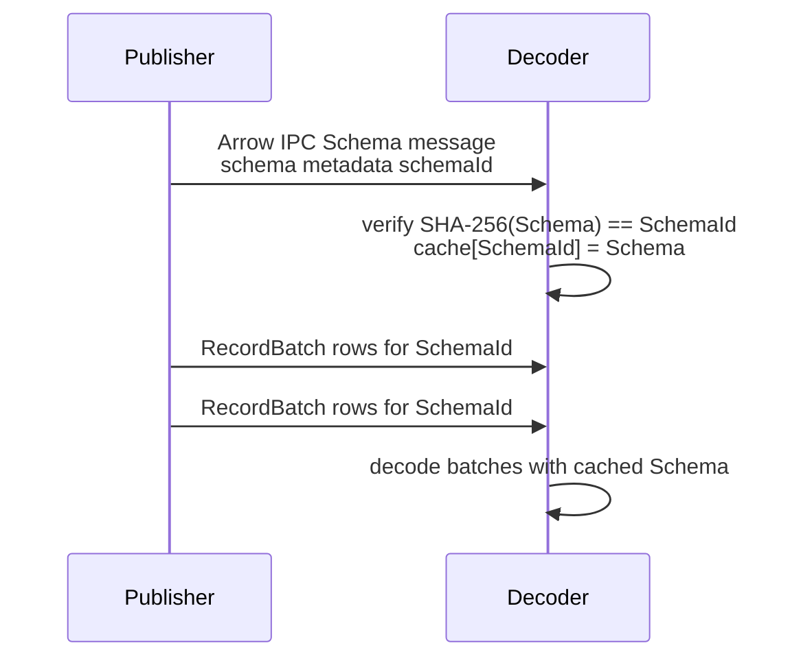
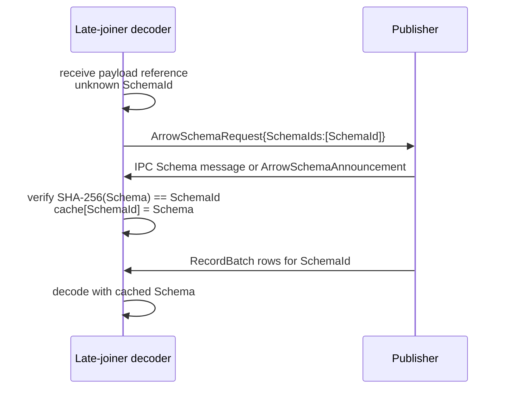
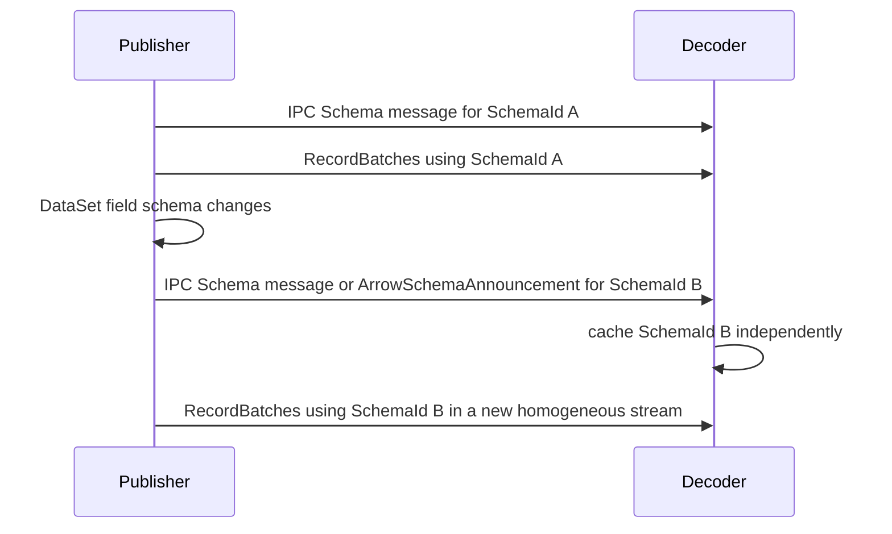

# OPC UA Part 14 Apache Arrow PubSub Message Mapping

**Working draft for submission to the OPC Foundation Working Group**  
**Proposed insertion:** OPC 10000-14 v1.05.06, new `7.2.8 Arrow message mapping`  
**Version:** 0.1.0 · **Date:** 2026-07-02

> **Status — working draft.** This document specifies a columnar Arrow message mapping for OPC UA PubSub. A NetworkMessage is an Arrow IPC stream or file containing one or more RecordBatches; each row is a DataSetMessage sample and each column is a DataSet field encoded with the Part 6 Arrow DataType mapping.

## 1 Scope

This mapping defines how PubSub NetworkMessages and DataSetMessages are represented using Apache Arrow. It is optimized for analytics and historian consumers that benefit from columnar batches while preserving OPC UA PubSub metadata and the exact Part 6 value mapping.

**Normative exclusion:** The Arrow Part 14 mapping covers batch publish/subscribe NetworkMessages and DataSetMessages only. It does not map OPC UA Actions, action invoke requests, or action invoke responses; those use the OPC UA Avro mapping.

## 2 Overview

An Arrow NetworkMessage is an Arrow IPC stream whose schema describes one PublishedDataSet. Each RecordBatch contains zero or more DataSetMessage rows. A single DataSetMessage is a one-row RecordBatch. Key frames carry a full set of DataSet fields. Delta frames carry only changed fields, either as a batch with nullable omitted columns and a field-index selection column or as a selection RecordBatch whose columns are the changed field subset.

The batching advantage is that many samples from the same DataSet can be transmitted in one message: timestamps, status values and field values become cache-friendly columns, and subscribers can process a batch without per-sample decoding overhead.

Multi-byte values in the Arrow buffers of every RecordBatch are little-endian, as required by the Apache Arrow columnar format and the Part 6 Arrow DataType mapping.

## 3 Insertion into OPC 10000-14 v1.05.06

Insert a new message mapping `7.2.8 Arrow message mapping` after the existing message mappings, mirroring the structure of `7.2.5 JSON message mapping`. Add configuration parameters in `6.3.x`, configuration model entries in `9.2.x`, header layout descriptions in `Annex A.x`, and content-type entries in `7.3.4.x` and `Annex B`.

| Draft section | Target in OPC 10000-14 | Notes |
|---|---|---|
| §3 `6.3.x Arrow mapping parameters` | New `6.3.x Arrow message mapping parameters` | Adds IPC format, batch sizing, schema metadata, delta-frame and compression settings. |
| §3 `7.2.8 Arrow message mapping` | New `7.2.8 Arrow message mapping` | Defines Arrow IPC NetworkMessages, RecordBatch DataSetMessages, key frames and delta frames. |
| §3 `7.2.8 Arrow message mapping` | New `7.2.8.x Bare RecordBatch framing` | Adds the `batch` `ArrowIpcFormat` option: bare RecordBatch data messages whose schema is resolved out of band by SchemaId. |
| §5.1 Schema resolution | New `7.2.8.x Schema resolution` | Describes catalog resolution, content-type selection and governed-schema validation. |
| §5.2.1 SchemaId and canonical schema bytes | New `7.2.8.x SchemaId and canonical schema bytes` | Defines the 8-byte SchemaId as the first 8 bytes of SHA-256 over the serialized Arrow Schema. |
| §5.2.2 Carrier placement | New `7.2.8.x SchemaId carrier placement` | Normatively maps stream, transport and envelope scopes to SchemaId carriers. |
| §5.2.3 Schema announcements | New `7.2.8.x Schema announcements` | Defines IPC Schema-message announcements and the out-of-IPC `ArrowSchemaAnnouncement` descriptor. |
| §5.2.4 SchemaRequest | New `7.2.8.x SchemaRequest` | Defines the `ArrowSchemaRequest` descriptor for late joiners and cache misses. |
| §5.2.5 Encoder change tracking | New `7.2.8.x Encoder change tracking` | Requires per-destination announcement tracking and homogeneous streams per SchemaId. |
| §5.2.6 Decoder cache-miss resolution | New `7.2.8.x Decoder cache-miss resolution` | Orders IPC/announcement wait, SchemaRequest, xRegistry lookup, AddressSpace Schema Registry read, and Part 6 re-derivation. |
| §5.2.7 Relationship to ConfigurationVersion | New `7.2.8.x Relationship to ConfigurationVersion` | States that SchemaId is independent of ConfigurationVersion, and defines the minor/major schema compatibility contract (Schema Registry §7). |
| §5.2.8 Schema-exchange sequences | New `7.2.8.x Schema-exchange sequences` | Provides the normative exchange patterns as sequence diagrams. |
| §3 `7.3.4.x Content types` | New `7.3.4.x Arrow content types` | Adds Arrow IPC stream/file media types. |
| §3 `9.2.x Configuration model` | New `9.2.x Arrow message mapping ObjectTypes` | Describes Arrow mapping configuration model entries. |
| §3 `Annex A.x Header layouts` | New `Annex A.x Arrow header layouts` | Maps NetworkMessage and DataSetMessage headers to metadata and columns. |
| §3 `Annex B Arrow content type entries` | `Annex B` additions | Adds Arrow IPC stream/file content-type entries and transport metadata names. |

### 6.3.x Arrow mapping parameters

The WriterGroup MessageSettings for the Arrow mapping shall include: `ArrowIpcFormat` (`batch`, `stream` or `file`, default `batch`; see Table 7.2.8-1), `MaxRowsPerRecordBatch`, `IncludeSchemaMetadata`, `DeltaFrameMode` (`nullable-columns` or `selected-columns`), and `Compression` (`none` or an Arrow IPC-supported codec). `DeltaFrameMode = nullable-columns` (the default) keeps the full column set and marks absent keys as null cells, so sparse and full frames share one schema and SchemaId (§7.2.8); `selected-columns` drops columns and changes the SchemaId and is used only when an explicit reduced-column batch is intended. The DataSetWriter MessageSettings shall identify the DataSet schema version and whether DataSet fields are represented as RawData, Variant or DataValue according to `DataSetFieldContentMask`.

### 7.2.8 Arrow message mapping

The payload of an Arrow NetworkMessage shall be a bare Arrow RecordBatch (`batch`), an Arrow IPC stream (`application/vnd.apache.arrow.stream`) or an Arrow IPC file (`application/vnd.apache.arrow.file`) as selected by `ArrowIpcFormat`. All three formats carry the identical canonical Part 6 Arrow column layout — one column per DataSet field using the Part 6 Arrow mapping for that field DataType — and differ only in how the schema is conveyed, so they are framing options and not encoding variants. Schema metadata carries NetworkMessage header fields such as PublisherId, WriterGroupId, DataSetWriterId, NetworkMessageNumber, SequenceNumber, ConfigurationVersion, MessageType, Timestamp, PicoSeconds, PromotedFields and security-related flags when present.

**Table 7.2.8-1 — `ArrowIpcFormat` framing options**

| `ArrowIpcFormat` | NetworkMessage payload | Schema on the wire | Self-contained | Use when |
|---|---|---|---|---|
| `batch` (default) | A single bare Arrow RecordBatch message | No — announced once and referenced by SchemaId | No — needs a prior schema announcement | Default. Schema-governed channels, aligning with the Avro mapping which also exchanges the schema out of band; lowest per-message overhead. |
| `stream` | An Arrow IPC stream: one Schema message followed by one or more RecordBatch messages | Yes — the Schema message precedes the RecordBatches | Yes | Channels without a schema-announcement mechanism, or when each message must be independently decodable. |
| `file` | An Arrow IPC file: the stream contents plus a footer with a random-access block index | Yes — embedded, plus the footer index | Yes | Bounded, seekable payloads for storage or random-access retrieval. |

Each RecordBatch row is one DataSetMessage sample for the DataSet. Columns are DataSet fields. If `DataSetFieldContentMask` selects RawData, the column type is the field DataType mapping. If it selects Variant, the column type is the Part 6 Variant mapping. If it selects DataValue, the column type is the Part 6 DataValue mapping. The selected representation shall be the same for every row in the batch. **Every DataSet field column shall be nullable** (Arrow validity bitmap; for a Variant or ExtensionObject column the dense-union `null` child, `null=0`).

Key frames shall contain all fields in DataSetMetaData field order. A DataSet may be **sparse** — a row need not carry a value for every key. A sparse DataSet shall be represented with **nullable columns**: the RecordBatch keeps the identical full column set — and therefore the same schema and SchemaId — and a key with no value in a given row is written as a **null cell** (`null:null`: a cleared validity bit, or the dense-union `null` child). A subscriber shall treat a null cell as **missing** — no value for that key in that row. This is the `nullable-columns` mode (§6.3.x) and shall be used whenever a stable schema across sparse subsets is required.

Delta frames shall identify changed fields using a `field_index:list<uint16>` selection column, a schema-level changed-field list, or a `selected-columns` RecordBatch whose metadata lists the original field indexes. A `selected-columns` batch omits unchanged columns and therefore changes the column set and the SchemaId, so it is the explicit schema-changing option, distinct from the stable-schema `nullable-columns` sparse representation above. In a `selected-columns` batch, omitted unchanged fields shall not be decoded as null values; they are absent by delta-frame selection.

#### 7.2.8.x Bare RecordBatch framing (`batch`)

When `ArrowIpcFormat` is `batch`, a data NetworkMessage payload is a single bare Arrow RecordBatch message with no embedded Schema message. This removes the per-message Arrow Schema message — a fixed cost that is independent of row count, for example approximately 1.2 kB for a ten-field DataSet — from every data message. The schema is conveyed once out of band and resolved by SchemaId, exactly as the Arrow IPC stream format sends its Schema message once before any RecordBatch and as Arrow Flight carries the schema in the flight descriptor rather than in each `FlightData` batch. `batch` is a framing choice, not an encoding variant: the column and value layout is the identical canonical Part 6 Arrow mapping used by `stream` and `file`, so the requirement that encoders not introduce alternate Arrow layouts or encoding variants for the same DataType is preserved.

A publisher using `batch` framing shall announce the schema for a SchemaId before, or together with, the first bare RecordBatch that references it, using either a one-time Arrow IPC stream whose Schema message carries that SchemaId or an `ArrowSchemaAnnouncement` (§5.2.3). Because a bare RecordBatch carries no schema, and therefore no in-payload SchemaId, the SchemaId shall accompany each bare RecordBatch out of band — in transport metadata (`opcua-arrow-schema-id`, §5.2.2) or in the DataSetMessage/NetworkMessage envelope. A subscriber shall resolve the schema for the referenced SchemaId from its cache — populated by a prior Schema message or announcement — following the §5.2.6 cache-miss resolution order, then decode the RecordBatch against that schema. A bare RecordBatch that references an unknown SchemaId is a schema error and shall not be decoded.

The relative benefit of `batch` framing is largest for small or single-sample messages and diminishes as rows per RecordBatch increase, because the fixed schema cost is amortised across the batch. Even without the schema, a bare RecordBatch retains the Arrow RecordBatch message header — per-column length, null-count and buffer descriptors — so `batch` framing reduces, but does not remove, Arrow's per-message overhead and does not make Arrow competitive with a compact row encoding for single samples. `batch` is the default framing because it aligns with the schema-exchange model the Avro mapping already requires; `stream` is used for channels without a schema-announcement mechanism or when each message must be independently decodable.

### 7.3.4.x Content types

The Arrow IPC stream content type shall be `application/vnd.apache.arrow.stream`. The Arrow IPC file content type shall be `application/vnd.apache.arrow.file`. Transports that expose MIME content types shall use these values for Arrow PubSub messages.

### 9.2.x Configuration model

The PubSub configuration model shall describe an Arrow message mapping option for WriterGroup and DataSetWriter MessageSettings. The described-only configuration nodes reference the `Default Arrow` DataTypeEncoding from Part 6 and the schema generated from DataSetMetaData. Final BrowseNames and NodeIds are assigned by the OPC Foundation.

### Annex A.x Header layouts

Arrow NetworkMessage header fields shall be represented as schema metadata key-value pairs when they apply to the whole stream or batch, and as columns when they vary per row. DataSetMessage header fields that vary per sample, such as status, timestamp, picoSeconds or sequence number, shall be represented as leading metadata columns before DataSet field columns.

### Annex B Arrow content type entries

Annex B shall list `application/vnd.apache.arrow.stream` for Arrow IPC streaming PubSub payloads and `application/vnd.apache.arrow.file` for bounded Arrow IPC file payloads.

## 4 DataSet schema mapping

A PublishedDataSet maps to one Arrow schema. For each `FieldMetaData` entry, the field name becomes the Arrow column name and the field DataType becomes the Arrow column `DataType` using OPC UA Part 6 Arrow. Every DataSet field column is **nullable**, so a **sparse** DataSet — a row that does not carry a value for every key — uses the same schema: the absent key is a null cell interpreted as missing (§7.2.8), and the SchemaId does not change with the subset of keys carried. Field properties from DataSetMetaData are copied into Arrow field metadata so a disconnected subscriber can retain engineering units, semantic references, model namespace, SourceBrowseName and SourceTypeDefinition.

## 5 NetworkMessage and DataSetMessage envelopes

The canonical envelope is an IPC stream with schema metadata for NetworkMessage-level values and RecordBatch rows for DataSetMessages. A bridge may wrap multiple DataSet schemas in a transport-level envelope, but each Arrow IPC stream schema shall describe exactly one DataSet schema to preserve column homogeneity.

### 5.1 Schema resolution

Arrow is schema-based: the Arrow schema of the IPC stream is required to decode the batch. The reference schema is published to, and resolved from, a central catalog as defined by *OPC UA — Schema Registry* (`../schema-registry/OPC-UA-Schema-Registry.md`). While an Arrow IPC stream embeds its own schema in the stream header (so a message is self-contained once received), a subscriber that must decode before receiving the stream — or that validates against a governed schema — resolves it from the DataSet namespace, `<DataSetName>:arrow`, and the `ConfigurationVersion`, per §8 of that specification. The transport `content-type` (`application/vnd.apache.arrow.stream` or `application/vnd.apache.arrow.file`) selects the format.

### 5.2 SchemaId handshake

#### 5.2.1 SchemaId and canonical schema bytes

The Arrow mapping defines a lightweight SchemaId handshake that is independent of PubSub `ConfigurationVersion`. A SchemaId is derived only from the serialized Arrow Schema canonical form defined by Part 6. The SchemaId shall be the first 8 bytes of the SHA-256 fingerprint of the serialized Arrow `Schema` IPC message bytes, for example `SHA-256(schema.serialize().to_pybytes())[:8]`. The lowercase hexadecimal form used in descriptors and diagnostics is 16 characters; the on-wire field is the raw 8-byte value unless a profile specifies a longer length. Any carried `schemaId` metadata is a reference to the canonical schema and shall not be inserted into the canonical schema bytes before calculating the SchemaId.

The Arrow `Schema` describes one DataSet — the columns of that DataSet's RecordBatch(es) — so the SchemaId identifies a **single DataSet's** schema. An IPC stream, file or bare `batch` carries one DataSet's schema; a deployment that multiplexes several DataSets uses a separate stream or SchemaId per DataSet. A producer accordingly computes and tracks the SchemaId, and advances the DataSet `ConfigurationVersion`, **per DataSet**, not per transport frame.

A NetworkMessage, DataSetMessage or transport envelope shall reference the schema by SchemaId, carried either in Arrow IPC custom metadata or in the DataSetMessage/transport header. The SchemaId may coexist with `ConfigurationVersion`, but it does not depend on it; a ConfigurationVersion change that does not change the Arrow Schema keeps the same SchemaId, and an Arrow Schema change produces a new SchemaId even if a publisher's configuration versioning policy is separate.

#### 5.2.2 Carrier placement

The SchemaId shall be placed as follows.

| Scope | Carrier | When used |
|---|---|---|
| Arrow IPC stream | The embedded IPC Schema message is the self-contained announcement. The same 8-byte SchemaId shall also be present in Arrow IPC custom metadata key `schemaId` and in stream schema metadata when `IncludeSchemaMetadata` is enabled. | Used for normal Arrow PubSub streams and files where the IPC payload embeds its schema before any RecordBatch. |
| Transport metadata | The transport content type shall be `application/vnd.apache.arrow.stream` or `application/vnd.apache.arrow.file`. Kafka and AMQP deployments that carry schema identifiers outside the IPC payload shall use header `opcua-arrow-schema-id` containing the raw 8-byte SchemaId or its lowercase hexadecimal representation when the transport header model is text-only. | Used by transports, schema registries or routers that need to route, pre-validate or select a schema before opening the IPC payload, especially when the payload is a bare RecordBatch or a registry publication. |
| DataSetMessage/NetworkMessage envelope | A `SchemaId` reference in the envelope that wraps the IPC payload. | Used when an OPC UA PubSub envelope or bridge wraps an Arrow IPC stream, file or RecordBatch and needs to identify the schema without relying on transport headers. |

#### 5.2.3 Schema announcements

Within an Arrow IPC stream, the IPC Schema message is the schema announcement. It shall be sent once at the start of each IPC stream before any RecordBatch. A receiver that obtains the IPC Schema message has the serialized Arrow Schema bytes needed to verify the SchemaId and decode subsequent RecordBatches in that stream.

For non-IPC transports that publish a bare RecordBatch, for registry publication flows, or for out-of-band repair, the announcement shall use the descriptor `ArrowSchemaAnnouncement`:

```text
ArrowSchemaAnnouncement {
  SchemaId: bytes(8),
  Schema: serialized Arrow Schema IPC message bytes or an equivalent schema-JSON descriptor,
  SchemaEpoch: optional int64
}
```

`SchemaId` is the raw 8-byte value containing the first 8 bytes of SHA-256 over `Schema` when `Schema` is the serialized Arrow Schema IPC message bytes. If a schema-JSON descriptor is used as a human-readable registry artifact, the announcement shall also identify the serialized Arrow Schema bytes or a deterministic conversion that recomputes the same SchemaId. `SchemaEpoch` may be monotonically increased for operator correlation, but receivers shall not use it as the decoding key and it is not part of SchemaId calculation.

Reception of an IPC Schema message or an `ArrowSchemaAnnouncement` shall insert `{SchemaId, Arrow Schema}` into `cache: SchemaId -> schema` after verifying that the recomputed SchemaId equals the announced SchemaId. A publisher may also publish the same pair to xRegistry with label `opcua.schemaid`.

The reference descriptor is published as `core-specs\extras\arrow-encoding\schemas\struct-ArrowSchemaAnnouncement.json`. The reference example stream is `core-specs\extras\arrow-encoding\examples\arrow_schema_announcement.arrow`, with readable metadata in `core-specs\extras\arrow-encoding\examples\schema_exchange_index.json`.

#### 5.2.4 SchemaRequest

A late-joining decoder or a decoder that detects a cache miss may send an `ArrowSchemaRequest` when the transport supports request/response or side-channel control messages:

```text
ArrowSchemaRequest {
  RequesterId: optional string,
  SchemaIds: array<bytes(8)>
}
```

`RequesterId` is diagnostic and may identify a receiver, session or bridge. `SchemaIds` shall contain one or more raw 8-byte SchemaIds requested by the decoder. A publisher that receives a request for an active SchemaId shall answer by opening or replaying an IPC stream whose Schema message announces the schema, or by sending an `ArrowSchemaAnnouncement` carrying the same `{SchemaId, Arrow Schema}` pair. If policy permits, publishers should periodically re-announce active schemas on lossy transports or when late joiners are expected.

The reference descriptor is published as `core-specs\extras\arrow-encoding\schemas\struct-ArrowSchemaRequest.json`. The reference example stream is `core-specs\extras\arrow-encoding\examples\arrow_schema_request.arrow`.

#### 5.2.5 Encoder change tracking

An encoder shall maintain `announced: set[SchemaId]` per destination. Before sending a batch, it recomputes the Arrow Schema from the DataSet fields using the Part 6 algorithm and computes the 8-byte SchemaId. If the SchemaId has not been announced to that destination, the encoder announces it first by opening a new IPC stream or otherwise sending the IPC Schema message or `ArrowSchemaAnnouncement`, then adds it to `announced`.

A changed DataSet schema yields a new SchemaId and therefore requires a new announcement and a new homogeneous IPC stream. One Arrow IPC stream shall not mix RecordBatches that require different Arrow Schemas. Encoders shall not introduce alternate Arrow layouts or encoding variants for the same OPC UA DataType; the canonical Part 6 mapping, including the dense-union Variant form, is the only interchange form.

#### 5.2.6 Decoder cache-miss resolution

A decoder shall maintain `cache: SchemaId -> schema`. Once cached, each received stream's Schema message or governed schema shall match the cached SchemaId before RecordBatches are decoded. If a message references an unknown SchemaId, the decoder shall resolve it in the following order until one step succeeds:

1. Await the Arrow IPC Schema message in the current stream or an `ArrowSchemaAnnouncement` on the configured announcement channel, then verify the recomputed 8-byte SchemaId and insert the schema into the cache.
2. Send `ArrowSchemaRequest` listing the unknown SchemaId when the transport supports request/response or a control side channel, then process the returned IPC Schema message or `ArrowSchemaAnnouncement`.
3. Resolve the schema from an external (federated) xRegistry that the local registry references, as defined by *OPC UA — Schema Registry* (`../schema-registry/OPC-UA-Schema-Registry.md`) §8.
4. Read the in-server AddressSpace Schema Registry by a SchemaId-NodeId. The companion NodeSet authored in `core-specs\schema-registry\` uses namespace `http://opcfoundation.org/UA/SchemaRegistry/` and exposes each schema at an Opaque NodeId whose Identifier is the raw 8-byte SchemaId. A decoder may perform a single `Read` on that NodeId without browsing or recomputing candidate NodeIds. Servers may additionally expose `GetSchema(SchemaId)` for clients that prefer a Method call over direct NodeId construction.
5. Re-derive the Arrow Schema from the AddressSpace DataTypeDefinition using the Part 6 Arrow schema-generation algorithm, compute the 8-byte SchemaId over the serialized Arrow Schema, and verify that it equals the referenced SchemaId.

If all configured resolution paths fail, the decoder shall treat the payload as undecodable rather than guessing a schema. The cache key is SchemaId only and is independent of `ConfigurationVersion`, PublisherId, WriterGroupId and DataSetWriterId.

#### 5.2.7 Relationship to ConfigurationVersion

SchemaId derives only from the Arrow Schema. It does not depend on PubSub `ConfigurationVersion`, writer group version numbers, sequence numbers, transport session state or `SchemaEpoch`. A ConfigurationVersion change that does not alter the Arrow Schema keeps the same SchemaId. A schema change produces a new SchemaId even if a deployment accidentally fails to advance ConfigurationVersion; decoders shall use SchemaId to select the Arrow schema and may use ConfigurationVersion for existing PubSub metadata checks.

Although SchemaId is not computed from ConfigurationVersion, the `{MajorVersion, MinorVersion}` lineage carries a compatibility relationship between successive schemas per *OPC UA — Schema Registry* §5.6. A MinorVersion increment is an append-only-compatible superset of the same major. An Arrow IPC `stream` embeds its writer schema and remains self-describing; a bare RecordBatch carries no schema and its node/buffer layout matches its writer-minor schema, so a subscriber shall resolve the exact writer-minor schema by SchemaId to decode a bare RecordBatch, or apply a defined upgrade that treats union children absent from the older RecordBatch as empty. A MajorVersion increment is a reset with no such guarantee. A publisher shall advance MinorVersion when it aggregates a new Variant body form or ExtensionObject concrete type into the schema, and re-announce the resulting SchemaId per §5.2.3–5.2.6. The per-encoding procedure for narrowing and append-only growing these unions is in the Arrow Part 6 DataEncoding §5.6.12.

#### 5.2.8 Schema-exchange sequences

Normal stream startup announces the schema with the IPC Schema message before any RecordBatch:



A late joiner or cache-miss receiver requests the missing schema and decodes only after the announcement is verified:



A schema change creates a new SchemaId and a new homogeneous IPC stream or announcement:



## 6 Conformance

An Arrow PubSub publisher conforms when it emits RecordBatches whose columns use the Part 6 Arrow mapping, whose rows reconstruct the intended DataSetMessages, and whose key-frame and delta-frame rules preserve null-vs-absent semantics. A subscriber conforms when it reconstructs DataSet field values with the same Part 6 reversibility guarantees and uses DataSetMetaData plus Arrow schema metadata to interpret the batch.
