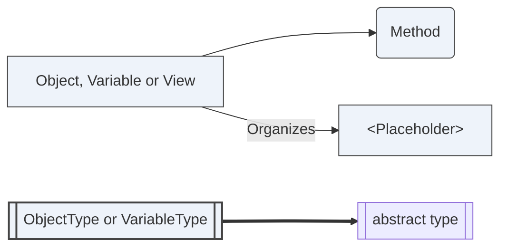
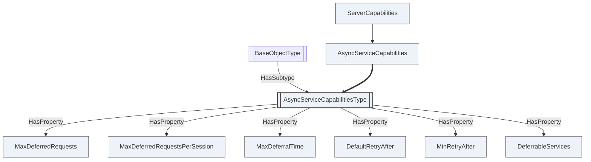
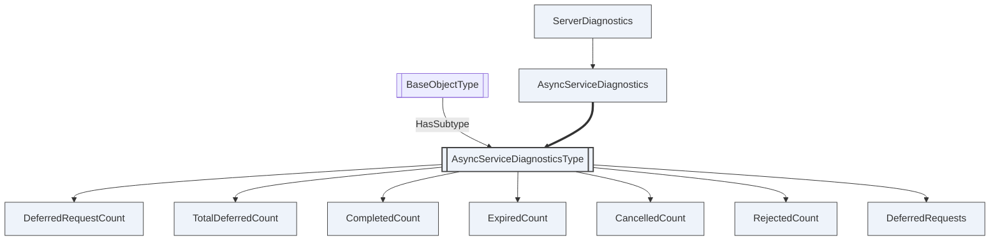
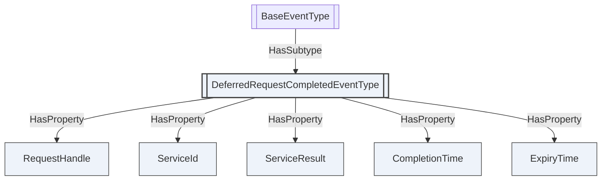
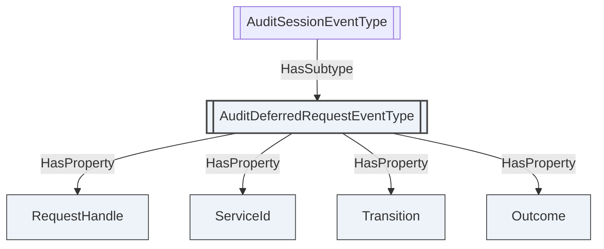

# OPC UA — Asynchronous Service Execution

**Working draft for submission to the OPC Foundation Working Group**
**Proposed addition to:** OPC 10000-4 Services v1.05.07 and OPC 10000-5 Information Model v1.05.06
**Namespace:** `http://opcfoundation.org/UA/` (base OPC UA namespace)
**Version:** 0.1.0 · **Date:** 2026-08-03

> **Status — working draft.** This is a self-contained read merging the two insertion-ready errata that are the authoritative proposals: [Part 4 — Asynchronous Service Execution](OPC-UA-Part4-Async-Service-Execution.md) and [Part 5 — Asynchronous Service Model](OPC-UA-Part5-Async-Service-Model.md). It adds a worked gateway deployment and a comparison with the mechanisms OPC UA already has. Numeric NodeIds, StatusCode values and the proposed clause numbers are **provisional**. Nothing here is normative or endorsed by the OPC Foundation.

---

## 1 Scope

OPC UA has no way for a Server to say *"still working — ask me again"*.

This specification adds one: a Server that cannot produce a response within the time its Client is willing to wait **parks** the request, answers `Bad_RequestNotComplete` with a cooperative retry hint, and hands the response to the first `Complete` that arrives once the work has finished. `Complete` is a new Service in the Session Service Set, keyed on the same `requestHandle` that `Cancel` already uses, so a Server issues no ticket and a Client stores no cookie.

It defines the `Complete` Service, the rules that govern parking and collection, the Nodes through which a Client discovers all of it before making a call that might be deferred, the Events that report completion and audit the lifecycle, and five new StatusCodes. It applies to any Service the Server is willing to defer, so a Client implements it once and it works for a `Call`, a `Write` and a `HistoryUpdate` alike.

It defines no Service-specific behaviour. What a deferred `Call` does while it is parked is the business of the Method being called.

## 2 Normative references

- [OPC 10000-2](https://reference.opcfoundation.org/specs/OPC-10000-2/) — Security Model.
- [OPC 10000-3](https://reference.opcfoundation.org/specs/OPC-10000-3/) — Address Space Model.
- [OPC 10000-4 v1.05.07](https://reference.opcfoundation.org/specs/OPC-10000-4/) — Services.
- [OPC 10000-5 v1.05.06](https://reference.opcfoundation.org/specs/OPC-10000-5/) — Information Model.
- [OPC 10000-6](https://reference.opcfoundation.org/specs/OPC-10000-6/) — Mappings.
- [OPC 10000-7](https://reference.opcfoundation.org/specs/OPC-10000-7/) — Profiles.
- [OPC 10000-12](https://reference.opcfoundation.org/specs/OPC-10000-12/) — Discovery and Global Services.
- [OPC 10000-14](https://reference.opcfoundation.org/specs/OPC-10000-14/) — PubSub.

## 3 Terms, definitions and abbreviations

| Term | Definition |
|---|---|
| Deferral | A Server's decision to answer a request later than the request itself, by parking it. |
| Parked request | A request the Server has accepted and is still working on, or has finished and is holding an answer for. |
| Parked response | The response of a parked request, held by the Server until a Client collects it, the Client abandons it, or it expires. |
| Issuing Session | The Session on which the parked request arrived, and the only Session that can collect the response. |
| Deferrable Service | A Service the Server is willing to defer, as listed in `AsyncServiceCapabilities.DeferrableServices`. |

Key words **shall**, **should**, **may** and **shall not** are to be interpreted as in the ISO/IEC directives.

## 4 Overview

### 4.1 The problem

A Server that is the front of something else cannot answer within the time its Client will wait. A gateway asked to distribute a TrustList to the devices behind it, an aggregating Server asked to write a value that lives in an underlying Server, a Server asked to run a Method that turns a machine: the work outlasts `RequestHeader.timeoutHint`, and OPC UA has nothing to say about it. The Client gets `Bad_Timeout` and cannot tell a Server that failed from a Server that is still working — and so cannot retry without risking the effect a second time.

The certificate push Methods of OPC 10000-12 show the shape at full size, and Annex B works one through. A single `ApplyChanges` on a gateway becomes one exchange per device behind it, and the Method has to return one result while some of those exchanges are still outstanding. The transaction model of OPC 10000-12 §7.10.2 sequences the changes and defers their *effect* until `ApplyChanges`, which is real progress; but `ApplyChanges` itself still has to answer synchronously.

### 4.2 What OPC UA has today

**`Good_CompletesAsynchronously`** announces that processing will finish later. It provides no way to learn the outcome, so it tells a Client to stop waiting without telling it what to do instead.

**Ticket Methods.** OPC 10000-12 pull management already solves this once, privately: `StartSigningRequest` returns a `requestId`, `FinishRequest` polls it, and `Bad_RequestNotComplete` means *not yet*. It works — and it is the model this specification generalizes. But it is a pattern rebuilt by hand in every specification that needs it, with its own identifier, its own poll Method, its own lifetime rules and its own failure modes, available only where someone thought to add it. It cannot be applied to a `Write`.

**`Publish`.** A long poll, solving a different problem — a stream of unsolicited notifications — by keeping requests in flight, which is exactly what a Client cannot afford for an operation that takes an hour.

**Raising `timeoutHint`.** A Client that waits an hour holds a socket, a thread and a Session for an hour, learns nothing while it waits, and loses everything if the connection blinks. The point of a deferral is that the Client can go away.

Annex C compares all of these against deferral side by side.

### 4.3 Why a Service, and not another Method

A ticket Method is defined by whoever owns the Object it hangs on, which means the mechanism exists only where a companion specification put it. Deferral belongs to the Service layer because that is the only layer every Service already passes through: a Client that understands `Complete` collects a deferred `Write`, a deferred `Call` and a deferred `HistoryUpdate` with the same code, from a Server that never anticipated any of them.

It also needs no new identifier. `RequestHeader.requestHandle` already identifies an outstanding request well enough for `Cancel` to act on it (OPC 10000-4 §5.7.5). `Complete` uses the same key, so the two Services that act on an outstanding request are symmetric: `Cancel` gives it up, `Complete` asks for it.

### 4.4 Deferral in one paragraph

A Server that cannot answer in time parks the request and returns `Bad_RequestNotComplete` with a `RetryAfter` hint. The Client calls `Complete` with the same `requestHandle` and gets either the parked Service's own response — a `CallResponse`, a `WriteResponse`, whatever the original request was — or `Bad_RequestNotComplete` again with a fresh hint. A Client that has lost interest calls `Cancel`. A Client that would rather be told than ask subscribes to `DeferredRequestCompletedEventType`. A Client that understands none of this sees a Bad service result and treats the call as failed, which is what it does today when the Server times out instead.

## 5 The Complete Service

### 5.1 Complete

Collects the response of a parked request.

**Request**

| Name | Type | Description |
|---|---|---|
| requestHeader | RequestHeader | Common request parameters (OPC 10000-4 §7.32). |
| requestHandle | IntegerId | The `requestHandle` of the parked request, as it appeared in the `RequestHeader` of the deferred request. |

**Response**

A `Complete` has three kinds of answer, and they are kept apart on the wire rather than by a header a stack may discard.

**The parked Service's own response message**, when the parked request succeeded — the `CallResponse`, `WriteResponse` or `HistoryUpdateResponse` the original request would have produced had the Server answered it immediately. Its `ResponseHeader.requestHandle` **shall** carry the `requestHandle` of the `Complete` request, not of the parked one, so the response matches the request that fetched it; the parked handle is the request parameter and needs no echo.

**A `CompleteResponse`**, when the parked request *failed*. Its own `serviceResult` is `Good` — the `Complete` succeeded — and `deferredServiceResult` carries the Bad `serviceResult` the parked response had, with `deferredDiagnosticInfo` beside it.

**A `ServiceFault`**, when the `Complete` itself failed, carrying one of the results below.

The middle case is why `CompleteResponse` exists and is not the empty placeholder a Service definition would otherwise need. Without it, a parked `ApplyChanges` that failed with `Bad_ServerTooBusy` and a `Complete` refused by the retry floor with `Bad_ServerTooBusy` would be the same message, and a Client could not tell *the work failed* from *ask again later*. Every Bad `serviceResult` travels as a `ServiceFault` under OPC 10000-4 §7.34, so the two would be indistinguishable at exactly the moment the distinction matters most. Moving the parked failure into a `Good` response separates them by message type, which every Client can see.

**Preconditions.** The Session **shall** be activated. `requestHandle` **shall** identify a parked request of that same Session (§7.5).

**Service results**

| Result | When |
|---|---|
| *the parked response, or a `CompleteResponse`* | The work has finished and the outcome is being handed over. |
| `Bad_RequestNotComplete` | The work has not finished. A fresh hint accompanies it (§6.3). |
| `Bad_DeferredRequestUnknown` | No parked request with that `requestHandle` is known to this Session. |
| `Bad_DeferredRequestExpired` | A parked request with that `requestHandle` existed and the Server discarded it (§7.3). |
| `Bad_RequestCancelledByRequest` | A parked request with that `requestHandle` was abandoned with `Cancel` (§7.4). |
| `Bad_DeferralNotSupported` | The Server implements `Complete` but defers no Service. A Server that does not implement the Service at all returns `Bad_ServiceUnsupported`, as it does for any Service it has not implemented. |
| `Bad_ServerTooBusy` | The call arrived sooner than `MinRetryAfter` after the previous one while the request was still `Executing` (§6.3). |

`Bad_DeferredRequestExpired` and `Bad_RequestCancelledByRequest` are distinguished from `Bad_DeferredRequestUnknown` for as long as the Server keeps a record of the request, which the record floor of §7.1 bounds from below. Past that floor a Server **may** discard the record and answer `Bad_DeferredRequestUnknown` instead; a Client **shall** treat all three as *there is nothing to collect and there never will be*.

### 5.2 Why the response is polymorphic

`Complete` is answered with a message that is not the response its request declares. This looks like a new obligation on implementations and is not one.

A Client already cannot assume that the message it receives is the response type it asked for: **any** request may be answered with a `ServiceFault` instead, which is a different message with a different TypeId, and OPC 10000-6 identifies every message by its own TypeId rather than by the request it answers. Dispatching a response by reading what arrived — rather than by assuming what was sent — is therefore something every conforming stack already does. `Complete` asks for no new capability; it widens the set of legal answers from *two* to *the response of whichever Service was parked*.

The alternative — wrapping *every* parked response in an `ExtensionObject` inside a `CompleteResponse` — was considered and rejected. It preserves a one-to-one request-to-response mapping that the `ServiceFault` rule has already broken, and it does so by making every Client decode a response twice and by giving the same response two different on-wire forms depending on how it was collected. A response that is byte-identical however it is fetched is worth more than a mapping that is already not true. `CompleteResponse` therefore carries a parked *failure*, which has no response message of its own, and never a parked success, which does.

A Server **shall not** send a parked response to a `Complete` from a Session other than the one that parked it, and **shall not** send any message other than the parked response, a `CompleteResponse` or a `ServiceFault` (§5.1).

### 5.3 Placement

`Complete` belongs to the Session Service Set, beside `Cancel`. It operates on a request outstanding within a Session, requires an activated Session, and is meaningless outside one — the same three properties that place `Cancel` there.

## 6 Deferring a request

### 6.1 When a Server may defer

A Server **may** defer a request when all of the following hold, and **shall not** otherwise:

- The request carries a `DeferralRequestHeaderDataType` in `RequestHeader.additionalHeader` (§6.2).
- The request's message type is listed in `AsyncServiceCapabilities.DeferrableServices`.
- The Service is not one of those §8 excludes.
- Parking the request would not take the Server past `MaxDeferredRequests`, nor the Session past `MaxDeferredRequestsPerSession`.

A Server that would exceed a parking limit **shall** either answer the request synchronously or refuse it with `Bad_TooManyDeferredRequests`. It **shall not** park a request and then discard it to make room: a parked request that vanishes is indistinguishable, to the Client, from one that was never accepted, and the effect may already be in flight.

**Admission is decided before the work starts, not after.** A Server **shall** reserve the parking slot before it begins any work whose effect it cannot undo and whose outcome it might have to defer. Discovering at the end that there is no room to park the answer is the one outcome the mechanism must never produce: it leaves the effect done and the outcome unreachable, which is the failure this specification exists to remove. Where a Server cannot reserve in advance — because it could not know the work would run long — it **shall** exceed `MaxDeferredRequests` rather than discard the outcome, and **shall** report the excess through `DeferredRequestCount`, whose value is therefore a measurement and not a bound.

**Deferral is opt-in, and the first condition is what makes the rest of this specification safe.** A Client that has never heard of `Complete` cannot collect a parked response, so parking one on its behalf would strand the outcome of work it believes failed — and, worse, invite it to retry an `UpdateCertificate` that is still in flight. A Server therefore answers such a Client exactly as it answers it today: synchronously if it can, and with `Bad_Timeout` if it cannot. That is no worse than the present behaviour, and it is the reason this specification needs no rule about recognising a retry.

### 6.2 The deferral headers

A request **may** carry a `DeferralRequestHeaderDataType` in `RequestHeader.additionalHeader`, which OPC 10000-4 §7.32 reserves for exactly this purpose and which an application that does not understand it ignores. **Its presence is the Client's statement that it implements `Complete`**, and therefore the Server's permission to defer (§6.1). Its members are preferences and never preconditions: a request that carries the structure may still be answered synchronously, and a Server **shall** ignore a member it does not honour rather than fail the request.

A response that reports a request as parked **shall** carry a `DeferralResponseHeaderDataType` in `ResponseHeader.additionalHeader`, which OPC 10000-4 §7.33 reserves the same way.

Both structures are defined in Annex A and described in §9.3.

### 6.3 The retry contract

`RetryAfter` in the response header tells the Client how long to wait before its next `Complete`. It is a hint the Server computes from what it knows — a gateway distributing to five hundred devices knows more about how long that takes than any Client does — and a Client **should** honour it.

Because a Bad `serviceResult` travels as a `ServiceFault`, and an implementation may surface a fault as an exception that discards the header it arrived on, **the retry contract shall not depend on the header alone**. A Server **shall** publish `DefaultRetryAfter` and `MinRetryAfter` in `AsyncServiceCapabilities`, both readable by any Client with a `Read`. A Client that cannot read `additionalHeader` **shall** use `DefaultRetryAfter` before every `Complete`, not only the first.

`MinRetryAfter` is the floor, and it is normative in three directions. A Server **shall not** return a `RetryAfter` below it; **shall not** publish a `DefaultRetryAfter` below it, since otherwise the very Clients this clause protects would be throttled for obeying the only value they can read; and **shall** refuse a `Complete` that arrives sooner than `MinRetryAfter` after the previous `Complete` for the same parked request with `Bad_ServerTooBusy`. Without an enforced floor, a Client that ignores the hint converts a deferral into a poll loop against a Server that deferred because it was already busy.

The floor applies **only while the parked request is `Executing`**. A `Complete` for a request that is `Ready`, `Delivered`, `Cancelled` or `Expired` is answered immediately, however soon it arrives. Throttling a Client that has something to collect would be perverse in general, and specifically incompatible with `DeferredRequestCompletedEventType`, which exists to tell a Client to call `Complete` the moment the response is ready: a floor that outranked readiness would make the Server refuse the call it had just asked for.

Refusing a `Complete` with `Bad_ServerTooBusy` **shall not** affect the parked request: it is not collected, not expired and not cancelled, it is **not** a `Continued` transition and **shall not** be audited as one, and it **shall not** increment `CompleteCount`. The next `Complete` after the floor has elapsed behaves as though the refused one had not been sent, and every observable of the parked request says so.

### 6.4 requestHandle uniqueness

`Cancel` is defined against *"one or more requests"* with a given `requestHandle` (OPC 10000-4 §5.7.5), so OPC UA does not require handles to be unique. `Complete` returns exactly one response and therefore does.

A Client **shall** use a `requestHandle` that is unique among the requests it has outstanding and parked on a Session. A Server **shall** refuse, with `Bad_RequestHandleInUse`, any new request whose `requestHandle` matches a parked request on the same Session, and **shall not** park two requests under one handle on one Session. Handles on different Sessions never collide, because a parked request is never visible outside the Session that created it (§7.5).

A Server **shall not** attempt to recognise a re-sent request as a repeat of a parked one. It has no need to: deferral is opt-in (§6.1), so a Client that receives `Bad_RequestNotComplete` is by construction a Client that knows to call `Complete` rather than to retry. Comparing a new request against a parked one would mean retaining or digesting the whole request body — unbounded for a `Write` carrying thousands of values, and ill-defined across encodings — to solve a problem the opt-in has already removed.

`Complete` and `Cancel` are **exempt** from this clause. Their own `RequestHeader.requestHandle` is the handle of *that* call and has nothing to do with the `requestHandle` parameter naming the parked request, so a collision between the two is not a collision at all. A Server **shall not** refuse a `Complete` or a `Cancel` under this clause.

## 7 Lifecycle

### 7.1 States and the two deadlines

A parked request is `Executing`, then `Ready`, and then terminal: `Delivered`, `Cancelled` or `Expired`. `DeferredRequestState` in Annex A is the normative enumeration.

`Executing` and `Ready` are the states of a live parked request. The three terminal states are records of one that is not, kept so that `Complete` can say *why* there is nothing new to collect — and, for `Delivered`, so that it can hand over the same answer again (§7.2).

**Two deadlines govern a parked request**, and conflating them is what would make an implementation ambiguous.

The **response deadline** is when the Server discards the response itself:

> `ResponseDeadline` = `ParkedAt` + min(`MaxDeferralTime`, `RequestedDeferralTime` where that is non-zero)

`ExpiryTime` in the response header **shall** state this deadline, and §7.3 discards the response at it. Because it depends only on values fixed when the request was parked, it never moves.

The **record floor** is how long the terminal record outlives the response, so that a Client following the retry contract is told *why* there is nothing to collect rather than being told there never was anything. A Server **shall** keep the record until at least

> `RecordFloor` = the later of `LastDeferralResponseAt` + the `RetryAfter` it last issued for that request, and `ParkedAt` + `MinRetryAfter`

The Client was told when to come back, so the record is still there when it does. Past that floor a Server **may** discard the record and answer `Bad_DeferredRequestUnknown` instead (§5.1).

Neither value bounds retention from below against the events of §7.5: a Session that closes holding a parked response, a user identity that changes, and a Server that shuts down all discard a parked response before its response deadline, and are audited as `Discarded` so that the difference is visible.

### 7.2 An effect happens once; a response may be replayed

A parked response is handed over on `Complete`, and the parked request becomes `Delivered`. It is **not** discarded. Until its response deadline the Server **shall** answer a further `Complete` for the same handle with the same response.

This is deliberate, and it is the difference between a mechanism that solves the problem and one that moves it. A Server cannot know whether a response it transmitted arrived: if the connection fails between transmission and receipt — which is precisely the condition that makes long operations hard — a delete-on-delivery rule leaves the Client with an effect it caused and an outcome it can never learn. That is the failure this specification exists to remove, and reintroducing it at the last step would defeat the whole mechanism.

What happens once is the **effect**. A Server **shall not** execute a parked request a second time under any circumstances, and a replayed response is byte-equivalent to the first, not a re-execution.

After the response deadline a further `Complete` returns `Bad_DeferredRequestExpired`, or `Bad_DeferredRequestUnknown` once the record floor has passed and the Server has discarded the record. A Server **shall not** answer `Bad_DeferredRequestExpired` while the response is still retained and collectable.

### 7.3 Expiry

A Server **shall** discard a parked response at its response deadline (§7.1), whether or not the work has finished and whether or not the response was collected, and **shall** answer a subsequent `Complete` with `Bad_DeferredRequestExpired` for as long as it keeps the record.

The response deadline runs from the moment the request is parked, not from the moment the response becomes ready, so a Client can compute it the instant it receives `Bad_RequestNotComplete` — before it knows anything else about how long the work will take. `ExpiryTime` states the same deadline as an absolute time, so a Client with a skewed clock and a Client with a slow link agree on it.

Expiry discards the **answer**. It does not stop the work, and it **shall not** be read as an undo (§7.6). Where the work later finishes, its outcome still reaches the audit trail as a `Completed` transition (§7.7).

### 7.4 Cancel

`Cancel` (OPC 10000-4 §5.7.5) acts on a parked request as it acts on any other outstanding request: the parked response is discarded and the request counts towards `cancelCount`. A subsequent `Complete` returns `Bad_RequestCancelledByRequest`.

`Cancel` and `Complete` are the two halves of the same decision, which is why `Complete` reuses `Cancel`'s parameter and placement: a Client that has a parked request either wants the answer or does not, and the Service it calls says which.

### 7.5 The Session

A parked request belongs to its issuing Session. A Server **shall** discard every parked response of a Session when that Session closes or is abandoned, **shall** discard them when the Session's user identity changes through a subsequent `ActivateSession`, and **shall** answer a `Complete` from any other Session with `Bad_DeferredRequestUnknown` — not with `Bad_UserAccessDenied`, which would confirm that the handle exists to a caller with no business knowing it.

A parked request **shall not** be treated as Session activity for the purpose of the Session timeout. Work the Server is doing on its own is not evidence that the Client is still there, and a Session that stayed alive because of it would keep a user identity unexamined for as long as the work ran.

**A parked response never leaves its Session.** There is no reclaim by a later Session, by the same user or any other, and this is a deliberate limit rather than an omission. Reclaim across Sessions requires a notion of "the same user" that survives a Session, and OPC UA does not supply one: `ActivateSession` authenticates a token and says nothing about when two tokens presented at different times denote the same person. A Server could only approximate it from the value it uses to select Roles, which is routinely a *group* — so a mechanism built on it would entitle one operator to another operator's certificate-management result. No approximation is worth that.

**The Session is a longer-lived thing than the connection, which is why this costs less than it appears.** A Session survives the loss of the SecureChannel that carried it: OPC UA reconnect logic lets a Client re-establish a broken connection and reactivate the same Session, and the parked response is still there. What is lost is only the case where the Client *process* goes away — and for that, §7.7 already puts the outcome in the audit trail, which is what an operator needs and what a departed Client cannot use anyway.

**Reconnect shall not weaken the channel.** Because a Session can be reactivated on a new SecureChannel, the channel that collects a parked response need not be the one that parked it. A Server **shall** record the SecurityMode in force when a request was parked, and **shall** refuse a `Complete` arriving over a SecureChannel whose SecurityMode is weaker with `Bad_SecurityModeInsufficient` — **without** discarding the parked response, so a Client that reconnects badly can reconnect again properly. Without this, a response parked under `SignAndEncrypt` could be collected in cleartext over a `None` endpoint the Server also exposes, which for the certificate-management responses this specification exists to carry would be a downgrade with no warning.

### 7.6 Authorization, and what a deferral does not do

Deferral moves *when* a response is delivered. It **shall not** move when the request is authorized: a Server **shall** perform every authorization check the Service requires before it parks the request, exactly as it would before executing it. A request the user may not make is refused, not parked.

**Abandoning the answer is not cancelling the effect.** `Cancel` and expiry both discard a parked response. Whether the work that response describes is undone is a property of the Service being deferred and of the Server, and this specification requires nothing of it. A Server **shall not** state or imply that discarding a parked response rolls anything back, and a Client **shall not** assume it.

That is not a gap left open; it is what a distributed operation actually is. A gateway that has already written a TrustList to two hundred devices cannot un-write it because the Client stopped listening, and a mechanism that promised otherwise would be promising something no implementation could keep. What the specification does require instead is that the outcome remains **observable**: §7.7 requires a `Completed` audit transition when the work finishes, whether or not any response was still being held and whether or not anyone collected it.

### 7.7 Auditing

A Server that supports auditing **shall** generate an `AuditDeferredRequestEventType` Event for every transition of a parked request. `DeferredRequestTransition` in Annex A is the normative enumeration; the table below is the complete set, with the `Outcome` each carries.

| Transition | Raised when | `Outcome` |
|---|---|---|
| `Deferred` | The Server parked the request. | `Good_CompletesAsynchronously` — not yet known. |
| `Continued` | A `Complete` arrived and the response was not ready. A call refused with `Bad_ServerTooBusy` is **not** a `Continued` transition (§6.3). | `Good_CompletesAsynchronously` — not yet known. |
| `Completed` | The work finished and its outcome became known. Raised whether or not a response is still held. | The `serviceResult` of the response. |
| `Delivered` | A Session collected the response, including a replay (§7.2). | The `serviceResult` of the response. |
| `Denied` | A `Complete` was refused because the calling Session was not the one that parked the request (§7.5), or because its SecureChannel was too weak to carry the response. A call refused by the retry floor is **not** a `Denied` transition (§6.3). | The refusing StatusCode. |
| `Cancelled` | A Client abandoned the response with `Cancel`. | The `serviceResult` where the work had finished, `Good_CompletesAsynchronously` where it had not. |
| `Expired` | The response deadline passed. | As `Cancelled`. |
| `Discarded` | The response was discarded before its deadline because the issuing Session closed, its identity changed, or the Server shut down. | As `Cancelled`. |

This is deliberately stricter than the auditing of an ordinary request. A deferral separates the moment an effect is authorized from the moment its outcome is known, and permits the Client that authorized it to walk away in between, so the audit trail is the only record that spans both.

`Completed` is what makes that promise good. `MaxDeferralTime` expires a parked request whether or not the work is done (§7.3), so an `Expired` transition alone would record `Good_CompletesAsynchronously` for the very requests whose outcome nobody else will ever see. `Completed` is raised when the answer exists, even if no Client is left to receive it, and it is therefore the transition an auditor reads to learn what actually happened.

`Denied` is what makes probing visible. A `Complete` for a handle the caller does not own is answered `Bad_DeferredRequestUnknown` and is indistinguishable, to that caller, from a handle that never existed — which is the point. Without a transition of its own, a campaign of such calls would leave no trace at all, and the deliberate opacity of the answer would have cost the Server its only signal.

**The audit Event is itself a disclosure surface.** It names the Session, the user, the Service and the timing of every parked request, so it is a strictly larger disclosure than the `DeferredRequests` Variable §9.2 restricts. A Server **shall** deliver `AuditDeferredRequestEventType` only to Sessions whose Roles include `SecurityAdmin`, and only over an encrypted SecureChannel. A Server that delivers it more widely **shall** omit `RequestHandle`, `ServiceId` and the inherited `SessionId` and `ClientUserId` for a Session that did not issue the request. Restricting the Variable and leaving the Event open would restrict nothing, since the Event carries more and arrives unbidden.

### 7.8 Order of evaluation

Two things can happen to a parked request at once — a `Cancel` while a `Complete` is in flight, a deadline that passes while a response is being handed over — and a Client's view of the outcome must not depend on which the Server noticed first. A Server **shall** apply every transition of a parked request atomically, and **shall** resolve a `Complete` against the state in force when it began, in this order:

1. **A terminal state wins over throttling.** `Ready`, `Delivered`, `Cancelled` and `Expired` are answered immediately; the retry floor is evaluated only for `Executing` (§6.3).
2. **A `Complete` already resolved as `Ready` completes.** A `Cancel` or a deadline that arrives after it began does not turn its answer into a fault; the collection is audited as `Delivered`, and the `Cancel` then applies to the `Delivered` record.
3. **Otherwise `Cancel` wins over expiry**, which wins over a `Complete` that has not yet resolved. A Client that abandoned a response is told it abandoned it, rather than that it ran out of time.

The single-execution rule of §7.2 is unaffected by all of this: whichever order the Server resolves these in, the parked request's effect happened once.

## 8 Interaction with other Services

**Services that are never deferred.** A Server **shall not** defer `Complete`, `Cancel`, `Publish`, `Republish`, `CreateSession`, `ActivateSession`, `CloseSession`, or any Service of the SecureChannel or Discovery Service Sets.

`Complete` and `Cancel` cannot be deferred without recursion. `Publish` is already a long poll and deferring it would replace one waiting mechanism with two. The Session Services establish the very context a parked request is scoped to: a parked `ActivateSession` would be a parked request belonging to a Session that does not yet exist, or whose identity is the thing in question. The Discovery Services are answered without a Session and therefore have nowhere to park.

**Discovering deferral is never deferred.** A `Browse` of `ServerCapabilities` and a `Read` of any Property of the `AsyncServiceCapabilities` Object **shall** be answered synchronously. Deferring them would be a bootstrap loop: a Client cannot learn `DefaultRetryAfter` — the value it needs in order to respond to a deferral at all — from a call that is itself deferred. Every other `Browse` and `Read` may be deferred like any other Service, subject to §6.1.

**`Call`.** Deferral is per request, not per operation. A `Call` carrying several `methodsToCall` is parked as a whole and its response is delivered as a whole, once every operation has settled. A Server **shall not** deliver a partial `CallResponse`.

This costs some parallelism — one slow device holds up the answers about nineteen fast ones — and buys a mechanism that is identical for every Service. Per-operation deferral would need a continuation identifier per operation, a partial-response encoding per Service, and a rule for what a Client does with a response half of whose entries are placeholders; and the Client that wants the fast answers separately can send them as separate requests, which is a thing it can already do.

**`Cancel`.** Covered by §7.4. A `Cancel` naming a handle that identifies both an in-flight request and a parked one cancels both, and counts both.

**Subscriptions.** Unaffected. A Client that would rather be told than ask subscribes to `DeferredRequestCompletedEventType` on the Server Object (§9.4) and calls `Complete` once, when there is something to collect. The Event is an optimization of the retry contract and never a replacement: a Server **shall** honour a `Complete` that arrives without one, and a Client that receives no Event **shall** fall back on `RetryAfter`.

**Server shutdown.** A Server that is shutting down **shall** discard its parked responses, **shall** audit each as `Discarded`, and **should** answer any `Complete` that arrives with `Bad_Shutdown`. Parked responses are not required to survive a restart; the response deadline is the only guarantee a Client has, and it is bounded.

## 9 The information model

The complete node reference is Annex A. This clause states what the Nodes are for.

The AddressSpace figures in this document use the OPC UA graphical notation of OPC 10000-3. A Node of an instance NodeClass — Object, Variable or View — is a plain rectangle, a Method is a rounded rectangle, and a type — ObjectType, VariableType, ReferenceType or DataType — is a rectangle standing on a shadow. An abstract type is set in *italics*, and a Node whose BrowseName is a placeholder is written in angle brackets. A `HasTypeDefinition` reference carries a solid arrowhead; a `HasComponent` reference is the plain unlabelled arrow; every other ReferenceType is drawn with its BrowseName on the arrow, and a `HasInterface` reference is dashed. A figure shows the part of the model its clause describes, never the whole of it.

### 9.1 Server capabilities

`AsyncServiceCapabilitiesType`, instanced as the well-known `AsyncServiceCapabilities` Object under `ServerCapabilities`, is the Server-wide answer. **Its absence is how a Server says it never defers a request** — a Client checks for the Object rather than discovering the fact from a `Bad_RequestNotComplete` it was not expecting.

<!-- model-figure: root=i=70000 require=mandatory external=BaseObjectType,ServerCapabilities -->

`DeferrableServices` lists the request message DataTypes the Server may defer, **exhaustively**. A Service absent from the list is never deferred. The list is exhaustive rather than open because the alternative — an empty array meaning "anything" — would make the useful reading and the uninitialized reading identical, and a Client cannot tell a Server that defers everything from a Server that has not filled the Property in.

Every member of this type is Mandatory. A conformance unit that named an Optional member could not be verified against a legal Server, because omitting the member would be conformant. Where a capability is genuinely absent, it is expressed as a **value** — `0`, FALSE, an empty array — which a Client can read and act on.

### 9.2 Diagnostics

`AsyncServiceDiagnosticsType`, instanced as `AsyncServiceDiagnostics` under `ServerDiagnostics`, carries the counters and one record per parked request.

<!-- model-figure: root=i=70001 require=mandatory external=BaseObjectType,ServerDiagnostics -->

`ExpiredCount` and `CompleteCount` are the two an operator watches. A rising `ExpiredCount` says Clients are deferring and never returning, which is a Client defect that presents as Server memory. A high `CompleteCount` against a long `StartTime` says a Client is polling a Server that asked it not to.

**`DeferredRequests` is security-related.** It names the Session behind every parked request, the Service it called, when it called it and how often it has asked since. Aggregated across a Server, that is a record of which user is doing what long-running work and when — including work whose response they have not yet seen. A Server **shall** restrict the Variable to an encrypted SecureChannel, answering `Bad_SecurityModeInsufficient` otherwise, and **shall** express that restriction through the `AccessRestrictions` Attribute so a Client can discover it by reading rather than by failing.

**Two projections, not one.** A Server **shall** project `DeferredRequests` per Session — a Session sees the records of the requests it parked, and no others. A Server **shall** additionally allow a Session whose Roles include `SecurityAdmin` to read **every** record, because an operator diagnosing a Server full of uncollected responses is by definition not the user who parked them, and a projection that hid them from the only person who can act would make the diagnostics decorative. The administrative projection is a deliberate, Role-gated widening and not a hole: it is the same trade OPC 10000-5 §6.3.4 makes for `SessionSecurityDiagnosticsArray`.

**The audit Event is a third surface, and the widest of the three.** `AuditDeferredRequestEventType` carries the same per-request facts plus the inherited `SessionId` and `ClientUserId`, and it arrives unbidden at every Subscriber rather than waiting to be read. Restricting this Variable while leaving that Event open would restrict nothing; the §7.7 therefore gates the Event on the same Role.

The counters are Server-wide and are not projected. They aggregate without naming anyone, so they carry no information about an individual Session — which is why they can be read by an operator entitled to neither projection of `DeferredRequests`.

### 9.3 DataTypes

`CompleteRequest` and `CompleteResponse` are the Service message types of the `Complete` Service, modelled as Structures with the three encodings exactly as every other Service's request and response pair is. They are in the model rather than only in the Service definition for a concrete reason: `AsyncServiceCapabilities.DeferrableServices` names a Service by the NodeId of its request message, so a Service absent from the model could not be named at all.

`CompleteResponse` carries `DeferredServiceResult` because a parked request that *failed* has no response message of its own to return, and a bare `ServiceFault` could not be told apart from a `Complete` that failed on its own account. The §5.1 sets out why that distinction has to be visible on the wire.

`DeferralRequestHeaderDataType` and `DeferralResponseHeaderDataType` are the two defined uses of the `additionalHeader` member that OPC 10000-4 §7.32 and §7.33 reserve. An application that does not understand them ignores them, which is what those clauses already require, so a Server that sends the response header to a Client that has never heard of it loses nothing.

**The request header's presence is the Client's opt-in**, and is the only thing that permits a Server to defer at all (§6.1). Its members are preferences and never preconditions: a Server that cannot honour `RequestedDeferralTime` revises it down — never up, and never beyond `MaxDeferralTime` — rather than failing the request, so a Client that asks for something is never worse off than one that asks for nothing.

That one structure carries both jobs because the alternative — a separate Boolean saying "I understand deferral" beside a structure of preferences — would let a Client set one and omit the other, and a Server would have to decide what a preference from a Client that did not opt in means.

`EstimatedCompletionTime` is a forecast and `ExpiryTime` is a deadline. Only the second binds. They are separate members rather than one, because a Server that can estimate and a Server that cannot both have a deadline, and folding them together would make the one answer a Server often has — *I do not know when, but you have until this time* — inexpressible.

`DeferredRequestState` describes a parked request. `DeferredRequestTransition` describes what happened to one. They are separate enumerations because `Continued` and `Denied` are actions that leave the state unchanged, and an audit trail that recorded only states would not show that a Client asked or that one was turned away; and because `Completed` and `Discarded` are things that happen to a request without corresponding to any state it rests in.

### 9.4 Events

`DeferredRequestCompletedEventType` is raised on the Server Object when a parked response becomes ready. It is an optimization of the retry contract, never a replacement for it: a Client that subscribes calls `Complete` once, when there is something to collect, and a Client that does not is unaffected because `RetryAfter` still governs.

<!-- model-figure: root=i=70010 require=mandatory external=BaseEventType -->

The Event names a parked request, so it **shall** reach only the Session that parked it. A Server **shall not** deliver it to any other Session, however that Session's Event filter is written. Delivering it more widely would tell every subscriber which user is running which long operation, which is the same disclosure §6 restricts `DeferredRequests` to prevent, arriving by a different route.

`ServiceResult` carries the **service-level** `serviceResult` of the parked response and nothing more. For a Service whose response carries per-operation results — `Call`, `Write`, `HistoryUpdate` — a `Good` `ServiceResult` says the request was processed, not that every operation in it succeeded, and a Client that needs the per-operation outcomes **shall** call `Complete` and read them. What the Event saves is the polling, not the collection.

A Server **shall** hold the response until it is collected, cancelled or expires, whether or not the Event was delivered and whether or not any Client read it: a Client that receives the Event is not thereby deemed to have collected anything.

`AuditDeferredRequestEventType` reports every transition. It subtypes `AuditSessionEventType` and carries its own `RequestHandle`, following `AuditCancelEventType`, which is the existing audit event for the other Service that acts on an outstanding request by its handle.

<!-- model-figure: root=i=70011 require=mandatory external=AuditSessionEventType -->

Because it names the Session and the user behind every parked request, a Server **shall** deliver it only to Sessions whose Roles include `SecurityAdmin`, and only over an encrypted SecureChannel; the §7.7 states the rule and the alternative for a Server that delivers it more widely. An Event that arrives unbidden is not a lesser disclosure than a Variable that has to be read — it is a greater one.

Its `Outcome` is the `serviceResult` of the parked response and is **not** the audit result. The inherited `Status` says whether the audited action succeeded — whether the `Cancel` was accepted, whether the `Complete` was answered — which is a different question from what the deferred Service returned. A `Delivered` transition with `Status` TRUE and an `Outcome` of `Bad_UserAccessDenied` is a successful delivery of a refusal, and both halves matter.

Where the outcome is not yet known — a `Deferred` transition, and an `Expired` transition for a request whose work had not finished — `Outcome` is `Good_CompletesAsynchronously`. That is the one StatusCode in OPC UA that says *the answer is not here yet* without claiming anything about what it will be, and an audit reader needs to tell "expired holding a result" from "expired still working".

## 10 StatusCodes

Five StatusCodes are new. The most important one is not.

| Symbolic id | Meaning |
|---|---|
| `Bad_DeferralNotSupported` | `Complete` was called on a Server that does not defer requests. |
| `Bad_DeferredRequestUnknown` | No parked request with that `requestHandle` is known to the calling Session. |
| `Bad_DeferredRequestExpired` | A parked request with that `requestHandle` existed and the Server discarded it. |
| `Bad_TooManyDeferredRequests` | A parking limit would be exceeded, and the Server could not answer synchronously. |
| `Bad_RequestHandleInUse` | A new request carries a `requestHandle` that already identifies a parked request on the same Session (§6.4). |

Numeric values are **provisional**; final assignments are made by the OPC Foundation alongside the existing StatusCode registry.

The following are existing StatusCodes, reused:

| Symbolic id | Reused as |
|---|---|
| `Bad_RequestNotComplete` | *"The request has not been processed by the server yet."* Already OPC UA's poll-again code, defined for the pull-management `FinishRequest` Method of OPC 10000-12. Deferral generalizes the pattern it was written for, so it generalizes the code rather than adding a synonym beside it. |
| `Bad_RequestCancelledByRequest` | Returned by `Complete` for a parked request abandoned with `Cancel`, which is what the code already describes. |
| `Bad_ServerTooBusy` | Returned by `Complete` when it arrives sooner than `MinRetryAfter` after the previous one. |
| `Bad_Shutdown` | Returned by `Complete` when the Server is shutting down and has discarded its parked responses. |
| `Bad_ServiceUnsupported` | Returned for `Complete` by a Server that does not implement the Service, exactly as for any unimplemented Service. It is what distinguishes *"I do not have this Service"* from `Bad_DeferralNotSupported`, which says *"I have it, and there is nothing I would defer"*. |
| `Bad_SecurityModeInsufficient` | Returned when `DeferredRequests` is read over an unencrypted SecureChannel (§9.2), and when a `Complete` arrives over a SecureChannel weaker than the one its request was parked on (§7.5). |
| `Good_CompletesAsynchronously` | Carried as the `Outcome` of a `Deferred` audit transition, whose result is not yet known. This specification adds no new use of it on the Service path: a deferred request is reported by `Bad_RequestNotComplete`, because a Client that does not implement `Complete` must not read a deferral as a success. |

## 11 Conformance units

| Conformance unit | Requires | Content |
|---|---|---|
| `ASE-Execution` | `ASE-Model` | `Complete` (§5), the deferral rules of §6 including the opt-in and the retry contract, the lifecycle of §7 excluding §7.7 auditing, the `CompleteRequest`, `CompleteResponse`, `DeferralRequestHeaderDataType`, `DeferralResponseHeaderDataType` and `DeferredRequestState` DataTypes (§9.3), and the StatusCodes of §10. |
| `ASE-Model` | `ASE-Execution` | `AsyncServiceCapabilitiesType` and the well-known `AsyncServiceCapabilities` Object (§9.1). |
| `ASE-Diagnostics` | `ASE-Execution` | `AsyncServiceDiagnosticsType`, the well-known `AsyncServiceDiagnostics` Object, `DeferredRequestDiagnosticsDataType` and the two projections of §9.2. |
| `ASE-CompletionEvents` | `ASE-Execution` | `DeferredRequestCompletedEventType` and the delivery restriction of §9.4. |
| `ASE-Auditing` | `ASE-Execution` | `AuditDeferredRequestEventType`, `DeferredRequestTransition`, and the obligation to raise an Event on every transition, with the outcomes and the delivery restriction of §7.7. |

`ASE-Model` and `ASE-Execution` **require each other**, and are two units rather than one because the model and the Services land in different Parts. Neither is claimable alone: a Server that published `AsyncServiceCapabilities` without implementing `Complete` would be advertising limits on something it does not do, and a Server that deferred without publishing the Object would contradict §9.1, which makes the Object's absence the statement that a Server never defers.

The full test assertion table is in the [Part 4 errata](OPC-UA-Part4-Async-Service-Execution.md) §10.1.

## 12 Relationship to other specifications

**OPC 10000-12, push certificate management.** Deferral is what lets a gateway answer `ApplyChanges` at all when the answer depends on devices behind it. It changes no Method signature and adds no Part 12 Node: the Methods stay exactly as they are, and the gateway's answer arrives through `Complete` instead of not arriving. Annex B works one deployment through. How a gateway reports *per-device* detail through a Method that returns one result is a separate question, and OPC 10000-12 v1.05.07 already answers it with the `TransactionDiagnostics` Object.

**OPC 10000-12, pull certificate management.** `StartSigningRequest` / `FinishRequest` is the pattern this specification generalizes, and it stays as it is. A Server that implements both offers a Client two ways to wait for the same class of work; nothing requires it to retire the older one, and a Client that already speaks it keeps working.

**OPC 10000-14, PubSub.** Unrelated. Deferral is about the request/response path; a Client that has moved its data to PubSub still uses `Call` and `Write` for the operations this specification defers.

---

<!-- BEGIN GENERATED: model-reference -->

## Annex A — Information model

This annex is the normative node reference. It is generated from `core-specs/async-services/tools/build_model.py` and always matches `Opc.Ua.AsyncServices.NodeSet2.xml`. Every node is a proposed **addition to the base OPC UA namespace** `http://opcfoundation.org/UA/` (namespace index 0), so BrowseNames are unqualified and NodeIds are plain `i=<n>`. The numeric NodeIds are **provisional**, drawn from the 70000+ block; final identifiers are assigned by the OPC Foundation. The **Declared in** column marks members inherited from a supertype.

### Type overview

| NodeId | BrowseName | NodeClass | Subtype of |
|---|---|---|---|
| i=70000 | [AsyncServiceCapabilitiesType](#type-AsyncServiceCapabilitiesType) | ObjectType | [BaseObjectType](https://reference.opcfoundation.org/specs/OPC-10000-5/6.2) |
| i=70001 | [AsyncServiceDiagnosticsType](#type-AsyncServiceDiagnosticsType) | ObjectType | [BaseObjectType](https://reference.opcfoundation.org/specs/OPC-10000-5/6.2) |
| i=70010 | [DeferredRequestCompletedEventType](#type-DeferredRequestCompletedEventType) | ObjectType | [BaseEventType](https://reference.opcfoundation.org/specs/OPC-10000-5/6.4) |
| i=70011 | [AuditDeferredRequestEventType](#type-AuditDeferredRequestEventType) | ObjectType | [AuditSessionEventType](https://reference.opcfoundation.org/specs/OPC-10000-5/6.4) |
| i=70030 | [DeferredRequestState](#type-DeferredRequestState) | DataType | [Enumeration](https://reference.opcfoundation.org/specs/OPC-10000-3/8.14) |
| i=70031 | [DeferredRequestTransition](#type-DeferredRequestTransition) | DataType | [Enumeration](https://reference.opcfoundation.org/specs/OPC-10000-3/8.14) |
| i=70032 | [DeferralRequestHeaderDataType](#type-DeferralRequestHeaderDataType) | DataType | [Structure](https://reference.opcfoundation.org/specs/OPC-10000-3/8.32) |
| i=70033 | [DeferralResponseHeaderDataType](#type-DeferralResponseHeaderDataType) | DataType | [Structure](https://reference.opcfoundation.org/specs/OPC-10000-3/8.32) |
| i=70034 | [DeferredRequestDiagnosticsDataType](#type-DeferredRequestDiagnosticsDataType) | DataType | [Structure](https://reference.opcfoundation.org/specs/OPC-10000-3/8.32) |
| i=70035 | [CompleteRequest](#type-CompleteRequest) | DataType | [Structure](https://reference.opcfoundation.org/specs/OPC-10000-3/8.32) |
| i=70036 | [CompleteResponse](#type-CompleteResponse) | DataType | [Structure](https://reference.opcfoundation.org/specs/OPC-10000-3/8.32) |

### Object types

#### AsyncServiceCapabilitiesType  (i=70000)

*Inherits from:* [BaseObjectType](https://reference.opcfoundation.org/specs/OPC-10000-5/6.2)

Server-wide deferral limits and capabilities, exposed as the AsyncServiceCapabilities component of ServerCapabilities. Its absence is how a Server says it never defers a request, so a Client learns that from one Browse rather than from a Bad_RequestNotComplete it did not expect.

| BrowseName | NodeClass | DataType | ModellingRule | Declared in | Description |
|---|---|---|---|---|---|
| MaxDeferredRequests | Variable | UInt32 | Mandatory | AsyncServiceCapabilitiesType | The greatest number of parked responses the Server holds at one time, across every Session. A request that would take the Server past this number is answered synchronously or refused with Bad_TooManyDeferredRequests; it is never silently dropped. |
| MaxDeferredRequestsPerSession | Variable | UInt32 | Mandatory | AsyncServiceCapabilitiesType | The greatest number of parked responses the Server holds for one Session. It bounds one Session and nothing wider: a Client may open as many Sessions as MaxSessions allows, so this Property is not by itself a bound on what one user can reserve, and isolating users from one another is a Server matter this model does not describe. |
| MaxDeferralTime | Variable | [Duration](https://reference.opcfoundation.org/specs/OPC-10000-3/8.13) | Mandatory | AsyncServiceCapabilitiesType | The longest a Server holds a parked response before discarding it. It starts when the request is parked, not when the response becomes ready, so a Client can compute the deadline from the moment it receives Bad_RequestNotComplete. |
| DefaultRetryAfter | Variable | [Duration](https://reference.opcfoundation.org/specs/OPC-10000-3/8.13) | Mandatory | AsyncServiceCapabilitiesType | The interval a Client waits before each Complete when it cannot read the DeferralResponseHeaderDataType carried in ResponseHeader.additionalHeader. It is never below MinRetryAfter, so a Client that can read nothing else is never throttled for obeying the only value available to it. Every Client can read this Property, so the retry contract does not depend on a header that a stack may discard with the fault that carries it. |
| MinRetryAfter | Variable | [Duration](https://reference.opcfoundation.org/specs/OPC-10000-3/8.13) | Mandatory | AsyncServiceCapabilitiesType | The shortest interval the Server accepts between two Complete calls for the same parked request. A Client that calls more often is refused with Bad_ServerTooBusy. Without a published floor, a Client that ignores RetryAfter turns a deferral into a poll loop against the very Server that deferred because it was busy. |
| DeferrableServices | Variable | [NodeId](https://reference.opcfoundation.org/specs/OPC-10000-3/8.2)\[\] | Mandatory | AsyncServiceCapabilitiesType | The DataType NodeIds of the request messages this Server may defer, listed exhaustively. A Service absent from the list is never deferred, so a Client knows before it calls whether an answer can arrive late. |

#### AsyncServiceDiagnosticsType  (i=70001)

*Inherits from:* [BaseObjectType](https://reference.opcfoundation.org/specs/OPC-10000-5/6.2)

Counters and per-request records for deferred requests, exposed as the AsyncServiceDiagnostics component of ServerDiagnostics. It is what an operator reads to tell a Server that is slow from a Server whose Clients never collect what they asked for.

| BrowseName | NodeClass | DataType | ModellingRule | Declared in | Description |
|---|---|---|---|---|---|
| DeferredRequestCount | Variable | UInt32 | Mandatory | AsyncServiceDiagnosticsType | The number of parked responses the Server currently holds, in any state. |
| TotalDeferredCount | Variable | [Counter](https://reference.opcfoundation.org/specs/OPC-10000-3/8.11) | Mandatory | AsyncServiceDiagnosticsType | The number of requests the Server has parked since it started. |
| CompletedCount | Variable | [Counter](https://reference.opcfoundation.org/specs/OPC-10000-3/8.11) | Mandatory | AsyncServiceDiagnosticsType | The number of parked responses collected by a Complete since the Server started. |
| ExpiredCount | Variable | [Counter](https://reference.opcfoundation.org/specs/OPC-10000-3/8.11) | Mandatory | AsyncServiceDiagnosticsType | The number of parked responses discarded because MaxDeferralTime elapsed before they were collected. A rising count is the signature of Clients that defer and never return. |
| CancelledCount | Variable | [Counter](https://reference.opcfoundation.org/specs/OPC-10000-3/8.11) | Mandatory | AsyncServiceDiagnosticsType | The number of parked responses abandoned with Cancel since the Server started. |
| RejectedCount | Variable | [Counter](https://reference.opcfoundation.org/specs/OPC-10000-3/8.11) | Mandatory | AsyncServiceDiagnosticsType | The number of requests refused with Bad_TooManyDeferredRequests because a parking limit would have been exceeded. |
| DeferredRequests | Variable | [DeferredRequestDiagnosticsDataType](#type-DeferredRequestDiagnosticsDataType)\[\] | Mandatory | AsyncServiceDiagnosticsType | One record per parked response the reading Session issued. Empty when it holds none. It names who is running what long operation and when, so it carries the EncryptionRequired AccessRestriction and is projected per Session. |

### Event types

#### DeferredRequestCompletedEventType  (i=70010)

*Inherits from:* [BaseEventType](https://reference.opcfoundation.org/specs/OPC-10000-5/6.4)

Raised when a parked response becomes ready to collect. A Client that subscribes to it calls Complete once, when there is something to collect, instead of polling until there is; a Client that cannot subscribe is unaffected, because RetryAfter remains the contract.

| BrowseName | NodeClass | DataType | ModellingRule | Declared in | Description |
|---|---|---|---|---|---|
| RequestHandle | Variable | [IntegerId](https://reference.opcfoundation.org/specs/OPC-10000-4/7.19) | Mandatory | DeferredRequestCompletedEventType | The requestHandle of the parked request, as the Client sent it in the RequestHeader. It is the only identifier the mechanism uses, so a Client keys the Event to its own outstanding work without holding a Server-assigned ticket. |
| ServiceId | Variable | [NodeId](https://reference.opcfoundation.org/specs/OPC-10000-3/8.2) | Mandatory | DeferredRequestCompletedEventType | The DataType NodeId of the parked request message, so a Client that deferred several different Services can tell which one completed. |
| ServiceResult | Variable | [StatusCode](https://reference.opcfoundation.org/specs/OPC-10000-4/7.38) | Mandatory | DeferredRequestCompletedEventType | The service-level serviceResult the parked response carries. For a Service whose response holds per-operation results it says the request was processed, not that every operation in it succeeded. |
| CompletionTime | Variable | [UtcTime](https://reference.opcfoundation.org/specs/OPC-10000-3/8.37) | Mandatory | DeferredRequestCompletedEventType | When the response became ready. |
| ExpiryTime | Variable | [UtcTime](https://reference.opcfoundation.org/specs/OPC-10000-3/8.37) | Mandatory | DeferredRequestCompletedEventType | When the Server discards the parked response. A Client has until this time to call Complete. |

#### AuditDeferredRequestEventType  (i=70011)

*Inherits from:* [AuditSessionEventType](https://reference.opcfoundation.org/specs/OPC-10000-5/6.4)

Audit event for every transition of a parked request. A deferred request separates the moment an effect is authorized from the moment its outcome is known, and the Client that authorized it may never collect the answer, so the audit trail is the only record that spans both. It follows AuditCancelEventType, which is likewise an AuditSessionEventType carrying a requestHandle. It names the Session and the user behind every parked request, so it is delivered only to Sessions authorized to audit.

| BrowseName | NodeClass | DataType | ModellingRule | Declared in | Description |
|---|---|---|---|---|---|
| RequestHandle | Variable | [IntegerId](https://reference.opcfoundation.org/specs/OPC-10000-4/7.19) | Mandatory | AuditDeferredRequestEventType | The requestHandle of the request this transition belongs to. |
| ServiceId | Variable | [NodeId](https://reference.opcfoundation.org/specs/OPC-10000-3/8.2) | Mandatory | AuditDeferredRequestEventType | The DataType NodeId of the deferred request message. |
| Transition | Variable | [DeferredRequestTransition](#type-DeferredRequestTransition) | Mandatory | AuditDeferredRequestEventType | The transition being reported. |
| Outcome | Variable | [StatusCode](https://reference.opcfoundation.org/specs/OPC-10000-4/7.38) | Mandatory | AuditDeferredRequestEventType | The serviceResult of the parked response for a Delivered transition, and for an Expired transition whose work had finished. It is the refusing StatusCode for a Denied transition, and Good_CompletesAsynchronously wherever the outcome is not yet known: a Deferred transition, and an Expired transition for a request whose work had not finished. It is the service result, not the audit result: the inherited Status Property says whether the audited action succeeded, which is a different question from what the deferred Service returned. |

### Data types

#### DeferredRequestState  (i=70030)

*Subtype of:* [Enumeration](https://reference.opcfoundation.org/specs/OPC-10000-3/8.14)

The state of a parked request. Delivered, Expired and Cancelled are terminal records rather than live requests: a Server keeps them so that Complete can say why there is nothing new to collect, and so that a response lost on the network can be collected again.

| Name | Value | Description |
|---|---|---|
| Executing | 0 | The Server is still working on the request. Complete returns Bad_RequestNotComplete. |
| Ready | 1 | The response is complete and parked. The next Complete returns it. |
| Expired | 2 | The response deadline passed before the response was collected and the Server discarded it. Complete returns Bad_DeferredRequestExpired. |
| Cancelled | 3 | The Client abandoned the response with Cancel. Complete returns Bad_RequestCancelledByRequest. |
| Delivered | 4 | The response was collected and is retained for replay until the response deadline. A Complete returns the same response again, so a Client that lost it to a broken connection is not left with an effect whose outcome it can never learn. |

#### DeferredRequestTransition  (i=70031)

*Subtype of:* [Enumeration](https://reference.opcfoundation.org/specs/OPC-10000-3/8.14)

The transitions of a parked request, as reported by AuditDeferredRequestEventType. They are transitions rather than states because Continued and Denied are actions that leave the state unchanged, and an audit trail that recorded only states would not show that a Client asked, or that one was turned away.

| Name | Value | Description |
|---|---|---|
| Deferred | 0 | The Server parked the request and answered Bad_RequestNotComplete. |
| Continued | 1 | A Client called Complete and the response was not yet ready. |
| Delivered | 2 | A Client collected the parked response, or collected it again by replay. |
| Denied | 3 | A Complete was refused because the calling Session was not the one that parked the request, or because the SecureChannel was too weak to carry the response. It is what makes a campaign of handle probing visible; a call refused by the retry floor is not a Denied transition, because it never examined the request. |
| Cancelled | 4 | A Client abandoned the parked response with Cancel. |
| Expired | 5 | The Server discarded the parked response because the response deadline passed. |
| Completed | 6 | The work finished and its outcome became known. It is raised even when no response is held any longer, which is the only way the outcome of a request that outlived its response deadline reaches the audit trail. |
| Discarded | 7 | The Server discarded the parked response before its response deadline because the issuing Session closed, its user identity changed, or the Server shut down. |

#### DeferralRequestHeaderDataType  (i=70032)

*Subtype of:* [Structure](https://reference.opcfoundation.org/specs/OPC-10000-3/8.32)

Carried in RequestHeader.additionalHeader, where its presence is how a Client says it understands deferral. A Server defers only a request that carries it, so a Client that has never heard of this specification is answered exactly as it is answered today. Its members are preferences and never preconditions: a request that carries the structure may still be answered synchronously.

| Field | DataType | Description |
|---|---|---|
| RequestedDeferralTime | [Duration](https://reference.opcfoundation.org/specs/OPC-10000-3/8.13) | How long the Client would like the response held. The Server revises it down to MaxDeferralTime and never up. 0 means no preference and selects MaxDeferralTime. |

#### DeferralResponseHeaderDataType  (i=70033)

*Subtype of:* [Structure](https://reference.opcfoundation.org/specs/OPC-10000-3/8.32)

Carried in ResponseHeader.additionalHeader of every response that reports a request as parked. Because a Bad serviceResult travels as a ServiceFault, this structure is the only place a per-request hint can ride; the Client that cannot read it falls back on DefaultRetryAfter, which every Client can read.

| Field | DataType | Description |
|---|---|---|
| RequestHandle | [IntegerId](https://reference.opcfoundation.org/specs/OPC-10000-4/7.19) | Echo of the requestHandle that identifies the parked request. It is echoed rather than assumed so that a Client whose stack does not surface the RequestHeader it sent can still key the parked request. |
| RetryAfter | [Duration](https://reference.opcfoundation.org/specs/OPC-10000-3/8.13) | How long to wait before the next Complete. Never below MinRetryAfter. |
| ExpiryTime | [UtcTime](https://reference.opcfoundation.org/specs/OPC-10000-3/8.37) | When the Server discards the parked response. |
| EstimatedCompletionTime | [UtcTime](https://reference.opcfoundation.org/specs/OPC-10000-3/8.37) | The Server's estimate of when the response will be ready, or a null DateTime when it cannot estimate. It is a forecast and never a commitment; ExpiryTime is the only deadline that binds. |

#### DeferredRequestDiagnosticsDataType  (i=70034)

*Subtype of:* [Structure](https://reference.opcfoundation.org/specs/OPC-10000-3/8.32)

One parked request, as reported by AsyncServiceDiagnostics. CompleteCount and StartTime are the two that matter in practice: together they separate a Client that is waiting patiently from one that is polling a Server it was asked not to.

| Field | DataType | Description |
|---|---|---|
| SessionId | [NodeId](https://reference.opcfoundation.org/specs/OPC-10000-3/8.2) | The Session that issued the request. |
| RequestHandle | [IntegerId](https://reference.opcfoundation.org/specs/OPC-10000-4/7.19) | The requestHandle that identifies the parked request within that Session. |
| ServiceId | [NodeId](https://reference.opcfoundation.org/specs/OPC-10000-3/8.2) | The DataType NodeId of the parked request message. |
| State | [DeferredRequestState](#type-DeferredRequestState) | The state of the parked request. |
| StartTime | [UtcTime](https://reference.opcfoundation.org/specs/OPC-10000-3/8.37) | When the Server parked the request. |
| ExpiryTime | [UtcTime](https://reference.opcfoundation.org/specs/OPC-10000-3/8.37) | When the Server discards the parked response. |
| CompleteCount | UInt32 | How many times a Client has called Complete for this request. A call refused with Bad_ServerTooBusy is not counted, because it never examined the request. |

#### CompleteRequest  (i=70035)

*Subtype of:* [Structure](https://reference.opcfoundation.org/specs/OPC-10000-3/8.32)

The Complete Service request. Its DataType NodeId is what AsyncServiceCapabilities.DeferrableServices uses to name a Service, and Complete itself is never deferrable.

| Field | DataType | Description |
|---|---|---|
| RequestHeader | [RequestHeader](https://reference.opcfoundation.org/specs/OPC-10000-4/7.32) | Common request parameters. |
| RequestHandle | [IntegerId](https://reference.opcfoundation.org/specs/OPC-10000-4/7.19) | The requestHandle of the parked request, as it appeared in the RequestHeader of the deferred request. |

#### CompleteResponse  (i=70036)

*Subtype of:* [Structure](https://reference.opcfoundation.org/specs/OPC-10000-3/8.32)

The Complete Service response, returned when the parked response is itself a failure. A successful Complete for a parked request that succeeded is answered with the parked Service's own response message instead; a Complete that fails on its own account travels as a ServiceFault. This message is what keeps those two apart, which a bare ServiceFault could not: a parked ApplyChanges that failed and a Complete that arrived too soon would otherwise be the same message.

| Field | DataType | Description |
|---|---|---|
| ResponseHeader | [ResponseHeader](https://reference.opcfoundation.org/specs/OPC-10000-4/7.33) | Common response parameters. Its serviceResult is Good: the Complete succeeded, whatever the parked Service returned. |
| DeferredServiceResult | [StatusCode](https://reference.opcfoundation.org/specs/OPC-10000-4/7.38) | The serviceResult of the parked response. Always a Bad StatusCode; a parked response with a Good serviceResult is returned as the parked Service's own response message. |
| DeferredDiagnosticInfo | [DiagnosticInfo](https://reference.opcfoundation.org/specs/OPC-10000-4/7.8) | The serviceDiagnostics the parked response carried, whose string table is the ResponseHeader's. |

### Well-known instances

| BrowseName | NodeId | TypeDefinition | Parent | Note |
|---|---|---|---|---|
| AsyncServiceCapabilities | i=70100 | [AsyncServiceCapabilitiesType](#type-AsyncServiceCapabilitiesType) | ServerCapabilities (i=2268) | Server-wide deferral capabilities. Its absence is how a Server says it never defers a request. |
| AsyncServiceDiagnostics | i=70101 | [AsyncServiceDiagnosticsType](#type-AsyncServiceDiagnosticsType) | ServerDiagnostics (i=2274) | Deferred request counters and the per-request records of the reading Session. |

<!-- END GENERATED: model-reference -->

---

## Annex B — A worked gateway deployment (informative)

A GDS pushes a new TrustList to a Server that is a gateway for 500 field devices. The gateway holds the OPC UA Session; the devices behind it are reached over a fieldbus that answers in its own time.

### B.1 The exchange

| Step | Call | Answer |
|---|---|---|
| 1 | GDS reads `ServerCapabilities` | `AsyncServiceCapabilities` present. `DeferrableServices` includes the `Call` request. `MaxDeferralTime` 3600 s, `DefaultRetryAfter` 30 s, `MinRetryAfter` 10 s. |
| 2 | `TrustList.Open`, `Write`, `CloseAndUpdate`, `requestHandle` 41 | The gateway stages the list locally. `ApplyChangesRequired` TRUE — a transaction is open (OPC 10000-12 §7.10.2). Answered synchronously; nothing has reached a device yet. |
| 3 | `ApplyChanges`, `requestHandle` 42, carrying a `DeferralRequestHeaderDataType` | The header is the GDS saying it implements `Complete`, so the gateway may defer. It reserves a parking slot, begins distributing and parks the request. `Bad_RequestNotComplete`, with `RetryAfter` 120 s and `ExpiryTime` now + 3600 s. |
| 4 | `Complete(42)` after 120 s | `Bad_RequestNotComplete`, `RetryAfter` 300 s. 380 devices have answered. A `Continued` audit transition is raised. |
| 5 | The GDS's connection drops | The Session outlives the SecureChannel. The GDS reconnects and reactivates the same Session, over an endpoint at least as strong as the one it parked on, and the parked response is still there (§7.5). |
| 6 | `Complete(42)` | The parked `CallResponse` for `ApplyChanges`, and a `Delivered` audit transition. |
| 7 | The connection drops as the response is transmitted; `Complete(42)` again | The **same** `CallResponse`, replayed from the `Delivered` record. The distribution is not repeated (§7.2). |

Had the GDS gone away for good rather than reconnecting, the gateway would still have raised a `Completed` transition carrying the outcome the moment the last device answered, and an `Expired` transition when the response deadline passed — so the deployment is recorded even though nobody ever collected it.

Step 5 is why a parked response does not need to outlive its Session. The case a Client actually meets is a broken connection, and OPC UA already carries a Session across one; the case it does not meet often — its own process ending mid-operation — is the case where the audit trail, not the response, is what anyone will read afterwards.

### B.2 The five outcomes, and which of them this specification addresses

The scenarios that motivate this work are a mixture of two different problems, and separating them is the point.

| Scenario | What actually happens | Whose problem |
|---|---|---|
| The device answers promptly | Its result is included when the response is assembled. | Neither. |
| The device is slower than the Client's timeout | The gateway parks the request and the GDS collects the answer later. | **Deferral.** Without it there is no answer at all, only `Bad_Timeout`. |
| The device is unreachable right now | The gateway retries until its own deadline and reports `Bad_NoCommunication` for that device. | Deferral makes the report **deliverable**; the code itself already exists. |
| The device will never be reachable | The gateway stops retrying and reports `Bad_NotConnected` for that device. | As above. |
| The device has been replaced | The gateway reports `Bad_CertificateInvalid` or `Bad_ConfigurationError` for that device, depending on what it can tell. | As above. |

Three of the five need no new result code. They need the response that carries the code to be **deliverable at all**, which is what a deferral provides, and they need somewhere to put per-device detail, which is what `TransactionDiagnostics` already provides. Only the second row is a genuine gap in the Service layer, and it is the one this specification fills.

This is why the specification defines no new *target unreachable* result code. A gateway that cannot reach a device has the codes it needs; what it did not have was a way to say *ask me again*.

## Annex C — Choosing between deferral and the alternatives (informative)

| | Deferral (`Complete`) | Ticket Method | `Publish` long poll | Raise `timeoutHint` |
|---|---|---|---|---|
| Works for | Any deferrable Service | The one Method it was written for | Subscription notifications | Any Service |
| Survives a broken connection | Yes, on Session reconnect | Usually yes | No | No |
| Survives the Client process ending | No — the audit trail carries the outcome instead | Usually yes | No | No |
| New Nodes per use case | None | An identifier, a poll Method, lifetime rules | None | None |
| Retry pacing | Server-advertised and enforced | Unspecified | N/A | N/A |
| Legacy Client sees | Exactly today's behaviour: it never opts in, so it is never deferred | A Method it does not call | Normal operation | A very long wait |
| Duplicate-effect risk | None — a Client that did not opt in is never deferred (§6.1) | Not applicable | Not applicable | High on reconnect |
| Cost | One Service, five StatusCodes, eleven types | Rebuilt per specification | — | Held resources |

Use a **deferral** when the work is a Service call whose answer may outlast the call. Use a **ticket Method** where one already exists and Clients speak it. Use a **Subscription** when the Server has something to say that no Client asked for. Do not raise `timeoutHint` past a few seconds: it converts a Server-side delay into a Client-side outage.
