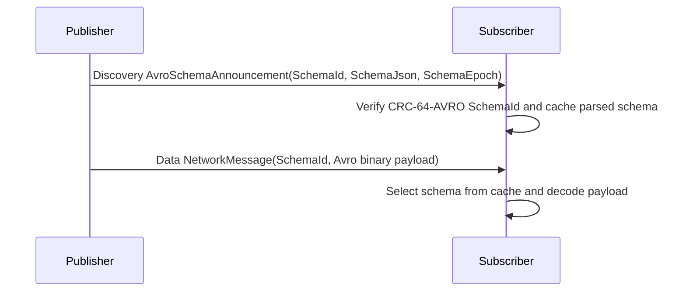
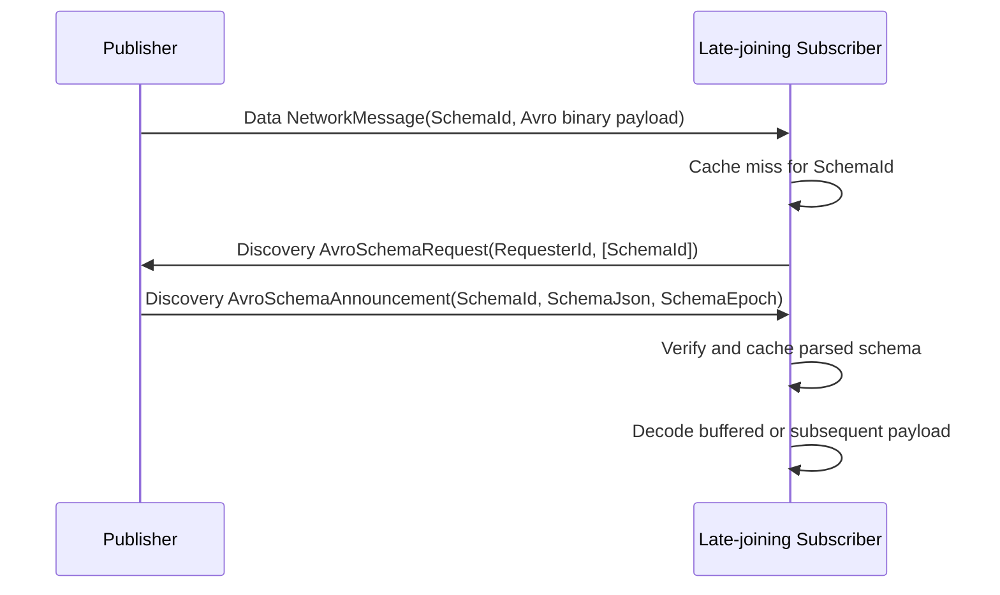
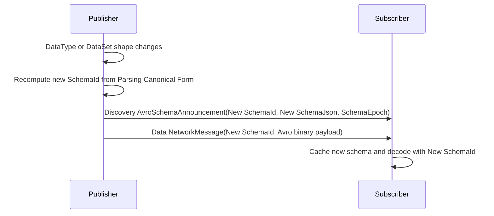

# OPC UA — Apache Avro Encoding

**Working draft — standalone companion specification**
**Companion to:** OPC 10000-6 (Mappings) and OPC 10000-14 (PubSub)
**Namespace:** `http://opcfoundation.org/UA/` (base OPC UA namespace)
**Version:** 0.1.0 · **Date:** 2026-07-22

> **Status — working draft.** This is a **single, self-contained** companion specification for the OPC UA **Default Avro** DataEncoding and its PubSub message mapping. It combines the two errata-style drafts — `OPC-UA-Part6-Avro-DataEncoding.md` (DataEncoding) and `OPC-UA-Part14-Avro-MessageMapping.md` (PubSub message mapping) — into one document and folds in the base OPC UA context a standalone reader needs. The errata-style drafts remain the authoritative statement of the proposed insertions into OPC 10000-6 and OPC 10000-14; this document is an alternative, combined presentation of the same normative content. Annex A is a snapshot of the generated per-type reference; the authoritative generator is `../extras/avro-encoding/tools/gen_type_reference.py`, run against the errata Part 6 draft.

---

## 1 Scope

This specification defines how the OPC UA data model is represented as **Apache Avro** binary data — both as a stand-alone **DataEncoding** for OPC UA values (a peer of the Binary, XML and JSON DataEncodings of OPC 10000-6) and as a **PubSub NetworkMessage / DataSetMessage message mapping** (a peer of the JSON message mapping of OPC 10000-14).

The DataEncoding part (§5–§7) covers all 25 Built-in DataTypes, Enumerations, OptionSets, Structures, Structures with optional fields, Union DataTypes, arrays, matrices, Variant, ExtensionObject, DataValue and DiagnosticInfo, and the deterministic schema generation, **SchemaId** fingerprint and decoder resolution that make the mapping reversible without carrying the schema in every payload. The message-mapping part (§8) covers data key and delta frames, Action invoke/response messages, Discovery messages, field representation according to `DataSetFieldContentMask`, message header fields, the SchemaId handshake, configuration parameters and transport content-type metadata for MQTT, AMQP and Kafka.

This specification does not define a new OPC UA Service, transport or security protocol, and does not change PubSub security, writer-group semantics or DataSet metadata semantics. It defines one canonical Avro form per DataType and requires `decode(encode(x)) == x` for every value of the described DataType.

## 2 Normative references

- [OPC 10000-3](https://reference.opcfoundation.org/specs/OPC-10000-3/) — Address Space Model, DataTypes and DataTypeDefinition.
- [OPC 10000-6 v1.05.07](https://reference.opcfoundation.org/specs/OPC-10000-6/) — Mappings (Binary, XML, JSON DataEncodings; the Default Avro DataEncoding is the subject of §5–§7).
- [OPC 10000-14 v1.05.06](https://reference.opcfoundation.org/specs/OPC-10000-14/) — PubSub (NetworkMessage / DataSetMessage model; the Avro message mapping is the subject of §8).
- [Apache Avro Specification](https://avro.apache.org/docs/) — Binary encoding, schemas, unions, records, arrays, fixed and logical types, Parsing Canonical Form and single-object encoding.

## 3 Terms, definitions and abbreviations

| Term | Definition |
|---|---|
| Avro binary encoding | The compact binary encoding defined by Apache Avro for a value written with a known Avro schema. |
| Default Avro | The OPC UA DataTypeEncoding for this mapping; the analogue of Default Binary, Default XML and Default JSON. |
| Canonical schema | The single Avro schema form generated for an OPC UA DataType by this specification. Equivalent alternative encodings are not allowed on the wire. |
| Parsing Canonical Form | The Apache Avro canonical text form of a self-contained schema over which the SchemaId fingerprint is computed. |
| SchemaId | The CRC-64-AVRO Rabin fingerprint of the Parsing Canonical Form of the self-contained schema; the 8 fingerprint bytes in little-endian order. It identifies the exact Avro schema needed to decode a payload and is independent of PubSub ConfigurationVersion. |
| Matrix | An OPC UA multi-dimensional array represented as row-major values plus a dimensions vector. |
| Reversible | Decoding an encoded value reconstructs the same OPC UA value, including null-vs-empty distinctions, unsigned integer bit patterns, NaN and signed zero. |
| RawData field | A DataSet field encoded with the Default Avro schema for the field DataType rather than Variant or DataValue wrapping. |

Key words **shall**, **should**, **may**, **shall not** are to be interpreted as in the ISO/IEC directives.

## 4 Overview

### 4.1 Use cases and motivation

The Binary, XML and JSON DataEncodings of OPC 10000-6 serve OPC UA clients and servers directly. Default Avro instead targets **PubSub integration with downstream systems that speak Apache Avro but not the OPC UA Binary encoding** — stream processors, data lakes, message-bus consumers and hot-path analytics pipelines. These systems increasingly ingest OPC UA telemetry, yet cannot decode UA Binary and gain little from the verbosity of JSON.

Default Avro lets a Publisher emit that telemetry in a compact binary form these consumers read **unchanged**, while preserving OPC UA semantics. The type information needed to interpret each value — DataTypes drawn from companion specifications and from a server's AddressSpace — is captured once in the Avro schema and shared out of band through a schema registry rather than repeated in every message, so a subscriber relates each field back to its OPC UA meaning without an OPC UA session. The encoding is therefore optimized for **high throughput and low resource consumption on the hot path**: small messages, no per-message schema, and a wire format that Avro toolchains decode natively. Where a consumer needs full OPC UA interoperability it still uses UA Binary; Default Avro is the bridge for Avro-native systems that could otherwise not consume OPC UA data at all.

### 4.2 Where Avro fits

OPC UA separates a **value's DataType** (its structure, from the DataTypeDefinition in the AddressSpace) from its **DataEncoding** (how that structure is serialized on the wire). OPC 10000-6 defines the Binary, XML and JSON DataEncodings; each is exposed as a **DataTypeEncoding** Object linked from the DataType with a `HasEncoding` reference. This specification adds **Default Avro** as a further DataTypeEncoding: a DataType that supports it shall gain a `Default Avro` encoding Object in the same pattern as `Default Binary`, `Default XML` and `Default JSON`. This draft describes that encoding; it does not assign or ship NodeIds for the encoding Objects.

Each OPC UA DataType maps to exactly **one** Avro schema (§5). Primitive built-ins use Avro primitives where the Avro type can carry the complete OPC UA domain; composite built-ins use Avro records; nullable OPC UA values use Avro unions with `"null"` as the first branch. The published `.avsc` schema documents are the canonical wire contract. The content type for a standalone Avro payload is `application/vnd.apache.avro`.

### 4.3 Schema identity and reversibility

Because Avro binary data is only interpretable with its schema, this mapping makes each schema **self-contained** (every referenced named type inlined at first use) and identifies it by a **SchemaId** — the CRC-64-AVRO Rabin fingerprint of the Avro Parsing Canonical Form (§6). The SchemaId lets producers and consumers agree on the exact schema without carrying it in every message: a single value may use Avro single-object framing (`0xC3 0x01` plus the 8-byte little-endian fingerprint), and PubSub messages carry the SchemaId in a header or transport metadata and resolve the schema out of band (§8.1, §8.5). The mapping is **reversible**: null-vs-empty distinctions, unsigned integer bit patterns, NaN payloads and signed zero all round-trip.

### 4.4 PubSub message model

For PubSub (§8), the Avro mapping represents the OPC 10000-14 message model — a **NetworkMessage** carrying one or more **DataSetMessage** records — as canonical Avro records rather than JSON objects. A DataSetMessage is a **key frame** (all DataSet fields, in FieldMetaData order) or a **delta frame** (only changed fields). Field representation follows `DataSetFieldContentMask` exactly as for the JSON mapping (Variant, DataValue or RawData). A receiver shall know the writer configuration and SchemaId before decoding, from configured PubSub metadata, a schema announcement, or a schema registry such as the one in `../schema-registry/OPC-UA-Schema-Registry.md`.

### 4.5 Endianness

Avro variable-length integers (zig-zag over a base-128 varint) are byte-order-neutral. The fixed-width Avro types used by this mapping — `float` and `double` — are **IEEE-754 little-endian**, the `fixed` used for Guid preserves the 16 OPC UA Guid bytes verbatim, and the 8-byte CRC-64-AVRO SchemaId is little-endian (the same order used by Avro single-object encoding). Annex D illustrates these layouts byte by byte.

## 5 Avro mapping

### 5.1 General rules

Avro records preserve OPC UA field order as defined by the DataTypeDefinition. Record field names shall be the OPC UA field names converted to legal Avro names by replacing non-name characters with `_` and prefixing `_` if required. The published `.avsc` schema documents are the canonical wire contract.

An encoder is not handed a foreign schema to encode against. Instead, encoding a value **produces** its schema deterministically from the OPC UA type model (§6.1). Where a Variant body form or an ExtensionObject concrete type has evolved, the encoder **grows** its own previous schema by appending the new union branch rather than starting over (§6.1, §6.4). Where no previous schema exists, the encoder creates a new schema from scratch, which begins a new MajorVersion of the DataSet (§6.4, §8.4.8). The CRC-64-AVRO fingerprint of the produced schema is the value's **SchemaId** (§6.3).

A **decoder** needs that schema to interpret the bytes. It resolves the schema by SchemaId from a registry or announcement, or re-derives it from the AddressSpace (§7). See Annex A for the generated reference schemas, example values and annotated bytes for each built-in and composite category.

Avro unions used for nullability shall be ordered as `["null", T]`, and the default value for optional fields shall be `null`. A null scalar, a null array, an empty array, a null array element and an absent optional structure field are distinct states and shall not be collapsed.

### 5.2 Built-in DataTypes

| OPC UA Built-in | Avro schema | Reversibility rule |
|---|---|---|
| Boolean | `boolean` | Direct mapping. |
| SByte | `int` | Value range is -128..127. |
| Byte | `int` | Value range is 0..255. |
| Int16 | `int` | Value range is -32768..32767. |
| UInt16 | `int` | Value range is 0..65535. |
| Int32 | `int` | Direct signed 32-bit mapping. |
| UInt32 | `int` | The same 32 bits are carried in Avro's signed `int`; values greater than `2^31-1` are decoded by unsigned reinterpretation. |
| Int64 | `long` | Direct signed 64-bit mapping. |
| UInt64 | `long` | The same 64 bits are carried in Avro's signed `long`; values greater than `2^63-1` are decoded by unsigned reinterpretation. |
| Float | `float` | IEEE-754 single precision, preserving NaN payloads supported by the Avro implementation and signed zero. |
| Double | `double` | IEEE-754 double precision, preserving NaN payloads supported by the Avro implementation and signed zero. |
| String | `["null", "string"]` | `null` and empty string are distinct. |
| DateTime | `long` | Raw signed 100 ns ticks since 1601-01-01 UTC. Avro timestamp logical types shall not be used because they lose epoch and/or precision. |
| Guid | `fixed` size 16 with logical type `opcua-guid` | The 16 OPC UA Guid bytes are preserved exactly. |
| ByteString | `["null", "bytes"]` | `null` and zero-length bytes are distinct. |
| XmlElement | `["null", "string"]` | XML text is not normalized. `null` is distinct from empty XML text. |
| NodeId | `record NodeId` | Fields: namespace Int32, idType enum/int, and exactly one identifier member: numeric UInt32-as-long, string, guid fixed16, or opaque bytes. A field of type NodeId MAY instead use the textual `string` form of §5.2.1. |
| ExpandedNodeId | `record ExpandedNodeId` | Fields: NodeId, nullable namespaceUri, serverIndex UInt32-as-long. A field of type ExpandedNodeId MAY instead use the textual `string` form of §5.2.1. |
| StatusCode | `int` | The UInt32 status bits are carried in signed `int` and reinterpreted unsigned on decode. |
| QualifiedName | `record QualifiedName` | Namespace UInt16-as-int and nullable name string. |
| LocalizedText | `["null", record LocalizedText]` | Locale and text are independently nullable strings. |
| ExtensionObject | `record ExtensionObject` | TypeId NodeId plus nullable body union as described in §5.8. |
| DataValue | `record DataValue` | Optional members as described in §5.10. |
| Variant | `record Variant` | Recursive typed body as described in §5.7. |
| DiagnosticInfo | `record DiagnosticInfo` | Recursive optional members as described in §5.11. |

#### 5.2.1 Textual NodeId and ExpandedNodeId form

A schema generator MAY represent a NodeId or ExpandedNodeId field as Avro `string` instead of the `record NodeId` / `record ExpandedNodeId` of §5.2. The choice is fixed in the schema and is therefore part of the SchemaId (§6.3): a given field is either always structured or always textual, never both. Both representations are conformant and losslessly reversible; a columnar or registry consumer may prefer the string form because a NodeId is then a single Avro `string` value rather than a nested record.

When the field type is `string`, the value shall use the canonical OPC UA textual syntax of *OPC 10000-6* (the syntax used by the XML and JSON encodings):

- **NodeId** — `[ns=<namespaceindex>;]<t>=<identifier>`, where `<t>` is `i` for a numeric identifier (decimal UInt32), `s` for a String identifier, `g` for a Guid in the canonical hyphenated 8-4-4-4-12 form, or `b` for a ByteString identifier in standard base64. The `ns=` prefix is omitted when the namespace index is 0. The `s=` String identifier is the final component and is taken verbatim to the end of the string, so it needs no escaping and MAY itself contain `;` or `=`.
- **ExpandedNodeId** — `[svr=<serverindex>;][nsu=<namespaceuri>;]<nodeid-text>`. `svr=` appears only when the server index is non-zero. `nsu=<namespaceuri>`, when present, carries the NamespaceUri and is terminated by the following `;`; the NamespaceUri is authoritative and the trailing `<nodeid-text>` keeps its own `ns=` index (which MAY be 0 and is retained, so a value that carries both a namespace index and a NamespaceUri round-trips). Because `;` terminates the `nsu=` value, the textual form is only used when the NamespaceUri contains no `;`; a NamespaceUri that contains `;` shall use the structured `record ExpandedNodeId`, which represents any NamespaceUri losslessly.

A `string`-typed NodeId or ExpandedNodeId field that is nullable uses the `["null", "string"]` union; a null value is distinct from the empty string. An encoder and decoder shall round-trip every identifier kind — numeric, String, Guid and opaque — and, for ExpandedNodeId, a value that carries a namespace index together with a NamespaceUri, without loss.

### 5.3 Enumerations and OptionSets

An OPC UA Enumeration shall be encoded as Avro `int` containing the numeric Int32 value. An OptionSet shall also be encoded as Avro `int` or `long` according to its declared bit size, with each bit preserved. Symbolic Avro enum labels are useful for documentation but shall not replace the numeric value on the wire because OPC UA permits forward-compatible unknown values and bit combinations.

### 5.4 Arrays

A one-dimensional OPC UA array of element type `T` shall be encoded as `["null", {"type":"array","items":T}]` when the array value itself is nullable. If the element can be null, the item schema shall be `["null", T]`; otherwise it shall be `T`. Encoders shall preserve an empty array as an array with zero items, not as `null`.

### 5.5 Matrices

A matrix shall be encoded as a record with fields `dimensions` and `values`: `{ "dimensions": {"type":"array","items":"int"}, "values": {"type":"array","items": <element-or-null>} }`. Values are row-major. An OPC UA matrix has **at least two dimensions**, and the product of dimensions shall equal the length of `values`. A decoder **shall reject**, with `Bad_DecodingError`, a matrix whose `dimensions` has fewer than two entries or whose dimension product does not equal the length of `values`. A null matrix is the null branch of `["null", MatrixRecord]` and is distinct from a present matrix record.

### 5.6 Structures and optional fields

A plain Structure shall be an Avro record with one field per OPC UA field. A StructureWithOptionalFields shall use an outer optional-field wrapper for each optional field: `["null", {"type":"record","name":"<Structure>_<Field>_Optional","fields":[{"name":"value","type":T}]}]` with default `null`. The outer null means the OPC UA optional field is absent. A present wrapper whose `value` is null means the field is present with a null value, when `T` itself is nullable. Mandatory fields whose type is nullable, such as String, still carry their own null union and shall be present in the record.

### 5.7 Union DataTypes

An OPC UA Union DataType shall be encoded canonically as an Avro record with `switch` and `value`. The `switch` field is `["null", "string"]` and contains the selected OPC UA field name, or null for the null union. The `value` field is an Avro union of null plus record-wrapped branches, one branch per union field. Each branch record contains exactly one field with the OPC UA field name and field type, including that type's null branch when the selected field type is nullable. The record wrapper is required so Avro union branch resolution is deterministic even when two union fields have the same Avro primitive type.

### 5.8 Variant

Variant shall be a record carrying `builtInType`, nullable `dimensions`, and `body`. A null Variant has `builtInType = 0`, `dimensions = null`, and `body = null`. A scalar body uses one record-wrapped Avro union branch for the selected built-in body type. A one-dimensional array body uses the corresponding `Array` wrapper. A matrix body uses the corresponding Matrix wrapper and sets `dimensions`.

The `body` union excludes nested Variant, DataValue and DiagnosticInfo. Its member set is the set of body types the Variant may carry. A self-describing encoding may include the full set of built-in body types, including ExtensionObject. A schema-governed encoding may instead narrow the union to the aggregated set for the field and grow it across MinorVersions under the append-only rule of the Schema Registry (see *OPC UA — Schema Registry* §5.6). An existing branch therefore keeps its Avro union branch index in every later minor of the same major. The branch wrappers and the `builtInType` field are both present so that decoders can disambiguate Avro unions and recover the exact OPC UA type.

By default the Variant record is specialized per field, so that each Variant field's `body` union grows independently. A single shared Variant record is an option (§6.6).

### 5.9 ExtensionObject and abstract or subtyped fields

ExtensionObject shall be a record `{ "typeId": NodeId, "body": ["null", <known-struct-records...>, <opaque fallback branches...>] }`. The opaque fallback branches are `"bytes"` for a Binary body and `"string"` for an XML or textual body. The `typeId` shall identify the concrete DataType or DataTypeEncoding NodeId.

If the concrete structured DataType is known to the decoder, the body shall use that record branch. If the type is unknown but the sender has an opaque encoded representation, the body may use the `bytes` branch for a Binary body or the `string` branch for an XML or textual body. In that case the receiver shall preserve the opaque value together with the TypeId. Fields declared as abstract structures, and fields that allow subtypes, shall use the same representation so that the concrete runtime type is carried inline.

The `known-struct` branches are the aggregated concrete-type set for the field. They are derived deterministically from the OPC UA type model — the subtype hierarchy of the field's abstract DataType — and ordered by that derivation. Where the hierarchy is bounded, the branches are generated from it. Otherwise they grow append-only across MinorVersions as new concrete types are encoded, and an existing branch keeps its Avro union branch index. An encoder therefore computes each body-union branch index from the type model alone. The Schema Registry (see *OPC UA — Schema Registry* §5.6) shares the resulting schema with decoders, but is never consulted in order to encode.

The opaque fallback branches are appended append-only alongside the known-struct branches when a value first requires them. A fallback may therefore occupy any branch index, and its index is fixed once appended. A fallback carries any body not represented by a known-struct branch.

By default the ExtensionObject record is specialized per field, so that each field's known-struct union grows independently. A single shared ExtensionObject record is an option (§6.6).

### 5.10 DataValue

DataValue shall be an Avro record with fields `value`, `status`, `sourceTimestamp`, `sourcePicoseconds`, `serverTimestamp`, and `serverPicoseconds`, each nullable and defaulting to null. The `value` field is a nullable Variant. StatusCode uses the UInt32-as-signed-int rule. Timestamps use raw DateTime ticks. Picoseconds use Avro `int` and retain the OPC UA UInt16 domain.

### 5.11 DiagnosticInfo

DiagnosticInfo shall be an Avro record with nullable fields `symbolicId`, `namespaceUri`, `locale`, `localizedText`, `additionalInfo`, `innerStatusCode`, and `innerDiagnosticInfo`. `innerDiagnosticInfo` is a recursive reference to DiagnosticInfo. Null means the corresponding mask bit is not present; zero is a present numeric value and shall not be treated as absent.

## 6 Deterministic schema generation and SchemaId

Schema generation is a deterministic function of the OPC UA type model. Encoding a value **produces** its schema by this function, and the schema's CRC-64-AVRO fingerprint is the **SchemaId** that identifies it (§6.3). The encoder is never handed a schema — it derives one from the type model as it encodes; the same function lets a publisher compute the SchemaId it announces, and lets a decoder that lacks a shared schema produce one (§7).

### 6.1 Inputs

The inputs to schema generation are the OPC UA DataTypeDefinition of the value's declared DataType and, for Variant values and for fields declared as abstract or allowing subtypes, the concrete runtime built-in type or concrete structured DataType of the value. When a schema is **grown** rather than created from scratch, the **previous schema of the lineage is also an input**: the generator appends the newly encountered Variant body form or ExtensionObject concrete type to that prior schema as an additional union branch (§6.4), leaving every existing branch at its index. When **no previous schema is supplied, generation starts a fresh lineage — a reset that begins a new MajorVersion** (§6.4, §8.4.8). An **encoder** produces the schema from these inputs as it encodes the value; it is not handed a foreign schema to encode against. A **decoder** that re-derives a schema uses the identical inputs: the DataTypeDefinition read from the AddressSpace and, where present, the inline Variant built-in type or ExtensionObject TypeId. Because both sides derive from one deterministic type model — and, for a grown lineage, the shared previous schema — they agree on every record, union branch and branch order.

### 6.2 Generation algorithm

The schema generator shall apply the following deterministic algorithm.

1. Resolve the DataTypeDefinition and all recursively referenced DataTypes. Built-in DataTypes use the mappings in §5.2. Enumerations and OptionSets use the numeric representation in §5.3.
2. Assign Avro names by converting OPC UA DataType and field names to legal Avro names: replace each character outside `[A-Za-z0-9_]` with `_`; if the first character is not `[A-Za-z_]`, prefix `T_`. Names in the base namespace use Avro namespace `org.opcfoundation.ua.avro`. Growing Variant/ExtensionObject records and the containers that hold them are named per field by default (§6.6).
3. Emit record fields in exactly the DataTypeDefinition field order. The generator shall not sort fields, omit disabled optional fields from the schema, or reorder union branches for local convenience.
4. For nullable values, emit an Avro union ordered as `["null", T]` and set the default to `null` where Avro requires a default. Mandatory nullable fields remain mandatory record fields whose value type is nullable.
5. For StructureWithOptionalFields, emit one nullable wrapper record per optional field, named `<Structure>_<Field>_Optional`, with a single `value` field. The wrapper null means absent; a non-null wrapper whose value is null means present-null.
6. For Union DataTypes, emit a record with `switch` and `value`. The `value` union starts with null and then one single-field branch record for each union field in DataTypeDefinition order.
7. For arrays, emit an Avro array whose item schema is nullable only when the element type can carry null. For matrices, emit a record with `dimensions` as an array of Avro `int` and `values` as the row-major Avro array of elements.
8. For Variant, abstract fields, and fields allowing subtypes, carry the runtime type inline: Variant carries `builtInType`, dimensions and one record-wrapped body branch; abstract or subtyped structured values use ExtensionObject TypeId and the concrete body branch. The same runtime type information is used by encoder and decoder to choose the schema branch.
9. Before computing a SchemaId or announcing a schema, make the schema self-contained: inline every referenced named type at its first occurrence, using the recursively resolved definitions from step 1; for recursive or repeated named types, use Avro named references after the first definition.

The canonical form used for SchemaId shall be the Apache Avro Parsing Canonical Form of that self-contained schema. The **SchemaId** shall be the CRC-64-AVRO Rabin fingerprint of the Parsing Canonical Form bytes, represented as the 8 fingerprint bytes in little-endian hexadecimal. This is the same byte order used by Avro single-object encoding (`0xC3 0x01` followed by the 8-byte little-endian Rabin fingerprint).

### 6.3 SchemaId use

A producer shall recompute the SchemaId from the self-contained canonical schema before writing a value or message. Two schemas with different field order, optional-field wrappers, union branch order, runtime Variant body type, matrix record shape, or referenced concrete structured DataType definition shall have different SchemaIds. A consumer shall treat the SchemaId as identifying the exact self-contained Avro Parsing Canonical Form, not merely a DataType NodeId or a PubSub ConfigurationVersion.

### 6.4 Implementing schema evolution (growing unions)

The Variant body-type union (§5.8) and the ExtensionObject known-struct union (§5.9) are the only two Avro unions that may grow after a schema is first announced; every other union is closed. An implementer that governs an evolving schema shall grow these two unions **append-only**, as defined by *OPC UA — Schema Registry* §5.6, using the following procedure.

1. **Narrow the initial union.** Prefer to build the initial (`MAJOR.0`) union **data-driven**, from the concrete type of the first value the field actually encodes: a Variant carrying an `Int32` scalar starts `["null", "VariantInt32Scalar"]`; an ExtensionObject whose first body is a `Point` starts `["null", "Point"]`; an opaque first body starts `["null", "bytes"]`. The concrete body type stands in place of the abstract Variant/ExtensionObject, unioned with `null`, and the union is grown at that position (steps 2–3) as later values carry types not yet present. The encoder MAY instead seed the union **schema-driven** from the declared bound — for a Variant field whose declared DataType constrains the allowed body types, exactly those `Variant<Type>Scalar`, `Variant<Type>Array` and `Variant<Type>MatrixBody` branches; for an ExtensionObject or abstract/subtyped field, the record branch of every concrete subtype known from the AddressSpace or schema registry, in canonical order — where a schema is needed before the first message or where cross-publisher determinism is required (see *OPC UA — Schema Registry* §5.6).

2. **Grow append-only.** When a value selects a body type or concrete struct type not yet present, **append** the corresponding branch record to the end of the Avro union array and leave every existing branch at its current position. Because an Avro binary union is encoded as the zig-zag branch index followed by the branch value, appending never changes an existing branch index, so a message written under an earlier schema still selects the same branch under the grown schema. Do not reorder, remove or retype an existing branch; any such change is a MajorVersion reset, not an aggregation.

3. **Append the opaque fallback like any other branch.** An ExtensionObject body that cannot be represented as a known-struct record is carried in an opaque fallback branch — `"bytes"` for a Binary body, or `"string"` for an XML or textual body. A fallback branch is **appended** when a value first requires it, exactly like a known-struct branch (step 2); it is not reserved at a fixed index and may therefore occupy any position. For example a body union may grow `["null", <Struct>]` → `["null", <Struct>, "bytes"]` → `["null", <Struct>, "bytes", <Struct'>]`. Because every branch is append-only, a fallback's index is fixed once appended, so an opaque body written under an earlier minor still decodes to the same fallback branch under a grown schema.

4. **Recompute the SchemaId, publish and announce.** Each grown union is a new self-contained schema; recompute the CRC-64-AVRO SchemaId per §6, advance the DataSet `ConfigurationVersion` MinorVersion, then **publish the new schema to subscribers — both by registering it in the Schema Registry (*OPC UA — Schema Registry* §5.2) and by re-announcing the schema and SchemaId over the Part 14 handshake (§8.4)** — before sending a message that uses the appended branch.

5. **Decode with the latest minor.** A decoder that holds the latest minor of a lineage decodes every earlier-minor message of that lineage directly, because reading the branch index resolves to the same branch. A decoder that lacks the exact writer SchemaId may decode with a later minor of the same lineage after confirming, from the registry or announced lineage, that the on-wire SchemaId is an earlier minor of it (Schema Registry §7, §8); it shall not compare the on-wire fingerprint against the later schema's canonical form.

An executable reference of this procedure — narrow schema, append-only growth (including opaque fallbacks appended at any position), latest-minor-decodes-older and distinct per-minor SchemaIds — is `../extras/avro-encoding/tools/evolution_demo.py`, and a fully worked lineage with concrete schemas, per-minor SchemaIds and a backward-compatible decode is in Annex C. See *OPC UA — Schema Registry* §5.6 for the full model, including the data-driven-first (or schema-driven) initial basis and the lineage/SchemaId relationship.

### 6.5 NamespaceUri to Avro namespace mapping

Avro schema names generated from the base OPC UA namespace use the Avro namespace `org.opcfoundation.ua.avro`. Types generated from any other OPC UA NamespaceUri — a companion specification or a vendor namespace — shall be placed in an Avro namespace derived from that NamespaceUri by the following deterministic function, so that an encoder and a decoder compute the same fully-qualified Avro names.

Given a NamespaceUri:

1. **Parse the URI.** Take its authority (host) and its path. A NamespaceUri that is not an absolute URI with an authority (for example a bare URN) skips steps 2–3 and applies step 4 to its scheme-specific part split on `:` and `/`.
2. **Reverse the authority.** Split the host on `.`, reverse the labels and join them with `.`; `example.org` becomes `org.example`. Any port, userinfo or trailing dot is removed before reversal.
3. **Append the path.** Split the path on `/`, drop empty segments, and append them in order; `/UA/Line3/` becomes `.ua.line3`.
4. **Make each part a legal Avro name.** Lower-case the whole result; replace every character outside `[a-z0-9_]` with `_`; if any resulting part is empty or begins with a digit, prefix that part with `_`. Each URI segment maps to exactly one Avro name part.
5. **Append the reserved suffix.** Append the reserved final part `avro`, so the namespace ends in `.avro` — for example `org.example.ua.line3.avro`. Encoders shall not generate any other namespace ending in `.avro`, and shall not map the base OPC UA namespace through this function (it keeps its fixed `org.opcfoundation.ua.avro` namespace).

**Conflicts.** All Avro namespaces generated in one schema-generation scope shall be distinct. Map every NamespaceUri by steps 1–5; the resulting natural namespaces are reserved. If two or more distinct NamespaceUris map to the same natural namespace, order them by ordinal Unicode code-point order of the original URI string and leave the first with the natural namespace; for each subsequent colliding URI append an incrementing ordinal `_2`, `_3`, … to the last name part (the part before the reserved `avro`) and, if that candidate is already reserved by any other mapping in the scope, keep advancing the ordinal until it is free — for example `org.example.ua.line3.avro` and `org.example.ua.line3_2.avro`. Because every natural namespace is reserved up front, a suffixed name can never coincide with another URI's natural namespace, so a producer and consumer that share the same set of NamespaceUris derive the same distinct namespaces. A deployment may instead supply an explicit configured NamespaceUri→Avro-namespace mapping that overrides this function for the mapped URIs; the configured targets shall still be distinct and end in `.avro`.

The generated Avro namespace is part of the fully-qualified type name and therefore of the Parsing Canonical Form, so it participates in the SchemaId (§6.3).

### 6.6 Per-field specialization of Variant and ExtensionObject

The `body` union of a Variant (§5.8) and the known-struct union of an ExtensionObject (§5.9) are the only Avro constructs that grow (§6.4). A schema generator shall choose, once per schema and as part of the SchemaId, between two ways of naming these growing records.

**Per-field (preferred).** Each Variant occurrence, each ExtensionObject occurrence, and each container record that transitively contains one — a Structure with such a field, or a DataValue (whose `value` is a Variant) — is a **distinct** Avro record named by its **field path** from the DataSet field root, for example `Variant<Path>`, `ExtensionObject<Path>` and `<Structure><Path>`. The path is formed from the DataSet field browse name followed, on each descent, by the struct field name, the concrete body Structure name for an ExtensionObject body branch, or `Item` for an array or matrix element; each component is converted to a legal Avro name part (§6.2 step 2) and the parts are joined with `_`. Every record fullname in a self-contained schema shall be unique: a generated name that would collide with any other name in that schema — another field path, a wrapper record, or an OPC UA type mapped per §6.2 — is disambiguated with a deterministic ordinal suffix (`_2`, `_3`, …) assigned in field order over the complete set of names in the schema-generation scope. Because each occurrence is a separate record with its own union, the fields **evolve independently**: appending a body type or concrete struct type to one field's union never changes any other field's schema. A record with no Variant/ExtensionObject descendant — for example a Structure of only fixed built-in fields — is **not** specialized and keeps its shared §6.2 name, so specialization is limited to the records that actually grow.

Because a Variant body may itself be an ExtensionObject whose Structure contains a Variant, a **bounded** (schema-driven, all-admissible-types) union can recurse without end. Cycle-tying applies only where continued expansion would revisit the **same** recursive DataType occurrence already open on the ancestor path — a Variant or ExtensionObject whose admissible type set would reproduce that of an ancestor, or a self-recursive type such as DiagnosticInfo: the recursive occurrence shall then **reference the nearest such ancestor's record by name** rather than expand further, which keeps the schema finite. An ordinary nested Variant or ExtensionObject whose admissible set differs from every ancestor is **not** tied and remains separately specialized. A data-driven schema (§6.4) includes only observed types and therefore terminates naturally at the nesting depth observed; cycle-tying thus affects only bounded schema-driven unions.

**Shared (option).** A generator MAY instead emit a single shared `Variant` and a single shared `ExtensionObject` record (and shared container records) named per §6.2, referenced by every occurrence. This is more compact and lets two publishers that bound a field the same way produce the same SchemaId, at the cost of coupling: appending a body type for any occurrence widens the one shared union for every occurrence. The shared form is the form used by the published reference schemas and Annex A; the per-field form is shown in Annex C.

An encoder and decoder shall use the same choice; because it is fixed in the schema it participates in the SchemaId (§6.3). Both forms are reversible and both grow append-only (§6.4); they differ only in whether growth is per-field or shared. This mirrors the Arrow mapping, whose inline structural dense unions are per-field by construction. An executable per-field reference is `../extras/avro-encoding/tools/per_field_demo.py`.

## 7 Decoder schema resolution

A decoder shall use one of the following schema resolution paths.

**Schema-driven path.** If the decoder already has a schema for the SchemaId, from a local cache, announcement, schema registry or configured catalog, it shall parse that schema and decode the Avro binary payload directly. If the payload uses Avro single-object encoding, the decoder shall verify the two magic bytes and the embedded little-endian Rabin fingerprint before decoding the body.

**AddressSpace-driven path.** If the decoder does not have a schema body but can read the DataType from the server, it shall read the DataTypeDefinition and recursively referenced definitions from the AddressSpace and run the same schema-generation function defined in §6. For Variant and abstract/subtyped fields, it shall use the inline built-in type, dimensions and TypeId carried in the value to select the same concrete branch as the encoder. The re-derived self-contained Parsing Canonical Form shall produce the same SchemaId. When this check fails, the value shall not be decoded with the mismatched schema.

The encoder writes bytes from the type model. In the **primary use case the decoder — a subscriber or downstream Avro consumer — likely does not have the OPC UA type model or DataTypeDefinitions at consumption time**; the type model may live elsewhere but is unavailable where the value is decoded, so the decoder cannot re-derive the schema and instead **obtains the shared schema by SchemaId** (from a registry, announcement or cache) and uses it to decode. Only where a decoder does hold the relevant DataTypeDefinitions — the AddressSpace-driven path above — may it re-derive the schema instead of receiving it; the SchemaId is then sufficient to verify that both sides **are using** the same schema.

**Textual NodeId fields.** The Avro schema alone determines the NodeId/ExpandedNodeId representation: where a NodeId or ExpandedNodeId field's schema type is `string`, the decoder shall parse the OPC UA textual syntax of §5.2.1; where it is the `record NodeId` / `record ExpandedNodeId`, the decoder shall decode structurally. A decoder shall not infer the textual form from the value; it follows the field's declared Avro type.

## 8 PubSub message mapping

This clause maps the OPC 10000-14 PubSub message model onto Default Avro: NetworkMessages carrying DataSetMessages (§8.1, §8.2), Action and Discovery messages (§8.3), the SchemaId handshake that lets a receiver obtain the schema before decoding (§8.4), the configuration parameters that select the mapping (§8.5), and the transport content types that identify an Avro payload (§8.6). It applies on top of the value encoding of §5–§7 and mirrors the OPC 10000-14 message mapping structure used by the JSON mapping.

### 8.1 NetworkMessage

An Avro NetworkMessage is a **fixed envelope** whose Avro record schema is defined by this specification and does **not** vary with the DataSets it carries. Because a NetworkMessage may, over its lifetime, carry any DataSet its WriterGroup is configured for, an envelope schema that inlined every DataSet's fields would be the union of all of them and would change whenever the group's configuration changed. Instead the envelope carries each DataSetMessage **opaquely**: the `payload` is an array of entries, each `{ "schemaId": bytes, "dataSetMessage": bytes }`, where `dataSetMessage` is the Avro-binary encoding of the DataSetMessage (§8.2) under **its own** DataSet schema, identified by the entry's `schemaId`. The envelope record therefore has a **stable, specification-defined schema** — and thus a fixed SchemaId — that never changes as DataSets are added, removed or evolved.

The envelope record has the selected PubSub header fields as nullable Avro fields. Fields disabled by the NetworkMessageContentMask are null. The following envelope fields are defined: PublisherId, DataSetClassId, GroupHeader fields, WriterGroupId, GroupVersion, NetworkMessageNumber, SequenceNumber, Timestamp, PicoSeconds, PromotedFields, and the Payload array of `{ schemaId, dataSetMessage }` entries. When promoted fields are enabled, their values use Default Avro DataEncoding and preserve their configured DataTypes.

The fixed envelope is a published artifact. Its generated schema is `../extras/avro-encoding/schemas/AvroNetworkMessage.avsc`, and each payload entry is `../extras/avro-encoding/schemas/AvroDataSetPayloadEntry.avsc`. Both are reproduced in Annex B.

A receiver decodes the envelope with the fixed envelope schema, then decodes each entry's opaque `dataSetMessage` with the per-DataSet schema resolved by the entry's `schemaId` (§8.4). This makes the outer envelope a stable, published contract and confines schema evolution to the per-DataSet schemas.

**Single DataSet and un-enveloped batches.** Where a transport carries a **single** DataSetMessage without a NetworkMessage wrapper (by explicit configuration), the payload is that DataSetMessage's Avro-binary encoding directly, identified by the DataSet `schemaId` carried in the DataSetMessage header, transport metadata, or Avro single-object framing (§8.4.1). A **batch** of DataSetMessages without an envelope is the same `{ schemaId, dataSetMessage }` entry array as the envelope `payload`, carried directly by the transport. In every case a DataSet payload is decoded only through its per-DataSet schema. The un-enveloped batch is likewise a published artifact: its generated schema is `../extras/avro-encoding/schemas/AvroDataSetMessageBatch.avsc`, reproduced in Annex B.

### 8.2 DataSetMessage

#### 8.2.1 Common header

Each Avro DataSetMessage shall carry DataSetWriterId, DataSetMessage type, ConfigurationVersion, SequenceNumber, Status, Timestamp, PicoSeconds, optional SchemaId and message flags according to the DataSetMessageContentMask. Disabled header fields shall be nullable and default to null in the canonical schema. DataSetWriterId and message type are mandatory because they select the DataSetMetaData and frame interpretation. Each DataSetMessage is identified by its own DataSet SchemaId, carried in the enclosing NetworkMessage payload entry (§8.1) or, for an un-enveloped DataSetMessage, in the header, transport metadata, or single-object framing.

#### 8.2.2 Data key frame

A data key frame shall contain all fields defined by the PublishedDataSet in FieldMetaData order. The Avro payload field is an array or record whose members correspond exactly to that order. A key frame is self-contained for the current ConfigurationVersion.

Every field slot in the payload is **nullable** (§8.2.4). A DataSet may be **sparse** — a given DataSetMessage need not carry a value for every key. A sparse frame uses the **same** canonical schema as a full key frame: the field set and its FieldMetaData order are unchanged, and a key that has no value in this message is encoded as its `null` branch, a **`null:null`** value (the null union branch carrying null). A decoder shall treat a `null:null` field as **missing** — no value for that key in this message — not as a present null value. Because the schema is identical whether a frame carries all keys or only a subset, the SchemaId does not change with sparsity, and no per-subset schema is generated.

#### 8.2.3 Data delta frame

A data delta frame shall contain only changed fields. Each changed field entry shall carry the field index or field name and the encoded value. The canonical Avro representation is an array of records `{ "fieldIndex": int, "fieldName": ["null","string"], "value": FieldValue }`; fieldIndex is the normative selector and fieldName is optional diagnostic metadata when configured.

#### 8.2.4 Field representation and DataSetFieldContentMask

If the DataSetFieldContentMask selects StatusCode, timestamps or picoseconds, the field shall be encoded as a DataValue using the Default Avro DataValue mapping. If it selects Value wrapped as Variant, the field shall be encoded as a Variant. If RawData is selected, the field shall be encoded directly with the published Default Avro `.avsc` schema for the FieldMetaData DataType, including array dimensions, nullable element rules, and optional-field wrapper records. RawData shall not be used when the field DataType is not known to the receiver schema.

Every field slot shall be **nullable**: the field's Avro type is a union with a `null` branch. For a Variant or ExtensionObject field this is the `null` branch already present in its growing union (§6.4); for a DataValue or RawData field the value type shall be wrapped as `["null", <fieldType>]` so that the key can be omitted.

A `null:null` value (the `null` branch carrying null) shall be used both for a genuinely null field value and for a **missing** key in a sparse DataSet (§8.2.2); a decoder treats a `null:null` field as carrying no value for that key. This is distinct from a **delta** frame (§8.2.3), where a field that is simply *absent from the delta array* means *unchanged*, not null; a delta field that is present carries its `value` encoded per this clause and may itself be `null:null`. Because every field slot is nullable, a sparse key frame and a full key frame share one canonical schema and therefore one SchemaId.

### 8.3 Action and Discovery messages

Data NetworkMessages use the records of §8.1 and §8.2. This clause additionally defines the Avro Action and Discovery message envelopes, which parallel the JSON message mapping.

#### 8.3.1 Action messages

Actions are Methods invoked via PubSub. An Avro Action NetworkMessage contains one or more Action request or Action response DataSetMessages. Request and response traffic shall not be mixed in one envelope. The same SchemaId handshake defined in §8.4 applies: Action request and response schemas are announced, cached and selected by SchemaId exactly like data-message schemas.

The published request envelope schema is `../extras/avro-encoding/schemas/AvroActionRequestNetworkMessage.avsc`:

```json
{
  "fields": [
    {
      "name": "PublisherId",
      "type": [
        "null",
        "string"
      ]
    },
    {
      "name": "WriterGroupId",
      "type": "int"
    },
    {
      "name": "NetworkMessageNumber",
      "type": "int"
    },
    {
      "name": "SequenceNumber",
      "type": "int"
    },
    {
      "name": "Timestamp",
      "type": "long"
    },
    {
      "name": "Messages",
      "type": {
        "items": [
          "null",
          "org.opcfoundation.ua.avro.AvroActionRequestDataSetMessage"
        ],
        "type": "array"
      }
    },
    {
      "name": "SchemaId",
      "type": [
        "null",
        "string"
      ]
    }
  ],
  "name": "AvroActionRequestNetworkMessage",
  "namespace": "org.opcfoundation.ua.avro",
  "type": "record"
}
```

The published request DataSetMessage schema is `../extras/avro-encoding/schemas/AvroActionRequestDataSetMessage.avsc`:

```json
{
  "fields": [
    {
      "name": "ActionTargetId",
      "type": [
        "null",
        "org.opcfoundation.ua.avro.NodeId"
      ]
    },
    {
      "name": "RequestId",
      "type": [
        "null",
        "string"
      ]
    },
    {
      "name": "CorrelationData",
      "type": [
        "null",
        "bytes"
      ]
    },
    {
      "name": "InputArguments",
      "type": {
        "items": [
          "null",
          "org.opcfoundation.ua.avro.Variant"
        ],
        "type": "array"
      }
    }
  ],
  "name": "AvroActionRequestDataSetMessage",
  "namespace": "org.opcfoundation.ua.avro",
  "type": "record"
}
```

The published response envelope schema is `../extras/avro-encoding/schemas/AvroActionResponseNetworkMessage.avsc`:

```json
{
  "fields": [
    {
      "name": "PublisherId",
      "type": [
        "null",
        "string"
      ]
    },
    {
      "name": "WriterGroupId",
      "type": "int"
    },
    {
      "name": "NetworkMessageNumber",
      "type": "int"
    },
    {
      "name": "SequenceNumber",
      "type": "int"
    },
    {
      "name": "Timestamp",
      "type": "long"
    },
    {
      "name": "Messages",
      "type": {
        "items": [
          "null",
          "org.opcfoundation.ua.avro.AvroActionResponseDataSetMessage"
        ],
        "type": "array"
      }
    },
    {
      "name": "SchemaId",
      "type": [
        "null",
        "string"
      ]
    }
  ],
  "name": "AvroActionResponseNetworkMessage",
  "namespace": "org.opcfoundation.ua.avro",
  "type": "record"
}
```

The published response DataSetMessage schema is `../extras/avro-encoding/schemas/AvroActionResponseDataSetMessage.avsc`:

```json
{
  "fields": [
    {
      "name": "ActionTargetId",
      "type": [
        "null",
        "org.opcfoundation.ua.avro.NodeId"
      ]
    },
    {
      "name": "RequestId",
      "type": [
        "null",
        "string"
      ]
    },
    {
      "name": "CorrelationData",
      "type": [
        "null",
        "bytes"
      ]
    },
    {
      "name": "Status",
      "type": "int"
    },
    {
      "name": "OutputArguments",
      "type": {
        "items": [
          "null",
          "org.opcfoundation.ua.avro.Variant"
        ],
        "type": "array"
      }
    },
    {
      "name": "DiagnosticInfos",
      "type": {
        "items": [
          "null",
          "org.opcfoundation.ua.avro.DiagnosticInfo"
        ],
        "type": "array"
      }
    }
  ],
  "name": "AvroActionResponseDataSetMessage",
  "namespace": "org.opcfoundation.ua.avro",
  "type": "record"
}
```

`InputArguments` and `OutputArguments` use Variant so each argument keeps its OPC UA BuiltInType, dimensions and null state. If a deployment elects to carry argument status and timestamps, the DataSetFieldContentMask may instead select DataValue and the derived Action schema shall use `DataValue` for the argument array item type. MQTT Action request and response publications use the existing `action-request` and `action-response` topic conventions from Part 14 with MQTT 5 `ContentType` set to `application/vnd.apache.avro; opcua=pubsub; encoding=binary`.

#### 8.3.2 Discovery messages

Discovery messages are encoded as Avro records and published with the same content type. The schemas generated by this draft are intentionally reduced, faithful shapes for the fields needed to prove the mapping. Full base OPC UA structures that are not locally modelled in this extension are represented as reduced records or `ExtensionObject` fallbacks:

| Part 14 discovery concept | Published Avro schema | Reduced-shape or fallback decision |
|---|---|---|
| DataSetMetaData announcement | `AvroDataSetMetaData.avsc` | Reduced shape: Name, DataSetClassId, ConfigurationVersion, FieldMetaData[], SchemaId and SchemaJson. |
| FieldMetaData | `AvroFieldMetaData.avsc` | Reduced shape: Name, Description, DataType, BuiltInType, ValueRank and ArrayDimensions. |
| ConfigurationVersionDataType | `AvroConfigurationVersionDataType.avsc` | Faithful two UInt32 fields: MajorVersion and MinorVersion. |
| DataSetWriter configuration announcement | `AvroDataSetWriterConfigurationAnnouncement.avsc` | Carries PublisherId, WriterGroupId, DataSetWriterId, ConfigurationVersion, DataSetMetaData, SchemaId and SchemaJson. |
| ActionResponder configuration announcement | `AvroActionResponderConfigurationAnnouncement.avsc` | Carries ActionTargetId/ObjectId/MethodId plus input/output DataSetMetaData and schema announcement fields. |
| Schema announcement | `AvroSchemaAnnouncement.avsc` | Carries SchemaId bytes, SchemaJson and optional SchemaEpoch for the SchemaId cache. |
| Schema request | `AvroSchemaRequest.avsc` | Carries an optional RequesterId and the SchemaIds requested by a late joiner or cache-miss decoder. |
| Discovery probe | `AvroDiscoveryProbe.avsc` | Carries PublisherId plus requested WriterGroupIds, DataSetWriterIds and ActionTargetIds. |
| Publisher endpoints announcement | `AvroPublisherEndpointsAnnouncement.avsc` | EndpointDescription[] reduced to EndpointUrl, SecurityMode, SecurityPolicyUri and TransportProfileUri; Server and UserIdentityTokens use ExtensionObject fallbacks. |

This gives a natural SchemaId announcement path. The DataSetMetaData or configuration announcement is the message that rides first and carries `{ SchemaId, SchemaJson }`; the dedicated `AvroSchemaAnnouncement` record carries the same cache entry when a Publisher re-announces active schemas, answers a schema request, or announces a schema that is not otherwise tied to a configuration announcement. Later data or Action messages can then refer only to the SchemaId until the schema changes or a receiver requests it again.

### 8.4 SchemaId handshake

#### 8.4.1 Framing

Single OPC UA values encoded with Default Avro should use Avro single-object encoding: the two magic bytes `0xC3 0x01`, followed by the 8-byte little-endian Rabin fingerprint, followed by the Avro binary body. The fingerprint bytes are the SchemaId. PubSub DataSetMessages or NetworkMessages that do not use single-object encoding shall carry the same SchemaId in the DataSetMessage header, NetworkMessage header, or transport metadata agreed for the mapping.

The SchemaId identifies the schema of a **single DataSet** — the schema of one DataSetMessage payload. The NetworkMessage **envelope** has its own fixed, specification-defined schema (§8.1) that never changes, so the envelope is not the unit of schema evolution; each DataSetMessage the envelope carries is opaque and is identified and decoded by **its own** per-DataSet SchemaId, carried in the payload entry (§8.1). A producer accordingly computes and tracks the SchemaId, and advances the `ConfigurationVersion` (§8.4.8), **per DataSet**, not per NetworkMessage.

#### 8.4.2 SchemaId carrier placement

The following carrier placement rules are normative. When more than one carrier is present for the same Avro payload, all present carriers shall contain the same SchemaId value; a receiver shall treat disagreement as a decoding error.

| Scope | Carrier field | When used |
|---|---|---|
| Single OPC UA value | Avro single-object framing: `0xC3 0x01` plus the 8-byte little-endian Rabin fingerprint | Used when an individual value is encoded as a standalone Avro value; the 8-byte fingerprint is the SchemaId. |
| DataSet payload entry | The `schemaId` of each `{ schemaId, dataSetMessage }` envelope payload entry (§8.1) | Each opaque DataSetMessage in a NetworkMessage carries its own DataSet SchemaId; the fixed envelope schema itself is specification-defined and needs no per-message SchemaId. |
| Un-enveloped DataSetMessage | The DataSet `SchemaId` in the DataSetMessage header, transport metadata, or single-object framing | Used when a single DataSetMessage, or an un-enveloped batch of `{ schemaId, dataSetMessage }` entries, is transported without a NetworkMessage wrapper. |
| Transport metadata | MQTT 5 `ContentType` `schemaid` parameter, AMQP `content-type` `schemaid` parameter, or Kafka header `opcua-avro-schema-id` | Used by a transport profile or deployment convention to make the SchemaId available before payload decoding; the binary payload still uses the canonical Avro schema identified by the same SchemaId. |

#### 8.4.3 Schema announcement message

A schema announcement frame shall contain the SchemaId bytes and the canonical Avro schema JSON, where the schema JSON is the self-contained Avro Parsing Canonical Form or a self-contained schema document that has exactly that Parsing Canonical Form. The announcement shall define every named type needed to parse the payload without external named-schema state. An encoder shall send the announcement once per SchemaId and destination, at stream start, on first use, after a schema change, or in response to a decoder request. The announcement is lightweight and independent of data frames.

The published schema announcement schema is `../extras/avro-encoding/schemas/AvroSchemaAnnouncement.avsc`:

```json
{
  "fields": [
    {
      "name": "SchemaId",
      "type": "bytes"
    },
    {
      "name": "SchemaJson",
      "type": "string"
    },
    {
      "name": "SchemaEpoch",
      "type": [
        "null",
        "long"
      ]
    }
  ],
  "name": "AvroSchemaAnnouncement",
  "namespace": "org.opcfoundation.ua.avro",
  "type": "record"
}
```

`AvroSchemaAnnouncement` rides as a Discovery announcement using the Discovery publisher-to-subscriber announcement path defined in §8.3.2. For MQTT, it shall be published on the configured Discovery announcement topic for the Publisher or WriterGroup with MQTT 5 `ContentType` set to `application/vnd.apache.avro; opcua=pubsub; encoding=binary; message=schema-announcement`; MQTT 3.1.1 deployments should document the same content type in topic metadata. For AMQP and Kafka, the same content type string shall be carried as described in §8.6. Reception of an `AvroSchemaAnnouncement` whose SchemaId matches the CRC-64-AVRO fingerprint of `SchemaJson` shall insert the parsed schema into the decoder cache keyed by SchemaId; a receiver shall reject the announcement if the recomputed SchemaId differs.

#### 8.4.4 Schema request message

A decoder that joins late or encounters a cache miss may publish a schema request that names one or more SchemaIds. A Publisher that receives the request shall answer with one `AvroSchemaAnnouncement` for each requested SchemaId that it knows; unknown SchemaIds may be ignored or reported by deployment-specific diagnostics, but shall not cause the Publisher to answer with a different schema.

The published schema request schema is `../extras/avro-encoding/schemas/AvroSchemaRequest.avsc`:

```json
{
  "fields": [
    {
      "name": "RequesterId",
      "type": [
        "null",
        "string"
      ]
    },
    {
      "name": "SchemaIds",
      "type": {
        "items": "bytes",
        "type": "array"
      }
    }
  ],
  "name": "AvroSchemaRequest",
  "namespace": "org.opcfoundation.ua.avro",
  "type": "record"
}
```

`AvroSchemaRequest` rides on the configured Discovery request channel for the PubSub transport, using MQTT 5 `ContentType` `application/vnd.apache.avro; opcua=pubsub; encoding=binary; message=schema-request` or the equivalent AMQP/Kafka content-type metadata described in §8.6. `RequesterId` may identify the Subscriber, session, client application, or be null when no stable identity is available. `SchemaIds` shall contain the raw 8-byte SchemaId values, not hexadecimal strings.

#### 8.4.5 Encoder change tracking

An encoder shall maintain `announced: set[SchemaId]` per destination. Before sending each value or message, it shall recompute the SchemaId from the generated self-contained Avro schema. If the SchemaId is not in the destination's announced set, the encoder shall **publish the schema — register it in the Schema Registry (*OPC UA — Schema Registry* §5.2) and emit the schema announcement** — before the first value using that SchemaId, and then add it to the set. A changed DataType, referenced DataType, DataSet field list, field order, optional-field shape, Variant body type or RawData schema produces a different SchemaId and therefore automatically triggers a new publish and announcement. An optional monotonic `SchemaEpoch` may be sent for operator correlation, but receivers shall not use it as the decoding key.

#### 8.4.6 Decoder behavior

A decoder shall maintain `cache: SchemaId -> parsed Avro schema`. When a value or message references an unknown SchemaId, the decoder shall resolve the cache miss in this order until a schema is obtained and verified:

1. Await an `AvroSchemaAnnouncement` on the relevant Discovery announcement channel.
2. Send an `AvroSchemaRequest` on the relevant Discovery request channel containing the unknown SchemaId and await one `AvroSchemaAnnouncement` per known requested SchemaId.
3. Resolve the schema from an external (federated) xRegistry that the local registry references, per *OPC UA — Schema Registry* (`core-specs/schema-registry/OPC-UA-Schema-Registry.md`) §8.
4. Read the in-server AddressSpace Schema Registry by a SchemaId-NodeId. A companion NodeSet in `core-specs/schema-registry/`, namespace `http://opcfoundation.org/UA/SchemaRegistry/`, exposes each schema at an Opaque NodeId whose Identifier is the raw SchemaId bytes, so a single Read returns the schema with no browse or recomputation. The same registry also exposes a `GetSchema(SchemaId)` Method for clients that prefer a Method call.
5. Re-derive the schema from the AddressSpace DataType and verify that the recomputed SchemaId is equal to the referenced SchemaId.

The decoder cache shall be keyed by SchemaId. SchemaId is content-derived and independent of PubSub ConfigurationVersion, writer group version numbers, sequence numbers and transport session state. Encoders should periodically re-announce active schemas on lossy transports or when late joiners are expected.

#### 8.4.7 Sequence diagrams

The announce-then-data happy path is:



The late-joiner cache-miss path is:



The schema-change path is:



#### 8.4.8 Relationship to ConfigurationVersion

SchemaId derives only from the Avro schema. It does not depend on PubSub ConfigurationVersion, writer group version numbers, sequence numbers or transport session state. A ConfigurationVersion change that does not alter the Avro schema keeps the same SchemaId. Conversely, a schema change produces a new SchemaId, and a **publisher shall advance the DataSet `ConfigurationVersion` whenever the produced schema changes — MinorVersion for an append-only growth, MajorVersion for a reset**. Decoders do not rely on ConfigurationVersion for decoding — they shall select the Avro decoder by SchemaId — and may use ConfigurationVersion for the existing PubSub metadata checks; a decoder shall still decode correctly by SchemaId even if a misbehaving publisher fails to advance ConfigurationVersion.

Although SchemaId is not computed from ConfigurationVersion, the `{MajorVersion, MinorVersion}` lineage carries a compatibility relationship between successive schemas per *OPC UA — Schema Registry* §5.6. A MinorVersion increment is an append-only-compatible superset of the same lineage, so a subscriber holding the latest minor of a lineage decodes every message produced under any earlier minor of that lineage — the appended Avro union branches are simply unused for older values. Where data-driven growth is used, a lineage is a single publisher's chain of SchemaIds (§5.6), so a consumer keys on SchemaId rather than on `major.minor` alone. A MajorVersion increment is a reset with no such guarantee. A publisher shall advance MinorVersion when it aggregates a new Variant body form or ExtensionObject concrete type into the schema, and register and re-announce the resulting SchemaId. The per-encoding procedure for narrowing and append-only growing these unions is in §6.4.

### 8.5 Configuration parameters

The Avro mapping adds the following configuration parameters to the JSON mapping style configuration model in Part 14:

| Parameter | Type | Description |
|---|---|---|
| `AvroSchemaId` | String | Stable identifier of the Avro schema bundle for the WriterGroup or DataSetWriter. |
| `AvroSchemaUri` | String | Optional URI from which the schema bundle can be retrieved. |
| `AvroUseObjectContainerFile` | Boolean | False for PubSub network payloads by default; true only for transports that explicitly carry Avro object container files. |
| `AvroRawDataAllowed` | Boolean | Whether RawData fields may be emitted for this writer. |
| `AvroSchemaHash` | ByteString | Optional copy of the little-endian CRC-64-AVRO SchemaId bytes for mismatch detection. |

### 8.6 Transport content types

For MQTT, the MQTT 5 `ContentType` property shall be `application/vnd.apache.avro; opcua=pubsub; encoding=binary`. For MQTT 3.1.1, the same string should be carried in configured metadata or topic documentation because the protocol has no ContentType property.

For AMQP, the message `content-type` property shall carry the same content type and may include a `schemaid` parameter when the transport profile elects to carry SchemaId in metadata.

For Kafka, following the Kafka message mapping of *OPC 10000-14* Annex B.2 — which sets an optional Kafka message header with the `ContentType` key (for example `application/json` for JSON or `application/opcua+uadp` for UADP) — the optional Kafka header with the `ContentType` key shall be set to `application/vnd.apache.avro; opcua=pubsub; encoding=binary`. Kafka deployments that carry SchemaId in metadata shall use the Kafka header `opcua-avro-schema-id` with the raw 8-byte SchemaId value or its deployment-specified hexadecimal representation.

Kafka and AMQP deployments that use a schema registry should also carry `opcua-avro-schema-id` with the configured SchemaId.

## 9 Information model additions

The PubSub configuration model shall add Avro message mapping ObjectTypes parallel to the JSON message mapping configuration ObjectTypes. The model shall describe Avro NetworkMessage mapping parameters, Avro DataSetMessage mapping parameters and the SchemaId/SchemaUri properties. This draft describes the ObjectTypes only; assigned NodeIds and a NodeSet are out of scope.

## Annex A Generated type reference

<!-- Snapshot of the generated per-type reference. Authoritative source: OPC-UA-Part6-Avro-DataEncoding.md (gen_type_reference.py). -->
The following reference material is generated from the published `.avsc` schemas and the shared conformance corpus. Do not edit it by hand; run `python ..\extras\avro-encoding\tools\gen_type_reference.py`.

### Built-in Boolean

**SchemaId** `64f7d4a478fc429f`

| Field | Avro type | Presence / nullability | Notes |
|---|---|---|---|
| `value` | `"boolean"` | nullable where schema is a null union | OPC UA BuiltInType 1. |

**Avro schema fragment**

```json
"boolean"
```

**Example value** (`bool_true`)

```json
true
```

**Encoded bytes** (1 bytes)

```text
01
```

**Annotated byte-level breakdown**

| Offset | Len | Bytes | Field |
|---:|---:|---|---|
| 0 | 1 | `01` | $: boolean |

### Built-in SByte

**SchemaId** `8f5c393f1ad57572`

| Field | Avro type | Presence / nullability | Notes |
|---|---|---|---|
| `value` | `"int"` | nullable where schema is a null union | OPC UA BuiltInType 2. |

**Avro schema fragment**

```json
"int"
```

**Example value** (`sbyte_min`)

```json
-128
```

**Encoded bytes** (2 bytes)

```text
ff01
```

**Annotated byte-level breakdown**

| Offset | Len | Bytes | Field |
|---:|---:|---|---|
| 0 | 2 | `ff 01` | $: int = -128 |

### Built-in Byte

**SchemaId** `8f5c393f1ad57572`

| Field | Avro type | Presence / nullability | Notes |
|---|---|---|---|
| `value` | `"int"` | nullable where schema is a null union | OPC UA BuiltInType 3. |

**Avro schema fragment**

```json
"int"
```

**Example value** (`byte_max`)

```json
255
```

**Encoded bytes** (2 bytes)

```text
fe03
```

**Annotated byte-level breakdown**

| Offset | Len | Bytes | Field |
|---:|---:|---|---|
| 0 | 2 | `fe 03` | $: int = 255 |

### Built-in Int16

**SchemaId** `8f5c393f1ad57572`

| Field | Avro type | Presence / nullability | Notes |
|---|---|---|---|
| `value` | `"int"` | nullable where schema is a null union | OPC UA BuiltInType 4. |

**Avro schema fragment**

```json
"int"
```

**Example value** (`int16_min`)

```json
-32768
```

**Encoded bytes** (3 bytes)

```text
ffff03
```

**Annotated byte-level breakdown**

| Offset | Len | Bytes | Field |
|---:|---:|---|---|
| 0 | 3 | `ff ff 03` | $: int = -32768 |

### Built-in UInt16

**SchemaId** `8f5c393f1ad57572`

| Field | Avro type | Presence / nullability | Notes |
|---|---|---|---|
| `value` | `"int"` | nullable where schema is a null union | OPC UA BuiltInType 5. |

**Avro schema fragment**

```json
"int"
```

**Example value** (`uint16_max`)

```json
65535
```

**Encoded bytes** (3 bytes)

```text
feff07
```

**Annotated byte-level breakdown**

| Offset | Len | Bytes | Field |
|---:|---:|---|---|
| 0 | 3 | `fe ff 07` | $: int = 65535 |

### Built-in Int32

**SchemaId** `8f5c393f1ad57572`

| Field | Avro type | Presence / nullability | Notes |
|---|---|---|---|
| `value` | `"int"` | nullable where schema is a null union | OPC UA BuiltInType 6. |

**Avro schema fragment**

```json
"int"
```

**Example value** (`int32_min`)

```json
-2147483648
```

**Encoded bytes** (5 bytes)

```text
ffffffff0f
```

**Annotated byte-level breakdown**

| Offset | Len | Bytes | Field |
|---:|---:|---|---|
| 0 | 5 | `ff ff ff ff 0f` | $: int = -2147483648 |

### Built-in UInt32

**SchemaId** `8f5c393f1ad57572`

| Field | Avro type | Presence / nullability | Notes |
|---|---|---|---|
| `value` | `"int"` | nullable where schema is a null union | OPC UA BuiltInType 7. |

**Avro schema fragment**

```json
"int"
```

**Example value** (`uint32_max`)

```json
4294967295
```

**Encoded bytes** (1 bytes)

```text
01
```

**Annotated byte-level breakdown**

| Offset | Len | Bytes | Field |
|---:|---:|---|---|
| 0 | 1 | `01` | $: int = -1 |

### Built-in Int64

**SchemaId** `b71df49344e154d0`

| Field | Avro type | Presence / nullability | Notes |
|---|---|---|---|
| `value` | `"long"` | nullable where schema is a null union | OPC UA BuiltInType 8. |

**Avro schema fragment**

```json
"long"
```

**Example value** (`int64_min`)

```json
-9223372036854775808
```

**Encoded bytes** (10 bytes)

```text
ffffffffffffffffff01
```

**Annotated byte-level breakdown**

| Offset | Len | Bytes | Field |
|---:|---:|---|---|
| 0 | 10 | `ff ff ff ff ff ff ff ff ff 01` | $: long = -9223372036854775808 |

### Built-in UInt64

**SchemaId** `b71df49344e154d0`

| Field | Avro type | Presence / nullability | Notes |
|---|---|---|---|
| `value` | `"long"` | nullable where schema is a null union | OPC UA BuiltInType 9. |

**Avro schema fragment**

```json
"long"
```

**Example value** (`uint64_max`)

```json
18446744073709551615
```

**Encoded bytes** (1 bytes)

```text
01
```

**Annotated byte-level breakdown**

| Offset | Len | Bytes | Field |
|---:|---:|---|---|
| 0 | 1 | `01` | $: long = -1 |

### Built-in Float

**SchemaId** `90d7a83ecb027c4d`

| Field | Avro type | Presence / nullability | Notes |
|---|---|---|---|
| `value` | `"float"` | nullable where schema is a null union | OPC UA BuiltInType 10. |

**Avro schema fragment**

```json
"float"
```

**Example value** (`float_normal`)

```json
1.5
```

**Encoded bytes** (4 bytes)

```text
0000c03f
```

**Annotated byte-level breakdown**

| Offset | Len | Bytes | Field |
|---:|---:|---|---|
| 0 | 4 | `00 00 c0 3f` | $: float32 little-endian |

### Built-in Double

**SchemaId** `7e95ab32c035758e`

| Field | Avro type | Presence / nullability | Notes |
|---|---|---|---|
| `value` | `"double"` | nullable where schema is a null union | OPC UA BuiltInType 11. |

**Avro schema fragment**

```json
"double"
```

**Example value** (`double_nan`)

```json
"NaN"
```

**Encoded bytes** (8 bytes)

```text
000000000000f87f
```

**Annotated byte-level breakdown**

| Offset | Len | Bytes | Field |
|---:|---:|---|---|
| 0 | 8 | `00 00 00 00 00 00 f8 7f` | $: float64 little-endian |

### Built-in String

**SchemaId** `9dc47eb71ef24598`

| Field | Avro type | Presence / nullability | Notes |
|---|---|---|---|
| `value` | `["null", "string"]` | nullable where schema is a null union | OPC UA BuiltInType 12. |

**Avro schema fragment**

```json
[
  "null",
  "string"
]
```

**Example value** (`string_unicode`)

```json
"grüße-中文-😀"
```

**Encoded bytes** (21 bytes)

```text
02266772c3bcc39f652de4b8ade696872df09f9880
```

**Annotated byte-level breakdown**

| Offset | Len | Bytes | Field |
|---:|---:|---|---|
| 0 | 1 | `02` | $: union branch index = 1 |
| 1 | 1 | `26` | $: branch 1 (string): string length = 19 |
| 2 | 19 | `67 72 c3 bc c3 9f 65 2d e4 b8 ad e6 96 87 2d f0 … (+3 B)` | $: branch 1 (string): string data |

### Built-in DateTime

**SchemaId** `b71df49344e154d0`

| Field | Avro type | Presence / nullability | Notes |
|---|---|---|---|
| `value` | `"long"` | nullable where schema is a null union | OPC UA BuiltInType 13. |

**Avro schema fragment**

```json
"long"
```

**Example value** (`datetime_now`)

```json
{"ticks": 133000000000000000}
```

**Encoded bytes** (9 bytes)

```text
808084b2f3b2c1d803
```

**Annotated byte-level breakdown**

| Offset | Len | Bytes | Field |
|---:|---:|---|---|
| 0 | 9 | `80 80 84 b2 f3 b2 c1 d8 03` | $: long = 133000000000000000 |

### Built-in Guid

**SchemaId** `cde4c366633fdfe6`

| Field | Avro type | Presence / nullability | Notes |
|---|---|---|---|
| `value` | `"org.opcfoundation.ua.avro.Guid"` | nullable where schema is a null union | OPC UA BuiltInType 14. |

**Avro schema fragment**

```json
"org.opcfoundation.ua.avro.Guid"
```

**Example value** (`guid`)

```json
{"bytes": "0x0102030405060708090a0b0c0d0e0f10"}
```

**Encoded bytes** (16 bytes)

```text
0102030405060708090a0b0c0d0e0f10
```

**Annotated byte-level breakdown**

| Offset | Len | Bytes | Field |
|---:|---:|---|---|
| 0 | 16 | `01 02 03 04 05 06 07 08 09 0a 0b 0c 0d 0e 0f 10` | $: fixed org.opcfoundation.ua.avro.Guid (16 bytes) |

### Built-in ByteString

**SchemaId** `9d4c3eb5447b4848`

| Field | Avro type | Presence / nullability | Notes |
|---|---|---|---|
| `value` | `["null", "bytes"]` | nullable where schema is a null union | OPC UA BuiltInType 15. |

**Avro schema fragment**

```json
[
  "null",
  "bytes"
]
```

**Example value** (`bytestring`)

```json
"0x0001020304050607"
```

**Encoded bytes** (10 bytes)

```text
02100001020304050607
```

**Annotated byte-level breakdown**

| Offset | Len | Bytes | Field |
|---:|---:|---|---|
| 0 | 1 | `02` | $: union branch index = 1 |
| 1 | 1 | `10` | $: branch 1 (bytes): bytes length = 8 |
| 2 | 8 | `00 01 02 03 04 05 06 07` | $: branch 1 (bytes): bytes data |

### Built-in XmlElement

**SchemaId** `9dc47eb71ef24598`

| Field | Avro type | Presence / nullability | Notes |
|---|---|---|---|
| `value` | `["null", "string"]` | nullable where schema is a null union | OPC UA BuiltInType 16. |

**Avro schema fragment**

```json
[
  "null",
  "string"
]
```

**Example value** (`xml`)

```json
{"value": "<a x='1'>t</a>"}
```

**Encoded bytes** (16 bytes)

```text
021c3c6120783d2731273e743c2f613e
```

**Annotated byte-level breakdown**

| Offset | Len | Bytes | Field |
|---:|---:|---|---|
| 0 | 1 | `02` | $: union branch index = 1 |
| 1 | 1 | `1c` | $: branch 1 (string): string length = 14 |
| 2 | 14 | `3c 61 20 78 3d 27 31 27 3e 74 3c 2f 61 3e` | $: branch 1 (string): string data |

### Built-in NodeId

**SchemaId** `7a72f202d5e8e102`

| Field | Avro type | Presence / nullability | Notes |
|---|---|---|---|
| `value` | `{"fields": [{"name": "namespace", "type": "int"}, {"name": "idType", "type": "int"}, {"default": null, "name": "numeric", "type": ["null", "long"]}, {"default": null, "name": "string", "type": ["null", "string"]}, {"default": null, "name": "guid", "type": ["null", {"logicalType": "opcua-guid", "name": "Guid", "namespace": "org.opcfoundation.ua.avro", "size": 16, "type": "fixed"}]}, {"default": null, "name": "opaque", "type": ["null", "bytes"]}], "name": "NodeId", "namespace": "org.opcfoundation.ua.avro", "type": "record"}` | nullable where schema is a null union | OPC UA BuiltInType 17. |

**Avro schema fragment**

```json
{
  "fields": [
    {
      "name": "namespace",
      "type": "int"
    },
    {
      "name": "idType",
      "type": "int"
    },
    {
      "default": null,
      "name": "numeric",
      "type": [
        "null",
        "long"
      ]
    },
    {
      "default": null,
      "name": "string",
      "type": [
        "null",
        "string"
      ]
    },
    {
      "default": null,
      "name": "guid",
      "type": [
        "null",
        {
          "logicalType": "opcua-guid",
          "name": "Guid",
          "namespace": "org.opcfoundation.ua.avro",
          "size": 16,
          "type": "fixed"
        }
      ]
    },
    {
      "default": null,
      "name": "opaque",
      "type": [
        "null",
        "bytes"
      ]
    }
  ],
  "name": "NodeId",
  "namespace": "org.opcfoundation.ua.avro",
  "type": "record"
}
```

**Example value** (`nodeid_numeric`)

```json
{"id_type": 0, "identifier": 2258, "namespace": 0}
```

**Encoded bytes** (9 bytes)

```text
02000002a423000000
```

**Annotated byte-level breakdown**

| Offset | Len | Bytes | Field |
|---:|---:|---|---|
| 0 | 1 | `02` | $: union branch index = 1 |
| 1 | 1 | `00` | $: branch 1 (org.opcfoundation.ua.avro.NodeId).namespace: int = 0 |
| 2 | 1 | `00` | $: branch 1 (org.opcfoundation.ua.avro.NodeId).idType: int = 0 |
| 3 | 1 | `02` | $: branch 1 (org.opcfoundation.ua.avro.NodeId).numeric: union branch index = 1 |
| 4 | 2 | `a4 23` | $: branch 1 (org.opcfoundation.ua.avro.NodeId).numeric: branch 1 (long): long = 2258 |
| 6 | 1 | `00` | $: branch 1 (org.opcfoundation.ua.avro.NodeId).string: union branch index = 0 |
| 7 | 0 | `—` | $: branch 1 (org.opcfoundation.ua.avro.NodeId).string: branch 0 (null): null |
| 7 | 1 | `00` | $: branch 1 (org.opcfoundation.ua.avro.NodeId).guid: union branch index = 0 |
| 8 | 0 | `—` | $: branch 1 (org.opcfoundation.ua.avro.NodeId).guid: branch 0 (null): null |
| 8 | 1 | `00` | $: branch 1 (org.opcfoundation.ua.avro.NodeId).opaque: union branch index = 0 |
| 9 | 0 | `—` | $: branch 1 (org.opcfoundation.ua.avro.NodeId).opaque: branch 0 (null): null |

### Built-in ExpandedNodeId

**SchemaId** `eff6df8ff05db838`

| Field | Avro type | Presence / nullability | Notes |
|---|---|---|---|
| `value` | `{"fields": [{"name": "nodeId", "type": "org.opcfoundation.ua.avro.NodeId"}, {"default": null, "name": "namespaceUri", "type": ["null", "string"]}, {"default": 0, "name": "serverIndex", "type": "long"}], "name": "ExpandedNodeId", "namespace": "org.opcfoundation.ua.avro", "type": "record"}` | nullable where schema is a null union | OPC UA BuiltInType 18. |

**Avro schema fragment**

```json
{
  "fields": [
    {
      "name": "nodeId",
      "type": "org.opcfoundation.ua.avro.NodeId"
    },
    {
      "default": null,
      "name": "namespaceUri",
      "type": [
        "null",
        "string"
      ]
    },
    {
      "default": 0,
      "name": "serverIndex",
      "type": "long"
    }
  ],
  "name": "ExpandedNodeId",
  "namespace": "org.opcfoundation.ua.avro",
  "type": "record"
}
```

**Example value** (`expnodeid_full`)

```json
{"namespace_uri": "http://example.org/UA/", "node_id": {"id_type": 1, "identifier": "X", "namespace": 1}, "server_index": 5}
```

**Encoded bytes** (34 bytes)

```text
020202000202580000022c687474703a2f2f6578616d706c652e6f72672f55412f0a
```

**Annotated byte-level breakdown**

| Offset | Len | Bytes | Field |
|---:|---:|---|---|
| 0 | 1 | `02` | $: union branch index = 1 |
| 1 | 1 | `02` | $: branch 1 (org.opcfoundation.ua.avro.ExpandedNodeId).nodeId.namespace: int = 1 |
| 2 | 1 | `02` | $: branch 1 (org.opcfoundation.ua.avro.ExpandedNodeId).nodeId.idType: int = 1 |
| 3 | 1 | `00` | $: branch 1 (org.opcfoundation.ua.avro.ExpandedNodeId).nodeId.numeric: union branch index = 0 |
| 4 | 0 | `—` | $: branch 1 (org.opcfoundation.ua.avro.ExpandedNodeId).nodeId.numeric: branch 0 (null): null |
| 4 | 1 | `02` | $: branch 1 (org.opcfoundation.ua.avro.ExpandedNodeId).nodeId.string: union branch index = 1 |
| 5 | 1 | `02` | $: branch 1 (org.opcfoundation.ua.avro.ExpandedNodeId).nodeId.string: branch 1 (string): string length = 1 |
| 6 | 1 | `58` | $: branch 1 (org.opcfoundation.ua.avro.ExpandedNodeId).nodeId.string: branch 1 (string): string data |
| 7 | 1 | `00` | $: branch 1 (org.opcfoundation.ua.avro.ExpandedNodeId).nodeId.guid: union branch index = 0 |
| 8 | 0 | `—` | $: branch 1 (org.opcfoundation.ua.avro.ExpandedNodeId).nodeId.guid: branch 0 (null): null |
| 8 | 1 | `00` | $: branch 1 (org.opcfoundation.ua.avro.ExpandedNodeId).nodeId.opaque: union branch index = 0 |
| 9 | 0 | `—` | $: branch 1 (org.opcfoundation.ua.avro.ExpandedNodeId).nodeId.opaque: branch 0 (null): null |
| 9 | 1 | `02` | $: branch 1 (org.opcfoundation.ua.avro.ExpandedNodeId).namespaceUri: union branch index = 1 |
| 10 | 1 | `2c` | $: branch 1 (org.opcfoundation.ua.avro.ExpandedNodeId).namespaceUri: branch 1 (string): string length = 22 |
| 11 | 22 | `68 74 74 70 3a 2f 2f 65 78 61 6d 70 6c 65 2e 6f … (+6 B)` | $: branch 1 (org.opcfoundation.ua.avro.ExpandedNodeId).namespaceUri: branch 1 (string): string data |
| 33 | 1 | `0a` | $: branch 1 (org.opcfoundation.ua.avro.ExpandedNodeId).serverIndex: long = 5 |

### Built-in StatusCode

**SchemaId** `8f5c393f1ad57572`

| Field | Avro type | Presence / nullability | Notes |
|---|---|---|---|
| `value` | `"int"` | nullable where schema is a null union | OPC UA BuiltInType 19. |

**Avro schema fragment**

```json
"int"
```

**Example value** (`status_bad`)

```json
{"value": 2158755840}
```

**Encoded bytes** (5 bytes)

```text
ffff9ff50f
```

**Annotated byte-level breakdown**

| Offset | Len | Bytes | Field |
|---:|---:|---|---|
| 0 | 5 | `ff ff 9f f5 0f` | $: int = -2136211456 |

### Built-in QualifiedName

**SchemaId** `5ea7a40e898d19ec`

| Field | Avro type | Presence / nullability | Notes |
|---|---|---|---|
| `value` | `{"fields": [{"name": "namespace", "type": "int"}, {"default": null, "name": "name", "type": ["null", "string"]}], "name": "QualifiedName", "namespace": "org.opcfoundation.ua.avro", "type": "record"}` | nullable where schema is a null union | OPC UA BuiltInType 20. |

**Avro schema fragment**

```json
{
  "fields": [
    {
      "name": "namespace",
      "type": "int"
    },
    {
      "default": null,
      "name": "name",
      "type": [
        "null",
        "string"
      ]
    }
  ],
  "name": "QualifiedName",
  "namespace": "org.opcfoundation.ua.avro",
  "type": "record"
}
```

**Example value** (`qname`)

```json
{"name": "Temp", "namespace": 1}
```

**Encoded bytes** (8 bytes)

```text
0202020854656d70
```

**Annotated byte-level breakdown**

| Offset | Len | Bytes | Field |
|---:|---:|---|---|
| 0 | 1 | `02` | $: union branch index = 1 |
| 1 | 1 | `02` | $: branch 1 (org.opcfoundation.ua.avro.QualifiedName).namespace: int = 1 |
| 2 | 1 | `02` | $: branch 1 (org.opcfoundation.ua.avro.QualifiedName).name: union branch index = 1 |
| 3 | 1 | `08` | $: branch 1 (org.opcfoundation.ua.avro.QualifiedName).name: branch 1 (string): string length = 4 |
| 4 | 4 | `54 65 6d 70` | $: branch 1 (org.opcfoundation.ua.avro.QualifiedName).name: branch 1 (string): string data |

### Built-in LocalizedText

**SchemaId** `2d8ba35586039a65`

| Field | Avro type | Presence / nullability | Notes |
|---|---|---|---|
| `value` | `{"fields": [{"default": null, "name": "locale", "type": ["null", "string"]}, {"default": null, "name": "text", "type": ["null", "string"]}], "name": "LocalizedText", "namespace": "org.opcfoundation.ua.avro", "type": "record"}` | nullable where schema is a null union | OPC UA BuiltInType 21. |

**Avro schema fragment**

```json
{
  "fields": [
    {
      "default": null,
      "name": "locale",
      "type": [
        "null",
        "string"
      ]
    },
    {
      "default": null,
      "name": "text",
      "type": [
        "null",
        "string"
      ]
    }
  ],
  "name": "LocalizedText",
  "namespace": "org.opcfoundation.ua.avro",
  "type": "record"
}
```

**Example value** (`ltext_full`)

```json
{"locale": "en", "text": "Hello"}
```

**Encoded bytes** (12 bytes)

```text
020204656e020a48656c6c6f
```

**Annotated byte-level breakdown**

| Offset | Len | Bytes | Field |
|---:|---:|---|---|
| 0 | 1 | `02` | $: union branch index = 1 |
| 1 | 1 | `02` | $: branch 1 (org.opcfoundation.ua.avro.LocalizedText).locale: union branch index = 1 |
| 2 | 1 | `04` | $: branch 1 (org.opcfoundation.ua.avro.LocalizedText).locale: branch 1 (string): string length = 2 |
| 3 | 2 | `65 6e` | $: branch 1 (org.opcfoundation.ua.avro.LocalizedText).locale: branch 1 (string): string data |
| 5 | 1 | `02` | $: branch 1 (org.opcfoundation.ua.avro.LocalizedText).text: union branch index = 1 |
| 6 | 1 | `0a` | $: branch 1 (org.opcfoundation.ua.avro.LocalizedText).text: branch 1 (string): string length = 5 |
| 7 | 5 | `48 65 6c 6c 6f` | $: branch 1 (org.opcfoundation.ua.avro.LocalizedText).text: branch 1 (string): string data |

### Built-in ExtensionObject

**SchemaId** `f50df9bab1852efe`

| Field | Avro type | Presence / nullability | Notes |
|---|---|---|---|
| `typeId` | `"org.opcfoundation.ua.avro.NodeId"` | present | Fixed member of the record shape. |
| `body` | append-only growing union — see §6.4 | nullable | Not expanded here; the full published aggregation is `../extras/avro-encoding/schemas/opcua.builtins.avsc`. |

The `body` member is the append-only **growing union** governed by §6.4 (see also *OPC UA — Schema Registry* §5.6). Its members are not reproduced here because the union grows as new concrete DataTypes are observed; the complete aggregation used by the conformance corpus is the published `opcua.builtins.avsc`. An opaque body that has no known record branch is carried in an opaque fallback branch (`bytes` for a Binary body, `string` for an XML or textual body), appended append-only like any other branch.

**Example value** (`extobj_point`)

```json
{"body": {"fields": {"X": 1.0, "Y": 1.0}, "type_name": "Point"}, "type_id": {"id_type": 0, "identifier": 3001, "namespace": 0}}
```

**Encoded bytes** (26 bytes)

```text
02000002f22e00000002000000000000f03f000000000000f03f
```

**Annotated byte-level breakdown** (the body union index below is into the published aggregation schema)

| Offset | Len | Bytes | Field |
|---:|---:|---|---|
| 0 | 1 | `02` | $: union branch index = 1 |
| 1 | 1 | `00` | $: branch 1 (org.opcfoundation.ua.avro.ExtensionObject).typeId.namespace: int = 0 |
| 2 | 1 | `00` | $: branch 1 (org.opcfoundation.ua.avro.ExtensionObject).typeId.idType: int = 0 |
| 3 | 1 | `02` | $: branch 1 (org.opcfoundation.ua.avro.ExtensionObject).typeId.numeric: union branch index = 1 |
| 4 | 2 | `f2 2e` | $: branch 1 (org.opcfoundation.ua.avro.ExtensionObject).typeId.numeric: branch 1 (long): long = 3001 |
| 6 | 1 | `00` | $: branch 1 (org.opcfoundation.ua.avro.ExtensionObject).typeId.string: union branch index = 0 |
| 7 | 0 | `—` | $: branch 1 (org.opcfoundation.ua.avro.ExtensionObject).typeId.string: branch 0 (null): null |
| 7 | 1 | `00` | $: branch 1 (org.opcfoundation.ua.avro.ExtensionObject).typeId.guid: union branch index = 0 |
| 8 | 0 | `—` | $: branch 1 (org.opcfoundation.ua.avro.ExtensionObject).typeId.guid: branch 0 (null): null |
| 8 | 1 | `00` | $: branch 1 (org.opcfoundation.ua.avro.ExtensionObject).typeId.opaque: union branch index = 0 |
| 9 | 0 | `—` | $: branch 1 (org.opcfoundation.ua.avro.ExtensionObject).typeId.opaque: branch 0 (null): null |
| 9 | 1 | `02` | $: branch 1 (org.opcfoundation.ua.avro.ExtensionObject).body: union branch index = 1 |
| 10 | 8 | `00 00 00 00 00 00 f0 3f` | $: branch 1 (org.opcfoundation.ua.avro.ExtensionObject).body: branch 1 (org.opcfoundation.ua.avro.Point).X: float64 little-endian |
| 18 | 8 | `00 00 00 00 00 00 f0 3f` | $: branch 1 (org.opcfoundation.ua.avro.ExtensionObject).body: branch 1 (org.opcfoundation.ua.avro.Point).Y: float64 little-endian |

### Built-in DataValue

**SchemaId** `2abf014fafc0cfa5`

| Field | Avro type | Presence / nullability | Notes |
|---|---|---|---|
| `value` | `{"fields": [{"default": null, "name": "value", "type": ["null", "org.opcfoundation.ua.avro.Variant"]}, {"default": null, "name": "status", "type": ["null", "int"]}, {"default": null, "name": "sourceTimestamp", "type": ["null", "long"]}, {"default": null, "name": "sourcePicoseconds", "type": ["null", "int"]}, {"default": null, "name": "serverTimestamp", "type": ["null", "long"]}, {"default": null, "name": "serverPicoseconds", "type": ["null", "int"]}], "name": "DataValue", "namespace": "org.opcfoundation.ua.avro", "type": "record"}` | nullable where schema is a null union | OPC UA BuiltInType 23. |

**Avro schema fragment**

```json
{
  "fields": [
    {
      "default": null,
      "name": "value",
      "type": [
        "null",
        "org.opcfoundation.ua.avro.Variant"
      ]
    },
    {
      "default": null,
      "name": "status",
      "type": [
        "null",
        "int"
      ]
    },
    {
      "default": null,
      "name": "sourceTimestamp",
      "type": [
        "null",
        "long"
      ]
    },
    {
      "default": null,
      "name": "sourcePicoseconds",
      "type": [
        "null",
        "int"
      ]
    },
    {
      "default": null,
      "name": "serverTimestamp",
      "type": [
        "null",
        "long"
      ]
    },
    {
      "default": null,
      "name": "serverPicoseconds",
      "type": [
        "null",
        "int"
      ]
    }
  ],
  "name": "DataValue",
  "namespace": "org.opcfoundation.ua.avro",
  "type": "record"
}
```

**Example value** (`datavalue_full`)

```json
{"server_picoseconds": 250, "server_timestamp": {"ticks": 2000}, "source_picoseconds": 500, "source_timestamp": {"ticks": 1000}, "status": {"value": 0}, "value": {"dimensions": null, "value": 42, "vtype": {"id": 6}}}
```

**Encoded bytes** (19 bytes)

```text
020c002054020002d00f02e80702a01f02f403
```

**Annotated byte-level breakdown**

| Offset | Len | Bytes | Field |
|---:|---:|---|---|
| 0 | 1 | `02` | $.value: union branch index = 1 |
| 1 | 1 | `0c` | $.value: branch 1 (org.opcfoundation.ua.avro.Variant).builtInType: int = 6 |
| 2 | 1 | `00` | $.value: branch 1 (org.opcfoundation.ua.avro.Variant).dimensions: union branch index = 0 |
| 3 | 0 | `—` | $.value: branch 1 (org.opcfoundation.ua.avro.Variant).dimensions: branch 0 (null): null |
| 3 | 1 | `20` | $.value: branch 1 (org.opcfoundation.ua.avro.Variant).body: union branch index = 16 |
| 4 | 1 | `54` | $.value: branch 1 (org.opcfoundation.ua.avro.Variant).body: branch 16 (org.opcfoundation.ua.avro.VariantInt32Scalar).value: int = 42 |
| 5 | 1 | `02` | $.status: union branch index = 1 |
| 6 | 1 | `00` | $.status: branch 1 (int): int = 0 |
| 7 | 1 | `02` | $.sourceTimestamp: union branch index = 1 |
| 8 | 2 | `d0 0f` | $.sourceTimestamp: branch 1 (long): long = 1000 |
| 10 | 1 | `02` | $.sourcePicoseconds: union branch index = 1 |
| 11 | 2 | `e8 07` | $.sourcePicoseconds: branch 1 (int): int = 500 |
| 13 | 1 | `02` | $.serverTimestamp: union branch index = 1 |
| 14 | 2 | `a0 1f` | $.serverTimestamp: branch 1 (long): long = 2000 |
| 16 | 1 | `02` | $.serverPicoseconds: union branch index = 1 |
| 17 | 2 | `f4 03` | $.serverPicoseconds: branch 1 (int): int = 250 |

### Built-in Variant

**SchemaId** `e4991bff0397acd7`

| Field | Avro type | Presence / nullability | Notes |
|---|---|---|---|
| `builtInType` | `"int"` | present | Fixed member of the record shape. |
| `dimensions` | `["null", {"items": "int", "type": "array"}]` | nullable | Fixed member of the record shape. |
| `body` | append-only growing union — see §6.4 | nullable | Not expanded here; the full published aggregation is `../extras/avro-encoding/schemas/opcua.builtins.avsc`. |

The `body` member is the append-only **growing union** governed by §6.4 (see also *OPC UA — Schema Registry* §5.6). Its members are not reproduced here because the union grows as new built-in body types are observed; the complete aggregation used by the conformance corpus is the published `opcua.builtins.avsc`.

**Example value** (`variant_matrix_int`)

```json
{"dimensions": [2, 2], "value": [1, 2, 3, 4], "vtype": {"id": 6}}
```

**Encoded bytes** (17 bytes)

```text
0c02040404002404040400080204060800
```

**Annotated byte-level breakdown** (the body union index below is into the published aggregation schema)

| Offset | Len | Bytes | Field |
|---:|---:|---|---|
| 0 | 1 | `0c` | $.builtInType: int = 6 |
| 1 | 1 | `02` | $.dimensions: union branch index = 1 |
| 2 | 1 | `04` | $.dimensions: branch 1 (array): array block 0 count = 2 |
| 3 | 1 | `04` | $.dimensions: branch 1 (array)[0]: int = 2 |
| 4 | 1 | `04` | $.dimensions: branch 1 (array)[1]: int = 2 |
| 5 | 1 | `00` | $.dimensions: branch 1 (array): array block 1 count = 0 |
| 6 | 1 | `24` | $.body: union branch index = 18 |
| 7 | 1 | `04` | $.body: branch 18 (org.opcfoundation.ua.avro.VariantInt32MatrixBody).matrix.dimensions: array block 0 count = 2 |
| 8 | 1 | `04` | $.body: branch 18 (org.opcfoundation.ua.avro.VariantInt32MatrixBody).matrix.dimensions[0]: int = 2 |
| 9 | 1 | `04` | $.body: branch 18 (org.opcfoundation.ua.avro.VariantInt32MatrixBody).matrix.dimensions[1]: int = 2 |
| 10 | 1 | `00` | $.body: branch 18 (org.opcfoundation.ua.avro.VariantInt32MatrixBody).matrix.dimensions: array block 1 count = 0 |
| 11 | 1 | `08` | $.body: branch 18 (org.opcfoundation.ua.avro.VariantInt32MatrixBody).matrix.values: array block 0 count = 4 |
| 12 | 1 | `02` | $.body: branch 18 (org.opcfoundation.ua.avro.VariantInt32MatrixBody).matrix.values[0]: int = 1 |
| 13 | 1 | `04` | $.body: branch 18 (org.opcfoundation.ua.avro.VariantInt32MatrixBody).matrix.values[1]: int = 2 |
| 14 | 1 | `06` | $.body: branch 18 (org.opcfoundation.ua.avro.VariantInt32MatrixBody).matrix.values[2]: int = 3 |
| 15 | 1 | `08` | $.body: branch 18 (org.opcfoundation.ua.avro.VariantInt32MatrixBody).matrix.values[3]: int = 4 |
| 16 | 1 | `00` | $.body: branch 18 (org.opcfoundation.ua.avro.VariantInt32MatrixBody).matrix.values: array block 1 count = 0 |

### Built-in DiagnosticInfo

**SchemaId** `1f23716837bba69d`

| Field | Avro type | Presence / nullability | Notes |
|---|---|---|---|
| `value` | `{"fields": [{"default": null, "name": "symbolicId", "type": ["null", "int"]}, {"default": null, "name": "namespaceUri", "type": ["null", "int"]}, {"default": null, "name": "locale", "type": ["null", "int"]}, {"default": null, "name": "localizedText", "type": ["null", "int"]}, {"default": null, "name": "additionalInfo", "type": ["null", "string"]}, {"default": null, "name": "innerStatusCode", "type": ["null", "int"]}, {"default": null, "name": "innerDiagnosticInfo", "type": ["null", "DiagnosticInfo"]}], "name": "DiagnosticInfo", "namespace": "org.opcfoundation.ua.avro", "type": "record"}` | nullable where schema is a null union | OPC UA BuiltInType 25. |

**Avro schema fragment**

```json
{
  "fields": [
    {
      "default": null,
      "name": "symbolicId",
      "type": [
        "null",
        "int"
      ]
    },
    {
      "default": null,
      "name": "namespaceUri",
      "type": [
        "null",
        "int"
      ]
    },
    {
      "default": null,
      "name": "locale",
      "type": [
        "null",
        "int"
      ]
    },
    {
      "default": null,
      "name": "localizedText",
      "type": [
        "null",
        "int"
      ]
    },
    {
      "default": null,
      "name": "additionalInfo",
      "type": [
        "null",
        "string"
      ]
    },
    {
      "default": null,
      "name": "innerStatusCode",
      "type": [
        "null",
        "int"
      ]
    },
    {
      "default": null,
      "name": "innerDiagnosticInfo",
      "type": [
        "null",
        "DiagnosticInfo"
      ]
    }
  ],
  "name": "DiagnosticInfo",
  "namespace": "org.opcfoundation.ua.avro",
  "type": "record"
}
```

**Example value** (`diaginfo_nested`)

```json
{"additional_info": "outer", "inner_diagnostic_info": {"additional_info": "inner", "inner_diagnostic_info": null, "inner_status_code": null, "locale": 5, "localized_text": null, "namespace_uri": null, "symbolic_id": null}, "inner_status_code": {"value": 2158755840}, "locale": null, "localized_text": null, "namespace_uri": 2, "symbolic_id": 1}
```

**Encoded bytes** (34 bytes)

```text
020202040000020a6f7574657202ffff9ff50f020000020a00020a696e6e65720000
```

**Annotated byte-level breakdown**

| Offset | Len | Bytes | Field |
|---:|---:|---|---|
| 0 | 1 | `02` | $.symbolicId: union branch index = 1 |
| 1 | 1 | `02` | $.symbolicId: branch 1 (int): int = 1 |
| 2 | 1 | `02` | $.namespaceUri: union branch index = 1 |
| 3 | 1 | `04` | $.namespaceUri: branch 1 (int): int = 2 |
| 4 | 1 | `00` | $.locale: union branch index = 0 |
| 5 | 0 | `—` | $.locale: branch 0 (null): null |
| 5 | 1 | `00` | $.localizedText: union branch index = 0 |
| 6 | 0 | `—` | $.localizedText: branch 0 (null): null |
| 6 | 1 | `02` | $.additionalInfo: union branch index = 1 |
| 7 | 1 | `0a` | $.additionalInfo: branch 1 (string): string length = 5 |
| 8 | 5 | `6f 75 74 65 72` | $.additionalInfo: branch 1 (string): string data |
| 13 | 1 | `02` | $.innerStatusCode: union branch index = 1 |
| 14 | 5 | `ff ff 9f f5 0f` | $.innerStatusCode: branch 1 (int): int = -2136211456 |
| 19 | 1 | `02` | $.innerDiagnosticInfo: union branch index = 1 |
| 20 | 1 | `00` | $.innerDiagnosticInfo: branch 1 (org.opcfoundation.ua.avro.DiagnosticInfo).symbolicId: union branch index = 0 |
| 21 | 0 | `—` | $.innerDiagnosticInfo: branch 1 (org.opcfoundation.ua.avro.DiagnosticInfo).symbolicId: branch 0 (null): null |
| 21 | 1 | `00` | $.innerDiagnosticInfo: branch 1 (org.opcfoundation.ua.avro.DiagnosticInfo).namespaceUri: union branch index = 0 |
| 22 | 0 | `—` | $.innerDiagnosticInfo: branch 1 (org.opcfoundation.ua.avro.DiagnosticInfo).namespaceUri: branch 0 (null): null |
| 22 | 1 | `02` | $.innerDiagnosticInfo: branch 1 (org.opcfoundation.ua.avro.DiagnosticInfo).locale: union branch index = 1 |
| 23 | 1 | `0a` | $.innerDiagnosticInfo: branch 1 (org.opcfoundation.ua.avro.DiagnosticInfo).locale: branch 1 (int): int = 5 |
| 24 | 1 | `00` | $.innerDiagnosticInfo: branch 1 (org.opcfoundation.ua.avro.DiagnosticInfo).localizedText: union branch index = 0 |
| 25 | 0 | `—` | $.innerDiagnosticInfo: branch 1 (org.opcfoundation.ua.avro.DiagnosticInfo).localizedText: branch 0 (null): null |
| 25 | 1 | `02` | $.innerDiagnosticInfo: branch 1 (org.opcfoundation.ua.avro.DiagnosticInfo).additionalInfo: union branch index = 1 |
| 26 | 1 | `0a` | $.innerDiagnosticInfo: branch 1 (org.opcfoundation.ua.avro.DiagnosticInfo).additionalInfo: branch 1 (string): string length = 5 |
| 27 | 5 | `69 6e 6e 65 72` | $.innerDiagnosticInfo: branch 1 (org.opcfoundation.ua.avro.DiagnosticInfo).additionalInfo: branch 1 (string): string data |
| 32 | 1 | `00` | $.innerDiagnosticInfo: branch 1 (org.opcfoundation.ua.avro.DiagnosticInfo).innerStatusCode: union branch index = 0 |
| 33 | 0 | `—` | $.innerDiagnosticInfo: branch 1 (org.opcfoundation.ua.avro.DiagnosticInfo).innerStatusCode: branch 0 (null): null |
| 33 | 1 | `00` | $.innerDiagnosticInfo: branch 1 (org.opcfoundation.ua.avro.DiagnosticInfo).innerDiagnosticInfo: union branch index = 0 |
| 34 | 0 | `—` | $.innerDiagnosticInfo: branch 1 (org.opcfoundation.ua.avro.DiagnosticInfo).innerDiagnosticInfo: branch 0 (null): null |

### One-dimensional array

**SchemaId** `fe961155c29ee867`

| Field | Avro type | Presence / nullability | Notes |
|---|---|---|---|
| `array` | `["null", {"items": ["null", "string"], "type": "array"}]` | array nullable at top level | Array: nullable String elements, preserves null array elements. |
| `items` | `["null", "string"]` | per element as configured | Avro array blocks are count-prefixed and zero-terminated. |

**Avro schema fragment**

```json
[
  "null",
  {
    "items": [
      "null",
      "string"
    ],
    "type": "array"
  }
]
```

**Example value** (`array_string_with_nulls`)

```json
["a", null, ""]
```

**Encoded bytes** (9 bytes)

```text
020602026100020000
```

**Annotated byte-level breakdown**

| Offset | Len | Bytes | Field |
|---:|---:|---|---|
| 0 | 1 | `02` | $: union branch index = 1 |
| 1 | 1 | `06` | $: branch 1 (array): array block 0 count = 3 |
| 2 | 1 | `02` | $: branch 1 (array)[0]: union branch index = 1 |
| 3 | 1 | `02` | $: branch 1 (array)[0]: branch 1 (string): string length = 1 |
| 4 | 1 | `61` | $: branch 1 (array)[0]: branch 1 (string): string data |
| 5 | 1 | `00` | $: branch 1 (array)[1]: union branch index = 0 |
| 6 | 0 | `—` | $: branch 1 (array)[1]: branch 0 (null): null |
| 6 | 1 | `02` | $: branch 1 (array)[2]: union branch index = 1 |
| 7 | 1 | `00` | $: branch 1 (array)[2]: branch 1 (string): string length = 0 |
| 8 | 0 | `—` | $: branch 1 (array)[2]: branch 1 (string): string data |
| 8 | 1 | `00` | $: branch 1 (array): array block 1 count = 0 |

### Matrix

**SchemaId** `2ffc7ee0a94fbeb3`

| Field | Avro type | Presence / nullability | Notes |
|---|---|---|---|
| `dimensions` | `{"items": "int", "type": "array"}` | record field | Matrix dimensions then row-major values. |
| `values` | `{"items": ["null", "double"], "type": "array"}` | record field | Matrix dimensions then row-major values. |

**Avro schema fragment**

```json
[
  "null",
  {
    "fields": [
      {
        "name": "dimensions",
        "type": {
          "items": "int",
          "type": "array"
        }
      },
      {
        "name": "values",
        "type": {
          "items": [
            "null",
            "double"
          ],
          "type": "array"
        }
      }
    ],
    "name": "TopMatrixOfDouble",
    "namespace": "org.opcfoundation.ua.avro",
    "type": "record"
  }
]
```

**Example value** (`matrix_double_2x2_special`)

```json
{"dimensions": [2, 2], "values": [1.0, "NaN", "-Infinity", -0.0]}
```

**Encoded bytes** (43 bytes)

```text
02040404000802000000000000f03f02000000000000f87f02000000000000f0ff02000000000000008000
```

**Annotated byte-level breakdown**

| Offset | Len | Bytes | Field |
|---:|---:|---|---|
| 0 | 1 | `02` | $: union branch index = 1 |
| 1 | 1 | `04` | $: branch 1 (org.opcfoundation.ua.avro.TopMatrixOfDouble).dimensions: array block 0 count = 2 |
| 2 | 1 | `04` | $: branch 1 (org.opcfoundation.ua.avro.TopMatrixOfDouble).dimensions[0]: int = 2 |
| 3 | 1 | `04` | $: branch 1 (org.opcfoundation.ua.avro.TopMatrixOfDouble).dimensions[1]: int = 2 |
| 4 | 1 | `00` | $: branch 1 (org.opcfoundation.ua.avro.TopMatrixOfDouble).dimensions: array block 1 count = 0 |
| 5 | 1 | `08` | $: branch 1 (org.opcfoundation.ua.avro.TopMatrixOfDouble).values: array block 0 count = 4 |
| 6 | 1 | `02` | $: branch 1 (org.opcfoundation.ua.avro.TopMatrixOfDouble).values[0]: union branch index = 1 |
| 7 | 8 | `00 00 00 00 00 00 f0 3f` | $: branch 1 (org.opcfoundation.ua.avro.TopMatrixOfDouble).values[0]: branch 1 (double): float64 little-endian |
| 15 | 1 | `02` | $: branch 1 (org.opcfoundation.ua.avro.TopMatrixOfDouble).values[1]: union branch index = 1 |
| 16 | 8 | `00 00 00 00 00 00 f8 7f` | $: branch 1 (org.opcfoundation.ua.avro.TopMatrixOfDouble).values[1]: branch 1 (double): float64 little-endian |
| 24 | 1 | `02` | $: branch 1 (org.opcfoundation.ua.avro.TopMatrixOfDouble).values[2]: union branch index = 1 |
| 25 | 8 | `00 00 00 00 00 00 f0 ff` | $: branch 1 (org.opcfoundation.ua.avro.TopMatrixOfDouble).values[2]: branch 1 (double): float64 little-endian |
| 33 | 1 | `02` | $: branch 1 (org.opcfoundation.ua.avro.TopMatrixOfDouble).values[3]: union branch index = 1 |
| 34 | 8 | `00 00 00 00 00 00 00 80` | $: branch 1 (org.opcfoundation.ua.avro.TopMatrixOfDouble).values[3]: branch 1 (double): float64 little-endian |
| 42 | 1 | `00` | $: branch 1 (org.opcfoundation.ua.avro.TopMatrixOfDouble).values: array block 1 count = 0 |

### Structure

**SchemaId** `088588111c53429d`

| Field | Avro type | Presence / nullability | Notes |
|---|---|---|---|
| `X` | `"double"` | present | Plain structure: record fields in DataTypeDefinition order. |
| `Y` | `"double"` | present | Plain structure: record fields in DataTypeDefinition order. |

**Avro schema fragment**

```json
{
  "fields": [
    {
      "name": "X",
      "type": "double"
    },
    {
      "name": "Y",
      "type": "double"
    }
  ],
  "name": "Point",
  "namespace": "org.opcfoundation.ua.avro",
  "type": "record"
}
```

**Example value** (`struct_point`)

```json
{"fields": {"X": 1.25, "Y": -3.5}, "type_name": "Point"}
```

**Encoded bytes** (16 bytes)

```text
000000000000f43f0000000000000cc0
```

**Annotated byte-level breakdown**

| Offset | Len | Bytes | Field |
|---:|---:|---|---|
| 0 | 8 | `00 00 00 00 00 00 f4 3f` | $.X: float64 little-endian |
| 8 | 8 | `00 00 00 00 00 00 0c c0` | $.Y: float64 little-endian |

### Structure with optional fields

**SchemaId** `87352c988d4b795d`

| Field | Avro type | Presence / nullability | Notes |
|---|---|---|---|
| `Name` | `["null", "string"]` | optional wrapper | Optional wrapper distinguishes absent from present-null. |
| `Age` | `"int"` | present | Optional wrapper distinguishes absent from present-null. |
| `Email` | `["null", {"fields": [{"name": "value", "type": ["null", "string"]}], "name": "Person_Email_Optional", "namespace": "org.opcfoundation.ua.avro", "type": "record"}]` | optional wrapper | Optional wrapper distinguishes absent from present-null. |
| `Nickname` | `["null", {"fields": [{"name": "value", "type": ["null", "string"]}], "name": "Person_Nickname_Optional", "namespace": "org.opcfoundation.ua.avro", "type": "record"}]` | optional wrapper | Optional wrapper distinguishes absent from present-null. |

**Avro schema fragment**

```json
{
  "fields": [
    {
      "name": "Name",
      "type": [
        "null",
        "string"
      ]
    },
    {
      "name": "Age",
      "type": "int"
    },
    {
      "default": null,
      "name": "Email",
      "type": [
        "null",
        {
          "fields": [
            {
              "name": "value",
              "type": [
                "null",
                "string"
              ]
            }
          ],
          "name": "Person_Email_Optional",
          "namespace": "org.opcfoundation.ua.avro",
          "type": "record"
        }
      ]
    },
    {
      "default": null,
      "name": "Nickname",
      "type": [
        "null",
        {
          "fields": [
            {
              "name": "value",
              "type": [
                "null",
                "string"
              ]
            }
          ],
          "name": "Person_Nickname_Optional",
          "namespace": "org.opcfoundation.ua.avro",
          "type": "record"
        }
      ]
    }
  ],
  "name": "Person",
  "namespace": "org.opcfoundation.ua.avro",
  "type": "record"
}
```

**Example value** (`struct_person_present_null`)

```json
{"fields": {"Age": 9, "Email": null, "Name": "Zed"}, "type_name": "Person"}
```

**Encoded bytes** (9 bytes)

```text
02065a656412020000
```

**Annotated byte-level breakdown**

| Offset | Len | Bytes | Field |
|---:|---:|---|---|
| 0 | 1 | `02` | $.Name: union branch index = 1 |
| 1 | 1 | `06` | $.Name: branch 1 (string): string length = 3 |
| 2 | 3 | `5a 65 64` | $.Name: branch 1 (string): string data |
| 5 | 1 | `12` | $.Age: int = 9 |
| 6 | 1 | `02` | $.Email: union branch index = 1 |
| 7 | 1 | `00` | $.Email: branch 1 (org.opcfoundation.ua.avro.Person_Email_Optional).value: union branch index = 0 |
| 8 | 0 | `—` | $.Email: branch 1 (org.opcfoundation.ua.avro.Person_Email_Optional).value: branch 0 (null): null |
| 8 | 1 | `00` | $.Nickname: union branch index = 0 |
| 9 | 0 | `—` | $.Nickname: branch 0 (null): null |

### Union

**SchemaId** `f906a398dbbd6787`

| Field | Avro type | Presence / nullability | Notes |
|---|---|---|---|
| `switch` | `["null", "string"]` | optional wrapper | Union record: switch field plus record-wrapped selected value. |
| `value` | `["null", {"fields": [{"name": "AsInt", "type": "int"}], "name": "Measurement_AsInt_Branch", "namespace": "org.opcfoundation.ua.avro", "type": "record"}, {"fields": [{"name": "AsText", "type": ["null", "string"]}], "name": "Measurement_AsText_Branch", "namespace": "org.opcfoundation.ua.avro", "type": "record"}, {"fields": [{"name": "AsPoint", "type": "org.opcfoundation.ua.avro.Point"}], "name": "Measurement_AsPoint_Branch", "namespace": "org.opcfoundation.ua.avro", "type": "record"}]` | optional wrapper | Union record: switch field plus record-wrapped selected value. |

**Avro schema fragment**

```json
{
  "fields": [
    {
      "default": null,
      "name": "switch",
      "type": [
        "null",
        "string"
      ]
    },
    {
      "default": null,
      "name": "value",
      "type": [
        "null",
        {
          "fields": [
            {
              "name": "AsInt",
              "type": "int"
            }
          ],
          "name": "Measurement_AsInt_Branch",
          "namespace": "org.opcfoundation.ua.avro",
          "type": "record"
        },
        {
          "fields": [
            {
              "name": "AsText",
              "type": [
                "null",
                "string"
              ]
            }
          ],
          "name": "Measurement_AsText_Branch",
          "namespace": "org.opcfoundation.ua.avro",
          "type": "record"
        },
        {
          "fields": [
            {
              "name": "AsPoint",
              "type": "org.opcfoundation.ua.avro.Point"
            }
          ],
          "name": "Measurement_AsPoint_Branch",
          "namespace": "org.opcfoundation.ua.avro",
          "type": "record"
        }
      ]
    }
  ],
  "name": "Measurement",
  "namespace": "org.opcfoundation.ua.avro",
  "type": "record"
}
```

**Example value** (`union_point`)

```json
{"field_name": "AsPoint", "value": {"fields": {"X": 9.0, "Y": 8.0}, "type_name": "Point"}}
```

**Encoded bytes** (26 bytes)

```text
020e4173506f696e740600000000000022400000000000002040
```

**Annotated byte-level breakdown**

| Offset | Len | Bytes | Field |
|---:|---:|---|---|
| 0 | 1 | `02` | $.switch: union branch index = 1 |
| 1 | 1 | `0e` | $.switch: branch 1 (string): string length = 7 |
| 2 | 7 | `41 73 50 6f 69 6e 74` | $.switch: branch 1 (string): string data |
| 9 | 1 | `06` | $.value: union branch index = 3 |
| 10 | 8 | `00 00 00 00 00 00 22 40` | $.value: branch 3 (org.opcfoundation.ua.avro.Measurement_AsPoint_Branch).AsPoint.X: float64 little-endian |
| 18 | 8 | `00 00 00 00 00 00 20 40` | $.value: branch 3 (org.opcfoundation.ua.avro.Measurement_AsPoint_Branch).AsPoint.Y: float64 little-endian |

### Worked structured DataType: Envelope

**SchemaId** `d5b98856c5cee45e`

| Field | Avro type | Presence / nullability | Notes |
|---|---|---|---|
| `Id` | `["null", "string"]` | optional wrapper | Nested structure with array and subtyped ExtensionObject payload. |
| `Location` | `"org.opcfoundation.ua.avro.Point"` | present | Nested structure with array and subtyped ExtensionObject payload. |
| `Tags` | `{"items": ["null", "string"], "type": "array"}` | present | Nested structure with array and subtyped ExtensionObject payload. |
| `Payload` | `["null", "org.opcfoundation.ua.avro.ExtensionObject"]` | optional wrapper | Nested structure with array and subtyped ExtensionObject payload. |

**Avro schema fragment**

```json
{
  "fields": [
    {
      "name": "Id",
      "type": [
        "null",
        "string"
      ]
    },
    {
      "name": "Location",
      "type": "org.opcfoundation.ua.avro.Point"
    },
    {
      "name": "Tags",
      "type": {
        "items": [
          "null",
          "string"
        ],
        "type": "array"
      }
    },
    {
      "name": "Payload",
      "type": [
        "null",
        "org.opcfoundation.ua.avro.ExtensionObject"
      ]
    }
  ],
  "name": "Envelope",
  "namespace": "org.opcfoundation.ua.avro",
  "type": "record"
}
```

**Example value** (`envelope`)

```json
{"fields": {"Id": "E1", "Location": {"fields": {"X": 0.0, "Y": 0.0}, "type_name": "Point"}, "Payload": {"body": {"fields": {"X": 2.0, "Y": 3.0}, "type_name": "Point"}, "type_id": {"id_type": 0, "identifier": 3001, "namespace": 0}}, "Tags": ["x", null, "z"]}, "type_name": "Envelope"}
```

**Encoded bytes** (55 bytes)

```text
0204453100000000000000000000000000000000060202780002027a0002000002f22e0000000200000000000000400000000000000840
```

**Annotated byte-level breakdown**

| Offset | Len | Bytes | Field |
|---:|---:|---|---|
| 0 | 1 | `02` | $.Id: union branch index = 1 |
| 1 | 1 | `04` | $.Id: branch 1 (string): string length = 2 |
| 2 | 2 | `45 31` | $.Id: branch 1 (string): string data |
| 4 | 8 | `00 00 00 00 00 00 00 00` | $.Location.X: float64 little-endian |
| 12 | 8 | `00 00 00 00 00 00 00 00` | $.Location.Y: float64 little-endian |
| 20 | 1 | `06` | $.Tags: array block 0 count = 3 |
| 21 | 1 | `02` | $.Tags[0]: union branch index = 1 |
| 22 | 1 | `02` | $.Tags[0]: branch 1 (string): string length = 1 |
| 23 | 1 | `78` | $.Tags[0]: branch 1 (string): string data |
| 24 | 1 | `00` | $.Tags[1]: union branch index = 0 |
| 25 | 0 | `—` | $.Tags[1]: branch 0 (null): null |
| 25 | 1 | `02` | $.Tags[2]: union branch index = 1 |
| 26 | 1 | `02` | $.Tags[2]: branch 1 (string): string length = 1 |
| 27 | 1 | `7a` | $.Tags[2]: branch 1 (string): string data |
| 28 | 1 | `00` | $.Tags: array block 1 count = 0 |
| 29 | 1 | `02` | $.Payload: union branch index = 1 |
| 30 | 1 | `00` | $.Payload: branch 1 (org.opcfoundation.ua.avro.ExtensionObject).typeId.namespace: int = 0 |
| 31 | 1 | `00` | $.Payload: branch 1 (org.opcfoundation.ua.avro.ExtensionObject).typeId.idType: int = 0 |
| 32 | 1 | `02` | $.Payload: branch 1 (org.opcfoundation.ua.avro.ExtensionObject).typeId.numeric: union branch index = 1 |
| 33 | 2 | `f2 2e` | $.Payload: branch 1 (org.opcfoundation.ua.avro.ExtensionObject).typeId.numeric: branch 1 (long): long = 3001 |
| 35 | 1 | `00` | $.Payload: branch 1 (org.opcfoundation.ua.avro.ExtensionObject).typeId.string: union branch index = 0 |
| 36 | 0 | `—` | $.Payload: branch 1 (org.opcfoundation.ua.avro.ExtensionObject).typeId.string: branch 0 (null): null |
| 36 | 1 | `00` | $.Payload: branch 1 (org.opcfoundation.ua.avro.ExtensionObject).typeId.guid: union branch index = 0 |
| 37 | 0 | `—` | $.Payload: branch 1 (org.opcfoundation.ua.avro.ExtensionObject).typeId.guid: branch 0 (null): null |
| 37 | 1 | `00` | $.Payload: branch 1 (org.opcfoundation.ua.avro.ExtensionObject).typeId.opaque: union branch index = 0 |
| 38 | 0 | `—` | $.Payload: branch 1 (org.opcfoundation.ua.avro.ExtensionObject).typeId.opaque: branch 0 (null): null |
| 38 | 1 | `02` | $.Payload: branch 1 (org.opcfoundation.ua.avro.ExtensionObject).body: union branch index = 1 |
| 39 | 8 | `00 00 00 00 00 00 00 40` | $.Payload: branch 1 (org.opcfoundation.ua.avro.ExtensionObject).body: branch 1 (org.opcfoundation.ua.avro.Point).X: float64 little-endian |
| 47 | 8 | `00 00 00 00 00 00 08 40` | $.Payload: branch 1 (org.opcfoundation.ua.avro.ExtensionObject).body: branch 1 (org.opcfoundation.ua.avro.Point).Y: float64 little-endian |

## Annex B PubSub Action and Discovery schema examples

The Part 14 Avro mapping publishes the fixed data NetworkMessage envelope (§8.1) and compact envelope schemas for Action and Discovery messages in `../extras/avro-encoding/schemas/`. The fixed data NetworkMessage envelope is `AvroNetworkMessage.avsc`, its opaque payload entry is `AvroDataSetPayloadEntry.avsc`, and the un-enveloped batch is `AvroDataSetMessageBatch.avsc`. The Action request/response envelopes are `AvroActionRequestNetworkMessage.avsc` and `AvroActionResponseNetworkMessage.avsc`, each containing an array of request/response DataSetMessages. Discovery examples include `AvroDataSetMetaData.avsc`, `AvroDataSetWriterConfigurationAnnouncement.avsc`, `AvroActionResponderConfigurationAnnouncement.avsc`, `AvroDiscoveryProbe.avsc` and `AvroPublisherEndpointsAnnouncement.avsc`. The generated schemas use the built-in `Variant`, `DataValue`, `NodeId`, `StatusCode`, `DiagnosticInfo` and `ExtensionObject` records from Annex A; reduced base-UA shapes and fallbacks are documented in the Part 14 draft.

Compact examples publish the exact generated schema files below. Do not edit these JSON blocks by hand; copy them from `..\extras\avro-encoding\schemas\*.avsc`.

The published fixed NetworkMessage envelope schema is `../extras/avro-encoding/schemas/AvroNetworkMessage.avsc`:

```json
{
  "fields": [
    {
      "name": "PublisherId",
      "type": [
        "null",
        "string"
      ]
    },
    {
      "name": "DataSetClassId",
      "type": "org.opcfoundation.ua.avro.Guid"
    },
    {
      "name": "WriterGroupId",
      "type": "int"
    },
    {
      "name": "GroupVersion",
      "type": "int"
    },
    {
      "name": "NetworkMessageNumber",
      "type": "int"
    },
    {
      "name": "SequenceNumber",
      "type": "int"
    },
    {
      "name": "Timestamp",
      "type": "long"
    },
    {
      "name": "PicoSeconds",
      "type": "int"
    },
    {
      "name": "PromotedFields",
      "type": {
        "items": [
          "null",
          "org.opcfoundation.ua.avro.Variant"
        ],
        "type": "array"
      }
    },
    {
      "name": "Payload",
      "type": {
        "items": [
          "null",
          "org.opcfoundation.ua.avro.AvroDataSetPayloadEntry"
        ],
        "type": "array"
      }
    }
  ],
  "name": "AvroNetworkMessage",
  "namespace": "org.opcfoundation.ua.avro",
  "type": "record"
}
```

The published payload entry schema is `../extras/avro-encoding/schemas/AvroDataSetPayloadEntry.avsc`. Each entry carries an opaque DataSetMessage together with its per-DataSet SchemaId:

```json
{
  "fields": [
    {
      "name": "SchemaId",
      "type": [
        "null",
        "bytes"
      ]
    },
    {
      "name": "DataSetMessage",
      "type": [
        "null",
        "bytes"
      ]
    }
  ],
  "name": "AvroDataSetPayloadEntry",
  "namespace": "org.opcfoundation.ua.avro",
  "type": "record"
}
```

The published un-enveloped batch schema is `../extras/avro-encoding/schemas/AvroDataSetMessageBatch.avsc`. It is the same payload-entry array as the envelope, carried directly by the transport without a NetworkMessage wrapper:

```json
{
  "fields": [
    {
      "name": "Payload",
      "type": {
        "items": [
          "null",
          "org.opcfoundation.ua.avro.AvroDataSetPayloadEntry"
        ],
        "type": "array"
      }
    }
  ],
  "name": "AvroDataSetMessageBatch",
  "namespace": "org.opcfoundation.ua.avro",
  "type": "record"
}
```

The published Action request DataSetMessage schema is `../extras/avro-encoding/schemas/AvroActionRequestDataSetMessage.avsc`:

```json
{
  "fields": [
    {
      "name": "ActionTargetId",
      "type": [
        "null",
        "org.opcfoundation.ua.avro.NodeId"
      ]
    },
    {
      "name": "RequestId",
      "type": [
        "null",
        "string"
      ]
    },
    {
      "name": "CorrelationData",
      "type": [
        "null",
        "bytes"
      ]
    },
    {
      "name": "InputArguments",
      "type": {
        "items": [
          "null",
          "org.opcfoundation.ua.avro.Variant"
        ],
        "type": "array"
      }
    }
  ],
  "name": "AvroActionRequestDataSetMessage",
  "namespace": "org.opcfoundation.ua.avro",
  "type": "record"
}
```

The published Action request NetworkMessage schema is `../extras/avro-encoding/schemas/AvroActionRequestNetworkMessage.avsc`:

```json
{
  "fields": [
    {
      "name": "PublisherId",
      "type": [
        "null",
        "string"
      ]
    },
    {
      "name": "WriterGroupId",
      "type": "int"
    },
    {
      "name": "NetworkMessageNumber",
      "type": "int"
    },
    {
      "name": "SequenceNumber",
      "type": "int"
    },
    {
      "name": "Timestamp",
      "type": "long"
    },
    {
      "name": "Messages",
      "type": {
        "items": [
          "null",
          "org.opcfoundation.ua.avro.AvroActionRequestDataSetMessage"
        ],
        "type": "array"
      }
    },
    {
      "name": "SchemaId",
      "type": [
        "null",
        "string"
      ]
    }
  ],
  "name": "AvroActionRequestNetworkMessage",
  "namespace": "org.opcfoundation.ua.avro",
  "type": "record"
}
```

The published Action response DataSetMessage schema is `../extras/avro-encoding/schemas/AvroActionResponseDataSetMessage.avsc`:

```json
{
  "fields": [
    {
      "name": "ActionTargetId",
      "type": [
        "null",
        "org.opcfoundation.ua.avro.NodeId"
      ]
    },
    {
      "name": "RequestId",
      "type": [
        "null",
        "string"
      ]
    },
    {
      "name": "CorrelationData",
      "type": [
        "null",
        "bytes"
      ]
    },
    {
      "name": "Status",
      "type": "int"
    },
    {
      "name": "OutputArguments",
      "type": {
        "items": [
          "null",
          "org.opcfoundation.ua.avro.Variant"
        ],
        "type": "array"
      }
    },
    {
      "name": "DiagnosticInfos",
      "type": {
        "items": [
          "null",
          "org.opcfoundation.ua.avro.DiagnosticInfo"
        ],
        "type": "array"
      }
    }
  ],
  "name": "AvroActionResponseDataSetMessage",
  "namespace": "org.opcfoundation.ua.avro",
  "type": "record"
}
```

The published Action response NetworkMessage schema is `../extras/avro-encoding/schemas/AvroActionResponseNetworkMessage.avsc`:

```json
{
  "fields": [
    {
      "name": "PublisherId",
      "type": [
        "null",
        "string"
      ]
    },
    {
      "name": "WriterGroupId",
      "type": "int"
    },
    {
      "name": "NetworkMessageNumber",
      "type": "int"
    },
    {
      "name": "SequenceNumber",
      "type": "int"
    },
    {
      "name": "Timestamp",
      "type": "long"
    },
    {
      "name": "Messages",
      "type": {
        "items": [
          "null",
          "org.opcfoundation.ua.avro.AvroActionResponseDataSetMessage"
        ],
        "type": "array"
      }
    },
    {
      "name": "SchemaId",
      "type": [
        "null",
        "string"
      ]
    }
  ],
  "name": "AvroActionResponseNetworkMessage",
  "namespace": "org.opcfoundation.ua.avro",
  "type": "record"
}
```

The published DataSetWriter configuration announcement schema is `../extras/avro-encoding/schemas/AvroDataSetWriterConfigurationAnnouncement.avsc`:

```json
{
  "fields": [
    {
      "name": "PublisherId",
      "type": [
        "null",
        "string"
      ]
    },
    {
      "name": "WriterGroupId",
      "type": "int"
    },
    {
      "name": "DataSetWriterId",
      "type": "int"
    },
    {
      "name": "ConfigurationVersion",
      "type": "org.opcfoundation.ua.avro.AvroConfigurationVersionDataType"
    },
    {
      "name": "DataSetMetaData",
      "type": "org.opcfoundation.ua.avro.AvroDataSetMetaData"
    },
    {
      "name": "SchemaId",
      "type": [
        "null",
        "string"
      ]
    },
    {
      "name": "SchemaJson",
      "type": [
        "null",
        "string"
      ]
    }
  ],
  "name": "AvroDataSetWriterConfigurationAnnouncement",
  "namespace": "org.opcfoundation.ua.avro",
  "type": "record"
}
```

## Annex C Worked schema-evolution example (incremental growth)

<!-- Snapshot of the generated evolution annex. Authoritative source: OPC-UA-Part6-Avro-DataEncoding.md. -->
This annex is generated from real Avro schemas by `../extras/avro-encoding/tools/gen_evolution_annex.py`; do not edit it by hand.

It shows one lineage of self-contained schemas built and adapted incrementally as values are observed, per the per-field growing-union model of §6.4 and *OPC UA — Schema Registry* §5.6. All record names below are in the `org.opcfoundation.ua.avro` namespace.

**Scenario.** A DataSet sample has two fields: `signal`, a Variant, and `event`, an ExtensionObject whose concrete struct `SensorEvent` itself contains a Variant field `detail` (a struct with a variant). Under the per-field model each Variant field has its **own** record named by field path — `VariantSignal` and `VariantEventDetail` — each with its own body union, so `signal` and the nested `detail` grow independently. The `event` ExtensionObject likewise has its own struct-type union. The initial schema is built data-driven from the first values, then grown append-only at whichever field changes.

### MinorVersion 1.0

First message: `signal` = Int32(42), `event` = SensorEvent{ detail = Boolean(true) }. The initial (`MAJOR.0`) schema is narrowed data-driven to exactly the concrete types each field first carries, and each Variant field has its own record (`VariantSignal`, `VariantEventDetail`).

- `VariantSignal` body union: `["null", "VariantSignal_Int32Scalar"]`
- `VariantEventDetail` body union: `["null", "VariantEventDetail_BooleanScalar"]`
- `ExtensionObjectEvent` body union: `["null", "SensorEvent"]`
- **SchemaId** `08f4e71eb59f973a`

Self-contained `MAJOR.0` schema:

```json
{
  "fields": [
    {
      "name": "signal",
      "type": {
        "fields": [
          {
            "name": "builtInType",
            "type": "int"
          },
          {
            "default": null,
            "name": "dimensions",
            "type": [
              "null",
              {
                "items": "int",
                "type": "array"
              }
            ]
          },
          {
            "default": null,
            "name": "body",
            "type": [
              "null",
              {
                "fields": [
                  {
                    "name": "value",
                    "type": "int"
                  }
                ],
                "name": "VariantSignal_Int32Scalar",
                "namespace": "org.opcfoundation.ua.avro",
                "type": "record"
              }
            ]
          }
        ],
        "name": "VariantSignal",
        "namespace": "org.opcfoundation.ua.avro",
        "type": "record"
      }
    },
    {
      "name": "event",
      "type": {
        "fields": [
          {
            "name": "typeId",
            "type": "string"
          },
          {
            "default": null,
            "name": "body",
            "type": [
              "null",
              {
                "fields": [
                  {
                    "name": "deviceId",
                    "type": "string"
                  },
                  {
                    "name": "detail",
                    "type": {
                      "fields": [
                        {
                          "name": "builtInType",
                          "type": "int"
                        },
                        {
                          "default": null,
                          "name": "dimensions",
                          "type": [
                            "null",
                            {
                              "items": "int",
                              "type": "array"
                            }
                          ]
                        },
                        {
                          "default": null,
                          "name": "body",
                          "type": [
                            "null",
                            {
                              "fields": [
                                {
                                  "name": "value",
                                  "type": "boolean"
                                }
                              ],
                              "name": "VariantEventDetail_BooleanScalar",
                              "namespace": "org.opcfoundation.ua.avro",
                              "type": "record"
                            }
                          ]
                        }
                      ],
                      "name": "VariantEventDetail",
                      "namespace": "org.opcfoundation.ua.avro",
                      "type": "record"
                    }
                  }
                ],
                "name": "SensorEvent",
                "namespace": "org.opcfoundation.ua.avro",
                "type": "record"
              }
            ]
          }
        ],
        "name": "ExtensionObjectEvent",
        "namespace": "org.opcfoundation.ua.avro",
        "type": "record"
      }
    }
  ],
  "name": "Sample",
  "namespace": "org.opcfoundation.ua.avro",
  "type": "record"
}
```

### MinorVersion 1.1

`signal` now carries a Double, so `VariantSignal_DoubleScalar` is appended to **`VariantSignal`** only. `VariantEventDetail` and the ExtensionObject union are untouched.

- `VariantSignal` body union: `["null", "VariantSignal_Int32Scalar", "VariantSignal_DoubleScalar"]`
- `VariantEventDetail` body union: `["null", "VariantEventDetail_BooleanScalar"]`
- `ExtensionObjectEvent` body union: `["null", "SensorEvent"]`
- **SchemaId** `2bdb850ff832697c`

### MinorVersion 1.2

The nested `event.detail` Variant now carries a Float, so `VariantEventDetail_FloatScalar` is appended to **`VariantEventDetail`** only — because it has its own record, `VariantSignal` is unchanged (independent evolution). This is the key difference from a single shared `Variant` record.

- `VariantSignal` body union: `["null", "VariantSignal_Int32Scalar", "VariantSignal_DoubleScalar"]`
- `VariantEventDetail` body union: `["null", "VariantEventDetail_BooleanScalar", "VariantEventDetail_FloatScalar"]`
- `ExtensionObjectEvent` body union: `["null", "SensorEvent"]`
- **SchemaId** `c48908757c5263b6`

### MinorVersion 1.3

`event` now carries a second concrete struct, `AlarmEvent`, appended to the `ExtensionObjectEvent` body union. Both Variant records are unchanged.

- `VariantSignal` body union: `["null", "VariantSignal_Int32Scalar", "VariantSignal_DoubleScalar"]`
- `VariantEventDetail` body union: `["null", "VariantEventDetail_BooleanScalar", "VariantEventDetail_FloatScalar"]`
- `ExtensionObjectEvent` body union: `["null", "SensorEvent", "AlarmEvent"]`
- **SchemaId** `18864ae3ca92df54`

### Backward compatibility

A `Sample` written under 1.0 — `signal` = Int32(42), `event` = SensorEvent{ detail = Boolean(true) } — encodes to `0c0002540c693d31303031020a6465762d3102000201` and decodes unchanged under the 1.3 schema. Each per-field record keeps its members' branch indices under growth (`VariantSignal_Int32Scalar`, `VariantEventDetail_BooleanScalar` and `SensorEvent` all stay at branch 1), because members are only ever appended, never reordered. Each minor is a distinct SchemaId in one lineage; a decoder holding the 1.3 schema decodes every earlier minor of that lineage, while the appended members stay unused for older values (§6.4). Note that between 1.1 and 1.2 the `VariantSignal` schema is byte-identical: growing `detail` cannot affect `signal` because they are separate records.

## Annex D Wire byte-layout examples (illustrative)

This annex illustrates, byte by byte, how representative values look **on the wire** under Default Avro. Avro binary carries **no per-value type tags** — the schema alone defines the layout — so these diagrams show the exact bytes a decoder consumes for a given schema. The byte values are taken from the shared conformance corpus and match the annotated breakdowns in Annex A; they are informative examples, not additional normative rules.

Recurring layout patterns:

- **Integers, lengths, enum values and union branch indices** use Avro's **zig-zag + base-128 varint**. Each byte carries 7 value bits; the high bit (`0x80`) is a continuation flag, so the encoding is **byte-order-neutral** (there is no "little vs big endian" for a varint). Zig-zag maps signed values so small magnitudes stay short: `0→0`, `-1→1`, `1→2`, `-128→255`.
- **`float` and `double`** are fixed-width **IEEE-754, little-endian** (4 and 8 bytes; least-significant byte first).
- **`fixed`** (used for Guid) is written **verbatim**, preserving the 16 OPC UA Guid bytes.
- **`string` / `bytes`** are a varint **length** followed by the raw UTF-8 / octet payload.
- A **nullable** value is preceded by a **union branch index** varint: `0` selects `null`, a non-zero index selects the value branch (for `["null", T]`, branch `1` = `T`).
- A **record** is simply its fields **concatenated in schema order**, with no length prefix or separators.
- An **array** is one or more **blocks**; each block is a varint **item count** followed by that many items, and the array ends with a **`0`** count block.

### D.1 Boolean — `true`

```text
Boolean  true  ->  1 byte
 off  0
     +----+
     | 01 |   0x00 = false, 0x01 = true
     +----+
```

### D.2 SByte — `-128` (zig-zag varint)

```text
SByte  -128  ->  2 bytes  (int, zig-zag base-128 varint; byte-order-neutral)
 off  0    1
     +----+----+
     | FF | 01 |   zigzag(-128)=255 ; varint(255)=0xFF 0x01
     +----+----+
       ^    ^
       |    +-- 0x01: high bit clear -> last varint byte
       +------- 0xFF: high bit set   -> continues
```

### D.3 Int32 — `-2147483648` (zig-zag varint)

```text
Int32  -2147483648  ->  5 bytes  (int, zig-zag base-128 varint)
 off  0    1    2    3    4
     +----+----+----+----+----+
     | FF | FF | FF | FF | 0F |   zigzag(-2147483648)=4294967295
     +----+----+----+----+----+
      <-------- continues ------->  last byte 0x0F clears the high bit
```

### D.4 Double — `1.0` (IEEE-754 little-endian)

```text
Double  1.0  ->  8 bytes  (double, IEEE-754 binary64, little-endian)
 off  0    1    2    3    4    5    6    7
     +----+----+----+----+----+----+----+----+
     | 00 | 00 | 00 | 00 | 00 | 00 | F0 | 3F |
     +----+----+----+----+----+----+----+----+
      LSB                                 MSB   (0x3FF0000000000000 = 1.0)
```

### D.5 String — `"grüße-中文-😀"` (union branch, varint length, UTF-8)

```text
String  "grüße-中文-😀"  ->  21 bytes   schema ["null","string"]
 off  0    1    2 ....................... 20
     +----+----+---------------------------+
     | 02 | 26 | 67 72 C3 BC ... (19 bytes)|
     +----+----+---------------------------+
       ^    ^    ^
       |    |    +-- UTF-8 code units (not normalized)
       |    +------- length  = zigzag(19) = 38 = 0x26
       +------------ branch  = zigzag(1)  = 2  -> "string" (non-null; 0 would be null)
```

### D.6 DateTime — `133000000000000000` ticks (zig-zag varint long)

```text
DateTime  133000000000000000  ->  9 bytes  (long ticks of 100 ns since 1601-01-01 UTC)
 off  0    1    2    3    4    5    6    7    8
     +----+----+----+----+----+----+----+----+----+
     | 80 | 80 | 84 | B2 | F3 | B2 | C1 | D8 | 03 |
     +----+----+----+----+----+----+----+----+----+
      <----------------- continues ------------------->  final 0x03 ends the varint
```

### D.7 Guid — `01020304-0506-0708-090a-0b0c0d0e0f10` (fixed 16, verbatim)

```text
Guid  ->  16 bytes  (fixed[16] logical type opcua-guid; OPC UA Guid bytes preserved verbatim)
 off  0                                                             15
     +----+----+----+----+----+----+----+----+----+----+----+----+----+----+----+----+
     | 01 | 02 | 03 | 04 | 05 | 06 | 07 | 08 | 09 | 0A | 0B | 0C | 0D | 0E | 0F | 10 |
     +----+----+----+----+----+----+----+----+----+----+----+----+----+----+----+----+
```

### D.8 Structure — `Point { X: 1.25, Y: -3.5 }` (record = fields concatenated)

```text
Point { X: 1.25, Y: -3.5 }  ->  16 bytes  (record: fields in DataTypeDefinition order, no framing)
 off  0                       7   8                      15
     +-------------------------+-------------------------+
     | 00 00 00 00 00 00 F4 3F | 00 00 00 00 00 00 0C C0 |
     +-------------------------+-------------------------+
       X: double LE (1.25)       Y: double LE (-3.5)
```

### D.9 Matrix — `2×2 double` (array block-count framing)

```text
Matrix { dimensions:[2,2], values:[1.0, NaN, -Infinity, -0.0] }  ->  43 bytes
schema ["null", record{ dimensions: array<int>, values: array<["null","double"]> }]
 off  0    1    2    3    4    5    6    7 ...... 14   15  ....        ....        42
     +----+----+----+----+----+----+----+---------+---- ....  four doubles ....  ----+----+
     | 02 | 04 | 04 | 04 | 00 | 08 | 02 |  8 bytes | 02  8B    02  8B    02  8B    | 00 |
     +----+----+----+----+----+----+----+---------+---- .................. --------+----+
       |    |    \_______/   |    |    |   \_____/
       |    |    dims 2,2     |    |    |   value[0]=1.0 (double LE)
       |    |                 |    |    +-- value union branch = 1 (non-null)
       |    |                 |    +------- values: block count = zigzag-varint 4
       |    |                 +------------ dimensions: end-of-array 0-count block
       |    +------------------------------ dimensions: block count = 2, then ints 2, 2
       +----------------------------------- outer union branch = 1 (non-null matrix record)
```
