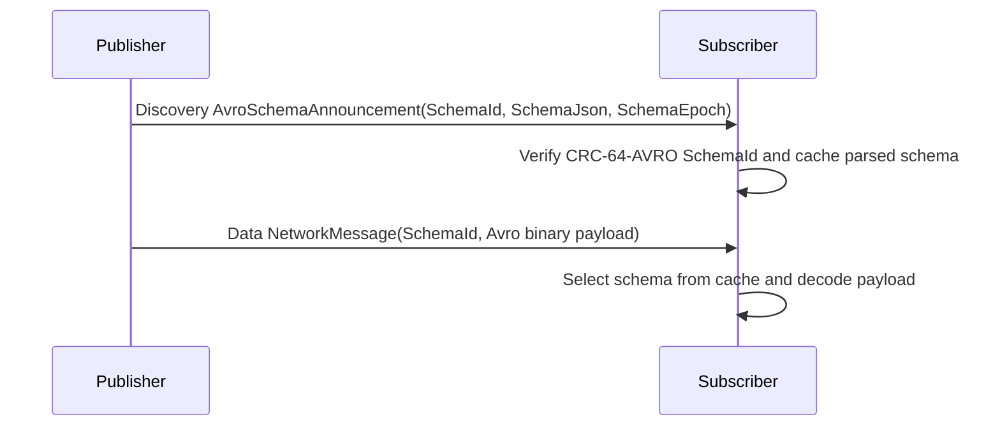
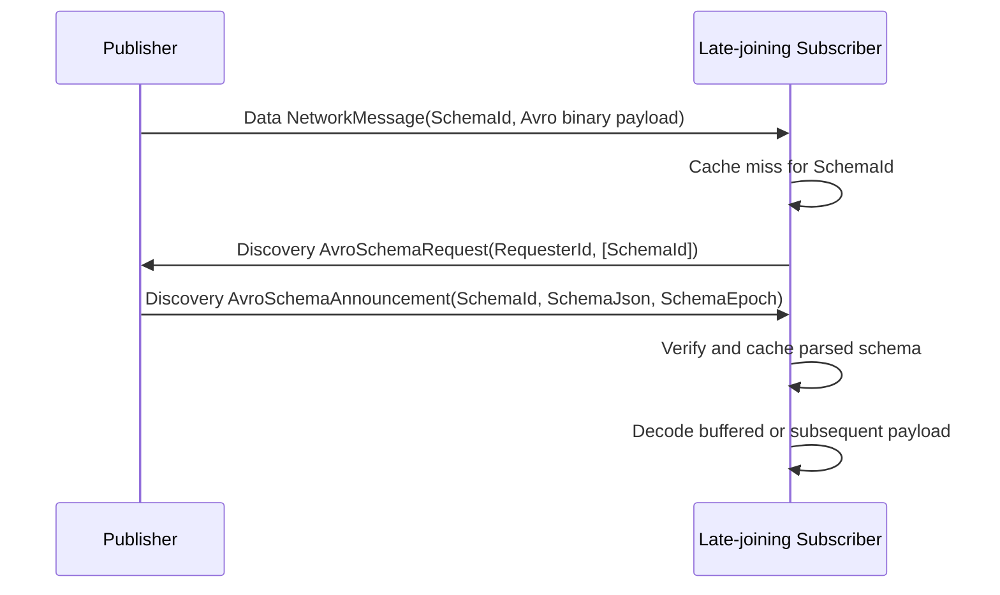
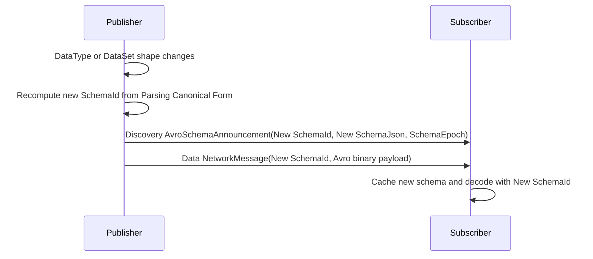

# OPC UA Part 14 — Apache Avro PubSub Message Mapping

**Working draft for submission to the OPC Foundation Working Group**
**Proposed addition to:** OPC 10000-14 PubSub v1.05.06
**Namespace:** `http://opcfoundation.org/UA/` (base OPC UA namespace)
**Version:** 0.1.0 · **Date:** 2026-07-02

> **Status — working draft.** This document proposes an Apache Avro binary message mapping for OPC UA PubSub. It depends on the Default Avro DataEncoding defined in `OPC-UA-Part6-Avro-DataEncoding.md` and describes only the mapping and configuration additions; no NodeSet or assigned NodeIds are shipped in this draft.

---

## 1 Scope

This specification defines a PubSub NetworkMessage and DataSetMessage mapping using Apache Avro binary encoding. It covers data key frame messages, data delta frame messages, Action invoke/response messages, Discovery messages, field representation according to `DataSetFieldContentMask`, message header fields, configuration parameters and transport content type metadata for MQTT, AMQP and Kafka.

This specification does not change PubSub security, writer group semantics, dataset metadata semantics or transport bindings except where content type metadata identifies Avro payloads and where the existing Discovery and Action message bodies are represented as Avro records.

## 2 Normative references

- [OPC 10000-6 v1.05.07](https://reference.opcfoundation.org/specs/OPC-10000-6/) — Mappings and the Default Avro DataEncoding addition.
- [OPC 10000-14 v1.05.06](https://reference.opcfoundation.org/specs/OPC-10000-14/) — PubSub.
- [Apache Avro Specification](https://avro.apache.org/docs/) — Schemas and binary encoding.

## 3 Terms, definitions and abbreviations

| Term | Definition |
|---|---|
| Avro NetworkMessage | A PubSub NetworkMessage whose headers and payload are encoded with the canonical Avro schema defined here. |
| Avro DataSetMessage | A DataSetMessage encoded as an Avro record, either key frame or delta frame. |
| RawData field | A DataSet field encoded using the Default Avro schema for the field DataType rather than Variant or DataValue wrapping. |
| SchemaId | A stable identifier for the Avro schema or schema bundle used by a WriterGroup or DataSetWriter. |

## 4 Overview

The Avro message mapping uses one canonical Avro schema for the NetworkMessage envelope and one canonical schema for each DataSetMessage shape. The schema is derived from PubSub configuration and DataSetMetaData. A receiver shall know the writer configuration and schema identifier before decoding, either from configured PubSub metadata, a schema registry, an AddressSpace re-derivation or a schema registry such as that specified in `core-specs\schema-registry\OPC-UA-Schema-Registry.md`.

Each value or message shall reference its schema by SchemaId. The SchemaId is the CRC-64-AVRO Rabin fingerprint over the Avro Parsing Canonical Form of the self-contained schema, with every referenced named type defined inline at its first occurrence, represented in the little-endian byte order used by Avro single-object encoding. SchemaId derivation is independent of PubSub ConfigurationVersion: ConfigurationVersion tracks PubSub metadata versioning, while SchemaId identifies the exact Avro schema bytes needed to decode a payload.

The transport content type shall be `application/vnd.apache.avro`. A PubSub-specific parameter should identify this mapping, for example `application/vnd.apache.avro; opcua=pubsub; encoding=binary`.

## 5 NetworkMessage

An Avro NetworkMessage is a **fixed envelope** whose Avro record schema is defined by this specification and does **not** vary with the DataSets it carries. Because a NetworkMessage may, over its lifetime, carry any DataSet its WriterGroup is configured for, an envelope schema that inlined every DataSet's fields would be the union of all of them and would change whenever the group's configuration changed. Instead the envelope carries each DataSetMessage **opaquely**: the `payload` is an array of entries, each `{ "schemaId": bytes, "dataSetMessage": bytes }`, where `dataSetMessage` is the Avro-binary encoding of the DataSetMessage (§6) under **its own** DataSet schema, identified by the entry's `schemaId`. The envelope record therefore has a **stable, specification-defined schema** — and thus a fixed SchemaId — that never changes as DataSets are added, removed or evolved. The envelope record has the selected PubSub header fields as nullable Avro fields; fields disabled by the NetworkMessageContentMask are null. The following envelope fields are defined: PublisherId, DataSetClassId, GroupHeader fields, WriterGroupId, GroupVersion, NetworkMessageNumber, SequenceNumber, Timestamp, PicoSeconds, PromotedFields, and the Payload array of `{ schemaId, dataSetMessage }` entries.

A receiver decodes the envelope with the fixed envelope schema, then decodes each entry's opaque `dataSetMessage` with the per-DataSet schema resolved by the entry's `schemaId` (§8). This makes the outer envelope a stable, published contract and confines schema evolution to the per-DataSet schemas. Where a transport carries a **single** DataSetMessage without a NetworkMessage wrapper (by explicit configuration), the payload is that DataSetMessage's Avro-binary encoding directly, identified by the DataSet `schemaId` carried in the DataSetMessage header, transport metadata, or Avro single-object framing (§8.1). A **batch** of DataSetMessages without an envelope is the same `{ schemaId, dataSetMessage }` entry array as the envelope `payload`, carried directly by the transport. When promoted fields are enabled, their values shall use Default Avro DataEncoding and shall preserve their configured DataTypes.

## 6 DataSetMessage

### 6.1 Common header

Each Avro DataSetMessage shall carry DataSetWriterId, DataSetMessage type, ConfigurationVersion, SequenceNumber, Status, Timestamp, PicoSeconds, optional SchemaId and message flags according to the DataSetMessageContentMask. Disabled header fields shall be nullable and default to null in the canonical schema. DataSetWriterId and message type are mandatory because they select the DataSetMetaData and frame interpretation. Each DataSetMessage is identified by its own DataSet SchemaId, carried in the enclosing NetworkMessage payload entry (§5) or, for an un-enveloped DataSetMessage, in the header, transport metadata, or single-object framing (§8.1).

### 6.2 Data key frame

A data key frame shall contain all fields defined by the PublishedDataSet in FieldMetaData order. The Avro payload field is an array or record whose members correspond exactly to that order. A key frame is self-contained for the current ConfigurationVersion.

Every field slot in the payload is **nullable** (§6.4). A DataSet may be **sparse** — a given DataSetMessage need not carry a value for every key. A sparse frame uses the **same** canonical schema as a full key frame: the field set and its FieldMetaData order are unchanged, and a key that has no value in this message is encoded as its `null` branch, a **`null:null`** value (the null union branch carrying null). A decoder shall treat a `null:null` field as **missing** — no value for that key in this message — not as a present null value. Because the schema is identical whether a frame carries all keys or only a subset, the SchemaId does not change with sparsity, and no per-subset schema is generated.

### 6.3 Data delta frame

A data delta frame shall contain only changed fields. Each changed field entry shall carry the field index or field name and the encoded value. The canonical Avro representation is an array of records `{ "fieldIndex": int, "fieldName": ["null","string"], "value": FieldValue }`; fieldIndex is the normative selector and fieldName is optional diagnostic metadata when configured.

### 6.4 Field representation and DataSetFieldContentMask

If the DataSetFieldContentMask selects StatusCode, timestamps or picoseconds, the field shall be encoded as a DataValue using the Default Avro DataValue mapping. If it selects Value wrapped as Variant, the field shall be encoded as a Variant. If RawData is selected, the field shall be encoded directly with the published Default Avro `.avsc` schema for the FieldMetaData DataType, including array dimensions, nullable element rules, and optional-field wrapper records. RawData shall not be used when the field DataType is not known to the receiver schema.

Every field slot shall be **nullable**: the field's Avro type is a union with a `null` branch. For a Variant or ExtensionObject field this is the `null` branch already present in its growing union (§6.4 of the Part 6 Avro DataEncoding); for a DataValue or RawData field the value type shall be wrapped as `["null", <fieldType>]` so that the key can be omitted.

A `null:null` value (the `null` branch carrying null) shall be used both for a genuinely null field value and for a **missing** key in a sparse DataSet (§6.2); a decoder treats a `null:null` field as carrying no value for that key. This is distinct from a **delta** frame (§6.3), where a field that is simply *absent from the delta array* means *unchanged*, not null; a delta field that is present carries its `value` encoded per this clause and may itself be `null:null`. Because every field slot is nullable, a sparse key frame and a full key frame share one canonical schema and therefore one SchemaId.

## 7 Avro message mapping additions for insertion as 7.2.6.x

This clause is intended to sit beside the JSON message mapping in Part 14. Data NetworkMessages use the records described in §5 and §6. The additional Avro message envelopes below cover Action and Discovery messages without changing Part 14 behavior.

### 7.1 Action messages

Actions are Methods invoked via PubSub. An Avro Action NetworkMessage contains one or more Action request or Action response DataSetMessages. Request and response traffic shall not be mixed in one envelope. The same SchemaId handshake defined in §8 applies: Action request and response schemas are announced, cached and selected by SchemaId exactly like data-message schemas.

The published request envelope schema is `../extras/avro-encoding/schemas/AvroActionRequestNetworkMessage.avsc`:

```json
{
  "fields": [
    {
      "name": "PublisherId",
      "type": [
        "null",
        "string"
      ]
    },
    {
      "name": "WriterGroupId",
      "type": "int"
    },
    {
      "name": "NetworkMessageNumber",
      "type": "int"
    },
    {
      "name": "SequenceNumber",
      "type": "int"
    },
    {
      "name": "Timestamp",
      "type": "long"
    },
    {
      "name": "Messages",
      "type": {
        "items": [
          "null",
          "org.opcfoundation.ua.avro.AvroActionRequestDataSetMessage"
        ],
        "type": "array"
      }
    },
    {
      "name": "SchemaId",
      "type": [
        "null",
        "string"
      ]
    }
  ],
  "name": "AvroActionRequestNetworkMessage",
  "namespace": "org.opcfoundation.ua.avro",
  "type": "record"
}
```

The published request DataSetMessage schema is `../extras/avro-encoding/schemas/AvroActionRequestDataSetMessage.avsc`:

```json
{
  "fields": [
    {
      "name": "ActionTargetId",
      "type": [
        "null",
        "org.opcfoundation.ua.avro.NodeId"
      ]
    },
    {
      "name": "RequestId",
      "type": [
        "null",
        "string"
      ]
    },
    {
      "name": "CorrelationData",
      "type": [
        "null",
        "bytes"
      ]
    },
    {
      "name": "InputArguments",
      "type": {
        "items": [
          "null",
          "org.opcfoundation.ua.avro.Variant"
        ],
        "type": "array"
      }
    }
  ],
  "name": "AvroActionRequestDataSetMessage",
  "namespace": "org.opcfoundation.ua.avro",
  "type": "record"
}
```

The published response envelope schema is `../extras/avro-encoding/schemas/AvroActionResponseNetworkMessage.avsc`:

```json
{
  "fields": [
    {
      "name": "PublisherId",
      "type": [
        "null",
        "string"
      ]
    },
    {
      "name": "WriterGroupId",
      "type": "int"
    },
    {
      "name": "NetworkMessageNumber",
      "type": "int"
    },
    {
      "name": "SequenceNumber",
      "type": "int"
    },
    {
      "name": "Timestamp",
      "type": "long"
    },
    {
      "name": "Messages",
      "type": {
        "items": [
          "null",
          "org.opcfoundation.ua.avro.AvroActionResponseDataSetMessage"
        ],
        "type": "array"
      }
    },
    {
      "name": "SchemaId",
      "type": [
        "null",
        "string"
      ]
    }
  ],
  "name": "AvroActionResponseNetworkMessage",
  "namespace": "org.opcfoundation.ua.avro",
  "type": "record"
}
```

The published response DataSetMessage schema is `../extras/avro-encoding/schemas/AvroActionResponseDataSetMessage.avsc`:

```json
{
  "fields": [
    {
      "name": "ActionTargetId",
      "type": [
        "null",
        "org.opcfoundation.ua.avro.NodeId"
      ]
    },
    {
      "name": "RequestId",
      "type": [
        "null",
        "string"
      ]
    },
    {
      "name": "CorrelationData",
      "type": [
        "null",
        "bytes"
      ]
    },
    {
      "name": "Status",
      "type": "int"
    },
    {
      "name": "OutputArguments",
      "type": {
        "items": [
          "null",
          "org.opcfoundation.ua.avro.Variant"
        ],
        "type": "array"
      }
    },
    {
      "name": "DiagnosticInfos",
      "type": {
        "items": [
          "null",
          "org.opcfoundation.ua.avro.DiagnosticInfo"
        ],
        "type": "array"
      }
    }
  ],
  "name": "AvroActionResponseDataSetMessage",
  "namespace": "org.opcfoundation.ua.avro",
  "type": "record"
}
```

`InputArguments` and `OutputArguments` use Variant so each argument keeps its OPC UA BuiltInType, dimensions and null state. If a deployment elects to carry argument status and timestamps, the DataSetFieldContentMask may instead select DataValue and the derived Action schema shall use `DataValue` for the argument array item type. MQTT Action request and response publications use the existing `action-request` and `action-response` topic conventions from Part 14 with MQTT 5 `ContentType` set to `application/vnd.apache.avro; opcua=pubsub; encoding=binary`.

### 7.2 Discovery messages

Discovery messages are encoded as Avro records and published with the same content type. The schemas generated by this draft are intentionally reduced, faithful shapes for the fields needed to prove the mapping. Full base OPC UA structures that are not locally modelled in this extension are represented as reduced records or `ExtensionObject` fallbacks:

| Part 14 discovery concept | Published Avro schema | Reduced-shape or fallback decision |
|---|---|---|
| DataSetMetaData announcement | `AvroDataSetMetaData.avsc` | Reduced shape: Name, DataSetClassId, ConfigurationVersion, FieldMetaData[], SchemaId and SchemaJson. |
| FieldMetaData | `AvroFieldMetaData.avsc` | Reduced shape: Name, Description, DataType, BuiltInType, ValueRank and ArrayDimensions. |
| ConfigurationVersionDataType | `AvroConfigurationVersionDataType.avsc` | Faithful two UInt32 fields: MajorVersion and MinorVersion. |
| DataSetWriter configuration announcement | `AvroDataSetWriterConfigurationAnnouncement.avsc` | Carries PublisherId, WriterGroupId, DataSetWriterId, ConfigurationVersion, DataSetMetaData, SchemaId and SchemaJson. |
| ActionResponder configuration announcement | `AvroActionResponderConfigurationAnnouncement.avsc` | Carries ActionTargetId/ObjectId/MethodId plus input/output DataSetMetaData and schema announcement fields. |
| Schema announcement | `AvroSchemaAnnouncement.avsc` | Carries SchemaId bytes, SchemaJson and optional SchemaEpoch for the SchemaId cache. |
| Schema request | `AvroSchemaRequest.avsc` | Carries an optional RequesterId and the SchemaIds requested by a late joiner or cache-miss decoder. |
| Discovery probe | `AvroDiscoveryProbe.avsc` | Carries PublisherId plus requested WriterGroupIds, DataSetWriterIds and ActionTargetIds. |
| Publisher endpoints announcement | `AvroPublisherEndpointsAnnouncement.avsc` | EndpointDescription[] reduced to EndpointUrl, SecurityMode, SecurityPolicyUri and TransportProfileUri; Server and UserIdentityTokens use ExtensionObject fallbacks. |

This gives a natural SchemaId announcement path. The DataSetMetaData or configuration announcement is the message that rides first and carries `{ SchemaId, SchemaJson }`; the dedicated `AvroSchemaAnnouncement` record carries the same cache entry when a Publisher re-announces active schemas, answers a schema request, or announces a schema that is not otherwise tied to a configuration announcement. Later data or Action messages can then refer only to the SchemaId until the schema changes or a receiver requests it again.

## 8 SchemaId handshake

### 8.1 Framing

Single OPC UA values encoded with Default Avro should use Avro single-object encoding: the two magic bytes `0xC3 0x01`, followed by the 8-byte little-endian Rabin fingerprint, followed by the Avro binary body. The fingerprint bytes are the SchemaId. A NetworkMessage envelope that does not use single-object encoding carries each DataSetMessage's SchemaId in its payload entry (§5); an un-enveloped DataSetMessage carries the same SchemaId in the DataSetMessage header, transport metadata, or single-object framing agreed for the mapping.

The SchemaId identifies the schema of a **single DataSet** — the schema of one DataSetMessage payload. The NetworkMessage **envelope** has its own fixed, specification-defined schema (§5) that never changes, so the envelope is not the unit of schema evolution; each DataSetMessage the envelope carries is opaque and is identified and decoded by **its own** per-DataSet SchemaId, carried in the payload entry (§5). A producer accordingly computes and tracks the SchemaId, and advances the DataSet `ConfigurationVersion` (§8.8), **per DataSet**, not per NetworkMessage.

### 8.2 SchemaId carrier placement

The following carrier placement rules are normative. When more than one carrier is present for the same Avro payload, all present carriers shall contain the same SchemaId value; a receiver shall treat disagreement as a decoding error.

| Scope | Carrier field | When used |
|---|---|---|
| Single OPC UA value | Avro single-object framing: `0xC3 0x01` plus the 8-byte little-endian Rabin fingerprint | Used when an individual value is encoded as a standalone Avro value; the 8-byte fingerprint is the SchemaId. |
| DataSet payload entry | The `schemaId` of each `{ schemaId, dataSetMessage }` NetworkMessage payload entry (§5) | Each opaque DataSetMessage in a NetworkMessage carries its own DataSet SchemaId; the fixed envelope schema (§5) is specification-defined and needs no per-message SchemaId. |
| Un-enveloped DataSetMessage | The DataSet `SchemaId` in the DataSetMessage header, transport metadata, or single-object framing | Used when a single DataSetMessage, or an un-enveloped batch of `{ schemaId, dataSetMessage }` entries, is transported without a NetworkMessage wrapper. |
| Transport metadata | MQTT 5 `ContentType` `schemaid` parameter, AMQP `content-type` `schemaid` parameter, or Kafka header `opcua-avro-schema-id` | Used by a transport profile or deployment convention to make the SchemaId available before payload decoding; the binary payload still uses the canonical Avro schema identified by the same SchemaId. |

### 8.3 Schema announcement message

A schema announcement frame shall contain the SchemaId bytes and the canonical Avro schema JSON, where the schema JSON is the self-contained Avro Parsing Canonical Form or a self-contained schema document that has exactly that Parsing Canonical Form. The announcement shall define every named type needed to parse the payload without external named-schema state. An encoder shall send the announcement once per SchemaId and destination, at stream start, on first use, after a schema change, or in response to a decoder request. The announcement is lightweight and independent of data frames.

The published schema announcement schema is `../extras/avro-encoding/schemas/AvroSchemaAnnouncement.avsc`:

```json
{
  "fields": [
    {
      "name": "SchemaId",
      "type": "bytes"
    },
    {
      "name": "SchemaJson",
      "type": "string"
    },
    {
      "name": "SchemaEpoch",
      "type": [
        "null",
        "long"
      ]
    }
  ],
  "name": "AvroSchemaAnnouncement",
  "namespace": "org.opcfoundation.ua.avro",
  "type": "record"
}
```

`AvroSchemaAnnouncement` rides as a Discovery announcement using the Discovery publisher-to-subscriber announcement path defined in §7.2. For MQTT, it shall be published on the configured Discovery announcement topic for the Publisher or WriterGroup with MQTT 5 `ContentType` set to `application/vnd.apache.avro; opcua=pubsub; encoding=binary; message=schema-announcement`; MQTT 3.1.1 deployments should document the same content type in topic metadata. For AMQP and Kafka, the same content type string shall be carried as described in §10. Reception of an `AvroSchemaAnnouncement` whose SchemaId matches the CRC-64-AVRO fingerprint of `SchemaJson` shall insert the parsed schema into the decoder cache keyed by SchemaId; a receiver shall reject the announcement if the recomputed SchemaId differs.

### 8.4 Schema request message

A decoder that joins late or encounters a cache miss may publish a schema request that names one or more SchemaIds. A Publisher that receives the request shall answer with one `AvroSchemaAnnouncement` for each requested SchemaId that it knows; unknown SchemaIds may be ignored or reported by deployment-specific diagnostics, but shall not cause the Publisher to answer with a different schema.

The published schema request schema is `../extras/avro-encoding/schemas/AvroSchemaRequest.avsc`:

```json
{
  "fields": [
    {
      "name": "RequesterId",
      "type": [
        "null",
        "string"
      ]
    },
    {
      "name": "SchemaIds",
      "type": {
        "items": "bytes",
        "type": "array"
      }
    }
  ],
  "name": "AvroSchemaRequest",
  "namespace": "org.opcfoundation.ua.avro",
  "type": "record"
}
```

`AvroSchemaRequest` rides on the configured Discovery request channel for the PubSub transport, using MQTT 5 `ContentType` `application/vnd.apache.avro; opcua=pubsub; encoding=binary; message=schema-request` or the equivalent AMQP/Kafka content-type metadata described in §10. `RequesterId` may identify the Subscriber, session, client application, or be null when no stable identity is available. `SchemaIds` shall contain the raw 8-byte SchemaId values, not hexadecimal strings.

### 8.5 Encoder change tracking

An encoder shall maintain `announced: set[SchemaId]` per destination. Before sending each value or message, it shall recompute the SchemaId from the generated self-contained Avro schema. If the SchemaId is not in the destination's announced set, the encoder shall **publish the schema — register it in the Schema Registry (*OPC UA — Schema Registry* §5.2) and emit the schema announcement** — before the first value using that SchemaId, and then add it to the set. A changed DataType, referenced DataType, DataSet field list, field order, optional-field shape, Variant body type or RawData schema produces a different SchemaId and therefore automatically triggers a new publish and announcement. An optional monotonic `SchemaEpoch` may be sent for operator correlation, but receivers shall not use it as the decoding key.

### 8.6 Decoder behavior

A decoder shall maintain `cache: SchemaId -> parsed Avro schema`. When a value or message references an unknown SchemaId, the decoder shall resolve the cache miss in this order until a schema is obtained and verified:

1. Await an `AvroSchemaAnnouncement` on the relevant Discovery announcement channel.
2. Send an `AvroSchemaRequest` on the relevant Discovery request channel containing the unknown SchemaId and await one `AvroSchemaAnnouncement` per known requested SchemaId.
3. Resolve the schema from an external (federated) xRegistry that the local registry references, per *OPC UA — Schema Registry* (`core-specs/schema-registry/OPC-UA-Schema-Registry.md`) §8.
4. Read the in-server AddressSpace Schema Registry by a SchemaId-NodeId. A companion NodeSet in `core-specs/schema-registry/`, namespace `http://opcfoundation.org/UA/SchemaRegistry/`, exposes each schema at an Opaque NodeId whose Identifier is the raw SchemaId bytes, so a single Read returns the schema with no browse or recomputation. The same registry also exposes a `GetSchema(SchemaId)` Method for clients that prefer a Method call.
5. Re-derive the schema from the AddressSpace DataType and verify that the recomputed SchemaId is equal to the referenced SchemaId.

The decoder cache shall be keyed by SchemaId. SchemaId is content-derived and independent of PubSub ConfigurationVersion, writer group version numbers, sequence numbers and transport session state. Encoders should periodically re-announce active schemas on lossy transports or when late joiners are expected.

### 8.7 Sequence diagrams

The announce-then-data happy path is:



The late-joiner cache-miss path is:



The schema-change path is:



### 8.8 Relationship to ConfigurationVersion

SchemaId derives only from the Avro schema. It does not depend on PubSub ConfigurationVersion, writer group version numbers, sequence numbers or transport session state. A ConfigurationVersion change that does not alter the Avro schema keeps the same SchemaId. Conversely, a schema change produces a new SchemaId, and a **publisher shall advance the DataSet `ConfigurationVersion` whenever the produced schema changes — MinorVersion for an append-only growth, MajorVersion for a reset**. Decoders do not rely on ConfigurationVersion for decoding — they shall select the Avro decoder by SchemaId — and may use ConfigurationVersion for the existing PubSub metadata checks; a decoder shall still decode correctly by SchemaId even if a misbehaving publisher fails to advance ConfigurationVersion.

Although SchemaId is not computed from ConfigurationVersion, the `{MajorVersion, MinorVersion}` lineage carries a compatibility relationship between successive schemas per *OPC UA — Schema Registry* §5.6. A MinorVersion increment is an append-only-compatible superset of the same lineage, so a subscriber holding the latest minor of a lineage decodes every message produced under any earlier minor of that lineage — the appended Avro union branches are simply unused for older values. Where data-driven growth is used, a lineage is a single publisher's chain of SchemaIds (§5.6), so a consumer keys on SchemaId rather than on `major.minor` alone. A MajorVersion increment is a reset with no such guarantee. A publisher shall advance MinorVersion when it aggregates a new Variant body form or ExtensionObject concrete type into the schema, and register and re-announce the resulting SchemaId. The per-encoding procedure for narrowing and append-only growing these unions is in the Avro Part 6 DataEncoding §6.4.

## 9 Configuration parameters

The Avro mapping adds the following configuration parameters to the JSON mapping style configuration model in Part 14:

| Parameter | Type | Description |
|---|---|---|
| `AvroSchemaId` | String | Stable identifier of the Avro schema bundle for the WriterGroup or DataSetWriter. |
| `AvroSchemaUri` | String | Optional URI from which the schema bundle can be retrieved. |
| `AvroUseObjectContainerFile` | Boolean | False for PubSub network payloads by default; true only for transports that explicitly carry Avro object container files. |
| `AvroRawDataAllowed` | Boolean | Whether RawData fields may be emitted for this writer. |
| `AvroSchemaHash` | ByteString | Optional copy of the little-endian CRC-64-AVRO SchemaId bytes for mismatch detection. |

## 10 Transport content types

For MQTT, the MQTT 5 `ContentType` property shall be `application/vnd.apache.avro; opcua=pubsub; encoding=binary`. For MQTT 3.1.1, the same string should be carried in configured metadata or topic documentation because the protocol has no ContentType property.

For AMQP, the message `content-type` property shall carry the same content type and may include a `schemaid` parameter when the transport profile elects to carry SchemaId in metadata.

For Kafka, following the Kafka message mapping of *OPC 10000-14* Annex B.2 — which sets an optional Kafka message header with the `ContentType` key (for example `application/json` for JSON or `application/opcua+uadp` for UADP) — the optional Kafka header with the `ContentType` key shall be set to `application/vnd.apache.avro; opcua=pubsub; encoding=binary`. Kafka deployments that carry SchemaId in metadata shall use the Kafka header `opcua-avro-schema-id` with the raw 8-byte SchemaId value or its deployment-specified hexadecimal representation.

Kafka and AMQP deployments that use a schema registry should also carry `opcua-avro-schema-id` with the configured SchemaId.

## 11 Information model additions

The PubSub configuration model shall add Avro message mapping ObjectTypes parallel to the JSON message mapping configuration ObjectTypes. The model shall describe Avro NetworkMessage mapping parameters, Avro DataSetMessage mapping parameters and the SchemaId/SchemaUri properties. This draft describes the ObjectTypes only; assigned NodeIds and a NodeSet are out of scope.

## 12 Insertion into OPC 10000-14 v1.05.06

| Draft section | Target in OPC 10000-14 | Notes |
|---|---|---|
| §9 Configuration parameters | New `6.3.x Avro message mapping parameters` | Add `AvroSchemaId`, `AvroSchemaUri`, object-container flag, RawData flag and schema hash. |
| §4-§6 Message mapping | New `7.2.6 Avro message mapping` | Mirrors `7.2.5 JSON message mapping` with Avro NetworkMessage, DataSetMessage, key frame and delta frame definitions. |
| §8.1 Framing | New `7.2.6.1 SchemaId framing` | Defines Avro single-object framing and confirms that the 8-byte fingerprint is the SchemaId. |
| §8.2 SchemaId carrier placement | New `7.2.6.2 SchemaId carrier placement` | Defines the normative carrier table for single values, NetworkMessages, DataSetMessages and transport metadata. |
| §8.3 Schema announcement message | New `7.2.6.3 Schema announcement message` | Defines `AvroSchemaAnnouncement`, Discovery announcement publication and decoder-cache insertion. |
| §8.4 Schema request message | New `7.2.6.4 Schema request message` | Defines `AvroSchemaRequest`, Discovery request publication and Publisher responses. |
| §8.5 Encoder change tracking | New `7.2.6.5 Encoder change tracking` | Defines per-destination announced sets and automatic re-announcement on schema changes. |
| §8.6 Decoder behavior | New `7.2.6.6 Decoder cache-miss resolution` | Defines the ordered cache-miss resolution sequence including xRegistry, Schema Registry NodeId reads, GetSchema and AddressSpace re-derivation. |
| §8.7 Sequence diagrams | New `7.2.6.7 SchemaId exchange sequences` | Shows announce-data, late-joiner request and schema-change flows. |
| §8.8 Relationship to ConfigurationVersion | New `7.2.6.8 SchemaId and ConfigurationVersion` | States that SchemaId is content-derived and independent of ConfigurationVersion, and defines the minor/major schema compatibility contract (Schema Registry §7). |
| §7.1 Action messages | New `7.2.6.x NetworkMessage containing Action messages` | Mirrors JSON `7.2.5.6`, Table 166 request and Table 167 response semantics using Avro records. |
| §7.2 Discovery messages | New `7.2.6.x Discovery messages` | Mirrors DataSetMetaData, DataSetWriter configuration, ActionResponder configuration, schema announcement, schema request, probe and Publisher endpoints announcements using Avro records. |
| §10 MQTT content type | New `7.3.4.x MQTT Avro content type` | Defines MQTT `ContentType` string and schema-exchange message parameters. |
| §7.1 MQTT Action topics | `7.3.4.7.9` and `7.3.4.7.10` additions | `action-request` and `action-response` topics carry Avro payloads with `application/vnd.apache.avro; opcua=pubsub; encoding=binary`. |
| §11 Configuration model | New `9.2.x Avro message mapping ObjectTypes` | Describes ObjectTypes and Properties only; no NodeSet in this draft. |
| §5-§6 Header fields | New `Annex A.x Avro header layouts` | Tables list NetworkMessage and DataSetMessage header fields, including SchemaId, and their Avro field names. |
| §10 Kafka/AMQP metadata | `Annex B` additions | Adds AMQP `content-type`, Kafka content-type header and optional schema-id header. |

The editor should place `7.2.6 Avro message mapping` after `7.2.5 JSON message mapping` so the Avro text can reuse the same PubSub concepts and masks while replacing JSON object representation with canonical Avro records.
