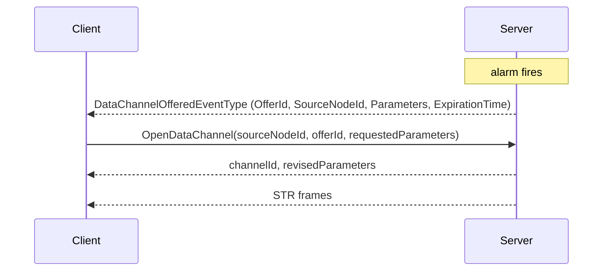

# OPC UA — Data Channels

**Working draft for submission to the OPC Foundation Working Group**
**Proposed additions to:** OPC 10000-3 Address Space Model, OPC 10000-4 Services, OPC 10000-6 Mappings (v1.05.07), with instance declarations in OPC 10000-5 and Profiles in OPC 10000-7
**Namespace:** `http://opcfoundation.org/UA/` (base OPC UA namespace)
**Version:** 0.1.0 · **Date:** 2026-07-27

> **Status — working draft.** This is the **standalone combined read**. It merges the three insertion-ready errata documents — [Part 6 transport](OPC-UA-Part6-Data-Channel-Transport.md), [Part 4 Services](OPC-UA-Part4-Data-Channel-Services.md) and [Part 3 model](OPC-UA-Part3-Data-Channel-Model.md) — into one narrative, and adds the material a standalone reader needs: a worked audio/video example, a comparison against WebRTC, and guidance on when to use a data channel instead of FileTransfer, PubSub or a Subscription. **The three errata documents remain the authoritative, insertion-ready proposals**; where this document and one of them differ, the errata document is correct. Nothing here is normative or endorsed by the OPC Foundation.

---

## 1 Scope

A **data channel** is a named, authorized, flow-controlled, bidirectional stream of opaque bytes multiplexed onto an OPC UA SecureChannel that is already open.

This specification defines data channels end to end: the frame that carries them, the transports that carry the frame, the Services that create them, the AddressSpace model that describes where they may be created, and the conformance units that group all of it. It targets the capability set of WebRTC — many concurrent media and data streams, priority, backpressure, partial reliability, round-trip feedback, unreliable datagrams — obtained from the connection an OPC UA Client already has, with the certificates it already validated and the user identity it already authenticated.

It does not define codecs, packetization, presentation timing, media negotiation, peer-to-peer connectivity or NAT traversal. A channel carries octets qualified by an IANA media type; what those octets mean is the application's business.

## 2 The problem

OPC UA moves data by asking for it. `Read` returns a value, `Publish` returns a batch of notifications, `HistoryRead` returns a page of samples, and Part 5 `FileType` returns a slice of a file to a Client that keeps asking for the next one. Every one of those is a complete request paired with a complete response, and the Secure Conversation layer is built for exactly that shape: a Message is chunked, every chunk is reliable and ordered, and nothing is interpreted until the whole Message has arrived.

Three message types exist on that layer — `MSG`, `OPN` and `CLO` — and all three are request/response. The connection protocol below adds `HEL`, `ACK`, `ERR` and `RHE`, and negotiates only static buffer limits. Nowhere in OPC UA can an application say *"start sending, keep sending, here is how much I can absorb, throw away anything older than 40 ms, and stop when I say so."*

Yet that is what a camera needs. And a microphone, a log tail, a point cloud, a firmware image being pushed to a drive, a remote console, a waveform capture. These produce a continuous flow whose value decays with age. The operations that suit them — start, throttle, prioritize against other traffic, discard what is already too late to matter, stop — have no expression in the protocol at all.

So they are solved beside it. A vendor puts RTSP on port 554 next to the OPC UA endpoint on 4840, or gRPC, or a bespoke socket. That means a second port through the firewall, a second handshake, a second set of certificates, a second authorization model with no relationship to the OPC UA user identity, and a second thing to diagnose when it stops working — for data that came off the same device and is governed by the same policy as the data flowing over OPC UA.

Data channels close that gap on the connection that is already open.

## 3 Design in one page

**A frame is a MessageChunk.** Inline framing adds one Secure Conversation `MessageType`, `STR`. Its Message header, security header, sequence header and footer are byte-for-byte those of a `MSG` chunk, so the securing, verification, sequence-number and token-rollover rules of OPC 10000-6 §6.7 apply with no change at all. The only new bytes are a twelve-byte stream header at the front of the encrypted body.

**A frame is never chunked.** This is the constraint everything else rests on. A multi-chunk frame would sit in the existing chunk assembler and block every other Message on the connection until it completed — precisely the failure a streaming layer exists to prevent. An application unit larger than one frame is segmented by flags in the stream header instead.

**The handshake does not change.** `Hello` and `Acknowledge` are untouched and `ProtocolVersion` is not bumped, so a data-channel-capable Client and a legacy Server still connect; the capability is simply never advertised. Negotiation happens at the Service level, which costs a round trip the Client was making anyway.

**Ownership and authorization are separate.** A channel is owned by the SecureChannel, because that is where its bytes flow and it cannot outlive that. It is authorized by the Session, because that is where the user identity is, and `OpenDataChannel` is checked against the source Node's `RolePermissions` exactly as a `Read` would be. Every Service in the set is scoped to **both** — a SecureChannel may carry several Sessions, and ChannelIds are guessable — and the authorization is re-evaluated rather than granted once, so revoking a permission actually terminates the stream it was protecting. Renewing the channel token does not disturb a channel; closing the Session revokes it.

**Streamability is an Interface.** No new Node Attribute, no new NodeClass. A type becomes streamable by adding one `HasInterface` reference to `IDataChannelSourceType`, so its supertype is untouched and every existing Client sees exactly what it saw before.

**Two transports, one contract.** Inline framing works on every deployed `opc.tcp` and `opc.wss` endpoint today. `opc.quic` adds what TCP cannot express: a native stream per channel, genuine loss over QUIC DATAGRAM, and survival of a network path change. The Services, the model and the frame layout are identical on both, so an application is written once.

## 4 The frame

### 4.1 Layout

```text
Message header            12 bytes   MessageType[3]='STR' · IsFinal='F' · MessageSize · SecureChannelId
Symmetric security header  4 bytes   TokenId                    | inline framing only
Sequence header            8 bytes   SequenceNumber · RequestId | inline framing only
--------------------------------------------- start of the secured body
Stream header             12 bytes   ChannelId · FrameType · Flags · Reserved · FrameSequenceNumber
Deadline                   8 bytes   present only when the DeadlinePresent flag is set
Frame type fields         0-8 bytes  determined by FrameType
Payload                    varies    DATA frames only
--------------------------------------------- end of the secured body
Message footer             varies    PaddingSize · Padding · Signature   | inline framing only
```

`SequenceNumber` is the SecureChannel's single monotonic sequence, shared with `MSG`, `OPN` and `CLO`, because that sequence is a security mechanism and splitting it per channel would weaken replay and injection detection. `RequestId` is `0`: a frame is not a Service invocation, and folding the ChannelId into it would risk colliding with a Client-allocated RequestId in flight. Per-channel ordering is provided separately by `FrameSequenceNumber`, inside the secured body where it cannot affect the security property.

Annex B gives the annotated bytes of every frame type, generated from the reference codec.

### 4.2 Frame types

| Value | Name | Extra fields | Purpose |
|---|---|---|---|
| 0 | `DATA` | — | Carries payload. The only frame type that does. |
| 1 | `CREDIT` | `ChannelCredit`, `ConnectionCredit` | Grants flow control window. |
| 2 | `GAP` | `FirstDiscarded`, `LastDiscarded` | Reports a run of frames that will never arrive. |
| 3 | `RESET` | `StatusCode` | Aborts one channel, leaving the connection intact. |
| 4 | `END` | — | Orderly half-close of one direction. |
| 5 | `PING` | `Timestamp` | Round-trip probe and keepalive. |
| 6 | `PONG` | `Timestamp` | Echo, copying `Timestamp` verbatim. |

ChannelId `0` is reserved for connection-level control and carries only `CREDIT`, `PING` and `PONG`. Separating it is what lets the connection window be replenished while every individual channel is stalled.

### 4.3 The five flags

`MessageStart` and `MessageEnd` delimit a logical application message across frames — the segmentation that replaces chunking. `Droppable` and `DeadlinePresent` mark a frame the sender may discard once it is too late to be useful; the deadline is on the sender's own clock and is never compared across the connection, so no clock synchronization is needed. `Marker` flags an application-defined synchronization point such as a video key frame, so a receiver recovering from a gap knows where it can resume without understanding the payload.

## 5 Flow control, scheduling and loss

### 5.1 Credit

Every channel has a byte window, and the connection has one too, **maintained independently for each direction**. A sender may not transmit a `DATA` frame whose payload exceeds either. Control frames are exempt — a creditable `CREDIT` frame would deadlock a stalled channel permanently, and a channel that cannot be reset or probed while stalled cannot be recovered.

Two obligations make the window usable rather than merely defined. Connection credit starts at **zero** and each peer must announce it within one round trip — the Server on accepting the first channel, the Client on receiving its first response — so a sender always knows whether it is waiting for a grant that is coming or one that never will. Each obligation is triggered by the *peer's* need to send rather than the granter's, because a `CREDIT` frame flows opposite to the data it authorizes: on a `SourceToSink` camera feed the Client never sends payload at all, so a Client obligation conditioned on its own sending would leave the feed blocked forever with both peers conformant. And a receiver **shall** replenish: once it has consumed and released payload and its outstanding grant has fallen below half the last grant or one frame, whichever is larger, it must grant again. Without that a receiver could legally consume its whole window and stall the channel forever while remaining conformant.

The result is that backpressure is *per channel and per direction*: a consumer that cannot keep up with a video stream stalls that stream and nothing else. The connection window exists so the sum of channels cannot exhaust the receiver even when each is individually within its window. Over `opc.quic` the whole mechanism is replaced by QUIC's own flow control, no `CREDIT` frames are sent, and the "no `DATA` before a grant" gate does not apply.

### 5.2 Two scheduling obligations

1. **Service traffic has precedence.** A sender shall not delay a `MSG`, `OPN` or `CLO` chunk by more than the transmission of one maximum-size frame. Without this, a saturated video channel starves the `Publish` response path and the Session dies of a keep-alive timeout on a connection that is demonstrably busy. In Service terms: a Server that cannot keep up shall stall data channels — the credit window is exactly the mechanism — rather than delay `Publish`. Losing video is recoverable; losing the Subscription that reports the alarm is not.
2. **No channel starves.** Priority (0 to 7) determines *share*, never *exclusivity*.

Both are realized by a deficit round robin whose per-round quantum is (`Priority` + 1) × `MaxFrameSize`, with one Service chunk drained after each data frame. The quantum is normative-by-recommendation in the Part 6 errata §5.7 rather than left to the implementer, because "priority weighting" without a stated quantum produces different bandwidth shares in different implementations. `core-specs/extras/data-channels/tools/scheduler_demo.py` is an informative executable realization.

### 5.3 State, and what "unreliable" honestly means

A channel moves through `Opening` → `Open` ⇄ `Paused` → `Closing` → `Closed`, with `Faulted` reachable from anywhere. The Part 6 errata §5.13 gives the full transition table — which event causes which transition, which are legal, and what may be sent in each state — and §5.14 names the four timeouts (`OpenTimeout`, `DrainTimeout`, `PingTimeout`, `IdleTimeout`) that bound the states which would otherwise be open-ended. **`Paused` and `Closing` are both per direction**: a channel is `Paused` only in the direction whose window is exhausted, and receiving `END` ends the peer's direction without touching this peer's own — which is what makes `END` a half-close rather than a close, and what stops a half-close from destroying a long transfer the other end is still legitimately making. The `Open` ⇄ `Paused` transition is rate-limited to one Event per channel per second so that a saturated channel does not generate an Event per credit stall.

| Mode | Inline framing over TCP | `opc.quic` |
|---|---|---|
| `ReliableOrdered` | Exact. | Exact, on one QUIC stream. |
| `ReliableUnordered` | Every frame arrives; the receiver may skip reassembly buffering. | Carried on the channel's QUIC stream; ordered by the transport, so the saving is buffering rather than latency. |
| `PartiallyReliable` | Sender-side: a droppable frame still queued at its deadline is discarded. `MaxRetransmits` has no effect. | Retransmission over DATAGRAM up to `MaxRetransmits` or the deadline. |
| `Unreliable` | Sender-side discard only. Once a byte is written to the socket, TCP will deliver it. | Exact. Sent once, never retransmitted. |

For inline framing, **loss happens in the send queue, not on the wire**. This specification says so plainly rather than implying otherwise. It is still a real and useful property — it bounds latency and discards stale media in favour of fresh media, which is what an operator actually wants — and it is what a TCP-based media path can offer. A Server that needs genuine in-flight loss offers an `opc.quic` endpoint and advertises it through `SupportsUnreliableDatagrams`, so a Client learns the difference by reading rather than by measuring.

When frames are discarded, the sender emits one `GAP` frame **per contiguous run** of discarded sequence numbers — never a single widened range, which would declare a surviving frame lost and then transmit it. A receiver also detects loss on its own from a `FrameSequenceNumber` discontinuity, using the serial-number arithmetic of the Part 6 errata §5.2.1, which is applied to `DATA` frames only: a control frame carries a sequence number but never advances the receiver's high-water mark, or a `GAP` announcing an expiry would push it past a lower-numbered survivor and the receiver would discard as a duplicate exactly the frame the per-run rule protects. The same arithmetic distinguishes a genuine gap from the counter wrapping and from a datagram retransmission. This matters over DATAGRAM where the `GAP` may itself be lost. Without gap information a media decoder cannot tell a stall from a loss, and so cannot decide whether to conceal or to wait.

## 6 The QUIC transport

QUIC provides in the transport exactly what clause 4 has to construct by hand. `opc.quic` maps onto it:

| Aspect | Mapping |
|---|---|
| URL scheme | `opc.quic`, default UDP port 4840 |
| TransportProfileUri | `http://opcfoundation.org/UA-Profile/Transport/quic-uasc-uabinary` |
| ALPN | `opcua/1` (provisional, pending OPC Foundation registration) |
| Control conversation | The first client-initiated bidirectional stream, carrying `HEL`/`ACK`/`OPN`/`MSG`/`CLO` unchanged |
| Data channel | One QUIC stream each; `TransportChannelId` returns its stream id |
| Unreliable payload | QUIC DATAGRAM frames (RFC 9221), one frame per datagram, never fragmented |
| Flow control | QUIC's own; `CREDIT` frames are not sent |
| `RESET` | QUIC `RESET_STREAM`, StatusCode in the application error code |
| Congestion control | RFC 9002; this specification adds none |

**Security.** The control stream keeps full UA-SC message security, so `OpenSecureChannel` still runs and the application instance certificates still authenticate the two applications — the OPC UA security model does not become TLS's job. Data channel frames are protected by QUIC's TLS 1.3 record layer alone under the `TransportSecured` profile, which avoids a second cryptographic pass over bulk media. That is sound **only** because §7.6.1 binds the two layers: a Client validates the Server's TLS certificate and verifies it asserts the same `ApplicationUri` as the certificate returned by `OpenSecureChannel`. Without that check a TLS-terminating relay could byte-forward the end-to-end-secured control stream — so every certificate check passes and both ends report an authenticated `SignAndEncrypt` channel — while reading and modifying every media frame in the clear. A `MessageSecured` profile is available where the QUIC path is not point-to-point, and **0-RTT shall not carry `OpenSecureChannel`, `OpenDataChannel` or any frame** — 0-RTT is replayable, and a replayed channel open is a replayed authorization.

**Migration.** QUIC identifies a connection by connection ID rather than by the four-tuple, so a Client whose address changes — a vehicle moving between access points, a handheld leaving Wi-Fi for cellular — keeps the same connection, the same SecureChannel, the same Session and every open channel. Over `opc.tcp` all of that is destroyed and must be rebuilt. A Server records the path change and re-evaluates any location-dependent authorization, because migration is exactly what lets an authenticated Client carry a live stream onto an unauthorized network.

**Fallback.** A Client that cannot reach a QUIC endpoint may use inline framing, but **shall not** fall back to a weaker SecurityMode or SecurityPolicy — otherwise dropping UDP would be a downgrade primitive. A Server shall not require QUIC for any capability it also exposes over `opc.tcp`.

## 7 The Services

Three Services form the new **DataChannel Service Set**:

- **`OpenDataChannel`** takes a source `NodeId`, an optional `OfferId`, and a `DataChannelParametersDataType`. It returns a `ChannelId`, the revised parameters and the transport identifier. The Server revises rather than rejects wherever it can — frame size, credit, priority and deadlines are all negotiated down — but `Direction` and `DeliveryMode` are never revised, because silently strengthening a guarantee adds unbounded latency to a media channel and silently weakening one loses data.
- **`ModifyDataChannel`** changes priority, frame size, credit and deadlines on a running channel. This is mid-call renegotiation: an adaptive encoder dropping from 1080p to 720p adjusts rather than tearing down and losing its pipeline. `Direction` and `DeliveryMode` are immutable.
- **`CloseDataChannel`** closes in an orderly fashion, draining or discarding queued frames as asked, and drives the frame-level `END` or `RESET` that realizes it. A ChannelId is never reassigned while its SecureChannel is open, so a late frame from a previous occupant of an identifier can never reach a successor — the alternative, reusing an identifier once both ends have "seen" the close, is not decidable, because no acknowledgement of `END` or `RESET` exists.

Each call opens or closes exactly one channel. A batched form was rejected: a partial success would leave the Client holding channels it did not want and could not name in the failure.

### 7.1 Server-initiated channels without inverting the model

A Server often knows before the Client does that a stream should start — an alarm fired and the camera that saw it should push video. OPC UA Services are request/response and a Server cannot call a Client, so this specification offers instead of pushing:



The offer arrives on an ordinary Subscription, so no new notification mechanism is introduced. The Client declines by doing nothing and the offer lapses at `ExpirationTime`, so an unaccepted offer cannot pin Server resources. A Client that never subscribed never learns of it — which is the correct outcome, because a Server must not be able to push bytes at a Client that has not asked for them.

### 7.2 Lifecycle

| Event | Effect on open channels |
|---|---|
| SecureChannel token renewal | **None.** Aborting streams every renewal interval would make long-lived media impossible. |
| SecureChannel closed or transport lost | **All aborted.** |
| Session closed, or `ActivateSession` with a different user identity | **All channels it authorized are aborted.** An authorization granted to one identity is never carried across to another. |
| `ActivateSession` on a new SecureChannel | **All aborted.** A channel is bound to a transport and cannot be moved; the Client reopens. |
| Subscription deleted | **None.** Channels are independent of Subscriptions. |

Frames are **not** Session activity for the purpose of the Session timeout. A Client streaming for an hour without a Service call is idle by every definition Part 4 uses, and treating frames as activity would let a compromised transport keep a Session alive indefinitely without the user ever being re-checked.

No resume token is defined. Resumption would have to replay the sender's queue across a connection the peer can no longer authenticate as the same one, and for live media the queue is worthless by then. Bulk transfer that needs resumability carries its own offset in the payload, which is what the content type is there to describe.

## 8 The model

**`IDataChannelSourceType`** is the Interface a streamable type implements. Its Mandatory Properties — `Direction`, `SupportedDeliveryModes`, `ContentType` — are the three facts without which a channel cannot be negotiated. Its Optional ones — `MaxFrameSize`, `MaxBitrate`, `Priority`, `MaxChannels` — are the limits a Client checks before committing. `MaxBitrate` is what lets a Client on a constrained link choose the substream instead of discovering the problem as discarded frames ten seconds in.

A type gains the capability by adding one `HasInterface` reference. No supertype changes, no NodeId changes, no new required model. A companion specification that has already shipped can adopt this in a revision without breaking a single existing instance.

**`DataChannelSourceType`** is the concrete Object for a Server that needs somewhere to hang an endpoint — a camera with a main and a substream models two of them and points at both with `HasDataChannel`. It adds `Channels` and `Diagnostics`, which is the operator's view: a rising `FramesDiscarded` says the source is outrunning the link, a rising `CreditStalls` says the consumer is outrunning nothing but itself, and a rising `RoundTripTime` says the path is congesting. Three different faults, three different remedies, and without the counters they look identical.

**`DataChannelCapabilities`** under `ServerCapabilities` is the Server-wide answer, and **its absence is how a Server says it does not support data channels at all** — a Client checks for the Object rather than learning the fact from a rejected call.

Three EventTypes report offers, state changes and audits. `AuditOpenDataChannelEventType` is raised on every attempt, **successful or refused**: a data channel moves content out of the Server continuously and outside the Service path, so the authorization decision is the only moment an audit trail can capture it.

The complete node reference is [Annex A](#annex-a).

## 9 Conformance units

| Unit | Requires | Defined in |
|---|---|---|
| Data Channel Framing | — | Part 6 errata clause 5 |
| Data Channel Inline Transport | Data Channel Framing | Part 6 errata §6.1, §6.2 |
| Data Channel Partial Reliability | Data Channel Framing | Part 6 errata §5.9, §5.10 |
| Data Channel QUIC Transport | Data Channel Framing | Part 6 errata clause 7 except §7.5 |
| Data Channel Unreliable Datagram | QUIC Transport + Partial Reliability | Part 6 errata §7.5 |
| Data Channel Services | Data Channel Framing, Data Channel Model | Part 4 errata clause 5, §7 |
| Data Channel Modify | Data Channel Services | Part 4 errata §5.2 |
| Data Channel Offers | Data Channel Services, Data Channel Model Events | Part 4 errata clause 6 |
| Data Channel Auditing | Data Channel Services, Data Channel Model Auditing | Part 4 errata §7.3 |
| Data Channel Model | — | Part 3 errata clauses 5-7 |
| Data Channel Model Diagnostics | Data Channel Model | Part 3 errata §5.2 |
| Data Channel Model Events | Data Channel Model | Part 3 errata clause 8 |
| Data Channel Model Auditing | Data Channel Model Events | Part 3 errata clause 8 |

Three Profiles are proposed for OPC 10000-7:

| Profile | Units |
|---|---|
| **Data Channel Server Facet** | Data Channel Framing, Data Channel Inline Transport, Data Channel Services, Data Channel Model, Data Channel Model Events |
| **Data Channel Media Server Facet** | The above plus Data Channel Partial Reliability, Data Channel Modify, Data Channel Offers, Data Channel Model Diagnostics |
| **Data Channel QUIC Server Facet** | Data Channel Media Server Facet plus Data Channel QUIC Transport and Data Channel Unreliable Datagram |

The minimum useful implementation is the Data Channel Server Facet: inline framing over `opc.tcp`, the three Services, and the model. Everything else is additive.

Each unit is decomposed into individually checkable **test assertions** — 35 for framing, 4 for partial reliability, 9 for QUIC in the Part 6 errata §8.1, and 22 for the Services in the Part 4 errata §10.1. They are the certification surface: a laboratory derives one test case per assertion, and the assertions that fail only under load (Service precedence, anti-starvation, and the drain timeout) are the ones that distinguish a conforming implementation from one that merely interoperates on a bench.

<!-- BEGIN GENERATED: model-reference -->

<a id="annex-a"></a>

## Annex A — Information model

This annex is the normative node reference. It is generated from `core-specs/data-channels/tools/build_model.py` and always matches `Opc.Ua.DataChannels.NodeSet2.xml`. Every node is a proposed **addition to the base OPC UA namespace** `http://opcfoundation.org/UA/` (namespace index 0), so BrowseNames are unqualified and NodeIds are plain `i=<n>`. The numeric NodeIds are **provisional**, drawn from the 65000+ block; final identifiers are assigned by the OPC Foundation. The **Declared in** column marks members inherited from a supertype.

### Type overview

| NodeId | BrowseName | NodeClass | Subtype of |
|---|---|---|---|
| i=65000 | [HasDataChannel](#type-HasDataChannel) | ReferenceType | [NonHierarchicalReferences](https://reference.opcfoundation.org/specs/OPC-10000-5/11.4) |
| i=65010 | [IDataChannelSourceType](#type-IDataChannelSourceType) | ObjectType | [BaseInterfaceType](https://reference.opcfoundation.org/specs/OPC-10000-5/6.9) |
| i=65011 | [DataChannelSourceType](#type-DataChannelSourceType) | ObjectType | [BaseObjectType](https://reference.opcfoundation.org/specs/OPC-10000-5/6.2) |
| i=65012 | [DataChannelCapabilitiesType](#type-DataChannelCapabilitiesType) | ObjectType | [BaseObjectType](https://reference.opcfoundation.org/specs/OPC-10000-5/6.2) |
| i=65020 | [DataChannelOfferedEventType](#type-DataChannelOfferedEventType) | ObjectType | [BaseEventType](https://reference.opcfoundation.org/specs/OPC-10000-5/6.4) |
| i=65021 | [DataChannelStateChangeEventType](#type-DataChannelStateChangeEventType) | ObjectType | [BaseEventType](https://reference.opcfoundation.org/specs/OPC-10000-5/6.4) |
| i=65022 | [AuditOpenDataChannelEventType](#type-AuditOpenDataChannelEventType) | ObjectType | [AuditSessionEventType](https://reference.opcfoundation.org/specs/OPC-10000-5/6.4) |
| i=65030 | [DataChannelDirection](#type-DataChannelDirection) | DataType | [Enumeration](https://reference.opcfoundation.org/specs/OPC-10000-3/8.14) |
| i=65031 | [DataChannelDeliveryMode](#type-DataChannelDeliveryMode) | DataType | [Enumeration](https://reference.opcfoundation.org/specs/OPC-10000-3/8.14) |
| i=65032 | [DataChannelState](#type-DataChannelState) | DataType | [Enumeration](https://reference.opcfoundation.org/specs/OPC-10000-3/8.14) |
| i=65033 | [DataChannelParametersDataType](#type-DataChannelParametersDataType) | DataType | [Structure](https://reference.opcfoundation.org/specs/OPC-10000-3/8.32) |
| i=65034 | [DataChannelStatusDataType](#type-DataChannelStatusDataType) | DataType | [Structure](https://reference.opcfoundation.org/specs/OPC-10000-3/8.32) |
| i=65035 | [DataChannelOfferDataType](#type-DataChannelOfferDataType) | DataType | [Structure](https://reference.opcfoundation.org/specs/OPC-10000-3/8.32) |
| i=65036 | [DataChannelDiagnosticsDataType](#type-DataChannelDiagnosticsDataType) | DataType | [Structure](https://reference.opcfoundation.org/specs/OPC-10000-3/8.32) |

### Reference types

<a id="type-HasDataChannel"></a>

#### HasDataChannel  (i=65000)

*Subtype of:* [NonHierarchicalReferences](https://reference.opcfoundation.org/specs/OPC-10000-5/11.4) · *InverseName:* `DataChannelOf`

Links a functional Object or Variable to the DataChannelSource endpoint through which its content can be streamed. The source Node is the target of the reference, so a client that browses a camera, a drive or a log Object finds the data channel it can open without knowing where the server chose to place the endpoint.

### Object types and interfaces

<a id="type-IDataChannelSourceType"></a>

#### IDataChannelSourceType  (i=65010) · *abstract*

*Inherits from:* [BaseInterfaceType](https://reference.opcfoundation.org/specs/OPC-10000-5/6.9)

Interface implemented by any Object or Variable that can act as one end of a data channel. Adding this Interface to an existing type through HasInterface is the only change a companion specification needs in order to become streamable: it does not alter the type's supertype and does not introduce a new Node Attribute.

| BrowseName | NodeClass | DataType | ModellingRule | Declared in | Description |
|---|---|---|---|---|---|
| Direction | Variable | [DataChannelDirection](#type-DataChannelDirection) | Mandatory | IDataChannelSourceType | The directions in which this endpoint can carry data, from the point of view of the Server as the source. |
| SupportedDeliveryModes | Variable | [DataChannelDeliveryMode](#type-DataChannelDeliveryMode)\[\] | Mandatory | IDataChannelSourceType | The delivery modes this endpoint accepts in OpenDataChannel. A mode that is not listed is rejected with Bad_DeliveryModeUnsupported. |
| ContentType | Variable | String | Mandatory | IDataChannelSourceType | The IANA media type of the byte stream this endpoint produces or consumes, for example video/H264 or application/octet-stream. The data channel layer never interprets the payload; this Property is what tells an application how to. |
| ContentParameters | Variable | [KeyValuePair](https://reference.opcfoundation.org/specs/OPC-10000-5/12.19)\[\] | Optional | IDataChannelSourceType | Content-specific parameters that qualify ContentType, for example a codec profile, a sample rate or a frame geometry. Opaque to the data channel layer. |
| MaxFrameSize | Variable | UInt32 | Optional | IDataChannelSourceType | The largest data channel frame payload, in bytes, this endpoint will emit or accept. The value actually used is additionally bounded by the negotiated transport buffer size and is returned as revisedParameters.MaxFrameSize by OpenDataChannel. |
| MaxBitrate | Variable | UInt32 | Optional | IDataChannelSourceType | The peak rate, in bits per second, this endpoint may produce. A client uses it to decide whether the connection can carry the stream before opening it. |
| Priority | Variable | Byte | Optional | IDataChannelSourceType | The default scheduling priority (0 lowest, 7 highest) applied to channels opened on this endpoint when the client requests Priority 255, the no-preference encoding. |
| MaxChannels | Variable | UInt16 | Optional | IDataChannelSourceType | The maximum number of data channels that may be open on this endpoint at the same time. Exceeding it is rejected with Bad_TooManyDataChannels. |
| ActiveChannelCount | Variable | UInt16 | Optional | IDataChannelSourceType | The number of data channels currently open on this endpoint, across all Sessions. |

<a id="type-DataChannelSourceType"></a>

#### DataChannelSourceType  (i=65011)

*Inherits from:* [BaseObjectType](https://reference.opcfoundation.org/specs/OPC-10000-5/6.2)

*Implements:* [IDataChannelSourceType](#type-IDataChannelSourceType)

The plain, concrete realization of IDataChannelSourceType: a stand-alone Object that exists only to be one end of a data channel. A server uses it where no domain Object is a natural home for the endpoint; where one is, that Object implements the Interface directly and points at nothing.

| BrowseName | NodeClass | DataType | ModellingRule | Declared in | Description |
|---|---|---|---|---|---|
| Channels | Variable | [DataChannelStatusDataType](#type-DataChannelStatusDataType)\[\] | Optional | DataChannelSourceType | The data channels currently open on this endpoint. Empty when none are open. |
| Diagnostics | Variable | [DataChannelDiagnosticsDataType](#type-DataChannelDiagnosticsDataType)\[\] | Optional | DataChannelSourceType | Per-channel counters for the channels currently open on this endpoint. |

<a id="type-DataChannelCapabilitiesType"></a>

#### DataChannelCapabilitiesType  (i=65012)

*Inherits from:* [BaseObjectType](https://reference.opcfoundation.org/specs/OPC-10000-5/6.2)

Server-wide data channel limits and capabilities, exposed as the DataChannelCapabilities component of ServerCapabilities. A client reads it once and knows, before it opens anything, whether the Server supports data channels at all, over which transports, in which delivery modes and within which limits.

| BrowseName | NodeClass | DataType | ModellingRule | Declared in | Description |
|---|---|---|---|---|---|
| MaxDataChannels | Variable | UInt16 | Mandatory | DataChannelCapabilitiesType | The maximum number of data channels the Server will keep open on one SecureChannel. |
| MaxFrameSize | Variable | UInt32 | Mandatory | DataChannelCapabilitiesType | The largest data channel frame payload, in bytes, the Server will emit or accept on any endpoint, before the transport buffer bound is applied. |
| SupportedDeliveryModes | Variable | [DataChannelDeliveryMode](#type-DataChannelDeliveryMode)\[\] | Mandatory | DataChannelCapabilitiesType | The delivery modes the Server implements. A mode absent here is unsupported everywhere on this Server. |
| SupportedTransportProfileUris | Variable | String\[\] | Mandatory | DataChannelCapabilitiesType | The TransportProfileUris over which this Server carries data channels, for example the uatcp-uasc-uabinary and quic-uasc-uabinary profiles. |
| MaxTotalBitrate | Variable | UInt32 | Optional | DataChannelCapabilitiesType | The aggregate rate, in bits per second, the Server will emit across all data channels of one SecureChannel. |
| MaxCreditPerChannel | Variable | UInt32 | Mandatory | DataChannelCapabilitiesType | The largest flow control credit window, in bytes, the Server will grant to one channel. Mandatory because the connection-level credit bootstrap is bounded by this value multiplied by MaxDataChannels; a Server that omitted it would leave the bound on its own receive memory undefined. |
| SupportsUnreliableDatagrams | Variable | Boolean | Optional | DataChannelCapabilitiesType | True when the Server can carry Unreliable channels over a genuinely lossy path, which requires a transport that provides one. False on a Server reachable only over opc.tcp or opc.wss, where Unreliable degrades to sender-side discard. |
| ActiveChannelCount | Variable | UInt16 | Optional | DataChannelCapabilitiesType | The number of data channels currently open across the whole Server. |

### Event types

<a id="type-DataChannelOfferedEventType"></a>

#### DataChannelOfferedEventType  (i=65020)

*Inherits from:* [BaseEventType](https://reference.opcfoundation.org/specs/OPC-10000-5/6.4)

Raised when the Server wants to open a data channel towards a Client. OPC UA Services are request/response, so the Server cannot call the Client; it offers instead, and the Client accepts by calling OpenDataChannel with the OfferId. This is what makes server-initiated media possible without inverting the Service model.

| BrowseName | NodeClass | DataType | ModellingRule | Declared in | Description |
|---|---|---|---|---|---|
| Offer | Variable | [DataChannelOfferDataType](#type-DataChannelOfferDataType) | Mandatory | DataChannelOfferedEventType | The offered channel: its OfferId, its source Node, the parameters the Server proposes and the time after which the offer lapses. |

<a id="type-DataChannelStateChangeEventType"></a>

#### DataChannelStateChangeEventType  (i=65021)

*Inherits from:* [BaseEventType](https://reference.opcfoundation.org/specs/OPC-10000-5/6.4)

Raised whenever a data channel changes state, including the transition to Faulted that follows a transport level reset. A Client that missed the frame level RESET learns of the loss here.

| BrowseName | NodeClass | DataType | ModellingRule | Declared in | Description |
|---|---|---|---|---|---|
| ChannelId | Variable | UInt32 | Mandatory | DataChannelStateChangeEventType | The data channel whose state changed, unique within its SecureChannel. |
| State | Variable | [DataChannelState](#type-DataChannelState) | Mandatory | DataChannelStateChangeEventType | The state entered. |
| Status | Variable | [StatusCode](https://reference.opcfoundation.org/specs/OPC-10000-4/7.38) | Optional | DataChannelStateChangeEventType | The StatusCode that caused the transition, for a transition into Closed or Faulted. |

<a id="type-AuditOpenDataChannelEventType"></a>

#### AuditOpenDataChannelEventType  (i=65022)

*Inherits from:* [AuditSessionEventType](https://reference.opcfoundation.org/specs/OPC-10000-5/6.4)

Audit event for a successful or rejected OpenDataChannel. A data channel carries application payload out of the Server outside the Read/Subscribe path, so it is auditable in its own right rather than folded into the Session audit trail.

| BrowseName | NodeClass | DataType | ModellingRule | Declared in | Description |
|---|---|---|---|---|---|
| DataChannelSourceNodeId | Variable | [NodeId](https://reference.opcfoundation.org/specs/OPC-10000-3/8.2) | Mandatory | AuditOpenDataChannelEventType | The endpoint the channel was requested on. |
| Parameters | Variable | [DataChannelParametersDataType](#type-DataChannelParametersDataType) | Mandatory | AuditOpenDataChannelEventType | The parameters as revised by the Server, or as requested when the request was rejected. |
| ChannelId | Variable | UInt32 | Optional | AuditOpenDataChannelEventType | The assigned ChannelId. Omitted when the request was rejected. |

### Data types

<a id="type-DataChannelDirection"></a>

#### DataChannelDirection  (i=65030)

*Subtype of:* [Enumeration](https://reference.opcfoundation.org/specs/OPC-10000-3/8.14)

The direction in which a data channel carries payload. Directions are named from the point of view of the data channel source, which is normally the Server.

| Name | Value | Description |
|---|---|---|
| SourceToSink | 0 | The source sends and the sink receives, for example a camera feed. |
| SinkToSource | 1 | The sink sends and the source receives, for example a firmware push. |
| Bidirectional | 2 | Both ends send, over the one ChannelId, for example a two-way audio call. |

<a id="type-DataChannelDeliveryMode"></a>

#### DataChannelDeliveryMode  (i=65031)

*Subtype of:* [Enumeration](https://reference.opcfoundation.org/specs/OPC-10000-3/8.14)

The delivery guarantee requested for a data channel. What a mode can actually deliver depends on the transport: only a transport with a lossy path can genuinely drop data in flight, so over opc.tcp and opc.wss the lossy modes degrade to sender-side discard.

| Name | Value | Description |
|---|---|---|
| ReliableOrdered | 0 | Every frame is delivered, in order. The default, and the only mode a purely reliable transport realizes exactly. |
| ReliableUnordered | 1 | Every frame is delivered, but the receiver may hand frames to the application as they arrive rather than buffering to restore order. |
| PartiallyReliable | 2 | A frame is retried until its deadline passes or MaxRetransmits is reached, then abandoned and reported in a gap notification. |
| Unreliable | 3 | A frame is sent once and never retried. Frames still queued when their deadline passes are discarded. |

<a id="type-DataChannelState"></a>

#### DataChannelState  (i=65032)

*Subtype of:* [Enumeration](https://reference.opcfoundation.org/specs/OPC-10000-3/8.14)

The lifecycle state of a data channel. The normative state transition table - which event causes which transition, which transitions are legal, and what may be sent in each state - is clause 5.13 of the Part 6 Data Channel Transport errata. Paused is maintained per direction.

| Name | Value | Description |
|---|---|---|
| Opening | 0 | OpenDataChannel has been accepted and the endpoint is being prepared; no frame may be sent for this ChannelId until the response has been handed to the transport. |
| Open | 1 | Payload may flow in the negotiated directions. |
| Paused | 2 | The channel is open but the peer's flow control credit is exhausted in this direction, so no payload may be sent. Over opc.quic this is QUIC stream or connection blocking instead. |
| Closing | 3 | This peer has decided to close a direction and is draining it. Closing is per direction, like Paused: receiving END marks only the peer's direction ended. No new payload may be enqueued in a Closing direction; frames already queued may still be sent, and END follows the last of them. |
| Closed | 4 | The channel is closed, either by END in every direction it carries or by a RESET carrying Good. Its ChannelId is not reassigned while the owning SecureChannel remains open. |
| Faulted | 5 | The channel was aborted by a RESET frame carrying a Bad StatusCode, by a timeout, or by loss of the SecureChannel, Session or authorizing user identity. |

<a id="type-DataChannelParametersDataType"></a>

#### DataChannelParametersDataType  (i=65033)

*Subtype of:* [Structure](https://reference.opcfoundation.org/specs/OPC-10000-3/8.32)

The negotiated properties of one data channel. The same structure carries the client's request and the server's revision, so a client can compare what it asked for with what it got in one comparison.

| Field | DataType | Description |
|---|---|---|
| Direction | [DataChannelDirection](#type-DataChannelDirection) | The direction payload flows in. |
| DeliveryMode | [DataChannelDeliveryMode](#type-DataChannelDeliveryMode) | The delivery guarantee. |
| ContentType | String | IANA media type of the payload. |
| ContentParameters | [KeyValuePair](https://reference.opcfoundation.org/specs/OPC-10000-5/12.19)\[\] | Content-specific parameters qualifying ContentType. |
| MaxFrameSize | UInt32 | Largest frame payload in bytes. |
| InitialCredit | UInt32 | Flow control credit, in payload bytes, granted to the peer at open. |
| Priority | Byte | Scheduling priority, 0 lowest to 7 highest. 255 requests the source's default; other values above 7 are revised to 7. |
| MaxRetransmits | UInt16 | PartiallyReliable only: attempts before a frame is abandoned. Ignored where the transport is already reliable. |
| FrameDeadline | [Duration](https://reference.opcfoundation.org/specs/OPC-10000-3/8.13) | PartiallyReliable and Unreliable only: how long a frame may wait in the send queue before it is discarded. |

<a id="type-DataChannelStatusDataType"></a>

#### DataChannelStatusDataType  (i=65034)

*Subtype of:* [Structure](https://reference.opcfoundation.org/specs/OPC-10000-3/8.32)

The runtime state of one open data channel, as published by its endpoint.

| Field | DataType | Description |
|---|---|---|
| ChannelId | UInt32 | Identifier of the channel within its SecureChannel. |
| SourceNodeId | [NodeId](https://reference.opcfoundation.org/specs/OPC-10000-3/8.2) | The endpoint the channel was opened on. |
| State | [DataChannelState](#type-DataChannelState) | Current lifecycle state. |
| Parameters | [DataChannelParametersDataType](#type-DataChannelParametersDataType) | The parameters in force, as revised by the Server. |
| TransportChannelId | UInt64 | The underlying transport identifier: the QUIC stream id over opc.quic, 0 for inline framing. |
| StartTime | [UtcTime](https://reference.opcfoundation.org/specs/OPC-10000-3/8.37) | When the channel entered the Open state. |

<a id="type-DataChannelOfferDataType"></a>

#### DataChannelOfferDataType  (i=65035)

*Subtype of:* [Structure](https://reference.opcfoundation.org/specs/OPC-10000-3/8.32)

A server-initiated offer to open a data channel, carried by DataChannelOfferedEventType and accepted by quoting its OfferId in OpenDataChannel.

| Field | DataType | Description |
|---|---|---|
| OfferId | UInt32 | Identifies the offer. Unique within the SecureChannel until the offer lapses. |
| SourceNodeId | [NodeId](https://reference.opcfoundation.org/specs/OPC-10000-3/8.2) | The endpoint the Server is offering. |
| Parameters | [DataChannelParametersDataType](#type-DataChannelParametersDataType) | The parameters the Server proposes. |
| ExpirationTime | [UtcTime](https://reference.opcfoundation.org/specs/OPC-10000-3/8.37) | After this time the offer lapses and OpenDataChannel returns Bad_DataChannelOfferInvalid. |

<a id="type-DataChannelDiagnosticsDataType"></a>

#### DataChannelDiagnosticsDataType  (i=65036)

*Subtype of:* [Structure](https://reference.opcfoundation.org/specs/OPC-10000-3/8.32)

Per-channel counters. FramesDiscarded and CreditStalls are the two that matter in practice: the first says the stream is outrunning the link, the second says the consumer is outrun by the stream.

| Field | DataType | Description |
|---|---|---|
| ChannelId | UInt32 | The channel these counters belong to. |
| FramesSent | UInt64 | Data frames written to the transport. |
| FramesReceived | UInt64 | Data frames accepted from the transport. |
| BytesSent | UInt64 | Payload bytes written, excluding frame headers. |
| BytesReceived | UInt64 | Payload bytes accepted, excluding frame headers. |
| FramesDiscarded | UInt64 | Frames dropped before transmission because their deadline passed. |
| CreditStalls | UInt32 | Times the sender had payload ready but no flow control credit. |
| RoundTripTime | [Duration](https://reference.opcfoundation.org/specs/OPC-10000-3/8.13) | Most recent round trip time measured by PING/PONG. |
| LastGapSequenceNumber | UInt32 | FrameSequenceNumber of the last frame reported as discarded in a gap notification. |

### Well-known instances

| BrowseName | NodeId | TypeDefinition | Parent | Note |
|---|---|---|---|---|
| DataChannelCapabilities | i=65100 | [DataChannelCapabilitiesType](#type-DataChannelCapabilitiesType) | ServerCapabilities (i=2268) | Server-wide data channel capabilities. Its absence is how a Server says it does not support data channels at all. |

<!-- END GENERATED: model-reference -->

<a id="annex-b"></a>

## Annex B — Annotated byte layouts

<!-- BEGIN GENERATED: wire-layouts -->

This annex is generated by `../extras/data-channels/tools/gen_wire_annex.py` from the reference codec in `../extras/data-channels/tools/frame_codec.py`, and the byte sequences shown are byte-for-byte the vectors published under `../extras/data-channels/examples/`. Do not edit between the markers.

Every span below is verified to be contiguous and non-overlapping, and every vector is verified to decode back to the frame it was encoded from, so a table that disagrees with the bytes cannot be committed.

All integers are little-endian, matching the OPC UA Binary DataEncoding.

### inline_data_first

**Framing** inline (opc.tcp, opc.wss) · **Frame type** `DATA` · **ChannelId** 1 · **Total** 52 bytes

The first frame of a logical application message on channel 1, marked as a synchronization point. This is the layout an implementer needs to get right; every other inline frame is this one with different stream header contents.

| Offset | Length | Section | Field | Value | Bytes |
|---|---|---|---|---|---|
| 0 | 3 | Message header | `MessageType` | 'STR' | `53 54 52` |
| 3 | 1 | Message header | `IsFinal` | 'F' | `46` |
| 4 | 4 | Message header | `MessageSize` | 52 | `34 00 00 00` |
| 8 | 4 | Message header | `SecureChannelId` | 41340 | `7C A1 00 00` |
| 12 | 4 | Symmetric security header | `TokenId` | 7 | `07 00 00 00` |
| 16 | 4 | Sequence header | `SequenceNumber` | 51 | `33 00 00 00` |
| 20 | 4 | Sequence header | `RequestId` | 0 | `00 00 00 00` |
| 24 | 4 | Stream header | `ChannelId` | 1 | `01 00 00 00` |
| 28 | 1 | Stream header | `FrameType` | 0 (DATA) | `00` |
| 29 | 1 | Stream header | `Flags` | 0x11 (MessageStart, Marker) | `11` |
| 30 | 2 | Stream header | `Reserved` | 0 | `00 00` |
| 32 | 4 | Stream header | `FrameSequenceNumber` | 1 | `01 00 00 00` |
| 36 | 16 | Payload | `Payload` | 16 bytes | `00 01 02 03 04 05 06 07 08 09 0A 0B …` |

```text
0000  53 54 52 46 34 00 00 00 7C A1 00 00 07 00 00 00  STRF4...|.......
0010  33 00 00 00 00 00 00 00 01 00 00 00 00 11 00 00  3...............
0020  01 00 00 00 00 01 02 03 04 05 06 07 08 09 0A 0B  ................
0030  0C 0D 0E 0F                                      ....
```

### inline_data_final

**Framing** inline (opc.tcp, opc.wss) · **Frame type** `DATA` · **ChannelId** 1 · **Total** 40 bytes

The closing frame of the same logical message. MessageEnd is what delimits an application message; the frame itself is still a single MessageChunk.

| Offset | Length | Section | Field | Value | Bytes |
|---|---|---|---|---|---|
| 0 | 3 | Message header | `MessageType` | 'STR' | `53 54 52` |
| 3 | 1 | Message header | `IsFinal` | 'F' | `46` |
| 4 | 4 | Message header | `MessageSize` | 40 | `28 00 00 00` |
| 8 | 4 | Message header | `SecureChannelId` | 41340 | `7C A1 00 00` |
| 12 | 4 | Symmetric security header | `TokenId` | 7 | `07 00 00 00` |
| 16 | 4 | Sequence header | `SequenceNumber` | 52 | `34 00 00 00` |
| 20 | 4 | Sequence header | `RequestId` | 0 | `00 00 00 00` |
| 24 | 4 | Stream header | `ChannelId` | 1 | `01 00 00 00` |
| 28 | 1 | Stream header | `FrameType` | 0 (DATA) | `00` |
| 29 | 1 | Stream header | `Flags` | 0x02 (MessageEnd) | `02` |
| 30 | 2 | Stream header | `Reserved` | 0 | `00 00` |
| 32 | 4 | Stream header | `FrameSequenceNumber` | 2 | `02 00 00 00` |
| 36 | 4 | Payload | `Payload` | 4 bytes | `AA BB CC DD` |

```text
0000  53 54 52 46 28 00 00 00 7C A1 00 00 07 00 00 00  STRF(...|.......
0010  34 00 00 00 00 00 00 00 01 00 00 00 00 02 00 00  4...............
0020  02 00 00 00 AA BB CC DD                          ........
```

### inline_data_droppable

**Framing** inline (opc.tcp, opc.wss) · **Frame type** `DATA` · **ChannelId** 2 · **Total** 52 bytes

A self-contained media frame that the sender may discard if it is still queued at the deadline. The Deadline field is present only because the DeadlinePresent flag is set, so a reliable channel never pays its eight bytes.

| Offset | Length | Section | Field | Value | Bytes |
|---|---|---|---|---|---|
| 0 | 3 | Message header | `MessageType` | 'STR' | `53 54 52` |
| 3 | 1 | Message header | `IsFinal` | 'F' | `46` |
| 4 | 4 | Message header | `MessageSize` | 52 | `34 00 00 00` |
| 8 | 4 | Message header | `SecureChannelId` | 41340 | `7C A1 00 00` |
| 12 | 4 | Symmetric security header | `TokenId` | 7 | `07 00 00 00` |
| 16 | 4 | Sequence header | `SequenceNumber` | 53 | `35 00 00 00` |
| 20 | 4 | Sequence header | `RequestId` | 0 | `00 00 00 00` |
| 24 | 4 | Stream header | `ChannelId` | 2 | `02 00 00 00` |
| 28 | 1 | Stream header | `FrameType` | 0 (DATA) | `00` |
| 29 | 1 | Stream header | `Flags` | 0x0F (MessageStart, MessageEnd, Droppable, DeadlinePresent) | `0F` |
| 30 | 2 | Stream header | `Reserved` | 0 | `00 00` |
| 32 | 4 | Stream header | `FrameSequenceNumber` | 97 | `61 00 00 00` |
| 36 | 8 | Stream header | `Deadline` | 133000000000000000 | `00 80 20 9B CB 82 D8 01` |
| 44 | 8 | Payload | `Payload` | 8 bytes | `01 02 03 04 05 06 07 08` |

```text
0000  53 54 52 46 34 00 00 00 7C A1 00 00 07 00 00 00  STRF4...|.......
0010  35 00 00 00 00 00 00 00 02 00 00 00 00 0F 00 00  5...............
0020  61 00 00 00 00 80 20 9B CB 82 D8 01 01 02 03 04  a..... .........
0030  05 06 07 08                                      ....
```

### inline_credit_channel

**Framing** inline (opc.tcp, opc.wss) · **Frame type** `CREDIT` · **ChannelId** 2 · **Total** 44 bytes

A window update for channel 2 alone. CREDIT frames are exempt from flow control; a creditable CREDIT frame would deadlock a stalled channel.

| Offset | Length | Section | Field | Value | Bytes |
|---|---|---|---|---|---|
| 0 | 3 | Message header | `MessageType` | 'STR' | `53 54 52` |
| 3 | 1 | Message header | `IsFinal` | 'F' | `46` |
| 4 | 4 | Message header | `MessageSize` | 44 | `2C 00 00 00` |
| 8 | 4 | Message header | `SecureChannelId` | 41340 | `7C A1 00 00` |
| 12 | 4 | Symmetric security header | `TokenId` | 7 | `07 00 00 00` |
| 16 | 4 | Sequence header | `SequenceNumber` | 54 | `36 00 00 00` |
| 20 | 4 | Sequence header | `RequestId` | 0 | `00 00 00 00` |
| 24 | 4 | Stream header | `ChannelId` | 2 | `02 00 00 00` |
| 28 | 1 | Stream header | `FrameType` | 1 (CREDIT) | `01` |
| 29 | 1 | Stream header | `Flags` | 0x00 (none) | `00` |
| 30 | 2 | Stream header | `Reserved` | 0 | `00 00` |
| 32 | 4 | Stream header | `FrameSequenceNumber` | 98 | `62 00 00 00` |
| 36 | 4 | CREDIT fields | `ChannelCredit` | 65536 | `00 00 01 00` |
| 40 | 4 | CREDIT fields | `ConnectionCredit` | 0 | `00 00 00 00` |

```text
0000  53 54 52 46 2C 00 00 00 7C A1 00 00 07 00 00 00  STRF,...|.......
0010  36 00 00 00 00 00 00 00 02 00 00 00 01 00 00 00  6...............
0020  62 00 00 00 00 00 01 00 00 00 00 00              b...........
```

### inline_credit_connection

**Framing** inline (opc.tcp, opc.wss) · **Frame type** `CREDIT` · **ChannelId** 0 · **Total** 44 bytes

A connection-level window update on the reserved control channel 0, which governs the total across every data channel of the SecureChannel. Channel 0 counts its own FrameSequenceNumber sequence like any other channel.

| Offset | Length | Section | Field | Value | Bytes |
|---|---|---|---|---|---|
| 0 | 3 | Message header | `MessageType` | 'STR' | `53 54 52` |
| 3 | 1 | Message header | `IsFinal` | 'F' | `46` |
| 4 | 4 | Message header | `MessageSize` | 44 | `2C 00 00 00` |
| 8 | 4 | Message header | `SecureChannelId` | 41340 | `7C A1 00 00` |
| 12 | 4 | Symmetric security header | `TokenId` | 7 | `07 00 00 00` |
| 16 | 4 | Sequence header | `SequenceNumber` | 55 | `37 00 00 00` |
| 20 | 4 | Sequence header | `RequestId` | 0 | `00 00 00 00` |
| 24 | 4 | Stream header | `ChannelId` | 0 | `00 00 00 00` |
| 28 | 1 | Stream header | `FrameType` | 1 (CREDIT) | `01` |
| 29 | 1 | Stream header | `Flags` | 0x00 (none) | `00` |
| 30 | 2 | Stream header | `Reserved` | 0 | `00 00` |
| 32 | 4 | Stream header | `FrameSequenceNumber` | 11 | `0B 00 00 00` |
| 36 | 4 | CREDIT fields | `ChannelCredit` | 0 | `00 00 00 00` |
| 40 | 4 | CREDIT fields | `ConnectionCredit` | 262144 | `00 00 04 00` |

```text
0000  53 54 52 46 2C 00 00 00 7C A1 00 00 07 00 00 00  STRF,...|.......
0010  37 00 00 00 00 00 00 00 00 00 00 00 01 00 00 00  7...............
0020  0B 00 00 00 00 00 00 00 00 00 04 00              ............
```

### inline_gap

**Framing** inline (opc.tcp, opc.wss) · **Frame type** `GAP` · **ChannelId** 2 · **Total** 44 bytes

The sender discarded frames 99 through 102 because their deadlines passed. Without this notification the receiver could not tell loss from a stall, and a media decoder could not decide to conceal.

| Offset | Length | Section | Field | Value | Bytes |
|---|---|---|---|---|---|
| 0 | 3 | Message header | `MessageType` | 'STR' | `53 54 52` |
| 3 | 1 | Message header | `IsFinal` | 'F' | `46` |
| 4 | 4 | Message header | `MessageSize` | 44 | `2C 00 00 00` |
| 8 | 4 | Message header | `SecureChannelId` | 41340 | `7C A1 00 00` |
| 12 | 4 | Symmetric security header | `TokenId` | 7 | `07 00 00 00` |
| 16 | 4 | Sequence header | `SequenceNumber` | 56 | `38 00 00 00` |
| 20 | 4 | Sequence header | `RequestId` | 0 | `00 00 00 00` |
| 24 | 4 | Stream header | `ChannelId` | 2 | `02 00 00 00` |
| 28 | 1 | Stream header | `FrameType` | 2 (GAP) | `02` |
| 29 | 1 | Stream header | `Flags` | 0x00 (none) | `00` |
| 30 | 2 | Stream header | `Reserved` | 0 | `00 00` |
| 32 | 4 | Stream header | `FrameSequenceNumber` | 103 | `67 00 00 00` |
| 36 | 4 | GAP fields | `FirstDiscarded` | 99 | `63 00 00 00` |
| 40 | 4 | GAP fields | `LastDiscarded` | 102 | `66 00 00 00` |

```text
0000  53 54 52 46 2C 00 00 00 7C A1 00 00 07 00 00 00  STRF,...|.......
0010  38 00 00 00 00 00 00 00 02 00 00 00 02 00 00 00  8...............
0020  67 00 00 00 63 00 00 00 66 00 00 00              g...c...f...
```

### inline_reset

**Framing** inline (opc.tcp, opc.wss) · **Frame type** `RESET` · **ChannelId** 2 · **Total** 40 bytes

Abort one data channel and leave every other channel and the SecureChannel itself running. This is the difference between a data channel failing and a connection failing.

| Offset | Length | Section | Field | Value | Bytes |
|---|---|---|---|---|---|
| 0 | 3 | Message header | `MessageType` | 'STR' | `53 54 52` |
| 3 | 1 | Message header | `IsFinal` | 'F' | `46` |
| 4 | 4 | Message header | `MessageSize` | 40 | `28 00 00 00` |
| 8 | 4 | Message header | `SecureChannelId` | 41340 | `7C A1 00 00` |
| 12 | 4 | Symmetric security header | `TokenId` | 7 | `07 00 00 00` |
| 16 | 4 | Sequence header | `SequenceNumber` | 57 | `39 00 00 00` |
| 20 | 4 | Sequence header | `RequestId` | 0 | `00 00 00 00` |
| 24 | 4 | Stream header | `ChannelId` | 2 | `02 00 00 00` |
| 28 | 1 | Stream header | `FrameType` | 3 (RESET) | `03` |
| 29 | 1 | Stream header | `Flags` | 0x00 (none) | `00` |
| 30 | 2 | Stream header | `Reserved` | 0 | `00 00` |
| 32 | 4 | Stream header | `FrameSequenceNumber` | 104 | `68 00 00 00` |
| 36 | 4 | RESET fields | `StatusCode` | 2175860736 | `00 00 B1 81` |

```text
0000  53 54 52 46 28 00 00 00 7C A1 00 00 07 00 00 00  STRF(...|.......
0010  39 00 00 00 00 00 00 00 02 00 00 00 03 00 00 00  9...............
0020  68 00 00 00 00 00 B1 81                          h.......
```

### inline_end

**Framing** inline (opc.tcp, opc.wss) · **Frame type** `END` · **ChannelId** 1 · **Total** 36 bytes

Orderly half-close: this direction of channel 1 will send nothing further, while the opposite direction of a Bidirectional channel keeps flowing.

| Offset | Length | Section | Field | Value | Bytes |
|---|---|---|---|---|---|
| 0 | 3 | Message header | `MessageType` | 'STR' | `53 54 52` |
| 3 | 1 | Message header | `IsFinal` | 'F' | `46` |
| 4 | 4 | Message header | `MessageSize` | 36 | `24 00 00 00` |
| 8 | 4 | Message header | `SecureChannelId` | 41340 | `7C A1 00 00` |
| 12 | 4 | Symmetric security header | `TokenId` | 7 | `07 00 00 00` |
| 16 | 4 | Sequence header | `SequenceNumber` | 58 | `3A 00 00 00` |
| 20 | 4 | Sequence header | `RequestId` | 0 | `00 00 00 00` |
| 24 | 4 | Stream header | `ChannelId` | 1 | `01 00 00 00` |
| 28 | 1 | Stream header | `FrameType` | 4 (END) | `04` |
| 29 | 1 | Stream header | `Flags` | 0x00 (none) | `00` |
| 30 | 2 | Stream header | `Reserved` | 0 | `00 00` |
| 32 | 4 | Stream header | `FrameSequenceNumber` | 3 | `03 00 00 00` |

```text
0000  53 54 52 46 24 00 00 00 7C A1 00 00 07 00 00 00  STRF$...|.......
0010  3A 00 00 00 00 00 00 00 01 00 00 00 04 00 00 00  :...............
0020  03 00 00 00                                      ....
```

### inline_ping

**Framing** inline (opc.tcp, opc.wss) · **Frame type** `PING` · **ChannelId** 0 · **Total** 44 bytes

A round trip probe on the control channel. The measured round trip time is what a sender paces against and what a receiver sizes its jitter buffer from.

| Offset | Length | Section | Field | Value | Bytes |
|---|---|---|---|---|---|
| 0 | 3 | Message header | `MessageType` | 'STR' | `53 54 52` |
| 3 | 1 | Message header | `IsFinal` | 'F' | `46` |
| 4 | 4 | Message header | `MessageSize` | 44 | `2C 00 00 00` |
| 8 | 4 | Message header | `SecureChannelId` | 41340 | `7C A1 00 00` |
| 12 | 4 | Symmetric security header | `TokenId` | 7 | `07 00 00 00` |
| 16 | 4 | Sequence header | `SequenceNumber` | 59 | `3B 00 00 00` |
| 20 | 4 | Sequence header | `RequestId` | 0 | `00 00 00 00` |
| 24 | 4 | Stream header | `ChannelId` | 0 | `00 00 00 00` |
| 28 | 1 | Stream header | `FrameType` | 5 (PING) | `05` |
| 29 | 1 | Stream header | `Flags` | 0x00 (none) | `00` |
| 30 | 2 | Stream header | `Reserved` | 0 | `00 00` |
| 32 | 4 | Stream header | `FrameSequenceNumber` | 12 | `0C 00 00 00` |
| 36 | 8 | PING fields | `Timestamp` | 133000000000000000 | `00 80 20 9B CB 82 D8 01` |

```text
0000  53 54 52 46 2C 00 00 00 7C A1 00 00 07 00 00 00  STRF,...|.......
0010  3B 00 00 00 00 00 00 00 00 00 00 00 05 00 00 00  ;...............
0020  0C 00 00 00 00 80 20 9B CB 82 D8 01              ...... .....
```

### inline_pong

**Framing** inline (opc.tcp, opc.wss) · **Frame type** `PONG` · **ChannelId** 0 · **Total** 44 bytes

The echo. The Timestamp is copied verbatim from the PING, so the sender needs to keep no state to compute the round trip.

| Offset | Length | Section | Field | Value | Bytes |
|---|---|---|---|---|---|
| 0 | 3 | Message header | `MessageType` | 'STR' | `53 54 52` |
| 3 | 1 | Message header | `IsFinal` | 'F' | `46` |
| 4 | 4 | Message header | `MessageSize` | 44 | `2C 00 00 00` |
| 8 | 4 | Message header | `SecureChannelId` | 41340 | `7C A1 00 00` |
| 12 | 4 | Symmetric security header | `TokenId` | 7 | `07 00 00 00` |
| 16 | 4 | Sequence header | `SequenceNumber` | 60 | `3C 00 00 00` |
| 20 | 4 | Sequence header | `RequestId` | 0 | `00 00 00 00` |
| 24 | 4 | Stream header | `ChannelId` | 0 | `00 00 00 00` |
| 28 | 1 | Stream header | `FrameType` | 6 (PONG) | `06` |
| 29 | 1 | Stream header | `Flags` | 0x00 (none) | `00` |
| 30 | 2 | Stream header | `Reserved` | 0 | `00 00` |
| 32 | 4 | Stream header | `FrameSequenceNumber` | 13 | `0D 00 00 00` |
| 36 | 8 | PONG fields | `Timestamp` | 133000000000000000 | `00 80 20 9B CB 82 D8 01` |

```text
0000  53 54 52 46 2C 00 00 00 7C A1 00 00 07 00 00 00  STRF,...|.......
0010  3C 00 00 00 00 00 00 00 00 00 00 00 06 00 00 00  <...............
0020  0D 00 00 00 00 80 20 9B CB 82 D8 01              ...... .....
```

### inline_data_signed

**Framing** inline (opc.tcp, opc.wss) · **Frame type** `DATA` · **ChannelId** 1 · **Total** 73 bytes

The same inline frame under a signing security policy, showing where the Part 6 message footer lands. The footer bytes here are placeholder filler: they are produced by the security policy, not by this specification.

| Offset | Length | Section | Field | Value | Bytes |
|---|---|---|---|---|---|
| 0 | 3 | Message header | `MessageType` | 'STR' | `53 54 52` |
| 3 | 1 | Message header | `IsFinal` | 'F' | `46` |
| 4 | 4 | Message header | `MessageSize` | 73 | `49 00 00 00` |
| 8 | 4 | Message header | `SecureChannelId` | 41340 | `7C A1 00 00` |
| 12 | 4 | Symmetric security header | `TokenId` | 7 | `07 00 00 00` |
| 16 | 4 | Sequence header | `SequenceNumber` | 61 | `3D 00 00 00` |
| 20 | 4 | Sequence header | `RequestId` | 0 | `00 00 00 00` |
| 24 | 4 | Stream header | `ChannelId` | 1 | `01 00 00 00` |
| 28 | 1 | Stream header | `FrameType` | 0 (DATA) | `00` |
| 29 | 1 | Stream header | `Flags` | 0x03 (MessageStart, MessageEnd) | `03` |
| 30 | 2 | Stream header | `Reserved` | 0 | `00 00` |
| 32 | 4 | Stream header | `FrameSequenceNumber` | 4 | `04 00 00 00` |
| 36 | 4 | Payload | `Payload` | 4 bytes | `10 11 12 13` |
| 40 | 33 | Message footer | `PaddingSize / Padding / Signature` | 33 bytes | `00 5A 5A 5A 5A 5A 5A 5A 5A 5A 5A 5A …` |

```text
0000  53 54 52 46 49 00 00 00 7C A1 00 00 07 00 00 00  STRFI...|.......
0010  3D 00 00 00 00 00 00 00 01 00 00 00 00 03 00 00  =...............
0020  04 00 00 00 10 11 12 13 00 5A 5A 5A 5A 5A 5A 5A  .........ZZZZZZZ
0030  5A 5A 5A 5A 5A 5A 5A 5A 5A 5A 5A 5A 5A 5A 5A 5A  ZZZZZZZZZZZZZZZZ
0040  5A 5A 5A 5A 5A 5A 5A 5A 5A                       ZZZZZZZZZ
```

### quic_data_stream

**Framing** QUIC (opc.quic) · **Frame type** `DATA` · **ChannelId** 1 · **Total** 40 bytes

The same DATA frame carried on a QUIC stream. TLS 1.3 already authenticates and encrypts it and QUIC already orders it, so the security header, the sequence header and the footer are gone and the frame is twelve bytes shorter.

| Offset | Length | Section | Field | Value | Bytes |
|---|---|---|---|---|---|
| 0 | 3 | Message header | `MessageType` | 'STR' | `53 54 52` |
| 3 | 1 | Message header | `IsFinal` | 'F' | `46` |
| 4 | 4 | Message header | `MessageSize` | 40 | `28 00 00 00` |
| 8 | 4 | Message header | `SecureChannelId` | 41340 | `7C A1 00 00` |
| 12 | 4 | Stream header | `ChannelId` | 1 | `01 00 00 00` |
| 16 | 1 | Stream header | `FrameType` | 0 (DATA) | `00` |
| 17 | 1 | Stream header | `Flags` | 0x13 (MessageStart, MessageEnd, Marker) | `13` |
| 18 | 2 | Stream header | `Reserved` | 0 | `00 00` |
| 20 | 4 | Stream header | `FrameSequenceNumber` | 1 | `01 00 00 00` |
| 24 | 16 | Payload | `Payload` | 16 bytes | `00 01 02 03 04 05 06 07 08 09 0A 0B …` |

```text
0000  53 54 52 46 28 00 00 00 7C A1 00 00 01 00 00 00  STRF(...|.......
0010  00 13 00 00 01 00 00 00 00 01 02 03 04 05 06 07  ................
0020  08 09 0A 0B 0C 0D 0E 0F                          ........
```

### quic_datagram_unreliable

**Framing** QUIC (opc.quic) · **Frame type** `DATA` · **ChannelId** 3 · **Total** 30 bytes

An Unreliable frame in a QUIC DATAGRAM. This is the only place in the specification where data is genuinely lost in flight rather than discarded at the sender, which is why FrameSequenceNumber is the receiver's own gap detector.

| Offset | Length | Section | Field | Value | Bytes |
|---|---|---|---|---|---|
| 0 | 3 | Message header | `MessageType` | 'STR' | `53 54 52` |
| 3 | 1 | Message header | `IsFinal` | 'F' | `46` |
| 4 | 4 | Message header | `MessageSize` | 30 | `1E 00 00 00` |
| 8 | 4 | Message header | `SecureChannelId` | 41340 | `7C A1 00 00` |
| 12 | 4 | Stream header | `ChannelId` | 3 | `03 00 00 00` |
| 16 | 1 | Stream header | `FrameType` | 0 (DATA) | `00` |
| 17 | 1 | Stream header | `Flags` | 0x07 (MessageStart, MessageEnd, Droppable) | `07` |
| 18 | 2 | Stream header | `Reserved` | 0 | `00 00` |
| 20 | 4 | Stream header | `FrameSequenceNumber` | 4096 | `00 10 00 00` |
| 24 | 6 | Payload | `Payload` | 6 bytes | `F0 F1 F2 F3 F4 F5` |

```text
0000  53 54 52 46 1E 00 00 00 7C A1 00 00 03 00 00 00  STRF....|.......
0010  00 07 00 00 00 10 00 00 F0 F1 F2 F3 F4 F5        ..............
```

<!-- END GENERATED: wire-layouts -->

## Annex C — A worked media session (informative)

A single SecureChannel to a camera carries three channels at once: H.264 video, Opus audio and a JSON control stream. This is the WebRTC arrangement, on the connection OPC UA already has.

**Discovery.** The Client reads `ServerCapabilities.DataChannelCapabilities` and finds `MaxDataChannels` 16, `MaxFrameSize` 65536, `SupportedDeliveryModes` including `PartiallyReliable`, `SupportedTransportProfileUris` containing both the TCP and QUIC profiles, and `SupportsUnreliableDatagrams` `True`. It reconnects on the `opc.quic` endpoint, because it wants genuine loss for the media.

It browses the camera Object, follows `HasDataChannel`, and finds three sources:

| Source | ContentType | ContentParameters | Direction | MaxBitrate |
|---|---|---|---|---|
| `VideoMain` | `video/H264` | `profile-level-id=64001f`, `width=1920`, `height=1080`, `framerate=30` | `SourceToSink` | 8 000 000 |
| `AudioOut` | `audio/opus` | `rate=48000`, `channels=2`, `ptime=20` | `SourceToSink` | 128 000 |
| `Control` | `application/json` | `schema=urn:example:ptz` | `Bidirectional` | 4 000 |

**Opening.** Three `OpenDataChannel` calls on one Session:

| Channel | DeliveryMode | Priority | FrameDeadline | Revised frame size | Rationale |
|---|---|---|---|---|---|
| 1 `VideoMain` | `Unreliable` | 5 | 200 ms | 1200 | A frame that misses its deadline is worthless; the next key frame recovers. |
| 2 `AudioOut` | `PartiallyReliable`, `MaxRetransmits` 1 | 6 | 60 ms | 1200 | Audio dropout is more objectionable than video artefacting, so it outranks video and gets one retry. |
| 3 `Control` | `ReliableOrdered` | 7 | — | 4096 | A pan-tilt-zoom command must not be lost or reordered. Tiny and bursty, so highest priority costs nothing. |

The 1200-byte frame size is not arbitrary: both media channels ride QUIC DATAGRAM, a frame is never fragmented across datagrams, and 1200 bytes is the largest QUIC payload that fits an IPv6 minimum MTU without IP fragmentation. Subtracting the 24-byte QUIC-framing overhead of §5.5 leaves 1176 bytes of payload. `Control` needs no such bound because it rides a QUIC stream, which the transport segments itself. `InitialCredit` on the video channel is set to the bandwidth-delay product — 8 Mbit/s × the 12 ms round trip ≈ 12 KB — because a smaller window would cap throughput below the bitrate the source is producing regardless of available bandwidth.

**Running.** Video is the bulk of the traffic and is scheduled below audio and control, but its priority guarantees it a share rather than the remainder. Every video frame carries `MessageStart`+`MessageEnd` or, when a picture exceeds 1200 bytes, `MessageStart` … `MessageEnd` across several frames; a key frame additionally carries `Marker`.

**Congestion.** The uplink degrades. Frames queue, deadlines pass, the sender discards video frames 4102-4109 and 4112-4117 — frame 4110 and 4111 carried a longer deadline and survive — so it emits **two** `GAP` frames, `4102..4109` and `4112..4117`, and transmits the two survivors. `PONG` round trips climb from 12 ms to 90 ms. The camera's adaptive encoder — reading the same counters the Client can read in `Diagnostics` — drops to 4 Mbit/s and calls `ModifyDataChannel` to lower the video frame size; the reduction takes effect at the next logical message boundary, and the Client keeps accepting the previous size until it sees a `MessageStart` frame within the new one. Audio is untouched, because its channel has its own window and a higher priority. Control is untouched, because it is reliable and tiny. The Subscription reporting the motion alarm is untouched, because Service traffic outranks all three.

**Roaming.** The operator's tablet moves from Wi-Fi to cellular. QUIC validates the new path and the connection ID is unchanged, so the SecureChannel, the Session and all three channels survive; the video shows a brief rate dip and nothing else. Over `opc.tcp` the connection would have died and every channel would have had to be reopened after a fresh `OpenSecureChannel` and `ActivateSession`.

**Closing.** The operator stops the view. `CloseDataChannel` on channels 1 and 2 with `deleteQueued` `True`, because queued video is stale by definition. Channel 3 stays open. The Session and SecureChannel are untouched throughout, and the Client's Subscriptions never noticed.

## Annex D — Comparison with WebRTC (informative)

| Capability | WebRTC | OPC UA Data Channels |
|---|---|---|
| Multiple concurrent streams | SCTP streams over DTLS, plus RTP media | One `ChannelId` each; QUIC streams over `opc.quic` |
| Reliable ordered | SCTP reliable ordered | `ReliableOrdered` |
| Partial reliability | SCTP PR-SCTP, timed or limited retransmits | `PartiallyReliable` with `FrameDeadline` and `MaxRetransmits` |
| Unreliable | SCTP unordered unreliable; RTP | `Unreliable` — exact over QUIC DATAGRAM, sender-side discard over TCP |
| Backpressure | SCTP buffered amount | Credit windows per channel and per connection |
| Priority | Data channel priority | `Priority` 0-7 with a normative anti-starvation rule |
| Round-trip feedback | RTCP receiver reports | `PING`/`PONG` plus `Diagnostics` counters |
| Congestion control | GCC / transport-cc | Delegated to QUIC (RFC 9002) or TCP |
| Media negotiation | SDP offer/answer | `ContentType` + `ContentParameters` in `OpenDataChannel`, and the same Properties readable in the AddressSpace **before** connecting |
| Codec awareness | Codec-specific, in the protocol | None. Payload is opaque octets. |
| Connectivity | ICE, STUN, TURN, NAT traversal | None. Client-to-Server on an existing connection. |
| Peer to peer | Yes | No. Server-mediated only. |
| Authentication | DTLS-SRTP fingerprints exchanged out of band | The OPC UA application certificates and user identity already in use |
| Authorization | Application-defined, out of band | `RolePermissions` on the source Node, audited |
| Discovery | Out of band signalling | Browse and Read the AddressSpace |

The differences are deliberate. WebRTC solves connecting two arbitrary browsers across hostile networks, and most of its complexity — ICE, STUN, TURN, SDP, DTLS fingerprints, the signalling channel that has to exist before anything can be negotiated — is spent on that problem. An OPC UA Client and Server have already solved it: they have a connection, mutually validated certificates, an authenticated user and a browsable description of what is available.

What is left is the part WebRTC does that OPC UA cannot do at all, and that is the part this specification adopts: multiplexed streams, backpressure, priority, partial reliability and loss feedback. Discovery and negotiation come from the AddressSpace, which is strictly better than SDP for this domain because a Client can read a stream's parameters, limits and permissions **before** it opens anything, and can do so with the same tooling it uses for everything else.

## Annex E — When to use which mechanism (informative)

| Need | Mechanism | Why |
|---|---|---|
| Current value of a Variable | `Read` | One value, one answer. |
| Notification when a value changes | Subscription + MonitoredItem | Sampled, deadbanded, queued, acknowledged. Built for discrete change. |
| A file, transferred completely and verifiably | Part 5 `FileType` / `TemporaryFileTransferType` | Random access, restart from an offset, an explicit close. A data channel has no seek and no integrity guarantee beyond the transport's. |
| Fan-out of the same data to many consumers | Part 14 PubSub | One-to-many, broker-optional, no per-consumer connection. A data channel is strictly point-to-point over one SecureChannel. |
| Bulk history extraction | `HistoryRead`, or the Arrow ADBC mapping | Query-shaped, paged, restartable. |
| **A continuous flow whose value decays with age** | **Data channel** | Nothing else can express "keep sending, here is my capacity, discard what is stale". |
| **Interactive bidirectional byte exchange** | **Data channel** | A console, a tunnelled protocol, a two-way audio call. |
| **A large one-way push where latency matters more than completeness** | **Data channel** | Live point clouds, waveform capture, log tails. |

Three distinctions are worth making explicitly.

**Data channels do not replace FileTransfer.** A firmware image should be transferred as a file, because the receiver needs to verify it completely before using it and needs to resume after an interruption. A firmware *rollout log*, streamed while the rollout runs, is a data channel. The question to ask is whether a partial result has value: if it does not, it is a file.

**Data channels do not replace PubSub.** PubSub is one-to-many and connectionless by design; a data channel is one-to-one and connection-bound. Streaming one camera to forty operators over forty data channels is forty encodings of the same bytes. Use PubSub, and use a data channel when the stream is genuinely for one authenticated, authorized consumer — which for a PTZ camera under operator control it usually is.

**Data channels do not replace Subscriptions.** A Variable whose value is streamed shall remain readable and subscribable, so a Client that does not implement data channels is never locked out. The data channel is an additional, faster path to the same content, not a substitute for the model.
