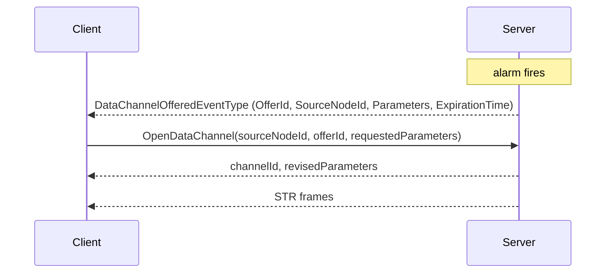
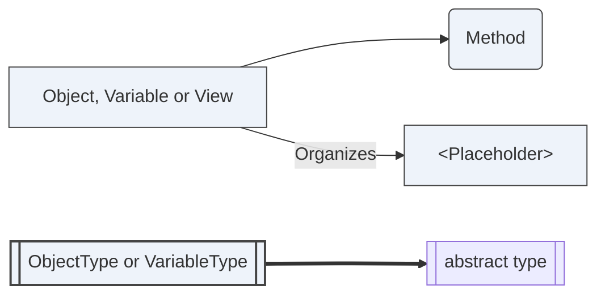
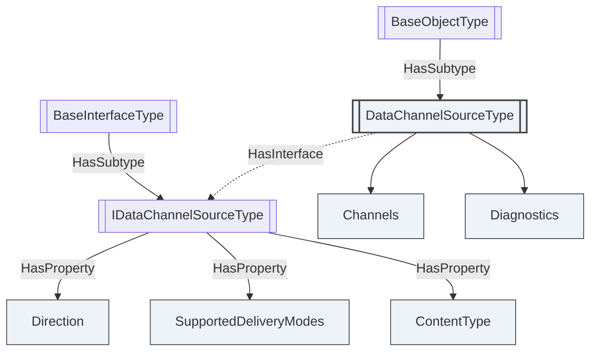

# OPC UA — Data Channels

**Working draft for submission to the OPC Foundation Working Group**
**Proposed additions to:** OPC 10000-3 Address Space Model, OPC 10000-4 Services, OPC 10000-6 Mappings (v1.05.07), with instance declarations in OPC 10000-5 and Profiles in OPC 10000-7
**Namespace:** `http://opcfoundation.org/UA/` (base OPC UA namespace)
**Version:** 0.1.1 · **Date:** 2026-07-29

> **Status — working draft.** This is the **standalone combined read**. It merges the three insertion-ready errata documents — [Part 6 transport](OPC-UA-Part6-Data-Channel-Transport.md), [Part 4 Services](OPC-UA-Part4-Data-Channel-Services.md) and [Part 3 model](OPC-UA-Part3-Data-Channel-Model.md) — into one narrative, and adds the material a standalone reader needs: a worked audio/video example, a comparison against WebRTC, and guidance on when to use a data channel instead of FileTransfer, PubSub or a Subscription. **The three errata documents remain the authoritative, insertion-ready proposals**; where this document and one of them differ, the errata document is correct. Nothing here is normative or endorsed by the OPC Foundation.

---

## 1 Scope

A **data channel** is a named, authorized, flow-controlled, bidirectional stream of opaque bytes multiplexed onto an OPC UA SecureChannel that is already open.

This specification defines data channels end to end: the frame that carries them, the transports that carry the frame, the Services that create them, the AddressSpace model that describes where they may be created, and the conformance units that group all of it. It targets the capability set of WebRTC — many concurrent media and data streams, priority, backpressure, partial reliability, round-trip feedback, unreliable datagrams — obtained from the connection an OPC UA Client already has, with the certificates it already validated and the user identity it already authenticated.

It does not define codecs, packetization, presentation timing, media negotiation, peer-to-peer connectivity or NAT traversal. A channel carries octets qualified by an IANA media type; what those octets mean is the application's business.

## 2 The problem

OPC UA moves data by asking for it. `Read` returns a value, `Publish` returns a batch of notifications, `HistoryRead` returns a page of samples, and Part 5 `FileType` returns a slice of a file to a Client that keeps asking for the next one. Every one of those is a complete request paired with a complete response, and the Secure Conversation layer is built for exactly that shape: a Message is chunked, every chunk is reliable and ordered, and nothing is interpreted until the whole Message has arrived.

Three message types exist on that layer — `MSG`, `OPN` and `CLO` — and all three are request/response. The connection protocol below adds `HEL`, `ACK`, `ERR` and `RHE`, and negotiates only static buffer limits. Nowhere in OPC UA can an application say *"start sending, keep sending, here is how much I can absorb, throw away anything older than 40 ms, and stop when I say so."*

Yet that is what a camera needs. And a microphone, a log tail, a point cloud, a firmware image being pushed to a drive, a remote console, a waveform capture. These produce a continuous flow whose value decays with age. The operations that suit them — start, throttle, prioritize against other traffic, discard what is already too late to matter, stop — have no expression in the protocol at all.

A further case, noted here and deliberately deferred, is **inline PubSub**: carrying Part 14 DataSetMessages, and the UAFX communication relationships built on them, over a data channel rather than over a separate PubSub connection. The fit is good — a WriterGroup is a stream, and the QoS a UAFX connection needs is what §5 already provides — but it requires DataSetWriter and DataSetReader binding rules that belong in a Part 14 errata rather than here. This specification neither provides nor precludes it; the content type and the delivery modes are the extension point it would use.

So they are solved beside it. A vendor puts RTSP on port 554 next to the OPC UA endpoint on 4840, or gRPC, or a bespoke socket. That means a second port through the firewall, a second handshake, a second set of certificates, a second authorization model with no relationship to the OPC UA user identity, and a second thing to diagnose when it stops working — for data that came off the same device and is governed by the same policy as the data flowing over OPC UA.

The sharpest case is reverse connect. A Server behind NAT or behind a one-way plant firewall may have no listening port at all: it reaches its supervisory Client by opening the transport connection itself, sending `RHE`, and letting the Client answer with `HEL` as OPC 10000-6 §7.1.3 already permits. In that topology a second media port is not merely an inconvenience to be justified to a firewall administrator; it is unobtainable, because nothing on the Server is allowed to listen. The only workable place to carry the stream is therefore the connection the Server already opened, and a data channel does that without creating a single additional inbound media port in either direction.

Data channels close that gap on the connection that is already open.

## 3 Design overview

### 3.1 Two channel models

Everything in this specification is one of two arrangements, and the distinction is worth making before any detail, because it explains why two transports exist and why they behave differently.

| | **Inline channel model** | **Outer-protocol channel model** |
|---|---|---|
| Where the channel lives | Inside the OPC UA Secure Conversation byte stream, as an additional `MessageType` interleaved with `MSG` chunks | In the underlying transport's own multiplexing, one transport stream per data channel |
| Example transports | `opc.tcp`, `opc.wss` (§4-§5) | `opc.quic` (§9), `opc.wt` (§10) |
| Who provides multiplexing | This specification, through the `ChannelId` in the stream header | The transport |
| Who provides flow control | This specification, through credit windows (§5.1) | The transport for stream-carried payload, so `CREDIT` frames are not sent; datagram-carried payload keeps the credit window, because datagrams are not flow-controlled |
| Who provides loss | Nobody — the transport is reliable, so "lossy" modes become sender-side discard | The transport, genuinely, through QUIC DATAGRAM or WebTransport datagrams |
| Frame security | UA-SC message security, end to end | The transport's, plus the binding obligations of §9.5 and §10.6 |
| Deployment cost | None; works on every deployed endpoint | A new transport and a new endpoint |

The frame layout above the Message header, the Services and the AddressSpace model are **identical** in both. An application is written once and does not know which model carries it; only the four properties in §3.3 differ.

The models are not a strict hierarchy. WebSockets is listed under the inline model because OPC UA carries UACP over it as an opaque byte stream (`opcua+uacp`, one MessageChunk per binary frame), and this specification changes nothing there. HTTP/3 is the exception this specification now defines through WebTransport: `opc.wt` (§10) uses a WebTransport session as an outer-protocol binding, with one WebTransport stream underneath each stream-carried data channel and WebTransport datagrams where genuine loss is requested. HTTP/2 is still deferred, and would need its own treatment for the same reason — the carrier has streams of its own — so a reader must not assume that `opc.wss` remains inline under every future WebSocket or HTTP carrier.

### 3.2 The design in one page

**A frame is a MessageChunk.** Inline framing adds one Secure Conversation `MessageType`, `STR`. Its Message header, security header, sequence header and footer are byte-for-byte those of a `MSG` chunk, so the securing, verification, sequence-number and token-rollover rules of OPC 10000-6 §6.7 apply with no change at all. The only new bytes are a twelve-byte stream header at the front of the encrypted body.

**A frame is never chunked.** This is the constraint everything else rests on. A multi-chunk frame would sit in the existing chunk assembler and block every other Message on the connection until it completed — precisely the failure a streaming layer exists to prevent. An application unit larger than one frame is segmented by flags in the stream header instead.

**The handshake does not change.** `Hello` and `Acknowledge` are untouched and `ProtocolVersion` is not bumped, so a data-channel-capable Client and a legacy Server still connect; the capability is simply never advertised. Negotiation happens at the Service level, which costs a round trip the Client was making anyway. §8 states the interoperability rules this implies, which matter more than they first appear: an unrecognized `MessageType` closes a SecureChannel, so a capable peer never speaks first.

**Ownership and authorization are separate.** A channel is owned by the SecureChannel, because that is where its bytes flow and it cannot outlive that. It is authorized by the Session, because that is where the user identity is, and `OpenDataChannel` is checked against the source Node's `RolePermissions` and `AccessRestrictions` exactly as the equivalent Service call would be — **per direction**, since an outbound channel is a read but an inbound one writes Client-supplied content into the Server and needs the permission that governs writing it. Every Service in the set is scoped to **both** — a SecureChannel may carry several Sessions, and ChannelIds are guessable — and the authorization is re-evaluated rather than granted once, so revoking a permission actually terminates the stream it was protecting. Renewing the channel token does not disturb a channel; closing the Session revokes it.

**Streamability is an Interface.** No new Node Attribute, no new NodeClass. A type becomes streamable by adding one `HasInterface` reference to `IDataChannelSourceType`, so its supertype is untouched and every existing Client sees exactly what it saw before.

### 3.3 What the outer-protocol model adds

`opc.quic` (§9) and `opc.wt` (§10) are the outer-protocol bindings this specification defines. They add the transport's own multiplexing below OPC UA, and with it the properties the inline model cannot express by itself:

| Property | Inline (`opc.tcp`, `opc.wss`) | Outer-protocol (`opc.quic`, `opc.wt`) |
|---|---|---|
| Head-of-line blocking between channels | None between channels, but TCP still orders the whole connection | None; QUIC or HTTP/3 orders each stream independently |
| Genuine in-flight loss | Impossible; lossy modes become sender-side discard | Real when the carrier exposes datagrams: QUIC DATAGRAM for `opc.quic`, WebTransport datagrams for `opc.wt` |
| Survival of a network path change | The connection dies | Survives on a direct QUIC path; a terminating HTTP intermediary moves the endpoint to the proxy |
| Flow control | Credit windows defined here | The transport's own for streams; the §5.1 credit window remains for datagrams |

An implementation that supports only the inline model is a complete implementation of this specification. The two outer-protocol transports serve different deployments: `opc.quic` is the direct QUIC mapping, while `opc.wt` spends some purity to look like HTTP/3 where that is the only traffic a network will admit.

## 4 The frame

### 4.1 Layout

```text
Message header            12 bytes   MessageType[3]='STR' · IsFinal='F' · MessageSize · SecureChannelId
Symmetric security header  4 bytes   TokenId                    | inline framing only
Sequence header            8 bytes   SequenceNumber · RequestId | inline framing only
--------------------------------------------- start of the secured body
Stream header             12 bytes   ChannelId · FrameType · Flags · Reserved · FrameSequenceNumber
Deadline                   8 bytes   present only when the DeadlinePresent flag is set
Frame type fields         0-8 bytes  determined by FrameType
Payload                    varies    DATA frames only
--------------------------------------------- end of the secured body
Message footer             varies    PaddingSize · Padding · Signature   | inline framing only
```

`SequenceNumber` is the SecureChannel's single monotonic sequence, shared with `MSG`, `OPN` and `CLO`, because that sequence is a security mechanism and splitting it per channel would weaken replay and injection detection. `RequestId` is `0`: a frame is not a Service invocation, and folding the ChannelId into it would risk colliding with a Client-allocated RequestId in flight. Per-channel ordering is provided separately by `FrameSequenceNumber`, inside the secured body where it cannot affect the security property.

Annex B gives the annotated bytes of every frame type, generated from the reference codec.

### 4.2 Frame types

| Value | Name | Extra fields | Purpose |
|---|---|---|---|
| 0 | `DATA` | — | Carries payload. The only frame type that does. |
| 1 | `CREDIT` | `ChannelCredit`, `ConnectionCredit` | Grants flow control window. |
| 2 | `GAP` | `FirstDiscarded`, `LastDiscarded` | Reports a run of frames that will never arrive. |
| 3 | `RESET` | `StatusCode` | Aborts one channel, leaving the connection intact. |
| 4 | `END` | — | Orderly half-close of one direction. |
| 5 | `PING` | `Timestamp` | Round-trip probe and keepalive. |
| 6 | `PONG` | `Timestamp` | Echo, copying `Timestamp` verbatim. |

ChannelId `0` is reserved for connection-level control and carries only `CREDIT`, `PING` and `PONG`. Separating it is what lets the connection window be replenished while every individual channel is stalled.

### 4.3 The five flags

`MessageStart` and `MessageEnd` delimit a logical application message across frames — the segmentation that replaces chunking. `Droppable` and `DeadlinePresent` mark a frame the sender may discard once it is too late to be useful; the deadline is on the sender's own clock and is never compared across the connection, so no clock synchronization is needed. `Marker` flags an application-defined synchronization point such as a video key frame, so a receiver recovering from a gap knows where it can resume without understanding the payload.

## 5 Flow control, scheduling and loss

### 5.1 Credit

Every channel has a byte window, and the connection has one too, **maintained independently for each direction**. A sender may not transmit a `DATA` frame whose payload exceeds either. Control frames are exempt — a creditable `CREDIT` frame would deadlock a stalled channel permanently, and a channel that cannot be reset or probed while stalled cannot be recovered.

Two obligations make the window usable rather than merely defined. Connection credit starts at **zero** and each peer must announce it within one round trip — the Server on accepting the first channel, the Client on receiving its first response — so a sender always knows whether it is waiting for a grant that is coming or one that never will. Each obligation is triggered by the *peer's* need to send rather than the granter's, because a `CREDIT` frame flows opposite to the data it authorizes: on a `SourceToSink` camera feed the Client never sends payload at all, so a Client obligation conditioned on its own sending would leave the feed blocked forever with both peers conformant. And a receiver **shall** replenish: once it has consumed and released payload and its outstanding grant has fallen below half the last grant or one frame, whichever is larger, it must grant again. Without that a receiver could legally consume its whole window and stall the channel forever while remaining conformant.

The result is that backpressure is *per channel and per direction*: a consumer that cannot keep up with a video stream stalls that stream and nothing else. The connection window exists so the sum of channels cannot exhaust the receiver even when each is individually within its window. Over `opc.quic`, and over `opc.wt` when payload is carried on streams, the mechanism is replaced by the transport's own flow control, no `CREDIT` frames are sent, and the "no `DATA` before a grant" gate does not apply. Datagram-carried payload is the exception: datagrams are not flow-controlled, so the §5.1 credit window still bounds the receiver.

### 5.2 Two scheduling obligations

1. **Service traffic has precedence.** A sender shall not delay a `MSG`, `OPN` or `CLO` chunk by more than the transmission of one maximum-size frame. Without this, a saturated video channel starves the `Publish` response path and the Session dies of a keep-alive timeout on a connection that is demonstrably busy. In Service terms: a Server that cannot keep up shall stall data channels — the credit window is exactly the mechanism — rather than delay `Publish`. Losing video is recoverable; losing the Subscription that reports the alarm is not.
2. **No channel starves.** Priority (0 to 7) determines *share*, never *exclusivity*.

Both are realized by a deficit round robin whose per-round quantum is (`Priority` + 1) × `MaxFrameSize`, with one Service chunk drained after each data frame. The quantum is normative-by-recommendation in the Part 6 errata §5.7 rather than left to the implementer, because "priority weighting" without a stated quantum produces different bandwidth shares in different implementations. `core-specs/extras/data-channels/tools/scheduler_demo.py` is an informative executable realization.

### 5.3 State, and what "unreliable" means

A channel moves through `Opening` → `Open` ⇄ `Paused` → `Closing` → `Closed`, with `Faulted` reachable from anywhere. The Part 6 errata §5.13 gives the full transition table — which event causes which transition, which are legal, and what may be sent in each state — and the Part 6 errata §5.14 names the four timeouts (`OpenTimeout`, `DrainTimeout`, `PingTimeout`, `IdleTimeout`) that bound the states which would otherwise be open-ended. **`Paused` and `Closing` are both per direction**: a channel is `Paused` only in the direction whose window is exhausted, and receiving `END` ends the peer's direction without touching this peer's own — which is what makes `END` a half-close rather than a close, and what stops a half-close from destroying a long transfer the other end is still legitimately making. The `Open` ⇄ `Paused` transition is rate-limited to one Event per channel per second so that a saturated channel does not generate an Event per credit stall.

| Mode | Inline framing over TCP | Outer-protocol datagram transport (`opc.quic`, `opc.wt`) |
|---|---|---|
| `ReliableOrdered` | Exact. | Exact, on one transport stream. |
| `ReliableUnordered` | Every frame arrives; the receiver may skip reassembly buffering. | Carried on the channel's transport stream; ordered by the transport, so the saving is buffering rather than latency. |
| `PartiallyReliable` | Sender-side: a droppable frame still queued at its deadline is discarded. `MaxRetransmits` has no effect. | Retransmission over datagrams up to `MaxRetransmits` or the deadline, when datagrams are available; otherwise sender-side discard. |
| `Unreliable` | Sender-side discard only. Once a byte is written to the socket, TCP will deliver it. | Exact when datagrams are available. Refused when they are not. |

For inline framing, **loss happens in the send queue, not on the wire**. This specification says so plainly rather than implying otherwise. It is still a real and useful property — it bounds latency and discards stale media in favour of fresh media — and it is what a TCP-based media path can offer. A Server that needs genuine in-flight loss offers an `opc.quic` endpoint (§9) or an `opc.wt` endpoint (§10) with datagrams available, and advertises that capability through `SupportsUnreliableDatagrams`, so a Client learns the difference by reading rather than by measuring.

When frames are discarded, the sender emits one `GAP` frame **per contiguous run** of discarded sequence numbers — never a single widened range, which would declare a surviving frame lost and then transmit it. A receiver also detects loss on its own from a `FrameSequenceNumber` discontinuity, using the serial-number arithmetic of the Part 6 errata §5.2.1, which is applied to `DATA` frames only: a control frame carries a sequence number but never advances the receiver's high-water mark, or a `GAP` announcing an expiry would push it past a lower-numbered survivor and the receiver would discard as a duplicate exactly the frame the per-run rule protects. The same arithmetic distinguishes a genuine gap from the counter wrapping and from a datagram retransmission. This matters over DATAGRAM where the `GAP` may itself be lost. Without gap information a media decoder cannot tell a stall from a loss, and so cannot decide whether to conceal or to wait.

## 6 DataChannel service set

Three Services create, adapt and destroy a data channel. They are placed before the transport bindings because they are the layer an application actually programs against, and because they are identical whichever channel model (§3.1) carries the frames.

Each call opens, modifies or closes exactly one channel. A batched form was rejected: a partial success would leave the Client holding channels it did not want and could not name in the failure.

Parameter negotiation is by **revision, not rejection**, wherever the Server can honour a weakened form of the request. Two members are the exception: `Direction` and `DeliveryMode` are never revised, because silently strengthening a delivery guarantee adds unbounded latency to a media channel and silently weakening one loses data. Both are rejected outright when unsupported.

### 6.1 OpenDataChannel

Opens a data channel on a data channel source, or accepts a Server offer (§6.4).

**Request**

| Name | Type | Description |
|---|---|---|
| requestHeader | RequestHeader | Common request parameters (OPC 10000-4 §7.32). |
| sourceNodeId | NodeId | The data channel source. **Shall** be a Node implementing `IDataChannelSourceType`, directly or reached through `HasDataChannel`. |
| offerId | UInt32 | `0` for a Client-initiated open; otherwise the `OfferId` being accepted, and `sourceNodeId` **shall** match the offer. |
| transportChannelId | UInt64 | Over an outer-protocol transport, the id of a carrier the Client has already opened. Over `opc.quic` and `opc.wt` this is present for Client-opened directions (`SinkToSource` and `Bidirectional`). Always `0` for inline framing and for directions whose carrier is opened by the Server. |
| requestedParameters | DataChannelParametersDataType | The parameters requested. `0` in a numeric member means *no preference* (§6.6). |

**Response**

| Name | Type | Description |
|---|---|---|
| responseHeader | ResponseHeader | Common response parameters (OPC 10000-4 §7.33). |
| channelId | UInt32 | Identifier of the new channel within the owning SecureChannel. Never `0`, which is reserved for connection control. |
| revisedParameters | DataChannelParametersDataType | The parameters actually in force. |
| revisedTransportChannelId | UInt64 | The transport identifier in force: the QUIC stream id over `opc.quic`, the WebTransport stream id over `opc.wt`, `0` for inline framing. It echoes a Client-supplied id after validation, or carries the Server-selected id when the Server opened the carrier. It is not named `transportChannelId` because no OPC UA Service reuses a parameter name across a request and its response, and the model compiler rejects one that does. |

**Parameter revision**

| Parameter | Rule |
|---|---|
| `Direction` | Not revisable. Unsupported → `Bad_DataChannelDirectionUnsupported`. |
| `DeliveryMode` | Not revisable. Absent from `SupportedDeliveryModes` → `Bad_DeliveryModeUnsupported`. |
| `ContentType` | May be narrowed to a more specific type the Server will produce. Unproducible → `Bad_ContentTypeUnsupported`. |
| `ContentParameters` | The effective set is returned. Entries the Server does not understand are **omitted** rather than echoed, so the Client sees what took effect. |
| `MaxFrameSize` | Revised down to the least of the request, the source's limit, the Server's limit and the transport bound. Never up. |
| `InitialCredit` | Revised down to `MaxCreditPerChannel`, and up where necessary to at least the revised `MaxFrameSize` — a window smaller than one frame is an immediate deadlock. |
| `Priority` | Revised down where the Server reserves the higher bands. `255` selects the source's default; other values above `7` revise to `7`. |
| `MaxRetransmits`, `FrameDeadline` | Revised into the Server's supported range, and returned as `0` where the transport is already reliable so the Client can see they had no effect. |

**Preconditions.** The Session **shall** be activated. The transport **shall** support data channels. The SecureChannel SecurityMode **shall not** be `None` unless the source Node permits it. The open **shall not** exceed `MaxDataChannels` for the connection or `MaxChannels` for the source.

**Error conditions**

| Symbolic id | Condition |
|---|---|
| `Bad_ServiceUnsupported` | The Server does not implement this Service Set. Returned by a legacy Server; see §8. |
| `Bad_NodeIdUnknown`, `Bad_NodeIdInvalid` | `sourceNodeId` does not exist, or is malformed. |
| `Bad_DataChannelNotSupported` | The Node exists but is not a data channel source. |
| `Bad_DataChannelTransportUnsupported` | This transport cannot carry data channels (for example OPC UA HTTPS). |
| `Bad_DataChannelDirectionUnsupported` | The requested `Direction` is not supported by the source. |
| `Bad_DeliveryModeUnsupported` | The requested `DeliveryMode` is not supported, or a datagram mode was requested where the selected transport cannot provide datagrams. |
| `Bad_ContentTypeUnsupported` | The `ContentType` cannot be produced or consumed. |
| `Bad_TooManyDataChannels` | A channel-count limit would be exceeded, or the ChannelId space is exhausted. |
| `Bad_DataChannelLimitsExceeded` | A parameter is outside anything the Server can revise to, or `transportChannelId` is missing where the selected outer-protocol mapping requires the Client to provide it. |
| `Bad_DataChannelOfferInvalid` | The offer is unknown, expired, already accepted, or does not match `sourceNodeId`. |
| `Bad_SecurityModeInsufficient` | SecurityMode is `None` and the source does not permit it. |
| `Bad_UserAccessDenied` | The Session's user identity is not permitted to open a channel on this Node. |
| `Bad_Timeout` | `OpenTimeout` expired before the channel reached `Open`. |
| `Bad_SessionIdInvalid`, `Bad_SessionNotActivated` | Common Session faults (OPC 10000-4 Table 178). |

**Effect.** The channel enters `Opening`, then `Open`. An `AuditOpenDataChannelEventType` Event is generated on **every** attempt, successful or refused: a data channel moves content out of the Server continuously and outside the Service path, so the authorization decision is the only moment an audit trail can capture it. No frame for the assigned ChannelId is transmitted before the response has been handed to the transport.

### 6.2 ModifyDataChannel

Changes the mutable parameters of a running channel — mid-call renegotiation, so that an adaptive encoder dropping from 1080p to 720p adjusts rather than tearing the channel down and losing its pipeline.

**Request**

| Name | Type | Description |
|---|---|---|
| requestHeader | RequestHeader | Common request parameters. |
| channelId | UInt32 | The channel. **Shall** belong to the SecureChannel carrying the request **and** have been authorized by the Session carrying it. |
| requestedParameters | DataChannelParametersDataType | The new parameters. `Direction` and `DeliveryMode` **shall** equal the values in force. |

**Response**

| Name | Type | Description |
|---|---|---|
| responseHeader | ResponseHeader | Common response parameters. |
| revisedParameters | DataChannelParametersDataType | The parameters now in force, revised by the §6.1 rules. |

**When a change takes effect.** There is no `MODIFY` frame, so the revised parameters reach only the caller, and over outer-protocol transports the response and the frames are not ordered relative to each other. A reduced `MaxFrameSize` therefore applies from the next logical message boundary at the sender, and a receiver keeps accepting the previous size until it sees a `MessageStart` frame within the new one. A revised `Priority` applies from the next scheduling round. A revised `FrameDeadline` applies only to frames enqueued afterwards. A changed `InitialCredit` alters only the size of future grants.

A Server cannot initiate a modification, because the Service is Client-invoked; a Server needing new terms resets the channel and offers a replacement.

**Error conditions:** `Bad_DataChannelIdInvalid` (unknown, or authorized by another Session), `Bad_DataChannelClosed`, `Bad_DataChannelLimitsExceeded` (including any attempt to change `Direction` or `DeliveryMode`), `Bad_UserAccessDenied`, plus the common Session faults.

### 6.3 CloseDataChannel

Closes a data channel and drives the frame-level `END` or `RESET` that realizes it.

**Request**

| Name | Type | Description |
|---|---|---|
| requestHeader | RequestHeader | Common request parameters. |
| channelId | UInt32 | The channel. Scoped to the SecureChannel **and** the authorizing Session, as in §6.2. |
| reason | StatusCode | `Good` for a normal close; any other value is recorded in the state-change Event and the audit trail. |
| deleteQueued | Boolean | `True` discards queued frames and closes immediately; `False` drains them first, bounded by `DrainTimeout`. |

**Response**

| Name | Type | Description |
|---|---|---|
| responseHeader | ResponseHeader | Common response parameters. |

**Realization.** With `deleteQueued` `False` each side emits `END` in the directions it owns once its queue has drained; the channel reaches `Closed` when every direction has ended. With `deleteQueued` `True` the Server discards its queues and emits `RESET` carrying `reason` — and the StatusCode decides the outcome on **both** peers, because it is the only wire signal distinguishing the two cases: `Good` reaches `Closed`, a Bad code reaches `Faulted`. A ChannelId is never reassigned while its SecureChannel is open, so a late frame from a previous occupant can never reach a successor.

Closing an already-closed channel returns `Bad_DataChannelClosed` rather than `Good`: a Client that lost track of a channel needs to know whether it closed something or nothing.

**Error conditions:** `Bad_DataChannelIdInvalid`, `Bad_DataChannelClosed`, `Bad_UserAccessDenied`, plus the common Session faults.

### 6.4 Server-initiated channels without inverting the model

A Server often knows before the Client does that a stream should start — an alarm fired and the camera that saw it should push video. OPC UA Services are request/response and a Server cannot call a Client, so this specification offers instead of pushing:



The offer arrives on an ordinary Subscription, so no new notification mechanism is introduced. The Client may revise the offered parameters downward when it accepts. It declines by doing nothing, and the offer lapses at `ExpirationTime`, so an unaccepted offer cannot pin Server resources. An `OfferId` is single-use and scoped to the SecureChannel it was delivered on, and acceptance still runs the full §6.1 authorization. A Client that never subscribed never learns of the offer — which is the correct outcome, because a Server must not be able to push bytes at a Client that has not asked for them.

### 6.5 Lifecycle

| Event | Effect on open channels |
|---|---|
| SecureChannel token renewal | **None.** Aborting streams every renewal interval would make long-lived media impossible. |
| SecureChannel closed or transport lost | **All aborted.** |
| Session closed, or `ActivateSession` with a different user identity | **All channels it authorized are aborted.** An authorization granted to one identity is never carried across to another. |
| `ActivateSession` on a new SecureChannel | **All aborted.** A channel is bound to a transport and cannot be moved; the Client reopens. |
| Source Node permissions or Session Role set changed | **Re-evaluated**, and aborted with `Bad_UserAccessDenied` on a negative result. Re-evaluation also happens at least every `AuthorizationRecheckInterval`. |
| Subscription deleted | **None.** Channels are independent of Subscriptions. |

Frames are **not** Session activity for the purpose of the Session timeout. A Client streaming for an hour without a Service call is idle by every definition Part 4 uses, and treating frames as activity would let a compromised transport keep a Session alive indefinitely without the user ever being re-checked.

No resume token is defined. Resumption would have to replay the sender's queue across a connection the peer can no longer authenticate as the same one, and for live media the queue is worthless by then. Bulk transfer that needs resumability carries its own offset in the payload, which is what the content type is there to describe.

### 6.6 Defaults, ranges and the no-preference sentinel

`DataChannelParametersDataType` has no optional fields, so a Client with no opinion about a parameter must still send a value. `0` is that value.

| Parameter | Unit | Valid range | `0` means | Server default when `0` |
|---|---|---|---|---|
| `MaxFrameSize` | bytes | 1 .. 2^32−1 | no preference | least of source, Server and transport bounds |
| `InitialCredit` | payload bytes | 1 .. 2^32−1 | no preference | Server-chosen, at least the revised `MaxFrameSize` |
| `Priority` | — | 0 .. 7, or `255` | `0` is the lowest priority, **not** a sentinel; `255` means no preference | the source's `Priority`, else `0` |
| `MaxRetransmits` | attempts | 0 .. 65535 | no retransmission | `0` |
| `FrameDeadline` | ms | ≥ 0 | no deadline | `0`; `Droppable` **shall not** be set |
| `MaxBitrate` | bit/s | — | unconstrained | the source's `MaxBitrate` |

`Priority` is the one member for which `0` is a real value, which is why `255` is its no-preference encoding — without it the source's own default could never take effect.

## 7 The model

The AddressSpace figures in this document use the OPC UA graphical notation of OPC 10000-3. A Node of an instance NodeClass — Object, Variable or View — is a plain rectangle, a Method is a rounded rectangle, and a type — ObjectType, VariableType, ReferenceType or DataType — is a rectangle standing on a shadow. An abstract type is set in *italics*, and a Node whose BrowseName is a placeholder is written in angle brackets. A `HasTypeDefinition` reference carries a solid arrowhead; a `HasComponent` reference is the plain unlabelled arrow; every other ReferenceType is drawn with its BrowseName on the arrow, and a `HasInterface` reference is dashed. A figure shows the part of the model its clause describes, never the whole of it.



**`IDataChannelSourceType`** is the Interface a streamable type implements. Its Mandatory Properties — `Direction`, `SupportedDeliveryModes`, `ContentType` — are the three facts without which a channel cannot be negotiated. Its Optional ones — `MaxFrameSize`, `MaxBitrate`, `Priority`, `MaxChannels` — are the limits a Client checks before committing. `MaxBitrate` is what lets a Client on a constrained link choose the substream instead of discovering the problem as discarded frames ten seconds in.

The Interface and the three facts a negotiation needs, and the concrete Object that implements it:

<!-- model-figure: root=i=65010 require=mandatory external=BaseInterfaceType,BaseObjectType -->



A type gains the capability by adding one `HasInterface` reference. No supertype changes, no NodeId changes, no new required model. A companion specification that has already shipped can adopt this in a revision without breaking a single existing instance.

**`DataChannelSourceType`** is the concrete Object for a Server that needs somewhere to hang an endpoint — a camera with a main and a substream models two of them and points at both with `HasDataChannel`. It adds `Channels` and `Diagnostics`, which is the operator's view: a rising `FramesDiscarded` says the source is outrunning the link, a rising `CreditStalls` says the consumer is outrunning nothing but itself, and a rising `RoundTripTime` says the path is congesting. Three different faults, three different remedies, and without the counters they look identical.

**`DataChannelCapabilities`** under `ServerCapabilities` is the Server-wide answer, and **its absence is how a Server says it does not support data channels at all** — a Client checks for the Object rather than learning the fact from a rejected call.

Three EventTypes report offers, state changes and audits. `AuditOpenDataChannelEventType` is raised on every attempt, **successful or refused**: a data channel moves content out of the Server continuously and outside the Service path, so the authorization decision is the only moment an audit trail can capture it.

The complete node reference is [Annex A](#annex-a).

## 8 Interoperability with implementations that do not support data channels

A `STR` frame carries a `MessageType` no existing implementation recognizes, and OPC 10000-6 §6.7.2.2 gives an unrecognized `MessageType` exactly one outcome: it is a protocol error and the receiver closes the SecureChannel. **One `STR` frame sent to a peer that does not implement this specification destroys the connection — every Session, Subscription and outstanding Service call on it.**

That consequence is severe enough to be a protocol rule rather than an implementation note, and it is deliberately independent of the AddressSpace: a Client must be able to establish interoperability at this layer without first browsing or reading anything.

**Support is proved by the Service, never assumed and never probed with a frame.**

- No peer transmits a `STR` frame on a SecureChannel until an `OpenDataChannel` on that SecureChannel has completed successfully. That response is the only admissible evidence the peer implements this specification.
- No peer probes by sending a frame and seeing whether the connection survives. Such a probe is indistinguishable from an attack, and its failure mode is the loss of the whole connection.
- A Server that does not implement the Service Set returns `Bad_ServiceUnsupported`, as OPC 10000-4 requires of any unimplemented Service. A Client treats that — and `Bad_DataChannelNotSupported` — as definitive for the SecureChannel and does not retry with frames.
- The absence of the `DataChannelCapabilities` Object (§7) is an earlier and cheaper signal, but a Client does not depend on it: a Server may restrict Browse, and a Client may need a channel before its AddressSpace is usable.

**Both asymmetric pairings are safe by construction.**

| Pairing | What happens |
|---|---|
| **Legacy Client, capable Server** | The Client never calls `OpenDataChannel`, so no channel exists, and §4 already forbids a frame naming a ChannelId that is not open. A Server never offers a channel by sending frames; it offers through an Event the Client must have subscribed to (§6.4). |
| **Capable Client, legacy Server** | `OpenDataChannel` returns `Bad_ServiceUnsupported` and the SecureChannel is untouched. The Client falls back to FileTransfer, Subscriptions or PubSub as Annex E describes, and sends no frames. |
| **Capable Client, capable Server** | The successful response is the mutual proof, and frames follow. |

Because a capable peer never speaks first, a capable and a legacy implementation interoperate with no negotiation, no version bump and no special case on either side. This is what leaving `Hello` and `Acknowledge` unmodified buys, and it is why that decision is worth its cost.

**Intermediaries.** A gateway, aggregating Server or protocol bridge that relays MessageChunks between SecureChannels does not forward a `STR` frame onto a SecureChannel on which it has not itself completed an `OpenDataChannel`. An intermediary that does not implement this specification rejects the frame as it would any unrecognized `MessageType`, and does **not** silently drop it: silently discarding payload the sender believes was delivered is worse than closing the connection, because the sender has no gap to detect and no `GAP` frame will ever arrive.

**Version skew within this specification.** A peer implementing this specification but not an optional conformance unit refuses at the Service level with the StatusCode for that unit — `Bad_DeliveryModeUnsupported`, `Bad_DataChannelTransportUnsupported` and the rest of §6.1 — never by dropping frames. Every capability difference is visible in a Service response before a single frame is sent.

## 9 The QUIC transport

### 9.1 Why an outer-protocol binding

`opc.quic` is the outer-protocol channel model of §3.1. QUIC provides, in the transport, what §4 and §5 have to construct by hand: many independently ordered and independently flow-controlled streams over one connection, a datagram extension that really can lose a packet, congestion control, and an identity for the connection that survives the client's address changing.

Nothing above the transport changes. The same Services of §6 open a channel, the same model of §7 describes it, the same frames flow, and a Client with both endpoints available may choose either. What differs is only who provides multiplexing, flow control and loss — and §9.8 states how to choose.

### 9.2 URL scheme, ALPN and discovery

| Item | Value |
|---|---|
| URL scheme | `opc.quic` |
| TransportProfileUri | `http://opcfoundation.org/UA-Profile/Transport/quic-uasc-uabinary` |
| ALPN identifier (RFC 7301) | `opcua/1` — provisional, pending OPC Foundation registration |
| Default port | 4840 UDP; it does not collide with TCP 4840 |
| Encoding | OPC UA Binary, as for `opc.tcp` |

A Server offering both transports returns one `EndpointDescription` per transport from `GetEndpoints`, distinguished by `TransportProfileUri` and `EndpointUrl`. A Client **shall** perform ALPN negotiation and **shall** abandon the connection if the Server does not select the OPC UA identifier, so that a QUIC endpoint serving another protocol on the same port is never mistaken for an OPC UA Server.

### 9.3 Connection, control stream and channel streams

The first client-initiated bidirectional QUIC stream carries the UACP and Secure Conversation conversation — `HEL`, `ACK`, `ERR`, `OPN`, `MSG`, `CLO` — byte for byte as over `opc.tcp`. The QUIC connection is the TransportConnection; the SecureChannel is established on it by `OpenSecureChannel` exactly as today. Losing the control stream is losing the SecureChannel: every data channel is aborted.

Each data channel is then bound to its own QUIC stream, and the id travels in `transportChannelId`:

| Direction | QUIC stream | Initiator | Where the id is carried |
|---|---|---|---|
| `SourceToSink` | server-initiated unidirectional | Server | `OpenDataChannel` **response** |
| `SinkToSource` | client-initiated unidirectional | Client | `OpenDataChannel` **request**, echoed in the response |
| `Bidirectional` | client-initiated bidirectional | Client | `OpenDataChannel` **request**, echoed in the response |

`OpenDataChannel` is always Client-invoked, so for the two Client-initiated directions the Server cannot report an id it does not allocate. The Client opens the stream before calling, carries the id in the request, and writes nothing to it until the response arrives.

A QUIC stream carries frames in **QUIC framing**: Message header, stream header, payload, nothing else. The UA-SC security header, sequence header and footer are omitted under the `TransportSecured` profile because TLS 1.3 already authenticates and encrypts, and QUIC already orders and deduplicates each stream. `MessageSize` remains authoritative, so a stream is self-delimiting.

Because QUIC applies its own flow control, `CREDIT` frames **shall not** be sent over `opc.quic`; duplicating the window in two layers gains nothing and deadlocks when the two disagree. `RESET` is realized as QUIC `RESET_STREAM` with the StatusCode in the application error code.

**Reverse connect** works over `opc.quic` unchanged — the Server opens the QUIC connection and sends `RHE`, the Client replies `HEL`, and everything above the transport proceeds as normal. It is worth one note because it inverts the *transport* roles: the OPC UA Server holds the QUIC client role, so the QUIC stream **types** in the table above invert while the OPC UA initiator and the `transportChannelId` direction do not, and the TLS server certificate that §9.5 binds is then the **Client's**. The Part 6 errata §7.10 states both consequences.

### 9.4 Unreliable datagrams

Where the negotiated mode is `Unreliable`, or `PartiallyReliable` with the QUIC DATAGRAM extension available at both ends, `DATA` frames are sent as QUIC DATAGRAM frames (RFC 9221) rather than on the channel's stream. Control frames always use the stream, so a `RESET` or an `END` is never lost.

One datagram carries exactly one frame, which **shall** fit `max_datagram_frame_size`; fragmenting across datagrams is not permitted, because one lost fragment would destroy a frame the receiver could otherwise have used in part. Where the peer advertises no datagram support, the Server **shall** reject the request with `Bad_DeliveryModeUnsupported` rather than silently carrying it reliably on the stream and delivering a guarantee the application did not budget latency for.

QUIC DATAGRAM frames are congestion-controlled but consume no stream or connection flow-control credit, so the delegation of §3.1 does not extend to them: datagram-carried `DATA` keeps the credit window of §5.1, which is what bounds a receiver's buffers when the transport is not doing it.

Together with WebTransport datagrams in §10.4, this is where payload is genuinely lost in transit, which is why `FrameSequenceNumber` is the receiver's own loss detector and a `GAP` frame is advisory.

### 9.5 Security and the TLS binding

QUIC mandates TLS 1.3, so `opc.quic` is transport-secured in the sense of OPC 10000-6 §7.4. Two layers are available and the specification is explicit about which does what.

The **control stream** keeps full UA-SC message security: `OpenSecureChannel` runs, the policy is negotiated, the application instance certificates authenticate the two applications, and SecurityMode is honoured. Application authentication and user authorization do not become TLS's job.

**Data channel frames** are protected by QUIC's TLS 1.3 record layer alone under the `TransportSecured` profile, avoiding a second cryptographic pass over bulk media. That is sound **only** because the two layers are bound **by key**: a Client validates the Server's TLS certificate and requires it to carry the same `subjectPublicKeyInfo` as both the `EndpointDescription.serverCertificate` it selected and the certificate returned by `OpenSecureChannel`. Name equality is deliberately not enough — a certificate asserting an `ApplicationUri` proves only that some CA in the Client's trust list issued it, and CAs commonly populate that field from the requester's own CSR, so an attacker holding any accepted certificate could otherwise claim the victim's identity. Without the key comparison, any party able to terminate QUIC between the two — a transparent proxy, an OT gateway, a redirected discovery URL — byte-forwards the end-to-end-secured control stream so that every check passes and both ends report an authenticated `SignAndEncrypt` channel, while reading, modifying and injecting every media frame in the clear. Over `opc.tcp` the same relay is harmless, because `MSG` chunks are secured end to end.

For that reason **`opc.quic` data channels shall not traverse an intermediary that terminates TLS**, and no profile is defined that would make them safe there: carrying full UA-SC security over QUIC is not available, because the Secure Conversation sequence number is one monotonic space per SecureChannel while QUIC spreads chunks across independently ordered streams and lossy datagrams. A deployment behind such an intermediary uses inline framing over `opc.tcp` or `opc.wss`, where the intermediary sees only ciphertext. **0-RTT shall not carry `OpenSecureChannel`, `OpenDataChannel` or any frame**: 0-RTT is replayable, and a replayed channel open is a replayed authorization.

Because that binding ties several artifacts together, **replacing a certificate moves them all at once**, and a peer that moves them independently breaks the binding with no attacker present. One question decides what happens, and it is not whether the certificate changed but whether the **key** changed:

- **Same key, re-issued certificate.** Nothing is disturbed. The binding is by `subjectPublicKeyInfo`, so a re-issue still satisfies it and every live connection stays valid. This is the common case for a scheduled renewal.
- **Different key.** TLS 1.3 fixes the certificate at handshake and cannot renegotiate, so a running connection cannot be moved to the new key. Activating it closes the connections bound to the old one, using a QUIC `CONNECTION_CLOSE` carrying `Bad_SecurityChecksFailed` rather than per-stream resets, which are not guaranteed to survive the close.

Two rules follow from not trusting the holder to police itself. A verifier closes a connection when it learns the bound certificate is revoked, untrusted or expired, whether that certificate is its peer's or its own. And because a resumed TLS session carries no certificate at all, a resumed connection inherits the identity of the handshake that issued its ticket — so tickets are invalidated when a key is activated, or resumption is disabled outright where the TLS stack cannot invalidate them.

These rules are easy to violate silently. The natural implementation resolves the TLS certificate once when the listener starts, while the certificate registry rotates underneath it; the resulting mismatch looks to the verifying peer exactly like the relay attack the binding exists to prevent. Part 6 errata §7.6.2 states the rules normatively and gives two flow diagrams, one for the peer holding the certificate and one for the peer verifying it.

Whether a *key* change may be staged, so long-lived media survives one, is left as an open question for the Working Group: granting it touches OPC 10000-12 and OPC 10000-4 rather than Part 6 alone.

### 9.6 Connection migration

TCP identifies a connection by its **four-tuple** — the source address, source port, destination address and destination port. Change any one of those four and it is a different connection, which is why a laptop moving from Wi-Fi to cellular loses everything built on it: the new source address makes a new four-tuple, and the old connection is simply gone.

QUIC identifies a connection by a **connection ID** carried in the packets instead, so the addresses may change underneath it without the connection ending. A Client whose address changes — a vehicle moving between access points, a handheld leaving Wi-Fi for cellular — keeps the same connection, SecureChannel, Session and every open data channel. Over `opc.tcp` all of it is destroyed and must be rebuilt, which for a media stream means an interruption the user sees.

A Server accepts migration under the RFC 9000 path-validation rules and does not abort on a validated path change, since the connection remains cryptographically bound to the same peer. It does, however, record the change in the audit trail and re-evaluate any authorization that depended on the peer's network location, aborting affected channels with `Bad_UserAccessDenied` — migration is precisely what lets an authenticated Client carry a live stream from an authorized segment onto an unauthorized one.

### 9.7 Congestion control

Congestion control is the transport's: RFC 9002 over `opc.quic`, TCP's over the inline transports. This specification defines no congestion controller and no rate signalling, because a second controller layered on the first oscillates against it.

What it does provide is what an application needs to adapt: `PING`/`PONG` round-trip measurement, the credit-stall counter and the discarded-frame counter. An adaptive encoder lowers its bitrate when frames are being discarded and the round trip is climbing; that decision is the application's, and this layer's job is to make it visible.

### 9.8 Choosing between transports

All three transport families present the same Services and the same model, so the choice is a deployment decision rather than an application one. It reduces to what the network will admit, which transport property the stream actually needs, and whether the implementation can satisfy the certificate binding that makes transport-secured data frames safe.

| Scenario | Choose | Why |
|---|---|---|
| Existing deployed endpoints, no appetite for a new port or firewall rule | **Inline** (`opc.tcp`, `opc.wss`) | Works today; no new endpoint, certificate or discovery entry. |
| Native stacks on strict-firewall paths where HTTP-originated traffic is the only acceptable shape | **`opc.wt`**, or inline `opc.wss` when HTTP/3 or WebTransport is not available | `opc.wt` buys the HTTP/3 deployment shape while still giving one carrier stream per data channel; inline `opc.wss` is the conservative fallback. |
| Browser-hosted Clients that only need HTTP/3 reachability | **Possibly `opc.wt`, but only with a platform binding that exposes the required security evidence** | WebTransport itself is browser-reachable; the browser APIs usually do not expose the peer certificate or TLS exporter needed by §10.5, so a browser cannot claim this profile unless the UA environment supplies that binding out of band. |
| Server behind NAT or a one-way firewall, no inbound port permitted | **Any data-channel transport reached by reverse connect** | Reverse connect is a property of who establishes the connection, not of the framing. Inline, `opc.quic` and `opc.wt` can all carry the channels once the Server has opened the single outbound connection. |
| Live media where a late frame is worthless | **`opc.quic`**, or **`opc.wt`** when WebTransport datagrams are available end to end | Only a lossy path can drop in flight; inline can only discard at the sender, so the stale frame still occupied the link. |
| Many concurrent channels of very different sizes | **Outer-protocol** (`opc.quic` or `opc.wt`) | A large frame on one transport stream does not delay a small one on another; under TCP it does, below the framing layer. |
| Mobile or roaming clients on a direct QUIC path | **Outer-protocol** | Connection migration keeps the SecureChannel, Session and channels across a path change. If an HTTP/3 intermediary terminates TLS, the migration boundary is that intermediary. |
| A TLS-terminating proxy sits in the path | **Inline** (`opc.tcp`, `opc.wss`) | `TransportSecured` gives such an intermediary the plaintext, and neither `opc.quic` nor `opc.wt` has a profile that repairs that (§9.5, §10.5); inline framing secures every frame end to end. |
| Deterministic or safety-relevant traffic shares the connection | **Either**, but note the scheduling rule | Service traffic outranks data channels in every model; §5.2 is what protects the `Publish` path. |
| Bulk transfer that must be verifiable and resumable | **Neither** — use FileTransfer | See Annex E. |

A Server **shall not** require QUIC or WebTransport for any capability it also exposes over `opc.tcp`, and reports through `SupportsUnreliableDatagrams` whether genuine loss is available — so a Client learns the difference by reading rather than by measuring. The honest trade is that `opc.wt` reaches places that raw `opc.quic` may not, at the cost of choosing a carrier that HTTP infrastructure is accustomed to pooling, coalescing and terminating unless this profile forbids it.

A browser can create a WebTransport session, open streams and send datagrams. What the ordinary browser API does not expose is the peer certificate, the TLS exporter or enough connection identity to prove that the TLS peer and the OPC UA application peer are bound by the same key. Browser-hosted Clients therefore need an implementation-specific platform hook for §10.5; without it they can reach the transport but cannot conform to this profile.

### 9.9 Fallback

A Client that cannot reach an outer-protocol endpoint — no implementation, blocked UDP, no HTTP/3 path, no WebTransport stack, or a middlebox that drops QUIC — **may** fall back to another advertised endpoint. The Services, the model, the frame layout above the Message header and the application contract are identical; only the properties in §3.3 differ. There is no `opc.wt` inline fallback profile: a stack that can establish a WebTransport session already has streams, and a stack that cannot uses the existing cross-transport fallback to `opc.tcp` or `opc.wss`.

Fallback **shall not** be a downgrade, and the comparison is of the protection actually applied to payload rather than only of the SecurityMode name. Over `opc.quic` and `opc.wt` every frame is encrypted by TLS whatever the SecurityMode; under inline framing a SecurityMode of `Sign` authenticates each frame but leaves its payload readable. So a Client **shall not** fall back to an endpoint whose SecurityMode or SecurityPolicy is weaker than the one it required of the outer-protocol endpoint, **and shall not** fall back from `TransportSecured` data frames to inline framing on anything other than `SignAndEncrypt` — otherwise dropping UDP, a single firewall rule, moves a "non-downgrading" Client onto a transport where its media is in the clear.

## 10 The WebTransport over HTTP/3 transport

### 10.1 Why an outer-protocol binding

`opc.wt` is the WebTransport-over-HTTP/3 form of the outer-protocol channel model of §3.1. The existing `opc.wss` transport treats WebSocket as a pipe: one binary WebSocket message is one UACP MessageChunk, and data channels are therefore inline. WebTransport changes the abstraction in the useful direction. One WebTransport session has bidirectional streams, unidirectional streams and datagrams, all carried by HTTP/3 over QUIC, so it gives this specification the same shape as §9 without assigning a new raw QUIC ALPN protocol.

The reason to define this separately from `opc.quic` is deployment rather than mechanics. Some networks will admit HTTP/3 traffic from a native OPC UA stack to a supervisory host where they will not admit a raw QUIC application protocol. `opc.wt` uses that shape without pretending it is the inline `opc.wss` binding. Browser reachability is also real: browser APIs can create WebTransport sessions, streams and datagrams. What those APIs do not normally expose is the certificate or exporter evidence needed by §10.5, so browser reachability is not by itself conformance.

> **Note.** WebTransport over HTTP/3 is `draft-ietf-webtrans-http3-16` (July 2026), a Standards Track Internet-Draft and not an RFC. Every other transport named here rests on stable RFCs. A product implements `opc.wt` by accepting that draft dependency, and a certification profile pins the draft or waits for the RFC.

### 10.2 URL scheme, ALPN and discovery

| Item | Value |
|---|---|
| URL scheme | `opc.wt` |
| TransportProfileUri | `http://opcfoundation.org/UA-Profile/Transport/wt-uasc-uabinary` |
| ALPN identifier | `h3` |
| WebTransport bootstrap | WebTransport over HTTP/3 (`draft-ietf-webtrans-http3-16`) |
| Default port | 443 UDP, unless the EndpointUrl states another port |
| Encoding | OPC UA Binary, as for `opc.quic` |

A Server offering `opc.wt` returns a distinct `EndpointDescription` from `GetEndpoints`, with the `opc.wt` URL and the WebTransport TransportProfileUri. That distinction matters: a Client selects the transport before connecting, so it knows whether stream-carried data frames will ride raw QUIC streams or WebTransport streams inside HTTP/3.

A single HTTP/3 connection carrying `opc.wt` is one OPC UA TransportConnection and contains exactly one WebTransport session for that endpoint. HTTP/3 connection pooling, origin coalescing and reuse for other origins or endpoints are prohibited. The prohibition is stricter here than it first looks, because multiple WebTransport sessions on one HTTP/3 connection are normal HTTP behavior; for OPC UA they would make the TLS-peer-to-application-peer binding and the SecureChannel lifetime ambiguous. A deployment that wants ordinary HTTP pooling uses a different origin and a different connection for non-OPC traffic.

### 10.3 Connection, control stream and channel streams

The WebTransport session is established by HTTP/3 Extended CONNECT, and the HTTP/3 connection below it is the TransportConnection. The first bidirectional WebTransport stream carries the UACP and Secure Conversation conversation — `HEL`, `ACK`, `ERR`, `OPN`, `MSG`, `CLO` — byte for byte as over `opc.tcp` and `opc.quic`. `OpenSecureChannel`, `CreateSession` and `ActivateSession` therefore remain ordinary OPC UA exchanges; HTTP authenticates no application identity and authorizes no user. Losing the WebTransport session or the control stream is losing the SecureChannel: every data channel is aborted.

Each data channel is then bound to its own WebTransport stream, and the WebTransport stream id travels in `transportChannelId`:

| Direction | WebTransport stream | Initiator | Where the id is carried |
|---|---|---|---|
| `SourceToSink` | server-initiated unidirectional | Server | `OpenDataChannel` **response** |
| `SinkToSource` | client-initiated unidirectional | Client | `OpenDataChannel` **request**, echoed in the response |
| `Bidirectional` | client-initiated bidirectional | Client | `OpenDataChannel` **request**, echoed in the response |

This is the same rule as §9.3, because WebTransport has server-initiated streams: the data direction decides which OPC UA peer opens the stream. `OpenDataChannel` is always Client-invoked, so for the two Client-initiated directions the Server cannot report an id it does not allocate. The Client opens the stream before calling, carries the id in the request, and writes nothing to it until the response arrives.

Server-initiated streams are not related to reverse connect and do not substitute for it. A server-initiated stream is opened inside a WebTransport session that already exists, so it presupposes the connection; reverse connect (§10.6) decides which peer **dials** that connection in the first place, which is a reachability question. A Server with no inbound port still needs reverse connect to obtain a session at all, and once it has one it opens `SourceToSink` streams exactly as it would on a Client-dialled connection.

A WebTransport stream carries frames in the same transport-secured framing used by `opc.quic`: Message header, stream header, payload, nothing else. The UA-SC security header, sequence header and footer are omitted under the `TransportSecured` profile because TLS 1.3 already authenticates and encrypts, and the stream already orders and deduplicates its bytes. `MessageSize` remains authoritative, so a stream is self-delimiting.

Because HTTP/3 and QUIC apply their own flow control to streams, `CREDIT` frames **shall not** be sent for stream-carried payload over `opc.wt`; duplicating the window in two layers gains nothing and deadlocks when the two disagree. Orderly end of a WebTransport stream is the `END` half-close for that direction. Aborts use the WebTransport stream reset mechanism with the 32-bit OPC UA `StatusCode` carried in the 64-bit application error code, so reset and half-close keep the same independent-direction semantics as they do over `opc.quic` instead of inheriting WebSocket's close-both-directions behavior.

### 10.4 Unreliable datagrams

Where the negotiated mode is `Unreliable`, or `PartiallyReliable` with WebTransport datagrams available at both ends, `DATA` frames are sent as WebTransport datagrams rather than on the channel's stream. Control frames always use the stream, so a `RESET` or an `END` is never lost.

WebTransport datagrams are part of WebTransport; this profile does not invent a per-request opt-in or a sub-protocol to make them exist. One datagram carries exactly one frame, which **shall** fit the negotiated datagram size; fragmenting across datagrams is not permitted, because one lost fragment would destroy a frame the receiver could otherwise have used in part. Where the peer or the underlying QUIC connection does not make datagrams available, the Server reports `SupportsUnreliableDatagrams` `False` and **shall** reject `Unreliable` with `Bad_DeliveryModeUnsupported` rather than silently carrying it reliably on the stream and delivering a guarantee the application did not budget latency for.

WebTransport datagrams are congestion-controlled but consume no stream or connection flow-control credit, so the delegation of §3.1 does not extend to them: datagram-carried `DATA` keeps the credit window of §5.1, which is what bounds a receiver's buffers when the transport is not doing it.

### 10.5 Security and intermediaries

HTTP/3 is TLS 1.3 over QUIC, so the key-binding obligations of §9.5 apply unchanged to `opc.wt`: the peer that verifies a TLS certificate binds its `subjectPublicKeyInfo` to the certificate the same application presents in `OpenSecureChannel`, and both peers perform their side of the mutual check. Data channel frames are transport-secured, not UA-SC-secured, so the binding is what prevents a TLS endpoint from becoming an unobserved media endpoint.

The prohibition on TLS-terminating intermediaries applies with more force here than for `opc.quic`, not less. HTTP/3 is the shape most likely to attract a reverse proxy, load balancer or inspection gateway, and WebTransport makes multiple sessions on one HTTP/3 connection a normal optimization. Such a device is exactly the party that would see plaintext data channel frames after terminating TLS while forwarding the end-to-end-secured control stream. A deployment that requires that kind of intermediary uses inline framing over `opc.tcp` or `opc.wss` with `SignAndEncrypt`, so the intermediary never becomes the media peer.

**0-RTT shall not carry `OpenSecureChannel`, `OpenDataChannel` or any frame**. 0-RTT is replayable, and a replayed channel open is a replayed authorization. The same prohibition applies to the WebTransport session setup when it would make the OPC UA control stream or data streams available before the TLS handshake has fresh server authentication.

### 10.6 Reverse connect

Reverse connect works over `opc.wt` for the same reason it works over `opc.tcp`, `opc.wss` and `opc.quic`: it changes who dials, not the OPC UA roles above the transport. The Server opens the QUIC and HTTP/3 connection to the Client's configured listener, establishes the WebTransport session, sends `RHE` on the control stream, and the Client replies `HEL`. `OpenSecureChannel`, `CreateSession` and `ActivateSession` then proceed normally.

The data-channel mapping follows the data direction. Under reverse connect the OPC UA Server holds the HTTP/3 and WebTransport client role, so the WebTransport stream **types** invert in the same way QUIC stream types invert in §9.3: a `SourceToSink` stream opened by the OPC UA Server is WebTransport-client-initiated, and a `Bidirectional` stream opened by the OPC UA Client is WebTransport-server-initiated. The OPC UA initiator does not change, and the `transportChannelId` direction does not change.

## 11 What it costs

The reference implementation has been measured, and two results are worth stating here because they bear on the choices above.

**The outer-protocol model is worth roughly a factor of two.** On one machine over loopback, the same application code and the same frames sustained about **390 Mbit/s** under inline framing over `opc.tcp` and about **768 Mbit/s** over `opc.quic`. That is the multiplexing and flow control moving out of this specification and into the transport, and it is the largest single effect measured.

**A concurrent Subscription did not measurably cost the data channel anything**, and the data channel did not cost the Subscription anything either. With 100 monitored items publishing at 10 ms, 100 ms and 1000 ms, every loaded case landed inside the unloaded case's own run-to-run spread on both transports, and the Subscription kept its idle notification rate while the channel was saturated. This is what the scheduling obligations of §5.2 are for, and it is the result they predict — but it should be read as "not measurable at this load" rather than "proven to be free", because a single Subscription cannot offer very much Service load: a Client keeps only a couple of Publish requests outstanding, so notifications arrive at a rate set by how often it asks rather than by the publishing interval.

Figures, method and the full caveats are in the companion report, [OPC UA Data Channel Throughput](../extras/performance/OPC-UA-Data-Channel-Throughput.md). They are loopback measurements, bound by CPU and cryptography rather than by a network, and are useful for comparing the transports against each other rather than as a statement about any real link.

## 12 Conformance units

| Conformance unit | Requires | Defined in |
|---|---|---|
| `DCH-Framing` | — | Part 6 errata clause 5 |
| `DCH-InlineTransport` | `DCH-Framing` | Part 6 errata §6.1, §6.2 |
| `DCH-PartialReliability` | `DCH-Framing` | Part 6 errata §5.9, §5.10 |
| `DCH-QuicTransport` | `DCH-Framing` | Part 6 errata clause 7 except §7.5 |
| `DCH-UnreliableDatagram` | `DCH-QuicTransport`, `DCH-PartialReliability` | Part 6 errata §7.5 |
| `DCH-WebTransport` | `DCH-Framing` | Part 6 errata clause 8 except §8.5 |
| `DCH-WebTransportDatagram` | `DCH-WebTransport`, `DCH-PartialReliability` | Part 6 errata §8.5 |
| `DCH-Services` | `DCH-Framing`, `DCH-Model` | Part 4 errata clause 5, §7 |
| `DCH-Modify` | `DCH-Services` | Part 4 errata §5.2 |
| `DCH-Offers` | `DCH-Services`, `DCH-ModelEvents` | Part 4 errata clause 6 |
| `DCH-Auditing` | `DCH-Services`, `DCH-ModelAuditing` | Part 4 errata §7.3 |
| `DCH-Model` | — | Part 3 errata clauses 5-7 |
| `DCH-ModelDiagnostics` | `DCH-Model` | Part 3 errata §5.2 |
| `DCH-ModelEvents` | `DCH-Model` | Part 3 errata clause 8 |
| `DCH-ModelAuditing` | `DCH-ModelEvents` | Part 3 errata clause 8 |

Three Profiles are proposed for OPC 10000-7:

| Profile | Units |
|---|---|
| **Data Channel Server Facet** | `DCH-Framing`, `DCH-InlineTransport`, `DCH-Services`, `DCH-Model`, `DCH-ModelEvents` |
| **Data Channel Media Server Facet** | The above plus `DCH-PartialReliability`, `DCH-Modify`, `DCH-Offers`, `DCH-ModelDiagnostics` |
| **Data Channel QUIC Server Facet** | Data Channel Media Server Facet plus `DCH-QuicTransport` and `DCH-UnreliableDatagram` |

A Server reachable over WebTransport rather than over bare QUIC substitutes `DCH-WebTransport` and `DCH-WebTransportDatagram` for their QUIC counterparts. The datagram units are separate rather than shared because the two transports negotiate and carry datagrams differently even though the delivery guarantee is the same; the Profile is otherwise identical, because everything above the transport is.

The minimum useful implementation is the Data Channel Server Facet: inline framing over `opc.tcp`, the three Services, and the model. Everything else is additive.

Each unit is decomposed into individually checkable **test assertions** — 38 for framing, 4 for partial reliability, 30 for QUIC and 18 for WebTransport in the Part 6 errata §9.1, and 25 for the Services in the Part 4 errata §10.1. They are the certification surface: a laboratory derives one test case per assertion, and the assertions that fail only under load (Service precedence, anti-starvation, and the drain timeout) are the ones that distinguish a conforming implementation from one that merely interoperates on a bench.

<!-- BEGIN GENERATED: model-reference -->

<a id="annex-a"></a>

## Annex A — Information model

This annex is the normative node reference. It is generated from `core-specs/data-channels/tools/build_model.py` and always matches `Opc.Ua.DataChannels.NodeSet2.xml`. Every node is a proposed **addition to the base OPC UA namespace** `http://opcfoundation.org/UA/` (namespace index 0), so BrowseNames are unqualified and NodeIds are plain `i=<n>`. The numeric NodeIds are **provisional**, drawn from the 65000+ block; final identifiers are assigned by the OPC Foundation. The **Declared in** column marks members inherited from a supertype.

### Type overview

| NodeId | BrowseName | NodeClass | Subtype of |
|---|---|---|---|
| i=65000 | [HasDataChannel](#type-HasDataChannel) | ReferenceType | [NonHierarchicalReferences](https://reference.opcfoundation.org/specs/OPC-10000-5/11.4) |
| i=65010 | [IDataChannelSourceType](#type-IDataChannelSourceType) | ObjectType | [BaseInterfaceType](https://reference.opcfoundation.org/specs/OPC-10000-5/6.9) |
| i=65011 | [DataChannelSourceType](#type-DataChannelSourceType) | ObjectType | [BaseObjectType](https://reference.opcfoundation.org/specs/OPC-10000-5/6.2) |
| i=65012 | [DataChannelCapabilitiesType](#type-DataChannelCapabilitiesType) | ObjectType | [BaseObjectType](https://reference.opcfoundation.org/specs/OPC-10000-5/6.2) |
| i=65020 | [DataChannelOfferedEventType](#type-DataChannelOfferedEventType) | ObjectType | [BaseEventType](https://reference.opcfoundation.org/specs/OPC-10000-5/6.4) |
| i=65021 | [DataChannelStateChangeEventType](#type-DataChannelStateChangeEventType) | ObjectType | [BaseEventType](https://reference.opcfoundation.org/specs/OPC-10000-5/6.4) |
| i=65022 | [AuditOpenDataChannelEventType](#type-AuditOpenDataChannelEventType) | ObjectType | [AuditSessionEventType](https://reference.opcfoundation.org/specs/OPC-10000-5/6.4) |
| i=65030 | [DataChannelDirection](#type-DataChannelDirection) | DataType | [Enumeration](https://reference.opcfoundation.org/specs/OPC-10000-3/8.14) |
| i=65031 | [DataChannelDeliveryMode](#type-DataChannelDeliveryMode) | DataType | [Enumeration](https://reference.opcfoundation.org/specs/OPC-10000-3/8.14) |
| i=65032 | [DataChannelState](#type-DataChannelState) | DataType | [Enumeration](https://reference.opcfoundation.org/specs/OPC-10000-3/8.14) |
| i=65033 | [DataChannelParametersDataType](#type-DataChannelParametersDataType) | DataType | [Structure](https://reference.opcfoundation.org/specs/OPC-10000-3/8.32) |
| i=65034 | [DataChannelStatusDataType](#type-DataChannelStatusDataType) | DataType | [Structure](https://reference.opcfoundation.org/specs/OPC-10000-3/8.32) |
| i=65035 | [DataChannelOfferDataType](#type-DataChannelOfferDataType) | DataType | [Structure](https://reference.opcfoundation.org/specs/OPC-10000-3/8.32) |
| i=65036 | [DataChannelDiagnosticsDataType](#type-DataChannelDiagnosticsDataType) | DataType | [Structure](https://reference.opcfoundation.org/specs/OPC-10000-3/8.32) |

### Reference types

<a id="type-HasDataChannel"></a>

#### HasDataChannel  (i=65000)

*Subtype of:* [NonHierarchicalReferences](https://reference.opcfoundation.org/specs/OPC-10000-5/11.4) · *InverseName:* `DataChannelOf`

Links a functional Object or Variable to the DataChannelSource endpoint through which its content can be streamed. The source Node is the target of the reference, so a client that browses a camera, a drive or a log Object finds the data channel it can open without knowing where the server chose to place the endpoint.

### Object types and interfaces

<a id="type-IDataChannelSourceType"></a>

#### IDataChannelSourceType  (i=65010) · *abstract*

*Inherits from:* [BaseInterfaceType](https://reference.opcfoundation.org/specs/OPC-10000-5/6.9)

Interface implemented by any Object or Variable that can act as one end of a data channel. Adding this Interface to an existing type through HasInterface is the only change a companion specification needs in order to become streamable: it does not alter the type's supertype and does not introduce a new Node Attribute.

| BrowseName | NodeClass | DataType | ModellingRule | Declared in | Description |
|---|---|---|---|---|---|
| Direction | Variable | [DataChannelDirection](#type-DataChannelDirection) | Mandatory | IDataChannelSourceType | The directions in which this endpoint can carry data, from the point of view of the Server as the source. |
| SupportedDeliveryModes | Variable | [DataChannelDeliveryMode](#type-DataChannelDeliveryMode)\[\] | Mandatory | IDataChannelSourceType | The delivery modes this endpoint accepts in OpenDataChannel. A mode that is not listed is rejected with Bad_DeliveryModeUnsupported. |
| ContentType | Variable | String | Mandatory | IDataChannelSourceType | The IANA media type of the byte stream this endpoint produces or consumes, for example video/H264 or application/octet-stream. The data channel layer never interprets the payload; this Property is what tells an application how to. |
| ContentParameters | Variable | [KeyValuePair](https://reference.opcfoundation.org/specs/OPC-10000-5/12.19)\[\] | Optional | IDataChannelSourceType | Content-specific parameters that qualify ContentType, for example a codec profile, a sample rate or a frame geometry. Opaque to the data channel layer. |
| MaxFrameSize | Variable | UInt32 | Optional | IDataChannelSourceType | The largest data channel frame payload, in bytes, this endpoint will emit or accept. The value actually used is additionally bounded by the negotiated transport buffer size and is returned as revisedParameters.MaxFrameSize by OpenDataChannel. |
| MaxBitrate | Variable | UInt32 | Optional | IDataChannelSourceType | The peak rate, in bits per second, this endpoint may produce. A client uses it to decide whether the connection can carry the stream before opening it. |
| Priority | Variable | Byte | Optional | IDataChannelSourceType | The default scheduling priority (0 lowest, 7 highest) applied to channels opened on this endpoint when the client requests Priority 255, the no-preference encoding. |
| MaxChannels | Variable | UInt16 | Optional | IDataChannelSourceType | The maximum number of data channels that may be open on this endpoint at the same time. Exceeding it is rejected with Bad_TooManyDataChannels. |
| ActiveChannelCount | Variable | UInt16 | Optional | IDataChannelSourceType | The number of data channels currently open on this endpoint, across all Sessions. |

<a id="type-DataChannelSourceType"></a>

#### DataChannelSourceType  (i=65011)

*Inherits from:* [BaseObjectType](https://reference.opcfoundation.org/specs/OPC-10000-5/6.2)

*Implements:* [IDataChannelSourceType](#type-IDataChannelSourceType)

The plain, concrete realization of IDataChannelSourceType: a stand-alone Object that exists only to be one end of a data channel. A server uses it where no domain Object is a natural home for the endpoint; where one is, that Object implements the Interface directly and points at nothing.

| BrowseName | NodeClass | DataType | ModellingRule | Declared in | Description |
|---|---|---|---|---|---|
| Channels | Variable | [DataChannelStatusDataType](#type-DataChannelStatusDataType)\[\] | Optional | DataChannelSourceType | The data channels currently open on this endpoint. Empty when none are open. |
| Diagnostics | Variable | [DataChannelDiagnosticsDataType](#type-DataChannelDiagnosticsDataType)\[\] | Optional | DataChannelSourceType | Per-channel counters for the channels currently open on this endpoint. |

<a id="type-DataChannelCapabilitiesType"></a>

#### DataChannelCapabilitiesType  (i=65012)

*Inherits from:* [BaseObjectType](https://reference.opcfoundation.org/specs/OPC-10000-5/6.2)

Server-wide data channel limits and capabilities, exposed as the DataChannelCapabilities component of ServerCapabilities. A client reads it once and knows, before it opens anything, whether the Server supports data channels at all, over which transports, in which delivery modes and within which limits.

| BrowseName | NodeClass | DataType | ModellingRule | Declared in | Description |
|---|---|---|---|---|---|
| MaxDataChannels | Variable | UInt16 | Mandatory | DataChannelCapabilitiesType | The maximum number of data channels the Server will keep open on one SecureChannel. |
| MaxFrameSize | Variable | UInt32 | Mandatory | DataChannelCapabilitiesType | The largest data channel frame payload, in bytes, the Server will emit or accept on any endpoint, before the transport buffer bound is applied. |
| SupportedDeliveryModes | Variable | [DataChannelDeliveryMode](#type-DataChannelDeliveryMode)\[\] | Mandatory | DataChannelCapabilitiesType | The delivery modes the Server implements. A mode absent here is unsupported everywhere on this Server. |
| SupportedTransportProfileUris | Variable | String\[\] | Mandatory | DataChannelCapabilitiesType | The TransportProfileUris over which this Server carries data channels, for example the uatcp-uasc-uabinary and quic-uasc-uabinary profiles. |
| MaxTotalBitrate | Variable | UInt32 | Optional | DataChannelCapabilitiesType | The aggregate rate, in bits per second, the Server will emit across all data channels of one SecureChannel. |
| MaxCreditPerChannel | Variable | UInt32 | Mandatory | DataChannelCapabilitiesType | The largest flow control credit window, in bytes, the Server will grant to one channel. Mandatory because the connection-level credit bootstrap is bounded by this value multiplied by MaxDataChannels; a Server that omitted it would leave the bound on its own receive memory undefined. |
| SupportsUnreliableDatagrams | Variable | Boolean | Optional | DataChannelCapabilitiesType | True when the Server can carry Unreliable channels over a genuinely lossy path, which requires a transport that provides one. False wherever the reachable transports are reliable end to end, such as opc.tcp or opc.wss, where Unreliable degrades to sender-side discard. |
| AllowInsecureDataChannels | Variable | Boolean | Optional | DataChannelCapabilitiesType | True only where the Server permits a data channel to be opened on a SecureChannel whose SecurityMode is None. Absence shall be read as False. On such a channel a frame carries neither signature nor encryption, so its payload and both sequence numbers are attacker-forgeable; the permission is therefore an explicit, separately readable, default-false opt-in rather than something inferred from AccessRestrictions, which defines only restriction bits and no bit that grants anything. |
| ActiveChannelCount | Variable | UInt16 | Optional | DataChannelCapabilitiesType | The number of data channels currently open across the whole Server. |

### Event types

<a id="type-DataChannelOfferedEventType"></a>

#### DataChannelOfferedEventType  (i=65020)

*Inherits from:* [BaseEventType](https://reference.opcfoundation.org/specs/OPC-10000-5/6.4)

Raised when the Server wants to open a data channel towards a Client. OPC UA Services are request/response, so the Server cannot call the Client; it offers instead, and the Client accepts by calling OpenDataChannel with the OfferId. This is what makes server-initiated media possible without inverting the Service model.

| BrowseName | NodeClass | DataType | ModellingRule | Declared in | Description |
|---|---|---|---|---|---|
| Offer | Variable | [DataChannelOfferDataType](#type-DataChannelOfferDataType) | Mandatory | DataChannelOfferedEventType | The offered channel: its OfferId, its source Node, the parameters the Server proposes and the time after which the offer lapses. |

<a id="type-DataChannelStateChangeEventType"></a>

#### DataChannelStateChangeEventType  (i=65021)

*Inherits from:* [BaseEventType](https://reference.opcfoundation.org/specs/OPC-10000-5/6.4)

Raised whenever a data channel changes state, including the transition to Faulted that follows a transport level reset. A Client that missed the frame level RESET learns of the loss here.

| BrowseName | NodeClass | DataType | ModellingRule | Declared in | Description |
|---|---|---|---|---|---|
| ChannelId | Variable | UInt32 | Mandatory | DataChannelStateChangeEventType | The data channel whose state changed, unique within its SecureChannel. |
| State | Variable | [DataChannelState](#type-DataChannelState) | Mandatory | DataChannelStateChangeEventType | The state entered. |
| Status | Variable | [StatusCode](https://reference.opcfoundation.org/specs/OPC-10000-4/7.38) | Optional | DataChannelStateChangeEventType | The StatusCode that caused the transition, for a transition into Closed or Faulted. |

<a id="type-AuditOpenDataChannelEventType"></a>

#### AuditOpenDataChannelEventType  (i=65022)

*Inherits from:* [AuditSessionEventType](https://reference.opcfoundation.org/specs/OPC-10000-5/6.4)

Audit event for a successful or rejected OpenDataChannel. A data channel carries application payload out of the Server outside the Read/Subscribe path, so it is auditable in its own right rather than folded into the Session audit trail.

| BrowseName | NodeClass | DataType | ModellingRule | Declared in | Description |
|---|---|---|---|---|---|
| DataChannelSourceNodeId | Variable | [NodeId](https://reference.opcfoundation.org/specs/OPC-10000-3/8.2) | Mandatory | AuditOpenDataChannelEventType | The endpoint the channel was requested on. |
| Parameters | Variable | [DataChannelParametersDataType](#type-DataChannelParametersDataType) | Mandatory | AuditOpenDataChannelEventType | The parameters as revised by the Server, or as requested when the request was rejected. |
| ChannelId | Variable | UInt32 | Optional | AuditOpenDataChannelEventType | The assigned ChannelId. Omitted when the request was rejected. |

### Data types

<a id="type-DataChannelDirection"></a>

#### DataChannelDirection  (i=65030)

*Subtype of:* [Enumeration](https://reference.opcfoundation.org/specs/OPC-10000-3/8.14)

The direction in which a data channel carries payload. Directions are named from the point of view of the data channel source, which is normally the Server.

| Name | Value | Description |
|---|---|---|
| SourceToSink | 0 | The source sends and the sink receives, for example a camera feed. |
| SinkToSource | 1 | The sink sends and the source receives, for example a firmware push. |
| Bidirectional | 2 | Both ends send, over the one ChannelId, for example a two-way audio call. |

<a id="type-DataChannelDeliveryMode"></a>

#### DataChannelDeliveryMode  (i=65031)

*Subtype of:* [Enumeration](https://reference.opcfoundation.org/specs/OPC-10000-3/8.14)

The delivery guarantee requested for a data channel. What a mode can actually deliver depends on the transport: only a transport with a lossy path can genuinely drop data in flight, so over a reliable transport such as opc.tcp or opc.wss the lossy modes degrade to sender-side discard.

| Name | Value | Description |
|---|---|---|
| ReliableOrdered | 0 | Every frame is delivered, in order. The default, and the only mode a purely reliable transport realizes exactly. |
| ReliableUnordered | 1 | Every frame is delivered, but the receiver may hand frames to the application as they arrive rather than buffering to restore order. |
| PartiallyReliable | 2 | A frame is retried until its deadline passes or MaxRetransmits is reached, then abandoned and reported in a gap notification. |
| Unreliable | 3 | A frame is sent once and never retried. Frames still queued when their deadline passes are discarded. |

<a id="type-DataChannelState"></a>

#### DataChannelState  (i=65032)

*Subtype of:* [Enumeration](https://reference.opcfoundation.org/specs/OPC-10000-3/8.14)

The lifecycle state of a data channel. The normative state transition table - which event causes which transition, which transitions are legal, and what may be sent in each state - is clause 5.13 of the Part 6 Data Channel Transport errata. Paused is maintained per direction.

| Name | Value | Description |
|---|---|---|
| Opening | 0 | OpenDataChannel has been accepted and the endpoint is being prepared; no frame may be sent for this ChannelId until the response has been handed to the transport. |
| Open | 1 | Payload may flow in the negotiated directions. |
| Paused | 2 | The channel is open but the peer's flow control credit is exhausted in this direction, so no payload may be sent. Over an outer-protocol transport such as opc.quic or opc.wt this is transport stream or connection blocking instead. |
| Closing | 3 | This peer has decided to close a direction and is draining it. Closing is per direction, like Paused: receiving END marks only the peer's direction ended. No new payload may be enqueued in a Closing direction; frames already queued may still be sent, and END follows the last of them. |
| Closed | 4 | The channel is closed, either by END in every direction it carries or by a RESET carrying Good. Its ChannelId is not reassigned while the owning SecureChannel remains open. |
| Faulted | 5 | The channel was aborted by a RESET frame carrying a Bad StatusCode, by a timeout, or by loss of the SecureChannel, Session or authorizing user identity. |

<a id="type-DataChannelParametersDataType"></a>

#### DataChannelParametersDataType  (i=65033)

*Subtype of:* [Structure](https://reference.opcfoundation.org/specs/OPC-10000-3/8.32)

The negotiated properties of one data channel. The same structure carries the client's request and the server's revision, so a client can compare what it asked for with what it got in one comparison.

| Field | DataType | Description |
|---|---|---|
| Direction | [DataChannelDirection](#type-DataChannelDirection) | The direction payload flows in. |
| DeliveryMode | [DataChannelDeliveryMode](#type-DataChannelDeliveryMode) | The delivery guarantee. |
| ContentType | String | IANA media type of the payload. |
| ContentParameters | [KeyValuePair](https://reference.opcfoundation.org/specs/OPC-10000-5/12.19)\[\] | Content-specific parameters qualifying ContentType. |
| MaxFrameSize | UInt32 | Largest frame payload in bytes. |
| InitialCredit | UInt32 | Flow control credit, in payload bytes, granted to the peer at open. |
| Priority | Byte | Scheduling priority, 0 lowest to 7 highest. 255 requests the source's default; other values above 7 are revised to 7. |
| MaxRetransmits | UInt16 | PartiallyReliable only: attempts before a frame is abandoned. Ignored where the transport is already reliable. |
| FrameDeadline | [Duration](https://reference.opcfoundation.org/specs/OPC-10000-3/8.13) | PartiallyReliable and Unreliable only: how long a frame may wait in the send queue before it is discarded. |

<a id="type-DataChannelStatusDataType"></a>

#### DataChannelStatusDataType  (i=65034)

*Subtype of:* [Structure](https://reference.opcfoundation.org/specs/OPC-10000-3/8.32)

The runtime state of one open data channel, as published by its endpoint.

| Field | DataType | Description |
|---|---|---|
| ChannelId | UInt32 | Identifier of the channel within its SecureChannel. |
| SourceNodeId | [NodeId](https://reference.opcfoundation.org/specs/OPC-10000-3/8.2) | The endpoint the channel was opened on. |
| State | [DataChannelState](#type-DataChannelState) | Current lifecycle state. |
| Parameters | [DataChannelParametersDataType](#type-DataChannelParametersDataType) | The parameters in force, as revised by the Server. |
| TransportChannelId | UInt64 | The underlying transport identifier: the QUIC stream id over opc.quic, the WebTransport stream id over opc.wt, 0 for inline framing. |
| StartTime | [UtcTime](https://reference.opcfoundation.org/specs/OPC-10000-3/8.37) | When the channel entered the Open state. |

<a id="type-DataChannelOfferDataType"></a>

#### DataChannelOfferDataType  (i=65035)

*Subtype of:* [Structure](https://reference.opcfoundation.org/specs/OPC-10000-3/8.32)

A server-initiated offer to open a data channel, carried by DataChannelOfferedEventType and accepted by quoting its OfferId in OpenDataChannel.

| Field | DataType | Description |
|---|---|---|
| OfferId | UInt32 | Identifies the offer. Unique within the SecureChannel until the offer lapses. |
| SourceNodeId | [NodeId](https://reference.opcfoundation.org/specs/OPC-10000-3/8.2) | The endpoint the Server is offering. |
| Parameters | [DataChannelParametersDataType](#type-DataChannelParametersDataType) | The parameters the Server proposes. |
| ExpirationTime | [UtcTime](https://reference.opcfoundation.org/specs/OPC-10000-3/8.37) | After this time the offer lapses and OpenDataChannel returns Bad_DataChannelOfferInvalid. |

<a id="type-DataChannelDiagnosticsDataType"></a>

#### DataChannelDiagnosticsDataType  (i=65036)

*Subtype of:* [Structure](https://reference.opcfoundation.org/specs/OPC-10000-3/8.32)

Per-channel counters. FramesDiscarded and CreditStalls are the two that matter in practice: the first says the stream is outrunning the link, the second says the consumer is outrun by the stream.

| Field | DataType | Description |
|---|---|---|
| ChannelId | UInt32 | The channel these counters belong to. |
| FramesSent | UInt64 | Data frames written to the transport. |
| FramesReceived | UInt64 | Data frames accepted from the transport. |
| BytesSent | UInt64 | Payload bytes written, excluding frame headers. |
| BytesReceived | UInt64 | Payload bytes accepted, excluding frame headers. |
| FramesDiscarded | UInt64 | Frames dropped before transmission because their deadline passed. |
| CreditStalls | UInt32 | Times the sender had payload ready but no flow control credit. |
| RoundTripTime | [Duration](https://reference.opcfoundation.org/specs/OPC-10000-3/8.13) | Most recent round trip time measured by PING/PONG. |
| LastGapSequenceNumber | UInt32 | FrameSequenceNumber of the last frame reported as discarded in a gap notification. |

### Well-known instances

| BrowseName | NodeId | TypeDefinition | Parent | Note |
|---|---|---|---|---|
| DataChannelCapabilities | i=65100 | [DataChannelCapabilitiesType](#type-DataChannelCapabilitiesType) | ServerCapabilities (i=2268) | Server-wide data channel capabilities. Its absence is how a Server says it does not support data channels at all. |

<!-- END GENERATED: model-reference -->

<a id="annex-b"></a>

## Annex B — Annotated byte layouts

<!-- BEGIN GENERATED: wire-layouts -->

This annex is generated by `../extras/data-channels/tools/gen_wire_annex.py` from the reference codec in `../extras/data-channels/tools/frame_codec.py`, and the byte sequences shown are byte-for-byte the vectors published under `../extras/data-channels/examples/`. Do not edit between the markers.

Every span below is verified to be contiguous and non-overlapping, and every vector is verified to decode back to the frame it was encoded from, so a table that disagrees with the bytes cannot be committed.

All integers are little-endian, matching the OPC UA Binary DataEncoding.

### inline_data_first

**Framing** inline (opc.tcp, opc.wss) · **Frame type** `DATA` · **ChannelId** 1 · **Total** 52 bytes

The first frame of a logical application message on channel 1, marked as a synchronization point. This is the layout an implementer needs to get right; every other inline frame is this one with different stream header contents.

| Offset | Length | Section | Field | Value | Bytes |
|---|---|---|---|---|---|
| 0 | 3 | Message header | `MessageType` | 'STR' | `53 54 52` |
| 3 | 1 | Message header | `IsFinal` | 'F' | `46` |
| 4 | 4 | Message header | `MessageSize` | 52 | `34 00 00 00` |
| 8 | 4 | Message header | `SecureChannelId` | 41340 | `7C A1 00 00` |
| 12 | 4 | Symmetric security header | `TokenId` | 7 | `07 00 00 00` |
| 16 | 4 | Sequence header | `SequenceNumber` | 51 | `33 00 00 00` |
| 20 | 4 | Sequence header | `RequestId` | 0 | `00 00 00 00` |
| 24 | 4 | Stream header | `ChannelId` | 1 | `01 00 00 00` |
| 28 | 1 | Stream header | `FrameType` | 0 (DATA) | `00` |
| 29 | 1 | Stream header | `Flags` | 0x11 (MessageStart, Marker) | `11` |
| 30 | 2 | Stream header | `Reserved` | 0 | `00 00` |
| 32 | 4 | Stream header | `FrameSequenceNumber` | 1 | `01 00 00 00` |
| 36 | 16 | Payload | `Payload` | 16 bytes | `00 01 02 03 04 05 06 07 08 09 0A 0B …` |

```text
0000  53 54 52 46 34 00 00 00 7C A1 00 00 07 00 00 00  STRF4...|.......
0010  33 00 00 00 00 00 00 00 01 00 00 00 00 11 00 00  3...............
0020  01 00 00 00 00 01 02 03 04 05 06 07 08 09 0A 0B  ................
0030  0C 0D 0E 0F                                      ....
```

### inline_data_final

**Framing** inline (opc.tcp, opc.wss) · **Frame type** `DATA` · **ChannelId** 1 · **Total** 40 bytes

The closing frame of the same logical message. MessageEnd is what delimits an application message; the frame itself is still a single MessageChunk.

| Offset | Length | Section | Field | Value | Bytes |
|---|---|---|---|---|---|
| 0 | 3 | Message header | `MessageType` | 'STR' | `53 54 52` |
| 3 | 1 | Message header | `IsFinal` | 'F' | `46` |
| 4 | 4 | Message header | `MessageSize` | 40 | `28 00 00 00` |
| 8 | 4 | Message header | `SecureChannelId` | 41340 | `7C A1 00 00` |
| 12 | 4 | Symmetric security header | `TokenId` | 7 | `07 00 00 00` |
| 16 | 4 | Sequence header | `SequenceNumber` | 52 | `34 00 00 00` |
| 20 | 4 | Sequence header | `RequestId` | 0 | `00 00 00 00` |
| 24 | 4 | Stream header | `ChannelId` | 1 | `01 00 00 00` |
| 28 | 1 | Stream header | `FrameType` | 0 (DATA) | `00` |
| 29 | 1 | Stream header | `Flags` | 0x02 (MessageEnd) | `02` |
| 30 | 2 | Stream header | `Reserved` | 0 | `00 00` |
| 32 | 4 | Stream header | `FrameSequenceNumber` | 2 | `02 00 00 00` |
| 36 | 4 | Payload | `Payload` | 4 bytes | `AA BB CC DD` |

```text
0000  53 54 52 46 28 00 00 00 7C A1 00 00 07 00 00 00  STRF(...|.......
0010  34 00 00 00 00 00 00 00 01 00 00 00 00 02 00 00  4...............
0020  02 00 00 00 AA BB CC DD                          ........
```

### inline_data_droppable

**Framing** inline (opc.tcp, opc.wss) · **Frame type** `DATA` · **ChannelId** 2 · **Total** 52 bytes

A self-contained media frame that the sender may discard if it is still queued at the deadline. The Deadline field is present only because the DeadlinePresent flag is set, so a reliable channel never pays its eight bytes.

| Offset | Length | Section | Field | Value | Bytes |
|---|---|---|---|---|---|
| 0 | 3 | Message header | `MessageType` | 'STR' | `53 54 52` |
| 3 | 1 | Message header | `IsFinal` | 'F' | `46` |
| 4 | 4 | Message header | `MessageSize` | 52 | `34 00 00 00` |
| 8 | 4 | Message header | `SecureChannelId` | 41340 | `7C A1 00 00` |
| 12 | 4 | Symmetric security header | `TokenId` | 7 | `07 00 00 00` |
| 16 | 4 | Sequence header | `SequenceNumber` | 53 | `35 00 00 00` |
| 20 | 4 | Sequence header | `RequestId` | 0 | `00 00 00 00` |
| 24 | 4 | Stream header | `ChannelId` | 2 | `02 00 00 00` |
| 28 | 1 | Stream header | `FrameType` | 0 (DATA) | `00` |
| 29 | 1 | Stream header | `Flags` | 0x0F (MessageStart, MessageEnd, Droppable, DeadlinePresent) | `0F` |
| 30 | 2 | Stream header | `Reserved` | 0 | `00 00` |
| 32 | 4 | Stream header | `FrameSequenceNumber` | 97 | `61 00 00 00` |
| 36 | 8 | Stream header | `Deadline` | 133000000000000000 | `00 80 20 9B CB 82 D8 01` |
| 44 | 8 | Payload | `Payload` | 8 bytes | `01 02 03 04 05 06 07 08` |

```text
0000  53 54 52 46 34 00 00 00 7C A1 00 00 07 00 00 00  STRF4...|.......
0010  35 00 00 00 00 00 00 00 02 00 00 00 00 0F 00 00  5...............
0020  61 00 00 00 00 80 20 9B CB 82 D8 01 01 02 03 04  a..... .........
0030  05 06 07 08                                      ....
```

### inline_credit_channel

**Framing** inline (opc.tcp, opc.wss) · **Frame type** `CREDIT` · **ChannelId** 2 · **Total** 44 bytes

A window update for channel 2 alone. CREDIT frames are exempt from flow control; a creditable CREDIT frame would deadlock a stalled channel.

| Offset | Length | Section | Field | Value | Bytes |
|---|---|---|---|---|---|
| 0 | 3 | Message header | `MessageType` | 'STR' | `53 54 52` |
| 3 | 1 | Message header | `IsFinal` | 'F' | `46` |
| 4 | 4 | Message header | `MessageSize` | 44 | `2C 00 00 00` |
| 8 | 4 | Message header | `SecureChannelId` | 41340 | `7C A1 00 00` |
| 12 | 4 | Symmetric security header | `TokenId` | 7 | `07 00 00 00` |
| 16 | 4 | Sequence header | `SequenceNumber` | 54 | `36 00 00 00` |
| 20 | 4 | Sequence header | `RequestId` | 0 | `00 00 00 00` |
| 24 | 4 | Stream header | `ChannelId` | 2 | `02 00 00 00` |
| 28 | 1 | Stream header | `FrameType` | 1 (CREDIT) | `01` |
| 29 | 1 | Stream header | `Flags` | 0x00 (none) | `00` |
| 30 | 2 | Stream header | `Reserved` | 0 | `00 00` |
| 32 | 4 | Stream header | `FrameSequenceNumber` | 98 | `62 00 00 00` |
| 36 | 4 | CREDIT fields | `ChannelCredit` | 65536 | `00 00 01 00` |
| 40 | 4 | CREDIT fields | `ConnectionCredit` | 0 | `00 00 00 00` |

```text
0000  53 54 52 46 2C 00 00 00 7C A1 00 00 07 00 00 00  STRF,...|.......
0010  36 00 00 00 00 00 00 00 02 00 00 00 01 00 00 00  6...............
0020  62 00 00 00 00 00 01 00 00 00 00 00              b...........
```

### inline_credit_connection

**Framing** inline (opc.tcp, opc.wss) · **Frame type** `CREDIT` · **ChannelId** 0 · **Total** 44 bytes

A connection-level window update on the reserved control channel 0, which governs the total across every data channel of the SecureChannel. Channel 0 counts its own FrameSequenceNumber sequence like any other channel.

| Offset | Length | Section | Field | Value | Bytes |
|---|---|---|---|---|---|
| 0 | 3 | Message header | `MessageType` | 'STR' | `53 54 52` |
| 3 | 1 | Message header | `IsFinal` | 'F' | `46` |
| 4 | 4 | Message header | `MessageSize` | 44 | `2C 00 00 00` |
| 8 | 4 | Message header | `SecureChannelId` | 41340 | `7C A1 00 00` |
| 12 | 4 | Symmetric security header | `TokenId` | 7 | `07 00 00 00` |
| 16 | 4 | Sequence header | `SequenceNumber` | 55 | `37 00 00 00` |
| 20 | 4 | Sequence header | `RequestId` | 0 | `00 00 00 00` |
| 24 | 4 | Stream header | `ChannelId` | 0 | `00 00 00 00` |
| 28 | 1 | Stream header | `FrameType` | 1 (CREDIT) | `01` |
| 29 | 1 | Stream header | `Flags` | 0x00 (none) | `00` |
| 30 | 2 | Stream header | `Reserved` | 0 | `00 00` |
| 32 | 4 | Stream header | `FrameSequenceNumber` | 11 | `0B 00 00 00` |
| 36 | 4 | CREDIT fields | `ChannelCredit` | 0 | `00 00 00 00` |
| 40 | 4 | CREDIT fields | `ConnectionCredit` | 262144 | `00 00 04 00` |

```text
0000  53 54 52 46 2C 00 00 00 7C A1 00 00 07 00 00 00  STRF,...|.......
0010  37 00 00 00 00 00 00 00 00 00 00 00 01 00 00 00  7...............
0020  0B 00 00 00 00 00 00 00 00 00 04 00              ............
```

### inline_gap

**Framing** inline (opc.tcp, opc.wss) · **Frame type** `GAP` · **ChannelId** 2 · **Total** 44 bytes

The sender discarded frames 99 through 102 because their deadlines passed. Without this notification the receiver could not tell loss from a stall, and a media decoder could not decide to conceal.

| Offset | Length | Section | Field | Value | Bytes |
|---|---|---|---|---|---|
| 0 | 3 | Message header | `MessageType` | 'STR' | `53 54 52` |
| 3 | 1 | Message header | `IsFinal` | 'F' | `46` |
| 4 | 4 | Message header | `MessageSize` | 44 | `2C 00 00 00` |
| 8 | 4 | Message header | `SecureChannelId` | 41340 | `7C A1 00 00` |
| 12 | 4 | Symmetric security header | `TokenId` | 7 | `07 00 00 00` |
| 16 | 4 | Sequence header | `SequenceNumber` | 56 | `38 00 00 00` |
| 20 | 4 | Sequence header | `RequestId` | 0 | `00 00 00 00` |
| 24 | 4 | Stream header | `ChannelId` | 2 | `02 00 00 00` |
| 28 | 1 | Stream header | `FrameType` | 2 (GAP) | `02` |
| 29 | 1 | Stream header | `Flags` | 0x00 (none) | `00` |
| 30 | 2 | Stream header | `Reserved` | 0 | `00 00` |
| 32 | 4 | Stream header | `FrameSequenceNumber` | 103 | `67 00 00 00` |
| 36 | 4 | GAP fields | `FirstDiscarded` | 99 | `63 00 00 00` |
| 40 | 4 | GAP fields | `LastDiscarded` | 102 | `66 00 00 00` |

```text
0000  53 54 52 46 2C 00 00 00 7C A1 00 00 07 00 00 00  STRF,...|.......
0010  38 00 00 00 00 00 00 00 02 00 00 00 02 00 00 00  8...............
0020  67 00 00 00 63 00 00 00 66 00 00 00              g...c...f...
```

### inline_reset

**Framing** inline (opc.tcp, opc.wss) · **Frame type** `RESET` · **ChannelId** 2 · **Total** 40 bytes

Abort one data channel and leave every other channel and the SecureChannel itself running. This is the difference between a data channel failing and a connection failing.

| Offset | Length | Section | Field | Value | Bytes |
|---|---|---|---|---|---|
| 0 | 3 | Message header | `MessageType` | 'STR' | `53 54 52` |
| 3 | 1 | Message header | `IsFinal` | 'F' | `46` |
| 4 | 4 | Message header | `MessageSize` | 40 | `28 00 00 00` |
| 8 | 4 | Message header | `SecureChannelId` | 41340 | `7C A1 00 00` |
| 12 | 4 | Symmetric security header | `TokenId` | 7 | `07 00 00 00` |
| 16 | 4 | Sequence header | `SequenceNumber` | 57 | `39 00 00 00` |
| 20 | 4 | Sequence header | `RequestId` | 0 | `00 00 00 00` |
| 24 | 4 | Stream header | `ChannelId` | 2 | `02 00 00 00` |
| 28 | 1 | Stream header | `FrameType` | 3 (RESET) | `03` |
| 29 | 1 | Stream header | `Flags` | 0x00 (none) | `00` |
| 30 | 2 | Stream header | `Reserved` | 0 | `00 00` |
| 32 | 4 | Stream header | `FrameSequenceNumber` | 104 | `68 00 00 00` |
| 36 | 4 | RESET fields | `StatusCode` | 2175860736 | `00 00 B1 81` |

```text
0000  53 54 52 46 28 00 00 00 7C A1 00 00 07 00 00 00  STRF(...|.......
0010  39 00 00 00 00 00 00 00 02 00 00 00 03 00 00 00  9...............
0020  68 00 00 00 00 00 B1 81                          h.......
```

### inline_end

**Framing** inline (opc.tcp, opc.wss) · **Frame type** `END` · **ChannelId** 1 · **Total** 36 bytes

Orderly half-close: this direction of channel 1 will send nothing further, while the opposite direction of a Bidirectional channel keeps flowing.

| Offset | Length | Section | Field | Value | Bytes |
|---|---|---|---|---|---|
| 0 | 3 | Message header | `MessageType` | 'STR' | `53 54 52` |
| 3 | 1 | Message header | `IsFinal` | 'F' | `46` |
| 4 | 4 | Message header | `MessageSize` | 36 | `24 00 00 00` |
| 8 | 4 | Message header | `SecureChannelId` | 41340 | `7C A1 00 00` |
| 12 | 4 | Symmetric security header | `TokenId` | 7 | `07 00 00 00` |
| 16 | 4 | Sequence header | `SequenceNumber` | 58 | `3A 00 00 00` |
| 20 | 4 | Sequence header | `RequestId` | 0 | `00 00 00 00` |
| 24 | 4 | Stream header | `ChannelId` | 1 | `01 00 00 00` |
| 28 | 1 | Stream header | `FrameType` | 4 (END) | `04` |
| 29 | 1 | Stream header | `Flags` | 0x00 (none) | `00` |
| 30 | 2 | Stream header | `Reserved` | 0 | `00 00` |
| 32 | 4 | Stream header | `FrameSequenceNumber` | 3 | `03 00 00 00` |

```text
0000  53 54 52 46 24 00 00 00 7C A1 00 00 07 00 00 00  STRF$...|.......
0010  3A 00 00 00 00 00 00 00 01 00 00 00 04 00 00 00  :...............
0020  03 00 00 00                                      ....
```

### inline_ping

**Framing** inline (opc.tcp, opc.wss) · **Frame type** `PING` · **ChannelId** 0 · **Total** 44 bytes

A round trip probe on the control channel. The measured round trip time is what a sender paces against and what a receiver sizes its jitter buffer from.

| Offset | Length | Section | Field | Value | Bytes |
|---|---|---|---|---|---|
| 0 | 3 | Message header | `MessageType` | 'STR' | `53 54 52` |
| 3 | 1 | Message header | `IsFinal` | 'F' | `46` |
| 4 | 4 | Message header | `MessageSize` | 44 | `2C 00 00 00` |
| 8 | 4 | Message header | `SecureChannelId` | 41340 | `7C A1 00 00` |
| 12 | 4 | Symmetric security header | `TokenId` | 7 | `07 00 00 00` |
| 16 | 4 | Sequence header | `SequenceNumber` | 59 | `3B 00 00 00` |
| 20 | 4 | Sequence header | `RequestId` | 0 | `00 00 00 00` |
| 24 | 4 | Stream header | `ChannelId` | 0 | `00 00 00 00` |
| 28 | 1 | Stream header | `FrameType` | 5 (PING) | `05` |
| 29 | 1 | Stream header | `Flags` | 0x00 (none) | `00` |
| 30 | 2 | Stream header | `Reserved` | 0 | `00 00` |
| 32 | 4 | Stream header | `FrameSequenceNumber` | 12 | `0C 00 00 00` |
| 36 | 8 | PING fields | `Timestamp` | 133000000000000000 | `00 80 20 9B CB 82 D8 01` |

```text
0000  53 54 52 46 2C 00 00 00 7C A1 00 00 07 00 00 00  STRF,...|.......
0010  3B 00 00 00 00 00 00 00 00 00 00 00 05 00 00 00  ;...............
0020  0C 00 00 00 00 80 20 9B CB 82 D8 01              ...... .....
```

### inline_pong

**Framing** inline (opc.tcp, opc.wss) · **Frame type** `PONG` · **ChannelId** 0 · **Total** 44 bytes

The echo. The Timestamp is copied verbatim from the PING, so the sender needs to keep no state to compute the round trip.

| Offset | Length | Section | Field | Value | Bytes |
|---|---|---|---|---|---|
| 0 | 3 | Message header | `MessageType` | 'STR' | `53 54 52` |
| 3 | 1 | Message header | `IsFinal` | 'F' | `46` |
| 4 | 4 | Message header | `MessageSize` | 44 | `2C 00 00 00` |
| 8 | 4 | Message header | `SecureChannelId` | 41340 | `7C A1 00 00` |
| 12 | 4 | Symmetric security header | `TokenId` | 7 | `07 00 00 00` |
| 16 | 4 | Sequence header | `SequenceNumber` | 60 | `3C 00 00 00` |
| 20 | 4 | Sequence header | `RequestId` | 0 | `00 00 00 00` |
| 24 | 4 | Stream header | `ChannelId` | 0 | `00 00 00 00` |
| 28 | 1 | Stream header | `FrameType` | 6 (PONG) | `06` |
| 29 | 1 | Stream header | `Flags` | 0x00 (none) | `00` |
| 30 | 2 | Stream header | `Reserved` | 0 | `00 00` |
| 32 | 4 | Stream header | `FrameSequenceNumber` | 13 | `0D 00 00 00` |
| 36 | 8 | PONG fields | `Timestamp` | 133000000000000000 | `00 80 20 9B CB 82 D8 01` |

```text
0000  53 54 52 46 2C 00 00 00 7C A1 00 00 07 00 00 00  STRF,...|.......
0010  3C 00 00 00 00 00 00 00 00 00 00 00 06 00 00 00  <...............
0020  0D 00 00 00 00 80 20 9B CB 82 D8 01              ...... .....
```

### inline_data_signed

**Framing** inline (opc.tcp, opc.wss) · **Frame type** `DATA` · **ChannelId** 1 · **Total** 73 bytes

The same inline frame under a signing security policy, showing where the Part 6 message footer lands. The footer bytes here are placeholder filler: they are produced by the security policy, not by this specification.

| Offset | Length | Section | Field | Value | Bytes |
|---|---|---|---|---|---|
| 0 | 3 | Message header | `MessageType` | 'STR' | `53 54 52` |
| 3 | 1 | Message header | `IsFinal` | 'F' | `46` |
| 4 | 4 | Message header | `MessageSize` | 73 | `49 00 00 00` |
| 8 | 4 | Message header | `SecureChannelId` | 41340 | `7C A1 00 00` |
| 12 | 4 | Symmetric security header | `TokenId` | 7 | `07 00 00 00` |
| 16 | 4 | Sequence header | `SequenceNumber` | 61 | `3D 00 00 00` |
| 20 | 4 | Sequence header | `RequestId` | 0 | `00 00 00 00` |
| 24 | 4 | Stream header | `ChannelId` | 1 | `01 00 00 00` |
| 28 | 1 | Stream header | `FrameType` | 0 (DATA) | `00` |
| 29 | 1 | Stream header | `Flags` | 0x03 (MessageStart, MessageEnd) | `03` |
| 30 | 2 | Stream header | `Reserved` | 0 | `00 00` |
| 32 | 4 | Stream header | `FrameSequenceNumber` | 4 | `04 00 00 00` |
| 36 | 4 | Payload | `Payload` | 4 bytes | `10 11 12 13` |
| 40 | 33 | Message footer | `PaddingSize / Padding / Signature` | 33 bytes | `00 5A 5A 5A 5A 5A 5A 5A 5A 5A 5A 5A …` |

```text
0000  53 54 52 46 49 00 00 00 7C A1 00 00 07 00 00 00  STRFI...|.......
0010  3D 00 00 00 00 00 00 00 01 00 00 00 00 03 00 00  =...............
0020  04 00 00 00 10 11 12 13 00 5A 5A 5A 5A 5A 5A 5A  .........ZZZZZZZ
0030  5A 5A 5A 5A 5A 5A 5A 5A 5A 5A 5A 5A 5A 5A 5A 5A  ZZZZZZZZZZZZZZZZ
0040  5A 5A 5A 5A 5A 5A 5A 5A 5A                       ZZZZZZZZZ
```

### quic_data_stream

**Framing** QUIC (opc.quic) · **Frame type** `DATA` · **ChannelId** 1 · **Total** 40 bytes

The same DATA frame carried on a QUIC stream. TLS 1.3 already authenticates and encrypts it and QUIC already orders it, so the security header, the sequence header and the footer are gone and the frame is twelve bytes shorter.

| Offset | Length | Section | Field | Value | Bytes |
|---|---|---|---|---|---|
| 0 | 3 | Message header | `MessageType` | 'STR' | `53 54 52` |
| 3 | 1 | Message header | `IsFinal` | 'F' | `46` |
| 4 | 4 | Message header | `MessageSize` | 40 | `28 00 00 00` |
| 8 | 4 | Message header | `SecureChannelId` | 41340 | `7C A1 00 00` |
| 12 | 4 | Stream header | `ChannelId` | 1 | `01 00 00 00` |
| 16 | 1 | Stream header | `FrameType` | 0 (DATA) | `00` |
| 17 | 1 | Stream header | `Flags` | 0x13 (MessageStart, MessageEnd, Marker) | `13` |
| 18 | 2 | Stream header | `Reserved` | 0 | `00 00` |
| 20 | 4 | Stream header | `FrameSequenceNumber` | 1 | `01 00 00 00` |
| 24 | 16 | Payload | `Payload` | 16 bytes | `00 01 02 03 04 05 06 07 08 09 0A 0B …` |

```text
0000  53 54 52 46 28 00 00 00 7C A1 00 00 01 00 00 00  STRF(...|.......
0010  00 13 00 00 01 00 00 00 00 01 02 03 04 05 06 07  ................
0020  08 09 0A 0B 0C 0D 0E 0F                          ........
```

### quic_datagram_unreliable

**Framing** QUIC (opc.quic) · **Frame type** `DATA` · **ChannelId** 3 · **Total** 30 bytes

An Unreliable frame in a QUIC DATAGRAM. This is the only place in the specification where data is genuinely lost in flight rather than discarded at the sender, which is why FrameSequenceNumber is the receiver's own gap detector.

| Offset | Length | Section | Field | Value | Bytes |
|---|---|---|---|---|---|
| 0 | 3 | Message header | `MessageType` | 'STR' | `53 54 52` |
| 3 | 1 | Message header | `IsFinal` | 'F' | `46` |
| 4 | 4 | Message header | `MessageSize` | 30 | `1E 00 00 00` |
| 8 | 4 | Message header | `SecureChannelId` | 41340 | `7C A1 00 00` |
| 12 | 4 | Stream header | `ChannelId` | 3 | `03 00 00 00` |
| 16 | 1 | Stream header | `FrameType` | 0 (DATA) | `00` |
| 17 | 1 | Stream header | `Flags` | 0x07 (MessageStart, MessageEnd, Droppable) | `07` |
| 18 | 2 | Stream header | `Reserved` | 0 | `00 00` |
| 20 | 4 | Stream header | `FrameSequenceNumber` | 4096 | `00 10 00 00` |
| 24 | 6 | Payload | `Payload` | 6 bytes | `F0 F1 F2 F3 F4 F5` |

```text
0000  53 54 52 46 1E 00 00 00 7C A1 00 00 03 00 00 00  STRF....|.......
0010  00 07 00 00 00 10 00 00 F0 F1 F2 F3 F4 F5        ..............
```

<!-- END GENERATED: wire-layouts -->

## Annex C — A worked media session (informative)

A single SecureChannel to a camera carries three channels at once: H.264 video, Opus audio and a JSON control stream. This is the WebRTC arrangement, on the connection OPC UA already has.

**Discovery.** The Client reads `ServerCapabilities.DataChannelCapabilities` and finds `MaxDataChannels` 16, `MaxFrameSize` 65536, `SupportedDeliveryModes` including `PartiallyReliable`, `SupportedTransportProfileUris` containing both the TCP and QUIC profiles, and `SupportsUnreliableDatagrams` `True`. It reconnects on the `opc.quic` endpoint, because it wants genuine loss for the media.

It browses the camera Object, follows `HasDataChannel`, and finds three sources:

| Source | ContentType | ContentParameters | Direction | MaxBitrate |
|---|---|---|---|---|
| `VideoMain` | `video/H264` | `profile-level-id=64001f`, `width=1920`, `height=1080`, `framerate=30` | `SourceToSink` | 8 000 000 |
| `AudioOut` | `audio/opus` | `rate=48000`, `channels=2`, `ptime=20` | `SourceToSink` | 128 000 |
| `Control` | `application/json` | `schema=urn:example:ptz` | `Bidirectional` | 4 000 |

**Opening.** Three `OpenDataChannel` calls on one Session:

| Channel | DeliveryMode | Priority | FrameDeadline | Revised frame size | Rationale |
|---|---|---|---|---|---|
| 1 `VideoMain` | `Unreliable` | 5 | 200 ms | 1200 | A frame that misses its deadline is worthless; the next key frame recovers. |
| 2 `AudioOut` | `PartiallyReliable`, `MaxRetransmits` 1 | 6 | 60 ms | 1200 | Audio dropout is more objectionable than video artefacting, so it outranks video and gets one retry. |
| 3 `Control` | `ReliableOrdered` | 7 | — | 4096 | A pan-tilt-zoom command must not be lost or reordered. Tiny and bursty, so highest priority costs nothing. |

The 1200-byte frame size is not arbitrary: both media channels ride QUIC DATAGRAM, a frame is never fragmented across datagrams, and 1200 bytes is the largest QUIC payload that fits an IPv6 minimum MTU without IP fragmentation. Subtracting the 24-byte QUIC-framing overhead of the Part 6 errata §5.5 leaves 1176 bytes of payload. `Control` needs no such bound because it rides a QUIC stream, which the transport segments itself. `InitialCredit` on the video channel is set to the bandwidth-delay product — 8 Mbit/s × the 12 ms round trip ≈ 12 KB — because a smaller window would cap throughput below the bitrate the source is producing regardless of available bandwidth.

**Running.** Video is the bulk of the traffic and is scheduled below audio and control, but its priority guarantees it a share rather than the remainder. Every video frame carries `MessageStart`+`MessageEnd` or, when a picture exceeds 1200 bytes, `MessageStart` … `MessageEnd` across several frames; a key frame additionally carries `Marker`.

**Congestion.** The uplink degrades. Frames queue, deadlines pass, the sender discards video frames 4102-4109 and 4112-4117 — frame 4110 and 4111 carried a longer deadline and survive — so it emits **two** `GAP` frames, `4102..4109` and `4112..4117`, and transmits the two survivors. `PONG` round trips climb from 12 ms to 90 ms. The camera's adaptive encoder — reading the same counters the Client can read in `Diagnostics` — drops to 4 Mbit/s and calls `ModifyDataChannel` to lower the video frame size; the reduction takes effect at the next logical message boundary, and the Client keeps accepting the previous size until it sees a `MessageStart` frame within the new one. Audio is untouched, because its channel has its own window and a higher priority. Control is untouched, because it is reliable and tiny. The Subscription reporting the motion alarm is untouched, because Service traffic outranks all three.

**Roaming.** The operator's tablet moves from Wi-Fi to cellular. QUIC validates the new path and the connection ID is unchanged, so the SecureChannel, the Session and all three channels survive; the video shows a brief rate dip and nothing else. Over `opc.tcp` the connection would have died and every channel would have had to be reopened after a fresh `OpenSecureChannel` and `ActivateSession`.

**Closing.** The operator stops the view. `CloseDataChannel` on channels 1 and 2 with `deleteQueued` `True`, because queued video is stale by definition. Channel 3 stays open. The Session and SecureChannel are untouched throughout, and the Client's Subscriptions never noticed.

## Annex D — Comparison with WebRTC (informative)

| Capability | WebRTC | OPC UA Data Channels |
|---|---|---|
| Multiple concurrent streams | SCTP streams over DTLS, plus RTP media | One `ChannelId` each; QUIC streams over `opc.quic` or WebTransport streams over `opc.wt` |
| Reliable ordered | SCTP reliable ordered | `ReliableOrdered` |
| Partial reliability | SCTP PR-SCTP, timed or limited retransmits | `PartiallyReliable` with `FrameDeadline` and `MaxRetransmits` |
| Unreliable | SCTP unordered unreliable; RTP | `Unreliable` — exact over QUIC DATAGRAM or WebTransport datagrams, sender-side discard over reliable carriers |
| Backpressure | SCTP buffered amount | Credit windows per channel and per connection |
| Priority | Data channel priority | `Priority` 0-7 with a normative anti-starvation rule |
| Round-trip feedback | RTCP receiver reports | `PING`/`PONG` plus `Diagnostics` counters |
| Congestion control | GCC / transport-cc | Delegated to QUIC (RFC 9002) or TCP |
| Media negotiation | SDP offer/answer | `ContentType` + `ContentParameters` in `OpenDataChannel`, and the same Properties readable in the AddressSpace **before** connecting |
| Codec awareness | Codec-specific, in the protocol | None. Payload is opaque octets. |
| Connectivity | ICE, STUN, TURN, NAT traversal | None. Client-to-Server on an existing connection. |
| Peer to peer | Yes | No. Server-mediated only. |
| Authentication | DTLS-SRTP fingerprints exchanged out of band | The OPC UA application certificates and user identity already in use |
| Authorization | Application-defined, out of band | `RolePermissions` on the source Node, audited |
| Discovery | Out of band signalling | Browse and Read the AddressSpace |

The differences are deliberate. WebRTC solves connecting two arbitrary browsers across hostile networks, and most of its complexity — ICE, STUN, TURN, SDP, DTLS fingerprints, the signalling channel that has to exist before anything can be negotiated — is spent on that problem. An OPC UA Client and Server have already solved it: they have a connection, mutually validated certificates, an authenticated user and a browsable description of what is available.

What is left is the part WebRTC does that OPC UA cannot do at all, and that is the part this specification adopts: multiplexed streams, backpressure, priority, partial reliability and loss feedback. Discovery and negotiation come from the AddressSpace, which is strictly better than SDP for this domain because a Client can read a stream's parameters, limits and permissions **before** it opens anything, and can do so with the same tooling it uses for everything else.

## Annex E — When to use which mechanism (informative)

| Need | Mechanism | Why |
|---|---|---|
| Current value of a Variable | `Read` | One value, one answer. |
| Notification when a value changes | Subscription + MonitoredItem | Sampled, deadbanded, queued, acknowledged. Built for discrete change. |
| A file, transferred completely and verifiably | Part 5 `FileType` / `TemporaryFileTransferType` | Random access, restart from an offset, an explicit close. A data channel has no seek and no integrity guarantee beyond the transport's. |
| Fan-out of the same data to many consumers | Part 14 PubSub | One-to-many, broker-optional, no per-consumer connection. A data channel is strictly point-to-point over one SecureChannel. |
| Bulk history extraction | `HistoryRead`, or the Arrow ADBC mapping | Query-shaped, paged, restartable. |
| **A continuous flow whose value decays with age** | **Data channel** | Nothing else can express "keep sending, here is my capacity, discard what is stale". |
| **Interactive bidirectional byte exchange** | **Data channel** | A console, a tunnelled protocol, a two-way audio call. |
| **A large one-way push where latency matters more than completeness** | **Data channel** | Live point clouds, waveform capture, log tails. |
| Point-to-point PubSub or a UAFX communication relationship needing QoS on an existing connection | Part 14 PubSub today; **inline PubSub over a data channel is deferred** | The fit is good — a WriterGroup is a stream, and §5 already provides the QoS — but the DataSetWriter/DataSetReader binding belongs in a Part 14 errata. Noted as future work; see §2. |

Three distinctions are worth making explicitly.

**Data channels do not replace FileTransfer.** A firmware image should be transferred as a file, because the receiver needs to verify it completely before using it and needs to resume after an interruption. A firmware *rollout log*, streamed while the rollout runs, is a data channel. The question to ask is whether a partial result has value: if it does not, it is a file.

**Data channels do not replace PubSub.** PubSub is one-to-many and connectionless by design; a data channel is one-to-one and connection-bound. Streaming one camera to forty operators over forty data channels is forty encodings of the same bytes. Use PubSub, and use a data channel when the stream is genuinely for one authenticated, authorized consumer — which for a PTZ camera under operator control it usually is. The *converse* case — carrying Part 14 DataSetMessages over a data channel, so that a point-to-point PubSub or UAFX relationship gains the flow control, priority and delivery modes of §5 without a second connection — is a genuine gap this specification could fill and deliberately does not yet; it needs writer and reader binding rules that belong in a Part 14 errata.

**Data channels do not replace Subscriptions.** A Variable whose value is streamed shall remain readable and subscribable, so a Client that does not implement data channels is never locked out. The data channel is an additional, faster path to the same content, not a substitute for the model.

## Annex F — A worked reverse-connect `opc.quic` session (informative)

A plant camera sits on a network where devices are not allowed to listen. The supervisory Client is the only peer with a listening socket, and it accepts reverse connections from known Servers. This worked example uses `opc.quic`: the result is still an ordinary OPC UA Client talking to an ordinary OPC UA Server; only the QUIC dial direction has changed.

**Topology.** The camera has no inbound rule at all. The Client has one reverse-connect listener, and no separate media listener.

| Peer | OPC UA role | Network position | Listening ports | Certificate key used below |
|---|---|---|---|---|
| `Line3Camera` | Server | Plant network, behind NAT and a one-way firewall | None | `S-42` |
| `SupervisorA` | Client | Supervisory network | `opc.quic` reverse-connect listener on UDP 4840 | `C-77` |

**Connection.** `Line3Camera` opens the QUIC connection to `SupervisorA:4840`. Because this is reverse connect, the camera is the QUIC and TLS client. It opens the first client-initiated bidirectional QUIC stream, stream `0`, and sends `RHE` on it. `SupervisorA` replies `HEL`; `ACK`, `OpenSecureChannel`, `CreateSession` and `ActivateSession` then proceed as they would on a Client-dialled connection.

| Step | On the wire | Meaning |
|---|---|---|
| 1 | Server dials `SupervisorA:4840` | The only firewall permission used is outbound from the plant network. |
| 2 | Server sends `RHE` on stream `0` | Reverse connect identifies the Server that is asking to be accepted. |
| 3 | Client replies `HEL`, then receives `ACK` | UACP begins on the same control stream. |
| 4 | Client sends `OpenSecureChannel` | The OPC UA Client still invokes the Service; roles above the transport are unchanged. |
| 5 | Client sends `CreateSession` and `ActivateSession` | User identity and authorization are exactly the normal OPC UA ones. |

**TLS binding.** The TLS obligations follow the TLS role. Here `SupervisorA` is the TLS server, so it presents the TLS server certificate carrying key `C-77`, and `Line3Camera` verifies that key against the Client certificate in the `OpenSecureChannel` request. The mutual check inverts with it rather than lapsing: `SupervisorA`, as TLS server, requests a TLS client certificate from `Line3Camera`, sees key `S-42`, and compares it with the Server certificate returned in the `OpenSecureChannel` response. If either key comparison fails, the data channels are not opened.

**Opening channels.** The Client browses the camera and opens one video channel and one control channel on the same SecureChannel, `SecureChannelId` `41340`.

| Channel | Source | Direction | Delivery | QUIC stream in this reverse-connect session | Where the id is carried |
|---|---|---|---|---|---|
| 1 | `VideoMain` | `SourceToSink` | `Unreliable`, 1200-byte frames, 200 ms deadline | stream `2`, client-initiated unidirectional because the OPC UA Server is the QUIC client | `OpenDataChannel` response as `revisedTransportChannelId=2` |
| 2 | `Control` | `Bidirectional` | `ReliableOrdered`, 4096-byte frames | stream `1`, server-initiated bidirectional because the OPC UA Client is the QUIC server | `OpenDataChannel` request as `transportChannelId=1`, echoed as `revisedTransportChannelId=1` |

This is the inversion that trips implementations. Part 6 errata §7.10 states the normative rule: under reverse connect, the OPC UA Server holds the QUIC client role, so the QUIC stream **types** invert. The OPC UA initiator does not. The `transportChannelId` direction does not. A `SourceToSink` stream is still opened by the OPC UA Server and reported in the response; it is merely a QUIC-client-initiated stream because the Server was the peer that dialled. A `Bidirectional` stream is still opened by the OPC UA Client and named in the request; it is merely QUIC-server-initiated in this connection.

Over `opc.wt` the same rule applies. WebTransport has server-initiated streams, so reverse connect inverts only the transport stream types exactly as `opc.quic` does: the OPC UA Server opens the `SourceToSink` carrier and reports it in the response, while the OPC UA Client opens the bidirectional control carrier and names it in the request.

**Running.** Video frames flow from `Line3Camera` to `SupervisorA` on stream `2` or, when QUIC DATAGRAM is available, as datagrams associated with channel 1. PTZ commands and acknowledgements flow both ways on stream `1`. `Publish` responses for the same Session continue on the control stream and outrank both data channels under the scheduling rule, so a motion alarm is not queued behind video.

**Closing.** The operator closes the view. The Client calls `CloseDataChannel` for channel 1 with `deleteQueued` `True`; the Server stops the video encoder, emits the orderly end for stream `2`, and leaves channel 2 open for control. Later the Client closes channel 2 and then the Session. The QUIC connection closes only when there is no more OPC UA work to do.

The payoff is the whole point of the feature: one outbound connection from the plant device, zero inbound ports on the Server, no second media port on the Client, and media and control both flowing under the same SecureChannel, certificates, Session and user authorization.
