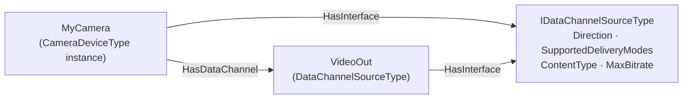

# OPC UA Part 3 — Data Channel Model

**Working draft for submission to the OPC Foundation Working Group**
**Proposed addition to:** OPC 10000-3 Address Space Model v1.05.07 (with instance declarations in OPC 10000-5)
**Namespace:** `http://opcfoundation.org/UA/` (base OPC UA namespace)
**Version:** 0.1.0 · **Date:** 2026-07-27

> **Status — working draft.** This document proposes the AddressSpace model for OPC UA **data channels**: the Interface that makes an existing type streamable, the types that describe a channel endpoint, the Server capability object a Client reads before it opens anything, the DataTypes the [Part 4 Services](OPC-UA-Part4-Data-Channel-Services.md) exchange, and the Events that report offers, state changes and audits. The wire format is in the [Part 6 errata](OPC-UA-Part6-Data-Channel-Transport.md). Numeric NodeIds are **provisional**, drawn from the 65000+ block; final identifiers are assigned by the OPC Foundation. Nothing here is normative or endorsed by the OPC Foundation.

---

## 1 Scope

This specification defines the additions to the OPC UA address space model that describe **where a data channel may be opened, what it will carry, and within which limits**.

It defines one Interface, two ObjectTypes, one ReferenceType, three Enumerations, four Structures and three EventTypes, plus one well-known instance under `ServerCapabilities`. Together they let a Client discover, by browsing and reading alone, that a Node can be streamed, in which directions, under which delivery guarantees, at what content type and bitrate, and how many channels the Server will carry at once — before it issues its first `OpenDataChannel`.

It does not define the Services, the frame format, or the meaning of the bytes.

## 2 Normative references

- [OPC 10000-3 v1.05.07](https://reference.opcfoundation.org/specs/OPC-10000-3/) — Address Space Model.
- [OPC 10000-4](https://reference.opcfoundation.org/specs/OPC-10000-4/) — Services.
- [OPC 10000-5](https://reference.opcfoundation.org/specs/OPC-10000-5/) — Information Model.
- [OPC 10000-6](https://reference.opcfoundation.org/specs/OPC-10000-6/) — Mappings.
- [OPC UA Part 6 — Data Channel Transport](OPC-UA-Part6-Data-Channel-Transport.md) — the companion transport errata.
- [OPC UA Part 4 — Data Channel Services](OPC-UA-Part4-Data-Channel-Services.md) — the companion Services errata.
- [IANA Media Types](https://www.iana.org/assignments/media-types/media-types.xhtml) — the registry `ContentType` draws from.

## 3 Terms, definitions and abbreviations

| Term | Definition |
|---|---|
| Data channel source | A Node that implements `IDataChannelSourceType` and can therefore be one end of a data channel. |
| Endpoint | Used in this document as a synonym for data channel source, never in the OPC 10000-4 `EndpointDescription` sense. |
| Content type | The IANA media type naming the byte format a channel carries. |
| Adopter | A type in another specification that gains streaming by adding `HasInterface` to `IDataChannelSourceType`. |

Key words **shall**, **should**, **may** and **shall not** are to be interpreted as in the ISO/IEC directives.

## 4 Overview

### 4.1 An Interface, not a new NodeClass or Attribute

The obvious way to say "this Variable can be streamed" is to add an Attribute. This specification does not, and the reason is the whole of its design.

A new Node Attribute changes the `Read`, `Write`, `Browse` and `Query` Services, every serialization of a Node, every NodeSet schema and every stack in the field. It would also be wrong: streamability is not a property every Node has some value of, it is a capability a few Nodes possess.

A new NodeClass is worse, because a camera Object is already an Object.

An **Interface** is exactly the right instrument, and it is the one OPC 10000-3 already provides. A type gains the capability by adding a single `HasInterface` reference. Its supertype is untouched, so a `CameraDeviceType` remains a `DeviceType` and every Client that knows nothing about data channels continues to see precisely what it saw before. A Client that does know about them finds the capability with one `Browse` for `HasInterface`, and finds the parameters as ordinary Properties it can `Read`.

The diagram shows both patterns of §4.2 side by side, which is why `MyCamera` carries the Interface and also points at a separate source.

### 4.2 Two placements, one contract

A Server chooses between two placements, and a Client handles both with the same code:

1. **The functional Node is the source.** A `CameraDeviceType` instance adds `HasInterface` to `IDataChannelSourceType` and carries the Properties itself. This is the right choice when the Node produces exactly one stream, and it keeps the model flat.
2. **A separate source Node.** The functional Node points with `HasDataChannel` at one or more `DataChannelSourceType` Objects. This is the right choice when the Node produces several streams — a camera with a main and a substream, an audio interface with eight inputs — because each needs its own content type, bitrate and channel count.

A Client resolves both in one step: for a Node it is interested in, follow `HasDataChannel` and, if the Node itself implements the Interface, include it. Every result is a data channel source; the `NodeId` of whichever it picks is what it passes to `OpenDataChannel`.

`HasDataChannel` is a subtype of `NonHierarchicalReferences`, deliberately: adding a streaming endpoint **shall not** change the hierarchy a Client browses, or every existing tree view would grow nodes it does not understand.

## 5 The data channel source

### 5.1 IDataChannelSourceType

The Interface every data channel source implements. Its Properties answer, without a single Service call beyond `Read`, the four questions a Client must resolve before opening a channel: which way can it flow, what guarantees can I ask for, what will I receive, and can this connection carry it.

`Direction`, `SupportedDeliveryModes` and `ContentType` are Mandatory because a channel cannot be negotiated without all three. Everything else is Optional, so a Server with one fixed stream is not forced to model limits it does not enforce.

`MaxBitrate` deserves particular note: it is what lets a Client decide *not* to open a channel. A Client on a constrained link that reads 25 Mbit/s can choose the substream instead of discovering the problem as discarded frames ten seconds into a session.

`ActiveChannelCount` is a component Variable rather than a Property because it changes continuously; a Client that wants to watch contention subscribes to it.

The full member list is [Annex A](#type-IDataChannelSourceType).

### 5.2 DataChannelSourceType

A concrete ObjectType that implements the Interface and adds nothing but observability: `Channels`, the `DataChannelStatusDataType` array describing what is currently open, and `Diagnostics`, the per-channel counters.

It exists for placement 2 of §4.2 — a Server that needs a Node to hang an endpoint on. It carries no members of its own beyond those two because everything that describes a channel belongs on the Interface, where an adopter can inherit it.

The two Variables are the operator's view. `Diagnostics` in particular is what turns "the video is bad" into an answer: a rising `FramesDiscarded` says the source is producing faster than the link can carry, a rising `CreditStalls` says the consumer is not reading fast enough, and a rising `RoundTripTime` says the path is congesting. Those are three different faults with three different remedies, and without the counters they look identical.

**`Channels`, `Diagnostics` and `ActiveChannelCount` are security-related.** They aggregate across every SecureChannel, Session and user, so an unrestricted reader learns, for every other user's channel, its `ChannelId`, `SourceNodeId`, `State`, full negotiated `Parameters`, transport stream id, `StartTime` and running byte and frame counters — enough to profile who is streaming from which device, when, at what rate and for how long. That is surveillance metadata about exactly the content the payload permissions were meant to protect, and OPC 10000-5 §6.3.4 already treats the equivalent `SessionSecurityDiagnosticsArray` the same way. A Server **shall** restrict these Variables to authorized users over an encrypted SecureChannel, and **shall** apply `RolePermissions` and `UserRolePermissions` to them at least as restrictively as to the **most restrictive** source Node they report — they aggregate across Nodes whose permissions may differ, so the source Node's own permissions are not a well-defined bound.

**The per-Session projection is normative, not advisory.** To an ordinary Session a Server **shall** report only the entries for channels that Session authorized, and `ActiveChannelCount` **shall** count only those. Part 4 §7.2 already forbids one Session from reaching another's channel, and leaving the projection optional would concede through a Variable exactly what that clause denies through the Services. A Server that needs to expose the aggregate view for administration **shall** do so through a separate Node restricted to an administrative Role, and **shall not** widen these Variables to achieve it.

### 5.3 HasDataChannel

Links a functional Node to a data channel source. `InverseName` is `DataChannelOf`, so browsing back from a source names the thing it streams.

A Server **may** place the source Object anywhere; the reference is what makes it findable. This matters because the natural home for a `VideoOut` Object — under the camera, under a media folder, under the Server — differs between Servers, and a Client should not have to guess.

Where the source is a separate Object, its `RolePermissions`, `UserRolePermissions` and `AccessRestrictions` **shall** be at least as restrictive as those of the functional Node that references it. Otherwise the Part 4 rule that a Server "shall not grant a data channel where it would refuse a `Read` of the same content" is sidestepped by targeting the endpoint Object instead of the restricted Node it streams for.

### 5.4 Adopting the Interface in a companion specification

A companion specification makes an existing type streamable in one step:

1. Add `HasInterface` to `IDataChannelSourceType` on the type, or define a `DataChannelSourceType` instance and reference it with `HasDataChannel`.
2. Constrain the inherited Properties to the values the domain actually supports — a fixed `ContentType`, a `Direction` of `SourceToSink`, the delivery modes the device can honour.
3. Say nothing about frames, credit or transports. Those are Part 6 and are identical for every domain.

Nothing else in the companion model changes: no supertype changes, no NodeId changes, no new required model beyond the base namespace. A companion specification that already ships can adopt this in a revision without breaking any existing instance.

## 6 Server capabilities and diagnostics

`DataChannelCapabilitiesType`, instanced as the well-known `DataChannelCapabilities` Object under `ServerCapabilities`, is the Server-wide answer. **Its absence is how a Server says it does not support data channels at all** — a Client checks for the Object rather than discovering the fact from a rejected `OpenDataChannel`.

Four members are Mandatory because a Client cannot negotiate safely without them: `MaxDataChannels`, `MaxFrameSize`, `SupportedDeliveryModes` and `SupportedTransportProfileUris`.

`SupportedTransportProfileUris` is what makes the Part 6 dual-transport design usable. A Client reads it, sees whether the Server offers the QUIC transport profile in addition to the TCP one, and knows before connecting whether the capabilities of §7.5 of the Part 6 errata are available to it.

`SupportsUnreliableDatagrams` states the one thing that cannot be inferred from the transport list: whether the Server can genuinely lose a frame in flight rather than discarding it at the sender. The Part 6 errata is explicit that inline framing over TCP cannot, and this Property is how a Client learns that fact by reading instead of by measuring.

## 7 DataTypes

Three Enumerations and four Structures are added. Their fields are in [Annex A](#annex-a); this clause states only the decisions behind them.

**`DataChannelDeliveryMode`** has four values rather than the two that a reliable transport can distinguish, because the mode is a statement of *what the application needs*, not of what the transport will manage. A Server that can only offer sender-side discard still needs to know that the application would prefer a dropped frame to a late one.

**`DataChannelParametersDataType`** carries both the request and the revision in `OpenDataChannel`. Using one structure for both means a Client compares what it asked for with what it received field by field, instead of matching two differently shaped structures.

**`DataChannelStatusDataType`** includes `TransportChannelId` so an operator can correlate an OPC UA data channel with a QUIC stream in a packet capture. Diagnosing a streaming fault without that correlation is guesswork.

**`DataChannelDiagnosticsDataType`** separates `FramesDiscarded` from `CreditStalls` for the reason given in §5.2: they are opposite faults.

**`DataChannelOfferDataType`** carries `ExpirationTime` so an unaccepted offer cannot pin Server resources indefinitely, which is what makes the offer pattern of the Part 4 errata safe against a Client that subscribes and then goes away.

## 8 Events

| EventType | Raised when | Why it exists |
|---|---|---|
| `DataChannelOfferedEventType` | The Server wants to open a channel towards a Client. | OPC UA Services are request/response, so a Server cannot call a Client. The Event carries the offer and the Client accepts by calling `OpenDataChannel` with its `OfferId`. Delivery is by ordinary Subscription, so no new notification mechanism is introduced — and a Client that has not subscribed is never pushed bytes it did not ask for. |
| `DataChannelStateChangeEventType` | A channel enters a new state, including `Faulted`. | A frame-level `RESET` is delivered on the channel that just died, which a Client may no longer be reading. This Event arrives on a path that is still working. |
| `AuditOpenDataChannelEventType` | Every `OpenDataChannel`, successful **or refused**. | A data channel moves content out of the Server continuously and outside the Service path. The authorization decision is the only moment an audit trail can capture it, and a refused attempt to start a camera stream is as interesting as a successful one. |

`AuditOpenDataChannelEventType` subtypes `AuditSessionEventType` rather than `AuditEventType`, because a channel is always authorized by a Session and the inherited `SessionId` is what an auditor correlates on.

## 9 Conformance units

| Conformance unit | Requires | Content |
|---|---|---|
| Data Channel Model | — | `IDataChannelSourceType`, `HasDataChannel`, the DataTypes of clause 7, and the `DataChannelCapabilities` Object with its Mandatory members. |
| Data Channel Model Diagnostics | Data Channel Model | `DataChannelSourceType` with `Channels` and `Diagnostics`, and `ActiveChannelCount` on both types. |
| Data Channel Model Events | Data Channel Model | `DataChannelStateChangeEventType` and `DataChannelOfferedEventType`. |
| Data Channel Model Auditing | Data Channel Model Events | `AuditOpenDataChannelEventType`. |

*Data Channel Model* is required by the Part 4 *Data Channel Services* unit: a Client must be able to discover the limits before it negotiates against them.

## 10 NodeSet validation

The NodeSet, the NodeId CSV and Annex A are generated from `tools/build_model.py` and **shall not** be hand-edited. `tools/validate_local.py` checks XML well-formedness, that every own NodeId lies in the reserved provisional ranges and is unique, that the CSV and the NodeSet agree on every NodeId and NodeClass, that every reference target resolves to a node defined here or to a known base UA NodeId, that every type carries an inverse `HasSubtype`, that every Structure carries its three DataTypeEncoding Objects and every Enumeration its `EnumStrings`, that the well-known instance is a component of `ServerCapabilities`, and that Annex A is embedded verbatim in this document. It runs with no untracked base data; the cross-check against the base UA NodeId table is skipped when that table is absent.

Because this model is an **errata overlay on the base namespace** rather than a companion model, the NodeSet declares no additional `NamespaceUri`, emits unqualified BrowseNames and plain `i=<n>` NodeIds, and is intended to be merged into the base UA NodeSet rather than loaded beside it.

## 11 Insertion into OPC 10000-3 v1.05.07 and OPC 10000-5

| Draft clause | Target | Notes |
|---|---|---|
| §4 Overview | `OPC 10000-3`, Interfaces clause (`4.10 Interfaces and AddIns for Objects`, in particular `4.10.2 Interface Model`) | A note that data channels are modelled as an Interface, with the rationale for adding no Attribute and no NodeClass. |
| §5.1 `IDataChannelSourceType` | `OPC 10000-5`, standard Interfaces | Defined beside the other standard `I…Type` Interfaces. |
| §5.2 `DataChannelSourceType` | `OPC 10000-5`, standard ObjectTypes | |
| §5.3 `HasDataChannel` | `OPC 10000-5`, standard ReferenceTypes | As a subtype of `NonHierarchicalReferences`. |
| Clause 6 | `OPC 10000-5`, `ServerCapabilitiesType` | `DataChannelCapabilities` added as an Optional component, so its absence remains a valid Server. |
| Clause 7 | `OPC 10000-5`, standard DataTypes | Three Enumerations and four Structures, with `Default Binary`, `Default XML` and `Default JSON` encodings. |
| Clause 8 | `OPC 10000-5`, standard EventTypes and Audit Events | |
| §9 conformance units | `OPC 10000-7` | New conformance units and the Profiles that group them. |
| Annex A | `OPC 10000-5` node tables and the base `Opc.Ua.NodeSet2.xml` | The generated overlay is merged into the base NodeSet; provisional NodeIds are replaced by assigned ones. |

<!-- BEGIN GENERATED: model-reference -->

## Annex A — Information model

This annex is the normative node reference. It is generated from `core-specs/data-channels/tools/build_model.py` and always matches `Opc.Ua.DataChannels.NodeSet2.xml`. Every node is a proposed **addition to the base OPC UA namespace** `http://opcfoundation.org/UA/` (namespace index 0), so BrowseNames are unqualified and NodeIds are plain `i=<n>`. The numeric NodeIds are **provisional**, drawn from the 65000+ block; final identifiers are assigned by the OPC Foundation. The **Declared in** column marks members inherited from a supertype.

### Type overview

| NodeId | BrowseName | NodeClass | Subtype of |
|---|---|---|---|
| i=65000 | [HasDataChannel](#type-HasDataChannel) | ReferenceType | [NonHierarchicalReferences](https://reference.opcfoundation.org/specs/OPC-10000-5/11.4) |
| i=65010 | [IDataChannelSourceType](#type-IDataChannelSourceType) | ObjectType | [BaseInterfaceType](https://reference.opcfoundation.org/specs/OPC-10000-5/6.9) |
| i=65011 | [DataChannelSourceType](#type-DataChannelSourceType) | ObjectType | [BaseObjectType](https://reference.opcfoundation.org/specs/OPC-10000-5/6.2) |
| i=65012 | [DataChannelCapabilitiesType](#type-DataChannelCapabilitiesType) | ObjectType | [BaseObjectType](https://reference.opcfoundation.org/specs/OPC-10000-5/6.2) |
| i=65020 | [DataChannelOfferedEventType](#type-DataChannelOfferedEventType) | ObjectType | [BaseEventType](https://reference.opcfoundation.org/specs/OPC-10000-5/6.4) |
| i=65021 | [DataChannelStateChangeEventType](#type-DataChannelStateChangeEventType) | ObjectType | [BaseEventType](https://reference.opcfoundation.org/specs/OPC-10000-5/6.4) |
| i=65022 | [AuditOpenDataChannelEventType](#type-AuditOpenDataChannelEventType) | ObjectType | [AuditSessionEventType](https://reference.opcfoundation.org/specs/OPC-10000-5/6.4) |
| i=65030 | [DataChannelDirection](#type-DataChannelDirection) | DataType | [Enumeration](https://reference.opcfoundation.org/specs/OPC-10000-3/8.14) |
| i=65031 | [DataChannelDeliveryMode](#type-DataChannelDeliveryMode) | DataType | [Enumeration](https://reference.opcfoundation.org/specs/OPC-10000-3/8.14) |
| i=65032 | [DataChannelState](#type-DataChannelState) | DataType | [Enumeration](https://reference.opcfoundation.org/specs/OPC-10000-3/8.14) |
| i=65033 | [DataChannelParametersDataType](#type-DataChannelParametersDataType) | DataType | [Structure](https://reference.opcfoundation.org/specs/OPC-10000-3/8.32) |
| i=65034 | [DataChannelStatusDataType](#type-DataChannelStatusDataType) | DataType | [Structure](https://reference.opcfoundation.org/specs/OPC-10000-3/8.32) |
| i=65035 | [DataChannelOfferDataType](#type-DataChannelOfferDataType) | DataType | [Structure](https://reference.opcfoundation.org/specs/OPC-10000-3/8.32) |
| i=65036 | [DataChannelDiagnosticsDataType](#type-DataChannelDiagnosticsDataType) | DataType | [Structure](https://reference.opcfoundation.org/specs/OPC-10000-3/8.32) |

### Reference types

#### HasDataChannel  (i=65000)

*Subtype of:* [NonHierarchicalReferences](https://reference.opcfoundation.org/specs/OPC-10000-5/11.4) · *InverseName:* `DataChannelOf`

Links a functional Object or Variable to the DataChannelSource endpoint through which its content can be streamed. The source Node is the target of the reference, so a client that browses a camera, a drive or a log Object finds the data channel it can open without knowing where the server chose to place the endpoint.

### Object types and interfaces

#### IDataChannelSourceType  (i=65010) · *abstract*

*Inherits from:* [BaseInterfaceType](https://reference.opcfoundation.org/specs/OPC-10000-5/6.9)

Interface implemented by any Object or Variable that can act as one end of a data channel. Adding this Interface to an existing type through HasInterface is the only change a companion specification needs in order to become streamable: it does not alter the type's supertype and does not introduce a new Node Attribute.

| BrowseName | NodeClass | DataType | ModellingRule | Declared in | Description |
|---|---|---|---|---|---|
| Direction | Variable | [DataChannelDirection](#type-DataChannelDirection) | Mandatory | IDataChannelSourceType | The directions in which this endpoint can carry data, from the point of view of the Server as the source. |
| SupportedDeliveryModes | Variable | [DataChannelDeliveryMode](#type-DataChannelDeliveryMode)\[\] | Mandatory | IDataChannelSourceType | The delivery modes this endpoint accepts in OpenDataChannel. A mode that is not listed is rejected with Bad_DeliveryModeUnsupported. |
| ContentType | Variable | String | Mandatory | IDataChannelSourceType | The IANA media type of the byte stream this endpoint produces or consumes, for example video/H264 or application/octet-stream. The data channel layer never interprets the payload; this Property is what tells an application how to. |
| ContentParameters | Variable | [KeyValuePair](https://reference.opcfoundation.org/specs/OPC-10000-5/12.19)\[\] | Optional | IDataChannelSourceType | Content-specific parameters that qualify ContentType, for example a codec profile, a sample rate or a frame geometry. Opaque to the data channel layer. |
| MaxFrameSize | Variable | UInt32 | Optional | IDataChannelSourceType | The largest data channel frame payload, in bytes, this endpoint will emit or accept. The value actually used is additionally bounded by the negotiated transport buffer size and is returned as revisedParameters.MaxFrameSize by OpenDataChannel. |
| MaxBitrate | Variable | UInt32 | Optional | IDataChannelSourceType | The peak rate, in bits per second, this endpoint may produce. A client uses it to decide whether the connection can carry the stream before opening it. |
| Priority | Variable | Byte | Optional | IDataChannelSourceType | The default scheduling priority (0 lowest, 7 highest) applied to channels opened on this endpoint when the client requests Priority 255, the no-preference encoding. |
| MaxChannels | Variable | UInt16 | Optional | IDataChannelSourceType | The maximum number of data channels that may be open on this endpoint at the same time. Exceeding it is rejected with Bad_TooManyDataChannels. |
| ActiveChannelCount | Variable | UInt16 | Optional | IDataChannelSourceType | The number of data channels currently open on this endpoint, across all Sessions. |

#### DataChannelSourceType  (i=65011)

*Inherits from:* [BaseObjectType](https://reference.opcfoundation.org/specs/OPC-10000-5/6.2)

*Implements:* [IDataChannelSourceType](#type-IDataChannelSourceType)

The plain, concrete realization of IDataChannelSourceType: a stand-alone Object that exists only to be one end of a data channel. A server uses it where no domain Object is a natural home for the endpoint; where one is, that Object implements the Interface directly and points at nothing.

| BrowseName | NodeClass | DataType | ModellingRule | Declared in | Description |
|---|---|---|---|---|---|
| Channels | Variable | [DataChannelStatusDataType](#type-DataChannelStatusDataType)\[\] | Optional | DataChannelSourceType | The data channels currently open on this endpoint. Empty when none are open. |
| Diagnostics | Variable | [DataChannelDiagnosticsDataType](#type-DataChannelDiagnosticsDataType)\[\] | Optional | DataChannelSourceType | Per-channel counters for the channels currently open on this endpoint. |

#### DataChannelCapabilitiesType  (i=65012)

*Inherits from:* [BaseObjectType](https://reference.opcfoundation.org/specs/OPC-10000-5/6.2)

Server-wide data channel limits and capabilities, exposed as the DataChannelCapabilities component of ServerCapabilities. A client reads it once and knows, before it opens anything, whether the Server supports data channels at all, over which transports, in which delivery modes and within which limits.

| BrowseName | NodeClass | DataType | ModellingRule | Declared in | Description |
|---|---|---|---|---|---|
| MaxDataChannels | Variable | UInt16 | Mandatory | DataChannelCapabilitiesType | The maximum number of data channels the Server will keep open on one SecureChannel. |
| MaxFrameSize | Variable | UInt32 | Mandatory | DataChannelCapabilitiesType | The largest data channel frame payload, in bytes, the Server will emit or accept on any endpoint, before the transport buffer bound is applied. |
| SupportedDeliveryModes | Variable | [DataChannelDeliveryMode](#type-DataChannelDeliveryMode)\[\] | Mandatory | DataChannelCapabilitiesType | The delivery modes the Server implements. A mode absent here is unsupported everywhere on this Server. |
| SupportedTransportProfileUris | Variable | String\[\] | Mandatory | DataChannelCapabilitiesType | The TransportProfileUris over which this Server carries data channels, for example the uatcp-uasc-uabinary and quic-uasc-uabinary profiles. |
| MaxTotalBitrate | Variable | UInt32 | Optional | DataChannelCapabilitiesType | The aggregate rate, in bits per second, the Server will emit across all data channels of one SecureChannel. |
| MaxCreditPerChannel | Variable | UInt32 | Mandatory | DataChannelCapabilitiesType | The largest flow control credit window, in bytes, the Server will grant to one channel. Mandatory because the connection-level credit bootstrap is bounded by this value multiplied by MaxDataChannels; a Server that omitted it would leave the bound on its own receive memory undefined. |
| SupportsUnreliableDatagrams | Variable | Boolean | Optional | DataChannelCapabilitiesType | True when the Server can carry Unreliable channels over a genuinely lossy path, which requires a transport that provides one. False wherever the reachable transports are reliable end to end, such as opc.tcp, opc.wss, or opc.wss3 without HTTP Datagrams, where Unreliable degrades to sender-side discard. |
| AllowInsecureDataChannels | Variable | Boolean | Optional | DataChannelCapabilitiesType | True only where the Server permits a data channel to be opened on a SecureChannel whose SecurityMode is None. Absence shall be read as False. On such a channel a frame carries neither signature nor encryption, so its payload and both sequence numbers are attacker-forgeable; the permission is therefore an explicit, separately readable, default-false opt-in rather than something inferred from AccessRestrictions, which defines only restriction bits and no bit that grants anything. |
| ActiveChannelCount | Variable | UInt16 | Optional | DataChannelCapabilitiesType | The number of data channels currently open across the whole Server. |

### Event types

#### DataChannelOfferedEventType  (i=65020)

*Inherits from:* [BaseEventType](https://reference.opcfoundation.org/specs/OPC-10000-5/6.4)

Raised when the Server wants to open a data channel towards a Client. OPC UA Services are request/response, so the Server cannot call the Client; it offers instead, and the Client accepts by calling OpenDataChannel with the OfferId. This is what makes server-initiated media possible without inverting the Service model.

| BrowseName | NodeClass | DataType | ModellingRule | Declared in | Description |
|---|---|---|---|---|---|
| Offer | Variable | [DataChannelOfferDataType](#type-DataChannelOfferDataType) | Mandatory | DataChannelOfferedEventType | The offered channel: its OfferId, its source Node, the parameters the Server proposes and the time after which the offer lapses. |

#### DataChannelStateChangeEventType  (i=65021)

*Inherits from:* [BaseEventType](https://reference.opcfoundation.org/specs/OPC-10000-5/6.4)

Raised whenever a data channel changes state, including the transition to Faulted that follows a transport level reset. A Client that missed the frame level RESET learns of the loss here.

| BrowseName | NodeClass | DataType | ModellingRule | Declared in | Description |
|---|---|---|---|---|---|
| ChannelId | Variable | UInt32 | Mandatory | DataChannelStateChangeEventType | The data channel whose state changed, unique within its SecureChannel. |
| State | Variable | [DataChannelState](#type-DataChannelState) | Mandatory | DataChannelStateChangeEventType | The state entered. |
| Status | Variable | [StatusCode](https://reference.opcfoundation.org/specs/OPC-10000-4/7.38) | Optional | DataChannelStateChangeEventType | The StatusCode that caused the transition, for a transition into Closed or Faulted. |

#### AuditOpenDataChannelEventType  (i=65022)

*Inherits from:* [AuditSessionEventType](https://reference.opcfoundation.org/specs/OPC-10000-5/6.4)

Audit event for a successful or rejected OpenDataChannel. A data channel carries application payload out of the Server outside the Read/Subscribe path, so it is auditable in its own right rather than folded into the Session audit trail.

| BrowseName | NodeClass | DataType | ModellingRule | Declared in | Description |
|---|---|---|---|---|---|
| DataChannelSourceNodeId | Variable | [NodeId](https://reference.opcfoundation.org/specs/OPC-10000-3/8.2) | Mandatory | AuditOpenDataChannelEventType | The endpoint the channel was requested on. |
| Parameters | Variable | [DataChannelParametersDataType](#type-DataChannelParametersDataType) | Mandatory | AuditOpenDataChannelEventType | The parameters as revised by the Server, or as requested when the request was rejected. |
| ChannelId | Variable | UInt32 | Optional | AuditOpenDataChannelEventType | The assigned ChannelId. Omitted when the request was rejected. |

### Data types

#### DataChannelDirection  (i=65030)

*Subtype of:* [Enumeration](https://reference.opcfoundation.org/specs/OPC-10000-3/8.14)

The direction in which a data channel carries payload. Directions are named from the point of view of the data channel source, which is normally the Server.

| Name | Value | Description |
|---|---|---|
| SourceToSink | 0 | The source sends and the sink receives, for example a camera feed. |
| SinkToSource | 1 | The sink sends and the source receives, for example a firmware push. |
| Bidirectional | 2 | Both ends send, over the one ChannelId, for example a two-way audio call. |

#### DataChannelDeliveryMode  (i=65031)

*Subtype of:* [Enumeration](https://reference.opcfoundation.org/specs/OPC-10000-3/8.14)

The delivery guarantee requested for a data channel. What a mode can actually deliver depends on the transport: only a transport with a lossy path can genuinely drop data in flight, so over a reliable transport such as opc.tcp or opc.wss the lossy modes degrade to sender-side discard.

| Name | Value | Description |
|---|---|---|
| ReliableOrdered | 0 | Every frame is delivered, in order. The default, and the only mode a purely reliable transport realizes exactly. |
| ReliableUnordered | 1 | Every frame is delivered, but the receiver may hand frames to the application as they arrive rather than buffering to restore order. |
| PartiallyReliable | 2 | A frame is retried until its deadline passes or MaxRetransmits is reached, then abandoned and reported in a gap notification. |
| Unreliable | 3 | A frame is sent once and never retried. Frames still queued when their deadline passes are discarded. |

#### DataChannelState  (i=65032)

*Subtype of:* [Enumeration](https://reference.opcfoundation.org/specs/OPC-10000-3/8.14)

The lifecycle state of a data channel. The normative state transition table - which event causes which transition, which transitions are legal, and what may be sent in each state - is clause 5.13 of the Part 6 Data Channel Transport errata. Paused is maintained per direction.

| Name | Value | Description |
|---|---|---|
| Opening | 0 | OpenDataChannel has been accepted and the endpoint is being prepared; no frame may be sent for this ChannelId until the response has been handed to the transport. |
| Open | 1 | Payload may flow in the negotiated directions. |
| Paused | 2 | The channel is open but the peer's flow control credit is exhausted in this direction, so no payload may be sent. Over an outer-protocol transport such as opc.quic or opc.wss3 this is transport stream or connection blocking instead. |
| Closing | 3 | This peer has decided to close a direction and is draining it. Closing is per direction, like Paused: receiving END marks only the peer's direction ended. No new payload may be enqueued in a Closing direction; frames already queued may still be sent, and END follows the last of them. |
| Closed | 4 | The channel is closed, either by END in every direction it carries or by a RESET carrying Good. Its ChannelId is not reassigned while the owning SecureChannel remains open. |
| Faulted | 5 | The channel was aborted by a RESET frame carrying a Bad StatusCode, by a timeout, or by loss of the SecureChannel, Session or authorizing user identity. |

#### DataChannelParametersDataType  (i=65033)

*Subtype of:* [Structure](https://reference.opcfoundation.org/specs/OPC-10000-3/8.32)

The negotiated properties of one data channel. The same structure carries the client's request and the server's revision, so a client can compare what it asked for with what it got in one comparison.

| Field | DataType | Description |
|---|---|---|
| Direction | [DataChannelDirection](#type-DataChannelDirection) | The direction payload flows in. |
| DeliveryMode | [DataChannelDeliveryMode](#type-DataChannelDeliveryMode) | The delivery guarantee. |
| ContentType | String | IANA media type of the payload. |
| ContentParameters | [KeyValuePair](https://reference.opcfoundation.org/specs/OPC-10000-5/12.19)\[\] | Content-specific parameters qualifying ContentType. |
| MaxFrameSize | UInt32 | Largest frame payload in bytes. |
| InitialCredit | UInt32 | Flow control credit, in payload bytes, granted to the peer at open. |
| Priority | Byte | Scheduling priority, 0 lowest to 7 highest. 255 requests the source's default; other values above 7 are revised to 7. |
| MaxRetransmits | UInt16 | PartiallyReliable only: attempts before a frame is abandoned. Ignored where the transport is already reliable. |
| FrameDeadline | [Duration](https://reference.opcfoundation.org/specs/OPC-10000-3/8.13) | PartiallyReliable and Unreliable only: how long a frame may wait in the send queue before it is discarded. |

#### DataChannelStatusDataType  (i=65034)

*Subtype of:* [Structure](https://reference.opcfoundation.org/specs/OPC-10000-3/8.32)

The runtime state of one open data channel, as published by its endpoint.

| Field | DataType | Description |
|---|---|---|
| ChannelId | UInt32 | Identifier of the channel within its SecureChannel. |
| SourceNodeId | [NodeId](https://reference.opcfoundation.org/specs/OPC-10000-3/8.2) | The endpoint the channel was opened on. |
| State | [DataChannelState](#type-DataChannelState) | Current lifecycle state. |
| Parameters | [DataChannelParametersDataType](#type-DataChannelParametersDataType) | The parameters in force, as revised by the Server. |
| TransportChannelId | UInt64 | The underlying transport identifier: the QUIC stream id over opc.quic, the HTTP/3 stream id over opc.wss3, 0 for inline framing. |
| StartTime | [UtcTime](https://reference.opcfoundation.org/specs/OPC-10000-3/8.37) | When the channel entered the Open state. |

#### DataChannelOfferDataType  (i=65035)

*Subtype of:* [Structure](https://reference.opcfoundation.org/specs/OPC-10000-3/8.32)

A server-initiated offer to open a data channel, carried by DataChannelOfferedEventType and accepted by quoting its OfferId in OpenDataChannel.

| Field | DataType | Description |
|---|---|---|
| OfferId | UInt32 | Identifies the offer. Unique within the SecureChannel until the offer lapses. |
| SourceNodeId | [NodeId](https://reference.opcfoundation.org/specs/OPC-10000-3/8.2) | The endpoint the Server is offering. |
| Parameters | [DataChannelParametersDataType](#type-DataChannelParametersDataType) | The parameters the Server proposes. |
| ExpirationTime | [UtcTime](https://reference.opcfoundation.org/specs/OPC-10000-3/8.37) | After this time the offer lapses and OpenDataChannel returns Bad_DataChannelOfferInvalid. |

#### DataChannelDiagnosticsDataType  (i=65036)

*Subtype of:* [Structure](https://reference.opcfoundation.org/specs/OPC-10000-3/8.32)

Per-channel counters. FramesDiscarded and CreditStalls are the two that matter in practice: the first says the stream is outrunning the link, the second says the consumer is outrun by the stream.

| Field | DataType | Description |
|---|---|---|
| ChannelId | UInt32 | The channel these counters belong to. |
| FramesSent | UInt64 | Data frames written to the transport. |
| FramesReceived | UInt64 | Data frames accepted from the transport. |
| BytesSent | UInt64 | Payload bytes written, excluding frame headers. |
| BytesReceived | UInt64 | Payload bytes accepted, excluding frame headers. |
| FramesDiscarded | UInt64 | Frames dropped before transmission because their deadline passed. |
| CreditStalls | UInt32 | Times the sender had payload ready but no flow control credit. |
| RoundTripTime | [Duration](https://reference.opcfoundation.org/specs/OPC-10000-3/8.13) | Most recent round trip time measured by PING/PONG. |
| LastGapSequenceNumber | UInt32 | FrameSequenceNumber of the last frame reported as discarded in a gap notification. |

### Well-known instances

| BrowseName | NodeId | TypeDefinition | Parent | Note |
|---|---|---|---|---|
| DataChannelCapabilities | i=65100 | [DataChannelCapabilitiesType](#type-DataChannelCapabilitiesType) | ServerCapabilities (i=2268) | Server-wide data channel capabilities. Its absence is how a Server says it does not support data channels at all. |

<!-- END GENERATED: model-reference -->
