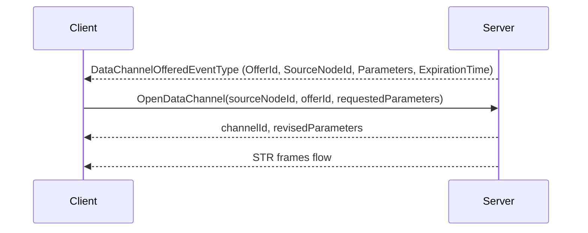

# OPC UA Part 4 — Data Channel Services

**Working draft for submission to the OPC Foundation Working Group**
**Proposed addition to:** OPC 10000-4 Services v1.05.07
**Namespace:** `http://opcfoundation.org/UA/` (base OPC UA namespace)
**Version:** 0.1.0 · **Date:** 2026-07-27

> **Status — working draft.** This document proposes the **DataChannel Service Set**: the Services that open, modify and close an OPC UA data channel, the parameters they negotiate, the lifecycle and authorization rules that govern a channel, and the StatusCodes they return. The wire format the channel then uses is in the [Part 6 errata](OPC-UA-Part6-Data-Channel-Transport.md); the AddressSpace model that describes where a channel may be opened is in the [Part 3 errata](OPC-UA-Part3-Data-Channel-Model.md). Nothing here is normative or endorsed by the OPC Foundation.

---

## 1 Scope

This specification defines three Services — `OpenDataChannel`, `ModifyDataChannel` and `CloseDataChannel` — and the rules that bind the data channels they create to the SecureChannel that carries them and to the Session that authorized them.

It defines how a Server offers a channel to a Client without inverting the request/response Service model, how a channel is audited, what happens to a channel when the SecureChannel is renewed or replaced and when the Session closes or changes user identity, and how data channel traffic is required to coexist with the Publish path.

It does not define the frame layout, flow control or transport mapping, which are Part 6, nor the information model, which is Part 3.

## 2 Normative references

- [OPC 10000-2](https://reference.opcfoundation.org/specs/OPC-10000-2/) — Security Model.
- [OPC 10000-3](https://reference.opcfoundation.org/specs/OPC-10000-3/) — Address Space Model.
- [OPC 10000-4 v1.05.07](https://reference.opcfoundation.org/specs/OPC-10000-4/) — Services.
- [OPC 10000-5](https://reference.opcfoundation.org/specs/OPC-10000-5/) — Information Model.
- [OPC 10000-6](https://reference.opcfoundation.org/specs/OPC-10000-6/) — Mappings.
- [OPC UA Part 6 — Data Channel Transport](OPC-UA-Part6-Data-Channel-Transport.md) — the companion transport errata.
- [OPC UA Part 3 — Data Channel Model](OPC-UA-Part3-Data-Channel-Model.md) — the companion AddressSpace errata.

## 3 Terms, definitions and abbreviations

| Term | Definition |
|---|---|
| Data channel | A logical, flow-controlled, bidirectional stream of opaque bytes carried over one SecureChannel, as defined by the Part 6 errata. |
| Data channel source | A Node that implements `IDataChannelSourceType` and can therefore be one end of a data channel. |
| Offer | A Server's invitation to a Client to open a specific data channel, delivered as an Event and accepted by quoting its `OfferId`. |
| Owning SecureChannel | The SecureChannel over which a channel's frames flow and which determines its lifetime. |
| Authorizing Session | The Session whose user identity was checked when the channel was opened and whose closure revokes it. |

Key words **shall**, **should**, **may** and **shall not** are to be interpreted as in the ISO/IEC directives.

## 4 Overview

### 4.1 Why new Services rather than Methods

A data channel could have been opened by calling a Method on the source Node, which would need no Service Set at all. It is not, for three reasons.

A channel is a **transport resource**, not a Node operation: it consumes a ChannelId in the SecureChannel's identifier space, a share of the connection's flow control window and a slot in the sender's scheduler. None of those belong to the AddressSpace, and a Method returning a ChannelId would be describing state the Method's owner does not hold.

A channel must be openable **before** the AddressSpace is usable — a Client recovering a media session after a reconnect should not have to browse to restart it — and Method calls are the one operation that a Server may legitimately refuse until its model is loaded.

Finally, the Services are what let a Server enumerate and enforce its limits centrally. `MaxDataChannels` is a property of the connection; a Method on a camera Object cannot see the other four channels already open on the same connection.

### 4.2 Lifecycle in one paragraph

A data channel is **owned by the SecureChannel** and **authorized by the Session**. Ownership is where the bytes flow: the frames are MessageChunks on that SecureChannel and cannot outlive it. Authorization is who was allowed to start them: `OpenDataChannel` requires an activated Session, and the user identity behind that Session is checked against the `RolePermissions` of the source Node exactly as a `Read` on it would be. The two are separable, and separating them is what makes the rules in §7 unambiguous.

## 5 The DataChannel Service Set

### 5.1 OpenDataChannel

Opens a data channel on a data channel source, or accepts a Server offer.

This Service is not a Node operation and therefore takes no `NodesToRead`-style array: one call opens one channel. A batched form was considered and rejected, because a partial success would leave the Client holding channels it did not want and could not name in the failure.

**Request**

| Name | Type | Description |
|---|---|---|
| requestHeader | RequestHeader | Common request parameters (OPC 10000-4 §7.32). |
| sourceNodeId | NodeId | The data channel source to open the channel on. It **shall** be a Node that implements `IDataChannelSourceType`, directly or through `HasDataChannel`. |
| offerId | UInt32 | `0` for a Client-initiated open. Otherwise the `OfferId` of a `DataChannelOfferedEventType` Event being accepted, in which case `sourceNodeId` **shall** match the offer. |
| requestedParameters | DataChannelParametersDataType | The parameters the Client asks for. Every member is a request, not a requirement; the Server returns what it will actually do. |

**Response**

| Name | Type | Description |
|---|---|---|
| responseHeader | ResponseHeader | Common response parameters (OPC 10000-4 §7.33). |
| channelId | UInt32 | The identifier of the new channel within the owning SecureChannel. Never `0`, which the Part 6 errata reserves for connection control. |
| revisedParameters | DataChannelParametersDataType | The parameters actually in force. |
| transportChannelId | UInt64 | The underlying transport identifier: the QUIC stream id over `opc.quic`, `0` for inline framing. |

**Parameter negotiation.** The Server revises rather than rejects wherever it can, because a Client that asked for more than it can have usually wants the largest amount available:

| Parameter | Revision rule |
|---|---|
| `Direction` | **Not** revisable. A direction the source does not support is rejected with `Bad_DataChannelDirectionUnsupported`. |
| `DeliveryMode` | **Not** revisable. Silently downgrading to a stronger guarantee would add unbounded latency to a media channel; silently downgrading to a weaker one would lose data. A mode absent from `SupportedDeliveryModes` is rejected with `Bad_DeliveryModeUnsupported`. |
| `ContentType` | The Server **may** narrow it to a more specific type it will actually produce. A type it cannot produce is rejected with `Bad_ContentTypeUnsupported`. |
| `ContentParameters` | The Server returns the effective set: entries it honoured, entries it changed, and entries it added. Entries it does not understand are **omitted** from the response rather than echoed, so a Client can see what took effect. |
| `MaxFrameSize` | Revised down to the least of the requested value, the source's `MaxFrameSize`, the Server's `MaxFrameSize`, and the transport bound derived from the negotiated buffer size. Never revised up. |
| `InitialCredit` | Revised down to the Server's `MaxCreditPerChannel`. May be revised up if the Client requested less than the Server's minimum useful window. |
| `Priority` | Revised down where the Server reserves the higher bands. Never revised up. |
| `MaxRetransmits`, `FrameDeadline` | Revised to the Server's supported range. Both are ignored where the transport is already reliable, and the Server **shall** return them as `0` in that case so the Client can see they had no effect. |

**Preconditions.** The Session **shall** be activated. The SecureChannel **shall** be one over which the transport supports data channels; `Bad_DataChannelTransportUnsupported` is returned otherwise. Opening the channel **shall not** take the count over `MaxDataChannels` for the connection or `MaxChannels` for the source.

**Effect.** On success the channel enters `Opening` and then `Open`, a `DataChannelStateChangeEventType` Event is raised for each transition, and an `AuditOpenDataChannelEventType` Event is generated. On failure an `AuditOpenDataChannelEventType` Event is still generated, carrying the requested parameters and no `ChannelId`: a refused attempt to start a media stream is exactly as interesting to an auditor as a successful one.

**Service result StatusCodes**

| Symbolic id | Description |
|---|---|
| `Bad_NodeIdUnknown` | `sourceNodeId` does not exist. |
| `Bad_NodeIdInvalid` | `sourceNodeId` is syntactically invalid. |
| `Bad_DataChannelNotSupported` | The Node exists but is not a data channel source. |
| `Bad_DataChannelTransportUnsupported` | The transport carrying this SecureChannel cannot carry data channels. |
| `Bad_DataChannelDirectionUnsupported` | The requested `Direction` is not supported by the source. |
| `Bad_DeliveryModeUnsupported` | The requested `DeliveryMode` is not in `SupportedDeliveryModes`. |
| `Bad_ContentTypeUnsupported` | The Server cannot produce or consume the requested `ContentType`. |
| `Bad_TooManyDataChannels` | `MaxDataChannels` or the source's `MaxChannels` would be exceeded. |
| `Bad_DataChannelLimitsExceeded` | A requested parameter is outside anything the Server can revise to. |
| `Bad_DataChannelOfferInvalid` | `offerId` is unknown, already accepted, expired, or does not match `sourceNodeId`. |
| `Bad_UserAccessDenied` | The Session's user identity is not permitted to open a channel on this Node. |
| `Bad_SessionIdInvalid`, `Bad_SessionNotActivated` | Common Session faults (OPC 10000-4 Table 178, Common Service Result Codes). |

### 5.2 ModifyDataChannel

Changes the mutable parameters of an open channel without interrupting it. This is the analogue of a mid-call renegotiation: an adaptive encoder that has decided to drop from 1080p to 720p lowers its priority and frame size rather than tearing the channel down and losing the pipeline.

**Request**

| Name | Type | Description |
|---|---|---|
| requestHeader | RequestHeader | Common request parameters. |
| channelId | UInt32 | The channel to modify. It **shall** belong to the SecureChannel carrying this request. |
| requestedParameters | DataChannelParametersDataType | The new parameters. `Direction` and `DeliveryMode` **shall** equal the values in force; a request that changes either is rejected with `Bad_DataChannelLimitsExceeded`, because both change what the receiver's pipeline is. |

**Response**

| Name | Type | Description |
|---|---|---|
| responseHeader | ResponseHeader | Common response parameters. |
| revisedParameters | DataChannelParametersDataType | The parameters now in force, revised by the same rules as `OpenDataChannel`. |

A reduction of `MaxFrameSize` takes effect for frames not yet handed to the transport; frames already in flight are unaffected. A change to `InitialCredit` does **not** retroactively adjust the outstanding window — credit is granted by `CREDIT` frames, and `ModifyDataChannel` changes only the size of future grants.

**Service result StatusCodes:** `Bad_DataChannelIdInvalid`, `Bad_DataChannelClosed`, `Bad_DataChannelLimitsExceeded`, `Bad_UserAccessDenied`, plus the common Session faults.

### 5.3 CloseDataChannel

Closes a data channel in an orderly fashion.

**Request**

| Name | Type | Description |
|---|---|---|
| requestHeader | RequestHeader | Common request parameters. |
| channelId | UInt32 | The channel to close. |
| reason | StatusCode | Why. `Good` for a normal close; any other value is recorded in the state-change Event and the audit trail. |
| deleteQueued | Boolean | `True` discards frames still queued in either direction and closes immediately. `False` drains them first, subject to the Server's own timeout. |

**Response**

| Name | Type | Description |
|---|---|---|
| responseHeader | ResponseHeader | Common response parameters. |

The channel enters `Closing` and then `Closed`, and a `DataChannelStateChangeEventType` Event is raised for each transition. The `ChannelId` **shall not** be reassigned until both ends have observed the close, so that a late frame from the previous occupant of the identifier cannot be delivered to its successor.

Closing an already-closed channel returns `Bad_DataChannelClosed` rather than `Good`. A Client that lost track of a channel needs to know whether it is closing something or nothing.

**Service result StatusCodes:** `Bad_DataChannelIdInvalid`, `Bad_DataChannelClosed`, plus the common Session faults.

## 6 Server-initiated channels

A Server frequently knows before the Client does that a stream should start: an alarm has fired and the camera that saw it should push video, a drive has begun a firmware rollback and wants to stream its log. OPC UA Services are request/response and a Server cannot call a Client, so this specification does **not** invert the model. It offers instead:

1. The Server raises a `DataChannelOfferedEventType` Event carrying a `DataChannelOfferDataType`. The Client receives it through an ordinary Subscription, so no new notification mechanism is introduced.
2. The Client accepts by calling `OpenDataChannel` with that `OfferId`. It **may** revise the offered parameters downward in the same call; the Server applies the normal negotiation rules.
3. The Client declines by doing nothing. The offer lapses at `ExpirationTime`, after which the `OfferId` returns `Bad_DataChannelOfferInvalid`.

An `OfferId` is single-use and scoped to the SecureChannel it was delivered on. A Server **shall not** hold resources for an unaccepted offer beyond its `ExpirationTime`, or an unsubscribed Client would leak them.

A Client that is not subscribed to the Event never learns of the offer, which is the correct outcome: a Server must not be able to push bytes at a Client that has not asked for them.

## 7 Lifecycle and authorization

### 7.1 Binding rules

| Event | Effect on open data channels |
|---|---|
| SecureChannel token renewal (`OpenSecureChannel` with `RenewalRequest`) | **None.** Frames continue across the token change; subsequent frames carry the new `TokenId`. Aborting streams every renewal interval would make long-lived media impossible. |
| SecureChannel closed or transport lost | **All aborted.** The frames have nowhere to flow. Each channel enters `Faulted` and a state-change Event is generated if a notification path survives. |
| Session closed | **All channels it authorized are aborted.** The authorization is gone, so the permission to keep sending is gone. |
| `ActivateSession` with a **different** user identity | **All channels that Session authorized are aborted.** The Server **shall not** carry an authorization granted to one user identity across to another. |
| `ActivateSession` on a **new** SecureChannel (Session transfer) | **All channels are aborted.** A channel is bound to the transport of its owning SecureChannel and cannot be moved; the Server aborts them and the Client reopens on the new channel. |
| Subscription deleted, MonitoredItem removed | **None.** Data channels are independent of Subscriptions. |

A Client that must survive a reconnect reopens its channels after `ActivateSession`. This specification defines no resume token: resumption would have to replay the sender's queue across a connection the peer can no longer authenticate as the same one, and for live media the queue is worthless by then anyway. Bulk transfer that needs resumability should carry its own offset in the payload, which the content type is there to describe.

### 7.2 Authorization

`OpenDataChannel` **shall** be authorized against the source Node using the same rules as any other access to it: the Session's user identity, the `RolePermissions` and `UserRolePermissions` Attributes of the Node, and the `AccessRestrictions` in force. A Server **shall not** grant a data channel where it would refuse a `Read` of the same content.

Because a channel outlives the call that created it, a Server **shall** re-evaluate the authorization whenever the identity it was granted to changes, and abort on a negative result (§7.1). A Server **may** re-evaluate periodically or on a permission change, and **shall** abort with `Bad_UserAccessDenied` if it does so and the result is now negative.

### 7.3 Auditing

A Server that supports auditing **shall** generate an `AuditOpenDataChannelEventType` Event for every `OpenDataChannel`, successful or not. This is deliberately stricter than the treatment of a `Read`: a data channel moves content out of the Server continuously and outside the Service path, so the moment it was authorized is the only point at which an audit trail can capture it.

`CloseDataChannel` and every state transition are reported through `DataChannelStateChangeEventType`, which a Server **may** additionally treat as auditable.

## 8 Interaction with other Services

**Publish and Subscriptions.** The Part 6 errata requires that Service traffic is never delayed by more than one data channel frame. In Service terms: a Server **shall not** allow data channel traffic to cause a Subscription keep-alive to be missed or a `Publish` response to be delayed past its `PublishingInterval`. A Server that cannot meet this under load **shall** stall data channels — the credit window is exactly the mechanism for doing so — rather than delay `Publish`. Losing video is recoverable; losing the Subscription that reports the alarm is not.

**Session keep-alive.** Data channel frames **shall not** be treated as Session activity for the purpose of the Session timeout. A Client that streams for an hour without a Service call has a Session that is idle by every definition Part 4 uses, and treating frames as activity would let a compromised transport keep a Session alive indefinitely without the user ever being re-checked.

**Method calls, Read and Write.** Unaffected. A data channel is an additional path for content, never a replacement: a Variable whose value is streamed **shall** remain readable by `Read`, so a Client that does not implement data channels is not locked out.

**TransferSubscriptions.** Subscriptions transfer between Sessions; data channels do not (§7.1). The asymmetry is intentional — a Subscription is Server-side state that can be re-pointed, while a data channel is a live transport binding.

## 9 New StatusCodes

| Symbolic id | Meaning |
|---|---|
| `Bad_DataChannelIdInvalid` | The ChannelId is not known on this SecureChannel. |
| `Bad_DataChannelClosed` | The channel exists but is closing, closed or faulted. |
| `Bad_DataChannelNotSupported` | The Node is not a data channel source, or the Server does not implement data channels. |
| `Bad_DataChannelTransportUnsupported` | The transport carrying this SecureChannel cannot carry data channels. |
| `Bad_DataChannelDirectionUnsupported` | The requested direction is not supported by the source. |
| `Bad_DeliveryModeUnsupported` | The requested delivery mode is not supported. |
| `Bad_ContentTypeUnsupported` | The requested content type cannot be produced or consumed. |
| `Bad_TooManyDataChannels` | A channel-count limit would be exceeded. |
| `Bad_DataChannelLimitsExceeded` | A requested parameter is outside anything the Server can revise to, or an immutable parameter was changed. |
| `Bad_DataChannelCreditExceeded` | A flow control grant would overflow the credit window, or a sender transmitted beyond its window. |
| `Bad_DataChannelOfferInvalid` | The offer is unknown, expired, already accepted, or does not match the source. |
| `Uncertain_DataDiscarded` | Delivered payload is incomplete because frames were discarded or lost. Reported by a receiving application, and the value a gap-aware consumer surfaces upward. |

Numeric values are **provisional**; final assignments are made by the OPC Foundation alongside the existing StatusCode registry.

## 10 Conformance units

| Conformance unit | Requires | Content |
|---|---|---|
| Data Channel Services | Part 6 *Data Channel Framing*, Part 3 *Data Channel Model* | `OpenDataChannel`, `CloseDataChannel`, the negotiation rules of §5, the lifecycle rules of §7.1, authorization per §7.2 and the StatusCodes of §9. |
| Data Channel Modify | Data Channel Services | `ModifyDataChannel` (§5.2). |
| Data Channel Offers | Data Channel Services, Part 3 *Data Channel Model Events* | Server-initiated offers (§6), including `DataChannelOfferedEventType` and single-use, expiring `OfferId`s. |
| Data Channel Auditing | Data Channel Services, Part 3 *Data Channel Model Auditing* | `AuditOpenDataChannelEventType` on every attempt, successful or refused (§7.3). |

*Data Channel Model* is a prerequisite of *Data Channel Services* rather than an optional companion: the negotiation rules of §5 revise against limits a Client can only read from the model, and the `DataChannelCapabilities` Object is how a Client discovers that data channels exist at all.

A Server claiming *Data Channel Services* **shall** also claim at least one Part 6 transport unit, and **shall** expose the `DataChannelCapabilities` Object defined by the Part 3 errata.

## 11 Insertion into OPC 10000-4 v1.05.07

| Draft clause | Target clause in OPC 10000-4 | Notes |
|---|---|---|
| §4 Overview | New `5.15.1 Overview` | Introduces the Service Set, the SecureChannel-ownership and Session-authorization split. |
| §5.1 `OpenDataChannel` | New `5.15.2 OpenDataChannel` | Parameter tables in the standard Request/Response form, the negotiation table, and the Service-level StatusCodes. |
| §5.2 `ModifyDataChannel` | New `5.15.3 ModifyDataChannel` | |
| §5.3 `CloseDataChannel` | New `5.15.4 CloseDataChannel` | |
| §6 Server-initiated channels | New `5.15.5 DataChannel offers` | The offer/accept pattern; the Event itself is defined by the Part 3 errata. |
| §7.1 Binding rules | `5.6 SecureChannel Service Set` and `5.7 Session Service Set` | The effects of channel renewal, channel close, Session close, identity change and Session transfer are stated where those operations are defined, and cross-referenced from `5.15`. |
| §7.2 Authorization | `OPC 10000-2` and the `RolePermissions` text of OPC 10000-3 | No new mechanism; a statement that the existing one governs. |
| §7.3 Auditing | `Audit Events` clause of OPC 10000-5 | The audit EventType is defined by the Part 3 errata; the obligation to raise it belongs here. |
| §8 Interaction | `5.14 Subscription Service Set` | The `Publish` precedence rule and the statement that frames are not Session activity. |
| §9 StatusCodes | Common Service Result Codes (Table 178) and the numeric registry maintained with OPC 10000-6 | Twelve new symbolic ids. Every DataChannel Service result is service-level — one call opens or closes exactly one channel, so there are no operation-level results and Table 179 is not involved. |
| §10 Conformance units | OPC 10000-7 | New conformance units and the Profiles that group them. |

The `DataChannel Service Set` is proposed as a new `5.15`, after `5.14 Subscription Service Set`, so the existing Service Set numbering is unchanged.
