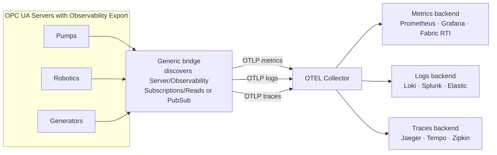
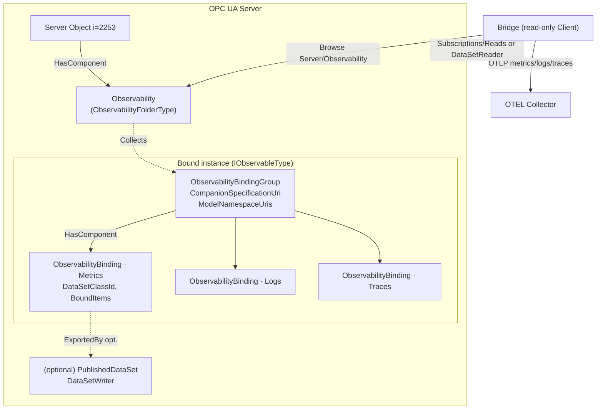
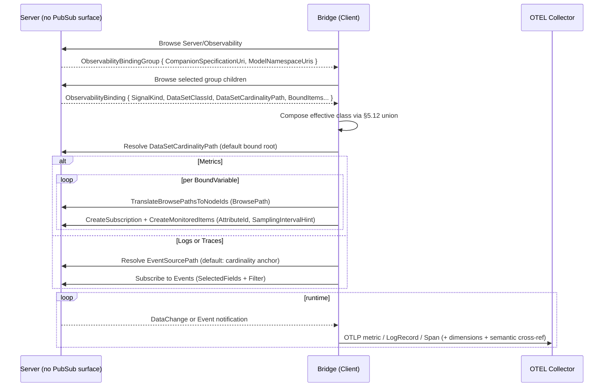

<!-- _class: lead -->
<!-- _paginate: false -->
<!--
Non-normative overview deck for the Observability Export companion specification.
Rendered on GitHub (the mermaid diagrams render inline). To export slides:
`npx --yes @marp-team/marp-cli README.md -o deck.html`
(mermaid needs a Marp mermaid plugin, or just present the GitHub-rendered file).
-->

# OPC UA — Observability Export

**Declare how any Information Model's data lands in metrics, logs and traces — and let a generic bridge export it.**

- Working draft for the OPC Foundation Working Group
- Proposed Part **OPC 10000‑2xx** (number TBA) · Namespace `http://opcfoundation.org/UA/ObservabilityExport/`
- Version 0.1.0 · 2026-07-15
- A companion spec over the classic client/server (RPC) interface, optionally realized over PubSub (Part 14)
- Full specification: [OPC-UA-Observability-Export.md](OPC-UA-Observability-Export.md)

---

## Why — the problem

Getting a model's live data into an **observability** system is a separate, repetitive integration problem.

- Companion specs describe *what a thing is* — not how its data becomes metrics, logs and traces.
- Someone must decide, **per model and per project, by hand**:
  - which Variables are metrics — and of what instrument and unit;
  - which event fields become structured log records;
  - which Program or audit events become spans — and how each is labelled.
- Today this is ad-hoc: a hand-wired OPC UA client feeding a metrics/log agent, redone for every model and vendor.

---

## Why — the idea

Make the decision **part of the model and discoverable at runtime**.

- A Server advertises, per bound object, exactly **which nodes to observe** and **how they map to OpenTelemetry (OTEL)**.
- A generic **bridge** — a read-only Client — discovers the binding and forwards the data to an OTEL Collector.
- The bridge needs to understand **OTEL and its routing role** — *not* the pump, the robot or the generator.
- One generic bridge lights up observability for many machines and vendors with **no domain-specific code**.

---

## Why — motivating use cases

Factory metrics → Grafana · structured logs from events → Loki/Splunk/Elastic · traces from Program/audit → Jaeger/Tempo/Zipkin · egress to any stack via a thin adapter.

---

## What — scope and out of scope

**In scope**

- A discoverable, server-wide **Observability** registry on the standard Server Object.
- An **ObservabilityBinding** — one bound target ↔ exactly one OTEL signal (a metric set, a log stream, or a trace stream).
- A normative **OTEL mapping** — instruments, LogRecords, Spans, plus Resource and attribute (dimension) handling.
- A **semantic cross-reference** from each bound item back to the model that defines it.
- **BrowsePath** resolution — author once at the type level, resolve per instance.
- Classic Subscriptions/Reads as the baseline; **optional** Part 14 PubSub realization.
- **Profiles and Conformance Units** for Servers and Clients.

**Out of scope**

- New PubSub transports, message mappings or security — Part 14 owns these.
- A log, event or trace model of its own — it *exports* existing sources (Events, Part 26 `LogObject`, Part 10 Programs).
- Writing to or invoking the Server — observability export is **read-only**.

---

## What — the two-layer contract

The central design idea: a binding carries two separable kinds of metadata.

1. **Routing / OTEL metadata — for the bridge.** `SignalKind` says *which* OTEL signal; per-item `Kind` says *how* to forward it; for metrics also the instrument, unit, buckets and temporality; for logs and traces the template, severity, timing and status field names. *A bridge configures itself from this alone, for any domain.*
2. **Semantic metadata — for the consumer.** Each bound item retains a cross-reference to the model: source `TypeDefinition`, namespace-qualified `BrowseName`, `ModelNamespaceUri`, and — where available — a Part 19 dictionary entry (IRDI/CDD). *This lets a disconnected consumer recover what a value means.*

The bridge never needs the semantic layer to do its job — it forwards it verbatim (as OTEL attributes / Part 14 FieldMetaData).

---

## How — architecture

---

## What — the information model

Key types, in this specification's own namespace (draft NodeIds `i=600xx`; full reference in **Annex A** of the spec):

- **ObservabilityFolderType** — the server-wide `Observability` registry, a component of the Server Object.
- **ObservabilityBindingGroupType** — per-companion-spec anchor on each observable instance; carries `CompanionSpecificationUri` and `ModelNamespaceUris`.
- **ObservabilityBindingType** — one binding: `SignalKind`, `DataSetClassId`, `DataSetCardinalityPath`, bound items.
- **BoundItemType** (+ `BoundVariableType`, `BoundEventFieldType`) — the metric values, dimensions and event fields.
- **IObservableType** — the interface that marks an instance as observability-exporting.

Non-hierarchical references keep cross-links out of containment: `Collects`/`CollectedBy`, `BindsToNode`, `ExportedBy`/`Exports`, `HasBaseBinding`.

---

## How — the OTEL mapping

- **Metrics** — a bound Variable maps to one OTEL instrument (`MetricInstrumentType`, or derived from its `Kind`); unit from `Unit` or the source `EngineeringUnits`; plus histogram buckets and temporality.
- **Logs** — bound event fields become OTEL LogRecords (`LogTemplate`/`LogBodyFieldName`, severity, timestamp). A Part 26 `LogObject`, where present, is the first-class source — the two specs are **complementary layers**.
- **Traces** — Program executions, audit events or correlated pairs become OTEL Spans via the `Span*` members (name, identity, timing, correlation, status, kind).
- **Dimensions** — `Kind = Dimension` items become OTEL attributes on every point, record and span; well-known keys (e.g. `service.name`) become **Resource** attributes.

---

## How — realization is hybrid

A binding **declares** intent; whether and how it is realized over the wire is separate — and the bridge emits the **same OTEL** either way.

- **Classic path (default, baseline).** No PubSub surface required. The bridge resolves BrowsePaths and creates Subscriptions/MonitoredItems (metrics) or subscribes to Events (logs/traces) — or Reads directly. **Works on any Server.**
- **PubSub path (optional).** Where PubSub is configured, a binding may additionally be `ExportedBy` a Part 14 `PublishedDataSet`/`DataSetWriter`; the bridge then consumes the DataSet as a subscriber.

---

## How — the bridge walkthrough

A read-only Client, with no domain knowledge, follows five steps:

1. **Discover** — browse `Server/Observability`, follow `Collects` to the groups, then browse each group's bindings.
2. **Recognize** — identify a class by its `DataSetClassId` (the signal kind is part of the identity).
3. **Compose** — union bindings inherited via subtype, `HasInterface` facets and `HasAddIn` children (override by `FieldName`).
4. **Realize** — the classic path (default) or PubSub where configured; resolve `DataSetCardinalityPath` to the DataSet instances.
5. **Emit OTEL** — a metric, LogRecord or Span per the mapping, with the binding's dimensions as attributes, carrying the semantic cross-reference so the downstream consumer can interpret it.

---

## Proof — applied to real models

The bindings are exercised on concrete companion models — each with an instance-overlay NodeSet and an addendum:

- **Pumps** — metrics on `PumpType`: [addendum](pumps/OPC-UA-Pumps-Observability-Export-Addendum.md).
- **Robotics** — `MotionDeviceSystemType` with multi-device/axis cardinality expansion: [addendum](robotics/OPC-UA-Robotics-Observability-Export-Addendum.md).
- **DI** — `IVendorNameplateType` and **DeviceHealth** (`IDeviceHealthType`): [DI](di/OPC-UA-DI-Observability-Export-Addendum.md) · [DeviceHealth](di/OPC-UA-DIDeviceHealth-Observability-Export-Addendum.md).
- **Facets** — binding inheritance and facet composition across subtype, interface and AddIn: [addendum](facets/OPC-UA-Facets-Observability-Export-Addendum.md).

All NodeSets, CSV, Annex A and addenda are **generated deterministically** from a single source of truth (`build_model.py` / `build_bindings.py`).

---

## Conformance, deliverables and status

**Conformance Units, grouped into Facets**

- **Server Observability Facet** — discovery, binding grouping, BrowsePath resolution, DataSet cardinality, class identity, inheritance and facet composition, semantic cross-reference (mandatory); realization CUs as offered.
- **Publisher Facet** — Part 14 realization plus PubSub metadata propagation.
- **Bridge (Client) Facet** — browse, recognize, compose, realize (classic or PubSub), and emit the Metrics/Logs/Traces mapping.

**Deliverables** — `Opc.Ua.ObservabilityExport.NodeSet2.xml` · `Opc.Ua.ObservabilityExport.NodeIds.csv` · Annex A (generated) · per-spec addenda · machine-readable descriptors and tooling under `core-specs/extras/observability-export/`.

**Backend-agnostic** — OTEL is the normative target, but the same bindings drive Prometheus/Grafana, Splunk/Elastic, Jaeger/Tempo/Zipkin, Microsoft Fabric Real-Time Intelligence and an Apache Arrow lakehouse.

**Status — working draft.** For Working Group discussion: scope, Part number and namespace, and the conformance model. Full specification → [OPC-UA-Observability-Export.md](OPC-UA-Observability-Export.md).
