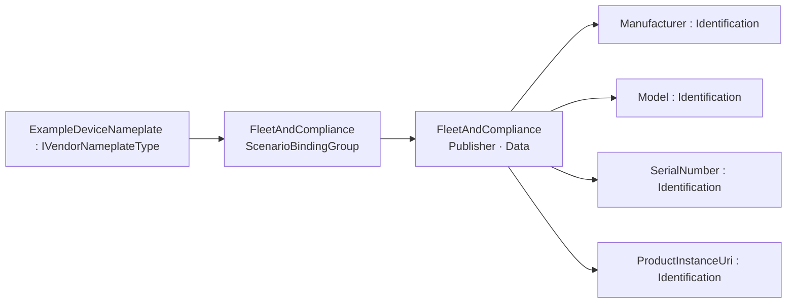
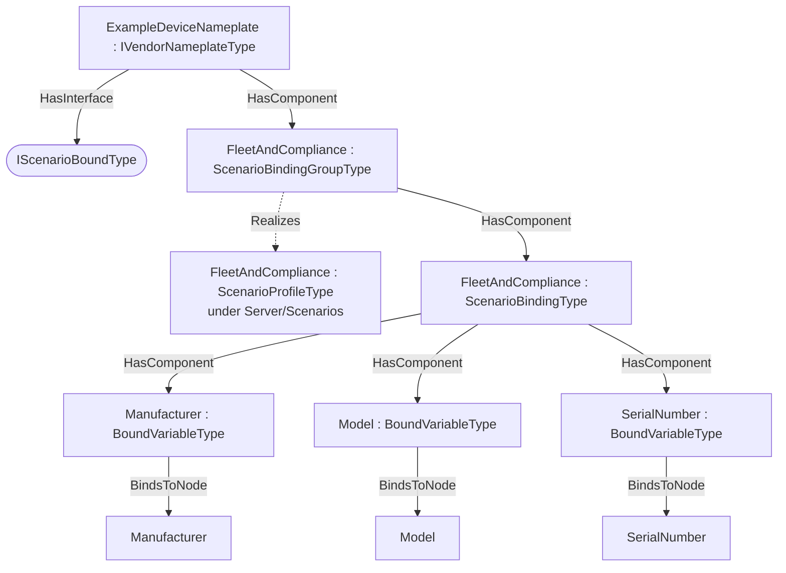

# OPC UA DI — Scenario Bindings Addendum

**Working draft — a worked example of the [Scenario Bindings](../OPC-UA-Scenario-Bindings.md) base specification applied to OPC UA Devices (DI, OPC 10000-100).**

> **Status — illustrative example.** This addendum shows how the instances of the `IVendorNameplateType` (http://opcfoundation.org/UA/DI/) can be exposed for integration scenarios over the classic client/server (RPC) interface and, optionally, over OPC UA PubSub — without modifying the companion specification. All NodeIds in the example namespace `http://opcfoundation.org/UA/PubSub/Examples/DI/` are provisional and the base-namespace binding types it references (`ScenarioBindingGroupType` etc.) carry the **provisional** NodeIds of the draft base specification.

## 1 Scope

This addendum defines example **scenario bindings** for the `IVendorNameplateType` — 4 bound items across the scenarios *FleetAndCompliance* — per the [Scenario Bindings](../OPC-UA-Scenario-Bindings.md) base specification. The DI IVendorNameplateType facet exposes vendor nameplate identity (Manufacturer, Model, SerialNumber, ProductInstanceUri, DeviceRevision, ...). Any DI device, machine or component that composes this facet - including a pump's Identification object - inherits a fleet/compliance identity scenario authored here.

## 2 Normative references

- [Scenario Bindings](../OPC-UA-Scenario-Bindings.md) — the base binding model (types, discovery, the two-layer routing/semantic contract).
- [OPC UA Devices (DI, OPC 10000-100)](https://reference.opcfoundation.org/DI/v104/docs/) — the companion specification whose type is bound.
- [OPC 10000-14](https://reference.opcfoundation.org/specs/OPC-10000-14/) — PubSub (optional realization).

## 3 How the bindings are applied

The bindings are authored at **two levels**, exactly as the base specification recommends:

1. **Type-level definitions (reusable).** The machine-readable descriptor [`DI.ScenarioBinding.json`](../../extras/scenario-binding/examples/di/DI.ScenarioBinding.json) lists each bound item as a `BrowsePath` (RelativePath) from the `IVendorNameplateType` root, with its routing `Kind` and scenario. Every path in §4 was **resolved against the published companion NodeSet**, so the bindings apply to *any* conforming instance.
2. **Instance overlay (concrete).** [`Opc.Ua.DI.ScenarioBinding.NodeSet2.xml`](Opc.Ua.DI.ScenarioBinding.NodeSet2.xml) instantiates a compact theoretical instance `ExampleDeviceNameplate`, applies the `IScenarioBoundType` interface, and exposes one `ScenarioBindingGroup` per scenario holding that scenario's `ScenarioBinding`/`BoundItem` instances. On the instance each `BoundItem` uses **`BindsToNode`** to point at the concrete signal node (the type-level `BrowsePath` and the instance `BindsToNode` are the two locators defined by the base specification).

> **Theoretical instance model.** A compact instance implementing IVendorNameplateType. A pump's Identification (MachineIdentificationType) composes the same DI facet, so the Pumps FleetAndCompliance binding extends this one (see OPC-UA-DI-Pumps-Inheritance.md).

Only the bound signals are materialised in the overlay; it is an *illustrative* instance, not a conformant full instance of the companion type.

## 4 Scenario bindings for `IVendorNameplateType`

Bindings for the `IVendorNameplateType` of the `http://opcfoundation.org/UA/DI/` companion specification, per the [Scenario Bindings](../OPC-UA-Scenario-Bindings.md) base specification. Each binding is **one content class** — a data DataSet, an event DataSet, or an action set — with a deterministic `DataSetClassId`. Every data and Method `BrowsePath` below was resolved against the published companion NodeSet; event-DataSet fields select standard event-type fields.

#### Scenario: FleetAndCompliance

*URI:* `http://opcfoundation.org/UA/PubSub/Scenarios/FleetAndCompliance` · *Direction:* Publisher · *Content:* data DataSet (PublishedDataItems) · *DataSetClassId:* `cb5100f1-96f5-5999-a09f-97b71bb044be` · *Cardinality:* one DataSet (bound root)

| Field | Kind | BrowsePath | Source type | DataType | OTEL |
|---|---|---|---|---|---|
| Manufacturer | Identification | `/Manufacturer` | [PropertyType](https://reference.opcfoundation.org/specs/OPC-10000-5/7.3) | LocalizedText | — |
| Model | Identification | `/Model` | [PropertyType](https://reference.opcfoundation.org/specs/OPC-10000-5/7.3) | LocalizedText | — |
| SerialNumber | Identification | `/SerialNumber` | [PropertyType](https://reference.opcfoundation.org/specs/OPC-10000-5/7.3) | String | — |
| ProductInstanceUri | Identification | `/ProductInstanceUri` | [PropertyType](https://reference.opcfoundation.org/specs/OPC-10000-5/7.3) | String | — |

## 5 Where the bindings live

Overview of the scenario bindings, then their placement on the theoretical instance (one `ScenarioBindingGroup` per scenario hangs off the instance; each `BoundItem` `BindsToNode` its signal):

## 6 Deliverables

| File | Content |
|---|---|
| [`DI.ScenarioBinding.json`](../../extras/scenario-binding/examples/di/DI.ScenarioBinding.json) | Machine-readable ScenarioBindingConfiguration descriptor (single source). |
| [`Opc.Ua.DI.ScenarioBinding.NodeSet2.xml`](Opc.Ua.DI.ScenarioBinding.NodeSet2.xml) | The binding instances on the theoretical `ExampleDeviceNameplate` instance. |

Regenerate from [`core-specs/extras/scenario-binding/examples/`](../../extras/scenario-binding/examples/) with `python tools/build_bindings.py di/DI.ScenarioBinding.json`.

