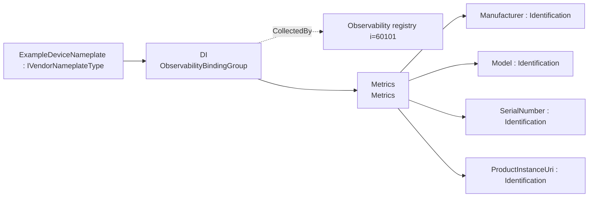
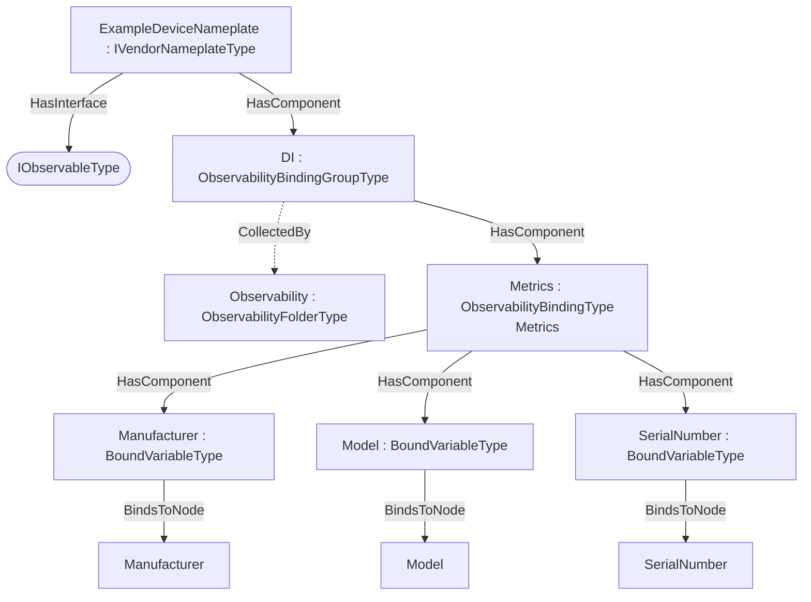

# OPC UA DI — Observability Export Addendum

**Working draft — a worked example of the [Observability Export](../OPC-UA-Observability-Export.md) base specification applied to OPC UA Devices (DI, OPC 10000-100).**

> **Status — illustrative example.** The `http://opcfoundation.org/UA/PubSub/Examples/DI/` namespace and NodeIds are provisional. The example shows how `IVendorNameplateType` data is declared for OTEL metrics, logs and traces over classic OPC UA and optional PubSub.

## 1 Scope

This addendum defines example **observability export bindings** for `IVendorNameplateType` — 4 bound items across Metrics (Metrics). The DI IVendorNameplateType facet exposes vendor nameplate identity as OTEL resource attributes/dimensions for any device, machine or component that composes it.

## 2 Normative references

- [Observability Export](../OPC-UA-Observability-Export.md) — the base binding model (discovery and OTEL mapping).
- [OPC UA Devices (DI, OPC 10000-100)](https://reference.opcfoundation.org/DI/v104/docs/) — the companion specification whose type is bound.
- [OPC 10000-14](https://reference.opcfoundation.org/specs/OPC-10000-14/) — PubSub (optional realization).

## 3 How the bindings are applied

The machine-readable descriptor [`DI.ObservabilityExport.json`](../../extras/observability-export/examples/di/DI.ObservabilityExport.json) lists each bound item as a `BrowsePath` from `IVendorNameplateType`, with its observability `Kind` and OTEL `SignalKind`. The generated overlay [`Opc.Ua.DI.ObservabilityExport.NodeSet2.xml`](Opc.Ua.DI.ObservabilityExport.NodeSet2.xml) instantiates a compact `ExampleDeviceNameplate` object, applies `IObservableType`, and exposes an `ObservabilityBindingGroup` collected by (`CollectedBy`) the server-wide `Observability` registry.

> **Theoretical instance model.** A compact instance implementing IVendorNameplateType. A pump's Identification object composes the same DI facet, so the Pumps metrics binding extends this one.

Only the bound signals are materialised in the overlay; it is illustrative, not a full companion instance.

## 4 Observability export bindings for `IVendorNameplateType`

Bindings for `IVendorNameplateType` in `http://opcfoundation.org/UA/DI/`, per the [Observability Export](../OPC-UA-Observability-Export.md) base specification. Each binding exposes one OTEL signal (`Metrics`, `Logs` or `Traces`) with a deterministic `DataSetClassId`.

#### Metrics — Metrics

*Signal:* OTEL metrics (PublishedDataItems) · *DataSetClassId:* `ac52dde1-e3db-5534-bc44-5b18d9335b72` · *Cardinality:* one DataSet (bound root)

| Field | Kind | BrowsePath | Source type | DataType | OTEL |
|---|---|---|---|---|---|
| Manufacturer | Identification | `/Manufacturer` | `i=68` | LocalizedText | Gauge |
| Model | Identification | `/Model` | `i=68` | LocalizedText | Gauge |
| SerialNumber | Identification | `/SerialNumber` | `i=68` | String | Gauge |
| ProductInstanceUri | Identification | `/ProductInstanceUri` | `i=68` | String | Gauge |

## 5 Where the bindings live

Overview of the observability bindings and their placement on the theoretical instance:

## 7 Deliverables

| File | Content |
|---|---|
| [`DI.ObservabilityExport.json`](../../extras/observability-export/examples/di/DI.ObservabilityExport.json) | Machine-readable ObservabilityExport descriptor (single source). |
| [`Opc.Ua.DI.ObservabilityExport.NodeSet2.xml`](Opc.Ua.DI.ObservabilityExport.NodeSet2.xml) | The binding instances on the theoretical `ExampleDeviceNameplate` instance. |

Regenerate from [`core-specs/extras/observability-export/examples/`](../../extras/observability-export/examples/) with `python tools/build_bindings.py di/DI.ObservabilityExport.json tools/ref`.

