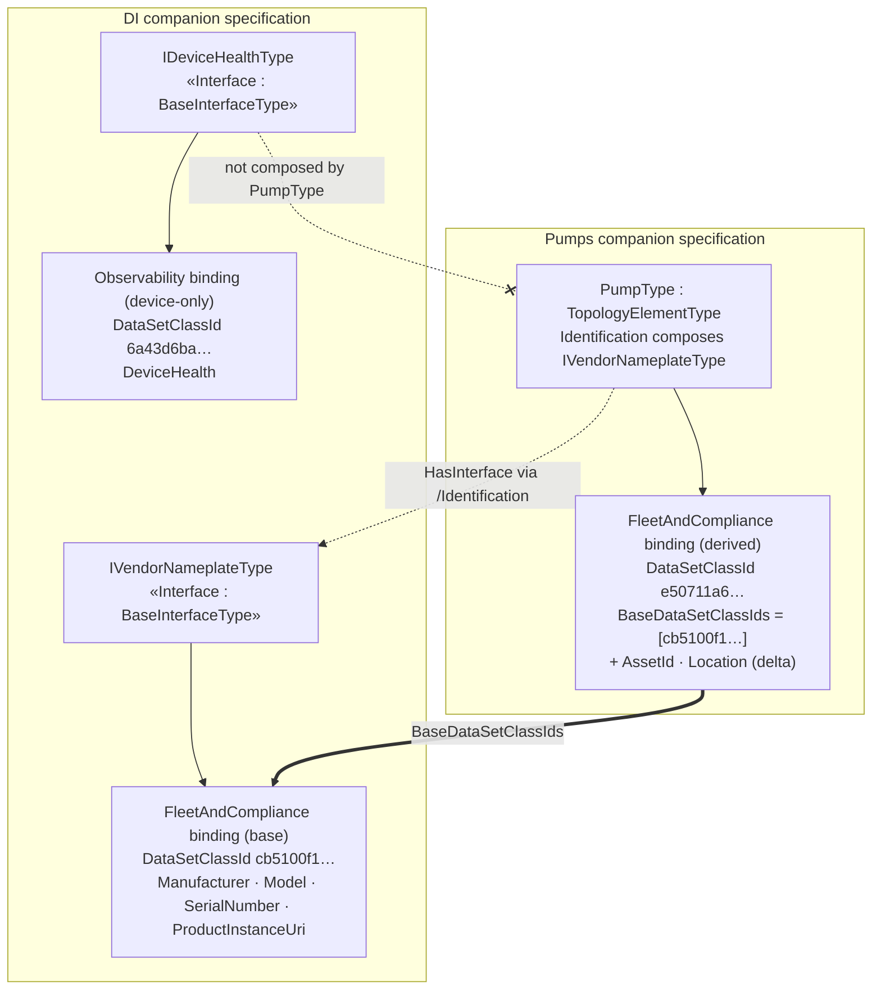

# OPC UA — Scenario Bindings — DI ↔ Pumps inheritance (illustration)

*Non-normative. Companion to the base specification, §5.12 "Binding inheritance and facet
composition". Shows how the Pumps example's `FleetAndCompliance` scenario binding **extends** a DI
data binding through facet composition, and how a DI **action binding** (bound Methods, not a
DataSet) is inherited by a pump through the subtype axis. Provisional NodeIds and example namespaces.*

## 1 Why a pump extends a DI scenario

A `PumpType` is a DI `TopologyElementType` (not a `DeviceType`), but every pump carries an
`Identification` object that **composes the DI `IVendorNameplateType` facet** — the interface that
declares the vendor nameplate (`Manufacturer`, `Model`, `SerialNumber`, `ProductInstanceUri`,
`DeviceRevision`, …). Because `HasInterface`/`HasAddIn` composition is one of the three inheritance
axes of §5.12, a scenario binding authored **once** on the DI facet is inherited by *every* type
that composes it — including a pump — which then adds only its own delta fields.

So the DI companion specification owns a small, reusable **`FleetAndCompliance` identity binding on
`IVendorNameplateType`**, and the Pumps companion specification's `FleetAndCompliance` binding is a
**superset**: the DI nameplate fields (inherited) plus pump-specific identity (`AssetId`,
`Location`).

## 2 The base binding — DI `FleetAndCompliance` on `IVendorNameplateType`

Generated overlay: [`Opc.Ua.DI.ScenarioBinding.NodeSet2.xml`](Opc.Ua.DI.ScenarioBinding.NodeSet2.xml),
addendum [`OPC-UA-DI-Scenario-Bindings-Addendum.md`](OPC-UA-DI-Scenario-Bindings-Addendum.md).

| Field | Kind | BrowsePath (facet-relative) |
|---|---|---|
| Manufacturer | Identification | `/Manufacturer` |
| Model | Identification | `/Model` |
| SerialNumber | Identification | `/SerialNumber` |
| ProductInstanceUri | Identification | `/ProductInstanceUri` |

- Scenario: `…/Scenarios/FleetAndCompliance` · Bound target: `http://opcfoundation.org/UA/DI/;IVendorNameplateType`
- **DataSetClassId** `cb5100f1-96f5-5999-a09f-97b71bb044be` (deterministic over
  `ScenarioUri | <ns>;IVendorNameplateType | DataItems | 1`).

## 3 The derived binding — Pumps `FleetAndCompliance` on `PumpType`

The pump's `Identification` object composes `IVendorNameplateType`, so the pump inherits the four
nameplate fields. Per §5.12 a derived binding **lists only its own delta fields** and references the
base lineage with **`BaseDataSetClassIds`** — it does **not** restate the inherited fields. So the
Pumps `FleetAndCompliance` binding authored on `PumpType` lists just `AssetId` and `Location` and
sets `BaseDataSetClassIds = [cb5100f1…]`:

| Field authored on the pump binding | BrowsePath | Role |
|---|---|---|
| AssetId | `/Identification/AssetId` | **delta** (pump/Machinery) |
| Location | `/Identification/Location` | **delta** (pump/Machinery) |

At **compose time** a Server/bridge unions this delta with the DI base binding, re-anchoring the DI
facet paths by the mount path of the component that carries the facet — the pump's `Identification`
(§5.12 step 2) — so `/Manufacturer` becomes `/Identification/Manufacturer`, and so on. The four
inherited fields then carry `SourceScenarioBindingClassId = cb5100f1…` on the **composed** DataSet,
while `AssetId`/`Location` are the pump's own untagged fields:

| Composed field | Origin | Path on the instance | Provenance on the composed DataSet |
|---|---|---|---|
| Manufacturer | DI base (`IVendorNameplateType`) | `/Identification/Manufacturer` | `SourceScenarioBindingClassId = cb5100f1…` |
| Model | DI base | `/Identification/Model` | `SourceScenarioBindingClassId = cb5100f1…` |
| SerialNumber | DI base | `/Identification/SerialNumber` | `SourceScenarioBindingClassId = cb5100f1…` |
| ProductInstanceUri | DI base | `/Identification/ProductInstanceUri` | `SourceScenarioBindingClassId = cb5100f1…` |
| AssetId | pump delta | `/Identification/AssetId` | *(own field — untagged)* |
| Location | pump delta | `/Identification/Location` | *(own field — untagged)* |

- Bound target: `http://opcfoundation.org/UA/Pumps/;PumpType`
- Composed **DataSetClassId** `e50711a6-ebed-5e04-9672-2a7d506e1c32` · **BaseDataSetClassIds**
  `[cb5100f1-96f5-5999-a09f-97b71bb044be]`.
- Generated overlay (the authored delta binding):
  [`../pumps/Opc.Ua.Pumps.ScenarioBinding.NodeSet2.xml`](../pumps/Opc.Ua.Pumps.ScenarioBinding.NodeSet2.xml).

A subscriber that only knows the DI nameplate class (`cb5100f1…`) recognizes the four base fields
inside any pump's composed DataSet by their `SourceScenarioBindingClassId`; a subscriber that knows
the pump class (`e50711a6…`) additionally consumes `AssetId` and `Location`.

## 4 An inherited DI action — `RemoteOperations` on `TopologyElementType`

Not every Scenario Binding is a DataSet. DI also owns a **`RemoteOperations` action binding**
(`ContentKind = Actions`) authored on **`TopologyElementType`**, exposing the inherited
`LockingServices` Methods so a bridge or operator can lock a topology element for maintenance and
release it afterwards. Its bound items are **Methods** ([`BoundMethodType`](../OPC-UA-Scenario-Bindings.md#type-BoundMethodType)),
each with an `OwningObjectPath` to the `Lock` object they are called on — **not** Variables or event
fields, so the binding is an *action set*, not a data or event DataSet.

Generated overlay: [`Opc.Ua.DIOperations.ScenarioBinding.NodeSet2.xml`](Opc.Ua.DIOperations.ScenarioBinding.NodeSet2.xml),
addendum [`OPC-UA-DIOperations-Scenario-Bindings-Addendum.md`](OPC-UA-DIOperations-Scenario-Bindings-Addendum.md).

| Field | Kind | Method BrowsePath | Owning object |
|---|---|---|---|
| InitLock | Command | `/Lock/InitLock` | `/Lock` |
| ExitLock | Command | `/Lock/ExitLock` | `/Lock` |

- Scenario: `…/Scenarios/RemoteOperations` · *Direction:* `ActionResponder` (the Server offers the
  Methods; a Client/bridge invokes them via the classic `Call` service, or via Part 14
  Actions/ActionTargets where PubSub is configured).
- Bound target: `http://opcfoundation.org/UA/DI/;TopologyElementType` · **DataSetClassId**
  `3061c066-ed80-5aa5-ab02-0feb85745f2a` (the class identity applies to an action set exactly as it
  does to a DataSet; §5.7).

Because `LockingServices` is declared on `TopologyElementType`, this action binding is inherited
through the **subtype axis** of §5.12 by *every* `TopologyElementType` subtype — a DI `DeviceType`
**and** a `PumpType` (which is a `TopologyElementType`, not a `DeviceType`; see §1). Unlike the
`FleetAndCompliance` data binding, which a pump **extends** with delta fields, a pump inherits this
action binding **unchanged**: any pump instance already exposes `Lock/InitLock` and `Lock/ExitLock`,
so the `RemoteOperations` scenario resolves against it with no pump-specific authoring at all.

## 5 A DI scenario the pump does **not** inherit

DI also defines an `Observability` binding on the **`IDeviceHealthType`** facet (`DeviceHealth`,
DataSetClassId `6a43d6ba…`; see
[`OPC-UA-DIDeviceHealth-Scenario-Bindings-Addendum.md`](OPC-UA-DIDeviceHealth-Scenario-Bindings-Addendum.md)).
A pump does **not** compose `IDeviceHealthType` (it has no `DeviceHealth`), so this scenario is
**device-only** and is not inherited by the Pumps example — inheritance follows the facets a type
actually composes, nothing more.
