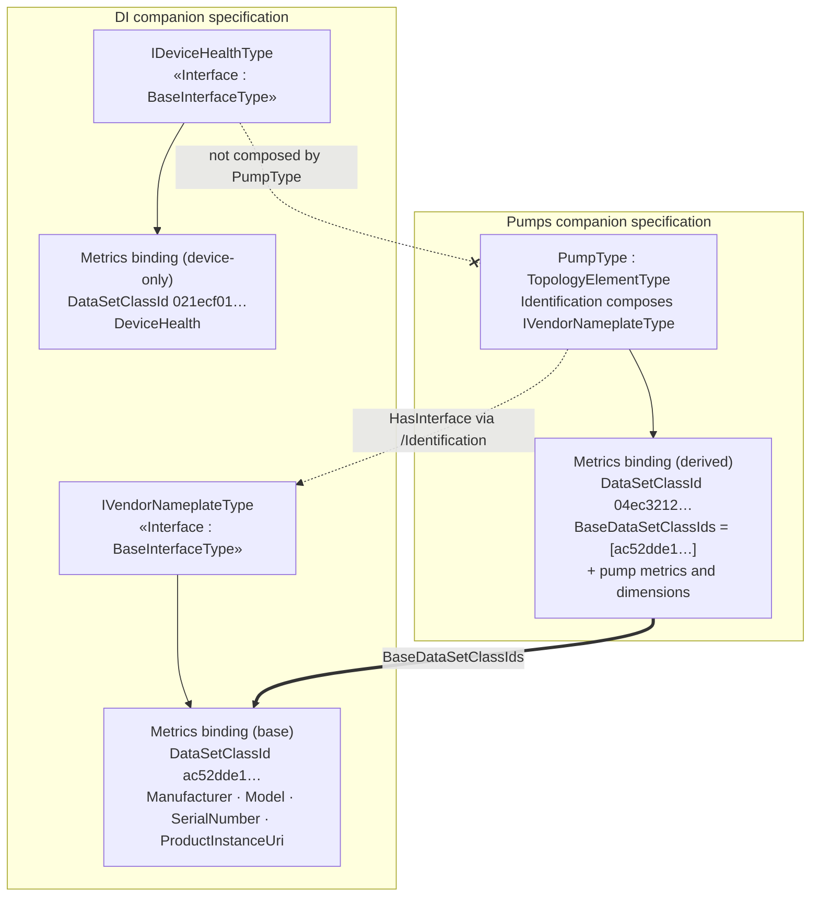

# OPC UA — Observability Export — DI ↔ Pumps inheritance (illustration)

*Non-normative. Companion to the base specification, §5.12 "Binding inheritance and facet composition". Shows how a Pumps Metrics binding extends a DI nameplate Metrics binding through facet composition. Observability Export is read-only; the former DI action-set example has been removed.*

## 1 Why a pump extends a DI observability binding

A `PumpType` is a DI `TopologyElementType`, and its `Identification` object composes the DI `IVendorNameplateType` facet. Because `HasInterface`/component composition is one of the inheritance axes of §5.12, an observability binding authored once on the DI facet is inherited by every type that composes it, including a pump.

The DI companion specification owns a reusable **Metrics** binding on `IVendorNameplateType` for nameplate identity/resource attributes. The Pumps companion specification's **Metrics** binding is a superset: the DI nameplate fields (inherited) plus pump-specific operational metrics and dimensions.

## 2 The base binding — DI Metrics on `IVendorNameplateType`

Generated overlay: [`Opc.Ua.DI.ObservabilityExport.NodeSet2.xml`](Opc.Ua.DI.ObservabilityExport.NodeSet2.xml), addendum [`OPC-UA-DI-Observability-Export-Addendum.md`](OPC-UA-DI-Observability-Export-Addendum.md).

| Field | Kind | BrowsePath (facet-relative) |
|---|---|---|
| Manufacturer | Identification | `/Manufacturer` |
| Model | Identification | `/Model` |
| SerialNumber | Identification | `/SerialNumber` |
| ProductInstanceUri | Identification | `/ProductInstanceUri` |

- SignalKind: `Metrics` · Bound target: `http://opcfoundation.org/UA/DI/;IVendorNameplateType`
- **DataSetClassId** `ac52dde1-e3db-5534-bc44-5b18d9335b72` (deterministic over `ObservabilityExport|http://opcfoundation.org/UA/DI/;IVendorNameplateType|Metrics|1`).

## 3 The derived binding — Pumps Metrics on `PumpType`

The pump's `Identification` object composes `IVendorNameplateType`, so the pump inherits the four nameplate fields. Per §5.12 a derived binding lists its own delta fields and references the base lineage with **`BaseDataSetClassIds`**; it does not restate inherited fields. The Pumps Metrics binding adds operational pump metrics and pump-specific dimensions (`AssetId`, `Location`, `service.name`).

At compose time a Server/bridge unions this delta with the DI base binding, re-anchoring DI facet paths by the pump's `Identification` mount path. The inherited fields carry `SourceBindingClassId = ac52dde1…` on the composed DataSet; pump-owned fields omit it.

- Bound target: `http://opcfoundation.org/UA/Pumps/;PumpType`
- Composed **DataSetClassId** `04ec3212-44fd-579c-ad2f-38b3c32df9e8` · **BaseDataSetClassIds** `[ac52dde1-e3db-5534-bc44-5b18d9335b72]`.
- Generated overlay: [`../pumps/Opc.Ua.Pumps.ObservabilityExport.NodeSet2.xml`](../pumps/Opc.Ua.Pumps.ObservabilityExport.NodeSet2.xml).

A subscriber that only knows the DI nameplate class recognizes the four base fields by `SourceBindingClassId`; a subscriber that knows the pump class consumes the full pump metrics DataSet.

## 4 A DI observability binding the pump does not inherit

DI also defines a **Metrics** binding on `IDeviceHealthType` (`DeviceHealth`, DataSetClassId `021ecf01-f573-54e1-b4c5-112ced3f846f`). A pump does not compose `IDeviceHealthType`, so this binding is device-only and is not inherited by the Pumps example. Inheritance follows the facets a type actually composes, nothing more.
