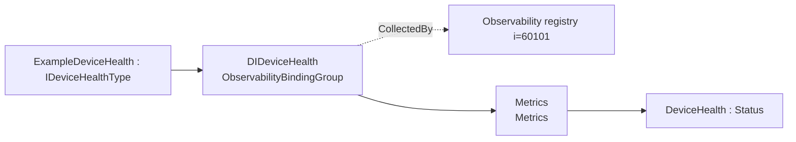
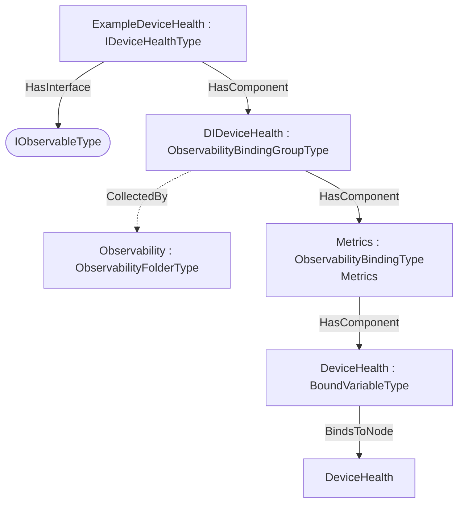

# OPC UA DIDeviceHealth — Observability Export Addendum

**Working draft — a worked example of the [Observability Export](../OPC-UA-Observability-Export.md) base specification applied to OPC UA Devices (DI, OPC 10000-100).**

> **Status — illustrative example.** The `http://opcfoundation.org/UA/PubSub/Examples/DIDeviceHealth/` namespace and NodeIds are provisional. The example shows how `IDeviceHealthType` data is declared for OTEL metrics, logs and traces over classic OPC UA and optional PubSub.

## 1 Scope

This addendum defines example **observability export bindings** for `IDeviceHealthType` — 1 bound items across Metrics (Metrics). The DI IDeviceHealthType facet exposes DeviceHealth as an OTEL status gauge. A pump does not compose IDeviceHealthType, so this binding is device-only.

## 2 Normative references

- [Observability Export](../OPC-UA-Observability-Export.md) — the base binding model (discovery and OTEL mapping).
- [OPC UA Devices (DI, OPC 10000-100)](https://reference.opcfoundation.org/DI/v104/docs/) — the companion specification whose type is bound.
- [OPC 10000-14](https://reference.opcfoundation.org/specs/OPC-10000-14/) — PubSub (optional realization).

## 3 How the bindings are applied

The machine-readable descriptor [`DI.DeviceHealth.ObservabilityExport.json`](../../extras/observability-export/examples/di/DI.DeviceHealth.ObservabilityExport.json) lists each bound item as a `BrowsePath` from `IDeviceHealthType`, with its observability `Kind` and OTEL `SignalKind`. The generated overlay [`Opc.Ua.DIDeviceHealth.ObservabilityExport.NodeSet2.xml`](Opc.Ua.DIDeviceHealth.ObservabilityExport.NodeSet2.xml) instantiates a compact `ExampleDeviceHealth` object, applies `IObservableType`, and exposes an `ObservabilityBindingGroup` collected by (`CollectedBy`) the server-wide `Observability` registry.

> **Theoretical instance model.** A compact instance implementing IDeviceHealthType.

Only the bound signals are materialised in the overlay; it is illustrative, not a full companion instance.

## 4 Observability export bindings for `IDeviceHealthType`

Bindings for `IDeviceHealthType` in `http://opcfoundation.org/UA/DI/`, per the [Observability Export](../OPC-UA-Observability-Export.md) base specification. Each binding exposes one OTEL signal (`Metrics`, `Logs` or `Traces`) with a deterministic `DataSetClassId`.

### Metrics — Metrics

*Signal:* OTEL metrics (PublishedDataItems) · *DataSetClassId:* `021ecf01-f573-54e1-b4c5-112ced3f846f` · *Cardinality:* one DataSet (bound root)

| Field | Kind | BrowsePath | Source type | DataType | OTEL |
|---|---|---|---|---|---|
| DeviceHealth | Status | `/DeviceHealth` | `i=63` | i=6244 | Gauge |

## 5 Where the bindings live

Overview of the observability bindings and their placement on the theoretical instance:

## 7 Deliverables

| File | Content |
|---|---|
| [`DI.DeviceHealth.ObservabilityExport.json`](../../extras/observability-export/examples/di/DI.DeviceHealth.ObservabilityExport.json) | Machine-readable ObservabilityExport descriptor (single source). |
| [`Opc.Ua.DIDeviceHealth.ObservabilityExport.NodeSet2.xml`](Opc.Ua.DIDeviceHealth.ObservabilityExport.NodeSet2.xml) | The binding instances on the theoretical `ExampleDeviceHealth` instance. |

Regenerate from [`core-specs/extras/observability-export/examples/`](../../extras/observability-export/examples/) with `python tools/build_bindings.py di/DI.DeviceHealth.ObservabilityExport.json tools/ref`.
