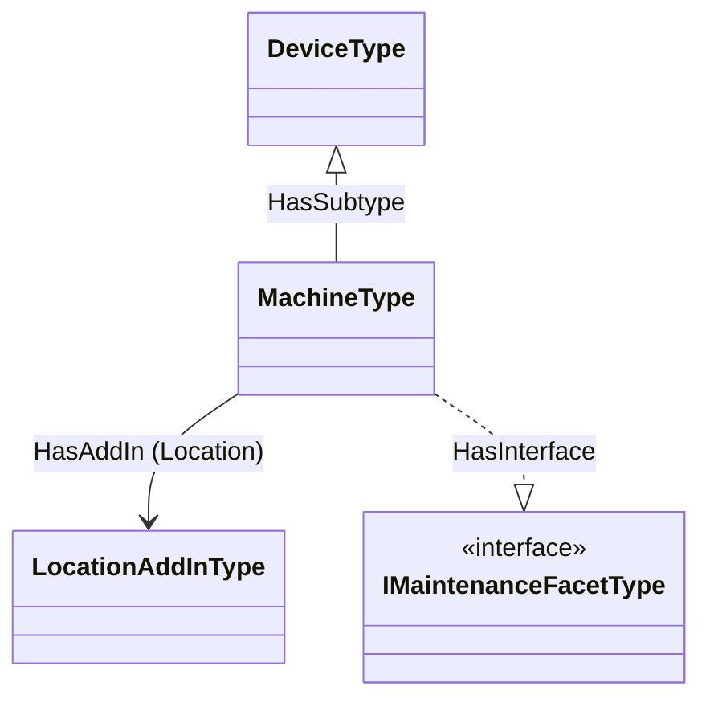

# OPC UA — Observability Export — Facets & Inheritance Addendum

*Non-normative. Companion to the [base specification](../OPC-UA-Observability-Export.md), section “Binding inheritance and facet composition” (§5.12). Generated by [`core-specs/extras/observability-export/examples/facets/build_facets_example.py`](../../extras/observability-export/examples/facets/build_facets_example.py) from the self-contained [`Opc.Ua.FacetDemo.NodeSet2.xml`](../../extras/observability-export/examples/facets/Opc.Ua.FacetDemo.NodeSet2.xml) model.*

## 1. The model

A `MachineType` reuses base-facet observability bindings across **all three** OPC UA composition axes, instead of restating their fields:

- **subtype** — `MachineType` *is-a* `DeviceType`, so it inherits the **Device Observability** binding;
- **AddIn** — `MachineType` *composes* a `Location` block (`HasAddIn` → `LocationAddInType`), so it composes the **Location Observability** binding;
- **interface** — `MachineType` *implements* `IMaintenanceFacetType` (`HasInterface`), so it inherits the **Maintenance** binding.

## 2. Base facet bindings

Each facet defines its observability binding **once**, on its own type:

| Binding | Defined on (axis) | Signal | `DataSetClassId` | Fields |
|---|---|---|---|---|
| **DeviceObservability** | `DeviceType` — ObjectType (subtype base) | Metrics | `1760c83f…` | `Manufacturer`, `SerialNumber`, `DeviceHealth` |
| **LocationObservability** | `LocationAddInType` — AddIn (structural facet) | Metrics | `5d376ec7…` | `Latitude`, `Longitude`, `Altitude` |
| **Maintenance** | `IMaintenanceFacetType` — Interface (contract facet) | Metrics | `7e967a1b…` | `LastMaintenanceDate` |

## 3. Derived bindings — delta only

A derived binding lists **only its added (delta) fields** and references the base classes it builds on via `BaseDataSetClassIds` (and, where the base node is local, `HasBaseBinding`). It never restates or removes an inherited field, so its DataSet is always a **superset** of each base.

| Derived binding | Signal | Own `DataSetClassId` | Delta fields | `BaseDataSetClassIds` |
|---|---|---|---|---|
| **MachineObservability** | Metrics | `53dc8a49…` | `SpindleSpeed`, `AxisLoad` · overrides `DeviceHealth` | `1760c83f…`, `5d376ec7…` |
| **MachineMaintenance** | Metrics | `53dc8a49…` | *(none — pure inheritance)* | `7e967a1b…` |

## 4. What the bridge produces — the composed DataSets

A bridge composes the effective DataSet for `MachineType` + a signal by **unioning** the bindings reachable via subtype, `HasAddIn` and `HasInterface` (override by `FieldName`), re-rooting each base facet's BrowsePaths under its mount point (the AddIn is mounted at `/Location`), and tagging every field with the `SourceObservabilityExportClassId` of the base binding it came from. The composed DataSet keeps `MachineType`'s own `DataSetClassId` and advertises the contributing base classes in `BaseDataSetClassIds`.

### 4.1 `MachineObservability` — Metrics DataSet (8 fields, class `53dc8a49…`)

| Field | Resolved BrowsePath (on a Machine instance) | From facet | Provenance `SourceObservabilityExportClassId` | Note |
|---|---|---|---|---|
| `Manufacturer` | `/Manufacturer` | DeviceObservability | `1760c83f…` | inherited |
| `SerialNumber` | `/SerialNumber` | DeviceObservability | `1760c83f…` | inherited |
| `DeviceHealth` | `/DeviceHealth` | DeviceObservability | `1760c83f…` | overrides base field |
| `Latitude` | `/Location/Latitude` | LocationObservability | `5d376ec7…` | inherited |
| `Longitude` | `/Location/Longitude` | LocationObservability | `5d376ec7…` | inherited |
| `Altitude` | `/Location/Altitude` | LocationObservability | `5d376ec7…` | inherited |
| `SpindleSpeed` | `/SpindleSpeed` | MachineObservability | — | own field |
| `AxisLoad` | `/AxisLoad` | MachineObservability | — | own field |

### 4.2 `MachineMaintenance` — Metrics DataSet (1 fields, class `53dc8a49…`)

| Field | Resolved BrowsePath (on a Machine instance) | From facet | Provenance `SourceObservabilityExportClassId` | Note |
|---|---|---|---|---|
| `LastMaintenanceDate` | `/LastMaintenanceDate` | Maintenance | `7e967a1b…` | inherited |

## 5. Facet-scoped subset recognition

A semantics-agnostic subscriber that understands only a **base facet** recognises the base `DataSetClassId` in the composed DataSet's `BaseDataSetClassIds` and consumes exactly the fields tagged with that class in `SourceObservabilityExportClassId` — without understanding `MachineType`:

- A **DeviceObservability** subscriber (knows `1760c83f…`) selects 3 of 8 fields: `Manufacturer`, `SerialNumber`, `DeviceHealth`.
- A **LocationObservability** subscriber (knows `5d376ec7…`) selects 3 of 8 fields: `Latitude`, `Longitude`, `Altitude`.
- A subscriber that understands the full `MachineObservability` class (`53dc8a49…`) consumes all 8 fields.

## 6. Where the binding nodes live

`Opc.Ua.Facets.ObservabilityExport.NodeSet2.xml` in this folder collapses the four base bindings and the two derived bindings under one `ObservabilityBindingGroup` (`FacetDemo`) for readability, exposed on an illustrative `FacetDemoInstance` that implements `IObservableType`. A conformant Server does not collapse them: it exposes one group per (`SignalUri` × `CompanionSpecificationUri`) with unique sibling BrowseNames (§5.1.1), so each facet type carries its own group (Device on `DeviceType`, Location on `LocationAddInType`, Maintenance on `IMaintenanceFacetType`) and a `MachineType` instance exposes the derived bindings' group, which the Server/bridge composes with the inherited/AddIn/interface bindings at resolve time per §5.12. NodeIds and the example namespace are provisional.

