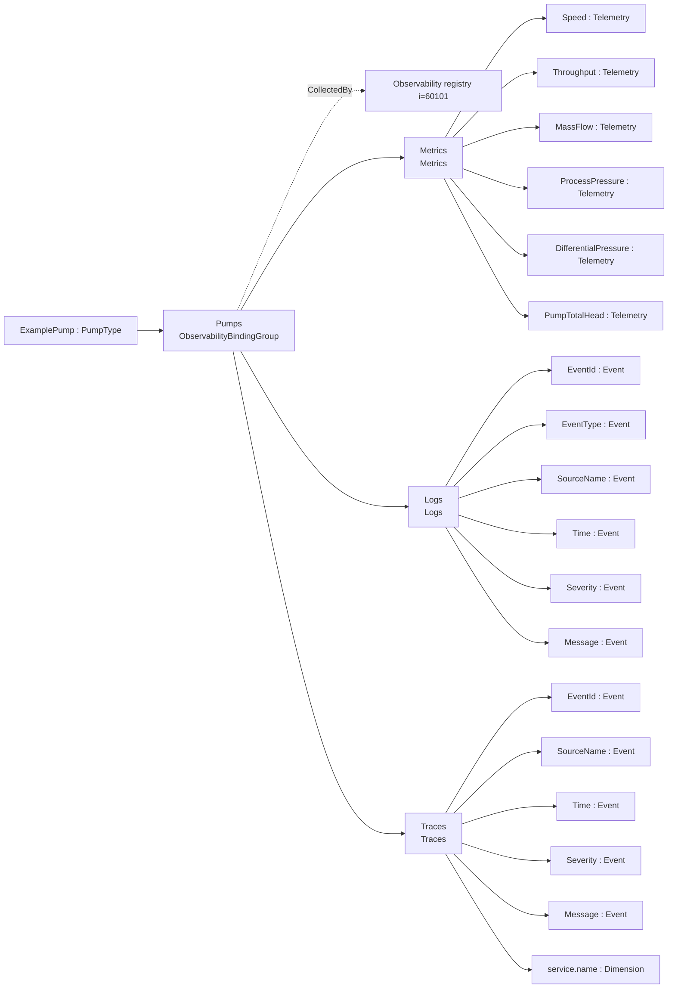
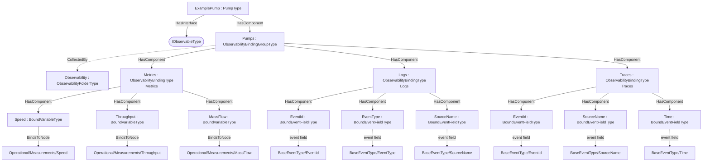

# OPC UA Pumps — Observability Export Addendum

**Working draft — a worked example of the [Observability Export](../OPC-UA-Observability-Export.md) base specification applied to OPC UA for Pumps and Vacuum Pumps.**

> **Status — illustrative example.** The `http://opcfoundation.org/UA/PubSub/Examples/Pumps/` namespace and NodeIds are provisional. The example shows how `PumpType` data is declared for OTEL metrics, logs and traces over classic OPC UA and optional PubSub.

## 1 Scope

This addendum defines example **observability export bindings** for `PumpType` — 41 bound items across Metrics (Metrics), Logs (Logs), Traces (Traces). Pumps expose operational measurements, identity dimensions and events that map naturally to OTEL metrics, logs and traces.

## 2 Normative references

- [Observability Export](../OPC-UA-Observability-Export.md) — the base binding model (discovery and OTEL mapping).
- [OPC UA for Pumps and Vacuum Pumps](https://reference.opcfoundation.org/Pumps/v100/docs/) — the companion specification whose type is bound.
- [OPC 10000-14](https://reference.opcfoundation.org/specs/OPC-10000-14/) — PubSub (optional realization).

## 3 How the bindings are applied

The machine-readable descriptor [`Pumps.ObservabilityExport.json`](../../extras/observability-export/examples/pumps/Pumps.ObservabilityExport.json) lists each bound item as a `BrowsePath` from `PumpType`, with its observability `Kind` and OTEL `SignalKind`. The generated overlay [`Opc.Ua.Pumps.ObservabilityExport.NodeSet2.xml`](Opc.Ua.Pumps.ObservabilityExport.NodeSet2.xml) instantiates a compact `ExamplePump` object, applies `IObservableType`, and exposes an `ObservabilityBindingGroup` collected by (`CollectedBy`) the server-wide `Observability` registry.

> **Theoretical instance model.** The theoretical instance mirrors the official Pumps instanceexample.xml (an ExamplePump : PumpType with Operational/Measurements, Identification, Supervision*, Maintenance and a <Drive>); the bound BrowsePaths resolve against exactly that structure. See [Pumps/instanceexample.xml](https://github.com/OPCFoundation/UA-Nodeset/blob/latest/Pumps/instanceexample.xml).

Only the bound signals are materialised in the overlay; it is illustrative, not a full companion instance.

## 4 Observability export bindings for `PumpType`

Bindings for `PumpType` in `http://opcfoundation.org/UA/Pumps/`, per the [Observability Export](../OPC-UA-Observability-Export.md) base specification. Each binding exposes one OTEL signal (`Metrics`, `Logs` or `Traces`) with a deterministic `DataSetClassId`.

### Metrics — Metrics

*Signal:* OTEL metrics (PublishedDataItems) · *DataSetClassId:* `04ec3212-44fd-579c-ad2f-38b3c32df9e8` · *Cardinality:* one DataSet (bound root)

| Field | Kind | BrowsePath | Source type | DataType | OTEL |
|---|---|---|---|---|---|
| Speed | Telemetry | `/Operational/Measurements/Speed` | `i=15318` | Double | Gauge [1/min] |
| Throughput | Telemetry | `/Operational/Measurements/Throughput` | `i=15318` | Double | Gauge [m3/s] |
| MassFlow | Telemetry | `/Operational/Measurements/MassFlow` | `i=15318` | Double | Gauge [kg/s] |
| ProcessPressure | Telemetry | `/Operational/Measurements/ProcessPressure` | `i=15318` | Double | Gauge [Pa] |
| DifferentialPressure | Telemetry | `/Operational/Measurements/DifferentialPressure` | `i=15318` | Double | Gauge [Pa] |
| PumpTotalHead | Telemetry | `/Operational/Measurements/PumpTotalHead` | `i=15318` | Double | Gauge [m] |
| PumpPowerInput | Telemetry | `/Operational/Measurements/PumpPowerInput` | `i=15318` | Double | Gauge [W] |
| PumpPowerOutput | Telemetry | `/Operational/Measurements/PumpPowerOutput` | `i=15318` | Double | Gauge [W] |
| OverallEfficiency | Metric | `/Operational/Measurements/OverallEfficiency` | `i=15318` | Double | Gauge [%] |
| PumpEfficiency | Metric | `/Operational/Measurements/PumpEfficiency` | `i=15318` | Double | Gauge [%] |
| HydraulicEfficiency | Metric | `/Operational/Measurements/HydraulicEfficiency` | `i=15318` | Double | Gauge [%] |
| FluidTemperature | Telemetry | `/Operational/Measurements/FluidTemperature` | `i=15318` | Double | Gauge [Cel] |
| BearingTemperature | Telemetry | `/Operational/Measurements/BearingTemperature` | `i=15318` | Double | Histogram [Cel] buckets 40,60,80,100,120 |
| PumpTemperature | Telemetry | `/Operational/Measurements/PumpTemperature` | `i=15318` | Double | Gauge [Cel] |
| AxialLoadOfPumpRotor | Telemetry | `/Operational/Measurements/AxialLoadOfPumpRotor` | `i=15318` | Double | Gauge [N] |
| RadialLoadOfPumpRotor | Telemetry | `/Operational/Measurements/RadialLoadOfPumpRotor` | `i=15318` | Double | Gauge [N] |
| LubricatingOilPressure | Telemetry | `/Operational/Measurements/LubricatingOilPressure` | `i=15318` | Double | Gauge [Pa] |
| AxialRotorPosition | Telemetry | `/Operational/Measurements/AxialRotorPosition` | `i=15318` | Double | Gauge [m] |
| SoundPower | Telemetry | `/Operational/Measurements/SoundPower` | `i=15318` | Double | Gauge [dB] |
| SoundPressureLevel | Telemetry | `/Operational/Measurements/SoundPressureLevel` | `i=15318` | Double | Gauge [dB] |
| NumberOfStarts | Counter | `/Operational/Measurements/NumberOfStarts` | `i=15318` | UInt32 | Counter cumulative monotonic |
| Manufacturer | Dimension | `/Identification/Manufacturer` | `i=68` | LocalizedText | dimension |
| Model | Dimension | `/Identification/Model` | `i=68` | LocalizedText | dimension |
| SerialNumber | Dimension | `/Identification/SerialNumber` | `i=68` | String | dimension |
| ProductInstanceUri | Dimension | `/Identification/ProductInstanceUri` | `i=68` | String | dimension |
| AssetId | Dimension | `/Identification/AssetId` | `i=68` | String | dimension |
| Location | Dimension | `/Identification/Location` | `i=68` | String | dimension |
| service.name | Dimension | — | — | — | dimension = `pump-observability` (const) |

### Logs — Logs

*Signal:* OTEL logs (PublishedEvents) · *DataSetClassId:* `46d1c23b-a92c-5056-b5d8-084e848a761e` · *Cardinality:* one DataSet (bound root) · *Event source:* `/` · *Event type:* BaseEventType

| Field | Kind | Event field / attribute |
|---|---|---|
| EventId | Event | `/EventId` |
| EventType | Event | `/EventType` |
| SourceName | Event | `/SourceName` |
| Time | Event | `/Time` |
| Severity | Event | `/Severity` |
| Message | Event | `/Message` |
| service.name | Dimension | dimension = `pump-observability` (const) |

*OTEL LogRecord mapping:* body template `{SourceName}: {Message} (severity {Severity})`; severity = `Severity`, body = `Message`, timestamp = `Time`.

### Traces — Traces

*Signal:* OTEL traces/spans (PublishedEvents) · *DataSetClassId:* `cd367489-b1eb-5e95-ad67-32eebfdc438a` · *Cardinality:* one DataSet (bound root) · *Event source:* `/` · *Event type:* BaseEventType

| Field | Kind | Event field / attribute |
|---|---|---|
| EventId | Event | `/EventId` |
| SourceName | Event | `/SourceName` |
| Time | Event | `/Time` |
| Severity | Event | `/Severity` |
| Message | Event | `/Message` |
| service.name | Dimension | dimension = `pump-observability` (const) |

*OTEL Span mapping:* name template `Pump operation {SourceName}`, start = `Time`, end = `—`, status = `Severity`, kind = `Internal`.

## 5 Where the bindings live

Overview of the observability bindings and their placement on the theoretical instance:

## 7 Deliverables

| File | Content |
|---|---|
| [`Pumps.ObservabilityExport.json`](../../extras/observability-export/examples/pumps/Pumps.ObservabilityExport.json) | Machine-readable ObservabilityExport descriptor (single source). |
| [`Opc.Ua.Pumps.ObservabilityExport.NodeSet2.xml`](Opc.Ua.Pumps.ObservabilityExport.NodeSet2.xml) | The binding instances on the theoretical `ExamplePump` instance. |

Regenerate from [`core-specs/extras/observability-export/examples/`](../../extras/observability-export/examples/) with `python tools/build_bindings.py pumps/Pumps.ObservabilityExport.json tools/ref`.
