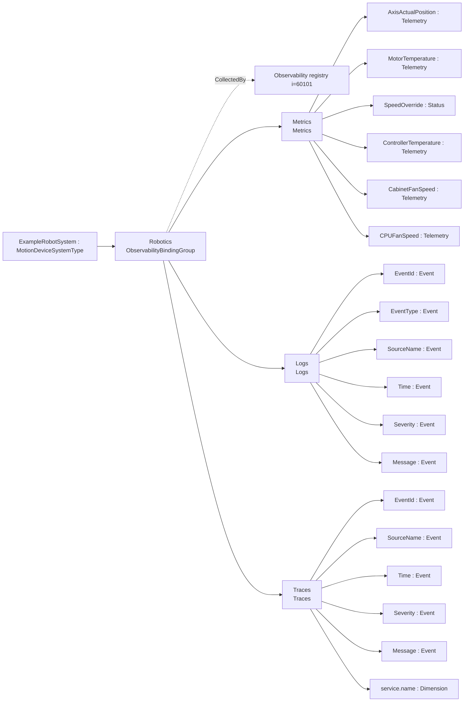
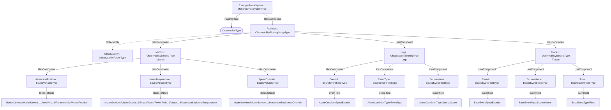

# OPC UA Robotics — Observability Export Addendum

**Working draft — a worked example of the [Observability Export](../OPC-UA-Observability-Export.md) base specification applied to OPC UA for Robotics (OPC 40010).**

> **Status — illustrative example.** The `http://opcfoundation.org/UA/PubSub/Examples/Robotics/` namespace and NodeIds are provisional. The example shows how `MotionDeviceSystemType` data is declared for OTEL metrics, logs and traces over classic OPC UA and optional PubSub.

## 1 Scope

This addendum defines example **observability export bindings** for `MotionDeviceSystemType` — 25 bound items across Metrics (Metrics), Logs (Logs), Traces (Traces). Robotics exposes motion-device, axis, motor, controller and safety state information for OTEL metrics, logs and traces.

## 2 Normative references

- [Observability Export](../OPC-UA-Observability-Export.md) — the base binding model (discovery and OTEL mapping).
- [OPC UA for Robotics (OPC 40010)](https://reference.opcfoundation.org/Robotics/v100/docs/) — the companion specification whose type is bound.
- [OPC 10000-14](https://reference.opcfoundation.org/specs/OPC-10000-14/) — PubSub (optional realization).

## 3 How the bindings are applied

The machine-readable descriptor [`Robotics.ObservabilityExport.json`](../../extras/observability-export/examples/robotics/Robotics.ObservabilityExport.json) lists each bound item as a `BrowsePath` from `MotionDeviceSystemType`, with its observability `Kind` and OTEL `SignalKind`. The generated overlay [`Opc.Ua.Robotics.ObservabilityExport.NodeSet2.xml`](Opc.Ua.Robotics.ObservabilityExport.NodeSet2.xml) instantiates a compact `ExampleRobotSystem` object, applies `IObservableType`, and exposes an `ObservabilityBindingGroup` collected by (`CollectedBy`) the server-wide `Observability` registry.

> **Theoretical instance model.** Robotics publishes no public instance example, so a compact theoretical MotionDeviceSystem is synthesised with one MotionDevice, one Axis, one PowerTrain/Motor, one Controller and one SafetyState. Placeholder path segments remain in type-level BrowsePaths.

Only the bound signals are materialised in the overlay; it is illustrative, not a full companion instance.

## 4 Observability export bindings for `MotionDeviceSystemType`

Bindings for `MotionDeviceSystemType` in `http://opcfoundation.org/UA/Robotics/`, per the [Observability Export](../OPC-UA-Observability-Export.md) base specification. Each binding exposes one OTEL signal (`Metrics`, `Logs` or `Traces`) with a deterministic `DataSetClassId`.

### Metrics — Metrics

*Signal:* OTEL metrics (PublishedDataItems) · *DataSetClassId:* `142d1e8e-93e7-5436-8a2b-c99fe45b80e7` · *Cardinality:* one DataSet (bound root)

| Field | Kind | BrowsePath | Source type | DataType | OTEL |
|---|---|---|---|---|---|
| AxisActualPosition | Telemetry | `/MotionDevices/<MotionDeviceIdentifier>/Axes/<AxisIdentifier>/ParameterSet/ActualPosition` | `i=17497` | Double | Gauge [deg] |
| MotorTemperature | Telemetry | `/MotionDevices/<MotionDeviceIdentifier>/PowerTrains/<PowerTrainIdentifier>/<MotorIdentifier>/ParameterSet/MotorTemperature` | `i=17497` | Double | Gauge [Cel] |
| SpeedOverride | Status | `/MotionDevices/<MotionDeviceIdentifier>/ParameterSet/SpeedOverride` | `i=63` | Double | Gauge [%] |
| ControllerTemperature | Telemetry | `/Controllers/<ControllerIdentifier>/ParameterSet/Temperature` | `i=17497` | Double | Gauge [Cel] |
| CabinetFanSpeed | Telemetry | `/Controllers/<ControllerIdentifier>/ParameterSet/CabinetFanSpeed` | `i=17497` | Double | Gauge [1/min] |
| CPUFanSpeed | Telemetry | `/Controllers/<ControllerIdentifier>/ParameterSet/CPUFanSpeed` | `i=17497` | Double | Gauge [1/min] |
| TotalPowerOnTime | Counter | `/Controllers/<ControllerIdentifier>/ParameterSet/TotalPowerOnTime` | `i=63` | i=12879 | Counter cumulative monotonic |
| Manufacturer | Dimension | `/Manufacturer` | `i=68` | LocalizedText | dimension |
| Model | Dimension | `/Model` | `i=68` | LocalizedText | dimension |
| SerialNumber | Dimension | `/SerialNumber` | `i=68` | String | dimension |
| ProductInstanceUri | Dimension | `/ProductInstanceUri` | `i=68` | String | dimension |
| service.name | Dimension | — | — | — | dimension = `robotics-observability` (const) |

### Logs — Logs

*Signal:* OTEL logs (PublishedEvents) · *DataSetClassId:* `38f93e0c-7ad5-5e8d-bee9-1f2096b6c24f` · *Cardinality:* one DataSet (bound root) · *Event source:* `/` · *Event type:* AlarmConditionType

| Field | Kind | Event field / attribute |
|---|---|---|
| EventId | Event | `/EventId` |
| EventType | Event | `/EventType` |
| SourceName | Event | `/SourceName` |
| Time | Event | `/Time` |
| Severity | Event | `/Severity` |
| Message | Event | `/Message` |
| service.name | Dimension | dimension = `robotics-observability` (const) |

*OTEL LogRecord mapping:* body template `{SourceName}: {Message} (severity {Severity})`; severity = `Severity`, body = `Message`, timestamp = `Time`.

### Traces — Traces

*Signal:* OTEL traces/spans (PublishedEvents) · *DataSetClassId:* `1d01f74f-5b27-5bf0-b933-5fa3019d1544` · *Cardinality:* one DataSet (bound root) · *Event source:* `/` · *Event type:* BaseEventType

| Field | Kind | Event field / attribute |
|---|---|---|
| EventId | Event | `/EventId` |
| SourceName | Event | `/SourceName` |
| Time | Event | `/Time` |
| Severity | Event | `/Severity` |
| Message | Event | `/Message` |
| service.name | Dimension | dimension = `robotics-observability` (const) |

*OTEL Span mapping:* name template `Robot program/state {SourceName}`, start = `Time`, end = `—`, status = `Severity`, kind = `Internal`.

## 5 Where the bindings live

Overview of the observability bindings and their placement on the theoretical instance:

## 6 BrowsePath resolution — worked examples

The type-level bindings above use placeholder BrowsePaths. A bridge resolves them against a concrete instance (via `TranslateBrowsePathsToNodeIds`) and produces **one DataSet per matched instance of each binding's cardinality anchor** (`DataSetCardinalityPath`); placeholders **below** the anchor become fields, their name disambiguated by the matched instance (per §5.10 of the base spec). The `DataSetClassId` is identical for every DataSet of a signal — it names the *class*, of which there are many DataSetWriters. The same bindings resolve differently for different instance topologies:

### Topology 1: Single 6-axis articulated robot

*MotionDevices:* Robot_1 (6 axes, 6 motors) · *Controllers:* Controller_1

| Binding | DataSet (cardinality instance) | # fields | Example fields |
|---|---|---|---|
| Metrics | ExampleRobotSystem | 12 | AxisActualPosition, MotorTemperature, SpeedOverride, ControllerTemperature … |
| Logs | ExampleRobotSystem | 7 | EventId, EventType, SourceName, Time … |
| Traces | ExampleRobotSystem | 6 | EventId, SourceName, Time, Severity … |

→ **3 DataSets** produced by the bridge for this topology.

### Topology 2: Single 4-axis SCARA

*MotionDevices:* Scara_1 (4 axes, 4 motors) · *Controllers:* Controller_1

| Binding | DataSet (cardinality instance) | # fields | Example fields |
|---|---|---|---|
| Metrics | ExampleRobotSystem | 12 | AxisActualPosition, MotorTemperature, SpeedOverride, ControllerTemperature … |
| Logs | ExampleRobotSystem | 7 | EventId, EventType, SourceName, Time … |
| Traces | ExampleRobotSystem | 6 | EventId, SourceName, Time, Severity … |

→ **3 DataSets** produced by the bridge for this topology.

### Topology 3: Two-robot cell (6+4 axes)

*MotionDevices:* Robot_1 (6 axes, 6 motors), Robot_2 (4 axes, 4 motors) · *Controllers:* Controller_1

| Binding | DataSet (cardinality instance) | # fields | Example fields |
|---|---|---|---|
| Metrics | ExampleRobotSystem | 12 | AxisActualPosition, MotorTemperature, SpeedOverride, ControllerTemperature … |
| Logs | ExampleRobotSystem | 7 | EventId, EventType, SourceName, Time … |
| Traces | ExampleRobotSystem | 6 | EventId, SourceName, Time, Severity … |

→ **3 DataSets** produced by the bridge for this topology.

Across all topologies the `DataSetClassId` per signal is unchanged — a subscriber recognizes each DataSet's class regardless of how many robots, axes or controllers a particular cell has; only the number of DataSets (writers) and the field counts differ.

## 7 Deliverables

| File | Content |
|---|---|
| [`Robotics.ObservabilityExport.json`](../../extras/observability-export/examples/robotics/Robotics.ObservabilityExport.json) | Machine-readable ObservabilityExport descriptor (single source). |
| [`Opc.Ua.Robotics.ObservabilityExport.NodeSet2.xml`](Opc.Ua.Robotics.ObservabilityExport.NodeSet2.xml) | The binding instances on the theoretical `ExampleRobotSystem` instance. |

Regenerate from [`core-specs/extras/observability-export/examples/`](../../extras/observability-export/examples/) with `python tools/build_bindings.py robotics/Robotics.ObservabilityExport.json tools/ref`.
