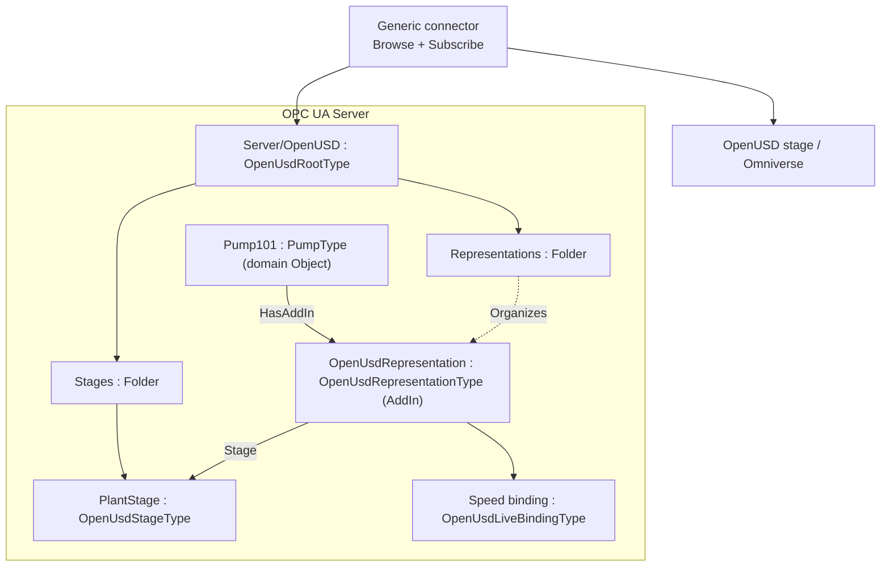
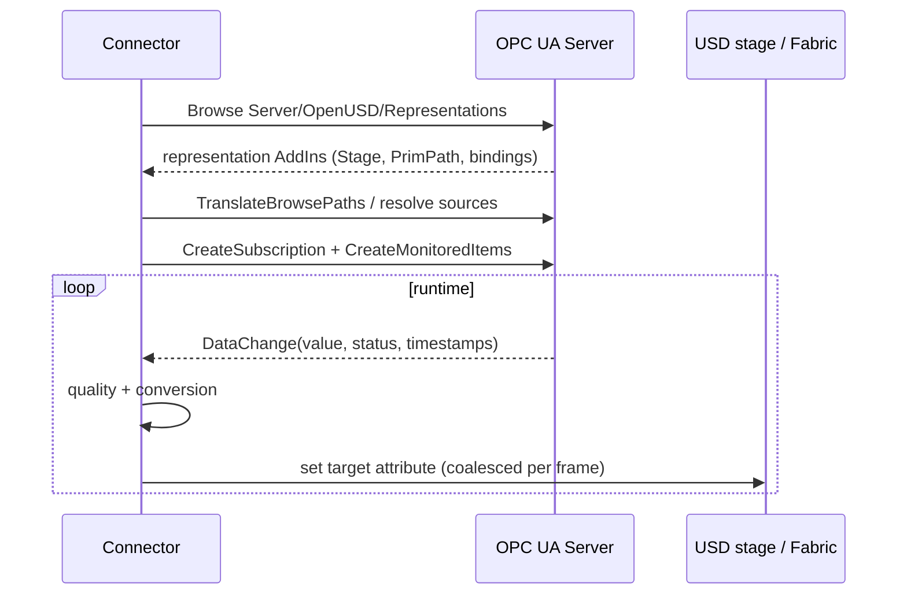
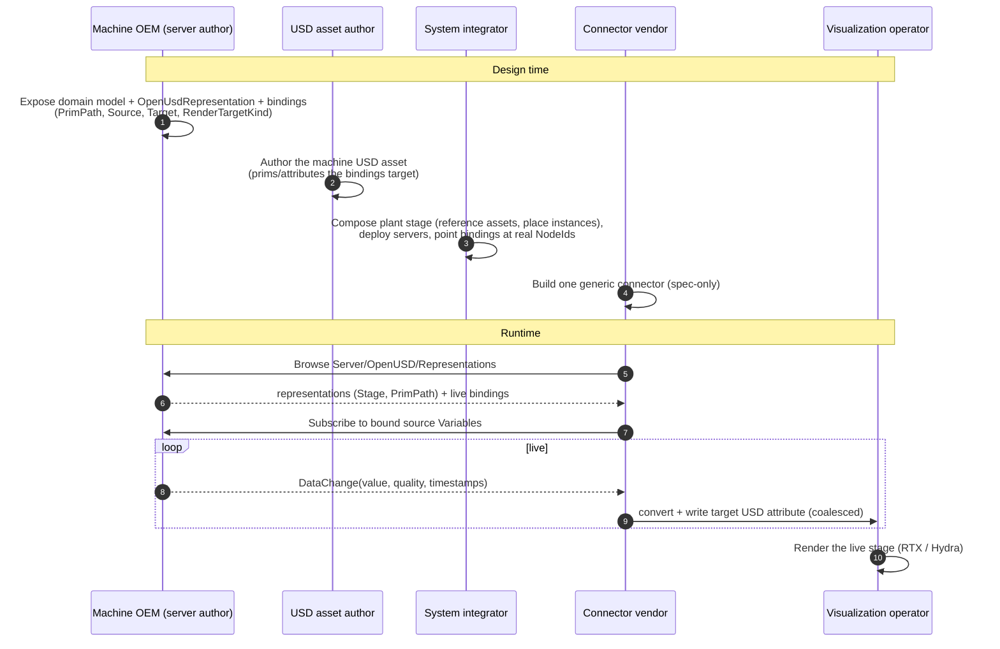

# OPC UA — OpenUSD Bindings

**Release 0.2.0 — Draft**
**Namespace:** `http://opcfoundation.org/UA/OpenUSD/`
**Publication date:** 2026-07-13

> Status: Working-group draft. This document, together with `Opc.Ua.OpenUsdBinding.NodeSet2.xml` and `Opc.Ua.OpenUsdBinding.NodeIds.csv`, defines an OPC UA information model that lets a Server declare **which OpenUSD (Universal Scene Description) prim represents a given OPC UA Object**, and **which live OPC UA Variable values drive which USD attributes** (and, where authorized, which USD-side intents command OPC UA back), so that a generic connector can render live industrial data in an OpenUSD renderer (for example NVIDIA Omniverse) without hard-coding the mapping. Nothing here is normative, official, or endorsed by the OPC Foundation or the Alliance for OpenUSD; namespace URIs and NodeIds are **provisional** and for prototyping only. The design rationale, prior art, and the corrections that shaped this draft are recorded in the companion research report (`research/openuds-and-omniverse-what-would-be-needed-to-supp.md`, §0).

---

## 1 Scope

This specification defines a small, generic **representation and binding layer** between an OPC UA address space and an OpenUSD model. It is deliberately domain-agnostic: it binds the Objects and Variables of **any** companion specification (Pumps, Robotics, Machinery, …) to a USD scene, and it does not require modifying the USD asset.

The model has four portable capability groups and one informative profile:

- **Representation (identity).** A mandatory, well-known discovery facility (`Server/OpenUSD`) plus an `OpenUsdRepresentation` AddIn that ties an OPC UA Object to a canonical composed USD prim path on a named stage, with optional content-integrity metadata (digest/signature) so a referenced asset can be verified. Representation carries **identity only**; it does not carry values.
- **Live property binding (telemetry).** A read-only mapping from a source OPC UA `Variable` `Value` — resolved by NodeId, RelativePath, or **semantic id** — to a target USD attribute, with conversion and with quality/timestamp/persistence **hints**. This binds **existing** domain Variables; it does not duplicate process data. Event/alarm state and historical playback are expressed as additional intent profiles on the same binding type.
- **Command binding (control).** An **opt-in**, authorized, single-writer mapping from a USD-side intent to an OPC UA setpoint write or `Method` call, so an agent or operator can act on the plant through the same declared, discoverable model. The opt-in is a matter of connector configuration and server `RolePermissions` (not the `Enabled` flag): a Server declares a command binding only deliberately and a conformant connector actuates it only when explicitly enabled and authorized, so the default posture of the model remains read-only.
- **Composition (aggregation).** A declarative mapping of an asset's **components** onto the USD prim hierarchy — 1:1 or 1..n, inline child prims or referenced/instanced sub-assets, static or **dynamic** (reconciled from model-change events), and even components hosted on **another server** — so the visual twin mirrors the asset's *is-composed-of* structure.
- **Omniverse realization (informative).** How a connector realizes the model in NVIDIA Omniverse (Nucleus `.live` layers, Fabric/USDRT, OmniGraph, frame coalescing). This is a separate, vendor-governed profile and is **not** part of the portable normative model.

Out of scope (reserved for later work): Part 14 Actions, PubSub realization, a USD-side applied API schema mirror, persistent-UUID identity, and normative geometry/material/skeleton/physics profiles. Command, event/alarm, history, and composition bindings are **normative but optional** capabilities a Server may choose not to implement.

### 1.4 Capabilities and versioning

This document supersedes Release 0.1.0. The 0.1 baseline (Representation + read-only `UaToUsdTelemetry` binding + the Omniverse informative profile) is unchanged and remains conformant; 0.2.0 **adds** capabilities — semantic-id source, command, alarm, history, content integrity, and **composition/aggregation** — without altering any earlier node or NodeId. New capabilities are additive and each is gated by its own conformance unit (§7), so a Server implements only what it needs. Where this document refers to "the 0.1 baseline" it means the read-only representation + telemetry core; everything else is an optional 0.2.0 capability.


### 1.1 Motivation

Industrial "digital twin" visualization repeatedly re-implements the same brittle glue: a bespoke script maps specific OPC UA NodeIds to specific USD prim attributes and pushes values into a stage. That mapping lives in a connector nobody else can see; it is invisible to other tools, breaks silently when the address space changes, cannot be discovered, and cannot be reviewed, versioned, or governed. Every new pairing of a server with a viewer starts the integration from scratch.

The result is an **N×M integration problem**: *N* servers (pumps, robots, machines, lines) each hand-crafted against *M* visualization tools (Omniverse, `usdview`, web viewers, HMIs) require up to *N×M* one-off bridges, none reusable. This specification collapses that to **N + M**: each server declares its mapping **once**, in its own address space, and each tool implements **one** generic connector. The mapping becomes a first-class, browsable, versioned, authoritative part of the OPC UA model instead of hidden connector code, so a **generic** connector can discover and apply it for any conforming server without prior knowledge of the domain.

### 1.2 Motivating use cases

- Render a live factory line: pump speed drives a rotating impeller, a bearing temperature drives an emissive glow, a running state drives visibility.
- Render a live robot cell: OPC 40010 Axis `ActualPosition` values drive nested OpenUSD joint rotate ops for independently articulated robots, while safety and tool-mount state compose live.
- Position assets in a scene: an RSL 3D frame drives a prim transform.
- Bridge to Omniverse: a connector Browses `Server/OpenUSD`, subscribes to the bound Variables, and writes the mapped USD attributes into a Nucleus `.live` layer for RTX rendering.

### 1.3 What it simplifies and what it enables

**Simplifies.**

- **One declaration, not N×M bridges.** The value/identity mapping is authored once in the server and consumed by any conforming connector; adding a viewer no longer means writing another bridge.
- **No code and no asset edits to change a binding.** Bindings are data in the address space, not connector source or USD-asset edits. Adding, retargeting, or disabling a binding is a model change a server author (or tool) can make and a client can immediately discover.
- **Deterministic onboarding.** Discovery starts at a single well-known entry point (`Server/OpenUSD/Representations`), so bringing a new asset online is "browse and go" rather than "find out which NodeIds the artist hard-coded".
- **Identity separated from values.** A server can publish *which* prim represents *which* Object (Part 1) before any live values are wired, and add value bindings (Part 2) later, without breaking consumers.
- **Reuses existing models unchanged.** Bindings *reference* the Variables that domain companion specs (Pumps, Robotics, Machinery, …) already expose; they do not duplicate or re-model process data.

**Enables.**

- **Interchangeable connectors and renderers.** Competing tools — NVIDIA Omniverse, open-source `usdview`, web viewers — operate over the same declared contract, so servers and viewers evolve independently.
- **Vendor-neutral, auditable digital twins.** Because the mapping is authoritative, versioned, and part of the model, it can be reviewed, diffed, validated, and governed like any other engineering artifact.
- **Toolable pipelines.** The mapping is machine-readable, so it can be generated from engineering data, checked in CI, and migrated across versions (override/tombstone matching via `BindingDefinitionId`).
- **Incremental adoption and clean evolution.** Servers implement the representation core alone first, add value bindings when ready, and refine bindings over time without invalidating previously deployed connectors.
- **An ecosystem division of labour.** Asset authors, machine OEMs, integrators, connector vendors, and visualization operators collaborate through the model as a shared contract rather than through private, point-to-point agreements (see **Annex B**).

---

## 2 Normative references

- [OPC 10000-1 … 10000-8](https://reference.opcfoundation.org/specs/OPC-10000-1/) — OPC Unified Architecture, Parts 1–8 (core), in particular Part 3 [AddIns §4.10.3](https://reference.opcfoundation.org/specs/OPC-10000-3/4.10.3), Part 4 [RelativePath §7.30](https://reference.opcfoundation.org/specs/OPC-10000-4/7.30) and [DataValue §7.11](https://reference.opcfoundation.org/specs/OPC-10000-4/7.11), Part 6 [DataValue encoding §5.2.2.17](https://reference.opcfoundation.org/specs/OPC-10000-6/5.2.2.17), and Part 8 [EUInformation §5.6.4](https://reference.opcfoundation.org/specs/OPC-10000-8/5.6.4).
- [OPC 10000-7](https://reference.opcfoundation.org/specs/OPC-10000-7/4) — Profiles and Conformance Units.
- [OPC 11030](https://reference.opcfoundation.org/specs/OPC-11030/) — OPC UA Modelling Best Practices.
- [AOUSD OpenUSD Core Specification 1.0.1](https://github.com/aousd/specifications-public/blob/2f9e746c4fbd7f48d6d2c9ac568133fe398bbfc0/core/1.0.1/core_spec.md) — normative for USD paths, composition, layers, and identity. **Note:** the Core Specification excludes domain schemas (UsdGeom, UsdShade, UsdLux, UsdSkel, UsdPhysics); the render-target semantics referenced by the transform profile therefore additionally pin a versioned OpenUSD schema release.

Referenced for the transform profile only (not a RequiredModel of the base NodeSet):

- [OPC 10000-210 (RSL) / OPC 10000-5 Spatial Data](https://reference.opcfoundation.org/specs/OPC-10000-210) — the `CartesianFrameAngleOrientationType`, `3DFrame`, `3DCartesianCoordinates`, `3DOrientation` types and their RPY mathematics.

---

## 3 Terms, definitions and abbreviations

| Term | Meaning |
|---|---|
| Prim | A primitive: the primary container object in an OpenUSD namespace hierarchy. |
| Stage | The fully composed, live view of a set of OpenUSD layers. |
| Root layer identifier | The opaque authored identifier of a stage's root layer (not necessarily a URI). |
| SdfPath / prim path | The canonical path identifying a prim on a stage, e.g. `/Plant/Pumps/P101`. |
| Representation | A binding of an OPC UA Object to a prim path on a stage. |
| Live binding | A read-only mapping of a source Variable value to a target USD attribute. |
| BindingDefinitionId | The stable declaration identifier of a live binding, used for override/tombstone matching. |
| Connector | The runtime component that Browses the model, subscribes to sources, and writes USD targets. |
| Render target | The USD attribute a live value drives (transform, color, visibility, …). |

---

## 4 Overview and concepts

### 4.1 Layered contract

Representation (identity) and live binding (values) are separated so that identity can be stable while value mapping and transport evolve. A Server may implement the representation core alone (declare which prim represents each Object) and add value bindings later. OPC UA is the **single mapping authority**; the USD asset is not modified by this specification.

### 4.2 Discovery (normative)

A conforming Server **shall** expose exactly one well-known Object `OpenUSD` of type `OpenUsdRootType` as a component of the Server Object (`i=2253`), with BrowseName `1:OpenUSD`. It **shall** contain two Folders:

- `Stages` — Organizes/contains the `OpenUsdStageType` instances the Server knows about.
- `Representations` — Organizes every `OpenUsdRepresentation` AddIn present in the Server, so a connector can enumerate all representations from a single, deterministic entry point.

A connector therefore starts at `Server/OpenUSD/Representations`, follows `Organizes` to each representation AddIn, reads the target stage and prim path, and (for Part 2) reads the representation's child bindings.

### 4.3 Identity and the stage-open contract (normative)

The identity of a represented prim is the pair:

```
OpenUsdStageType instance  +  OpenUsdRepresentationType.PrimPath
```

`PrimPath` **shall** be a canonical, absolute, composed-stage prim path (valid `SdfPath`, absolute, a prim path — not a property path — with no variant selection and no prototype path, and stable under `serialize(parse(value)) == value`). Because it is an absolute instance path, `PrimPath` is **instance-level**: a reusable ObjectType cannot supply a meaningful absolute path for its instances.

A stage's identity is more than its root layer. `OpenUsdStageType` therefore carries `RootLayerIdentifier` (mandatory, opaque), and, where they affect the composed result, `SessionLayerIdentifier` and `ResolverContext`. A connector opening the stage **shall** use the root layer, the session layer (if present), and the resolver context together; `ResolvedRootLayerUri` is informative only.

### 4.4 Architecture



---

## 5 Information model

All types are in the namespace `http://opcfoundation.org/UA/OpenUSD/` (index 1). Numeric NodeIds are **provisional**: ObjectTypes `1001–1099`, Interfaces `1010+`, DataTypes/Enumerations `3001+` (with EnumStrings at `datatype-id + 900`), and all remaining instance declarations sequentially from `6001`. The base NodeSet's only RequiredModel is the base UA namespace, so a Server can adopt the representation + telemetry core without pulling in RSL or DI. New 0.2.0 members are appended so 0.1 NodeIds are unchanged. The full generated node table is Annex A.

### 5.1 `OpenUsdRootType : BaseObjectType`

| Member | Reference / Type | Rule | Meaning |
|---|---|---:|---|
| `Stages` | HasComponent → FolderType | M | Registry of `OpenUsdStageType` instances. |
| `Representations` | HasComponent → FolderType | M | Registry that Organizes every representation AddIn. |

The well-known instance `Server/OpenUSD` is of this type (§4.2).

### 5.2 `OpenUsdStageType : BaseObjectType`

| Property | DataType | Rule | Meaning |
|---|---|---:|---|
| `RootLayerIdentifier` | String | M | Opaque authored root-layer / resolver identifier (not necessarily a URI). |
| `SessionLayerIdentifier` | String | O | Opaque session-layer identifier; contributes to stage identity. |
| `ResolverContext` | String | O | Opaque resolver-context descriptor. |
| `ResolvedRootLayerUri` | String | O | Informative current resolution as a URI; not authoritative. |
| `RootLayerDigest` | ByteString | O | Cryptographic digest of the resolved root layer, for content-integrity verification (Twin BOM). |
| `RootLayerDigestAlgorithm` | OpenUsdDigestAlgorithmEnum | O | Digest algorithm for `RootLayerDigest` (default `Sha256`). |
| `Signature` | ByteString | O | Optional detached signature over the digest / stage identity, for provenance. |
| `ProvenanceUri` | String | O | Optional URI locating provenance / a signed Twin BOM manifest for the stage. |

The Stage Object's own NodeId is its same-server identity; a `Representation` references it by NodeId. `RootLayerDigest` is computed over the **resolved root-layer content** (the layer bytes the resolver returns for `RootLayerIdentifier`), not over the identifier string. When it is present a connector **shall** obtain the resolved layer, verify it against the digest (using `RootLayerDigestAlgorithm`) before composing the stage, and **shall** refuse to open a layer whose digest does not match; this is the model's content-integrity anchor for the vision's signed *Twin BOM* (§8.2).

### 5.3 `OpenUsdRepresentationType : BaseObjectType` — the AddIn

| Member | DataType / Type | Rule | Meaning |
|---|---|---:|---|
| `DefaultInstanceBrowseName` | QualifiedName | *(static, no ModellingRule)* | `1:OpenUsdRepresentation` — the AddIn default BrowseName. |
| `Stage` | NodeId | M | NodeId of the `OpenUsdStageType` instance targeted. |
| `PrimPath` | String | M | Canonical absolute composed prim path (instance-level). |
| `<Binding>` | OpenUsdLiveBindingType | OptionalPlaceholder | Zero or more live bindings whose source resolves relative to the represented Object. |
| `<Component>` | OpenUsdComponentBindingType | OptionalPlaceholder | Zero or more component/aggregation bindings composing this Object's components into the USD prim tree (§5.12). |

A domain Object gains a representation by composing this AddIn with `HasAddIn` (Part 3 AddIn convention). The AddIn is `Organizes`-listed from `Server/OpenUSD/Representations`. The represented Object is the AddIn's `HasAddIn`-inverse parent; a connector computes the effective binding key as `(represented Object, BindingDefinitionId)`.

### 5.4 `OpenUsdLiveBindingType : BaseObjectType`

One read-only live binding maps a source `Variable` `Value` to one target USD attribute. Declaration identity (`BindingDefinitionId`) is distinct from runtime identity (`(represented Object, BindingDefinitionId)`); a type-level declaration is therefore not wrongly shared across instances.

| Property | DataType | Rule | Meaning |
|---|---|---:|---|
| `BindingDefinitionId` | Guid | M | Stable declaration id for override/tombstone matching. |
| `Enabled` | Boolean | M | `false` is a tombstone suppressing an inherited binding. |
| `IntentProfile` | OpenUsdIntentProfileEnum | M | Direction/semantics of the binding: `UaToUsdTelemetry` (default), `UaAlarmToUsd`, `UaHistoryToUsd`, `UsdToUaCommand`. |
| `SignalRole` | OpenUsdSignalRoleEnum | O | `Observable` (read-only, default) or `Controllable` (eligible for a command binding). Mirrors the asset-definition signal role. |
| `SourceNodeId` | NodeId | O | Absolute source Variable NodeId (instance form). |
| `SourceBrowsePath` | RelativePath | O | RelativePath from the represented Object to the source Variable (instance-portable). |
| `SourceSemanticId` | String | O | Semantic identifier (e.g. ECLASS / IEC CDD IRDI) of the source signal; resolved against the source's `HasDictionaryEntry` / semantic annotations for cross-vendor portability. |
| `AttributeId` | UInt32 | O | Source attribute; default 13 (Value). Telemetry binds Value only. |
| `TargetStage` | NodeId | M | The `OpenUsdStageType` instance holding the target prim. |
| `TargetPrimPath` | String | M | Target prim path: absolute, or relative to the representation `PrimPath`. |
| `TargetPropertyName` | String | M | USD attribute name, e.g. `xformOp:rotateZ`, `primvars:displayColor`. |
| `TargetUsdTypeName` | String | M | Expected USD Sdf value type, e.g. `double`, `bool`, `color3f`. |
| `RenderTargetKind` | OpenUsdRenderTargetKindEnum | O | Advisory routing hint. |
| `ValueSemanticUri` | String | O | scalar/angle/length/point/vector/quaternion/matrix; the transform profile uses RSL semantics. |
| `Scale`, `Offset` | Double | O | Linear conversion: `target = Scale × converted + Offset`. |
| `SourceEngineeringUnits`, `TargetEngineeringUnits` | EUInformation | O | Unit assertion / request (UNECE). |
| `BadQualityAction` | OpenUsdBadQualityActionEnum | O | Treatment of non-Good source values; default `Skip`. |
| `SamplingIntervalHint` | Double | O | Requested sampling hint (ms). A **hint** only. |
| `AlarmAspect` | OpenUsdAlarmAspectEnum | O | For `UaAlarmToUsd`: which condition aspect drives the target (`ActiveState`, `Severity`, `AckedState`, `EnabledState`). |
| `TimeSampled` | Boolean | O | For `UaHistoryToUsd`: author values as USD time samples (playback) rather than the latest default. |
| `CommandTargetNodeId` | NodeId | O | For `UsdToUaCommand`: the Variable to write, or the Object on which to `Call` `CommandMethodId`. |
| `CommandMethodId` | NodeId | O | For `UsdToUaCommand`: optional Method to invoke instead of a Variable write. |
| `CommandTriggerPropertyName` | String | O | For `UsdToUaCommand`: the USD attribute whose change is interpreted as the command intent/value. |
| `State` | OpenUsdBindingStateEnum | O | Runtime lifecycle state (diagnostic, read-only). |
| `LastError` | LocalizedText | O | Last operation error (diagnostic). |

Exactly one of `SourceNodeId` / `SourceBrowsePath` / `SourceSemanticId` **shall** resolve to a single source Variable. `SourceBrowsePath` and `SourceSemanticId` are preferred over `SourceNodeId` because they are instance-portable and can be declared at type level; `SourceSemanticId` additionally makes a binding portable **across vendors and servers** that share the same semantic dictionary (ECLASS / IEC CDD), which is the anchor the wider asset-definition strategy relies on (§8.2).

### 5.5 `IOpenUsdRepresentedType : BaseInterfaceType`

An optional interface a domain ObjectType may apply (`HasInterface`) to advertise participation, with an `<OpenUsdRepresentation>` placeholder. It is informative for browsing; discovery does not depend on it (the mandatory registry in §4.2 is authoritative).

### 5.6 DataTypes (Enumerations)

- `OpenUsdIntentProfileEnum` — `UaToUsdTelemetry(0) UaAlarmToUsd(1) UaHistoryToUsd(2) UsdToUaCommand(3)`. `UaToUsdTelemetry` is the read-only default; others are optional capabilities.
- `OpenUsdRenderTargetKindEnum` — `Translation(0) Rotation(1) Scale(2) Transform(3) Visibility(4) DisplayColor(5) EmissiveColor(6) Opacity(7) Custom(8)`.
- `OpenUsdBadQualityActionEnum` — `Skip(0) HoldLast(1) ClearOpinion(2) Fallback(3)`.
- `OpenUsdBindingStateEnum` — `Disabled(0) Unresolved(1) Ready(2) Active(3) Degraded(4) Error(5)`.
- `OpenUsdSignalRoleEnum` — `Observable(0) Controllable(1)`.
- `OpenUsdAlarmAspectEnum` — `ActiveState(0) Severity(1) AckedState(2) EnabledState(3)`.
- `OpenUsdDigestAlgorithmEnum` — `None(0) Sha256(1) Sha384(2) Sha512(3)` (SHA-256/384/512).
- `OpenUsdCardinalityEnum` — `One(0) Many(1)` (a component binding is 1:1 or 1..n).
- `OpenUsdCompositionArcEnum` — `Child(0) Reference(1) Payload(2) Instance(3)` (USD composition arc for the component prim; `Instance` = an instanceable reference for efficient 1..n aggregation).

### 5.7 Source and target resolution (normative)

**Source.** In precedence order: if `SourceNodeId` is present use it; else if `SourceSemanticId` is present resolve it against the represented Object's subtree by matching the source Variable's semantic annotation (`HasDictionaryEntry` target IRDI or equivalent); else resolve `SourceBrowsePath` from the represented Object. Zero matches → the binding is *unresolved* (no update). More than one match → `Bad_TooManyMatches`. The connector validates NodeClass = Variable and the Value attribute.

**Target.** Resolve `TargetStage` (validate it is an `OpenUsdStageType`; verify `RootLayerDigest` if present per §5.2). Resolve `TargetPrimPath`: absolute, or relative to the representation `PrimPath`. Append `TargetPropertyName` to obtain the target attribute. Validate the prim, the attribute, and `TargetUsdTypeName`. For an `xformOp`, the op **shall** be present in the prim's `xformOpOrder`. The connector **shall not** fall back by name, nearest prim, first match, or a compatible type, and **shall not** create a property unless an explicit authoring profile permits it.

### 5.8 Conversion (normative)

Conversion order: engineering-unit conversion → `Scale`/`Offset` → (transform profile) → clamp → USD cast. Scalar conversion uses `Scale`/`Offset` and, where units differ, `Source/TargetEngineeringUnits`.

**Transform profile.** Spatial values are conveyed via the RSL `CartesianFrameAngleOrientationType` semantics, which define the matrix layout, multiplication convention, Euler order, and quaternion convention. The following rules are mandatory when driving a USD `xformOp`:

- USD rotation ops are expressed in **degrees**; OPC UA/RSL orientation is in radians per ISO 9787 — the connector applies `× 180/π`.
- The stage `metersPerUnit` is **not** applied to a raw `xformOp:translate` (intervening scale ops and referenced-asset corrections affect the metric); length conversion is applied only per the transform profile against a controlled xform stack.
- USD is right-handed. A Z-up source with a Y-up stage (`upAxis`) **shall** be reconciled by an explicit frame declared in the profile.

### 5.9 Quality, timestamp and persistence (hints, normative defaults)

**Quality.** An omitted (binary) source `StatusCode` means **Good**; a `Bad`/`Uncertain` StatusCode triggers `BadQualityAction` (default `Skip`). `ClearOpinion` removes the authored USD opinion (revealing a weaker layer) — it does **not** author a fabricated "bad" value.

**Timestamp.** OPC UA source/server timestamps are wall-clock; USD time codes are stage-timeline ordinates. They relate only through an explicit epoch and `timeCodesPerSecond` when a recording profile is used; the `UaToUsdTelemetry` profile authors the latest value as the attribute default, while the `UaHistoryToUsd` profile authors time-sampled values (§5.11). Absent timestamps mean **unavailable**, not "now".

**Persistence and update.** `SamplingIntervalHint` and any deadband are **hints**; `PublishingInterval`, queue size, and the actual MonitoredItem parameters are per-client Subscription requests and are **not** part of the binding descriptor. Overflow and sequence gaps are observable loss (partly recoverable via `Republish`) and are not license to invent continuity.

### 5.10 Command bindings (normative, optional, opt-in)

A binding with `IntentProfile = UsdToUaCommand` maps a **USD-side intent** back to an OPC UA action, so an agent or operator acting in the visual twin can command the plant through the same declared, discoverable model. Command bindings are the control counterpart of the read-only telemetry binding. They are **opt-in**: the *default posture* of the model stays read-only because a Server declares a command binding only deliberately, and a conformant connector actuates one only when explicitly configured to **and** only when the target's authorization permits it. A command binding is otherwise a fully-declared binding — `Enabled = true` like any other, and `Enabled = false` retains its normal meaning as an inherited-binding tombstone (it does **not** encode the opt-in; see below).

- **Trigger.** `CommandTriggerPropertyName` names the USD attribute whose authored change is interpreted as the intent; the connector observes that attribute (e.g. an operator/agent writes a setpoint on the prim) and converts it back through the inverse of §5.8 (`Offset`/`Scale`, units).
- **Action.** If `CommandMethodId` is present, the connector `Call`s that Method on `CommandTargetNodeId` with the converted argument(s); otherwise it `Write`s the converted value to the Variable `CommandTargetNodeId`.
- **Role.** The bound signal **shall** carry `SignalRole = Controllable`; a connector **shall not** issue a command for an `Observable` signal.
- **Authorization & safety (normative).** The opt-in is enforced at two layers, **not** through `Enabled` (whose `false` value is the inherited-binding tombstone and would merely suppress the binding): (1) a connector **shall not** actuate any command binding unless it has been explicitly enabled to do so by its operator/configuration; and (2) the connector **shall** hold the write/`Call` authorization the target requires (`RolePermissions`), which a Server withholds by default. The connector **shall** enforce a **single-writer** discipline per target, **shall** be **fail-closed** (on any resolution/authorization/quality doubt it performs no action), and **shall not** retry a command implicitly. The model carries no credentials.
- **Boundary.** This model does **not** define the control logic, interlocks, or the operating envelope that governs whether a command is *allowed*; that is the responsibility of the server's control layer and of a declarative operating-envelope policy (e.g. SOP-as-Code) outside this specification. The command binding only declares *how* a USD-side intent reaches an authorized OPC UA action.

### 5.11 Alarm and history bindings (normative, optional)

Two additional read-only intent profiles reuse the same `OpenUsdLiveBindingType`:

- **`UaAlarmToUsd`.** The source resolves to an OPC UA Alarms & Conditions instance (Part 9). `AlarmAspect` selects the condition aspect that drives the target USD attribute — `ActiveState`/`AckedState`/`EnabledState` (boolean → e.g. `visibility` or an emissive on/off) or `Severity` (numeric → e.g. a color ramp). Where a full A&C condition is not available, the aspect **may** instead be sourced from a plain Variable that exposes the aspect value (a Boolean active-state or numeric severity); the binding semantics are identical and the connector treats it as any monitored source. Quality/`BadQualityAction` apply as for telemetry; a returned-to-normal condition clears or resets the target per `BadQualityAction`.
- **`UaHistoryToUsd`.** With `TimeSampled = true` the connector reads history (Part 11 `HistoryRead`) for the source and authors the values as **USD time samples** on the target attribute, giving the stage a scrubbable timeline for playback/replay. The source **shall** be historizing (its `AccessLevel`/`UserAccessLevel` grants `HistoryRead` and the server retains history); if it is not, the connector authors no samples and the binding is inert — a documented degrade, not an error. The epoch and `timeCodesPerSecond` mapping is declared by a recording profile; absent that, samples are authored on a connector-defined uniform timeline and are informative.

### 5.12 Composition and aggregation bindings (normative, optional)

An asset is usually **composed of components** (a pump has an impeller and a bearing; a line aggregates pumps). A representation declares this with `OpenUsdComponentBindingType` instances carried as `<Component>` children of the representation (mirroring `<Binding>`), so a connector assembles the matching USD prim structure. Each component binding maps an OPC UA component relationship to a USD composition arc.

| Property | DataType | Rule | Meaning |
|---|---|---:|---|
| `BindingDefinitionId` | Guid | M | Stable declaration id (override/tombstone matching). |
| `Enabled` | Boolean | M | `false` is a tombstone suppressing an inherited component binding. |
| `Cardinality` | OpenUsdCardinalityEnum | M | `One` (1:1) or `Many` (1..n). |
| `CompositionArc` | OpenUsdCompositionArcEnum | M | How the component maps into the parent prim: `Child`, `Reference`, `Payload`, `Instance`. |
| `ComponentReferenceType` | NodeId | O | Aggregating ReferenceType from the represented Object to its component(s); default `HasComponent`. |
| `ComponentBrowsePath` | RelativePath | O | Path from the represented Object to the component Object (`One`) or to the container from which components are enumerated (`Many`). |
| `ComponentTypeDefinition` | NodeId | O | Expected component ObjectType; for `Many`, selects which children are components; also used to locate each component's own representation. |
| `TargetPrimPath` | String | M | For `One`, the child prim; for `Many`, the parent scope prim — relative to the parent representation `PrimPath` (or absolute). |
| `TargetPrimNameSource` | String | O | For `Many`, how to name each instance prim: `BrowseName` (default), a source-property RelativePath (e.g. an asset id), or a `{...}` template. |
| `ComponentAssetReference` | String | O | For `Reference`/`Payload`/`Instance`: the external USD asset + default prim, e.g. `@pump.usda@</Pump>`. |
| `ComponentRepresentation` | NodeId | O | NodeId of the component's own `OpenUsdRepresentation` AddIn, when it publishes one (its sub-bindings compose under the component prim). |
| `Dynamic` | Boolean | O | The component set may change at runtime (§5.13); default `false`. |
| `ChangeEventSource` | NodeId | O | Node whose model-change events signal recomposition; default the Server Object (`i=2253`). |
| `ComponentServerUri` | String | O | For a component on another server (§5.14): the remote Server's application/namespace URI. |
| `ComponentEndpointUrl` | String | O | For a component on another server: the remote endpoint URL (else discovered from `ComponentServerUri`). |
| `State` | OpenUsdBindingStateEnum | O | Runtime lifecycle state (diagnostic). |
| `LastError` | LocalizedText | O | Last operation error (diagnostic). |

**Resolution.**
- `One` — resolve `ComponentBrowsePath` (constrained by `ComponentReferenceType` / `ComponentTypeDefinition`) to exactly one component Object; zero → *unresolved*; more than one → `Bad_TooManyMatches`. When `ComponentRepresentation` is present it names the component's representation directly, giving unambiguous 1:1 targeting without a browse.
- `Many` — enumerate every component Object reached by `ComponentReferenceType` from the container that matches `ComponentTypeDefinition`; each yields one instance prim under the `TargetPrimPath` scope, named per `TargetPrimNameSource`.

A connector reaches the represented Object of a representation by following the **aggregating** reference (`HasComponent`/`HasAddIn`), **not** any hierarchical reference — otherwise the `Organizes` link from the discovery registry (§4.2) would be mistaken for the parent. A connector **shall** also process **every** representation in the registry, since composition spans the aggregating representation and each component's own representation.

**USD arc.** `Child` authors an inline nested prim under the parent prim. `Reference` / `Payload` author a prim that `references` / `payload`s `ComponentAssetReference` (the component's own asset; `Payload` defers loading). `Instance` is a `Reference` authored `instanceable = true`, for efficient identical 1..n aggregation. A component's own live bindings (from its `ComponentRepresentation`) then drive attributes within the composed sub-tree.

**Nesting.** Composition is recursive: a component's representation may itself carry `<Component>` bindings; a connector assembles the whole tree depth-first. The effective identity of each node remains `(represented Object, BindingDefinitionId)`.

### 5.13 Dynamic composition (normative, optional)

When `Dynamic = true`, the component set may change while the server runs. A conforming server that supports dynamic composition **shall** emit standard model-change events — `GeneralModelChangeEventType` (Part 3) for node/reference additions and deletions, and `SemanticChangeEventType` where a change alters meaning (e.g. a component's semantic id) — from `ChangeEventSource` (or the Server Object). Both derive from `BaseModelChangeEventType`, so a connector can subscribe to both with a single `OfType(BaseModelChangeEventType)` event filter.

A connector supporting dynamic composition **shall** subscribe to those events for `ChangeEventSource`; on a relevant change it **shall** re-resolve the affected component binding (§5.12) and reconcile the USD prims it authored:

- a newly present component → author its instance prim (and recurse into its representation);
- a removed component → author `active = false` on its instance prim (or remove the connector's own opinion).

The connector **shall not** delete or deactivate prims it did not author, and **shall not** mutate the base asset — reconciliation happens only in the connector's live override layer. Recomposition is **fail-safe**: on any doubt (event gap, ambiguous resolution) the connector re-runs full discovery rather than applying a partial delta.

### 5.14 Cross-server composition (normative, optional)

A component may live on a **different OPC UA server** — e.g. an OEM sub-asset with its own server and USD asset. When `ComponentServerUri` (and optionally `ComponentEndpointUrl`) is present, the component binding is resolved by **federation**: the connector opens a session to the remote server, discovers the remote `OpenUsdRepresentation` for the component (via that server's `Server/OpenUSD/Representations`, matched by `ComponentTypeDefinition` / semantic id), and composes the component's sub-asset prim (typically a `Reference` / `Payload` to the OEM asset) under the parent prim. The remote representation's own bindings are driven from the remote session.

Security (§9) applies per session: the connector **shall** establish an authenticated, integrity-protected channel to each server and honor each server's trust and authorization independently. Cross-server dynamic composition uses the remote server's model-change events on its own `ChangeEventSource`.


---

## 6 Using the model (informative)

A minimal connector:

1. Connect and create a Session; Browse `Server/OpenUSD/Representations`.
2. For each representation: read `Stage` → `OpenUsdStageType` (root/session/resolver context) and `PrimPath`; open (or attach to) the stage.
3. Browse the representation's `<Binding>` children; for each enabled binding, resolve source and target (§5.7) and build the conversion (§5.8).
4. Browse the representation's `<Component>` children; for each enabled component binding, resolve the component Object(s) and author the composed prim(s) per `CompositionArc` (§5.12) — enumerating for `Many`, recursing into each component's `ComponentRepresentation`, and federating to `ComponentServerUri` when the component is remote (§5.14).
5. Create a Subscription and MonitoredItems for the resolved sources.
6. On each DataChange, apply quality/conversion and write the target USD attribute (frame-coalesced; see Part 3).
7. If any component binding is `Dynamic`, subscribe to `GeneralModelChangeEventType` + `SemanticChangeEventType` on the relevant `ChangeEventSource` and reconcile the composed prims on change (§5.13).



---

## 7 Profiles and Conformance Units

Conformance Units (each a normative, testable requirement):

- **OU-Namespace** — declares the OpenUSD namespace and RequiredModel.
- **OU-Discovery** — exposes the mandatory `Server/OpenUSD` root with `Stages` and `Representations`.
- **OU-Stage** — `OpenUsdStageType` with a valid `RootLayerIdentifier`.
- **OU-Representation** — a valid `OpenUsdRepresentation` AddIn (Stage NodeId resolves; canonical absolute `PrimPath`).
- **OU-RepresentationRegistry** — every representation is Organized from `Representations`.
- **OU-Binding** — `OpenUsdLiveBindingType` with a resolvable source and target and a stable `BindingDefinitionId`.
- **OU-Conversion-Scalar** — scalar unit/scale/offset conversion.
- **OU-Conversion-Transform** — RSL transform profile (angles, units, up-axis).
- **OU-Quality** — Good-default handling and `BadQualityAction`.
- **OU-Diagnostics** — `State` / `LastError` populated at runtime.
- **OU-SemanticSource** — a binding whose source resolves via `SourceSemanticId` (ECLASS / IEC CDD).
- **OU-Alarm** — a `UaAlarmToUsd` binding driving a target from an A&C condition aspect.
- **OU-History** — a `UaHistoryToUsd` binding authoring USD time samples from `HistoryRead`.
- **OU-Command** — an opt-in, authorized, single-writer `UsdToUaCommand` binding (Controllable role; fail-closed).
- **OU-Integrity** — `OpenUsdStageType` with a verified `RootLayerDigest`.
- **OU-Composition** — an `OpenUsdComponentBindingType` composing a component Object into the parent prim (`One` and `Many`, with a valid `CompositionArc`).
- **OU-DynamicComposition** — a `Dynamic` component binding reconciled on `GeneralModelChangeEventType` / `SemanticChangeEventType`.
- **OU-CrossServerComposition** — a component binding resolved by federation to `ComponentServerUri` / `ComponentEndpointUrl`.

Profiles:

- **OpenUSD Representation Server** — OU-Namespace, OU-Discovery, OU-Stage, OU-Representation, OU-RepresentationRegistry.
- **OpenUSD Live Rendering Server** — the Representation profile + OU-Binding, OU-Conversion-Scalar, OU-Quality (OU-Conversion-Transform, OU-SemanticSource, OU-Integrity, and OU-Diagnostics optional).
- **OpenUSD Interactive Server** — the Live Rendering profile + OU-Command (and typically OU-Alarm); adds the authorized, opt-in control path for agent/operator interaction. OU-History is optional.
- **OpenUSD Composite Server** — the Live Rendering profile + OU-Composition (OU-DynamicComposition and OU-CrossServerComposition optional); exposes the asset's component structure as composed USD prims.

Each CU requires a conformance test (Browse the node, Read the properties, and — for bindings — resolve source/target and observe a converted value or, for OU-Command, an authorized write/`Call`). See the Pumps addendum for a worked, testable instance.

---

## 8 Interoperability — mapping to OpenUSD / Omniverse (informative)

| OPC UA (this model) | OpenUSD |
|---|---|
| `OpenUsdStageType` | a composed `UsdStage` (root + session layers, resolver context) |
| `OpenUsdRepresentation.PrimPath` | an `SdfPath` prim on that stage |
| `OpenUsdLiveBindingType.TargetPropertyName` | a `UsdAttribute` on the target prim |
| `RenderTargetKind = Rotation` | `xformOp:rotateZ` / `xformOp:orient` on a `UsdGeomXformable` |
| `RenderTargetKind = DisplayColor` | `primvars:displayColor` on a `UsdGeomGprim` |
| `RenderTargetKind = EmissiveColor` | `inputs:emissiveColor` on a bound `UsdPreviewSurface` |
| `RenderTargetKind = Visibility` | `visibility` on a `UsdGeomImageable` |
| transform profile (RSL 3D frame) | `xformOp:transform` (matrix4d) or decomposed translate + orient |
| `OpenUsdComponentBindingType` (composition) | prim hierarchy: a `Child` nested prim, a `references`/`payload` to a sub-asset, or an `instanceable` reference (1..n) |

### 8.1 Omniverse realization (informative, vendor-governed)

In NVIDIA Omniverse a connector opens the stage on Nucleus, creates or joins a `.live` layer, and writes target attributes there (flushing with `omni.client.live_process()` on the main thread), or applies high-rate updates through **Fabric/USDRT** and coalesces to the latest value **once per render frame** rather than persisting every sample. USD-side command intents (§5.10) map to an OmniGraph/Action Graph node that issues the authorized OPC UA write/`Method` call. These behaviors are a vendor profile and are not part of the portable model; the base model must not normatively require Kit, Fabric, Nucleus, `.live`, MDL, or PhysX.

### 8.2 Alignment with an asset-definition-centric strategy (informative)

This model is the **visual-projection binding** of a broader "asset definition at the center" strategy, in which a single governed, standards-based asset definition drives multiple projections — meaning (ontology), appearance (this model → OpenUSD/Omniverse), place (geospatial, OPC UA Parts 210/211), and behavior (a declarative operating envelope). The design choices here serve that role:

- **Declared, discoverable binding.** The signal → USD-prim binding lives in the OPC UA address space (browsable, versioned, discoverable), so visualization is a *projection* of the asset definition rather than a bespoke per-scene integration. This is exactly the "declared signal → USD-prim binding contract" the strategy needs on the spine.
- **Semantic-id portability.** `SourceSemanticId` (ECLASS / IEC CDD) lets the same binding apply to assets from different vendors that share companion-spec types and semantic ids — the cross-vendor portability the strategy depends on — and is the natural bridge to an AAS submodel expression (Annex C).
- **Signal role + command.** `SignalRole` mirrors the strategy's *observable vs controllable* signal tagging, and `UsdToUaCommand` provides the authorized, opt-in control path an agent needs to *act* on the plant (gated externally by the operating envelope).
- **Twin BOM integrity.** `RootLayerDigest`/`Signature`/`ProvenanceUri` let the referenced USD asset be digest-pinned and verified, so the visual reference can be packaged into a signed *Twin BOM* alongside the definition, semantic ids, and provenance.
- **Composition = the asset structure / BOM.** `OpenUsdComponentBindingType` projects the asset's *is-composed-of* structure (1:1 and 1..n, static or dynamic, even across vendor servers) onto the USD prim hierarchy, so the visual twin mirrors the same component breakdown the spine and the *Twin BOM* declare — assembled from referenced/instanced OEM sub-assets rather than re-modelled per scene.
- **OpenUSD-native, not runtime-captive.** The normative model is AOUSD-native; Omniverse is an informative realization (§8.1), so the asset definition is not captive to one runtime.

The intended standards path is a family of thin, composable binding contracts (this OpenUSD binding being one) advanced through the OPC Foundation and bridged to the AAS/IDTA on shared semantic ids, rather than a single monolithic profile.


---

## 9 Security

- **Endpoint.** A connector **shall** use an authenticated, integrity-protected endpoint; the represented model itself carries no secrets. Server certificate trust is required.
- **Authorization.** Read access to the representation/binding nodes and to the source Variables is governed by normal OPC UA `RolePermissions`/`AccessRestrictions`. Telemetry, alarm, and history bindings are read-only over process data and require no write authority. **Command bindings** (§5.10) require explicit write/`Call` authorization on the target Variable/Method, are disabled by default, and are subject to a single-writer discipline; a connector **shall** obtain and check the required Role before issuing any command.
- **Resolver safety & content integrity.** `RootLayerIdentifier`/`ResolvedRootLayerUri` are server-provided and could point a connector at an arbitrary asset location (an SSRF-class risk). A connector **shall** apply a scheme/root **allowlist** and a trusted resolver-context policy, and **shall** impose resource limits on stage open/asset resolution. When `RootLayerDigest` is present, the connector **shall** verify the resolved layer against it before composing the stage and **shall** refuse a mismatch; when `Signature`/`ProvenanceUri` are present, provenance **should** be verified against a trusted policy (the Twin BOM anchor, §8.2).
- **Writer ownership.** When authoring into a shared USD/Nucleus layer, a **single-writer** discipline is required; no secrets (keys, tokens, Nucleus/broker credentials) are stored in the NodeSet or in USD metadata.

---

## 10 Deliverables and reproducibility

| Artifact | Path |
|---|---|
| This specification | `core-specs/openusd-binding/OPC-UA-OpenUSD-Bindings.md` |
| Base NodeSet | `core-specs/openusd-binding/Opc.Ua.OpenUsdBinding.NodeSet2.xml` |
| NodeIds | `core-specs/openusd-binding/Opc.Ua.OpenUsdBinding.NodeIds.csv` |
| Annex A (generated node table) | `core-specs/extras/openusd-binding/tools/model-reference.md` |
| Generator | `core-specs/extras/openusd-binding/tools/build_model.py` |
| Validator | `core-specs/extras/openusd-binding/tools/validate_local.py` |
| Pumps addendum (implementer Annex) | `core-specs/openusd-binding/pumps/` |
| Robotics addendum (implementer Annex) | `core-specs/openusd-binding/robotics/` |

Regenerate and validate:

```
python core-specs/extras/openusd-binding/tools/build_model.py
python core-specs/extras/openusd-binding/tools/validate_local.py
```

The NodeSet and NodeIds are generated and byte-deterministic; do not hand-edit them. The generated model passes the OPC UA modelling validator with 0 errors / 0 warnings.

---

## Annex A — Information model (generated)

See `core-specs/extras/openusd-binding/tools/model-reference.md` for the full generated node table (BrowseName, NodeId, NodeClass, description for all nodes in this namespace).

---

## Annex B — End-to-end collaboration flow (informative)

This annex walks a complete "live digital twin" scenario to show **who does what** and how the specification is the single contract that lets independent actors collaborate without private, point-to-point agreements. It is informative; nothing here adds normative requirements. The flow is generic; concrete pump and robotics passes are given at the end.

### B.1 Actors and what each contributes

| Actor | Provides | Leverages / consumes | Works at layer |
|---|---|---|---|
| **Domain companion-spec author** (e.g., an OPC Foundation working group) | The domain information model (e.g., `PumpType`, RSL spatial types) that a server exposes. | Core OPC UA. | OPC UA type model |
| **OpenUSD schema author** (AOUSD + DCC/renderer vendors) | The USD schemas that give prims meaning (UsdGeom transforms, UsdShade materials, UsdLux, …). | OpenUSD core. | USD schema |
| **This specification** (the binding layer) | The generic representation + live-binding model and its discovery facility. | The two model layers above. | OPC UA ⇄ USD contract |
| **Asset / machine OEM** | An OPC UA **server** that exposes the domain model **and** this binding model (a representation per Object + its live bindings); often ships the machine's **USD asset** too. | Domain spec + this spec. | Server + USD asset |
| **3D / USD asset author** (artist, CAD-to-USD) | The machine/plant **geometry and materials** as USD layers, with the prim paths and attributes the bindings target. | USD schemas. | USD layers |
| **System integrator / plant operator** | The composed **plant stage** (references OEM assets, positions instances) and the deployment that points bindings at real servers. | OEM servers + OEM/asset layers. | USD composition + config |
| **Connector / tool vendor** | A **generic connector** that discovers `Server/OpenUSD`, subscribes, converts, and writes USD — with no domain-specific code. | This spec only. | Runtime bridge |
| **Visualization / Omniverse operator** | The running **renderer** (Omniverse RTX, `usdview`, web) over the live stage. | The composed stage + connector output. | Presentation |

The key property: each actor depends only on the **published contract** of the layer beneath it, never on another actor's internal choices. A connector vendor never learns "pump"; a machine OEM never learns which renderer will be used; an artist never learns which NodeIds carry the data.

### B.2 The flow



### B.3 Where the contract lives at each hand-off

- **OEM → integrator:** the server's `Server/OpenUSD` graph *is* the interface. The integrator does not read OEM connector code; they browse the representation and bindings.
- **Artist → OEM/integrator:** the USD **prim paths and attribute names** are the interface. As long as `PrimPath`, `TargetPrimPath`, and `TargetPropertyName` match the authored asset, either side can change independently.
- **Connector vendor → everyone:** the connector consumes only this spec's model. The same binary serves a pump server, a robot server, and a line server.
- **Integrator → visualization:** the composed stage plus the connector's live overrides are the interface; the operator swaps renderers freely.

### B.4 Concrete pass — the pump example

1. The **Pumps working group** publishes `PumpType` (OPC 40223). The **binding spec** (this document) publishes the representation/binding model.
2. A **pump OEM** ships a server whose `Pump #1` carries an `OpenUsdRepresentation` (`PrimPath = /Plant/Pumps/P101`) and three bindings: `MassFlow → xformOp:rotateZ`, `BearingTemperature → primvars:displayColor`, `DifferentialPressure → emissive`.
3. A **USD artist** authors `Plant.usda`: `/Plant/Pumps/P101` with a rotatable impeller, a `Body` with a display color, and an emissive material.
4. A **system integrator** references that asset into the plant stage and points the deployment at the OEM server.
5. A **connector vendor's** generic connector browses `Server/OpenUSD/Representations`, subscribes to the three Variables, converts, and writes a `.live` override layer.
6. The **visualization operator** opens the composed stage in Omniverse (or `usdview`) and sees the pump spin, warm toward red, and glow — driven live, with no pump-specific code anywhere in the connector or renderer.

A runnable realization of this pass (server, connector, base asset, and a step-by-step guide) is provided in `core-specs/extras/openusd-binding/examples/pumps/` and the `PumpDeviceIntegrationServer` sample.


### B.5 Concrete pass — the robotics example

1. The **Robotics working group** publishes the OPC 40010 `MotionDeviceSystem`, `MotionDevice`, and `Axis` model. The **binding spec** (this document) publishes the representation/binding model.
2. A **robot-cell OEM** ships a server whose `RobotCell` carries an `OpenUsdRepresentation` (`PrimPath = /Cell`), component bindings for `MotionDevices` and `Axes`, and Axis bindings from `ActualPosition` to nested joint rotate ops.
3. A **USD artist** authors `Cell.usda`: `/Cell` with the environment and positioned empty `/Cell/Robots/R1` and `/Cell/Robots/R2` mount-point Xforms, plus a reusable `robot.usda` asset containing the nested `Base/J1/.../J6/Flange` kinematic chain.
4. A **system integrator** composes the cell stage and deploys the generic connector against `RoboticsDeviceIntegrationServer`.
5. A **connector vendor's** generic connector browses `Server/OpenUSD/Representations`, composes `/Cell/Robots/R1` and `/Cell/Robots/R2` as references in `live.usda`, subscribes to the twelve Axis Variables plus safety state, and writes live override opinions.
6. The **visualization operator** opens the composed stage in Omniverse (or `usdview`) and sees two independently articulated robots, safety beacon and warning visibility, and a dynamically mounted R1 gripper — driven live, with no robotics-specific code in the connector or renderer.

A runnable realization of this pass (descriptor, USD assets, Python writer, fallback renderer, and step-by-step guide) is provided in `core-specs/extras/openusd-binding/examples/robotics/` and the `RoboticsDeviceIntegrationServer` sample.

---

## Annex C — Bridging to the Asset Administration Shell (informative)

The wider asset-definition strategy is deliberately **plural**: the same enrichment should be expressible against either an OPC UA companion specification or an Asset Administration Shell (AAS, IEC 63278) submodel, reconciled through shared semantic ids (ECLASS / IEC CDD) rather than a single vendor schema. OPC 30270 already bridges OPC UA and AAS. This annex sketches how the OpenUSD binding maps to an AAS **submodel template** so a curator can carry it in an AASX package or a signed Twin BOM.

| This model (OPC UA) | AAS submodel template `OpenUsdBinding` |
|---|---|
| `OpenUsdRepresentationType` (per represented Object) | a `SubmodelElementCollection` "Representation" with `PrimPath`, `Stage` reference |
| `OpenUsdStageType` (`RootLayerIdentifier`, digest, signature) | a "Stage" collection with `RootLayerIdentifier`, `RootLayerDigest`, `Signature`, `ProvenanceUri` properties (the USD asset stays external, digest-pinned) |
| `OpenUsdLiveBindingType` (each binding) | a "Binding" `SubmodelElementCollection` with `Target*`, `RenderTargetKind`, conversion, `IntentProfile`, `SignalRole` |
| `SourceSemanticId` | the binding element's `semanticId` (the shared ECLASS / IEC CDD anchor — the reconciliation point) |
| `SourceNodeId` / `SourceBrowsePath` | a `ReferenceElement` to the OPC UA source (or, in an AAS-only deployment, to the corresponding submodel property) |
| `UsdToUaCommand` target/method | a "Command" element referencing the controllable operation, gated by AAS access rules |
| `OpenUsdComponentBindingType` (composition) | a "Component" `SubmodelElementCollection` (or an `Entity` with a `RelationshipElement`) referencing the component's submodel and carrying `Cardinality`, `CompositionArc`, and the component `semanticId` — mirroring the AAS "bill of material" / part-of structure |

Because the **source is anchored on a semantic id**, a binding authored against an OPC UA server and one authored against an AAS submodel describe the *same* signal → prim mapping and can be reconciled automatically. Co-publishing the submodel template with the IDTA, anchored on ECLASS / IEC CDD, keeps the two standards' expressions of this enrichment convergent rather than competing. This annex is a direction, not a normative binding; the normative artifact remains the OPC UA NodeSet.
