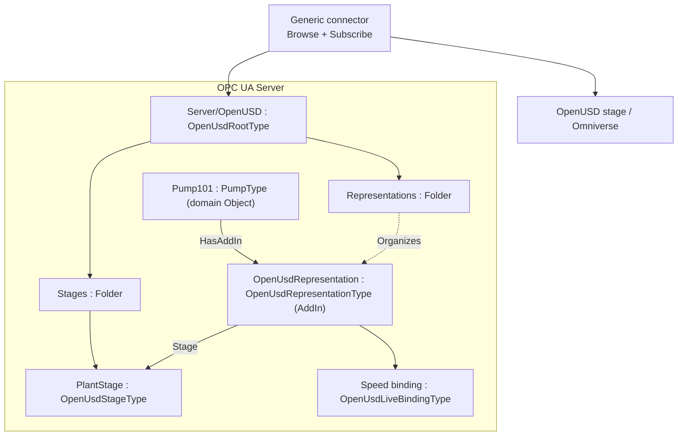
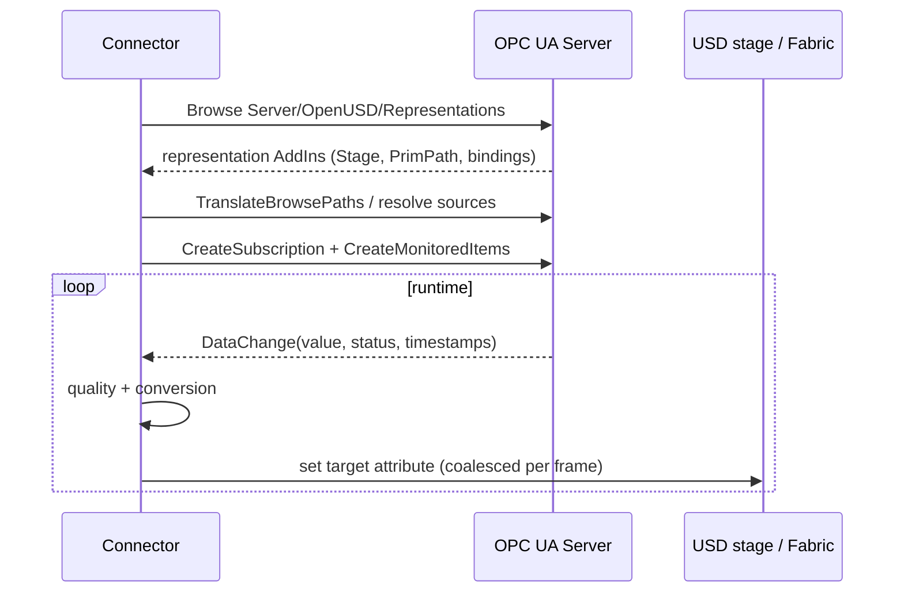
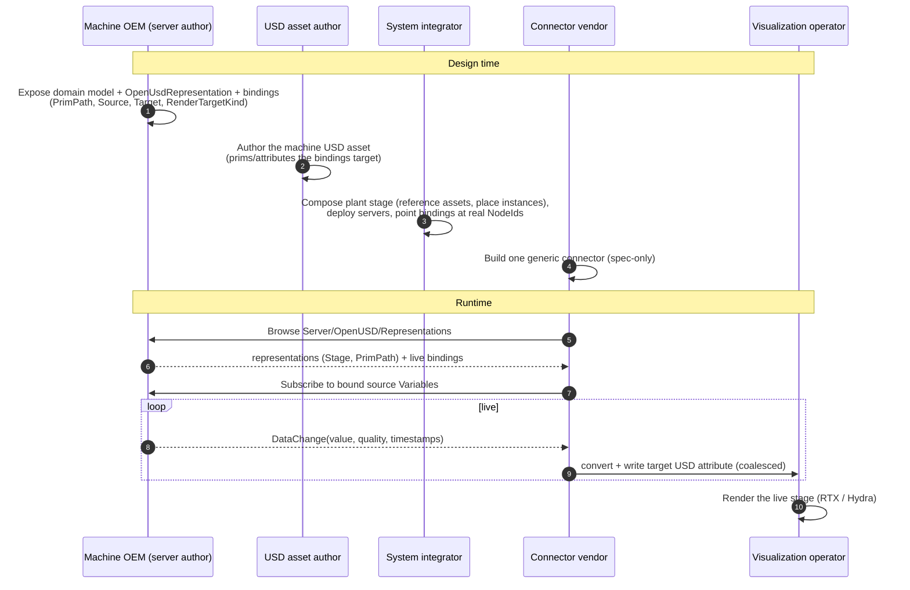

# OPC UA — OpenUSD Bindings

**Release 0.1.0 — Draft**
**Namespace:** `http://opcfoundation.org/UA/OpenUSD/`
**Publication date:** 2026-07-12

> Status: Working-group draft. This document, together with `Opc.Ua.OpenUsdBinding.NodeSet2.xml` and `Opc.Ua.OpenUsdBinding.NodeIds.csv`, defines an OPC UA information model that lets a Server declare **which OpenUSD (Universal Scene Description) prim represents a given OPC UA Object**, and **which live OPC UA Variable values drive which USD attributes**, so that a generic connector can render live industrial data in an OpenUSD renderer (for example NVIDIA Omniverse) without hard-coding the mapping. Nothing here is normative, official, or endorsed by the OPC Foundation or the Alliance for OpenUSD; namespace URIs and NodeIds are **provisional** and for prototyping only. The design rationale, prior art, and the corrections that shaped this Edition are recorded in the companion research report (`research/openuds-and-omniverse-what-would-be-needed-to-supp.md`, §0).

---

## 1 Scope

This specification defines a small, generic **representation and live-binding layer** between an OPC UA address space and an OpenUSD model. It is deliberately domain-agnostic: it binds the Objects and Variables of **any** companion specification (Pumps, Robotics, Machinery, …) to a USD scene, and it does not require modifying the USD asset.

The Edition-1 model has two portable parts and one informative profile:

- **Part 1 — Representation.** A mandatory, well-known discovery facility (`Server/OpenUSD`) plus an `OpenUsdRepresentation` AddIn that ties an OPC UA Object to a canonical composed USD prim path on a named stage. Representation carries **identity only**; it does not carry values.
- **Part 2 — Live Property Binding.** A read-only mapping from a source OPC UA `Variable` `Value` to a target USD attribute, with conversion and with quality/timestamp/persistence **hints**. Part 2 binds **existing** domain Variables; it does not duplicate process data.
- **Part 3 — Omniverse realization (informative).** How a connector realizes the model in NVIDIA Omniverse (Nucleus `.live` layers, Fabric/USDRT, OmniGraph, frame coalescing). Part 3 is a separate, vendor-governed profile and is **not** part of the portable normative model.

Out of scope for Edition 1 (reserved for later editions): OPC UA `Method`/command bindings, event/alarm bindings, setpoint writes, Part 14 Actions, PubSub realization, a USD-side applied API schema mirror, persistent-UUID identity, and normative geometry/material/skeleton/physics profiles.

### 1.1 Motivation

Industrial "digital twin" visualization repeatedly re-implements the same brittle glue: a bespoke script maps specific OPC UA NodeIds to specific USD prim attributes and pushes values into a stage. That mapping lives in a connector nobody else can see; it is invisible to other tools, breaks silently when the address space changes, cannot be discovered, and cannot be reviewed, versioned, or governed. Every new pairing of a server with a viewer starts the integration from scratch.

The result is an **N×M integration problem**: *N* servers (pumps, robots, machines, lines) each hand-crafted against *M* visualization tools (Omniverse, `usdview`, web viewers, HMIs) require up to *N×M* one-off bridges, none reusable. This specification collapses that to **N + M**: each server declares its mapping **once**, in its own address space, and each tool implements **one** generic connector. The mapping becomes a first-class, browsable, versioned, authoritative part of the OPC UA model instead of hidden connector code, so a **generic** connector can discover and apply it for any conforming server without prior knowledge of the domain.

### 1.2 Motivating use cases

- Render a live factory line: pump speed drives a rotating impeller, a bearing temperature drives an emissive glow, a running state drives visibility.
- Position assets in a scene: an RSL 3D frame drives a prim transform.
- Bridge to Omniverse: a connector Browses `Server/OpenUSD`, subscribes to the bound Variables, and writes the mapped USD attributes into a Nucleus `.live` layer for RTX rendering.

### 1.3 What it simplifies and what it enables

**Simplifies.**

- **One declaration, not N×M bridges.** The value/identity mapping is authored once in the server and consumed by any conforming connector; adding a viewer no longer means writing another bridge.
- **No code and no asset edits to change a binding.** Bindings are data in the address space, not connector source or USD-asset edits. Adding, retargeting, or disabling a binding is a model change a server author (or tool) can make and a client can immediately discover.
- **Deterministic onboarding.** Discovery starts at a single well-known entry point (`Server/OpenUSD/Representations`), so bringing a new asset online is "browse and go" rather than "find out which NodeIds the artist hard-coded".
- **Identity separated from values.** A server can publish *which* prim represents *which* Object (Part 1) before any live values are wired, and add value bindings (Part 2) later, without breaking consumers.
- **Reuses existing models unchanged.** Bindings *reference* the Variables that domain companion specs (Pumps, Robotics, Machinery, …) already expose; they do not duplicate or re-model process data.

**Enables.**

- **Interchangeable connectors and renderers.** Competing tools — NVIDIA Omniverse, open-source `usdview`, web viewers — operate over the same declared contract, so servers and viewers evolve independently.
- **Vendor-neutral, auditable digital twins.** Because the mapping is authoritative, versioned, and part of the model, it can be reviewed, diffed, validated, and governed like any other engineering artifact.
- **Toolable pipelines.** The mapping is machine-readable, so it can be generated from engineering data, checked in CI, and migrated across editions (override/tombstone matching via `BindingDefinitionId`).
- **Incremental adoption and clean evolution.** Servers implement Part 1 alone first, add Part 2 when ready, and refine bindings over time without invalidating previously deployed connectors.
- **An ecosystem division of labour.** Asset authors, machine OEMs, integrators, connector vendors, and visualization operators collaborate through the model as a shared contract rather than through private, point-to-point agreements (see **Annex B**).

---

## 2 Normative references

- [OPC 10000-1 … 10000-8](https://reference.opcfoundation.org/specs/OPC-10000-1/) — OPC Unified Architecture, Parts 1–8 (core), in particular Part 3 [AddIns §4.10.3](https://reference.opcfoundation.org/specs/OPC-10000-3/4.10.3), Part 4 [RelativePath §7.30](https://reference.opcfoundation.org/specs/OPC-10000-4/7.30) and [DataValue §7.11](https://reference.opcfoundation.org/specs/OPC-10000-4/7.11), Part 6 [DataValue encoding §5.2.2.17](https://reference.opcfoundation.org/specs/OPC-10000-6/5.2.2.17), and Part 8 [EUInformation §5.6.4](https://reference.opcfoundation.org/specs/OPC-10000-8/5.6.4).
- [OPC 10000-7](https://reference.opcfoundation.org/specs/OPC-10000-7/4) — Profiles and Conformance Units.
- [OPC 11030](https://reference.opcfoundation.org/specs/OPC-11030/) — OPC UA Modelling Best Practices.
- [AOUSD OpenUSD Core Specification 1.0.1](https://github.com/aousd/specifications-public/blob/2f9e746c4fbd7f48d6d2c9ac568133fe398bbfc0/core/1.0.1/core_spec.md) — normative for USD paths, composition, layers, and identity. **Note:** the Core Specification excludes domain schemas (UsdGeom, UsdShade, UsdLux, UsdSkel, UsdPhysics); the render-target semantics referenced by the transform profile therefore additionally pin a versioned OpenUSD schema release.

Referenced for the transform profile only (not a RequiredModel of the base NodeSet):

- [OPC 10000-210 (RSL) / OPC 10000-5 Spatial Data](https://reference.opcfoundation.org/specs/OPC-10000-210) — the `CartesianFrameAngleOrientationType`, `3DFrame`, `3DCartesianCoordinates`, `3DOrientation` types and their RPY mathematics.

---

## 3 Terms, definitions and abbreviations

| Term | Meaning |
|---|---|
| Prim | A primitive: the primary container object in an OpenUSD namespace hierarchy. |
| Stage | The fully composed, live view of a set of OpenUSD layers. |
| Root layer identifier | The opaque authored identifier of a stage's root layer (not necessarily a URI). |
| SdfPath / prim path | The canonical path identifying a prim on a stage, e.g. `/Plant/Pumps/P101`. |
| Representation | A binding of an OPC UA Object to a prim path on a stage. |
| Live binding | A read-only mapping of a source Variable value to a target USD attribute. |
| BindingDefinitionId | The stable declaration identifier of a live binding, used for override/tombstone matching. |
| Connector | The runtime component that Browses the model, subscribes to sources, and writes USD targets. |
| Render target | The USD attribute a live value drives (transform, color, visibility, …). |

---

## 4 Overview and concepts

### 4.1 Layered contract

Representation (identity) and live binding (values) are separated so that identity can be stable while value mapping and transport evolve. A Server may implement Part 1 alone (declare which prim represents each Object) and add Part 2 later. OPC UA is the **single mapping authority**; the USD asset is not modified by this specification.

### 4.2 Discovery (normative)

A conforming Server **shall** expose exactly one well-known Object `OpenUSD` of type `OpenUsdRootType` as a component of the Server Object (`i=2253`), with BrowseName `1:OpenUSD`. It **shall** contain two Folders:

- `Stages` — Organizes/contains the `OpenUsdStageType` instances the Server knows about.
- `Representations` — Organizes every `OpenUsdRepresentation` AddIn present in the Server, so a connector can enumerate all representations from a single, deterministic entry point.

A connector therefore starts at `Server/OpenUSD/Representations`, follows `Organizes` to each representation AddIn, reads the target stage and prim path, and (for Part 2) reads the representation's child bindings.

### 4.3 Identity and the stage-open contract (normative)

The identity of a represented prim is the pair:

```
OpenUsdStageType instance  +  OpenUsdRepresentationType.PrimPath
```

`PrimPath` **shall** be a canonical, absolute, composed-stage prim path (valid `SdfPath`, absolute, a prim path — not a property path — with no variant selection and no prototype path, and stable under `serialize(parse(value)) == value`). Because it is an absolute instance path, `PrimPath` is **instance-level**: a reusable ObjectType cannot supply a meaningful absolute path for its instances.

A stage's identity is more than its root layer. `OpenUsdStageType` therefore carries `RootLayerIdentifier` (mandatory, opaque), and, where they affect the composed result, `SessionLayerIdentifier` and `ResolverContext`. A connector opening the stage **shall** use the root layer, the session layer (if present), and the resolver context together; `ResolvedRootLayerUri` is informative only.

### 4.4 Architecture



---

## 5 Information model

All types are in the namespace `http://opcfoundation.org/UA/OpenUSD/` (index 1). Numeric NodeIds are **provisional**: ObjectTypes `1001–1099`, Interfaces `1010+`, DataTypes/Enumerations `3001+` (with EnumStrings at `datatype-id + 900`), and all remaining instance declarations sequentially from `6001`. The base NodeSet's only RequiredModel is the base UA namespace, so a Server can adopt Part 1/Part 2 without pulling in RSL or DI. The full generated node table is Annex A.

### 5.1 `OpenUsdRootType : BaseObjectType`

| Member | Reference / Type | Rule | Meaning |
|---|---|---:|---|
| `Stages` | HasComponent → FolderType | M | Registry of `OpenUsdStageType` instances. |
| `Representations` | HasComponent → FolderType | M | Registry that Organizes every representation AddIn. |

The well-known instance `Server/OpenUSD` is of this type (§4.2).

### 5.2 `OpenUsdStageType : BaseObjectType`

| Property | DataType | Rule | Meaning |
|---|---|---:|---|
| `RootLayerIdentifier` | String | M | Opaque authored root-layer / resolver identifier (not necessarily a URI). |
| `SessionLayerIdentifier` | String | O | Opaque session-layer identifier; contributes to stage identity. |
| `ResolverContext` | String | O | Opaque resolver-context descriptor. |
| `ResolvedRootLayerUri` | String | O | Informative current resolution as a URI; not authoritative. |

The Stage Object's own NodeId is its same-server identity; a `Representation` references it by NodeId.

### 5.3 `OpenUsdRepresentationType : BaseObjectType` — the AddIn

| Member | DataType / Type | Rule | Meaning |
|---|---|---:|---|
| `DefaultInstanceBrowseName` | QualifiedName | *(static, no ModellingRule)* | `1:OpenUsdRepresentation` — the AddIn default BrowseName. |
| `Stage` | NodeId | M | NodeId of the `OpenUsdStageType` instance targeted. |
| `PrimPath` | String | M | Canonical absolute composed prim path (instance-level). |
| `<Binding>` | OpenUsdLiveBindingType | OptionalPlaceholder | Zero or more live bindings whose source resolves relative to the represented Object. |

A domain Object gains a representation by composing this AddIn with `HasAddIn` (Part 3 AddIn convention). The AddIn is `Organizes`-listed from `Server/OpenUSD/Representations`. The represented Object is the AddIn's `HasAddIn`-inverse parent; a connector computes the effective binding key as `(represented Object, BindingDefinitionId)`.

### 5.4 `OpenUsdLiveBindingType : BaseObjectType`

One read-only live binding maps a source `Variable` `Value` to one target USD attribute. Declaration identity (`BindingDefinitionId`) is distinct from runtime identity (`(represented Object, BindingDefinitionId)`); a type-level declaration is therefore not wrongly shared across instances.

| Property | DataType | Rule | Meaning |
|---|---|---:|---|
| `BindingDefinitionId` | Guid | M | Stable declaration id for override/tombstone matching. |
| `Enabled` | Boolean | M | `false` is a tombstone suppressing an inherited binding. |
| `IntentProfile` | OpenUsdIntentProfileEnum | M | Edition 1: `UaToUsdTelemetry`. |
| `SourceNodeId` | NodeId | O | Absolute source Variable NodeId (instance form). |
| `SourceBrowsePath` | RelativePath | O | Preferred: RelativePath from the represented Object to the source Variable. |
| `AttributeId` | UInt32 | O | Source attribute; default 13 (Value). Edition 1 binds Value only. |
| `TargetStage` | NodeId | M | The `OpenUsdStageType` instance holding the target prim. |
| `TargetPrimPath` | String | M | Target prim path: absolute, or relative to the representation `PrimPath`. |
| `TargetPropertyName` | String | M | USD attribute name, e.g. `xformOp:rotateZ`, `primvars:displayColor`. |
| `TargetUsdTypeName` | String | M | Expected USD Sdf value type, e.g. `double`, `bool`, `color3f`. |
| `RenderTargetKind` | OpenUsdRenderTargetKindEnum | O | Advisory routing hint. |
| `ValueSemanticUri` | String | O | scalar/angle/length/point/vector/quaternion/matrix; the transform profile uses RSL semantics. |
| `Scale`, `Offset` | Double | O | Linear conversion: `target = Scale × converted + Offset`. |
| `SourceEngineeringUnits`, `TargetEngineeringUnits` | EUInformation | O | Unit assertion / request (UNECE). |
| `BadQualityAction` | OpenUsdBadQualityActionEnum | O | Treatment of non-Good source values; default `Skip`. |
| `SamplingIntervalHint` | Double | O | Requested sampling hint (ms). A **hint** only. |
| `State` | OpenUsdBindingStateEnum | O | Runtime lifecycle state (diagnostic, read-only). |
| `LastError` | LocalizedText | O | Last operation error (diagnostic). |

Exactly one of `SourceNodeId` / `SourceBrowsePath` **shall** resolve. `SourceBrowsePath` is preferred because it is instance-portable and can be declared at type level.

### 5.5 `IOpenUsdRepresentedType : BaseInterfaceType`

An optional interface a domain ObjectType may apply (`HasInterface`) to advertise participation, with an `<OpenUsdRepresentation>` placeholder. It is informative for browsing; discovery does not depend on it (the mandatory registry in §4.2 is authoritative).

### 5.6 DataTypes (Enumerations)

- `OpenUsdIntentProfileEnum` — `UaToUsdTelemetry(0)` (Edition 1). Other intents reserved.
- `OpenUsdRenderTargetKindEnum` — `Translation(0) Rotation(1) Scale(2) Transform(3) Visibility(4) DisplayColor(5) EmissiveColor(6) Opacity(7) Custom(8)`.
- `OpenUsdBadQualityActionEnum` — `Skip(0) HoldLast(1) ClearOpinion(2) Fallback(3)`.
- `OpenUsdBindingStateEnum` — `Disabled(0) Unresolved(1) Ready(2) Active(3) Degraded(4) Error(5)`.

### 5.7 Source and target resolution (normative)

**Source.** If `SourceNodeId` is present, use it. Otherwise resolve `SourceBrowsePath` from the represented Object. Zero matches → the binding is *unresolved* (no update). More than one match → `Bad_TooManyMatches`. The connector validates NodeClass = Variable and the Value attribute.

**Target.** Resolve `TargetStage` (validate it is an `OpenUsdStageType`). Resolve `TargetPrimPath`: absolute, or relative to the representation `PrimPath`. Append `TargetPropertyName` to obtain the target attribute. Validate the prim, the attribute, and `TargetUsdTypeName`. For an `xformOp`, the op **shall** be present in the prim's `xformOpOrder`. The connector **shall not** fall back by name, nearest prim, first match, or a compatible type, and **shall not** create a property unless an explicit authoring profile permits it.

### 5.8 Conversion (normative)

Conversion order: engineering-unit conversion → `Scale`/`Offset` → (transform profile) → clamp → USD cast. Scalar conversion uses `Scale`/`Offset` and, where units differ, `Source/TargetEngineeringUnits`.

**Transform profile.** Spatial values are conveyed via the RSL `CartesianFrameAngleOrientationType` semantics, which define the matrix layout, multiplication convention, Euler order, and quaternion convention. The following rules are mandatory when driving a USD `xformOp`:

- USD rotation ops are expressed in **degrees**; OPC UA/RSL orientation is in radians per ISO 9787 — the connector applies `× 180/π`.
- The stage `metersPerUnit` is **not** applied to a raw `xformOp:translate` (intervening scale ops and referenced-asset corrections affect the metric); length conversion is applied only per the transform profile against a controlled xform stack.
- USD is right-handed. A Z-up source with a Y-up stage (`upAxis`) **shall** be reconciled by an explicit frame declared in the profile.

### 5.9 Quality, timestamp and persistence (hints, normative defaults)

**Quality.** An omitted (binary) source `StatusCode` means **Good**; a `Bad`/`Uncertain` StatusCode triggers `BadQualityAction` (default `Skip`). `ClearOpinion` removes the authored USD opinion (revealing a weaker layer) — it does **not** author a fabricated "bad" value.

**Timestamp.** OPC UA source/server timestamps are wall-clock; USD time codes are stage-timeline ordinates. They relate only through an explicit epoch and `timeCodesPerSecond` when a recording profile is used; Edition 1 authors the latest value as the attribute default. Absent timestamps mean **unavailable**, not "now".

**Persistence and update.** `SamplingIntervalHint` and any deadband are **hints**; `PublishingInterval`, queue size, and the actual MonitoredItem parameters are per-client Subscription requests and are **not** part of the binding descriptor. Overflow and sequence gaps are observable loss (partly recoverable via `Republish`) and are not license to invent continuity.

---

## 6 Using the model (informative)

A minimal connector:

1. Connect and create a Session; Browse `Server/OpenUSD/Representations`.
2. For each representation: read `Stage` → `OpenUsdStageType` (root/session/resolver context) and `PrimPath`; open (or attach to) the stage.
3. Browse the representation's `<Binding>` children; for each enabled binding, resolve source and target (§5.7) and build the conversion (§5.8).
4. Create a Subscription and MonitoredItems for the resolved sources.
5. On each DataChange, apply quality/conversion and write the target USD attribute (frame-coalesced; see Part 3).



---

## 7 Profiles and Conformance Units

Conformance Units (each a normative, testable requirement):

- **OU-Namespace** — declares the OpenUSD namespace and RequiredModel.
- **OU-Discovery** — exposes the mandatory `Server/OpenUSD` root with `Stages` and `Representations`.
- **OU-Stage** — `OpenUsdStageType` with a valid `RootLayerIdentifier`.
- **OU-Representation** — a valid `OpenUsdRepresentation` AddIn (Stage NodeId resolves; canonical absolute `PrimPath`).
- **OU-RepresentationRegistry** — every representation is Organized from `Representations`.
- **OU-Binding** — `OpenUsdLiveBindingType` with a resolvable source and target and a stable `BindingDefinitionId`.
- **OU-Conversion-Scalar** — scalar unit/scale/offset conversion.
- **OU-Conversion-Transform** — RSL transform profile (angles, units, up-axis).
- **OU-Quality** — Good-default handling and `BadQualityAction`.
- **OU-Diagnostics** — `State` / `LastError` populated at runtime.

Profiles:

- **OpenUSD Representation Server** — OU-Namespace, OU-Discovery, OU-Stage, OU-Representation, OU-RepresentationRegistry.
- **OpenUSD Live Rendering Server** — the Representation profile + OU-Binding, OU-Conversion-Scalar, OU-Quality (OU-Conversion-Transform and OU-Diagnostics optional).

Each CU requires a conformance test (Browse the node, Read the properties, and — for bindings — resolve source/target and observe a converted value). See the Pumps addendum for a worked, testable instance.

---

## 8 Interoperability — mapping to OpenUSD / Omniverse (informative)

| OPC UA (this model) | OpenUSD |
|---|---|
| `OpenUsdStageType` | a composed `UsdStage` (root + session layers, resolver context) |
| `OpenUsdRepresentation.PrimPath` | an `SdfPath` prim on that stage |
| `OpenUsdLiveBindingType.TargetPropertyName` | a `UsdAttribute` on the target prim |
| `RenderTargetKind = Rotation` | `xformOp:rotateZ` / `xformOp:orient` on a `UsdGeomXformable` |
| `RenderTargetKind = DisplayColor` | `primvars:displayColor` on a `UsdGeomGprim` |
| `RenderTargetKind = EmissiveColor` | `inputs:emissiveColor` on a bound `UsdPreviewSurface` |
| `RenderTargetKind = Visibility` | `visibility` on a `UsdGeomImageable` |
| transform profile (RSL 3D frame) | `xformOp:transform` (matrix4d) or decomposed translate + orient |

### 8.1 Part 3 — Omniverse realization (informative, vendor-governed)

In NVIDIA Omniverse a connector opens the stage on Nucleus, creates or joins a `.live` layer, and writes target attributes there (flushing with `omni.client.live_process()` on the main thread), or applies high-rate updates through **Fabric/USDRT** and coalesces to the latest value **once per render frame** rather than persisting every sample. `Method`/command execution (a later edition) maps to an OmniGraph/Action Graph node. These behaviors are a vendor profile and are not part of the portable model; the base model must not normatively require Kit, Fabric, Nucleus, `.live`, MDL, or PhysX.

---

## 9 Security

- **Endpoint.** A connector **shall** use an authenticated, integrity-protected endpoint; the represented model itself carries no secrets. Server certificate trust is required.
- **Authorization.** Read access to the representation/binding nodes and to the source Variables is governed by normal OPC UA `RolePermissions`/`AccessRestrictions`. Edition 1 is read-only over process data and requires no write authority.
- **Resolver safety.** `RootLayerIdentifier`/`ResolvedRootLayerUri` are server-provided and could point a connector at an arbitrary asset location (an SSRF-class risk). A connector **shall** apply a scheme/root **allowlist** and a trusted resolver-context policy, and **shall** impose resource limits on stage open/asset resolution.
- **Writer ownership.** When authoring into a shared USD/Nucleus layer, a **single-writer** discipline is required; no secrets (keys, tokens, Nucleus/broker credentials) are stored in the NodeSet or in USD metadata.

---

## 10 Deliverables and reproducibility

| Artifact | Path |
|---|---|
| This specification | `core-specs/openusd-binding/OPC-UA-OpenUSD-Bindings.md` |
| Base NodeSet | `core-specs/openusd-binding/Opc.Ua.OpenUsdBinding.NodeSet2.xml` |
| NodeIds | `core-specs/openusd-binding/Opc.Ua.OpenUsdBinding.NodeIds.csv` |
| Annex A (generated node table) | `core-specs/extras/openusd-binding/tools/model-reference.md` |
| Generator | `core-specs/extras/openusd-binding/tools/build_model.py` |
| Validator | `core-specs/extras/openusd-binding/tools/validate_local.py` |
| Pumps addendum (implementer Annex) | `core-specs/openusd-binding/pumps/` |

Regenerate and validate:

```
python core-specs/extras/openusd-binding/tools/build_model.py
python core-specs/extras/openusd-binding/tools/validate_local.py
```

The NodeSet and NodeIds are generated and byte-deterministic; do not hand-edit them. The generated model passes the OPC UA modelling validator with 0 errors / 0 warnings.

---

## Annex A — Information model (generated)

See `core-specs/extras/openusd-binding/tools/model-reference.md` for the full generated node table (BrowseName, NodeId, NodeClass, description for all nodes in this namespace).

---

## Annex B — End-to-end collaboration flow (informative)

This annex walks a complete "live digital twin" scenario to show **who does what** and how the specification is the single contract that lets independent actors collaborate without private, point-to-point agreements. It is informative; nothing here adds normative requirements. The flow is generic; a concrete pump pass is given at the end.

### B.1 Actors and what each contributes

| Actor | Provides | Leverages / consumes | Works at layer |
|---|---|---|---|
| **Domain companion-spec author** (e.g., an OPC Foundation working group) | The domain information model (e.g., `PumpType`, RSL spatial types) that a server exposes. | Core OPC UA. | OPC UA type model |
| **OpenUSD schema author** (AOUSD + DCC/renderer vendors) | The USD schemas that give prims meaning (UsdGeom transforms, UsdShade materials, UsdLux, …). | OpenUSD core. | USD schema |
| **This specification** (the binding layer) | The generic representation + live-binding model and its discovery facility. | The two model layers above. | OPC UA ⇄ USD contract |
| **Asset / machine OEM** | An OPC UA **server** that exposes the domain model **and** this binding model (a representation per Object + its live bindings); often ships the machine's **USD asset** too. | Domain spec + this spec. | Server + USD asset |
| **3D / USD asset author** (artist, CAD-to-USD) | The machine/plant **geometry and materials** as USD layers, with the prim paths and attributes the bindings target. | USD schemas. | USD layers |
| **System integrator / plant operator** | The composed **plant stage** (references OEM assets, positions instances) and the deployment that points bindings at real servers. | OEM servers + OEM/asset layers. | USD composition + config |
| **Connector / tool vendor** | A **generic connector** that discovers `Server/OpenUSD`, subscribes, converts, and writes USD — with no domain-specific code. | This spec only. | Runtime bridge |
| **Visualization / Omniverse operator** | The running **renderer** (Omniverse RTX, `usdview`, web) over the live stage. | The composed stage + connector output. | Presentation |

The key property: each actor depends only on the **published contract** of the layer beneath it, never on another actor's internal choices. A connector vendor never learns "pump"; a machine OEM never learns which renderer will be used; an artist never learns which NodeIds carry the data.

### B.2 The flow



### B.3 Where the contract lives at each hand-off

- **OEM → integrator:** the server's `Server/OpenUSD` graph *is* the interface. The integrator does not read OEM connector code; they browse the representation and bindings.
- **Artist → OEM/integrator:** the USD **prim paths and attribute names** are the interface. As long as `PrimPath`, `TargetPrimPath`, and `TargetPropertyName` match the authored asset, either side can change independently.
- **Connector vendor → everyone:** the connector consumes only this spec's model. The same binary serves a pump server, a robot server, and a line server.
- **Integrator → visualization:** the composed stage plus the connector's live overrides are the interface; the operator swaps renderers freely.

### B.4 Concrete pass — the pump example

1. The **Pumps working group** publishes `PumpType` (OPC 40223). The **binding spec** (this document) publishes the representation/binding model.
2. A **pump OEM** ships a server whose `Pump #1` carries an `OpenUsdRepresentation` (`PrimPath = /Plant/Pumps/P101`) and three bindings: `MassFlow → xformOp:rotateZ`, `BearingTemperature → primvars:displayColor`, `DifferentialPressure → emissive`.
3. A **USD artist** authors `Plant.usda`: `/Plant/Pumps/P101` with a rotatable impeller, a `Body` with a display color, and an emissive material.
4. A **system integrator** references that asset into the plant stage and points the deployment at the OEM server.
5. A **connector vendor's** generic connector browses `Server/OpenUSD/Representations`, subscribes to the three Variables, converts, and writes a `.live` override layer.
6. The **visualization operator** opens the composed stage in Omniverse (or `usdview`) and sees the pump spin, warm toward red, and glow — driven live, with no pump-specific code anywhere in the connector or renderer.

A runnable realization of this pass (server, connector, base asset, and a step-by-step guide) is provided in `core-specs/extras/openusd-binding/examples/pumps/` and the `PumpDeviceIntegrationServer` sample.
