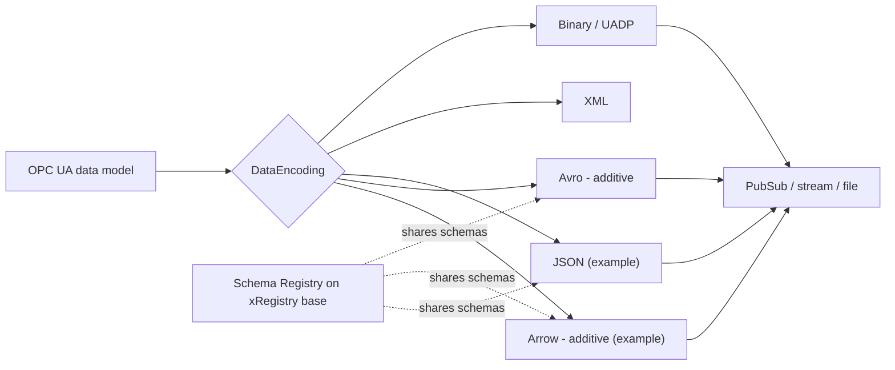
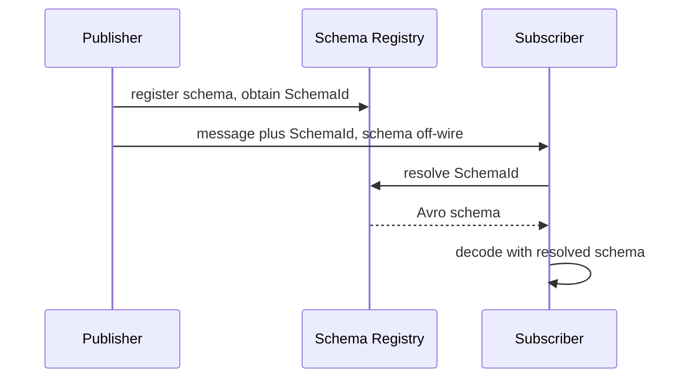
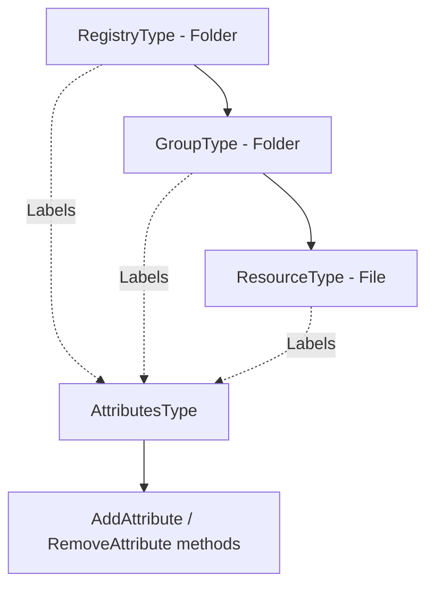
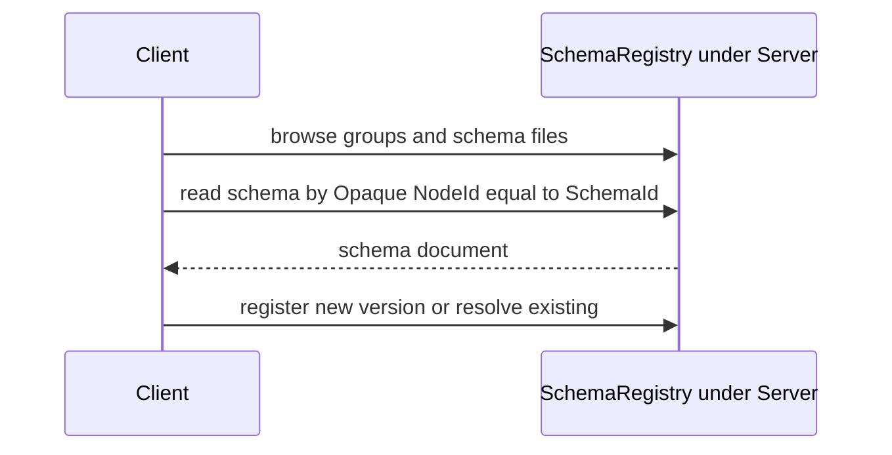

<!-- _class: lead -->

# OPC UA — Compact Encodings & Schema Registry

## Introducing three working drafts

**Avro binding** · **xRegistry** · **Schema Registry**

Reference implementation and reversibility corpus included · for OPC Foundation Working Group review

<!--
Speaker notes: Welcome. This deck introduces three complementary, additive drafts: a canonical Avro binary encoding for OPC UA, a domain-neutral registry base (xRegistry), and an in-server Schema Registry built on it. Everything shown is a working draft with a reference C# implementation and an executable reversibility corpus — the goal today is to motivate the design and gather reviewer feedback, not to ratify text.
-->

---

## Agenda

1. **Why now** — the gap these drafts fill
2. **How they fit together** — the landscape
3. **Avro binding** — why · how · measured performance
4. **xRegistry** — a reusable registry base
5. **Schema Registry** — sharing & discovering schemas
6. **Status & the ask**

<!--
Speaker notes: Four content blocks. The bulk of the technical detail is Avro, because it is the piece with hard performance numbers. xRegistry and Schema Registry are about interoperable schema sharing. We close with where the drafts stand and what we need from reviewers.
-->

---

## Why now

- OPC UA already has **Binary/UADP**, **XML** and **JSON** — but none is a *compact, schema-governed* binary form aligned with the wider **data & analytics ecosystem** (Kafka, data lakes).
- Streaming and historian workloads need **small payloads** and **fast decode** at scale; JSON is verbose, and Binary/UADP carry no shareable schema contract.
- Once schemas are governed, they must be **discoverable and shareable** — across servers and across the HTTP registry world — in a standard way.

**Three additive drafts, one story:** a canonical **Avro** encoding, a neutral **xRegistry** base, and a **Schema Registry** that sits on it.

<!--
Speaker notes: The framing is "additive, not replacement." We are not deprecating any existing encoding. Avro fills the compact-schema-governed niche and bridges to the analytics ecosystem. The registries make the schemas first-class, discoverable objects — the same way an HTTP xRegistry would, so OPC UA and non-OPC-UA consumers share one model.
-->

---

## How it fits together



Part 6 defines the **DataEncoding**; Part 14 defines the **PubSub message mapping**; the **Schema Registry** shares the schema so it never has to travel on the wire.

<!--
Speaker notes: Left to right, the same OPC UA value can be rendered by any encoding. Avro and Arrow are the new additive ones. The registry is orthogonal — it governs and shares the schema so schema-governed encodings can keep the schema off the wire. Arrow is shown for context; today's ask is Avro plus the registries.
-->

---

## Avro — Why

- **Compact & lossless.** One **canonical** Avro form per DataType — no encoder-specific variants — and **`decode(encode(x)) == x`** for every value.
- **Full OPC UA type model.** All 25 built-ins, Enumerations, OptionSets, Structures (incl. optional fields), **Union** DataTypes, **arrays & matrices**, **Variant**, ExtensionObject, DataValue, DiagnosticInfo.
- **Nullability preserved.** null scalar, null array, empty array, null element and absent optional field are **distinct** states.
- **Ecosystem-native.** Avro is a first-class citizen in Kafka, Flink, Spark and data-lake tooling — OPC UA data lands there **without re-modelling**.

<!--
Speaker notes: The two headline properties are "one canonical form" and "provably reversible." Reviewers often ask about matrices and about null-versus-empty — both are explicitly preserved, and there is a 107-case corpus that proves it. The strategic point is ecosystem fit: emitting Avro means OPC UA telemetry is directly consumable by the mainstream streaming and analytics stack.
-->

---

## Avro — How (the mapping)

- **One DataType → one Avro schema.** Primitives → Avro primitives; composites → Avro **records**; nullability → `["null", T]` unions.
- **Deterministic & generated.** Schemas are **generated from the NodeSet**; the published `.avsc` files are the **canonical wire contract** — no hand-tuned alternates.
- **Faithful bytes.** Field order follows the DataTypeDefinition; NaN, signed zero and unsigned bit patterns are preserved.

```json
{ "name": "NodeId", "type": "record",
  "fields": [ {"name": "namespace", "type": "int"},
              {"name": "idType", "type": "int"},
              {"name": "numeric", "type": ["null", "long"], "default": null } ] }
```

<!--
Speaker notes: The mapping is mechanical and generator-driven, which is what makes it auditable and drift-free. The .avsc files are normative — implementers consume them directly. The NodeId snippet shows the union-for-nullability pattern and the record shape; the full per-type reference (schema, example, annotated bytes) is generated in the Part 6 annex.
-->

---

## Avro — How (Part 14 + SchemaId)

- On the wire: **schemaless Avro binary** — the schema is resolved by **configuration, registry, or envelope**, not carried per message.
- The **SchemaId handshake** announces a compact fingerprint; the schema stays **off the wire**.
- Covers PubSub **data frames**, **Action** invoke/response envelopes, and **Discovery** announcements.



<!--
Speaker notes: This is where the registry earns its keep. Publishers reference a SchemaId; subscribers resolve it once and cache it. The schema never rides in every message, which is the difference between JSON-style self-description and a schema-governed channel. The same handshake model is reused by the Arrow batch framing.
-->

---

## Avro — Performance

*Measured by the reference C# encoders; sizes are deterministic, ns are indicative.*

| Scenario | Avro | Binary | JSON |
|---|--:|--:|--:|
| Mixed scalars — payload (B) | **123** | 131 | 334 |
| Int32 50×50 matrix — payload (B) | **4,891** | 10,017 | 11,592 |
| Mixed scalars — alloc (B/op) | **896** | 920 | 1,448 |

- **Smallest** on the scalar record and allocates **less than Binary**, at **near-Binary** CPU.
- **Zig-zag variable-length integers halve** Binary on small-magnitude integer matrices.
- Categorically **smaller and faster than JSON** — a schema-governed JSON replacement.

<!--
Speaker notes: These are from the informative performance report in the repo. Two deterministic wins: Avro is the smallest scalar payload and allocates below Binary, and variable-length integers halve Binary on integer-heavy matrices — 4.9 KB versus 10 KB. Framing on timings: treat them as orders of magnitude. Bottom line: Avro is the solid all-rounder and the right replacement wherever JSON is used today.
-->

---

## xRegistry — a reusable registry base

- A **domain-neutral** OPC UA companion model that projects an **[xRegistry](https://github.com/xregistry/spec)** registry onto the AddressSpace.
- **Registries and groups are `FolderType` folders; a resource/version document *is* a `FileType` file** — browsable with the tools operators already have.
- **Peer to the xRegistry HTTP binding:** discover, download, register, browse and federate the **same way** as an HTTP registry.
- **Reusable:** Schema Registry is the first extension; **Asset, Scene, Endpoint and WoT-Con v2** registries are extension we will pursue on top of the same base.

<!--
Speaker notes: xRegistry is deliberately not about schemas. It is a generic registry projection — folders and files — so any registry domain can reuse it. The key interoperability claim is peer bindings: an OPC UA xRegistry and an HTTP xRegistry are two faces of one model, so tooling and federation carry across. That is what makes the Schema Registry more than an OPC-UA-only feature.
-->

---

## xRegistry — the model



- Four base ObjectTypes: **`RegistryType`**, **`GroupType`**, **`ResourceType`**, **`AttributesType`**; common xRegistry attributes are **browsable Properties**.
- Three representations — **files**, **API server**, **document** — plus **federation via `ExpandedNodeId`**.
- Provisional NodeIds in the `63000+` block; final IDs assigned by the OPC Foundation.

<!--
Speaker notes: The model is minimal-first: three container types plus an attributes container. Labels and arbitrary attributes materialise as real, browsable Property variables added and removed by methods, so a generic OPC UA client sees them without special knowledge. Federation via ExpandedNodeId is how registries reference resources in other registries or servers.
-->

---

## Schema Registry — sharing & discovering schemas

- A **domain extension of xRegistry**: `SchemaRegistryType` / `SchemaGroupType` / `SchemaFileType` **subtype** the base — so schemas are just Folders and Files.
- A **stand-alone server capability** under the **Server** object (`i=2253`) — **PubSub is not required**; a PubSub server may additionally reference it.
- **Fast path:** every schema is addressable at runtime by an **Opaque NodeId whose bytes are the raw SchemaId fingerprint** — the same SchemaId used by the Avro handshake.



<!--
Speaker notes: This closes the loop with the Avro handshake: the SchemaId a publisher announces is literally the NodeId you read to fetch the schema — no lookup table. It is a stand-alone capability, so any server can be a schema registry without PubSub. Versioning, evolution and federation follow the xRegistry model; the PubSub DataSet-schema behaviour is isolated in an optional Annex profile so it does not burden non-PubSub servers.
-->

---

## Status & the ask

- **Working drafts**, ready for review: Part 6 & Part 14 Avro, xRegistry base + OPC UA API binding, Schema Registry.
- **Where** Core or Companion spec?
- **Reference implementation** in `UA-.NETStandard` (PR #4007) with generated schemas/NodeSets.
- **Proof:** a **107-case reversibility corpus**, executable validators, and an informative **performance report**.
- **We are asking reviewers to:** validate the type-model coverage & reversibility, sanity-check the registry model & federation, and help chart the **Working Group adoption path**.

**Read next:** [Avro Part 6](../avro-encoding/OPC-UA-Part6-Avro-DataEncoding.md) · [Avro Part 14](../avro-encoding/OPC-UA-Part14-Avro-MessageMapping.md) · [xRegistry](../xregistry/OPC-UA-xRegistry.md) · [Schema Registry](../schema-registry/OPC-UA-Schema-Registry.md) · [Performance report](../extras/performance/OPC-UA-Encoding-Performance-Comparison.md)

<!--
Speaker notes: Everything is a working draft with running code and reproducible evidence, not a paper proposal. The three concrete asks: confirm we have the type model and reversibility right, pressure-test the registry and federation design, and agree how this enters the formal Working Group process. The footer links are the entry points into the normative drafts and the measurements.
-->
