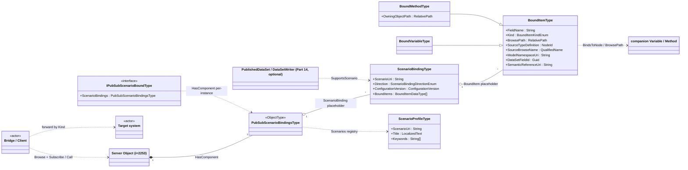
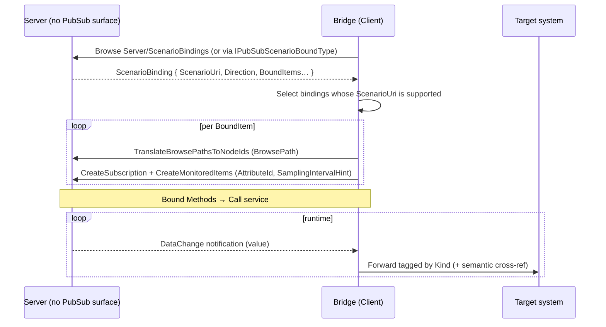
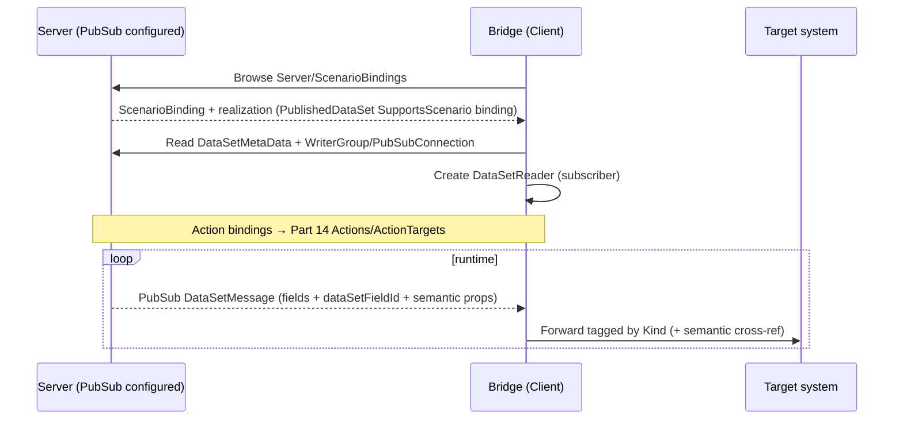

# OPC UA — PubSub Scenario Binding

**Working draft for submission to the OPC Foundation Working Group**
**Proposed Part: OPC 10000‑2xx (number to be assigned)**
**Namespace:** `http://opcfoundation.org/UA/` (base OPC UA namespace)
**Version:** 0.1.0 · **Date:** 2026-07-01

> **Status — working draft.** This document proposes an addition to the *base* OPC UA namespace and is intended for discussion by the Working Group. Together with `Opc.Ua.PubSubBinding.NodeSet2.xml` and `Opc.Ua.PubSubBinding.NodeIds.csv` it defines a small, transport‑neutral **binding and discovery layer** on top of OPC UA PubSub ([OPC 10000‑14](https://reference.opcfoundation.org/specs/OPC-10000-14/)). **All NodeIds are provisional** and drawn from a currently‑unused block; final NodeIds are assigned by the OPC Foundation. Nothing here re‑specifies PubSub mechanics — it references them.

---

## 1 Scope

This specification defines an information model that lets an OPC UA Server **bind** the instances of any Information Model (a companion specification, a device model, or a vendor model) to OPC UA PubSub for well‑defined, extensible integration **Scenarios**, and lets a Client **discover** those bindings and act on them without understanding the domain semantics.

It specifies:

- a discoverable **registry** of scenario bindings, reachable from the standard **Server Object** and, optionally, from any Object that opts in through an Interface;
- a **ScenarioBinding** that associates a Scenario (identified by a URI) and a direction with a set of **bound items** — Variables and Methods of the underlying model;
- a **semantic cross‑reference** carried by each bound item back to the model that defines it, retained so that it can be **exported to a disconnected consumer**;
- normative rules for locating bound items by **BrowsePath** (RelativePath) so that bindings can be authored once at the type level and resolved per instance;
- a **machine‑readable configuration** DataType so that tools can generate the full binding — AddressSpace nodes and Part 14 runtime configuration — from a single source;
- the **Profiles and Conformance Units** for Servers and Clients.

It is explicitly **out of scope** to define new PubSub transports, message mappings, security, or the lifecycle of PubSub configuration; these are defined by [OPC 10000‑14](https://reference.opcfoundation.org/specs/OPC-10000-14/) and referenced here.

### 1.1 Motivation

Companion specifications describe *what a thing is*. Getting that thing's live data into an analytics, observability, historian, or digital‑twin system is a separate, repetitive integration problem: someone must decide which Variables to publish, at what rate, under what grouping, and how a downstream system should interpret them. Today this is solved ad‑hoc, once per model and once per project.

This specification makes the decision **part of the model and discoverable at runtime**. A Server advertises, per Scenario, exactly which nodes to move and how; a generic **bridge** — a Client whose only job is to forward OPC UA data into another system — discovers the binding, wires up PubSub (or classic Subscriptions as a fallback), and forwards each field tagged with a small, stable, domain‑agnostic role. The bridge needs to understand the *Scenario* and the *routing role*, not the generator, the pump, or the robot.

## 2 Normative references

- [OPC 10000‑3](https://reference.opcfoundation.org/specs/OPC-10000-3/) — Address Space Model.
- [OPC 10000‑4](https://reference.opcfoundation.org/specs/OPC-10000-4/) — Services (TranslateBrowsePathsToNodeIds, RelativePath, Subscriptions, Call).
- [OPC 10000‑5](https://reference.opcfoundation.org/specs/OPC-10000-5/) — Information Model (base types, Interfaces).
- [OPC 10000‑6](https://reference.opcfoundation.org/specs/OPC-10000-6/) — Mappings (DataType encodings: Binary, XML, JSON).
- [OPC 10000‑7](https://reference.opcfoundation.org/specs/OPC-10000-7/) — Profiles.
- [OPC 10000‑14](https://reference.opcfoundation.org/specs/OPC-10000-14/) — PubSub (PublishedDataSet, DataSetWriter/Reader, DataSetMetaData, Actions).
- [OPC 10000‑19](https://reference.opcfoundation.org/specs/OPC-10000-19/) — Dictionary Reference (`HasDictionaryEntry`, IRDI/CDD).

## 3 Terms, definitions and abbreviations

| Term | Definition |
|---|---|
| Scenario | A class of integration use case (e.g. Observability, PredictiveMaintenance) identified by a URI, describing why data is moved and to what kind of consumer. |
| Scenario Binding | An association of a Scenario and a direction with a set of bound items on a bound object or type. |
| Bound item | A Variable or Method of the underlying model that a Scenario Binding exposes, with routing and semantic metadata. |
| Bound root | The Object (an instance, or a type when authoring type‑level bindings) that a bound item's BrowsePath is resolved from. |
| Routing role (`Kind`) | The small, domain‑agnostic classification a bridge uses to forward an item (Telemetry, Status, Event, Command, …). |
| Semantic cross‑reference | The retained link from a bound item back to the model node that defines it (TypeDefinition, BrowseName, namespace, dictionary entry). |
| Bridge | A Client whose sole purpose is to forward bound data/actions between an OPC UA Server and another system, without understanding the domain semantics. |
| Realization | The Part 14 PubSub node(s) (PublishedDataSet, DataSetWriter/Reader, ActionTarget) that carry a binding's data on the wire. |
| DTC, PDS | Diagnostic Trouble Code; PublishedDataSet. |

Key words **shall**, **should**, **may**, **shall not** are to be interpreted as in ISO/IEC directives; normative and informative content is marked as such.

## 4 Overview and concepts

### 4.1 The two‑layer contract

A Scenario Binding carries two distinct kinds of metadata, and keeping them separate is the central design idea:

1. **Routing metadata — for the bridge.** The `ScenarioUri` says *which integration this serves*; the per‑item `Kind` says *how to forward this value* (a time series, a log record, an action, …). A bridge that "supports the Observability Scenario" can configure itself from routing metadata alone, for any domain.
2. **Semantic metadata — for the consumer.** Each bound item also retains a **cross‑reference back to the model** that defines it: the source `TypeDefinition`, the namespace‑qualified `BrowseName`, the `ModelNamespaceUri`, and — where available — a dictionary entry ([OPC 10000‑19](https://reference.opcfoundation.org/specs/OPC-10000-19/), IRDI/CDD). This is what lets a *disconnected* consumer, holding only a PubSub message, recover what the value *means*.

The bridge never needs the semantic layer to do its job; it forwards it verbatim so the ultimate consumer can use it.

### 4.2 Discovery

A Server exposes a server‑wide registry — a [`PubSubScenarioBindingsType`](#type-PubSubScenarioBindingsType) instance named `ScenarioBindings` — as a component of the standard **Server Object** (`i=2253`), which is **always present**. Discovery therefore never depends on a PubSub configuration surface. Additionally, any Object (typically a companion‑spec instance) may implement the [`IPubSubScenarioBoundType`](#type-IPubSubScenarioBoundType) Interface to expose its **own** local `ScenarioBindings` container, giving per‑instance discovery. A Client **browses** either entry point to enumerate [`ScenarioBindingType`](#type-ScenarioBindingType) objects and reads each one's `ScenarioUri` to filter; no query Method is required.

### 4.3 Realization (hybrid)

A binding **declares** intent; whether and how it is realized over the wire is separate.

**A conforming Server is not required to implement OPC UA PubSub.** The default and most common case is a Server with **no PubSub configuration surface at all**: this specification references Part 14 *types* to describe an optional realization, but never requires *instances* of them — no `PublishSubscribe` object, `PublishedDataSet`, `DataSetWriter` or `WriterGroup` need exist. On such a Server a Client acts on a binding through **classic Subscriptions and Method calls** (§6); this is the baseline.

When a Server *does* configure PubSub for a binding, the realizing Part 14 node references the binding through the inverse [`SupportsScenario`](#type-ScenarioRealizedVia) reference (equivalently, the binding is [`ScenarioRealizedVia`](#type-ScenarioRealizedVia) that node) — a `PublishedDataSet`, a `DataSetWriter`/`DataSetReader`, or an `ActionTarget`. This **hybrid** model means a binding is useful immediately on any Server, and becomes a turn‑key PubSub subscription wherever PubSub happens to be configured.

### 4.4 Architecture

*Attributes inside a box are **Properties** (Variables/DataType fields); labelled lines between boxes are **References**. The optional Part 14 realization points back at the binding via the inverse `SupportsScenario` reference (`Realization → ScenarioBinding`).*

## 5 Information model

The full node reference — every type, member, DataType and well‑known instance — is generated in **[Annex A](#annex-a)**. This clause states the intent and the normative rules. All types are defined in the base namespace; NodeIds are provisional.

### 5.1 PubSubScenarioBindingsType

The discoverable container. It holds `<ScenarioBinding>` objects (an `OptionalPlaceholder`), enumerated by **Browse**; a Client reads each binding's `ScenarioUri` to filter. No query Method is defined — Browse and Read already provide enumeration and selection, and requiring a Method would burden the classic Servers that are the common case. A Server **shall** expose one instance as a component of the **Server Object**; it **may** expose further instances through the Interface (§5.6).

### 5.2 ScenarioBindingType

One binding. `ScenarioUri` (Mandatory) and `Direction` (Mandatory, a [`ScenarioBindingDirectionEnum`](#type-ScenarioBindingDirectionEnum)) are the routing header. `ConfigurationVersion` aligns the binding with the `ConfigurationVersion` of its realizing `DataSetMetaData` so a consumer can detect change. The bound items are exposed **both** as browsable `<BoundItem>` objects **and** as a compact `BoundItems` array of [`BoundItemDataType`](#type-BoundItemDataType); when both are present they **shall** carry equivalent bound‑item information (the same members and values). Where PubSub is configured, the realizing Part 14 node references this binding with [`SupportsScenario`](#type-ScenarioRealizedVia) (the binding is then [`ScenarioRealizedVia`](#type-ScenarioRealizedVia) that node).

### 5.3 BoundItemType and its subtypes

A [`BoundItemType`](#type-BoundItemType) describes one exposed node. It **shall** carry a `FieldName` and a `Kind` (a [`BoundItemKindEnum`](#type-BoundItemKindEnum)). It locates its source node in one of two ways (§5.5) and carries the semantic cross‑reference (§5.4). [`BoundVariableType`](#type-BoundVariableType) binds a Variable exposed as a DataSet field; [`BoundMethodType`](#type-BoundMethodType) binds a Method exposed as an action and adds `OwningObjectPath`.

### 5.4 Semantic cross‑reference (normative)

Each bound item **shall** retain enough information to identify the model node it exposes independently of the live AddressSpace — as applicable to its NodeClass (see the Variable/Method rule below):

- `SourceTypeDefinition` — the TypeDefinition NodeId of the source node;
- `SourceBrowseName` — its namespace‑qualified BrowseName;
- `ModelNamespaceUri` — the namespace URI of the model that defines it;
- optionally, `SemanticReferenceUri` — a portable external semantic identifier for the item (an IRDI/CDD, e.g. the identifier of a [OPC 10000‑19](https://reference.opcfoundation.org/specs/OPC-10000-19/) dictionary entry). A Server that models the dictionary linkage natively **may** additionally place a `HasDictionaryEntry` reference on the browsable `BoundItem`; `SemanticReferenceUri` is the carrier used in the compact and configuration forms and for propagation, so the linkage survives export.

These values are **derivable from the AddressSpace** and a generating tool **should** populate them mechanically to avoid drift.

The Properties above carry the **Optional** ModellingRule on `BoundItemType` so the one type serves both bound Variables and bound Methods (a Method has no TypeDefinition). A Server that exposes a binding **shall** nevertheless populate them per the *Semantic Cross‑Reference* conformance unit (§7): `SourceTypeDefinition`, `SourceBrowseName` and `ModelNamespaceUri` for a bound **Variable**; `SourceBrowseName` and `ModelNamespaceUri` (the source being identified by its `BrowsePath`/`OwningObjectPath`) for a bound **Method**.

**Propagation to consumers.** When a binding is realized as a Part 14 `PublishedDataSet`, for every bound item the Server **shall**:

1. set the corresponding `FieldMetaData.dataSetFieldId` to the item's `DataSetFieldId`; and
2. add to `FieldMetaData.properties` the KeyValuePairs `ModelNamespaceUri`, `SourceBrowseName`, `SourceTypeDefinition`, `BrowsePath` and, where present, `SemanticReferenceUri`; and
3. ensure the `DataSetMetaData` namespace and DataType tables describe any non‑standard DataTypes used.

The property keys **shall** match the corresponding [`BoundItemType`](#type-BoundItemType) member names above, so a consumer can map each `FieldMetaData` property back to the binding model without a separate lookup.

As a result the PubSub stream is **self‑describing**: a subscriber that never connects to the Server can still map each field back to the companion model. This requirement is a Conformance Unit (§7).

### 5.5 Locating bound items — BrowsePath resolution (normative)

A bound item locates its source node in one of two ways:

- **BrowsePath (recommended).** `BrowsePath` is a [`RelativePath`](https://reference.opcfoundation.org/specs/OPC-10000-4/7.30) resolved from `StartingNode` (default: the bound root). Because it is relative, a single binding authored on a **type** applies to **every instance**: the Server resolves it per instance with [TranslateBrowsePathsToNodeIds](https://reference.opcfoundation.org/specs/OPC-10000-4/). This is the recommended mechanism and the form emitted by the authoring tool.
- **Absolute NodeId.** `SourceNodeId` (and the `BindsToNode` reference on the browsable form) identifies the node directly, for server‑specific or instance‑specific bindings.

Resolution rules a Server **shall** apply:

1. If a BrowsePath does not resolve on a given instance (an absent Optional component), the item is **omitted** for that instance; this is **not** an error.
2. If a BrowsePath matches **multiple** nodes (a placeholder such as `<Rating>`, or an array of components), it **expands** to one bound field per match; `FieldName` is made unique by appending the matched BrowseName.
3. For a bound Method, the path targets the Method Node; the Object the Method is called on is the path's parent (or `OwningObjectPath` when given).

### 5.6 IPubSubScenarioBoundType

An Interface a model may apply (via `HasInterface`) to advertise participation in scenario bindings. It exposes a Mandatory `ScenarioBindings` container. Applying it at the **type** level, with type‑level BrowsePath bindings, is the recommended way for a companion specification to adopt this specification without changing its own types' semantics.

### 5.7 Scenario registry and URIs

The `Scenarios` folder under the server‑wide registry holds [`ScenarioProfileType`](#type-ScenarioProfileType) objects, one per known Scenario, each carrying its `ScenarioUri`, `Title`, `Summary` and `Keywords`. This specification defines the following baseline Scenario URIs under the root `http://opcfoundation.org/UA/PubSub/Scenarios/`:

| Scenario | Purpose |
|---|---|
| `Observability` | Real‑time operational monitoring — SCADA/HMI, dashboards, observability platforms. |
| `PredictiveMaintenance` | Condition and usage trending for maintenance analytics. |
| `AnomalyDetection` | High‑resolution correlated signals for baseline/deviation modelling. |
| `EnergyAndLoadManagement` | Power, load, demand and energy coordination. |
| `AlarmAndEventDistribution` | Condition and event streams. |
| `FleetAndCompliance` | Multi‑site supervision, reporting and regulatory compliance. |

**Governance (normative).** The registry is **extensible**. Anyone may define additional Scenarios; a Scenario URI **shall** be owned by whoever controls its URI authority (for example a vendor uses a URI under a domain it controls). Extenders **shall not** define new URIs under `http://opcfoundation.org/UA/PubSub/Scenarios/`; that root is reserved for this specification and its successors.

### 5.8 Machine‑readable binding configuration

[`ScenarioBindingConfigurationDataType`](#type-ScenarioBindingConfigurationDataType) is a portable, encodable description of the *full* set of bindings for a model or type: the `ModelNamespaceUri`, the `AppliesToType`, a `ConfigurationVersion`, and the `ScenarioBindings` (each a [`ScenarioBindingDataType`](#type-ScenarioBindingDataType) containing [`BoundItemDataType`](#type-BoundItemDataType) entries). It deliberately mirrors the Part 14 `PubSubConfigurationDataType` pattern: the DataTypes **are** the interchange schema, serializable via [OPC 10000‑6](https://reference.opcfoundation.org/specs/OPC-10000-6/) (Binary/XML/JSON), and equivalently expressible as a `UANodeSet2` fragment. Tools use it as the single source from which the AddressSpace nodes, the Part 14 runtime configuration and the human‑readable annex are generated (§7).

## 6 Using the binding registry (informative)

This clause shows how a **bridge** consumes the model. It is informative; conformance is defined in §7.

### 6.1 Walkthrough

1. **Discover.** Browse `Server/ScenarioBindings` for the server‑wide registry, and/or find Objects implementing `IPubSubScenarioBoundType` for per‑instance bindings. Enumerate the `ScenarioBinding` objects by Browse and read each `ScenarioUri`.
2. **Select.** Keep the bindings whose `ScenarioUri` is one the bridge supports. Read `Direction` to learn which side to set up.
3. **Realize — classic path (the default).** For each bound item resolve its `BrowsePath` (or read `SourceNodeId`) with `TranslateBrowsePathsToNodeIds`, then create a Subscription with a MonitoredItem on that node and `AttributeId`, honouring `SamplingIntervalHint`. For a bound Method, use the `Call` service. This path needs no PubSub configuration and works on any Server.
4. **Realize — PubSub path (only where PubSub is configured).** If a Part 14 node references the binding via `SupportsScenario` (the binding is `ScenarioRealizedVia` a `PublishedDataSet`/`DataSetWriter`), read the `DataSetMetaData` and the transport from the owning `WriterGroup`/`PubSubConnection`, then create a `DataSetReader`/subscriber. For an `ActionInvoker`/`ActionResponder` binding, use Part 14 Actions/ActionTargets.
5. **Forward.** For each field, forward the value tagged with its `Kind` (Telemetry/Metric → time series; Event → log; Command → action; …) and attach the semantic cross‑reference so the downstream consumer can interpret it. **No domain knowledge is required.**

### 6.2 Sequence — classic server (the default)

### 6.3 Sequence — PubSub‑capable server (less common)

## 7 Profiles and Conformance Units

The following Conformance Units (CUs) are defined; Facets group them for Servers and Clients.

| Conformance Unit | Requirement |
|---|---|
| Scenario Binding Discovery | Expose a server‑wide `ScenarioBindings` registry as a component of the Server Object; enumerate `ScenarioBinding` objects by Browse. |
| Scenario Registry | Expose the `Scenarios` registry with a `ScenarioProfile` per supported Scenario URI. |
| BrowsePath Resolution | Author bound items as type‑level BrowsePaths and resolve them per instance under the rules of §5.5. |
| Variable Realization *(optional)* | Realize a binding as a Part 14 `PublishedDataSet`/`DataSetWriter` for its bound Variables. Applicable only where the Server implements PubSub. |
| Action Realization *(optional)* | Realize a bound Method as a Part 14 Action/ActionTarget. Applicable only where the Server implements PubSub. |
| Semantic Cross‑Reference | Populate the semantic fields on every exposed bound item (`SourceTypeDefinition`/`SourceBrowseName`/`ModelNamespaceUri`, per the Variable/Method rule in §5.4). Independent of PubSub. |
| PubSub MetaData Propagation *(optional)* | Where a binding is realized over PubSub, propagate the semantic fields into `DataSetMetaData.FieldMetaData` per §5.4. Applicable only where Variable/Action Realization is offered. |

**Facets (informative grouping):**

- **Server Scenario Binding Facet** — Discovery + Scenario Registry + BrowsePath Resolution + Semantic Cross‑Reference (mandatory); Variable/Action Realization + PubSub MetaData Propagation (as offered, only where PubSub is implemented).
- **Publisher Facet** — Variable Realization + PubSub MetaData Propagation.
- **Bridge (Client) Facet** — discover, select by `ScenarioUri`, realize via the classic path (default) or PubSub where configured, forward by `Kind`.

## 8 Deliverables and reproducibility

| File | Content |
|---|---|
| [`Opc.Ua.PubSubBinding.NodeSet2.xml`](Opc.Ua.PubSubBinding.NodeSet2.xml) | The information model (UANodeSet), a proposed addition to the base namespace, provisional NodeIds. |
| [`Opc.Ua.PubSubBinding.NodeIds.csv`](Opc.Ua.PubSubBinding.NodeIds.csv) | The provisional NodeId assignments (`SymbolicName,NodeId,NodeClass`). |
| [`OPC-UA-PubSub-Scenario-Binding.md`](OPC-UA-PubSub-Scenario-Binding.md) | This document. |
| [`tools/build_model.py`](tools/build_model.py) | The generator that emits the NodeSet, the CSV and the [Annex A](#annex-a) tables from one source of truth. |

The NodeSet has been validated to be structurally correct — XML well‑formedness, unique NodeIds, CSV↔NodeSet consistency, and resolution of every referenced base NodeId against the base OPC UA and Part 14 NodeId tables — and its constructs (base‑namespace type definitions, a custom ReferenceType, an Interface, enumerations, a Structure with encodings, `RelativePath`/`QualifiedName`/`Guid` fields, and the hook onto the well‑known **Server Object**) were checked with the OPC Foundation modelling validator and reported **0 errors**.

An authoring **skill** (`skills/opcua-scenario-binding/`) generates, for any companion specification, a machine‑readable `ScenarioBindingConfiguration` and a per‑spec binding annex from documented heuristics; a deterministic generator expands that single source into the AddressSpace binding fragment and Part 14 runtime‑configuration skeletons (transport, security and addressing are deployment parameters and are not fixed by this specification).

---

## Annex A — Information model

This annex is the normative node reference. It is generated from `tools/build_model.py` and always matches `Opc.Ua.PubSubBinding.NodeSet2.xml`. All nodes are proposed additions to the base OPC UA namespace `http://opcfoundation.org/UA/`; the NodeIds shown are **provisional** (final IDs are assigned by the OPC Foundation). The **Declared in** column marks members inherited from a supertype.

### Type overview

| NodeId | BrowseName | NodeClass | Subtype of |
|---|---|---|---|
| i=60001 | [BindsToNode](#type-BindsToNode) | ReferenceType | [NonHierarchicalReferences](https://reference.opcfoundation.org/specs/OPC-10000-3/7.4) |
| i=60002 | [ScenarioRealizedVia](#type-ScenarioRealizedVia) | ReferenceType | [NonHierarchicalReferences](https://reference.opcfoundation.org/specs/OPC-10000-3/7.4) |
| i=60012 | [BoundItemType](#type-BoundItemType) | ObjectType | [BaseObjectType](https://reference.opcfoundation.org/specs/OPC-10000-5/6.2) |
| i=60013 | [BoundVariableType](#type-BoundVariableType) | ObjectType | [BoundItemType](#type-BoundItemType) |
| i=60014 | [BoundMethodType](#type-BoundMethodType) | ObjectType | [BoundItemType](#type-BoundItemType) |
| i=60011 | [ScenarioBindingType](#type-ScenarioBindingType) | ObjectType | [BaseObjectType](https://reference.opcfoundation.org/specs/OPC-10000-5/6.2) |
| i=60010 | [PubSubScenarioBindingsType](#type-PubSubScenarioBindingsType) | ObjectType | [FolderType](https://reference.opcfoundation.org/specs/OPC-10000-5/6.6) |
| i=60015 | [ScenarioProfileType](#type-ScenarioProfileType) | ObjectType | [BaseObjectType](https://reference.opcfoundation.org/specs/OPC-10000-5/6.2) |
| i=60016 | [IPubSubScenarioBoundType](#type-IPubSubScenarioBoundType) | ObjectType | [BaseInterfaceType](https://reference.opcfoundation.org/specs/OPC-10000-5/6.9) |
| i=60050 | [ScenarioBindingDirectionEnum](#type-ScenarioBindingDirectionEnum) | DataType | Enumeration |
| i=60051 | [BoundItemKindEnum](#type-BoundItemKindEnum) | DataType | Enumeration |
| i=60060 | [BoundItemDataType](#type-BoundItemDataType) | DataType | Structure |
| i=60065 | [ScenarioBindingDataType](#type-ScenarioBindingDataType) | DataType | Structure |
| i=60070 | [ScenarioBindingConfigurationDataType](#type-ScenarioBindingConfigurationDataType) | DataType | Structure |

### Reference types

#### BindsToNode  (i=60001)

*Subtype of:* [NonHierarchicalReferences](https://reference.opcfoundation.org/specs/OPC-10000-3/7.4) · *InverseName:* `IsBoundBy`

Links a BoundItem to the companion-specification Variable or Method in the AddressSpace that it exposes for a scenario. The target is the authoritative semantic node; the BoundItem does not copy its meaning.

#### ScenarioRealizedVia  (i=60002)

*Subtype of:* [NonHierarchicalReferences](https://reference.opcfoundation.org/specs/OPC-10000-3/7.4) · *InverseName:* `SupportsScenario`

Links a ScenarioBinding to the optional OPC UA Part 14 PubSub node(s) that realize it (a PublishedDataSet, DataSetWriter, DataSetReader or an ActionTarget). Forward 'ScenarioRealizedVia' reads binding -> realization; the inverse 'SupportsScenario' reads realization -> binding. Absent (and never required) when the binding is not realized over PubSub.

### Object types

#### BoundItemType  (i=60012)

*Inherits from:* [BaseObjectType](https://reference.opcfoundation.org/specs/OPC-10000-5/6.2)

A single item bound into a scenario: it references the companion-spec node it exposes (BindsToNode and/or a BrowsePath) and carries the routing role (Kind) and the semantic cross-reference retained for export.

| BrowseName | NodeClass | DataType | ModellingRule | Declared in | Description |
|---|---|---|---|---|---|
| FieldName | Variable | String | Mandatory | BoundItemType | Stable logical field name of the item. |
| Kind | Variable | [BoundItemKindEnum](#type-BoundItemKindEnum) | Mandatory | BoundItemType | Generic routing role of the item. |
| AttributeId | Variable | UInt32 | Optional | BoundItemType | Attribute of the source node to expose (default 13 = Value). |
| BrowsePath | Variable | [RelativePath](https://reference.opcfoundation.org/specs/OPC-10000-4/7.30) | Optional | BoundItemType | RECOMMENDED locator: RelativePath from the bound root; resolved per instance. |
| StartingNode | Variable | NodeId | Optional | BoundItemType | Node the BrowsePath is resolved from (default: the bound root). |
| SourceNodeId | Variable | NodeId | Optional | BoundItemType | Alternative absolute locator (instance/server-specific). |
| SamplingIntervalHint | Variable | Duration | Optional | BoundItemType | Recommended sampling/publishing interval (ms). |
| IndexRange | Variable | NumericRange | Optional | BoundItemType | Optional sub-range for array values. |
| SourceTypeDefinition | Variable | NodeId | Optional | BoundItemType | TypeDefinition of the source node (semantic identity). |
| SourceBrowseName | Variable | QualifiedName | Optional | BoundItemType | Namespace-qualified BrowseName of the source node. |
| ModelNamespaceUri | Variable | String | Optional | BoundItemType | Namespace URI of the companion model defining the source. |
| DataSetFieldId | Variable | Guid | Optional | BoundItemType | GUID correlating the item to Part 14 FieldMetaData. |
| SemanticReferenceUri | Variable | String | Optional | BoundItemType | Optional external semantic identifier (e.g. IRDI/CDD). |

#### BoundVariableType  (i=60013)

*Inherits from:* [BoundItemType](#type-BoundItemType)

A bound Variable exposed as a PubSub DataSet field.

| BrowseName | NodeClass | DataType | ModellingRule | Declared in | Description |
|---|---|---|---|---|---|
| FieldName | Variable | String | Mandatory | [BoundItemType](#type-BoundItemType) | Stable logical field name of the item. |
| Kind | Variable | [BoundItemKindEnum](#type-BoundItemKindEnum) | Mandatory | [BoundItemType](#type-BoundItemType) | Generic routing role of the item. |
| AttributeId | Variable | UInt32 | Optional | [BoundItemType](#type-BoundItemType) | Attribute of the source node to expose (default 13 = Value). |
| BrowsePath | Variable | [RelativePath](https://reference.opcfoundation.org/specs/OPC-10000-4/7.30) | Optional | [BoundItemType](#type-BoundItemType) | RECOMMENDED locator: RelativePath from the bound root; resolved per instance. |
| StartingNode | Variable | NodeId | Optional | [BoundItemType](#type-BoundItemType) | Node the BrowsePath is resolved from (default: the bound root). |
| SourceNodeId | Variable | NodeId | Optional | [BoundItemType](#type-BoundItemType) | Alternative absolute locator (instance/server-specific). |
| SamplingIntervalHint | Variable | Duration | Optional | [BoundItemType](#type-BoundItemType) | Recommended sampling/publishing interval (ms). |
| IndexRange | Variable | NumericRange | Optional | [BoundItemType](#type-BoundItemType) | Optional sub-range for array values. |
| SourceTypeDefinition | Variable | NodeId | Optional | [BoundItemType](#type-BoundItemType) | TypeDefinition of the source node (semantic identity). |
| SourceBrowseName | Variable | QualifiedName | Optional | [BoundItemType](#type-BoundItemType) | Namespace-qualified BrowseName of the source node. |
| ModelNamespaceUri | Variable | String | Optional | [BoundItemType](#type-BoundItemType) | Namespace URI of the companion model defining the source. |
| DataSetFieldId | Variable | Guid | Optional | [BoundItemType](#type-BoundItemType) | GUID correlating the item to Part 14 FieldMetaData. |
| SemanticReferenceUri | Variable | String | Optional | [BoundItemType](#type-BoundItemType) | Optional external semantic identifier (e.g. IRDI/CDD). |

#### BoundMethodType  (i=60014)

*Inherits from:* [BoundItemType](#type-BoundItemType)

A bound Method exposed as an invokable action; may be realized as a Part 14 Action/ActionTarget.

| BrowseName | NodeClass | DataType | ModellingRule | Declared in | Description |
|---|---|---|---|---|---|
| OwningObjectPath | Variable | [RelativePath](https://reference.opcfoundation.org/specs/OPC-10000-4/7.30) | Optional | BoundMethodType | RelativePath to the Object the Method is called on (default: the bound root). |
| FieldName | Variable | String | Mandatory | [BoundItemType](#type-BoundItemType) | Stable logical field name of the item. |
| Kind | Variable | [BoundItemKindEnum](#type-BoundItemKindEnum) | Mandatory | [BoundItemType](#type-BoundItemType) | Generic routing role of the item. |
| AttributeId | Variable | UInt32 | Optional | [BoundItemType](#type-BoundItemType) | Attribute of the source node to expose (default 13 = Value). |
| BrowsePath | Variable | [RelativePath](https://reference.opcfoundation.org/specs/OPC-10000-4/7.30) | Optional | [BoundItemType](#type-BoundItemType) | RECOMMENDED locator: RelativePath from the bound root; resolved per instance. |
| StartingNode | Variable | NodeId | Optional | [BoundItemType](#type-BoundItemType) | Node the BrowsePath is resolved from (default: the bound root). |
| SourceNodeId | Variable | NodeId | Optional | [BoundItemType](#type-BoundItemType) | Alternative absolute locator (instance/server-specific). |
| SamplingIntervalHint | Variable | Duration | Optional | [BoundItemType](#type-BoundItemType) | Recommended sampling/publishing interval (ms). |
| IndexRange | Variable | NumericRange | Optional | [BoundItemType](#type-BoundItemType) | Optional sub-range for array values. |
| SourceTypeDefinition | Variable | NodeId | Optional | [BoundItemType](#type-BoundItemType) | TypeDefinition of the source node (semantic identity). |
| SourceBrowseName | Variable | QualifiedName | Optional | [BoundItemType](#type-BoundItemType) | Namespace-qualified BrowseName of the source node. |
| ModelNamespaceUri | Variable | String | Optional | [BoundItemType](#type-BoundItemType) | Namespace URI of the companion model defining the source. |
| DataSetFieldId | Variable | Guid | Optional | [BoundItemType](#type-BoundItemType) | GUID correlating the item to Part 14 FieldMetaData. |
| SemanticReferenceUri | Variable | String | Optional | [BoundItemType](#type-BoundItemType) | Optional external semantic identifier (e.g. IRDI/CDD). |

#### ScenarioBindingType  (i=60011)

*Inherits from:* [BaseObjectType](https://reference.opcfoundation.org/specs/OPC-10000-5/6.2)

One scenario binding on a bound object or type. It declares the scenario URI and direction, lists the bound items (browsable and/or as a compact array), and may reference the Part 14 nodes that realize it.

| BrowseName | NodeClass | DataType | ModellingRule | Declared in | Description |
|---|---|---|---|---|---|
| ScenarioUri | Variable | String | Mandatory | ScenarioBindingType | URI of the integration scenario this binding serves. |
| Direction | Variable | [ScenarioBindingDirectionEnum](#type-ScenarioBindingDirectionEnum) | Mandatory | ScenarioBindingType | Role the server offers for this binding. |
| ConfigurationVersion | Variable | i=14593 | Optional | ScenarioBindingType | Version of the binding, aligned with the realizing DataSetMetaData. |
| BoundItems | Variable | [BoundItemDataType](#type-BoundItemDataType)\[\] | Optional | ScenarioBindingType | Compact machine-readable list of bound items. |
| <BoundItem> | Object |  | OptionalPlaceholder | ScenarioBindingType | A browsable bound item (rich form of a BoundItems entry). |

#### PubSubScenarioBindingsType  (i=60010)

*Inherits from:* [FolderType](https://reference.opcfoundation.org/specs/OPC-10000-5/6.6)

A discoverable container of ScenarioBinding objects, enumerated by Browse. A server exposes one server-wide instance under the Server object, and/or a local instance on any object that implements IPubSubScenarioBoundType.

| BrowseName | NodeClass | DataType | ModellingRule | Declared in | Description |
|---|---|---|---|---|---|
| <ScenarioBinding> | Object |  | OptionalPlaceholder | PubSubScenarioBindingsType | A scenario binding held by this container. |

#### ScenarioProfileType  (i=60015)

*Inherits from:* [BaseObjectType](https://reference.opcfoundation.org/specs/OPC-10000-5/6.2)

A registered integration scenario: its URI plus human-readable metadata. The registry is extensible; vendors and other specifications add profiles with their own URIs.

| BrowseName | NodeClass | DataType | ModellingRule | Declared in | Description |
|---|---|---|---|---|---|
| ScenarioUri | Variable | String | Mandatory | ScenarioProfileType | The scenario URI. |
| Title | Variable | LocalizedText | Optional | ScenarioProfileType | Short human-readable title. |
| Summary | Variable | LocalizedText | Optional | ScenarioProfileType | Human-readable description of the scenario and its intended consumers. |
| Keywords | Variable | String\[\] | Optional | ScenarioProfileType | Keywords describing the scenario. |

#### IPubSubScenarioBoundType  (i=60016)

*Inherits from:* [BaseInterfaceType](https://reference.opcfoundation.org/specs/OPC-10000-5/6.9)

Interface implemented by a companion-specification ObjectType (or instance) to advertise that it participates in scenario bindings, by exposing a local ScenarioBindings container.

| BrowseName | NodeClass | DataType | ModellingRule | Declared in | Description |
|---|---|---|---|---|---|
| ScenarioBindings | Object |  | Mandatory | IPubSubScenarioBoundType | The scenario bindings defined on this object. |

### Data types

#### ScenarioBindingDirectionEnum  (i=60050)

*Subtype of:* Enumeration

The role the server offers for a ScenarioBinding, and hence what a client sets up on the other side.

| Name | Value | Description |
|---|---|---|
| Publisher | 0 | The server publishes the bound data; a client sets up a subscriber. |
| Subscriber | 1 | The server subscribes to the bound data; a client sets up a publisher. |
| ActionInvoker | 2 | The server invokes bound Methods/Actions on receipt; a client sends the trigger. |
| ActionResponder | 3 | The server responds to bound Actions; a client invokes them. |
| Bidirectional | 4 | Both data and action directions apply. |

#### BoundItemKindEnum  (i=60051)

*Subtype of:* Enumeration

Generic role of a bound item for routing/bridging. It is intentionally domain-agnostic: a bridge maps each Kind to its target system without understanding the companion-specification semantics.

| Name | Value | Description |
|---|---|---|
| Telemetry | 0 | A measured/process value that changes continuously (maps to a time series). |
| Status | 1 | A discrete state/health/mode value. |
| Configuration | 2 | A configuration/parameter value that changes rarely. |
| Metric | 3 | An aggregated KPI or computed value. |
| Counter | 4 | A monotonically increasing counter/total. |
| Event | 5 | An event or condition (maps to a log/alarm stream). |
| Command | 6 | A bound Method/Action invocation (maps to an action). |
| Setpoint | 7 | A writable setpoint/target value. |
| Identification | 8 | Static nameplate/identity information. |
| Other | 9 | Any other role. |

#### BoundItemDataType  (i=60060)

*Subtype of:* Structure

Machine-readable descriptor of a single bound item: how to LOCATE it (BrowsePath relative to StartingNode, or an absolute SourceNodeId), its routing role (Kind) and the SEMANTIC cross-reference back to the companion model (TypeDefinition, BrowseName, ModelNamespaceUri, SemanticReferenceUri), which is retained so it can be exported to a disconnected consumer.

| Field | DataType | Description |
|---|---|---|
| FieldName | String | Stable logical field name; matches the PubSub DataSet field name. |
| Kind | [BoundItemKindEnum](#type-BoundItemKindEnum) | Generic routing role of the item. |
| AttributeId | UInt32 | Attribute of the source node to expose (default 13 = Value). |
| SamplingIntervalHint | Duration | Recommended sampling/publishing interval, in ms. |
| IndexRange | NumericRange | Optional sub-range for array values. |
| StartingNode | NodeId | Node the BrowsePath is resolved from (default: the bound root). |
| BrowsePath | [RelativePath](https://reference.opcfoundation.org/specs/OPC-10000-4/7.30) | RECOMMENDED locator: RelativePath from StartingNode (type-level, portable). |
| SourceNodeId | NodeId | Alternative absolute locator (instance/server-specific). |
| OwningObjectPath | [RelativePath](https://reference.opcfoundation.org/specs/OPC-10000-4/7.30) | For a bound Method: RelativePath to the Object it is called on (default: the bound root). |
| SourceTypeDefinition | NodeId | TypeDefinition of the source node (semantic identity). |
| SourceBrowseName | QualifiedName | Namespace-qualified BrowseName of the source node. |
| ModelNamespaceUri | String | Namespace URI of the companion model that defines the source. |
| DataSetFieldId | Guid | GUID correlating this item to Part 14 FieldMetaData.dataSetFieldId. |
| SemanticReferenceUri | String | Optional external semantic identifier (e.g. IRDI/CDD) for the item. |

#### ScenarioBindingDataType  (i=60065)

*Subtype of:* Structure

Machine-readable descriptor of one scenario binding: a scenario URI, the offered direction and the list of bound items, plus optional names of the Part 14 artifacts that realize it.

| Field | DataType | Description |
|---|---|---|
| Name | String | Human-readable name of the binding. |
| ScenarioUri | String | URI of the integration scenario this binding serves. |
| Direction | [ScenarioBindingDirectionEnum](#type-ScenarioBindingDirectionEnum) | Role the server offers for this binding. |
| ConfigurationVersion | i=14593 | Version of the binding, aligned with the realizing DataSetMetaData. |
| BoundItems | [BoundItemDataType](#type-BoundItemDataType)\[\] | The bound items. |
| PublishedDataSetName | String | Name of the realizing Part 14 PublishedDataSet, if any. |
| WriterGroupName | String | Name of the realizing Part 14 WriterGroup, if any. |

#### ScenarioBindingConfigurationDataType  (i=60070)

*Subtype of:* Structure

Portable, machine-readable 'full binding' for a companion specification or type: the set of scenario bindings plus the model they apply to. Mirrors the Part 14 PubSubConfigurationDataType pattern; a generator expands it into AddressSpace nodes and Part 14 runtime configuration.

| Field | DataType | Description |
|---|---|---|
| ModelNamespaceUri | String | Namespace URI of the companion model these bindings apply to. |
| AppliesToType | QualifiedName | BrowseName of the companion ObjectType the bindings are defined on. |
| ConfigurationVersion | i=14593 | Version of this binding configuration. |
| ScenarioBindings | [ScenarioBindingDataType](#type-ScenarioBindingDataType)\[\] | The scenario bindings. |

### Methods

| Method | Owning type | Input arguments | Output arguments |
|---|---|---|---|

### Well-known instances

| BrowseName | NodeId | TypeDefinition | Note |
|---|---|---|---|
| ScenarioBindings | i=60100 | [PubSubScenarioBindingsType](#type-PubSubScenarioBindingsType) | Server-wide registry of scenario bindings, discoverable by browsing the Server object. Its presence does not require any PubSub configuration. |
| Scenarios | i=60101 | [FolderType](https://reference.opcfoundation.org/specs/OPC-10000-5/6.6) | Registry of known integration scenarios (extensible). |
| Observability | i=60110 | [ScenarioProfileType](#type-ScenarioProfileType) | Real-time operational monitoring: SCADA/HMI, dashboards and observability platforms (e.g. OpenTelemetry). Low latency, cyclic telemetry and status. |
| PredictiveMaintenance | i=60111 | [ScenarioProfileType](#type-ScenarioProfileType) | Condition- and usage-based trending fed to maintenance analytics to forecast wear and schedule service. |
| AnomalyDetection | i=60112 | [ScenarioProfileType](#type-ScenarioProfileType) | High-resolution, correlated signals for baseline modelling and deviation/outlier detection. |
| EnergyAndLoadManagement | i=60113 | [ScenarioProfileType](#type-ScenarioProfileType) | Power, load, demand and energy signals for load management, peak shaving and grid-services coordination. |
| AlarmAndEventDistribution | i=60114 | [ScenarioProfileType](#type-ScenarioProfileType) | Condition and event streams for operators, CMMS/EAM and safety functions. |
| FleetAndCompliance | i=60115 | [ScenarioProfileType](#type-ScenarioProfileType) | Multi-site supervision, contractual reporting and regulatory compliance. |

