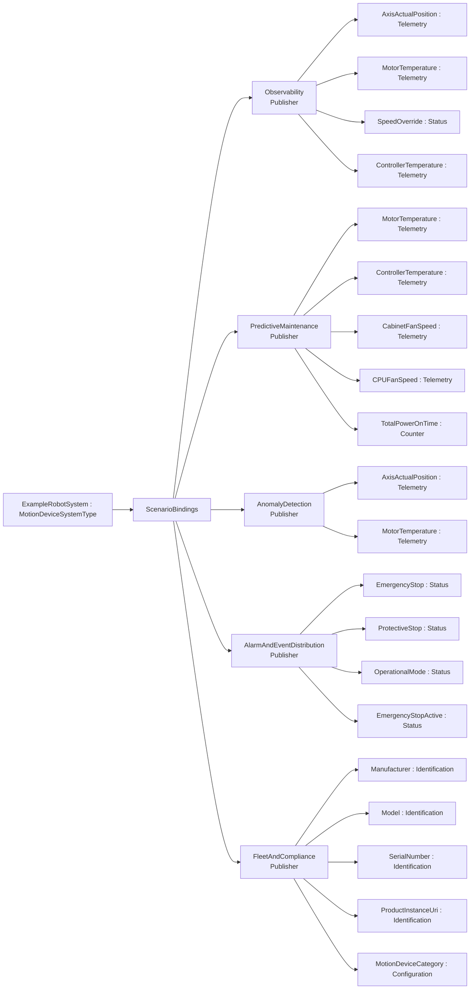
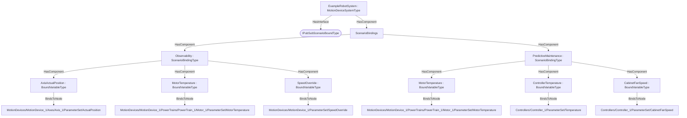

# OPC UA Robotics — PubSub Scenario Binding Addendum

**Working draft — a worked example of the [PubSub Scenario Binding](../../OPC-UA-PubSub-Scenario-Binding.md) base specification applied to OPC UA for Robotics (OPC 40010).**

> **Status — illustrative example.** This addendum shows how the instances of the `MotionDeviceSystemType` (http://opcfoundation.org/UA/Robotics/) can be exposed over OPC UA PubSub for integration scenarios, without modifying the companion specification. All NodeIds in the example namespace `http://opcfoundation.org/UA/PubSub/Examples/Robotics/` are provisional and the base-namespace binding types it references (`PubSubScenarioBindingsType` etc.) carry the **provisional** NodeIds of the draft base specification.

## 1 Scope

This addendum defines example **scenario bindings** for the `MotionDeviceSystemType` — 20 bound items across the scenarios *Observability, PredictiveMaintenance, AnomalyDetection, AlarmAndEventDistribution, FleetAndCompliance* — per the [PubSub Scenario Binding](../../OPC-UA-PubSub-Scenario-Binding.md) base specification. Robotics is structured around motion devices, axes, power trains, controllers and safety states with state machines, so scenarios lean on axis/motor telemetry, controller thermals, safety status and nameplate identity rather than a flat measurement model.

## 2 Normative references

- [PubSub Scenario Binding](../../OPC-UA-PubSub-Scenario-Binding.md) — the base binding model (types, discovery, the two-layer routing/semantic contract).
- [OPC UA for Robotics (OPC 40010)](https://reference.opcfoundation.org/Robotics/v100/docs/) — the companion specification whose type is bound.
- [OPC 10000-14](https://reference.opcfoundation.org/specs/OPC-10000-14/) — PubSub (optional realization).

## 3 How the bindings are applied

The bindings are authored at **two levels**, exactly as the base specification recommends:

1. **Type-level definitions (reusable).** The machine-readable descriptor [`Robotics.ScenarioBinding.json`](Robotics.ScenarioBinding.json) lists each bound item as a `BrowsePath` (RelativePath) from the `MotionDeviceSystemType` root, with its routing `Kind` and scenario. Every path in §4 was **resolved against the published companion NodeSet**, so the bindings apply to *any* conforming instance.
2. **Instance overlay (concrete).** [`Opc.Ua.Robotics.ScenarioBinding.NodeSet2.xml`](Opc.Ua.Robotics.ScenarioBinding.NodeSet2.xml) instantiates a compact theoretical instance `ExampleRobotSystem`, applies the `IPubSubScenarioBoundType` interface, and hangs a `ScenarioBindings` container holding the `ScenarioBinding`/`BoundItem` instances. On the instance each `BoundItem` uses **`BindsToNode`** to point at the concrete signal node (the type-level `BrowsePath` and the instance `BindsToNode` are the two locators defined by the base specification).

> **Theoretical instance model.** Robotics publishes no public instance example, so a compact theoretical `MotionDeviceSystem` is synthesised: one MotionDevice with an Axis and a PowerTrain/Motor, one Controller, and one SafetyState. Placeholder path segments (e.g. `<AxisIdentifier>`) become concrete instance names (e.g. `Axis_1`) in the overlay while the type-level BrowsePath keeps the placeholder.

Only the bound signals are materialised in the overlay; it is an *illustrative* instance, not a conformant full instance of the companion type.

## 4 Scenario bindings for `MotionDeviceSystemType`

Bindings for the `MotionDeviceSystemType` of the `http://opcfoundation.org/UA/Robotics/` companion specification, per the [PubSub Scenario Binding](../../OPC-UA-PubSub-Scenario-Binding.md) base specification. Every `BrowsePath` below was resolved against the published companion NodeSet.

#### Scenario: Observability

*URI:* `http://opcfoundation.org/UA/PubSub/Scenarios/Observability` · *Direction:* Publisher

| Field | Kind | BrowsePath | Source type | DataType |
|---|---|---|---|---|
| AxisActualPosition | Telemetry | `/MotionDevices/<MotionDeviceIdentifier>/Axes/<AxisIdentifier>/ParameterSet/ActualPosition` | [AnalogUnitType](https://reference.opcfoundation.org/specs/OPC-10000-8/5.3.4) | Double |
| MotorTemperature | Telemetry | `/MotionDevices/<MotionDeviceIdentifier>/PowerTrains/<PowerTrainIdentifier>/<MotorIdentifier>/ParameterSet/MotorTemperature` | [AnalogUnitType](https://reference.opcfoundation.org/specs/OPC-10000-8/5.3.4) | Double |
| SpeedOverride | Status | `/MotionDevices/<MotionDeviceIdentifier>/ParameterSet/SpeedOverride` | [BaseDataVariableType](https://reference.opcfoundation.org/specs/OPC-10000-5/7.4) | Double |
| ControllerTemperature | Telemetry | `/Controllers/<ControllerIdentifier>/ParameterSet/Temperature` | [AnalogUnitType](https://reference.opcfoundation.org/specs/OPC-10000-8/5.3.4) | Double |

#### Scenario: PredictiveMaintenance

*URI:* `http://opcfoundation.org/UA/PubSub/Scenarios/PredictiveMaintenance` · *Direction:* Publisher

| Field | Kind | BrowsePath | Source type | DataType |
|---|---|---|---|---|
| MotorTemperature | Telemetry | `/MotionDevices/<MotionDeviceIdentifier>/PowerTrains/<PowerTrainIdentifier>/<MotorIdentifier>/ParameterSet/MotorTemperature` | [AnalogUnitType](https://reference.opcfoundation.org/specs/OPC-10000-8/5.3.4) | Double |
| ControllerTemperature | Telemetry | `/Controllers/<ControllerIdentifier>/ParameterSet/Temperature` | [AnalogUnitType](https://reference.opcfoundation.org/specs/OPC-10000-8/5.3.4) | Double |
| CabinetFanSpeed | Telemetry | `/Controllers/<ControllerIdentifier>/ParameterSet/CabinetFanSpeed` | [AnalogUnitType](https://reference.opcfoundation.org/specs/OPC-10000-8/5.3.4) | Double |
| CPUFanSpeed | Telemetry | `/Controllers/<ControllerIdentifier>/ParameterSet/CPUFanSpeed` | [AnalogUnitType](https://reference.opcfoundation.org/specs/OPC-10000-8/5.3.4) | Double |
| TotalPowerOnTime | Counter | `/Controllers/<ControllerIdentifier>/ParameterSet/TotalPowerOnTime` | [BaseDataVariableType](https://reference.opcfoundation.org/specs/OPC-10000-5/7.4) | i=12879 |

#### Scenario: AnomalyDetection

*URI:* `http://opcfoundation.org/UA/PubSub/Scenarios/AnomalyDetection` · *Direction:* Publisher

| Field | Kind | BrowsePath | Source type | DataType |
|---|---|---|---|---|
| AxisActualPosition | Telemetry | `/MotionDevices/<MotionDeviceIdentifier>/Axes/<AxisIdentifier>/ParameterSet/ActualPosition` | [AnalogUnitType](https://reference.opcfoundation.org/specs/OPC-10000-8/5.3.4) | Double |
| MotorTemperature | Telemetry | `/MotionDevices/<MotionDeviceIdentifier>/PowerTrains/<PowerTrainIdentifier>/<MotorIdentifier>/ParameterSet/MotorTemperature` | [AnalogUnitType](https://reference.opcfoundation.org/specs/OPC-10000-8/5.3.4) | Double |

#### Scenario: AlarmAndEventDistribution

*URI:* `http://opcfoundation.org/UA/PubSub/Scenarios/AlarmAndEventDistribution` · *Direction:* Publisher

| Field | Kind | BrowsePath | Source type | DataType |
|---|---|---|---|---|
| EmergencyStop | Status | `/SafetyStates/<SafetyStateIdentifier>/ParameterSet/EmergencyStop` | [BaseDataVariableType](https://reference.opcfoundation.org/specs/OPC-10000-5/7.4) | Boolean |
| ProtectiveStop | Status | `/SafetyStates/<SafetyStateIdentifier>/ParameterSet/ProtectiveStop` | [BaseDataVariableType](https://reference.opcfoundation.org/specs/OPC-10000-5/7.4) | Boolean |
| OperationalMode | Status | `/SafetyStates/<SafetyStateIdentifier>/ParameterSet/OperationalMode` | [BaseDataVariableType](https://reference.opcfoundation.org/specs/OPC-10000-5/7.4) | i=3006 |
| EmergencyStopActive | Status | `/SafetyStates/<SafetyStateIdentifier>/EmergencyStopFunctions/<EmergencyStopFunctionIdentifier>/Active` | [BaseDataVariableType](https://reference.opcfoundation.org/specs/OPC-10000-5/7.4) | Boolean |

#### Scenario: FleetAndCompliance

*URI:* `http://opcfoundation.org/UA/PubSub/Scenarios/FleetAndCompliance` · *Direction:* Publisher

| Field | Kind | BrowsePath | Source type | DataType |
|---|---|---|---|---|
| Manufacturer | Identification | `/Manufacturer` | [PropertyType](https://reference.opcfoundation.org/specs/OPC-10000-5/7.3) | LocalizedText |
| Model | Identification | `/Model` | [PropertyType](https://reference.opcfoundation.org/specs/OPC-10000-5/7.3) | LocalizedText |
| SerialNumber | Identification | `/SerialNumber` | [PropertyType](https://reference.opcfoundation.org/specs/OPC-10000-5/7.3) | String |
| ProductInstanceUri | Identification | `/ProductInstanceUri` | [PropertyType](https://reference.opcfoundation.org/specs/OPC-10000-5/7.3) | String |
| MotionDeviceCategory | Configuration | `/MotionDevices/<MotionDeviceIdentifier>/MotionDeviceCategory` | [PropertyType](https://reference.opcfoundation.org/specs/OPC-10000-5/7.3) | i=18193 |

## 5 Where the bindings live

Overview of the scenario bindings, then their placement on the theoretical instance (`ScenarioBindings` hangs off the instance; each `BoundItem` `BindsToNode` its signal):

## 6 Deliverables

| File | Content |
|---|---|
| [`Robotics.ScenarioBinding.json`](Robotics.ScenarioBinding.json) | Machine-readable ScenarioBindingConfiguration descriptor (single source). |
| [`Opc.Ua.Robotics.ScenarioBinding.NodeSet2.xml`](Opc.Ua.Robotics.ScenarioBinding.NodeSet2.xml) | The binding instances on the theoretical `ExampleRobotSystem` instance. |

Regenerate with `python ../tools/build_bindings.py robotics/Robotics.ScenarioBinding.json`.

