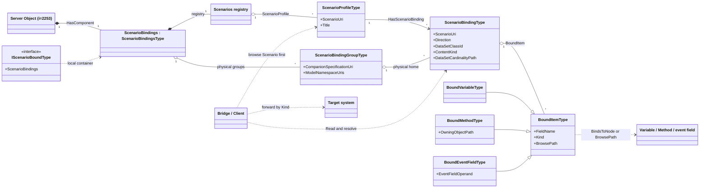
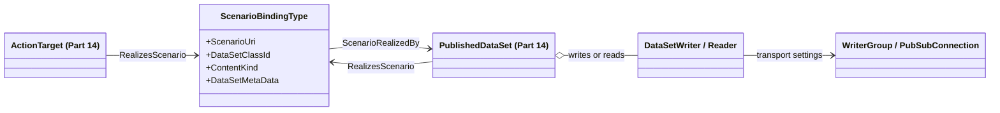
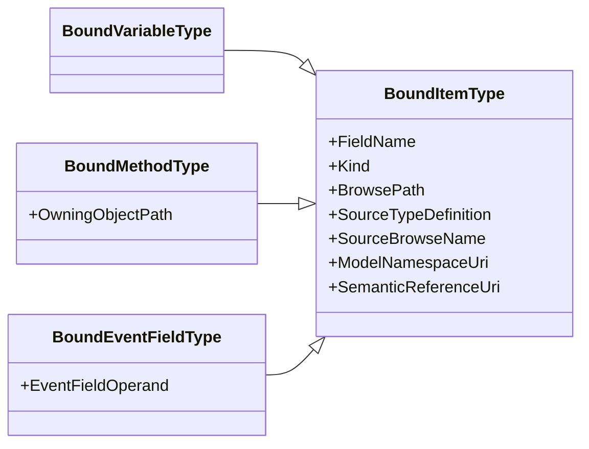
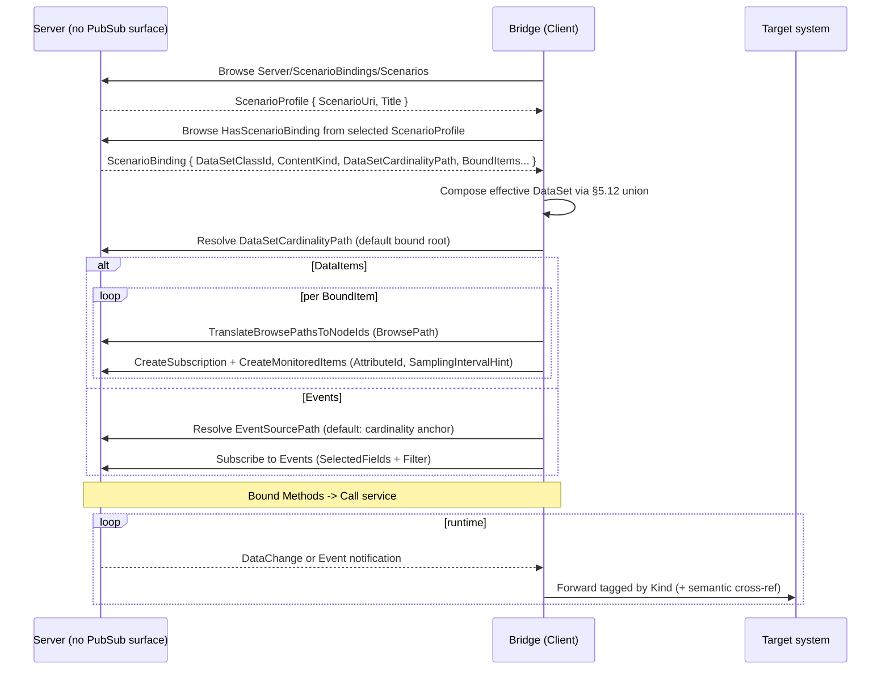
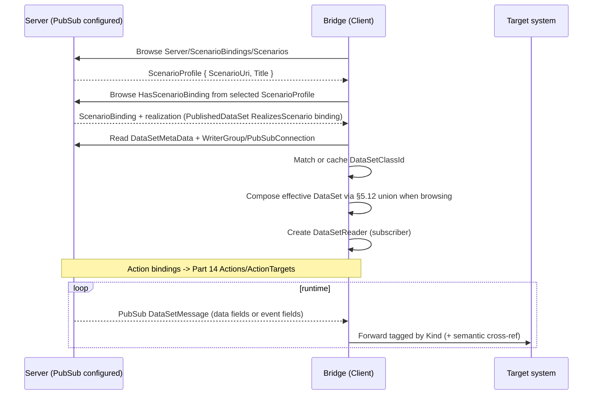

# OPC UA — Scenario Bindings

**Working draft for submission to the OPC Foundation Working Group**
**Proposed Part: OPC 10000‑2xx (number to be assigned)**
**Namespace:** `http://opcfoundation.org/UA/` (base OPC UA namespace)
**Version:** 0.1.0 · **Date:** 2026-07-01

> **Status — working draft.** This document proposes an addition to the *base* OPC UA namespace and is intended for discussion by the Working Group. Together with `Opc.Ua.ScenarioBinding.NodeSet2.xml` and `Opc.Ua.ScenarioBinding.NodeIds.csv` it defines a small, transport-neutral **binding and discovery layer** that a Server serves over the classic OPC UA client/server (RPC) interface and, optionally, realizes over PubSub ([OPC 10000-14](https://reference.opcfoundation.org/specs/OPC-10000-14/)). **All NodeIds are provisional** and drawn from a currently-unused block; final NodeIds are assigned by the OPC Foundation. Nothing here re-specifies classic Services or PubSub mechanics — it references them.

---

## 1 Scope

This specification defines an information model that lets an OPC UA Server **bind** the instances of any Information Model (a companion specification, a device model, or a vendor model) to well-defined, extensible integration **Scenarios**, and lets a Client **discover** those transport-neutral bindings and act on them without understanding the domain semantics.

It specifies:

- a discoverable **Scenario registry** and **binding registry**, reachable from the standard **Server Object** and, optionally, from any Object that opts in through an Interface;
- a **ScenarioBinding** that associates a Scenario (identified by a URI) and a direction with exactly one named **DataSet** class whose **bound items** are Variables, Methods/actions, or event fields;
- a **semantic cross‑reference** carried by each bound item back to the model that defines it, retained so that it can be **exported to a disconnected consumer**;
- normative rules for locating bound items by **BrowsePath** (RelativePath) so that bindings can be authored once at the type level and resolved per instance;
- normative rules for realizing a binding through classic OPC UA Subscriptions, Reads and Calls as the baseline, and through OPC UA PubSub as an optional Part 14 realization where the Server provides it;
- the **Profiles and Conformance Units** for Servers and Clients.

A binding is authored from the browsable model plus an out-of-band descriptor used by tooling; a portable interchange DataType for full binding configurations is deferred to a future revision.

It is explicitly **out of scope** to define new PubSub transports, message mappings, security, or the lifecycle of PubSub configuration; these are defined by [OPC 10000-14](https://reference.opcfoundation.org/specs/OPC-10000-14/) and referenced here for the optional PubSub realization.

### 1.1 Motivation

Companion specifications describe *what a thing is*. Getting that thing's live data into an analytics, observability, historian, digital-twin, orchestration, or PubSub system is a separate, repetitive integration problem: someone must decide which Variables, Methods and event fields belong to the scenario, at what rate, under what grouping, and how a downstream system should interpret them. Today this is solved ad-hoc, once per model and once per project.

This specification makes the decision **part of the model and discoverable at runtime**. A Server advertises, per Scenario, exactly which nodes to move or invoke and how; a generic **bridge** — a Client whose only job is to forward OPC UA data/actions into another system — discovers the binding, uses classic Subscriptions/Reads/Calls as the baseline, or uses PubSub where the Server has realized the same binding as Part 14 configuration, and forwards each field tagged with a small, stable, domain-agnostic role. The bridge needs to understand the *Scenario* and the *routing role*, not the generator, the pump, or the robot.

## 2 Normative references

- [OPC 10000‑3](https://reference.opcfoundation.org/specs/OPC-10000-3/) — Address Space Model.
- [OPC 10000‑4](https://reference.opcfoundation.org/specs/OPC-10000-4/) — Services (TranslateBrowsePathsToNodeIds, RelativePath, Subscriptions, Call).
- [OPC 10000‑5](https://reference.opcfoundation.org/specs/OPC-10000-5/) — Information Model (base types, Interfaces).
- [OPC 10000‑6](https://reference.opcfoundation.org/specs/OPC-10000-6/) — Mappings (DataType encodings: Binary, XML, JSON).
- [OPC 10000‑7](https://reference.opcfoundation.org/specs/OPC-10000-7/) — Profiles.
- [OPC 10000‑14](https://reference.opcfoundation.org/specs/OPC-10000-14/) — PubSub (PublishedDataSet, PublishedDataItems, PublishedEvents, DataSetWriter/Reader, DataSetMetaData, DataSetClassId, Actions).
- [OPC 10000‑19](https://reference.opcfoundation.org/specs/OPC-10000-19/) — Dictionary Reference (`HasDictionaryEntry`, IRDI/CDD).

## 3 Terms, definitions and abbreviations

| Term | Definition |
|---|---|
| Scenario | A class of integration use case (e.g. Observability, PredictiveMaintenance) identified by a URI, describing why data is moved and to what kind of consumer. |
| Scenario Binding | A transport-neutral association of a Scenario and a direction with exactly one named DataSet class; its bound items are Variables, Methods/actions, or event fields on a bound object or type. |
| Bound item | A data field, event field or Method/action that a Scenario Binding exposes, with routing and semantic metadata. |
| Bound root | The Object (an instance, or a type when authoring type‑level bindings) that a bound item's BrowsePath is resolved from. |
| Routing role (`Kind`) | The small, domain‑agnostic classification a bridge uses to forward an item (Telemetry, Status, Event, Command, …). |
| Semantic cross‑reference | The retained link from a bound item back to the model node that defines it (TypeDefinition, BrowseName, namespace, dictionary entry). |
| Bridge | A Client whose sole purpose is to forward bound data/actions between an OPC UA Server and another system, without understanding the domain semantics. |
| Realization | The concrete mechanism that carries or invokes a binding: classic OPC UA Subscriptions, Reads and Calls as the baseline, or optional Part 14 PubSub nodes (PublishedDataSet, DataSetWriter/Reader, ActionTarget) where configured. |
| DataSetClassId | The Guid carried by Part 14 DataSetMetaData that identifies a DataSet class independently of any Server instance. |
| DTC, PDS | Diagnostic Trouble Code; PublishedDataSet. |

Key words **shall**, **should**, **may**, **shall not** are to be interpreted as in ISO/IEC directives; normative and informative content is marked as such.

## 4 Overview and concepts

### 4.1 The two‑layer contract

A Scenario Binding carries two distinct kinds of metadata, and keeping them separate is the central design idea:

1. **Routing metadata — for the bridge.** The `ScenarioUri` says *which integration this serves*; the per‑item `Kind` says *how to forward this value* (a time series, a log record, an action, …). A bridge that "supports the Observability Scenario" can configure itself from routing metadata alone, for any domain.
2. **Semantic metadata — for the consumer.** Each bound item also retains a **cross‑reference back to the model** that defines it: the source `TypeDefinition`, the namespace‑qualified `BrowseName`, the `ModelNamespaceUri`, and — where available — a dictionary entry ([OPC 10000‑19](https://reference.opcfoundation.org/specs/OPC-10000-19/), IRDI/CDD). This is what lets a *disconnected* consumer, holding only a PubSub message, recover what the value *means*.

The bridge never needs the semantic layer to do its job; it forwards it verbatim so the ultimate consumer can use it.

### 4.2 Discovery

A Server exposes a server-wide [`ScenarioBindingsType`](#type-ScenarioBindingsType) instance named `ScenarioBindings` as a component of the standard **Server Object** (`i=2253`), which is **always present**. The primary discovery entry point inside this container is the `Scenarios` registry: a folder of [`ScenarioProfileType`](#type-ScenarioProfileType) Objects, one per known Scenario URI. A Client starts at the Scenario it cares about, browses [`HasScenarioBinding`](#type-HasScenarioBinding) from that `ScenarioProfileType`, and obtains every [`ScenarioBindingType`](#type-ScenarioBindingType) that serves the Scenario, regardless of which companion or scenario specification contributed the binding.

The per-companion-specification [`ScenarioBindingGroupType`](#type-ScenarioBindingGroupType) objects remain the physical home of binding nodes and the BrowseName collision boundary. Each group carries `CompanionSpecificationUri` and `ModelNamespaceUris`, then contains the bindings defined by that specification. Thus both entry points work: a Client may browse a Scenario to find all bindings that serve it (the primary cross-cutting path), or browse a specification's group to inspect the bindings physically owned by that specification. Bindings with the same BrowseName from different companion specifications do not collide in one server-wide or per-instance container.

Additionally, any Object (typically a companion-spec instance) may implement the [`IScenarioBoundType`](#type-IScenarioBoundType) Interface to expose its **own** local `ScenarioBindings` container, giving per-instance discovery using the same scenario-first and group-browse entry points.

### 4.3 Realization (hybrid)

A binding **declares** intent; whether and how it is realized over the wire is separate.

**A conforming Server is not required to implement OPC UA PubSub.** The default and most common case is a Server with **no PubSub configuration surface at all**: this specification references Part 14 *types* to describe an optional realization, but never requires *instances* of them — no `PublishSubscribe` object, `PublishedDataSet`, `DataSetWriter` or `WriterGroup` need exist. On such a Server a Client acts on a binding through **classic Subscriptions, Reads and Method calls** (§6); this is the baseline realization.

A [`ScenarioBindingType`](#type-ScenarioBindingType) defines exactly **one** logical DataSet class. Its `BoundItems` are the DataSet fields (or bound actions). If `ContentKind` is `DataItems`, the optional PubSub realization is a [`PublishedDataItemsType`](https://reference.opcfoundation.org/specs/OPC-10000-14/9.1.4) — grouped Variable values. If `ContentKind` is `Events`, the optional PubSub realization is a [`PublishedEventsType`](https://reference.opcfoundation.org/specs/OPC-10000-14/9.1.5) — an event notifier plus selected event fields and an optional filter. The binding's `DataSetClassId` is the class identity carried by the DataSet metadata and, in PubSub, by the `PublishedDataSet`.

When a Server *does* configure PubSub for a binding, the binding references the realizing Part 14 node through [`ScenarioRealizedBy`](#type-ScenarioRealizedBy); equivalently, the realizing node points back to the binding through the inverse `RealizesScenario` reference — normally the `PublishedDataSet` and optionally a `DataSetWriter`/`DataSetReader` or an `ActionTarget`. This **hybrid** model means a binding is useful immediately on any Server through classic OPC UA Services, and becomes a turn-key PubSub subscription wherever PubSub happens to be configured.

### 4.4 Architecture

#### 4.4.1 Core (discovery + binding, RPC baseline)



#### 4.4.2 Optional PubSub realization



*Attributes inside a box are **Properties** (Variables/DataType fields); labelled lines between boxes are **References**. The core diagram shows discovery, the physical grouping of binding nodes, and the classic OPC UA Services baseline. The optional Part 14 diagram shows PubSub realization nodes pointing back to the binding via the inverse `RealizesScenario` reference (`Realization → ScenarioBinding`).*

## 5 Information model

The full node reference — every type, member, DataType and well-known instance — is generated in **[Annex A](#annex-a)**. This clause states the intent and the normative rules. All types are defined in the base namespace; NodeIds are provisional.

### 5.1 ScenarioBindingsType

The discoverable container. It holds a `Scenarios` registry folder and `<ScenarioBindingGroup>` objects (an `OptionalPlaceholder`), both enumerated by **Browse**. A Client normally starts at `Scenarios`, selects the [`ScenarioProfileType`](#type-ScenarioProfileType) for the Scenario URI it supports, and browses [`HasScenarioBinding`](#type-HasScenarioBinding) to every binding that serves that Scenario. The same container also exposes the physical per-specification groups: each group is a [`ScenarioBindingGroupType`](#type-ScenarioBindingGroupType) and contains the `<ScenarioBinding>` children for one companion or scenario specification. No query Method is defined — Browse and Read already provide enumeration and selection, and requiring a Method would burden the classic Servers that are the common case. A Server **shall** expose one instance as a component of the **Server Object**; it **may** expose further instances through the Interface (§5.9).

#### 5.1.1 ScenarioBindingGroupType

A [`ScenarioBindingGroupType`](#type-ScenarioBindingGroupType) is the per-companion-specification anchor below a server-wide or per-instance `ScenarioBindings` container. Its `CompanionSpecificationUri` (Mandatory) is a stable **specification-level** identifier, not a namespace URI: a companion specification may define or use several namespace URIs across modules, versions or profiles, and those URIs are therefore not a unique group key. `ModelNamespaceUris` (Mandatory) lists all namespace URIs the companion specification defines or covers so a Client can match the group to the namespaces it knows.

Within one [`ScenarioBindingsType`](#type-ScenarioBindingsType) instance, groups **shall** be unique by `CompanionSpecificationUri`. Bindings are named only within their group, so two companion specifications may use the same binding BrowseName without colliding. This rule applies equally to the server-wide registry and to per-instance containers exposed through [`IScenarioBoundType`](#type-IScenarioBoundType). Scenario-first discovery via [`HasScenarioBinding`](#type-HasScenarioBinding) is cross-cutting navigation on top of this physical grouping; it does not move or rename the binding nodes.

### 5.2 ScenarioBindingType

A [`ScenarioBindingType`](#type-ScenarioBindingType) represents exactly one Scenario Binding — one named DataSet class (a set of fields) for one Scenario on one bound target. `ScenarioUri` (Mandatory) and `Direction` (Mandatory, a [`ScenarioBindingDirectionEnum`](#type-ScenarioBindingDirectionEnum)) are the routing header. `ConfigurationVersion` aligns the binding with the `ConfigurationVersion` of its DataSet schema so a consumer can detect change. `DataSetClassId` (Mandatory) is the stable Part 14 class identity for the DataSet (§5.7). `ContentKind` (Mandatory, a [`ScenarioContentKindEnum`](#type-ScenarioContentKindEnum)) selects whether the DataSet contains data items or events (§5.6). `DataSetCardinalityPath` (Optional) selects the cardinality level for instances of that class; when omitted, the cardinality level is the bound root.

The bound items are exposed **both** as browsable `<BoundItem>` objects **and** as a compact `BoundItems` array of [`BoundItemDataType`](#type-BoundItemDataType); when both are present they **shall** carry equivalent bound-item information (the same members and values). The bound items are the DataSet fields.

`DataSetMetaData` (Optional) exposes the Part 14 [`DataSetMetaDataType`](https://reference.opcfoundation.org/specs/OPC-10000-14/6.2.3#6.2.3.2.3) schema offline (§5.8). For event DataSets, `EventSourcePath` (Optional) identifies the event notifier; when omitted, the notifier is the cardinality anchor (the bound root when `DataSetCardinalityPath` is omitted). `Filter` (Optional, a [`ContentFilter`](https://reference.opcfoundation.org/specs/OPC-10000-4/7.4.1)) is the event where-clause. Where PubSub is configured, this binding references the realizing Part 14 node with [`ScenarioRealizedBy`](#type-ScenarioRealizedBy); the realizing node points back with inverse `RealizesScenario`.

#### 5.2.1 DataSet cardinality (normative)

A Server **shall** produce one DataSet instance for each matched instance of the `DataSetCardinalityPath`. If `DataSetCardinalityPath` is omitted, the cardinality anchor is the bound root and the binding produces one DataSet for that bound root. If the path resolves to multiple nodes, each resolved node is a separate cardinality anchor and therefore produces a separate DataSet.

The binding's `DataSetClassId` is unchanged by cardinality expansion and **shall** be shared by all produced DataSets. In PubSub realizations this means one DataSet class and, typically, one `DataSetWriter` per produced DataSet instance. In classic-client realizations this means the bridge creates the equivalent set of Subscriptions/MonitoredItems per cardinality anchor while retaining the same DataSet class identity. Because placeholder segments below the anchor expand per instance, the produced DataSets share the `DataSetClassId` but their concrete `DataSetMetaData` (field set and `ConfigurationVersion`) is per instance and may differ in field count (§5.7).

Illustrative cases:

| Binding shape | Result |
|---|---|
| `DataSetCardinalityPath` omitted on a single pump bound root | One Observability DataSet for that pump. |
| `DataSetCardinalityPath = /MotionDevices/<MotionDevice>` on a three-robot cell | Three DataSets, one per MotionDevice, all with the same `DataSetClassId`; `<Axis>/ActualPosition` expands to per-axis fields **within** each device DataSet. |

BrowsePaths at or above the cardinality anchor select which DataSet instances are produced. Placeholders strictly below the cardinality anchor do **not** create additional DataSets; they expand to disambiguated fields within that DataSet according to the BrowsePath resolution rules (§5.10).

### 5.3 BoundItemType and its subtypes

A [`BoundItemType`](#type-BoundItemType) describes one DataSet field or action. It **shall** carry a `FieldName` and a `Kind` (a [`BoundItemKindEnum`](#type-BoundItemKindEnum)). It locates its source in one of two ways (§5.10) and carries the semantic cross-reference (§5.4). [`BoundVariableType`](#type-BoundVariableType) binds a Variable exposed as a data DataSet field. [`BoundMethodType`](#type-BoundMethodType) binds a Method exposed as an action and adds `OwningObjectPath`. [`BoundEventFieldType`](#type-BoundEventFieldType) binds an event field selected by a [`SimpleAttributeOperand`](https://reference.opcfoundation.org/specs/OPC-10000-4/7.4.4); its `BrowsePath` is relative to the event `SourceTypeDefinition`, not to the AddressSpace instance.



### 5.4 Semantic cross-reference (normative)

Each bound item **shall** retain enough information to identify the model node it exposes independently of the live AddressSpace — as applicable to its NodeClass (see the Variable/Method/Event rule below):

- `SourceTypeDefinition` — the TypeDefinition NodeId of the source node, or for [`BoundEventFieldType`](#type-BoundEventFieldType), the event TypeDefinition against which the field operand is evaluated;
- `SourceBrowseName` — its namespace-qualified BrowseName;
- `ModelNamespaceUri` — the namespace URI of the model that defines it;
- optionally, `SemanticReferenceUri` — a portable external semantic identifier for the item (an IRDI/CDD, e.g. the identifier of a [OPC 10000-19](https://reference.opcfoundation.org/specs/OPC-10000-19/) dictionary entry). A Server that models the dictionary linkage natively **may** additionally place a `HasDictionaryEntry` reference on the browsable `BoundItem`; `SemanticReferenceUri` is the carrier used in the compact form and for propagation, so the linkage survives export.

These values are **derivable from the AddressSpace** and a generating tool **should** populate them mechanically to avoid drift.

The semantic Properties carry the **Optional** ModellingRule on [`BoundItemType`](#type-BoundItemType) at the type definition so one base type can serve bound Variables, bound Methods and bound event fields even though different subsets apply to different NodeClasses. This does not make the applicable values optional for a conforming instance: the *Semantic Cross-Reference* conformance unit (§7) requires a Server that exposes a binding to populate the applicable subset per NodeClass — `SourceTypeDefinition`, `SourceBrowseName` and `ModelNamespaceUri` for a bound **Variable**; `SourceBrowseName` and `ModelNamespaceUri` (the source being identified by its `BrowsePath`/`OwningObjectPath`) for a bound **Method**; and `SourceTypeDefinition` (the event type), `SourceBrowseName` and `ModelNamespaceUri` for a bound **event field**.

#### 5.4.1 Propagation to Part 14 FieldMetaData (Part 14 realization)

When a binding is realized as a Part 14 `PublishedDataSet`, for every bound item the Server **shall**:

1. set the corresponding `FieldMetaData.dataSetFieldId` to the item's `DataSetFieldId`;
2. add to `FieldMetaData.properties` the KeyValuePairs `ModelNamespaceUri`, `SourceBrowseName`, `SourceTypeDefinition`, `BrowsePath` and, where present, `SemanticReferenceUri` and `EventFieldOperand`; and
3. ensure the `DataSetMetaData` namespace and DataType tables describe any non-standard DataTypes used.

The property keys **shall** match the corresponding [`BoundItemType`](#type-BoundItemType) or [`BoundItemDataType`](#type-BoundItemDataType) member names above, so a consumer can map each `FieldMetaData` property back to the binding model without a separate lookup.

As a result the PubSub stream is **self-describing**: a subscriber that never connects to the Server can still map each field back to the companion model. This requirement is a Conformance Unit (§7).

### 5.5 Propagation to Part 14 configuration (normative)

Where PubSub is configured, the Server **shall** propagate the binding into Part 14 configuration as follows:

1. create or identify one `PublishedDataSet` for each DataSet instance produced by `DataSetCardinalityPath`;
2. set each `DataSetMetaData.dataSetClassId` and `PublishedDataSet.DataSetClassId` to the binding's shared `DataSetClassId`;
3. set the `DataSetMetaData.ConfigurationVersion` to the binding's `ConfigurationVersion`;
4. populate `FieldMetaData` from the `BoundItems` as specified in §5.4;
5. for `ContentKind = DataItems`, realize the DataSet as [`PublishedDataItemsType`](https://reference.opcfoundation.org/specs/OPC-10000-14/9.1.4) and map each [`BoundVariableType`](#type-BoundVariableType) or data [`BoundItemDataType`](#type-BoundItemDataType) entry to a published data Variable; and
6. for `ContentKind = Events`, realize the DataSet as [`PublishedEventsType`](https://reference.opcfoundation.org/specs/OPC-10000-14/9.1.5), map [`BoundEventFieldType`](#type-BoundEventFieldType) / `EventFieldOperand` entries to `SelectedFields`, map `EventSourcePath` to the `EventNotifier` (default: the cardinality anchor, the bound root when `DataSetCardinalityPath` is omitted), and map `Filter` to the PublishedEvents `Filter`.

### 5.6 DataSet granularity and content (normative)

A [`ScenarioBindingType`](#type-ScenarioBindingType) **shall** describe exactly one `PublishedDataSet` class. The `BoundItems` of the binding **shall** be the fields of each DataSet instance of that class. `DataSetCardinalityPath` determines how many DataSet instances are produced (§5.2.1). This class is the granularity at which class identity, configuration versioning and subscriber recognition are defined: per Scenario, per bound ObjectType, per major version.

For `ContentKind = DataItems`, the DataSet is a data DataSet: grouped Variable values modeled by Part 14 [`PublishedDataItemsType`](https://reference.opcfoundation.org/specs/OPC-10000-14/9.1.4). The fields are [`BoundVariableType`](#type-BoundVariableType) objects, or [`BoundItemDataType`](#type-BoundItemDataType) entries whose source locators identify Variables.

For `ContentKind = Events`, the DataSet is an event DataSet modeled by Part 14 [`PublishedEventsType`](https://reference.opcfoundation.org/specs/OPC-10000-14/9.1.5). `EventSourcePath` names the event notifier to subscribe to; if absent, the notifier is the cardinality anchor (the bound root when `DataSetCardinalityPath` is omitted). The fields are [`BoundEventFieldType`](#type-BoundEventFieldType) objects, or [`BoundItemDataType`](#type-BoundItemDataType) entries with `EventFieldOperand`, and they map to PublishedEvents `SelectedFields`. `Filter` carries the optional Part 14 event where-clause.

### 5.7 DataSetClassId (normative)

`DataSetClassId` **shall** be a Version-5 UUID as defined by RFC 4122, computed over the canonical UTF-8 string:

```text
<ScenarioUri>|<AppliesToType>|<MajorVersion>
```

The namespace UUID **shall** be the fixed UUID `fc164bdb-8705-58e9-ab11-7b1ed155b4e8`, defined by this specification as `uuid5(URL, "http://opcfoundation.org/UA/PubSub/Scenarios/DataSetClass")`.

`ScenarioUri` is the binding's `ScenarioUri`. `AppliesToType` is the namespace-qualified BrowseName of the concrete binding target (ObjectType, Interface, or AddInType) encoded as `<namespaceUri>;<Name>`. `MajorVersion` is the binding's `ConfigurationVersion.MajorVersion` expressed as a base-10 integer without leading zeroes. If the binding does not expose `ConfigurationVersion`, `MajorVersion` **shall** be taken as `1` (equivalently, an absent `ConfigurationVersion` is treated as `{MajorVersion = 1, MinorVersion = 0}`) so the derivation is always well-defined.

Because the calculation is deterministic, every Server publishing the same Scenario for the same binding target and major version **shall** compute the same `DataSetClassId`. A semantics-agnostic subscriber can therefore recognize the DataSet *class* from `DataSetClassId` alone, without browsing the Server. The identity grain is per `(ScenarioUri × AppliesToType × MajorVersion)`.

`DataSetClassId` identifies the *semantic* DataSet class — the Scenario applied to a binding target at a major version — and is a routing and recognition key, **not** a guarantee of a fixed field layout. When `DataSetCardinalityPath` leaves placeholder segments below the cardinality anchor (§5.2.1), the concrete `DataSetMetaData` — the `FieldMetaData` list and its `ConfigurationVersion` — is produced per DataSet instance and **may differ** in field count between instances of the same class (for example, robots with different numbers of axes). A consumer that requires the exact field layout **shall** read each DataSet's `DataSetMetaData` (§5.8) rather than infer it from `DataSetClassId`. A binding's `ConfigurationVersion` versions the binding/class *template* (the set of type-level bound items and their semantics), not the per-instance expanded field count.

A derived or composed binding keeps its own deterministic `DataSetClassId` and additionally advertises the base classes it extends or composes with `BaseDataSetClassIds` (§5.12); this does not change the derivation above.

### 5.8 DataSetMetaData exposure

A binding **may** expose `DataSetMetaData` carrying the DataSet fields, `dataSetClassId` and `configurationVersion`. When present, it **shall** be consistent with the binding's `BoundItems`, `DataSetClassId`, `ContentKind` and `ConfigurationVersion`. This lets a subscriber or offline tool obtain the class schema without browsing the bound model or reading the runtime PubSub configuration.

### 5.9 IScenarioBoundType

An Interface a model may apply (via `HasInterface`) to advertise participation in scenario bindings. It exposes a Mandatory `ScenarioBindings` container of type [`ScenarioBindingsType`](#type-ScenarioBindingsType). Applying it at the **type** level, with type-level BrowsePath bindings, is the recommended way for a companion specification to adopt this specification without changing its own types' semantics.

### 5.10 Locating bound items — BrowsePath resolution (normative)

A bound item locates its source node in one of two ways:

- **BrowsePath (recommended).** `BrowsePath` is a [`RelativePath`](https://reference.opcfoundation.org/specs/OPC-10000-4/7.30) resolved from `StartingNode` (default: the bound root). Because it is relative, a single binding authored on a **type** applies to **every instance**: the Server resolves it per instance with [TranslateBrowsePathsToNodeIds](https://reference.opcfoundation.org/specs/OPC-10000-4/). This is the recommended mechanism and the form emitted by the authoring tool. For [`BoundEventFieldType`](#type-BoundEventFieldType), the `BrowsePath` segments select an event field relative to `SourceTypeDefinition`, the event TypeDefinition, and may be represented directly as `EventFieldOperand`.
- **Absolute NodeId.** `SourceNodeId` (and the `BindsToNode` reference on the browsable form) identifies the node directly, for server-specific or instance-specific bindings. It is not used to select event fields inside a PublishedEvents DataSet.

Binding targets may be ObjectTypes, Interfaces, or AddInTypes; because `HasInterface` is applied to the instance and `HasAddIn` is hierarchical (a subtype of `HasComponent`), type-level BrowsePaths still resolve against the instance using the same `HierarchicalReferences` (`i=33`) traversal.

Resolution rules a Server **shall** apply:

1. If a BrowsePath does not resolve on a given instance (an absent Optional component), the item is **omitted** for that instance; this is **not** an error.
2. `DataSetCardinalityPath` is resolved first from the bound root (or defaults to the bound root). If it matches multiple nodes, each matched node is a separate cardinality anchor and produces a separate DataSet instance of the same DataSet class.
3. A bound-item BrowsePath that matches multiple nodes at or above the cardinality anchor participates in selecting the produced DataSet instances; it shall not be collapsed into multiple fields of one DataSet.
4. A bound-item BrowsePath that matches multiple nodes strictly below a cardinality anchor (a placeholder such as `<Rating>`, or an array of components) expands to one bound field per match within that DataSet; `FieldName` is made unique by appending the matched BrowseName or another deterministic path-derived suffix.
5. For a bound Method, the path targets the Method Node; the Object the Method is called on is the path's parent (or `OwningObjectPath` when given).
6. For an event field, the path targets a field of the event TypeDefinition; the notifier is identified by `EventSourcePath`, not by the field `BrowsePath`.

### 5.11 Scenario registry and URIs

The `Scenarios` folder under the server-wide [`ScenarioBindingsType`](#type-ScenarioBindingsType) container holds [`ScenarioProfileType`](#type-ScenarioProfileType) objects, one per known Scenario, each carrying its `ScenarioUri`, `Title`, `Summary` and `Keywords`. The registry is the primary discovery entry point: companion or scenario specifications that extend this specification register their own `ScenarioProfileType` Objects for their Scenario URIs, and each profile references every [`ScenarioBindingType`](#type-ScenarioBindingType) that serves that Scenario with [`HasScenarioBinding`](#type-HasScenarioBinding) (inverse `ServesScenario`).

Because [`HasScenarioBinding`](#type-HasScenarioBinding) crosses the physical per-specification groups, a Client that supports a Scenario does not need to know which specification contributed a binding. It selects the Scenario profile, browses `HasScenarioBinding` to all serving bindings, then resolves each binding through the classic baseline or optional PubSub realization. The per-specification [`ScenarioBindingGroupType`](#type-ScenarioBindingGroupType) objects remain the physical home of the binding nodes and may still be browsed directly when a Client wants to inspect one specification's bindings.

This specification defines the following baseline Scenario URIs under the root `http://opcfoundation.org/UA/PubSub/Scenarios/` (the URI root is a stable opaque identifier retained for deterministic `DataSetClassId` derivation):

| Scenario | Purpose |
|---|---|
| `Observability` | Real-time operational monitoring — SCADA/HMI, dashboards, observability platforms. |
| `PredictiveMaintenance` | Condition and usage trending for maintenance analytics. |
| `AnomalyDetection` | High-resolution correlated signals for baseline/deviation modelling. |
| `EnergyAndLoadManagement` | Power, load, demand and energy coordination. |
| `AlarmAndEventDistribution` | Condition and event streams. |
| `FleetAndCompliance` | Multi-site supervision, reporting and regulatory compliance. |

**Governance (normative).** The registry is **extensible**. Anyone may define additional Scenarios; a Scenario URI **shall** be owned by whoever controls its URI authority (for example a vendor uses a URI under a domain it controls). Extenders **shall not** define new URIs under `http://opcfoundation.org/UA/PubSub/Scenarios/`; that root is reserved for this specification and its successors.

### 5.12 Binding inheritance and facet composition (normative)

A binding may be declared on a binding target that is an ObjectType, an Interface (facet), or an AddInType; the target's type-level BrowsePaths resolve against any instance that is-a that ObjectType, implements that Interface using `HasInterface`, or composes that AddInType using `HasAddIn`. `HasAddIn` is the core OPC UA ReferenceType `i=17604`, a subtype of `HasComponent`, so AddIn children are reachable by the §5.10 BrowsePath resolution over `HierarchicalReferences` (`i=33`).

Inheritance is uniform across the three OPC UA composition axes: a subtype inherits the bindings of its supertype, a type implementing a facet Interface inherits the facet's bindings, and a host composing an AddIn inherits the AddIn's bindings.

A derived binding **shall** list only its additional delta fields and **shall** reference the base class lineage with `BaseDataSetClassIds`; it **may** additionally use `HasBaseBinding` when the base binding node is present locally. A derived field with the same `FieldName` as an inherited field **shall** override the inherited field, for example to refine `SamplingIntervalHint` or use a different `BrowsePath`. A binding **shall not** remove an inherited field; every derived DataSet is a superset of each base DataSet it extends, which makes base-class field-subset recognition safe.

For a given instance and `ScenarioUri`, a Server or bridge **shall** compose the effective binding as follows:

1. Collect candidate bindings for that `ScenarioUri` from the instance's TypeDefinition and its supertype chain, from each `HasInterface` target type, and from each `HasAddIn` child's type.
2. Each collected binding has a **mount path** — the RelativePath from the composing instance's root to the node the binding's paths are relative to. For a binding inherited via **subtype** or an **Interface** (`HasInterface`), the mount path is **empty** (its members appear directly on the instance). For a binding contributed by an **AddIn** (`HasAddIn`), the mount path is the **BrowseName of the `HasAddIn` child** on the host (e.g. `Location` for a `LocationAddInType` mounted as `Location`). Before unioning, the Server/bridge **shall** re-anchor every path of a collected binding by prefixing the mount path: each bound item's `BrowsePath` (and `StartingNode`), the binding's `DataSetCardinalityPath`, and its `EventSourcePath` are resolved relative to `mountPath + path`. Bindings inherited via subtype/interface need no prefix (empty mount).
3. Union the candidates' re-anchored `BoundItems`, applying override-by-`FieldName` so the most-derived contribution wins when multiple bindings define the same `FieldName`.
4. Set `SourceScenarioBindingClassId` on each composed field **only** for fields inherited from — or overriding a field of — a base facet binding; its value is the **base facet binding's `DataSetClassId`** (an overriding field retains the **overridden base facet's** class, since it still belongs to that facet). Fields the composing binding **defines itself** (its own delta fields) **omit** `SourceScenarioBindingClassId`; they belong implicitly to the composing binding's own `DataSetClassId`.
5. Set the composed binding's `BaseDataSetClassIds` to the set of contributing base `DataSetClassId` values.
6. Compute the composed DataSet's own `DataSetClassId` per §5.7 for the concrete `AppliesToType`.

A base facet binding **may** merge into the composing DataSet only when its (re-anchored) `DataSetCardinalityPath` resolves to the **same cardinality anchor** as the composing binding — typically the bound root (a single AddIn instance such as `Location`, or a subtype/interface facet, has bound-root cardinality and merges cleanly). A base binding whose `DataSetCardinalityPath` resolves to a **different or multi-valued** cardinality anchor **shall not** be merged into the host DataSet; instead the Server/bridge **shall** expose it as its own DataSet(s) per §5.2.1 (one DataSet class, its own writers), still recognizable through the composing binding's `BaseDataSetClassIds`. This keeps every merged DataSet a single well-defined cardinality.

`DataSetClassId` still identifies the concrete composed class deterministically. A subscriber that understands a base facet selects exactly the composed fields whose `SourceScenarioBindingClassId` equals that facet's `DataSetClassId`; a subscriber that understands the full composed class consumes every field (those tagged with a base facet class plus the composing binding's own untagged fields).

Guidance: use a subtype binding for is-a refinement, use an Interface facet binding for a contract capability implemented by many types without adding new structure, and use an AddIn binding for a reusable structural block that brings its own sub-objects, for example a GPS or Location block, whose fields compose into the host's DataSet.

## 6 Using the binding registry (informative)

This clause shows how a **bridge** consumes the model. It is informative; conformance is defined in §7.

### 6.1 Walkthrough

1. **Discover.** Browse `Server/ScenarioBindings/Scenarios`, select the `ScenarioProfileType` for the Scenario URI the bridge supports, then browse [`HasScenarioBinding`](#type-HasScenarioBinding) to every serving `ScenarioBinding`. If needed, also browse a specific `ScenarioBindingGroup` to inspect the bindings physically owned by one companion specification, or find Objects implementing `IScenarioBoundType` for per-instance bindings.
2. **Recognize.** If the bridge has prior knowledge of a scenario DataSet class, it can recognize an incoming PubSub DataSet by `DataSetClassId` alone; no browse of the publishing Server is required. If it is browsing, read `DataSetClassId`, `ContentKind`, `Direction`, `DataSetCardinalityPath` and optionally `DataSetMetaData` to learn the schema.
3. **Compose.** Before resolving items, compose the effective DataSet by the §5.12 union algorithm: gather bindings inherited via subtype, `HasInterface` facets and `HasAddIn` children for the selected `ScenarioUri`, then apply override-by-`FieldName` and field provenance tagging rather than using only the single most-derived binding.
4. **Realize — classic path (the default).** Resolve `DataSetCardinalityPath` (default: the bound root) to the set of DataSet instances to create. For each produced DataSet in a data binding, resolve each bound Variable `BrowsePath` (or read `SourceNodeId`) with `TranslateBrowsePathsToNodeIds`, then create a Subscription with a MonitoredItem on that node and `AttributeId`, honouring `SamplingIntervalHint`; a Client may also Read the values directly for non-streaming use. For an event binding, resolve `EventSourcePath` to the notifier (default: the cardinality anchor), subscribe to Events, use the `BoundEventFieldType` / `EventFieldOperand` entries as selected fields, and apply `Filter` where supported. For a bound Method, use the `Call` service. This path needs no PubSub configuration and works on any Server.
5. **Realize — PubSub path (only where PubSub is configured).** If the binding is [`ScenarioRealizedBy`](#type-ScenarioRealizedBy) a Part 14 node (equivalently, that node `RealizesScenario` the binding), read the `DataSetMetaData` and the transport from the owning `WriterGroup`/`PubSubConnection`, then create a `DataSetReader`/subscriber. A data DataSet is consumed as grouped Variable values. An event DataSet is consumed as selected event fields from the configured notifier, with the PublishedEvents `Filter` already applied by the publisher. For an `ActionInvoker`/`ActionResponder` binding, use Part 14 Actions/ActionTargets.
6. **Forward.** For each field, forward the value tagged with its `Kind` (Telemetry/Metric → time series; Event → log; Command → action; …) and attach the semantic cross-reference so the downstream consumer can interpret it. **No domain knowledge is required.**

### 6.2 Sequence — classic server (the default)



### 6.3 Sequence — PubSub-capable server (less common)



## 7 Profiles and Conformance Units

The following Conformance Units (CUs) are defined; Facets group them for Servers and Clients.

| Conformance Unit | Requirement |
|---|---|
| Scenario Binding Discovery | Expose a server-wide `ScenarioBindings` registry as a component of the Server Object; expose the `Scenarios` registry and `HasScenarioBinding` references so Clients can start from a Scenario and browse to all serving bindings. |
| Binding Grouping | Group bindings under one `ScenarioBindingGroup` per companion specification, identified uniquely by `CompanionSpecificationUri`, and expose `ModelNamespaceUris` for namespace matching. |
| Scenario Registry | Expose the `Scenarios` registry with a `ScenarioProfile` per supported Scenario URI; maintain `HasScenarioBinding` / `ServesScenario` references for every binding that serves each Scenario. |
| BrowsePath Resolution | Author bound items as type-level BrowsePaths and resolve them per instance under the rules of §5.10. |
| DataSet Cardinality | Resolve `DataSetCardinalityPath` and create one DataSet instance per matched cardinality anchor while sharing the binding's `DataSetClassId`. |
| DataSet Class Identity | Compute the deterministic `DataSetClassId` per §5.7 and propagate it to `DataSetMetaData.dataSetClassId` and `PublishedDataSet.DataSetClassId` wherever PubSub is configured. |
| Binding Inheritance & Facet Composition | Compose the effective DataSet for a Scenario by unioning bindings inherited via subtype, `HasInterface` and `HasAddIn` (override by `FieldName`), advertise base classes via `BaseDataSetClassIds`, and tag field provenance with `SourceScenarioBindingClassId` (§5.12). |
| Variable Realization *(optional)* | Realize a data binding as one Part 14 `PublishedDataSet`/`DataSetWriter` per DataSet instance produced by `DataSetCardinalityPath`, with `PublishedDataItemsType`. Applicable only where the Server implements PubSub. |
| Event DataSet Binding *(optional)* | Realize an event binding as one Part 14 `PublishedDataSet`/`DataSetWriter` per DataSet instance produced by `DataSetCardinalityPath`, with `PublishedEventsType`, mapping `BoundEventFieldType`/`EventFieldOperand` to `SelectedFields`, `EventSourcePath` to the notifier and `Filter` to the event filter. Applicable only where the Server implements PubSub. |
| Action Realization *(optional)* | Realize a bound Method as a Part 14 Action/ActionTarget. Applicable only where the Server implements PubSub. |
| Semantic Cross-Reference | Populate the semantic fields on every exposed bound item (`SourceTypeDefinition`/`SourceBrowseName`/`ModelNamespaceUri`, per the Variable/Method/Event rule in §5.4). Independent of PubSub. |
| PubSub MetaData Propagation *(optional)* | Where a binding is realized over PubSub, propagate the semantic fields into `DataSetMetaData.FieldMetaData` per §5.4.1 and the DataSet-level fields per §5.5. Applicable only where PubSub realization is offered. |

**Facets (informative grouping):**

- **Server Scenario Binding Facet** — Discovery + Binding Grouping + Scenario Registry + BrowsePath Resolution + DataSet Cardinality + Semantic Cross-Reference + DataSet Class Identity + Binding Inheritance & Facet Composition (mandatory); Variable Realization + Event DataSet Binding + Action Realization + PubSub MetaData Propagation (as offered, only where PubSub is implemented).
- **Publisher Facet** — Variable Realization and/or Event DataSet Binding + PubSub MetaData Propagation.
- **Bridge (Client) Facet** — select a Scenario from the `Scenarios` registry, browse `HasScenarioBinding` to serving bindings (or inspect groups directly), recognize by `DataSetClassId`, compose the effective DataSet by the §5.12 union algorithm, resolve `DataSetCardinalityPath`, realize via the classic path (default) or PubSub where configured, forward by `Kind`.

## 8 Deliverables and reproducibility

| File | Content |
|---|---|
| [`Opc.Ua.ScenarioBinding.NodeSet2.xml`](Opc.Ua.ScenarioBinding.NodeSet2.xml) | The information model (UANodeSet), a proposed addition to the base namespace, provisional NodeIds. |
| [`Opc.Ua.ScenarioBinding.NodeIds.csv`](Opc.Ua.ScenarioBinding.NodeIds.csv) | The provisional NodeId assignments (`SymbolicName,NodeId,NodeClass`). |
| [`OPC-UA-Scenario-Bindings.md`](OPC-UA-Scenario-Bindings.md) | This document. |
| [`tools/build_model.py`](tools/build_model.py) | The generator that emits the NodeSet, the CSV and the [Annex A](#annex-a) tables from one source of truth. |

The NodeSet has been validated to be structurally correct — XML well-formedness, unique NodeIds, CSV↔NodeSet consistency, and resolution of every referenced base NodeId against the base OPC UA and Part 14 NodeId tables — and its constructs (base-namespace type definitions, ReferenceTypes, an Interface, enumerations, Structures with encodings, `RelativePath`/`QualifiedName`/`Guid` fields, and the hook onto the well-known **Server Object**) were checked with the OPC Foundation modelling validator and reported **0 errors**.

An authoring **skill** (`skills/opcua-scenario-binding/`) can derive binding nodes and optional PubSub runtime-configuration skeletons from the browsable model plus an out-of-band descriptor; transport, security and addressing are deployment parameters and are not fixed by this specification. A portable interchange DataType for complete binding configurations is deferred to a future revision.

---
<a id="annex-a"></a>
## Annex A — Information model

This annex is the normative node reference. It is generated from `tools/build_model.py` and always matches `Opc.Ua.ScenarioBinding.NodeSet2.xml`. All nodes are proposed additions to the base OPC UA namespace `http://opcfoundation.org/UA/`; the NodeIds shown are **provisional** (final IDs are assigned by the OPC Foundation). The **Declared in** column marks members inherited from a supertype.

### Type overview

| NodeId | BrowseName | NodeClass | Subtype of |
|---|---|---|---|
| i=60001 | [BindsToNode](#type-BindsToNode) | ReferenceType | [NonHierarchicalReferences](https://reference.opcfoundation.org/specs/OPC-10000-3/7.4) |
| i=60002 | [ScenarioRealizedBy](#type-ScenarioRealizedBy) | ReferenceType | [NonHierarchicalReferences](https://reference.opcfoundation.org/specs/OPC-10000-3/7.4) |
| i=60004 | [HasScenarioBinding](#type-HasScenarioBinding) | ReferenceType | [NonHierarchicalReferences](https://reference.opcfoundation.org/specs/OPC-10000-3/7.4) |
| i=60003 | [HasBaseBinding](#type-HasBaseBinding) | ReferenceType | [NonHierarchicalReferences](https://reference.opcfoundation.org/specs/OPC-10000-3/7.4) |
| i=60012 | [BoundItemType](#type-BoundItemType) | ObjectType | [BaseObjectType](https://reference.opcfoundation.org/specs/OPC-10000-5/6.2) |
| i=60013 | [BoundVariableType](#type-BoundVariableType) | ObjectType | [BoundItemType](#type-BoundItemType) |
| i=60014 | [BoundMethodType](#type-BoundMethodType) | ObjectType | [BoundItemType](#type-BoundItemType) |
| i=60017 | [BoundEventFieldType](#type-BoundEventFieldType) | ObjectType | [BoundItemType](#type-BoundItemType) |
| i=60011 | [ScenarioBindingType](#type-ScenarioBindingType) | ObjectType | [BaseObjectType](https://reference.opcfoundation.org/specs/OPC-10000-5/6.2) |
| i=60018 | [ScenarioBindingGroupType](#type-ScenarioBindingGroupType) | ObjectType | [FolderType](https://reference.opcfoundation.org/specs/OPC-10000-5/6.6) |
| i=60010 | [ScenarioBindingsType](#type-ScenarioBindingsType) | ObjectType | [FolderType](https://reference.opcfoundation.org/specs/OPC-10000-5/6.6) |
| i=60015 | [ScenarioProfileType](#type-ScenarioProfileType) | ObjectType | [BaseObjectType](https://reference.opcfoundation.org/specs/OPC-10000-5/6.2) |
| i=60016 | [IScenarioBoundType](#type-IScenarioBoundType) | ObjectType | [BaseInterfaceType](https://reference.opcfoundation.org/specs/OPC-10000-5/6.9) |
| i=60050 | [ScenarioBindingDirectionEnum](#type-ScenarioBindingDirectionEnum) | DataType | Enumeration |
| i=60051 | [BoundItemKindEnum](#type-BoundItemKindEnum) | DataType | Enumeration |
| i=60052 | [ScenarioContentKindEnum](#type-ScenarioContentKindEnum) | DataType | Enumeration |
| i=60060 | [BoundItemDataType](#type-BoundItemDataType) | DataType | Structure |

### Reference types

<a id="type-BindsToNode"></a>
#### BindsToNode  (i=60001)

*Subtype of:* [NonHierarchicalReferences](https://reference.opcfoundation.org/specs/OPC-10000-3/7.4) · *InverseName:* `IsBoundBy`

Links a BoundItem to the companion-specification Variable or Method in the AddressSpace that it exposes for a scenario. The target is the authoritative semantic node; the BoundItem does not copy its meaning.

<a id="type-ScenarioRealizedBy"></a>
#### ScenarioRealizedBy  (i=60002)

*Subtype of:* [NonHierarchicalReferences](https://reference.opcfoundation.org/specs/OPC-10000-3/7.4) · *InverseName:* `RealizesScenario`

Links a ScenarioBinding to the optional OPC UA Part 14 PubSub node(s) that realize it (a PublishedDataSet, DataSetWriter, DataSetReader or an ActionTarget). Forward 'ScenarioRealizedBy' reads binding -> realization; the inverse 'RealizesScenario' reads realization -> binding. Absent (and never required) when the binding is not realized over PubSub - a Server may instead serve the binding over the classic client/server (RPC) interface.

<a id="type-HasScenarioBinding"></a>
#### HasScenarioBinding  (i=60004)

*Subtype of:* [NonHierarchicalReferences](https://reference.opcfoundation.org/specs/OPC-10000-3/7.4) · *InverseName:* `ServesScenario`

Links a ScenarioProfile in the Scenarios registry to a ScenarioBinding that serves that scenario, so a Client can start at the scenario it cares about and browse straight to every binding serving it (across companion specifications). Forward 'HasScenarioBinding' reads scenario -> binding; the inverse 'ServesScenario' reads binding -> scenario. The binding still lives physically under its per-specification ScenarioBindingGroup; this reference is the scenario-first discovery cross-link.

<a id="type-HasBaseBinding"></a>
#### HasBaseBinding  (i=60003)

*Subtype of:* [NonHierarchicalReferences](https://reference.opcfoundation.org/specs/OPC-10000-3/7.4) · *InverseName:* `IsBaseBindingOf`

Links a derived or composing ScenarioBinding to a base ScenarioBinding whose fields it extends or composes (e.g. a Machine binding to the Device-facet binding it builds on). Optional browse convenience used where the base binding node is present in the same AddressSpace; the portable, cross-specification lineage carrier is ScenarioBinding.BaseDataSetClassIds.

### Object types

<a id="type-BoundItemType"></a>
#### BoundItemType  (i=60012)

*Inherits from:* [BaseObjectType](https://reference.opcfoundation.org/specs/OPC-10000-5/6.2)

A single item bound into a scenario: it references the companion-spec node it exposes (BindsToNode and/or a BrowsePath) and carries the routing role (Kind) and the semantic cross-reference retained for export.

| BrowseName | NodeClass | DataType | ModellingRule | Declared in | Description |
|---|---|---|---|---|---|
| FieldName | Variable | String | Mandatory | BoundItemType | Stable logical field name of the item. |
| Kind | Variable | [BoundItemKindEnum](#type-BoundItemKindEnum) | Mandatory | BoundItemType | Generic routing role of the item. |
| AttributeId | Variable | UInt32 | Optional | BoundItemType | Attribute of the source node to expose (default 13 = Value). |
| BrowsePath | Variable | [RelativePath](https://reference.opcfoundation.org/specs/OPC-10000-4/7.30) | Optional | BoundItemType | RECOMMENDED locator: RelativePath from the bound root; resolved per instance. |
| StartingNode | Variable | NodeId | Optional | BoundItemType | Node the BrowsePath is resolved from (default: the bound root). |
| SourceNodeId | Variable | NodeId | Optional | BoundItemType | Alternative absolute locator (instance/server-specific). |
| SamplingIntervalHint | Variable | Duration | Optional | BoundItemType | Recommended sampling/publishing interval (ms). |
| IndexRange | Variable | NumericRange | Optional | BoundItemType | Optional sub-range for array values. |
| SourceTypeDefinition | Variable | NodeId | Optional | BoundItemType | TypeDefinition of the source node (semantic identity). |
| SourceBrowseName | Variable | QualifiedName | Optional | BoundItemType | Namespace-qualified BrowseName of the source node. |
| ModelNamespaceUri | Variable | String | Optional | BoundItemType | Namespace URI of the companion model defining the source. |
| DataSetFieldId | Variable | Guid | Optional | BoundItemType | GUID correlating the item to Part 14 FieldMetaData. |
| SourceScenarioBindingClassId | Variable | Guid | Optional | BoundItemType | Provenance: DataSetClassId of the base scenario binding this field originates from (its facet). Lets a subscriber partition a composed DataSet into exact per-base-class field subsets. Absent for fields defined by this binding itself. |
| SemanticReferenceUri | Variable | String | Optional | BoundItemType | Optional external semantic identifier (e.g. IRDI/CDD). |

<a id="type-BoundVariableType"></a>
#### BoundVariableType  (i=60013)

*Inherits from:* [BoundItemType](#type-BoundItemType)

A bound Variable exposed as a PubSub DataSet field.

| BrowseName | NodeClass | DataType | ModellingRule | Declared in | Description |
|---|---|---|---|---|---|
| FieldName | Variable | String | Mandatory | [BoundItemType](#type-BoundItemType) | Stable logical field name of the item. |
| Kind | Variable | [BoundItemKindEnum](#type-BoundItemKindEnum) | Mandatory | [BoundItemType](#type-BoundItemType) | Generic routing role of the item. |
| AttributeId | Variable | UInt32 | Optional | [BoundItemType](#type-BoundItemType) | Attribute of the source node to expose (default 13 = Value). |
| BrowsePath | Variable | [RelativePath](https://reference.opcfoundation.org/specs/OPC-10000-4/7.30) | Optional | [BoundItemType](#type-BoundItemType) | RECOMMENDED locator: RelativePath from the bound root; resolved per instance. |
| StartingNode | Variable | NodeId | Optional | [BoundItemType](#type-BoundItemType) | Node the BrowsePath is resolved from (default: the bound root). |
| SourceNodeId | Variable | NodeId | Optional | [BoundItemType](#type-BoundItemType) | Alternative absolute locator (instance/server-specific). |
| SamplingIntervalHint | Variable | Duration | Optional | [BoundItemType](#type-BoundItemType) | Recommended sampling/publishing interval (ms). |
| IndexRange | Variable | NumericRange | Optional | [BoundItemType](#type-BoundItemType) | Optional sub-range for array values. |
| SourceTypeDefinition | Variable | NodeId | Optional | [BoundItemType](#type-BoundItemType) | TypeDefinition of the source node (semantic identity). |
| SourceBrowseName | Variable | QualifiedName | Optional | [BoundItemType](#type-BoundItemType) | Namespace-qualified BrowseName of the source node. |
| ModelNamespaceUri | Variable | String | Optional | [BoundItemType](#type-BoundItemType) | Namespace URI of the companion model defining the source. |
| DataSetFieldId | Variable | Guid | Optional | [BoundItemType](#type-BoundItemType) | GUID correlating the item to Part 14 FieldMetaData. |
| SourceScenarioBindingClassId | Variable | Guid | Optional | [BoundItemType](#type-BoundItemType) | Provenance: DataSetClassId of the base scenario binding this field originates from (its facet). Lets a subscriber partition a composed DataSet into exact per-base-class field subsets. Absent for fields defined by this binding itself. |
| SemanticReferenceUri | Variable | String | Optional | [BoundItemType](#type-BoundItemType) | Optional external semantic identifier (e.g. IRDI/CDD). |

<a id="type-BoundMethodType"></a>
#### BoundMethodType  (i=60014)

*Inherits from:* [BoundItemType](#type-BoundItemType)

A bound Method exposed as an invokable action; may be realized as a Part 14 Action/ActionTarget.

| BrowseName | NodeClass | DataType | ModellingRule | Declared in | Description |
|---|---|---|---|---|---|
| OwningObjectPath | Variable | [RelativePath](https://reference.opcfoundation.org/specs/OPC-10000-4/7.30) | Optional | BoundMethodType | RelativePath to the Object the Method is called on (default: the bound root). |
| FieldName | Variable | String | Mandatory | [BoundItemType](#type-BoundItemType) | Stable logical field name of the item. |
| Kind | Variable | [BoundItemKindEnum](#type-BoundItemKindEnum) | Mandatory | [BoundItemType](#type-BoundItemType) | Generic routing role of the item. |
| AttributeId | Variable | UInt32 | Optional | [BoundItemType](#type-BoundItemType) | Attribute of the source node to expose (default 13 = Value). |
| BrowsePath | Variable | [RelativePath](https://reference.opcfoundation.org/specs/OPC-10000-4/7.30) | Optional | [BoundItemType](#type-BoundItemType) | RECOMMENDED locator: RelativePath from the bound root; resolved per instance. |
| StartingNode | Variable | NodeId | Optional | [BoundItemType](#type-BoundItemType) | Node the BrowsePath is resolved from (default: the bound root). |
| SourceNodeId | Variable | NodeId | Optional | [BoundItemType](#type-BoundItemType) | Alternative absolute locator (instance/server-specific). |
| SamplingIntervalHint | Variable | Duration | Optional | [BoundItemType](#type-BoundItemType) | Recommended sampling/publishing interval (ms). |
| IndexRange | Variable | NumericRange | Optional | [BoundItemType](#type-BoundItemType) | Optional sub-range for array values. |
| SourceTypeDefinition | Variable | NodeId | Optional | [BoundItemType](#type-BoundItemType) | TypeDefinition of the source node (semantic identity). |
| SourceBrowseName | Variable | QualifiedName | Optional | [BoundItemType](#type-BoundItemType) | Namespace-qualified BrowseName of the source node. |
| ModelNamespaceUri | Variable | String | Optional | [BoundItemType](#type-BoundItemType) | Namespace URI of the companion model defining the source. |
| DataSetFieldId | Variable | Guid | Optional | [BoundItemType](#type-BoundItemType) | GUID correlating the item to Part 14 FieldMetaData. |
| SourceScenarioBindingClassId | Variable | Guid | Optional | [BoundItemType](#type-BoundItemType) | Provenance: DataSetClassId of the base scenario binding this field originates from (its facet). Lets a subscriber partition a composed DataSet into exact per-base-class field subsets. Absent for fields defined by this binding itself. |
| SemanticReferenceUri | Variable | String | Optional | [BoundItemType](#type-BoundItemType) | Optional external semantic identifier (e.g. IRDI/CDD). |

<a id="type-BoundEventFieldType"></a>
#### BoundEventFieldType  (i=60017)

*Inherits from:* [BoundItemType](#type-BoundItemType)

A bound event field of an event DataSet, selected by a Part 14 SimpleAttributeOperand. Its BrowsePath is resolved relative to the event TypeDefinition (SourceTypeDefinition), not the AddressSpace instance; the EventSourcePath on the ScenarioBinding names the notifier it is selected from.

| BrowseName | NodeClass | DataType | ModellingRule | Declared in | Description |
|---|---|---|---|---|---|
| EventFieldOperand | Variable | [SimpleAttributeOperand](https://reference.opcfoundation.org/specs/OPC-10000-4/7.4.4) | Optional | BoundEventFieldType | The Part 14 SimpleAttributeOperand that selects this field (TypeDefinitionId, BrowsePath, AttributeId); maps directly to a PublishedEvents SelectedFields entry. |
| FieldName | Variable | String | Mandatory | [BoundItemType](#type-BoundItemType) | Stable logical field name of the item. |
| Kind | Variable | [BoundItemKindEnum](#type-BoundItemKindEnum) | Mandatory | [BoundItemType](#type-BoundItemType) | Generic routing role of the item. |
| AttributeId | Variable | UInt32 | Optional | [BoundItemType](#type-BoundItemType) | Attribute of the source node to expose (default 13 = Value). |
| BrowsePath | Variable | [RelativePath](https://reference.opcfoundation.org/specs/OPC-10000-4/7.30) | Optional | [BoundItemType](#type-BoundItemType) | RECOMMENDED locator: RelativePath from the bound root; resolved per instance. |
| StartingNode | Variable | NodeId | Optional | [BoundItemType](#type-BoundItemType) | Node the BrowsePath is resolved from (default: the bound root). |
| SourceNodeId | Variable | NodeId | Optional | [BoundItemType](#type-BoundItemType) | Alternative absolute locator (instance/server-specific). |
| SamplingIntervalHint | Variable | Duration | Optional | [BoundItemType](#type-BoundItemType) | Recommended sampling/publishing interval (ms). |
| IndexRange | Variable | NumericRange | Optional | [BoundItemType](#type-BoundItemType) | Optional sub-range for array values. |
| SourceTypeDefinition | Variable | NodeId | Optional | [BoundItemType](#type-BoundItemType) | TypeDefinition of the source node (semantic identity). |
| SourceBrowseName | Variable | QualifiedName | Optional | [BoundItemType](#type-BoundItemType) | Namespace-qualified BrowseName of the source node. |
| ModelNamespaceUri | Variable | String | Optional | [BoundItemType](#type-BoundItemType) | Namespace URI of the companion model defining the source. |
| DataSetFieldId | Variable | Guid | Optional | [BoundItemType](#type-BoundItemType) | GUID correlating the item to Part 14 FieldMetaData. |
| SourceScenarioBindingClassId | Variable | Guid | Optional | [BoundItemType](#type-BoundItemType) | Provenance: DataSetClassId of the base scenario binding this field originates from (its facet). Lets a subscriber partition a composed DataSet into exact per-base-class field subsets. Absent for fields defined by this binding itself. |
| SemanticReferenceUri | Variable | String | Optional | [BoundItemType](#type-BoundItemType) | Optional external semantic identifier (e.g. IRDI/CDD). |

<a id="type-ScenarioBindingType"></a>
#### ScenarioBindingType  (i=60011)

*Inherits from:* [BaseObjectType](https://reference.opcfoundation.org/specs/OPC-10000-5/6.2)

One scenario binding on a bound object or type. It declares the scenario URI and direction, lists the bound items (browsable and/or as a compact array), and may reference the Part 14 nodes that realize it.

| BrowseName | NodeClass | DataType | ModellingRule | Declared in | Description |
|---|---|---|---|---|---|
| ScenarioUri | Variable | String | Mandatory | ScenarioBindingType | URI of the integration scenario this binding serves. |
| Direction | Variable | [ScenarioBindingDirectionEnum](#type-ScenarioBindingDirectionEnum) | Mandatory | ScenarioBindingType | Role the server offers for this binding. |
| ConfigurationVersion | Variable | i=14593 | Optional | ScenarioBindingType | Version of the binding, aligned with the realizing DataSetMetaData. |
| DataSetClassId | Variable | Guid | Mandatory | ScenarioBindingType | Stable DataSetClassId (Part 14) identifying the class of the DataSet this binding defines, so subscribers recognize the same DataSet class across servers. It is a semantic class identity, not a guarantee of a fixed field layout (see the DataSetClassId clause). Deterministic. |
| BaseDataSetClassIds | Variable | Guid\[\] | Optional | ScenarioBindingType | DataSetClassIds of the base facet bindings this binding extends or composes (its class lineage). This binding's own DataSetClassId identifies the composed/derived class; a subscriber that knows a base class-id consumes the matching field subset (see BoundItemType.SourceScenarioBindingClassId). |
| ContentKind | Variable | [ScenarioContentKindEnum](#type-ScenarioContentKindEnum) | Mandatory | ScenarioBindingType | Whether the binding realizes as a data DataSet (PublishedDataItems) or an event DataSet (PublishedEvents). |
| DataSetCardinalityPath | Variable | [RelativePath](https://reference.opcfoundation.org/specs/OPC-10000-4/7.30) | Optional | ScenarioBindingType | RelativePath to the cardinality level: the Server/bridge produces one DataSet per matched instance of it (default: the bound root); placeholders below it become fields. The DataSetClassId is shared across those DataSets (one class, many writers). |
| DataSetMetaData | Variable | [DataSetMetaDataType](https://reference.opcfoundation.org/specs/OPC-10000-14/6.2.3#6.2.3.2.3) | Optional | ScenarioBindingType | Part 14 DataSetMetaData for this DataSet (fields, dataSetClassId, configurationVersion), exposed so a consumer gets the class schema offline. |
| EventSourcePath | Variable | [RelativePath](https://reference.opcfoundation.org/specs/OPC-10000-4/7.30) | Optional | ScenarioBindingType | For an event DataSet: RelativePath to the event notifier to subscribe to (default: the cardinality anchor, i.e. the bound root when DataSetCardinalityPath is omitted). |
| Filter | Variable | [ContentFilter](https://reference.opcfoundation.org/specs/OPC-10000-4/7.4.1) | Optional | ScenarioBindingType | For an event DataSet: optional ContentFilter (event where-clause). |
| BoundItems | Variable | [BoundItemDataType](#type-BoundItemDataType)\[\] | Optional | ScenarioBindingType | Compact machine-readable list of bound items (the DataSet fields). |
| <BoundItem> | Object |  | OptionalPlaceholder | ScenarioBindingType | A browsable bound item (rich form of a BoundItems entry). |

<a id="type-ScenarioBindingGroupType"></a>
#### ScenarioBindingGroupType  (i=60018)

*Inherits from:* [FolderType](https://reference.opcfoundation.org/specs/OPC-10000-5/6.6)

A per-companion-specification anchor grouping that spec's ScenarioBinding objects, so bindings from different companion specifications registered in one container never collide by BrowseName. Identified by CompanionSpecificationUri (a stable spec-level identifier, distinct from a namespace URI, because a companion specification may define several namespace URIs).

| BrowseName | NodeClass | DataType | ModellingRule | Declared in | Description |
|---|---|---|---|---|---|
| CompanionSpecificationUri | Variable | String | Mandatory | ScenarioBindingGroupType | Stable spec-level identifier of the companion specification this group anchors. Groups are unique per CompanionSpecificationUri. |
| ModelNamespaceUris | Variable | String\[\] | Mandatory | ScenarioBindingGroupType | All namespace URIs the companion specification defines/covers. |
| <ScenarioBinding> | Object |  | OptionalPlaceholder | ScenarioBindingGroupType | A scenario binding of this companion specification. |

<a id="type-ScenarioBindingsType"></a>
#### ScenarioBindingsType  (i=60010)

*Inherits from:* [FolderType](https://reference.opcfoundation.org/specs/OPC-10000-5/6.6)

A discoverable container of per-companion-spec ScenarioBindingGroup objects, enumerated by Browse. A server exposes one server-wide instance under the Server object, and/or a local instance on any object that implements IScenarioBoundType.

| BrowseName | NodeClass | DataType | ModellingRule | Declared in | Description |
|---|---|---|---|---|---|
| <ScenarioBindingGroup> | Object |  | OptionalPlaceholder | ScenarioBindingsType | A per-companion-specification group of scenario bindings. |

<a id="type-ScenarioProfileType"></a>
#### ScenarioProfileType  (i=60015)

*Inherits from:* [BaseObjectType](https://reference.opcfoundation.org/specs/OPC-10000-5/6.2)

A registered integration scenario: its URI plus human-readable metadata. The registry is extensible; vendors and other specifications add profiles with their own URIs.

| BrowseName | NodeClass | DataType | ModellingRule | Declared in | Description |
|---|---|---|---|---|---|
| ScenarioUri | Variable | String | Mandatory | ScenarioProfileType | The scenario URI. |
| Title | Variable | LocalizedText | Optional | ScenarioProfileType | Short human-readable title. |
| Summary | Variable | LocalizedText | Optional | ScenarioProfileType | Human-readable description of the scenario and its intended consumers. |
| Keywords | Variable | String\[\] | Optional | ScenarioProfileType | Keywords describing the scenario. |

<a id="type-IScenarioBoundType"></a>
#### IScenarioBoundType  (i=60016)

*Inherits from:* [BaseInterfaceType](https://reference.opcfoundation.org/specs/OPC-10000-5/6.9)

Interface implemented by a companion-specification ObjectType (or instance) to advertise that it participates in scenario bindings, by exposing a local ScenarioBindings container.

| BrowseName | NodeClass | DataType | ModellingRule | Declared in | Description |
|---|---|---|---|---|---|
| ScenarioBindings | Object |  | Mandatory | IScenarioBoundType | The scenario bindings defined on this object. |

### Data types

<a id="type-ScenarioBindingDirectionEnum"></a>
#### ScenarioBindingDirectionEnum  (i=60050)

*Subtype of:* Enumeration

The role the server offers for a ScenarioBinding, and hence what a client sets up on the other side.

| Name | Value | Description |
|---|---|---|
| Publisher | 0 | The server publishes the bound data; a client sets up a subscriber. |
| Subscriber | 1 | The server subscribes to the bound data; a client sets up a publisher. |
| ActionInvoker | 2 | The server invokes bound Methods/Actions on receipt; a client sends the trigger. |
| ActionResponder | 3 | The server responds to bound Actions; a client invokes them. |
| Bidirectional | 4 | Both data and action directions apply. |

<a id="type-BoundItemKindEnum"></a>
#### BoundItemKindEnum  (i=60051)

*Subtype of:* Enumeration

Generic role of a bound item for routing/bridging. It is intentionally domain-agnostic: a bridge maps each Kind to its target system without understanding the companion-specification semantics.

| Name | Value | Description |
|---|---|---|
| Telemetry | 0 | A measured/process value that changes continuously (maps to a time series). |
| Status | 1 | A discrete state/health/mode value. |
| Configuration | 2 | A configuration/parameter value that changes rarely. |
| Metric | 3 | An aggregated KPI or computed value. |
| Counter | 4 | A monotonically increasing counter/total. |
| Event | 5 | An event or condition (maps to a log/alarm stream). |
| Command | 6 | A bound Method/Action invocation (maps to an action). |
| Setpoint | 7 | A writable setpoint/target value. |
| Identification | 8 | Static nameplate/identity information. |
| Other | 9 | Any other role. |

<a id="type-ScenarioContentKindEnum"></a>
#### ScenarioContentKindEnum  (i=60052)

*Subtype of:* Enumeration

Whether a scenario binding realizes as a Part 14 data DataSet (PublishedDataItems) or an event DataSet (PublishedEvents). A binding is exactly one DataSet.

| Name | Value | Description |
|---|---|---|
| DataItems | 0 | A data DataSet: grouped Variable values (PublishedDataItemsType). |
| Events | 1 | An event DataSet: selected event fields from a notifier (PublishedEventsType). |

<a id="type-BoundItemDataType"></a>
#### BoundItemDataType  (i=60060)

*Subtype of:* Structure

Machine-readable descriptor of a single bound item: how to LOCATE it (BrowsePath relative to StartingNode, or an absolute SourceNodeId), its routing role (Kind) and the SEMANTIC cross-reference back to the companion model (TypeDefinition, BrowseName, ModelNamespaceUri, SemanticReferenceUri), which is retained so it can be exported to a disconnected consumer.

| Field | DataType | Description |
|---|---|---|
| FieldName | String | Stable logical field name; matches the PubSub DataSet field name. |
| Kind | [BoundItemKindEnum](#type-BoundItemKindEnum) | Generic routing role of the item. |
| AttributeId | UInt32 | Attribute of the source node to expose (default 13 = Value). |
| SamplingIntervalHint | Duration | Recommended sampling/publishing interval, in ms. |
| IndexRange | NumericRange | Optional sub-range for array values. |
| StartingNode | NodeId | Node the BrowsePath is resolved from (default: the bound root). |
| BrowsePath | [RelativePath](https://reference.opcfoundation.org/specs/OPC-10000-4/7.30) | RECOMMENDED locator: RelativePath from StartingNode (type-level, portable). |
| SourceNodeId | NodeId | Alternative absolute locator (instance/server-specific). |
| OwningObjectPath | [RelativePath](https://reference.opcfoundation.org/specs/OPC-10000-4/7.30) | For a bound Method: RelativePath to the Object it is called on (default: the bound root). |
| SourceTypeDefinition | NodeId | TypeDefinition of the source node (semantic identity). |
| SourceBrowseName | QualifiedName | Namespace-qualified BrowseName of the source node. |
| ModelNamespaceUri | String | Namespace URI of the companion model that defines the source. |
| DataSetFieldId | Guid | GUID correlating this item to Part 14 FieldMetaData.dataSetFieldId. |
| SourceScenarioBindingClassId | Guid | Provenance: DataSetClassId of the base scenario binding this field originates from (its facet). Lets a subscriber partition a composed DataSet into exact per-base-class field subsets. Absent for fields defined by this binding itself. |
| SemanticReferenceUri | String | Optional external semantic identifier (e.g. IRDI/CDD) for the item. |
| EventFieldOperand | [SimpleAttributeOperand](https://reference.opcfoundation.org/specs/OPC-10000-4/7.4.4) | For an event-DataSet field: the Part 14 SimpleAttributeOperand that selects it (alternative/complement to BrowsePath, whose segments are then relative to the event TypeDefinition). |

### Methods

| Method | Owning type | Input arguments | Output arguments |
|---|---|---|---|

### Well-known instances

| BrowseName | NodeId | TypeDefinition | Note |
|---|---|---|---|
| ScenarioBindings | i=60100 | [ScenarioBindingsType](#type-ScenarioBindingsType) | Server-wide registry of scenario bindings, discoverable by browsing the Server object. Its presence does not require any PubSub configuration. |
| Scenarios | i=60101 | [FolderType](https://reference.opcfoundation.org/specs/OPC-10000-5/6.6) | Registry of known integration scenarios (extensible). |
| Observability | i=60110 | [ScenarioProfileType](#type-ScenarioProfileType) | Real-time operational monitoring: SCADA/HMI, dashboards and observability platforms (e.g. OpenTelemetry). Low latency, cyclic telemetry and status. |
| PredictiveMaintenance | i=60111 | [ScenarioProfileType](#type-ScenarioProfileType) | Condition- and usage-based trending fed to maintenance analytics to forecast wear and schedule service. |
| AnomalyDetection | i=60112 | [ScenarioProfileType](#type-ScenarioProfileType) | High-resolution, correlated signals for baseline modelling and deviation/outlier detection. |
| EnergyAndLoadManagement | i=60113 | [ScenarioProfileType](#type-ScenarioProfileType) | Power, load, demand and energy signals for load management, peak shaving and grid-services coordination. |
| AlarmAndEventDistribution | i=60114 | [ScenarioProfileType](#type-ScenarioProfileType) | Condition and event streams for operators, CMMS/EAM and safety functions. |
| FleetAndCompliance | i=60115 | [ScenarioProfileType](#type-ScenarioProfileType) | Multi-site supervision, contractual reporting and regulatory compliance. |

