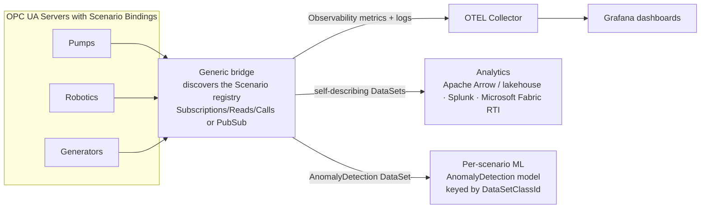
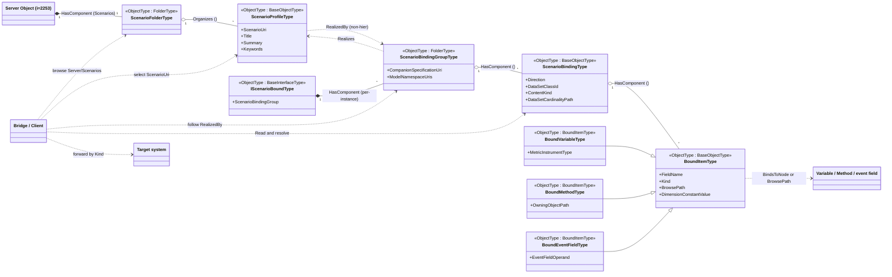
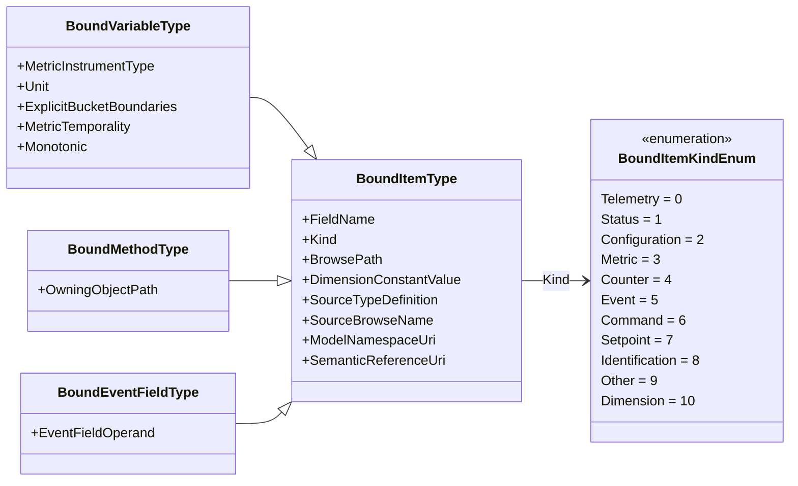
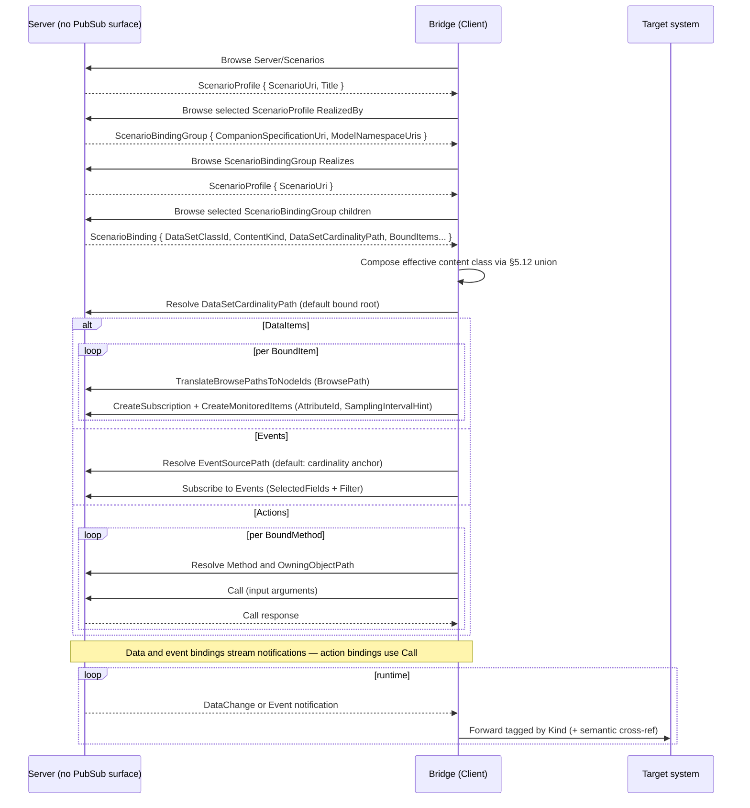
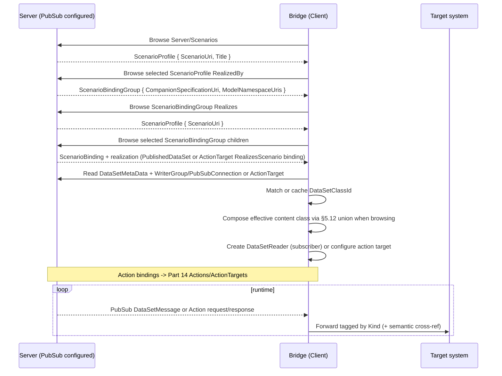
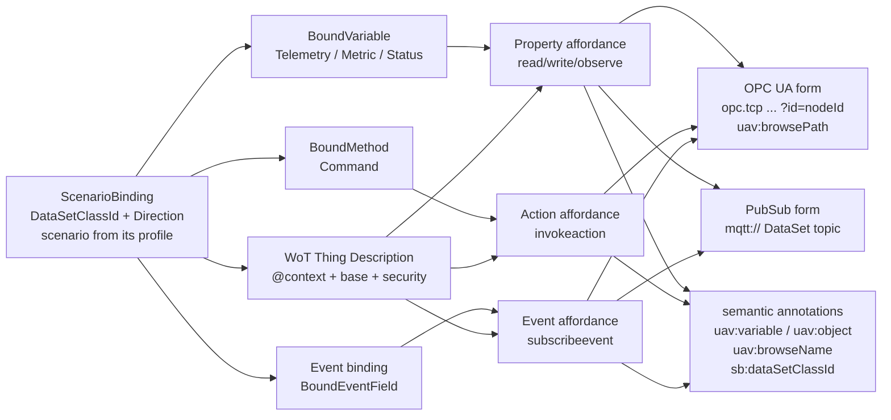

# OPC UA — Scenario Bindings

**Working draft for submission to the OPC Foundation Working Group**
**Proposed Part: OPC 10000‑2xx (number to be assigned)**
**Namespace:** `http://opcfoundation.org/UA/` (base OPC UA namespace)
**Version:** 0.1.0 · **Date:** 2026-07-01

> **Status — working draft.** This document proposes an addition to the *base* OPC UA namespace and is intended for discussion by the Working Group. Together with `Opc.Ua.ScenarioBinding.NodeSet2.xml` and `Opc.Ua.ScenarioBinding.NodeIds.csv` it defines a small, transport-neutral **binding and discovery layer** that a Server serves over the classic OPC UA client/server (RPC) interface and, optionally, realizes over PubSub ([OPC 10000-14](https://reference.opcfoundation.org/specs/OPC-10000-14/)). **All NodeIds are provisional** and drawn from a currently-unused block; final NodeIds are assigned by the OPC Foundation. Nothing here re-specifies classic Services or PubSub mechanics — it references them.

---

## 1 Scope

This specification defines an information model that lets an OPC UA Server **bind** the instances of any Information Model (a companion specification, a device model, or a vendor model) to well-defined, extensible integration **Scenarios**, and lets a Client **discover** those transport-neutral bindings and act on them without understanding the domain semantics.

It specifies:

- a discoverable **Scenario registry** and **binding registry**, reachable from the standard **Server Object** and, optionally, from any Object that opts in through an Interface;
- a **ScenarioBinding** that associates a Scenario (identified by a URI) and a direction with exactly one **content class** — a data DataSet, an event DataSet, or an **action set** — whose **bound items** are Variables, event fields, or Methods/actions respectively;
- a **semantic cross‑reference** carried by each bound item back to the model that defines it, retained so that it can be **exported to a disconnected consumer**;
- normative rules for locating bound items by **BrowsePath** (RelativePath) so that bindings can be authored once at the type level and resolved per instance;
- normative rules for realizing a binding through classic OPC UA Subscriptions, Reads and Calls as the baseline, and through OPC UA PubSub as an optional Part 14 realization where the Server provides it;
- the **Profiles and Conformance Units** for Servers and Clients.

It is explicitly **out of scope** to define new PubSub transports, message mappings, security, or the lifecycle of PubSub configuration; these are defined by [OPC 10000-14](https://reference.opcfoundation.org/specs/OPC-10000-14/) and referenced here for the optional PubSub realization.

### 1.1 Motivation

Companion specifications describe *what a thing is*. Getting that thing's live data into an analytics, observability, historian, digital-twin, orchestration, or PubSub system is a separate, repetitive integration problem: someone must decide which Variables, Methods and event fields belong to the scenario, at what rate, under what grouping, and how a downstream system should interpret them. Today this is solved ad-hoc, once per model and once per project.

This specification makes the decision **part of the model and discoverable at runtime**. A Server advertises, per Scenario, exactly which nodes to move or invoke and how; a generic **bridge** — a Client whose only job is to forward OPC UA data/actions into another system — discovers the binding, uses classic Subscriptions/Reads/Calls as the baseline, or uses PubSub where the Server has realized the same binding as Part 14 configuration, and forwards each field tagged with a small, stable, domain-agnostic role. The bridge needs to understand the *Scenario* and the *routing role*, not the generator, the pump, or the robot.

### 1.2 Motivating use cases

The practical value is that a **single generic bridge** can serve many downstream systems with *no domain-specific code*: the Server has already decided, per Scenario, which signals or actions matter and what they mean, and every binding is a named **content class** — a data DataSet, an event DataSet, or an action set — with a stable, deterministic `DataSetClassId`. A consumer recognizes and routes the content by *Scenario* and *class*, not by knowing the pump, the robot, or the generator. The use cases below are illustrative; product names are examples only and imply no endorsement.



**Factory-floor observability to OpenTelemetry and Grafana.** The `Observability` binding already declares which Variables are metrics — with their OTEL instrument type, unit and histogram buckets — which fields are dimensions, and how event fields become structured log records (§5.13). A bridge subscribes to the Observability DataSet and emits OpenTelemetry metrics and logs to an OTEL Collector, which drives Grafana (or any observability backend) for live factory-operations dashboards. Because the OTEL semantics are carried in the model, the same bridge lights up dashboards for a new machine or a new vendor with no per-model wiring.

**Egress to analytics and real-time-intelligence platforms.** Every data or event binding is a named DataSet with a stable `DataSetClassId`, offline `DataSetMetaData` and a semantic cross-reference on each field (§5.4). A bridge can therefore shape a DataSet into a self-describing columnar record — for example Apache Arrow for a data lakehouse — or stream it into Splunk or Microsoft Fabric Real-Time Intelligence (eventstream/KQL), carrying the field names, engineering units and semantic references so the destination schema is populated without hand-mapping. Where the Server realizes the binding over PubSub (Part 14), the same egress is simply a fan-out of `DataSetMessage`s to those platforms.

**Ready-to-go, scenario-group-specific machine learning.** The `AnomalyDetection` scenario defines a high-resolution, correlated DataSet whose `DataSetClassId` is derived deterministically and is **identical across every vendor and instance** of a bound type (§5.7). A model trained once against that class recognizes the DataSet by its class id alone — no browse, no re-mapping — so an anomaly-detection model, or a whole library of scenario-group models, becomes plug-in across a fleet and across suppliers. DataSet cardinality (§5.2.1) yields one live DataSet — and therefore one model instance — per pump, per robot or per axis group, all sharing the one class.

The same pattern serves the other registered Scenarios — `PredictiveMaintenance`, `EnergyAndLoadManagement`, `AlarmAndEventDistribution` and `FleetAndCompliance` (§5.11) — and any vendor-defined Scenario: one bridge, many backends, zero domain code.

## 2 Normative references

- [OPC 10000‑3](https://reference.opcfoundation.org/specs/OPC-10000-3/) — Address Space Model.
- [OPC 10000‑4](https://reference.opcfoundation.org/specs/OPC-10000-4/) — Services (TranslateBrowsePathsToNodeIds, RelativePath, Subscriptions, Call).
- [OPC 10000‑5](https://reference.opcfoundation.org/specs/OPC-10000-5/) — Information Model (base types, Interfaces).
- [OPC 10000‑6](https://reference.opcfoundation.org/specs/OPC-10000-6/) — Mappings (DataType encodings: Binary, XML, JSON).
- [OPC 10000‑7](https://reference.opcfoundation.org/specs/OPC-10000-7/) — Profiles.
- [OPC 10000‑14](https://reference.opcfoundation.org/specs/OPC-10000-14/) — PubSub (PublishedDataSet, PublishedDataItems, PublishedEvents, DataSetWriter/Reader, DataSetMetaData, DataSetClassId, Actions).
- [OPC 10000‑19](https://reference.opcfoundation.org/specs/OPC-10000-19/) — Dictionary Reference (`HasDictionaryEntry`, IRDI/CDD).
- [OPC 10101](https://reference.opcfoundation.org/specs/OPC-10101/) — OPC UA WoT Connectivity (informative).
- [W3C WoT Thing Description 1.1](https://www.w3.org/TR/wot-thing-description11/) — Web of Things Thing Description 1.1 (informative).

## 3 Terms, definitions and abbreviations

| Term | Definition |
|---|---|
| Scenario | A class of integration use case (e.g. Observability, PredictiveMaintenance) identified by a URI, describing why data is moved and to what kind of consumer. |
| Scenario Binding | A transport-neutral association of a Scenario and a direction with exactly one named content class — a data DataSet, an event DataSet, or an action set — on a bound object or type. Its bound items are homogeneous per binding: Variables, event fields, or Methods/actions respectively. |
| Bound item | A data field, event field or Method/action that a Scenario Binding exposes, with routing and semantic metadata. |
| <a id="term-bound-root"></a>Bound root | The Object (an instance, or a type when authoring type‑level bindings) that a bound item's BrowsePath is resolved from. |
| <a id="term-binding-target"></a>Binding target | The TypeDefinitionNode a binding is declared on — an ObjectType, an Interface (facet), or an AddInType (an Interface and an AddInType are themselves ObjectTypes). Its type‑level BrowsePaths resolve against any instance that is‑a the ObjectType, implements the Interface (`HasInterface`), or composes the AddInType (`HasAddIn`). |
| Routing role (`Kind`) | The small, domain‑agnostic classification a bridge uses to forward an item (Telemetry, Status, Event, Command, …). |
| Semantic cross‑reference | The retained link from a bound item back to the model node that defines it (TypeDefinition, BrowseName, namespace, dictionary entry). |
| Bridge | A Client whose sole purpose is to forward bound data/actions between an OPC UA Server and another system, without understanding the domain semantics. |
| Realization | The concrete mechanism that carries or invokes a binding: classic OPC UA Subscriptions, Reads and Calls as the baseline, or optional Part 14 PubSub nodes (PublishedDataSet, DataSetWriter/Reader, ActionTarget) where configured. |
| Action set | A binding content class whose fields are bound Methods invoked or responded, realized classically via the Call service and optionally as Part 14 Actions/ActionTargets. |
| DataSetClassId | The Guid carried by Part 14 DataSetMetaData that identifies a binding/content class independently of any Server instance. |
| DTC, PDS | Diagnostic Trouble Code; PublishedDataSet. |

Key words **shall**, **should**, **may**, **shall not** are to be interpreted as in ISO/IEC directives; normative and informative content is marked as such.

## 4 Overview and concepts

### 4.1 The two‑layer contract

A Scenario Binding carries two distinct kinds of metadata, and keeping them separate is the central design idea:

1. **Routing metadata — for the bridge.** The selected profile's `ScenarioUri` says *which integration this serves*; the per‑item `Kind` says *how to forward this value* (a time series, a log record, an action, …). A bridge that "supports the Observability Scenario" can configure itself from routing metadata alone, for any domain. For the Observability Scenario, the routing metadata also includes the OTEL metric instrument (`MetricInstrumentType`), the metric dimensions (`Kind = Dimension` items) and, for logs, the `LogTemplate`, so a bridge produces correct OTEL metrics/logs without domain knowledge.
2. **Semantic metadata — for the consumer.** Each bound item also retains a **cross‑reference back to the model** that defines it: the source `TypeDefinition`, the namespace‑qualified `BrowseName`, the `ModelNamespaceUri`, and — where available — a dictionary entry ([OPC 10000‑19](https://reference.opcfoundation.org/specs/OPC-10000-19/), IRDI/CDD). This is what lets a *disconnected* consumer, holding only a PubSub message, recover what the value *means*.

The bridge never needs the semantic layer to do its job; it forwards it verbatim so the ultimate consumer can use it.

### 4.2 Discovery

A Server exposes a server-wide `Scenarios` Object of [`ScenarioFolderType`](#type-ScenarioFolderType) as a component of the standard **Server Object** (`i=2253`), which is the scenario-first discovery entry point. The `Scenarios` registry organizes [`ScenarioProfileType`](#type-ScenarioProfileType) Objects, one per known Scenario URI. A Client browses `Server/Scenarios`, selects the Scenario profile whose `ScenarioUri` it supports, follows the profile's non-hierarchical [`RealizedBy`](#type-RealizedBy) references to the [`ScenarioBindingGroupType`](#type-ScenarioBindingGroupType) Objects that serve that Scenario, and then browses each group's [`ScenarioBindingType`](#type-ScenarioBindingType) children.

The groups themselves are not contained by the profile. Each [`ScenarioBindingGroupType`](#type-ScenarioBindingGroupType) is a `HasComponent` child of the [`IScenarioBoundType`](#type-IScenarioBoundType) Object instance it describes, and that Object is the group's single hierarchical parent. Profiles therefore are not duplicated per instance and do not contain or copy groups; they reference the serving instance groups through `RealizedBy`. Given a group, a Client browses the inverse `Realizes` reference back to its profile and reads that profile's authoritative `ScenarioUri`. The group carries `CompanionSpecificationUri` and `ModelNamespaceUris`, and it remains the BrowseName collision boundary for the bindings on that instance.

`RealizedBy` is non-hierarchical so the group can remain hierarchically contained by the bound instance while still being reachable from the scenario registry. This avoids a second hierarchical parent and prevents a profile→group→instance hierarchy loop. `RealizedBy`/`Realizes` is distinct from [`ScenarioRealizedBy`](#type-ScenarioRealizedBy)/`RealizesScenario`, which links a binding to its optional Part 14 PubSub realization.

### 4.3 Realization (hybrid)

A binding **declares** intent; whether and how it is realized over the wire is separate.

**A conforming Server is not required to implement OPC UA PubSub.** The default and most common case is a Server with **no PubSub configuration surface at all**: this specification references Part 14 *types* to describe an optional realization, but never requires *instances* of them — no `PublishSubscribe` object, `PublishedDataSet`, `DataSetWriter` or `WriterGroup` need exist. On such a Server a Client acts on a binding through **classic Subscriptions, Reads and Method calls** (§6); this is the baseline realization.

A [`ScenarioBindingType`](#type-ScenarioBindingType) defines exactly **one** content class. Its `BoundItems` are homogeneous fields for that class. If `ContentKind` is `DataItems`, the optional PubSub realization is a [`PublishedDataItemsType`](https://reference.opcfoundation.org/specs/OPC-10000-14/9.1.4) — grouped Variable values. If `ContentKind` is `Events`, the optional PubSub realization is a [`PublishedEventsType`](https://reference.opcfoundation.org/specs/OPC-10000-14/9.1.5) — an event notifier plus selected event fields and an optional filter. If `ContentKind` is `Actions`, the content is an action set of bound Methods, invoked or responded classically through the Call service and optionally realized as Part 14 Actions/ActionTargets. The binding's `DataSetClassId` is the class identity for whichever content class is declared; for data and event PubSub realizations it is carried by the DataSet metadata and by the `PublishedDataSet`, and for action sets it identifies the action-set class.

When a Server *does* configure PubSub for a binding, the binding references the realizing Part 14 node through [`ScenarioRealizedBy`](#type-ScenarioRealizedBy); equivalently, the realizing node points back to the binding through the inverse `RealizesScenario` reference — normally the `PublishedDataSet` and optionally a `DataSetWriter`/`DataSetReader` or an `ActionTarget`. This **hybrid** model means a binding is useful immediately on any Server through classic OPC UA Services, and becomes a turn-key PubSub subscription wherever PubSub happens to be configured.

### 4.4 Architecture

#### 4.4.1 Core (discovery + binding, RPC baseline)



#### 4.4.2 Optional PubSub realization

```mermaid
classDiagram
  direction LR

  class ScenarioFolderType {
    <<ObjectType : FolderType>>
  }
  class ScenarioProfileType {
    <<ObjectType : BaseObjectType>>
    +ScenarioUri
  }
  class ScenarioBindingGroupType {
    <<ObjectType : FolderType>>
    +CompanionSpecificationUri
  }
  class IScenarioBoundType {
    <<ObjectType : BaseInterfaceType>>
  }
  class ScenarioBindingType {
    <<ObjectType : BaseObjectType>>
    +DataSetClassId
    +ContentKind
    +DataSetMetaData
  }
  class PublishedDataSet {
    <<ObjectType : Part 14 PublishedDataSetType>>
  }
  class DataSetWriter {
    <<Object : Part 14 DataSetWriter / DataSetReader>>
  }
  class ActionTarget {
    <<Object : Part 14 ActionTarget>>
  }
  class PubSubConnection {
    <<Object : Part 14 WriterGroup / PubSubConnection>>
  }

  ScenarioFolderType "1" o-- "*" ScenarioProfileType : Organizes (<Scenario>)
  ScenarioProfileType ..> ScenarioBindingGroupType : RealizedBy (non-hier)
  ScenarioBindingGroupType ..> ScenarioProfileType : Realizes
  IScenarioBoundType "1" *-- "*" ScenarioBindingGroupType : HasComponent
  ScenarioBindingGroupType "1" o-- "*" ScenarioBindingType : HasComponent
  ScenarioBindingType --> PublishedDataSet : ScenarioRealizedBy
  PublishedDataSet --> ScenarioBindingType : RealizesScenario
  PublishedDataSet o-- DataSetWriter : writes or reads
  DataSetWriter --> PubSubConnection : transport settings
  ActionTarget --> ScenarioBindingType : RealizesScenario
```



*Attributes inside a box are **Properties** (Variables/DataType fields); labelled lines between boxes are **References**. The core diagram shows scenario-first discovery from the registry through `RealizedBy` to groups hierarchically contained by bound instances, and the classic OPC UA Services baseline. The optional Part 14 diagram shows the same discovery relation plus PubSub realization nodes pointing back to the binding via the inverse `RealizesScenario` reference (`Realization → ScenarioBinding`).*

## 5 Information model

The full node reference — every type, member, DataType and well-known instance — is generated in **[Annex A](#annex-a)**. This clause states the intent and the normative rules. All types are defined in the base namespace; NodeIds are provisional.

The model uses non-hierarchical ReferenceTypes for cross-links that must not affect containment: `BindsToNode` links a bound item to the source Variable or Method it exposes; `ScenarioRealizedBy`/`RealizesScenario` links a binding to its optional Part 14 PubSub realization; `HasBaseBinding` links a derived or composed binding to a locally present base binding; and `RealizedBy`/`Realizes` links a `ScenarioProfile` to the instance-contained `ScenarioBindingGroup` Objects that serve that profile. `RealizedBy` is intentionally distinct from `ScenarioRealizedBy`.

### 5.1 ScenarioFolderType

The server-wide `Scenarios` registry is a [`ScenarioFolderType`](#type-ScenarioFolderType) Object exposed as a component of the **Server Object**. It organizes `<Scenario>` Objects of [`ScenarioProfileType`](#type-ScenarioProfileType) and is the scenario-first discovery entry point. A Client selects the profile for the Scenario URI it supports, follows the profile's [`RealizedBy`](#type-RealizedBy) references to the instance-contained [`ScenarioBindingGroupType`](#type-ScenarioBindingGroupType) Objects serving that Scenario, and then browses each group's `<ScenarioBinding>` children. No query Method is defined — Browse and Read already provide enumeration and selection, and requiring a Method would burden the classic Servers that are the common case.

#### 5.1.1 ScenarioBindingGroupType

A [`ScenarioBindingGroupType`](#type-ScenarioBindingGroupType) is the per-(Scenario × companion specification) anchor contained by the [`IScenarioBoundType`](#type-IScenarioBoundType) Object instance it describes. Its `CompanionSpecificationUri` (Mandatory) is a stable **specification-level** identifier, not a namespace URI: a companion specification may define or use several namespace URIs across modules, versions or profiles, and those URIs are therefore not a unique group key. `ModelNamespaceUris` (Mandatory) lists all namespace URIs the companion specification defines or covers so a Client can match the group to the namespaces it knows. Each group `Realizes` exactly the [`ScenarioProfileType`](#type-ScenarioProfileType) for its Scenario; profiles reference the groups that serve them through `RealizedBy`.

A `ScenarioBindingGroup` is identified on its containing instance by the pair (`ScenarioUri` of the profile reached through inverse `Realizes`, `CompanionSpecificationUri`). Because sibling groups are contained by the same instance, an instance **shall not** expose two sibling groups with the same (`ScenarioUri` × `CompanionSpecificationUri`) pair; and because sibling Objects must also have distinct BrowseNames, each group's BrowseName **shall** be stable and unique among that instance's groups. For a single-specification instance the BrowseName is typically the Scenario name. When several specifications serve one Scenario on the same instance, the BrowseName **shall** additionally distinguish the specification. Bindings are named only within their group, so two companion specifications may use the same binding BrowseName without colliding. Scenario-first discovery is by `RealizedBy` from the selected profile to the instance-contained groups; it does not duplicate groups under the profile or rename binding nodes.

### 5.2 ScenarioBindingType

A [`ScenarioBindingType`](#type-ScenarioBindingType) represents exactly one Scenario Binding — one named content class (a data DataSet, event DataSet, or action set) for the Scenario realized by its containing group on one bound target. The binding's Scenario is the `ScenarioUri` of that group's [`ScenarioProfileType`](#type-ScenarioProfileType), reached by browsing inverse [`Realizes`](#type-RealizedBy) from the group; the binding itself does not carry `ScenarioUri`. `Direction` (Mandatory, a [`ScenarioBindingDirectionEnum`](#type-ScenarioBindingDirectionEnum)) is routing metadata. `ConfigurationVersion` aligns the binding with the `ConfigurationVersion` of its content-class schema so a consumer can detect change. `DataSetClassId` (Mandatory) is the stable Part 14 class identity for the binding/content class and already encodes the Scenario (§5.7). `ContentKind` (Mandatory, a [`ScenarioContentKindEnum`](#type-ScenarioContentKindEnum)) selects the content class — a data DataSet (`DataItems`), an event DataSet (`Events`), or an **action set** (`Actions`, bound Methods) — see §5.6. `DataSetCardinalityPath` (Optional) selects the cardinality level for instances of that class; when omitted, the cardinality level is the bound root.

The bound items are exposed **both** as browsable `<BoundItem>` objects **and** as a compact `BoundItems` array of [`BoundItemDataType`](#type-BoundItemDataType); when both are present they **shall** carry equivalent bound-item information (the same members and values). The bound items are homogeneous per binding: Variables for a data DataSet, event fields for an event DataSet, or Methods for an action set.

`DataSetMetaData` (Optional) exposes the Part 14 [`DataSetMetaDataType`](https://reference.opcfoundation.org/specs/OPC-10000-14/6.2.3#6.2.3.2.3) schema offline (§5.8). For event DataSets, `EventSourcePath` (Optional) identifies the event notifier; when omitted, the notifier is the cardinality anchor (the bound root when `DataSetCardinalityPath` is omitted). `Filter` (Optional, a [`ContentFilter`](https://reference.opcfoundation.org/specs/OPC-10000-4/7.4.1)) is the event where-clause. Where PubSub is configured, this binding references the realizing Part 14 node with [`ScenarioRealizedBy`](#type-ScenarioRealizedBy); the realizing node points back with inverse `RealizesScenario`.

#### 5.2.1 DataSet cardinality (normative)

`DataSetCardinalityPath` names the cardinality anchor for every content kind. For data and event content, a Server **shall** produce one DataSet instance for each matched instance of the `DataSetCardinalityPath`; for action sets, it **shall** produce one action target for each matched instance. If `DataSetCardinalityPath` is omitted, the cardinality anchor is the bound root and the binding produces one DataSet or action target for that bound root. If the path resolves to multiple nodes, each resolved node is a separate cardinality anchor and therefore produces a separate DataSet or action target.

The binding's `DataSetClassId` is unchanged by cardinality expansion and **shall** be shared by all produced DataSets or action targets. In PubSub data/event realizations this means one DataSet class and, typically, one `DataSetWriter` per produced DataSet instance; in PubSub action realizations this means one action target per produced cardinality anchor. In classic-client realizations this means the bridge creates the equivalent set of Subscriptions/MonitoredItems or Calls per cardinality anchor while retaining the same class identity. Because placeholder segments below the anchor expand per instance, the produced data/event DataSets share the `DataSetClassId` but their concrete `DataSetMetaData` (field set and `ConfigurationVersion`) is per instance and may differ in field count (§5.7).

Illustrative cases:

| Binding shape | Result |
|---|---|
| `DataSetCardinalityPath` omitted on a single pump bound root | One Observability DataSet for that pump. |
| `DataSetCardinalityPath = /MotionDevices/<MotionDevice>` on a three-robot cell | Three DataSets, one per MotionDevice, all with the same `DataSetClassId`; `<Axis>/ActualPosition` expands to per-axis fields **within** each device DataSet. |
| `DataSetCardinalityPath = /MotionDevices/<MotionDevice>` with a bound item at `/MotionDevices/<MotionDevice>/PowerTrains/<PowerTrain>/<Motor>/ParameterSet/MotorTemperature` (two placeholder levels **below** the anchor) on a robot with 6 power trains × 1 motor | One DataSet per MotionDevice; the two sub-anchor placeholders expand to 6 `MotorTemperature` fields per device (`MotorTemperature_PowerTrain_1_Motor_1` … `MotorTemperature_PowerTrain_6_Motor_1`), all sharing the one `DataSetClassId`. Placeholder levels compose multiplicatively. |

BrowsePaths at or above the cardinality anchor select which content instances are produced. For data and event content, placeholders strictly below the cardinality anchor do **not** create additional DataSets; they expand to disambiguated fields within that DataSet according to the BrowsePath resolution rules (§5.10). For action sets, the same below-anchor rule expands to disambiguated action fields within the action set.

The **shape** of a produced DataSet is the resolved field set for one cardinality anchor. For the `Observability` binding of a `MotionDevice` `Robot_1` (6 axes, 6 motors), the bridge produces one DataSet of this shape (see the Robotics addendum for the full worked resolution):

```text
DataSet "Robot_1 · Observability"   (one DataSetClassId, shared by every MotionDevice DataSet)
  AxisActualPosition_Axis_1 … AxisActualPosition_Axis_6            Gauge · deg
  MotorTemperature_PowerTrain_1_Motor_1 … _PowerTrain_6_Motor_1    Gauge · Cel
  SpeedOverride                                                    Gauge · %
```

A different topology (for example a 4-axis SCARA) yields the same `DataSetClassId` but a DataSet with fewer fields; a subscriber recognizes the class regardless of the per-instance field count.

### 5.3 BoundItemType and its subtypes

A [`BoundItemType`](#type-BoundItemType) describes one DataSet field or action. It **shall** carry a `FieldName` and a `Kind` (a [`BoundItemKindEnum`](#type-BoundItemKindEnum)). It locates its source in one of two ways (§5.10) and carries the semantic cross-reference (§5.4). [`BoundVariableType`](#type-BoundVariableType) binds a Variable exposed as a data DataSet field. [`BoundMethodType`](#type-BoundMethodType) binds a Method exposed as an action and adds `OwningObjectPath`. [`BoundEventFieldType`](#type-BoundEventFieldType) binds an event field selected by a [`SimpleAttributeOperand`](https://reference.opcfoundation.org/specs/OPC-10000-4/7.4.4); its `BrowsePath` is relative to the event `SourceTypeDefinition`, not to the AddressSpace instance. `BoundVariableType` additionally carries the Observability/OTEL metric members (`MetricInstrumentType`, `Unit`, `ExplicitBucketBoundaries`, `MetricTemporality`, `Monotonic`), and a bound item may instead be a metric dimension (`Kind = Dimension`, optionally with a `DimensionConstantValue`); see §5.13.



### 5.4 Semantic cross-reference (normative)

Each bound item **shall** retain enough information to identify the model node it exposes independently of the live AddressSpace — as applicable to its NodeClass (see the Variable/Method/Event rule below):

- `SourceTypeDefinition` — the TypeDefinition NodeId of the source node, or for [`BoundEventFieldType`](#type-BoundEventFieldType), the event TypeDefinition against which the field operand is evaluated;
- `SourceBrowseName` — its namespace-qualified BrowseName;
- `ModelNamespaceUri` — the namespace URI of the model that defines it;
- optionally, `SemanticReferenceUri` — a portable external semantic identifier for the item (an IRDI/CDD, e.g. the identifier of a [OPC 10000-19](https://reference.opcfoundation.org/specs/OPC-10000-19/) dictionary entry). A Server that models the dictionary linkage natively **may** additionally place a `HasDictionaryEntry` reference on the browsable `BoundItem`; `SemanticReferenceUri` is the carrier used in the compact form and for propagation, so the linkage survives export.

These values are **derivable from the AddressSpace** and a generating tool **should** populate them mechanically to avoid drift.

The semantic Properties carry the **Optional** ModellingRule on [`BoundItemType`](#type-BoundItemType) at the type definition so one base type can serve bound Variables, bound Methods and bound event fields even though different subsets apply to different NodeClasses. This does not make the applicable values optional for a conforming instance: the *Semantic Cross-Reference* conformance unit (§7) requires a Server that exposes a binding to populate the applicable subset per NodeClass — `SourceTypeDefinition`, `SourceBrowseName` and `ModelNamespaceUri` for a bound **Variable**; `SourceBrowseName` and `ModelNamespaceUri` (the source being identified by its `BrowsePath`/`OwningObjectPath`) for a bound **Method**; and `SourceTypeDefinition` (the event type), `SourceBrowseName` and `ModelNamespaceUri` for a bound **event field**.

#### 5.4.1 Propagation to Part 14 FieldMetaData (Part 14 realization)

When a binding is realized as a Part 14 `PublishedDataSet`, for every bound item the Server **shall**:

1. set the corresponding `FieldMetaData.dataSetFieldId` to the item's `DataSetFieldId`;
2. add to `FieldMetaData.properties` the KeyValuePairs `ModelNamespaceUri`, `SourceBrowseName`, `SourceTypeDefinition`, `BrowsePath` and, where present, `SemanticReferenceUri`, `SourceScenarioBindingClassId` (so a disconnected subscriber can recognize fields inherited from a base facet class) and `EventFieldOperand`; and
3. ensure the `DataSetMetaData` namespace and DataType tables describe any non-standard DataTypes used.

The property keys **shall** match the corresponding [`BoundItemType`](#type-BoundItemType) or [`BoundItemDataType`](#type-BoundItemDataType) member names above, so a consumer can map each `FieldMetaData` property back to the binding model without a separate lookup.

As a result the PubSub stream is **self-describing**: a subscriber that never connects to the Server can still map each field back to the companion model. This requirement is a Conformance Unit (§7).

### 5.5 Propagation to Part 14 configuration (normative)

Where PubSub is configured, the Server **shall** propagate the binding into Part 14 configuration as follows:

1. for data and event content, create or identify one `PublishedDataSet` for each DataSet instance produced by `DataSetCardinalityPath`;
2. for data and event content, set each `DataSetMetaData.dataSetClassId` and `PublishedDataSet.DataSetClassId` to the binding's shared `DataSetClassId`;
3. for any exposed `DataSetMetaData`, set `ConfigurationVersion` to the binding's `ConfigurationVersion`;
4. for any exposed `DataSetMetaData`, populate `FieldMetaData` from the `BoundItems` as specified in §5.4;
5. for `ContentKind = DataItems`, realize the DataSet as [`PublishedDataItemsType`](https://reference.opcfoundation.org/specs/OPC-10000-14/9.1.4) and map each [`BoundVariableType`](#type-BoundVariableType) or data [`BoundItemDataType`](#type-BoundItemDataType) entry to a published data Variable;
6. for `ContentKind = Events`, realize the DataSet as [`PublishedEventsType`](https://reference.opcfoundation.org/specs/OPC-10000-14/9.1.5), map [`BoundEventFieldType`](#type-BoundEventFieldType) / `EventFieldOperand` entries to `SelectedFields`, map `EventSourcePath` to the `EventNotifier` (default: the cardinality anchor, the bound root when `DataSetCardinalityPath` is omitted), and map `Filter` to the PublishedEvents `Filter`; and
7. for `ContentKind = Actions`, realize each bound Method as a Part 14 Action/ActionTarget request/response, map `OwningObjectPath` to the target Object and the bound Method to the ActionTarget's Method. Applicable only where the Server implements PubSub.

### 5.6 Binding content and granularity (normative)

A [`ScenarioBindingType`](#type-ScenarioBindingType) **shall** describe exactly one content class: a data DataSet, an event DataSet, or an action set. The `BoundItems` of the binding **shall** be homogeneous for that class; a single binding **shall not** mix Variables, event fields and Methods as peer content. A [`ScenarioBindingGroupType`](#type-ScenarioBindingGroupType) may contain multiple bindings when a Scenario serves multiple content kinds. `DataSetCardinalityPath` determines how many DataSet instances are produced for data and event content, or how many action targets are produced for an action set (§5.2.1). This class is the granularity at which class identity, configuration versioning and subscriber recognition are defined: per Scenario, per bound ObjectType, per major version.

For `ContentKind = DataItems`, the DataSet is a data DataSet: grouped Variable values modeled by Part 14 [`PublishedDataItemsType`](https://reference.opcfoundation.org/specs/OPC-10000-14/9.1.4). The fields are [`BoundVariableType`](#type-BoundVariableType) objects, or [`BoundItemDataType`](#type-BoundItemDataType) entries whose source locators identify Variables.

For `ContentKind = Events`, the DataSet is an event DataSet modeled by Part 14 [`PublishedEventsType`](https://reference.opcfoundation.org/specs/OPC-10000-14/9.1.5). `EventSourcePath` names the event notifier to subscribe to; if absent, the notifier is the cardinality anchor (the bound root when `DataSetCardinalityPath` is omitted). The fields are [`BoundEventFieldType`](#type-BoundEventFieldType) objects, or [`BoundItemDataType`](#type-BoundItemDataType) entries with `EventFieldOperand`, and they map to PublishedEvents `SelectedFields`. `Filter` carries the optional Part 14 event where-clause.

For `ContentKind = Actions`, the content is an **action set**. The fields are [`BoundMethodType`](#type-BoundMethodType) objects, or [`BoundItemDataType`](#type-BoundItemDataType) entries whose locators identify Methods and include `OwningObjectPath` where the owning Object is not the path parent. Classically, each bound Method is invoked or responded through the Call service. Where PubSub is configured, `DataSetCardinalityPath` produces one action target per matched cardinality anchor, mirroring one DataSet per anchor for data and event content. The class identity and versioning rules apply identically to action sets.

### 5.7 DataSetClassId (normative)

`DataSetClassId` **shall** be a Version-5 UUID as defined by RFC 4122, computed over the canonical UTF-8 string:

```text
<ScenarioUri>|<AppliesToType>|<ContentKind>|<MajorVersion>
```

The namespace UUID **shall** be the fixed UUID `fc164bdb-8705-58e9-ab11-7b1ed155b4e8`, defined by this specification as `uuid5(URL, "http://opcfoundation.org/UA/PubSub/Scenarios/DataSetClass")`.

`ScenarioUri` is the `ScenarioUri` of the binding's group profile (group inverse `Realizes` → `ScenarioProfile`). `AppliesToType` is the namespace-qualified BrowseName of the concrete [binding target](#term-binding-target) (a TypeDefinitionNode) encoded as `<namespaceUri>;<Name>`. `ContentKind` is the binding's content kind expressed as the exact [`ScenarioContentKindEnum`](#type-ScenarioContentKindEnum) name — `DataItems`, `Events` or `Actions` (§5.6). `MajorVersion` is the binding's `ConfigurationVersion.MajorVersion` expressed as a base-10 integer without leading zeroes. If the binding does not expose `ConfigurationVersion`, `MajorVersion` **shall** be taken as `1` (equivalently, an absent `ConfigurationVersion` is treated as `{MajorVersion = 1, MinorVersion = 0}`) so the derivation is always well-defined.

Because the calculation is deterministic, every Server publishing the same Scenario, content kind, binding target and major version **shall** compute the same `DataSetClassId`. A semantics-agnostic subscriber can therefore recognize the *class* from `DataSetClassId` alone, without browsing the Server. The identity grain is per `(ScenarioUri × AppliesToType × ContentKind × MajorVersion)`: because `ContentKind` is part of the identity, a data DataSet, an event DataSet and an action set for the same Scenario, bound target and major version are **distinct** classes with distinct `DataSetClassId`s. A Scenario may therefore serve several content kinds on one bound target — for example Observability metrics (a data DataSet) **and** logs (an event DataSet), realized as sibling bindings in the group (§5.6) — with no class-identity collision.

`DataSetClassId` identifies the *semantic* binding/content class — the Scenario and content kind applied to a binding target at a major version — and is a routing and recognition key, **not** a guarantee of a fixed field layout. For data and event DataSets, when `DataSetCardinalityPath` leaves placeholder segments below the cardinality anchor (§5.2.1), the concrete `DataSetMetaData` — the `FieldMetaData` list and its `ConfigurationVersion` — is produced per DataSet instance and **may differ** in field count between instances of the same class (for example, robots with different numbers of axes). A consumer that requires the exact field layout **shall** read each DataSet's `DataSetMetaData` (§5.8) rather than infer it from `DataSetClassId`. A binding's `ConfigurationVersion` versions the binding/class *template* (the set of type-level bound items and their semantics), not the per-instance expanded field count.

A derived or composed binding keeps its own deterministic `DataSetClassId` and additionally advertises the base classes it extends or composes with `BaseDataSetClassIds` (§5.12); this does not change the derivation above.

### 5.8 DataSetMetaData exposure

A binding **may** expose `DataSetMetaData` carrying the DataSet fields, or action fields for an action set, plus `dataSetClassId` and `configurationVersion`. When present, it **shall** be consistent with the binding's `BoundItems`, `DataSetClassId`, `ContentKind` and `ConfigurationVersion`. For an action set, the exposed metadata describes the action fields analogously, including their field identities and semantic properties for bound Methods. This lets a subscriber or offline tool obtain the class schema without browsing the bound model or reading the runtime PubSub configuration.

### 5.9 IScenarioBoundType

An Interface a model may apply (via `HasInterface`) to advertise participation in scenario bindings. It contains the Object's per-(Scenario × `CompanionSpecificationUri`) [`ScenarioBindingGroupType`](#type-ScenarioBindingGroupType) components directly — typically one per Scenario for a single-specification instance — rather than a separate container; sibling group BrowseNames are unique (§5.1.1). Each contained group `Realizes` the [`ScenarioProfileType`](#type-ScenarioProfileType) under the server-wide registry, and that profile references the group through `RealizedBy`. Applying the Interface at the **type** level, with type-level BrowsePath bindings, is the recommended way for a companion specification to adopt this specification without changing its own types' semantics.

### 5.10 Locating bound items — BrowsePath resolution (normative)

A bound item locates its source node in one of two ways:

- **BrowsePath (recommended).** `BrowsePath` is a [`RelativePath`](https://reference.opcfoundation.org/specs/OPC-10000-4/7.30) resolved from `StartingNode` (default: the [bound root](#term-bound-root)). Because it is relative, a single binding authored on a **type** applies to **every instance**: the Server resolves it per instance with [TranslateBrowsePathsToNodeIds](https://reference.opcfoundation.org/specs/OPC-10000-4/). This is the recommended mechanism and the form emitted by the authoring tool. For [`BoundEventFieldType`](#type-BoundEventFieldType), the `BrowsePath` segments select an event field relative to `SourceTypeDefinition`, the event TypeDefinition, and may be represented directly as `EventFieldOperand`.
- **Absolute NodeId.** `SourceNodeId` (and the `BindsToNode` reference on the browsable form) identifies the node directly, for server-specific or instance-specific bindings. It is not used to select event fields inside a PublishedEvents DataSet.

[Binding targets](#term-binding-target) are TypeDefinitionNodes — ObjectTypes, Interface facets, or AddInTypes (an Interface and an AddInType are themselves ObjectTypes); because `HasInterface` is applied to the instance and `HasAddIn` is hierarchical (a subtype of `HasComponent`), type-level BrowsePaths still resolve against the instance using the same `HierarchicalReferences` (`i=33`) traversal.

Resolution rules a Server **shall** apply:

1. If a BrowsePath does not resolve on a given instance (an absent Optional component), the item is **omitted** for that instance; this is **not** an error.
2. `DataSetCardinalityPath` is resolved first from the bound root (or defaults to the bound root). If it matches multiple nodes, each matched node is a separate cardinality anchor and produces a separate DataSet instance or action target of the same content class.
3. A bound-item BrowsePath that matches multiple nodes at or above the cardinality anchor participates in selecting the produced content instances; it shall not be collapsed into multiple fields of one DataSet or action set.
4. A bound-item BrowsePath that matches multiple nodes strictly below a cardinality anchor (a placeholder such as `<Rating>`, or an array of components) expands to one bound field per match within that DataSet or action set; `FieldName` is made unique by appending the matched BrowseName or another deterministic path-derived suffix.
5. For a bound Method, the path targets the Method Node; the Object the Method is called on is the path's parent (or `OwningObjectPath` when given).
6. For an event field, the path targets a field of the event TypeDefinition; the notifier is identified by `EventSourcePath`, not by the field `BrowsePath`.
7. Type-level BrowsePaths and `DataSetCardinalityPath` resolve against the **live** AddressSpace. When the instance structure changes — a cardinality anchor or a placeholder instance is added or removed (for example a robot joins or leaves a cell, or an axis is added) — the Server/bridge **shall** re-resolve the affected paths and add or remove the corresponding DataSets and fields. A bridge **should** drive this re-evaluation from the Server's **model-change signalling** — subscribing to `GeneralModelChangeEventType` notifications (or observing a changed node version or a bumped DataSet `ConfigurationVersion`) — rather than polling.

### 5.11 Scenario registry and URIs

The `Scenarios` registry is a [`ScenarioFolderType`](#type-ScenarioFolderType) Object under the Server Object. It organizes [`ScenarioProfileType`](#type-ScenarioProfileType) Objects, one per known Scenario, each carrying the authoritative `ScenarioUri`, `Title`, `Summary` and `Keywords`, and it is the primary discovery entry point. Companion or scenario specifications that extend this specification register their own Scenario profiles for their Scenario URIs.

Each [`ScenarioProfileType`](#type-ScenarioProfileType) references the instance-contained [`ScenarioBindingGroupType`](#type-ScenarioBindingGroupType) Objects that serve that Scenario through non-hierarchical `RealizedBy` references. A Client that supports a Scenario does not need to know which specification contributed a binding: it selects the Scenario profile, follows `RealizedBy` to the serving groups distinguished by `CompanionSpecificationUri`, browses each group's [`ScenarioBindingType`](#type-ScenarioBindingType) children, then resolves each binding through the classic baseline or optional PubSub realization. Given only a group, the Client browses inverse `Realizes` to the profile and reads that profile's `ScenarioUri`.

This specification defines the following baseline Scenario URIs under the root `http://opcfoundation.org/UA/PubSub/Scenarios/` (the URI root is a stable opaque identifier retained for deterministic `DataSetClassId` derivation):

| Scenario | Purpose |
|---|---|
| `Observability` | Real-time operational monitoring — SCADA/HMI, dashboards, observability platforms; defines the OTEL metric/dimension/log mapping (§5.13). |
| `PredictiveMaintenance` | Condition and usage trending for maintenance analytics. |
| `AnomalyDetection` | High-resolution correlated signals for baseline/deviation modelling. |
| `EnergyAndLoadManagement` | Power, load, demand and energy coordination. |
| `AlarmAndEventDistribution` | Condition and event streams. |
| `FleetAndCompliance` | Multi-site supervision, reporting and regulatory compliance. |
| `RemoteOperations` | Remote invocation of device/asset operations and commands — an **action set** of bound Methods (lock/unlock, start/stop, reset, acknowledge, transfer) invoked over the classic `Call` service, or over Part 14 Actions/ActionTargets where PubSub is offered. |

**Governance (normative).** The registry is **extensible**. Anyone may define additional Scenarios; a Scenario URI **shall** be owned by whoever controls its URI authority (for example a vendor uses a URI under a domain it controls). Extenders **shall not** define new URIs under `http://opcfoundation.org/UA/PubSub/Scenarios/`; that root is reserved for this specification and its successors.

### 5.12 Binding inheritance and facet composition (normative)

A binding may be declared on a [binding target](#term-binding-target) — a **TypeDefinitionNode**; in practice an ObjectType, an Interface (facet) or an AddInType (an Interface and an AddInType are themselves ObjectTypes). The target's type-level BrowsePaths resolve against any instance that is-a that type, implements that Interface using `HasInterface`, or composes that AddInType using `HasAddIn`. `HasAddIn` is the core OPC UA ReferenceType `i=17604`, a subtype of `HasComponent`, so AddIn children are reachable by the §5.10 BrowsePath resolution over `HierarchicalReferences` (`i=33`).

Inheritance is uniform across the three OPC UA composition axes: a subtype inherits the bindings of its supertype, a type (or one of its component objects) implementing a facet Interface inherits the facet's bindings, and a host composing an AddIn inherits the AddIn's bindings. A facet implemented by a component object is composed at that component's path (step 2).

A derived binding **shall** list only its additional delta fields and **shall** reference the base class lineage with `BaseDataSetClassIds`; it **may** additionally use `HasBaseBinding` when the base binding node is present locally. A derived field with the same `FieldName` as an inherited field **shall** override the inherited field, for example to refine `SamplingIntervalHint` or use a different `BrowsePath`. A binding **shall not** remove an inherited field; every derived binding is a superset of each base binding it extends (its data fields, event fields, or actions), which makes base-class field-subset recognition safe.

For a given instance and Scenario (identified by the `ScenarioUri` of the group's profile), a Server or bridge **shall** compose the effective binding as follows:

1. Collect candidate bindings for that profile `ScenarioUri` from the instance's TypeDefinition and its supertype chain, from each `HasInterface` target type, from each `HasAddIn` child's type, and from each hierarchical **child object** (a component or AddIn) whose TypeDefinition — or an Interface that child implements — declares a binding for that `ScenarioUri` (this is how a facet implemented by a sub-object, such as a DI `IVendorNameplateType` nameplate on a Machinery `Identification` component, is reached).
2. Each collected binding has a **mount path** — the RelativePath from the composing instance's root to the node that **carries the facet** (the node whose TypeDefinition or implemented Interface declares the binding). For a binding on the bound type itself (**subtype**) or on an **Interface the bound type implements directly** (`HasInterface`), the mount path is **empty** (its members appear directly on the instance). For a binding carried by a **hierarchical child** — an **AddIn** child (`HasAddIn`, e.g. `Location` for a `LocationAddInType` mounted as `Location`) or a **component/child object** whose type or implemented Interface declares it (e.g. `Identification` for a `IVendorNameplateType` nameplate facet implemented by the `Identification` object) — the mount path is that **child's BrowsePath**. Before unioning, the Server/bridge **shall** re-anchor every path of a collected binding by prefixing the mount path: each bound item's `BrowsePath` (and `StartingNode`), the binding's `DataSetCardinalityPath`, and its `EventSourcePath` are resolved relative to `mountPath + path`. Bindings on the bound type or a directly-implemented interface need no prefix (empty mount).
3. Union the candidates' re-anchored `BoundItems`, applying override-by-`FieldName` so the most-derived contribution wins when multiple bindings define the same `FieldName`.
4. Set `SourceScenarioBindingClassId` on each composed field **only** for fields inherited from — or overriding a field of — a base facet binding; its value is the **base facet binding's `DataSetClassId`** (an overriding field retains the **overridden base facet's** class, since it still belongs to that facet). Fields the composing binding **defines itself** (its own delta fields) **omit** `SourceScenarioBindingClassId`; they belong implicitly to the composing binding's own `DataSetClassId`.
5. Set the composed binding's `BaseDataSetClassIds` to the set of contributing base `DataSetClassId` values.
6. Compute the composed binding's own `DataSetClassId` per §5.7 for the concrete `AppliesToType`.

A base facet binding **may** merge into the composing binding only when its (re-anchored) `DataSetCardinalityPath` resolves to the **same cardinality anchor** as the composing binding — typically the bound root (a single AddIn instance such as `Location`, or a subtype/interface facet, has bound-root cardinality and merges cleanly). A base binding whose `DataSetCardinalityPath` resolves to a **different or multi-valued** cardinality anchor **shall not** be merged into the host binding; instead the Server/bridge **shall** expose it as its own content instance(s) — DataSet(s) or action target(s) — per §5.2.1 (one class, its own writers), still recognizable through the composing binding's `BaseDataSetClassIds`. This keeps every merged content class a single well-defined cardinality.

`DataSetClassId` still identifies the concrete composed class deterministically. A subscriber that understands a base facet selects exactly the composed fields whose `SourceScenarioBindingClassId` equals that facet's `DataSetClassId`; a subscriber that understands the full composed class consumes every field (those tagged with a base facet class plus the composing binding's own untagged fields).

Guidance: use a subtype binding for is-a refinement, use an Interface facet binding for a contract capability implemented by many types without adding new structure, and use an AddIn binding for a reusable structural block that brings its own sub-objects, for example a GPS or Location block, whose fields compose into the host's DataSet.

### 5.13 Observability mapping (OTEL) (normative)

This subsection defines how a bridge that supports the `Observability` Scenario maps a [`ScenarioBindingType`](#type-ScenarioBindingType) to OpenTelemetry (OTEL) signals.

**Metrics — instrument selection.** A bound Variable in an Observability binding maps to exactly one OTEL metric instrument. If `MetricInstrumentType` is present it selects the instrument directly and overrides the default; if it is absent, the bridge derives the instrument from the item's `Kind` as follows:

| Bound item `Kind` | Default OTEL metric instrument |
|---|---|
| `Telemetry` | Gauge |
| `Metric` | Gauge |
| `Counter` | Counter (monotonic) |
| `Status` | Gauge (numeric state) — informative |
| other kinds | Not a metric; a bridge may skip the item or treat it as a Gauge. |

`Monotonic` is implied by the selected instrument unless set explicitly: Counter and ObservableCounter instruments are monotonic, while UpDownCounter and Gauge instruments are not monotonic. An explicit `Monotonic` shall not contradict the selected instrument: it shall be `true` (or absent) for `Counter` and `ObservableCounter`, and `false` (or absent) for `UpDownCounter`, `Gauge`, `ObservableUpDownCounter`, and `ObservableGauge`; a Server shall not publish a contradictory combination.

**Metric unit.** The metric unit is `Unit` (a UCUM annotation) when present; otherwise a bridge SHOULD derive it from the source Variable's `EngineeringUnits` (`EUInformation`) where present; otherwise the metric is unitless. `Unit` is also the carrier that survives export to a disconnected consumer.

**Histogram buckets and temporality.** For `Histogram`, `ExplicitBucketBoundaries` (Double[]) gives the bucket boundaries a bridge configures. `MetricTemporality` (`Cumulative` or `Delta`) is the aggregation temporality a bridge uses when exporting a Sum (`Counter` or `UpDownCounter`) or Histogram data stream: Cumulative reports totals since a fixed start, and Delta reports the change since the previous export. For Gauge instruments temporality does not apply because a Gauge reports the last value. When `MetricTemporality` is absent, `Cumulative` is assumed for `Counter`, `UpDownCounter`, and `Histogram` (Sum/Histogram) instruments, and Gauges report last-value.

**Dimensions (attributes).** Within an Observability binding, every bound item with `Kind = Dimension` is an attribute applied to every metric and log data point that binding produces; dimensions are binding-level in this revision.

A dimension's attribute key is its `FieldName`; its value is read from the dimension item's source node through its `BrowsePath` unless `DimensionConstantValue` is set, in which case the dimension is a constant attribute, for example `service.name`. Non-dimension items in the binding are the measured values. A bridge attaches the binding's dimension set to each metric data point and each log record it emits.

**Structured logs.** For an event binding (`ContentKind = Events`), the bound event fields are the structured attributes of an OTEL LogRecord. `LogTemplate` is a message template whose `{FieldName}` placeholders reference bound event `FieldName`s; a bridge renders it to the LogRecord Body while still carrying the fields as attributes. Alternatively, `LogBodyFieldName` names a field already carrying the rendered body. A Server should set only one of `LogTemplate` or `LogBodyFieldName`; if both are present, `LogTemplate` shall take precedence for the LogRecord Body and `LogBodyFieldName` is then treated as an ordinary attribute. `LogSeverityFieldName` names the field mapped to the LogRecord SeverityNumber/SeverityText, and `LogTimestampFieldName` names the field mapped to the LogRecord Timestamp. The binding's `Kind = Dimension` items also apply to each log record as attributes.

The `Kind` routing selects a **default, not exclusive**, target: bound Variables map to metrics and structured logs are produced from event bindings, but a bridge **may** also render a bound Variable as a LogRecord where that is the more meaningful OTEL signal — for example a textual `Status`, a message, or a diagnostic string — carrying the binding's dimensions as log attributes.

When the bound severity field already carries an OTEL SeverityNumber (1..24), a bridge uses it directly; otherwise it applies the following recommended mapping from the OPC UA `Severity` UInt16 value, S, to OTEL SeverityNumber/SeverityText. A bridge MAY use a finer mapping.

| OPC UA `Severity` | OTEL SeverityNumber (SeverityText) |
|---|---|
| 1–199 | 5 (DEBUG) |
| 200–399 | 9 (INFO) |
| 400–599 | 13 (WARN) |
| 600–799 | 17 (ERROR) |
| 800–1000 | 21 (FATAL) |

These members are Optional and are ignored by scenarios other than Observability; they do not change the `DataSetClassId` derivation.


## 6 Using the binding registry (informative)

This clause shows how a **bridge** consumes the model. It is informative; conformance is defined in §7.

### 6.1 Walkthrough

1. **Discover.** Browse `Server/Scenarios`, select the `ScenarioProfileType` for the Scenario URI the bridge supports — the well-known Scenario profiles are listed in [§5.11 Scenario registry and URIs](#511-scenario-registry-and-uris), so a bridge can jump straight to the one it cares about — follow that profile's `RealizedBy` references to the instance-contained `ScenarioBindingGroup` Objects, then browse each group's `ScenarioBinding` children. If starting from an `IScenarioBoundType` instance, browse its directly exposed per-scenario groups and resolve each group's Scenario by inverse `Realizes` → profile → `ScenarioUri`.
2. **Recognize.** If the bridge has prior knowledge of a scenario content class, it can recognize an incoming PubSub DataSet or action-set realization by `DataSetClassId` alone (content kind is part of the identity); no browse of the publishing Server is required. If it is browsing, read `DataSetClassId`, `ContentKind`, `Direction`, `DataSetCardinalityPath` and optionally `DataSetMetaData` to learn the schema.
3. **Compose.** Before resolving items, compose the effective content class by the §5.12 union algorithm: gather bindings inherited via subtype, `HasInterface` facets and `HasAddIn` children for the selected profile `ScenarioUri`, then apply override-by-`FieldName` and field provenance tagging rather than using only the single most-derived binding.
4. **Realize — classic path (the default).** Resolve `DataSetCardinalityPath` (default: the bound root) to the set of DataSet instances or action targets to create. For `ContentKind = DataItems`, resolve each bound Variable `BrowsePath` (or read `SourceNodeId`) with `TranslateBrowsePathsToNodeIds`, then create a Subscription with a MonitoredItem on that node and `AttributeId`, honouring `SamplingIntervalHint`; a Client may also Read the values directly for non-streaming use. For `ContentKind = Events`, resolve `EventSourcePath` to the notifier (default: the cardinality anchor), subscribe to Events, use the `BoundEventFieldType` / `EventFieldOperand` entries as selected fields, and apply `Filter` where supported. For `ContentKind = Actions`, resolve each bound Method and its owning Object (`OwningObjectPath` when present) and use the `Call` service. This path needs no PubSub configuration and works on any Server.
5. **Realize — PubSub path (only where PubSub is configured).** If the binding is [`ScenarioRealizedBy`](#type-ScenarioRealizedBy) a Part 14 node (equivalently, that node `RealizesScenario` the binding), follow that realization according to `ContentKind`. For data and event DataSets, read the `DataSetMetaData` and the transport from the owning `WriterGroup`/`PubSubConnection`, then create a `DataSetReader`/subscriber. A data DataSet is consumed as grouped Variable values. An event DataSet is consumed as selected event fields from the configured notifier, with the PublishedEvents `Filter` already applied by the publisher. An action set is consumed as Part 14 Actions/ActionTargets for `ActionInvoker`/`ActionResponder` bindings.
6. **Forward.** For each field, forward the value tagged with its `Kind` (Telemetry/Metric → time series; Event → log; Command → action; …) and attach the semantic cross-reference so the downstream consumer can interpret it. **No domain knowledge is required.**

### 6.2 Sequence — classic server (the default)



### 6.3 Sequence — PubSub-capable server (less common)



## 7 Profiles and Conformance Units

The following Conformance Units (CUs) are defined; Facets group them for Servers and Clients.

| Conformance Unit | Requirement |
|---|---|
| Scenario Binding Discovery | Expose a server-wide `Scenarios` registry of type [`ScenarioFolderType`](#type-ScenarioFolderType) as a component of the Server Object so Clients can start from a Scenario profile, follow `RealizedBy` to instance-contained groups, and browse those groups to serving bindings. |
| Binding Grouping | On each `IScenarioBoundType` instance, group bindings under one `ScenarioBindingGroup` per (`ScenarioUri` × `CompanionSpecificationUri`) served by that instance; make sibling groups unique by that pair and BrowseName, have each group `Realizes` its profile, and expose `ModelNamespaceUris` for namespace matching. |
| Scenario Registry | Expose the `Scenarios` registry with a `ScenarioProfile` per supported Scenario URI; each profile carries the authoritative `ScenarioUri` and references the instance-contained `ScenarioBindingGroup` Objects whose bindings serve that Scenario through `RealizedBy`. |
| BrowsePath Resolution | Author bound items as type-level BrowsePaths and resolve them per instance under the rules of §5.10. |
| DataSet Cardinality | Resolve `DataSetCardinalityPath` and create one DataSet instance, or one action target for action sets, per matched cardinality anchor while sharing the binding's `DataSetClassId`. |
| DataSet Class Identity | Compute the deterministic `DataSetClassId` per §5.7 for data/event DataSet classes and action-set classes, and propagate it to `DataSetMetaData.dataSetClassId` and `PublishedDataSet.DataSetClassId` wherever PubSub data/event realization is configured. |
| Binding Inheritance & Facet Composition | Compose the effective content class for a Scenario by unioning bindings inherited via subtype, `HasInterface` and `HasAddIn` (override by `FieldName`), advertise base classes via `BaseDataSetClassIds`, and tag field provenance with `SourceScenarioBindingClassId` (§5.12). |
| Observability OTEL Mapping *(optional, per-scenario)* | For the Observability scenario, map bound values to OTEL metric instruments per `MetricInstrumentType` (or the Kind default), attach the binding's `Kind = Dimension` items as attributes, and render event bindings to OTEL LogRecords via `LogTemplate`/`LogSeverityFieldName`/`LogBodyFieldName`/`LogTimestampFieldName` (§5.13). |
| Variable Realization *(optional)* | Realize a data binding as one Part 14 `PublishedDataSet`/`DataSetWriter` per DataSet instance produced by `DataSetCardinalityPath`, with `PublishedDataItemsType`. Applicable only where the Server implements PubSub. |
| Event DataSet Binding *(optional)* | Realize an event binding as one Part 14 `PublishedDataSet`/`DataSetWriter` per DataSet instance produced by `DataSetCardinalityPath`, with `PublishedEventsType`, mapping `BoundEventFieldType`/`EventFieldOperand` to `SelectedFields`, `EventSourcePath` to the notifier and `Filter` to the event filter. Applicable only where the Server implements PubSub. |
| Action Realization | Expose an action binding as bound Methods invocable through the classic Call service on any conforming Server; where PubSub is implemented and offered, optionally realize the same bound Methods as Part 14 Actions/ActionTargets. |
| Semantic Cross-Reference | Populate the semantic fields on every exposed bound item (`SourceTypeDefinition`/`SourceBrowseName`/`ModelNamespaceUri`, per the Variable/Method/Event rule in §5.4). Independent of PubSub. |
| PubSub MetaData Propagation *(optional)* | Where a binding is realized over PubSub, propagate the semantic fields into `DataSetMetaData.FieldMetaData` per §5.4.1 and the DataSet-level fields per §5.5. Applicable only where PubSub realization is offered. |

**Facets (informative grouping):**

- **Server Scenario Binding Facet** — Discovery + Binding Grouping + Scenario Registry + BrowsePath Resolution + DataSet Cardinality + Semantic Cross-Reference + DataSet Class Identity + Binding Inheritance & Facet Composition + classic Action Realization (mandatory); Variable Realization + Event DataSet Binding + Part 14 Action/ActionTarget realization + PubSub MetaData Propagation (as offered, only where PubSub is implemented).
- **Publisher Facet** — Variable Realization and/or Event DataSet Binding and/or Part 14 Action/ActionTarget realization, plus PubSub MetaData Propagation where DataSet metadata is exposed.
- **Bridge (Client) Facet** — select a Scenario from the `Scenarios` registry, follow `RealizedBy` to per-instance groups and serving bindings, recognize by `DataSetClassId`, compose the effective content class by the §5.12 union algorithm, resolve `DataSetCardinalityPath`, realize via the classic path (default, including Call for action bindings) or PubSub where configured, forward by `Kind`; optionally support Observability OTEL Mapping for the Observability Scenario.


## 8 Interoperability — mapping to W3C WoT and OPC 10101 (informative)

The W3C Web of Things (WoT) Thing Description models a Thing through property, action and event interaction affordances. OPC 10101 — OPC UA WoT Connectivity defines how those affordances bind to OPC UA using the `uav:` ontology `http://opcfoundation.org/UA/WoT-Binding/`, OPC UA forms such as `opc.tcp://<endpoint>[/res]/?id=<nodeId>`, semantic terms including `uav:object`, `uav:variable`, `uav:browseName` and `uav:browsePath`, and WoT security schemes such as `nosec`, `auto`, or explicit `uav:channelsec` plus `uav:authentication`. Scenario Bindings map cleanly to this model because a binding is already a homogeneous interaction-affordance set with locators, directions and semantic cross-references.

Two JSON-LD prefixes are used in the examples. The `uav:` prefix is the authoritative OPC 10101 OPC UA WoT Binding ontology (`http://opcfoundation.org/UA/WoT-Binding/`) and is used here only for OPC 10101 terms such as `uav:object`, `uav:variable`, `uav:browseName`, `uav:browsePath` and OPC 10101 security terms. The `sb:` prefix is a provisional extension namespace defined by this document (`http://opcfoundation.org/UA/ScenarioBinding/WoT/`) for Scenario-Binding-specific metadata that OPC 10101 does not define: `sb:dataSetClassId`, `sb:scenario`, `sb:cardinalityPath`, `sb:metricInstrumentType`, `sb:explicitBucketBoundaries`, `sb:dimensions`, `sb:dimension`, `sb:eventType`, `sb:eventSourcePath`, `sb:pubSub` and `sb:namespaces`. These `sb:` terms are informative, provisional and non-normative.

| Scenario Bindings | WoT / OPC 10101 |
|---|---|
| ScenarioBinding (one content class, one scenario, one target) | a WoT **Thing** (TD), or an affordance group within a Thing |
| BoundVariable (Kind Telemetry/Metric/Status) | WoT **Property**; `op` observeproperty+readproperty (Publisher/observable) or writeproperty (Subscriber) |
| Event binding / BoundEventField (ContentKind Events) | WoT **Event**; `op` subscribeevent; `data` schema = event fields |
| BoundMethod (Kind Command; ActionInvoker/Responder) | WoT **Action**; `op` invokeaction |
| Locator BindsToNode (absolute) | form `href` `opc.tcp://…/?id=<nodeId>` |
| Locator BrowsePath (type-level RelativePath) | `uav:browsePath` (+ `base` server endpoint) |
| Direction enum | `op` set + `readOnly`/`writeOnly`/`observable` |
| Semantic cross-ref (SourceTypeDefinition/SourceBrowseName/ModelNamespaceUri) | `uav:object`/`uav:variable` `@type`, `uav:browseName`, `@context` namespace |
| SemanticReferenceUri (CDD/IRDI) | JSON-LD `@type` / semantic annotation |
| DataSetClassId | TD `id` (urn) and/or `sb:dataSetClassId` |
| FieldName | affordance key |
| DataType / ValueRank | WoT DataSchema (`type`: number/string/object/array) |
| Unit (eng/OTEL) | WoT `unit` |
| DataSetCardinalityPath (N DataSets) | N Things — one TD per cardinality anchor (TD collection) |
| PubSub realization (transport) | an **additional** form on the affordance (e.g. `mqtt://…`) |
| Scenario registry / profile | a WoT **Thing Directory** / TD collection |

### 8.1 Export: Scenario Binding to WoT Thing Description

This subclause describes an informative export convention from the model in this document to a WoT Thing Description using OPC 10101 terms and the provisional `sb:` extension terms defined above.

A `BoundVariable` is exported as a WoT Property. A Publisher direction is represented with `op` values `readproperty` and `observeproperty`, with `observable: true` and `readOnly: true`. A Subscriber direction is represented with `writeproperty` and `writeOnly: true`. A Bidirectional direction is represented with read, write and observe operations. An event binding is exported as a WoT Event with `op: subscribeevent`; the event `data` schema is an object whose properties are the selected event fields. A `BoundMethod` is exported as a WoT Action with `op: invokeaction`.

A `BindsToNode` locator becomes an OPC UA form `href` ending in `/?id=<nodeId>`. A type-level BrowsePath is represented as `uav:browsePath` on the form and is used with the Thing `base` endpoint when the exporter does not emit an absolute OPC UA URL for each affordance. Semantic cross-references become the OPC 10101 semantic annotations: `@type` carries `uav:variable` or `uav:object`, `uav:browseName` carries the namespace-qualified BrowseName, `@context` declares the `uav:` prefix, and `sb:namespaces` records the OPC UA namespace table used by the generated view.

`DataSetClassId` is represented as `sb:dataSetClassId` and may also seed the Thing `id` as a `urn:uuid`. `DataType` and `ValueRank` are mapped to the WoT DataSchema `type` (`number`, `integer`, `string`, `boolean`, `object` or `array` as appropriate). Engineering or OTEL units become `unit`. Observability metric details become `sb:metricInstrumentType` and, for histograms, `sb:explicitBucketBoundaries`. Constant bound items with `Kind = Dimension` may be lifted to Thing-level `sb:dimensions` when they describe every affordance in the Thing.

When `DataSetCardinalityPath` resolves to multiple cardinality anchors, the export creates one Thing per anchor and emits a TD collection. The generated Robotics TD illustrates this: `/MotionDevices/<MotionDeviceIdentifier>` expands to one Thing per robot, while subordinate placeholders such as `<AxisIdentifier>` expand to per-instance affordance keys and locators. Both structural styles are valid: a device-as-Thing view, as used by the Pumps TD, exposes each datapoint once and merges the scenarios that use it on the same affordance; a binding- or anchor-as-Thing view, as used by the Robotics TD collection, exposes one Thing per scenario/cardinality anchor.

### 8.2 Import: WoT Thing Description / OPC 10101 to Scenario Binding

The mapping is partially recoverable when the Thing Description contains OPC 10101 forms or semantic annotations. Each WoT Property becomes a candidate `BoundVariable`; each WoT Event becomes an event binding with `BoundEventField` definitions derived from its `data` schema; and each WoT Action becomes a candidate `BoundMethod`. A generic OPC 10101 TD yields the affordance kind, operation set and OPC UA node locators, but full reconstruction of the Scenario Binding content-class structure — scenario grouping, `DataSetClassId`, cardinality and merged multi-scenario provenance — requires the `sb:` extension annotations. The form `op` set implies the Scenario Binding direction: `readproperty` or `observeproperty` implies Publisher, `writeproperty` implies Subscriber, both read/observe and write imply Bidirectional, `subscribeevent` implies an event Publisher, and `invokeaction` implies the action direction chosen by the importer for the target deployment.

An OPC UA form `href` supplies the absolute `BindsToNode` locator when it contains `/?id=<nodeId>`. If the TD uses `base` plus a relative `href`, the importer composes them before extracting the NodeId. A `uav:browsePath` annotation supplies the type-level BrowsePath locator. `uav:browseName`, `@type`, `sb:namespaces` and any JSON-LD semantic annotations seed the semantic cross-reference fields (`SourceBrowseName`, `ModelNamespaceUri`, source class and dictionary reference where available). WoT security schemes are read to configure the connection, but credentials and trust material remain out of band. Since WoT is protocol-agnostic, a TD can also carry non-OPC-UA forms; those forms are deployment realizations and are not modeled as Scenario Binding locators unless an importer has an explicit extension for them.

### 8.3 Multi-protocol and PubSub forms

WoT allows multiple forms on the same interaction affordance. A Scenario Binding realized through OPC UA PubSub can therefore appear as an additional non-`opc.tcp` form, for example an `mqtt://` form, alongside the OPC UA form that identifies the source node or event source. This does not create a second bound item; it states that the same Property, Event or Action can be reached through more than one protocol realization. The additional form addresses the DataSet topic: the whole DataSet is published as one message, and the specific field is selected from the payload by its `FieldName` (the affordance key). The generated Pumps TD includes forms such as `mqtt://broker.example.com:1883/pumps/observability` and `mqtt://broker.example.com:1883/pumps/alarmandeventdistribution`. The generated Robotics TD similarly includes forms such as `mqtt://broker.example.com:1883/robotics/observability` and `mqtt://broker.example.com:1883/robotics/alarmandeventdistribution`.



### 8.4 Worked examples

The generated Pumps Thing Description is [`extras/scenario-binding/examples/pumps/Opc.Ua.Pumps.ScenarioBinding.td.json`](../../extras/scenario-binding/examples/pumps/Opc.Ua.Pumps.ScenarioBinding.td.json). It is a single Thing / device view: each datapoint appears once, and scenarios that use the same datapoint are listed on that affordance by `sb:scenario`. The complete Thing is in the linked generated file; the following is an abridged excerpt.

```json
{
  "@context": [
    "https://www.w3.org/2019/wot/td/v1",
    {
      "uav": "http://opcfoundation.org/UA/WoT-Binding/",
      "sb": "http://opcfoundation.org/UA/ScenarioBinding/WoT/"
    }
  ],
  "@type": "uav:object",
  "id": "urn:uuid:c709a09c-2a77-5862-b8e7-1c6a0521e9d8",
  "title": "ExamplePump",
  "base": "opc.tcp://opcua.example.com:4840",
  "securityDefinitions": {
    "auto_sc": {
      "scheme": "auto"
    }
  },
  "security": [
    "auto_sc"
  ],
  "sb:namespaces": [
    "http://opcfoundation.org/UA/",
    "http://opcfoundation.org/UA/Pumps/",
    "http://opcfoundation.org/UA/DI/",
    "http://opcfoundation.org/UA/Machinery/"
  ],
  "properties": {
    "Speed": {
      "title": "Speed",
      "@type": "uav:variable",
      "type": "number",
      "unit": "1/min",
      "observable": true,
      "readOnly": true,
      "uav:browseName": "1:Speed",
      "sb:scenario": [
        "http://opcfoundation.org/UA/PubSub/Scenarios/Observability"
      ],
      "sb:dataSetClassId": [
        "urn:uuid:794b8a9a-676a-5e30-b18e-2e3f49354d64"
      ],
      "sb:metricInstrumentType": "Gauge",
      "forms": [
        {
          "href": "/?id=nsu=http://opcfoundation.org/UA/PubSub/Examples/Pumps/;s=ExamplePump/Operational/Measurements/Speed",
          "contentType": "application/json",
          "op": [
            "readproperty",
            "observeproperty"
          ],
          "uav:browsePath": "/Operational/Measurements/Speed",
          "uav:browseName": "1:Speed"
        },
        {
          "href": "mqtt://broker.example.com:1883/pumps/observability",
          "contentType": "application/json",
          "op": "observeproperty",
          "sb:pubSub": true
        }
      ]
    }
  },
  "events": {
    "AlarmAndEventDistribution": {
      "title": "AlarmAndEventDistribution",
      "@type": "uav:object",
      "sb:scenario": "http://opcfoundation.org/UA/PubSub/Scenarios/AlarmAndEventDistribution",
      "sb:dataSetClassId": "urn:uuid:85c43bb8-1a03-5d12-bf95-b4277153baf8",
      "sb:eventType": "BaseEventType",
      "data": {
        "type": "object",
        "properties": {
          "EventId": {
            "type": "string",
            "uav:browseName": "0:EventId"
          },
          "EventType": {
            "type": "string",
            "uav:browseName": "0:EventType"
          },
          "SourceName": {
            "type": "string",
            "uav:browseName": "0:SourceName"
          },
          "Time": {
            "type": "string",
            "uav:browseName": "0:Time"
          },
          "Severity": {
            "type": "integer",
            "uav:browseName": "0:Severity"
          },
          "Message": {
            "type": "string",
            "uav:browseName": "0:Message"
          }
        }
      },
      "forms": [
        {
          "href": "/?id=nsu=http://opcfoundation.org/UA/PubSub/Examples/Pumps/;s=ExamplePump",
          "contentType": "application/json",
          "op": "subscribeevent",
          "subprotocol": "opcua.subscribe",
          "sb:eventSourcePath": "/"
        },
        {
          "href": "mqtt://broker.example.com:1883/pumps/alarmandeventdistribution",
          "contentType": "application/json",
          "op": "subscribeevent",
          "sb:pubSub": true
        }
      ]
    }
  }
}
```

The generated Robotics Thing Description is [`extras/scenario-binding/examples/robotics/Opc.Ua.Robotics.ScenarioBinding.td.json`](../../extras/scenario-binding/examples/robotics/Opc.Ua.Robotics.ScenarioBinding.td.json). It is a TD collection: `DataSetCardinalityPath` expands to one Thing per anchor, and subordinate placeholders expand into per-instance fields while `uav:browsePath` preserves the type-level placeholder path. The complete TD collection is in the linked generated file; the following is an abridged excerpt of one Thing.

```json
{
  "@context": [
    "https://www.w3.org/2019/wot/td/v1",
    {
      "uav": "http://opcfoundation.org/UA/WoT-Binding/",
      "sb": "http://opcfoundation.org/UA/ScenarioBinding/WoT/"
    }
  ],
  "@type": "uav:object",
  "id": "urn:uuid:c78a6ef0-0705-558b-a80e-473bb8076b38",
  "title": "ExampleRobotSystem · Observability · Robot_1",
  "base": "opc.tcp://opcua.example.com:4840",
  "securityDefinitions": {
    "auto_sc": {
      "scheme": "auto"
    }
  },
  "security": [
    "auto_sc"
  ],
  "sb:namespaces": [
    "http://opcfoundation.org/UA/",
    "http://opcfoundation.org/UA/Robotics/"
  ],
  "sb:scenario": "http://opcfoundation.org/UA/PubSub/Scenarios/Observability",
  "sb:dataSetClassId": "urn:uuid:c59daa9d-857b-5016-9299-d85875e022dc",
  "sb:cardinalityPath": "/MotionDevices/<MotionDeviceIdentifier>",
  "properties": {
    "AxisActualPosition_Axis_1": {
      "title": "AxisActualPosition_Axis_1",
      "@type": "uav:variable",
      "type": "number",
      "unit": "deg",
      "observable": true,
      "readOnly": true,
      "uav:browseName": "1:ActualPosition",
      "sb:scenario": [
        "http://opcfoundation.org/UA/PubSub/Scenarios/Observability"
      ],
      "sb:dataSetClassId": [
        "urn:uuid:c59daa9d-857b-5016-9299-d85875e022dc"
      ],
      "sb:metricInstrumentType": "Gauge",
      "forms": [
        {
          "href": "/?id=nsu=http://opcfoundation.org/UA/PubSub/Examples/Robotics/;s=ExampleRobotSystem/MotionDevices/Robot_1/Axes/Axis_1/ParameterSet/ActualPosition",
          "contentType": "application/json",
          "op": [
            "readproperty",
            "observeproperty"
          ],
          "uav:browsePath": "/MotionDevices/<MotionDeviceIdentifier>/Axes/<AxisIdentifier>/ParameterSet/ActualPosition",
          "uav:browseName": "1:ActualPosition"
        },
        {
          "href": "mqtt://broker.example.com:1883/robotics/observability",
          "contentType": "application/json",
          "op": "observeproperty",
          "sb:pubSub": true
        }
      ]
    }
  }
}
```

These TDs are generated by `extras/scenario-binding/examples/tools/build_wot_td.py` and are illustrative and provisional.

## 9 Deliverables and reproducibility

| File | Content |
|---|---|
| [`Opc.Ua.ScenarioBinding.NodeSet2.xml`](Opc.Ua.ScenarioBinding.NodeSet2.xml) | The information model (UANodeSet), a proposed addition to the base namespace, provisional NodeIds. |
| [`Opc.Ua.ScenarioBinding.NodeIds.csv`](Opc.Ua.ScenarioBinding.NodeIds.csv) | The provisional NodeId assignments (`SymbolicName,NodeId,NodeClass`). |
| [`OPC-UA-Scenario-Bindings.md`](OPC-UA-Scenario-Bindings.md) | This document. |
| [`extras/scenario-binding/tools/build_model.py`](../../extras/scenario-binding/tools/build_model.py) | The generator that emits the NodeSet, the CSV and the [Annex A](#annex-a) tables from one source of truth. |

The NodeSet has been validated to be structurally correct — XML well-formedness, unique NodeIds, CSV↔NodeSet consistency, and resolution of every referenced base NodeId against the base OPC UA and Part 14 NodeId tables — and its constructs (base-namespace type definitions, ReferenceTypes, an Interface, enumerations, Structures with encodings, `RelativePath`/`QualifiedName`/`Guid` fields, and the hook onto the well-known **Server Object**) were checked with the OPC Foundation modelling validator and reported **0 errors**.

An authoring **skill** (`skills/opcua-scenario-binding/`) can derive binding nodes and optional PubSub runtime-configuration skeletons from the browsable model plus an out-of-band descriptor; transport, security and addressing are deployment parameters and are not fixed by this specification. A portable interchange DataType for complete binding configurations is deferred to a future revision.

---
<a id="annex-a"></a>
## Annex A — Information model

This annex is the normative node reference. It is generated from `extras/scenario-binding/tools/build_model.py` and always matches `Opc.Ua.ScenarioBinding.NodeSet2.xml`. All nodes are proposed additions to the base OPC UA namespace `http://opcfoundation.org/UA/`; the NodeIds shown are **provisional** (final IDs are assigned by the OPC Foundation). The **Declared in** column marks members inherited from a supertype.

### Type overview

| NodeId | BrowseName | NodeClass | Subtype of |
|---|---|---|---|
| i=60001 | [BindsToNode](#type-BindsToNode) | ReferenceType | [NonHierarchicalReferences](https://reference.opcfoundation.org/specs/OPC-10000-3/7.4) |
| i=60002 | [ScenarioRealizedBy](#type-ScenarioRealizedBy) | ReferenceType | [NonHierarchicalReferences](https://reference.opcfoundation.org/specs/OPC-10000-3/7.4) |
| i=60003 | [HasBaseBinding](#type-HasBaseBinding) | ReferenceType | [NonHierarchicalReferences](https://reference.opcfoundation.org/specs/OPC-10000-3/7.4) |
| i=60004 | [RealizedBy](#type-RealizedBy) | ReferenceType | [NonHierarchicalReferences](https://reference.opcfoundation.org/specs/OPC-10000-3/7.4) |
| i=60012 | [BoundItemType](#type-BoundItemType) | ObjectType | [BaseObjectType](https://reference.opcfoundation.org/specs/OPC-10000-5/6.2) |
| i=60013 | [BoundVariableType](#type-BoundVariableType) | ObjectType | [BoundItemType](#type-BoundItemType) |
| i=60014 | [BoundMethodType](#type-BoundMethodType) | ObjectType | [BoundItemType](#type-BoundItemType) |
| i=60017 | [BoundEventFieldType](#type-BoundEventFieldType) | ObjectType | [BoundItemType](#type-BoundItemType) |
| i=60011 | [ScenarioBindingType](#type-ScenarioBindingType) | ObjectType | [BaseObjectType](https://reference.opcfoundation.org/specs/OPC-10000-5/6.2) |
| i=60018 | [ScenarioBindingGroupType](#type-ScenarioBindingGroupType) | ObjectType | [FolderType](https://reference.opcfoundation.org/specs/OPC-10000-5/6.6) |
| i=60010 | [ScenarioFolderType](#type-ScenarioFolderType) | ObjectType | [FolderType](https://reference.opcfoundation.org/specs/OPC-10000-5/6.6) |
| i=60015 | [ScenarioProfileType](#type-ScenarioProfileType) | ObjectType | [BaseObjectType](https://reference.opcfoundation.org/specs/OPC-10000-5/6.2) |
| i=60016 | [IScenarioBoundType](#type-IScenarioBoundType) | ObjectType | [BaseInterfaceType](https://reference.opcfoundation.org/specs/OPC-10000-5/6.9) |
| i=60050 | [ScenarioBindingDirectionEnum](#type-ScenarioBindingDirectionEnum) | DataType | Enumeration |
| i=60051 | [BoundItemKindEnum](#type-BoundItemKindEnum) | DataType | Enumeration |
| i=60053 | [MetricInstrumentTypeEnum](#type-MetricInstrumentTypeEnum) | DataType | Enumeration |
| i=60054 | [MetricTemporalityEnum](#type-MetricTemporalityEnum) | DataType | Enumeration |
| i=60052 | [ScenarioContentKindEnum](#type-ScenarioContentKindEnum) | DataType | Enumeration |
| i=60060 | [BoundItemDataType](#type-BoundItemDataType) | DataType | Structure |

### Reference types

<a id="type-BindsToNode"></a>
#### BindsToNode  (i=60001)

*Subtype of:* [NonHierarchicalReferences](https://reference.opcfoundation.org/specs/OPC-10000-3/7.4) · *InverseName:* `IsBoundBy`

Links a BoundItem to the companion-specification Variable or Method in the AddressSpace that it exposes for a scenario. The target is the authoritative semantic node; the BoundItem does not copy its meaning.

<a id="type-ScenarioRealizedBy"></a>
#### ScenarioRealizedBy  (i=60002)

*Subtype of:* [NonHierarchicalReferences](https://reference.opcfoundation.org/specs/OPC-10000-3/7.4) · *InverseName:* `RealizesScenario`

Links a ScenarioBinding to the optional OPC UA Part 14 PubSub node(s) that realize it (a PublishedDataSet, DataSetWriter, DataSetReader or an ActionTarget). Forward 'ScenarioRealizedBy' reads binding -> realization; the inverse 'RealizesScenario' reads realization -> binding. Absent (and never required) when the binding is not realized over PubSub - a Server may instead serve the binding over the classic client/server (RPC) interface.

<a id="type-HasBaseBinding"></a>
#### HasBaseBinding  (i=60003)

*Subtype of:* [NonHierarchicalReferences](https://reference.opcfoundation.org/specs/OPC-10000-3/7.4) · *InverseName:* `IsBaseBindingOf`

Links a derived or composing ScenarioBinding to a base ScenarioBinding whose fields it extends or composes (e.g. a Machine binding to the Device-facet binding it builds on). Optional browse convenience used where the base binding node is present in the same AddressSpace; the portable, cross-specification lineage carrier is ScenarioBinding.BaseDataSetClassIds.

<a id="type-RealizedBy"></a>
#### RealizedBy  (i=60004)

*Subtype of:* [NonHierarchicalReferences](https://reference.opcfoundation.org/specs/OPC-10000-3/7.4) · *InverseName:* `Realizes`

Links a ScenarioProfile to the ScenarioBindingGroups that serve its scenario. Forward 'RealizedBy' reads profile -> group (the registry's scenario-first path to every group serving the scenario, across instances and specifications); the inverse 'Realizes' reads group -> profile, so given a group a client resolves its scenario - and thus the ScenarioUri - from the profile under the Scenarios registry. Non-hierarchical: a group's single hierarchical parent is the IScenarioBoundType object that contains it, so this cross-link never forms a hierarchy loop. Distinct from ScenarioRealizedBy/RealizesScenario, which links a binding to its optional Part 14 PubSub realization.

### Object types

<a id="type-BoundItemType"></a>
#### BoundItemType  (i=60012)

*Inherits from:* [BaseObjectType](https://reference.opcfoundation.org/specs/OPC-10000-5/6.2)

A single item bound into a scenario: it references the companion-spec node it exposes (BindsToNode and/or a BrowsePath) and carries the routing role (Kind) and the semantic cross-reference retained for export.

| BrowseName | NodeClass | DataType | ModellingRule | Declared in | Description |
|---|---|---|---|---|---|
| FieldName | Variable | String | Mandatory | BoundItemType | Stable logical field name of the item. |
| Kind | Variable | [BoundItemKindEnum](#type-BoundItemKindEnum) | Mandatory | BoundItemType | Generic routing role of the item. |
| AttributeId | Variable | UInt32 | Optional | BoundItemType | Attribute of the source node to expose (default 13 = Value). |
| BrowsePath | Variable | [RelativePath](https://reference.opcfoundation.org/specs/OPC-10000-4/7.30) | Optional | BoundItemType | RECOMMENDED locator: RelativePath from the bound root; resolved per instance. |
| StartingNode | Variable | NodeId | Optional | BoundItemType | Node the BrowsePath is resolved from (default: the bound root). |
| SourceNodeId | Variable | NodeId | Optional | BoundItemType | Alternative absolute locator (instance/server-specific). |
| SamplingIntervalHint | Variable | Duration | Optional | BoundItemType | Recommended sampling/publishing interval (ms). |
| IndexRange | Variable | NumericRange | Optional | BoundItemType | Optional sub-range for array values. |
| SourceTypeDefinition | Variable | NodeId | Optional | BoundItemType | TypeDefinition of the source node (semantic identity). |
| SourceBrowseName | Variable | QualifiedName | Optional | BoundItemType | Namespace-qualified BrowseName of the source node. |
| ModelNamespaceUri | Variable | String | Optional | BoundItemType | Namespace URI of the companion model defining the source. |
| DataSetFieldId | Variable | Guid | Optional | BoundItemType | GUID correlating the item to Part 14 FieldMetaData. |
| SourceScenarioBindingClassId | Variable | Guid | Optional | BoundItemType | Provenance: DataSetClassId of the base scenario binding this field originates from (its facet). Lets a subscriber partition a composed DataSet into exact per-base-class field subsets. Absent for fields defined by this binding itself. |
| SemanticReferenceUri | Variable | String | Optional | BoundItemType | Optional external semantic identifier (e.g. IRDI/CDD). |
| DimensionConstantValue | Variable | String | Optional | BoundItemType | For a Kind=Dimension item whose attribute value is a constant (not read from a node): the attribute value; the attribute key is FieldName. Absent for a node-sourced dimension (which uses its BrowsePath). |

<a id="type-BoundVariableType"></a>
#### BoundVariableType  (i=60013)

*Inherits from:* [BoundItemType](#type-BoundItemType)

A bound Variable exposed as a PubSub DataSet field.

| BrowseName | NodeClass | DataType | ModellingRule | Declared in | Description |
|---|---|---|---|---|---|
| MetricInstrumentType | Variable | [MetricInstrumentTypeEnum](#type-MetricInstrumentTypeEnum) | Optional | BoundVariableType | OTEL metric instrument this value maps to (Counter, UpDownCounter, Histogram, Gauge and the observable variants). Primarily used by the Observability scenario; when absent a bridge applies the default for the item's Kind. |
| Unit | Variable | String | Optional | BoundVariableType | UCUM unit annotation for the metric. When absent a bridge derives the unit from the source node's EngineeringUnits (EUInformation) where present. |
| ExplicitBucketBoundaries | Variable | Double\[\] | Optional | BoundVariableType | For a Histogram instrument: the explicit bucket boundaries a bridge configures. |
| MetricTemporality | Variable | [MetricTemporalityEnum](#type-MetricTemporalityEnum) | Optional | BoundVariableType | Aggregation temporality (Cumulative/Delta) of the metric value, so a bridge accumulates or reports it correctly. |
| Monotonic | Variable | Boolean | Optional | BoundVariableType | Whether the metric is monotonically increasing. When absent, monotonicity is implied by MetricInstrumentType (e.g. Counter is monotonic, UpDownCounter is not). |
| FieldName | Variable | String | Mandatory | [BoundItemType](#type-BoundItemType) | Stable logical field name of the item. |
| Kind | Variable | [BoundItemKindEnum](#type-BoundItemKindEnum) | Mandatory | [BoundItemType](#type-BoundItemType) | Generic routing role of the item. |
| AttributeId | Variable | UInt32 | Optional | [BoundItemType](#type-BoundItemType) | Attribute of the source node to expose (default 13 = Value). |
| BrowsePath | Variable | [RelativePath](https://reference.opcfoundation.org/specs/OPC-10000-4/7.30) | Optional | [BoundItemType](#type-BoundItemType) | RECOMMENDED locator: RelativePath from the bound root; resolved per instance. |
| StartingNode | Variable | NodeId | Optional | [BoundItemType](#type-BoundItemType) | Node the BrowsePath is resolved from (default: the bound root). |
| SourceNodeId | Variable | NodeId | Optional | [BoundItemType](#type-BoundItemType) | Alternative absolute locator (instance/server-specific). |
| SamplingIntervalHint | Variable | Duration | Optional | [BoundItemType](#type-BoundItemType) | Recommended sampling/publishing interval (ms). |
| IndexRange | Variable | NumericRange | Optional | [BoundItemType](#type-BoundItemType) | Optional sub-range for array values. |
| SourceTypeDefinition | Variable | NodeId | Optional | [BoundItemType](#type-BoundItemType) | TypeDefinition of the source node (semantic identity). |
| SourceBrowseName | Variable | QualifiedName | Optional | [BoundItemType](#type-BoundItemType) | Namespace-qualified BrowseName of the source node. |
| ModelNamespaceUri | Variable | String | Optional | [BoundItemType](#type-BoundItemType) | Namespace URI of the companion model defining the source. |
| DataSetFieldId | Variable | Guid | Optional | [BoundItemType](#type-BoundItemType) | GUID correlating the item to Part 14 FieldMetaData. |
| SourceScenarioBindingClassId | Variable | Guid | Optional | [BoundItemType](#type-BoundItemType) | Provenance: DataSetClassId of the base scenario binding this field originates from (its facet). Lets a subscriber partition a composed DataSet into exact per-base-class field subsets. Absent for fields defined by this binding itself. |
| SemanticReferenceUri | Variable | String | Optional | [BoundItemType](#type-BoundItemType) | Optional external semantic identifier (e.g. IRDI/CDD). |
| DimensionConstantValue | Variable | String | Optional | [BoundItemType](#type-BoundItemType) | For a Kind=Dimension item whose attribute value is a constant (not read from a node): the attribute value; the attribute key is FieldName. Absent for a node-sourced dimension (which uses its BrowsePath). |

<a id="type-BoundMethodType"></a>
#### BoundMethodType  (i=60014)

*Inherits from:* [BoundItemType](#type-BoundItemType)

A bound Method exposed as an invokable action in an action-set binding (ContentKind=Actions); realized classically via the Call service and, optionally, as a Part 14 Action/ActionTarget.

| BrowseName | NodeClass | DataType | ModellingRule | Declared in | Description |
|---|---|---|---|---|---|
| OwningObjectPath | Variable | [RelativePath](https://reference.opcfoundation.org/specs/OPC-10000-4/7.30) | Optional | BoundMethodType | RelativePath to the Object the Method is called on (default: the Method BrowsePath's parent Object; omit only when the Method is directly on the bound root). |
| FieldName | Variable | String | Mandatory | [BoundItemType](#type-BoundItemType) | Stable logical field name of the item. |
| Kind | Variable | [BoundItemKindEnum](#type-BoundItemKindEnum) | Mandatory | [BoundItemType](#type-BoundItemType) | Generic routing role of the item. |
| AttributeId | Variable | UInt32 | Optional | [BoundItemType](#type-BoundItemType) | Attribute of the source node to expose (default 13 = Value). |
| BrowsePath | Variable | [RelativePath](https://reference.opcfoundation.org/specs/OPC-10000-4/7.30) | Optional | [BoundItemType](#type-BoundItemType) | RECOMMENDED locator: RelativePath from the bound root; resolved per instance. |
| StartingNode | Variable | NodeId | Optional | [BoundItemType](#type-BoundItemType) | Node the BrowsePath is resolved from (default: the bound root). |
| SourceNodeId | Variable | NodeId | Optional | [BoundItemType](#type-BoundItemType) | Alternative absolute locator (instance/server-specific). |
| SamplingIntervalHint | Variable | Duration | Optional | [BoundItemType](#type-BoundItemType) | Recommended sampling/publishing interval (ms). |
| IndexRange | Variable | NumericRange | Optional | [BoundItemType](#type-BoundItemType) | Optional sub-range for array values. |
| SourceTypeDefinition | Variable | NodeId | Optional | [BoundItemType](#type-BoundItemType) | TypeDefinition of the source node (semantic identity). |
| SourceBrowseName | Variable | QualifiedName | Optional | [BoundItemType](#type-BoundItemType) | Namespace-qualified BrowseName of the source node. |
| ModelNamespaceUri | Variable | String | Optional | [BoundItemType](#type-BoundItemType) | Namespace URI of the companion model defining the source. |
| DataSetFieldId | Variable | Guid | Optional | [BoundItemType](#type-BoundItemType) | GUID correlating the item to Part 14 FieldMetaData. |
| SourceScenarioBindingClassId | Variable | Guid | Optional | [BoundItemType](#type-BoundItemType) | Provenance: DataSetClassId of the base scenario binding this field originates from (its facet). Lets a subscriber partition a composed DataSet into exact per-base-class field subsets. Absent for fields defined by this binding itself. |
| SemanticReferenceUri | Variable | String | Optional | [BoundItemType](#type-BoundItemType) | Optional external semantic identifier (e.g. IRDI/CDD). |
| DimensionConstantValue | Variable | String | Optional | [BoundItemType](#type-BoundItemType) | For a Kind=Dimension item whose attribute value is a constant (not read from a node): the attribute value; the attribute key is FieldName. Absent for a node-sourced dimension (which uses its BrowsePath). |

<a id="type-BoundEventFieldType"></a>
#### BoundEventFieldType  (i=60017)

*Inherits from:* [BoundItemType](#type-BoundItemType)

A bound event field of an event DataSet, selected by a Part 14 SimpleAttributeOperand. Its BrowsePath is resolved relative to the event TypeDefinition (SourceTypeDefinition), not the AddressSpace instance; the EventSourcePath on the ScenarioBinding names the notifier it is selected from.

| BrowseName | NodeClass | DataType | ModellingRule | Declared in | Description |
|---|---|---|---|---|---|
| EventFieldOperand | Variable | [SimpleAttributeOperand](https://reference.opcfoundation.org/specs/OPC-10000-4/7.4.4) | Optional | BoundEventFieldType | The Part 14 SimpleAttributeOperand that selects this field (TypeDefinitionId, BrowsePath, AttributeId); maps directly to a PublishedEvents SelectedFields entry. |
| FieldName | Variable | String | Mandatory | [BoundItemType](#type-BoundItemType) | Stable logical field name of the item. |
| Kind | Variable | [BoundItemKindEnum](#type-BoundItemKindEnum) | Mandatory | [BoundItemType](#type-BoundItemType) | Generic routing role of the item. |
| AttributeId | Variable | UInt32 | Optional | [BoundItemType](#type-BoundItemType) | Attribute of the source node to expose (default 13 = Value). |
| BrowsePath | Variable | [RelativePath](https://reference.opcfoundation.org/specs/OPC-10000-4/7.30) | Optional | [BoundItemType](#type-BoundItemType) | RECOMMENDED locator: RelativePath from the bound root; resolved per instance. |
| StartingNode | Variable | NodeId | Optional | [BoundItemType](#type-BoundItemType) | Node the BrowsePath is resolved from (default: the bound root). |
| SourceNodeId | Variable | NodeId | Optional | [BoundItemType](#type-BoundItemType) | Alternative absolute locator (instance/server-specific). |
| SamplingIntervalHint | Variable | Duration | Optional | [BoundItemType](#type-BoundItemType) | Recommended sampling/publishing interval (ms). |
| IndexRange | Variable | NumericRange | Optional | [BoundItemType](#type-BoundItemType) | Optional sub-range for array values. |
| SourceTypeDefinition | Variable | NodeId | Optional | [BoundItemType](#type-BoundItemType) | TypeDefinition of the source node (semantic identity). |
| SourceBrowseName | Variable | QualifiedName | Optional | [BoundItemType](#type-BoundItemType) | Namespace-qualified BrowseName of the source node. |
| ModelNamespaceUri | Variable | String | Optional | [BoundItemType](#type-BoundItemType) | Namespace URI of the companion model defining the source. |
| DataSetFieldId | Variable | Guid | Optional | [BoundItemType](#type-BoundItemType) | GUID correlating the item to Part 14 FieldMetaData. |
| SourceScenarioBindingClassId | Variable | Guid | Optional | [BoundItemType](#type-BoundItemType) | Provenance: DataSetClassId of the base scenario binding this field originates from (its facet). Lets a subscriber partition a composed DataSet into exact per-base-class field subsets. Absent for fields defined by this binding itself. |
| SemanticReferenceUri | Variable | String | Optional | [BoundItemType](#type-BoundItemType) | Optional external semantic identifier (e.g. IRDI/CDD). |
| DimensionConstantValue | Variable | String | Optional | [BoundItemType](#type-BoundItemType) | For a Kind=Dimension item whose attribute value is a constant (not read from a node): the attribute value; the attribute key is FieldName. Absent for a node-sourced dimension (which uses its BrowsePath). |

<a id="type-ScenarioBindingType"></a>
#### ScenarioBindingType  (i=60011)

*Inherits from:* [BaseObjectType](https://reference.opcfoundation.org/specs/OPC-10000-5/6.2)

One scenario binding on a bound object or type. It declares the direction, lists the bound items (browsable and/or as a compact array), and may reference the Part 14 nodes that realize it. Its scenario is not stored here: the binding lives in a ScenarioBindingGroup whose profile (reached via the group's Realizes reference) carries the ScenarioUri, and the DataSetClassId already encodes the scenario.

| BrowseName | NodeClass | DataType | ModellingRule | Declared in | Description |
|---|---|---|---|---|---|
| Direction | Variable | [ScenarioBindingDirectionEnum](#type-ScenarioBindingDirectionEnum) | Mandatory | ScenarioBindingType | Role the server offers for this binding. |
| ConfigurationVersion | Variable | i=14593 | Optional | ScenarioBindingType | Version of the binding, aligned with the realizing DataSetMetaData. |
| DataSetClassId | Variable | Guid | Mandatory | ScenarioBindingType | Stable DataSetClassId (Part 14) identifying the binding/content class this binding defines - a data DataSet, event DataSet, or action set - so subscribers recognize the same class across servers. It is a semantic class identity, not a guarantee of a fixed field layout (see the DataSetClassId clause). Deterministic. |
| BaseDataSetClassIds | Variable | Guid\[\] | Optional | ScenarioBindingType | DataSetClassIds of the base facet bindings this binding extends or composes (its class lineage). This binding's own DataSetClassId identifies the composed/derived class; a subscriber that knows a base class-id consumes the matching field subset (see BoundItemType.SourceScenarioBindingClassId). |
| ContentKind | Variable | [ScenarioContentKindEnum](#type-ScenarioContentKindEnum) | Mandatory | ScenarioBindingType | The content class the binding exposes: a data DataSet (PublishedDataItems), an event DataSet (PublishedEvents), or an action set (bound Methods). |
| DataSetCardinalityPath | Variable | [RelativePath](https://reference.opcfoundation.org/specs/OPC-10000-4/7.30) | Optional | ScenarioBindingType | RelativePath to the cardinality level: the Server/bridge produces one DataSet (data/event content) or one action target (action content) per matched instance of it (default: the bound root); placeholders below it become fields or actions within that produced content. The DataSetClassId is shared across those DataSets/action targets (one class, many writers). |
| DataSetMetaData | Variable | [DataSetMetaDataType](https://reference.opcfoundation.org/specs/OPC-10000-14/6.2.3#6.2.3.2.3) | Optional | ScenarioBindingType | Part 14 DataSetMetaData for this DataSet (fields, dataSetClassId, configurationVersion), exposed so a consumer gets the class schema offline. |
| EventSourcePath | Variable | [RelativePath](https://reference.opcfoundation.org/specs/OPC-10000-4/7.30) | Optional | ScenarioBindingType | For an event DataSet: RelativePath to the event notifier to subscribe to (default: the cardinality anchor, i.e. the bound root when DataSetCardinalityPath is omitted). |
| Filter | Variable | [ContentFilter](https://reference.opcfoundation.org/specs/OPC-10000-4/7.4.1) | Optional | ScenarioBindingType | For an event DataSet: optional ContentFilter (event where-clause). |
| LogTemplate | Variable | String | Optional | ScenarioBindingType | For an event/log DataSet: a structured-log message template with {FieldName} holes that reference the binding's bound event fields, so a bridge can render an OTEL LogRecord Body while still carrying the fields as attributes. |
| LogSeverityFieldName | Variable | String | Optional | ScenarioBindingType | For an event/log DataSet: FieldName of the bound field carrying severity, mapped to the OTEL LogRecord SeverityNumber/SeverityText. |
| LogBodyFieldName | Variable | String | Optional | ScenarioBindingType | For an event/log DataSet: FieldName of the bound field carrying the rendered body, an alternative to LogTemplate when the Server already produces the message text. |
| LogTimestampFieldName | Variable | String | Optional | ScenarioBindingType | For an event/log DataSet: FieldName of the bound field carrying the record timestamp, mapped to the OTEL LogRecord Timestamp. |
| BoundItems | Variable | [BoundItemDataType](#type-BoundItemDataType)\[\] | Optional | ScenarioBindingType | Compact machine-readable list of bound items (the DataSet fields). |
| <BoundItem> | Object |  | OptionalPlaceholder | ScenarioBindingType | A browsable bound item (rich form of a BoundItems entry). |

<a id="type-ScenarioBindingGroupType"></a>
#### ScenarioBindingGroupType  (i=60018)

*Inherits from:* [FolderType](https://reference.opcfoundation.org/specs/OPC-10000-5/6.6)

A per-companion-specification group of that spec's ScenarioBinding objects. It is contained (HasComponent) in the IScenarioBoundType object that owns the bindings, and is linked to the ScenarioProfile it serves by a Realizes reference (the inverse of the profile's RealizedBy). Identified by CompanionSpecificationUri (a stable spec-level identifier, distinct from a namespace URI, because a companion specification may define several namespace URIs), so groups from different specifications on one object never collide by BrowseName.

| BrowseName | NodeClass | DataType | ModellingRule | Declared in | Description |
|---|---|---|---|---|---|
| CompanionSpecificationUri | Variable | String | Mandatory | ScenarioBindingGroupType | Stable spec-level identifier of the companion specification this group anchors. Sibling groups on one IScenarioBoundType object are unique by (Scenario x CompanionSpecificationUri), and each group's BrowseName is derived from this identity so sibling BrowseNames do not collide. |
| ModelNamespaceUris | Variable | String\[\] | Mandatory | ScenarioBindingGroupType | All namespace URIs the companion specification defines/covers. |
| <ScenarioBinding> | Object |  | OptionalPlaceholder | ScenarioBindingGroupType | A scenario binding of this companion specification. |

<a id="type-ScenarioFolderType"></a>
#### ScenarioFolderType  (i=60010)

*Inherits from:* [FolderType](https://reference.opcfoundation.org/specs/OPC-10000-5/6.6)

The type of the Scenarios registry: a discoverable folder of ScenarioProfile objects, exposed as a component of the Server Object. It is the scenario-first discovery entry point. Extensible - companion and scenario specifications add their own ScenarioProfile objects.

<a id="type-ScenarioProfileType"></a>
#### ScenarioProfileType  (i=60015)

*Inherits from:* [BaseObjectType](https://reference.opcfoundation.org/specs/OPC-10000-5/6.2)

A registered integration scenario: its URI plus human-readable metadata, and RealizedBy references to the ScenarioBindingGroups (which live on the bound instances) that serve this scenario. Groups are not contained here - the profile is not duplicated per instance; a group reaches its profile via the inverse Realizes reference. The registry is extensible; vendors and other specifications add profiles with their own URIs.

| BrowseName | NodeClass | DataType | ModellingRule | Declared in | Description |
|---|---|---|---|---|---|
| ScenarioUri | Variable | String | Mandatory | ScenarioProfileType | The scenario URI. Authoritative here; a binding's scenario is this ScenarioUri, reached from the binding's group via Realizes. |
| Title | Variable | LocalizedText | Optional | ScenarioProfileType | Short human-readable title. |
| Summary | Variable | LocalizedText | Optional | ScenarioProfileType | Human-readable description of the scenario and its intended consumers. |
| Keywords | Variable | String\[\] | Optional | ScenarioProfileType | Keywords describing the scenario. |

<a id="type-IScenarioBoundType"></a>
#### IScenarioBoundType  (i=60016)

*Inherits from:* [BaseInterfaceType](https://reference.opcfoundation.org/specs/OPC-10000-5/6.9)

Interface implemented by a companion-specification ObjectType (or instance) to advertise that it participates in scenario bindings, by containing its ScenarioBindingGroup objects directly (one per (Scenario x companion specification) it serves; typically one per scenario for a single-specification instance). Each contained group Realizes the ScenarioProfile under the Scenarios registry that defines its scenario.

| BrowseName | NodeClass | DataType | ModellingRule | Declared in | Description |
|---|---|---|---|---|---|
| <ScenarioBindingGroup> | Object |  | OptionalPlaceholder | IScenarioBoundType | A group of this object's bindings for one (Scenario x companion specification), contained here (HasComponent) and linked to its ScenarioProfile by a Realizes reference. Sibling groups have unique BrowseNames - by scenario for a single-specification instance, and additionally by specification when several specifications serve one scenario on the instance. |

### Data types

<a id="type-ScenarioBindingDirectionEnum"></a>
#### ScenarioBindingDirectionEnum  (i=60050)

*Subtype of:* Enumeration

The role the server offers for a ScenarioBinding, and hence what a client sets up on the other side.

| Name | Value | Description |
|---|---|---|
| Publisher | 0 | The server publishes the bound data; a client sets up a subscriber. |
| Subscriber | 1 | The server subscribes to the bound data; a client sets up a publisher. |
| ActionInvoker | 2 | The server invokes bound Methods/Actions on receipt; a client sends the trigger. |
| ActionResponder | 3 | The server responds to bound Actions; a client invokes them. |
| Bidirectional | 4 | Both data and action directions apply. |

<a id="type-BoundItemKindEnum"></a>
#### BoundItemKindEnum  (i=60051)

*Subtype of:* Enumeration

Generic role of a bound item for routing/bridging. It is intentionally domain-agnostic: a bridge maps each Kind to its target system without understanding the companion-specification semantics.

| Name | Value | Description |
|---|---|---|
| Telemetry | 0 | A measured/process value that changes continuously (maps to a time series). |
| Status | 1 | A discrete state/health/mode value. |
| Configuration | 2 | A configuration/parameter value that changes rarely. |
| Metric | 3 | An aggregated KPI or computed value. |
| Counter | 4 | A monotonically increasing counter/total. |
| Event | 5 | An event or condition (maps to a log/alarm stream). |
| Command | 6 | A bound Method/Action invocation (maps to an action). |
| Setpoint | 7 | A writable setpoint/target value. |
| Identification | 8 | Static nameplate/identity information. |
| Other | 9 | Any other role. |
| Dimension | 10 | An attribute/label that qualifies the metrics and logs of its binding (an OTEL/metric dimension), not a measured value. Applied to every data point the binding produces. |

<a id="type-MetricInstrumentTypeEnum"></a>
#### MetricInstrumentTypeEnum  (i=60053)

*Subtype of:* Enumeration

The OpenTelemetry-style metric instrument a bound value maps to. Lets a bridge emit the correct instrument without domain knowledge; complements the coarser BoundItemKindEnum.

| Name | Value | Description |
|---|---|---|
| Counter | 0 | Monotonically increasing synchronous sum (OTEL Counter). |
| UpDownCounter | 1 | Non-monotonic synchronous sum (OTEL UpDownCounter). |
| Histogram | 2 | Synchronous distribution of values (OTEL Histogram). |
| Gauge | 3 | Synchronous last-value sample (OTEL Gauge). |
| ObservableCounter | 4 | Asynchronous monotonic sum, observed on collect (OTEL ObservableCounter). |
| ObservableUpDownCounter | 5 | Asynchronous non-monotonic sum (OTEL ObservableUpDownCounter). |
| ObservableGauge | 6 | Asynchronous last-value sample (OTEL ObservableGauge). |

<a id="type-MetricTemporalityEnum"></a>
#### MetricTemporalityEnum  (i=60054)

*Subtype of:* Enumeration

Aggregation temporality of a metric value, so a bridge accumulates or reports it correctly.

| Name | Value | Description |
|---|---|---|
| Cumulative | 0 | The value is a running total since a fixed start (OTEL cumulative). |
| Delta | 1 | The value is the change since the previous report (OTEL delta). |

<a id="type-ScenarioContentKindEnum"></a>
#### ScenarioContentKindEnum  (i=60052)

*Subtype of:* Enumeration

The content class a scenario binding exposes: a Part 14 data DataSet (PublishedDataItems), an event DataSet (PublishedEvents), or an action set (bound Methods). A binding is exactly one content class.

| Name | Value | Description |
|---|---|---|
| DataItems | 0 | A data DataSet: grouped Variable values (PublishedDataItemsType). |
| Events | 1 | An event DataSet: selected event fields from a notifier (PublishedEventsType). |
| Actions | 2 | An action set: bound Methods invoked or responded (optionally realized as Part 14 Actions/ActionTargets). |

<a id="type-BoundItemDataType"></a>
#### BoundItemDataType  (i=60060)

*Subtype of:* Structure

Machine-readable descriptor of a single bound item: how to LOCATE it (BrowsePath relative to StartingNode, or an absolute SourceNodeId), its routing role (Kind) and the SEMANTIC cross-reference back to the companion model (TypeDefinition, BrowseName, ModelNamespaceUri, SemanticReferenceUri), which is retained so it can be exported to a disconnected consumer.

| Field | DataType | Description |
|---|---|---|
| FieldName | String | Stable logical field name; matches the PubSub DataSet field name. |
| Kind | [BoundItemKindEnum](#type-BoundItemKindEnum) | Generic routing role of the item. |
| AttributeId | UInt32 | Attribute of the source node to expose (default 13 = Value). |
| SamplingIntervalHint | Duration | Recommended sampling/publishing interval, in ms. |
| IndexRange | NumericRange | Optional sub-range for array values. |
| StartingNode | NodeId | Node the BrowsePath is resolved from (default: the bound root). |
| BrowsePath | [RelativePath](https://reference.opcfoundation.org/specs/OPC-10000-4/7.30) | RECOMMENDED locator: RelativePath from StartingNode (type-level, portable). |
| SourceNodeId | NodeId | Alternative absolute locator (instance/server-specific). |
| OwningObjectPath | [RelativePath](https://reference.opcfoundation.org/specs/OPC-10000-4/7.30) | For a bound Method: RelativePath to the Object it is called on (default: the Method BrowsePath's parent Object; omit only when the Method is directly on the bound root). |
| SourceTypeDefinition | NodeId | TypeDefinition of the source node (semantic identity). |
| SourceBrowseName | QualifiedName | Namespace-qualified BrowseName of the source node. |
| ModelNamespaceUri | String | Namespace URI of the companion model that defines the source. |
| DataSetFieldId | Guid | GUID correlating this item to Part 14 FieldMetaData.dataSetFieldId. |
| SourceScenarioBindingClassId | Guid | Provenance: DataSetClassId of the base scenario binding this field originates from (its facet). Lets a subscriber partition a composed DataSet into exact per-base-class field subsets. Absent for fields defined by this binding itself. |
| SemanticReferenceUri | String | Optional external semantic identifier (e.g. IRDI/CDD) for the item. |
| EventFieldOperand | [SimpleAttributeOperand](https://reference.opcfoundation.org/specs/OPC-10000-4/7.4.4) | For an event-DataSet field: the Part 14 SimpleAttributeOperand that selects it (alternative/complement to BrowsePath, whose segments are then relative to the event TypeDefinition). |
| MetricInstrumentType | [MetricInstrumentTypeEnum](#type-MetricInstrumentTypeEnum) | OTEL metric instrument this value maps to (Counter, Histogram, Gauge, …); primarily for the Observability scenario. |
| Unit | String | UCUM unit annotation for the metric; if absent a bridge derives it from the source node's EngineeringUnits. |
| ExplicitBucketBoundaries | Double\[\] | For a Histogram instrument: the explicit bucket boundaries. |
| MetricTemporality | [MetricTemporalityEnum](#type-MetricTemporalityEnum) | Aggregation temporality (Cumulative/Delta) of the metric value. |
| Monotonic | Boolean | Whether the metric is monotonic; if absent it is implied by MetricInstrumentType. |
| DimensionConstantValue | String | For a Kind=Dimension item with a constant value: the attribute value (key is FieldName). Absent when the dimension value is read from the source node. |

### Methods

| Method | Owning type | Input arguments | Output arguments |
|---|---|---|---|

### Well-known instances

| BrowseName | NodeId | TypeDefinition | Note |
|---|---|---|---|
| Scenarios | i=60101 | [ScenarioFolderType](#type-ScenarioFolderType) | Server-wide registry of integration scenarios, discoverable as a component of the Server object. It is the scenario-first entry point; its presence does not require any PubSub configuration. |
| Observability | i=60110 | [ScenarioProfileType](#type-ScenarioProfileType) | Real-time operational monitoring: SCADA/HMI, dashboards and observability platforms (e.g. OpenTelemetry). Low latency, cyclic telemetry and status. |
| PredictiveMaintenance | i=60111 | [ScenarioProfileType](#type-ScenarioProfileType) | Condition- and usage-based trending fed to maintenance analytics to forecast wear and schedule service. |
| AnomalyDetection | i=60112 | [ScenarioProfileType](#type-ScenarioProfileType) | High-resolution, correlated signals for baseline modelling and deviation/outlier detection. |
| EnergyAndLoadManagement | i=60113 | [ScenarioProfileType](#type-ScenarioProfileType) | Power, load, demand and energy signals for load management, peak shaving and grid-services coordination. |
| AlarmAndEventDistribution | i=60114 | [ScenarioProfileType](#type-ScenarioProfileType) | Condition and event streams for operators, CMMS/EAM and safety functions. |
| FleetAndCompliance | i=60115 | [ScenarioProfileType](#type-ScenarioProfileType) | Multi-site supervision, contractual reporting and regulatory compliance. |
| RemoteOperations | i=60116 | [ScenarioProfileType](#type-ScenarioProfileType) | Remote invocation of device/asset operations and commands (an action set): a bridge or operator triggers bound Methods - lock/unlock, start/stop, reset, acknowledge, transfer - over the classic Call service, or over Part 14 Actions/ActionTargets where PubSub is offered. |

