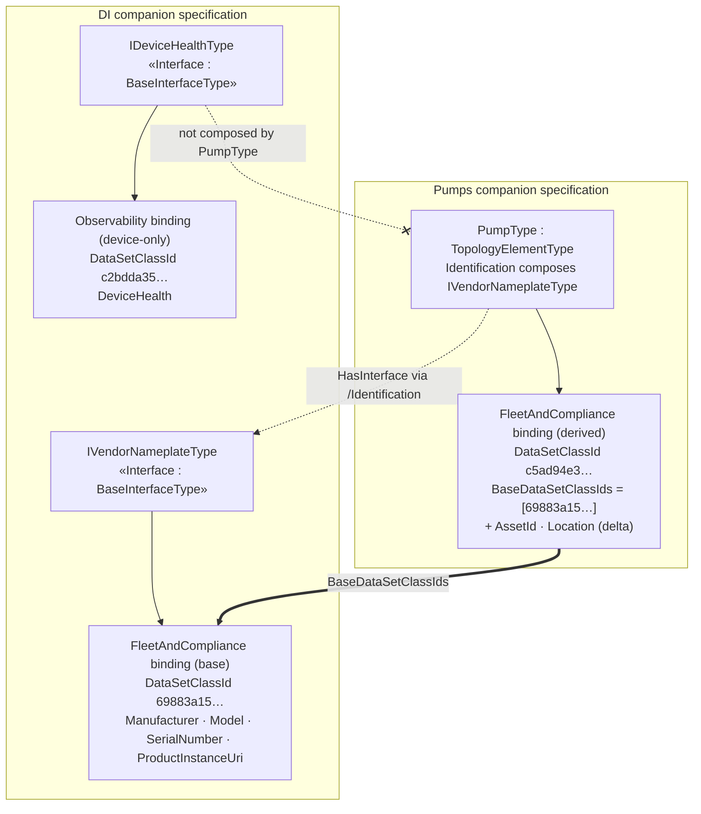

# OPC UA — Scenario Bindings — DI ↔ Pumps inheritance (illustration)

*Non-normative. Companion to the base specification, §5.12 "Binding inheritance and facet
composition". Shows how the Pumps example's `FleetAndCompliance` scenario binding **extends** a DI
scenario binding through OPC UA facet composition. Provisional NodeIds and example namespaces.*

## 1 Why a pump extends a DI scenario

A `PumpType` is a DI `TopologyElementType` (not a `DeviceType`), but every pump carries an
`Identification` object that **composes the DI `IVendorNameplateType` facet** — the interface that
declares the vendor nameplate (`Manufacturer`, `Model`, `SerialNumber`, `ProductInstanceUri`,
`DeviceRevision`, …). Because `HasInterface`/`HasAddIn` composition is one of the three inheritance
axes of §5.12, a scenario binding authored **once** on the DI facet is inherited by *every* type
that composes it — including a pump — which then adds only its own delta fields.

So the DI companion specification owns a small, reusable **`FleetAndCompliance` identity binding on
`IVendorNameplateType`**, and the Pumps companion specification's `FleetAndCompliance` binding is a
**superset**: the DI nameplate fields (inherited) plus pump-specific identity (`AssetId`,
`Location`).

## 2 The base binding — DI `FleetAndCompliance` on `IVendorNameplateType`

Generated overlay: [`Opc.Ua.DI.ScenarioBinding.NodeSet2.xml`](Opc.Ua.DI.ScenarioBinding.NodeSet2.xml),
addendum [`OPC-UA-DI-Scenario-Bindings-Addendum.md`](OPC-UA-DI-Scenario-Bindings-Addendum.md).

| Field | Kind | BrowsePath (facet-relative) |
|---|---|---|
| Manufacturer | Identification | `/Manufacturer` |
| Model | Identification | `/Model` |
| SerialNumber | Identification | `/SerialNumber` |
| ProductInstanceUri | Identification | `/ProductInstanceUri` |

- Scenario: `…/Scenarios/FleetAndCompliance` · Bound target: `http://opcfoundation.org/UA/DI/;IVendorNameplateType`
- **DataSetClassId** `69883a15-1331-51d0-a3be-d453d4547192` (deterministic over
  `ScenarioUri | <ns>;IVendorNameplateType | 1`).

## 3 The derived binding — Pumps `FleetAndCompliance` on `PumpType`

The pump's `Identification` object composes `IVendorNameplateType`, so the pump inherits the four
nameplate fields. Per §5.12 a derived binding **lists only its own delta fields** and references the
base lineage with **`BaseDataSetClassIds`** — it does **not** restate the inherited fields. So the
Pumps `FleetAndCompliance` binding authored on `PumpType` lists just `AssetId` and `Location` and
sets `BaseDataSetClassIds = [69883a15…]`:

| Field authored on the pump binding | BrowsePath | Role |
|---|---|---|
| AssetId | `/Identification/AssetId` | **delta** (pump/Machinery) |
| Location | `/Identification/Location` | **delta** (pump/Machinery) |

At **compose time** a Server/bridge unions this delta with the DI base binding, re-anchoring the DI
facet paths by the mount path of the component that carries the facet — the pump's `Identification`
(§5.12 step 2) — so `/Manufacturer` becomes `/Identification/Manufacturer`, and so on. The four
inherited fields then carry `SourceScenarioBindingClassId = 69883a15…` on the **composed** DataSet,
while `AssetId`/`Location` are the pump's own untagged fields:

| Composed field | Origin | Path on the instance | Provenance on the composed DataSet |
|---|---|---|---|
| Manufacturer | DI base (`IVendorNameplateType`) | `/Identification/Manufacturer` | `SourceScenarioBindingClassId = 69883a15…` |
| Model | DI base | `/Identification/Model` | `SourceScenarioBindingClassId = 69883a15…` |
| SerialNumber | DI base | `/Identification/SerialNumber` | `SourceScenarioBindingClassId = 69883a15…` |
| ProductInstanceUri | DI base | `/Identification/ProductInstanceUri` | `SourceScenarioBindingClassId = 69883a15…` |
| AssetId | pump delta | `/Identification/AssetId` | *(own field — untagged)* |
| Location | pump delta | `/Identification/Location` | *(own field — untagged)* |

- Bound target: `http://opcfoundation.org/UA/Pumps/;PumpType`
- Composed **DataSetClassId** `c5ad94e3-12f1-5fa4-b69f-b8aeaf40106a` · **BaseDataSetClassIds**
  `[69883a15-1331-51d0-a3be-d453d4547192]`.
- Generated overlay (the authored delta binding):
  [`../pumps/Opc.Ua.Pumps.ScenarioBinding.NodeSet2.xml`](../pumps/Opc.Ua.Pumps.ScenarioBinding.NodeSet2.xml).

A subscriber that only knows the DI nameplate class (`69883a15…`) recognizes the four base fields
inside any pump's composed DataSet by their `SourceScenarioBindingClassId`; a subscriber that knows
the pump class (`c5ad94e3…`) additionally consumes `AssetId` and `Location`.

## 4 A DI scenario the pump does **not** inherit

DI also defines an `Observability` binding on the **`IDeviceHealthType`** facet (`DeviceHealth`,
DataSetClassId `c2bdda35…`; see
[`OPC-UA-DIDeviceHealth-Scenario-Bindings-Addendum.md`](OPC-UA-DIDeviceHealth-Scenario-Bindings-Addendum.md)).
A pump does **not** compose `IDeviceHealthType` (it has no `DeviceHealth`), so this scenario is
**device-only** and is not inherited by the Pumps example — inheritance follows the facets a type
actually composes, nothing more.
