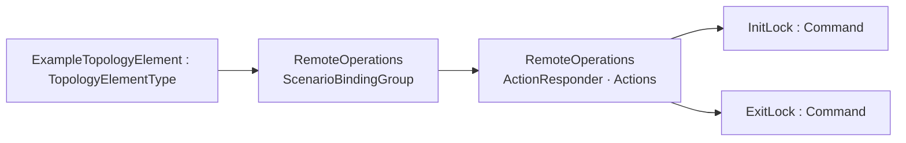
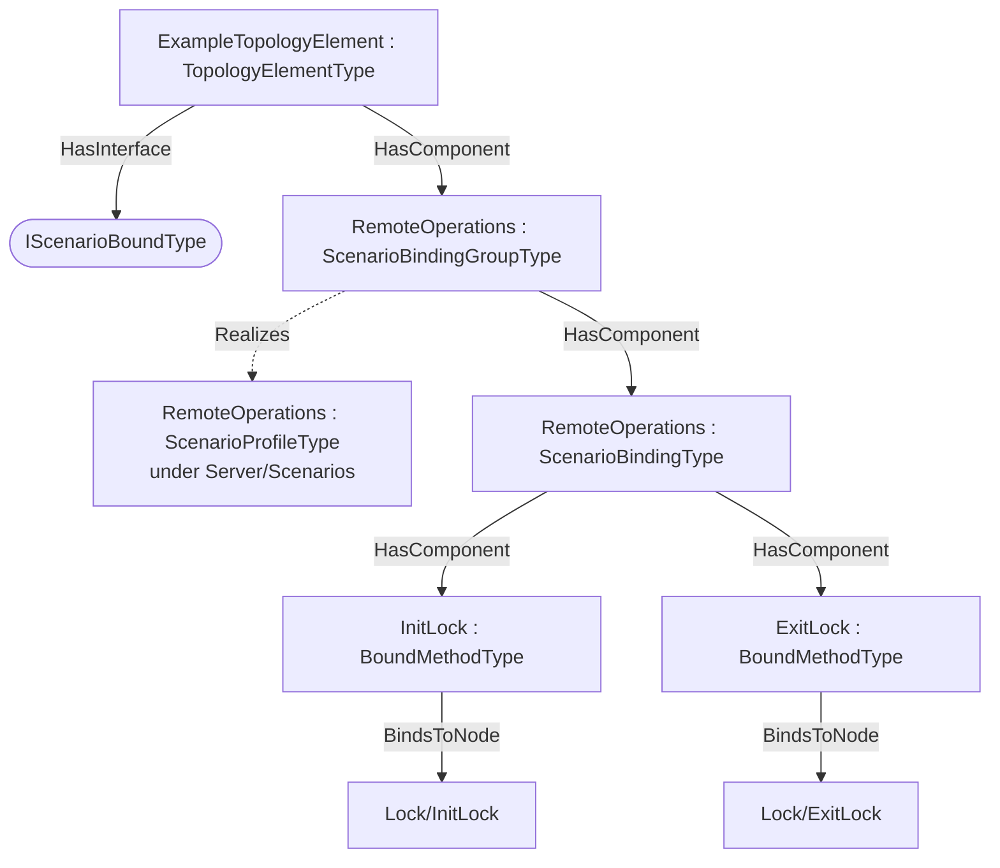

# OPC UA DIOperations — Scenario Bindings Addendum

**Working draft — a worked example of the [Scenario Bindings](../OPC-UA-Scenario-Bindings.md) base specification applied to OPC UA Devices (DI, OPC 10000-100).**

> **Status — illustrative example.** This addendum shows how the instances of the `TopologyElementType` (http://opcfoundation.org/UA/DI/) can be exposed for integration scenarios over the classic client/server (RPC) interface and, optionally, over OPC UA PubSub — without modifying the companion specification. All NodeIds in the example namespace `http://opcfoundation.org/UA/PubSub/Examples/DIOperations/` are provisional and the base-namespace binding types it references (`ScenarioBindingGroupType` etc.) carry the **provisional** NodeIds of the draft base specification.

## 1 Scope

This addendum defines example **scenario bindings** for the `TopologyElementType` — 2 bound items across the scenarios *RemoteOperations* — per the [Scenario Bindings](../OPC-UA-Scenario-Bindings.md) base specification. The DI TopologyElementType exposes device-level operations through the LockingServices addin (Lock/InitLock, Lock/ExitLock). This binding exposes them as an ACTION SET (ContentKind=Actions) under a RemoteOperations scenario: a bridge or operator invokes the Methods (classic Call, or optionally Part 14 Actions/ActionTargets) to lock a device or component for maintenance and release it afterwards. Because the LockingServices Methods are declared on TopologyElementType, EVERY DI topology element - a DeviceType device, a sub-component, and a PumpType (which is a TopologyElementType, not a DeviceType) - inherits this action binding via the subtype axis of §5.12 (see OPC-UA-DI-Pumps-Inheritance.md). This is the worked example showing that a Scenario Binding covers invokable Methods, not just data or event DataSets.

## 2 Normative references

- [Scenario Bindings](../OPC-UA-Scenario-Bindings.md) — the base binding model (types, discovery, the two-layer routing/semantic contract).
- [OPC UA Devices (DI, OPC 10000-100)](https://reference.opcfoundation.org/DI/v104/docs/) — the companion specification whose type is bound.
- [OPC 10000-14](https://reference.opcfoundation.org/specs/OPC-10000-14/) — PubSub (optional realization).

## 3 How the bindings are applied

The bindings are authored at **two levels**, exactly as the base specification recommends:

1. **Type-level definitions (reusable).** The machine-readable descriptor [`DI.Operations.ScenarioBinding.json`](../../../extras/scenario-binding/examples/di/DI.Operations.ScenarioBinding.json) lists each bound item as a `BrowsePath` (RelativePath) from the `TopologyElementType` root, with its routing `Kind` and scenario. Every path in §4 was **resolved against the published companion NodeSet**, so the bindings apply to *any* conforming instance.
2. **Instance overlay (concrete).** [`Opc.Ua.DIOperations.ScenarioBinding.NodeSet2.xml`](Opc.Ua.DIOperations.ScenarioBinding.NodeSet2.xml) instantiates a compact theoretical instance `ExampleTopologyElement`, applies the `IScenarioBoundType` interface, and exposes one `ScenarioBindingGroup` per scenario holding that scenario's `ScenarioBinding`/`BoundItem` instances. On the instance each `BoundItem` uses **`BindsToNode`** to point at the concrete signal node (the type-level `BrowsePath` and the instance `BindsToNode` are the two locators defined by the base specification).

> **Theoretical instance model.** A compact instance of TopologyElementType exposing the inherited LockingServices Methods. The binding's bound items are Methods (BoundMethodType), each with an OwningObjectPath to the Lock object it is called on - contrast the data/event DI examples (nameplate FleetAndCompliance, device-health Observability), whose bound items are Variables or event fields.

Only the bound signals are materialised in the overlay; it is an *illustrative* instance, not a conformant full instance of the companion type.

## 4 Scenario bindings for `TopologyElementType`

Bindings for the `TopologyElementType` of the `http://opcfoundation.org/UA/DI/` companion specification, per the [Scenario Bindings](../OPC-UA-Scenario-Bindings.md) base specification. Each binding is **one content class** — a data DataSet, an event DataSet, or an action set — with a deterministic `DataSetClassId`. Every data and Method `BrowsePath` below was resolved against the published companion NodeSet; event-DataSet fields select standard event-type fields.

#### Scenario: RemoteOperations

*URI:* `http://opcfoundation.org/UA/PubSub/Scenarios/RemoteOperations` · *Direction:* ActionResponder · *Content:* action set (Part 14 Actions/ActionTargets) · *DataSetClassId:* `3061c066-ed80-5aa5-ab02-0feb85745f2a` · *Cardinality:* one action target (bound root)

| Field | Kind | Method BrowsePath | Owning object |
|---|---|---|---|
| InitLock | Command | `/Lock/InitLock` | `/Lock` |
| ExitLock | Command | `/Lock/ExitLock` | `/Lock` |

## 5 Where the bindings live

Overview of the scenario bindings, then their placement on the theoretical instance (one `ScenarioBindingGroup` per scenario hangs off the instance; each `BoundItem` `BindsToNode` its signal):

## 6 Deliverables

| File | Content |
|---|---|
| [`DI.Operations.ScenarioBinding.json`](../../../extras/scenario-binding/examples/di/DI.Operations.ScenarioBinding.json) | Machine-readable ScenarioBindingConfiguration descriptor (single source). |
| [`Opc.Ua.DIOperations.ScenarioBinding.NodeSet2.xml`](Opc.Ua.DIOperations.ScenarioBinding.NodeSet2.xml) | The binding instances on the theoretical `ExampleTopologyElement` instance. |

Regenerate from `extras/scenario-binding/examples/` with `python tools/build_bindings.py di/DI.Operations.ScenarioBinding.json`.

