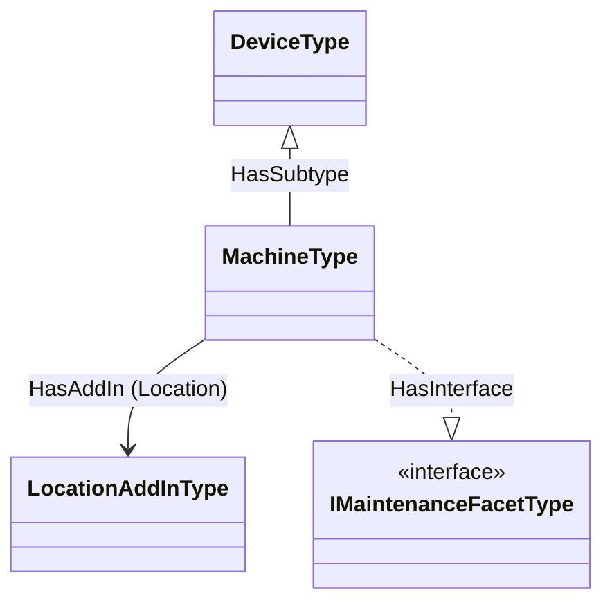

# OPC UA — Scenario Bindings — Facets & Inheritance Addendum

*Non-normative. Companion to the base specification, section “Binding inheritance and facet composition” (§5.12). Generated by `build_facets_example.py` from the self-contained `Opc.Ua.FacetDemo.NodeSet2.xml` model.*

## 1. The model

A `MachineType` reuses base-facet scenario bindings across **all three** OPC UA composition axes, instead of restating their fields:

- **subtype** — `MachineType` *is-a* `DeviceType`, so it inherits the **Device Observability** binding;
- **AddIn** — `MachineType` *composes* a `Location` block (`HasAddIn` → `LocationAddInType`), so it composes the **Location Observability** binding;
- **interface** — `MachineType` *implements* `IMaintenanceFacetType` (`HasInterface`), so it inherits the **Maintenance** binding.

## 2. Base facet bindings

Each facet defines its scenario binding **once**, on its own type:

| Binding | Defined on (axis) | Scenario | `DataSetClassId` | Fields |
|---|---|---|---|---|
| **DeviceObservability** | `DeviceType` — ObjectType (subtype base) | Observability | `f521e631…` | `Manufacturer`, `SerialNumber`, `DeviceHealth` |
| **LocationObservability** | `LocationAddInType` — AddIn (structural facet) | Observability | `ef3c6168…` | `Latitude`, `Longitude`, `Altitude` |
| **Maintenance** | `IMaintenanceFacetType` — Interface (contract facet) | Maintenance | `ca4e2134…` | `LastMaintenanceDate` |

## 3. Derived bindings — delta only

A derived binding lists **only its added (delta) fields** and references the base classes it builds on via `BaseDataSetClassIds` (and, where the base node is local, `HasBaseBinding`). It never restates or removes an inherited field, so its DataSet is always a **superset** of each base.

| Derived binding | Scenario | Own `DataSetClassId` | Delta fields | `BaseDataSetClassIds` |
|---|---|---|---|---|
| **MachineObservability** | Observability | `53abb5ef…` | `SpindleSpeed`, `AxisLoad` · overrides `DeviceHealth` | `f521e631…`, `ef3c6168…` |
| **MachineMaintenance** | Maintenance | `051beb56…` | *(none — pure inheritance)* | `ca4e2134…` |

## 4. What the bridge produces — the composed DataSets

A bridge composes the effective DataSet for `MachineType` + a scenario by **unioning** the bindings reachable via subtype, `HasAddIn` and `HasInterface` (override by `FieldName`), re-rooting each base facet's BrowsePaths under its mount point (the AddIn is mounted at `/Location`), and tagging every field with the `SourceScenarioBindingClassId` of the base binding it came from. The composed DataSet keeps `MachineType`'s own `DataSetClassId` and advertises the contributing base classes in `BaseDataSetClassIds`.

### 4.1 `MachineObservability` — Observability DataSet (8 fields, class `53abb5ef…`)

| Field | Resolved BrowsePath (on a Machine instance) | From facet | Provenance `SourceScenarioBindingClassId` | Note |
|---|---|---|---|---|
| `Manufacturer` | `/Manufacturer` | DeviceObservability | `f521e631…` | inherited |
| `SerialNumber` | `/SerialNumber` | DeviceObservability | `f521e631…` | inherited |
| `DeviceHealth` | `/DeviceHealth` | DeviceObservability | `f521e631…` | overrides base field |
| `Latitude` | `/Location/Latitude` | LocationObservability | `ef3c6168…` | inherited |
| `Longitude` | `/Location/Longitude` | LocationObservability | `ef3c6168…` | inherited |
| `Altitude` | `/Location/Altitude` | LocationObservability | `ef3c6168…` | inherited |
| `SpindleSpeed` | `/SpindleSpeed` | MachineObservability | — | own field |
| `AxisLoad` | `/AxisLoad` | MachineObservability | — | own field |

### 4.2 `MachineMaintenance` — Maintenance DataSet (1 fields, class `051beb56…`)

| Field | Resolved BrowsePath (on a Machine instance) | From facet | Provenance `SourceScenarioBindingClassId` | Note |
|---|---|---|---|---|
| `LastMaintenanceDate` | `/LastMaintenanceDate` | Maintenance | `ca4e2134…` | inherited |

## 5. Facet-scoped subset recognition

A semantics-agnostic subscriber that understands only a **base facet** recognises the base `DataSetClassId` in the composed DataSet's `BaseDataSetClassIds` and consumes exactly the fields tagged with that class in `SourceScenarioBindingClassId` — without understanding `MachineType`:

- A **DeviceObservability** subscriber (knows `f521e631…`) selects 3 of 8 fields: `Manufacturer`, `SerialNumber`, `DeviceHealth`.
- A **LocationObservability** subscriber (knows `ef3c6168…`) selects 3 of 8 fields: `Latitude`, `Longitude`, `Altitude`.
- A subscriber that understands the full `MachineObservability` class (`53abb5ef…`) consumes all 8 fields.

## 6. Where the binding nodes live

`Opc.Ua.Facets.ScenarioBinding.NodeSet2.xml` in this folder shows the four base bindings and the two derived bindings under one `ScenarioBindingGroup` (`FacetDemo`) for readability. In a real Server each facet's binding is exposed on that facet type's own `ScenarioBindings` container (Device on `DeviceType`, Location on `LocationAddInType`, Maintenance on `IMaintenanceFacetType`); a `MachineType` instance's container exposes the derived bindings, which the Server/bridge composes with the inherited/AddIn/interface bindings at resolve time per §5.12. NodeIds and the example namespace are provisional.

