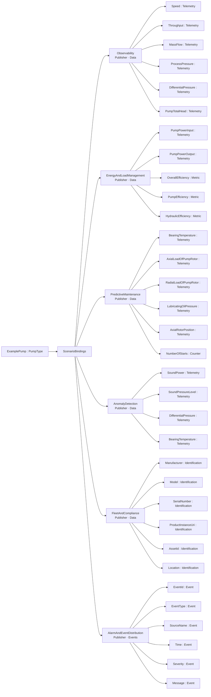
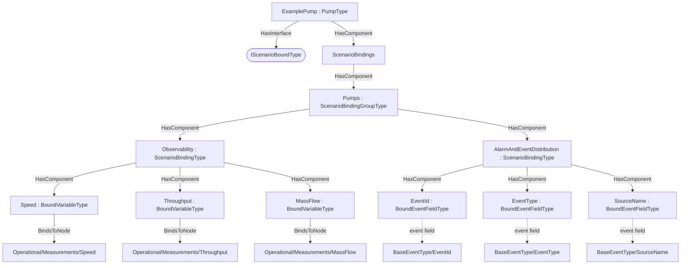

# OPC UA Pumps — Scenario Bindings Addendum

**Working draft — a worked example of the [Scenario Bindings](../../OPC-UA-Scenario-Bindings.md) base specification applied to OPC UA for Pumps and Vacuum Pumps.**

> **Status — illustrative example.** This addendum shows how the instances of the `PumpType` (http://opcfoundation.org/UA/Pumps/) can be exposed for integration scenarios over the classic client/server (RPC) interface and, optionally, over OPC UA PubSub — without modifying the companion specification. All NodeIds in the example namespace `http://opcfoundation.org/UA/PubSub/Examples/Pumps/` are provisional and the base-namespace binding types it references (`ScenarioBindingsType` etc.) carry the **provisional** NodeIds of the draft base specification.

## 1 Scope

This addendum defines example **scenario bindings** for the `PumpType` — 37 bound items across the scenarios *Observability, EnergyAndLoadManagement, PredictiveMaintenance, AnomalyDetection, FleetAndCompliance, AlarmAndEventDistribution* — per the [Scenario Bindings](../../OPC-UA-Scenario-Bindings.md) base specification. Pumps expose rich operational telemetry (flow, head, pressure, power, temperatures, efficiencies, rotor loads) plus identity and maintenance data, so most industrial scenarios map cleanly onto the pump measurement model.

## 2 Normative references

- [Scenario Bindings](../../OPC-UA-Scenario-Bindings.md) — the base binding model (types, discovery, the two-layer routing/semantic contract).
- [OPC UA for Pumps and Vacuum Pumps](https://reference.opcfoundation.org/Pumps/v100/docs/) — the companion specification whose type is bound.
- [OPC 10000-14](https://reference.opcfoundation.org/specs/OPC-10000-14/) — PubSub (optional realization).

## 3 How the bindings are applied

The bindings are authored at **two levels**, exactly as the base specification recommends:

1. **Type-level definitions (reusable).** The machine-readable descriptor [`Pumps.ScenarioBinding.json`](Pumps.ScenarioBinding.json) lists each bound item as a `BrowsePath` (RelativePath) from the `PumpType` root, with its routing `Kind` and scenario. Every path in §4 was **resolved against the published companion NodeSet**, so the bindings apply to *any* conforming instance.
2. **Instance overlay (concrete).** [`Opc.Ua.Pumps.ScenarioBinding.NodeSet2.xml`](Opc.Ua.Pumps.ScenarioBinding.NodeSet2.xml) instantiates a compact theoretical instance `ExamplePump`, applies the `IScenarioBoundType` interface, and hangs a `ScenarioBindings` container holding the `ScenarioBinding`/`BoundItem` instances. On the instance each `BoundItem` uses **`BindsToNode`** to point at the concrete signal node (the type-level `BrowsePath` and the instance `BindsToNode` are the two locators defined by the base specification).

> **Theoretical instance model.** The theoretical instance mirrors the official Pumps `instanceexample.xml` (an `ExamplePump : PumpType` with `Operational/Measurements`, `Identification`, `Supervision*`, `Maintenance` and a `<Drive>`); the bound BrowsePaths resolve against exactly that structure. See the reference model: [Pumps/instanceexample.xml](https://github.com/OPCFoundation/UA-Nodeset/blob/latest/Pumps/instanceexample.xml).

Only the bound signals are materialised in the overlay; it is an *illustrative* instance, not a conformant full instance of the companion type.

## 4 Scenario bindings for `PumpType`

Bindings for the `PumpType` of the `http://opcfoundation.org/UA/Pumps/` companion specification, per the [Scenario Bindings](../../OPC-UA-Scenario-Bindings.md) base specification. Each binding is **one Part 14 DataSet** with a deterministic `DataSetClassId`. Every data-DataSet `BrowsePath` below was resolved against the published companion NodeSet; event-DataSet fields select standard event-type fields.

#### Scenario: Observability

*URI:* `http://opcfoundation.org/UA/PubSub/Scenarios/Observability` · *Direction:* Publisher · *Content:* data DataSet (PublishedDataItems) · *DataSetClassId:* `96490f93-6c92-59cd-981d-4203ab067313` · *Cardinality:* one DataSet (bound root)

| Field | Kind | BrowsePath | Source type | DataType |
|---|---|---|---|---|
| Speed | Telemetry | `/Operational/Measurements/Speed` | [BaseAnalogType](https://reference.opcfoundation.org/specs/OPC-10000-8/5.3.2) | Double |
| Throughput | Telemetry | `/Operational/Measurements/Throughput` | [BaseAnalogType](https://reference.opcfoundation.org/specs/OPC-10000-8/5.3.2) | Double |
| MassFlow | Telemetry | `/Operational/Measurements/MassFlow` | [BaseAnalogType](https://reference.opcfoundation.org/specs/OPC-10000-8/5.3.2) | Double |
| ProcessPressure | Telemetry | `/Operational/Measurements/ProcessPressure` | [BaseAnalogType](https://reference.opcfoundation.org/specs/OPC-10000-8/5.3.2) | Double |
| DifferentialPressure | Telemetry | `/Operational/Measurements/DifferentialPressure` | [BaseAnalogType](https://reference.opcfoundation.org/specs/OPC-10000-8/5.3.2) | Double |
| PumpTotalHead | Telemetry | `/Operational/Measurements/PumpTotalHead` | [BaseAnalogType](https://reference.opcfoundation.org/specs/OPC-10000-8/5.3.2) | Double |
| PumpPowerInput | Telemetry | `/Operational/Measurements/PumpPowerInput` | [BaseAnalogType](https://reference.opcfoundation.org/specs/OPC-10000-8/5.3.2) | Double |
| FluidTemperature | Telemetry | `/Operational/Measurements/FluidTemperature` | [BaseAnalogType](https://reference.opcfoundation.org/specs/OPC-10000-8/5.3.2) | Double |
| BearingTemperature | Telemetry | `/Operational/Measurements/BearingTemperature` | [BaseAnalogType](https://reference.opcfoundation.org/specs/OPC-10000-8/5.3.2) | Double |
| PumpTemperature | Telemetry | `/Operational/Measurements/PumpTemperature` | [BaseAnalogType](https://reference.opcfoundation.org/specs/OPC-10000-8/5.3.2) | Double |

#### Scenario: EnergyAndLoadManagement

*URI:* `http://opcfoundation.org/UA/PubSub/Scenarios/EnergyAndLoadManagement` · *Direction:* Publisher · *Content:* data DataSet (PublishedDataItems) · *DataSetClassId:* `605ca065-f5d7-5400-a9fe-995d21ad75ce` · *Cardinality:* one DataSet (bound root)

| Field | Kind | BrowsePath | Source type | DataType |
|---|---|---|---|---|
| PumpPowerInput | Telemetry | `/Operational/Measurements/PumpPowerInput` | [BaseAnalogType](https://reference.opcfoundation.org/specs/OPC-10000-8/5.3.2) | Double |
| PumpPowerOutput | Telemetry | `/Operational/Measurements/PumpPowerOutput` | [BaseAnalogType](https://reference.opcfoundation.org/specs/OPC-10000-8/5.3.2) | Double |
| OverallEfficiency | Metric | `/Operational/Measurements/OverallEfficiency` | [BaseAnalogType](https://reference.opcfoundation.org/specs/OPC-10000-8/5.3.2) | Double |
| PumpEfficiency | Metric | `/Operational/Measurements/PumpEfficiency` | [BaseAnalogType](https://reference.opcfoundation.org/specs/OPC-10000-8/5.3.2) | Double |
| HydraulicEfficiency | Metric | `/Operational/Measurements/HydraulicEfficiency` | [BaseAnalogType](https://reference.opcfoundation.org/specs/OPC-10000-8/5.3.2) | Double |

#### Scenario: PredictiveMaintenance

*URI:* `http://opcfoundation.org/UA/PubSub/Scenarios/PredictiveMaintenance` · *Direction:* Publisher · *Content:* data DataSet (PublishedDataItems) · *DataSetClassId:* `a96b90d3-7b07-55d8-8343-9c7e4df85bab` · *Cardinality:* one DataSet (bound root)

| Field | Kind | BrowsePath | Source type | DataType |
|---|---|---|---|---|
| BearingTemperature | Telemetry | `/Operational/Measurements/BearingTemperature` | [BaseAnalogType](https://reference.opcfoundation.org/specs/OPC-10000-8/5.3.2) | Double |
| AxialLoadOfPumpRotor | Telemetry | `/Operational/Measurements/AxialLoadOfPumpRotor` | [BaseAnalogType](https://reference.opcfoundation.org/specs/OPC-10000-8/5.3.2) | Double |
| RadialLoadOfPumpRotor | Telemetry | `/Operational/Measurements/RadialLoadOfPumpRotor` | [BaseAnalogType](https://reference.opcfoundation.org/specs/OPC-10000-8/5.3.2) | Double |
| LubricatingOilPressure | Telemetry | `/Operational/Measurements/LubricatingOilPressure` | [BaseAnalogType](https://reference.opcfoundation.org/specs/OPC-10000-8/5.3.2) | Double |
| AxialRotorPosition | Telemetry | `/Operational/Measurements/AxialRotorPosition` | [BaseAnalogType](https://reference.opcfoundation.org/specs/OPC-10000-8/5.3.2) | Double |
| NumberOfStarts | Counter | `/Operational/Measurements/NumberOfStarts` | [BaseAnalogType](https://reference.opcfoundation.org/specs/OPC-10000-8/5.3.2) | UInt32 |

#### Scenario: AnomalyDetection

*URI:* `http://opcfoundation.org/UA/PubSub/Scenarios/AnomalyDetection` · *Direction:* Publisher · *Content:* data DataSet (PublishedDataItems) · *DataSetClassId:* `d4eb3d5b-5ffb-580e-b96f-142cb3f998ad` · *Cardinality:* one DataSet (bound root)

| Field | Kind | BrowsePath | Source type | DataType |
|---|---|---|---|---|
| SoundPower | Telemetry | `/Operational/Measurements/SoundPower` | [BaseAnalogType](https://reference.opcfoundation.org/specs/OPC-10000-8/5.3.2) | Double |
| SoundPressureLevel | Telemetry | `/Operational/Measurements/SoundPressureLevel` | [BaseAnalogType](https://reference.opcfoundation.org/specs/OPC-10000-8/5.3.2) | Double |
| DifferentialPressure | Telemetry | `/Operational/Measurements/DifferentialPressure` | [BaseAnalogType](https://reference.opcfoundation.org/specs/OPC-10000-8/5.3.2) | Double |
| BearingTemperature | Telemetry | `/Operational/Measurements/BearingTemperature` | [BaseAnalogType](https://reference.opcfoundation.org/specs/OPC-10000-8/5.3.2) | Double |

#### Scenario: FleetAndCompliance

*URI:* `http://opcfoundation.org/UA/PubSub/Scenarios/FleetAndCompliance` · *Direction:* Publisher · *Content:* data DataSet (PublishedDataItems) · *DataSetClassId:* `c5ad94e3-12f1-5fa4-b69f-b8aeaf40106a` · *Cardinality:* one DataSet (bound root)

| Field | Kind | BrowsePath | Source type | DataType |
|---|---|---|---|---|
| Manufacturer | Identification | `/Identification/Manufacturer` | [PropertyType](https://reference.opcfoundation.org/specs/OPC-10000-5/7.3) | LocalizedText |
| Model | Identification | `/Identification/Model` | [PropertyType](https://reference.opcfoundation.org/specs/OPC-10000-5/7.3) | LocalizedText |
| SerialNumber | Identification | `/Identification/SerialNumber` | [PropertyType](https://reference.opcfoundation.org/specs/OPC-10000-5/7.3) | String |
| ProductInstanceUri | Identification | `/Identification/ProductInstanceUri` | [PropertyType](https://reference.opcfoundation.org/specs/OPC-10000-5/7.3) | String |
| AssetId | Identification | `/Identification/AssetId` | [PropertyType](https://reference.opcfoundation.org/specs/OPC-10000-5/7.3) | String |
| Location | Identification | `/Identification/Location` | [PropertyType](https://reference.opcfoundation.org/specs/OPC-10000-5/7.3) | String |

#### Scenario: AlarmAndEventDistribution

*URI:* `http://opcfoundation.org/UA/PubSub/Scenarios/AlarmAndEventDistribution` · *Direction:* Publisher · *Content:* event DataSet (PublishedEvents) · *DataSetClassId:* `700f61a4-4e97-52ed-b72e-f085d406ced9` · *Cardinality:* one DataSet (bound root) · *Event source:* `/` · *Event type:* BaseEventType

| Field | Kind | Event field (of the event type) |
|---|---|---|
| EventId | Event | `/EventId` |
| EventType | Event | `/EventType` |
| SourceName | Event | `/SourceName` |
| Time | Event | `/Time` |
| Severity | Event | `/Severity` |
| Message | Event | `/Message` |

## 5 Where the bindings live

Overview of the scenario bindings, then their placement on the theoretical instance (`ScenarioBindings` hangs off the instance; each `BoundItem` `BindsToNode` its signal):

## 6 Deliverables

| File | Content |
|---|---|
| [`Pumps.ScenarioBinding.json`](Pumps.ScenarioBinding.json) | Machine-readable ScenarioBindingConfiguration descriptor (single source). |
| [`Opc.Ua.Pumps.ScenarioBinding.NodeSet2.xml`](Opc.Ua.Pumps.ScenarioBinding.NodeSet2.xml) | The binding instances on the theoretical `ExamplePump` instance. |

Regenerate with `python ../tools/build_bindings.py pumps/Pumps.ScenarioBinding.json`.

