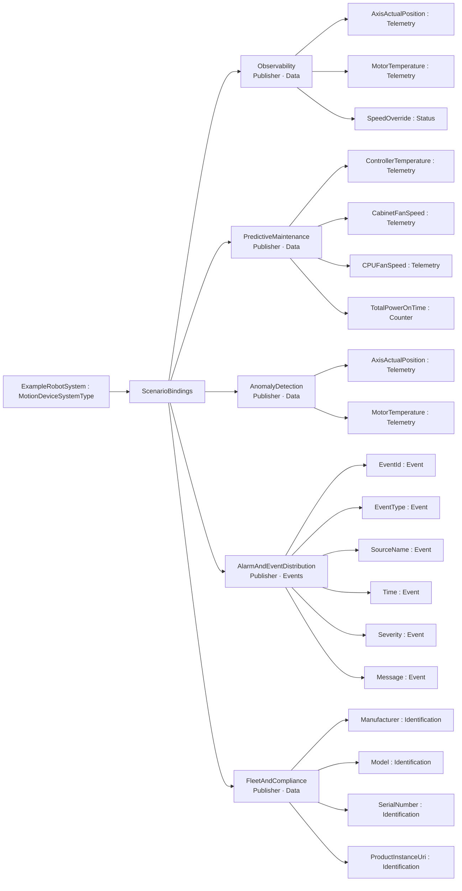
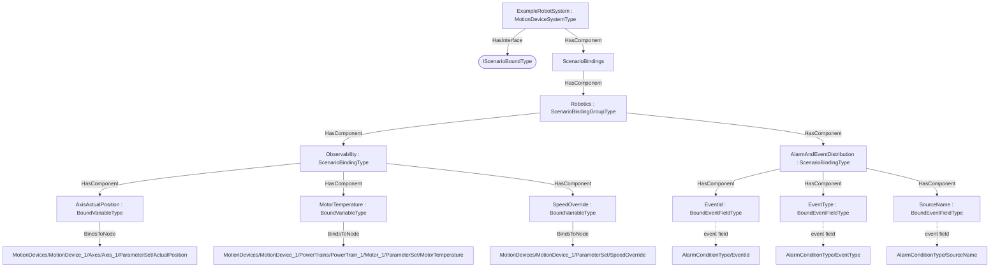

# OPC UA Robotics — Scenario Bindings Addendum

**Working draft — a worked example of the [Scenario Bindings](../../OPC-UA-Scenario-Bindings.md) base specification applied to OPC UA for Robotics (OPC 40010).**

> **Status — illustrative example.** This addendum shows how the instances of the `MotionDeviceSystemType` (http://opcfoundation.org/UA/Robotics/) can be exposed for integration scenarios over the classic client/server (RPC) interface and, optionally, over OPC UA PubSub — without modifying the companion specification. All NodeIds in the example namespace `http://opcfoundation.org/UA/PubSub/Examples/Robotics/` are provisional and the base-namespace binding types it references (`ScenarioBindingsType` etc.) carry the **provisional** NodeIds of the draft base specification.

## 1 Scope

This addendum defines example **scenario bindings** for the `MotionDeviceSystemType` — 19 bound items across the scenarios *Observability, PredictiveMaintenance, AnomalyDetection, AlarmAndEventDistribution, FleetAndCompliance* — per the [Scenario Bindings](../../OPC-UA-Scenario-Bindings.md) base specification. Robotics is structured around motion devices, axes, power trains, controllers and safety states with state machines, so scenarios lean on axis/motor telemetry, controller thermals, safety status and nameplate identity rather than a flat measurement model.

## 2 Normative references

- [Scenario Bindings](../../OPC-UA-Scenario-Bindings.md) — the base binding model (types, discovery, the two-layer routing/semantic contract).
- [OPC UA for Robotics (OPC 40010)](https://reference.opcfoundation.org/Robotics/v100/docs/) — the companion specification whose type is bound.
- [OPC 10000-14](https://reference.opcfoundation.org/specs/OPC-10000-14/) — PubSub (optional realization).

## 3 How the bindings are applied

The bindings are authored at **two levels**, exactly as the base specification recommends:

1. **Type-level definitions (reusable).** The machine-readable descriptor [`Robotics.ScenarioBinding.json`](Robotics.ScenarioBinding.json) lists each bound item as a `BrowsePath` (RelativePath) from the `MotionDeviceSystemType` root, with its routing `Kind` and scenario. Every path in §4 was **resolved against the published companion NodeSet**, so the bindings apply to *any* conforming instance.
2. **Instance overlay (concrete).** [`Opc.Ua.Robotics.ScenarioBinding.NodeSet2.xml`](Opc.Ua.Robotics.ScenarioBinding.NodeSet2.xml) instantiates a compact theoretical instance `ExampleRobotSystem`, applies the `IScenarioBoundType` interface, and hangs a `ScenarioBindings` container holding the `ScenarioBinding`/`BoundItem` instances. On the instance each `BoundItem` uses **`BindsToNode`** to point at the concrete signal node (the type-level `BrowsePath` and the instance `BindsToNode` are the two locators defined by the base specification).

> **Theoretical instance model.** Robotics publishes no public instance example, so a compact theoretical `MotionDeviceSystem` is synthesised: one MotionDevice with an Axis and a PowerTrain/Motor, one Controller, and one SafetyState. Placeholder path segments (e.g. `<AxisIdentifier>`) become concrete instance names (e.g. `Axis_1`) in the overlay while the type-level BrowsePath keeps the placeholder.

Only the bound signals are materialised in the overlay; it is an *illustrative* instance, not a conformant full instance of the companion type.

## 4 Scenario bindings for `MotionDeviceSystemType`

Bindings for the `MotionDeviceSystemType` of the `http://opcfoundation.org/UA/Robotics/` companion specification, per the [Scenario Bindings](../../OPC-UA-Scenario-Bindings.md) base specification. Each binding is **one Part 14 DataSet** with a deterministic `DataSetClassId`. Every data-DataSet `BrowsePath` below was resolved against the published companion NodeSet; event-DataSet fields select standard event-type fields.

#### Scenario: Observability

*URI:* `http://opcfoundation.org/UA/PubSub/Scenarios/Observability` · *Direction:* Publisher · *Content:* data DataSet (PublishedDataItems) · *DataSetClassId:* `ad751dd8-3b2d-5599-8cce-4be80dc0f8b8` · *Cardinality:* one DataSet per `/MotionDevices/<MotionDeviceIdentifier>`

| Field | Kind | BrowsePath | Source type | DataType |
|---|---|---|---|---|
| AxisActualPosition | Telemetry | `/MotionDevices/<MotionDeviceIdentifier>/Axes/<AxisIdentifier>/ParameterSet/ActualPosition` | [AnalogUnitType](https://reference.opcfoundation.org/specs/OPC-10000-8/5.3.4) | Double |
| MotorTemperature | Telemetry | `/MotionDevices/<MotionDeviceIdentifier>/PowerTrains/<PowerTrainIdentifier>/<MotorIdentifier>/ParameterSet/MotorTemperature` | [AnalogUnitType](https://reference.opcfoundation.org/specs/OPC-10000-8/5.3.4) | Double |
| SpeedOverride | Status | `/MotionDevices/<MotionDeviceIdentifier>/ParameterSet/SpeedOverride` | [BaseDataVariableType](https://reference.opcfoundation.org/specs/OPC-10000-5/7.4) | Double |

#### Scenario: PredictiveMaintenance

*URI:* `http://opcfoundation.org/UA/PubSub/Scenarios/PredictiveMaintenance` · *Direction:* Publisher · *Content:* data DataSet (PublishedDataItems) · *DataSetClassId:* `fccc95e4-e8b3-5b20-82b1-c5fdcb30f53a` · *Cardinality:* one DataSet per `/Controllers/<ControllerIdentifier>`

| Field | Kind | BrowsePath | Source type | DataType |
|---|---|---|---|---|
| ControllerTemperature | Telemetry | `/Controllers/<ControllerIdentifier>/ParameterSet/Temperature` | [AnalogUnitType](https://reference.opcfoundation.org/specs/OPC-10000-8/5.3.4) | Double |
| CabinetFanSpeed | Telemetry | `/Controllers/<ControllerIdentifier>/ParameterSet/CabinetFanSpeed` | [AnalogUnitType](https://reference.opcfoundation.org/specs/OPC-10000-8/5.3.4) | Double |
| CPUFanSpeed | Telemetry | `/Controllers/<ControllerIdentifier>/ParameterSet/CPUFanSpeed` | [AnalogUnitType](https://reference.opcfoundation.org/specs/OPC-10000-8/5.3.4) | Double |
| TotalPowerOnTime | Counter | `/Controllers/<ControllerIdentifier>/ParameterSet/TotalPowerOnTime` | [BaseDataVariableType](https://reference.opcfoundation.org/specs/OPC-10000-5/7.4) | i=12879 |

#### Scenario: AnomalyDetection

*URI:* `http://opcfoundation.org/UA/PubSub/Scenarios/AnomalyDetection` · *Direction:* Publisher · *Content:* data DataSet (PublishedDataItems) · *DataSetClassId:* `4fa76f85-fefb-5a6d-a699-e5e3298c769e` · *Cardinality:* one DataSet per `/MotionDevices/<MotionDeviceIdentifier>`

| Field | Kind | BrowsePath | Source type | DataType |
|---|---|---|---|---|
| AxisActualPosition | Telemetry | `/MotionDevices/<MotionDeviceIdentifier>/Axes/<AxisIdentifier>/ParameterSet/ActualPosition` | [AnalogUnitType](https://reference.opcfoundation.org/specs/OPC-10000-8/5.3.4) | Double |
| MotorTemperature | Telemetry | `/MotionDevices/<MotionDeviceIdentifier>/PowerTrains/<PowerTrainIdentifier>/<MotorIdentifier>/ParameterSet/MotorTemperature` | [AnalogUnitType](https://reference.opcfoundation.org/specs/OPC-10000-8/5.3.4) | Double |

#### Scenario: AlarmAndEventDistribution

*URI:* `http://opcfoundation.org/UA/PubSub/Scenarios/AlarmAndEventDistribution` · *Direction:* Publisher · *Content:* event DataSet (PublishedEvents) · *DataSetClassId:* `47b98390-ae81-5a82-82e3-39258ce1a49b` · *Cardinality:* one DataSet (bound root) · *Event source:* `/` · *Event type:* AlarmConditionType

| Field | Kind | Event field (of the event type) |
|---|---|---|
| EventId | Event | `/EventId` |
| EventType | Event | `/EventType` |
| SourceName | Event | `/SourceName` |
| Time | Event | `/Time` |
| Severity | Event | `/Severity` |
| Message | Event | `/Message` |

#### Scenario: FleetAndCompliance

*URI:* `http://opcfoundation.org/UA/PubSub/Scenarios/FleetAndCompliance` · *Direction:* Publisher · *Content:* data DataSet (PublishedDataItems) · *DataSetClassId:* `f366c644-8670-57a3-b838-dd492b1f82b0` · *Cardinality:* one DataSet (bound root)

| Field | Kind | BrowsePath | Source type | DataType |
|---|---|---|---|---|
| Manufacturer | Identification | `/Manufacturer` | [PropertyType](https://reference.opcfoundation.org/specs/OPC-10000-5/7.3) | LocalizedText |
| Model | Identification | `/Model` | [PropertyType](https://reference.opcfoundation.org/specs/OPC-10000-5/7.3) | LocalizedText |
| SerialNumber | Identification | `/SerialNumber` | [PropertyType](https://reference.opcfoundation.org/specs/OPC-10000-5/7.3) | String |
| ProductInstanceUri | Identification | `/ProductInstanceUri` | [PropertyType](https://reference.opcfoundation.org/specs/OPC-10000-5/7.3) | String |

## 5 Where the bindings live

Overview of the scenario bindings, then their placement on the theoretical instance (`ScenarioBindings` hangs off the instance; each `BoundItem` `BindsToNode` its signal):

## 6 BrowsePath resolution — worked examples

The type-level bindings above use placeholder BrowsePaths. A bridge resolves them against a concrete instance (via `TranslateBrowsePathsToNodeIds`) and produces **one DataSet per matched instance of each binding's cardinality anchor** (`DataSetCardinalityPath`); placeholders **below** the anchor become fields, their name disambiguated by the matched instance (per §5.10 of the base spec). The `DataSetClassId` is identical for every DataSet of a scenario — it names the *class*, of which there are many DataSetWriters. The same bindings resolve differently for different instance topologies:

### Topology 1: Single 6-axis articulated robot

*MotionDevices:* Robot_1 (6 axes, 6 motors) · *Controllers:* Controller_1

| Scenario | DataSet (cardinality instance) | # fields | Example fields |
|---|---|---|---|
| Observability | Robot_1 | 13 | AxisActualPosition_Axis_1, AxisActualPosition_Axis_2, AxisActualPosition_Axis_3, AxisActualPosition_Axis_4 … |
| PredictiveMaintenance | Controller_1 | 4 | ControllerTemperature, CabinetFanSpeed, CPUFanSpeed, TotalPowerOnTime |
| AnomalyDetection | Robot_1 | 12 | AxisActualPosition_Axis_1, AxisActualPosition_Axis_2, AxisActualPosition_Axis_3, AxisActualPosition_Axis_4 … |
| AlarmAndEventDistribution | ExampleRobotSystem | 6 | EventId, EventType, SourceName, Time … |
| FleetAndCompliance | ExampleRobotSystem | 4 | Manufacturer, Model, SerialNumber, ProductInstanceUri |

→ **5 DataSets** produced by the bridge for this topology.

### Topology 2: Single 4-axis SCARA

*MotionDevices:* Scara_1 (4 axes, 4 motors) · *Controllers:* Controller_1

| Scenario | DataSet (cardinality instance) | # fields | Example fields |
|---|---|---|---|
| Observability | Scara_1 | 9 | AxisActualPosition_Axis_1, AxisActualPosition_Axis_2, AxisActualPosition_Axis_3, AxisActualPosition_Axis_4 … |
| PredictiveMaintenance | Controller_1 | 4 | ControllerTemperature, CabinetFanSpeed, CPUFanSpeed, TotalPowerOnTime |
| AnomalyDetection | Scara_1 | 8 | AxisActualPosition_Axis_1, AxisActualPosition_Axis_2, AxisActualPosition_Axis_3, AxisActualPosition_Axis_4 … |
| AlarmAndEventDistribution | ExampleRobotSystem | 6 | EventId, EventType, SourceName, Time … |
| FleetAndCompliance | ExampleRobotSystem | 4 | Manufacturer, Model, SerialNumber, ProductInstanceUri |

→ **5 DataSets** produced by the bridge for this topology.

### Topology 3: Two-robot cell (6+4 axes)

*MotionDevices:* Robot_1 (6 axes, 6 motors), Robot_2 (4 axes, 4 motors) · *Controllers:* Controller_1

| Scenario | DataSet (cardinality instance) | # fields | Example fields |
|---|---|---|---|
| Observability | Robot_1 | 13 | AxisActualPosition_Axis_1, AxisActualPosition_Axis_2, AxisActualPosition_Axis_3, AxisActualPosition_Axis_4 … |
| Observability | Robot_2 | 9 | AxisActualPosition_Axis_1, AxisActualPosition_Axis_2, AxisActualPosition_Axis_3, AxisActualPosition_Axis_4 … |
| PredictiveMaintenance | Controller_1 | 4 | ControllerTemperature, CabinetFanSpeed, CPUFanSpeed, TotalPowerOnTime |
| AnomalyDetection | Robot_1 | 12 | AxisActualPosition_Axis_1, AxisActualPosition_Axis_2, AxisActualPosition_Axis_3, AxisActualPosition_Axis_4 … |
| AnomalyDetection | Robot_2 | 8 | AxisActualPosition_Axis_1, AxisActualPosition_Axis_2, AxisActualPosition_Axis_3, AxisActualPosition_Axis_4 … |
| AlarmAndEventDistribution | ExampleRobotSystem | 6 | EventId, EventType, SourceName, Time … |
| FleetAndCompliance | ExampleRobotSystem | 4 | Manufacturer, Model, SerialNumber, ProductInstanceUri |

→ **7 DataSets** produced by the bridge for this topology.

### Topology 4: Three-robot cell, dual controller

*MotionDevices:* Robot_1 (6 axes, 6 motors), Robot_2 (6 axes, 6 motors), Robot_3 (7 axes, 7 motors) · *Controllers:* Controller_A, Controller_B

| Scenario | DataSet (cardinality instance) | # fields | Example fields |
|---|---|---|---|
| Observability | Robot_1 | 13 | AxisActualPosition_Axis_1, AxisActualPosition_Axis_2, AxisActualPosition_Axis_3, AxisActualPosition_Axis_4 … |
| Observability | Robot_2 | 13 | AxisActualPosition_Axis_1, AxisActualPosition_Axis_2, AxisActualPosition_Axis_3, AxisActualPosition_Axis_4 … |
| Observability | Robot_3 | 15 | AxisActualPosition_Axis_1, AxisActualPosition_Axis_2, AxisActualPosition_Axis_3, AxisActualPosition_Axis_4 … |
| PredictiveMaintenance | Controller_A | 4 | ControllerTemperature, CabinetFanSpeed, CPUFanSpeed, TotalPowerOnTime |
| PredictiveMaintenance | Controller_B | 4 | ControllerTemperature, CabinetFanSpeed, CPUFanSpeed, TotalPowerOnTime |
| AnomalyDetection | Robot_1 | 12 | AxisActualPosition_Axis_1, AxisActualPosition_Axis_2, AxisActualPosition_Axis_3, AxisActualPosition_Axis_4 … |
| AnomalyDetection | Robot_2 | 12 | AxisActualPosition_Axis_1, AxisActualPosition_Axis_2, AxisActualPosition_Axis_3, AxisActualPosition_Axis_4 … |
| AnomalyDetection | Robot_3 | 14 | AxisActualPosition_Axis_1, AxisActualPosition_Axis_2, AxisActualPosition_Axis_3, AxisActualPosition_Axis_4 … |
| AlarmAndEventDistribution | ExampleRobotSystem | 6 | EventId, EventType, SourceName, Time … |
| FleetAndCompliance | ExampleRobotSystem | 4 | Manufacturer, Model, SerialNumber, ProductInstanceUri |

→ **10 DataSets** produced by the bridge for this topology.

Across all topologies the `DataSetClassId` per scenario is unchanged — a subscriber recognizes each DataSet's class regardless of how many robots, axes or controllers a particular cell has; only the number of DataSets (writers) and the field counts differ.

## 7 Deliverables

| File | Content |
|---|---|
| [`Robotics.ScenarioBinding.json`](Robotics.ScenarioBinding.json) | Machine-readable ScenarioBindingConfiguration descriptor (single source). |
| [`Opc.Ua.Robotics.ScenarioBinding.NodeSet2.xml`](Opc.Ua.Robotics.ScenarioBinding.NodeSet2.xml) | The binding instances on the theoretical `ExampleRobotSystem` instance. |

Regenerate with `python ../tools/build_bindings.py robotics/Robotics.ScenarioBinding.json`.

