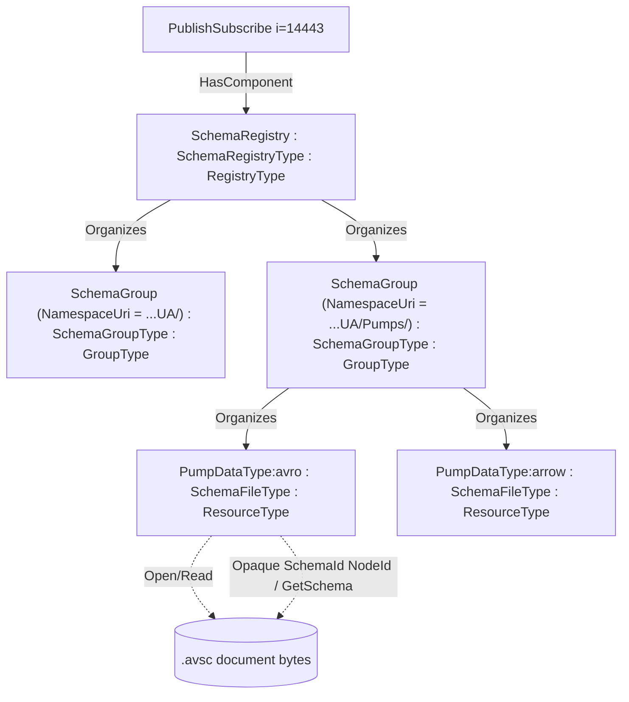

# OPC UA — Schema Registry

**Working draft for submission to the OPC Foundation Working Group**
**Proposed Part: OPC 10000-2xx (number to be assigned)**
**Companion namespace:** `http://opcfoundation.org/UA/SchemaRegistry/`
**Extends:** [*OPC UA — xRegistry*](../xregistry/OPC-UA-xRegistry.md) (base companion namespace `http://opcfoundation.org/UA/xRegistry/`)
**Version:** 0.3.0 · **Date:** 2026-07-16

> **Status — working draft.** This document defines an in-server OPC UA **Schema Registry** as a **domain extension of the abstract [OPC UA — xRegistry](../xregistry/OPC-UA-xRegistry.md) companion model**. The registry, its schema groups and its schema documents are OPC UA **FileTransfer** directories and files: browsing the AddressSpace lists the groups and schemas, and reading a schema file returns the schema document. On top of that base it adds the schema-specific metadata and the on-wire **SchemaId** fast path a decoder needs. Nothing here is normative or endorsed by the OPC Foundation.

---

## 1 Scope

Schema-based encodings such as Apache Avro and Apache Arrow require a decoder to obtain the concrete schema document that matches the received payload. Unlike the OPC UA Binary, XML and JSON DataEncodings, which are either self-describing or resolved through the server AddressSpace, a schema-based payload that has left the server in a PubSub message, a file, a data lake, an MQTT/AMQP/Kafka stream or a historian/ADBC stream must be accompanied by a reference or identifier that lets the consumer retrieve the schema.

This specification defines a **Schema Registry**: a concrete xRegistry whose resources are schema documents. It is a **domain extension** of the abstract [*OPC UA — xRegistry*](../xregistry/OPC-UA-xRegistry.md) base model — its registry, group and resource types are subtypes of the base `RegistryType`, `GroupType` and `ResourceType` — so it inherits, unchanged, the base model's three interchangeable representations (the AddressSpace as a folder tree of files, the OPC UA API server, and the serialized xRegistry document), its label configuration (the `Labels` container's `AddAttribute`/`RemoveAttribute`), its auto-bootstrap behaviour, and its federation via `ExpandedNodeId`. This specification adds only what is specific to *schemas*.

The model is **minimal first**:

- **Download a schema (mandatory).** A consumer that received a schema-based message obtains the matching schema either by the one-Read **SchemaId fast path** (an Opaque NodeId whose Identifier bytes are the on-wire SchemaId) or by the generic FileTransfer read of the schema file (§5.1).
- **Register a schema (optional).** A writer or tool registers a schema by creating a file in the target group folder and writing the document bytes; the server auto-bootstraps the group and the schema-version metadata (§5.2).
- **Materialize and serve the full registry (optional).** The schema groups, schemas and versions are materialized as a browsable xRegistry structure and served as the xRegistry API (§10), including to disconnected consumers and across federated registries.

The model has these goals:

- define deterministic schema groups, schemas, versions, formats, content-types and metadata once for all schema-based OPC UA encodings;
- let a decoder that holds only the on-wire `SchemaId` bytes resolve the schema by a single Read of an Opaque SchemaId NodeId or a `GetSchema` Method call;
- define the ordered resolution flow a consumer follows from a received message to the concrete schema document;
- keep schema resolution parallel to the Security Key Service and other PubSub services rather than folding it into `GetSecurityKeys`.

JSON Schema is a first-class registry format, but the OPC UA JSON DataEncoding is self-describing enough that a schema fetch is optional for decoding. For JSON, the registry is used for governance, validation, code generation and documentation rather than as a mandatory decoding dependency.

It is explicitly out of scope to re-specify the Avro, Arrow or JSON encodings themselves, the PubSub message framing, the abstract xRegistry model, or the xRegistry API. The abstract model is defined by [*OPC UA — xRegistry*](../xregistry/OPC-UA-xRegistry.md) and the OPC UA API for it by [*xRegistry — OPC UA API*](../xregistry/xRegistry-OPC-UA-Api.md); this specification is a domain profile of them.

## 2 Normative references

- [*OPC UA — xRegistry*](../xregistry/OPC-UA-xRegistry.md) — the abstract base companion model this specification extends: `RegistryType`, `GroupType`, `ResourceType`, `AttributesType`, the common xRegistry attributes and the `Labels` container with its `AddAttribute`/`RemoveAttribute` Methods, auto-bootstrap, the three representations and federation.
- [*xRegistry — OPC UA API*](../xregistry/xRegistry-OPC-UA-Api.md) — the OPC UA API binding for xRegistry.
- [xRegistry Schema Registry Service, v1.0-rc3](https://github.com/xregistry/spec/blob/v1.0-rc3/schema/spec.md) — the `schemagroups`, `schemas`, `versions`, `format` model this domain profile aligns with.
- [CloudEvents v1.0](https://github.com/cloudevents/spec) — the `dataschema` attribute convention reused for an optional on-wire schema reference.
- [OPC 10000-3](https://reference.opcfoundation.org/specs/OPC-10000-3/) — Address Space Model, NodeIds, References, TypeDefinitions and the `ExpandedNodeId` structure.
- [OPC 10000-4](https://reference.opcfoundation.org/specs/OPC-10000-4/) — Services: Browse, Read, Write, Call, and the `DeleteNodes` Service.
- [OPC 10000-5](https://reference.opcfoundation.org/specs/OPC-10000-5/) — Base Information Model, `FolderType`, `BaseObjectType`, `PropertyType`.
- [OPC 10000-6](https://reference.opcfoundation.org/specs/OPC-10000-6/) — Mappings, with the Avro and Arrow DataEncoding additions in this repository.
- [OPC 10000-14](https://reference.opcfoundation.org/specs/OPC-10000-14/) — PubSub, including the well-known `PublishSubscribe` object (`i=14443`), `DataSetMetaData`, `ConfigurationVersionDataType`, `ConfigurationVersion` and the Security Key Service relationship, with the Avro and Arrow message-mapping additions in this repository.
- [OPC 10000-20](https://reference.opcfoundation.org/specs/OPC-10000-20/) — File Transfer: `FileType` (§4.2), the base type of the schema file.
- OPC UA Avro Message Mapping draft §9 — SchemaId handshake and decoder cache-miss behaviour.
- OPC UA Arrow Message Mapping draft §5.2 — SchemaId handshake and cache-miss behaviour.

## 3 Terms, definitions and abbreviations

| Term | Definition |
|---|---|
| Schema Registry | The registry root, a subtype of the xRegistry `RegistryType`, exposed as the well-known `SchemaRegistry` Object under Part 14 `PublishSubscribe`. |
| Schema document | A concrete Avro (`.avsc`), Apache Arrow Schema, or JSON Schema document describing an OPC UA DataType or DataSet in one encoding. |
| Schema Group | A group folder for one OPC UA namespace URI, a subtype of the xRegistry `GroupType`, keyed by that namespace URI. |
| Schema / Schema file | One `(DataType or PublishedDataSet, format)` schema document as a resource file, a subtype of the xRegistry `ResourceType`. |
| Schema Version / Version | One concrete schema document, correlated with an OPC UA model version and, for DataSets, a Part 14 `ConfigurationVersion`. In the flat projection a schema file exposes its current version's document and `VersionId`; earlier versions, when kept, are sibling files. |
| Format | The xRegistry `format` string identifying the schema language, for example `Avro/1.11`, `ApacheArrow/1.0` or `JsonSchema/2020-12`. |
| Content type | The media type of a schema document or a message/transport payload. The schema document media type is recorded on the schema file; the message/transport content type selects the format during resolution. |
| SchemaId | Raw on-wire schema fingerprint bytes defined by the encoding mapping: 8-byte CRC-64-AVRO for Avro, or the first 8 bytes of SHA-256 of the serialized Arrow Schema. |
| SchemaId NodeId | An Opaque NodeId in the Schema Registry namespace whose Identifier bytes are exactly the raw SchemaId bytes, addressing the schema document for a one-Read fetch. |

Key words **shall**, **should** and **may** are interpreted as in the ISO/IEC directives / RFC 2119.

## 4 Overview

A Schema Registry is an xRegistry (per [*OPC UA — xRegistry*](../xregistry/OPC-UA-xRegistry.md)) whose groups are OPC UA namespaces and whose resources are schema documents. Because groups are folders and each schema document is a `FileType` file, the registry *is* a browsable folder tree of files:



A Server, Publisher or offline tool generates schema documents from its model and registers them as files. On the wire, schema-based messages carry a compact SchemaId (the encoding's SchemaId handshake) or an explicit schema reference. A consumer resolves the schema — by the SchemaId fast path or by reading the schema file — and decodes. For JSON, the schema reference is informative unless the consumer chooses to validate.

Everything the base model provides applies unchanged: the three representations (§4.2 of the base), auto-bootstrap on registration (§6.5 of the base), the `Labels` container with `AddAttribute`/`RemoveAttribute` on each entity (§6.6 of the base), and federation to schemas hosted by another registry via `ExpandedNodeId` (§8 of the base; Annex B here).

## 5 Minimal binding

### 5.1 Downloading a schema (mandatory)

A consumer that received a schema-based message obtains the matching schema document in one of two ways.

**SchemaId fast path (preferred for decoders).** When the message carries an on-wire **SchemaId**, the consumer constructs the Opaque SchemaId NodeId (§6.4) from the raw SchemaId bytes and performs one `Read` of its Value Attribute; the returned ByteString is the schema document. Equivalently it calls `GetSchema(SchemaId)` on the `SchemaRegistry` Object (§6.1). No Browse, label search or fingerprint recomputation is required. This is the schema-registry fast path referred to by the base model's §5.1.

**Generic file read.** Otherwise the consumer browses to the schema file — the `SchemaFileType` in the namespace's `SchemaGroup` — and reads it with the standard FileType Methods (base §5.1): `Open(mode=Read)` → `Read` → `Close`.

### 5.2 Registering a schema (optional)

A writer registers a schema by creating a file in the target schema group and writing the document bytes, exactly as in the base model (base §5.2):

1. `CreateResource(ResourceId, RequestFileOpen = true)` on the target `SchemaGroup` folder (or `CreateGroup` first on the `SchemaRegistry` root to create a new namespace group) → the new `SchemaFileType` file's `NodeId` and a write `fileHandle`. The idempotent `GetOrCreateResource`/`GetOrCreateGroup` collapse the existence-check-then-create into a single call.
2. one or more `Write(fileHandle, data)` with the schema document bytes.
3. `Close(fileHandle)`.

On `Close` the server **auto-bootstraps** the schema-specific metadata in addition to the base attributes (§10.1): it computes the `SchemaId` and `SchemaIdAlg` from the document per the encoding mapping, sets `Format`/`ContentType`, records `ModelVersion` (and, for a DataSet schema, `ConfigurationVersion`) when known, and makes the document reachable by its Opaque SchemaId NodeId. A read-only registry (a published catalogue or a TTL mirror) need not expose `CreateResource`.

## 6 Schema-specific information model

The companion namespace is `http://opcfoundation.org/UA/SchemaRegistry/`. Draft numeric NodeIds use the provisional `62000+` block; final NodeIds are assigned by the OPC Foundation. The three schema types subtype the abstract xRegistry base types (namespace `http://opcfoundation.org/UA/xRegistry/`, declared as a `<RequiredModel>`). The types and their members are the normative node reference in Annex A; this clause describes the schema-specific additions.

### 6.1 SchemaRegistryType

`SchemaRegistryType` is a subtype of the base `RegistryType` (itself a `FolderType`). It is exposed as one well-known `SchemaRegistry` Object as a `HasComponent` of the Part 14 `PublishSubscribe` Object (`i=14443`), so a Client that can discover PubSub configuration discovers schema resolution in the same place, parallel to the Security Key Service (§11). Its `<SchemaGroup>` OptionalPlaceholder constrains the base `<Group>` to `SchemaGroupType`. It adds the `GetSchema` Method (§6.4) as the method form of the SchemaId fast path. Registration uses the base `CreateResource` Method and `Write` (§5.2); no bespoke register Method is required.

### 6.2 SchemaGroupType

`SchemaGroupType` is a subtype of the base `GroupType`. Each instance is a folder of schema files for one OPC UA namespace, keyed by that namespace URI: its Mandatory `NamespaceUri` Property is the group key (the xRegistry `groupid` may be a server-chosen URL-safe slug of it, retained verbatim in `NamespaceUri`). Its `<Schema>` OptionalPlaceholder constrains the base `<Resource>` to `SchemaFileType`. The PubSub envelope schemas (NetworkMessage / DataSetMessage) live in the base-namespace group `http://opcfoundation.org/UA/`.

### 6.3 SchemaFileType

`SchemaFileType` is a subtype of the base `ResourceType` (itself a `FileType`): the schema document *is* the file. It represents one `(DataType or PublishedDataSet) × format` pair — the three encodings of one DataType are three sibling schema files in the same group. It inherits `Format` and `ContentType` (§6.5) and `VersionId` from the base, and adds the OPC UA schema-decoding metadata:

- `SchemaId` (Mandatory, ByteString) — the raw on-wire SchemaId fingerprint bytes; the file is additionally addressable by the Opaque NodeId built from these bytes (§6.4).
- `SchemaIdAlg` (Mandatory, String) — the SchemaId algorithm name, such as `CRC-64-AVRO` or `SHA-256`.
- `DataTypeEncoding` (String) — the related OPC UA DataTypeEncoding name, for example `Default Avro` or `Default Arrow`.
- `ModelVersion` (String) — the originating NodeSet model version (`opcua.modelversion`).
- `ConfigurationVersion` (`ConfigurationVersionDataType`) — the Part 14 `ConfigurationVersion` when the schema describes a DataSet.
- `ExpiryTime` (DateTime) and `Ttl` (Duration) — optional mirror/cache metadata (§9).

The inherited `Labels` container (an `AttributesType`, base §6.6) and its `AddAttribute`/`RemoveAttribute` Methods configure further xRegistry labels on a schema file.

### 6.4 SchemaId-NodeId fast access and GetSchema

Each schema document **shall** be additionally addressable by an Opaque NodeId in the Schema Registry namespace. The deterministic construction is:

```text
NamespaceIndex = namespace index assigned to http://opcfoundation.org/UA/SchemaRegistry/
IdentifierType = Opaque
Identifier     = the exact raw on-wire SchemaId bytes
```

The node addressed by this Opaque NodeId is the schema file's content as a ByteString Variable with the same Value. A Client that receives a schema-based message and finds a cache miss constructs this NodeId from the received SchemaId bytes and performs one `Read` of the Value Attribute; if the node exists, the returned ByteString is the schema document. The Identifier is the raw byte sequence used on the wire (8 bytes for Avro CRC-64-AVRO, 8 bytes for Arrow's truncated SHA-256, or any other length an encoding mapping defines); Opaque NodeIds allow arbitrary byte lengths. The SchemaId NodeId is content-derived and stable: a TTL refresh or metadata update that does not change the document keeps the same NodeId; a changed document produces a new SchemaId and therefore a new Opaque NodeId.

`GetSchema(SchemaId: ByteString) → (Document: ByteString, Format: String, ContentType: String, Found: Boolean)` on the `SchemaRegistry` Object resolves the raw on-wire SchemaId bytes and returns the schema document and enough metadata to parse it. It is the method form of the Opaque-NodeId fast path for decoders that cannot or do not want to construct the NodeId. `Found = false` indicates that no schema with this SchemaId is registered.

### 6.5 Formats and content-types

| Encoding | xRegistry `format` | Schema document `contenttype` | Document carrier |
|---|---|---|---|
| Apache Avro | `Avro/1.11` | `application/vnd.apache.avro+json` | the `.avsc` JSON as the file content |
| Apache Arrow | `ApacheArrow/1.0` (extension format) | `application/vnd.apache.arrow.schema+json` | the JSON Arrow-schema description as the file content |
| JSON Schema | `JsonSchema/2020-12` | `application/schema+json` | the JSON Schema as the file content |

`Avro/1.11` and `JsonSchema/*` are the format names refined by the xRegistry Schema Registry spec; `ApacheArrow/1.0` is an application-defined extension format, which xRegistry permits. The `contenttype` above is the schema *document* media type recorded on the schema file. The message/transport content-type differs by usage and selects the format at resolution time (§8): Avro PubSub `application/vnd.apache.avro`, JSON PubSub `application/json`, and Apache Arrow `application/vnd.apache.arrow.stream` (batch PubSub and historian/ADBC streams) or `application/vnd.apache.arrow.file` where applicable.

### 6.6 Schema identity (`SchemaId`) and per-encoding fingerprints

The Avro and Arrow additions each define a compact **SchemaId**, a deterministic fingerprint of the canonical schema that a Publisher puts on the wire per its SchemaId handshake, so the schema body need be sent only once and every subsequent message carries just the id:

- **Avro** — the 8-byte CRC-64-AVRO Rabin fingerprint of the schema's Parsing Canonical Form, the fingerprint bytes used by Avro single-object encoding.
- **Apache Arrow** — the first 8 bytes of a SHA-256 fingerprint of the serialized Arrow `Schema`.

Each schema file records its `SchemaId` (raw bytes) and `SchemaIdAlg`. A consumer holding only a message's SchemaId resolves the schema by matching `SchemaId` — directly through the Opaque SchemaId NodeId or `GetSchema` (§6.4), or by matching within the format's schema group. This resolution is **independent of any OPC UA version** because the SchemaId derives solely from the schema; the compatibility relationship between the SchemaIds of successive Versions of a DataSet is defined in §7. For provenance a schema file also records `ModelVersion`; a live PubSub registry that registers per-DataSet schemas additionally records `ConfigurationVersion`, while a reference DataType schema carries only `ModelVersion`.

## 7 Schema evolution and versioning

A schema evolves along a **major.minor** lineage that corresponds to the PubSub `ConfigurationVersion` `{MajorVersion, MinorVersion}` of the DataSet it describes. The two components carry a compatibility contract a consumer can rely on without inspecting the schema bytes:

- A **MajorVersion** increment is a **reset**: the schema starts a fresh lineage with no compatibility guarantee against any earlier major. A reset is produced by a structural DataSet change — a field added, removed, reordered or retyped, or a change to a field's DataType or DataTypeEncoding — or by an explicit operator or configuration reset. This matches the OPC 10000-14 rule that an incompatible DataSet change increments MajorVersion.
- A **MinorVersion** increment is an **append-only aggregation**: the new schema is a superset of the immediately preceding minor of the same major, produced only by appending members to the open unions described below. This matches the OPC 10000-14 rule that a compatible, additive DataSet change increments MinorVersion.

**Open unions subject to aggregation.** Only two schema constructs are open and therefore aggregated across minors: (1) the **Variant body-type union** — the built-in body types (and, where a Variant body is an ExtensionObject, the concrete struct type identities) that a given Variant field may carry; and (2) the **ExtensionObject / abstract-or-subtyped struct-type union** — the concrete DataType or DataTypeEncoding identities that an ExtensionObject field, or a field declared abstract or allowing subtypes, may carry. A Variant body-type union member is a `(BuiltInType, form)` pair where form is scalar, one-dimensional array or matrix, and append-only applies to each pair independently. All other constructs are closed and are produced complete in every minor: **Union DataTypes** have a finite field set from their DataTypeDefinition, and **Enumerations** and **OptionSets** already carry unknown numeric values and bit combinations without a schema change. These are never aggregated.

**Per-field or shared unions.** These open unions are preferably **per-field**: each Variant/ExtensionObject field — and any container that transitively holds one — carries its own union, so fields grow independently and one field's growth never widens another's. The Avro mapping, being nominally typed, may instead **share** a single named `Variant`/`ExtensionObject` union across all occurrences (more compact and deterministic across publishers, but it couples growth); the Arrow mapping is structurally typed and is therefore always per-field. The per-encoding naming and the per-field-versus-shared choice are defined in *OPC UA — Apache Avro DataEncoding* §6.6 and *OPC UA — Apache Arrow DataEncoding* §5.6.9; the choice is fixed in the schema and is part of the SchemaId.

**Initial version and basis (data-driven preferred).** The `MAJOR.0` schema is the initial announced schema. The preferred basis is **data-driven**: an open field's union is narrowed to the concrete type of the **first value the field actually encodes** — the concrete Variant body type, or the concrete ExtensionObject/subtype struct, standing in place of the abstract Variant/ExtensionObject and unioned with `null` — and is then grown append-only at that field's position as later values carry types not yet present (the first time such a value is encoded, the encoder appends the member, increments MinorVersion, and announces the new schema before sending the message that uses it). This yields the narrowest schema that covers the data actually sent and announces no member that never occurs. Data-driven growth is **publisher-local**: two publishers may append members in different orders and so reach different schemas at the same `major.minor`, so the exact schema is identified by **SchemaId**, not by `major.minor` alone. Where a schema must be formed **before the first message**, or where **cross-publisher determinism** is required, the encoder MAY instead seed `MAJOR.0` **schema-driven** from the field's declared bound — for a field declared as an abstract base, the concrete subtypes known in the AddressSpace or schema registry — placed in a **canonical order** (by BuiltInType numeric id and form for body types, by type NodeId for concrete struct types). Because schema-driven members are complete and canonically ordered, two publishers of the same DataSet that bound the field the same way produce the same schema and the same SchemaId; a deployment that requires cross-publisher determinism shall bound the field this way so no data-driven growth occurs. The two bases may be combined: a field MAY be seeded schema-driven where its concrete types are known and grown data-driven where they are not — a `BaseDataType` Variant, or a body whose concrete type is defined in a namespace the encoder does not know in advance.

**Append-only rule (normative).** Aggregation shall be strictly append-only: a member already present in a union shall keep the same ordinal in every later minor of the same lineage, and members shall only be added, never removed, reordered or retyped. The ordinal is the Avro union branch index and the Arrow dense-union type code. The **opaque-body fallback branches** — for Avro the `bytes` branch (a Binary body) and the `string` branch (an XML or textual body), and for Arrow the `binary` child and the `utf8` child — carry a not-yet-aggregated ExtensionObject body; they are appended when a value first requires them, exactly like a known-struct branch, and therefore may occupy any ordinal (for example a body union may grow `["null", <Struct>]` → `["null", <Struct>, "bytes"]` → `["null", <Struct>, "bytes", <Struct'>]`, and likewise `dense_union<null, Struct>` → `dense_union<null, Struct, binary>` → `dense_union<null, Struct, binary, Struct'>`). Because every member is append-only, a fallback's ordinal is fixed once appended, so an opaque body written under an earlier minor still selects it under a later minor. Any change that would remove, reorder or retype an existing member is not an aggregation and shall increment MajorVersion.

**Compatibility contract.** Append-only growth lets a consumer, where the encoding permits, decode a message written under an earlier minor using a later minor of the same lineage. **Avro** is positional and self-consistent under append — the branch index an older message carries selects the same member in the later schema and appended members are unused — so a consumer holding the latest minor of a lineage decodes every message of that lineage. **Arrow** is only self-describing through the **embedded Schema message** of an IPC `stream`; a bare `batch` RecordBatch carries no schema and its physical node/buffer layout matches the exact writer-minor schema, so a consumer decoding a bare batch needs the writer-minor schema resolved by its SchemaId, or shall apply a defined upgrade that treats union children absent from the older batch as empty. The "hold only the latest minor" simplification therefore applies to Avro and Arrow `stream`, but not to Arrow `batch`. In all cases, until a consumer has a schema that covers a body type, the ExtensionObject opaque-body fallback still lets it decode structurally and preserve an unknown body with its TypeId.

Because `ConfigurationVersion` is the logical, DataSet-wide version, a MinorVersion increment need not change every encoding's schema: appending a built-in Variant body type changes the Avro and Arrow SchemaIds, while appending a concrete ExtensionObject struct type changes both schema closures. A consumer compares the **SchemaId**, not the ConfigurationVersion, to decide whether it already holds the exact schema.

DataSet **sparsity** does not change the SchemaId. A DataSet may be sparse — a message need not carry a value for every field key — and the message mappings represent every field slot as **nullable**, so a key with no value is encoded as its null branch (Avro) or a null column cell (Arrow), a `null:null` value that a decoder treats as *missing*. A sparse message therefore uses the identical canonical schema as a full key frame; the schema, and thus the SchemaId, is stable across every subset of keys actually carried, and no per-subset schema is registered.

**Relationship to SchemaId.** SchemaId remains a pure content fingerprint of the canonical schema and remains the on-wire decode key; it does not derive from the version number. Each minor is a distinct schema with a distinct SchemaId, and a message carries the SchemaId of the minor under which it was written; that fingerprint identifies the **writer** schema, not necessarily the decoder's schema. A lineage is the chain of SchemaIds produced by successive append-only minors of one major from one publisher. A consumer that does not hold the exact on-wire SchemaId may, where the encoding permits (Avro or Arrow `stream`), decode with a later minor of the same lineage after confirming — from the registry or the announced lineage — that the on-wire SchemaId is an earlier minor of that lineage; it shall not reject the message merely because the on-wire fingerprint differs from the schema it holds, and it shall not compare the on-wire fingerprint against the later schema's canonical form.

**Example (informative).** A DataSet has one Variant field. At `ConfigurationVersion 3.0` the field has only ever carried `Int32` values, so its Avro `body` union is `["null", VariantInt32Scalar]` (SchemaId *A*). When the publisher first encodes a `Double`, it appends `VariantDoubleScalar` as branch index 2 and advances to `3.1`, giving `["null", VariantInt32Scalar, VariantDoubleScalar]` (SchemaId *B*), and re-announces *B*. A message written at 3.0 selected branch 1 and still decodes correctly against *B* because branch 1 is unchanged, so a subscriber holding only *B* decodes both 3.0 and 3.1 messages. The 3.0 message still carries SchemaId *A*; the subscriber decodes it with *B* only after confirming *A* is an earlier minor of *B*'s lineage, and it does not compare *A* against *B*'s canonical form. Removing the field, or retyping it from Variant to a fixed `Double`, would instead reset the DataSet to `4.0` with an unrelated lineage. The same pattern applies to appending an ExtensionObject concrete-type branch; until the subscriber holds the newer minor, that body is still recoverable through the opaque-body fallback. An executable reference demonstration of append-only Variant and ExtensionObject growth — latest-minor-decodes-older, distinct per-minor SchemaIds, and opaque-body fallbacks appended append-only at a non-reserved ordinal — is provided at `../extras/avro-encoding/tools/evolution_demo.py`. A worked incremental-schema walkthrough with concrete Avro schemas — including an ExtensionObject whose struct contains a nested Variant — is in the Avro Part 6 DataEncoding Annex C.

## 8 Resolution flow

Given a received schema-based message, a consumer **shall** resolve its schema as follows:

0. If the message carries an on-wire **SchemaId** from the encoding's SchemaId handshake, resolve by SchemaId before any namespace/name/version lookup (the mandatory fast path, §5.1):
   - **0a in-server fast path:** construct the Opaque SchemaId NodeId in the `http://opcfoundation.org/UA/SchemaRegistry/` namespace and Read the Value Attribute of the addressed ByteString Variable, or call `GetSchema(SchemaId)`. If found, cache the returned document by SchemaId for all subsequent messages and decode.
   - **0b compatible lineage:** if the exact on-wire SchemaId cannot be resolved but the consumer already holds a later minor of the same lineage (§7), it **may** decode with that later schema where the encoding permits — Avro or an Arrow IPC `stream` — after confirming from the registry or announced lineage that the on-wire SchemaId is an earlier minor of that lineage; it **shall not** compare the on-wire fingerprint against the later schema's canonical form, and for an Arrow bare `batch` it **shall** resolve the exact writer-minor schema instead.
   - **0c federated registry:** if the SchemaId is not registered locally, the consumer **may** resolve it against a federated registry the local registry references (base §8 / Annex B).
   If no SchemaId path succeeds, continue.
1. Determine the **format** from the transport **content-type**: for example Avro PubSub `application/vnd.apache.avro`, JSON PubSub `application/json`, or Arrow `application/vnd.apache.arrow.stream` carried in MQTT `ContentType`, AMQP/Kafka `content-type`, or the corresponding OPC UA message mapping.
2. If the message header carries an explicit **schema reference** (a schema file's `self`/URL, carried in the Part 14 message header extension or the transport header, modelled on CloudEvents `dataschema`), read it and decode. Otherwise, continue.
3. Resolve the **schema group** from the namespace, then the **schema file** and **Version**:
   - against a reference **DataType** registry: by `<BrowseName>:<fmt>` (the DataType BrowseName) and the `ModelVersion` metadata;
   - against a live **PubSub** registry that registers per-DataSet schemas: by `<DataSetName>:<fmt>` and `ConfigurationVersion` = the message `DataSetMessage` header `ConfigurationVersion`.
4. `Open`/`Read` the resolved schema file and decode the payload per the corresponding Part 6 or Part 14 addition.

The `ConfigurationVersion` correlation is the same mechanism the OPC UA JSON/UADP mappings already use to detect DataSet layout change; a mismatch **shall** cause the consumer to re-resolve the schema. A PubSub decoder follows the Avro §9 or Arrow §5.2 cache-miss flow: if the message carries a SchemaId and the decoder cache does not contain it, it first attempts the Opaque NodeId Read or `GetSchema`; if neither succeeds, it may fall back to an announcement frame, a federated registry lookup, or AddressSpace schema regeneration as defined by the encoding mapping.

## 9 TTL and mirror semantics

A registry is authoritative by default. In authoritative mode, schema files do not expire and `ExpiryTime` and `Ttl` are omitted.

An in-server registry may operate as a TTL-cached mirror in front of an external xRegistry (a federated registry, base §8). In mirror mode, `Ttl` records the configured time-to-live and `ExpiryTime` records the current expiry timestamp. On cache miss or expired lookup the Server may refetch from the external registry, update metadata and refresh the document. The SchemaId NodeId remains stable across a refresh as long as the fetched document has the same SchemaId; if the external document changes, the SchemaId changes and a different Opaque NodeId is used.

## 10 Structure materialization and the xRegistry API

### 10.1 Auto-bootstrap of the schema structure

The base auto-bootstrap (base §6.5) is specialized for schemas. When a schema file is created and written (§5.2), the server materializes the full xRegistry structure so it is immediately visible in all three representations: it creates the namespace `SchemaGroup` if absent (deriving `NamespaceUri` from the document or the create arguments), assigns the base attributes (`Xid`, `Epoch`, `CreatedAt`/`ModifiedAt`, `ResourceId`, `VersionId`), and computes the schema-specific metadata (`SchemaId`, `SchemaIdAlg`, `Format`, `ContentType`, `DataTypeEncoding`, `ModelVersion`, and `ConfigurationVersion` for a DataSet schema). A client that needs finer control adjusts labels afterwards with the inherited `Labels` container's `AddAttribute`/`RemoveAttribute` Methods.

### 10.2 Serving the xRegistry API and JSON projection

The AddressSpace subtree rooted at `SchemaRegistry` is simultaneously the xRegistry API server and serializes to the xRegistry Schema Registry JSON shape, per the OPC UA API of [*xRegistry — OPC UA API*](../xregistry/xRegistry-OPC-UA-Api.md). The schema-specific projection is:

| OPC UA node | xRegistry JSON member |
|---|---|
| `SchemaRegistry` | registry document root |
| `SchemaGroupType` children | `schemagroups` map |
| `SchemaGroupType.NamespaceUri` | group key / `labels["opcua.namespaceuri"]` |
| `SchemaFileType` children | group `schemas` map |
| `SchemaFileType` file content | inline `schema` bytes or `schemabase64`, by content type |
| `SchemaFileType.Format` | schema `format` |
| `SchemaFileType.ContentType` | version `contenttype` |
| `SchemaFileType.DataTypeEncoding` | `labels["opcua.datatypeencoding"]` |
| `SchemaFileType.SchemaId` | `labels["opcua.schemaid"]` as lower-case hex |
| `SchemaFileType.SchemaIdAlg` | `labels["opcua.schemaid.alg"]` |
| `SchemaFileType.ModelVersion` | `labels["opcua.modelversion"]` |
| `SchemaFileType.ConfigurationVersion` | `labels["opcua.configurationversion"]` as `major.minor` |

An OPC UA REST GET or export of the `SchemaRegistry` subtree is therefore serializable as an xRegistry-compatible Schema Registry document; conversely an imported xRegistry Schema Registry document bootstraps these files and Properties without loss of the OPC UA labels the resolution flow (§8) needs. This is a mapping clause for OPC UA REST and export; it is not a new transport.

## 11 Relationship to SKS and Part 14 PubSub

The Schema Registry is a well-known PubSub-adjacent service under `PublishSubscribe`, parallel to the Security Key Service described by Part 14 §8. It may be co-located, co-configured and co-secured with the Security Key Service because both are used by subscribers during PubSub setup or recovery. It shall not be folded into `GetSecurityKeys`: keys and schema documents have different lifetimes, access-control policies, payload shapes and cache semantics.

This is a companion specification, not an addition to Part 6 or Part 14. Its optional touch-points on Part 14 are the schema-reference carrier and the in-server discoverability point under `PublishSubscribe`: the Part 14 message-mapping additions define an OPTIONAL header field or transport header that carries a schema file's `self`/URL; when absent, resolution falls back to the SchemaId or `namespace + name + ConfigurationVersion` lookup of §8. A Server **may** additionally expose its registry endpoint as a Property so Clients can discover it; that Property is described in the Part 14 additions and is out of scope here.

## 12 Conformance

An implementation conforms if it exposes the in-server Schema Registry as a subtype of the [*OPC UA — xRegistry*](../xregistry/OPC-UA-xRegistry.md) base model — a `SchemaRegistryType` root under `PublishSubscribe` with `SchemaGroupType` groups and `SchemaFileType` files — supports the **mandatory** download of a schema (§5.1) for at least one schema-based format, and preserves reversibility end-to-end: a value encoded per a registered schema and decoded through the resolved schema equals the original (the acceptance corpus of the encoding additions).

Registration (§5.2), structure materialization (§10.1), the xRegistry API/JSON projection (§10.2), TTL/mirror (§9) and federation (Annex B) are optional and independently conformant. A conformant registry exposes ObjectTypes and Properties compatible with §6 and Annex A, including SchemaId-based resolution by Opaque NodeId; `GetSchema` may additionally be exposed as the method form.

## 13 NodeSet validation

The NodeSet, CSV and Annex A are generated from `tools/build_model.py`. The local validator (`tools/validate_local.py`) checks XML well-formedness, unique NodeIds, CSV ↔ NodeSet consistency, that the well-known `SchemaRegistry` instance is attached to `PublishSubscribe` (`i=14443`), that each schema type has a `HasSubtype` back-reference to its xRegistry base type, and that base UA and xRegistry-base NodeId references resolve (the xRegistry base `NodeIds.csv` is loaded to resolve the `<RequiredModel>` cross-namespace references). Because the schema-registry NodeSet lists the xRegistry base namespace first (index 1) and its own namespace second (index 2), base-type references are `ns=1;i=63xxx` and own nodes are `ns=2;i=62xxx`.

---

<a id="annex-a"></a>
## Annex A — Information model

This annex is the normative node reference. It is generated from `tools/build_model.py` and always matches `Opc.Ua.SchemaRegistry.NodeSet2.xml`. All nodes are proposed additions in the companion namespace `http://opcfoundation.org/UA/SchemaRegistry/` (namespace index `2` in this NodeSet, after the required `http://opcfoundation.org/UA/xRegistry/` base model at index `1`). The Schema Registry types **extend the abstract [OPC UA — xRegistry](OPC-UA-xRegistry.md) base types** (`RegistryType`/`GroupType`/`ResourceType`). The numeric NodeIds shown are **provisional** (final IDs are assigned by the OPC Foundation). The **Declared in** column marks members inherited from a supertype.

### Type overview

| NodeId | BrowseName | NodeClass | Subtype of |
|---|---|---|---|
| ns=2;i=62000 | [SchemaRegistryType](#type-SchemaRegistryType) | ObjectType | [RegistryType](OPC-UA-xRegistry.md#type-RegistryType) |
| ns=2;i=62001 | [SchemaGroupType](#type-SchemaGroupType) | ObjectType | [GroupType](OPC-UA-xRegistry.md#type-GroupType) |
| ns=2;i=62002 | [SchemaFileType](#type-SchemaFileType) | ObjectType | [ResourceType](OPC-UA-xRegistry.md#type-ResourceType) |

### Object types

<a id="type-SchemaRegistryType"></a>
#### SchemaRegistryType  (ns=2;i=62000)

*Inherits from:* [RegistryType](OPC-UA-xRegistry.md#type-RegistryType)

The in-server Schema Registry root - an xRegistry RegistryType (a FolderType) whose group folders hold schema files. Adds SchemaId-based resolution (GetSchema and the Opaque SchemaId NodeId fast path). Exposed as a well-known object under the Part 14 PublishSubscribe object.

| BrowseName | NodeClass | DataType | ModellingRule | Declared in | Description |
|---|---|---|---|---|---|
| <SchemaGroup> | Object |  | OptionalPlaceholder | SchemaRegistryType | A schema group folder (per OPC UA namespace) held by the registry. |
| GetSchema | Method |  | Optional | SchemaRegistryType | Return the schema document and metadata for a raw on-wire SchemaId fingerprint (the method form of the Opaque SchemaId NodeId fast path). |

<a id="type-SchemaGroupType"></a>
#### SchemaGroupType  (ns=2;i=62001)

*Inherits from:* [GroupType](OPC-UA-xRegistry.md#type-GroupType)

An xRegistry GroupType keyed by an OPC UA namespace URI; a folder of schema files for the DataTypes and PublishedDataSets of that namespace.

| BrowseName | NodeClass | DataType | ModellingRule | Declared in | Description |
|---|---|---|---|---|---|
| NamespaceUri | Variable | String | Mandatory | SchemaGroupType | The OPC UA namespace URI represented by this schema group (the xRegistry group key). |
| <Schema> | Object |  | OptionalPlaceholder | SchemaGroupType | A schema file (one DataType/DataSet in one format) held by this group. |

<a id="type-SchemaFileType"></a>
#### SchemaFileType  (ns=2;i=62002)

*Inherits from:* [ResourceType](OPC-UA-xRegistry.md#type-ResourceType)

An xRegistry ResourceType whose file content is one concrete schema document (Avro, Apache Arrow or JSON Schema). Adds the OPC UA schema-decoding metadata (SchemaId and per-encoding fields) used by a consumer that must resolve a schema from an on-wire fingerprint.

| BrowseName | NodeClass | DataType | ModellingRule | Declared in | Description |
|---|---|---|---|---|---|
| SchemaId | Variable | ByteString | Mandatory | SchemaFileType | Raw on-wire SchemaId fingerprint bytes. The schema file is additionally addressable by an Opaque NodeId whose identifier bytes are exactly this value. |
| SchemaIdAlg | Variable | String | Mandatory | SchemaFileType | SchemaId algorithm name, such as CRC-64-AVRO or SHA-256. |
| DataTypeEncoding | Variable | String | Optional | SchemaFileType | The OPC UA DataTypeEncoding name, for example Default Avro or Default Arrow. |
| ModelVersion | Variable | String | Optional | SchemaFileType | OPC UA NodeSet model version label (opcua.modelversion). |
| ConfigurationVersion | Variable | [ConfigurationVersionDataType](https://reference.opcfoundation.org/specs/OPC-10000-14/6.2.3#6.2.3.2.6) | Optional | SchemaFileType | PubSub ConfigurationVersion (opcua.configurationversion) when the schema describes a DataSet. |
| ExpiryTime | Variable | DateTime | Optional | SchemaFileType | Optional UTC expiry time for mirror/cache mode. |
| Ttl | Variable | Duration | Optional | SchemaFileType | Optional time-to-live for mirror/cache mode. |

### Methods

| Method | Owning type | Input arguments | Output arguments |
|---|---|---|---|
| GetSchema | [SchemaRegistryType](#type-SchemaRegistryType) | SchemaId | Document, Format, ContentType, Found |

### Well-known instances

| BrowseName | NodeId | TypeDefinition | Note |
|---|---|---|---|
| SchemaRegistry | ns=2;i=62100 | [SchemaRegistryType](#type-SchemaRegistryType) | Server-wide in-server Schema Registry, discoverable from the PublishSubscribe object. |
## Annex B — Federated schemas via ExpandedNodeId (informative)

A Schema Registry inherits the base model's federation (base §8). A schema hosted by another registry is represented locally by a `SchemaFileType` whose `ExternalReference` Property (an `ExpandedNodeId`) points to the remote schema file — `ServerUri` = the remote registry's OPC UA endpoint, `NamespaceUri` + `Identifier` = the remote group/schema identity — and/or whose `ResourceUrl` carries the same link in string form (an `opc.tcp` endpoint plus browse path, or an HTTP URL for a non-OPC-UA registry). A consumer that cannot resolve an on-wire SchemaId locally (§8 step 0c) follows the federation resolution algorithm of the base spec's Annex B: connect to the referenced `ServerUri`, translate the `NamespaceUri`, and read the referenced schema file there with the FileType Methods. Because a schema's identity (its `SchemaId` and `xid`) is stable across registries while the endpoint authority is not, the same schema federated from several registries keeps one identity and can be de-duplicated by `SchemaId`.
