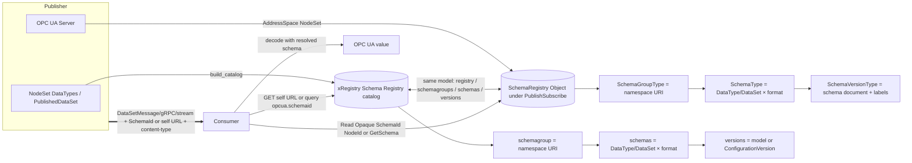

# OPC UA — Schema Registry

**Working draft for submission to the OPC Foundation Working Group**
**Proposed Part: OPC 10000-2xx (number to be assigned)**
**In-server companion namespace:** `http://opcfoundation.org/UA/SchemaRegistry/`
**Out-of-band label convention:** `opcua.*` labels, formerly described by the draft companion namespace `http://opcfoundation.org/UA/SchemaCatalog/`
**Version:** 0.2.0 · **Date:** 2026-07-06

> **Status — working draft.** This document defines a shared OPC UA Schema Registry model and two bindings for it: an out-of-band xRegistry catalog and an in-server AddressSpace NodeSet. The model is intentionally isomorphic to the xRegistry Schema Registry model (`registry` → `schemagroups` → `schemas` → `versions`) so the same information can be published as a catalog, exposed by OPC UA Client/Server services, or projected by OPC UA REST as an xRegistry-compatible JSON document. Nothing here is normative or endorsed by the OPC Foundation.

---

## 1 Scope

Schema-based encodings such as Avro, Protobuf and Apache Arrow require a decoder to obtain the concrete schema document that matches the received payload. Unlike the OPC UA Binary, XML and JSON DataEncodings, which are either self-describing or resolved through the server AddressSpace, a schema-based payload that has left the server in a PubSub message, a gRPC service call, a file, a data lake, an MQTT/AMQP/Kafka stream or a historian/ADBC stream must be accompanied by a reference or identifier that lets the consumer retrieve the schema.

This specification defines one shared mapping from the OPC UA type system onto the xRegistry Schema Registry model and two coherent bindings of that model:

- an out-of-band xRegistry catalog for disconnected consumers and governance tooling;
- an in-server AddressSpace projection under the Part 14 `PublishSubscribe` object so OPC UA Browse, Read, Method calls and REST can expose the same registry, schemagroups, schemas and versions.

The model has five goals:

- define deterministic groups, schemas, versions, formats, content-types and `opcua.*` labels once for all schema-based OPC UA encodings;
- allow a decoder that has only the on-wire `SchemaId` bytes to resolve the schema either from an in-server Opaque SchemaId NodeId / `GetSchema` Method or from an out-of-band catalog by `opcua.schemaid`;
- define the schema reference a Publisher places on the wire and the ordered resolution flow a consumer follows from a received message to the concrete schema document;
- emit and validate a conformant xRegistry catalog document from any NodeSet, plus a worked example;
- keep schema resolution parallel to the Security Key Service and other PubSub services rather than folding schema resolution into `GetSecurityKeys`.

JSON Schema is a first-class registry format, but the OPC UA JSON DataEncoding is self-describing enough that a schema fetch is optional for decoding. For JSON, the registry is used for governance, validation, code generation and documentation rather than as a mandatory decoding dependency.

It is explicitly out of scope to re-specify the Avro, Protobuf, Arrow or JSON encodings themselves, the PubSub message framing, or the xRegistry API. The out-of-band binding is a profile of the xRegistry Schema Registry Service and inherits its API, versioning and export/import behaviour unchanged. The in-server binding does not define a new transport; OPC UA Client/Server services and OPC UA REST expose the same AddressSpace.

## 2 Normative references

- [xRegistry Core](https://github.com/xregistry/spec/blob/main/core/spec.md) — the base registry document format and API.
- [xRegistry Schema Registry Service, v1.0-rc3](https://github.com/xregistry/spec/blob/main/schema/spec.md) — `registry`, `schemagroups`, `schemas`, `versions`, `format`, `self`, `schemaurl`, `schema` and `schemabase64`.
- [CloudEvents v1.0](https://github.com/cloudevents/spec) — the `dataschema` attribute convention reused for the out-of-band schema reference.
- [OPC 10000-3](https://reference.opcfoundation.org/specs/OPC-10000-3/) — Address Space Model, NodeIds, References, TypeDefinitions, DataTypeDefinition and namespaces.
- [OPC 10000-5](https://reference.opcfoundation.org/specs/OPC-10000-5/) — Base Information Model, FolderType, PropertyType and method Argument metadata.
- [OPC 10000-6](https://reference.opcfoundation.org/specs/OPC-10000-6/) — Mappings, with the Avro, Protobuf and Arrow DataEncoding additions in this repository; Protobuf additionally defines the §7.6 OPC UA over gRPC TransportProtocol.
- [OPC 10000-14](https://reference.opcfoundation.org/specs/OPC-10000-14/) — PubSub, including the well-known `PublishSubscribe` object (`i=14443`), `DataSetMetaData`, `ConfigurationVersionDataType`, `ConfigurationVersion`, `dataSetFieldId` and the Security Key Service relationship, with the Avro and Arrow message-mapping additions in this repository.
- [OPC 10000-19](https://reference.opcfoundation.org/specs/OPC-10000-19/) — Dictionary Reference (optional semantic linkage).
- OPC UA Avro Message Mapping draft §9 — SchemaId handshake and decoder cache-miss behavior.
- OPC UA Arrow Message Mapping draft §5.2 — SchemaId handshake and cache-miss behavior.

## 3 Terms, definitions and abbreviations

| Term | Definition |
|---|---|
| Schema Registry | The shared registry root, equivalent to an xRegistry `registry` document and projected either as an out-of-band catalog or as the in-server `SchemaRegistry` Object. |
| Schema document | A concrete Avro (`.avsc`), Protobuf (`.proto` or transitive `FileDescriptorSet`), Apache Arrow Schema, or JSON Schema document describing an OPC UA DataType or DataSet in one encoding. |
| Schema Group | A group for one OPC UA namespace URI, equivalent to an xRegistry `schemagroup`. |
| Schema / Schema Resource | One DataType or PublishedDataSet in one schema format, equivalent to an xRegistry `schema` Resource and the logical umbrella over one or more schema Versions of that DataType/DataSet in that format. |
| Schema Version / Version | One concrete schema document, equivalent to an xRegistry schema `version`, correlated with an OPC UA model version and, for DataSets, a Part 14 `ConfigurationVersion`. |
| Format | The xRegistry `format` string identifying the schema language, for example `Avro/1.11`, `Protobuf/3`, `ApacheArrow/1.0` or `JsonSchema/2020-12`. |
| Content type | The media type of a schema document or a message/transport payload. The schema document media type is recorded on a Version; the message/transport content type selects the format during resolution. |
| Schema reference | The URI a Publisher places on the wire, normally the schema Version's `self` URL, so a consumer can fetch the document; modelled on CloudEvents `dataschema`. |
| SchemaId | Raw on-wire schema fingerprint bytes defined by the encoding mapping: 8-byte CRC-64-AVRO for Avro, the first 8 bytes of SHA-256 of the canonical transitive Protobuf `FileDescriptorSet`, or the first 8 bytes of SHA-256 of the serialized Arrow Schema. |
| SchemaId NodeId | An Opaque NodeId in the Schema Registry namespace whose Identifier bytes are exactly the raw SchemaId bytes. |

Key words **shall**, **should** and **may** are interpreted as in ISO/IEC directives / RFC 2119.

## 4 Overview

The same logical model is used whether the registry is hosted out of band or inside an OPC UA Server:



A Publisher, Server or offline tool generates schema documents from its model and registers them. On the wire, schema-based messages carry a compact SchemaId, an explicit schema reference, or enough namespace/name/version information to resolve the Version. A consumer resolves the Version, retrieves the schema document and decodes. For JSON, the schema reference is informative unless the consumer chooses to validate.

## 5 Shared model: OPC UA to xRegistry mapping

### 5.1 Schema Groups = OPC UA namespaces

Each OPC UA namespace URI maps to exactly one `schemagroup`. Because a `schemagroupid` is a registry key, it **shall** be a stable, URL-safe token derived from the namespace, for example a reverse-DNS-like slug, and the full namespace URI **shall** be retained verbatim in the group `labels` under the key `opcua.namespaceuri`. A `schemagroup` **may** carry all four formats for its DataTypes.

The in-server binding represents the same entity with `SchemaGroupType`. Each instance is keyed by the namespace URI; its Mandatory `NamespaceUri` Property stores the exact OPC UA namespace URI, and its BrowseName may be a server-chosen URL-safe key.

### 5.2 Schema Resources = DataTypes and DataSets

Within a namespace group, one `schema` Resource is created per **(DataType or PublishedDataSet, format)** pair. Because an xRegistry `schema` Resource holds Versions of a single logical schema in a single `format`, the four encodings of one DataType are four sibling `schema` Resources. Identifiers **shall** be:

- `schemaid` = `<BrowseName>:<fmt>` where `<fmt>` ∈ {`avro`, `protobuf`, `arrow`, `jsonschema`};
- group `labels` / schema `labels`: `opcua.browsename`, `opcua.nodeid`, `opcua.datatypeencoding` (the `Default Avro` / `Default Protobuf` / `Default Arrow` well-known name), and, for a DataSet, `opcua.datasetname`.

The `name` attribute **shall** be the plain BrowseName so consumers can list all encodings of a DataType by a `name` filter. The PubSub message envelope schemas (NetworkMessage / DataSetMessage) live in the base-namespace group `http://opcfoundation.org/UA/`.

The in-server binding represents the same entity with `SchemaType`. It represents one `(DataType or PublishedDataSet) × format` pair. The `BrowseName` Property stores the OPC UA BrowseName or PublishedDataSet name, `Format` stores the xRegistry format string, and `DataTypeEncoding` stores the related OPC UA DataTypeEncoding name such as `Default Avro`, `Default Arrow` or `Default Protobuf` when applicable.

### 5.3 Versions = model version / ConfigurationVersion

Each schema **Version** correlates with an OPC UA model change. The `versionid` **shall** follow the xRegistry default algorithm (monotonic unsigned integers). The originating OPC UA version **shall** be recorded in Version `labels`: `opcua.modelversion` (the NodeSet `<Models><Model Version=…>`), and, where the schema describes a PubSub DataSet, `opcua.configurationversion` (the `ConfigurationVersion` `{MajorVersion, MinorVersion}` as `major.minor`). This is the key a Part 14 consumer uses to select the correct Version (§8).

For a PubSub DataSet schema in the in-server binding, `ConfigurationVersion` is the Part 14 `ConfigurationVersionDataType`. For schemas not tied to a DataSet, `ConfigurationVersion` is omitted. `ModelVersion` records the originating NodeSet model version when known.

### 5.4 Formats and content-types

| Encoding | xRegistry `format` | Version `contenttype` | Document carrier |
|---|---|---|---|
| Apache Avro | `Avro/1.11` | `application/vnd.apache.avro+json` (schema document) | inline `schema` (the `.avsc` JSON) |
| Protobuf | `Protobuf/3` | `text/plain` (the `.proto`) | inline `schema` (proto3 source) |
| Apache Arrow | `ApacheArrow/1.0` (extension format) | `application/vnd.apache.arrow.schema+json` | inline `schema` (the JSON schema description) |
| JSON Schema | `JsonSchema/2020-12` | `application/schema+json` | inline `schema` (the JSON Schema) |

`Avro/1.11`, `Protobuf/3` and `JsonSchema/*` are the format names refined by the xRegistry Schema Registry spec; `ApacheArrow/1.0` is an application-defined extension format, which the xRegistry spec permits. Where a document is preferred by reference rather than embedded, `schemaurl` **may** be used instead of inline `schema`; binary carriers use `schemabase64`.

The `contenttype` above is the schema document media type. The message/transport content-type differs by usage and selects the format at resolution time (§8): Avro PubSub `application/vnd.apache.avro`, JSON PubSub `application/json`, Protobuf gRPC `application/grpc+proto` (a service contract, not a PubSub message schema), and Apache Arrow `application/vnd.apache.arrow.stream` (batch PubSub and historian/ADBC streams) or `application/vnd.apache.arrow.file` where applicable.

### 5.5 Schema identity (`SchemaId`) and per-encoding fingerprints

The Avro, Protobuf and Arrow additions each define a compact **SchemaId**, a deterministic fingerprint of the canonical schema that a Publisher puts on the wire per its SchemaId handshake so the schema body need be sent only once and every subsequent message carries just the id:

- **Avro** — the 8-byte CRC-64-AVRO Rabin fingerprint of the schema's Parsing Canonical Form, the fingerprint bytes used by Avro single-object encoding.
- **Protobuf** — the first 8 bytes of a SHA-256 fingerprint of the canonical transitive `FileDescriptorSet` (the service `.proto` plus all imported files), so a change to any referenced type changes the id.
- **Apache Arrow** — the first 8 bytes of a SHA-256 fingerprint of the serialized Arrow `Schema`.

Each schema Version **shall** carry the label `opcua.schemaid` (the id, lower-case hex) and `opcua.schemaid.alg` (the algorithm name). These are the exact on-wire ids emitted by each encoding generator into `schemas/schemaids.json`; the catalog generator copies them onto the Versions verbatim so that a consumer holding only a message's SchemaId can resolve the schema Version by matching `opcua.schemaid` within the format's schemagroup. This resolution is **independent of any OPC UA version** because the SchemaId derives solely from the schema. For provenance each Version also carries `opcua.modelversion`; a live PubSub registry that registers per-DataSet schemas additionally records `opcua.configurationversion`, but the reference DataType catalog generated by §6.3 carries only `opcua.modelversion`.

## 6 Out-of-band xRegistry catalog binding

The out-of-band binding publishes the shared model as an xRegistry Schema Registry document. It is intended for disconnected consumers of PubSub messages, gRPC service contracts, historian/ADBC streams, files and data lakes, and for governance tools that need a portable catalog independent of an OPC UA session.

### 6.1 Schema reference and the `self` URL

The reference a Publisher puts on the wire is the schema **Version's** `self` URL, for example:

```text
https://registry.example.com/schemagroups/opcfoundation.ua.pumps/schemas/PumpDataType:protobuf/versions/3
```

This reuses the CloudEvents `dataschema` convention, so an OPC UA PubSub payload republished as a CloudEvent carries the same URI in `dataschema`. Registries **may** offer a `shortself` alias. Appending `$details` returns the Version metadata, including `opcua.*` labels, rather than the raw document.

### 6.2 JSON, Protobuf and Arrow usage notes

For the OPC UA JSON DataEncoding no schema fetch is required to decode. A Publisher **may** still register JSON Schema (`JsonSchema/2020-12`) for validation, code generation and documentation, and **may** reference it identically; consumers **shall not** be required to fetch it in order to decode JSON.

The Protobuf schemas registered here are OPC UA gRPC service contracts (the service `.proto` / `FileDescriptorSet`), not PubSub message schemas. A gRPC peer resolves the contract by its SchemaId via the unified resolution flow step 0; the DataSet-specific fallback by `DataSetName` and `ConfigurationVersion` does not apply. See the Protobuf Part 6 §7.6 OPC UA over gRPC transport.

Arrow schemas resolve identically for both Part 14 batch PubSub and the historian/ADBC access surface. An Arrow IPC stream embeds its own schema; the SchemaId indexes it for governance and pre-stream validation.

### 6.3 Catalog generation and worked example

The generator `../extras/xregistry-catalog/tools/build_catalog.py` emits a single-document xRegistry catalog from a NodeSet:

- it creates one `schemagroup` per namespace, and, for every structured/enumerated DataType, the four sibling `schema` Resources with one initial Version each;
- it produces the JSON Schema documents itself and embeds the Avro/Protobuf/Arrow documents generated by the sibling encoding folders (`../avro-encoding/schemas`, `../protobuf-encoding/schemas`, `../arrow-encoding/schemas`) when present, or references them by `schemaurl`;
- it stamps the `opcua.*` labels (§5) so the resolution flow (§8) is data-driven.

A worked example is generated to `../extras/xregistry-catalog/examples/opcua-catalog.xregistry.json`. `../extras/xregistry-catalog/tools/validate_local.py` checks the document is structurally conformant: required attributes, unique ids, allowed formats and embedded documents parse.

## 7 In-server AddressSpace NodeSet binding

The companion namespace is `http://opcfoundation.org/UA/SchemaRegistry/`. Draft numeric NodeIds use the provisional `62000+` block in this namespace; final NodeIds are assigned by the OPC Foundation.

A Server exposes one well-known `SchemaRegistry` Object as a `HasComponent` of the Part 14 `PublishSubscribe` Object (`i=14443`). This mirrors the discoverability pattern used by PubSub services: a Client that can discover PubSub configuration can discover schema resolution in the same place. The well-known instance is parallel to Security Key Service and scenario binding services.

### 7.1 ObjectTypes

`SchemaRegistryType` is the registry root and corresponds to the xRegistry `registry` document. It has a Mandatory `Namespaces` container of `SchemaNamespacesType` for groups and an OptionalPlaceholder `<SchemaGroup>` for Servers that expose groups directly below the registry. It has the `GetSchema` Method and may have the `RegisterSchema` Method.

`SchemaNamespacesType` is the `Namespaces` / `schemagroups` container. Its `<SchemaGroup>` OptionalPlaceholder declares that children of the container are `SchemaGroupType` instances.

`SchemaGroupType` corresponds to an xRegistry `schemagroup`. Each instance is keyed by the namespace URI. Its Mandatory `NamespaceUri` Property stores the exact OPC UA namespace URI; the BrowseName of the instance may be a server-chosen URL-safe key. The `<Schema>` OptionalPlaceholder contains `SchemaType` instances.

`SchemaType` corresponds to an xRegistry `schema` Resource. It represents one `(DataType or PublishedDataSet) × format` pair. The `BrowseName` Property stores the OPC UA BrowseName or PublishedDataSet name, `Format` stores the xRegistry format string, and `DataTypeEncoding` stores the related OPC UA DataTypeEncoding name such as `Default Avro`, `Default Arrow` or `Default Protobuf` when applicable. The `<Version>` OptionalPlaceholder contains `SchemaVersionType` instances.

`SchemaVersionType` corresponds to one xRegistry schema `version`. `Document` is a Mandatory ByteString Property containing the schema document bytes. `Format`, `ContentType`, `SchemaId` and `SchemaIdAlg` are Mandatory Properties. `ModelVersion`, `ConfigurationVersion`, `ExpiryTime` and `Ttl` are Optional Properties.

### 7.2 SchemaId-NodeId fast access

Each schema Version document shall be additionally addressable by an Opaque NodeId in the Schema Registry namespace. The deterministic construction is:

```text
NamespaceIndex = namespace index assigned to http://opcfoundation.org/UA/SchemaRegistry/
IdentifierType = Opaque
Identifier = the exact raw on-wire SchemaId bytes
```

The node addressed by this Opaque NodeId is the Version's `Document` Variable, or an equivalent ByteString Variable that has the same Value and is linked to the Version. A Client that receives a schema-based message and finds a cache miss constructs this NodeId from the received SchemaId bytes and performs one `Read` of the Value Attribute. If the node exists, the returned ByteString is the schema document. No Browse, label search, fingerprint recomputation or schema regeneration is required.

The Identifier is not a stringified hex label. It is the raw byte sequence used on the wire: 8 bytes for Avro CRC-64-AVRO fingerprints, 8 bytes for Protobuf's truncated SHA-256 fingerprint, 8 bytes for Arrow's truncated SHA-256 fingerprint, and any other length defined by an encoding mapping. Opaque NodeIds allow arbitrary byte lengths.

The SchemaId NodeId is content-derived and stable. A TTL refresh, mirror refetch or metadata update that does not change the schema document keeps the same SchemaId NodeId. A changed schema document produces a new SchemaId and therefore a new Opaque NodeId.

### 7.3 Methods

`GetSchema(SchemaId: ByteString) → (Document: ByteString, Format: String, ContentType: String, Found: Boolean)` resolves the raw on-wire SchemaId bytes and returns the schema document and enough metadata to parse it. It is the method form of the cache-miss path used by decoders that cannot or do not want to construct an Opaque NodeId. `Found=false` indicates that no Version with this SchemaId is registered.

`RegisterSchema(...)` is optional. It is intended for server configuration, writers or administrative tools that authoritatively populate the registry. Read-only consumers do not need it. Servers may instead populate the registry from configuration files, PubSub DataSet metadata, generated NodeSets or a mirrored external xRegistry.

### 7.4 REST/JSON projection

The AddressSpace subtree rooted at `SchemaRegistry` maps directly to the xRegistry Schema Registry JSON shape. This is a mapping clause for OPC UA REST and JSON export of the AddressSpace; it is not a new transport.

| OPC UA node | xRegistry JSON member |
|---|---|
| `SchemaRegistry` | registry document root |
| `Namespaces` / `SchemaGroupType` children | `schemagroups` map |
| `SchemaGroupType.NamespaceUri` | group `labels["opcua.namespaceuri"]` |
| `SchemaType` children | group `schemas` map |
| `SchemaType.BrowseName` | schema `name` and `labels["opcua.browsename"]` |
| `SchemaType.Format` | schema `format` |
| `SchemaType.DataTypeEncoding` | schema `labels["opcua.datatypeencoding"]` |
| `SchemaVersionType` children | schema `versions` map |
| `SchemaVersionType.Document` | inline `schema` bytes or `schemabase64`, depending on REST representation and content type |
| `SchemaVersionType.ContentType` | version `contenttype` |
| `SchemaVersionType.SchemaId` | version `labels["opcua.schemaid"]` as lower-case hex |
| `SchemaVersionType.SchemaIdAlg` | version `labels["opcua.schemaid.alg"]` |
| `SchemaVersionType.ModelVersion` | version `labels["opcua.modelversion"]` |
| `SchemaVersionType.ConfigurationVersion` | version `labels["opcua.configurationversion"]` as `major.minor` |

An OPC UA REST GET of the `SchemaRegistry` subtree should therefore be serializable as an xRegistry-compatible document. Conversely, an imported xRegistry Schema Registry document can be projected into these ObjectTypes without loss of the OPC UA labels needed by the Part 14 resolution flow.

## 8 Unified resolution flow

Given a received schema-based message, a consumer **shall** resolve its schema as follows:

0. If the message carries an on-wire **SchemaId** from the encoding's SchemaId handshake, resolve by SchemaId before any namespace/name/version lookup:
   - **0a in-server registry:** construct the Opaque SchemaId NodeId in the `http://opcfoundation.org/UA/SchemaRegistry/` namespace and Read the Value Attribute of the addressed ByteString Variable, or call `GetSchema(SchemaId)`. If found, cache the returned document by SchemaId for all subsequent messages and decode.
   - **0b out-of-band catalog:** resolve the Version whose `opcua.schemaid` equals the lower-case hex form of the on-wire SchemaId within the selected format's schemagroup, GET the document once, cache it by SchemaId for all subsequent messages and decode.
   If neither SchemaId path succeeds, continue.
1. Determine the **format** from the transport **content-type**: for example Avro PubSub `application/vnd.apache.avro`, JSON PubSub `application/json`, Arrow `application/vnd.apache.arrow.stream`, or Protobuf gRPC `application/grpc+proto` carried in MQTT `ContentType`, AMQP/Kafka `content-type`, gRPC message metadata, or the corresponding OPC UA message mapping.
2. If the message header carries an explicit **schema reference** (the Version `self` URL, carried in the Part 14 message header extension or the transport header), GET it and decode. Otherwise, continue.
3. Resolve the **schemagroup** from the namespace, then the **schema** and **Version**:
   - against the reference **DataType** catalog generated here (§6.3): by `<BrowseName>:<fmt>` (the DataType BrowseName, also used for RawData field schemas) and the `opcua.modelversion` label;
   - against a live **PubSub** registry that registers per-DataSet schemas: by `<DataSetName>:<fmt>` and `opcua.configurationversion` = the message `DataSetMessage` header `ConfigurationVersion` (a label the reference DataType catalog does not carry).
4. GET or Read the resolved Version document and decode the payload per the corresponding Part 6 or Part 14 addition.

The `ConfigurationVersion` correlation (§5.3) is the same mechanism the OPC UA JSON/UADP mappings already use to detect DataSet layout change; a mismatch **shall** cause the consumer to re-resolve the Version.

A PubSub decoder follows the Avro §9 or Arrow §5.2 cache-miss flow. If the message carries a SchemaId and the decoder cache does not contain it, the decoder first attempts the Opaque NodeId Read or calls `GetSchema`. If neither succeeds, it may fall back to an announcement frame, an external xRegistry lookup, or AddressSpace schema regeneration as defined by the encoding mapping.

## 9 TTL and mirror semantics

A registry is authoritative by default. In authoritative mode, schema Versions do not expire and `ExpiryTime` and `Ttl` are omitted in the in-server binding.

An in-server registry may operate as a TTL-cached mirror in front of an external xRegistry. In mirror mode, `Ttl` records the configured time-to-live and `ExpiryTime` records the current expiry timestamp. On cache miss or expired lookup the Server may refetch from the external registry, update metadata and refresh `Document`. The SchemaId NodeId remains stable across a refresh as long as the fetched document has the same SchemaId. If the external document changes, the SchemaId changes and a different Opaque NodeId is used for the new Version.

A Server that hosts both the out-of-band xRegistry catalog and the in-server registry keeps them consistent; the in-server registry may operate authoritatively or as a TTL-cached mirror of the external xRegistry.

## 10 Relationship to SKS and Part 14 PubSub

The Schema Registry is a well-known PubSub-adjacent service under `PublishSubscribe`, parallel to the Security Key Service described by Part 14 §8. It may be co-located, co-configured and co-secured with the Security Key Service because both are used by subscribers during PubSub setup or recovery. It shall not be folded into `GetSecurityKeys`: keys and schema documents have different lifetimes, access control policies, payload shapes and cache semantics.

This is a new companion specification, not an addition to Part 6 or Part 14. Its optional touch-points on Part 14 are the schema reference carrier and the in-server discoverability point under `PublishSubscribe`: the Part 14 message-mapping additions define an OPTIONAL header field or transport header that carries the schema Version `self` URL; when absent, resolution falls back to the SchemaId or `namespace + name + ConfigurationVersion` lookup of §8. A Server **may** additionally expose its registry endpoint as a Property so Clients can discover it; that Property is described in the Part 14 additions and is out of scope here.

## 11 Conformance

An implementation conforms if it publishes a conformant xRegistry catalog and/or exposes the in-server Schema Registry NodeSet, supports the resolution flow of §8 for at least one schema-based format, and preserves reversibility end-to-end: a value encoded per a registered schema and decoded through the resolved schema equals the original (the acceptance corpus of the encoding additions).

A conformant xRegistry catalog has groups, schemas, versions, formats and `opcua.*` labels following §5. A conformant in-server binding exposes ObjectTypes and Properties compatible with §7 and Annex A, including SchemaId-based resolution by Opaque NodeId; `GetSchema` may additionally be exposed as the method form.

## 12 NodeSet validation

The NodeSet, CSV and Annex A are generated from `tools/build_model.py`. The local validator checks XML well-formedness, unique NodeIds, CSV ↔ NodeSet consistency, that the well-known `SchemaRegistry` instance is attached to `PublishSubscribe` (`i=14443`), and that base/Part 14 NodeId references are resolvable when local reference tables are available.

---

<a id="annex-a"></a>
## Annex A — Information model

This annex is the normative node reference. It is generated from `tools/build_model.py` and always matches `Opc.Ua.SchemaRegistry.NodeSet2.xml`. All nodes are proposed additions in the companion namespace `http://opcfoundation.org/UA/SchemaRegistry/`; the numeric NodeIds shown are **provisional** (final IDs are assigned by the OPC Foundation). The **Declared in** column marks members inherited from a supertype.

### Type overview

| NodeId | BrowseName | NodeClass | Subtype of |
|---|---|---|---|
| ns=1;i=62000 | [SchemaRegistryType](#type-SchemaRegistryType) | ObjectType | [BaseObjectType](https://reference.opcfoundation.org/specs/OPC-10000-5/6.2) |
| ns=1;i=62001 | [SchemaGroupType](#type-SchemaGroupType) | ObjectType | [BaseObjectType](https://reference.opcfoundation.org/specs/OPC-10000-5/6.2) |
| ns=1;i=62002 | [SchemaType](#type-SchemaType) | ObjectType | [BaseObjectType](https://reference.opcfoundation.org/specs/OPC-10000-5/6.2) |
| ns=1;i=62003 | [SchemaVersionType](#type-SchemaVersionType) | ObjectType | [BaseObjectType](https://reference.opcfoundation.org/specs/OPC-10000-5/6.2) |
| ns=1;i=62004 | [SchemaNamespacesType](#type-SchemaNamespacesType) | ObjectType | [FolderType](https://reference.opcfoundation.org/specs/OPC-10000-5/6.6) |

### Object types

<a id="type-SchemaRegistryType"></a>
#### SchemaRegistryType  (ns=1;i=62000)

*Inherits from:* [BaseObjectType](https://reference.opcfoundation.org/specs/OPC-10000-5/6.2)

The in-server registry root, isomorphic to an xRegistry Schema Registry document. It exposes schema groups and methods for SchemaId-based resolution.

| BrowseName | NodeClass | DataType | ModellingRule | Declared in | Description |
|---|---|---|---|---|---|
| Namespaces | Object |  | Mandatory | SchemaRegistryType | Container for SchemaGroup objects, equivalent to xRegistry schemagroups. |
| <SchemaGroup> | Object |  | OptionalPlaceholder | SchemaRegistryType | A SchemaGroup directly below the registry when a server chooses not to use the Namespaces folder. |
| GetSchema | Method |  | Optional | SchemaRegistryType | Return the schema document and metadata for a raw on-wire SchemaId fingerprint. |
| RegisterSchema | Method |  | Optional | SchemaRegistryType | Optional authoritative population method used by server configuration or writers, not by read-only consumers. |

<a id="type-SchemaGroupType"></a>
#### SchemaGroupType  (ns=1;i=62001)

*Inherits from:* [BaseObjectType](https://reference.opcfoundation.org/specs/OPC-10000-5/6.2)

An xRegistry schemagroup, keyed by an OPC UA namespace URI and containing schemas for DataTypes or PublishedDataSets in that namespace.

| BrowseName | NodeClass | DataType | ModellingRule | Declared in | Description |
|---|---|---|---|---|---|
| NamespaceUri | Variable | String | Mandatory | SchemaGroupType | The OPC UA namespace URI represented by this schemagroup. |
| <Schema> | Object |  | OptionalPlaceholder | SchemaGroupType | A schema Resource for one DataType or PublishedDataSet and one format. |

<a id="type-SchemaType"></a>
#### SchemaType  (ns=1;i=62002)

*Inherits from:* [BaseObjectType](https://reference.opcfoundation.org/specs/OPC-10000-5/6.2)

An xRegistry schema Resource for one DataType or PublishedDataSet in one schema format.

| BrowseName | NodeClass | DataType | ModellingRule | Declared in | Description |
|---|---|---|---|---|---|
| BrowseName | Variable | String | Mandatory | SchemaType | The OPC UA BrowseName or PublishedDataSet name represented by this schema Resource. |
| Format | Variable | String | Mandatory | SchemaType | The xRegistry schema format, for example Avro/1.11 or ApacheArrow/1.0. |
| DataTypeEncoding | Variable | String | Optional | SchemaType | The OPC UA DataTypeEncoding name, for example Default Avro, Default Arrow or Default Protobuf. |
| <Version> | Object |  | OptionalPlaceholder | SchemaType | One concrete schema document Version. |

<a id="type-SchemaVersionType"></a>
#### SchemaVersionType  (ns=1;i=62003)

*Inherits from:* [BaseObjectType](https://reference.opcfoundation.org/specs/OPC-10000-5/6.2)

An xRegistry schema Version: one concrete schema document plus labels used for OPC UA schema-based decoding.

| BrowseName | NodeClass | DataType | ModellingRule | Declared in | Description |
|---|---|---|---|---|---|
| Document | Variable | ByteString | Mandatory | SchemaVersionType | The schema document bytes. In instances this Variable should be assigned the Opaque SchemaId NodeId for direct Read access. |
| Format | Variable | String | Mandatory | SchemaVersionType | The xRegistry format string copied onto the Version. |
| ContentType | Variable | String | Mandatory | SchemaVersionType | The media type of the schema document. |
| SchemaId | Variable | ByteString | Mandatory | SchemaVersionType | Raw on-wire SchemaId fingerprint bytes. |
| SchemaIdAlg | Variable | String | Mandatory | SchemaVersionType | SchemaId algorithm name, such as CRC-64-AVRO or SHA-256. |
| ModelVersion | Variable | String | Optional | SchemaVersionType | OPC UA NodeSet model version label opcua.modelversion. |
| ConfigurationVersion | Variable | [ConfigurationVersionDataType](https://reference.opcfoundation.org/specs/OPC-10000-14/6.2.3#6.2.3.2.6) | Optional | SchemaVersionType | PubSub ConfigurationVersion label opcua.configurationversion when the schema describes a DataSet. |
| ExpiryTime | Variable | DateTime | Optional | SchemaVersionType | Optional UTC expiry time for mirror/cache mode. |
| Ttl | Variable | Duration | Optional | SchemaVersionType | Optional time-to-live in milliseconds for mirror/cache mode. |

<a id="type-SchemaNamespacesType"></a>
#### SchemaNamespacesType  (ns=1;i=62004)

*Inherits from:* [FolderType](https://reference.opcfoundation.org/specs/OPC-10000-5/6.6)

The registry's schemagroups container. Its children are SchemaGroupType instances keyed by OPC UA namespace URI.

| BrowseName | NodeClass | DataType | ModellingRule | Declared in | Description |
|---|---|---|---|---|---|
| <SchemaGroup> | Object |  | OptionalPlaceholder | SchemaNamespacesType | A SchemaGroup held by the Namespaces container. |

### Methods

| Method | Owning type | Input arguments | Output arguments |
|---|---|---|---|
| GetSchema | [SchemaRegistryType](#type-SchemaRegistryType) | SchemaId | Document, Format, ContentType, Found |
| RegisterSchema | [SchemaRegistryType](#type-SchemaRegistryType) | NamespaceUri, BrowseName, Format, ContentType, Document, SchemaId, SchemaIdAlg, ModelVersion, ConfigurationVersion | VersionNodeId, DocumentNodeId, Registered |

### Well-known instances

| BrowseName | NodeId | TypeDefinition | Note |
|---|---|---|---|
| SchemaRegistry | ns=1;i=62100 | [SchemaRegistryType](#type-SchemaRegistryType) | Server-wide in-server Schema Registry, discoverable from the PublishSubscribe object. |
| Namespaces | ns=1;i=62101 | [SchemaNamespacesType](#type-SchemaNamespacesType) | Container for namespace schema groups. |


## Annex B — Example catalog (informative)

See [`../extras/xregistry-catalog/examples/opcua-catalog.xregistry.json`](../extras/xregistry-catalog/examples/opcua-catalog.xregistry.json), generated from `core-specs/pubsub-binding/Opc.Ua.PubSubBinding.NodeSet2.xml`. It contains one `schemagroup` for the binding namespace with the four sibling schema Resources per DataType and the PubSub envelope schemas in the base-namespace group.
