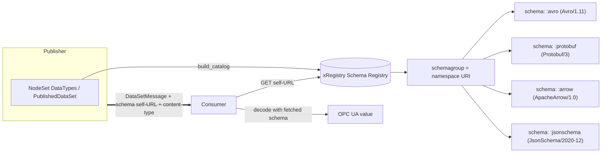

# OPC UA — xRegistry Schema Catalog

**Working draft for submission to the OPC Foundation Working Group**
**Proposed Part: OPC 10000‑2xx (number to be assigned)**
**Companion namespace:** `http://opcfoundation.org/UA/SchemaCatalog/`
**Version:** 0.1.0 · **Date:** 2026-07-02

> **Status — working draft.** This document defines how OPC UA schema documents — the reference schemas produced by the Avro, Protobuf and Apache Arrow DataEncoding additions, and JSON Schema — are published in, and resolved from, a central **[xRegistry](https://github.com/xregistry/spec) Schema Registry** so that a disconnected consumer — of a PubSub message, a gRPC service contract, or a historian/ADBC stream — can obtain the schema it needs to decode the payload. It is a companion specification that *references* the encoding additions to [OPC 10000‑6](https://reference.opcfoundation.org/specs/OPC-10000-6/) and [OPC 10000‑14](https://reference.opcfoundation.org/specs/OPC-10000-14/); it does not itself change Part 6 or Part 14. Nothing here is normative or endorsed by the OPC Foundation.

---

## 1 Scope

The Avro, Protobuf and Apache Arrow DataEncodings are **schema‑based**: a decoder cannot reconstruct a value without the schema that describes it. Unlike the OPC UA Binary, XML and JSON DataEncodings — which are either self‑describing or resolved through the server AddressSpace — a schema‑based payload that has left the server (in a PubSub message on MQTT/AMQP/Kafka, a gRPC service call, a file, a data lake) must be accompanied by a **reference** to a schema document that the consumer can retrieve out‑of‑band.

This specification defines:

- a deterministic **mapping** from the OPC UA type system (namespaces, DataTypes, and PubSub DataSets) onto the **xRegistry Schema Registry** model (`schemagroups` → `schemas` → `versions`);
- the **schema formats** and content‑types used for the Avro, Protobuf, Apache Arrow and JSON Schema documents;
- the **schema reference** a Publisher places on the wire, and the **resolution flow** a consumer follows from a received `DataSetMessage` to the concrete schema document;
- a **generator** that emits a conformant xRegistry catalog document from any NodeSet, plus a worked example.

It is explicitly **out of scope** to re‑specify the encodings themselves (see the Part 6 additions), the PubSub message framing (see the Part 14 additions), or the xRegistry API — this specification is a *profile* of the [xRegistry Schema Registry Service, v1.0‑rc3](https://github.com/xregistry/spec/blob/main/schema/spec.md) and inherits its API, versioning and export/import behaviour unchanged.

### 1.1 Why a registry (and why JSON is different)

Avro, Protobuf and Arrow achieve their compactness by *externalising* type information into a schema. The registry lets a Publisher publish the schema once and pass a small reference; a consumer retrieves the document and decodes the data. JSON (the OPC UA JSON DataEncoding) does **not** require a schema to decode, so for JSON the registry is **optional** — used for governance, validation, code generation and documentation rather than for decoding. This specification therefore treats JSON Schema as a first‑class but non‑mandatory format.

## 2 Normative references

- [xRegistry Core](https://github.com/xregistry/spec/blob/main/core/spec.md) — the base registry document format and API.
- [xRegistry Schema Registry Service, v1.0‑rc3](https://github.com/xregistry/spec/blob/main/schema/spec.md) — `schemagroup`/`schema`/`version` model, `format`, `self`/`schemaurl`/`schemabase64`.
- [CloudEvents v1.0](https://github.com/cloudevents/spec) — the `dataschema` attribute convention reused for the schema reference.
- [OPC 10000‑3](https://reference.opcfoundation.org/specs/OPC-10000-3/) — Address Space Model (DataTypeDefinition, namespaces).
- [OPC 10000‑6](https://reference.opcfoundation.org/specs/OPC-10000-6/) — Mappings, **with the Avro / Protobuf / Arrow DataEncoding additions** (this repository); Protobuf additionally defines the §7.6 *OPC UA over gRPC* TransportProtocol.
- [OPC 10000‑14](https://reference.opcfoundation.org/specs/OPC-10000-14/) — PubSub, **with the Avro and Arrow message‑mapping additions** (this repository); `DataSetMetaData`, `ConfigurationVersion`, `dataSetFieldId`. (Protobuf is a gRPC service encoding, not a PubSub mapping.)
- [OPC 10000‑19](https://reference.opcfoundation.org/specs/OPC-10000-19/) — Dictionary Reference (optional semantic linkage).

## 3 Terms, definitions and abbreviations

| Term | Definition |
|---|---|
| Schema document | A concrete Avro (`.avsc`), Protobuf (`.proto`), Apache Arrow, or JSON Schema document describing an OPC UA DataType or DataSet in one encoding. |
| Schema Group | An xRegistry `schemagroup` — here, the container for all schema documents of one OPC UA namespace. |
| Schema (Resource) | An xRegistry `schema` — the logical umbrella over one or more schema **Versions** of the same DataType/DataSet in one format. |
| Version | An xRegistry schema Version — one concrete document, correlated with an OPC UA model version / `ConfigurationVersion`. |
| Format | The xRegistry `format` string identifying the schema language (e.g. `Avro/1.11`, `Protobuf/3`, `ApacheArrow/1.0`, `JsonSchema/2020-12`). |
| Schema reference | The URI a Publisher places on the wire (the schema Version's `self` URL) so a consumer can fetch the document; modelled on CloudEvents `dataschema`. |

Key words **shall**, **should**, **may** are interpreted as in ISO/IEC directives / RFC 2119.

## 4 Overview



The Publisher (or an offline tool) generates a catalog from its model and publishes it to a registry. On the wire, each schema‑based `DataSetMessage` carries the **schema reference** (and a **content‑type** identifying the format). A consumer resolves the reference against the registry, retrieves the document, and decodes. For JSON the reference is informative only.

## 5 Mapping OPC UA onto the xRegistry model

### 5.1 Schema Groups = OPC UA namespaces

Each OPC UA namespace URI maps to exactly one `schemagroup`. Because a `schemagroupid` is a registry key, it **shall** be a stable, URL‑safe token derived from the namespace (e.g. a reverse‑DNS‑like slug), and the full namespace URI **shall** be retained verbatim in the group `labels` under the key `opcua.namespaceuri`. A `schemagroup` **may** carry all four formats for its DataTypes.

### 5.2 Schema Resources = DataTypes and DataSets

Within a namespace group, one `schema` Resource is created per **(DataType or PublishedDataSet, format)** pair. Because an xRegistry `schema` Resource holds Versions of a single logical schema in a single `format`, the four encodings of one DataType are four sibling `schema` Resources. Identifiers **shall** be:

- `schemaid` = `<BrowseName>:<fmt>` where `<fmt>` ∈ {`avro`, `protobuf`, `arrow`, `jsonschema`};
- group `labels` / schema `labels`: `opcua.browsename`, `opcua.nodeid`, `opcua.datatypeencoding` (the `Default Avro`/`Default Protobuf`/`Default Arrow` well‑known name), and — for a DataSet — `opcua.datasetname`.

The `name` attribute **shall** be the plain BrowseName so consumers can list all encodings of a DataType by a `name` filter. The PubSub message envelope schemas (NetworkMessage / DataSetMessage) live in the base‑namespace group `http://opcfoundation.org/UA/`.

### 5.3 Versions = model version / ConfigurationVersion

Each schema **Version** correlates with an OPC UA model change. The `versionid` **shall** follow the xRegistry default algorithm (monotonic unsigned integers). The originating OPC UA version **shall** be recorded in Version `labels`: `opcua.modelversion` (the NodeSet `<Models><Model Version=…>`), and, where the schema describes a PubSub DataSet, `opcua.configurationversion` (the `ConfigurationVersion` `{MajorVersion, MinorVersion}` as `major.minor`). This is the key a Part 14 consumer uses to select the correct Version (§6).

### 5.4 Formats and content‑types

| Encoding | xRegistry `format` | Version `contenttype` | Document carrier |
|---|---|---|---|
| Apache Avro | `Avro/1.11` | `application/vnd.apache.avro+json` (schema doc) | inline `schema` (the `.avsc` JSON) |
| Protobuf | `Protobuf/3` | `text/plain` (the `.proto`) | inline `schema` (proto3 source) |
| Apache Arrow | `ApacheArrow/1.0` (extension format) | `application/vnd.apache.arrow.schema+json` | inline `schema` (the JSON schema description) |
| JSON Schema | `JsonSchema/2020-12` | `application/schema+json` | inline `schema` (the JSON Schema) |

`Avro/1.11`, `Protobuf/3` and `JsonSchema/*` are the format names refined by the xRegistry Schema Registry spec; `ApacheArrow/1.0` is an application‑defined extension format (the spec permits extension formats). Where a document is preferred by reference rather than embedded, `schemaurl` **may** be used instead of inline `schema`; binary carriers use `schemabase64`.

The `contenttype` above is the *schema document* media type. The *message/transport* content-type differs by usage and selects the format at resolution time (§6): Avro PubSub `application/vnd.apache.avro`, JSON PubSub `application/json`, **Protobuf gRPC** `application/grpc+proto` (a service contract, not a PubSub message schema), **Apache Arrow** `application/vnd.apache.arrow.stream` (batch PubSub and historian/ADBC streams).

### 5.5 The schema reference and the `self` URL

The reference a Publisher puts on the wire is the schema **Version's** `self` URL, e.g.

```
https://registry.example.com/schemagroups/opcfoundation.ua.pumps/schemas/PumpDataType:protobuf/versions/3
```

This reuses the CloudEvents `dataschema` convention, so an OPC UA PubSub payload republished as a CloudEvent carries the same URI in `dataschema`. Registries **may** offer a `shortself` alias. Appending `$details` returns the Version metadata (including `opcua.*` labels) rather than the raw document.

### 5.6 Schema identity (`SchemaId`) and message-driven resolution

The Avro, Protobuf and Arrow additions each define a compact **SchemaId** — a deterministic fingerprint of the canonical schema — that a Publisher puts on the wire (per its *SchemaId handshake*) so the schema body need be sent only once and every subsequent message carries just the id:

- **Avro** — the 64-bit **CRC-64-AVRO Rabin** fingerprint of the schema's Parsing Canonical Form (the 8 bytes of Avro single-object framing, `0xC3 0x01` + fingerprint).
- **Protobuf** — a **SHA-256** fingerprint of the canonical transitive **`FileDescriptorSet`** (the service `.proto` plus all imported files), so a change to any referenced type changes the id.
- **Apache Arrow** — a **SHA-256** fingerprint of the serialized Arrow `Schema`.

Each schema Version **shall** carry the label `opcua.schemaid` (the id, lower-case hex) and `opcua.schemaid.alg` (the algorithm name). These are the exact on-wire ids emitted by each encoding generator into `schemas/schemaids.json`; the catalog generator copies them onto the Versions verbatim so that a consumer holding only a message's SchemaId can resolve the schema Version by matching `opcua.schemaid` within the format's schemagroup. This resolution is **independent of any OPC UA version** — the SchemaId derives solely from the schema. For provenance each Version also carries `opcua.modelversion` (the NodeSet model version); a live PubSub registry that registers per‑DataSet schemas additionally records `opcua.configurationversion`, but the reference DataType catalog generated here (§7) carries only `opcua.modelversion`.

## 6 Resolution flow (Part 14 consumer)

Given a received schema‑based `DataSetMessage`, a consumer **shall** resolve its schema as follows:

0. If the message carries an on-wire **SchemaId** (the encoding's SchemaId handshake), resolve the Version whose `opcua.schemaid` equals it within the format's schemagroup, GET the document once (caching it by SchemaId for all subsequent messages), and decode. This is the fastest, most self-contained path. Otherwise, continue.

1. Determine the **format** from the transport **content‑type** — e.g. Avro PubSub `application/vnd.apache.avro`, Arrow `application/vnd.apache.arrow.stream`, Protobuf gRPC `application/grpc+proto` (carried in MQTT `ContentType`, AMQP/Kafka `content-type`, or gRPC message metadata).
2. If the message header carries an explicit **schema reference** (the Version `self` URL — carried in the Part 14 message header extension or the transport header), GET it and decode. Otherwise:
3. Resolve the **schemagroup** from the namespace, then the **schema** and **Version**:
   - against the reference **DataType** catalog generated here (§7): by `<BrowseName>:<fmt>` (the DataType BrowseName, also used for RawData field schemas) and the `opcua.modelversion` label;
   - against a live **PubSub** registry that registers per‑DataSet schemas: by `<DataSetName>:<fmt>` and `opcua.configurationversion` = the message `DataSetMessage` header `ConfigurationVersion` (a label the reference DataType catalog does not carry).
4. GET the resolved Version `self` URL to obtain the schema document, then decode the payload per the corresponding Part 6 addition.

The `ConfigurationVersion` correlation (§5.3) is the same mechanism the OPC UA JSON/UADP mappings already use to detect DataSet layout change; a mismatch **shall** cause the consumer to re‑resolve the Version.

### 6.1 JSON is self‑describing

For the OPC UA JSON DataEncoding no schema fetch is required to decode. A Publisher **may** still register JSON Schema (`JsonSchema/2020-12`) for validation, code generation and documentation, and **may** reference it identically; consumers **shall not** be required to fetch it in order to decode JSON.

### 6.2 Protobuf is a gRPC service contract

The Protobuf schemas registered here are **OPC UA gRPC service contracts** (the service `.proto` / `FileDescriptorSet`), not PubSub message schemas. A gRPC peer resolves the contract by its **SchemaId** via step 0 (the transitive-closure `FileDescriptorSet` fingerprint); the DataSet‑specific steps 3–4 (`DataSetName`/`ConfigurationVersion`) do not apply. See the Protobuf Part 6 §7.6 *OPC UA over gRPC* transport.

### 6.3 Arrow historian/ADBC streams

Arrow schemas resolve identically for both Part 14 batch pub/sub and the historian/ADBC access surface (an Arrow IPC stream embeds its own schema; the SchemaId indexes it for governance and pre‑stream validation).

## 7 Catalog generation and example

The generator `../extras/xregistry-catalog/tools/build_catalog.py` emits a single‑document xRegistry catalog (§3 of the Schema Registry spec) from a NodeSet:

- it creates one `schemagroup` per namespace, and — for every structured/enumerated DataType — the four sibling `schema` Resources with one initial Version each;
- it produces the **JSON Schema** documents itself (this specification's contribution) and **embeds** the Avro/Protobuf/Arrow documents generated by the sibling encoding folders (`../avro-encoding/schemas`, `../protobuf-encoding/schemas`, `../arrow-encoding/schemas`) when present, or references them by `schemaurl`;
- it stamps the `opcua.*` labels (§5) so the resolution flow (§6) is data‑driven.

A worked example is generated to `../extras/xregistry-catalog/examples/opcua-catalog.xregistry.json`. `../extras/xregistry-catalog/tools/validate_local.py` checks the document is structurally conformant (required attributes, unique ids, allowed formats, embedded documents parse).

## 8 Relationship to the base specifications

This is a **new companion specification**, not an addition to Part 6 or Part 14. Its only optional touch‑point on Part 14 is the **schema reference carrier**: the Part 14 message‑mapping additions define an OPTIONAL header field (or transport header) that carries the schema Version `self` URL; when absent, resolution falls back to the `namespace + name + ConfigurationVersion` lookup of §6. A Server **may** additionally expose its registry endpoint as a Property so Clients can discover it; that Property is described in the Part 14 additions and is out of scope here.

## 9 Conformance

An implementation conforms if it (a) publishes an xRegistry catalog whose groups, schemas, versions, formats and `opcua.*` labels follow §5, (b) supports the resolution flow of §6 for at least one schema‑based format, and (c) preserves reversibility end‑to‑end: a value encoded per a registered schema and decoded through the resolved schema equals the original (the acceptance corpus of the encoding additions).

---

## Annex A — Example catalog (informative)

See [`../extras/xregistry-catalog/examples/opcua-catalog.xregistry.json`](../extras/xregistry-catalog/examples/opcua-catalog.xregistry.json), generated from `core-specs/pubsub-binding/Opc.Ua.PubSubBinding.NodeSet2.xml`. It contains one `schemagroup` for the binding namespace with the four sibling schema Resources per DataType and the PubSub envelope schemas in the base‑namespace group.
