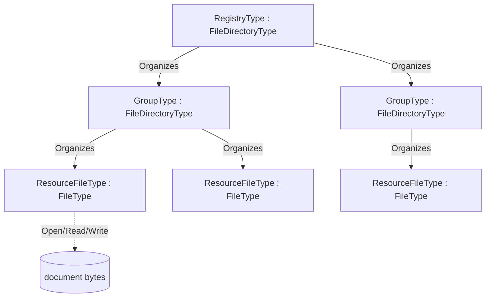

# OPC UA — xRegistry

**Working draft for submission to the OPC Foundation Working Group**
**Proposed Part: OPC 10000-2xx (number to be assigned)**
**Companion namespace:** `http://opcfoundation.org/UA/xRegistry/`
**Version:** 0.1.0 · **Date:** 2026-07-16

> **Status — working draft.** This document defines an abstract OPC UA companion information model that projects a [xRegistry](https://github.com/xregistry/spec) registry onto the OPC UA **FileTransfer** model. A registry and its groups are directories (`FileDirectoryType`); a resource/version document *is* a file (`FileType`). The model is **domain-neutral**: concrete registries — the OPC UA Schema Registry, a WoT Thing-Description registry, or any other xRegistry-shaped catalogue — subtype these base types. Nothing here is normative or endorsed by the OPC Foundation.

---

## 1 Scope

[xRegistry](https://github.com/xregistry/spec) is a metadata standard for describing registries of related resources — schemas, endpoints, messages, Thing Descriptions and so on — in a uniform way: a **registry** contains **groups**, a group contains **resources**, and a resource has one or more **versions**, each of which has a **document** and a set of **attributes**. xRegistry defines the same information in three interchangeable **representations** (xRegistry primer §7): a directory tree of **files** (the *static file server*), a live **API server**, and a single serialized **document**.

This specification defines *one* mapping of the generic xRegistry structure onto the OPC UA AddressSpace, using the OPC UA **FileTransfer** model (OPC 10000-20) so that the AddressSpace *is* the registry:

- a **registry** and each **group** are `FileDirectoryType` directories, browsable and manipulable with the inherited `CreateDirectory` / `CreateFile` / `Delete` / `MoveOrCopy` Methods;
- a **resource/version document** is a `FileType` file, whose bytes are read and written with the inherited `Open` / `Read` / `Write` / `Close` Methods;
- xRegistry **attributes** (`xid`, `epoch`, `name`, timestamps, `labels`, `format`, `contenttype`, …) are OPC UA Properties on those Objects, configurable through `AddProperty` / `RemoveProperty`;
- **federation** links to resources hosted by other registries are OPC UA `ExpandedNodeId` values.

The model is intentionally **abstract**. It defines the reusable base type system (`RegistryType`, `GroupType`, `ResourceFileType`) and the generic behaviours (three-representation symmetry, auto-bootstrap of the structure, property configuration, federation). A **domain companion specification** subtypes the base types to add its own group key and resource metadata — for example *OPC UA — Schema Registry* adds a `SchemaGroupType` keyed by an OPC UA namespace URI and a `SchemaFileType` carrying an on-wire `SchemaId`. The same base is designed to carry a future WoT Thing-Description registry without change.

It is explicitly out of scope to re-specify the xRegistry core model or its HTTP API; the generic OPC UA operations that realize the xRegistry API over OPC UA services are described in the companion [*OPC UA — xRegistry Binding*](OPC-UA-xRegistry-Binding.md).

## 2 Normative references

- [xRegistry Core specification, v1.0-rc3](https://github.com/xregistry/spec/blob/v1.0-rc3/core/spec.md) — the registry / group / resource / version / attribute model, `xid`, `epoch`, `self`, `labels`, and the model/capabilities documents.
- [xRegistry primer, v1.0-rc3](https://github.com/xregistry/spec/blob/v1.0-rc3/core/primer.md) — §7 the three representations (file / static-file-server / API-server) and their symmetry; §8 cross-registry links and federation.
- [xRegistry HTTP binding, v1.0-rc3](https://github.com/xregistry/spec/blob/v1.0-rc3/core/http.md) — the reference protocol binding whose structure the [*OPC UA — xRegistry Binding*](OPC-UA-xRegistry-Binding.md) mirrors.
- [OPC 10000-3](https://reference.opcfoundation.org/specs/OPC-10000-3/) — Address Space Model: NodeIds, References, TypeDefinitions, and the `ExpandedNodeId` structure (§8.2.3) used for federation.
- [OPC 10000-5](https://reference.opcfoundation.org/specs/OPC-10000-5/) — Base Information Model: `FolderType`, `PropertyType` and the `KeyValuePair` DataType (§12.23) used for `labels`.
- [OPC 10000-20](https://reference.opcfoundation.org/specs/OPC-10000-20/) — File Transfer: `FileType` (§4.2) and `FileDirectoryType` (§4.3.1) with the `Open` / `Read` / `Write` / `Close` and `CreateDirectory` / `CreateFile` / `Delete` / `MoveOrCopy` Methods.

## 3 Terms, definitions and abbreviations

| Term | Definition |
|---|---|
| Registry | The root of an xRegistry, projected as the `RegistryType` directory. Equivalent to an xRegistry *registry* document root. |
| Group | A named collection of resources, projected as a `GroupType` directory below the registry. Equivalent to an xRegistry *group* (an entry of a `GROUPS` collection such as `schemagroups`). |
| Resource | A logical entity managed by the registry — a schema, an endpoint, a Thing Description — projected as a `ResourceFileType` file in its group. Equivalent to an xRegistry *resource*. |
| Version | One concrete revision of a resource. In the flat OPC UA projection a resource file exposes its current version's document and `VersionId`; historic versions, when kept, are sibling files. Equivalent to an xRegistry resource *version*. |
| Document | The bytes of a resource version — the schema text, the Thing Description JSON, and so on — read and written through the `FileType` Methods. Equivalent to an xRegistry `RESOURCE` document. |
| Attribute / Property | A named metadata value on a registry, group or resource. Projected as an OPC UA Property. Equivalent to an xRegistry attribute. |
| Label | An extensible name/value string pair on any entity (`labels`), projected as a `KeyValuePair[]` Property and configured with `AddProperty` / `RemoveProperty`. |
| xid | An xRegistry *relative identifier*: the stable path of an entity within its registry (for example `/schemagroups/g1/schemas/s1`), independent of the hosting endpoint. |
| epoch | An xRegistry change counter that increments on every modification of an entity. |
| Representation | One of the three interchangeable xRegistry forms: the directory of **files**, the **static file server**, or the **API server** (primer §7). This model realizes the file/static-file-server form as the AddressSpace and the API-server form as OPC UA services. |
| Federation | The xRegistry mechanism (primer §8) by which a registry references resources hosted by another registry. Realized here by an `ExternalReference` (`ExpandedNodeId`) and/or `ResourceUrl`. |

Key words **shall**, **should** and **may** are interpreted as in the ISO/IEC directives / RFC 2119.

## 4 Overview

### 4.1 The registry *is* a file system

xRegistry's static-file-server representation lays a registry out as a directory tree: a directory per group, a document file per resource version, and a sidecar of attributes. OPC UA already standardizes exactly this shape in the **FileTransfer** model (OPC 10000-20): `FileDirectoryType` is a browsable directory with Methods to create, delete and move files and sub-directories, and `FileType` is a file with Methods to open, read, write and close its bytes. This specification therefore maps the xRegistry structure directly onto FileTransfer:

Because the projection reuses standard FileTransfer, **any** OPC UA Client that can browse a file system and read a file can consume a registry with no registry-specific code: browse the directories to discover groups and resources, then `Open`/`Read` a resource file to obtain its document.

### 4.2 The three representations

xRegistry (primer §7) defines three interchangeable representations of the same information; this model realizes two of them directly and preserves the third:

| xRegistry representation | Realization in this model |
|---|---|
| **Files** / **static file server** — a directory tree of documents + attribute sidecars | The AddressSpace subtree: `FileDirectoryType` directories and `FileType` files under the `RegistryType` root. Browse = list; Read = fetch a document. |
| **API server** — a live service that serves and mutates the registry | OPC UA Client/Server services over the same subtree: Browse, Read, `Open`/`Read`/`Write`, `CreateDirectory`/`CreateFile`/`Delete`/`MoveOrCopy`, `AddProperty`/`RemoveProperty` — mapped verb-by-verb in [*OPC UA — xRegistry Binding*](OPC-UA-xRegistry-Binding.md). |
| **Document** — a single serialized registry document | An OPC UA Read/export of the subtree serializes to the xRegistry JSON document shape (the inverse of importing a document to bootstrap the subtree). |

The three are **symmetric**: the same entity has the same `xid` and identity in every representation, so a resource registered through the API server is immediately visible as a file, and a document imported to bootstrap the AddressSpace is immediately serveable through the API.

### 4.3 Minimal first — download is mandatory, everything else is optional

An implementation is useful with only the **mandatory** capability and grows from there:

1. **Download a resource document (mandatory).** Given a resource file, `Open` it for reading, `Read` its bytes, `Close`. A domain registry may add a one-call fast path (for example the Schema Registry's Opaque `SchemaId` NodeId). This is the minimum a consumer needs and it is nothing more than standard FileTransfer read (§5.1).
2. **Register a resource (optional).** `CreateFile` in the target group directory and `Write` the document bytes. The server **auto-bootstraps** the surrounding structure and attributes (§6.5). This is standard FileTransfer write (§5.2).
3. **Materialize and configure the structure (optional).** Beyond the raw file, the server exposes the xRegistry attributes as Properties and the groups as directories, and lets a client refine them with `AddProperty` / `RemoveProperty` (§6). The whole xRegistry structure becomes browsable in the AddressSpace.
4. **Serve the full xRegistry API (optional).** The same subtree is exposed as the xRegistry API server through the verb mapping of the binding document, including federation to other registries (§7, §8).

A conformant server **shall** support step 1; steps 2–4 are optional and independently adoptable.

## 5 Minimal binding

### 5.1 Reading a resource document (mandatory)

A resource document is the content of a `ResourceFileType` (a `FileType`). A consumer reads it with the standard FileType Methods (OPC 10000-20 §4.2):

1. `Open(mode = Read)` on the resource file → `fileHandle`.
2. one or more `Read(fileHandle, length)` calls → the document bytes (the `Size` Property bounds the total).
3. `Close(fileHandle)`.

No registry-specific Method is required. A domain registry **may** additionally offer a direct-addressing shortcut that returns the document in a single operation (for example reading a Value Attribute addressed by a content-derived Opaque NodeId); such shortcuts are defined by the domain specification and never replace the mandatory FileType read.

### 5.2 Registering a resource (optional)

A writer registers a document by creating a file in the target group directory and writing the bytes, using the standard FileDirectoryType and FileType Methods (OPC 10000-20 §4.3.1, §4.2):

1. `CreateFile(fileName, requestFileOpen = true)` on the target `GroupType` directory → the new resource file's `NodeId` and a write `fileHandle` (or `CreateDirectory` first to create a new group).
2. one or more `Write(fileHandle, data)` calls with the document bytes.
3. `Close(fileHandle)`.

On `Close` the server **auto-bootstraps** (§6.5): it assigns the entity's `xid`, `epoch`, `CreatedAt`/`ModifiedAt`, and any domain-derived attributes, and links the new file under its group and registry so it is immediately visible in all three representations. A server that is read-only (a published catalogue or a mirror) need not expose `CreateFile`.

## 6 Information model

The abstract base namespace is `http://opcfoundation.org/UA/xRegistry/`. Draft numeric NodeIds use the provisional `63000+` block; final NodeIds are assigned by the OPC Foundation. The three base ObjectTypes and their members are the normative node reference in Annex A. This clause describes their intent.

### 6.1 RegistryType

`RegistryType` is a subtype of `FileDirectoryType` and is the registry root. Through its inherited FileDirectory Methods it can create, delete and move the group directories it contains. Its Properties carry the registry-level xRegistry attributes: the Mandatory `RegistryId`, the optional `SpecVersion` (the xRegistry spec version), and the `Capabilities` and `Model` documents (the xRegistry `/capabilities` and `/model` JSON, as strings), plus the common attributes of §6.4. Its `<Group>` OptionalPlaceholder declares that its directory children are `GroupType` instances. A domain registry subtypes `RegistryType` (for example `SchemaRegistryType`) and constrains `<Group>` to its own group type.

### 6.2 GroupType

`GroupType` is a subtype of `FileDirectoryType` and is a group directory — an entry of an xRegistry `GROUPS` collection. It carries the Mandatory `GroupId` and the common attributes of §6.4, and its `<Resource>` OptionalPlaceholder declares that its directory children are `ResourceFileType` files. A domain group subtypes `GroupType` to add the **group key**: for example `SchemaGroupType` adds a Mandatory `NamespaceUri`.

### 6.3 ResourceFileType

`ResourceFileType` is a subtype of `FileType`: the resource/version **document is the file**, read and written through the inherited `Open` / `Read` / `Write` / `Close` Methods. It carries the resource-level xRegistry attributes: the Mandatory `ResourceId`, the `VersionId`, the `Format` (the xRegistry format string) and `ContentType` (the document media type), the federation links `ExternalReference` and `ResourceUrl` (§8), and the common attributes of §6.4. A domain resource subtypes `ResourceFileType` (for example `SchemaFileType`) to add its own metadata.

`ResourceFileType` adds two Methods for configuring xRegistry attributes/labels on the resource in place:

- `AddProperty(Key: String, Value: String) → (Success: Boolean)` — add or update an xRegistry property/label. The server materializes it as (or within) a Property so the change is visible in all three representations.
- `RemoveProperty(Key: String) → (Success: Boolean)` — remove a previously added property/label.

These are the OPC UA form of an xRegistry `PATCH` of an entity's attributes; a server that does not allow post-creation configuration need not expose them.

### 6.4 Common xRegistry attributes

Every registry, group and resource carries the common xRegistry attributes as Properties: `Xid` (the relative identifier), `Epoch` (the change counter), `Name`, `Description`, `Documentation`, `Labels` (a `KeyValuePair[]`), `CreatedAt` and `ModifiedAt`. `Xid` is stable across representations and across registries (§8): it identifies the entity independently of the endpoint that currently serves it. `Epoch` increments on every change so a client can detect a stale cache. `Labels` is the extensible attribute map managed by `AddProperty` / `RemoveProperty`.

### 6.5 Auto-bootstrap

When a resource is created by writing a file (§5.2), the server **shall** materialize the surrounding xRegistry structure without requiring the client to build it explicitly:

- create the group directory if it does not yet exist (a domain registry derives the group key — for example the OPC UA namespace URI — from the document or the create arguments);
- assign the resource its `ResourceId` and initial `VersionId`, and set `Format` / `ContentType` from the create context or by inspecting the document;
- assign `Xid`, `Epoch = 1`, and `CreatedAt` = `ModifiedAt` = now;
- link the file under its group and the group under the registry so the entity is immediately visible as a file, through the API, and in a serialized document.

Subsequent `Write`s or `AddProperty` / `RemoveProperty` calls update `ModifiedAt` and increment `Epoch`. Auto-bootstrap makes the minimal write path (`CreateFile` + `Write`) sufficient to populate a fully-formed registry entry; a client that needs finer control uses `AddProperty` / `RemoveProperty` afterwards.

## 7 The xRegistry API over OPC UA

The AddressSpace subtree is simultaneously the xRegistry **API server**: each xRegistry HTTP operation has a direct OPC UA equivalent over the same nodes. The generic mapping — every entity and verb (`GET` / `PUT` / `PATCH` / `POST` / `DELETE`, the collection and document endpoints, request flags such as `?inline`, `?filter`, `?export`, and error handling) to an OPC UA operation — is defined in the companion [*OPC UA — xRegistry Binding*](OPC-UA-xRegistry-Binding.md), which mirrors the structure of the xRegistry HTTP binding so it can be submitted to the xRegistry organization as the OPC UA protocol binding. In summary:

| xRegistry HTTP | OPC UA operation |
|---|---|
| `GET` a registry/group/resource collection | Browse the corresponding `FileDirectoryType` directory |
| `GET` a resource document | `Open`/`Read`/`Close` the `ResourceFileType` file (or a domain fast path) |
| `GET` an entity's attributes (`?meta`, `$details`) | Read the Properties of the Object |
| `PUT` / `POST` a new resource or version | `CreateFile` (+ `CreateDirectory`) then `Write` |
| `PATCH` an entity's attributes | `AddProperty` / `RemoveProperty` (or Write a Property) |
| `DELETE` an entity | `Delete` on the parent `FileDirectoryType` |
| `?export` a subtree as a document | Read/serialize the subtree to the xRegistry document shape |

## 8 Federation

xRegistry federation (primer §8) lets one registry reference resources hosted by another. A key xRegistry rule is that an entity's identity (`xid`, `groupid`, `resourceid`) is **stable across registries**, while the **URL authority identifies the serving endpoint, not the resource** — so the same resource federated from two endpoints keeps one identity but is reachable at two URLs. OPC UA models this precisely with `ExpandedNodeId` (OPC 10000-3 §8.2.3), whose `ServerUri` identifies the hosting endpoint and whose `NamespaceUri` + `Identifier` identify the entity independently of it.

A federated resource is represented locally by a `ResourceFileType` whose `ExternalReference` Property (an `ExpandedNodeId`) points to the resource in the remote registry: the `ServerUri` is the remote registry's OPC UA endpoint, and the `NamespaceUri` + `Identifier` are the remote group/resource identity. The `ResourceUrl` Property carries the same link in string form (the xRegistry `<RESOURCE>url`) — for example an `opc.tcp` endpoint plus a browse path, or an HTTP URL for a non-OPC-UA registry. A client resolves a federated resource by connecting to the `ServerUri` endpoint and browsing/reading the referenced node, exactly as it would a local one. Annex B specifies the resolution algorithm.

## 9 Conformance

An implementation conforms to this base model if it exposes a `RegistryType` root (or a domain subtype) under which groups and resources are projected as `FileDirectoryType` directories and `ResourceFileType` files, and it supports the **mandatory** capability of §4.3 — reading a resource document through the FileType Methods (§5.1). It **may** additionally support registration (§5.2), structure materialization and property configuration (§6), the xRegistry API mapping (§7) and federation (§8); each is optional and independently conformant.

A domain companion specification conforms if its registry, group and resource types are subtypes of `RegistryType`, `GroupType` and `ResourceFileType` respectively and it does not weaken the mandatory read capability.

## 10 NodeSet validation

The NodeSet, CSV and Annex A are generated from `tools/build_model.py`. The local validator (`tools/validate_local.py`) checks XML well-formedness, unique NodeIds, that each ObjectType has a `HasSubtype` back-reference to its base (`FileType` / `FileDirectoryType`), that members carry a `HasModellingRule` and a `HasTypeDefinition`, and that the CSV and NodeSet agree. Domain NodeSets that extend this base declare it as a `<RequiredModel>` and reference its types by namespace-qualified NodeId.

---

## Annex A — Information model

This annex is the normative node reference. It is generated from `tools/build_model.py` and always matches `Opc.Ua.XRegistry.NodeSet2.xml`. All nodes are defined in the companion namespace `http://opcfoundation.org/UA/xRegistry/` (which requires the base OPC UA namespace); the numeric NodeIds shown are **draft** identifiers within that namespace. The **Declared in** column marks members inherited from a supertype.

### Type overview

| NodeId | BrowseName | NodeClass | Subtype of |
|---|---|---|---|
| ns=1;i=63000 | [RegistryType](#type-RegistryType) | ObjectType | [FileDirectoryType](https://reference.opcfoundation.org/specs/OPC-10000-20/4.3.1) |
| ns=1;i=63001 | [GroupType](#type-GroupType) | ObjectType | [FileDirectoryType](https://reference.opcfoundation.org/specs/OPC-10000-20/4.3.1) |
| ns=1;i=63002 | [ResourceFileType](#type-ResourceFileType) | ObjectType | [FileType](https://reference.opcfoundation.org/specs/OPC-10000-20/4.2) |

### Object types

#### RegistryType  (ns=1;i=63000)

*Inherits from:* [FileDirectoryType](https://reference.opcfoundation.org/specs/OPC-10000-20/4.3.1)

The abstract xRegistry root, expressed as a FileDirectory. It contains Group directories and, through the inherited FileDirectoryType methods (CreateDirectory/CreateFile/Delete/MoveOrCopy), supports creating and managing them. Domain registries subtype this.

| BrowseName | NodeClass | DataType | ModellingRule | Declared in | Description |
|---|---|---|---|---|---|
| RegistryId | Variable | String | Mandatory | RegistryType | xRegistry registryid: the stable identifier of this registry. |
| SpecVersion | Variable | String | Optional | RegistryType | The xRegistry specification version this registry conforms to. |
| Capabilities | Variable | String | Optional | RegistryType | The registry capabilities document (xRegistry /capabilities), as a JSON string. |
| Model | Variable | String | Optional | RegistryType | The registry model document (xRegistry /model), as a JSON string. |
| Xid | Variable | String | Optional | RegistryType | xRegistry relative identifier (xid): the entity's stable path within the registry, independent of the hosting endpoint. |
| Epoch | Variable | UInt32 | Optional | RegistryType | xRegistry epoch: a counter that increments on every change to the entity. |
| Name | Variable | String | Optional | RegistryType | Human-readable name of the entity. |
| Description | Variable | String | Optional | RegistryType | Human-readable description of the entity. |
| Documentation | Variable | String | Optional | RegistryType | URL to human-readable documentation for the entity. |
| Labels | Variable | [KeyValuePair](https://reference.opcfoundation.org/specs/OPC-10000-5/12.23)\[\] | Optional | RegistryType | xRegistry labels: an extensible map of name/value pairs, managed by AddProperty/RemoveProperty on resources. |
| CreatedAt | Variable | DateTime | Optional | RegistryType | UTC timestamp when the entity was created. |
| ModifiedAt | Variable | DateTime | Optional | RegistryType | UTC timestamp when the entity was last modified. |
| <Group> | Object |  | OptionalPlaceholder | RegistryType | A group directory held by this registry. |

#### GroupType  (ns=1;i=63001)

*Inherits from:* [FileDirectoryType](https://reference.opcfoundation.org/specs/OPC-10000-20/4.3.1)

An abstract xRegistry group, expressed as a FileDirectory that contains resource files. Domain group types subtype this and add the group key (e.g. a namespace URI).

| BrowseName | NodeClass | DataType | ModellingRule | Declared in | Description |
|---|---|---|---|---|---|
| GroupId | Variable | String | Mandatory | GroupType | xRegistry groupid: the stable identifier of this group. Group identifiers are globally unique for federation. |
| Xid | Variable | String | Optional | GroupType | xRegistry relative identifier (xid): the entity's stable path within the registry, independent of the hosting endpoint. |
| Epoch | Variable | UInt32 | Optional | GroupType | xRegistry epoch: a counter that increments on every change to the entity. |
| Name | Variable | String | Optional | GroupType | Human-readable name of the entity. |
| Description | Variable | String | Optional | GroupType | Human-readable description of the entity. |
| Documentation | Variable | String | Optional | GroupType | URL to human-readable documentation for the entity. |
| Labels | Variable | [KeyValuePair](https://reference.opcfoundation.org/specs/OPC-10000-5/12.23)\[\] | Optional | GroupType | xRegistry labels: an extensible map of name/value pairs, managed by AddProperty/RemoveProperty on resources. |
| CreatedAt | Variable | DateTime | Optional | GroupType | UTC timestamp when the entity was created. |
| ModifiedAt | Variable | DateTime | Optional | GroupType | UTC timestamp when the entity was last modified. |
| <Resource> | Object |  | OptionalPlaceholder | GroupType | A resource file held by this group. |

#### ResourceFileType  (ns=1;i=63002)

*Inherits from:* [FileType](https://reference.opcfoundation.org/specs/OPC-10000-20/4.2)

An abstract xRegistry resource/version whose document IS the file: the content is read and written through the inherited FileType methods (Open/Read/Write/Close). Carries the xRegistry attributes and an optional ExternalReference for federation. Domain resource types subtype this.

| BrowseName | NodeClass | DataType | ModellingRule | Declared in | Description |
|---|---|---|---|---|---|
| ResourceId | Variable | String | Mandatory | ResourceFileType | xRegistry resourceid: the stable identifier of the resource within its group. |
| VersionId | Variable | String | Optional | ResourceFileType | xRegistry versionid: the identifier of the version this file represents. |
| Format | Variable | String | Optional | ResourceFileType | xRegistry format string identifying the document's schema language/shape. |
| ContentType | Variable | String | Optional | ResourceFileType | Media type (content-type) of the document bytes. |
| ExternalReference | Variable | [ExpandedNodeId](https://reference.opcfoundation.org/specs/OPC-10000-3/8.2.3) | Optional | ResourceFileType | Federation link: an ExpandedNodeId identifying this resource in another (possibly remote) registry - the ServerUri identifies the hosting registry endpoint, the NamespaceUri and Identifier identify the group and resource. Present when the document is served by reference (xRegistry <RESOURCE>url). |
| ResourceUrl | Variable | String | Optional | ResourceFileType | Federation link (string form): the URL from which the document can be obtained (xRegistry <RESOURCE>url), for example an opc.tcp endpoint plus browse path, or an HTTP URL. |
| Xid | Variable | String | Optional | ResourceFileType | xRegistry relative identifier (xid): the entity's stable path within the registry, independent of the hosting endpoint. |
| Epoch | Variable | UInt32 | Optional | ResourceFileType | xRegistry epoch: a counter that increments on every change to the entity. |
| Name | Variable | String | Optional | ResourceFileType | Human-readable name of the entity. |
| Description | Variable | String | Optional | ResourceFileType | Human-readable description of the entity. |
| Documentation | Variable | String | Optional | ResourceFileType | URL to human-readable documentation for the entity. |
| Labels | Variable | [KeyValuePair](https://reference.opcfoundation.org/specs/OPC-10000-5/12.23)\[\] | Optional | ResourceFileType | xRegistry labels: an extensible map of name/value pairs, managed by AddProperty/RemoveProperty on resources. |
| CreatedAt | Variable | DateTime | Optional | ResourceFileType | UTC timestamp when the entity was created. |
| ModifiedAt | Variable | DateTime | Optional | ResourceFileType | UTC timestamp when the entity was last modified. |
| AddProperty | Method |  | Optional | ResourceFileType | Add or update an xRegistry property (attribute/label) on this resource, further configuring the registry structure. The server materializes the property in the AddressSpace. |
| RemoveProperty | Method |  | Optional | ResourceFileType | Remove an xRegistry property (attribute/label) from this resource. |

### Methods

| Method | Owning type | Input arguments | Output arguments |
|---|---|---|---|
| AddProperty | [ResourceFileType](#type-ResourceFileType) | Key, Value | Success |
| RemoveProperty | [ResourceFileType](#type-ResourceFileType) | Key | Success |

## Annex B — Federation resolution via ExpandedNodeId (informative)

A client resolves a federated resource as follows:

1. Read the federated `ResourceFileType`'s `ExternalReference` Property (an `ExpandedNodeId`).
2. If its `ServerUri` is empty or equal to the local server, the target is local: resolve `NamespaceUri` + `Identifier` to a local NodeId and read it as in §5.1.
3. Otherwise the target is remote: obtain the endpoint URL for `ServerUri` (from the local server's `Server` Object `ServerArray`/namespace metadata, from a discovery server, or from the `ResourceUrl` string), open a secure channel and session to that endpoint, translate `NamespaceUri` to the remote `NamespaceIndex`, and read the referenced resource file there with the FileType Methods of §5.1.
4. `ResourceUrl` provides the same link for non-OPC-UA registries: an HTTP `<RESOURCE>url` is fetched with HTTP; an `opc.tcp` URL encodes the endpoint and a browse path to the resource file.

Because `xid`, `groupid` and `resourceid` are stable across registries while the `ServerUri`/URL authority identifies only the endpoint, a resource federated from several registries keeps a single identity and can be de-duplicated by `xid` even though it is reachable through several `ExternalReference`/`ResourceUrl` links.
