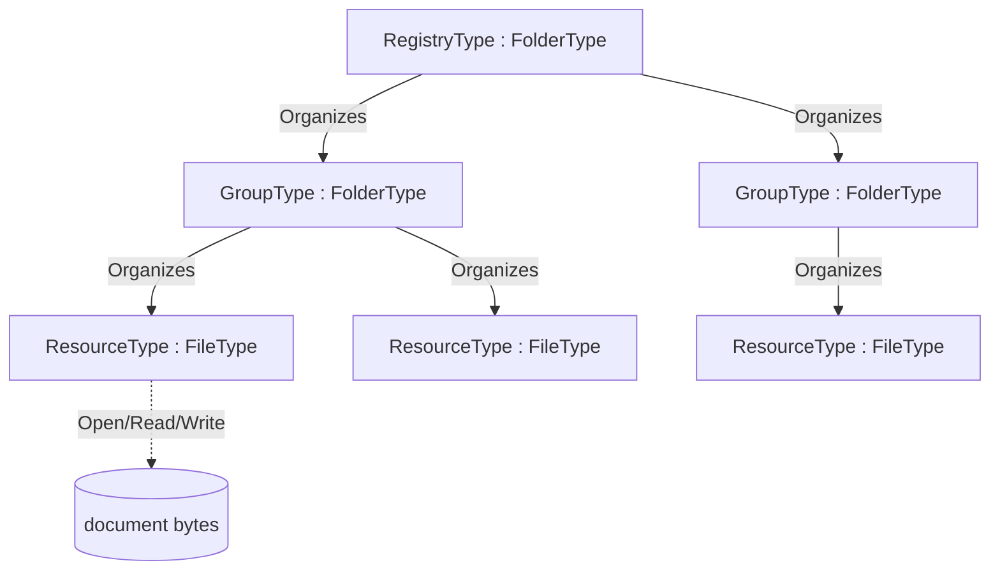

# OPC UA — xRegistry

**Working draft for submission to the OPC Foundation Working Group**
**Proposed Part: OPC 10000-2xx (number to be assigned)**
**Companion namespace:** `http://opcfoundation.org/UA/xRegistry/`
**Version:** 0.1.0 · **Date:** 2026-07-16
**Target:** OPC Foundation standardization — the reusable base for domain-specific registries (Schema, Asset, Semantic, WoT Thing-Description, …).

> **Status — working draft.** This document defines an abstract OPC UA companion information model that projects a [xRegistry](https://github.com/xregistry/spec) registry onto the OPC UA AddressSpace. A registry and its groups are folders (`FolderType`); a resource/version document *is* a file (`FileType`). The model is **domain-neutral**: concrete registries — an OPC UA Schema registry, an Asset registry, a Semantic registry, a WoT Thing-Description registry, or any other xRegistry-shaped catalogue — subtype these base types. Nothing here is normative or endorsed by the OPC Foundation.

---

## 1 Scope

[xRegistry](https://github.com/xregistry/spec) is a metadata standard for describing registries of related resources — schemas, endpoints, messages, Thing Descriptions and so on — in a uniform way: a **registry** contains **groups**, a group contains **resources**, and a resource has one or more **versions**, each of which has a **document** and a set of **attributes**. xRegistry defines the same information in three interchangeable **representations** (xRegistry primer §7): a directory tree of **files** (the *static file server*), a live **API server**, and a single serialized **document**.

This specification defines *one* mapping of the generic xRegistry structure onto the OPC UA AddressSpace: a registry and its groups are **folders** (`FolderType`) that organize their members, and each resource/version document *is* a **file** (`FileType`) so it is downloaded with the standard OPC UA FileTransfer read (OPC 10000-20) — the AddressSpace *is* the registry:

- a **registry** and each **group** are `FolderType` folders that organize their children; a group is created with the `CreateGroup` (or idempotent `GetOrCreateGroup`) Method on the registry, a resource or version with the `CreateResource` (or idempotent `GetOrCreateResource`) Method on the group, and an entry is removed with the standard `DeleteNodes` Service;
- a **resource/version document** is a `FileType` file, whose bytes are read and written with the inherited `Open` / `Read` / `Write` / `Close` Methods;
- xRegistry **attributes** (`xid`, `epoch`, `name`, timestamps, `format`, `contenttype`, …) are OPC UA Properties on those Objects; the extensible **`labels`** are a browsable `AttributesType` container whose `AddAttribute` / `RemoveAttribute` Methods add and remove them as individual Property Variables;
- **federation** links to resources hosted by other registries are OPC UA `ExpandedNodeId` values.

The model is intentionally **abstract**. It defines the reusable base type system (`RegistryType`, `GroupType`, `ResourceType`, `AttributesType`) and the generic behaviours (three-representation symmetry, auto-bootstrap of the structure, attribute configuration, federation). A **domain companion specification** subtypes the base types to add its own group key and resource metadata — for example *OPC UA — Schema Registry* adds a `SchemaGroupType` keyed by an OPC UA namespace URI and a `SchemaFileType` carrying an on-wire `SchemaId`. The same base is designed to carry a future WoT Thing-Description registry without change.

It is explicitly out of scope to re-specify the xRegistry core model or its HTTP API; the OPC UA API for xRegistry — how these nodes are discovered, read and mutated over OPC UA Services — is defined in the companion [*xRegistry — OPC UA API*](xRegistry-OPC-UA-Api.md).

## 2 Normative references

- [xRegistry Core specification, v1.0-rc3](https://github.com/xregistry/spec/blob/v1.0-rc3/core/spec.md) — the registry / group / resource / version / attribute model, `xid`, `epoch`, `self`, `labels`, and the model/capabilities documents.
- [xRegistry primer, v1.0-rc3](https://github.com/xregistry/spec/blob/v1.0-rc3/core/primer.md) — §7 the three representations (file / static-file-server / API-server) and their symmetry; §8 cross-registry links and federation.
- [xRegistry HTTP binding, v1.0-rc3](https://github.com/xregistry/spec/blob/v1.0-rc3/core/http.md) — the HTTP protocol binding of xRegistry; an informative sibling of the OPC UA API binding ([*xRegistry — OPC UA API*](xRegistry-OPC-UA-Api.md)), both realizing the same core model over their respective protocols.
- [OPC 10000-3](https://reference.opcfoundation.org/specs/OPC-10000-3/) — Address Space Model: NodeIds, References, TypeDefinitions, and the `ExpandedNodeId` structure (§8.2.3) used for federation.
- [OPC 10000-4](https://reference.opcfoundation.org/specs/OPC-10000-4/) — Services: Browse, Read, Write, Call, and the `DeleteNodes` Service used to remove a group or resource.
- [OPC 10000-5](https://reference.opcfoundation.org/specs/OPC-10000-5/) — Base Information Model: `FolderType`, `BaseObjectType` and `PropertyType`.
- [OPC 10000-20](https://reference.opcfoundation.org/specs/OPC-10000-20/) — File Transfer: `FileType` (§4.2) with the `Open` / `Read` / `Write` / `Close` Methods used to read and write a resource document.

## 3 Terms, definitions and abbreviations

| Term | Definition |
|---|---|
| Registry | The root of an xRegistry, projected as the `RegistryType` directory. Equivalent to an xRegistry *registry* document root. |
| Group | A named collection of resources, projected as a `GroupType` directory below the registry. Equivalent to an xRegistry *group* (an entry of a `GROUPS` collection such as `schemagroups`). |
| Resource | A logical entity managed by the registry — a schema, an endpoint, a Thing Description — projected as a `ResourceType` file in its group. Equivalent to an xRegistry *resource*. |
| Version | One concrete revision of a resource. In the flat OPC UA projection a resource file exposes its current version's document and `VersionId`; historic versions, when kept, are sibling files. Equivalent to an xRegistry resource *version*. |
| Document | The bytes of a resource version — the schema text, the Thing Description JSON, and so on — read and written through the `FileType` Methods. Equivalent to an xRegistry `RESOURCE` document. |
| Attribute / Property | A named metadata value on a registry, group or resource. Projected as an OPC UA Property. Equivalent to an xRegistry attribute. |
| Label | An extensible name/value string pair on any entity (`labels`), materialized as a browsable `PropertyType` Variable inside the entity's `Labels` (`AttributesType`) container and configured with `AddAttribute` / `RemoveAttribute`. |
| xid | An xRegistry *relative identifier*: the stable path of an entity within its registry (for example `/schemagroups/g1/schemas/s1`), independent of the hosting endpoint. |
| epoch | An xRegistry change counter that increments on every modification of an entity. |
| Representation | One of the three interchangeable xRegistry forms: the directory of **files**, the **static file server**, or the **API server** (primer §7). This model realizes the file/static-file-server form as the AddressSpace and the API-server form as OPC UA services. |
| Federation | The xRegistry mechanism (primer §8) by which a registry references resources hosted by another registry. Realized here by an `ExternalReference` (`ExpandedNodeId`) and/or `ResourceUrl`. |

Key words **shall**, **should** and **may** are interpreted as in the ISO/IEC directives / RFC 2119.

## 4 Overview

### 4.1 The registry *is* folders of files

xRegistry's static-file-server representation lays a registry out as a directory tree: a directory per group, a document file per resource version, and a sidecar of attributes. OPC UA models exactly this shape with the standard **`FolderType`** (a browsable container that organizes its members) for the registry and its groups, and the **`FileType`** (a file with Methods to open, read, write and close its bytes, OPC 10000-20) for each resource/version document. The physical backing may be a real file-system directory, but the OPC UA types are a plain organizing folder and a file:

Because the resource document is a standard `FileType`, **any** OPC UA Client that can browse folders and read a file can consume a registry with no registry-specific code: browse the folders to discover groups and resources, then `Open`/`Read` a resource file to obtain its document.

### 4.2 The three representations

xRegistry (primer §7) defines three interchangeable representations of the same information; this model realizes two of them directly and preserves the third:

| xRegistry representation | Realization in this model |
|---|---|
| **Files** / **static file server** — a directory tree of documents + attribute sidecars | The AddressSpace subtree: `FolderType` folders and `FileType` files under the `RegistryType` root. Browse = list; Read = fetch a document. |
| **API server** — a live service that serves and mutates the registry | OPC UA Client/Server services over the same subtree: Browse, Read, `Open`/`Read`/`Write`, `CreateGroup`/`GetOrCreateGroup`/`CreateResource`/`GetOrCreateResource`, the `DeleteNodes` Service, and `AddAttribute`/`RemoveAttribute` on each entity's `Labels` container — defined by [*xRegistry — OPC UA API*](xRegistry-OPC-UA-Api.md). |
| **Document** — a single serialized registry document | An OPC UA Read/export of the subtree serializes to the xRegistry JSON document shape (the inverse of importing a document to bootstrap the subtree). |

The three are **symmetric**: the same entity has the same `xid` and identity in every representation, so a resource registered through the API server is immediately visible as a file, and a document imported to bootstrap the AddressSpace is immediately serveable through the API.

### 4.3 Minimal first — download is mandatory, everything else is optional

An implementation is useful with only the **mandatory** capability and grows from there:

1. **Download a resource document (mandatory).** Given a resource file, `Open` it for reading, `Read` its bytes, `Close`. A domain registry may add a one-call fast path (for example the Schema Registry's Opaque `SchemaId` NodeId). This is the minimum a consumer needs and it is nothing more than standard FileTransfer read (§5.1).
2. **Register a resource (optional).** `CreateResource` (or the idempotent `GetOrCreateResource`) in the target group folder and `Write` the document bytes. The server **auto-bootstraps** the surrounding structure and attributes (§6.5). This is standard FileTransfer write (§5.2).
3. **Materialize and configure the structure (optional).** Beyond the raw file, the server exposes the xRegistry attributes as Properties and the groups as folders, and lets a client refine the extensible labels with `AddAttribute` / `RemoveAttribute` on each entity's `Labels` container (§6). The whole xRegistry structure becomes browsable in the AddressSpace.
4. **Serve the full xRegistry API (optional).** The same subtree is exposed as the xRegistry API server through the OPC UA API of the companion document, including federation to other registries (§7, §8).

A conformant server **shall** support step 1; steps 2–4 are optional and independently adoptable.

## 5 Minimal binding

### 5.1 Reading a resource document (mandatory)

A resource document is the content of a `ResourceType` (a `FileType`). A consumer reads it with the standard FileType Methods (OPC 10000-20 §4.2):

1. `Open(mode = Read)` on the resource file → `fileHandle`.
2. one or more `Read(fileHandle, length)` calls → the document bytes (the `Size` Property bounds the total).
3. `Close(fileHandle)`.

No registry-specific Method is required. A domain registry **may** additionally offer a direct-addressing shortcut that returns the document in a single operation (for example reading a Value Attribute addressed by a content-derived Opaque NodeId); such shortcuts are defined by the domain specification and never replace the mandatory FileType read.

### 5.2 Registering a resource (optional)

A writer registers a document by creating a file in the target group folder and writing the bytes, using the `CreateResource` Method (and `CreateGroup` for a new group):

1. `CreateResource(ResourceId, RequestFileOpen = true)` on the target `GroupType` folder → the new resource file's `NodeId` and a write `fileHandle` (or `CreateGroup` first to create a new group). The idempotent `GetOrCreateResource` (and `GetOrCreateGroup`) collapse an existence check and creation into one call, returning the file plus a `Created` flag.
2. one or more `Write(fileHandle, data)` calls with the document bytes.
3. `Close(fileHandle)`.

On `Close` the server **auto-bootstraps** (§6.5): it assigns the entity's `xid`, `epoch`, `CreatedAt`/`ModifiedAt`, and any domain-derived attributes, and links the new file under its group and registry so it is immediately visible in all three representations. A server that is read-only (a published catalogue or a mirror) need not expose `CreateResource`.

## 6 Information model

The abstract base namespace is `http://opcfoundation.org/UA/xRegistry/`. Draft numeric NodeIds use the provisional `63000+` block; final NodeIds are assigned by the OPC Foundation. The four base ObjectTypes and their members are the normative node reference in Annex A. This clause describes their intent. Every Variable in the model has an explicit TypeDefinition: fixed attributes are `PropertyType` Variables, and each dynamic label is a `PropertyType` Variable under an `AttributesType` container (§6.6). A server **shall** set each group's, resource's and version's BrowseName to its identifier (`GroupId` / `ResourceId` / `VersionId`, a URL-safe token) so a client selects and filters entities directly from Browse results without a Read per candidate; the [*xRegistry — OPC UA API*](xRegistry-OPC-UA-Api.md) relies on this for read-free collection filtering.

### 6.1 RegistryType

`RegistryType` is a subtype of `FolderType` and is the registry root — a folder that organizes the groups it contains. It creates a group through its `CreateGroup` Method (or the idempotent `GetOrCreateGroup`) and a group is removed with the standard `DeleteNodes` Service. Its Properties carry the registry-level xRegistry attributes: the Mandatory `RegistryId` and the optional `SpecVersion` (the xRegistry spec version), plus the common attributes of §6.4. The `Capabilities` and `Model` documents (the xRegistry `/capabilities` and `/model` JSON) are exposed as component **`FileType`** objects read with `Open`/`Read`/`Close`, so an arbitrarily large model document is not bounded by `MaxStringLength`. Its `<Group>` OptionalPlaceholder declares that its folder members are `GroupType` instances. A domain registry subtypes `RegistryType` (for example `SchemaRegistryType`) and constrains `<Group>` to its own group type.

### 6.2 GroupType

`GroupType` is a subtype of `FolderType` and is a group folder — an entry of an xRegistry `GROUPS` collection. It carries the Mandatory `GroupId` and the common attributes of §6.4, and its `<Resource>` OptionalPlaceholder declares that its members are `ResourceType` files, created through its `CreateResource` Method (or the idempotent `GetOrCreateResource`). A domain group subtypes `GroupType` to add the **group key**: for example `SchemaGroupType` adds a Mandatory `NamespaceUri`.

### 6.3 ResourceType

`ResourceType` is a subtype of `FileType`: the resource/version **document is the file**, read and written through the inherited `Open` / `Read` / `Write` / `Close` Methods. It carries the resource-level xRegistry attributes: the Mandatory `ResourceId`, the `VersionId`, the `Format` (the xRegistry format string) and `ContentType` (the document media type), the federation links `ExternalReference` and `ResourceUrl` (§8), and the common attributes of §6.4 (including its `Labels` container, §6.6). A domain resource subtypes `ResourceType` (for example `SchemaFileType`) to add its own metadata.

### 6.4 Common xRegistry attributes

Every registry, group and resource carries the common xRegistry attributes as Properties: `Xid` (the relative identifier), `Epoch` (the change counter), `Name`, `Description`, `Documentation`, `CreatedAt` and `ModifiedAt` — each an explicit `PropertyType` Variable — plus an optional **`Labels`** Object of type `AttributesType` (§6.6) that holds the entity's extensible xRegistry `labels`. `Xid` is stable across representations and across registries (§8): it identifies the entity independently of the endpoint that currently serves it. `Epoch` increments on every change so a client can detect a stale cache.

### 6.5 Auto-bootstrap

When a resource is created by writing a file (§5.2), the server **shall** materialize the surrounding xRegistry structure without requiring the client to build it explicitly:

- create the group folder if it does not yet exist (a domain registry derives the group key — for example the OPC UA namespace URI — from the document or the create arguments);
- assign the resource its `ResourceId` and initial `VersionId`, and set `Format` / `ContentType` from the create context or by inspecting the document;
- assign `Xid`, `Epoch = 1`, and `CreatedAt` = `ModifiedAt` = now;
- link the file under its group and the group under the registry so the entity is immediately visible as a file, through the API, and in a serialized document.

Subsequent `Write`s or `AddAttribute` / `RemoveAttribute` calls (on the entity's `Labels` container) update `ModifiedAt` and increment `Epoch`. Auto-bootstrap makes the minimal write path (`CreateResource` + `Write`) sufficient to populate a fully-formed registry entry; a client that needs finer control uses `AddAttribute` / `RemoveAttribute` afterwards.

### 6.6 AttributesType

The extensible xRegistry `labels` (and any other dynamic extension attributes) are modelled as an **`AttributesType`** container rather than a single array Property, so each label is an individually browsable, readable and enumerable node and cannot collide with an entity's fixed attribute BrowseNames. `AttributesType` (a subtype of `BaseObjectType`) has:

- an OptionalPlaceholder `<Attribute>` `PropertyType` Variable — a server materializes one `PropertyType` Variable per present label, whose BrowseName is the label key and whose value is the label string; and
- the `AddAttribute(Key: String, Value: String, ExpectedEpoch: UInt32) → (Success: Boolean)` and `RemoveAttribute(Key: String, ExpectedEpoch: UInt32) → (Success: Boolean)` Methods, which add/update and remove those Variables and increment the owning entity's `Epoch`. `ExpectedEpoch` provides optimistic concurrency: when it is non-zero and does not equal the owning entity's current `Epoch`, the Method fails `Bad_InvalidState` and makes no change; `0` disables the check.

This follows the established OPC UA extensible-container pattern (a container ObjectType with an OptionalPlaceholder member plus Add/Remove Methods, as used for dynamic parameter/property sets), and is the OPC UA form of an xRegistry `PATCH` of an entity's `labels`. Each entity exposes one such container as its `Labels` component (§6.4); the labels are deleted together with the entity. A server that does not allow post-creation configuration need not expose the Methods. An `AddIn`/interface composition (`HasAddIn`/`HasInterface`) is a viable alternative for attaching the container; the component form is used here for simplicity.

## 7 The xRegistry API over OPC UA

The AddressSpace subtree is simultaneously the xRegistry **API server**: each xRegistry operation is realized natively by OPC UA Services over the same nodes. The full OPC UA API — reading, listing, creating, updating and deleting registries, groups, resources, versions and their documents and attributes, together with the request flags and error handling — is defined in the companion [*xRegistry — OPC UA API*](xRegistry-OPC-UA-Api.md), the OPC UA API binding of xRegistry. In summary:

| xRegistry operation | OPC UA operation |
|---|---|
| List a registry/group/resource collection | Browse the corresponding `FolderType` folder |
| Read a resource document | `Open`/`Read`/`Close` the `ResourceType` file (or a domain fast path) |
| Read an entity's attributes | Read the Properties of the Object (and its `Labels` container) |
| Create a resource or version | `CreateResource` / `GetOrCreateResource` (+ `CreateGroup` / `GetOrCreateGroup`) then `Write` |
| Update an entity's labels | `AddAttribute` / `RemoveAttribute` on the entity's `Labels` container |
| Delete an entity | the `DeleteNodes` Service on the group/resource node |
| Export a subtree as a document | Read/serialize the subtree to the xRegistry document shape |

## 8 Federation

xRegistry federation (primer §8) lets one registry reference resources hosted by another. A key xRegistry rule is that an entity's identity (`xid`, `groupid`, `resourceid`) is **stable across registries**, while the **URL authority identifies the serving endpoint, not the resource** — so the same resource federated from two endpoints keeps one identity but is reachable at two URLs. OPC UA models this precisely with `ExpandedNodeId` (OPC 10000-3 §8.2.3), whose `ServerUri` identifies the hosting endpoint and whose `NamespaceUri` + `Identifier` identify the entity independently of it.

A federated resource is represented locally by a `ResourceType` whose `ExternalReference` Property (an `ExpandedNodeId`) points to the resource in the remote registry: the `ServerUri` is the remote registry's OPC UA endpoint, and the `NamespaceUri` + `Identifier` are the remote group/resource identity. The `ResourceUrl` Property carries the same link in string form (the xRegistry `<RESOURCE>url`) — for example an `opc.tcp` endpoint plus a browse path, or an HTTP URL for a non-OPC-UA registry. A client resolves a federated resource by connecting to the `ServerUri` endpoint and browsing/reading the referenced node, exactly as it would a local one. Annex B specifies the resolution algorithm.

## 9 Conformance

An implementation conforms to this base model if it exposes a `RegistryType` root (or a domain subtype) under which groups are projected as `FolderType` folders and resources as `ResourceType` files, and it supports the **mandatory** capability of §4.3 — reading a resource document through the FileType Methods (§5.1). It **may** additionally support registration (§5.2), structure materialization and attribute configuration (§6), the xRegistry API mapping (§7) and federation (§8); each is optional and independently conformant.

A domain companion specification conforms if its registry, group and resource types are subtypes of `RegistryType`, `GroupType` and `ResourceType` respectively and it does not weaken the mandatory read capability.

## 10 NodeSet validation

The NodeSet, CSV and Annex A are generated from `tools/build_model.py`. The local validator (`tools/validate_local.py`) checks XML well-formedness, unique NodeIds, that each ObjectType has a `HasSubtype` back-reference to its base (`FolderType` / `FileType` / `BaseObjectType`), that members carry a `HasModellingRule` and a `HasTypeDefinition`, and that the CSV and NodeSet agree. Domain NodeSets that extend this base declare it as a `<RequiredModel>` and reference its types by namespace-qualified NodeId.

---

## Annex A — Information model

This annex is the normative node reference. It is generated from `tools/build_model.py` and always matches `Opc.Ua.XRegistry.NodeSet2.xml`. All nodes are defined in the companion namespace `http://opcfoundation.org/UA/xRegistry/` (which requires the base OPC UA namespace); the numeric NodeIds shown are **draft** identifiers within that namespace. The **Declared in** column marks members inherited from a supertype.

### Type overview

| NodeId | BrowseName | NodeClass | Subtype of |
|---|---|---|---|
| ns=1;i=63000 | [RegistryType](#type-RegistryType) | ObjectType | [FolderType](https://reference.opcfoundation.org/specs/OPC-10000-5/6.6) |
| ns=1;i=63001 | [GroupType](#type-GroupType) | ObjectType | [FolderType](https://reference.opcfoundation.org/specs/OPC-10000-5/6.6) |
| ns=1;i=63002 | [ResourceType](#type-ResourceType) | ObjectType | [FileType](https://reference.opcfoundation.org/specs/OPC-10000-20/4.2) |
| ns=1;i=63003 | [AttributesType](#type-AttributesType) | ObjectType | [BaseObjectType](https://reference.opcfoundation.org/specs/OPC-10000-5/6.2) |

### Object types

#### RegistryType  (ns=1;i=63000)

*Inherits from:* [FolderType](https://reference.opcfoundation.org/specs/OPC-10000-5/6.6)

The abstract xRegistry root, expressed as a FolderType that organizes its Group objects. It creates groups through the CreateGroup Method; a group is removed with the standard DeleteNodes Service. The physical backing may be a file-system directory, but the type is a plain organizing folder. Domain registries subtype this.

| BrowseName | NodeClass | DataType | ModellingRule | Declared in | Description |
|---|---|---|---|---|---|
| RegistryId | Variable | String | Mandatory | RegistryType | xRegistry registryid: the stable identifier of this registry. |
| SpecVersion | Variable | String | Optional | RegistryType | The xRegistry specification version this registry conforms to. |
| Capabilities | Object |  | Optional | RegistryType | The registry capabilities document (xRegistry /capabilities): a FileType whose content is the capabilities JSON, read with the inherited Open/Read/Close Methods (so an arbitrarily large document is not bounded by MaxStringLength). |
| Model | Object |  | Optional | RegistryType | The registry model document (xRegistry /model): a FileType whose content is the model JSON, read with the inherited Open/Read/Close Methods. |
| Xid | Variable | String | Optional | RegistryType | xRegistry relative identifier (xid): the entity's stable path within the registry, independent of the hosting endpoint. |
| Epoch | Variable | UInt32 | Optional | RegistryType | xRegistry epoch: a counter that increments on every change to the entity. |
| Name | Variable | String | Optional | RegistryType | Human-readable name of the entity. |
| Description | Variable | String | Optional | RegistryType | Human-readable description of the entity. |
| Documentation | Variable | String | Optional | RegistryType | URL to human-readable documentation for the entity. |
| Labels | Object |  | Optional | RegistryType | The entity's extensible xRegistry labels/attributes, exposed as an AttributesType container: each label is a browsable PropertyType Variable, added and removed with the container's AddAttribute/RemoveAttribute Methods. Deleted together with the entity. |
| CreatedAt | Variable | DateTime | Optional | RegistryType | UTC timestamp when the entity was created. |
| ModifiedAt | Variable | DateTime | Optional | RegistryType | UTC timestamp when the entity was last modified. |
| <Group> | Object |  | OptionalPlaceholder | RegistryType | A group held by this registry. |
| CreateGroup | Method |  | Optional | RegistryType | Create a group under this registry and assign its GroupId. The server creates the GroupType Object and bootstraps its xRegistry attributes (Xid, Epoch, CreatedAt, ModifiedAt). Fails if a group with the same GroupId already exists; use GetOrCreateGroup for idempotent create-or-get. |
| GetOrCreateGroup | Method |  | Optional | RegistryType | Idempotently return the group with this GroupId, creating it if absent. One-shot form that avoids a separate existence check: returns the existing GroupType Object (Created = false) or a newly created and bootstrapped one (Created = true). |

#### GroupType  (ns=1;i=63001)

*Inherits from:* [FolderType](https://reference.opcfoundation.org/specs/OPC-10000-5/6.6)

An abstract xRegistry group, expressed as a FolderType that organizes its resource files. It creates resources and versions through the CreateResource Method; an entry is removed with the DeleteNodes Service. Domain group types subtype this and add the group key (e.g. a namespace URI).

| BrowseName | NodeClass | DataType | ModellingRule | Declared in | Description |
|---|---|---|---|---|---|
| GroupId | Variable | String | Mandatory | GroupType | xRegistry groupid: the stable identifier of this group. Group identifiers are globally unique for federation. |
| Xid | Variable | String | Optional | GroupType | xRegistry relative identifier (xid): the entity's stable path within the registry, independent of the hosting endpoint. |
| Epoch | Variable | UInt32 | Optional | GroupType | xRegistry epoch: a counter that increments on every change to the entity. |
| Name | Variable | String | Optional | GroupType | Human-readable name of the entity. |
| Description | Variable | String | Optional | GroupType | Human-readable description of the entity. |
| Documentation | Variable | String | Optional | GroupType | URL to human-readable documentation for the entity. |
| Labels | Object |  | Optional | GroupType | The entity's extensible xRegistry labels/attributes, exposed as an AttributesType container: each label is a browsable PropertyType Variable, added and removed with the container's AddAttribute/RemoveAttribute Methods. Deleted together with the entity. |
| CreatedAt | Variable | DateTime | Optional | GroupType | UTC timestamp when the entity was created. |
| ModifiedAt | Variable | DateTime | Optional | GroupType | UTC timestamp when the entity was last modified. |
| <Resource> | Object |  | OptionalPlaceholder | GroupType | A resource file held by this group. |
| CreateResource | Method |  | Optional | GroupType | Create a resource - or a new version of a resource - as a ResourceType file in this group, optionally opened for writing. The server bootstraps the resource's xRegistry attributes when the file is closed. Fails if a resource with the same ResourceId already exists; use GetOrCreateResource for idempotent create-or-get. |
| GetOrCreateResource | Method |  | Optional | GroupType | Idempotently return the resource with this ResourceId, creating it if absent, optionally opened for writing. One-shot form that avoids a separate existence check: returns the existing ResourceType file (Created = false) or a newly created one (Created = true); a write FileHandle is returned when RequestFileOpen is true. |

#### ResourceType  (ns=1;i=63002)

*Inherits from:* [FileType](https://reference.opcfoundation.org/specs/OPC-10000-20/4.2)

An abstract xRegistry resource/version whose document IS the file: the content is read and written through the inherited FileType methods (Open/Read/Write/Close). Carries the xRegistry attributes and an optional ExternalReference for federation. Domain resource types subtype this.

| BrowseName | NodeClass | DataType | ModellingRule | Declared in | Description |
|---|---|---|---|---|---|
| ResourceId | Variable | String | Mandatory | ResourceType | xRegistry resourceid: the stable identifier of the resource within its group. |
| VersionId | Variable | String | Optional | ResourceType | xRegistry versionid: the identifier of the version this file represents. |
| Format | Variable | String | Optional | ResourceType | xRegistry format string identifying the document's schema language/shape. |
| ContentType | Variable | String | Optional | ResourceType | Media type (content-type) of the document bytes. |
| ExternalReference | Variable | [ExpandedNodeId](https://reference.opcfoundation.org/specs/OPC-10000-3/8.2.3) | Optional | ResourceType | Federation link: an ExpandedNodeId identifying this resource in another (possibly remote) registry - the ServerUri identifies the hosting registry endpoint, the NamespaceUri and Identifier identify the group and resource. Present when the document is served by reference (xRegistry <RESOURCE>url). |
| ResourceUrl | Variable | String | Optional | ResourceType | Federation link (string form): the URL from which the document can be obtained (xRegistry <RESOURCE>url), for example an opc.tcp endpoint plus browse path, or an HTTP URL. |
| Xid | Variable | String | Optional | ResourceType | xRegistry relative identifier (xid): the entity's stable path within the registry, independent of the hosting endpoint. |
| Epoch | Variable | UInt32 | Optional | ResourceType | xRegistry epoch: a counter that increments on every change to the entity. |
| Name | Variable | String | Optional | ResourceType | Human-readable name of the entity. |
| Description | Variable | String | Optional | ResourceType | Human-readable description of the entity. |
| Documentation | Variable | String | Optional | ResourceType | URL to human-readable documentation for the entity. |
| Labels | Object |  | Optional | ResourceType | The entity's extensible xRegistry labels/attributes, exposed as an AttributesType container: each label is a browsable PropertyType Variable, added and removed with the container's AddAttribute/RemoveAttribute Methods. Deleted together with the entity. |
| CreatedAt | Variable | DateTime | Optional | ResourceType | UTC timestamp when the entity was created. |
| ModifiedAt | Variable | DateTime | Optional | ResourceType | UTC timestamp when the entity was last modified. |

#### AttributesType  (ns=1;i=63003)

*Inherits from:* [BaseObjectType](https://reference.opcfoundation.org/specs/OPC-10000-5/6.2)

A container for an entity's extensible xRegistry attributes/labels. Each attribute materializes as a browsable HasProperty PropertyType Variable whose BrowseName is the attribute key, so attributes can be browsed, read and enumerated, and are deleted with the owning entity. The AddAttribute/RemoveAttribute Methods add and remove attributes. This follows the OPC UA extensible-container pattern (an OptionalPlaceholder Property plus Add/Remove Methods); the placeholder isolates dynamic attributes so they never conflict with an entity's fixed attribute BrowseNames.

| BrowseName | NodeClass | DataType | ModellingRule | Declared in | Description |
|---|---|---|---|---|---|
| <Attribute> | Variable | String | OptionalPlaceholder | AttributesType | An xRegistry attribute or label materialized as a PropertyType Variable: the BrowseName is the attribute key and the Value is its string value. OptionalPlaceholder so a server exposes one Variable per present attribute. |
| AddAttribute | Method |  | Optional | AttributesType | Add or update an xRegistry attribute/label in this container. The server materializes it as a browsable PropertyType Variable whose BrowseName is the Key, and increments the owning entity's Epoch. If ExpectedEpoch is non-zero and does not equal the owning entity's current Epoch, the call fails with Bad_InvalidState and makes no change (optimistic concurrency). |
| RemoveAttribute | Method |  | Optional | AttributesType | Remove an xRegistry attribute/label (the Variable whose BrowseName is the Key) from this container. If ExpectedEpoch is non-zero and does not equal the owning entity's current Epoch, the call fails with Bad_InvalidState and makes no change. |

### Methods

| Method | Owning type | Input arguments | Output arguments |
|---|---|---|---|
| AddAttribute | [AttributesType](#type-AttributesType) | Key, Value, ExpectedEpoch | Success |
| RemoveAttribute | [AttributesType](#type-AttributesType) | Key, ExpectedEpoch | Success |
| CreateGroup | [RegistryType](#type-RegistryType) | GroupId | GroupNodeId |
| GetOrCreateGroup | [RegistryType](#type-RegistryType) | GroupId | GroupNodeId, Created |
| CreateResource | [GroupType](#type-GroupType) | ResourceId, RequestFileOpen | ResourceNodeId, FileHandle |
| GetOrCreateResource | [GroupType](#type-GroupType) | ResourceId, RequestFileOpen | ResourceNodeId, FileHandle, Created |
## Annex B — Federation resolution via ExpandedNodeId (informative)

A client resolves a federated resource as follows:

1. Read the federated `ResourceType`'s `ExternalReference` Property (an `ExpandedNodeId`).
2. If its `ServerUri` is empty or equal to the local server, the target is local: resolve `NamespaceUri` + `Identifier` to a local NodeId and read it as in §5.1.
3. Otherwise the target is remote: obtain the endpoint URL for `ServerUri` (from the local server's `Server` Object `ServerArray`/namespace metadata, from a discovery server, or from the `ResourceUrl` string), open a secure channel and session to that endpoint, translate `NamespaceUri` to the remote `NamespaceIndex`, and read the referenced resource file there with the FileType Methods of §5.1.
4. `ResourceUrl` provides the same link for non-OPC-UA registries: an HTTP `<RESOURCE>url` is fetched with HTTP; an `opc.tcp` URL encodes the endpoint and a browse path to the resource file.

Because `xid`, `groupid` and `resourceid` are stable across registries while the `ServerUri`/URL authority identifies only the endpoint, a resource federated from several registries keeps a single identity and can be de-duplicated by `xid` even though it is reachable through several `ExternalReference`/`ResourceUrl` links.
