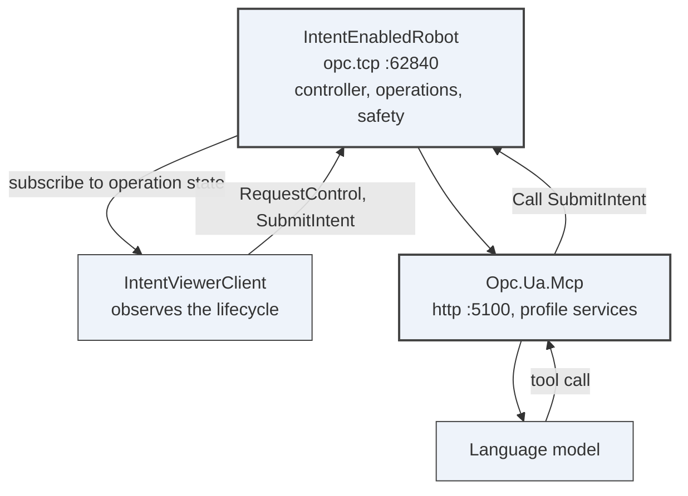
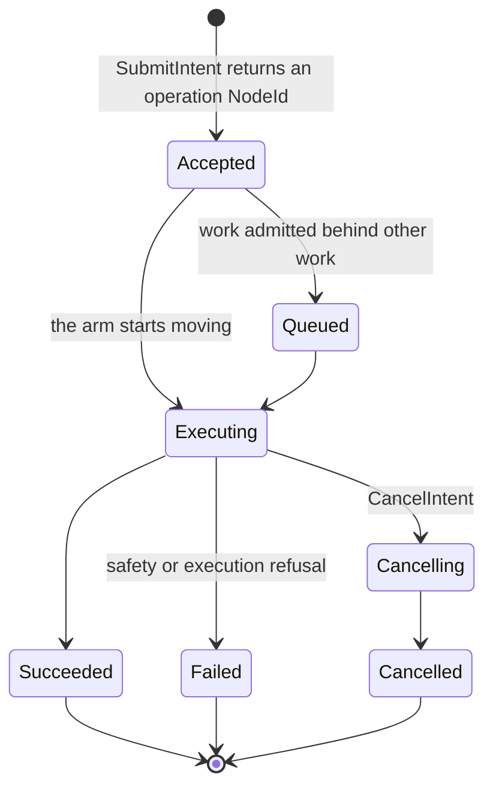

# Demo 5 — Robot Intent viewer plus MCP

A Robot Intent server publishes one collaborative arm, its frames, tool, target locations, capabilities,
OpenUSD representation and Part 10 intent lifecycle. The viewer discovers that surface and watches it
live, while an MCP client can issue the same task-level command: pick from here, place there, or move to
a target, without embedding a robot program.

## What it proves

It proves the Robot Intent draft can command a robot through declared capabilities, observable Part 10
operations and the RI-Interop-40010 link, while an agent uses the standard OPC UA MCP tool surface.

## Topology



Two clients, one Server, the same Part 4 services under both. MCP is the demo 1 tool surface pointed
at a different Server.

## The operation lifecycle



The client subscribes to the operation node rather than waiting on the Method call. A refusal is an
ordinary output with `Accepted` false and an `IntentFailureEnum`, not a bad Service StatusCode.

## Prerequisites

- PowerShell 7.4 or later.
- .NET SDK 10.0 or later.
- A `UA-.NETStandard` checkout on `master`.
- An MCP-capable client for the agent-driven part.
- Optional OpenUSD viewer payload if you want viewport mode; the script uses headless mode.

## Run it

```powershell
.\decks\demos\05-robot-intent-viewer-mcp\run-demo.ps1 -StackRoot $env:OPCUA_STACK_ROOT
```

## Step by step

1. **Build the robot server, viewer client and MCP server.** On screen: the script builds
   `IntentEnabledRobot`, `IntentViewerClient` and `Opc.Ua.Mcp`. Say: "This is one Server, one normal
   OPC UA client, and the same MCP tool host from demo 1."
2. **Start the IntentEnabledRobot server.** On screen:
   `opc.tcp://localhost:62840/IntentEnabledRobot` opens. Say: "The server declares what the arm can do:
   frames, axes, locations, outputs, programs, safety and supported intents."
3. **Start the viewer client in headless mode.** On screen: the client connects, prints facets, obtains
   command authority and lists target pucks. Say: "The viewer did not know these NodeIds in advance; it
   discovered the controller and OpenUSD bindings."
4. **Start the MCP server for the same endpoint.** On screen: `http://localhost:5100/mcp` listens.
   Say: "Now the operator can be a language model using bounded OPC UA service tools."
5. **Drive a task intent from MCP.** On screen: the MCP client connects, browses
   `Server/RobotIntent/Controllers`, requests control and calls `SubmitIntent`. Say: "Submission returns
   an operation NodeId immediately; the work does not live inside the Method call."
6. **Watch the lifecycle and talk through refusal rules.** On screen: the viewer reports progress and a
   terminal result. Say: "Refusals are method outputs with fixed reasons. Safety is observed and used
   to refuse; it is not commanded by this interface."

## Talking points

- Robot Intent supplies task verbs; OPC 40010 still describes the robot.
- `IntentOperationType` is a Part 10 program instance, so long-running work survives the call.
- The server publishes facets such as RI-Base, RI-PickPlace, RI-Mission and RI-Interop-40010.
- NodeIds in intents are untrusted input and are validated under the commanded controller.
- The demo can be driven by the viewer, by MCP tools, or by any standard OPC UA client.

## Troubleshooting

- If the viewer cannot load native OpenUSD, run without `--view`; headless mode is supported.
- If command authority is denied, check that the sample maps anonymous users to the Operator role.
- If an intent is refused, read the `IntentFailureEnum` rather than treating the call as failed.
- `--insecure` and MCP certificate auto-acceptance are for localhost demos only.

## Links

- Robot Intent draft: [OPC-UA-Robot-Intent.md](../../../metaverse-specs/robot-intent/OPC-UA-Robot-Intent.md)
- Robotics guide in the stack checkout: `docs/Robotics.md`
- Robotics samples in the stack checkout: `samples/Robotics/README.md`
- Intent server in the stack checkout: `samples/Robotics/IntentEnabledRobot`
- Viewer client in the stack checkout: `samples/Robotics/IntentViewerClient`
