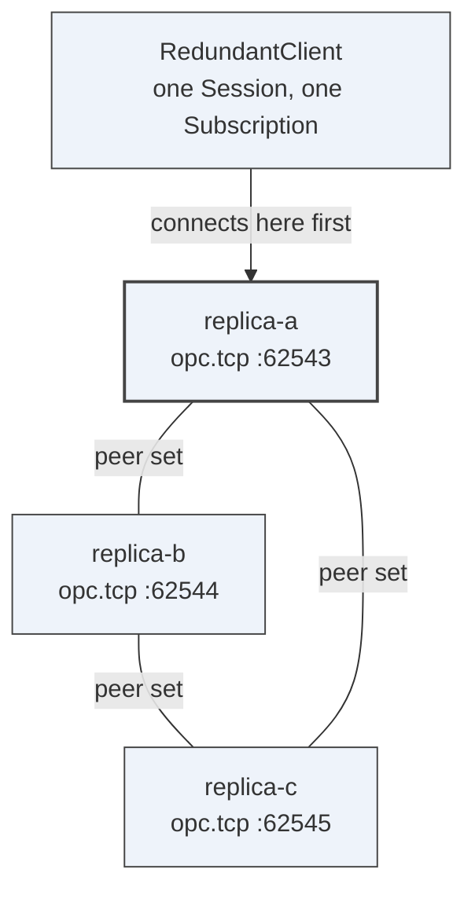
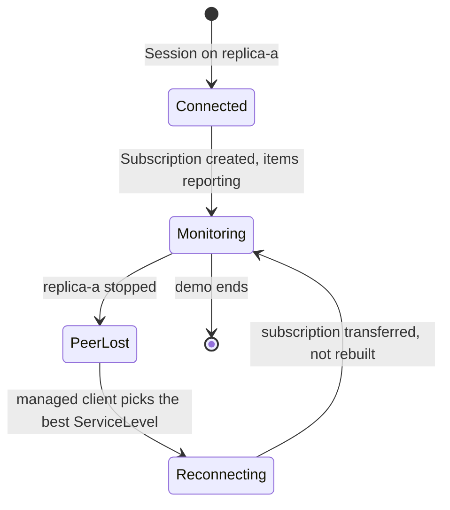

# Demo 6 — Server redundancy

A managed client monitors a redundant OPC UA Server set. The presenter stops the active server while a
subscription is running and the client reconnects or fails over to a healthy peer, logging what was
preserved and what data was missed. This is the concrete cost behind saying "the Server is highly
available" in a distributed system.

## What it proves

It proves the stack reference implementation supports OPC UA server redundancy, managed client failover
and subscription recovery patterns that drafts can rely on when they assume a highly available Server.

## Topology



Each replica is told about the other two through `HA_REDUNDANT_PEERS`, so the redundant set is
configuration rather than discovery. Every replica publishes the same redundancy information and a
ServiceLevel the client can compare.

## Failover



Nothing in the client code handles the transition. That is the claim: the stack honours Part 4
redundancy, so the monitored items keep reporting across the kill.

## Prerequisites

- PowerShell 7.4 or later.
- .NET SDK 10.0 or later.
- A `UA-.NETStandard` checkout on `master`.
- Free local ports `62543`, `62544`, `62545`, `6560`, `6561` and `6562`.

## Run it

```powershell
.\decks\demos\06-server-redundancy\run-demo.ps1 -StackRoot $env:OPCUA_STACK_ROOT
```

## Step by step

1. **Build the redundant server and managed client.** On screen: the script builds
   `RedundantServer.csproj` and `RedundantClient.csproj`. Say: "The server publishes Part 4 redundancy
   metadata; the client calls `WithServerRedundancy()`."
2. **Start three strong-consistency server replicas.** On screen: three endpoints open on ports
   `62543`, `62544` and `62545`. Say: "Raft gives the demo a shared store, so a promoted replica has
   state to continue from."
3. **Start the managed redundant client.** On screen: the client logs redundancy mode, peers and
   monitoring startup. Say: "The client discovers the set from the Server; it is not handed a private
   seed list."
4. **Kill the active replica mid-subscription.** On screen: the script stops replica A by process id.
   Say: "This is the failure we care about: the subscription is already active when the server
   disappears."
5. **Read the client log lines.** On screen: `CONNECTED`, `FAILOVER`, `DATA LOSS` or `HA OK` lines
   appear. Say: "HA is not a slogan. It is redundancy metadata, service levels, peer discovery,
   mirrored state and client policy."

## Talking points

- OPC UA Part 4 separates transparent and non-transparent server redundancy.
- `Server.ServiceLevel` tells clients whether a peer is healthy, degraded, maintenance or no-data.
- `HotAndMirrored` and transparent deployments require mirrored session and subscription state.
- `TransferSubscriptions` and republish reduce loss, but they do not make every failover lossless.
- PubSub has a parallel active/standby story with sequence-number continuity.

## Troubleshooting

- If a port is busy, stop the other sample before running this script.
- `HA_INSECURE=true` is set only for an isolated localhost demo without a production record key.
- If failover does not occur, confirm all three Raft ports are reachable and no firewall blocks local
  TCP connections.
- For container or Kubernetes deployments, use the sample compose files and Kubernetes guide instead.

## Links

- High availability guide: `docs\HighAvailability.md` in the stack checkout
- TransferSubscriptions guide: `docs\TransferSubscription.md` in the stack checkout
- PubSub HA guide: `docs\PubSubHighAvailability.md` in the stack checkout
- Sample tests: `docs\RedundancySampleTests.md` in the stack checkout
- Server sample: `samples\RedundantServer` in the stack checkout
- Client sample: `samples\RedundantClient` in the stack checkout
