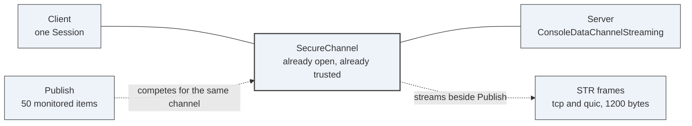
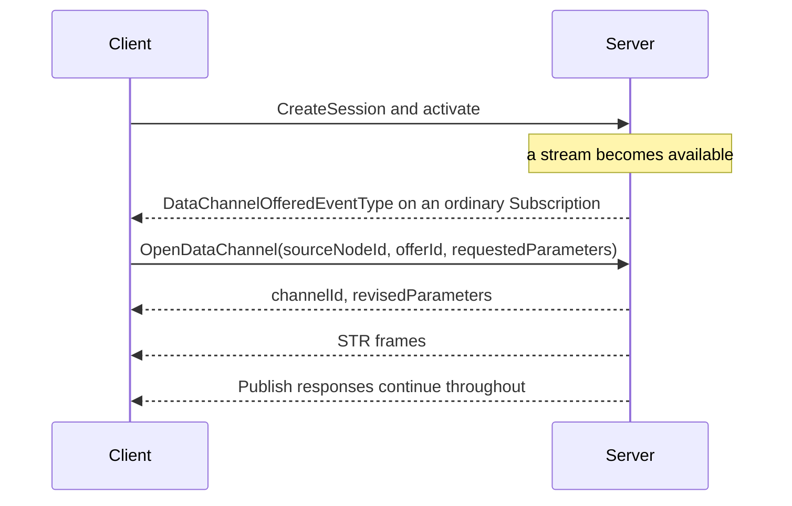

# Demo 8 — Media over Data Channels

## What this shows

- `OpenDataChannel` is served by a real `StandardServer` through a real Session.
- Data Channel frames interleave with normal Service traffic instead of opening a second protocol.
- `opc.quic` binds a data channel to a QUIC stream and lets QUIC own stream flow control.
- The sample reports channel id, revised parameters, received frames, credit stalls and throughput.

## What it proves

It proves the Data Channels draft is concrete enough to move media-like bytes on the SecureChannel that is already open: no second port, no second handshake and no second trust anchor. This is the transport assumption the Vision draft uses when it says media is brokered, not carried.

## Topology



No second port, no second handshake, no second trust anchor. That is the whole argument for putting
media here rather than beside the Server.

## The exchange



The offer arrives on an ordinary Subscription, so no new notification mechanism is introduced. A
Client that never subscribed never learns of the offer, which is the correct outcome.

## Prerequisites

- PowerShell 7.4 or later.
- .NET SDK 10.0 or later.
- A UA-.NETStandard checkout on the feature branch.
- QUIC support from the platform and msquic if you want the `opc.quic` leg; the TCP leg still runs without it.

Use a separate worktree if you keep `master` untouched:

```powershell
git -C $env:OPCUA_STACK_ROOT fetch --all
git -C $env:OPCUA_STACK_ROOT worktree add -b data-channels-quic-experimental ..\ua-datachannels origin/data-channels-quic-experimental
```

Or switch a disposable checkout:

```powershell
git -C $env:OPCUA_STACK_ROOT\..\ua-datachannels fetch --all
git -C $env:OPCUA_STACK_ROOT\..\ua-datachannels switch --track -c data-channels-quic-experimental origin/data-channels-quic-experimental
```

## Run it

```powershell
.\decks\demos\08-media-data-channels\run-demo.ps1 -StackRoot $env:OPCUA_STACK_ROOT\..\ua-datachannels
```

Use `-NoBuild` after a successful build. Use `-KeepRunning` only when you want to inspect a process the script started; this script normally runs foreground sample commands and exits.

## Step by step

1. **Build the streaming sample.** On screen: only `samples\ConsoleDataChannelStreaming` builds. Say: "This is not a framing unit test; it is the worked sample from the branch."
2. **Run the server-mode TCP stream.** On screen: the sample opens a channel through a Session and reports revised channel parameters. Say: "Service traffic and STR frames share one SecureChannel, with credit preventing starvation."
3. **Run the server-mode QUIC stream.** On screen: the same application reports `Quic` framing or explains that QUIC is unavailable. Say: "The app code did not change; only the transport binding did."
4. **Run the benchmark with competing Publish load.** On screen: a small table compares baseline and monitored-item load. Say: "This is the question media raises: does the stream starve the control path?"
5. **Read the result counters.** On screen: focus on `frames received`, `frames discarded`, `credit stalls` and `transport chan id`. Say: "Those counters are the visible contract between the draft and an operator."

## Talking points

- `STR` chunks are provisional and experimental; final identifiers are not assigned.
- A peer never sends a frame before `OpenDataChannel` succeeds.
- The single-chunk rule avoids blocking the ordinary message assembler.
- Unreliable QUIC datagrams are not exposed by .NET 10, so the sample refuses that mode honestly.
- Vision still brokers media by reference by default; a Data Channel is the optional in-band path.

## Troubleshooting

- If the script refuses to run on `master`, use the worktree command above and pass that path as `-StackRoot`.
- If the QUIC leg exits with "QUIC is unavailable", install platform QUIC support or present the TCP leg and the branch documentation.
- If a build fails before generated code is current, follow the build note in `docs\DataChannels.md` and build the source-generation projects first.
- If benchmark rows are too short to show Publish traffic, increase `--frames` in the script temporarily.

## Links

- Branch documentation: `docs\DataChannels.md` in the stack checkout on `origin/data-channels-quic-experimental`
- Sample: `samples\ConsoleDataChannelStreaming`
- QUIC binding: `src\Opc.Ua.Bindings.Quic`
- Core implementation: `src\Opc.Ua.Core\Stack\DataChannels`
- [Draft](../../../core-specs/data-channels/OPC-UA-Data-Channels.md)
- [Vision draft](../../../metaverse-specs/vision/OPC-UA-Vision.md)
