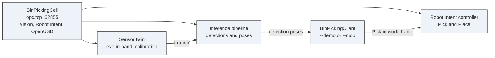
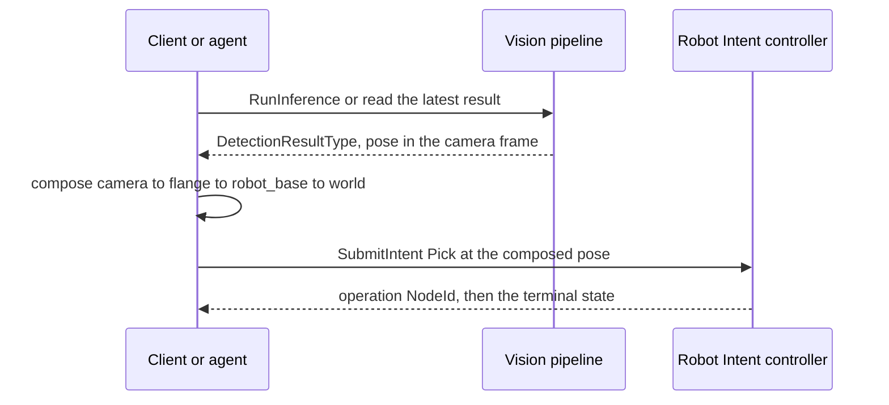

# Demo 9 — Vision

## What this shows

- `VisionSensorType` describes physical and simulated sensors with the same contract.
- Media is brokered by endpoints, not moved through ordinary OPC UA variables.
- An inference pipeline points to an AI Model Management deployment by `NodeId`.
- Results have standard shapes: inspection characteristics, detections, poses, segmentations and feedback.

## What it proves

It proves the missing layer between existing OPC UA machine vision specifications and real integrations. OPC 40100-1 orchestrates jobs but leaves result content application-specific, and OPC 40010-1 has no camera, perception or calibration model. This draft defines the shape that lets two Servers publish comparable results.

## Topology



## The perception-to-action loop



The composition step is only possible because the vision-side and robot-side frame ids are the same
ids. That is the point of putting perception and actuation in one address space.

**This does not run yet.** The Vision samples on `marcschier/vision-guided-picking` do not compile,
so the diagrams above describe the shape rather than a terminal you can show.

## Prerequisites

- This repository.
- The Vision draft and generated NodeSet under `metaverse-specs\vision`.
- The Data Channels draft for the optional in-band media path.
- The AI Model Management draft for the deployment that interprets the image.

## Where the code is

An implementation exists on the stack branch `marcschier/vision-guided-picking`:
`Opc.Ua.Vision`, `Opc.Ua.Vision.Client`, `Opc.Ua.Vision.Server`, `Opc.Ua.Vision.OpenUsd` and
`Tools\Opc.Ua.Mcp.Vision`, plus a `samples\Robotics\BinPickingCell` server and a paired
`samples\Robotics\BinPickingClient`.

**It is not runnable end to end yet, so this demo has no script.** The branch is under active
development and its Vision samples do not currently compile — `BinPickingCell` fails on two
nullable-analysis errors in `BinPickingInferenceProof.cs` and `BinPickingOffServerProof.cs`, in
both Debug and Release, and the newer `samples\Vision\VisualInspectionCell` fails on several more.
The branch's own upstream pull request, OPCFoundation/UA-.NETStandard#4235, is a draft with the
main build red for the same reason. Present this one as paper and say the implementation is in
flight. Do not promise a terminal.

That implementation is worth talking about even though it does not run, because it is what has been
moving the draft — 0.1.0 to 0.4.0 so far. See `metaverse-specs\vision\CHANGELOG.md`.

## How to present it without running it

Open the draft and use its architecture diagram and type inventory:

```powershell
code metaverse-specs\vision\OPC-UA-Vision.md
code metaverse-specs\vision\Opc.Ua.Vision.NodeSet2.xml
code metaverse-specs\ai-model-management\OPC-UA-AI-Model-Management.md
code core-specs\data-channels\OPC-UA-Data-Channels.md
```

## Step by step

1. **Start at the sensor.** Show clause 4.2 and `VisionSensorType`. Say: "A client starts at `Server/Vision/Sensors`; it does not need to know whether the sensor is physical or simulated."
2. **Show media as a brokered resource.** Show clause 6. Say: "The model describes how to obtain a stream or clip. It does not put video frames in ordinary variables."
3. **Connect the AI deployment.** Show clause 8.1 and the AI Model Management draft. Say: "The pipeline points to the deployment that runs the model; that is how a result remains auditable."
4. **Show the standard result shape.** Show `InspectionResultType`, `DetectionResultType` and `VisionPose3DDataType`. Say: "This is the part existing OPC UA vision work leaves undefined."
5. **End with feedback.** Show the feedback and learning sections. Say: "Corrections are not comments in a log. They are data that can feed the next training dataset."

## Talking points

- The default path brokers media by reference; Data Channels are optional.
- `RealityKind` is the only sim-versus-real discriminator a client should need.
- A result names frames and calibration, so a pose can be acted on by a robot.
- AI Model Management answers which model produced the result.
- The draft deliberately avoids depending on OPC 40100, OPC 40010, DI or OpenUSD in the base profile.

## Troubleshooting

- If someone asks to run it, say the implementation is in progress on `marcschier/vision-guided-picking` and does not yet run the loop end to end.
- If a camera transport question comes up, keep GenICam and GigE Vision below this model; this draft is the semantic and control layer.
- If media transport dominates the conversation, separate the default brokered endpoint from the optional Data Channel facet.
- If the NodeSet is opened in a generic viewer, remind the audience that generated NodeIds are provisional.

## What the implementation has already found

Three releases so far, and each one came out of building against the OPC UA .NET Standard stack
rather than out of review. Issues #66 to #71 came from working the bin-picking scenario:

- **All 13 Methods with arguments were uncallable.** `InputArguments` and `OutputArguments` were
  qualified into the model's own namespace instead of namespace 0, so a stack resolving a Method's
  signature found none and refused every call with `Bad_TooManyArguments`. The implementation's own
  unit tests passed throughout, because they call the handler delegates directly; only an
  end-to-end session surfaced it.
- **A depth sensor could not state its depth image shape**, so implementations were carrying it in
  vendor-private Properties — the exact failure the model exists to prevent.
- **An empty observation was inexpressible**, so an agent that had emptied the bin could not report
  it, and a false positive could not be retracted.

0.3.0 separated results from events — what *is* against what *happened* — and 0.4.0 addressed the
assumption underneath the correlation rule: Annex I.7 told a consumer to correlate a Vision event
with a Robot Intent event by their `Time`, but nothing said whether the two Servers' clocks agree.
`ClockSynchronised` and `TimeSyncSource` let a Server say, and both are Optional on purpose — a
**shall** most conformant Servers would fail is a fiction, so what is required is only that a
Server unable to support the correlation says so.

This is the honest version of "what it would take to make this runnable": most of it is written,
and writing it is what found the defects above.

## What is still missing to make it runnable

- The Vision samples compile. `BinPickingCell` and `VisualInspectionCell` both fail
  nullable-analysis, which is what keeps upstream #4235 red.
- The bin-picking client's perception loop correlates a `RunInference` result with a published
  result node.
- A `run-demo.ps1` here, once both hold.

## Links

- [Vision draft](../../../metaverse-specs/vision/OPC-UA-Vision.md)
- [Vision changelog](../../../metaverse-specs/vision/CHANGELOG.md)
- [Vision research report](../../../metaverse-specs/vision/OPC-UA-Vision-Research.md)
- [Vision NodeSet](../../../metaverse-specs/vision/Opc.Ua.Vision.NodeSet2.xml)
- [Data Channels draft](../../../core-specs/data-channels/OPC-UA-Data-Channels.md)
- [AI Model Management draft](../../../metaverse-specs/ai-model-management/OPC-UA-AI-Model-Management.md)
