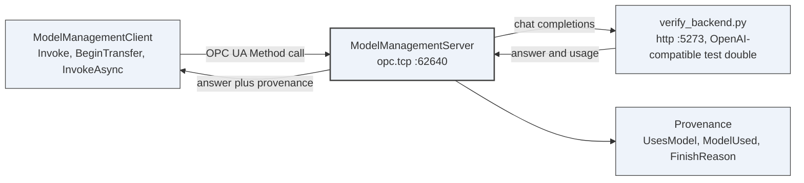
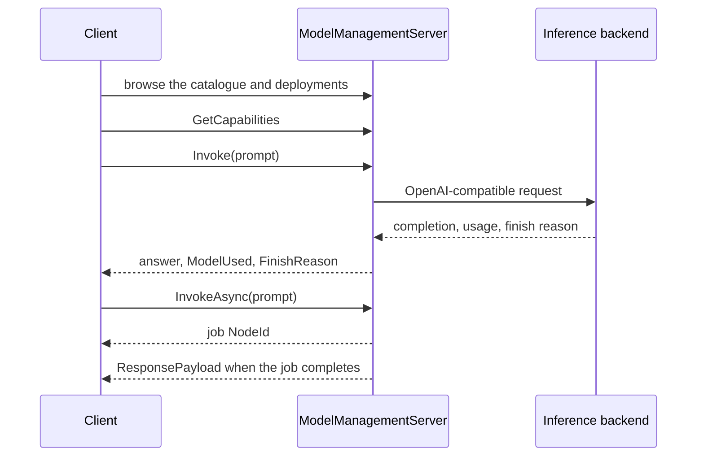

# Demo 10 — AI model loading

## What this shows

- A model source is configured once and surfaced through OPC UA nodes.
- Deployments expose where inference executes, data egress, retention and payload limits.
- `UsesModel` and `ModelUsed` give the provenance needed to audit an answer later.
- The sample client exercises `GetCapabilities`, `Invoke`, `BeginTransfer`, `InvokeAsync`, `TestConnection` and `ListModels`.

## What it proves

It proves the control plane for model execution can be OPC UA. A client calls one deployment shape whether inference is local, hosted or a fallback, and the result carries enough provenance to answer which model produced this answer six months later.

## Topology



## The call flow



Where inference runs is an implementation detail; what answered is not. The backend is a test double
so the OPC UA path is runnable without a cloud account, and no cloud-vendor SDK is referenced.

## Prerequisites

- PowerShell 7.4 or later.
- .NET SDK 10.0 or later.
- Python on PATH for the included `verify_backend.py` test double.
- A UA-.NETStandard checkout on the feature branch.
- Free local ports `5273` and `62640`.

Use a separate worktree if you keep `master` untouched:

```powershell
git -C $env:OPCUA_STACK_ROOT fetch --all
git -C $env:OPCUA_STACK_ROOT worktree add -b marcschier/vision-guided-picking ..\ua-ai-models fork/marcschier/vision-guided-picking
```

Or switch a disposable checkout:

```powershell
git -C $env:OPCUA_STACK_ROOT\..\ua-ai-models fetch --all
git -C $env:OPCUA_STACK_ROOT\..\ua-ai-models switch --track -c marcschier/vision-guided-picking fork/marcschier/vision-guided-picking
```

## Run it

```powershell
.\decks\demos\10-ai-model-loading\run-demo.ps1 -StackRoot $env:OPCUA_STACK_ROOT\..\ua-ai-models
```

Use `-NoBuild` after a successful build. Use `-KeepRunning` if you want to leave the stub backend and server open for manual browsing.

## Step by step

1. **Build the server and client.** On screen: only the AI Model Management sample projects build. Say: "The NodeSet is source-generated from the draft model."
2. **Start the OpenAI-compatible test backend.** On screen: port `5273` accepts connections. Say: "This is a test double, not a model provider; it exists so the OPC UA path can run without a cloud account."
3. **Start the OPC UA AI Model Management server.** On screen: the server listens at `opc.tcp://localhost:62640/ModelManagementServer`. Say: "The Server publishes deployments, model sources, catalogue and learning-loop nodes."
4. **Run the sample client.** On screen: the client prints the AI root, deployments, model id, digest, capabilities and invocation output. Say: "The payload is opaque; the envelope and provenance are standard."
5. **Read the provenance.** On screen: focus on `UsesModel`, `ModelUsed`, `Usage`, `FinishReason`, transfer state and source reachability. Say: "This is the audit trail, not a console flourish."

## Talking points

- The branch contains a runnable sample, not only library code.
- The learning loop is simulated; the sample does not retrain a model.
- The test backend is not a provider and should not be presented as one.
- `CredentialReference` names a secret; it never carries the secret value.
- `EgressPermitted` answers where data goes, not whether transport encryption is on.

## Troubleshooting

- If the script refuses to run on `master`, use the worktree command above and pass that path as `-StackRoot`.
- If Python is missing, install it or point the server at a real OpenAI-compatible endpoint using the environment variables in the branch README.
- If the client cannot connect, confirm port `62640` is free and wait for the server to finish startup.
- If a real endpoint is used, provide credentials through a managed secret location, not on the command line.

## Links

- Branch sample README: `samples\AI\README.md` on `fork/marcschier/vision-guided-picking`
- Server sample: `samples\AI\ModelManagementServer`
- Client sample: `samples\AI\ModelManagementClient`
- Test backend: `samples\AI\verify_backend.py`
- Libraries: `src\Opc.Ua.AI`, `.Client`, `.Inference`, `.Server`
- [Draft](../../../metaverse-specs/ai-model-management/OPC-UA-AI-Model-Management.md)
- [Implementation examples](../../../metaverse-specs/extras/ai-model-management/examples)
