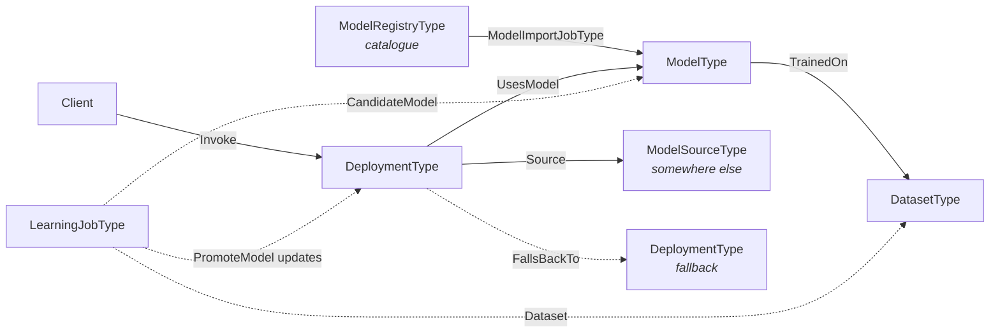
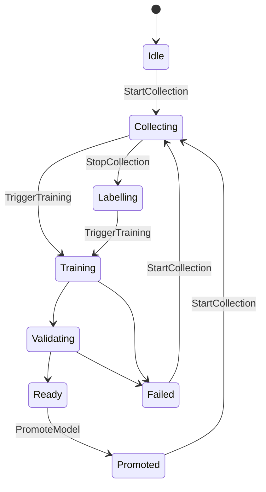
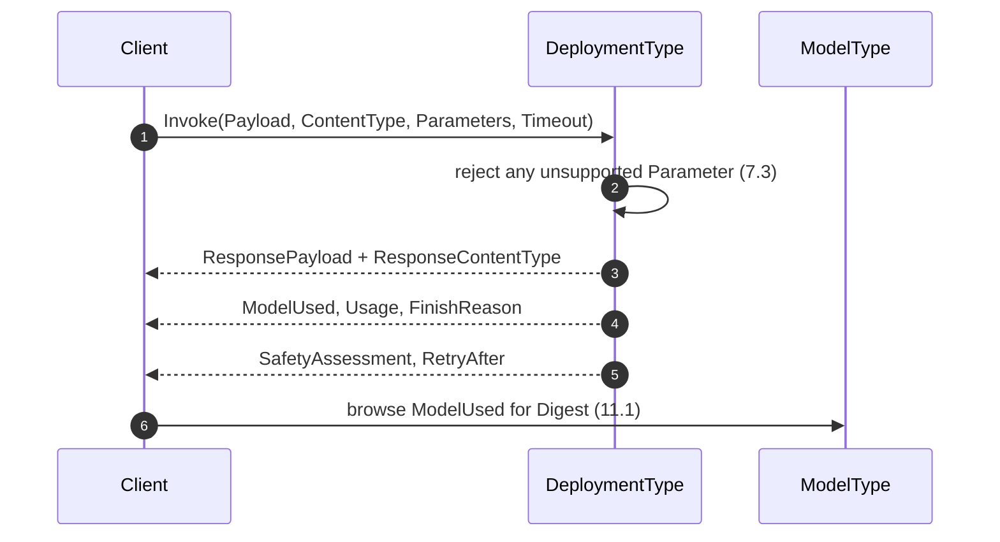
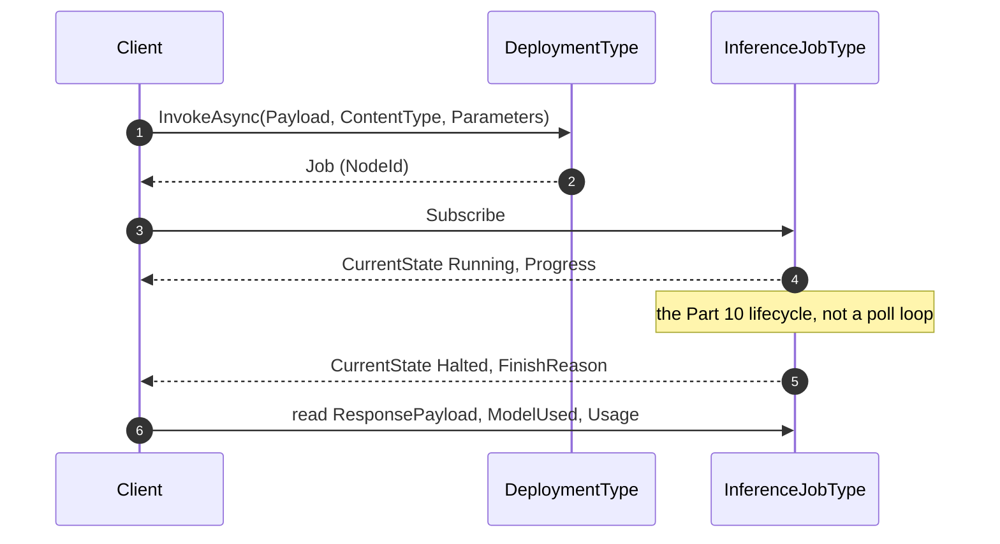
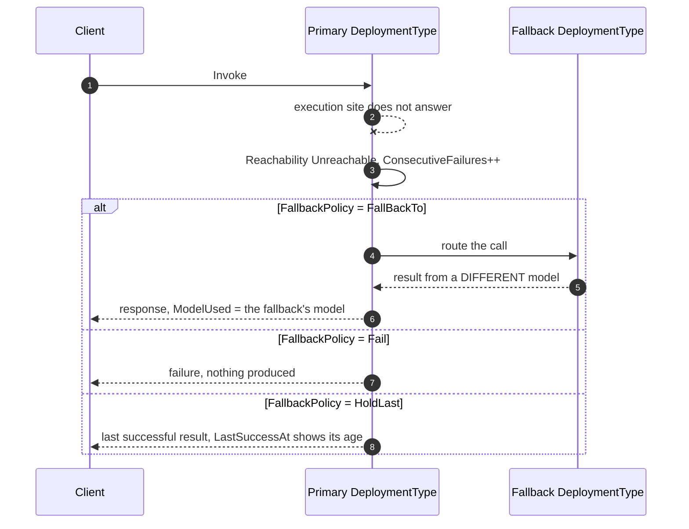
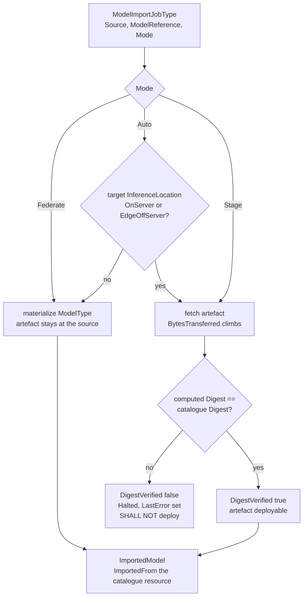
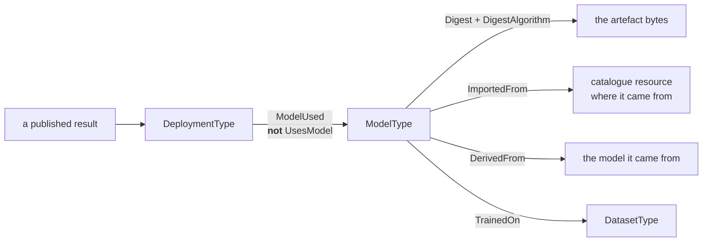

# OPC UA — AI Deployment and Learning

> Status: Working-group draft (Release 0.2.0). This document, together with `Opc.Ua.AiDeployment.NodeSet2.xml` and `Opc.Ua.AiDeployment.NodeIds.csv`, defines an OPC UA information model for **the AI models an installation runs**: what a model is, what it was trained on, where it executes, and how a better one replaces it.
>
> It is deliberately **domain-neutral**. Nothing here names a camera, a sensor, an image or a robot: a model is trained on a dataset, deployed somewhere, and superseded — and that story is the same whether the input is a photograph, a vibration spectrum or a process trace.
>
> Nothing here is normative, official, or endorsed by the OPC Foundation or IDTA; namespace URIs and NodeIds are **provisional** and for prototyping only.

## Contents

- [1 Scope](#1-scope)
  - [1.1 Motivation](#11-motivation)
  - [1.2 What this specification does not do](#12-what-this-specification-does-not-do)
  - [1.3 Capabilities and versioning](#13-capabilities-and-versioning)
- [2 Normative references](#2-normative-references)
- [3 Terms, definitions and abbreviations](#3-terms-definitions-and-abbreviations)
- [4 Overview and concepts](#4-overview-and-concepts)
  - [4.1 The objects and what joins them](#41-the-objects-and-what-joins-them)
  - [4.2 How a consuming specification binds to this one](#42-how-a-consuming-specification-binds-to-this-one)
  - [4.3 A model is a business artefact, not device firmware](#43-a-model-is-a-business-artefact-not-device-firmware)
- [5 Information model](#5-information-model)
  - [5.1 Type hierarchy](#51-type-hierarchy)
  - [5.2 `ModelType`](#52-modeltype)
  - [5.3 `DatasetType`](#53-datasettype)
  - [5.4 `DeploymentType`](#54-deploymenttype)
  - [5.5 `UsesModel` and `TrainedOn`](#55-usesmodel-and-trainedon)
  - [5.6 `AiJobType` and the three jobs](#56-aijobtype-and-the-three-jobs)
- [6 The learning loop (normative)](#6-the-learning-loop-normative)
  - [6.1 Method behaviour and StatusCodes (normative)](#61-method-behaviour-and-statuscodes-normative)
  - [6.2 Where the loop meets the rest of the model](#62-where-the-loop-meets-the-rest-of-the-model)
  - [6.3 A Server may implement very little of this](#63-a-server-may-implement-very-little-of-this)
- [7 Inference (normative)](#7-inference-normative)
  - [7.1 One call, wherever the model runs](#71-one-call-wherever-the-model-runs)
  - [7.2 The payload is opaque, the envelope is not](#72-the-payload-is-opaque-the-envelope-is-not)
  - [7.3 Parameters, and why an ignored one is worse than a rejected one](#73-parameters-and-why-an-ignored-one-is-worse-than-a-rejected-one)
  - [7.4 Capabilities are asked, not assumed](#74-capabilities-are-asked-not-assumed)
  - [7.5 Incremental results](#75-incremental-results)
  - [7.6 Work that does not finish while the caller waits](#76-work-that-does-not-finish-while-the-caller-waits)
- [8 Consuming a model hosted elsewhere (normative)](#8-consuming-a-model-hosted-elsewhere-normative)
  - [8.1 What a URI does not tell you](#81-what-a-uri-does-not-tell-you)
  - [8.2 The wire contract, and the credential that is never a secret](#82-the-wire-contract-and-the-credential-that-is-never-a-secret)
  - [8.3 Pinned, or following something that moves](#83-pinned-or-following-something-that-moves)
  - [8.4 When the far end stops answering](#84-when-the-far-end-stops-answering)
  - [8.5 Where the data goes](#85-where-the-data-goes)
- [9 The catalogue and the bridge (normative)](#9-the-catalogue-and-the-bridge-normative)
  - [9.1 A model catalogue is a registry](#91-a-model-catalogue-is-a-registry)
  - [9.2 The bridge](#92-the-bridge)
  - [9.3 Federate or stage](#93-federate-or-stage)
  - [9.4 Staging is where the digest matters](#94-staging-is-where-the-digest-matters)
- [10 Governance and provenance (normative)](#10-governance-and-provenance-normative)
  - [10.1 The nameplate does not say whether it may be used](#101-the-nameplate-does-not-say-whether-it-may-be-used)
  - [10.2 A metric without its threshold cannot be acted on](#102-a-metric-without-its-threshold-cannot-be-acted-on)
  - [10.3 Lineage is a chain](#103-lineage-is-a-chain)
  - [10.4 Safety findings](#104-safety-findings)
- [11 Security](#11-security)
  - [11.1 Provenance is the point of the digest](#111-provenance-is-the-point-of-the-digest)
  - [11.2 URIs are untrusted input](#112-uris-are-untrusted-input)
  - [11.3 Promotion needs its own authorization](#113-promotion-needs-its-own-authorization)
  - [11.4 A digest is not a signature](#114-a-digest-is-not-a-signature)
- [12 Profiles and conformance units](#12-profiles-and-conformance-units)
  - [12.1 Declaring conformance](#121-declaring-conformance)
  - [12.2 Facets](#122-facets)
- [13 Deliverables and reproducibility](#13-deliverables-and-reproducibility)
- [Annex A — Information model (generated)](#annex-a--information-model-generated)
- [Annex B — Informative alignments](#annex-b--informative-alignments)
- [Annex C — A worked arrangement (informative)](#annex-c--a-worked-arrangement-informative)
  - [C.1 The situation](#c1-the-situation)
  - [C.2 Getting the models here](#c2-getting-the-models-here)
  - [C.3 The two deployments](#c3-the-two-deployments)
  - [C.4 A normal call, and a bad afternoon](#c4-a-normal-call-and-a-bad-afternoon)
  - [C.5 What a throttle would have done instead](#c5-what-a-throttle-would-have-done-instead)
- [Annex D — Deploying a classical model (informative)](#annex-d--deploying-a-classical-model-informative)
  - [D.1 The model](#d1-the-model)
  - [D.2 In the catalogue](#d2-in-the-catalogue)
  - [D.3 Getting it onto the controller](#d3-getting-it-onto-the-controller)
  - [D.4 The shape contract](#d4-the-shape-contract)
  - [D.5 The deployment](#d5-the-deployment)
  - [D.6 Calling it](#d6-calling-it)
  - [D.7 Capabilities, and an absence that means nothing](#d7-capabilities-and-an-absence-that-means-nothing)

---

## 1 Scope

This specification defines an OPC UA information model that lets a Server describe:

- **what model it is running** — identity, version, framework, format, and the digest that makes the artefact verifiable;
- **what that model was trained on** — including whether the data was real, synthetic or both;
- **where inference executes** — in the Server, on an edge node, in a cloud service, or in a simulator;
- **how to actually run it** — one invocation surface that does not change with any of the above (clause 7);
- **how to run a model this Server does not host** — the wire contract, the credential, the capabilities, and what happens when the link fails (clause 8);
- **how a model gets here** — pulling one from a catalogue and either describing it where it stands or bringing its bytes across, with the digest checked at the moment that matters (clause 9);
- **whether it may be used at all** — what it is for, where it stops working, how it measured, and whether calling it sends plant data off site (clause 10);
- **how a model is replaced** — the capture, label, train and promote loop, and who is allowed to complete it.

### 1.1 Motivation

An industrial AI model is not device firmware. It is an artefact the operator or system integrator supplies, versions and approves, and the same physical equipment runs different models over its life. Someone has to be able to ask *which model produced this decision, what was it trained on, and who promoted it* — and today, no OPC UA specification lets them.

Three IDTA submodel templates describe the pieces — **IDTA 02060** for a model nameplate, **IDTA 02058** for a dataset, **IDTA 02059** for a deployment — but they are Asset Administration Shell templates, not an OPC UA address space. This model aligns with them member-for-member so that an AAS can be populated from these nodes without loss, while remaining browsable, subscribable and callable in its own right.

**Nothing here is specific to any one kind of input.** `TaskKind` is a String. `SourceKind` distinguishes real capture from simulator output. The learning loop runs `Idle → Collecting → Labelling → Training → Validating → Ready → Promoted`. A vibration-analysis model, a process soft sensor and a quality classifier all need exactly this, and none of them need a lens — which is why the model is domain-neutral by construction rather than by convention, and why its validator fails the build if a type name acquires a domain term.

### 1.2 What this specification does not do

- It does **not** carry model artefacts or training data. `ArtifactUri` says where the bytes are; the bytes travel by whatever means already moves large files, and `Digest` is what makes the retrieval verifiable.
- It does **not** define what an inference payload *contains*. Clause 7 defines the envelope — routing, parameters, accounting, why output stopped, which model answered — and leaves the payload opaque, because what you pass to a model and what comes back is domain vocabulary: an image and a set of detections, a spectrum and a fault class. An envelope that tried to type that would need extending for every domain that ever adopted it.
- It does **not** define a training algorithm, a scheduler or an MLOps platform. `TriggerTraining` requests training and `LearningJobType` observes it; where the training runs is out of scope, and clause 6 is explicit that a Server may implement only the capture stages.
- It is **not** a governance or compliance framework. It records what is needed to answer provenance questions; whether an installation is permitted to run a given model is decided elsewhere.

### 1.3 Capabilities and versioning

This specification covers the model, the dataset, the deployment, the learning loop, the invocation surface, consumption of externally hosted models, the catalogue and the import bridge.

The NodeSet declares **two** `RequiredModel` entries: the base OPC UA namespace, and *OPC UA — xRegistry*, because the catalogue of clause 9 is a domain extension of that abstract registry rather than a private invention. That is a real cost and it is taken deliberately — a model catalogue **is** a registry, and defining a second one here would leave two incompatible ways to describe the same artefact.

It is worth being precise about what that dependency does **not** reach. A consuming specification still binds to this one through a plain `NodeId` Property (§4.2) and takes no NodeSet dependency of its own, so a vision or condition-monitoring Server is unaffected by this model's dependencies. The obligation lands on a Server that implements *this* specification, not on one that merely points at it.

---

## 2 Normative references

- **OPC 10000-3, -4, -5** — Address Space Model, Services, Information Model.
- **OPC 10000-6** — Mappings. Structure encoding of the DataTypes listed in Annex A.
- **OPC 10000-10** — Programs. `ProgramStateMachineType` is the base type of `AiJobType` (§5.6) and supplies the lifecycle, the transition events and the `Start`/`Suspend`/`Resume`/`Halt` Methods that every long-running job here inherits rather than reinvents.
- **OPC 10000-5** — `FileType`, reached through xRegistry's `ResourceType`. It is what lets a staged model artefact be read over OPC UA with `Open`/`Read`/`Close` (§9.3).
- **OPC UA — xRegistry** — [`../../core-specs/xregistry/OPC-UA-xRegistry.md`](../../core-specs/xregistry/OPC-UA-xRegistry.md). A **working draft in this repository**, and the one **normative dependency** this model takes beyond base OPC UA. `ModelRegistryType`, `ModelPublisherType`, `ModelResourceType` and `DatasetResourceType` are domain extensions of its `RegistryType`, `GroupType` and `ResourceType` (clause 9). Because it is a draft, its NodeIds are provisional and so, transitively, is this model's dependency on them.

Informative alignments — IDTA 02058, IDTA 02059, IDTA 02060, and the OPC UA ⇄ AAS bridge — are listed in Annex B. They are **not** normative references and impose no dependency, notwithstanding that the member sets here are drawn from them deliberately.

---

## 3 Terms, definitions and abbreviations

| Term | Definition |
|---|---|
| **Model** | A trained artefact that maps input to output. Modelled as `ModelType`. Identity, not behaviour: this specification describes the model, it does not run it. |
| **Dataset** | The samples a model was trained or validated on. Modelled as `DatasetType`. |
| **Deployment** | A model made executable somewhere. Modelled as `DeploymentType`. One model may have several deployments; each names exactly one model. |
| **Inference location** | Whether execution happens in the Server, on an edge node, in a cloud service or in a simulator. It changes the trust boundary and the latency, and it changes nothing else. |
| **Learning job** | One turn of the capture, label, train and promote loop. Modelled as `LearningJobType`. |
| **Promotion** | Making a candidate model the one deployments use. The one operation here that changes what the equipment does. |
| **Digest** | A cryptographic hash of an artefact, which is what makes a retrieved artefact verifiable as the one described. |

---

## 4 Overview and concepts

### 4.1 The objects and what joins them



A dataset trains a model; a deployment executes one; a client calls the deployment. Where the model runs somewhere this Server does not control, the deployment names a **source** that says how to reach it and what to do when it cannot. Where a model comes from a catalogue, an **import job** brings it — as a description, or as bytes. A learning job accumulates a new dataset, produces a candidate, and promotes it, at which point the deployment executes a different model and the cycle repeats.

The four questions this arrangement is arranged to answer:

| Question | Where it is answered |
|---|---|
| What is running, and can I audit it? | `ModelType`, `DatasetType`, §11.1 |
| How do I run it? | `DeploymentType.Invoke` (§7) |
| What if it is not here, or stops answering? | `ModelSourceType`, `FallbackPolicy` (§8) |
| How did it get here, and may it be used? | `ModelImportJobType` (§9), `ModelCardType` (§10) |

A dataset trains a model; a deployment executes one. A learning job accumulates a new dataset, produces a candidate, and promotes it — at which point the deployment executes a different model and the cycle repeats.

`UsesModel` and `TrainedOn` are **references**, because they are structural. `Dataset`, `BaseModel` and `CandidateModel` on a learning job are **NodeId Properties**, because a job's relationships change as it runs and a reference set that churns is harder to observe than a value that changes.

### 4.2 How a consuming specification binds to this one

A specification that runs inference — a vision model, a condition-monitoring model — binds by holding a **`NodeId` Property** naming a `DeploymentType` instance. It does **not** take a `RequiredModel` on this NodeSet and does **not** define a ReferenceType into it.

That keeps both specifications loadable alone. A Server that describes its deployment some other way names that node instead, and a Server that implements neither is unaffected. The cost is that the provenance chain of §11 is only available where both are implemented, which is why it is stated as a conformance condition rather than assumed.

### 4.3 A model is a business artefact, not device firmware

This is the assumption the whole model rests on, so it is stated plainly.

The equipment manufacturer does not supply the model. The operator or the system integrator does, and replaces it, and is answerable for it. A Server therefore **shall** describe the model it is *currently* running rather than the one it shipped with, and `PromoteModel` **shall** require an authorization distinct from the one that permits ordinary operation (§11.3).

The consequence for a reader: every member of `ModelType` is about *this* artefact, and none of it is nameplate data that could have been printed at the factory.

---

## 5 Information model

### 5.1 Type hierarchy

| Type | NodeId | Subtype of |
|---|---|---|
| `AiRootType` | `ns=2;i=1001` | `BaseObjectType` |
| `ModelType` | `ns=2;i=1002` | `BaseObjectType` |
| `DatasetType` | `ns=2;i=1003` | `BaseObjectType` |
| `DeploymentType` | `ns=2;i=1004` | `BaseObjectType` |
| `AiJobType` (abstract) | `ns=2;i=1006` | `ProgramStateMachineType` (`i=2391`) |
| `LearningJobType` | `ns=2;i=1005` | `AiJobType` |
| `ModelImportJobType` | `ns=2;i=1007` | `AiJobType` |
| `InferenceJobType` | `ns=2;i=1008` | `AiJobType` |
| `ModelSourceType` | `ns=2;i=1009` | `BaseObjectType` |
| `EvaluationRunType` | `ns=2;i=1014` | `BaseObjectType` |
| `ModelCardType` | `ns=2;i=1015` | `BaseObjectType` |
| `ModelRegistryType` | `ns=2;i=1010` | xRegistry `RegistryType` |
| `ModelPublisherType` | `ns=2;i=1011` | xRegistry `GroupType` |
| `ModelResourceType` | `ns=2;i=1012` | xRegistry `ResourceType` |
| `DatasetResourceType` | `ns=2;i=1013` | xRegistry `ResourceType` |

`LearningJobType` keeps NodeId `1005` although it now sits below `1006`. NodeIds here are **append-only**: a type that acquires a base type does not move, because renumbering to make the file read tidily would break every client that cached an identifier.

### 5.2 `ModelType`

Identity, provenance and interface of a trained model. Aligned with IDTA 02060.

`ModelId`, `Name`, `Version`, `Digest` and `DigestAlgorithm` are **Mandatory**. The first three because a model that cannot be named cannot be discussed; the last two because clause 11 depends on them, and a rule that depends on an Optional member is a rule a conformant Server can silently not satisfy.

`TaskKind` is a **String**, not an enumeration. The set of things models do is not closed, and an enumeration would date faster than the models it describes.

`LabelClasses` is an ordered array whose **index** is the contract. A consuming specification's class identifier refers to a position in it, so a Server **shall not** reorder it in place: a model whose class 3 silently becomes class 4 produces results that are wrong in a way nothing detects.

`Inputs` and `Outputs` carry `TensorSignatureDataType` (`ns=2;i=3050`) — name, element type, shape with `-1` for a dynamic axis, and an optional layout hint. This is what lets a client check that what it intends to send matches what the model expects, before it sends it.

Clause 7 leaves the invocation payload opaque, so these signatures are the **only** machine-readable description of what a deployment will accept. A client that ignores them discovers a shape mismatch as a rejected call at run time; one that reads them discovers it at configuration time, which is the difference between a commissioning problem and a production one.

#### 5.2.1 Identity beyond the artefact

`Publisher` completes the `Publisher`, `Name`, `Version` triple by which every catalogue in practice identifies a model (§9.2). It is what makes the same model recognisable across two installations that fetched it from different mirrors — the digests will match, but only if someone already suspected the two were the same artefact, and the triple is what raises that suspicion.

`ProvenanceUri` is the hand-off point to whatever system governs approval. This model records *what is deployed and where it came from*; who signed it off, against which release criteria, under what retention policy, is the business of the organisation's governance system and deliberately not modelled here.

#### 5.2.2 What it costs, and at what precision

`ParameterCount` is a crude proxy for what a model will cost to run, and is the one such figure that is universally published.

`Quantization` names the numeric precision the artefact is stored in — `fp32`, `int8`, `fp8`. This is **not** a packaging detail. A quantized model is a different artefact that produces different answers, and treating it as a variant of the original is how a model evaluated at full precision ends up deployed at reduced precision without anyone re-measuring it. §10.3 requires the derivation to be stated as well.

`SafetyPolicyUri` names the policy applied to this model's output, where one is. Like every URI here it is untrusted input (§11.2).

`Card` reaches the `ModelCardType` of §10.1. The split is deliberate: the nameplate answers *which artefact is this*, the card answers *should this be running on my line*, and those are asked by different people at different times.

### 5.3 `DatasetType`

What a model was trained or validated on. Aligned with IDTA 02058.

`SourceKind` (`DatasetSourceEnum`, `ns=2;i=3004`) is `Real` 0, `Synthetic` 1 or `Mixed` 2, and is **Mandatory**. It is the provenance a reviewer needs when synthetic data is involved, and the one question about a dataset that cannot be answered by looking at it. `Mixed` is not a hedge — synthetic pre-training followed by real fine-tuning is the common industrial arrangement, and forcing it into either neighbouring value would misdescribe it.

`SampleCount`, `CreatedAt` and `LabelClasses` describe the contents; `ArtifactUri` and `Digest` describe where the data is and how to know it is the data meant.

`LabelClasses` carries the same index-is-the-contract rule as `ModelType`. A dataset whose class list disagrees in **order** with the model trained on it is not detectably wrong anywhere — every identifier resolves, every count is plausible, and every label is off by one.

A dataset is a **sibling** of the model rather than a part of it. It outlives the models trained on it and is cited by several, which is why `TrainedOn` (§5.5) is a repeating reference and why the catalogue gives datasets their own resource type (§9.1).

### 5.4 `DeploymentType`

A model made executable. Aligned with IDTA 02059.

`InferenceLocation` (`InferenceLocationEnum`, `ns=2;i=3001`) is `OnServer` 0, `EdgeOffServer` 1, `Cloud` 2 or `InSimulator` 3, and is **Mandatory**.

> This property changes **where the computation happens and therefore the trust boundary**. It changes nothing else — not the result contract, not the model's identity, not what a client does with the output. A client that branches on it for any reason other than latency, availability or trust has misread it.

`AcceleratorKind` (`AcceleratorKindEnum`, `ns=2;i=3002`) is `Cpu`, `Gpu`, `Npu`, `Fpga`, `Tpu` or `Other`. `State` (`DeploymentStateEnum`, `ns=2;i=3003`) is `Inactive` 0, `Ready` 1, `Active` 2, `Degraded` 3 or `Faulted` 4, and is **Mandatory** because §6 and any consuming specification's availability logic depend on it.

`AcceleratorName` is free text for the specific part, because the enumeration deliberately does not attempt to name every accelerator ever shipped.

`LatencyBudget` states the latency the deployment is expected to meet. It exists so a client can **detect** regression rather than merely experience it: without a declared expectation, a deployment that has become three times slower looks exactly like one that was always slow.

`BatchSize` is the configured inference batch size, which a client needs to interpret latency — a large batch trades per-item latency for throughput, and a budget breach on a batched deployment may mean nothing is wrong.

#### 5.4.1 The members that make it callable

`EndpointUri` is meaningful when `InferenceLocation` is not `OnServer`. It is **untrusted input** and subject to §11.2. On its own it is not enough to call anything, which is what `Source` and clause 8 are for.

Everything a client needs in order to *use* a deployment is added by later clauses, and it is worth seeing the whole set in one place:

| Members | Clause | The question |
|---|---|---|
| `Invoke`, `InvokeAsync`, `GetCapabilities`, `Capabilities` | 7 | How do I call it, and what can it do? |
| `Source`, `VersionBinding`, `BoundRef` | 8.2, 8.3 | Where does it execute, and can the artefact move under me? |
| `FallbackPolicy`, `Reachability`, `ConsecutiveFailures`, `LastSuccessAt`, `RateLimit` | 8.4 | Is it answering, and what happens when it is not? |
| `DataJurisdiction`, `EgressPermitted`, `RetainsInput`, `EgressPolicyUri` | 8.5 | Does calling it send my data off site? |

#### 5.4.2 `State` and `Reachability` answer different questions

`State` is about the deployment as this Server configured it; `Reachability` is about whether the far end is currently answering. They are independent, and the combinations are meaningful rather than redundant.

A deployment can be `Ready` and `Unreachable` — correctly configured, network down — which is the case §8.4's fallback exists for. It can be `Faulted` and `Reachable` — the endpoint answers, but rejects everything this Server sends, which points at credentials or a contract mismatch rather than at the network. Collapsing the two into one value would lose exactly the distinction a commissioning engineer needs.

### 5.5 `UsesModel` and `TrainedOn`

A `DeploymentType` instance **shall** have **exactly one** `UsesModel` reference, and its target **shall** be a `ModelType` instance.

This is the only defined path from a running deployment to the artefact its results depend on, and §11.1's provenance argument is a walk along it. Zero references breaks the chain; more than one makes "which model produced this?" unanswerable, which is the question the chain exists to answer.

`TrainedOn` links a model to a dataset it was trained or validated on. It is optional and may repeat: a model whose training data cannot be named is a model whose behaviour cannot be explained, but not every installation holds that information.

### 5.6 `AiJobType` and the three jobs

Every long-running operation in this model — learning, importing a model, inference that does not return while the caller waits — derives from `AiJobType`, which derives from the OPC 10000-10 `ProgramStateMachineType`.

That base supplies the lifecycle (`Ready`, `Running`, `Suspended`, `Halted`), the transition events, and the `Start`, `Suspend`, `Resume` and `Halt` Methods. None of it is redefined here. A hand-rolled state variable would have had to reinvent the transition events to be observable, and would have been observable *differently* from every other program in a Server.

`AiJobType` adds `JobId`, `LastError`, `StartedAt`, `FinishedAt`, `Progress` and `RequestedBy`.

`Progress` is a fraction from 0.0 to 1.0. A Server **shall not** report a value it is guessing: null is informative, a fabricated 0.5 is not, and a progress bar that is wrong is worse than one that is absent because it is acted on.

`RequestedBy` records the identity that started the job, at the moment it started. §11.3 requires it for any job that can promote a model — an authorization check that leaves no record answers "was this allowed" but not "who did it".

**The lifecycle and the phase are different questions.** `LearningJobType.State` says what stage the loop is in; the inherited `CurrentState` says whether the program is running. A Server **shall** keep them consistent: a job whose `State` is `Failed` **shall not** report a `CurrentState` of `Running`.

Annex A is the authoritative node reference and carries every member with its DataType, ValueRank and ModellingRule.

---

## 6 The learning loop (normative)

`LearningJobType` exists so that corrections arriving from a consuming application have somewhere to accumulate and a defined path into a new model version.



`LearningJobStateEnum` (`ns=2;i=3005`) carries exactly these eight states.

| From | Trigger | To |
|---|---|---|
| `Idle` | `StartCollection` | `Collecting` |
| `Collecting` | `StopCollection` | `Labelling` |
| `Collecting`, `Labelling` | `TriggerTraining` accepted | `Training` |
| `Training` | Server: training finished | `Validating` |
| `Validating` | Server: candidate met acceptance criteria | `Ready` |
| `Validating` | Server: candidate rejected | `Failed` |
| `Ready` | `PromoteModel` | `Promoted` |
| `Promoted`, `Failed` | `StartCollection` | `Collecting` |
| `Training`, `Validating` | Server: error | `Failed` |

Transitions marked *Server* are driven by the Server or its training backend; the rest are Method-driven. A Server **shall not** perform a transition that is not in this table, **shall** populate `LastError` on entry to `Failed`, and **shall** have `CandidateModel` non-null on entry to `Ready` — a `Ready` job with nothing to promote cannot be acted on.

`Promoted` and `Failed` both return to `Collecting`, which is what makes this a loop rather than a one-shot. A job that promoted a model last month is the same job that starts gathering evidence for the next one.

### 6.1 Method behaviour and StatusCodes (normative)

`StartCollection` and `StopCollection` are **idempotent**: calling either in the state it would move to is `Good` and changes nothing. Retrying after a lost response is otherwise indistinguishable from a second request.

`TriggerTraining` returns `Accepted`. It returns `Accepted = false` **with `Good`** where the request was valid but the Server queued nothing — an external training system declined it, for instance — and `LastError` **shall** then carry the reason. This is not an error: the request was understood and refused, and a Bad StatusCode would tell a caller to retry something that will be refused again.

`PromoteModel` takes a `Deployment` or null. **Null means every deployment fed by this job**, and a Server **shall** promote to all of them or to none. `PromotedModel` returns the model now in use, which is the same node in either case because it identifies the model rather than the deployment; a caller needing to know which deployments changed browses their `UsesModel` references afterwards.

| StatusCode | Condition |
|---|---|
| `Bad_InvalidState` | `StartCollection` when `State` is not `Idle`, `Collecting`, `Promoted` or `Failed`; `TriggerTraining` when `State` is not `Collecting` or `Labelling`; `PromoteModel` when `State` is not `Ready` |
| `Bad_NothingToDo` | `TriggerTraining` when `SamplesCollected` is 0 |
| `Bad_NotFound` | `PromoteModel` when `Deployment` is non-null and does not resolve, or when `CandidateModel` is null |
| `Bad_UserAccessDenied` | The caller is not authorized; `PromoteModel` requires the distinct authorization of §11.3 |

**A Server may implement only part of this.** A Server that captures corrections and leaves training to an external MLOps system implements `StartCollection` and `StopCollection`, drives the state to `Labelling`, and stops. The state machine is the same either way, and a client reads `State` to learn how far this Server goes rather than inferring it from which Methods exist.

`SamplesCollected` counts what has accumulated, including corrections fed back. `LastError` is the diagnostic for `Failed`, is for a human, and **shall not** be parsed.

**Promotion is the operation that matters.** `PromoteModel` makes the candidate the model deployments use — it changes what the equipment does without changing anything a reader of the address space would notice, which is exactly the change that needs a separate permission (§11.3).

A null `Deployment` argument means *every* deployment fed by this job. A Server **shall** promote to all of them or to none: a partial promotion leaves two lines judging the same parts by different models, which is a fault that shows up as an inexplicable disagreement between stations rather than as an error anywhere.

### 6.2 Where the loop meets the rest of the model

The loop is the **producing** half of this specification; clauses 7 to 9 are the consuming half, and three joins connect them.

`BaseModel` and `CandidateModel` are `ModelType` instances like any other, so a candidate carries the same `Digest`, the same `Card` and the same lineage obligations as a model that arrived from a catalogue. A model that a Server trained is not privileged over one it imported — §10.3 requires the candidate to state `DerivedFrom` the base it started from, for the same reason a quantized model must.

Promotion **should** be gated on an `EvaluationRunType` (§10.2) whose `Passed` is true. This specification does not require it, because a Server that captures corrections and hands training to an external system may legitimately never see an evaluation — but a Server that promotes without one has no recorded answer to *why was this allowed*, and the question is asked after failures rather than before them.

Where the promoted model backs a deployment whose `VersionBinding` is `FollowsRef` (§8.3), promotion and repointing are two routes to the same outcome. §11.3.1 requires both to be authorized alike.

### 6.3 A Server may implement very little of this

The state machine describes the whole loop; almost no Server implements the whole loop.

A Server that only captures corrections implements `StartCollection` and `StopCollection`, drives `State` to `Labelling`, and stops. One that also promotes but trains elsewhere implements `PromoteModel` and lets `Training` and `Validating` be driven by its MLOps backend. Both are conformant to **AI-Learning** provided the transitions they *do* perform are the ones in §6.

This is why `State` is read rather than inferred from which Methods exist. A client that probed for Methods would learn what a Server can be asked to do; reading `State` tells it how far this job actually got, which is the question it has.

---

## 7 Inference (normative)

### 7.1 One call, wherever the model runs

`DeploymentType.Invoke` runs inference and returns the result.

**Its signature does not change with `InferenceLocation`.** A model executing in the Server's own process and one executing in a remote service are called identically — same Method, same arguments, same outputs, same meanings. This is the single most important property in this clause, and it is not an aspiration: serving runtimes that run on a workstation and the hosted services they mirror already expose the same contract, differing only in where the request is addressed and how it is authenticated. A specification that made the call shape depend on the location would be describing an accident of deployment as though it were a property of the model.

What the location *does* change is the trust boundary, the latency and what fails when the network does. Those are clause 8's subject.

### 7.2 The payload is opaque, the envelope is not

`Payload` is a `ByteString` and `ContentType` is its media type. This specification does not say what is inside.

That is not vagueness, it is the boundary. What goes into a model and what comes out is domain vocabulary — an image and a set of detections, a spectrum and a fault class, a maintenance history and a remaining-life estimate. An envelope that tried to type it would have to be extended by every domain that ever adopted this model, and the first domain to need something unforeseen would have to fork it.

What this specification *does* fix is everything around the payload, because none of it is domain-specific and all of it is got wrong when left to each implementer:

| Output | Why it is in the envelope |
|---|---|
| `ModelUsed` | Which model **actually** answered |
| `Usage` | What the call consumed |
| `FinishReason` | Whether the answer is complete |
| `SafetyAssessment` | Whether anything was withheld |
| `RetryAfter` | Whether, and when, to try again |



#### 7.2.1 `ModelUsed` is the one a client must read

A Server **shall** return the model that actually produced the response, which is **not** necessarily the one the deployment names at the time the client looks.

Two mechanisms defined here can move it between the call and the read: a fallback (§8.4) answers from a different deployment entirely, and a `FollowsRef` binding (§8.3) can be repointed at a new version. In both cases the deployment's current model is the *wrong* answer to "what produced this result", and it is wrong in the direction that matters — it names a model that looks plausible.

The provenance chain of §11.1 therefore walks `ModelUsed`, not the deployment.

#### 7.2.2 A truncated answer is not a complete one

`FinishReason` (`FinishReasonEnum`, `ns=2;i=3006`) is `Stop`, `Length`, `ToolCall`, `Filtered`, `Cancelled` or `Error`.

Only `Stop` means the model finished saying what it had to say. `Length` means output hit a budget and **the result is incomplete**; `Filtered` means a safety policy withheld it; `ToolCall` means the model is waiting for something the caller must supply; `Cancelled` and `Error` speak for themselves.

A client that branches only on the StatusCode will accept a `Length` response as final, because nothing failed. A Server **shall** populate `FinishReason` on every response, including successful ones, so that the distinction is available without inference.

#### 7.2.3 Accounting is not in tokens

`UsageDataType` (`ns=2;i=3052`) carries `UnitKind`, `InputUnits`, `OutputUnits` and `TotalUnits`.

The counts are deliberately **not** named tokens. A token is one accounting unit among several: a model that consumes images, audio seconds or sensor samples meters the same thing in a different unit, and a field called `InputTokens` on such a deployment is either empty or lying. `UnitKind` names the unit — `tokens`, `images`, `samples`, `seconds` — and the three counts are in it.

`TotalUnits` is **not** required to be the sum of the other two. Caching, deduplication and shared prefixes mean the metered total legitimately differs from the arithmetic one, and a client that recomputes it will disagree with the bill.

### 7.3 Parameters, and why an ignored one is worse than a rejected one

`Parameters` is an array of `KeyValuePair`, carrying whatever the deployment accepts — a sampling temperature, an output-length bound, a decoding seed.

A Server **shall** reject a parameter it does not support, and **shall not** ignore it.

This is the one rule in the clause that costs implementers something, and it is worth the cost. A caller that sets a determinism seed and has it silently dropped believes its results are reproducible when they are not. A caller whose safety-relevant bound is discarded believes a limit is in force. Silent acceptance converts a caller's explicit instruction into a false belief, and there is no later point at which the caller can discover it.

### 7.4 Capabilities are asked, not assumed

`Capabilities` (`CapabilityDataType`, `ns=2;i=3053`) is a list of names with a supported flag — `chat`, `embeddings`, `streaming`, `tool-call`, `structured-output` and whatever else a deployment offers.

It is an **open list of strings, not an enumeration**, for the same reason `TaskKind` is: the set of things models can do is not closed, and an enumeration frozen at publication would be the first part of this specification to date. A client that meets a capability name it does not recognise is in exactly the position of one that meets an enumeration value added after it shipped, and no worse.

`GetCapabilities` re-reads them from the execution site. It exists because a remote endpoint's capabilities change without anything in this address space changing — the cached list on the deployment can be stale in a way nothing else here can.

### 7.5 Incremental results

Where a deployment produces output progressively, a Server **shall** publish it by updating a Variable that a client subscribes to. There is no streaming Method: OPC UA already has the mechanism, and a Method that returned repeatedly would be a second one.

Where the payload is large or the rate is high enough that Subscription overhead dominates, a Server **may** additionally offer the stream over a data channel; that is the **AI-Stream** facet (§12.2) and it is entirely optional. A Server that implements neither answers only through `Invoke`, and is fully conformant.

### 7.6 Work that does not finish while the caller waits

`InvokeAsync` submits a request and returns immediately with the `InferenceJobType` (`ns=2;i=1008`) instance that will carry the result. The client subscribes to that job rather than polling it.

This is not a convenience. A batch scored overnight and an analysis over months of recorded data are ordinary industrial requests, and modelling them as a Method that blocks for hours would hold a Session open for the duration and lose the work if it dropped. `InferenceJobType` derives from `AiJobType` (§5.6), so it is observed exactly like every other long-running operation here.



`InferenceJobType` carries `RequestPayload` and `RequestContentType`, `ResponsePayload` and `ResponseContentType`, and the same `ModelUsed`, `Usage`, `FinishReason` and `SafetyAssessment` that `Invoke` returns — the asynchronous path answers the same questions as the synchronous one, which is what makes it a path and not a different feature.

---

## 8 Consuming a model hosted elsewhere (normative)

### 8.1 What a URI does not tell you

A deployment whose `InferenceLocation` is not `OnServer` executes somewhere the Server must reach over a network. Naming that place is necessary and nowhere near sufficient: a Server holding only a URI knows where to send bytes and nothing about what shape they should take, how to prove it is entitled to send them, what the far end can do, or what to do when it stops answering.

`ModelSourceType` (`ns=2;i=1009`) carries the rest. A deployment names one through its `Source` Property.

| Member | The question it answers |
|---|---|
| `EndpointUri` | Where |
| `ApiDialect` | In what shape |
| `AuthenticationKind`, `CredentialReference`, `TokenAudience` | With what proof of entitlement |
| `Capabilities` | Able to do what |
| `Reachability`, `LastSuccessAt`, `ConsecutiveFailures`, `RateLimit` | Answering, or not |

`SourceId` names the source, and is Mandatory for the same reason every other identifier here is: a source that cannot be named cannot be referred to by the deployment that uses it or by the import job that pulls from it.

### 8.2 The wire contract, and the credential that is never a secret

`ApiDialect` (`ApiDialectEnum`, `ns=2;i=3007`) is `OpcUaInference`, `RestChatCompletions`, `OpenInferenceProtocol`, `TensorRemoteProcedure`, `EmbeddedRuntime` or `Proprietary`.

These name **the contract the remote endpoint speaks**. They never affect how an OPC UA client calls this Server, which is always §7. `OpcUaInference` is another Server implementing this specification; `RestChatCompletions` is the de-facto REST contract for chat and embeddings that most serving runtimes expose, including ones that run on a single workstation — named here for what it does rather than for whoever published it first, because a literal in a standard should not be an advertisement; `OpenInferenceProtocol` is the KServe-derived predict contract; `TensorRemoteProcedure` covers the tensor-oriented RPC contracts of dedicated inference servers; `EmbeddedRuntime` is an in-process runtime reached through a library rather than a socket. `Proprietary` is an honest admission, and a Server using it **should** populate `EndpointDescriptionUri` — otherwise nothing in the address space says how the endpoint is called.

`AuthenticationKind` (`AuthenticationKindEnum`, `ns=2;i=3008`) is `Anonymous`, `ApiKey`, `BearerToken`, `WorkloadIdentity` or `MutualTls`. `WorkloadIdentity` is preferred wherever the hosting platform offers it, because it is the only one of the five under which no secret is stored anywhere for an attacker to read.

**`CredentialReference` is a name, never a secret.** It identifies the credential in whatever store the Server uses. A Server **shall not** expose credential material through any Attribute of any node in this model, and a client that reads `CredentialReference` learns which credential is in use and nothing about what it is. This is stated as a prohibition rather than left implicit because the address space is a browsable, subscribable, historisable surface, and a secret placed in it is not merely readable — it is archived.

### 8.3 Pinned, or following something that moves

`VersionBinding` (`VersionBindingEnum`, `ns=2;i=3010`) is `Pinned` or `FollowsRef`.

A **`Pinned`** deployment names one immutable model version. The artefact behind it cannot change without an observable change to the deployment.

A **`FollowsRef`** deployment names a mutable pointer — a branch, a channel, a "latest" alias — in `BoundRef`. The artefact behind it **can** change with nothing else changing.

That second case is a promotion (§6) that nobody called `PromoteModel` for. It has the same effect: what the equipment decides changes, and no reader of the address space sees a structural difference. So §11.3's requirement applies to it unchanged — a Server **shall** treat repointing a followed reference as an authorization-bearing act, not as configuration.

Stating this structurally, rather than as an upgrade-policy setting, is deliberate. What a client needs to know is whether the artefact can move under it. That is a property of the binding. When someone *intends* to move it is a schedule, and a schedule is not something a client can check.

### 8.4 When the far end stops answering

This is the question a plant asks that an inference API does not answer, because an inference API can assume its caller is willing to wait. A line is not.

`FallbackPolicy` (`FallbackPolicyEnum`, `ns=2;i=3009`) is Mandatory on every deployment and states what the Server does when this one cannot serve:

- **`Fail`** — report the failure and produce nothing. This is the safe default: a caller told that nothing happened can decide for itself, and deciding is often its job.
- **`HoldLast`** — keep reporting the most recent successful result. Legitimate only where a stale answer is safe, and the caller **shall** be able to establish the staleness, for which `LastSuccessAt` is sufficient. A Server **shall not** present a held result as fresh.
- **`FallBackTo`** — route to the deployment named by the `FallsBackTo` reference. The answer then comes from a **different model**, and `Invoke` **shall** report that model in `ModelUsed`. A fallback that answered without saying so would break the provenance chain precisely when it matters most.



The `FallBackTo` branch is the one that needs care: the caller asked nothing different and got an answer from another model, so `ModelUsed` is the only thing that says so.

`FallsBackTo` **shall not** form a cycle. A Server **shall** reject a configuration that closes one rather than discovering it at the moment of failure, which is the worst possible moment.

`Reachability` (`ReachabilityEnum`, `ns=2;i=3013`) is `Unknown`, `Reachable`, `Unreachable` or `Throttled`. `Throttled` is separated from `Unreachable` deliberately: they look alike from the outside and call for opposite responses. An unreachable endpoint should be failed over; a throttled one will serve again shortly and failing it over merely moves the load. `RateLimit` (`RateLimitDataType`, `ns=2;i=3056`) carries `UnitKind`, `Limit`, `Remaining`, `Interval` and `RetryAfter` so a client can tell "the model said no" from "the quota said no".

`ListModels` enumerates what the source offers, returning a `ModelReferenceDataType` for each. It takes a `Filter` and a `MaxResults` because a public catalogue holds more models than any client wants to page through, and a Method that could only return everything would be unusable against exactly the sources this clause exists to reach. It is Optional: a source that serves one known model needs no catalogue.

`TestConnection` probes the endpoint and updates `Reachability`. It exists so a commissioning engineer can establish that credentials and network policy are right **before** production traffic depends on them, rather than learning it from the first failed inference.

### 8.5 Where the data goes

Encryption answers who can read data in flight. It does not answer where the data went, and that is the question a plant is actually asking.

Three members on `DeploymentType` answer it, and all three are about the deployment rather than the model, because the same model deployed twice can give different answers:

- **`DataJurisdiction`** is Mandatory and names where input is processed, in whatever scheme the operator uses — a site, a legal jurisdiction, a named zone. This specification does not fix the vocabulary because the operator's obligations do.
- **`EgressPermitted`** is Mandatory and states whether calling this deployment sends input outside the operator's boundary. A Server **shall** set it true for every deployment whose `InferenceLocation` is `Cloud`, and **shall not** set it false because the channel is encrypted.
- **`RetainsInput`** states whether the far end keeps input after serving the request — for provider-side logging, for evaluation, for training. **Unknown is not a value.** A Server that cannot establish the answer **shall** report `true`, because the assumption that keeps data in is the one that is safe to be wrong about.

`EgressPolicyUri` names the governing policy for a human.

---

## 9 The catalogue and the bridge (normative)

### 9.1 A model catalogue is a registry

Models come from somewhere: a public hub, a vendor catalogue, an internal MLOps registry. Every such catalogue in practice has the same shape — publishers own namespaces, models and datasets are resources within them, versions are immutable and identified by content, and mutable names point at versions rather than being them.

That shape is a registry, so this specification does not invent one. `ModelRegistryType` (`ns=2;i=1010`), `ModelPublisherType` (`ns=2;i=1011`), `ModelResourceType` (`ns=2;i=1012`) and `DatasetResourceType` (`ns=2;i=1013`) are domain extensions of *OPC UA — xRegistry*'s `RegistryType`, `GroupType` and `ResourceType`.

Two consequences fall out of the base type rather than being designed here, and both are load-bearing:

1. `ResourceType` **is** a `FileType`, so a model artefact a Server holds is readable with the inherited `Open`, `Read` and `Close`. Staging (§9.3) needs no new transport.
2. `ResourceType` already carries `ExternalReference` and `ResourceUrl`, so a catalogue entry whose bytes live elsewhere is expressible without pretending to hold them.

Each type **narrows** what its base left open, as a domain extension must. `ModelRegistryType` overrides the inherited `<Group>` placeholder so it admits `ModelPublisherType` and nothing else; `ModelPublisherType` overrides `<Resource>` so it admits `AiResourceType` and nothing else.

The narrowing reuses the **inherited BrowseNames**, and that detail is the whole mechanism rather than a formality. An InstanceDeclaration is overridden only by one with the same BrowseName, so a subtype that invents its own placeholder name leaves the inherited one fully open beside it — a registry that looks narrowed and still admits any group at all. Clause 12's conformance depends on the narrowing being real, so the validator checks the BrowseName rather than merely checking that some placeholder exists.

`AiResourceType` (`ns=2;i=1016`) is an **abstract** base of `ModelResourceType` and `DatasetResourceType`. It exists because a publisher holds both models and datasets while `<Resource>` can be overridden only once: narrowing to a common base admits exactly the two and nothing else. It adds no members of its own — its whole purpose is to be the type that the single override names.

`ModelResourceType` adds `TaskKind`, `Framework`, `Digest`, `DigestAlgorithm`, `SizeBytes`, `Gated` and `MutableRefs`. `SizeBytes` lets a staging import decide whether it has room before it starts rather than after it fails; `Gated` says the artefact needs an entitlement beyond ordinary authentication, which is otherwise discovered part-way through a transfer; `MutableRefs` names the branches and channels a deployment may follow, which is what makes §8.3's `FollowsRef` checkable rather than a claim. `DatasetResourceType` is a **sibling** of it, not something beneath it, because a dataset outlives the models trained on it and is cited by several.

### 9.2 The bridge

`ModelImportJobType` (`ns=2;i=1007`) brings a model from a catalogue into this Server. It derives from `AiJobType`, so it is started, observed and audited like every other long-running operation here.

It takes a `Source`, a `ModelReference` and a `Mode`, and produces `ImportedModel` — a `ModelType` instance in this Server's address space, carrying an `ImportedFrom` reference back to the catalogue resource it came from. That reference is what makes *"where did this model come from"* answerable later, rather than only at the moment of import when someone happened to be watching.

`ModelReferenceDataType` (`ns=2;i=3051`) is the `Publisher`, `Name`, `Version` triple. An import takes the triple rather than a URL because a URL says where a copy is today and the triple says which artefact is meant — and the two diverge the moment anyone mirrors anything.

### 9.3 Federate or stage

`ImportModeEnum` (`ns=2;i=3011`) is `Federate`, `Stage` or `Auto`.

**`Federate`** materializes the catalogue entry as a `ModelType` and leaves the artefact where it is. Nothing is downloaded; inference runs at the source. This is the right mode whenever the model is large, the source is reliable, and the plant is content for data to reach it — and it is the mode under which a Server can describe hundreds of models it has never fetched.

**`Stage`** fetches the artefact, verifies it, and makes it locally available so inference can run without the source. `BytesTransferred` tracks progress, which is zero throughout a federating import because a federating import moves none.

**`Auto`** federates, then stages if the target deployment's `InferenceLocation` is `OnServer` or `EdgeOffServer` — because those cannot reach the source at inference time, which makes the choice determined rather than a preference.



### 9.4 Staging is where the digest matters

A staging import is the moment a substituted artefact would enter the system. Before it, the model is a description; after it, it is bytes that will produce decisions.

A Server performing a staging import **shall** compute the digest of the fetched artefact, compare it with the one the catalogue resource declares, and set `DigestVerified` accordingly. Where they differ, it **shall not** deploy the artefact and **shall** leave the job in a failed state with `LastError` populated.

`Cancel` **shall** discard a partially staged artefact rather than leaving it where a later deployment could pick it up. A half-transferred file that survives a cancellation is an unverified artefact with a plausible name.

This is the point at which §11.1's requirement that `Digest` be Mandatory stops being bookkeeping and becomes an executable check. Everywhere else the digest lets someone verify an artefact if they choose to; here the Server **shall**.

---

## 10 Governance and provenance (normative)

### 10.1 The nameplate does not say whether it may be used

`ModelType` answers *which artefact is this*. It does not answer *should this be running on my line*, and those are different questions asked by different people at different times.

`ModelCardType` (`ns=2;i=1015`), reached through `ModelType.Card`, answers the second. `IntendedUse` and `Limitations` are both **Mandatory**: a card that lists only what a model can do is marketing, and the failure modes are the half a commissioning engineer actually needs. `OutOfScopeUse`, `License`, `EthicalConsiderations` and `ContactUri` are optional.

`TrainingDataCutoff` deserves its own mention. A model cannot know anything after it, and "the model was trained before this existed" is a common and commonly missed explanation for a field failure that otherwise looks like a defect.

### 10.2 A metric without its threshold cannot be acted on

`EvaluationRunType` (`ns=2;i=1014`) is one measurement of a model against a dataset. It is a first-class object rather than a field on the model because the same model is measured many times, and because the run that gated a promotion must remain readable afterwards to answer why the promotion was allowed.

`RunId`, `EvaluatedModel` and `Metrics` are **Mandatory**: a run that cannot be named, or that does not say which model it measured, or that carries no measurement, records nothing that can be acted on. `Dataset`, `CompletedAt` and `ReportUri` are Optional — a Server may evaluate against data it does not model here, and the full report often lives outside OPC UA entirely.

`EvaluationMetricDataType` (`ns=2;i=3055`) carries `Name`, `Value`, `Unit`, `Threshold`, `Comparison` and `Passed`. **The threshold travels with the metric.** An accuracy of 0.94 means nothing on its own; a reviewer reading it a year later has no way to recover what "good" meant, and the person who knew has moved on.

`Passed` on the run is the conjunction of the individual ones. A Server **shall not** report it true while any metric's `Passed` is false — a summary that disagrees with its own detail is worse than no summary, because it is the field people read.

Models carry `EvaluatedBy` references to their runs. It is optional and repeating: the run that gated promotion is not necessarily the most recent one.

### 10.3 Lineage is a chain

`DerivedFrom` links a model to the one it was fine-tuned, distilled or quantized from.

It is a reference and not a string because lineage is walked. A model three derivations from its base is answerable for all three — a defect in the base is a defect in every descendant — and a field naming only the immediate parent cannot be followed to find out.

`Quantization` on `ModelType` states the numeric precision the artefact is stored in. A quantized model is a **different artefact with different behaviour**, not a packaging detail, and treating it as one is how a model that passed evaluation at full precision ends up deployed at reduced precision without being re-measured.

### 10.4 Safety findings

`SafetyAssessmentDataType` (`ns=2;i=3054`) carries `Category`, `Severity`, `Filtered` and `Detail`, and is returned by `Invoke` where a policy was applied.

`Severity` (`SafetySeverityEnum`, `ns=2;i=3012`) is `None`, `Low`, `Medium` or `High`. `Category` is a **String**, not an enumeration, because harm categories are set by the policy an installation adopts and an industrial taxonomy — out-of-distribution input, unsafe recommendation, sensitive-data exposure — looks nothing like a consumer one. Fixing the categories here would mean fixing them wrong for most adopters.

`Filtered` distinguishes withheld from flagged. A client that treats the two alike will either discard usable output or act on output that was not meant to be acted on.

---

## 11 Security

### 11.1 Provenance is the point of the digest

A published result is traceable to the artefact that produced it by: result → deployment (the consuming specification's `NodeId` Property) → `UsesModel` → `ModelType` → `Digest`.

Every link is required for the chain to hold, which is why `UsesModel` is exactly-one (§5.5) and `Digest` is Mandatory (§5.2). A Server **shall** populate `Digest` for every model whose artefact is obtainable through `ArtifactUri`.

`DigestAlgorithm` **shall** name a hash function with **at least 256-bit output and no known collision weakness**; `SHA-256` is the default and is always acceptable. It **shall not** be `MD5`, `SHA-1` or a truncated variant — chosen-prefix collisions against those are practical, so a substituted artefact would pass verification, and a verification that can be passed by the wrong artefact is worse than none because it is believed.



#### 11.1.1 Where the chain breaks

The walk is: result → deployment → `ModelUsed` → `ModelType` → `Digest`, and — where the model was imported — `ImportedFrom` → the catalogue resource it came from.

Two of those links can be broken by a Server that is otherwise behaving correctly:

- Reading the **deployment's current model** instead of `ModelUsed` gives the wrong answer whenever a fallback served the call or a followed reference moved (§7.2.1). It is wrong silently and plausibly, which is the worst combination.
- Trusting a **staged artefact whose digest was never checked** breaks it at the point where an artefact enters the system. §9.4 is where that check is required, and it is the only place in this model where a Server **shall** verify a digest rather than merely publish one.

### 11.2 URIs are untrusted input

`ArtifactUri`, `ProvenanceUri` and `EndpointUri` are values a client may have written and a Server may resolve. A Server **shall** validate them against a configured policy before resolving, and **shall not** follow one to a scheme or host the policy does not permit.

Where `InferenceLocation` is not `OnServer`, `EndpointUri` **shall** name a scheme that is authenticated and confidential. Inference off the Server means the input data leaves it, and the result comes back from something the Server did not compute — both directions need the channel to be trustworthy.

The set of resolvable URIs grew with clauses 8 to 10, and every addition is a value some client may have written: `ModelSourceType.EndpointUri` and `EndpointDescriptionUri`, `ModelCardType.ContactUri`, `EvaluationRunType.ReportUri`, `ModelType.SafetyPolicyUri`, `EgressPolicyUri`, and the catalogue's inherited `ResourceUrl`. The same policy governs all of them. A Server that validates the ones it remembers and resolves the rest has a policy in name only.

A staging import (§9.3) is the sharpest case, because it fetches bytes that will subsequently produce decisions. A Server **shall** apply the resolver policy to the artefact location **before** transferring, not after — a policy checked on the way out is not a control, and `SizeBytes` exists partly so that the decision can be made without starting.

#### 11.2.1 Credential material is not addressable

A Server **shall not** expose credential material through any Attribute of any node in this model. `CredentialReference` names a credential in whatever store the Server uses; it never carries one, and `TokenAudience` states what a token is requested *for*, not what it is.

This is stated as a prohibition rather than left to implementers' good sense because the address space is not merely readable. It is browsable by anything with a Session, subscribable so that a value is pushed as it changes, and historisable so that a value read once is retained. A secret placed there is not exposed once — it is published, distributed and archived.

`WorkloadIdentity` is preferred wherever the platform offers it, for the reason that it is the only authentication kind under which there is no secret anywhere to be exposed by a future mistake.

### 11.3 Promotion needs its own authorization

A Server **shall** require an authorization for `PromoteModel` distinct from the one that permits reading this model or operating the equipment.

Promotion changes behaviour without changing structure. Nothing in the address space looks different afterwards except a version string, so the usual defence — that a significant change is visible — does not apply here.

#### 11.3.1 Promotion has a second door

`PromoteModel` is not the only way the model behind a deployment changes. A `FollowsRef` binding (§8.3) moves whenever whoever controls the reference repoints it, and nothing in this address space changes when they do.

A Server **shall** treat repointing a followed reference as the same class of act as calling `PromoteModel`, and **shall** subject it to the same distinct authorization. A control that guards the front door while the side door stands open is not a weaker control — it is a misleading one, because the audit trail shows every promotion having been authorized.

For the same reason `AiJobType.RequestedBy` records who started a job. An authorization check that leaves no record answers *was this allowed* but not *who did it*, and only the second question can be asked after the fact.

#### 11.3.2 Fallback changes what answers, not who may ask

`FallBackTo` (§8.4) routes a call to a different deployment, and therefore a different model, without the caller asking for it.

That is not a privilege escalation — the caller was already entitled to an answer — but it **is** a change in what produced the answer, and §7.2.1 requires it to be visible in `ModelUsed`. A Server **shall not** configure a fallback to a deployment whose `EgressPermitted` or `DataJurisdiction` is more permissive than the deployment falling back to it. Otherwise a network fault silently sends plant data somewhere policy forbids, which is precisely the moment nobody is watching.

### 11.4 A digest is not a signature

`Digest` establishes that an artefact is the one described. It does **not** establish who produced it or that they were entitled to. A Server **shall not** present digest verification as authorization, and an installation that needs provenance of authorship needs a signature, which this model does not define.

The distinction sharpens once models arrive through a bridge (§9.2). A staging import verifies that the bytes it fetched match the digest the catalogue declared — so it detects corruption in transfer, and substitution by anyone who could not also edit the catalogue entry. It detects nothing at all about an attacker who could edit both, and the catalogue is the more attractive target precisely because it is the one that many machines read.

So what `DigestVerified` means is narrow and worth stating plainly: **the artefact is the one this catalogue entry described**. Whether that entry described the right artefact is a question about the catalogue, answered by the catalogue's own access control and by whatever signing the publisher applies — neither of which this model can see.

Two practical consequences:

- A Server **shall not** treat `DigestVerified` as evidence that a model is approved for use. §10.1's card and §10.2's evaluation are what an installation reads for that, and `ProvenanceUri` is the hand-off to the system that actually decides.
- An installation whose threat model includes a compromised catalogue **should** verify a publisher signature over the artefact out of band before promotion. This specification records where the artefact came from and what it hashes to, which is what makes such a check possible; it does not perform it.

---

## 12 Profiles and conformance units

### 12.1 Declaring conformance

A Server declares conformance by exposing `AiRootType` under the Server object with `SpecificationVersion` set to the release it implements.

Facets are **additive and independent** except where a row states otherwise, and only one dependency exists: **AI-Import** requires **AI-Catalogue**, because an import job with nothing to import from is not implementable.

The split matters more here than in a smaller model, because the plausible Servers differ enormously. A device that runs one fixed model and describes it claims **AI-Base** and stops. A gateway that calls a hosted model claims **AI-Base**, **AI-Invoke** and **AI-Federation**. A plant MLOps node that mirrors a corporate catalogue and stages models onto controllers claims **AI-Catalogue** and **AI-Import** and may never call `Invoke` at all. None of these is a partial implementation of the others, and a single monolithic conformance claim would have made two of the three unclaimable.

**AI-Residency** is deliberately separate from **AI-Federation**. A Server can be perfectly capable of calling a remote model while being unable to state where the data goes, and an operator who needs the second guarantee needs to be able to ask for it by name rather than infer it from the first.

### 12.2 Facets

| Facet | Requires |
|---|---|
| **AI-Base** (mandatory) | `AiRootType` with `Models` and `Deployments`; at least one `ModelType` with `ModelId`, `Name`, `Version`, `Digest` and `DigestAlgorithm`; at least one `DeploymentType` with `DeploymentId`, `InferenceLocation` and `State`; the exactly-one `UsesModel` rule of §5.5; the digest rules of §11.1 |
| **AI-Dataset** | `DatasetType` instances with `DatasetId` and `SourceKind`, and `TrainedOn` from at least one model |
| **AI-OffServer** | A deployment whose `InferenceLocation` is not `OnServer`, with `EndpointUri` naming an authenticated, confidential scheme (§11.2) |
| **AI-Signatures** | `Inputs` and `Outputs` populated on every model |
| **AI-Learning** | `LearningJobType`, the §6 state model, every Method that drives a transition in it, and the distinct `PromoteModel` authorization of §11.3 |
| **AI-Invoke** | `DeploymentType.Invoke` with `ModelUsed`, `Usage` and `FinishReason` populated on every response, and the §7.3 rule that an unsupported parameter is rejected rather than ignored |
| **AI-InvokeAsync** | `InvokeAsync` and `InferenceJobType`, answering the same questions as `Invoke` (§7.6) |
| **AI-Stream** | Incremental results published over a data channel (§7.5). Entirely optional; a Server that answers only through `Invoke` is conformant without it |
| **AI-Federation** | `ModelSourceType` with `ApiDialect`, `AuthenticationKind` and `Reachability`; the credential-secrecy prohibition of §8.2; `FallbackPolicy` on every deployment and the acyclicity rule of §8.4 |
| **AI-Residency** | `DataJurisdiction`, `EgressPermitted` and `RetainsInput` on every deployment, with the §8.5 rules including the requirement to report `RetainsInput` true when it cannot be established |
| **AI-Catalogue** | `ModelRegistryType`, `ModelPublisherType` and `ModelResourceType`, with the placeholders narrowed as §9.1 requires |
| **AI-Import** | `ModelImportJobType`, the federate/stage/auto modes of §9.3, and the digest verification of §9.4. Requires **AI-Catalogue** |

---

## 13 Deliverables and reproducibility

| Artifact | Path |
|---|---|
| This specification | `metaverse-specs/ai-deployment/OPC-UA-AI-Deployment.md` |
| Information model | `metaverse-specs/ai-deployment/Opc.Ua.AiDeployment.NodeSet2.xml` |
| NodeId assignments | `metaverse-specs/ai-deployment/Opc.Ua.AiDeployment.NodeIds.csv` |
| Generator | `metaverse-specs/extras/ai-deployment/tools/build_model.py` |
| Validator | `metaverse-specs/extras/ai-deployment/tools/validate_local.py` |
| Annex A (generated) | `metaverse-specs/extras/ai-deployment/tools/model-reference.md` |

The NodeSet, the CSV and Annex A are generated from a single in-code source of truth and are **deterministic**. The generator is edited; the generated files are not.

```powershell
python metaverse-specs\extras\ai-deployment\tools\build_model.py
python metaverse-specs\extras\ai-deployment\tools\validate_local.py
```

---

## Annex A — Information model (generated)

Annex A is generated from the NodeSet and is authoritative for identifiers, DataTypes, ValueRanks, ModellingRules, structure fields, enumeration values and Method signatures. See [`../extras/ai-deployment/tools/model-reference.md`](../extras/ai-deployment/tools/model-reference.md).

## Annex B — Informative alignments

Not normative references, and no dependency. Recorded because this model borrowed from them deliberately.

- **IDTA 02060** *AI Model Nameplate* — the member set of `ModelType`. Currently the only standardised description of an industrial AI model.
- **IDTA 02058** *AI Dataset* — the member set of `DatasetType`.
- **IDTA 02059** *AI Deployment* — the member set of `DeploymentType`, including the inference-location concept.
- **OPC 30270** — the OPC UA ⇄ Asset Administration Shell bridge, over which the alignments above become a populated AAS.
- **xRegistry** — [the CNCF specification](https://github.com/xregistry/spec) the OPC UA projection in this repository follows. Its `groups` / `resources` / `versions` structure is what clause 9 extends, and public proxies over model hubs already present exactly the arrangement adopted here: publisher as group, models and datasets as sibling resource types, versions immutable and identified by content, mutable branch and tag names as pointers rather than versions.
- **OPC UA — Vision** in this repository is the first consuming specification. Its `InferencePipelineType.Deployment` is a `NodeId` Property naming a `DeploymentType` here, per §4.2, and neither NodeSet requires the other.

---

## Annex C — A worked arrangement (informative)

This annex is **informative**. It shows one arrangement that satisfies clauses 7 to 10, to make the interaction between them concrete. No member here is introduced by this annex; every one is defined in Annex A.

### C.1 The situation

A plant runs a surface-inspection model on a finishing line. The model is published in a corporate catalogue. Two things are true at once and pull in opposite directions: the good model is large and runs on a GPU appliance nobody wants to put on every line, and the line must keep running when the network to that appliance does not.

So the plant deploys twice. A **primary** deployment calls the appliance. A **secondary** deployment runs a smaller quantized model on the line controller itself. The primary falls back to the secondary.

### C.2 Getting the models here

Both start as one `ModelImportJobType` each, against a `ModelSourceType` naming the corporate catalogue.

| | Primary | Secondary |
|---|---|---|
| `ModelReference` | `Publisher` = `plant-quality`, `Name` = `surface-defect`, `Version` = `4.2.0` | same publisher and name, `Version` = `4.2.0-int8` |
| `Mode` | `Federate` | `Stage` |
| Result | a `ModelType` describing an artefact that stays in the catalogue | a `ModelType` whose artefact is now on the controller |

The second job fetches bytes, so `BytesTransferred` climbs and `DigestVerified` is the gate: the job compares what it fetched against the `Digest` the `ModelResourceType` declared, and refuses to deploy on mismatch (§9.4). The first job moves nothing, so `BytesTransferred` stays zero.

Both resulting models carry `ImportedFrom` back to the catalogue resource, which is what makes the question *where did this come from* answerable next year rather than only today.

The quantized model additionally carries `DerivedFrom` to the full-precision one and states `Quantization` = `int8`. That is not bookkeeping: it is the reason a reviewer knows the two will not agree on every part, and the reason the secondary needs its own `EvaluationRunType` rather than inheriting the primary's.

### C.3 The two deployments

| | Primary | Secondary |
|---|---|---|
| `InferenceLocation` | `EdgeOffServer` | `OnServer` |
| `Source` | the appliance's `ModelSourceType` | null |
| `VersionBinding` | `Pinned` | `Pinned` |
| `FallbackPolicy` | `FallBackTo` | `Fail` |
| `FallsBackTo` | the secondary | — |
| `DataJurisdiction` | `plant-north` | `plant-north` |
| `EgressPermitted` | `false` | `false` |
| `RetainsInput` | `false` | `false` |

The appliance is on the plant network, so nothing leaves the site and `EgressPermitted` is false for both. Had the plant chosen a hosted service instead, §8.5 would have required it to be `true` — and, if the operator could not establish what the provider did with the images, `RetainsInput` `true` as well.

Both are `Pinned`. A `FollowsRef` primary would have been convenient and would have meant the artefact could change without anything else changing, which §8.3 treats as a promotion in disguise.

### C.4 A normal call, and a bad afternoon

A client calls `Invoke` on the primary with an image as `Payload` and its media type as `ContentType`. The response carries `ModelUsed` naming the full-precision model, `Usage` with `UnitKind` `images` and `InputUnits` 1, and `FinishReason` `Stop`.

Then the switch feeding the appliance fails.

The Server's next attempt does not answer. `Reachability` on the primary goes `Unreachable` and `ConsecutiveFailures` climbs; `LastSuccessAt` stops advancing. Because `FallbackPolicy` is `FallBackTo`, the call is served by the secondary, and this is the part that matters: **the response says so.** `ModelUsed` now names the quantized model, not the one the primary still points at.

A client that logged only the deployment would record that the full-precision model made every judgement that afternoon. A client that reads `ModelUsed` — as §7.2.1 requires — records what actually happened, which is what an audit a month later needs.

Note what did **not** change: the client called the same Method with the same arguments throughout, and never learned that inference moved from an appliance to the local controller except by reading the outputs it was going to read anyway.

### C.5 What a throttle would have done instead

Had the appliance been saturated rather than unreachable, `Reachability` would have read `Throttled` and `RateLimit.RetryAfter` would have carried a wait.

The distinction is the point of separating the two values. Failing over a throttled endpoint moves load onto the weaker model for no reason; the endpoint will serve again shortly. Failing over an unreachable one is exactly right. From the outside the two look identical, which is why the Server states which it is rather than leaving a client to infer it from a timeout.

---

---

## Annex D — Deploying a classical model (informative)

This annex is **informative**. Clause 7 is written around an envelope, and some of its vocabulary — capability names like `chat`, accounting in units that are often tokens — comes from the kind of model that made those terms familiar. Most industrial deployments run something else entirely: a fixed-shape tensor model, exported once, executed in-process, answering in microseconds.

This annex works that case end to end to show that the same envelope carries it with nothing bent. Every member named here is defined in Annex A.

### D.1 The model

A gearbox condition classifier. Exported to **ONNX**, 4.8 MB, takes a window of vibration samples and returns a class distribution over four fault states. It runs on the line controller because a 20 ms budget does not survive a network hop, and because the plant does not permit raw vibration to leave the site.

Nothing about that description needs a member this specification does not already have.

### D.2 In the catalogue

| Member | Value |
|---|---|
| `ModelResourceType` id | `gearbox-fault` under publisher `plant-reliability` |
| `TaskKind` | `classification` |
| `Framework` | `onnxruntime` |
| `Digest` / `DigestAlgorithm` | SHA-256 of the `.onnx` file |
| `SizeBytes` | `5033164` |
| `Gated` | `false` |

`TaskKind` is a String, and `classification` is not drawn from any list this specification publishes. That is the point of it being a String: a catalogue that also holds `regression`, `anomaly-detection` and `remaining-useful-life` needs no amendment here to say so.

`SizeBytes` earns its place in this example. 4.8 MB is nothing; the same catalogue holds a vision model of 340 MB, and a controller with 64 MB of free storage needs to refuse **before** transferring rather than after.

### D.3 Getting it onto the controller

A `ModelImportJobType` with `Mode` = `Stage`, because `InferenceLocation` will be `OnServer` and an on-server deployment cannot reach the catalogue at inference time.

The job fetches, computes SHA-256 over what arrived, compares it with the `Digest` the catalogue declared, and sets `DigestVerified`. This is the whole of the integrity story for a model that will now decide whether a gearbox is failing, and §9.4 is why it is a **shall** here and nowhere else.

The resulting `ModelType` carries `ImportedFrom` back to the catalogue resource, so a year later *where did this come from* has an answer that does not depend on anyone having written it down.

### D.4 The shape contract

`Inputs` and `Outputs` carry `TensorSignatureDataType`, and for a classical model they are the **entire** interface description:

| | `Name` | `ElementType` | `Shape` | `Layout` |
|---|---|---|---|---|
| Input | `window` | `float32` | `-1, 2048, 3` | `NWC` |
| Output | `probabilities` | `float32` | `-1, 4` | |

The leading `-1` is the batch axis, dynamic as ONNX exports usually leave it. `2048` is the window length and `3` the axis count, and both are fixed by the export — send 1024 samples and the runtime rejects the call.

This is why §5.2 insists the signatures are the only machine-readable description of what a deployment accepts. A client that reads them establishes at configuration time that its window length matches; a client that does not discovers it as a rejected call at 3 a.m. And `LabelClasses` — `["healthy", "bearing-wear", "tooth-crack", "misalignment"]` — is what makes `probabilities[2]` mean something, which is exactly why §5.2 forbids reordering it in place.

### D.5 The deployment

| Member | Value |
|---|---|
| `InferenceLocation` | `OnServer` |
| `Source` | null — nothing to reach |
| `ApiDialect` | not applicable; where a source is named for a local runtime it is `EmbeddedRuntime` |
| `AcceleratorKind` | `Cpu` |
| `VersionBinding` | `Pinned` |
| `FallbackPolicy` | `Fail` |
| `DataJurisdiction` | `plant-north` |
| `EgressPermitted` | `false` |
| `RetainsInput` | `false` |
| `LatencyBudget` | 20 ms |

`FallbackPolicy` is `Fail` deliberately. There is no second model, and a condition classifier that quietly returns a stale verdict is worse than one that says it could not answer — the whole value of the reading is that it is current.

`EgressPermitted` is `false` and means it: the bytes never leave the controller, let alone the site.

### D.6 Calling it

`Invoke` takes the tensor as `Payload` with a `ContentType` that says how it is encoded — for example `application/octet-stream` for a raw little-endian `float32` buffer in the declared layout, or a media type the deployment publishes for a framed encoding.

**This specification does not standardise a tensor wire format, and that is deliberate.** The candidates — raw buffers, protobuf tensors, Arrow, npy — are each right in some deployment and wrong in others, and a Server that already speaks one to its runtime should not have to transcode into a format chosen here. `ContentType` names which one is in use, which is what a client actually needs, and the shape contract of §D.4 tells it what must be inside whichever it is.

The response comes back through the same envelope:

| Output | Value here |
|---|---|
| `ResponsePayload` | four `float32` probabilities |
| `ModelUsed` | the staged `ModelType` |
| `Usage` | `UnitKind` = `samples`, `InputUnits` = `2048`, `OutputUnits` = `4`, `TotalUnits` = `2048` |
| `FinishReason` | `Stop` |
| `SafetyAssessment` | empty — no policy applies |

`Usage` is the member that would have been mis-modelled had the accounting been named in tokens. This model consumes samples. A field called `InputTokens` here would be either empty or a lie, and §7.2.3 is why it is not called that.

`FinishReason` is `Stop` on every successful call, and a reader may reasonably ask what it is for on a model that cannot truncate. It is for the client, which does not know which kind of model is behind the deployment and should not have to — that is the same-envelope property doing its job.

### D.7 Capabilities, and an absence that means nothing

`Capabilities` on this deployment names `tensor-inference` supported and nothing else. It does not name `chat`, `streaming` or `tool-call`.

That is not a deficiency and does not make the deployment a partial implementation of anything. `Capabilities` is an **open list** (§7.4) precisely so that a deployment describes what it does rather than scoring itself against a menu — and a client that needs a chat capability finds it absent and looks elsewhere, which is the correct outcome and required no negotiation.

The Server claims **AI-Base**, **AI-Invoke**, **AI-Signatures**, **AI-Residency**, **AI-Catalogue** and **AI-Import**. It claims neither **AI-Federation** — there is nothing remote — nor **AI-Learning**, because this model is retrained offline by the reliability team and promoted by a fresh import. Both absences are ordinary.
