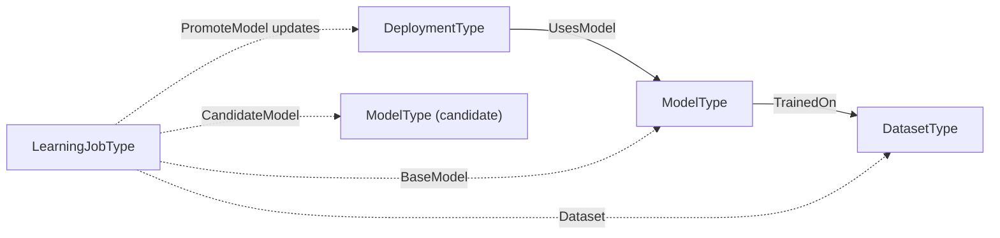
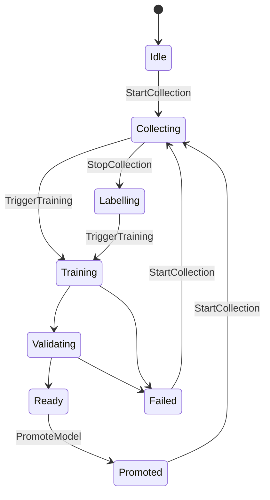

# OPC UA — AI Deployment and Learning

> Status: Working-group draft (Release 0.1.0). This document, together with `Opc.Ua.AiDeployment.NodeSet2.xml` and `Opc.Ua.AiDeployment.NodeIds.csv`, defines an OPC UA information model for **the AI models an installation runs**: what a model is, what it was trained on, where it executes, and how a better one replaces it.
>
> It is deliberately **domain-neutral**. Nothing here names a camera, a sensor, an image or a robot: a model is trained on a dataset, deployed somewhere, and superseded — and that story is the same whether the input is a photograph, a vibration spectrum or a process trace.
>
> Nothing here is normative, official, or endorsed by the OPC Foundation or IDTA; namespace URIs and NodeIds are **provisional** and for prototyping only.

---

## 1 Scope

This specification defines an OPC UA information model that lets a Server describe:

- **what model it is running** — identity, version, framework, format, and the digest that makes the artefact verifiable;
- **what that model was trained on** — including whether the data was real, synthetic or both;
- **where inference executes** — in the Server, on an edge node, in a cloud service, or in a simulator;
- **how a model is replaced** — the capture, label, train and promote loop, and who is allowed to complete it.

### 1.1 Motivation

An industrial AI model is not device firmware. It is an artefact the operator or system integrator supplies, versions and approves, and the same physical equipment runs different models over its life. Someone has to be able to ask *which model produced this decision, what was it trained on, and who promoted it* — and today, no OPC UA specification lets them.

Three IDTA submodel templates describe the pieces — **IDTA 02060** for a model nameplate, **IDTA 02058** for a dataset, **IDTA 02059** for a deployment — but they are Asset Administration Shell templates, not an OPC UA address space. This model aligns with them member-for-member so that an AAS can be populated from these nodes without loss, while remaining browsable, subscribable and callable in its own right.

### 1.2 Why this is a separate specification

Nothing in this model is specific to any one kind of input. `TaskKind` is a string. `SourceKind` distinguishes real capture from simulator output. The learning loop is `Idle → Collecting → Labelling → Training → Validating → Ready → Promoted`. A vibration-analysis model, a process soft sensor and a quality classifier all need exactly this, and none of them need a lens.

Putting it inside any one domain's specification would oblige every other domain either to take a dependency on that domain — a process-monitoring Server declaring a camera model as a `RequiredModel` — or to define the whole thing again, at which point two installations describe the same model artefact with two incompatible vocabularies and the provenance question stops having one answer.

Consuming specifications join to this one through a plain `NodeId`, not a `RequiredModel`, so the dependency is a **facet precondition** rather than a namespace obligation: a Server implements this model when it has something to say about an AI model, and is fully conformant to its domain specification when it does not.

### 1.3 What this specification does not do

- It does **not** carry model artefacts or training data. `ArtifactUri` says where the bytes are; the bytes travel by whatever means already moves large files, and `Digest` is what makes the retrieval verifiable.
- It does **not** define inference **invocation**. A consuming specification owns that, because what you pass to a model and what comes back is domain vocabulary — an image and a set of detections, a spectrum and a fault class. This model describes the deployment; the caller describes the call.
- It does **not** define model training. `TriggerTraining` requests it; where the training happens is out of scope, and clause 6 is explicit that a Server may implement only the capture stages.
- It is **not** a governance or compliance framework. It records what is needed to answer provenance questions; whether an installation is permitted to run a given model is decided elsewhere.

### 1.4 Capabilities and versioning

Release 0.1.0 covers models, datasets, deployments and the learning loop. The NodeSet declares exactly one `RequiredModel` — the base OPC UA namespace — so a Server can adopt it without pulling in any companion model, and a consuming specification binds to it without taking a NodeSet dependency (§4.2).

---

## 2 Normative references

- **OPC 10000-3, -4, -5** — Address Space Model, Services, Information Model. The base UA namespace is the only required model.
- **OPC 10000-6** — Mappings. Structure encoding of `TensorSignatureDataType`.

Informative alignments — IDTA 02058, IDTA 02059, IDTA 02060, and the OPC UA ⇄ AAS bridge — are listed in Annex B. They are **not** normative references and impose no dependency, notwithstanding that the member sets here are drawn from them deliberately.

---

## 3 Terms, definitions and abbreviations

| Term | Definition |
|---|---|
| **Model** | A trained artefact that maps input to output. Modelled as `ModelType`. Identity, not behaviour: this specification describes the model, it does not run it. |
| **Dataset** | The samples a model was trained or validated on. Modelled as `DatasetType`. |
| **Deployment** | A model made executable somewhere. Modelled as `DeploymentType`. One model may have several deployments; each names exactly one model. |
| **Inference location** | Whether execution happens in the Server, on an edge node, in a cloud service or in a simulator. It changes the trust boundary and the latency, and it changes nothing else. |
| **Learning job** | One turn of the capture, label, train and promote loop. Modelled as `LearningJobType`. |
| **Promotion** | Making a candidate model the one deployments use. The one operation here that changes what the equipment does. |
| **Digest** | A cryptographic hash of an artefact, which is what makes a retrieved artefact verifiable as the one described. |

---

## 4 Overview and concepts

### 4.1 The four objects and what joins them



A dataset trains a model; a deployment executes one. A learning job accumulates a new dataset, produces a candidate, and promotes it — at which point the deployment executes a different model and the cycle repeats.

`UsesModel` and `TrainedOn` are **references**, because they are structural. `Dataset`, `BaseModel` and `CandidateModel` on a learning job are **NodeId Properties**, because a job's relationships change as it runs and a reference set that churns is harder to observe than a value that changes.

### 4.2 How a consuming specification binds to this one

A specification that runs inference — a vision model, a condition-monitoring model — binds by holding a **`NodeId` Property** naming a `DeploymentType` instance. It does **not** take a `RequiredModel` on this NodeSet and does **not** define a ReferenceType into it.

That keeps both specifications loadable alone. A Server that describes its deployment some other way names that node instead, and a Server that implements neither is unaffected. The cost is that the provenance chain of §7 is only available where both are implemented, which is why it is stated as a conformance condition rather than assumed.

### 4.3 A model is a business artefact, not device firmware

This is the assumption the whole model rests on, so it is stated plainly.

The equipment manufacturer does not supply the model. The operator or the system integrator does, and replaces it, and is answerable for it. A Server therefore **shall** describe the model it is *currently* running rather than the one it shipped with, and `PromoteModel` **shall** require an authorization distinct from the one that permits ordinary operation (§7.3).

The consequence for a reader: every member of `ModelType` is about *this* artefact, and none of it is nameplate data that could have been printed at the factory.

---

## 5 Information model

### 5.1 Type hierarchy

| Type | NodeId | Subtype of |
|---|---|---|
| `AiRootType` | `ns=1;i=1001` | `BaseObjectType` |
| `ModelType` | `ns=1;i=1002` | `BaseObjectType` |
| `DatasetType` | `ns=1;i=1003` | `BaseObjectType` |
| `DeploymentType` | `ns=1;i=1004` | `BaseObjectType` |
| `LearningJobType` | `ns=1;i=1005` | `BaseObjectType` |

Annex A is the authoritative node reference and carries every member with its DataType, ValueRank and ModellingRule.

### 5.2 `ModelType`

Identity, provenance and interface of a trained model. Aligned with IDTA 02060.

`ModelId`, `Name`, `Version`, `Digest` and `DigestAlgorithm` are **Mandatory**. The first three because a model that cannot be named cannot be discussed; the last two because §7 depends on them, and a rule that depends on an Optional member is a rule a conformant Server can silently not satisfy.

`TaskKind` is a **String**, not an enumeration. The set of things models do is not closed, and an enumeration would date faster than the models it describes.

`LabelClasses` is an ordered array whose **index** is the contract. A consuming specification's class identifier refers to a position in it, so a Server **shall not** reorder it in place: a model whose class 3 silently becomes class 4 produces results that are wrong in a way nothing detects.

`Inputs` and `Outputs` carry `TensorSignatureDataType` (`ns=1;i=3050`) — name, element type, shape with `-1` for a dynamic axis, and an optional layout hint. This is what lets a client check that what it intends to send matches what the model expects, before it sends it.

### 5.3 `DatasetType`

What a model was trained or validated on. Aligned with IDTA 02058.

`SourceKind` (`DatasetSourceEnum`, `ns=1;i=3004`) is `Real` 0, `Synthetic` 1 or `Mixed` 2, and is **Mandatory**. It is the provenance a reviewer needs when synthetic data is involved, and the one question about a dataset that cannot be answered by looking at it.

### 5.4 `DeploymentType`

A model made executable. Aligned with IDTA 02059.

`InferenceLocation` (`InferenceLocationEnum`, `ns=1;i=3001`) is `OnServer` 0, `EdgeOffServer` 1, `Cloud` 2 or `InSimulator` 3, and is **Mandatory**.

> This property changes **where the computation happens and therefore the trust boundary**. It changes nothing else — not the result contract, not the model's identity, not what a client does with the output. A client that branches on it for any reason other than latency, availability or trust has misread it.

`AcceleratorKind` (`AcceleratorKindEnum`, `ns=1;i=3002`) is `Cpu`, `Gpu`, `Npu`, `Fpga`, `Tpu` or `Other`. `State` (`DeploymentStateEnum`, `ns=1;i=3003`) is `Inactive` 0, `Ready` 1, `Active` 2, `Degraded` 3 or `Faulted` 4, and is **Mandatory** because §6 and any consuming specification's availability logic depend on it.

`EndpointUri` is meaningful when `InferenceLocation` is not `OnServer`. It is **untrusted input** and subject to §7.2.

### 5.5 `UsesModel` and `TrainedOn`

A `DeploymentType` instance **shall** have **exactly one** `UsesModel` reference, and its target **shall** be a `ModelType` instance.

This is the only defined path from a running deployment to the artefact its results depend on, and §7.1's provenance argument is a walk along it. Zero references breaks the chain; more than one makes "which model produced this?" unanswerable, which is the question the chain exists to answer.

`TrainedOn` links a model to a dataset it was trained or validated on. It is optional and may repeat: a model whose training data cannot be named is a model whose behaviour cannot be explained, but not every installation holds that information.

---

## 6 The learning loop (normative)

`LearningJobType` exists so that corrections arriving from a consuming application have somewhere to accumulate and a defined path into a new model version.



`LearningJobStateEnum` (`ns=1;i=3005`) carries exactly these eight states.

**A Server may implement only part of this.** A Server that captures corrections and leaves training to an external MLOps system implements `StartCollection` and `StopCollection`, drives the state to `Labelling`, and stops. The state machine is the same either way, and a client reads `State` to learn how far this Server goes rather than inferring it from which Methods exist.

`SamplesCollected` counts what has accumulated, including corrections fed back. `LastError` is the diagnostic for `Failed`, is for a human, and **shall not** be parsed.

**Promotion is the operation that matters.** `PromoteModel` makes the candidate the model deployments use — it changes what the equipment does without changing anything a reader of the address space would notice, which is exactly the change that needs a separate permission (§7.3).

---

## 7 Security

### 7.1 Provenance is the point of the digest

A published result is traceable to the artefact that produced it by: result → deployment (the consuming specification's `NodeId` Property) → `UsesModel` → `ModelType` → `Digest`.

Every link is required for the chain to hold, which is why `UsesModel` is exactly-one (§5.5) and `Digest` is Mandatory (§5.2). A Server **shall** populate `Digest` for every model whose artefact is obtainable through `ArtifactUri`.

`DigestAlgorithm` **shall** name a hash function with **at least 256-bit output and no known collision weakness**; `SHA-256` is the default and is always acceptable. It **shall not** be `MD5`, `SHA-1` or a truncated variant — chosen-prefix collisions against those are practical, so a substituted artefact would pass verification, and a verification that can be passed by the wrong artefact is worse than none because it is believed.

### 7.2 URIs are untrusted input

`ArtifactUri`, `ProvenanceUri` and `EndpointUri` are values a client may have written and a Server may resolve. A Server **shall** validate them against a configured policy before resolving, and **shall not** follow one to a scheme or host the policy does not permit.

Where `InferenceLocation` is not `OnServer`, `EndpointUri` **shall** name a scheme that is authenticated and confidential. Inference off the Server means the input data leaves it, and the result comes back from something the Server did not compute — both directions need the channel to be trustworthy.

### 7.3 Promotion needs its own authorization

A Server **shall** require an authorization for `PromoteModel` distinct from the one that permits reading this model or operating the equipment.

Promotion changes behaviour without changing structure. Nothing in the address space looks different afterwards except a version string, so the usual defence — that a significant change is visible — does not apply here.

### 7.4 A digest is not a signature

`Digest` establishes that an artefact is the one described. It does **not** establish who produced it or that they were entitled to. A Server **shall not** present digest verification as authorization, and an installation that needs provenance of authorship needs a signature, which this model does not define.

---

## 8 Profiles and conformance units

### 8.1 Declaring conformance

A Server declares conformance by exposing `AiRootType` under the Server object with `SpecificationVersion` set to the release it implements.

### 8.2 Facets

| Facet | Requires |
|---|---|
| **AI-Base** (mandatory) | `AiRootType` with `Models` and `Deployments`; at least one `ModelType` with `ModelId`, `Name`, `Version`, `Digest` and `DigestAlgorithm`; at least one `DeploymentType` with `DeploymentId`, `InferenceLocation` and `State`; the exactly-one `UsesModel` rule of §5.5; the digest rules of §7.1 |
| **AI-Dataset** | `DatasetType` instances with `DatasetId` and `SourceKind`, and `TrainedOn` from at least one model |
| **AI-OffServer** | A deployment whose `InferenceLocation` is not `OnServer`, with `EndpointUri` naming an authenticated, confidential scheme (§7.2) |
| **AI-Signatures** | `Inputs` and `Outputs` populated on every model |
| **AI-Learning** | `LearningJobType`, the §6 state model, every Method that drives a transition in it, and the distinct `PromoteModel` authorization of §7.3 |

---

## 9 Deliverables and reproducibility

| Artifact | Path |
|---|---|
| This specification | `metaverse-specs/ai-deployment/OPC-UA-AI-Deployment.md` |
| Information model | `metaverse-specs/ai-deployment/Opc.Ua.AiDeployment.NodeSet2.xml` |
| NodeId assignments | `metaverse-specs/ai-deployment/Opc.Ua.AiDeployment.NodeIds.csv` |
| Generator | `metaverse-specs/extras/ai-deployment/tools/build_model.py` |
| Validator | `metaverse-specs/extras/ai-deployment/tools/validate_local.py` |
| Annex A (generated) | `metaverse-specs/extras/ai-deployment/tools/model-reference.md` |

The NodeSet, the CSV and Annex A are generated from a single in-code source of truth and are **deterministic**. The generator is edited; the generated files are not.

```powershell
python metaverse-specs\extras\ai-deployment\tools\build_model.py
python metaverse-specs\extras\ai-deployment\tools\validate_local.py
```

---

## Annex A — Information model (generated)

Annex A is generated from the NodeSet and is authoritative for identifiers, DataTypes, ValueRanks, ModellingRules, structure fields, enumeration values and Method signatures. See [`../extras/ai-deployment/tools/model-reference.md`](../extras/ai-deployment/tools/model-reference.md).

---

## Annex B — Informative alignments

Not normative references, and no dependency. Recorded because this model borrowed from them deliberately.

- **IDTA 02060** *AI Model Nameplate* — the member set of `ModelType`. Currently the only standardised description of an industrial AI model.
- **IDTA 02058** *AI Dataset* — the member set of `DatasetType`.
- **IDTA 02059** *AI Deployment* — the member set of `DeploymentType`, including the inference-location concept.
- **OPC 30270** — the OPC UA ⇄ Asset Administration Shell bridge, over which the alignments above become a populated AAS.
- **OPC UA — Vision** in this repository is the first consuming specification. Its `InferencePipelineType.Deployment` is a `NodeId` Property naming a `DeploymentType` here, per §4.2, and neither NodeSet requires the other.
