# OPC UA — AI Model Management and Inference

> Status: Working-group draft (Release 0.4.0). This document, together with `Opc.Ua.AiModelManagement.NodeSet2.xml` and `Opc.Ua.AiModelManagement.NodeIds.csv`, defines an OPC UA information model for **the AI models an installation runs**: what a model is, what it was trained on, where it executes, and how a better one replaces it.
>
> It is deliberately **domain-neutral**. Nothing here names a camera, a sensor, an image or a robot: a model is trained on a dataset, deployed somewhere, and superseded — and that story is the same whether the input is a photograph, a vibration spectrum or a process trace.
>
> Nothing here is normative, official, or endorsed by the OPC Foundation or IDTA; namespace URIs and NodeIds are **provisional** and for prototyping only.

## Contents

- [1 Scope](#1-scope)
  - [1.1 Motivation](#11-motivation)
  - [1.2 What this specification does not do](#12-what-this-specification-does-not-do)
  - [1.3 Capabilities and versioning](#13-capabilities-and-versioning)
- [2 Normative references](#2-normative-references)
- [3 Terms, definitions and abbreviations](#3-terms-definitions-and-abbreviations)
- [4 Scenarios](#4-scenarios)
  - [4.1 A model runs on the machine](#41-a-model-runs-on-the-machine)
  - [4.2 The model runs somewhere else](#42-the-model-runs-somewhere-else)
  - [4.3 The link drops and something else answers](#43-the-link-drops-and-something-else-answers)
  - [4.4 A model arrives from a catalogue](#44-a-model-arrives-from-a-catalogue)
  - [4.5 A large payload will not fit in a call](#45-a-large-payload-will-not-fit-in-a-call)
  - [4.6 The answer arrives later](#46-the-answer-arrives-later)
  - [4.7 Corrections become the next model](#47-corrections-become-the-next-model)
  - [4.8 Someone asks what produced a decision](#48-someone-asks-what-produced-a-decision)
- [5 Overview and concepts](#5-overview-and-concepts)
  - [5.1 Objects and relationships](#51-objects-and-relationships)
  - [5.2 Binding from a consuming specification](#52-binding-from-a-consuming-specification)
  - [5.3 Model ownership](#53-model-ownership)
- [6 Information model](#6-information-model)
  - [6.1 Type hierarchy](#61-type-hierarchy)
  - [6.2 `ModelType`](#62-modeltype)
  - [6.3 `DatasetType`](#63-datasettype)
  - [6.4 `DeploymentType`](#64-deploymenttype)
  - [6.5 `UsesModel` and `TrainedOn`](#65-usesmodel-and-trainedon)
  - [6.6 `AiJobType`](#66-aijobtype)
- [7 The learning loop (normative)](#7-the-learning-loop-normative)
  - [7.1 Method behaviour and StatusCodes (normative)](#71-method-behaviour-and-statuscodes-normative)
  - [7.2 Relationship to models and deployments](#72-relationship-to-models-and-deployments)
  - [7.3 Partial implementation](#73-partial-implementation)
- [8 Inference (normative)](#8-inference-normative)
  - [8.1 Location independence](#81-location-independence)
  - [8.2 Payload and envelope](#82-payload-and-envelope)
  - [8.3 Parameters](#83-parameters)
  - [8.4 Capabilities](#84-capabilities)
  - [8.5 Incremental results](#85-incremental-results)
  - [8.6 Asynchronous inference](#86-asynchronous-inference)
- [9 Consuming a model hosted elsewhere (normative)](#9-consuming-a-model-hosted-elsewhere-normative)
  - [9.1 `ModelSourceType`](#91-modelsourcetype)
  - [9.2 Wire contract and authentication](#92-wire-contract-and-authentication)
  - [9.3 Version binding](#93-version-binding)
  - [9.4 Availability and fallback](#94-availability-and-fallback)
  - [9.5 Data residency and egress](#95-data-residency-and-egress)
- [10 The catalogue and model import (normative)](#10-the-catalogue-and-model-import-normative)
  - [10.1 The catalogue](#101-the-catalogue)
  - [10.2 Importing a model](#102-importing-a-model)
  - [10.3 Import modes](#103-import-modes)
  - [10.4 Digest verification](#104-digest-verification)
- [11 Governance and provenance (normative)](#11-governance-and-provenance-normative)
  - [11.1 Model card](#111-model-card)
  - [11.2 Evaluation](#112-evaluation)
  - [11.3 Lineage](#113-lineage)
  - [11.4 Safety assessment](#114-safety-assessment)
- [12 Security](#12-security)
  - [12.1 Provenance](#121-provenance)
  - [12.2 URI handling](#122-uri-handling)
  - [12.3 Promotion authorization](#123-promotion-authorization)
  - [12.4 Digest and authorship](#124-digest-and-authorship)
- [13 Profiles and conformance units](#13-profiles-and-conformance-units)
  - [13.1 Declaring conformance](#131-declaring-conformance)
  - [13.2 Facets](#132-facets)
  - [13.3 Profiles](#133-profiles)
  - [13.4 Profile and facet URIs](#134-profile-and-facet-uris)
- [Annex A — Information model (generated)](#annex-a--information-model-generated)
- [Annex B — Informative alignments](#annex-b--informative-alignments)
- [Annex C — A worked arrangement (informative)](#annex-c--a-worked-arrangement-informative)
  - [C.1 The situation](#c1-the-situation)
  - [C.2 Getting the models here](#c2-getting-the-models-here)
  - [C.3 The two deployments](#c3-the-two-deployments)
  - [C.4 A normal call, and a link failure](#c4-a-normal-call-and-a-link-failure)
  - [C.5 Throttling](#c5-throttling)
- [Annex D — Deploying a classical model (informative)](#annex-d--deploying-a-classical-model-informative)
  - [D.1 The model](#d1-the-model)
  - [D.2 In the catalogue](#d2-in-the-catalogue)
  - [D.3 Getting it onto the controller](#d3-getting-it-onto-the-controller)
  - [D.4 The shape contract](#d4-the-shape-contract)
  - [D.5 The deployment](#d5-the-deployment)
  - [D.6 Calling it](#d6-calling-it)
  - [D.7 Capabilities](#d7-capabilities)

---

## 1 Scope

This specification defines an OPC UA information model that lets a Server describe:

- **what model it is running** — identity, version, framework, format, and the digest that makes the artefact verifiable;
- **what that model was trained on** — including whether the data was real, synthetic or both;
- **where inference executes** — in the Server, on an edge node, in a cloud service, or in a simulator;
- **how to actually run it** — one invocation surface that does not change with any of the above (clause 8);
- **how to run a model this Server does not host** — the wire contract, the credential, the capabilities, and what happens when the link fails (clause 9);
- **how a model gets here** — pulling one from a catalogue and either describing it where it stands or bringing its bytes across, with the digest checked at the moment that matters (clause 10);
- **whether it may be used at all** — what it is for, where it stops working, how it measured, and whether calling it sends plant data off site (clause 11);
- **how a model is replaced** — the capture, label, train and promote loop, and who is allowed to complete it.

### 1.1 Motivation

An industrial AI model is not device firmware. It is an artefact the operator or system integrator supplies, versions and approves, and the same physical equipment runs different models over its life. Someone has to be able to ask *which model produced this decision, what was it trained on, and who promoted it* — and today, no OPC UA specification lets them.

Three IDTA submodel templates describe the pieces — **IDTA 02060** for a model nameplate, **IDTA 02058** for a dataset, **IDTA 02059** for a deployment — but they are Asset Administration Shell templates, not an OPC UA address space. This model aligns with them member-for-member so that an AAS can be populated from these nodes without loss, while remaining browsable, subscribable and callable in its own right.

**Nothing here is specific to any one kind of input.** `TaskKind` is a String. `SourceKind` distinguishes real capture from simulator output. The learning loop runs `Idle → Collecting → Labelling → Training → Validating → Ready → Promoted`. A vibration-analysis model, a process soft sensor and a quality classifier all need exactly this, and none of them need a lens — which is why the model is domain-neutral by construction rather than by convention, and why its validator fails the build if a type name acquires a domain term.

### 1.2 What this specification does not do

- It does **not** carry model artefacts or training data. `ArtifactUri` says where the bytes are; the bytes travel by whatever means already moves large files, and `Digest` is what makes the retrieval verifiable.
- It does **not** define what an inference payload *contains*. Clause 8 defines the envelope — routing, parameters, accounting, why output stopped, which model answered — and leaves the payload opaque, because what you pass to a model and what comes back is domain vocabulary: an image and a set of detections, a spectrum and a fault class. An envelope that tried to type that would need extending for every domain that ever adopted it.
- It does **not** define a training algorithm, a scheduler or an MLOps platform. `TriggerTraining` requests training and `LearningJobType` observes it; where the training runs is out of scope, and clause 7 is explicit that a Server may implement only the capture stages.
- It is **not** a governance or compliance framework. It records what is needed to answer provenance questions; whether an installation is permitted to run a given model is decided elsewhere.

### 1.3 Capabilities and versioning

This specification covers the model, the dataset, the deployment, the learning loop, the invocation surface, consumption of externally hosted models, the catalogue and the import bridge.

The NodeSet declares **two** `RequiredModel` entries: the base OPC UA namespace, and *OPC UA — xRegistry*, because the catalogue of clause 10 is a domain extension of that abstract registry rather than a private invention. That is a real cost and it is taken deliberately — a model catalogue **is** a registry, and defining a second one here would leave two incompatible ways to describe the same artefact.

It is worth being precise about what that dependency does **not** reach. A consuming specification still binds to this one through a plain `NodeId` Property (§4.2) and takes no NodeSet dependency of its own, so a vision or condition-monitoring Server is unaffected by this model's dependencies. The obligation lands on a Server that implements *this* specification, not on one that merely points at it.

---

## 2 Normative references

- **OPC 10000-3, -4, -5** — Address Space Model, Services, Information Model.
- **OPC 10000-6** — Mappings. Structure encoding of the DataTypes listed in Annex A.
- **OPC 10000-10** — Programs. `ProgramStateMachineType` is the base type of `AiJobType` (§6.6) and supplies the lifecycle, the transition events and the `Start`/`Suspend`/`Resume`/`Halt` Methods that every long-running job here inherits rather than reinvents.
- **OPC 10000-5** — `FileType`, reached through xRegistry's `ResourceType`. It is what lets a staged model artefact be read over OPC UA with `Open`/`Read`/`Close` (§10.3).
- **OPC UA — xRegistry** — [`../../core-specs/xregistry/OPC-UA-xRegistry.md`](../../core-specs/xregistry/OPC-UA-xRegistry.md). A **working draft in this repository**, and the one **normative dependency** this model takes beyond base OPC UA. `ModelRegistryType`, `ModelPublisherType`, `ModelResourceType` and `DatasetResourceType` are domain extensions of its `RegistryType`, `GroupType` and `ResourceType` (clause 10). Because it is a draft, its NodeIds are provisional and so, transitively, is this model's dependency on them.

Informative alignments — IDTA 02058, IDTA 02059, IDTA 02060, and the OPC UA ⇄ AAS bridge — are listed in Annex B. They are **not** normative references and impose no dependency, notwithstanding that the member sets here are drawn from them deliberately.

---

## 3 Terms, definitions and abbreviations

| Term | Definition |
|---|---|
| **Model** | A trained artefact that maps input to output. Modelled as `ModelType`. Identity, not behaviour: this specification describes the model, it does not run it. |
| **Dataset** | The samples a model was trained or validated on. Modelled as `DatasetType`. |
| **Deployment** | A model made executable somewhere. Modelled as `DeploymentType`. One model may have several deployments; each names exactly one model. |
| **Inference location** | Whether execution happens in the Server, on an edge node, in a cloud service or in a simulator. It changes the trust boundary and the latency, and it changes nothing else. |
| **Learning job** | One turn of the capture, label, train and promote loop. Modelled as `LearningJobType`. |
| **Promotion** | Making a candidate model the one deployments use. The one operation here that changes what the equipment does. |
| **Digest** | A cryptographic hash of an artefact, which is what makes a retrieved artefact verifiable as the one described. |
| **Conformance unit** | The smallest individually testable requirement of this specification. Grouped into facets rather than claimed one by one. |
| **Facet** | A named, individually claimable set of conformance units — a building block, not a complete claim. Clause 13.2 defines them. |
| **Profile** | A named set of facets describing one plausible Server, claimed by publishing its URI in `Server/ServerCapabilities/ServerProfileArray`. Clause 13.3 defines them. Not to be confused with a *typed profile* (§6.4.1), which is a consuming specification's payload vocabulary and has nothing to do with conformance. |

---

## 4 Scenarios

This clause is **informative**. It sets out the arrangements this specification is meant to support, each with the flow that realises it, so that a reader can find the one resembling their installation before reading the normative clauses that define its parts.

The scenarios are not alternatives to choose between. A single Server commonly implements several — a plant that runs a model locally, calls a hosted one for a second opinion, and imports both from a corporate catalogue is doing three of them at once.

### 4.1 A model runs on the machine

The simplest arrangement, and the most common in practice: the artefact sits on the controller and executes in its own process.

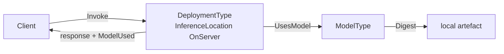

Nothing is remote, so `Source` is null, `EgressPermitted` is false and `FallbackPolicy` is typically `Fail` — there is nothing to fall back to. Annex D works this end to end for an ONNX classifier.

**Facets:** AI-Base, AI-Invoke, AI-Signatures.

### 4.2 The model runs somewhere else

The Server has no model of its own and calls one hosted elsewhere — an appliance on the plant network, or a service beyond it.

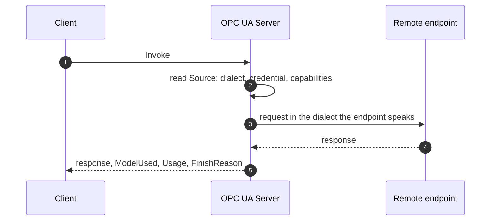

The client's call is unchanged from §4.1 — that is the point of §8.1. What changes is the trust boundary, and clause 9 is what makes the arrangement describable: the wire contract, the credential reference, and whether calling it sends plant data off site.

**Facets:** AI-Base, AI-Invoke, AI-Federation, AI-Residency.

### 4.3 The link drops and something else answers

The arrangement §4.2 needs in order to be usable on a line that cannot stop.

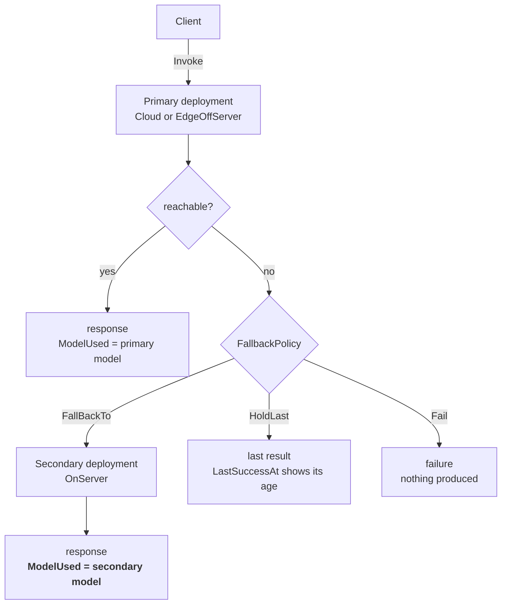

The branch worth noticing is the middle one: the caller asked nothing different and got an answer from a **different model**, so `ModelUsed` is the only thing that says so. Annex C works this through with a WAN failure.

**Facets:** as §4.2, plus a second deployment for the fallback.

### 4.4 A model arrives from a catalogue

How a model gets onto a machine at all, whether by federating its description or by bringing its bytes.

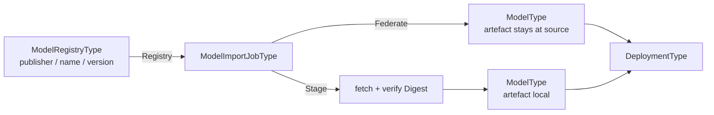

Staging is where the digest is verified, because it is the one moment a substituted artefact would enter the system (§10.4).

**Facets:** AI-Catalogue, AI-Import.

### 4.5 A large payload will not fit in a call

An image or a sample window exceeds what a `ByteString` can carry, so the exchange is chunked.

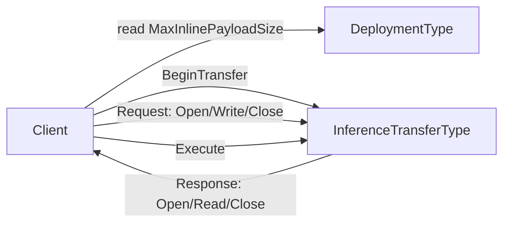

`Invoke` is the shortcut that works while everything is small; this is the general path (§8.2.4).

**Facets:** AI-Base, AI-Transfer.

### 4.6 The answer arrives later

Work that does not finish while a caller waits — a batch scored overnight, an analysis over recorded data.

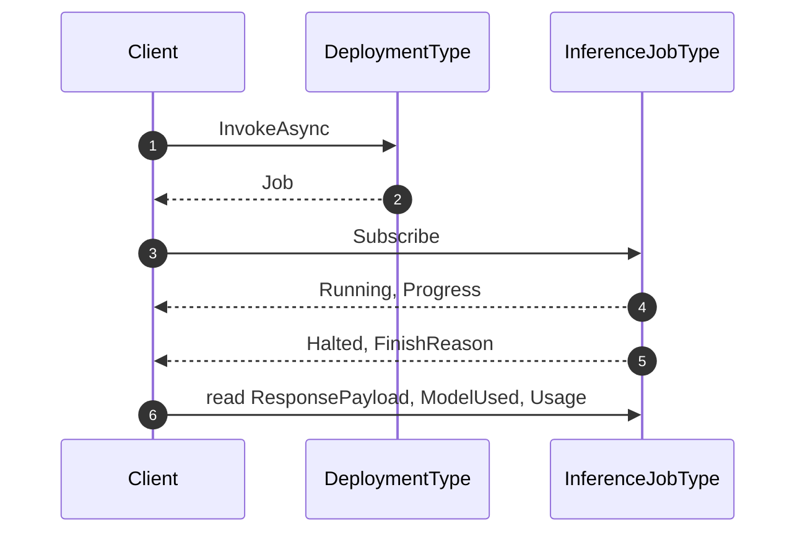

**Facets:** AI-Base, AI-InvokeAsync.

### 4.7 Corrections become the next model

An operator disagrees with a verdict, the correction is retained, and it eventually becomes a model version.

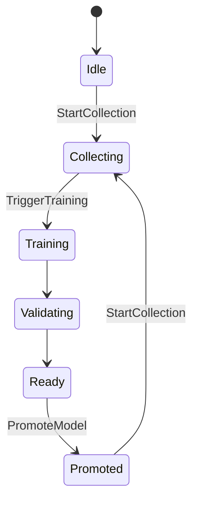

Most Servers implement only part of this — capture the corrections and leave training to an external system (§7.3).

**Facets:** AI-Base, AI-Dataset, AI-Learning.

### 4.8 Someone asks what produced a decision

Not an operation but a question, and the reason several members exist at all.

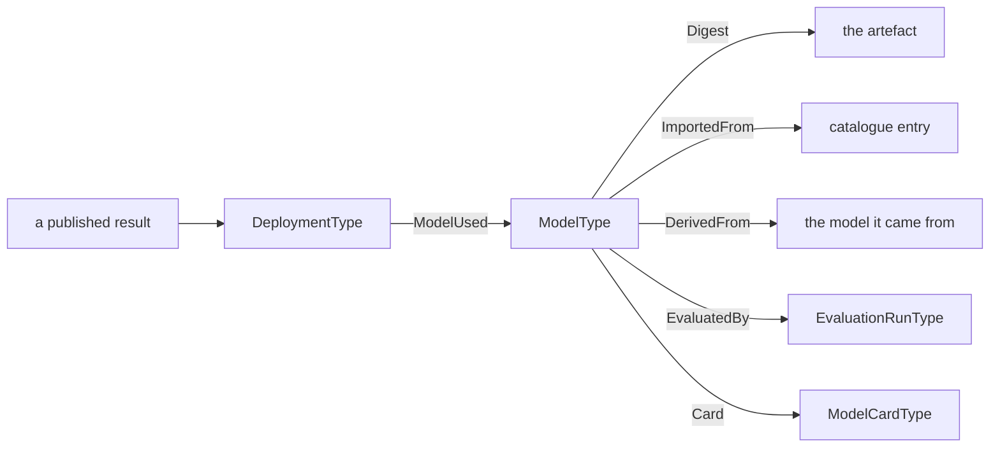

**Facets:** AI-Base, and whichever of AI-Catalogue, AI-Dataset and AI-Import the installation implements.

---

## 5 Overview and concepts

### 5.1 Objects and relationships

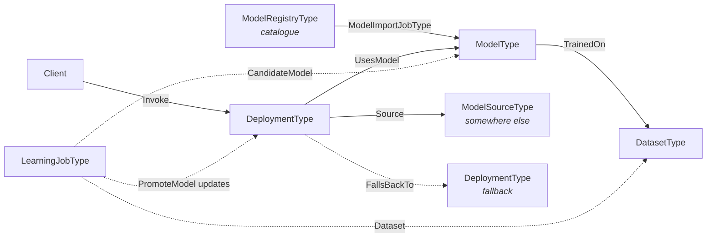

A dataset trains a model; a deployment executes one; a client calls the deployment. Where the model runs somewhere this Server does not control, the deployment names a **source** that says how to reach it and what to do when it cannot. Where a model comes from a catalogue, an **import job** brings it — as a description, or as bytes. A learning job accumulates a new dataset, produces a candidate, and promotes it, at which point the deployment executes a different model and the cycle repeats.

The four questions this arrangement is arranged to answer:

| Question | Where it is answered |
|---|---|
| What is running, and can I audit it? | `ModelType`, `DatasetType`, §12.1 |
| How do I run it? | `DeploymentType.Invoke` (§8) |
| What if it is not here, or stops answering? | `ModelSourceType`, `FallbackPolicy` (§9) |
| How did it get here, and may it be used? | `ModelImportJobType` (§10), `ModelCardType` (§11) |

A dataset trains a model; a deployment executes one. A learning job accumulates a new dataset, produces a candidate, and promotes it — at which point the deployment executes a different model and the cycle repeats.

`UsesModel` and `TrainedOn` are **references**, because they are structural. `Dataset`, `BaseModel` and `CandidateModel` on a learning job are **NodeId Properties**, because a job's relationships change as it runs and a reference set that churns is harder to observe than a value that changes.

### 5.2 Binding from a consuming specification

A specification that runs inference — a vision model, a condition-monitoring model — binds by holding a **`NodeId` Property** naming a `DeploymentType` instance. It does **not** take a `RequiredModel` on this NodeSet and does **not** define a ReferenceType into it.

That keeps both specifications loadable alone. A Server that describes its deployment some other way names that node instead, and a Server that implements neither is unaffected. The cost is that the provenance chain of §12 is only available where both are implemented, which is why it is stated as a conformance condition rather than assumed.

### 5.3 Model ownership

This is the assumption the whole model rests on, so it is stated plainly.

The equipment manufacturer does not supply the model. The operator or the system integrator does, and replaces it, and is answerable for it. A Server therefore **shall** describe the model it is *currently* running rather than the one it shipped with, and `PromoteModel` **shall** require an authorization distinct from the one that permits ordinary operation (§12.3).

The consequence for a reader: every member of `ModelType` is about *this* artefact, and none of it is nameplate data that could have been printed at the factory.

---

## 6 Information model

### 6.1 Type hierarchy

| Type | NodeId | Subtype of |
|---|---|---|
| `AiRootType` | `ns=2;i=1001` | `BaseObjectType` |
| `ModelType` | `ns=2;i=1002` | `BaseObjectType` |
| `DatasetType` | `ns=2;i=1003` | `BaseObjectType` |
| `DeploymentType` | `ns=2;i=1004` | `BaseObjectType` |
| `AiJobType` (abstract) | `ns=2;i=1006` | `ProgramStateMachineType` (`i=2391`) |
| `LearningJobType` | `ns=2;i=1005` | `AiJobType` |
| `ModelImportJobType` | `ns=2;i=1007` | `AiJobType` |
| `InferenceJobType` | `ns=2;i=1008` | `AiJobType` |
| `ModelSourceType` | `ns=2;i=1009` | `BaseObjectType` |
| `EvaluationRunType` | `ns=2;i=1014` | `BaseObjectType` |
| `ModelCardType` | `ns=2;i=1015` | `BaseObjectType` |
| `ModelRegistryType` | `ns=2;i=1010` | xRegistry `RegistryType` |
| `ModelPublisherType` | `ns=2;i=1011` | xRegistry `GroupType` |
| `ModelResourceType` | `ns=2;i=1012` | xRegistry `ResourceType` |
| `DatasetResourceType` | `ns=2;i=1013` | xRegistry `ResourceType` |

`LearningJobType` keeps NodeId `1005` although it now sits below `1006`. NodeIds here are **append-only**: a type that acquires a base type does not move, because renumbering to make the file read tidily would break every client that cached an identifier.

### 6.2 `ModelType`

`ModelType` describes one trained artefact: which it is, where it came from, and what it accepts and returns. It is the node a client reaches when it asks what produced a result, and the node an auditor reaches when it asks whether that artefact is the one that was approved. Its member set is aligned with the IDTA 02060 AI Model Nameplate submodel template, so an Asset Administration Shell can be populated from it without loss.

An instance is created when a model becomes known to the Server — whether it was imported from a catalogue (clause 10), trained by a learning job (clause 7), or configured by hand — and it outlives any single deployment of it, because the same artefact may be executed in several places at once.

`ModelId`, `Name`, `Version`, `Digest` and `DigestAlgorithm` are **Mandatory**. The first three because a model that cannot be named cannot be discussed; the last two because clause 12 depends on them, and a rule that depends on an Optional member is a rule a conformant Server can silently not satisfy.

**`ModelId` carries the source system's own identifier, verbatim.** Where a model came from a catalogue or a remote endpoint, it is the string that system uses — the string a client would send back to reach the same model there. It is not derived from the other members and it is not reformatted, because its value is that two Servers integrating the same source produce the same one. Where the triple below cannot be recovered, `ModelId` is what remains comparable.

**`Name` is a `LocalizedText` whose `Text` is the source's name for the model, carried across unchanged.** A Server **may** add a translation for display and **shall not** translate, reformat or prettify the `Text` itself. The type is `LocalizedText` because that is how this model types names and retyping it would break every implementation; what is localizable is the presentation, not the identity. Two Servers that fetched one model from two mirrors are meant to produce the same string, and a name adjusted for house style is a name that no longer matches.

**`Publisher` names the organisation that produced the model**, not the one serving it. A hosted endpoint that reports its own operator as the owner has answered a different question, and a Server **shall not** publish the serving organisation there: a `Publisher` of `azure` or `aws` for a model somebody else trained defeats the purpose §6.2.1 gives it, which is recognising the same artefact across two installations that fetched it from different places. Where only the serving organisation is known, `Publisher` is left empty.

Leaving it empty is the right answer more often than it looks. `Publisher` and `Version` are best-effort against a source that publishes one opaque identifier and nothing else, and a decomposition guessed from the shape of that identifier is worth less than an honest gap — it is a convention of the vendor's naming, not a field they promised, and it changes without notice. `ModelId` is the member that always holds.

`TaskKind` is a **String**, not an enumeration. The set of things models do is not closed, and an enumeration would date faster than the models it describes.

`LabelClasses` is an ordered array whose **index** is the contract. A consuming specification's class identifier refers to a position in it, so a Server **shall not** reorder it in place: a model whose class 3 silently becomes class 4 produces results that are wrong in a way nothing detects.

#### 6.2.1 Model identity

`Publisher` completes the `Publisher`, `Name`, `Version` triple by which every catalogue in practice identifies a model (§10.2). It is what makes the same model recognisable across two installations that fetched it from different mirrors — the digests will match, but only if someone already suspected the two were the same artefact, and the triple is what raises that suspicion.

`ProvenanceUri` is the hand-off point to whatever system governs approval. This model records *what is deployed and where it came from*; who signed it off, against which release criteria, under what retention policy, is the business of the organisation's governance system and deliberately not modelled here.

#### 6.2.2 Cost and precision

`ParameterCount` is a crude proxy for what a model will cost to run, and is the one such figure that is universally published.

`Quantization` names the numeric precision the artefact is stored in — `fp32`, `int8`, `fp8`. This is **not** a packaging detail. A quantized model is a different artefact that produces different answers, and treating it as a variant of the original is how a model evaluated at full precision ends up deployed at reduced precision without anyone re-measuring it. §11.3 requires the derivation to be stated as well.

`SafetyPolicyUri` names the policy applied to this model's output, where one is. Like every URI here it is untrusted input (§12.2).

`Card` reaches the `ModelCardType` of §11.1. The split is deliberate: the nameplate answers *which artefact is this*, the card answers *should this be running on my line*, and those are asked by different people at different times.

#### 6.2.3 When the artefact appeared, and when it last moved

`PublishedAt` records when the source first published the model, and a Server **shall not** substitute its own acquisition time — a Server that did would make every model it serves appear to date from its last restart, and the value is only useful because it is the source's.

It answers for a model what `CreatedAt` (§6.3) already answers for a dataset, and the argument transfers unchanged: a model trained before a process change may no longer represent the line it runs on. It is also, for a source that publishes one opaque identifier and no decomposable version, frequently the only datum by which two models can be ordered at all.

`LastModifiedAt` records when the artefact behind the model last changed at the source, and exists for one case in particular. §9.3 defines `FollowsRef`, where the artefact **can** change with nothing else changing, and §12.3.1 requires repointing to be treated as an authorization-bearing act, pointing at `AiJobType.RequestedBy` for the record. But a reference that moves *at the source* produces no job, so there is no `RequestedBy` and no `StartedAt` — and without this member the audit trail §12.3.1 demands cannot be constructed on the one path that clause exists to cover. **A Server whose deployment follows a mutable reference shall populate `LastModifiedAt`.**

Neither is the Server's `SourceTimestamp`. That records when this Server acquired a value; after a restart and a re-read it says today for a model published two years ago.

`Inputs` and `Outputs` carry `TensorSignatureDataType` (`ns=2;i=3050`) — name, element type, shape with `-1` for a dynamic axis, and an optional layout hint. This is what lets a client check that what it intends to send matches what the model expects, before it sends it.

Clause 8 leaves the invocation payload opaque, so these signatures are the **only** machine-readable description of what a deployment will accept. A client that ignores them discovers a shape mismatch as a rejected call at run time; one that reads them discovers it at configuration time, which is the difference between a commissioning problem and a production one.

### 6.3 `DatasetType`

`DatasetType` describes the samples a model was trained or validated on. It exists so that a question asked about a model's behaviour — why it fails on a particular part, whether it has ever seen a condition — can be answered by looking at what it learned from, rather than by inference from its outputs. Its member set is aligned with the IDTA 02058 AI Dataset submodel template.

It is read at two moments in practice: when a model is being reviewed for use, and when a model has failed in the field and someone is establishing whether the failure was foreseeable.

`SourceKind` (`DatasetSourceEnum`, `ns=2;i=3004`) is `Real` 0, `Synthetic` 1 or `Mixed` 2, and is **Mandatory**. It is the provenance a reviewer needs when synthetic data is involved, and the one question about a dataset that cannot be answered by looking at it. `Mixed` is not a hedge — synthetic pre-training followed by real fine-tuning is the common industrial arrangement, and forcing it into either neighbouring value would misdescribe it.

`SampleCount` and `CreatedAt` describe the scale and the vintage of the data, and both matter when a model is being judged: a classifier trained on four hundred samples and one trained on four million invite different amounts of trust, and a dataset assembled before a process change may no longer represent the line it is used on. `LabelClasses` names what the samples were labelled with. `ArtifactUri` says where the data itself can be obtained and `Digest` establishes that whatever is retrieved from there is the data this node describes — the same pairing, and the same reasoning, as on a model.

`LabelClasses` carries the same index-is-the-contract rule as `ModelType`. A dataset whose class list disagrees in **order** with the model trained on it is not detectably wrong anywhere — every identifier resolves, every count is plausible, and every label is off by one.

A dataset is a **sibling** of the model rather than a part of it. It outlives the models trained on it and is cited by several, which is why `TrainedOn` (§6.5) is a repeating reference and why the catalogue gives datasets their own resource type (§10.1).

### 6.4 `DeploymentType`

`DeploymentType` is a model made executable somewhere. Where `ModelType` describes an artefact, a deployment describes an arrangement for running it — on what hardware, at what location, under what latency expectation, with what happens when it cannot serve. One model may have several deployments and each names exactly one model (§6.5), which is what allows the same artefact to run at the edge and in a central service without the two being confused for one another.

It is the node a client actually interacts with: every Method in clause 8 hangs here, and every member clause 9 adds is about this arrangement rather than about the artefact. Its member set is aligned with the IDTA 02059 AI Deployment submodel template.

`InferenceLocation` (`InferenceLocationEnum`, `ns=2;i=3001`) is `OnServer` 0, `EdgeOffServer` 1, `Cloud` 2 or `InSimulator` 3, and is **Mandatory**.

> This property changes **where the computation happens and therefore the trust boundary**. It changes nothing else — not the result contract, not the model's identity, not what a client does with the output. A client that branches on it for any reason other than latency, availability or trust has misread it.

`AcceleratorKind` (`AcceleratorKindEnum`, `ns=2;i=3002`) states the class of device executing the model — `Cpu`, `Gpu`, `Npu`, `Fpga`, `Tpu` or `Other`. A client reads it to understand why two deployments of the same artefact do not perform alike, and an operator reads it when deciding where a newly imported model can reasonably be placed. `AcceleratorName` carries the specific part alongside it as free text, because an enumeration cannot keep pace with the accelerators that ship each year, and the part number is what a support engineer actually needs when a deployment behaves differently from an apparently identical one.

`LatencyBudget` states the latency this deployment is expected to meet. It is written when the deployment is commissioned, by whoever knows what the process requires, and read continuously thereafter by anything watching for regression. Its value is in the comparison rather than the number: without a declared expectation, a deployment that has become three times slower is indistinguishable from one that was always slow, and the degradation is noticed only when something downstream fails.

`BatchSize` reports the configured inference batch size, and exists mainly so that latency can be interpreted rather than merely measured. A large batch trades per-item latency for throughput deliberately, so a `LatencyBudget` breach on a batched deployment may mean nothing is wrong at all — a client that reads the budget without the batch size will raise alarms that have no fault behind them.

#### 6.4.1 Operational members

The members described so far establish what a deployment *is*. Using one draws on members that later clauses add, and it is worth seeing them together, because a client assembling a call reads across all four groups rather than working clause by clause.

`Invoke`, `InvokeAsync` and `GetCapabilities`, with the `Capabilities` list beside them, are what a client calls and what it reads before calling. They are added by clause 8. A client that intends to use a typed profile consults `Capabilities` at configuration time; one that only ever sends an opaque payload can call `Invoke` without reading anything else.

`Source`, `VersionBinding` and `BoundRef` describe where execution happens and whether the artefact behind it can change without notice. Clauses 8.2 and 8.3 define them. These are read once when a deployment is commissioned and again whenever an audit asks what was running at a given time, since a `FollowsRef` binding means the answer can differ between two moments with nothing else having changed.

`FallbackPolicy`, `Reachability`, `ConsecutiveFailures`, `LastSuccessAt` and `RateLimit` describe whether the deployment is currently able to serve and what happens when it is not. Clause 9.4 defines them. A supervisory client subscribes to these rather than polling them, because the moment they change is precisely the moment it needs to act.

`DataJurisdiction`, `EgressPermitted`, `RetainsInput` and `EgressPolicyUri` state where input data goes. Clause 9.5 defines them. They are read by whoever approves a deployment rather than by whoever calls it, and they are stated on the deployment rather than the model because the same model deployed twice can answer differently.

`ApiDialect`, `EndpointDescriptionUri` and `RuntimeIdentity` describe the contract a caller must satisfy and what is currently behind it. §9.2 and §9.3 define them, and unlike the four groups above they are read *before the first call ever succeeds*, because a client that does not know what shape its `Payload` should take cannot make one.

#### 6.4.2 What a caller must send

`Invoke` takes an opaque `ByteString`, and §8.2 argues at length for keeping it opaque. That argument is about the payload's **contents**, and it leaves a question it does not answer: a client browsing an unfamiliar deployment can see that `Invoke` exists and has no way to learn whether the bytes should be a chat-completions request body, an inference protocol body, or something a vendor documents elsewhere.

For a tensor deployment `Inputs` and `Outputs` answer it, which is why §6.2 calls them the only machine-readable description of what a deployment accepts. For every deployment whose contract is a JSON request body rather than a tensor set, they are empty and nothing answers it at all.

`ApiDialect` (`ApiDialectEnum`, `ns=2;i=3007`) does, naming **which** contract the opaque bytes are expected to satisfy without typing what is in them. `EndpointDescriptionUri` says where that contract is documented, and is untrusted input under §12.2.

**A Server shall populate `ApiDialect` on every deployment whose payload contract is not described by `Inputs` and `Outputs`**, and **should** populate `EndpointDescriptionUri` wherever `ApiDialect` is `Proprietary` — which is the same *should* §9.2 applies to a source, for the same reason: `Proprietary` with no description names nothing.

This is the same enumeration §9.2 uses, and deliberately so. A deployment that federates a remote endpoint generally passes the payload through, so the contract a client sends to this Server and the contract this Server speaks onward are the same one, and giving them two vocabularies would invite them to disagree. Where they genuinely differ — a Server that translates — the deployment states what **it** accepts, because that is the one a caller has to satisfy.

#### 6.4.3 Deployment state

`State` (`DeploymentStateEnum`, `ns=2;i=3003`) reports the deployment as this Server holds it: `Inactive` when it is declared but not serving, `Ready` when it can serve and has no work in progress, `Active` while it is serving, `Degraded` when it is serving below the quality it was configured for, and `Faulted` when it cannot serve at all.

It is **Mandatory** because availability decisions rest on it. A consuming specification deciding whether to route work to a deployment reads `State` and nothing else, and the learning loop of clause 7 uses it to establish whether a promoted model is actually in service. A member that carried those decisions while being omissible would leave a conformant Server unable to answer the question its clients most often ask.

`Degraded` earns its place between `Active` and `Faulted`. A deployment that is answering but missing its `LatencyBudget`, or falling back to a slower accelerator, is neither healthy nor broken, and collapsing it into either neighbour would either hide a developing fault or stop a line that is still producing usable results.

That comparison needs a published input, and `ObservedLatency` is it: the most recent inference latency this Server measured. `LatencyBudget` states what the deployment is *expected* to meet and is set by whoever commissioned it; `ObservedLatency` states what it *did*. **A Server that reports `Degraded` on latency grounds shall populate `ObservedLatency`**, so the state it publishes can be checked against the numbers it publishes rather than being taken on trust.

Without it the rule above would be untestable — a Server could report `Degraded`, or fail to, and nothing a client could read would distinguish a correct implementation from an incorrect one. A normative statement that cannot be observed to be satisfied or violated is not a requirement.

A client is not obliged to use it. End-to-end latency is measurable from the calling side, and a client that measures its own sees the transport as well. What `ObservedLatency` adds is the Server's own view of the execution site, which is the half a caller cannot separate out — and against a federated deployment it is the only view of the remote leg that exists.

Where a deployment executes somewhere this Server does not control, `State` is not the whole picture — a correctly configured deployment can be unable to reach its execution site. Clause 9 adds `Reachability` for that, and §9.4 sets out how the two combine.

### 6.5 `UsesModel` and `TrainedOn`

A `DeploymentType` instance **shall** have **exactly one** `UsesModel` reference, and its target **shall** be a `ModelType` instance.

This is the only defined path from a running deployment to the artefact its results depend on, and §12.1's provenance argument is a walk along it. Zero references breaks the chain; more than one makes "which model produced this?" unanswerable, which is the question the chain exists to answer.

`TrainedOn` links a model to a dataset it was trained or validated on. It is optional and may repeat: a model whose training data cannot be named is a model whose behaviour cannot be explained, but not every installation holds that information.

### 6.6 `AiJobType`

Every long-running operation in this model — learning, importing a model, inference that does not return while the caller waits — derives from `AiJobType`, which derives from the OPC 10000-10 `ProgramStateMachineType`.

That base supplies the lifecycle (`Ready`, `Running`, `Suspended`, `Halted`), the transition events, and the `Start`, `Suspend`, `Resume` and `Halt` Methods. None of it is redefined here. A hand-rolled state variable would have had to reinvent the transition events to be observable, and would have been observable *differently* from every other program in a Server.

`AiJobType` adds `JobId`, `LastError`, `StartedAt`, `FinishedAt`, `Progress` and `RequestedBy`.

`Progress` is a fraction from 0.0 to 1.0. A Server **shall not** report a value it is guessing: null is informative, a fabricated 0.5 is not, and a progress bar that is wrong is worse than one that is absent because it is acted on.

`RequestedBy` records the identity that started the job, at the moment it started. §12.3 requires it for any job that can promote a model — an authorization check that leaves no record answers "was this allowed" but not "who did it".

**The lifecycle and the phase are different questions.** `LearningJobType.State` says what stage the loop is in; the inherited `CurrentState` says whether the program is running. A Server **shall** keep them consistent: a job whose `State` is `Failed` **shall not** report a `CurrentState` of `Running`.

Annex A is the authoritative node reference and carries every member with its DataType, ValueRank and ModellingRule.

---

## 7 The learning loop (normative)

`LearningJobType` exists so that corrections arriving from a consuming application have somewhere to accumulate and a defined path into a new model version.

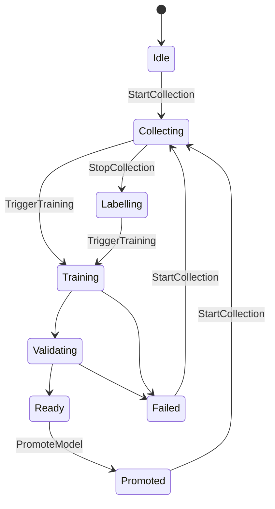

`LearningJobStateEnum` (`ns=2;i=3005`) carries exactly these eight states.

| From | Trigger | To |
|---|---|---|
| `Idle` | `StartCollection` | `Collecting` |
| `Collecting` | `StopCollection` | `Labelling` |
| `Collecting`, `Labelling` | `TriggerTraining` accepted | `Training` |
| `Training` | Server: training finished | `Validating` |
| `Validating` | Server: candidate met acceptance criteria | `Ready` |
| `Validating` | Server: candidate rejected | `Failed` |
| `Ready` | `PromoteModel` | `Promoted` |
| `Promoted`, `Failed` | `StartCollection` | `Collecting` |
| `Training`, `Validating` | Server: error | `Failed` |

Transitions marked *Server* are driven by the Server or its training backend; the rest are Method-driven. A Server **shall not** perform a transition that is not in this table, **shall** populate `LastError` on entry to `Failed`, and **shall** have `CandidateModel` non-null on entry to `Ready` — a `Ready` job with nothing to promote cannot be acted on.

`Promoted` and `Failed` both return to `Collecting`, which is what makes this a loop rather than a one-shot. A job that promoted a model last month is the same job that starts gathering evidence for the next one.

### 7.1 Method behaviour and StatusCodes (normative)

`StartCollection` and `StopCollection` are **idempotent**: calling either in the state it would move to is `Good` and changes nothing. Retrying after a lost response is otherwise indistinguishable from a second request.

`TriggerTraining` returns `Accepted`. It returns `Accepted = false` **with `Good`** where the request was valid but the Server queued nothing — an external training system declined it, for instance — and `LastError` **shall** then carry the reason. This is not an error: the request was understood and refused, and a Bad StatusCode would tell a caller to retry something that will be refused again.

`PromoteModel` takes a `Deployment` or null. **Null means every deployment fed by this job**, and a Server **shall** promote to all of them or to none. `PromotedModel` returns the model now in use, which is the same node in either case because it identifies the model rather than the deployment; a caller needing to know which deployments changed browses their `UsesModel` references afterwards.

| StatusCode | Condition |
|---|---|
| `Bad_InvalidState` | `StartCollection` when `State` is not `Idle`, `Collecting`, `Promoted` or `Failed`; `TriggerTraining` when `State` is not `Collecting` or `Labelling`; `PromoteModel` when `State` is not `Ready` |
| `Bad_NothingToDo` | `TriggerTraining` when `SamplesCollected` is 0 |
| `Bad_NotFound` | `PromoteModel` when `Deployment` is non-null and does not resolve, or when `CandidateModel` is null |
| `Bad_UserAccessDenied` | The caller is not authorized; `PromoteModel` requires the distinct authorization of §12.3 |

**A Server may implement only part of this.** A Server that captures corrections and leaves training to an external MLOps system implements `StartCollection` and `StopCollection`, drives the state to `Labelling`, and stops. The state machine is the same either way, and a client reads `State` to learn how far this Server goes rather than inferring it from which Methods exist.

`SamplesCollected` counts what has accumulated, including corrections fed back. `LastError` is the diagnostic for `Failed`, is for a human, and **shall not** be parsed.

**Promotion is the operation that matters.** `PromoteModel` makes the candidate the model deployments use — it changes what the equipment does without changing anything a reader of the address space would notice, which is exactly the change that needs a separate permission (§12.3).

A null `Deployment` argument means *every* deployment fed by this job. A Server **shall** promote to all of them or to none: a partial promotion leaves two lines judging the same parts by different models, which is a fault that shows up as an inexplicable disagreement between stations rather than as an error anywhere.

### 7.2 Relationship to models and deployments

The loop is the **producing** half of this specification; clauses 8 to 9 are the consuming half, and three joins connect them.

`BaseModel` and `CandidateModel` are `ModelType` instances like any other, so a candidate carries the same `Digest`, the same `Card` and the same lineage obligations as a model that arrived from a catalogue. A model that a Server trained is not privileged over one it imported — §11.3 requires the candidate to state `DerivedFrom` the base it started from, for the same reason a quantized model must.

Promotion **should** be gated on an `EvaluationRunType` (§11.2) whose `Passed` is true. This specification does not require it, because a Server that captures corrections and hands training to an external system may legitimately never see an evaluation — but a Server that promotes without one has no recorded answer to *why was this allowed*, and the question is asked after failures rather than before them.

Where the promoted model backs a deployment whose `VersionBinding` is `FollowsRef` (§9.3), promotion and repointing are two routes to the same outcome. §12.3.1 requires both to be authorized alike.

### 7.3 Partial implementation

The state machine describes the whole loop; almost no Server implements the whole loop.

A Server that only captures corrections implements `StartCollection` and `StopCollection`, drives `State` to `Labelling`, and stops. One that also promotes but trains elsewhere implements `PromoteModel` and lets `Training` and `Validating` be driven by its MLOps backend. Both are conformant to **AI-Learning** provided the transitions they *do* perform are the ones in §7.

This is why `State` is read rather than inferred from which Methods exist. A client that probed for Methods would learn what a Server can be asked to do; reading `State` tells it how far this job actually got, which is the question it has.

---

## 8 Inference (normative)

### 8.1 Location independence

`DeploymentType.Invoke` runs inference and returns the result, and **one call serves wherever the model runs**.

**Its signature does not change with `InferenceLocation`.** A model executing in the Server's own process and one executing in a remote service are called identically — same Method, same arguments, same outputs, same meanings. This is the single most important property in this clause, and it is not an aspiration: serving runtimes that run on a workstation and the hosted services they mirror already expose the same contract, differing only in where the request is addressed and how it is authenticated. A specification that made the call shape depend on the location would be describing an accident of deployment as though it were a property of the model.

What the location *does* change is the trust boundary, the latency and what fails when the network does. Those are clause 9's subject.

### 8.2 Payload and envelope

`Payload` is a `ByteString` and `ContentType` is its media type. This specification does not say what is inside.

That is not vagueness, it is the boundary. What goes into a model and what comes out is domain vocabulary — an image and a set of detections, a spectrum and a fault class, a maintenance history and a remaining-life estimate. An envelope that tried to type it would have to be extended by every domain that ever adopted this model, and the first domain to need something unforeseen would have to fork it.

What this specification *does* fix is everything around the payload, because none of it is domain-specific and all of it is got wrong when left to each implementer:

| Output | Why it is in the envelope |
|---|---|
| `ModelUsed` | Which model **actually** answered |
| `Usage` | What the call consumed |
| `FinishReason` | Whether the answer is complete |
| `SafetyAssessment` | Whether anything was withheld |
| `RetryAfter` | Whether, and when, to try again |

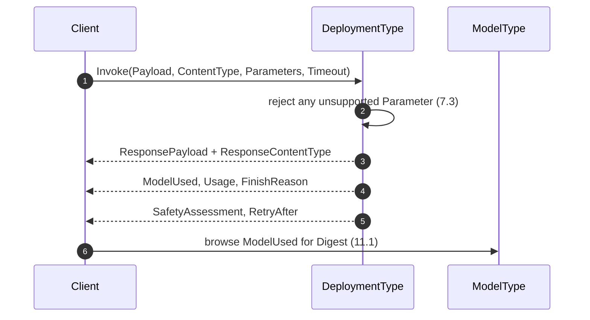

#### 8.2.1 `ModelUsed`

A Server **shall** return the model that actually produced the response, which is **not** necessarily the one the deployment names at the time the client looks.

Two mechanisms defined here can move it between the call and the read: a fallback (§9.4) answers from a different deployment entirely, and a `FollowsRef` binding (§9.3) can be repointed at a new version. In both cases the deployment's current model is the *wrong* answer to "what produced this result", and it is wrong in the direction that matters — it names a model that looks plausible.

The provenance chain of §12.1 therefore walks `ModelUsed`, not the deployment.

#### 8.2.2 `FinishReason`

A truncated answer is not a complete one, and nothing else in the response says which it is.

`FinishReason` (`FinishReasonEnum`, `ns=2;i=3006`) is `Stop`, `Length`, `ToolCall`, `Filtered`, `Cancelled` or `Error`.

Only `Stop` means the model finished saying what it had to say. `Length` means output hit a budget and **the result is incomplete**; `Filtered` means a safety policy withheld it; `ToolCall` means the model is waiting for something the caller must supply; `Cancelled` and `Error` speak for themselves.

A client that branches only on the StatusCode will accept a `Length` response as final, because nothing failed. A Server **shall** populate `FinishReason` on every response, including successful ones, so that the distinction is available without inference.

#### 8.2.3 `Usage`

Accounting is deliberately not expressed in tokens.

`UsageDataType` (`ns=2;i=3052`) carries `UnitKind`, `InputUnits`, `OutputUnits` and `TotalUnits`.

The counts are deliberately **not** named tokens. A token is one accounting unit among several: a model that consumes images, audio seconds or sensor samples meters the same thing in a different unit, and a field called `InputTokens` on such a deployment is either empty or lying. `UnitKind` names the unit — `tokens`, `images`, `samples`, `seconds` — and the three counts are in it.

`TotalUnits` is **not** required to be the sum of the other two. Caching, deduplication and shared prefixes mean the metered total legitimately differs from the arithmetic one, and a client that recomputes it will disagree with the bill.

**Not every execution site meters at all.** A tensor predict contract returns output tensors and nothing that could be counted, and an in-process runtime returns what the library returns. A Server that supplied a count on such a site's behalf would be publishing a measurement it did not take.

An **empty `UnitKind` means the call was not metered**. Where `UnitKind` is empty a Server **shall** set `InputUnits`, `OutputUnits` and `TotalUnits` to zero, and a client **shall not** read those zeros as measured quantities. A Server **shall not** report a non-empty `UnitKind` alongside counts it did not obtain from the execution site.

The sentinel is the empty unit rather than a zero count because the counts cannot carry it: they are `UInt64`, so a Server with nothing to report and one that metered nothing would otherwise encode identically. Naming the unit is what makes the difference between *no measurement* and *a measurement of none* legible, and that difference is the whole of what a client reading `Usage` is entitled to know.

#### 8.2.4 Payload size, and why `Invoke` is not the general case

`Payload` is a `ByteString`, and a `ByteString` is bounded three times over: by the Server's `MaxByteStringLength`, by the channel's negotiated `MaxMessageSize`, and by the Session's `MaxResponseMessageSize`. **This model does not get to choose any of them.** An image, a point cloud or a window of high-rate samples exceeds them routinely, and a call that cannot carry its input is not a call.

So `Invoke` is the **shortcut**, not the general path. `BeginTransfer` is the general path.

**`MaxInlinePayloadSize` is Mandatory on every deployment** and states the largest request or response it will carry inline. A client reads it *before* calling rather than discovering the bound from a rejection, which matters because the three limits above are not all visible to a client — a Server **shall not** publish a value larger than the smallest of them permits. Zero means the deployment accepts nothing inline and `BeginTransfer` is the only way in.

**A client that does not know its payload sizes in advance should use the transfer path from the outset.** Nothing is lost by doing so: the transfer path carries the same envelope and answers the same questions, and a client that starts there never has to discover mid-deployment that a payload has outgrown the shortcut.

##### The exchange

`InferenceTransferType` (`ns=2;i=1017`) carries one exchange. `Request` and `Response` are Part 5 **`FileType`** objects, so the client opens the request, writes it in chunks of its own choosing, and closes it; after `Execute`, the response is read the same way.

Nothing here invents a transfer protocol. OPC UA already has one, every client already implements it, and a bespoke chunking scheme would be a second thing to get wrong.

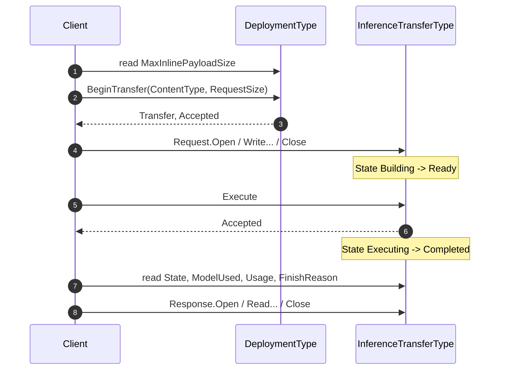

`TransferId` names the exchange, and is Mandatory for the same reason every other identifier here is: a client holding several concurrent exchanges needs to say which one it means in a log or a support call, and the NodeId alone is not something a human carries around.

`State` (`TransferStateEnum`, `ns=2;i=3014`) is `Building`, `Ready`, `Executing`, `Completed`, `Failed` or `Expired`. A client reads it rather than inferring progress from which Methods have succeeded, because a transfer that failed mid-write and one that was never started look alike from outside.

`ExpiresAt` is when the Server may reclaim an exchange that has not completed. A client that abandons one would otherwise hold Server resources until its Session ends, and a Server that never reclaimed them would be one denial of service away from unusable. `Abort` releases an exchange early, and a client that has stopped caring about a response **should** call it rather than waiting out the expiry.

##### When the *answer* is too large

The awkward case is not a large request — the client knows its own input size. It is a request that fits and produces a response that does not.

`Invoke` therefore returns **`TransferRequired`** and **`Transfer`**. Where `TransferRequired` is true, `ResponsePayload` is empty and **the work is not lost**: inference ran, and `Transfer` names the exchange to read the response from.

A Server **shall not** fail such a call. Failing it would discard work that has already been done and, worse, would tell the caller nothing about why — a client would see an empty payload and conclude the model returned nothing, which is a different and wrong answer.

##### Streaming

Where output is produced progressively rather than merely being large, §8.5 applies instead: the Server publishes it through a Subscription, and **AI-Stream** optionally carries it over a data channel. The distinction is whether the client wants the answer *as it forms* — a transfer delivers one complete response, however big.

### 8.3 Parameters

An ignored parameter is worse than a rejected one, which is the whole of the rule below.

`Parameters` is an array of `KeyValuePair`, carrying whatever the deployment accepts — a sampling temperature, an output-length bound, a decoding seed.

A Server **shall** reject a parameter it does not support, and **shall not** ignore it.

This is the one rule in the clause that costs implementers something, and it is worth the cost. A caller that sets a determinism seed and has it silently dropped believes its results are reproducible when they are not. A caller whose safety-relevant bound is discarded believes a limit is in force. Silent acceptance converts a caller's explicit instruction into a false belief, and there is no later point at which the caller can discover it.

### 8.4 Capabilities

Capabilities are asked for, never assumed from the kind of model behind a deployment.

`Capabilities` (`CapabilityDataType`, `ns=2;i=3053`) is a list of names with a supported flag — `chat`, `embeddings`, `streaming`, `tool-call`, `structured-output` and whatever else a deployment offers.

It is an **open list of strings, not an enumeration**, for the same reason `TaskKind` is: the set of things models can do is not closed, and an enumeration frozen at publication would be the first part of this specification to date. A client that meets a capability name it does not recognise is in exactly the position of one that meets an enumeration value added after it shipped, and no worse.

`GetCapabilities` re-reads them from the execution site. It exists because a remote endpoint's capabilities change without anything in this address space changing — the cached list on the deployment can be stale in a way nothing else here can.

### 8.5 Incremental results

Where a deployment produces output progressively, a Server **shall** publish it by updating a Variable that a client subscribes to. There is no streaming Method: OPC UA already has the mechanism, and a Method that returned repeatedly would be a second one.

Where the payload is large or the rate is high enough that Subscription overhead dominates, a Server **may** additionally offer the stream over a data channel; that is the **AI-Stream** facet (§13.2) and it is entirely optional. A Server that implements neither answers only through `Invoke`, and is fully conformant.

### 8.6 Asynchronous inference

`InvokeAsync` submits a request and returns immediately with the `InferenceJobType` (`ns=2;i=1008`) instance that will carry the result. The client subscribes to that job rather than polling it.

This is not a convenience. A batch scored overnight and an analysis over months of recorded data are ordinary industrial requests, and modelling them as a Method that blocks for hours would hold a Session open for the duration and lose the work if it dropped. `InferenceJobType` derives from `AiJobType` (§6.6), so it is observed exactly like every other long-running operation here.

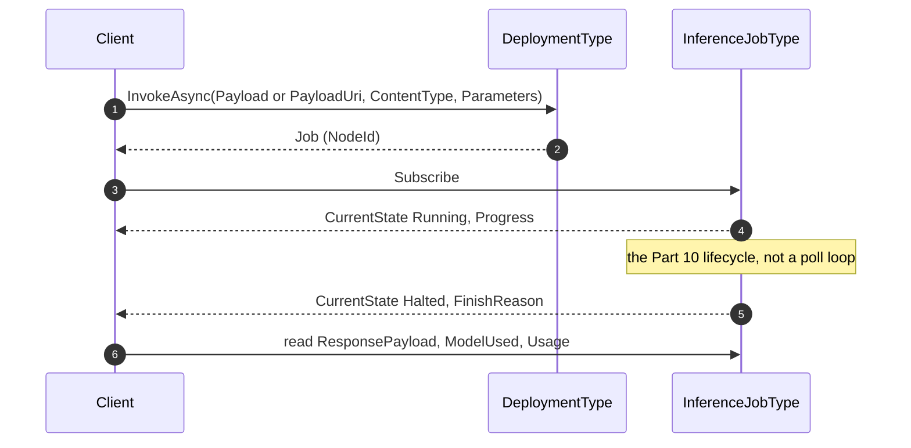

`InferenceJobType` carries `RequestPayload` and `RequestContentType`, `ResponsePayload` and `ResponseContentType`, and the same `ModelUsed`, `Usage`, `FinishReason` and `SafetyAssessment` that `Invoke` returns — the asynchronous path answers the same questions as the synchronous one, which is what makes it a path and not a different feature.

That parity has to extend to size, and §8.6.1 is where it does. The jobs this clause exists for are the ones most likely to produce a result that will not fit in a call, so an asynchronous path bounded by the limits §8.2.4 says this model does not choose would be a path that fails exactly where it was needed.

#### 8.6.1 A payload too large to carry, or already somewhere else

Two different problems, and the model answers them separately because they have different remedies.

**A result too large to return inline** is the problem `Invoke` solves with `TransferRequired` and `Transfer`, and `InferenceJobType` carries the same pair on the same terms: `TransferRequired` true means `ResponsePayload` is empty, the work is **not** lost, and `Transfer` names the `InferenceTransferType` to read it from. `MaxInlinePayloadSize` bounds both paths — it is a property of the deployment, not of the Method that happened to be called.

**Data that never needed to move** is a different problem. A batch already sitting in the plant's object store, or a result the execution site writes to storage of its own, is not made smaller by chunking; carrying it through the Session copies it twice for no benefit and makes the Session the bottleneck for both copies.

So `Invoke` and `InvokeAsync` both take a `PayloadUri`, and a Server **shall** accept exactly one of `Payload` and `PayloadUri` and **shall** reject a call supplying both or neither — the same exactly-one rule §10.2 applies to `Source` and `Registry`, for the same reason: two ways of saying where the input is, and a call that used both would not say which one was read. `InferenceJobType.RequestUri` records what was actually submitted, and `ResponseUri` names where the execution site wrote the result when it returns a location rather than bytes.

This is the model's existing idiom rather than a new one. §1.2 already says this specification does not carry artefacts — `ArtifactUri` says where the bytes are — and §10.3's `Federate` mode is the same choice made about a model instead of a payload.

Two obligations come with it, both inherited rather than invented. A `PayloadUri`, `RequestUri` or `ResponseUri` is **untrusted input** under §12.2 and subject to the same resolver policy as every other URI here. And it is an **egress question** under §9.5: a location the execution site reads is a location the input data reaches, so a deployment whose `EgressPermitted` is false **shall not** accept a `PayloadUri` naming somewhere outside the operator's boundary. A URI is a quieter way to move data than a payload, which is exactly why it needs saying.

---

## 9 Consuming a model hosted elsewhere (normative)

### 9.1 `ModelSourceType`

A URI says where to send bytes and nothing else that calling a remote model requires.

A deployment whose `InferenceLocation` is not `OnServer` executes somewhere the Server must reach over a network. Naming that place is necessary and nowhere near sufficient: a Server holding only a URI knows where to send bytes and nothing about what shape they should take, how to prove it is entitled to send them, what the far end can do, or what to do when it stops answering.

`ModelSourceType` (`ns=2;i=1009`) carries the rest. A deployment names one through its `Source` Property.

| Member | The question it answers |
|---|---|
| `EndpointUri` | Where |
| `ApiDialect` | In what shape |
| `AuthenticationKind`, `CredentialReference`, `TokenAudience` | With what proof of entitlement |
| `Capabilities` | Able to do what |
| `Reachability`, `LastSuccessAt`, `ConsecutiveFailures`, `RateLimit` | Answering, or not |

`SourceId` names the source, and is Mandatory for the same reason every other identifier here is: a source that cannot be named cannot be referred to by the deployment that uses it or by the import job that pulls from it.

### 9.2 Wire contract and authentication

`ApiDialect` (`ApiDialectEnum`, `ns=2;i=3007`) is `OpcUaInference`, `RestChatCompletions`, `OpenInferenceProtocol`, `TensorRemoteProcedure`, `EmbeddedRuntime` or `Proprietary`.

These name **the contract the remote endpoint speaks**. `OpcUaInference` is another Server implementing this specification; `RestChatCompletions` is the de-facto REST contract for chat and embeddings that most serving runtimes expose, including ones that run on a single workstation — named here for what it does rather than for whoever published it first, because a literal in a standard should not be an advertisement; `OpenInferenceProtocol` is the KServe-derived predict contract; `TensorRemoteProcedure` covers the tensor-oriented RPC contracts of dedicated inference servers; `EmbeddedRuntime` is an in-process runtime reached through a library rather than a socket. `Proprietary` is an honest admission, and a Server using it **should** populate `EndpointDescriptionUri` — otherwise nothing in the address space says how the endpoint is called.

**How an OPC UA client calls this Server is always §8** — one Method, one opaque payload, one envelope, whatever the source speaks. What the dialect on a *source* does not tell a client is what to put in that payload, and §6.4.2 puts the same enumeration on `DeploymentType` to answer that. The two are read by different parties for different purposes: the source's dialect is what this Server must speak outward, the deployment's is what a caller must speak inward, and a Server that translates between them publishes two different values. A Server that passes the payload through publishes the same value twice, which is not duplication so much as the honest answer given twice.

The literals classify the contract **this Server speaks to that endpoint**, not everything the endpoint could offer. A runtime reached in-process is `EmbeddedRuntime` and the same runtime reached over its own loopback HTTP server is `RestChatCompletions`; a hosted endpoint reached through its OpenAI-compatible surface is `RestChatCompletions` and the same host reached through its native API is `Proprietary`. The value describes the integration, so it is answerable, and a Server that changes how it calls an endpoint changes it.

Where a source serves **only as a catalogue** — §10's import reads from it and nothing calls `Invoke` through it — `ApiDialect` is `Proprietary` and `EndpointDescriptionUri` is populated. The member's value domain is inference contracts, a catalogue speaks none of them, and `Proprietary` is the accurate answer rather than a shortcoming: it says there is no inference contract here to recognise, and the description URI says what there is instead.

`AuthenticationKind` (`AuthenticationKindEnum`, `ns=2;i=3008`) is `Anonymous`, `ApiKey`, `BearerToken`, `WorkloadIdentity` or `MutualTls`. `WorkloadIdentity` is preferred wherever the hosting platform offers it, because it is the only one of the five under which no secret is stored anywhere for an attacker to read.

**It classifies the credential the Server stores, not the handshake it performs.** That is what makes it answerable against endpoints whose handshakes have nothing in common. Where a handshake is driven by an identity the platform assigns and no secret is stored, it is `WorkloadIdentity` whatever token the wire ultimately carries; where a secret is stored, it is `ApiKey` or `BearerToken` according to what the stored thing is. A request-signing scheme is therefore `WorkloadIdentity` when an assigned role signs it and `ApiKey` when a stored key does — one scheme, two values, because the question is what an attacker could steal.

Read as a handshake classifier the member would be unanswerable for most real endpoints, and the five literals are deliberately not a taxonomy of handshakes. A source whose handshake a client genuinely needs described names it through `EndpointDescriptionUri`.

**`CredentialReference` is a name, never a secret.** It identifies the credential in whatever store the Server uses. A Server **shall not** expose credential material through any Attribute of any node in this model, and a client that reads `CredentialReference` learns which credential is in use and nothing about what it is. This is stated as a prohibition rather than left implicit because the address space is a browsable, subscribable, historisable surface, and a secret placed in it is not merely readable — it is archived.

### 9.3 Version binding

`VersionBinding` (`VersionBindingEnum`, `ns=2;i=3010`) is `Pinned` or `FollowsRef`.

A **`Pinned`** deployment names one immutable model version. The artefact behind it cannot change without an observable change to the deployment.

A **`FollowsRef`** deployment names a mutable pointer — a branch, a channel, a "latest" alias — in `BoundRef`. The artefact behind it **can** change with nothing else changing.

That second case is a promotion (§7) that nobody called `PromoteModel` for. It has the same effect: what the equipment decides changes, and no reader of the address space sees a structural difference. So §12.3's requirement applies to it unchanged — a Server **shall** treat repointing a followed reference as an authorization-bearing act, not as configuration.

Stating this structurally, rather than as an upgrade-policy setting, is deliberate. What a client needs to know is whether the artefact can move under it. That is a property of the binding. When someone *intends* to move it is a schedule, and a schedule is not something a client can check.

#### 9.3.1 What `Pinned` is worth, and what `RuntimeIdentity` adds

`Pinned` says the artefact cannot change without an observable change to the deployment. How much that is worth depends on what this Server can actually verify, and `DigestProvenance` (§12.1.1) is where a client reads the answer.

Where `DigestProvenance` is `ComputedByServer` or `VerifiedOnStage`, the Server holds the bytes and the guarantee is its own. Where it is `NotAvailable`, the deployment is pinned to a **name** the source promises to hold stable, and `Pinned` records that promise rather than this Server's verification. Both are legitimate; they are not the same assurance, and a Server **shall not** represent the second as the first — which it does not have to do explicitly, because the two are already distinguishable by reading one member.

`RuntimeIdentity` is what closes the remaining gap. An artefact that has not changed can still be served by a different runtime build, a different engine compilation or a different accelerator arrangement, and produce different numbers for the same input. Where the execution site publishes an identity for its serving configuration, `RuntimeIdentity` carries it: opaque, compared only for equality, never parsed — the same contract `Digest` has.

**A change to `RuntimeIdentity` is an observable change to the deployment**, and that is what makes the sentence at the top of this clause true rather than aspirational. Under a `Pinned` binding it is often the *only* observable change available, because the model did not move and nothing else in the address space did either.

It answers a question asked long after the fact. An investigation opened in September into parts built in March walks §12.1's chain, reaches a `Digest` that is empty for good reason, and finds `VersionBinding` `Pinned` — and concludes nothing changed. Historising `RuntimeIdentity` makes *did the serving stack move between March and September* answerable through `HistoryRead`. It does not identify which build served an individual call, and a Server **shall not** be read as claiming that; concurrent calls during a rollover can straddle a change. The coarser question is the one that gets asked.

### 9.4 Availability and fallback

This is the question a plant asks that an inference API does not answer, because an inference API can assume its caller is willing to wait. A line is not.

`FallbackPolicy` (`FallbackPolicyEnum`, `ns=2;i=3009`) is Mandatory on every deployment and states what the Server does when this one cannot serve:

- **`Fail`** — report the failure and produce nothing. This is the safe default: a caller told that nothing happened can decide for itself, and deciding is often its job.
- **`HoldLast`** — keep reporting the most recent successful result. Legitimate only where a stale answer is safe, and the caller **shall** be able to establish the staleness, for which `LastSuccessAt` is sufficient. A Server **shall not** present a held result as fresh.
- **`FallBackTo`** — route to the deployment named by the `FallsBackTo` reference. The answer then comes from a **different model**, and `Invoke` **shall** report that model in `ModelUsed`. A fallback that answered without saying so would break the provenance chain precisely when it matters most.

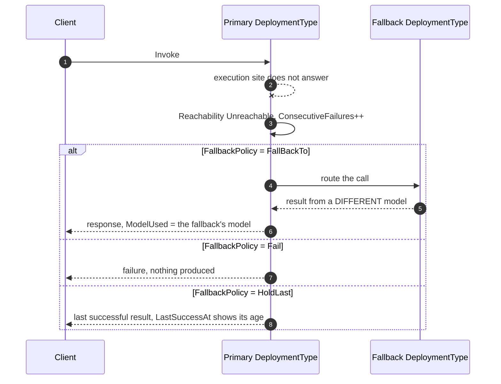

The `FallBackTo` branch is the one that needs care: the caller asked nothing different and got an answer from another model, so `ModelUsed` is the only thing that says so.

`FallsBackTo` **shall not** form a cycle. A Server **shall** reject a configuration that closes one rather than discovering it at the moment of failure, which is the worst possible moment.

`Reachability` (`ReachabilityEnum`, `ns=2;i=3013`) is `Unknown`, `Reachable`, `Unreachable` or `Throttled`. `Throttled` is separated from `Unreachable` deliberately: they look alike from the outside and call for opposite responses. An unreachable endpoint should be failed over; a throttled one will serve again shortly and failing it over merely moves the load. `RateLimit` (`RateLimitDataType`, `ns=2;i=3056`) carries `UnitKind`, `Limit`, `Remaining`, `Interval` and `RetryAfter` so a client can tell "the model said no" from "the quota said no".

`ListModels` enumerates what the source offers, returning a `ModelReferenceDataType` for each. It takes a `Filter` and a `MaxResults` because a public catalogue holds more models than any client wants to page through, and a Method that could only return everything would be unusable against exactly the sources this clause exists to reach. It is Optional: a source that serves one known model needs no catalogue.

A cap alone is not enough, and `ContinuationPoint` is why. `MaxResults` bounds the response and, on its own, puts every entry past it permanently out of reach — against a public catalogue that is most of them, which turns the member meant to make the Method usable into the one that truncates it. A client passes an empty `ContinuationPoint` on the first call and the value it received on each call after, and the enumeration is complete when the returned one is empty. That is how a client knows to stop, rather than by comparing a count against a bound it set itself and cannot distinguish from a source that happened to have exactly that many.

`TestConnection` probes the endpoint and updates `Reachability`. It exists so a commissioning engineer can establish that credentials and network policy are right **before** production traffic depends on them, rather than learning it from the first failed inference.

### 9.5 Data residency and egress

Where the data goes is a different question from who can read it, and only the first is what a plant is asking.

Encryption answers who can read data in flight. It does not answer where the data went, and that is the question a plant is actually asking.

Three members on `DeploymentType` answer it, and all three are about the deployment rather than the model, because the same model deployed twice can give different answers:

- **`DataJurisdiction`** is Mandatory and names where input is processed, in whatever scheme the operator uses — a site, a legal jurisdiction, a named zone. This specification does not fix the vocabulary because the operator's obligations do.
- **`EgressPermitted`** is Mandatory and states whether calling this deployment sends input outside the operator's boundary. A Server **shall** set it true for every deployment whose `InferenceLocation` is `Cloud`, and **shall not** set it false because the channel is encrypted.
- **`RetainsInput`** states whether the far end keeps input after serving the request — for provider-side logging, for evaluation, for training. **Unknown is not a value.** A Server that cannot establish the answer **shall** report `true`, because the assumption that keeps data in is the one that is safe to be wrong about.

`EgressPolicyUri` names the governing policy for a human.

These three members are **end-to-end, not next-hop**. `DataJurisdiction` names where input is ultimately processed; `EgressPermitted` states whether calling this deployment sends input outside the operator's boundary **by any path**; `RetainsInput` covers retention anywhere along that path. A hop that is itself local does not make the answer local.

That distinction is invisible until a deployment federates. A cell Server calling a site Server over the plant network is one local hop with no internet in sight, and if that site Server is itself calling a hosted endpoint the payload leaves the site anyway. The cell Server publishing `EgressPermitted` false is then publishing something untrue about the only thing its caller wanted to know, while satisfying every rule above — because the rule on `EgressPermitted` binds on `InferenceLocation` being `Cloud`, and the cell Server's is `EdgeOffServer`.

So where a deployment's `Source` names another Server implementing this specification, that Server's declarations are part of the answer. A Server **shall** read `DataJurisdiction`, `EgressPermitted` and `RetainsInput` from the upstream deployment it calls, and **shall not** publish values more permissive than the ones it read. A Server that cannot read them **shall** publish `EgressPermitted` and `RetainsInput` true, for the reason already given: the assumption that keeps data in is the one that is safe to be wrong about.

This propagates assertions; it does not verify them. An upstream Server that declares something false makes its downstream neighbours wrong too, and no protocol can fix that. What it does fix is the case where every Server along a chain is honest and the answer still comes out wrong because nobody was obliged to look up.

§12.3.2 states the same rule for the `FallsBackTo` edge. A payload leaves a deployment along exactly two modelled edges, and the rule is the same on both.

---

## 10 The catalogue and model import (normative)

### 10.1 The catalogue

A model catalogue **is** a registry, which is why this specification extends one rather than inventing a second.

Models come from somewhere: a public hub, a vendor catalogue, an internal MLOps registry. Every such catalogue in practice has the same shape — publishers own namespaces, models and datasets are resources within them, versions are immutable and identified by content, and mutable names point at versions rather than being them.

That shape is a registry, so this specification does not invent one. `ModelRegistryType` (`ns=2;i=1010`), `ModelPublisherType` (`ns=2;i=1011`), `ModelResourceType` (`ns=2;i=1012`) and `DatasetResourceType` (`ns=2;i=1013`) are domain extensions of *OPC UA — xRegistry*'s `RegistryType`, `GroupType` and `ResourceType`.

Two consequences fall out of the base type rather than being designed here, and both are load-bearing:

1. `ResourceType` **is** a `FileType`, so a model artefact a Server holds is readable with the inherited `Open`, `Read` and `Close`. Staging (§10.3) needs no new transport.
2. `ResourceType` already carries `ExternalReference` and `ResourceUrl`, so a catalogue entry whose bytes live elsewhere is expressible without pretending to hold them.

Each type **narrows** what its base left open, as a domain extension must. `ModelRegistryType` overrides the inherited `<Group>` placeholder so it admits `ModelPublisherType` and nothing else; `ModelPublisherType` overrides `<Resource>` so it admits `AiResourceType` and nothing else.

The narrowing reuses the **inherited BrowseNames**, and that detail is the whole mechanism rather than a formality. An InstanceDeclaration is overridden only by one with the same BrowseName, so a subtype that invents its own placeholder name leaves the inherited one fully open beside it — a registry that looks narrowed and still admits any group at all. Clause 13's conformance depends on the narrowing being real, so the validator checks the BrowseName rather than merely checking that some placeholder exists.

`AiResourceType` (`ns=2;i=1016`) is an **abstract** base of `ModelResourceType` and `DatasetResourceType`. It exists because a publisher holds both models and datasets while `<Resource>` can be overridden only once: narrowing to a common base admits exactly the two and nothing else. It adds no members of its own — its whole purpose is to be the type that the single override names.

`ModelResourceType` adds `TaskKind`, `Framework`, `Digest`, `DigestAlgorithm`, `SizeBytes`, `Gated` and `MutableRefs`. `SizeBytes` lets a staging import decide whether it has room before it starts rather than after it fails; `Gated` says the artefact needs an entitlement beyond ordinary authentication, which is otherwise discovered part-way through a transfer; `MutableRefs` names the branches and channels a deployment may follow, which is what makes §9.3's `FollowsRef` checkable rather than a claim. `DatasetResourceType` is a **sibling** of it, not something beneath it, because a dataset outlives the models trained on it and is cited by several.

### 10.2 Importing a model

A Server reaches an external AI system in **two distinct ways**, and it is worth separating them because both are sometimes called bridging.

Clause 9 covers the first: a Server that runs no model itself calls one hosted elsewhere, request by request, through a `ModelSourceType`. Nothing is brought across — the model stays where it is and the Server is a client of it.

This clause covers the second: a Server obtains a model from a catalogue so that it can afterwards describe it, execute it, or both. That is what `ModelImportJobType` does, and it is a one-time transfer rather than a per-call relationship.

`ModelImportJobType` (`ns=2;i=1007`) brings a model from a catalogue into this Server. It derives from `AiJobType`, so it is started, observed and audited like every other long-running operation here.

It takes a `Source`, a `ModelReference` and a `Mode`, and produces `ImportedModel` — a `ModelType` instance in this Server's address space, carrying an `ImportedFrom` reference back to the catalogue resource it came from. That reference is what makes *"where did this model come from"* answerable later, rather than only at the moment of import when someone happened to be watching.

An import reads from one of **two** things, and the job says which. `Source` names a `ModelSourceType` — a live endpoint the Server calls. `Registry` (`NodeId`, Optional) names a `ModelRegistryType` — a catalogue the Server browses, which is the path §4.4 and §5.1 draw and the one a plant MLOps node actually uses. A Server **shall** populate exactly one of them and **shall** leave the other null. A job that named both would not say which of the two produced the artefact whose digest §10.4 verifies, and that is the one question the job exists to make answerable.

A Server that imports only from endpoints omits `Registry` altogether; `Source` is Mandatory and remains the only path for it. `Registry` is Optional because the registry types of this clause are themselves optional to implement — a Server obliged to expose a member it can never populate learns nothing and teaches a client nothing. A Server claiming **AI-Import** does implement them, because that facet requires **AI-Catalogue** (§13.2), so there the member is present and the exactly-one rule has both of its alternatives available.

`ModelReferenceDataType` (`ns=2;i=3051`) is the `Publisher`, `Name`, `Version` triple. An import takes the triple rather than a URL because a URL says where a copy is today and the triple says which artefact is meant — and the two diverge the moment anyone mirrors anything.

### 10.3 Import modes

`ImportModeEnum` (`ns=2;i=3011`) is `Federate`, `Stage` or `Auto`.

**`Federate`** materializes the catalogue entry as a `ModelType` and leaves the artefact where it is. Nothing is downloaded; inference runs at the source. This is the right mode whenever the model is large, the source is reliable, and the plant is content for data to reach it — and it is the mode under which a Server can describe hundreds of models it has never fetched.

**`Stage`** fetches the artefact, verifies it, and makes it locally available so inference can run without the source. `BytesTransferred` tracks progress, which is zero throughout a federating import because a federating import moves none.

**`Auto`** federates, then stages if the target deployment's `InferenceLocation` is `OnServer` or `EdgeOffServer` — because those cannot reach the source at inference time, which makes the choice determined rather than a preference.

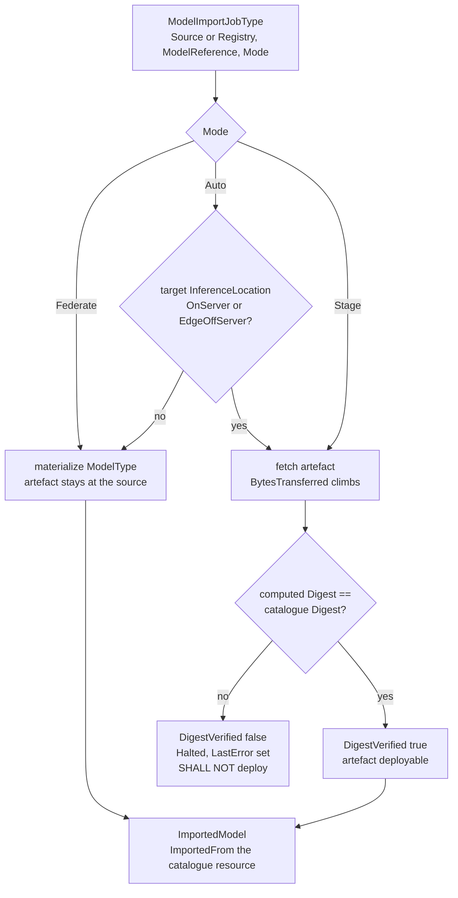

### 10.4 Digest verification

Staging is the one point in this model where a Server **shall** verify a digest rather than merely publish one.

A staging import is the moment a substituted artefact would enter the system. Before it, the model is a description; after it, it is bytes that will produce decisions.

A Server performing a staging import **shall** compute the digest of the fetched artefact, compare it with the one the catalogue resource declares, and set `DigestVerified` accordingly. Where they differ, it **shall not** deploy the artefact and **shall** leave the job in a failed state with `LastError` populated.

`Cancel` **shall** discard a partially staged artefact rather than leaving it where a later deployment could pick it up. A half-transferred file that survives a cancellation is an unverified artefact with a plausible name.

This is the point at which §12.1's requirement that `Digest` be Mandatory stops being bookkeeping and becomes an executable check. Everywhere else the digest lets someone verify an artefact if they choose to; here the Server **shall**.

---

## 11 Governance and provenance (normative)

### 11.1 Model card

The nameplate does not say whether a model may be used, and that is a separate question asked by different people.

`ModelType` answers *which artefact is this*. It does not answer *should this be running on my line*, and those are different questions asked by different people at different times.

`ModelCardType` (`ns=2;i=1015`), reached through `ModelType.Card`, answers the second. `IntendedUse` and `Limitations` are both **Mandatory**. A card that records only what a model can do describes half its behaviour, and it is the other half — where it stops working, on what inputs, under what conditions — that a commissioning engineer needs in order to decide whether the model suits the installation in front of them. `OutOfScopeUse`, `License`, `EthicalConsiderations` and `ContactUri` are optional.

`TrainingDataCutoff` deserves its own mention. A model cannot know anything after it, and "the model was trained before this existed" is a common and commonly missed explanation for a field failure that otherwise looks like a defect.

`DeprecatedFrom` and `SupportedUntil` are its forward-facing twins, and they are on the card rather than the nameplate for the reason the split exists: *how long will this keep working* is a question about whether the model may run here, not about which artefact it is.

They are different dates with different responses. `DeprecatedFrom` is when the source stops treating the model as current while continuing to serve it — the date that starts a requalification. `SupportedUntil` is when the source stops serving it at all.

The second is worth being blunt about, because its consequence is not the one the surrounding members suggest. On that date the deployment does not degrade; it stops. `Reachability` goes `Unreachable`, `ConsecutiveFailures` climbs, and `FallbackPolicy` decides what happens next — and where that is `FallBackTo`, the line keeps producing while something outside the qualified configuration answers. §12.3.2 constrains that fallback on residency grounds and `ModelUsed` records it faithfully, so nothing here is hidden; it is simply not noticed, because nobody was watching for a date.

That is the whole value of the member. Every other availability facility in this model — `Reachability`, `ConsecutiveFailures`, `LastSuccessAt`, `FallbackPolicy` — is a way of coping *after* the fact. This is the only one whose value is a date in the future, and where a source publishes it in machine-readable form a Server **should** carry it, because a requalification takes longer to schedule than an outage takes to notice.

### 11.2 Evaluation

A metric without the threshold it was judged against cannot be acted on.

`EvaluationRunType` (`ns=2;i=1014`) is one measurement of a model against a dataset. It is a first-class object rather than a field on the model because the same model is measured many times, and because the run that gated a promotion must remain readable afterwards to answer why the promotion was allowed.

`RunId`, `EvaluatedModel` and `Metrics` are **Mandatory**: a run that cannot be named, or that does not say which model it measured, or that carries no measurement, records nothing that can be acted on. `Dataset`, `CompletedAt` and `ReportUri` are Optional — a Server may evaluate against data it does not model here, and the full report often lives outside OPC UA entirely.

`EvaluationMetricDataType` (`ns=2;i=3055`) carries `Name`, `Value`, `Unit`, `Threshold`, `Comparison` and `Passed`. **The threshold travels with the metric.** An accuracy of 0.94 means nothing on its own; a reviewer reading it a year later has no way to recover what "good" meant, and the person who knew has moved on.

`Passed` on the run is the conjunction of the individual ones. A Server **shall not** report it true while any metric's `Passed` is false — a summary that disagrees with its own detail is worse than no summary, because it is the field people read.

Models carry `EvaluatedBy` references to their runs. It is optional and repeating: the run that gated promotion is not necessarily the most recent one.

### 11.3 Lineage

Lineage is a **chain**, not a field, and the difference is what makes it usable.

`DerivedFrom` links a model to the one it was fine-tuned, distilled or quantized from.

It is a reference and not a string because lineage is walked. A model three derivations from its base is answerable for all three — a defect in the base is a defect in every descendant — and a field naming only the immediate parent cannot be followed to find out.

`Quantization` on `ModelType` states the numeric precision the artefact is stored in. A quantized model is a **different artefact with different behaviour**, not a packaging detail, and treating it as one is how a model that passed evaluation at full precision ends up deployed at reduced precision without being re-measured.

### 11.4 Safety assessment

Where a safety policy is applied to an inference call, what it produces is a set of **findings** — each naming a category, how severe it was, and whether anything was withheld as a result.

`SafetyAssessmentDataType` (`ns=2;i=3054`) carries `Category`, `Severity`, `Filtered` and `Detail`, and is returned by `Invoke` where a policy was applied.

`Severity` (`SafetySeverityEnum`, `ns=2;i=3012`) is `None`, `Low`, `Medium` or `High`. `Category` is a **String**, not an enumeration, because harm categories are set by the policy an installation adopts and an industrial taxonomy — out-of-distribution input, unsafe recommendation, sensitive-data exposure — looks nothing like a consumer one. Fixing the categories here would mean fixing them wrong for most adopters.

`Filtered` distinguishes withheld from flagged. A client that treats the two alike will either discard usable output or act on output that was not meant to be acted on.

---

## 12 Security

### 12.1 Provenance

Provenance is the point of the digest: without it the other members describe an artefact nobody can confirm they hold.

A published result is traceable to the artefact that produced it by: result → deployment (the consuming specification's `NodeId` Property) → `UsesModel` → `ModelType` → `Digest`.

Every link is required for the chain to hold, which is why `UsesModel` is exactly-one (§6.5) and `Digest` is Mandatory (§6.2). A Server **shall** populate `Digest` for every model whose artefact is obtainable through `ArtifactUri`.

`DigestAlgorithm` **shall** name a hash function with **at least 256-bit output and no known collision weakness**; `SHA-256` is the default and is always acceptable. It **shall not** be `MD5`, `SHA-1` or a truncated variant — chosen-prefix collisions against those are practical, so a substituted artefact would pass verification, and a verification that can be passed by the wrong artefact is worse than none because it is believed.

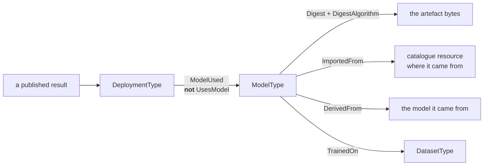

#### 12.1.1 What a digest is worth, and why an empty one is not a failure

`Digest` is Mandatory so that its absence is uniform and browsable: a client finds the member on every model and reads an empty value, rather than not finding the member and being unable to tell a model without a digest from a Server that does not implement digests. That is the right trade, and it is worth stating plainly that **most sources cannot fill it**. An endpoint that names models but never their content — which is what a hosted inference API generally is — has no digest to give, and a Server integrating one is behaving correctly when it publishes none.

But "empty" then carries two meanings, and a present value carries three. `DigestProvenance` (`DigestProvenanceEnum`, `ns=2;i=3015`) is **Mandatory** on `ModelType` and separates them:

| Value | `Digest` | What a client may conclude |
|---|---|---|
| `NotAvailable` | empty | The source publishes no digest. There is nothing to obtain and nothing was withheld. |
| `DeclaredBySource` | present | An assertion forwarded. No party the Server can speak for has hashed the artefact. |
| `ComputedByServer` | present | Evidence the Server holds. Nothing independent agrees with it, so a substitution that preceded the Server obtaining the bytes is undetected. |
| `VerifiedOnStage` | present | The Server computed it during a staging import and it matched what the source declared (§10.4). Two independent parties agree, which is the strongest statement this model carries. |

It is Mandatory for the reason `Digest` itself is, stated in §6.2: clause 12 depends on it, and a rule that depends on an Optional member is one a conformant Server can silently not satisfy. A client deciding whether to run a model on a line needs to distinguish *nobody checked* from *two parties agree*, and an Optional member would let a Server decline to answer exactly where the answer matters.

`ModelResourceType` carries the same member as **Optional**, mirroring the `Digest` it qualifies, which is Optional there. A catalogue declaring a digest it did not compute is `DeclaredBySource`; one serving the artefact through the inherited `Open`, `Read` and `Close` can reach `ComputedByServer`.

**A Server shall not put a non-content identifier in `Digest`.** A response fingerprint, a resource name, a storage entity tag and a repository commit identifier are all tempting, all stable, and none of them a digest of the artefact that ran. A client that verified against one would believe it had checked something it had not, which is the failure mode `DigestAlgorithm`'s strength rule exists to prevent — arrived at by a different route. `NotAvailable` is the answer.

Where such an identifier **locates** the artefact or its provenance record, it belongs in `ArtifactUri` or `ProvenanceUri`, which promise nothing about content. Where it identifies something else — a serving configuration, a request route — this model has no member for it, and inventing one out of `Digest` is not the remedy. A datum with no home is better recorded as having none than filed somewhere a client will read it as an artefact digest.

**Provenance does not strengthen by being forwarded.** Where a deployment's `Source` names another Server implementing this specification, that Server publishes a `Digest` and a `DigestProvenance` of its own, and both are readable. A Server **shall not** publish a `DigestProvenance` stronger than the one it read upstream, where the ordering is `NotAvailable` < `DeclaredBySource` < `ComputedByServer` < `VerifiedOnStage`. A digest received across a federation hop and not checked against bytes this Server holds is `DeclaredBySource` however the upstream Server obtained it: republishing its `VerifiedOnStage` would claim a verification this Server did not perform, and the claim would be indistinguishable from one it had. This is the composition rule §9.5 states for residency, applied to the other thing a federated deployment forwards.

#### 12.1.2 Broken links

The walk is: result → deployment → `ModelUsed` → `ModelType` → `Digest`, and — where the model was imported — `ImportedFrom` → the catalogue resource it came from.

Two of those links can be broken by a Server that is otherwise behaving correctly:

- Reading the **deployment's current model** instead of `ModelUsed` gives the wrong answer whenever a fallback served the call or a followed reference moved (§8.2.1). It is wrong silently and plausibly, which is the worst combination.
- Trusting a **staged artefact whose digest was never checked** breaks it at the point where an artefact enters the system. §10.4 is where that check is required, and it is the only place in this model where a Server **shall** verify a digest rather than merely publish one.

### 12.2 URI handling

Every URI in this model is untrusted input.

`ArtifactUri`, `ProvenanceUri` and `EndpointUri` are values a client may have written and a Server may resolve. A Server **shall** validate them against a configured policy before resolving, and **shall not** follow one to a scheme or host the policy does not permit.

Where `InferenceLocation` is not `OnServer`, `EndpointUri` **shall** name a scheme that is authenticated and confidential. Inference off the Server means the input data leaves it, and the result comes back from something the Server did not compute — both directions need the channel to be trustworthy.

The set of resolvable URIs grew with clauses 9 to 10, and every addition is a value some client may have written: `ModelSourceType.EndpointUri` and `EndpointDescriptionUri`, `ModelCardType.ContactUri`, `EvaluationRunType.ReportUri`, `ModelType.SafetyPolicyUri`, `EgressPolicyUri`, and the catalogue's inherited `ResourceUrl`. The same policy governs all of them. A Server that validates the ones it remembers and resolves the rest has a policy in name only.

A staging import (§10.3) is the sharpest case, because it fetches bytes that will subsequently produce decisions. A Server **shall** apply the resolver policy to the artefact location **before** transferring, not after — a policy checked on the way out is not a control, and `SizeBytes` exists partly so that the decision can be made without starting.

#### 12.2.1 Credential material

A Server **shall not** expose credential material through any Attribute of any node in this model. `CredentialReference` names a credential in whatever store the Server uses; it never carries one, and `TokenAudience` states what a token is requested *for*, not what it is.

This is stated as a prohibition rather than left to implementers' good sense because the address space is not merely readable. It is browsable by anything with a Session, subscribable so that a value is pushed as it changes, and historisable so that a value read once is retained. A secret placed there is not exposed once — it is published, distributed and archived.

`WorkloadIdentity` is preferred wherever the platform offers it, for the reason that it is the only authentication kind under which there is no secret anywhere to be exposed by a future mistake.

### 12.3 Promotion authorization

Promotion needs an authorization of its own, distinct from the one that permits ordinary operation.

A Server **shall** require an authorization for `PromoteModel` distinct from the one that permits reading this model or operating the equipment.

Promotion changes behaviour without changing structure. Nothing in the address space looks different afterwards except a version string, so the usual defence — that a significant change is visible — does not apply here.

#### 12.3.1 Followed references

Promotion has a second door, and a control that guards only the first is misleading rather than merely weaker.

`PromoteModel` is not the only way the model behind a deployment changes. A `FollowsRef` binding (§9.3) moves whenever whoever controls the reference repoints it, and nothing in this address space changes when they do.

A Server **shall** treat repointing a followed reference as the same class of act as calling `PromoteModel`, and **shall** subject it to the same distinct authorization. A control that guards the front door while the side door stands open is not a weaker control — it is a misleading one, because the audit trail shows every promotion having been authorized.

For the same reason `AiJobType.RequestedBy` records who started a job. An authorization check that leaves no record answers *was this allowed* but not *who did it*, and only the second question can be asked after the fact.

#### 12.3.2 Fallback

A fallback changes what answers, not who may ask.

`FallBackTo` (§9.4) routes a call to a different deployment, and therefore a different model, without the caller asking for it.

That is not a privilege escalation — the caller was already entitled to an answer — but it **is** a change in what produced the answer, and §8.2.1 requires it to be visible in `ModelUsed`. A Server **shall not** configure a fallback to a deployment whose `EgressPermitted` or `DataJurisdiction` is more permissive than the deployment falling back to it. Otherwise a network fault silently sends plant data somewhere policy forbids, which is precisely the moment nobody is watching.

### 12.4 Digest and authorship

A digest is not a signature, and the gap between the two is where an installation's real exposure sits.

`Digest` establishes that an artefact is the one described. It does **not** establish who produced it or that they were entitled to. A Server **shall not** present digest verification as authorization, and an installation that needs provenance of authorship needs a signature, which this model does not define.

The distinction sharpens once models arrive through a bridge (§10.2). A staging import verifies that the bytes it fetched match the digest the catalogue declared — so it detects corruption in transfer, and substitution by anyone who could not also edit the catalogue entry. It detects nothing at all about an attacker who could edit both, and the catalogue is the more attractive target precisely because it is the one that many machines read.

So what `DigestVerified` means is narrow and worth stating plainly: **the artefact is the one this catalogue entry described**. Whether that entry described the right artefact is a question about the catalogue, answered by the catalogue's own access control and by whatever signing the publisher applies — neither of which this model can see.

Two practical consequences:

- A Server **shall not** treat `DigestVerified` as evidence that a model is approved for use. §11.1's card and §11.2's evaluation are what an installation reads for that, and `ProvenanceUri` is the hand-off to the system that actually decides.
- An installation whose threat model includes a compromised catalogue **should** verify a publisher signature over the artefact out of band before promotion. This specification records where the artefact came from and what it hashes to, which is what makes such a check possible; it does not perform it.

---

## 13 Profiles and conformance units

### 13.1 Declaring conformance

A Server declares conformance by exposing `AiRootType` under the Server object with `SpecificationVersion` set to the release it implements.

Facets are **additive and independent** except where a row states otherwise, and only one dependency exists: **AI-Import** requires **AI-Catalogue**, because an import job with nothing to import from is not implementable.

The split matters more here than in a smaller model, because the plausible Servers differ enormously — a device running one fixed model, a gateway calling a hosted one, and a plant MLOps node that may never call `Invoke` at all are three different products rather than three degrees of completeness of one. §13.3 names them as profiles. A single monolithic conformance claim would have made two of the three unclaimable.

**AI-Residency** is deliberately separate from **AI-Federation**. A Server can be perfectly capable of calling a remote model while being unable to state where the data goes, and an operator who needs the second guarantee needs to be able to ask for it by name rather than infer it from the first.

### 13.2 Facets

| Facet | Requires |
|---|---|
| **AI-Base** (mandatory) | `AiRootType` with `Models` and `Deployments`; at least one `ModelType` with `ModelId`, `Name`, `Version`, `Digest`, `DigestAlgorithm` and `DigestProvenance`; where the Server exposes any deployment, each carries `DeploymentId`, `InferenceLocation` and `State` and satisfies the exactly-one `UsesModel` rule of §6.5; the digest rules of §12.1 |
| **AI-Dataset** | `DatasetType` instances with `DatasetId` and `SourceKind`, and `TrainedOn` from at least one model |
| **AI-OffServer** | A deployment whose `InferenceLocation` is not `OnServer`, and §12.2's requirement that its `EndpointUri` name an authenticated, confidential scheme |
| **AI-Signatures** | `Inputs` and `Outputs` populated on every model |
| **AI-Learning** | `LearningJobType`, the §7 state model, every Method that drives a transition in it, and the distinct `PromoteModel` authorization of §12.3 |
| **AI-Invoke** | `DeploymentType.Invoke` with `ModelUsed` and `FinishReason` populated on every response, and `Usage` returned on every response — its `UnitKind` empty where the execution site does not meter, per §8.2.3; the §6.4.2 requirement to publish `ApiDialect` where `Inputs`/`Outputs` do not describe the payload contract; the exactly-one `Payload`/`PayloadUri` rule of §8.6.1; and the §8.3 rule that an unsupported parameter is rejected rather than ignored |
| **AI-InvokeAsync** | `InvokeAsync` and `InferenceJobType`, answering the same questions as `Invoke` including size (§8.6.1): the exactly-one `Payload`/`PayloadUri` rule, and `TransferRequired` with `Transfer` where a result outgrew the inline bound |
| **AI-Transfer** | `BeginTransfer` and `InferenceTransferType`, `MaxInlinePayloadSize` on every deployment, and the §8.2.4 rule that `Invoke` reports `TransferRequired` rather than failing a call whose response outgrew the inline bound |
| **AI-Stream** | Incremental results published over a data channel (§8.5). Entirely optional; a Server that answers only through `Invoke` is conformant without it |
| **AI-Federation** | `ModelSourceType` with `ApiDialect`, `AuthenticationKind` and `Reachability`; the credential-secrecy prohibition of §9.2; `FallbackPolicy` on every deployment and the acyclicity rule of §9.4; `LastModifiedAt` on every model reached through a `FollowsRef` binding (§6.2.3); the composition rules of §9.5 and §12.1.1, which forbid a Server publishing residency or digest provenance stronger than what it read upstream |
| **AI-Residency** | `DataJurisdiction`, `EgressPermitted` and `RetainsInput` on every deployment, with the §9.5 rules including the requirement to report `RetainsInput` true when it cannot be established |
| **AI-Catalogue** | `ModelRegistryType`, `ModelPublisherType` and `ModelResourceType`, with the placeholders narrowed as §10.1 requires |
| **AI-Import** | `ModelImportJobType`, the federate/stage/auto modes of §10.3, the exactly-one `Source`/`Registry` rule of §10.2, and the digest verification of §10.4. Requires **AI-Catalogue** |

A Server **shall** publish the URI of every facet and profile it claims in `Server/ServerCapabilities/ServerProfileArray`, which is where a client discovers what it supports without browsing for members and guessing.

### 13.3 Profiles

A facet is a building block. A **profile** is a complete claim: a named set of facets describing one plausible Server, which is what a procurement document cites and what two vendors implementing the same shape agree they have built.

Four are defined. Each includes **AI-Base**, and a Server **may** claim more than one — a gateway that also mirrors a catalogue claims two, which is the whole reason profiles are composed from facets rather than written out independently.

| Profile | Facets | The Server it describes |
|---|---|---|
| **AI Inference Device Server** | AI-Base, AI-Invoke | Runs models itself. A camera, a controller or an industrial PC executing a model in its own process, describing what it runs and answering calls against it. |
| **AI Inference Gateway Server** | AI-Base, AI-Invoke, AI-OffServer, AI-Federation, AI-Residency | Calls a model hosted elsewhere. The bridge between a plant address space and an external inference service. |
| **AI Model Catalogue Server** | AI-Base, AI-Catalogue, AI-Import | Holds and distributes models without necessarily running any. A plant MLOps node mirroring a corporate registry and staging artefacts onto controllers. |
| **AI Model Lifecycle Server** | AI-Base, AI-Dataset, AI-Learning, AI-Catalogue, AI-Import | Closes the loop of clause 7: accumulates a dataset from the line, trains a candidate, evaluates it, promotes it, and keeps the lineage that explains why. |

**AI-Residency is inside the gateway profile rather than optional to it.** The moment inference leaves the Server the question *where does my data go* has an answer, and a gateway that cannot state it is precisely the arrangement §9.5 exists to prevent. A Server that federates and cannot answer claims the facets individually and not this profile.

The **Inference Device** profile does not include AI-Signatures, though a tensor runtime can usually satisfy it, because a Server serving one model behind a documented request body is a legitimate device and `Inputs`/`Outputs` do not describe a JSON contract (§6.4.2). It is claimed alongside where it holds.

The **Lifecycle** profile is the only one that requires AI-Learning, and it requires AI-Dataset with it. A learning loop whose training data is not described is a loop that cannot be audited, and §12.3's promotion authorization exists to be answerable about exactly that.

None of the four is a subset of another, and that is the point. A device that runs one fixed model, a gateway that runs none, and a catalogue node that may never call `Invoke` are three different products, and a single monolithic profile would have made two of them unclaimable.

### 13.4 Profile and facet URIs

A profile name is for a human. `ServerProfileArray` holds URIs, and unless this specification states them two Servers implementing the same profile publish different strings and no client can match either.

Profiles are published under `http://opcfoundation.org/UA-Profile/AI/Server/`:

| Profile | URI suffix |
|---|---|
| AI Inference Device Server | `InferenceDevice` |
| AI Inference Gateway Server | `InferenceGateway` |
| AI Model Catalogue Server | `ModelCatalogue` |
| AI Model Lifecycle Server | `ModelLifecycle` |

Facets are published under `http://opcfoundation.org/UA-Profile/AI/Facet/`, with the suffix being the facet name after the `AI-` prefix: **AI-Base** is `Base`, **AI-InvokeAsync** is `InvokeAsync`, **AI-OffServer** is `OffServer`, and so on for every row of §13.2.

These URIs are **provisional**, on the same terms as the namespace URI and the NodeIds: this is a working-group draft, and the OPC Foundation assigns the final values.

---

| Artifact | Path |
|---|---|
| This specification | `metaverse-specs/ai-model-management/OPC-UA-AI-Model-Management.md` |
| Information model | `metaverse-specs/ai-model-management/Opc.Ua.AiModelManagement.NodeSet2.xml` |
| NodeId assignments | `metaverse-specs/ai-model-management/Opc.Ua.AiModelManagement.NodeIds.csv` |
| Generator | `metaverse-specs/extras/ai-model-management/tools/build_model.py` |
| Validator | `metaverse-specs/extras/ai-model-management/tools/validate_local.py` |
| Annex A (generated) | `metaverse-specs/extras/ai-model-management/tools/model-reference.md` |
| Implementation guides (informative) | `metaverse-specs/extras/ai-model-management/examples/` |
| Guide validator | `metaverse-specs/extras/ai-model-management/examples/tools/validate_examples.py` |

The NodeSet, the CSV and Annex A are generated from a single in-code source of truth and are **deterministic**. The generator is edited; the generated files are not.

The [implementation guides](../extras/ai-model-management/examples/index.md) are informative and introduce nothing. They map this model onto the systems an implementer is likely to be integrating — Azure AI Foundry, OpenAI, Amazon Bedrock and SageMaker, NVIDIA NIM and Triton, Google Vertex AI, Hugging Face, KServe, embedded runtimes, and another Server implementing this specification. Naming products there rather than here is what lets clause 9.2 name dialects for what they do: the normative document stays neutral and the informative folder beside it does not have to. Every literal of `ApiDialectEnum` and `AuthenticationKindEnum` is exercised by at least one guide, and `validate_examples.py` fails if a guide cites a member this model does not declare.

```powershell
python metaverse-specs\extras\ai-model-management\tools\build_model.py
python metaverse-specs\extras\ai-model-management\tools\validate_local.py
python metaverse-specs\extras\ai-model-management\examples\tools\validate_examples.py
```

---

## Annex A — Information model (generated)

Annex A is generated from the NodeSet and is authoritative for identifiers, DataTypes, ValueRanks, ModellingRules, structure fields, enumeration values and Method signatures. See [`../extras/ai-model-management/tools/model-reference.md`](../extras/ai-model-management/tools/model-reference.md).

## Annex B — Informative alignments

Not normative references, and no dependency. Recorded because this model borrowed from them deliberately.

- **IDTA 02060** *AI Model Nameplate* — the member set of `ModelType`. Currently the only standardised description of an industrial AI model.
- **IDTA 02058** *AI Dataset* — the member set of `DatasetType`.
- **IDTA 02059** *AI Model Management* — the member set of `DeploymentType`, including the inference-location concept.
- **OPC 30270** — the OPC UA ⇄ Asset Administration Shell bridge, over which the alignments above become a populated AAS.
- **xRegistry** — [the CNCF specification](https://github.com/xregistry/spec) the OPC UA projection in this repository follows. Its `groups` / `resources` / `versions` structure is what clause 10 extends, and public proxies over model hubs already present exactly the arrangement adopted here: publisher as group, models and datasets as sibling resource types, versions immutable and identified by content, mutable branch and tag names as pointers rather than versions.
- **OPC UA — Vision** in this repository is the first consuming specification. Its `InferencePipelineType.Deployment` is a `NodeId` Property naming a `DeploymentType` here, per §5.2, and neither NodeSet requires the other.

---

## Annex C — A worked arrangement (informative)

This annex is **informative**. It shows one arrangement that satisfies clauses 8 to 10, to make the interaction between them concrete. No member here is introduced by this annex; every one is defined in Annex A.

### C.1 The situation

A plant runs a surface-inspection model on a finishing line. The model is published in a corporate catalogue. Two things are true at once and pull in opposite directions: the good model is large and runs on a GPU appliance nobody wants to put on every line, and the line must keep running when the network to that appliance does not.

So the plant deploys twice. A **primary** deployment calls the appliance. A **secondary** deployment runs a smaller quantized model on the line controller itself. The primary falls back to the secondary.

### C.2 Getting the models here

Both start as one `ModelImportJobType` each, against a `ModelSourceType` naming the corporate catalogue.

| | Primary | Secondary |
|---|---|---|
| `ModelReference` | `Publisher` = `plant-quality`, `Name` = `surface-defect`, `Version` = `4.2.0` | same publisher and name, `Version` = `4.2.0-int8` |
| `Mode` | `Federate` | `Stage` |
| Result | a `ModelType` describing an artefact that stays in the catalogue | a `ModelType` whose artefact is now on the controller |

The second job fetches bytes, so `BytesTransferred` climbs and `DigestVerified` is the gate: the job compares what it fetched against the `Digest` the `ModelResourceType` declared, and refuses to deploy on mismatch (§10.4). The first job moves nothing, so `BytesTransferred` stays zero.

Both resulting models carry `ImportedFrom` back to the catalogue resource, which is what makes the question *where did this come from* answerable next year rather than only today.

The quantized model additionally carries `DerivedFrom` to the full-precision one and states `Quantization` = `int8`. That is not bookkeeping: it is the reason a reviewer knows the two will not agree on every part, and the reason the secondary needs its own `EvaluationRunType` rather than inheriting the primary's.

### C.3 The two deployments

| | Primary | Secondary |
|---|---|---|
| `InferenceLocation` | `EdgeOffServer` | `OnServer` |
| `Source` | the appliance's `ModelSourceType` | null |
| `VersionBinding` | `Pinned` | `Pinned` |
| `FallbackPolicy` | `FallBackTo` | `Fail` |
| `FallsBackTo` | the secondary | — |
| `DataJurisdiction` | `plant-north` | `plant-north` |
| `EgressPermitted` | `false` | `false` |
| `RetainsInput` | `false` | `false` |

The appliance is on the plant network, so nothing leaves the site and `EgressPermitted` is false for both. Had the plant chosen a hosted service instead, §9.5 would have required it to be `true` — and, if the operator could not establish what the provider did with the images, `RetainsInput` `true` as well.

Both are `Pinned`. A `FollowsRef` primary would have been convenient and would have meant the artefact could change without anything else changing, which §9.3 treats as a promotion in disguise.

### C.4 A normal call, and a link failure

A client calls `Invoke` on the primary with an image as `Payload` and its media type as `ContentType`. The response carries `ModelUsed` naming the full-precision model, `Usage` with `UnitKind` `images` and `InputUnits` 1, and `FinishReason` `Stop`.

Then the switch feeding the appliance fails.

The Server's next attempt does not answer. `Reachability` on the primary goes `Unreachable` and `ConsecutiveFailures` climbs; `LastSuccessAt` stops advancing. Because `FallbackPolicy` is `FallBackTo`, the call is served by the secondary, and this is the part that matters: **the response says so.** `ModelUsed` now names the quantized model, not the one the primary still points at.

A client that logged only the deployment would record that the full-precision model made every judgement that afternoon. A client that reads `ModelUsed` — as §8.2.1 requires — records what actually happened, which is what an audit a month later needs.

Note what did **not** change: the client called the same Method with the same arguments throughout, and never learned that inference moved from an appliance to the local controller except by reading the outputs it was going to read anyway.

### C.5 Throttling

Had the appliance been saturated rather than unreachable, `Reachability` would have read `Throttled` and `RateLimit.RetryAfter` would have carried a wait.

The distinction is the point of separating the two values. Failing over a throttled endpoint moves load onto the weaker model for no reason; the endpoint will serve again shortly. Failing over an unreachable one is exactly right. From the outside the two look identical, which is why the Server states which it is rather than leaving a client to infer it from a timeout.

---

---

## Annex D — Deploying a classical model (informative)

This annex is **informative**. Clause 8 is written around an envelope, and some of its vocabulary — capability names like `chat`, accounting in units that are often tokens — comes from the kind of model that made those terms familiar. Most industrial deployments run something else entirely: a fixed-shape tensor model, exported once, executed in-process, answering in microseconds.

This annex works that case end to end to show that the same envelope carries it with nothing bent. Every member named here is defined in Annex A.

### D.1 The model

A gearbox condition classifier. Exported to **ONNX**, 4.8 MB, takes a window of vibration samples and returns a class distribution over four fault states. It runs on the line controller because a 20 ms budget does not survive a network hop, and because the plant does not permit raw vibration to leave the site.

Nothing about that description needs a member this specification does not already have.

### D.2 In the catalogue

| Member | Value |
|---|---|
| `ModelResourceType` id | `gearbox-fault` under publisher `plant-reliability` |
| `TaskKind` | `classification` |
| `Framework` | `onnxruntime` |
| `Digest` / `DigestAlgorithm` | SHA-256 of the `.onnx` file |
| `SizeBytes` | `5033164` |
| `Gated` | `false` |

`TaskKind` is a String, and `classification` is not drawn from any list this specification publishes. That is the point of it being a String: a catalogue that also holds `regression`, `anomaly-detection` and `remaining-useful-life` needs no amendment here to say so.

`SizeBytes` earns its place in this example. 4.8 MB is nothing; the same catalogue holds a vision model of 340 MB, and a controller with 64 MB of free storage needs to refuse **before** transferring rather than after.

### D.3 Getting it onto the controller

A `ModelImportJobType` with `Mode` = `Stage`, because `InferenceLocation` will be `OnServer` and an on-server deployment cannot reach the catalogue at inference time.

The job fetches, computes SHA-256 over what arrived, compares it with the `Digest` the catalogue declared, and sets `DigestVerified`. This is the whole of the integrity story for a model that will now decide whether a gearbox is failing, and §10.4 is why it is a **shall** here and nowhere else.

The resulting `ModelType` carries `ImportedFrom` back to the catalogue resource, so a year later *where did this come from* has an answer that does not depend on anyone having written it down.

### D.4 The shape contract

`Inputs` and `Outputs` carry `TensorSignatureDataType`, and for a classical model they are the **entire** interface description:

| | `Name` | `ElementType` | `Shape` | `Layout` |
|---|---|---|---|---|
| Input | `window` | `float32` | `-1, 2048, 3` | `NWC` |
| Output | `probabilities` | `float32` | `-1, 4` | |

The leading `-1` is the batch axis, dynamic as ONNX exports usually leave it. `2048` is the window length and `3` the axis count, and both are fixed by the export — send 1024 samples and the runtime rejects the call.

This is why §6.2 insists the signatures are the only machine-readable description of what a deployment accepts. A client that reads them establishes at configuration time that its window length matches; a client that does not discovers it as a rejected call at 3 a.m. And `LabelClasses` — `["healthy", "bearing-wear", "tooth-crack", "misalignment"]` — is what makes `probabilities[2]` mean something, which is exactly why §6.2 forbids reordering it in place.

### D.5 The deployment

| Member | Value |
|---|---|
| `InferenceLocation` | `OnServer` |
| `Source` | null — nothing to reach |
| `ApiDialect` | not applicable; where a source is named for a local runtime it is `EmbeddedRuntime` |
| `AcceleratorKind` | `Cpu` |
| `VersionBinding` | `Pinned` |
| `FallbackPolicy` | `Fail` |
| `DataJurisdiction` | `plant-north` |
| `EgressPermitted` | `false` |
| `RetainsInput` | `false` |
| `LatencyBudget` | 20 ms |

`FallbackPolicy` is `Fail` deliberately. There is no second model, and a condition classifier that quietly returns a stale verdict is worse than one that says it could not answer — the whole value of the reading is that it is current.

`EgressPermitted` is `false` and means it: the bytes never leave the controller, let alone the site.

### D.6 Calling it

`Invoke` takes the tensor as `Payload` with a `ContentType` that says how it is encoded — for example `application/octet-stream` for a raw little-endian `float32` buffer in the declared layout, or a media type the deployment publishes for a framed encoding.

**This specification does not standardise a tensor wire format, and that is deliberate.** The candidates — raw buffers, protobuf tensors, Arrow, npy — are each right in some deployment and wrong in others, and a Server that already speaks one to its runtime should not have to transcode into a format chosen here. `ContentType` names which one is in use, which is what a client actually needs, and the shape contract of §D.4 tells it what must be inside whichever it is.

The response comes back through the same envelope:

| Output | Value here |
|---|---|
| `ResponsePayload` | four `float32` probabilities |
| `ModelUsed` | the staged `ModelType` |
| `Usage` | `UnitKind` = `samples`, `InputUnits` = `2048`, `OutputUnits` = `4`, `TotalUnits` = `2048` |
| `FinishReason` | `Stop` |
| `SafetyAssessment` | empty — no policy applies |

`Usage` is the member that would have been mis-modelled had the accounting been named in tokens. This model consumes samples. A field called `InputTokens` here would be either empty or a lie, and §8.2.3 is why it is not called that.

`FinishReason` is `Stop` on every successful call, and a reader may reasonably ask what it is for on a model that cannot truncate. It is for the client, which does not know which kind of model is behind the deployment and should not have to — that is the same-envelope property doing its job.

### D.7 Capabilities

What this deployment does **not** advertise is as informative as what it does, and means nothing against it.

`Capabilities` on this deployment names `tensor-inference` supported and nothing else. It does not name `chat`, `streaming` or `tool-call`.

That is not a deficiency and does not make the deployment a partial implementation of anything. `Capabilities` is an **open list** (§8.4) precisely so that a deployment describes what it does rather than scoring itself against a menu — and a client that needs a chat capability finds it absent and looks elsewhere, which is the correct outcome and required no negotiation.

The Server claims **AI-Base**, **AI-Invoke**, **AI-Signatures**, **AI-Residency**, **AI-Catalogue** and **AI-Import**. It claims neither **AI-Federation** — there is nothing remote — nor **AI-Learning**, because this model is retrained offline by the reliability team and promoted by a fresh import. Both absences are ordinary.
