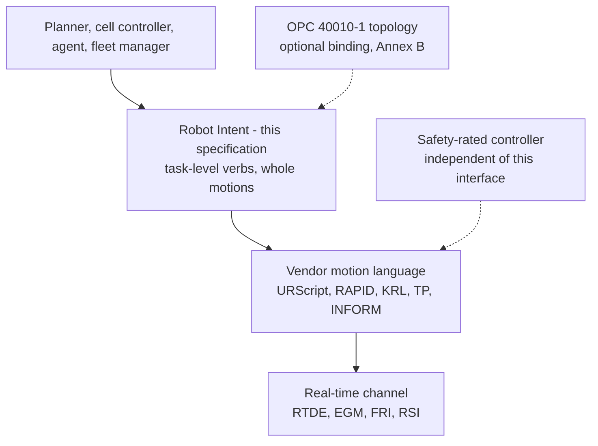
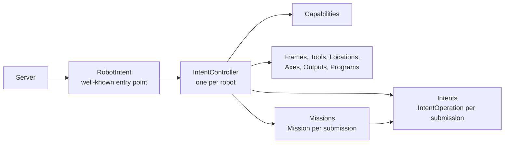
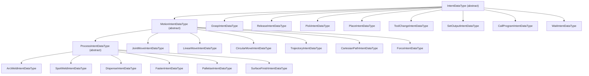
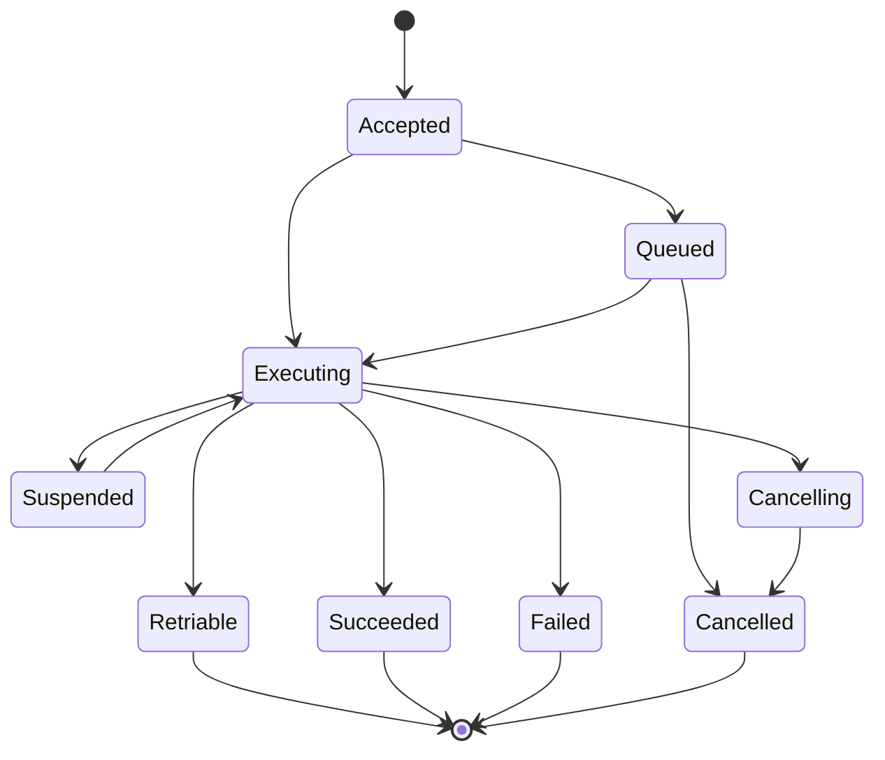

# OPC UA — Robot Intent

> Status: Working-group draft (Release 0.1.0). This document, together with `Opc.Ua.RobotIntent.NodeSet2.xml` and `Opc.Ua.RobotIntent.NodeIds.csv`, defines an OPC UA information model for **commanding a robot at the level of task intent** — move there, grasp that, pick from here, place at that — with a lifecycle that survives the minutes such work actually takes.
>
> Nothing here is normative, official, or endorsed by the OPC Foundation, VDMA or any robot manufacturer; namespace URIs and NodeIds are **provisional** and for prototyping only. The prior art, the gaps this model fills, and the decisions those gaps forced are recorded in the companion research report, [`OPC-UA-Robot-Intent-Research.md`](OPC-UA-Robot-Intent-Research.md).

---

## 1 Scope

This specification defines an OPC UA information model that lets a Server describe:

- **what a robot can be asked to do** — as a declared, machine-readable set of intents rather than a convention a client must know in advance;
- **how to ask it** — one submission per intent, or an ordered mission of them;
- **what happens next** — a lifecycle a client can observe from admission through queueing, execution and cancellation to a terminal result;
- **what the request refers to** — the frames, tools, locations, axes, signals and programs that give a pose or a place its meaning;
- **when the robot will refuse** — the operational modes, the command authority, and the boundary between this interface and the safety system that is never crossed.

### 1.1 Motivation

OPC 40010-1 describes robot **topology** in detail — the motion device system, its axes, its power trains, its controller, its safety states. It defines **no motion verbs at all**. Its entire actuation surface is `Start`, `Stop` and the loading of a named program over two state machines. A conformant client can discover everything about a robot's construction and cannot ask it to move anywhere.

The consequence is that every robot integration above the level of "run program 7" is bespoke. Two Servers can be fully conformant to OPC 40010-1 and still share no way to express *move the tool to this pose*. The verbs exist — every vendor has joint, linear and circular moves, a speed, an acceleration, a blend, a tool frame and a work frame — but they exist only in vendor languages that do not interoperate.

This specification supplies the verbs, and nothing else, so that the two compose rather than compete.

There is a second gap, and it is the harder one. A motion takes seconds; a pick takes a minute. An OPC UA `Call` cannot stay open that long — Session timeouts, SecureChannel re-keying and transport timeouts all bound it, and OPC 10000-4 is explicit that if the Session ends the result is discarded *"independent of the task actually performed at the Server"*. A synchronous method that commands a robot is therefore not merely inelegant; it loses the outcome of work that has already physically happened. Clause 6 addresses this, and it is the reason the model is shaped the way it is.

### 1.2 Motivating use cases

- **Task-level cell control.** A cell controller sequences a robot, a fixture and a conveyor without embedding vendor motion code, because the robot's capability is declared and its verbs are portable.
- **Planner and agent integration.** A planner — symbolic, learned, or a language model — emits intents against a declared vocabulary, and receives structured failures it can re-plan against rather than a vendor error string.
- **Mixed-fleet work cells.** Two robots from different manufacturers execute the same mission definition, because the mission is expressed in intents and each Server translates into its own controller's language.
- **Long-running supervised operation.** A supervisory system submits a mission, watches it progress, revises the part that has not yet been committed, and cancels it cleanly when the upstream process changes.
- **Auditable commanding.** Every intent records which Session commanded it, when, with what arguments and to what outcome. Part 10 carries that in `ProgramDiagnostic`, which it leaves Optional; §6.1 promotes it to Mandatory here, because a capability a specification advertises cannot rest on a member a conformant Server may omit.

### 1.3 What this specification does not do

Two of these are permanent boundaries. Neither is a deferral.

- It is **not** a real-time control channel. Trajectory *execution* is in scope — a client hands over a whole time-parameterised path and the robot's own motion kernel runs it (§6.8) — and where a high-rate channel is genuinely needed, this specification **brokers** it (§6.9). What it does not do is carry the samples: it defines no transport, closes no control loop, and runs at OPC UA rates. §4.3 draws that line as a normative limit rather than a caution.
- It is **not** a safety function, and it is **not** safety-rated. This is not a scoping preference; it is what the technology permits. OPC 10000-15 carries cyclic safety data from a provider to a consumer, and a client calling a Method has no way to supply safety-rated arguments — so no Method in this or any other companion specification can be a safety function. What **is** in scope is *awareness*: the model reports what the safety system is enforcing, and a Server **shall** refuse work that would exceed it. Clause 10 states both halves precisely.

Neither statement is about the importance of the omitted capability. The first is a division of labour with the layer beneath; the second is the boundary of what an OPC UA Method can be.

### 1.4 Capabilities and versioning

Release 0.1.0 covers the intent vocabulary — joint, linear and circular moves, trajectories, Cartesian paths, force-controlled moves, grasping, picking and placing, tool change, output, program call, waiting, and six application processes — together with the execution lifecycle, queueing and blending, cancellation, missions with a committed base, a revisable horizon and a step graph, command authority, safety awareness, the robot's kinematic description, real-time channel brokerage, and capability declaration.

The NodeSet declares exactly one `RequiredModel` — the base OPC UA namespace — so a Server can adopt it without pulling in any companion model. A Server implements the facets it can honour and declares the rest false; only **RI-Base** is mandatory (§12.2).

---

## 2 Normative references

- **OPC 10000-3, -4, -5** — Address Space Model, Services, Information Model. The base UA namespace is the only required model. OPC 10000-4 §5.12.2 bounds what a Method call can do, and OPC 10000-4 §5.7.5 defines the `Cancel` Service that §6.5 distinguishes this specification's cancellation from.
- **OPC 10000-10** — Programs. `ProgramStateMachineType` is the base type of `IntentOperationType` and `MissionType`, and supplies the transition events, the terminal result object and the invocation diagnostics this specification relies on rather than re-inventing.
- **OPC 10000-6** — Mappings. Structure subtyping and `ExtensionObject` encoding of the intent hierarchy (§5.3).
- **ISO 8373** — *Robots and robotic devices — Vocabulary*. Source of the terms in clause 3; where this document uses *pose*, *path*, *trajectory*, *tool centre point*, *end effector* or *workspace*, it uses them as ISO 8373 defines them.
- **ISO 9787:2013** — *Robots and robotic devices — Coordinate systems and motion nomenclatures*. Source of the frame roles in `FrameRoleEnum`, and of the roll-pitch-yaw convention used by the conversion in Annex C.
- **ISO 10218-1** and **ISO 10218-2** — *Robotics — Safety requirements*. Source of the operational modes in `OperationalModeEnum` and of the single-point-of-control requirement discussed in clause 10.
- **IEC 60204-1** — *Safety of machinery — Electrical equipment of machines*. Source of the stop categories that clause 10 states this interface does **not** select.
- **IEC 61800-5-2** — *Adjustable speed electrical power drive systems — Safety requirements: Functional*. Source of the safe motion functions named by `SafeMotionFunctionEnum` (§5.7.2).
- **IEC 61131-3** — *Programmable controllers — Programming languages*. Source of the step-and-transition divergence model the mission graph follows (§7.4).

Informative alignments — PLCopen Motion Control, VDA 5050, ROS 2 actions, MoveIt, the vendor motion languages, the Capability–Skill–Service model, OPC UA FX, and the OPC UA joining and tightening specifications — are listed in Annex D. They are **not** normative references and impose no dependency, notwithstanding that `BufferModeEnum` and `BlockingModeEnum` adopt their vocabularies deliberately and unchanged.

Two are worth naming here because a Server may resolve references into them, and neither is a `RequiredModel`:

- **OPC 40450** and **OPC 40451** — *OPC UA for Industrial Joining Technologies*, base and tightening systems. `FastenIntentDataType.Joint` references a joint in that model where one is implemented (§5.4.2). Where it is not, the intent's own parameters stand alone.
- **OPC 10000-80 to -84** — *OPC UA FX*. The open transport a real-time channel may name (§6.9). This specification defines none of its content.

---

## 3 Terms, definitions and abbreviations

| Term | Definition |
|---|---|
| **Intent** | A single task-level request — one motion, one grasp, one pick. Modelled as a subtype of `IntentDataType`. It is what a client submits and what a mission step holds. |
| **Intent operation** | One submitted intent, tracked to completion. Modelled as `IntentOperationType`, a Part 10 program instance created per submission. |
| **Mission** | An ordered sequence of intents submitted and tracked as a unit. Modelled as `MissionType`. |
| **Base** (of a mission) | The prefix of released steps. Committed, possibly already executing, and immutable (§7.2). |
| **Horizon** (of a mission) | The suffix of unreleased steps. Provisional, and revisable by `UpdateMission` (§7.2). |
| **Pose** | A rigid-body placement — three of position and three of orientation — expressed relative to a named frame. Carried by `Pose3DDataType`, whose orientation is a unit quaternion ordered (x, y, z, w) per §5.2. |
| **Frame** | A named right-handed Cartesian coordinate system a pose is expressed relative to. Frames form a tree through `HasFrameParent`. Modelled as `CoordinateFrameType`. |
| **Tool centre point (TCP)** | The origin of a tool frame; the point a motion intent drives to its target. OPC 40010-1 defines no such concept, so `ToolType.TcpFrame` supplies one. |
| **Blending** | Rounding the corner between two motions rather than stopping on the first one's target. Requested by `BlendDataType`, and by the blending values of `BufferModeEnum`. |
| **Buffer mode** | How a newly submitted intent relates to the one already executing — abort it, queue behind it, or blend into it. `BufferModeEnum`. |
| **Blocking mode** | Whether an intent tolerates motion and other intents alongside it. `BlockingModeEnum`. |
| **Command authority** | The exclusive right, held by at most one Session, to submit intents to one controller (clause 8). It is an arbitration mechanism between clients and **not** the single point of control that ISO 10218-2 requires. |
| **Terminal state** | An `ExecutionStateEnum` value from which execution does not resume: `Succeeded`, `Failed`, `Cancelled`, or `Retriable`. |

---

## 4 Overview and concepts

### 4.1 The layered contract

This specification occupies one band and touches neither the band above nor the two below.



A Server implementing this specification **shall** translate intents into whatever its controller actually executes. It **shall not** require a client to know which controller that is: the point of the model is that the same intent, submitted to two Servers driving robots from two manufacturers, produces the same physical outcome within the tolerance each robot is capable of.

The safety layer is beside and beneath this interface and is never mediated by it. That relationship is normative and is stated in clause 10.

### 4.2 Intent, not trajectory

An intent says **what** is to be achieved and constrains **how far** the Server may go in achieving it. It does not say how. The Server owns path planning, inverse kinematics, singularity avoidance, collision checking and the choice of configuration.

This is what makes the model portable. Every vendor already solves those problems, differently and well; a specification that dictated the solution would be implementable by nobody. `MotionConstraintsDataType` is therefore a set of **bounds**, not a plan, and a Server **shall** clamp a request to what the robot is configured to permit rather than refuse it — except where clause 10 requires refusal.

The same reasoning applies to blending. `BlendDataType.Radius` is a request in metres because that is the only unit two vendors share; controllers that expose a unitless blend scale map it as best they can, and a Server that cannot honour the exact radius **shall** still succeed. A client that needs the exact path uses `Exact` termination, which every vendor implements identically.

### 4.3 What this interface carries, and what it brokers

OPC UA method invocation is not deterministic and, in the deployments this model is written for, completes in tens of milliseconds. Vendor real-time channels run two to four orders of magnitude faster on dedicated transports. That difference is not something a specification can argue away, so this model divides the work rather than pretending the gap is not there.

**Carried here — one submission, executed by the robot.** A trajectory, a Cartesian path or a force-controlled move is handed over *whole* and run by the robot's own motion kernel (§6.8). The round trip happens once, at submission, so the transport's latency bounds how quickly work can be *started* and never how accurately it is *executed*. This is the same shape as `FollowJointTrajectory` in ROS and the buffered path function blocks of PLCopen, and it is why trajectory execution belongs here while trajectory streaming does not.

**Brokered — described, leased, and left alone.** Where a client genuinely needs a high-rate channel — visual servoing, force tracking, conveyor following — the Server describes one and leases it (§6.9). The samples travel on that channel and never through this interface.

A Server **shall not** present this interface as a real-time control channel, and a client **shall not** use it as one. In particular:

- servo-level or joint-cyclic control **shall not** be attempted through repeated submission;
- a closed force or impedance loop requiring a bounded control period **shall** use a brokered channel, not `ForceIntentDataType`, which commands a *move until contact* and not a continuous loop;
- conveyor tracking, seam tracking and any other motion slaved to an external signal at rate **shall** use a brokered channel or the robot's own facility.

`IntentOperationType.CurrentPose` exists so a client can *watch* a motion. It is a status report delivered at whatever rate the client's Subscription asks for, and using it to close a control loop is outside this specification.

### 4.4 Architecture



A client browses `Server/RobotIntent/Controllers` to find every robot it may command, reads that controller's `Capabilities` to learn what it accepts, resolves the frames and locations its intents will refer to, and then submits.

---

## 5 Information model

### 5.1 Type hierarchy

| Type | NodeId | Subtype of |
|---|---|---|
| `RobotIntentRootType` | `ns=1;i=1001` | `BaseObjectType` |
| `IntentControllerType` | `ns=1;i=1002` | `BaseObjectType` |
| `IntentOperationType` | `ns=1;i=1003` | `ProgramStateMachineType` (`i=2391`) |
| `MissionType` | `ns=1;i=1004` | `ProgramStateMachineType` (`i=2391`) |
| `IntentCapabilitiesType` | `ns=1;i=1005` | `BaseObjectType` |
| `CoordinateFrameType` | `ns=1;i=1006` | `BaseObjectType` |
| `ToolType` | `ns=1;i=1007` | `BaseObjectType` |
| `LocationType` | `ns=1;i=1008` | `BaseObjectType` |
| `AxisType` | `ns=1;i=1009` | `BaseObjectType` |
| `OutputSignalType` | `ns=1;i=1010` | `BaseObjectType` |
| `ProgramType` | `ns=1;i=1011` | `BaseObjectType` |
| `SafetyStateType` | `ns=1;i=1012` | `BaseObjectType` |
| `RealTimeChannelType` | `ns=1;i=1013` | `BaseObjectType` |
| `RobotDescriptionType` | `ns=1;i=1014` | `BaseObjectType` |

Annex A is the authoritative node reference and carries every member with its DataType, ValueRank and ModellingRule.

### 5.2 Poses, frames and units (normative)

`Pose3DDataType` (`ns=1;i=3050`) carries `FrameId`, a `Position` of three `Double` in **metres**, and an `Orientation` of four `Double` forming a **unit quaternion ordered (x, y, z, w)**.

Four rules make this unambiguous, and a Server **shall** satisfy all of them.

1. Every frame in this model is **right-handed**.
2. Position is in **metres**; joint targets are in **radians** for a `Revolute` axis and **metres** for a `Prismatic` one; force is in **newtons**; time is in **milliseconds** where carried as `Duration`. These units are fixed by this specification and are **not** negotiable per-instance. `Pose3DDataType` appears as a Method argument, where no `EUInformation` property can reach it, so a per-instance unit would be undeliverable.
3. `Orientation` **shall** be normalised. A Server receiving a quaternion whose norm differs from 1 by more than 1e-6 **shall** reject the intent with `ParameterInvalid`.
4. `FrameId` names a `CoordinateFrameType` instance under the controller's `Frames` folder. An empty `FrameId` means the Server's default work frame.

Quaternions are used because OPC UA defines no quaternion DataType anywhere, and because the `A`, `B`, `C` fields of the core `ThreeDOrientation` carry no convention of their own — the only normative assignment of meaning to them is external to the base specification. A quaternion has no such ambiguity, no gimbal degeneracy, and is what robot controllers and scene descriptions already hold internally. Annex C gives the normative bidirectional conversion to `ThreeDFrame`, so a Server that also speaks OPC 40010-1 or a spatial-location model can move between the two without inventing a convention.

### 5.3 The intent hierarchy

Intents are a **DataType hierarchy**, not one Method per verb.



Three consequences follow, and each is the reason for the choice:

- **A single intent and a mission step are the same shape.** `MissionStepDataType.Intent` is an `IntentDataType`, so nothing has to be expressed twice.
- **Extension is subtyping.** A vendor or a later part adds an intent by deriving from `IntentDataType`. It is then carried, queued, cancelled and reported by the existing machinery without a new Method.
- **Discovery is a read, not a probe.** `IntentCapabilitiesType.SupportedIntents` names each accepted DataType. A client learns what a robot accepts by reading one Variable, rather than by browsing for BrowseNames and inferring support from their presence.

`IntentDataType` carries what every intent needs: `IntentId`, `Label`, `BufferMode` and `BlockingMode`. `MotionIntentDataType` adds `ToolFrame`, `Constraints` and `Blend` — the members that are meaningless for `SetOutput` and essential for a move.

Fields whose DataType is one of the two abstract structures are emitted with `AllowSubTypes="true"`, so a client decoding a mission does not have to infer polymorphism from the abstractness of a DataType.

### 5.4 Motion intents

`JointMoveIntentDataType` (`ns=1;i=3055`) interpolates in joint space. The tool centre point's path is not controlled and **shall not** be relied on. It carries either explicit `JointTargets` or a `TargetPose`, and `HasJointTargets` decides which — a Boolean discriminator rather than a sentinel, so that neither field has to encode "unset".

Giving a pose rather than joint values is the *"move there, you choose how"* case: the Server solves the kinematics and selects a configuration. A Server **shall** reject a `JointMoveIntentDataType` whose `HasJointTargets` is true and whose `JointTargets` length differs from `IntentCapabilitiesType.AxisCount`, with `ParameterInvalid`.

`LinearMoveIntentDataType` (`ns=1;i=3056`) drives the tool centre point along a straight line. `CircularMoveIntentDataType` (`ns=1;i=3057`) drives it along the arc through `ViaPoint` to `Target`; only the **position** of `ViaPoint` defines the arc, and a Server **shall** ignore its orientation.

The three correspond to the instructions every vendor already has, which is why they are three and not one:

| This specification | UR | ABB | KUKA | FANUC | Yaskawa |
|---|---|---|---|---|---|
| `JointMoveIntentDataType` | `movej` | `MoveJ` / `MoveAbsJ` | `PTP` | `J` | `MOVJ` |
| `LinearMoveIntentDataType` | `movel` | `MoveL` | `LIN` | `L` | `MOVL` |
| `CircularMoveIntentDataType` | `movec` | `MoveC` | `CIRC` | `C` | `MOVC` |

### 5.4.1 Paths, trajectories and contact

Three further motion intents cover the work that a single target pose cannot express.

`CartesianPathIntentDataType` (`ns=1;i=3074`) carries a list of `PathWaypointDataType` (`ns=1;i=3073`), each a pose with the blend that applies at it. It carries **no timing**: the Server paces it from `Constraints`. This is the portable form of a taught path, and per-waypoint blending is exactly what distinguishes it from a sequence of separate linear moves — the robot need not stop between waypoints.

`TrajectoryIntentDataType` (`ns=1;i=3072`) carries `TrajectoryPointDataType` (`ns=1;i=3070`) points, each with `TimeFromStart` and per-axis positions, optionally velocities and accelerations. Timing is what makes it a trajectory rather than a path. It also carries a `PathTolerance` and a `GoalTolerance`, both `MotionToleranceDataType` (`ns=1;i=3071`), and a `GoalTimeTolerance`, which is a `Duration` — lateness is one number, not a pose deviation. Between them, "did it work?" has an answer the client set rather than one the Server chose.

A Server **shall** reject a trajectory whose points are not in ascending `TimeFromStart` order, or whose `Positions` length differs from `AxisCount`, with `ParameterInvalid`. Where `MaxTrajectoryPoints` is non-zero, it **shall** reject a longer trajectory with `ParameterInvalid`.

The whole trajectory is submitted in one call and executed by the robot's own motion kernel. That is the point: the transport is on the critical path once, at submission, and never during execution (§4.3).

`ForceIntentDataType` (`ns=1;i=3075`) travels along `Direction` until `ContactForce` is reached or `MaxDistance` is exhausted. Exhausting the distance without contact **shall** be reported as `Failed` with `ObjectNotFound` — the intent was to touch something, and not touching it is not success. `HoldForce` keeps the robot pressing after contact instead of stopping.

A Server **shall** report `ForceControlSupported` false unless the robot genuinely regulates force. Accepting a force intent and ignoring the force would tell a client its part was pressed when it was only approached.

### 5.4.2 Process intents

`ProcessIntentDataType` (`ns=1;i=3076`) is the abstract base of the intents that run an application process along a path. Beyond each process's own parameters it carries two things every process needs: `ProcessProgram`, referencing the procedure the equipment already holds, and `Attributes` for what this specification has not standardised.

| Intent | NodeId | Covers |
|---|---|---|
| `ArcWeldIntentDataType` | `ns=1;i=3077` | voltage, wire feed and travel speed, gas pre- and post-flow, arc start delay, crater fill, weave, seam tracking |
| `SpotWeldIntentDataType` | `ns=1;i=3078` | weld schedule, gun force, approach and retract distance, stack thickness, tip dress |
| `DispenseIntentDataType` | `ns=1;i=3079` | flow rate, trigger-on and trigger-off distance, bead width, material temperature, purge |
| `FastenIntentDataType` | `ns=1;i=3080` | joint reference, program number, torque, angle, snug torque |
| `PalletiseIntentDataType` | `ns=1;i=3081` | pattern, layer, row, column, item orientation |
| `SurfaceFinishIntentDataType` | `ns=1;i=3082` | contact force, feed rate, tool speed, step-over |

Each parameter set is the subset the vendor languages agree on — ABB `seamdata`/`welddata`/`weavedata`, FANUC weld schedules and KUKA ArcTech for arc welding, and their equivalents elsewhere. Where an installation works to a welding procedure specification, `WeldProcedureRef` names it and this specification does not restate its content.

Two of these deserve their reasoning stated.

**Fastening is deliberately thin.** OPC 40450 and OPC 40451 already define industrial joining and tightening in full, including step-wise results and traces. `FastenIntentDataType.Joint` therefore references the joint in that model and the result belongs there. Restating torque strategies here would create a second definition of a fact that specification already owns — the same reason `PickIntentDataType.Source` references a `Location` node instead of naming a station in a string.

**Palletising references a pattern, not a computed pose.** `Pattern` is a `LocationType`, so the geometry has one definition a client can read and subscribe to, rather than being recomputed from indices independently on both sides and disagreeing.

`WeaveShapeEnum` (`ns=1;i=3018`) gives the oscillation across an arc weld seam: `None`, `Sine`, `Zigzag`, `Trapezoid`.

### 5.5 Manipulation intents

`GraspIntentDataType` and `ReleaseIntentDataType` actuate an end effector. `Force` and `Width` are requests: an end effector that cannot regulate force **shall** ignore `Force` and still succeed, because refusing would make the intent unusable on the majority of grippers that are open or closed and nothing else.

`PickIntentDataType` and `PlaceIntentDataType` reference a `LocationType` **node** through `Source` and `Destination`. They do not name a station in a string. A location therefore has exactly one definition — its pose, its occupancy, what it holds and how much of it — which a client can read, subscribe to and reason about. A free-text station identifier would be a second definition of the same fact, able to disagree with the first.

`ToolChangeIntentDataType` references the `ToolType` to fit; a null `Tool` releases the fitted tool and fits nothing.

### 5.6 Auxiliary intents

`SetOutputIntentDataType` writes an `OutputSignalType` node, so the signal's range, unit and meaning are described once in the address space instead of being implied by a line name. `Value` is `BaseDataType` and **shall** match the signal's own DataType.

`CallProgramIntentDataType` runs a `ProgramType` held on the controller. It is the escape hatch for capability this model does not describe, and the bridge to the programs an OPC 40010-1 task control already exposes (Annex B).

`WaitIntentDataType` waits for a duration, for a signal, or for both. A mission needs it to express a rendezvous with something the robot does not control; without it a client has to hold the queue open from outside, which defeats the point of submitting a mission at all.

`Signal` is bounded so that §11.3 has something to check: it **shall** resolve either to an `OutputSignalType` instance under the controller being commanded, or to a Variable of DataType `Boolean` under it, and a Server **shall** refuse anything else with `ParameterInvalid`. A NodeId-valued member that no rule constrains cannot be validated, and an unvalidated NodeId is the surface §11.3 exists to close.

### 5.7 Reference objects

`CoordinateFrameType` instances form a tree through `HasFrameParent`, so a pose given in one frame can be re-expressed in another by composing the transforms along the path between them. `Role` follows ISO 9787, which standardises *which* frames exist; the transform between them is carried explicitly because no standard says how to calibrate it.

`ToolType.TcpFrame` **shall** reference a `CoordinateFrameType` whose `Role` is `Tool`. At most one `ToolType` instance under a controller **shall** have `Fitted` true at any time.

`AxisType.Index` fixes the position of that axis in `JointMoveIntentDataType.JointTargets`, and `Kind` fixes the unit of that entry. The indices of the axes under one controller **shall** be the contiguous range `0` to `AxisCount − 1`.

### 5.7.0 What the controller itself reports

Four members of `IntentControllerType` say what the robot is doing right now, and each is read-only and normative.

- `OperationalMode` is the robot's own report of the mode in force. §10.2 gates submission on it and forbids commanding it.
- `Ready` is true exactly when the Server would admit a well-formed intent from the Session that holds command authority. A Server **shall** report it false whenever §6.2 or §10.4 would refuse for a reason that does not depend on the intent — outside `Automatic` or `AutomaticExternal`, under an emergency or protective stop, or with `SafetyControllerOk` false. It exists so a client can see that submitting is pointless without submitting to find out; it is a **hint about the Server**, and a Server **shall not** treat a client's having read it as licence to skip any check of §6.2.
- `ActiveIntent` references the `IntentOperationType` instance whose `ExecutionState` is `Executing` or `Cancelling`, and is null when none is. Where the executing intent belongs to a mission, `ActiveMission` references that mission's `MissionType` instance; otherwise `ActiveMission` is null.
- `ControlOwner` reports the Session holding command authority, or null. Clause 8 governs it.

None of these is a substitute for the per-operation state of §6.3. Two members may not report the state of one intent: the operation's own state machine decides, and these summarise it.

### 5.7.1 `RobotDescriptionType`

`RobotDescriptionType` (`ns=1;i=1014`) carries enough of the robot's construction for a client to plan against it without a second specification: a `KinematicChain` of `KinematicJointDataType` (`ns=1;i=3084`) from the base outwards, a `MountingPose`, a `ReachRadius`, a `PayloadLimit`, and ceilings on tool centre point speed and acceleration.

Each `KinematicJointDataType` names the `AxisType` it corresponds to, its `Kind`, the `OriginTransform` of its frame within its predecessor's at zero position, and the unit `AxisVector` it rotates about or translates along.

This is **additive, not duplicative**. OPC 40010-1 describes a robot's topology and its axes in detail and defines no kinematic chain an inverse-kinematics solver could use, and no tool centre point at all. Where OPC 40010-1 is also implemented, its axis description is the fuller one and Annex B fixes which side decides.

### 5.7.2 `SafetyStateType`

`SafetyStateType` (`ns=1;i=1012`) reports what the robot's safety system is doing: `ActiveFunction`, `EmergencyStopActive`, `ProtectiveStopActive`, `SafeSpeedLimitActive`, `SafeSpeedLimit`, `SafetyControllerOk` and a human-readable `LastStopReason`.

`SafeMotionFunctionEnum` (`ns=1;i=3013`) names the function being enforced, using the vocabulary of IEC 61800-5-2: `None`, `Sto`, `Ss1`, `Ss2`, `Sos`, `Sls`, `Slp`, `Sdi`, `Sbc`.

Every member is **read-only and a report**. The safety system enforces these independently of this interface and remains effective when the Server is unreachable. Clause 10 states what a Server must do with them and what a client may not conclude from them.

### 5.7.3 `RealTimeChannelType`

`RealTimeChannelType` (`ns=1;i=1013`) describes a high-rate channel the Server can offer, so a client can find and open one: `Transport`, `EndpointUrl`, `Initiator`, `NominalRate`, `PayloadDescriptor`, `RequiredMode`, `Available`, and the current `LeaseHolder` and `LeaseExpiry`.

`RealTimeTransportEnum` (`ns=1;i=3014`) names the transport: `Rtde`, `Egm`, `Fri`, `Rsi`, `MotoRos2`, `OpcUaFx`, `Other`. Of these only `OpcUaFx` — OPC UA FX, OPC 10000-80 to -84 — is an OPC Foundation specification; the rest are vendor channels this model describes without defining.

`ChannelInitiatorEnum` (`ns=1;i=3015`) says which end opens the connection: `Server` or `Client`. It is stated rather than left to the reader because getting it wrong is the usual reason a first connection attempt fails.

§6.9 defines the lease.

### 5.8 Enumerations

The values below are normative. Where a value is cited as interoperable with another specification, renumbering it breaks that claim.

**`ExecutionStateEnum`** (`ns=1;i=3001`) — tabulated with its Part 10 pairing in §6.3: `Accepted` 0, `Queued` 1, `Executing` 2, `Suspended` 3, `Cancelling` 4, `Succeeded` 5, `Failed` 6, `Cancelled` 7, `Retriable` 8.

**`BufferModeEnum`** (`ns=1;i=3002`) — the values of PLCopen `MC_BufferMode`, adopted unchanged.

| Value | | Meaning |
|---|---|---|
| `Aborting` | 0 | Abort what is executing and start immediately. The default, and always accepted. |
| `Buffered` | 1 | Queue; start when the predecessor succeeds. |
| `BlendingLow` | 2 | Blend at the lower of the two boundary speeds. |
| `BlendingPrevious` | 3 | Blend at the predecessor's boundary speed. |
| `BlendingNext` | 4 | Blend at the successor's boundary speed. |
| `BlendingHigh` | 5 | Blend at the higher of the two boundary speeds. |

**`BlockingModeEnum`** (`ns=1;i=3003`) — the VDA 5050 `blockingType` matrix.

| Value | | Motion may continue | Other intents may run |
|---|---|---|---|
| `None` | 0 | yes | yes |
| `Soft` | 1 | no | yes |
| `Single` | 2 | yes | no |
| `Hard` | 3 | no | no |

**`TerminationModeEnum`** (`ns=1;i=3004`) — `Exact` 0 (come to rest on the target), `Blend` 1 (round the corner into the next motion).

**`ReleaseModeEnum`** (`ns=1;i=3005`) — `Drop` 0 (open where it is), `Place` 1 (set down under control at the target), `Handover` 2 (retain until a receiving party has taken it).

**`ApproachModeEnum`** (`ns=1;i=3006`) — `Default` 0 (the Server chooses), `ToolZ` 1 (along the tool's own Z axis), `Top` 2 (from above, in the target's frame), `Side` 3 (laterally, in the target's frame).

**`FrameRoleEnum`** (`ns=1;i=3007`) — the coordinate systems ISO 9787 standardises: `World` 0, `Base` 1, `MechanicalInterface` 2 (the flange), `Tool` 3, `Object` 4 (a workpiece frame), `Other` 5.

**`OperationalModeEnum`** (`ns=1;i=3008`) — the ISO 10218-1 modes, numbered as OPC 40010-1 numbers them: `Other` 0, `ManualReducedSpeed` 1, `ManualHighSpeed` 2, `Automatic` 3, `AutomaticExternal` 4. Clause 10 permits submission only in the last two.

**`StopModeEnum`** (`ns=1;i=3010`) — the values of `PossibleStopModes` in OPC 40010-1: `OnPath` 1, `EndOfCycle` 2, `ProcessStop` 3, `QuickStop` 4, `EndOfInstruction` 5. §10.3 states what these do **not** mean.

**`AxisKindEnum`** (`ns=1;i=3011`) — `Revolute` 0 (its joint target is in radians), `Prismatic` 1 (in metres).

**`MissionUpdateResultEnum`** (`ns=1;i=3012`) — `Accepted` 0, `Outdated` 1 (the update identifier was not greater), `BaseConflict` 2 (it would have altered a released step), `UnknownMission` 3, `Rejected` 4 (refused for a reason the Server states in `Message`).

**`IntentFailureEnum`** (`ns=1;i=3009`) — the reason an intent did not succeed. The set is small and diagnosable on purpose: a client decides whether to retry, re-plan or escalate from this value alone.

| Value | | Meaning |
|---|---|---|
| `None` | 0 | No failure; reported on success. |
| `Unreachable` | 1 | The target lies outside the reachable workspace. |
| `Kinematics` | 2 | No kinematic solution, or a singularity on the path. |
| `Collision` | 3 | A collision was predicted or detected. |
| `JointLimit` | 4 | A joint limit would be or was exceeded. |
| `SpeedLimit` | 5 | The requested speed is not permitted in the active mode. |
| `ToolMissing` | 6 | The required tool is not fitted or not identified. |
| `ObjectNotFound` | 7 | The object to act on was not present. |
| `GraspFailed` | 8 | The object was not acquired, or was lost in transit. |
| `Timeout` | 9 | Did not complete within its permitted time. |
| `NotPermittedInMode` | 10 | Refused; the operational mode does not permit it (§10.2). |
| `ControlNotOwned` | 11 | Refused; the caller does not hold command authority (clause 8). |
| `CapabilityNotSupported` | 12 | Not implemented, or not in this combination (clause 9). |
| `ParameterInvalid` | 13 | A parameter was missing, malformed or out of range. |
| `QueueFull` | 14 | The queue is at `MaxQueueDepth`. |
| `Superseded` | 15 | An `Aborting` submission or a mission update replaced it. |
| `HardwareFault` | 16 | A fault in the robot, the end effector or the controller. |
| `SafetyStop` | 17 | A safety function acted. The safety system decided this, not this interface. |
| `Other` | 18 | A reason none of the above describes; see `Message`. |
| `SafetyLimitExceeded` | 19 | Refused; the request would exceed a limit the safety system is enforcing (§10.3). |

**`ErrorPolicyEnum`** (`ns=1;i=3016`) — what a mission does when a step does not succeed (§7.4): `Abort` 0 (the default), `Retry` 1, `Skip` 2, `Fallback` 3, `Compensate` 4.

**`DivergenceKindEnum`** (`ns=1;i=3017`) — how the transitions leaving one step relate, following the divergence of an IEC 61131-3 sequential function chart: `Alternative` 0 (exactly one is taken — an OR divergence), `Parallel` 1 (all are taken and the branches run concurrently — an AND divergence).

---

## 6 Intent lifecycle (normative)

### 6.1 Why an intent is a program instance

A `Call` cannot outlive the Session that made it, and OPC 10000-4 §5.12.2 states that when a Session ends the method result is discarded *"independent of the task actually performed at the Server"*. A robot commanded by a synchronous method therefore keeps moving after the answer has been thrown away — and OPC 10000-10 §4.1 gives the OPC Foundation's own resolution: a Method performs a calculation, a **Program** runs a batch process or a machine tool part program.

`SubmitIntent` accordingly returns as soon as the intent is **admitted**, not when the robot has finished. What it returns is a NodeId: an `IntentOperationType` instance created for that submission, which the client subscribes to for progress and reads for the result.

Building on `ProgramStateMachineType` rather than defining a fresh state machine buys four things this specification then does not have to invent: transition events, a terminal result object that survives the operation, invocation diagnostics recording which Session commanded what, and a lifetime model for the instance itself.

**Two of those are Optional in Part 10, and this specification promotes both.** `IntentOperationType` declares `FinalResultData` and `ProgramDiagnostic` **Mandatory**.

Inheriting them would not have been enough. §6.7 requires the result to be reachable under `FinalResultData`, and §1.2 advertises auditable commanding, which *is* `ProgramDiagnostic` and nothing else. Both would have rested on members a fully conformant Server could omit — so a Server could pass every conformance test while providing neither, and the two claims would be false against a legal implementation. Promoting them is what makes the claims testable rather than aspirational.

A promotion changes the ModellingRule and **nothing else**. Both members are therefore declared exactly as OPC 10000-10 declares them — `FinalResultData` an Object of `BaseObjectType` reached by `HasComponent`, and `ProgramDiagnostic` a Variable of `ProgramDiagnostic2Type` of DataType `ProgramDiagnostic2DataType`, also reached by `HasComponent`. Altering the reference type or the TypeDefinition would declare a *second* member beside the inherited one rather than promote it, and a client written against Part 10 would then find two.

### 6.2 Submission

On `SubmitIntent` a Server **shall**, in this order:

1. Refuse with `ControlNotOwned` if the calling Session does not hold command authority (clause 8).
2. Refuse with `NotPermittedInMode` if `OperationalMode` is not `Automatic` or `AutomaticExternal` (clause 10).
3. Refuse with `CapabilityNotSupported` if the intent's DataType is not among `SupportedIntents`, or if its `BufferMode` or `BlockingMode` is not among those the capability entry permits.
4. Refuse with `ParameterInvalid` if a parameter is missing, malformed or out of range.
5. Refuse with `QueueFull` if admitting it would exceed `MaxQueueDepth`.
6. Otherwise create an `IntentOperationType` instance, assign an `IntentId` if the request left it empty, and return both.

A refusal at any of these steps **shall not** create an operation instance and **shall not** move the robot.

**A refusal is an output, not a `StatusCode`.** §10.5 makes refusal an ordinary outcome, so a Server **shall** return `Good` from `SubmitIntent` and report the refusal in its output arguments: `Accepted` false, `Failure` set to the `IntentFailureEnum` value named above, `Message` carrying detail for a human, `IntentId` empty and `Operation` null. On admission it returns `Accepted` true, `Failure` `None`, and the assigned `IntentId` and `Operation`. `SubmitMission` and `Retry` report a refusal the same way.

This is what makes the ordered rules above observable. A Server that signalled a refusal with a Bad `StatusCode` would tell a client only that something went wrong, and the whole point of a small, diagnosable failure set (§5.8) is that a client decides whether to retry, re-plan or escalate from that value alone. A Server **shall not** substitute a Bad `StatusCode` for one of these refusals. `Bad_` codes remain what they always were — the transport, the Session and the Service layer failing — and a client **shall** distinguish the two.

An `IntentId` returned by the Server **shall** be unique among the intents that Server currently holds. A client-supplied `IntentId` that collides with an outstanding one **shall** be refused with `ParameterInvalid`.

### 6.3 States

The Part 10 state machine carries the coarse lifecycle. `ExecutionState` refines it, because `Queued`, `Cancelling` and the distinction between the three terminal outcomes cannot be told apart from `CurrentState` alone.

**The state machine is authoritative** for the coarse state and is what generates events. `ExecutionState` **shall** at all times be consistent with it according to the following table, which is exhaustive: a pairing not listed here is not legal.

| `ExecutionState` | Part 10 state | Meaning |
|---|---|---|
| `Accepted` | `Ready` | Admitted and validated; not yet queued or executing. |
| `Queued` | `Ready` | Waiting behind another intent. `QueuePosition` is non-zero. |
| `Executing` | `Running` | Commanding the robot now. |
| `Suspended` | `Suspended` | Paused; position retained. |
| `Cancelling` | `Running` | A cancel was accepted; motion is being brought to a controlled end. |
| `Succeeded` | `Halted` | Terminal. Completed as requested. |
| `Failed` | `Halted` | Terminal. `Result.Failure` carries the reason. |
| `Cancelled` | `Halted` | Terminal. Ended early because a cancel was accepted. |
| `Retriable` | `Halted` | Terminal for now; `Retry` may re-attempt it. |



The distinction between `Accepted` and `Queued` is the one PLCopen draws between an axis command that is busy and one that is actively commanding. A client that cannot see it cannot tell "the robot has not started your work yet" from "the robot is working on it".

### 6.4 Queueing and blending

`BufferMode` on the submitted intent decides how it relates to what is already executing.

`Aborting` is the default and **shall** be accepted by every Server. It terminates the executing intent as `Cancelled` — with `Result.Failure` set to `Superseded` — and begins the new one.

A supersede carries no client-chosen `StopMode`, because the submission that caused it names none. The Server chooses, and **should** choose the most urgent stop the cell tolerates, since the successor is about to command motion of its own and the two must not overlap. A Server **should** document which mode a superseded intent is stopped with, so the behaviour is predictable rather than discovered.

`Buffered` queues the intent; it begins when its predecessor reaches `Succeeded`.

The four blending modes queue the intent and additionally ask that the robot not decelerate to a stop at the boundary. Where blending occurs, the predecessor reaches `Succeeded` **when blending begins**, not when its target is exactly attained, and its `Result.AchievedPose` **shall** record where the tool centre point was at that moment. This is the behaviour PLCopen defines, and reporting it any other way would tell a client the robot stopped somewhere it never was.

A Server that accepts a blending mode but executes it as `Buffered` **shall** report `BlendingSupported` false. A client can then tell a robot that blends from one that merely tolerates being asked to.

`MaxQueueDepth` bounds the queue. A Server with `MaxQueueDepth` zero accepts only `Aborting` submissions.

`BlockingMode` is orthogonal to `BufferMode` and constrains concurrency rather than ordering: whether motion may continue during the intent, and whether other intents may run alongside it. A Server **shall not** begin an intent whose `BlockingMode` is `Single` or `Hard` while any other intent is executing.

### 6.5 Cancellation — and what the `Cancel` Service is not

> The OPC UA `Cancel` Service defined in OPC 10000-4 §5.7.5 cancels an **outstanding service request**. It does not stop the robot. Invoking it against a submission returns `Bad_RequestCancelledByClient` for that request and leaves the motion running.

Stopping a robot is `CancelIntent`, `CancelMission` or `CancelAll` — Methods on the information model, with real-world effect. This distinction is normative because a specification that leaves it implicit produces implementations that believe they have a stop button and do not.

A Server **may refuse** a cancel, and reports that in the `Accepted` output. Some motions cannot be abandoned part-way without leaving the cell in a worse state than completing them — a tool change mid-exchange, a placement mid-release. A capability entry whose `CancelSupported` is false declares this in advance for a whole intent type; `Accepted` false reports it for one occasion.

Where a cancel is accepted, the operation enters `Cancelling` and then `Cancelled`. `Cancelling` is not terminal: a client that treats the acceptance of a cancel as the end of motion will act too early.

`StopMode` says how urgently to stop. It carries the values of `PossibleStopModes` in OPC 40010-1 so that a Server implementing both reports one vocabulary. It selects **no** IEC 60204-1 stop category; clause 10 explains why it cannot.

A Server **shall** either honour the requested `StopMode` or treat every value as its single stop behaviour; it **shall not** vary silently between the two. Where it cannot differentiate, it **should** say so — the capability declaration is the natural place — because a client that asks for `OnPath` and silently receives a `QuickStop` has been told something untrue about how the cell came to rest. A Server that does differentiate **should** make the difference observable in `Result.AchievedPose`, which records where the tool centre point actually stopped.

### 6.6 Pause, resume and retry

`Pause` suspends execution retaining position, and `Resume` continues it. Both are optional, and a capability entry declares per intent type whether they are honoured.

`Retriable` is a terminal state a Server uses where it judges an intent worth another attempt — a grasp that closed on nothing, a location that was momentarily blocked. `Retry` creates a **new** `IntentOperationType` instance for the new attempt; the original remains, terminal, with its own result. A Server that does not offer `Retry` never enters `Retriable` and reports `Failed` instead.

`Retry` refuses like a submission does, and reports it the same way (§6.2): `Accepted` false with a `Failure` and a `Message`. A named intent that is not in `Retriable` is refused with `ParameterInvalid`, and one whose capability entry declares `RetrySupported` false with `CapabilityNotSupported`.

### 6.7 Results

When an operation reaches a terminal state its `Result` **shall** be complete and **shall not** change thereafter. The same `IntentResultDataType` value **shall** also be reachable under the `FinalResultData` object, which this specification promotes to **Mandatory** on `IntentOperationType` for exactly this reason — Part 10 leaves it Optional, and a **shall** that rests on a member a conformant Server may omit is not a requirement, so that a client written against Part 10 finds the result where Part 10 says it will be.

`Result.AchievedPose` records where the driven tool centre point came to rest, or was when blending began. It is what lets a client audit a placement and distinguish a blended corner from an exact stop.

`Result.Failure` is a small, diagnosable set precisely so that a client can decide from it alone whether to retry, re-plan or escalate. `Message` is for a human and **shall not** be parsed.

A Server **shall** retain a terminated operation for long enough that a client which was disconnected at the moment of completion can still read its result on reconnection. It **may** then delete it; `AutoDelete` and `RecycleCount`, inherited from Part 10, describe what it does.

### 6.8 Trajectory execution (normative)

A trajectory is submitted like any other intent and tracked by the same lifecycle. Two things are particular to it.

**It is handed over whole.** A Server **shall** accept the entire trajectory at submission and execute it without further exchange. It **shall not** require a client to feed points during execution, because a transport that cannot guarantee the next point arrives in time cannot be part of the control loop (§4.3).

**Tolerance decides success.** While executing, a Server **shall** report `Failed` with `Kinematics` if deviation exceeds `PathTolerance`. At the end it **shall** report `Failed` with `Kinematics` if the final deviation exceeds `GoalTolerance`, and `Failed` with `Timeout` if completion is later than the final point's `TimeFromStart` by more than `GoalTimeTolerance`. A tolerance of zero or less means the Server applies its own, and a Server that applies its own **should** publish it in `Result.Outputs` so the client can learn what was actually enforced.

`Progress` is meaningful for a trajectory in a way it is not for a single move: a Server **should** report the fraction of `TimeFromStart` elapsed.

### 6.9 Brokering a real-time channel (normative)

Where a client needs a rate this interface cannot carry, the Server describes a channel and leases it. The samples travel on that channel; this specification defines no transport and inspects no payload.

`OpenRealTimeChannel` takes a lease. A Server **shall** refuse it — returning `Granted` false, with `Message` saying which of these it was — when the channel is not `Available`, when another Session holds the lease, when `OperationalMode` is not the channel's `RequiredMode`, or when the caller does not hold command authority. On success it returns the `EndpointUrl`, the `PayloadDescriptor` and a `LeaseExpiry`.

A Server **shall** bound `RequestedLease` to what it is willing to grant and report the bounded value in `LeaseExpiry`; a `RequestedLease` of zero or less asks for the Server's own default.

A lease **shall** lapse at `LeaseExpiry` unless renewed by a further `OpenRealTimeChannel` from the holding Session, and **shall** be released when that Session closes. This is the same reasoning as command authority in clause 8: a client that dies must not hold a resource for good.

`CloseRealTimeChannel` releases the lease explicitly.

Two rules keep the division of labour honest:

- While a channel lease is held, a Server **shall** refuse motion intents with `CapabilityNotSupported` unless it can genuinely arbitrate between the two sources. Two things commanding one robot with no arbitration is the failure this rule exists to prevent.
- A Server **shall not** represent a brokered channel as being under this interface's control. Its behaviour, its guarantees and its failure modes are the transport's.

Of the transports named, only `OpcUaFx` — OPC UA FX, OPC 10000-80 to -84 — is an OPC Foundation specification. It is the open path, and a Server that offers it gives a client something it can implement from published documents rather than from a vendor SDK.

---

## 7 Missions (normative)

### 7.1 Purpose

A mission is an ordered sequence of intents submitted and tracked as a unit. It exists so that a supervisor can commit work in advance — the robot keeps moving through a sequence without a round trip per step — while retaining the ability to change what has not yet been committed.

`MissionDataType` (`ns=1;i=3068`) carries the mission: a client-assigned `MissionId`, a monotonically increasing `MissionUpdateId`, a `Label`, and the ordered `Steps`. `MissionType` (`ns=1;i=1004`) is the instance that tracks one, and like `IntentOperationType` it is a Part 10 program instance for the reasons §6.1 gives.

Missions are optional. `IntentCapabilitiesType.MissionsSupported` declares whether a Server implements them.

### 7.2 Base and horizon

Every step carries `Released`. The released steps form a prefix called the **base**; the rest form the **horizon**.


The base is **committed and immutable**. A Server **shall** assume every released step is executing or already executed, and **shall** refuse any update that would alter, remove or reorder one.

The horizon is provisional. `UpdateMission` replaces it wholly and **may** release some or all of its steps in doing so, extending the base.

`ReleasedStepCount` on the mission instance states how many steps are in the base, so a client does not have to scan the array to find the boundary.

A Server **shall** enforce all of the following, and **shall** apply an update atomically — an update either takes effect entirely or not at all:

1. `MissionUpdateId` **shall** be strictly greater than the mission's current value. An update that is not is refused with `Outdated`. This is what makes two updates that crossed in flight safe: the later one wins and the earlier one is rejected rather than applied out of order.
2. An update that would alter a released step is refused with `BaseConflict`.
3. `SequenceId` **shall** ascend across the steps of a mission, and `StepId` **shall** be unique within it.

### 7.3 Execution

A mission executes its steps in ascending `SequenceId`. Each step, when it begins, gets an `IntentOperationType` instance, and `MissionStepDataType.Operation` references it.

`MissionStepDataType.Status` is a **hint**. Where `Operation` is not null, that operation's state machine **decides**, and `Status` **shall** reflect it. Two members can report the state of one step; this sentence says which one is right.

A step that terminates `Failed` **shall** cause the mission to terminate `Failed` without beginning any later step, **unless** the step declares an error policy that says otherwise (§7.4).

`CancelMission` cancels the mission and every intent belonging to it, subject to the same right of refusal as `CancelIntent`.

### 7.4 The step graph (normative)

A mission may carry `Transitions`, an array of `MissionTransitionDataType` (`ns=1;i=3083`). Where it is **empty**, the mission is the ordered sequence §7.3 describes and nothing else applies — which is what makes the graph an addition rather than a replacement.

The model is the step-and-transition form of an IEC 61131-3 sequential function chart, chosen over a behaviour tree because it is the notation the audience implementing this already knows, it has an IEC serialization, and it needs no tick loop.

Each transition carries `FromStepId`, `ToStepId`, a `Condition` and a `DivergenceKind`.

`Condition` is an OPC UA `ContentFilter` — the base specification's own filter grammar, reused rather than invented. A specification that defined its own expression language would oblige every implementer to write a parser for it, and would then have to say what happens when two parsers disagree. An empty filter is always true.

`DivergenceKind` says how the transitions leaving one step relate:

- `Alternative` — exactly one is taken, the first whose `Condition` holds, in `Transitions` order. A Server **shall** evaluate them in that order so that two clients reading the same mission predict the same branch.
- `Parallel` — all are taken, and the branches execute concurrently. A Server **shall** report `MissionBranchingSupported` false if it cannot run branches concurrently, rather than silently serialising them.

A Server **shall** refuse a mission whose transitions name a `FromStepId` or `ToStepId` that is not a step of that mission, and one that mixes `Alternative` and `Parallel` on transitions leaving the same step.

**Error policies.** `MissionStepDataType.ErrorPolicy` says what happens when the step does not succeed:

| Policy | Behaviour |
|---|---|
| `Abort` | End the mission. The default, and what a mission without policies does. |
| `Retry` | Re-attempt the step. The Server bounds the attempts and reports `Failed` when they are exhausted. |
| `Skip` | Record the failure and continue with the next step. |
| `Fallback` | Continue at `FallbackStepId`. |
| `Compensate` | Run `FallbackStepId` to undo what has been done, then end the mission. |

A Server **shall** refuse a mission where `ErrorPolicy` is `Fallback` or `Compensate` and `FallbackStepId` does not name a step of that mission. `Compensate` differs from `Fallback` in what happens afterwards, and only in that: both run the fallback step, but `Compensate` then ends the mission rather than continuing.

Where a step's policy is honoured, the *mission* does not terminate `Failed` even though the *step* did — which is the whole reason the policies exist, and why §7.3's rule is stated as a default rather than an invariant.

---

## 8 Command authority (normative)

At most one Session at a time holds command authority over a controller, and only that Session **may** submit intents or missions. `ControlOwner` reports which.

`RequestControl` grants authority when no other Session holds it, or when the holder's Session has closed. A Server **shall** release authority automatically when the holding Session closes, so that a crashed client does not lock a robot permanently. `ReleaseControl` gives it up explicitly; outstanding intents are unaffected, and a client that wants them stopped calls `CancelAll` first.

Reading, browsing and subscribing require no authority. Observation is always permitted.

> Command authority arbitrates between OPC UA clients. It is **not** the single point of control required by ISO 10218-2, which concerns the mutual exclusion of remote command and local manual control and is enforced by safety-rated means outside this interface. A Server **shall not** present command authority as satisfying that requirement.

---

## 9 Capabilities and discovery (normative)

`IntentCapabilitiesType` is what makes an intent surface self-describing. A conformant Server **shall** populate it to reflect what it will actually accept — it is a contract, not documentation.

`SupportedIntents` carries one `IntentCapabilityDataType` per accepted intent type, naming the DataType and declaring whether cancel, pause and retry are honoured for it, which buffer and blocking modes it accepts, and which named `Attributes` this Server recognises.

Three rules keep the declaration honest, and each is checkable against a running Server:

1. A Server **shall** refuse an intent whose DataType is not listed, with `CapabilityNotSupported`.
2. Every entry's `SupportedBufferModes` **shall** include `Aborting`.
3. `BlendingSupported` **shall** be false unless the blending buffer modes actually blend.

A fourth rule applies the same honesty to the **Method surface**, because a declaration a client cannot act on is worse than no declaration. Where a Server declares a capability, the Methods that make it usable **shall** be present on the controller and callable:

| Declaration | Methods that **shall** be present |
|---|---|
| `MissionsSupported` true | `SubmitMission`, `CancelMission` |
| `MissionHorizonSupported` true | `UpdateMission` |
| `RealTimeChannelsSupported` true | `OpenRealTimeChannel`, `CloseRealTimeChannel` |
| a capability entry with `PauseSupported` true | `Pause`, `Resume` |
| a capability entry with `RetrySupported` true | `Retry` |

These Methods are Optional on `IntentControllerType`, which is what makes the rule necessary: a Server can otherwise advertise missions while omitting `SubmitMission` entirely, and a client discovers the contradiction only by calling something that is not there. Like the other three, this is observable against a running Server — browse the controller and compare what it offers with what it claims.

`AxisCount` states how many entries `JointMoveIntentDataType.JointTargets` must carry, and **shall** equal the number of `AxisType` instances under the controller.

Five further declarations cover the capability added beyond single moves. `TrajectorySupported` and `ForceControlSupported` say whether trajectories and force-controlled moves are accepted; `RealTimeChannelsSupported` whether channels are brokered; `MissionBranchingSupported` whether `Transitions` are evaluated at all; and `MaxTrajectoryPoints` bounds a trajectory, zero meaning the Server states no limit.

Each follows the same rule as `BlendingSupported`: a Server declares false rather than accepting work it will not actually perform. A Server that reports `MissionBranchingSupported` false executes the steps in order and ignores any transitions supplied, and a client reading that declaration knows not to express a branch it needs.

`SupportedFacets` is the same contract at the level of whole facets, and it is bound by every rule above. A facet is not a summary of the declaration a client has already read: some of what Table 12.2 requires — that blending modes are honoured, that the refusal rules of §6.2 are followed, that a mission base is immutable — cannot be established by reading the address space at all. Listing such a facet is therefore an attestation, and a Server that lists **RI-Blending** while treating the buffer modes as `Buffered` has made a false statement of exactly the kind rule 3 forbids, whatever `BlendingSupported` says. Clause 12.2 sets out which requirements are structural and which are attested.

---

## 10 Safety (normative)

### 10.1 This interface is not safety-rated

**This specification defines a non-safety-rated application interface.** The Methods defined here are processed by the robot controller as application-level requests. They do not constitute, and **shall not** be used as, safety functions as defined in IEC 61508, nor safety communication as defined in IEC 61784-3 or IEC 62541-15.

The safety functions of the robot system — emergency stop, protective stop, speed and separation monitoring, force limiting, and enabling device control — are implemented in safety-rated hardware and firmware independent of this interface, and **shall** remain effective regardless of its state, including when the Server is unreachable, the Session has closed, or a client is submitting intents as fast as the Server will accept them.

A Server **shall not** claim, and a client **shall not** assume, any safety integrity level or performance level for any part of this model.

This is a property of the technology, not a choice this working group made. OPC 10000-15 carries cyclic safety data from a SafetyProvider to a SafetyConsumer; the consumer's request carries an identifier, a monitoring number and one octet of explicitly **non-safety** flags, so a caller has no channel through which to supply safety-rated arguments. Every safety fieldbus — PROFIsafe, CIP Safety, FSoE, openSAFETY — expresses a safety command as a **continuously asserted cyclic signal**, because the integrity argument rests on the fail-safe state that follows when assertion stops. A Method call has no defined behaviour when it stops being called, and therefore cannot be a safety function however it is labelled.

A specification that ignored this would not be merely wrong; it would encourage an integrator to rely on something that fails silently. §10.4 says what can honestly be done instead.

### 10.2 Operational mode gates submission

A Server **shall** refuse `SubmitIntent` and `SubmitMission` with `NotPermittedInMode` unless `OperationalMode` is `Automatic` or `AutomaticExternal`.

`OperationalMode` is read-only. This specification defines **no** way to command a mode change, because mode selection is a safety function performed by safety-rated means — a key switch, an interlock — and an interface that could change it from the network would defeat the arrangement it is reporting.

Where a person may be within the safeguarded space, the applicable safety standard, not this interface, decides what motion is permitted. A Server **shall not** rely on a client to observe such limits.

### 10.3 A stop request is not a stop category

`StopMode` expresses urgency. It **shall not** be interpreted as selecting, implying or guaranteeing any IEC 60204-1 stop category. Category 0, 1 and 2 stops are determined solely by the robot controller's safety system in response to the active operational mode and the risk assessment for the installation.

A client that requires a category-rated stop **shall** obtain it from the safety system. It cannot be obtained here.

### 10.4 Safety awareness, and its limits

What this specification *can* do is see what the safety system is enforcing and refuse work that would contradict it. `SafetyStateType` (§5.7.2) reports it, and the following are normative.

A Server **shall** refuse `SubmitIntent` and `SubmitMission`:

- with `SafetyLimitExceeded`, when `SafeSpeedLimitActive` is true and the intent's `Constraints.CartesianSpeed` exceeds `SafeSpeedLimit`;
- with `NotPermittedInMode`, when `EmergencyStopActive` or `ProtectiveStopActive` is true;
- with `NotPermittedInMode`, when `SafetyControllerOk` is false.

A Server **shall** publish `ActiveFunction`, `EmergencyStopActive`, `ProtectiveStopActive`, `SafeSpeedLimitActive`, `SafeSpeedLimit` and `SafetyControllerOk` as the safety system reports them, and **shall not** publish a value the safety system has not asserted.

Each of these is observable against a running Server: assert a protective stop and a conformant Server refuses; lower `SafeSpeedLimit` below a submitted speed and it refuses.

**What none of this makes true.** These refusals are an application-layer courtesy performed by non-safety-rated software. They reduce the number of requests the safety system has to reject; they are not a protective measure and nothing may be assumed from their presence. In particular:

- a client **shall not** treat a Server's acceptance of an intent as evidence that the motion is safe;
- a client **shall not** treat `SafeSpeedLimit` as a limit *this interface* enforces — the safety system enforces it, and would enforce it identically if this model did not exist;
- a Server **shall not** offer any Method that commands a safe motion function, changes an operational mode, or clears a stop. Those are safety functions, and clause 10.1 says why no Method here can be one.

The asymmetry is deliberate: this model may **observe** the safety system and **refuse** on what it sees, and may never **instruct** it.

### 10.5 Refusal is a normal outcome

Every rule above produces a refusal rather than a degraded execution, and each is observable against a running Server: a conformant Server can be seen to refuse a submission outside Automatic mode, and to refuse one from a Session that does not hold authority. A client **shall** treat refusal as an expected outcome and not as an error condition to be retried blindly.

---

## 11 Security

### 11.1 Commanding is a privileged operation

Every Method in this model moves a machine that can injure people and destroy property. A Server **shall** require an authenticated Session and **should** restrict the Methods of `IntentControllerType` by Role, distinctly from read access to the same address space. Observing a robot and commanding one are different privileges and **shall not** be conflated.

A Server **should** apply `UserExecutable` to the Methods it exposes so that a client discovers what it is permitted to invoke before invoking it.

### 11.2 Command authority is not authorisation

Command authority (clause 8) prevents two authorised clients from interleaving motion. It grants nothing. A Server **shall** apply its access control independently: a Session that holds authority but lacks the necessary Role **shall** still be refused.

### 11.3 NodeIds in intents are untrusted input

`PickIntentDataType.Source`, `SetOutputIntentDataType.Output`, `CallProgramIntentDataType.Program` and the other NodeId-valued members carry references chosen by the client. A Server **shall** validate that each resolves to a node of the expected type **under the controller being commanded**, and **shall** refuse with `ParameterInvalid` otherwise. A NodeId that resolves to a node belonging to a different controller, or to no node at all, **shall not** be acted on.

The expected type is fixed for every such member, so that "the expected type" is a checkable statement rather than an instruction to guess:

| Member | Resolves to |
|---|---|
| `PickIntentDataType.Source`, `PlaceIntentDataType.Destination`, `PalletiseIntentDataType.Pattern` | a `LocationType` instance under the controller |
| `MotionIntentDataType.ToolFrame`, `ForceIntentDataType.FrameId` | a `CoordinateFrameType` instance under the controller; `ToolFrame` additionally of `Role` `Tool` |
| `ToolChangeIntentDataType.Tool` | a `ToolType` instance under the controller, or null to release the fitted tool |
| `SetOutputIntentDataType.Output` | an `OutputSignalType` instance under the controller; `Value` **shall** match that signal's own DataType |
| `CallProgramIntentDataType.Program`, `ProcessIntentDataType.ProcessProgram` | a `ProgramType` instance under the controller |
| `WaitIntentDataType.Signal` | an `OutputSignalType` instance under the controller, or a Variable of DataType `Boolean` under it |
| `FastenIntentDataType.Joint` | a joint in an OPC 40450 / OPC 40451 model where one is implemented; otherwise the intent's own parameters stand alone and the member is null |

`CallProgramIntentDataType` deserves particular care: it runs code the Server holds. A Server **shall** restrict it to programs it has published as `ProgramType` instances, and **shall not** accept a program identifier that names anything else.

### 11.4 Cybersecurity is in scope of the safety case

ISO 10218-1 addresses cybersecurity where a vulnerability could compromise robot safety. A networked command interface is exactly such a surface. The measures above are therefore not merely good practice; where this interface is deployed on a robot subject to that standard, they form part of the case that the installation is safe.

---

## 12 Profiles and conformance units

### 12.1 Declaring conformance

A Server declares conformance by exposing `RobotIntentRootType` under the Server object with `SpecificationVersion` set to the release it implements, by populating `IntentCapabilitiesType` truthfully, and by listing in `SupportedFacets` the facets of Table 12.2 that each controller satisfies.

`SupportedFacets` carries the facet names of Table 12.2 verbatim. It exists because conformance is otherwise not machine-readable: a client would have to re-derive the whole table from the address space, and since several rows are behavioural, two clients deriving independently could reach different conclusions about the same Server. This mirrors `ServerCapabilitiesType.ServerProfileArray` in OPC 10000-5, where a Server states its profiles rather than leaving them to be inferred.

A Server shall not list a facet whose structural requirements are unmet. The behavioural requirements are the Server's own attestation and are subject to the honesty rules of clause 9 — a Server that lists **RI-Blending** while treating the blending buffer modes as `Buffered` is making a false statement in exactly the sense clause 9 forbids, and is no more conformant than one that reports `BlendingSupported` true under the same conditions.

### 12.2 Facets

Requirements are of two kinds. **Structural** requirements are settled by reading the address space and the capability declaration: a client can check them, and so can a compliance tool, without commanding the robot. **Behavioural** requirements — written below as accepting, honouring, maintaining or observing a rule — cannot be settled by reading, only by exercising the Server, and are the Server's attestation under clause 9.

| Facet | Requires |
|---|---|
| **RI-Base** (mandatory) | `RobotIntentRootType`; at least one `IntentControllerType` with `Capabilities`, `Frames`, `Tools`, `Locations`, `Axes` and `Intents`; `SubmitIntent`, `CancelIntent`, `CancelAll`, `RequestControl`, `ReleaseControl`; `IntentOperationType` instances with the state model of §6.3; the refusal rules of §6.2 and clause 10. |
| **RI-Motion-Joint** | `JointMoveIntentDataType`, with `AxisType` instances covering `0` to `AxisCount − 1`. |
| **RI-Motion-Linear** | `LinearMoveIntentDataType`. |
| **RI-Motion-Circular** | `CircularMoveIntentDataType`. |
| **RI-Trajectory** | `TrajectoryIntentDataType`, `TrajectorySupported` true, and the tolerance rules of §6.8. |
| **RI-Path** | `CartesianPathIntentDataType` and `TrajectorySupported` true. |
| **RI-Force** | `ForceIntentDataType` and `ForceControlSupported` true — the robot genuinely regulates force. |
| **RI-RealTimeChannel** | `RealTimeChannelsSupported` true; the `RealTimeChannels` folder with at least one `RealTimeChannelType`; `OpenRealTimeChannel` and `CloseRealTimeChannel` with the lease rules of §6.9. |
| **RI-Safety** | `SafetyState` populated from the safety system, and the refusals of §10.4. |
| **RI-Description** | `Description` with a `KinematicChain` covering every axis, `ReachRadius`, `PayloadLimit` and `MaxCartesianSpeed`. |
| **RI-Process-ArcWeld** | `ArcWeldIntentDataType`. |
| **RI-Process-SpotWeld** | `SpotWeldIntentDataType`. |
| **RI-Process-Dispense** | `DispenseIntentDataType`. |
| **RI-Process-Fasten** | `FastenIntentDataType`. Where an OPC UA joining or tightening model is implemented, `Joint` resolves into it. |
| **RI-Process-Palletise** | `PalletiseIntentDataType` and at least one `LocationType` describing a pattern. |
| **RI-Process-SurfaceFinish** | `SurfaceFinishIntentDataType` and **RI-Force**. |
| **RI-Grasp** | `GraspIntentDataType` and `ReleaseIntentDataType`, and at least one `ToolType` with a `TcpFrame`. |
| **RI-PickPlace** | `PickIntentDataType`, `PlaceIntentDataType`, and at least one `LocationType`. |
| **RI-ToolChange** | `ToolChangeIntentDataType`, and more than one `ToolType`. |
| **RI-Output** | `SetOutputIntentDataType` and the `Outputs` folder. |
| **RI-Program** | `CallProgramIntentDataType` and the `Programs` folder. |
| **RI-Wait** | `WaitIntentDataType`. |
| **RI-Queue** | `MaxQueueDepth` greater than zero; `Buffered` accepted; `QueuePosition` maintained. |
| **RI-Blending** | `BlendingSupported` true; the four blending buffer modes accepted and honoured; `Result.AchievedPose` reported at the blend point per §6.4. |
| **RI-Pause** | `Pause` and `Resume`. |
| **RI-Retry** | `Retry`, and `Retriable` reachable. |
| **RI-Mission** | `MissionsSupported` true; `SubmitMission`, `CancelMission`; `MissionType` instances. |
| **RI-Mission-Horizon** | **RI-Mission**, plus `MissionHorizonSupported` true, `UpdateMission`, and the base immutability rules of §7.2. |
| **RI-Mission-Branching** | **RI-Mission**, plus `MissionBranchingSupported` true, `Transitions` evaluated per §7.4, and the error policies honoured. |
| **RI-Interop-40010** | Annex B. |

A facet other than **RI-Base** is claimed only where every intent type it names appears in `SupportedIntents`.

**RI-Base** additionally requires `SupportedFacets`, since a conformance claim that cannot be read is not a claim.

---

## 13 Deliverables and reproducibility

| Artifact | Path |
|---|---|
| This specification | `metaverse-specs/robot-intent/OPC-UA-Robot-Intent.md` |
| Research report | `metaverse-specs/robot-intent/OPC-UA-Robot-Intent-Research.md` |
| Information model | `metaverse-specs/robot-intent/Opc.Ua.RobotIntent.NodeSet2.xml` |
| NodeId assignments | `metaverse-specs/robot-intent/Opc.Ua.RobotIntent.NodeIds.csv` |
| Generator | `metaverse-specs/extras/robot-intent/tools/build_model.py` |
| Validator | `metaverse-specs/extras/robot-intent/tools/validate_local.py` |
| Annex A (generated) | `metaverse-specs/extras/robot-intent/tools/model-reference.md` |

The NodeSet, the CSV and Annex A are generated from a single in-code source of truth and are **deterministic**: regenerating reproduces them byte for byte. The generator is edited; the generated files are not.

```powershell
python metaverse-specs\extras\robot-intent\tools\build_model.py
python metaverse-specs\extras\robot-intent\tools\validate_local.py
```

---

## Annex A — Information model (generated)

Annex A is generated from the NodeSet and is authoritative for identifiers, DataTypes, ValueRanks, ModellingRules, structure fields, enumeration values and Method signatures. See [`../extras/robot-intent/tools/model-reference.md`](../extras/robot-intent/tools/model-reference.md).

---

## Annex B — OPC 40010 interop profile (normative for RI-Interop-40010)

OPC 40010-1 describes the robot; this specification commands it. The two are joined by one reference and are otherwise independent — this model takes no dependency on the Robotics NodeSet, and a Server implementing only this specification is fully conformant.

A Server claiming **RI-Interop-40010** **shall**:

1. Expose a `HasIntentController` reference from the `MotionDeviceSystemType` instance describing the robot to the `IntentControllerType` instance that commands it. The inverse, `IntentControllerOf`, leads from the intent surface back to the machine.
2. Report `IntentControllerType.OperationalMode` with the same value as the corresponding OPC 40010-1 operational mode of that motion device system. The two **shall not** disagree; where they would, the OPC 40010-1 value is the robot's own report and decides.
3. Publish, as `ProgramType` instances under the controller's `Programs` folder, exactly those programs the OPC 40010-1 task control can load, so that `CallProgramIntentDataType` and the OPC 40010-1 task control name the same things.
4. Express the poses it publishes in frames whose transforms are consistent with the mounting and geometry the OPC 40010-1 model describes.

A Server **shall not** duplicate OPC 40010-1's topology in this model. `AxisType` exists here only to fix the order, kind and limits that a joint target needs; where OPC 40010-1 is also implemented, its axis description is the fuller one and this model's `AxisType` instances **shall** agree with it. The same rule governs `RobotDescriptionType`: its `KinematicChain` is additive — OPC 40010-1 defines no kinematic chain — but where the two describe the same axis, **OPC 40010-1 decides** and this model reflects it.

Note that OPC 40010-1 defines no tool centre point. `ToolType.TcpFrame` supplies the concept, and there is nothing in OPC 40010-1 for it to contradict.

A Server claiming **RI-Interop-40010** together with **RI-Safety** **shall** report `SafetyStateType` consistently with the OPC 40010-1 safety state of the same motion device system. Where they would disagree, the OPC 40010-1 value is the robot's own report and decides — and neither is safety-rated, as both specifications say of themselves.

---

## Annex C — Pose conversion (normative)

A Server that exchanges poses with a model using the core `ThreeDFrame` — OPC 40010-1, or a spatial-location model — **shall** convert as follows.

**Position.** `ThreeDCartesianCoordinates` `X`, `Y`, `Z` are metres, as is `Pose3DDataType.Position`. The mapping is the identity.

**Orientation.** The `A`, `B`, `C` fields of `ThreeDOrientation` are, per ISO 9787, rotations about the **X**, **Y** and **Z** axes of the reference frame — roll, pitch and yaw — applied as an **intrinsic** rotation in the order Z, then Y, then X. Angles are in radians.

Given `A` (roll), `B` (pitch), `C` (yaw), let

```text
cr = cos(A/2)   sr = sin(A/2)
cp = cos(B/2)   sp = sin(B/2)
cy = cos(C/2)   sy = sin(C/2)
```

then the unit quaternion ordered (x, y, z, w) is

```text
x = sr*cp*cy - cr*sp*sy
y = cr*sp*cy + sr*cp*sy
z = cr*cp*sy - sr*sp*cy
w = cr*cp*cy + sr*sp*sy
```

and the inverse is

```text
A = atan2( 2*(w*x + y*z), 1 - 2*(x*x + y*y) )
B = asin ( clamp( 2*(w*y - z*x), -1, +1 ) )
C = atan2( 2*(w*z + x*y), 1 - 2*(y*y + z*z) )
```

Three properties of this conversion are normative:

- The clamp in the expression for `B` is required. Floating-point error can carry the argument of `asin` outside `[−1, +1]`, and without the clamp a conversion that should yield a pole orientation yields a domain error instead.
- `q` and `−q` denote the same orientation. A Server **should** emit the representative whose `w` is non-negative, so that two Servers describing one orientation produce the same four numbers.
- The conversion is lossy in one direction only at the poles, where `B` is ±π/2 and roll and yaw are not separately recoverable. A Server converting a pose that originated as a quaternion **shall not** round-trip it through `ThreeDOrientation` when it can avoid doing so.

---

## Annex D — Informative alignments

These are **not** normative references and impose no dependency. They are recorded because this model borrowed from them deliberately, and an implementer who knows them will recognise what was borrowed.

- **PLCopen Motion Control** — `BufferModeEnum` adopts `MC_BufferMode` unchanged, including the rule that the predecessor completes when blending begins. The `Accepted` / `Queued` distinction is PLCopen's `Busy` without `Active`.
- **VDA 5050** — `BlockingModeEnum` is the `blockingType` matrix. The base/horizon mission model, the monotonic update identifier and the rejection of an outdated update are that specification's order model. `IntentCapabilitiesType` plays the role of its factsheet.
- **ROS 2 actions** — the goal handle returned on submission, the server's right to refuse a cancel, and the explicit `Cancelling` state before `Cancelled`.
- **MoveIt** — `MotionSequenceItem.blend_radius` is the same abstraction as `BlendDataType.Radius`.
- **OPC 10031-4 job control** — the separation of cancelling work that has not started from aborting work that has.
- **Capability–Skill–Service** (Plattform Industrie 4.0) — in that vocabulary this model is the **service** layer over a robot's **skills**, discovered by **capability**. `IntentCapabilitiesType` is the capability declaration.
- **Vendor motion languages** — URScript, RAPID, KRL, TP, INFORM and AS. The three motion intents are their common denominator, and `BlendDataType` is the portable form of `r`, `zonedata`, `$APO`, `CNT` and `PL`. The process intents are drawn the same way: `ArcWeldIntentDataType` from ABB `seamdata`/`welddata`/`weavedata`, FANUC weld schedules and KUKA ArcTech; `SpotWeldIntentDataType` from ABB `SpotL` and FANUC SpotTool; `DispenseIntentDataType` from ABB `DispL`.
- **ROS `control_msgs/FollowJointTrajectory`** — the shape of `TrajectoryIntentDataType`, including the separation of path, goal and goal-time tolerance. Every ROS robot driver already accepts it, which is the point.
- **OPC UA FX** (OPC 10000-80 to -84) — the open transport a brokered channel may name, and the only one in `RealTimeTransportEnum` that is an OPC Foundation specification.
- **OPC 40450 / OPC 40451** (Industrial Joining Technologies) — where fastening results and joint definitions belong. `FastenIntentDataType` references them rather than restating them.
- **IEC 61131-3 sequential function charts** — the step, transition and divergence model of §7.4. Behaviour trees were considered and not adopted: their tick semantics need a runtime that controller vendors do not provide, and their serialization is a library's rather than a standard's.
- **ISO 15609** — welding procedure specifications, named by `ArcWeldIntentDataType.WeldProcedureRef` and not restated here.
- **The OPC UA robot skill model** developed in the VDMA SOArc working group (`http://opcfoundation.org/UA/Skills/`) is prior art in this area. This specification uses a different namespace and does not extend it.
