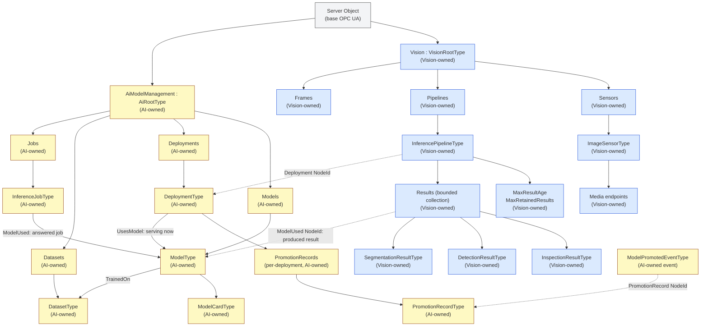

# Vision and AI Model Management Walkthrough

> These are provisional working drafts, not official OPC Foundation
> specifications. This walkthrough describes Vision 0.4.1 and AI Model
> Management and Inference 0.5.1.

The two drafts answer different questions:

| Draft | Main question |
|---|---|
| [Vision](vision/OPC-UA-Vision.md) | What produced the image, how can a client obtain it, what interpreted it, and what did the system see? |
| [AI Model Management](ai-model-management/OPC-UA-AI-Model-Management.md) | Which model and deployment performed inference, where did it run, what artifact answered, and what evidence supports using it? |

They can be implemented independently. Vision joins to AI Model Management
through plain `NodeId` Properties, so its NodeSet does not require the AI
NodeSet. A Server implementing both provides the complete browse paths below.
For mapping a result into an external store or API, see the
[external result mapping](vision-ai-external-result-mapping.md).

## Combined address-space view

Blue boxes belong to Vision. Amber boxes belong to AI Model Management. The
gray box is defined by base OPC UA. Ownership is also written in every box, so
the diagram does not depend on color.



## 1. Discover the Vision system

Start at the OPC UA `Server` Object and browse to the well-known `Vision`
Object. Its main folders are:

- `Sensors`, containing physical, simulated, or hybrid sensors;
- `Pipelines`, containing inference pipelines;
- `Frames`, containing coordinate frames used by calibration and poses.

An `ImageSensorType` publishes resolution, pixel format, exposure, gain,
acquisition rate, optics, illumination, and calibration. This is the persistent
camera description rather than a copy of camera metadata on every result.

## 2. Find the media

Vision keeps large image and video payloads outside ordinary OPC UA values by
default:

- `StreamEndpointType` describes a live stream such as RTSP;
- `ClipEndpointType` supports still-image or clip retrieval;
- image references carry a URI, timestamp, digest, dimensions, and format.

OPC UA carries meaning, discovery, and control. RTSP, HTTP, JPEG, or another
media mechanism carries the pixels. Media retention is controlled by that
media plane; it is separate from retention of result Objects described in §7.

## 3. Follow the inference pipeline

Browse `Vision/Pipelines` and select an `InferencePipelineType`. It connects a
sensor to inference state, result publication, optional feedback, and an
optional learning loop.

Its `Deployment` Property is a plain `NodeId`. Where the same Server implements
AI Model Management, it resolves to a `DeploymentType`. The dashed edge in the
diagram is this loose composition seam.

## 4. Inspect the deployment and model

The AI `DeploymentType` describes where and how inference runs:

- on the OPC UA Server, another edge device, a cloud service, or a simulator;
- current state, endpoint, observed latency, accelerator, and batching;
- fallback and version-binding behavior;
- data jurisdiction, egress, and retention policy.

Follow `UsesModel` to the `ModelType` serving now. The model carries identity
and integrity data such as `ModelId`, `Name`, `Version`, `Digest`,
`DigestAlgorithm`, and digest provenance. It can link to training datasets,
evaluation runs, model cards, and imported artifacts.

A deployment is an executable arrangement. A model is a trained artifact.

## 5. Run inference

Vision offers camera-oriented entry points:

- `RunInference` performs one acquisition and publishes a result;
- `StartContinuous` and `Stop` control repeated acquisition.

AI Model Management offers domain-neutral invocation:

- `DeploymentType.Invoke` returns a response and the `ModelUsed` that actually
  answered;
- `InvokeAsync` creates an `InferenceJobType`, which retains the same
  `ModelUsed` identity for asynchronous work.

The Vision path is convenient when input is managed by a Vision sensor. The AI
path is useful for generic inference payloads and non-vision domains.

## 6. Read the Vision result

Every `VisionResultType` has a result identifier and creation time. Optional
members connect it to the sensor, pipeline, acquisition frame, confidence,
explanation, model version, and actual model.

Concrete result types add domain meaning:

| Result | Contents |
|---|---|
| `InspectionResultType` | Verdict, measured characteristics, tolerances, units, and uncertainty |
| `DetectionResultType` | Classes, confidence, 2-D/3-D boxes, poses, coordinate frames, covariance, and tracking |
| `SegmentationResultType` | Mask image reference and ordered class names for pixel values |

Vision also defines events for prompt notification and feedback Methods for
submitting detections, inspection outcomes, corrections, or image references.

## 7. Understand result creation and retention

`InferencePipelineType.Results` is a bounded, re-readable collection rather
than an indefinite archive. Its `MaxResultAge` and `MaxRetainedResults`
settings make the limits discoverable.

The lifecycle is:

1. inference creates a concrete `VisionResultType`;
2. the Server places it below that pipeline's `Results` collection before a
   successful `RunInference` returns;
3. clients can Browse and Read it while retained;
4. age pressure evicts a result after its non-zero `MaxResultAge`, while count
   pressure evicts oldest `CreationTime` first and breaks equal timestamps by
   `ResultId` in ascending Unicode code-point order;
5. the evicted Object's NodeId returns `Bad_NodeIdUnknown`, and scoped Methods
   selecting its `ResultId` return `Bad_NotFound`.

This does not define media retention. The acquisition image or segmentation
mask may expire before or after its result Object, according to its media
service. Conversely, deleting pixels does not rewrite the typed result.

An external system that must keep a result after eviction stores the durable
pair `(Server ApplicationUri, ResultId)` and copies the needed result fields.
It may also retain the endpoint and a namespace-URI-based NodeId as a live
locator, but that locator is expected to stop resolving after eviction. See
the [external result mapping](vision-ai-external-result-mapping.md) for the
identity and locator rules.

## 8. Audit current and historical model identity

There are two similar-looking paths with different meanings:

```text
Current serving state:
pipeline.Deployment -> DeploymentType -> UsesModel -> ModelType

Historical result provenance:
result.ModelUsed -> ModelType -> Digest
```

`UsesModel` answers "which model is this deployment serving now?"
`ModelUsed` answers "which model produced this result?"

Promotion, rollback, fallback, or a moving `FollowsRef` binding can make those
answers differ. Looking only at current deployment state can therefore produce
a plausible but incorrect audit record. Vision retains the invocation-time
identity in `VisionResultType.ModelUsed`; when `ModelVersionUsed` is present it
matches the referenced model's `Version`.

## 9. Promote and roll back with a durable record

Promotion changes a deployment's `UsesModel` target. Rollback is the same
observable substitution in the other direction:

1. a candidate model reaches `Ready`, normally with a passed
   `EvaluationRunType`;
2. authorized promotion atomically changes the selected deployment or
   deployments;
3. each affected `DeploymentType` creates an immutable
   `PromotionRecordType` below its own `PromotionRecords` folder atomically
   with the successful `UsesModel` change;
4. `ModelPromotedEventType` then notifies subscribers and its
   `PromotionRecord` NodeId links to that authoritative record;
5. rollback selects an earlier model, appends another record, and raises the
   same event shape, preserving previous and new model identities.

The event is prompt notification; the record is browseable history retained
for the deployment lifetime. Failed substitutions create neither. A
per-invocation fallback that leaves `UsesModel` unchanged creates neither;
its actual model is captured by `ModelUsed`. Promotion versus rollback follows
the record's `ChangeKind`, not an inferred ordering of version strings.
Per-deployment ownership avoids turning a multi-deployment promotion into one
ambiguous global history.

## 10. Keep the transport boundary explicit

Neither draft defines an MQTT observation envelope, broker topic layout,
replay or idempotency scheme, recording-evidence status, or cross-source
correlation policy. Neither defines recommendations, withheld setpoints,
actuation authority, or functional-safety behavior.

Those are contracts above or beside these information models. The
[external result mapping](vision-ai-external-result-mapping.md) is similarly
transport-neutral: it maps meanings and identities without creating a new
wire protocol or conformance profile.

## Ownership summary

| Concern | Owner |
|---|---|
| Sensors, media, calibration, frames | Vision |
| Pipelines, bounded result retention, and typed results | Vision |
| Result-to-producing-model link | Vision member using AI `ModelUsed` semantics |
| Models, deployments, invocation, and asynchronous jobs | AI Model Management |
| Per-deployment promotion records and promotion events | AI Model Management |
| Digests, model cards, evaluations, and model lineage | AI Model Management |
| OPC UA Sessions, Browse, Read, Call, subscriptions | Base OPC UA |
