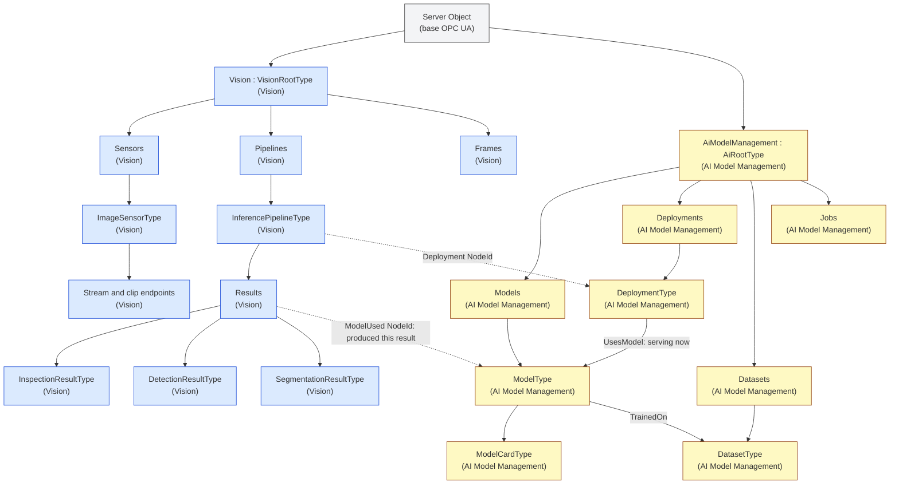

# Vision and AI Model Management Walkthrough

> These are provisional working drafts, not official OPC Foundation
> specifications. This walkthrough describes Vision 0.4.1 and AI Model
> Management and Inference 0.5.0.

The two drafts answer different questions:

| Draft | Main question |
|---|---|
| [Vision](vision/OPC-UA-Vision.md) | What produced the image, how can a client obtain it, what interpreted it, and what did the system see? |
| [AI Model Management](ai-model-management/OPC-UA-AI-Model-Management.md) | Which model and deployment performed inference, where did it run, what artifact answered, and what evidence supports using it? |

They can be implemented independently. Vision joins to AI Model Management
through plain `NodeId` Properties, so its NodeSet does not require the AI
NodeSet. A server that implements both provides a complete browse path.

## Combined address-space view

Blue boxes belong to Vision. Amber boxes belong to AI Model Management. The
gray box is defined by base OPC UA. The colors are only a visual aid; each box
also names its specification or type.



## 1. Discover the Vision system

Start at the OPC UA `Server` Object and browse to the well-known `Vision`
Object. Its main folders are:

- `Sensors`, containing physical, simulated, or hybrid sensors;
- `Pipelines`, containing inference pipelines;
- `Frames`, containing coordinate frames used by calibration and poses.

An `ImageSensorType` publishes camera properties such as resolution, pixel
format, exposure, gain, acquisition rate, optics, illumination, and
calibration. This is the persistent description of the camera rather than a
copy of camera metadata on every result.

## 2. Find the media

Vision keeps large image and video payloads outside ordinary OPC UA values by
default:

- `StreamEndpointType` describes a live stream such as RTSP;
- `ClipEndpointType` supports still-image or clip retrieval;
- image references carry a URI, timestamp, digest, dimensions, and format.

In simple terms, OPC UA carries meaning, discovery, and control. RTSP, JPEG,
or another media mechanism carries the pixels.

## 3. Follow the inference pipeline

Browse `Vision/Pipelines` and select an `InferencePipelineType`. It connects a
sensor to inference state, result publication, optional feedback, and an
optional learning loop.

Its `Deployment` Property is a plain `NodeId`. Where the same server also
implements AI Model Management, that NodeId resolves to a `DeploymentType`.
The dashed edge in the diagram represents this loose composition seam.

## 4. Inspect the deployment and model

The AI `DeploymentType` describes where and how inference runs:

- on the OPC UA server, another edge device, a cloud service, or a simulator;
- current state, endpoint, observed latency, accelerator, and batching;
- fallback and version-binding behavior;
- data jurisdiction, egress, and retention policy.

Follow `UsesModel` to the `ModelType` serving now. The model carries identity
and integrity data such as `ModelId`, `Name`, `Version`, `Digest`,
`DigestAlgorithm`, and digest provenance. It can also link to training
datasets, evaluation runs, model cards, and imported artifacts.

A deployment is the executable arrangement. A model is the trained artifact.

## 5. Run inference

Vision offers camera-oriented entry points:

- `RunInference` performs one acquisition and publishes a result;
- `StartContinuous` and `Stop` control repeated acquisition.

AI Model Management offers domain-neutral invocation:

- `DeploymentType.Invoke` returns a response and the `ModelUsed` that actually
  answered;
- `InvokeAsync` creates an `InferenceJobType`, which retains the same
  `ModelUsed` identity for asynchronous work.

The Vision path is convenient when the input is already managed by a Vision
sensor. The AI path is useful for generic inference payloads and non-vision
domains.

## 6. Read the Vision result

Every `VisionResultType` has a result identifier and creation time. Optional
members connect it to the sensor, pipeline, frame, confidence, explanation,
model version, and model that produced it.

Concrete result types add domain meaning:

| Result | Contents |
|---|---|
| `InspectionResultType` | Verdict, measured characteristics, tolerances, units, and uncertainty |
| `DetectionResultType` | Classes, confidence, 2D/3D boxes, poses, coordinate frames, covariance, and tracking |
| `SegmentationResultType` | Mask image reference and class names for pixel values |

Vision also defines events for prompt notification and feedback Methods for
submitting detections, inspection outcomes, corrections, or image references.

## 7. Audit the model that produced a result

There are two similar-looking paths with different meanings:

```text
Current serving state:
pipeline.Deployment -> DeploymentType -> UsesModel -> ModelType

Historical result provenance:
result.ModelUsed -> ModelType -> Digest
```

`UsesModel` answers "which model is this deployment serving now?"
`ModelUsed` answers "which model produced this retained result?"

The distinction matters because promotion can replace the deployment's model,
a `FollowsRef` binding can move to another version, and fallback can route one
call through a different deployment without changing the primary
deployment's `UsesModel` reference. Looking only at the current deployment can
therefore produce a plausible but incorrect audit record.

Vision 0.4.1 persists the invocation-time identity as
`VisionResultType.ModelUsed`. A client auditing a result follows that NodeId to
`ModelType`, verifies its `Digest`, and can continue to its dataset, model
card, evaluation, import provenance, and promotion history. When
`ModelVersionUsed` is also present, it matches the referenced
`ModelType.Version`.

## Ownership summary

| Concern | Owner |
|---|---|
| Sensors, media, calibration, frames | Vision |
| Pipelines and typed vision results | Vision |
| Result-to-producing-model link | Vision member using AI `ModelUsed` semantics |
| Models, deployments, invocation, and jobs | AI Model Management |
| Digests, model cards, evaluations, promotion | AI Model Management |
| OPC UA Sessions, Browse, Read, Call, subscriptions | Base OPC UA |

Neither draft defines an MQTT observation envelope, replay keys, cross-source
correlation policy, advisory recommendations, or machine actuation authority.
Those remain responsibilities of integration and control-system contracts
layered above these information models.
